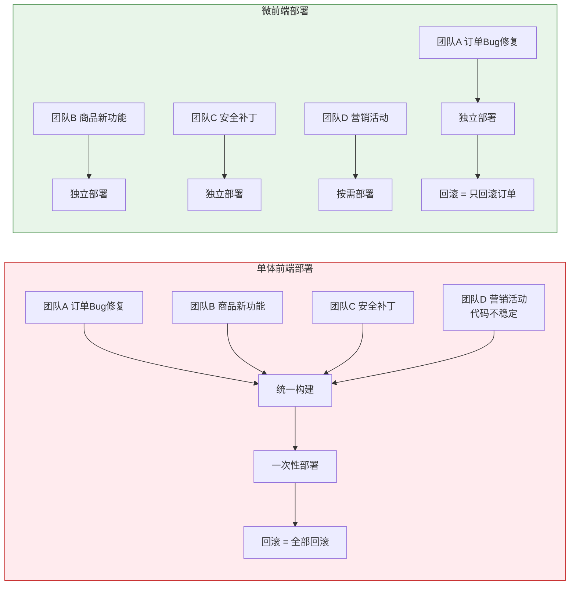
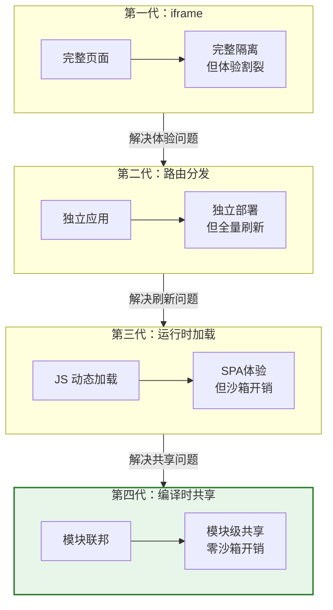

<div v-pre>

# 第1章 为什么需要微前端

> "前端的复杂度从来不在代码量——在于让不同的人、以不同的速度、修改同一个产品。"

> **本章要点**
> - 从五个递进的痛点理解单体前端架构面临的核心挑战
> - 理解微前端不是银弹：明确什么时候不该用微前端
> - 追溯微前端的演进史：从 iframe 到运行时加载再到编译时共享
> - 掌握 2026 年微前端技术版图中六大方案的定位与适用场景
> - 理解本书的独特价值与最佳阅读路线

## 1.1 单体前端的五大痛点

想象你是一家电商公司的前端负责人。你的团队维护着一个 React 应用——最初只有三个页面：首页、商品详情、购物车。两个前端工程师，半年搭起来的。那时候一切都很美好。

三年过去了。

现在这个应用有 200+ 个页面，15 个前端工程师分属 4 个业务团队，代码量超过 80 万行。每次 `npm run build` 需要等 12 分钟。CI/CD 流水线从提交到部署平均 45 分钟。上线窗口只在每周三晚上——因为谁也不敢在工作日白天部署，上次小王改了一行 CSS 导致全站白屏的惨剧还历历在目。

如果这个场景让你感到一丝共鸣——好。因为这不是假设性思考题，而是**此刻全球数万个前端团队正在经历的日常**。读完这一章，你会明白为什么这些问题的根源不在代码质量，而在**架构选择**——以及微前端如何从根源上改变游戏规则。

### 1.1.1 痛点一：构建速度的崩溃

一个 80 万行的 React 应用，Webpack 的构建时间随代码量**近似线性增长**。但问题远不止"等得久"这么简单。

```typescript
// 一个典型的单体前端项目结构
src/
├── modules/
│   ├── order/          // 订单模块 - 团队 A 维护
│   │   ├── pages/      // 47 个页面
│   │   ├── components/ // 120+ 组件
│   │   └── services/   // 30+ API 调用
│   ├── product/        // 商品模块 - 团队 B 维护
│   │   ├── pages/      // 35 个页面
│   │   └── ...
│   ├── user/           // 用户模块 - 团队 C 维护
│   └── marketing/      // 营销模块 - 团队 D 维护
├── shared/             // 公共组件 - 谁改都怕
│   ├── components/     // 200+ 公共组件
│   └── utils/          // 天知道谁在用
└── package.json        // 387 个依赖
```

团队 A 只改了订单模块的一个按钮颜色，但整个项目需要重新构建。为什么？因为 Webpack 无法确定这个改动是否影响了其他模块——`shared/` 里的公共组件可能被任何地方引用。

构建时间的问题会产生**涟漪效应**：

1. **开发体验恶化**：Hot Module Replacement（HMR）从秒级退化到 10 秒以上，开发者的心流被频繁打断
2. **CI/CD 瓶颈**：4 个团队每天提交 20+ 次 PR，每次 CI 构建 12 分钟，流水线排队成为常态
3. **反馈延迟**：从"发现 bug"到"修复上线"的周期被拉长，用户体验受损
4. **资源浪费**：CI 服务器大部分时间在构建与当前变更无关的代码

```typescript
// 构建时间与项目规模的关系（示意）
interface BuildMetrics {
  codeLines: number;      // 代码行数
  buildTimeMs: number;    // 构建时间（毫秒）
  hmrTimeMs: number;      // HMR 更新时间
  ciQueueMinutes: number; // CI 排队时间
}

// 真实数据观察
const metricsOverTime: BuildMetrics[] = [
  { codeLines: 50_000,  buildTimeMs: 30_000,  hmrTimeMs: 800,    ciQueueMinutes: 2 },
  { codeLines: 200_000, buildTimeMs: 120_000, hmrTimeMs: 3_000,  ciQueueMinutes: 8 },
  { codeLines: 500_000, buildTimeMs: 360_000, hmrTimeMs: 8_000,  ciQueueMinutes: 20 },
  { codeLines: 800_000, buildTimeMs: 720_000, hmrTimeMs: 15_000, ciQueueMinutes: 35 },
];
// 代码量翻 16 倍，构建时间翻 24 倍——超线性增长
```

> 💡 **最佳实践**：如果你的项目构建时间已经超过 5 分钟，在考虑微前端之前，先尝试以下低成本优化：1）升级到 Rspack 或 esbuild（可能直接解决问题）；2）配置 Webpack 的 `cache.type: 'filesystem'`；3）使用 `thread-loader` 并行编译。如果这些优化后构建时间仍然无法接受，再考虑架构级方案。

### 1.1.2 痛点二：部署耦合的恐惧

更致命的不是构建慢，而是**部署耦合**。

在单体前端中，所有模块编译为一个产物（通常是一组 JS/CSS bundle）。这意味着：

- 团队 A 修了订单页面的一个 bug，需要和团队 B 正在开发的商品页面新功能一起上线
- 团队 C 的用户模块出了紧急安全漏洞，但团队 D 正在做营销活动页的大改动，代码还没稳定
- 任何团队的代码出问题，**整个应用需要回滚**



部署耦合带来的不仅是技术问题，更是**组织效率问题**。当四个团队的发布节奏被绑定在一起，最慢的那个团队决定了所有人的上线速度。这就是经典的"最慢者决定论"——如同一支车队只能以最慢那辆车的速度前进。

### 1.1.3 痛点三：技术债的雪球效应

单体前端的第三个痛点，是技术债务的**不可控累积**。

```typescript
// 2020 年：项目启动，React 16 + Ant Design 3
// package.json
{
  "dependencies": {
    "react": "^16.14.0",
    "antd": "^3.26.0"
  }
}

// 2023 年：React 18 发布一年了，但谁敢升？
// 升级 React 意味着：
// 1. 200+ 个组件需要检查 concurrent mode 兼容性
// 2. antd 3 → antd 5 是 breaking change
// 3. 所有第三方库的版本兼容性需要验证
// 4. 一次升级 = 一次全量回归测试
// 5. 任何模块出问题 = 全部回滚

// 结果：没人敢碰。React 16 用到 2025 年。
```

在微前端架构下，每个子应用可以独立选择技术栈和版本：

```typescript
// 微前端下的技术栈自由
const microApps = [
  { name: 'order',     framework: 'React 18', ui: 'Ant Design 5' },
  { name: 'product',   framework: 'Vue 3',    ui: 'Element Plus' },
  { name: 'user',      framework: 'React 16', ui: 'Ant Design 3' },  // 旧应用，按计划迁移
  { name: 'marketing', framework: 'Svelte',   ui: 'Custom' },         // 新团队的选择
];
// 每个子应用独立升级，互不影响
```

这不是鼓励技术栈分裂——相反，它为**渐进式迁移**提供了可能。你不需要"大爆炸式"地一次性升级整个系统，而是可以从一个子应用开始，验证通过后逐步推广。

### 1.1.4 痛点四：团队瓶颈与代码所有权

当 15 个工程师同时修改同一个代码仓库，**merge conflict** 成为每日噩梦。更严重的是——`shared/` 目录下的公共组件，谁有权修改？

```typescript
// shared/components/Button.tsx
// 这个组件被 47 个地方使用
// 团队 A 想加一个 loading 状态
// 团队 B 想改默认颜色
// 团队 C 说现在的 API 有 bug
// 但没有人敢动——因为改了可能影响其他 46 个使用方

export const Button: React.FC<ButtonProps> = ({
  children,
  onClick,
  type = 'primary',
  // ...已经有 23 个 props 了，每加一个都要向后兼容
}) => {
  // 300 行代码，充满了 if-else 分支
  // 一半是为了兼容不同团队的定制需求
  // 另一半是没人敢删的历史遗留逻辑
};
```

Conway 定律告诉我们：**组织的沟通结构决定了系统的架构形态。** 反过来也成立——糟糕的系统架构会反过来制约组织的效率。单体前端迫使所有团队在同一个代码库中协作，而微前端让每个团队拥有自己的代码仓库、自己的构建流程、自己的部署节奏。

> 🔥 **深度洞察：Conway 定律的逆向应用**
>
> 多数人知道 Conway 定律："设计系统的架构，会映射组织的沟通结构。"但很少有人意识到它的逆向形态同样强大：**你可以通过改变系统架构来影响组织行为。** 微前端的真正价值不在技术层面的解耦——在于它为每个团队创造了独立演进的*空间*。当团队 A 不再因为团队 B 的代码变更而被阻塞，当团队 C 可以自由选择最适合其业务场景的技术方案，**组织的创新速度会发生质变。** 这就是为什么本书反复强调：微前端的本质不是"拆前端"，是"让不同团队以不同速度独立演进"。

### 1.1.5 痛点五：升级困难与框架锁定

最后一个痛点，也许是最容易被忽视的：**框架锁定**。

2019 年你选择了 Angular 8 搭建企业后台。2025 年 Angular 已经迭代到 17，框架的心智模型和 API 发生了巨大变化。但你的 Angular 8 应用有 50 万行代码——升级的成本高得惊人，不升级又意味着越来越难招到愿意维护旧版本的工程师。

在微前端架构下，这个问题有了一个优雅的解法：**新功能用新技术栈开发，旧功能按计划逐步迁移，两者在同一个产品中和平共处。**

```typescript
// 渐进式迁移策略
const migrationPlan = {
  phase1: {
    duration: '第 1-2 月',
    action: '新模块用 React 18 开发，作为独立子应用接入',
    risk: '低',
  },
  phase2: {
    duration: '第 3-6 月',
    action: '将改动频繁的旧模块逐个迁移为独立子应用',
    risk: '中等',
  },
  phase3: {
    duration: '第 7-12 月',
    action: '稳定模块按优先级迁移，主应用壳逐步瘦身',
    risk: '可控',
  },
  endState: '所有子应用独立部署，主应用只剩导航和布局壳',
};
```

### 1.1.6 共同特征

五个痛点有一个共同特征：**它们都不是代码质量问题。** 你的团队写的代码可能很优秀，单测覆盖率可能很高，Code Review 流程可能很严格。但当项目规模超过某个临界点，**单体架构本身**就成了瓶颈。

就像一条高速公路——路面质量再好，车道数不够就是会堵车。你需要的不是更好的路面，而是**更多的车道**。

微前端，正是为前端架构增加车道的方案。

> 💡 **最佳实践**：在决定引入微前端之前，先评估你的项目是否真的到了"痛点临界点"。一般来说，当同时满足以下两个条件时，微前端的收益才会明显超过成本：1）3 个以上团队同时维护同一个前端应用；2）构建时间超过 5 分钟且常规优化手段已用尽。如果只是"项目有点大"，可能还不需要微前端。

## 1.2 微前端不是银弹

写完了痛点，必须立刻泼一盆冷水。

**微前端不是免费的午餐。** 它引入了新的复杂度层：

```typescript
// 微前端引入的额外成本
interface MicroFrontendCost {
  // 技术复杂度
  sandboxOverhead: '额外的 JS/CSS 隔离运行时开销';
  communicationComplexity: '子应用间通信比模块间调用更复杂';
  sharedDependencies: '公共依赖的版本管理变得棘手';
  debuggingDifficulty: '跨应用问题的调试链路更长';

  // 工程复杂度
  cicdPipeline: '需要管理多个构建流水线';
  versionMatrix: '多个子应用的版本兼容性矩阵';
  monitoringScope: '监控和日志需要关联跨应用上下文';

  // 性能开销
  extraBundleSize: '框架本身的运行时体积（乾坤约 50KB gzipped）';
  additionalRequests: '每个子应用的资源需要额外的 HTTP 请求';
  sandboxPerformance: 'Proxy 沙箱在高频属性访问场景下的开销';
}
```

**以下场景不建议使用微前端：**

1. **小团队（≤5人）维护的中小型应用**——微前端的管理成本会超过收益
2. **强实时交互的应用**（如在线文档编辑器、游戏）——跨沙箱通信的延迟不可接受
3. **SEO 要求极高的内容站**——微前端的 SSR 方案复杂度远高于单体 SSR
4. **刚起步的新项目**——过早引入微前端是典型的"过度工程"

> 🔥 **深度洞察：微前端的成本-收益方程**
>
> 微前端的收益随团队规模和项目规模**非线性增长**，而成本相对固定。当团队规模从 5 人增长到 50 人，微前端的收益可能增长 20 倍（因为组织协调成本是 N² 增长的），但技术成本只增长 2-3 倍。这就是为什么大厂几乎都在用微前端，而中小团队往往得不偿失——**不是技术不好，是你的组织规模还没达到临界点。**

## 1.3 微前端的演进史

微前端不是突然冒出来的。它经历了四次范式跃迁，每一次都是对上一代方案局限性的回应。

### 1.3.1 第一代：iframe 时代

最原始、最简单的微前端方案。用 `<iframe>` 嵌入子应用，天然隔离。

```html
<!-- 主应用 -->
<nav>全局导航</nav>
<main>
  <iframe src="https://order.example.com"
          style="width:100%;height:calc(100vh - 60px);border:none;">
  </iframe>
</main>
```

**优势**：
- 完美的 JS/CSS 隔离（浏览器级别）
- 实现零成本
- 技术栈完全无关

**致命缺陷**：
- 性能差：每个 iframe 是一个完整的浏览器上下文
- 体验割裂：弹窗无法突破 iframe 边界、滚动条双重嵌套
- 路由无法同步：浏览器前进/后退按钮失效
- 通信笨重：只能通过 `postMessage` 传递序列化数据

```typescript
// iframe 通信的痛苦
// 主应用
window.addEventListener('message', (event) => {
  if (event.origin !== 'https://order.example.com') return;
  // 无类型安全、无协议约束、debug 困难
  const { type, payload } = JSON.parse(event.data);
  if (type === 'ORDER_CREATED') {
    updateOrderCount(payload.count);
  }
});

// 子应用
parent.postMessage(
  JSON.stringify({ type: 'ORDER_CREATED', payload: { count: 42 } }),
  'https://main.example.com'
);
```

### 1.3.2 第二代：路由分发时代

Nginx 层面的路由分发，不同 URL 路径指向不同的独立前端应用。

```nginx
# Nginx 配置
server {
    location /order/ {
        proxy_pass http://order-app:3001/;
    }
    location /product/ {
        proxy_pass http://product-app:3002/;
    }
    location / {
        proxy_pass http://main-app:3000/;
    }
}
```

**优势**：完全独立部署、技术栈无关。

**致命缺陷**：页面切换时**全量刷新**。从订单页跳转到商品页，用户看到的是白屏-加载-渲染的完整过程。共享状态（登录信息、购物车）需要通过 Cookie/LocalStorage 传递。

### 1.3.3 第三代：运行时加载时代

**single-spa（2018）** 和 **乾坤（2019）** 开创了这个时代。核心理念：在同一个页面内，通过 JavaScript 动态加载、挂载和卸载子应用。

```typescript
// single-spa 的核心思想
import { registerApplication, start } from 'single-spa';

registerApplication({
  name: 'order-app',
  app: () => import('https://cdn.example.com/order/main.js'),
  activeWhen: '/order',
});

registerApplication({
  name: 'product-app',
  app: () => import('https://cdn.example.com/product/main.js'),
  activeWhen: '/product',
});

start();
// 路由变化时，single-spa 自动加载/卸载对应的子应用
// 没有页面刷新——真正的 SPA 体验
```

乾坤在 single-spa 之上增加了两个关键能力：**HTML Entry**（直接加载子应用的 HTML 文件，自动解析资源）和 **JS/CSS 沙箱**（防止全局污染）。

**优势**：SPA 级别的用户体验、不刷新页面切换子应用、JS/CSS 隔离。

**局限**：
- 沙箱有性能开销和隔离边界（后面的章节会深入分析）
- 子应用仍然需要独立打包为完整的应用
- 公共依赖无法在编译时共享，只能运行时约定

### 1.3.4 第四代：编译时共享时代

**Module Federation（2020–）** 开创了全新的范式。它不在运行时加载"应用"，而是在运行时共享"模块"。

```typescript
// webpack.config.js - 订单应用
const { ModuleFederationPlugin } = require('webpack').container;

module.exports = {
  plugins: [
    new ModuleFederationPlugin({
      name: 'orderApp',
      filename: 'remoteEntry.js',
      exposes: {
        './OrderList': './src/components/OrderList',
        './OrderDetail': './src/components/OrderDetail',
      },
      shared: {
        react: { singleton: true, requiredVersion: '^18.0.0' },
        'react-dom': { singleton: true, requiredVersion: '^18.0.0' },
      },
    }),
  ],
};

// 商品应用直接引用订单应用的组件
// 就像引用本地模块一样自然
import OrderList from 'orderApp/OrderList';
```

**核心区别**：乾坤/single-spa 的粒度是"应用"，Module Federation 的粒度是"模块"。这是一个根本性的范式转变——你不再需要加载一个完整的子应用来使用其中的一个组件。



## 1.4 2026 年微前端技术版图

经过十年演进，2026 年的微前端领域已经形成了清晰的六大方案格局：

| 方案 | 代表框架 | 核心机制 | 隔离策略 | 共享粒度 | 最佳场景 |
|------|---------|---------|---------|---------|---------|
| **运行时沙箱** | 乾坤 | JS 动态加载 + Proxy 沙箱 | 运行时 Proxy/快照 | 应用级 | 存量大型项目迁移 |
| **路由驱动** | single-spa | 路由拦截 + 生命周期 | 无内建隔离 | 应用级 | 简单的路由级拆分 |
| **模块联邦** | Module Federation 2.0 | 编译时模块共享 | 不需要（独立构建） | 模块级 | 新项目、跨团队组件共享 |
| **Web Components** | Lit, Stencil | 浏览器原生 | Shadow DOM | 组件级 | 跨框架组件库 |
| **iframe 增强** | Wujie | iframe + WebComponent + Proxy | iframe 天然隔离 | 应用级 | 需要完美隔离的场景 |
| **构建工具原生** | Rspack + MF | Rust 编译 + 模块联邦 | 编译时隔离 | 模块级 | 高性能要求的新项目 |

**两个关键趋势**：

**趋势一：从"运行时隔离"到"编译时共享"。** 乾坤代表的运行时方案需要在浏览器中构建沙箱来隔离子应用，这引入了不可避免的性能开销和隔离边界。Module Federation 的编译时方案从根源上避免了这些问题——模块在构建时就完成了依赖协商和版本对齐，运行时无需额外隔离。

**趋势二：从"框架级方案"到"基础设施级方案"。** 早期微前端方案（single-spa、乾坤）是前端框架层面的解决方案。Module Federation 2.0 和 Rspack 则是构建工具层面的基础设施——它们不关心你用 React 还是 Vue，不关心你是不是在做微前端，只关心如何在不同构建产物之间高效共享模块。微前端只是它们的应用场景之一。

> 🔥 **深度洞察：微前端的本质是什么**
>
> 回顾十年演进，微前端的核心问题域可以归结为一句话：**如何让多个独立构建、独立部署的前端应用，在同一个用户界面中无缝协作？** 所有方案都是对这个问题的不同回答——iframe 说"给每个应用一个独立的浏览器上下文"，single-spa 说"用路由来切换应用"，乾坤说"用沙箱来隔离应用"，Module Federation 说"别隔离了，直接共享模块"。没有哪个回答放之四海皆准——每一个都在隔离性、性能、开发体验、维护成本之间做了不同的取舍。理解这些取舍，比"选一个最好的框架"重要得多。

## 1.5 本书的独特价值与阅读路线

### 1.5.1 本书的定位

市面上关于微前端的内容大致分为四类：

| 类别 | 典型内容 | 读完之后你会… |
|------|---------|---------------|
| **博客文章** | 某个框架的快速上手、踩坑记录、配置示例 | 知道怎么用，但不知道为什么这样设计 |
| **概念介绍书** | 微前端是什么、有哪些方案、架构图、决策树 | 能做技术选型，但遇到深层问题无从下手 |
| **单框架源码解读** | 逐行分析某一个框架的实现 | 深入理解了一个框架，但缺乏横向视野 |
| **本书** | 从源码层面横向剖析多个框架，揭示共性问题域与不同解法 | 理解微前端**为什么**这样演化，能独立评估任何方案 |

### 1.5.2 全书结构

全书分为六个部分，共 18 章：

**第一部分：微前端的本质（第 1-2 章）**
- 第 1 章（本章）：为什么需要微前端——痛点、演进与全景
- 第 2 章：微前端核心问题域——六大核心问题的系统化分析

**第二部分：运行时隔离方案——乾坤（第 3-6 章）**
- 第 3 章：乾坤架构总览
- 第 4 章：JS 沙箱机制深度剖析（重点章节）
- 第 5 章：CSS 隔离与资源加载
- 第 6 章：乾坤的应用间通信

**第三部分：路由驱动方案——single-spa（第 7-8 章）**
- 第 7 章：single-spa 核心机制
- 第 8 章：single-spa 的路由拦截

**第四部分：编译时共享方案——Module Federation（第 9-11 章）**
- 第 9 章：Module Federation 设计哲学（重点章节）
- 第 10 章：Webpack 5 Module Federation 源码
- 第 11 章：Module Federation 2.0 与 Rspack

**第五部分：其他方案与前沿（第 12-14 章）**
- 第 12 章：Web Components 与微前端
- 第 13 章：iframe 的复兴——Wujie 与新一代方案
- 第 14 章：其他前沿方案

**第六部分：工程实践（第 15-18 章）**
- 第 15 章：微前端选型决策框架
- 第 16 章：微前端的 DevOps 与工程化
- 第 17 章：微前端性能工程
- 第 18 章：设计模式与架构决策

### 1.5.3 阅读路线

| 路径 | 章节 | 适合 |
|------|------|------|
| **快速精华** | 前言 → 1 → 4 → 9 → 15 | 时间有限，2-3 小时获取核心架构洞察 |
| **乾坤深入** | 1 → 2 → 3 → 4 → 5 → 6 | 生产环境使用乾坤，想吃透每个细节 |
| **MF 专攻** | 1 → 2 → 9 → 10 → 11 | 新项目选型，重点评估 Module Federation |
| **架构决策** | 1 → 2 → 15 → 17 → 18 | 架构师/技术管理者，关注选型与权衡 |
| **全景通读** | 按顺序从第 1 章读到最后 | 系统性学习者，建立完整知识体系 |

### 1.5.4 源码版本约定

| 框架 | 版本 | 说明 |
|------|------|------|
| **乾坤 (qiankun)** | 2.x | 当前生产环境最广泛使用的版本 |
| **single-spa** | 6.x | 微前端基座的事实标准 |
| **Module Federation** | 2.0 | 跨构建工具的统一模块联邦 |
| **Rspack** | 1.x | 高性能构建工具 |
| **Wujie** | latest | 新一代 iframe 增强方案 |

## 1.6 术语表

| 术语 | 英文 | 定义 |
|------|------|------|
| **微前端** | Micro Frontends | 将前端应用拆分为多个独立构建、独立部署的小型应用的架构模式 |
| **主应用/基座** | Host / Shell | 微前端架构中的容器应用，负责路由分发、子应用加载和全局布局 |
| **子应用/微应用** | Micro App | 被主应用加载和管理的独立前端应用 |
| **沙箱** | Sandbox | 为子应用提供隔离运行环境的机制，防止全局变量和样式污染 |
| **HTML Entry** | HTML Entry | 乾坤的子应用加载方式，直接获取子应用的 HTML 并解析其中的资源 |
| **JS Entry** | JS Entry | single-spa 的子应用加载方式，通过 JS 入口文件加载子应用 |
| **Module Federation** | Module Federation | Webpack 5 引入的模块联邦机制，支持跨构建产物的运行时模块共享 |
| **生命周期** | Lifecycle | 子应用从加载到卸载的完整过程：bootstrap → mount → unmount |
| **路由拦截** | Route Hijacking | 拦截浏览器路由事件以实现子应用的自动切换 |
| **Shadow DOM** | Shadow DOM | Web Components 标准中的影子 DOM，提供浏览器原生的 DOM/CSS 隔离 |
| **Proxy 沙箱** | Proxy Sandbox | 使用 ES6 Proxy 拦截全局对象访问实现的 JS 隔离机制 |
| **快照沙箱** | Snapshot Sandbox | 通过保存和恢复全局状态快照实现的 JS 隔离机制 |

---

还记得开头那个 15 人团队的噩梦吗？构建慢、部署耦合、技术债堆积、团队瓶颈、框架锁定——这五个痛点是无数前端团队的真实写照。微前端不是解决所有问题的灵丹妙药，但当你的组织规模和项目复杂度到达临界点时，它是目前已知的最系统化的架构级解法。

下一章，我们将深入微前端的六大核心问题域——JS 隔离、CSS 隔离、应用加载、应用通信、路由管理、依赖共享。这些问题是所有微前端方案的共同战场，理解问题本身比理解任何一个框架都重要。

## 本章小结

- 单体前端的五大痛点——构建慢、部署耦合、技术债、团队瓶颈、升级困难——本质上是**架构约束**而非代码质量问题
- 微前端不是银弹：小团队、强交互应用、SEO 密集场景不适合使用
- 微前端经历了四代演进：iframe → 路由分发 → 运行时加载（single-spa/乾坤） → 编译时共享（Module Federation）
- 2026 年六大方案并存，两个关键趋势：从运行时隔离到编译时共享，从框架级方案到基础设施级方案
- 微前端的本质不是"拆前端"，是"让不同团队以不同速度独立演进"

## 思考题

1. **概念理解**：本章提出"微前端的本质不是拆前端，是让不同团队以不同速度独立演进"。请结合 Conway 定律，分析为什么微前端更像是一个组织问题而非纯技术问题。

2. **实践应用**：你所在的团队有 8 名前端工程师，维护一个 30 万行的 Vue 3 单体应用，构建时间约 8 分钟。请评估是否应该引入微前端，并说明你的判断依据。

3. **方案对比**：运行时隔离（乾坤）和编译时共享（Module Federation）是两种根本不同的微前端思路。请分析它们各自的优势场景和局限性，以及什么条件下应该选择哪种方案。

4. **开放讨论**：如果浏览器原生支持了完美的模块隔离和共享机制（比如增强版的 Import Maps + Shadow DOM），传统的微前端框架是否会变得不再必要？请说明你的理由。

5. **延伸思考**：微前端的四代演进中，每一代都是对上一代局限性的回应。你认为第五代微前端会是什么样的？解决什么问题？


</div>
