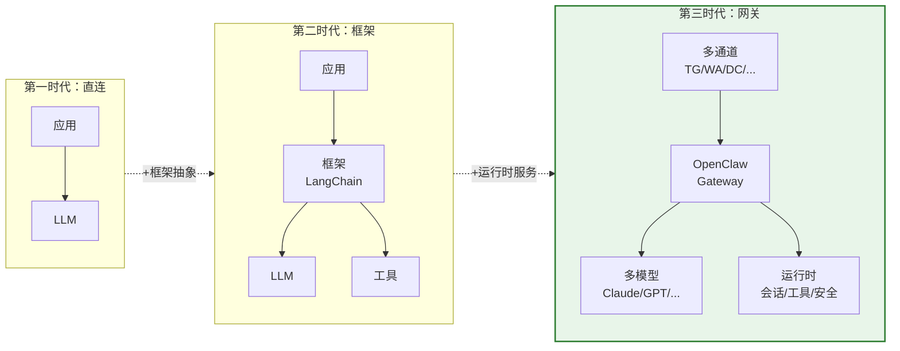

# 第1章 为什么需要 OpenClaw

> "AI Agent 的瓶颈从来不在智能，而在管道。"

> **本章要点**
> - 从四个递进的噩梦理解 AI Agent 系统面临的核心挑战
> - 追溯 AI Agent 架构的三个演化时代：脚本、框架、运行时
> - 理解 OpenClaw 的五大设计哲学：通道无关、模型无关、运行时而非框架、约定优于配置、渐进式复杂度
> - 掌握 OpenClaw 在业界方案中的独特定位


## 1.1 四个递进的噩梦

想象你是一家跨国创业公司的技术负责人。你决定让 AI 真正为公司干活——不是那种"帮我润色一下邮件"的玩具用法，而是一个 7×24 在线的数字员工：回答客户问题、监控服务器、审查代码、每天早上自动发出业务简报。

如果这个场景让你感到一丝紧迫感——好。因为这不是假设性思考题，而是**此刻全球数千个技术团队正在踩的坑**。读完这一章，你会明白为什么 90% 的 AI Agent 项目死在"模型之外"的问题上——以及如何从根源上避免它。

你从最简单的方案入手。

### 1.1.1 噩梦一：通道地狱

30 行 Python，一个 Telegram Bot，接上 OpenAI API。MVP 两小时跑通，感觉良好。

然后巴西客户说："我们只用 WhatsApp。"你研究 WhatsApp Business API——Webhook 注册、消息模板审核、端到端加密握手，和 Telegram 的长轮询模式完全不同。你硬着头皮写了 200 行适配代码。接下来，Discord 社区也要接入——又是一套全新的 Gateway、Intents、Slash Commands 体系。

三个通道的适配代码加起来，已经**超过了 Agent 核心逻辑本身**。而且这不是结束——Slack 需要 Events API 加 Socket Mode，飞书需要事件订阅加消息卡片，每个平台的消息格式、认证方式、速率限制、多媒体处理都各不相同。

你意识到你需要的不是更多的适配代码，而是一层**通道抽象**。

> **关键概念：通道抽象（Channel Abstraction）**
> 通道抽象是将不同消息平台（Telegram、WhatsApp、Discord 等）的协议差异封装在统一接口之后的架构模式。Agent 核心逻辑只需面对一个标准化的消息格式，无需关心底层平台的认证方式、消息结构或速率限制。

### 1.1.2 噩梦二：模型困境

凌晨三点，Claude Opus 遭遇速率限制。你的所有通道同时哑火——Telegram 不响应，WhatsApp 超时，Discord 显示 typing 但永远不回复。你手忙脚乱地把 API Key 换成 GPT-4 的……然后发现对话上下文全丢了。用户看到的是一个失忆的 Agent。

更深层的问题是：没有一个 LLM 在所有场景中都是最优解。Claude 擅长长文推理，GPT 在工具调用场景更稳定，Gemini 的多模态理解独具优势，DeepSeek 的性价比无可匹敌，开源模型在隐私敏感场景下不可替代。你需要的不是选一个"最好的"模型，而是一套**模型调度基础设施**——自动降级、密钥轮转、上下文迁移。

你意识到你需要的不是更多的 API 适配器，而是一层**Provider 抽象**。

> **关键概念：Provider 抽象（Provider Abstraction）**
> Provider 抽象将不同 LLM 供应商（Anthropic、OpenAI、Google 等）的 API 差异屏蔽在统一接口之后，并提供自动降级、密钥轮转和上下文迁移能力。系统不再依赖单一模型，而是将模型视为可替换的资源。

### 1.1.3 噩梦三：失忆症

你的 Agent 跑了一周，用户开始抱怨："我上午跟它说过的事情，下午它就忘了。"因为上下文窗口只有 200K token，而一天的工作对话轻松超过这个限制。你尝试简单截断——最早的消息直接丢弃——结果 Agent 忘记了用户的身份偏好和关键的项目上下文。

跨通道的场景更糟糕：用户在 Telegram 上汇报了一个 bug，然后在 Discord 上问"那个 bug 修了吗？"——你的 Agent 茫然以对，因为两个通道的会话完全隔离。

你意识到你需要的不是更大的上下文窗口，而是一套**会话管理与上下文压缩系统**。

### 1.1.4 噩梦四：安全事故

周一早上，你看到告警：Agent 在凌晨执行了 `rm -rf /data`。原因是有人在群聊里输入了一段精心构造的提示词——Agent 把它当成了合法指令。你的数据库备份恢复了大部分数据，但你失去了 48 小时的用户上传文件。

这不是理论推演。**这是促使 OpenClaw 设计 `exec-approval` 机制的直接动因。** Agent 拥有执行命令、读写文件、访问 API 的能力——这既是它的价值所在，也是最大的风险敞口。没有纵深防御（认证、授权、执行审批、沙箱隔离、安全审计），每一个面向公众的 Agent 都是一颗定时炸弹。

你意识到你需要的不是更多的 if-else 安全检查，而是一套**架构级的安全模型**。

### 1.1.5 共同特征

四个噩梦有一个共同特征：**它们都不是 AI 模型的问题。** GPT-5 再聪明也不会帮你解决 WhatsApp 的消息模板审核；Claude 再强也不会帮你在凌晨三点自动切换到备用模型；Gemini 再先进也不会帮你把 Telegram 和 Discord 的会话合并。

这些是**系统工程问题**。模型是大脑，但没有骨骼、血管和神经系统，大脑再强也无法行动。

OpenClaw，正是这套骨骼、血管与神经系统。

> 🔥 **深度洞察：AI Agent 的真正瓶颈**
>
> 回顾整个 AI 历史，每一次"AI 寒冬"的根因都不是算法不够好，而是工程基础设施跟不上。1960 年代的感知机理论上可行，但没有 GPU 来训练；2010 年代的深度学习理论上可行，但没有大规模数据管道来喂养。今天的 AI Agent 面临同样的困境：**模型能力已经远远跑在了系统工程的前面。** GPT-4 的推理能力足以胜任大多数助手任务，但缺少可靠的通道管理、会话持久化和安全隔离，这些能力就像被锁在笼子里的猛兽——力量惊人，却无法触及现实。这正是为什么本书不讲 Prompt Engineering，而讲系统架构——因为瓶颈从来不在大脑，而在管道。

> 💡 **最佳实践**：在设计 AI Agent 系统时，首先识别你面临的是哪类问题——通道适配、模型管理、上下文持久化还是安全控制。大多数"AI 不够聪明"的抱怨，本质上是系统工程问题而非模型能力问题。

## 1.2 从一个 Telegram 转发器到 AI 网关

OpenClaw 的诞生并非一蹴而就。正如其 VISION.md 中所述：

> "OpenClaw started as a personal playground to learn AI and build something genuinely useful: an assistant that can run real tasks on a real computer."

它经历了四次迭代，每一次更名都标志着一次架构跃迁：

| 阶段 | 名称 | 架构特征 | 解决了什么问题 |
|------|------|---------|---------------|
| 1 | Warelay | Telegram 消息转发器 | 最小可行的 AI 对话 |
| 2 | Clawdbot | 多通道支持 | 用户散布在不同平台 |
| 3 | Moltbot | 完整 Agent 运行时 | 需要工具调用和长期记忆 |
| 4 | OpenClaw | 开源化 + 插件生态 | 社区可扩展性 |

这条演进路径揭示了一个重要规律：**每一次架构跃迁都不是由模型能力驱动的，而是由系统工程需求驱动的。** 从"能聊天"到"能在多个平台聊天"到"能使用工具"到"能被社区扩展"——推动进化的力量始终是基础设施需求。

### 1.2.1 核心定位

OpenClaw 的核心定位可以用一句话概括：

> **一个运行在你的设备上、接入你的通道、遵循你的规则的 AI 助手运行时。**

它不是云端托管服务（你完全掌控数据流向），不是 Python 库（它是一个常驻运行的服务进程），不是 Agent 框架（它不教你怎么写 Agent 逻辑，而是给 Agent 提供运行环境）。

`package.json` 的字段印证了这一定位：

```json
{
  "name": "openclaw",
  "version": "2026.3.14",
  "description": "Multi-channel AI gateway with extensible messaging integrations",
  "license": "MIT",
  "bin": { "openclaw": "openclaw.mjs" },
  "engines": { "node": ">=22.16.0" }
}
```

几个关键信号：MIT 开源许可（你可以自由修改和部署）、CLI-first 设计（通过命令行完全控制）、日期版本号（快速迭代的发布节奏）、Node.js 22+（利用最新的编译缓存和 ESM 特性）。

## 1.3 AI Agent 系统架构的三个时代

回顾 AI 应用架构的演进，可以清晰地看到三个时代：

### 1.3.1 第一时代：直连模式

应用程序直接调用 LLM API。一个 Telegram bot 直接调用 OpenAI，一个 Slack bot 直接调用 Anthropic。每个应用是一座孤岛。

```text
[Telegram Bot] → [OpenAI API]
[Slack Bot]    → [Anthropic API]
[Web App]      → [OpenAI API]
```

**问题**：代码重复、无法跨通道共享上下文、每次接入新平台从头开发。

### 1.3.2 第二时代：框架模式

LangChain、Semantic Kernel 等框架提供了模型抽象和工具编排能力。但它们本质上是**库（Library）**——你把它们 `import` 到你的应用代码里。它们解决了代码层面的复用，但没有解决运行时的通道管理、会话持久化、安全隔离等问题。

```text
[你的应用] → [LangChain] → [LLM API]
                  ↓
               [工具集]
```

**问题**：你仍然需要自己写每个通道的适配器、管理进程生命周期、实现安全策略。框架帮你降低了模型调用的复杂度，但没有降低*系统运维*的复杂度。

### 1.3.3 第三时代：网关模式

OpenClaw 代表了第三时代的架构思维——**AI Agent 网关**。它不是一个你 import 的库，而是一个**常驻运行的服务进程（Daemon）**，作为 Agent 与外部世界之间的中枢神经系统。

```text
[Telegram] ──┐
[WhatsApp] ──┤
[Discord]  ──┼──→ [OpenClaw Gateway] ──→ [Claude / GPT / Gemini / Ollama]
[Signal]   ──┤          │
[飞书]     ──┘   [会话 / 工具 / 安全 / 定时任务]
```

**图 1-1：三个时代的架构对比**




网关模式带来了四重核心优势：

1. **通道无关（Channel-agnostic）**：Agent 的核心逻辑与通道彻底解耦。添加新通道只需实现一个插件，无需触碰一行核心代码。这个原则体现在 `src/channels/ids.ts` 的设计中——所有通道 ID 被提取到一个叶子模块，避免核心代码对任何特定通道的依赖。

2. **模型无关（Provider-agnostic）**：通过 Provider 抽象层支持任意 LLM，内建智能降级策略。`src/agents/model-fallback.ts` 实现了自动故障转移——不是简单的重试，而是考虑 Auth Profile 冷却状态、上下文窗口兼容性、用户配置优先级的完整降级链。

3. **持久化运行**：作为 Daemon 常驻运行，维护所有会话状态和上下文。Agent 永不失忆，重启后自动恢复。

4. **安全隔离**：统一的认证、授权和审计机制。`src/security/` 目录下包含 30+ 个安全检查模块，从文件系统权限到沙箱策略到 SSRF 防护，层层设卡。

## 1.4 五大设计哲学

OpenClaw 的每一个设计决策都可以追溯到五大设计哲学。这五个原则不是空洞的口号——它们在源码中有着具体的、可验证的体现，并将贯穿本书的每一个章节。

### 1.4.1 哲学一：Channel-agnostic（通道无关）

**原则**：Agent 不知道也不需要知道消息来自哪个通道。通道只是"接入方式"，不应影响 Agent 的行为逻辑。

**源码体现**：`src/channels/ids.ts` 将所有内置通道 ID 定义在一个叶子模块中，注释明确说明原因——"Keep built-in channel IDs in a leaf module so shared config/sandbox code can reference them without importing channel registry helpers that may pull in plugin runtime state." 所有通道通过 `src/channels/plugins/registry.ts` 的统一注册表管理，内置通道与第三方扩展通道使用完全相同的插件接口。

**实际效果**：9 个内置通道（Telegram、WhatsApp、Discord、IRC、Google Chat、Slack、Signal、iMessage、Line）和 70+ 个扩展通道（Matrix、MS Teams、飞书、Zalo、Nostr 等）共存，互不干扰。添加一个新通道不需要修改任何核心代码。

### 1.4.2 哲学二：Provider-agnostic（模型无关）

**原则**：系统不依赖任何特定的 LLM 提供商。模型是可替换的、可降级的、可混用的。

**源码体现**：`src/agents/model-catalog.ts` 维护统一的模型目录，每个模型条目包含上下文窗口大小、推理能力标记、支持的输入类型等元数据。`src/agents/model-fallback.ts` 实现自动降级逻辑，考虑 Auth Profile 的冷却状态（某个 API Key 是否在限速中）、上下文溢出错误（是否需要切换到更大窗口的模型）、以及用户配置的降级优先级。

**实际效果**：支持 20+ 个 LLM 提供商（Anthropic、OpenAI、Google、Ollama、Amazon Bedrock、Mistral、Together、xAI 等），主模型故障时无缝切换到备用模型，用户甚至感知不到中断。

### 1.4.3 哲学三：Runtime over Framework（运行时而非框架）

**原则**：OpenClaw 不是一个你 `import` 的库，而是一个常驻运行的服务。这个根本选择决定了一切——会话持久化、通道长连接、安全隔离、配置热重载，都是 Daemon 模式的自然推论。

**源码体现**：`src/daemon/` 实现了跨平台的守护进程管理——systemd（Linux）、launchd（macOS）、Windows 计划任务。`src/gateway/server.impl.ts` 启动 HTTP/WebSocket 服务器，维护所有通道连接和会话状态。`src/gateway/config-reload.ts` 实现零停机配置热重载。

**与框架模式的本质区别**：LangChain 帮你简化了"调用一次 LLM"的代码，但当你的应用进程退出时，一切状态都消失了。OpenClaw 作为 Daemon 常驻运行——WhatsApp 的长连接不会断、会话上下文不会丢、定时任务持续执行、安全审计持续记录。

### 1.4.4 哲学四：Convention over Configuration（约定优于配置）

**原则**：能通过命名约定和文件发现自动完成的事情，不应该要求用户手动配置。

**源码体现**：`src/agents/system-prompt.ts` 自动将工作目录下的 `AGENTS.md`、`SOUL.md`、`USER.md` 注入系统提示词。`src/agents/skills/` 自动发现 `SKILL.md` 文件并注册为可用技能。`src/gateway/boot.ts` 在每次 Gateway 启动时自动执行 `BOOT.md`。配置文件采用 JSON5 格式，支持注释和尾逗号，降低出错概率。

**实际效果**：用户只需在工作目录放一个 `SOUL.md` 描述 Agent 的人格，OpenClaw 就会自动让 Agent 按照这个人格行事。不需要修改任何配置文件或代码。

### 1.4.5 哲学五：Progressive Disclosure（渐进式复杂度）

**原则**：简单的事情应该简单做，复杂的事情应该可以做。初学者看到的是最小配置，高级用户可以逐层深入。

**源码体现**：`src/config/` 支持多层级配置合并（CLI 参数 > 环境变量 > 配置文件 > 默认值）。`PromptMode` 分三档（`"full"`/`"minimal"`/`"none"`），主 Agent 使用完整提示词，子 Agent 使用精简版。工具权限分三级（`deny`/`allowlist`/`full`），默认最安全。

**实际效果**：最简安装只需 `npm install -g openclaw && openclaw gateway start`，零配置即可运行。但当你需要多 Agent 编排、自定义安全策略、通道分组路由时，每一层复杂度都有对应的配置入口。

> 这五大哲学将是贯穿全书的线索。在后续每一章中，你都会看到这些原则如何在具体的设计决策中被体现和权衡。

## 1.5 OpenClaw 与业界方案的定位

理解 OpenClaw 的定位，需要将它置于 AI Agent 生态的全景中。不是为了分高下——每个工具都有其最佳战场——而是为了帮你判断 OpenClaw 是否适合你的场景。

| 维度 | LangChain / LlamaIndex | AutoGPT / CrewAI | Semantic Kernel | Dify | OpenClaw |
|------|----------------------|------------------|----------------|------|----------|
| **形态** | 库（Library） | 框架（Framework） | SDK（Library） | 云平台（Cloud） | 服务（Daemon） |
| **你写的代码** | 应用 + 通道适配 + 部署 | 任务定义 | 应用 + 部署 | 可视化工作流 | 配置文件 + 技能描述 |
| **通道支持** | 无 | 无 | 无 | 有限（API） | 9 内置 + 70+ 扩展 |
| **运行方式** | 嵌入你的应用 | 独立运行 | 嵌入你的应用 | 云端托管 | Daemon 常驻 |
| **多模型降级** | 需自建 | 可配置多模型 | 需自建 | 手动切换 | 原生 Failover |
| **会话持久化** | 可扩展（多后端） | 文件级 | 应用自理 | 云端数据库 | 原生持久化 |
| **安全模型** | 应用自行处理 | 简单沙箱 | 应用自行处理 | 平台级 | 30+ 安全检查 |
| **配置热重载** | 无 | 无 | 无 | 即时（UI） | 零停机热重载 |
| **数据主权** | 你控制 | 你控制 | 你控制 | 云厂商 | 完全本地控制 |

### 1.5.1 关键区分

**为什么不用 LangChain？** LangChain 帮你简化了"调用一次 LLM"的代码。但你仍然需要自己写 Telegram bot、Discord bot、Web API，在每个上面嵌入 LangChain，自己管理进程生命周期和安全策略。OpenClaw 的思路相反——它提供了一个已经连接好所有通道的运行时，你只需配置 Agent 的行为。

**为什么不用 AutoGPT/CrewAI？** 它们的核心价值在于自主任务执行和多 Agent 角色扮演。但缺少生产化所需的基础设施：没有多通道接入、没有持久化会话、没有安全审计、没有热重载。OpenClaw 不替代这些框架的 Agent 编排能力，而是提供它们缺失的运行时基础设施。

**为什么不用 Dify？** Dify 在可视化工作流构建和非技术用户体验上做到了极致，提供了一流的云端托管体验。但它本质上是一个**云平台**——你的数据流经它们的基础设施。OpenClaw 运行在*你自己的设备*上，你拥有完全的数据主权。此外，Dify 的通道支持仅限于 API 端点；OpenClaw 原生连接 9+ 消息平台并提供 70+ 扩展。

**一句话总结**：LangChain 解决"如何调用 LLM"，CrewAI 解决"如何编排 Agent"，Dify 解决"如何可视化构建 Agent"，OpenClaw 解决"如何让 Agent 持久、安全、多通道地运行在生产环境中"。

## 1.6 为什么是 TypeScript？

大多数 AI Agent 框架选择 Python——ML 生态的自然选择。但 OpenClaw 不是 ML 框架；它是一个**网络服务**和**运行时系统**。对于这个用例，TypeScript/Node.js 有决定性优势：

1. **异步 I/O 模型**：Agent 系统处理大量并发连接——多个通道的 WebSocket 流、工具执行、浏览器自动化、设备通信。Node.js 的事件驱动非阻塞 I/O 天然适配这个场景。
2. **全栈一致**：CLI、Gateway 服务器、Control UI、Plugin SDK、移动端 Companion App，全部使用同一语言栈，降低认知负担。
3. **类型安全**：30+ 个配置类型文件和公开的 Plugin SDK，TypeScript 的类型系统在编译期就能捕获大量集成错误。
4. **可 hack 性**：正如 VISION.md 所述——"TypeScript was chosen to keep OpenClaw hackable by default. It is widely known, fast to iterate in, and easy to read, modify, and extend."

这是一个深思熟虑的 trade-off。纯性能导向可能指向 Rust 或 Go，但 OpenClaw 的核心工作是**编排**——组装提示词、调度工具、管理协议、对接集成。这些任务的瓶颈在 I/O 和网络延迟，而非 CPU 计算。

## 1.7 谁应该阅读本书

- **AI Agent 架构师**：需要设计生产级 Agent 系统的技术领导者。本书帮你理解为什么某些架构决策优于另一些。
- **高级后端工程师**：有 TypeScript/Node.js 经验，想深入理解 Agent 运行时架构。你将看到大量经过生产验证的设计模式。
- **平台架构师**：需要为组织搭建 AI 基础设施。本书帮你评估"自建 vs 采用现有方案"的 trade-off。
- **Agent 框架开发者**：希望了解先进 Agent 网关设计模式。OpenClaw 的通道抽象、模型降级、安全审计可以为你的框架提供参考。

本书不是使用手册。我们假设读者已有基本的 LLM 知识和 TypeScript 编程经验。本书的目标是帮助你理解 OpenClaw **设计决策背后的 Why**，而非仅仅了解 How。

> **如果你不读这本书**，你可能花六个月重新发现这些教训：为什么通道适配代码会吞噬你的核心逻辑，为什么模型降级不能靠 try-catch，为什么上下文压缩是一个信息论问题而非字符串截断问题，为什么 Agent 安全需要纵深防御而非单点过滤。这些教训，每一条都是真实系统在生产环境中用故障换来的。本书把它们浓缩在 18 章里，让你用阅读时间替代调试时间。

## 1.8 本书的组织结构与叙事线

全书分为六个部分，共 18 章。我们的叙事将跟随**一条用户消息的完整旅程**——从 Telegram 或 Discord 发出，穿越通道适配、会话路由、Agent 推理、工具执行，最终以精确的回复返回。每一章都是这条旅程上的一个站点。

**第一部分：全景与哲学（第 1-2 章）** — 为什么、是什么

- 第 1 章（本章）：从行业挑战出发，确立核心论点和设计哲学
- 第 2 章：万米高空的架构概览，一条消息的完整旅程

**第二部分：核心引擎（第 3-6 章）** — 消息处理流程

- 第 3 章：Gateway 引擎 — 系统如何启动、如何接收消息？
- 第 4 章：Provider 抽象层 — 用哪个模型？故障了怎么办？
- 第 5 章：Session 管理 — 如何记住之前聊了什么？
- 第 6 章：Agent 系统 — 如何推理、调用工具、管理子任务？

**第三部分：通道与扩展（第 7-9 章）** — 消息如何到达和返回

- 第 7 章：通道架构 — 如何适配不同平台的协议差异？
- 第 8 章：通道实现深度剖析 — Telegram、WhatsApp、Discord 的技术细节
- 第 9 章：插件与扩展系统 — 如何添加新能力而不改核心代码？

**第四部分：高级能力（第 10-13 章）** — Agent 如何行动

- 第 10 章：工具系统 — Bash 执行、浏览器自动化、网页搜索
- 第 11 章：Node 系统 — 如何控制手机、相机等物理设备？
- 第 12 章：定时任务 — 如何让 Agent 主动做事？
- 第 13 章：安全模型 — 如何防止 Agent 做危险的事？

**第五部分：运维与实践（第 14-16 章）** — 如何运行和扩展

- 第 14 章：CLI 架构 — 运维人员如何与系统交互？
- 第 15 章：部署方案 — Docker、本地 Daemon、跨平台打包
- 第 16 章：技能系统 — 如何让 Agent 变得更专业？

**第六部分：设计哲学与未来（第 17-18 章）** — 回顾与展望

- 第 17 章：设计模式提炼 — 哪些模式可以复用？
- 第 18 章：构建你自己的 Agent 帝国

每一章遵循"为什么 → 是什么 → 怎么做"的叙事弧线。我们不仅展示代码做了什么，更追问它*为什么*这样做——如果不这样做，会付出什么代价。

> 理解一个系统最好的方式，不是看它做了什么，而是看它*选择不做*什么。

## 1.9 附录：术语表

| 术语 | 英文 | 定义 |
|---|---|---|
| **Agent** | Agent | 能够自主决策和执行任务的 AI 系统，有身份、工具和安全边界 |
| **网关** | Gateway | OpenClaw 的核心服务进程，编排所有子系统的"大脑" |
| **通道** | Channel | 与用户交互的平台（Telegram、Discord、Slack 等） |
| **Provider** | Provider | LLM 服务提供商（Anthropic、OpenAI、Google 等） |
| **会话** | Session | Agent 与用户之间的一次对话上下文 |
| **技能** | Skill | Agent 的可扩展能力模块，通过 SKILL.md 约定定义 |
| **子 Agent** | Subagent | 由主 Agent 动态生成的子任务执行者 |
| **工具** | Tool | Agent 可以调用的外部功能（文件操作、网页搜索等） |
| **上下文窗口** | Context Window | LLM 能够处理的最大 token 数量 |
| **上下文压缩** | Compaction | 在上下文接近窗口限制时，智能摘要历史对话 |
| **ACP** | Agent Communication Protocol | OpenClaw 的跨进程 Agent 通信协议 |
| **Auth Profile** | Auth Profile | API 密钥的认证配置，支持轮转和冷却期 |
| **降级** | Failover | 当主模型不可用时自动切换到备用模型 |
| **热重载** | Hot Reload | 不停机更新配置，保持所有会话和通道连接 |
| **Daemon** | Daemon | 后台常驻运行的服务进程 |

---

还记得那四个噩梦吗？读完本书，你将拥有一套完整的解决方案——不是靠更多的胶水代码和临时救火，而是靠经过千锤百炼的架构设计，从根源上消灭问题。

下一章，我们从万米高空俯瞰 OpenClaw 的完整架构。先看全貌，再逐一深入。正如建筑师在画第一张施工图之前，总要先站在远处看一眼整片土地。

### 思考题

1. **概念理解**：OpenClaw 选择"运行时系统"而非"库"的架构路线，这意味着什么？对比 LangChain 等库模式，分析各自的优势和适用场景。
2. **实践应用**：如果你正在为一个需要同时接入微信和钉钉的企业 AI 助手选型，基于本章描述的四个核心挑战，你会如何评估 OpenClaw 的适用性？
3. **开放讨论**：本章提出"理解一个系统最好的方式，是看它选择不做什么"。你认为当前 AI Agent 系统最应该"选择不做"的事情是什么？为什么？

### 📚 推荐阅读

- [The Landscape of Emerging AI Agent Architectures (arXiv 2024)](https://arxiv.org/abs/2404.11584) — 全面综述 AI Agent 架构的学术论文，对理解行业全貌非常有帮助
- [Building LLM Powered Applications (Valentino Gagliardi)](https://www.manning.com/books/building-llm-powered-applications) — 从工程实践角度讲解如何构建生产级 LLM 应用
- [OpenClaw GitHub 仓库](https://github.com/nicepkg/openclaw) — 本书基于的源码仓库，建议阅读时同步参照
- [ReAct: Synergizing Reasoning and Acting in Language Models (arXiv 2022)](https://arxiv.org/abs/2210.03629) — Agent "思考-行动"范式的奠基论文
- [OpenClaw 官方文档](https://openclaw.dev/) — 安装、配置与使用的完整指南
- [Awesome LLM Agents (GitHub)](https://github.com/kaushikb11/awesome-llm-agents) — LLM Agent 领域的资源大全
