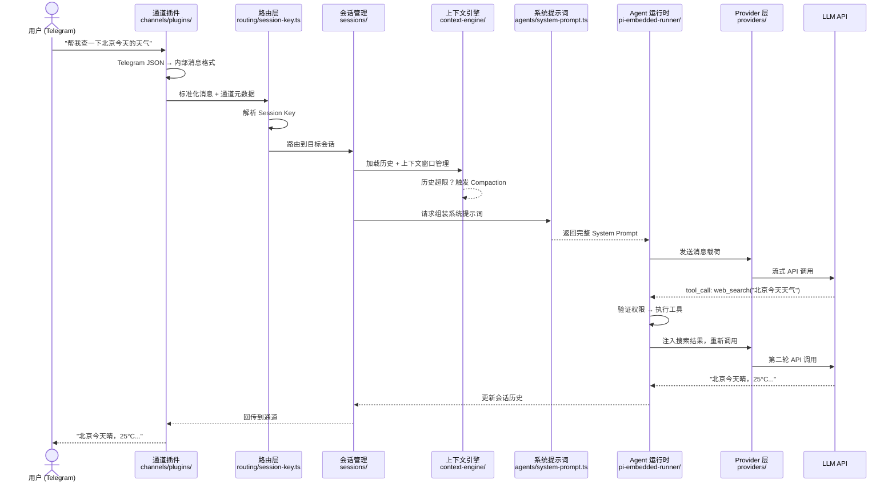
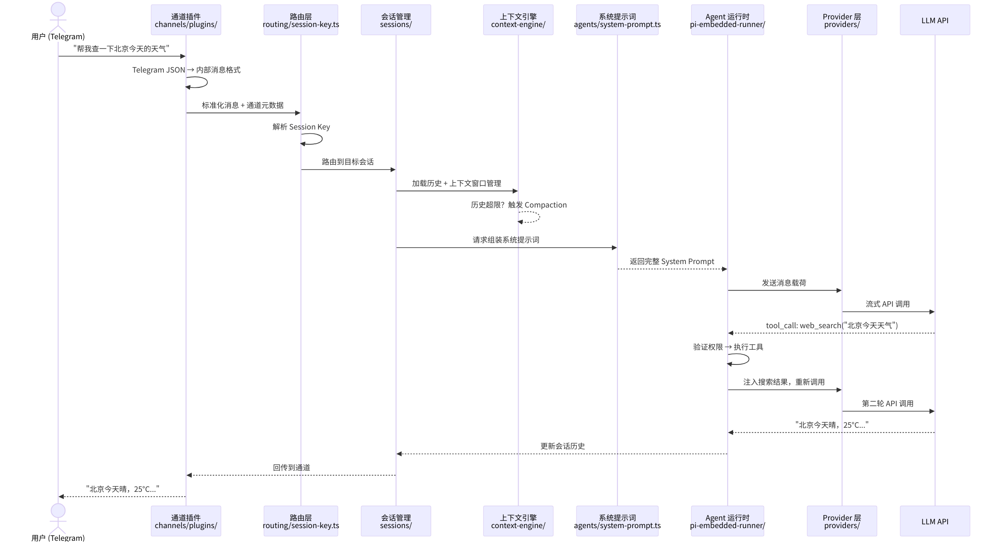
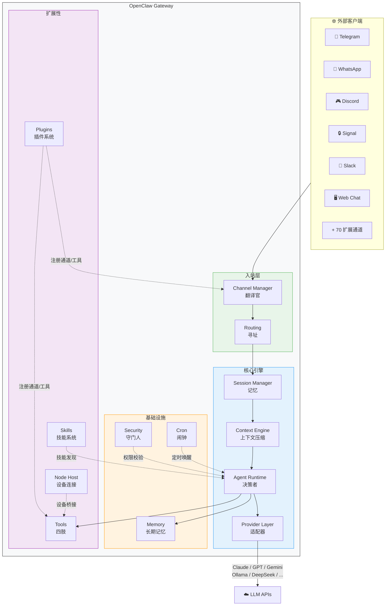
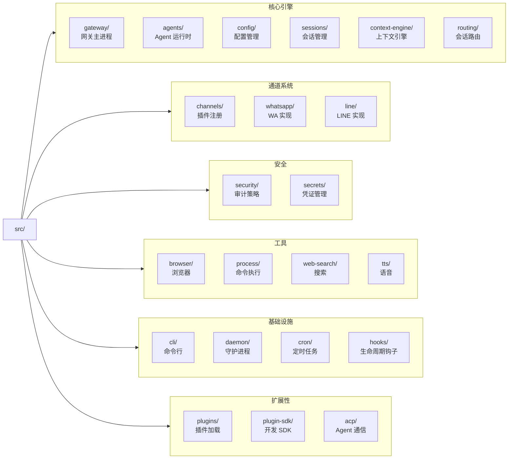
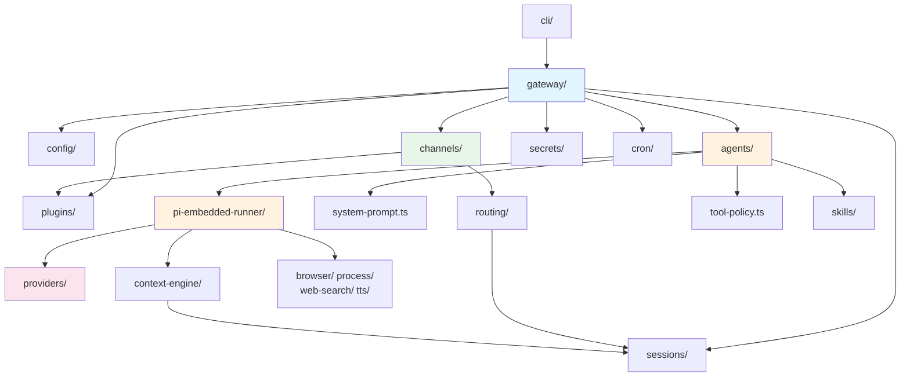

<div v-pre>

# 第2章 架构总览

> "架构的质量不取决于它能处理多少已知需求，而取决于它面对未知需求时需要修改多少代码。"

> **本章要点**
> - 跟踪一条消息从用户发送到 Agent 回复的完整旅程，理解数据流全貌
> - 掌握 OpenClaw 六大核心子系统的职责边界与协作关系
> - 理解 Gateway 模式与 Agent Framework 模式的根本差异
> - 解读源码目录结构，为后续深入阅读建立导航地图


上一章，我们从四个递进的噩梦（通道地狱、模型困境、失忆症、安全事故）理解了*为什么*需要 OpenClaw——它不是又一个聊天框架，而是一套骨骼、血管与神经系统。我们还确立了五大设计哲学：通道无关、模型无关、运行时而非框架、约定优于配置、渐进式复杂度。

现在的问题是：**这些哲学如何落地为具体的系统架构？** 本章将视角拉升到万米高空，俯瞰系统的完整面貌。

**本章的目标**：读完之后，你对 OpenClaw 的每个核心子系统都有一个清晰的心智模型——不需要记住细节，但当后续章节深入某个模块时，你能立刻在全景图中定位它。

**为什么这一章不可跳过**：后续 16 章都是对这张全景图的局部放大。没有本章的心智地图，你在后续章节中看到的将是一堆互不关联的零件；有了它，每一个零件都有了位置和意义。这就像去一座陌生城市——先花十分钟看地图，省下的是两小时的迷路。

## 2.1 一条消息的完整旅程

> 理解一个系统最好的方式，不是阅读它的类图，而是跟踪一滴水从入口到出口的完整旅程。

让我们跟踪一条真实的用户消息。场景：一个用户在 Telegram 上发送了"帮我查一下北京今天的天气"。这条消息将穿越七个子系统，经历六次形态变换，最终以一条精确的天气信息回到用户屏幕上。

这不是一个简化的示意图——这是消息在 OpenClaw 源码中走过的真实路径。

### 2.1.1 第一站：通道入站（Channel Ingestion）

**一句话职责**：把平台特定的消息格式翻译成 OpenClaw 内部的统一格式。

Telegram 通道插件通过长轮询或 Webhook 接收到原始消息——一个包含 `chat_id`、`from`、`text` 等字段的 JSON 对象。通道插件的工作就是**翻译**：把 Telegram 的 JSON 翻译成 OpenClaw 的内部消息格式。如果消息来自 WhatsApp，翻译的是 protobuf；如果来自 Discord，翻译的是 Gateway 事件。

这就是**通道无关（Channel-agnostic）**原则的第一个体现——从这一步之后，系统再也不关心消息来自哪个平台。

> **关键概念：消息标准化（Message Normalization）**
> 消息标准化是通道抽象的核心操作——将平台特定的消息格式（Telegram JSON、WhatsApp protobuf、Discord Gateway 事件）转换为 OpenClaw 内部的统一消息结构。这一步是实现"通道无关"的基础，所有后续子系统只需处理一种格式。

```text
Telegram JSON → [Channel Plugin: 标准化] → OpenClaw 内部消息格式
```

### 2.1.2 第二站：路由解析（Routing）

**一句话职责**：根据"谁在哪个通道的哪个聊天里发的消息"，确定目标会话。

路由层（`src/routing/session-key.ts`）将消息来源映射为一个结构化的 Session Key：

```text
agent:main:telegram:direct:123456789
  │    │      │        │        │
  │    │      │        │        └─ 用户 ID
  │    │      │        └─ 聊天类型（直接/群组）
  │    │      └─ 通道名称
  │    └─ Agent 名称
  └─ 固定前缀
```

这个 Session Key 是 OpenClaw 会话系统的基石。同一个用户在 Telegram 上的私聊和群聊是两个不同的会话；在 Telegram 和 Discord 上的对话也是两个不同的会话（除非配置了跨通道会话合并）。

### 2.1.3 第三站：会话加载（Session Management）

**一句话职责**：找到或创建这个用户的对话历史，准备好上下文。

Session Manager（`src/sessions/`）根据 Session Key 加载对话历史。如果是新会话，创建一个空的上下文；如果是已有会话，从持久化存储中恢复完整的对话记录。

接下来，Context Engine（`src/context-engine/`）检查上下文是否超出了模型的窗口限制。如果超出——比如用户已经和 Agent 聊了一整天——Context Engine 会触发**上下文压缩（Compaction）**：将最早的对话轮次智能摘要为简短的总结，保留关键信息（文件路径、URL、变量名、用户偏好），丢弃冗余的寒暄和重复内容。

### 2.1.4 第四站：系统提示词构建（System Prompt Assembly）

**一句话职责**：把 Agent 的身份、能力、约束和记忆组装成一个完整的"使命说明书"。

这是 OpenClaw 最精妙的部分之一。系统提示词不是一个静态字符串，而是 `src/agents/system-prompt.ts` 根据以下维度**动态组装**的：

| 维度 | 来源 | 作用 |
|------|------|------|
| 身份与人格 | `SOUL.md` | "你是谁" |
| 工作规范 | `AGENTS.md` | "你的工作流程" |
| 用户画像 | `USER.md` | "你在帮谁" |
| 可用工具 | 工具注册表 | "你能做什么" |
| 可用技能 | `skills/` 目录 | "你擅长什么" |
| 安全策略 | 配置文件 | "你不能做什么" |
| 当前时间 | 系统时钟 | "现在是什么时候" |
| 记忆指令 | 记忆系统配置 | "如何记住重要的事" |

组装模式由 `PromptMode` 控制——主 Agent 使用 `"full"` 模式（包含所有段落），子 Agent 使用 `"minimal"` 模式（仅工具和运行时信息），最小化场景使用 `"none"` 模式。这就是**渐进式复杂度（Progressive Disclosure）**在提示词层面的体现。

### 2.1.5 第五站：模型推理（Model Invocation）

**一句话职责**：把组装好的消息发给 LLM，拿回流式响应。

Agent 运行时通过 Provider 层（`src/providers/`）将消息发送给 LLM。Provider 层做了三件关键的事：

1. **选择模型**：根据配置和降级策略决定用哪个模型、哪个 API Key
2. **适配格式**：Anthropic、OpenAI、Google 的 API 格式各不相同——Provider 层做统一转换
3. **流式处理**：响应按 token 流式返回，不需要等待完整响应

默认使用 Anthropic Claude（`src/agents/defaults.ts`）：

```typescript
export const DEFAULT_PROVIDER = "anthropic";
export const DEFAULT_MODEL = "claude-opus-4-6";
export const DEFAULT_CONTEXT_TOKENS = 200_000;
```

如果主模型不可用（速率限制、API 故障、上下文溢出），`src/agents/model-fallback.ts` 会自动启动降级链——这就是**模型无关（Provider-agnostic）**原则在运行时的具体体现。

### 2.1.6 第六站：工具调用循环（Tool Execution Loop）

**一句话职责**：如果模型决定"我需要先做点什么才能回答"，就执行工具并把结果反馈给模型。

在我们的天气查询例子中，模型返回的不是文本而是一个工具调用请求——`web_search({ query: "北京今天天气" })`。Agent 运行时会：

1. **验证权限**：`src/agents/tool-policy.ts` 检查这个工具调用是否被允许
2. **执行工具**：调用 Web Search 工具，获取搜索结果
3. **注入结果**：把搜索结果作为 `tool_result` 追加到上下文
4. **重新调用模型**：带着更新的上下文再次调用 LLM

这个循环可能重复多次——模型可能先搜索天气，再搜索明天的预报，再用浏览器打开一个天气网站获取详细信息。循环在模型生成最终文本回复时终止。

> **关键概念：工具调用循环（Tool Execution Loop）**
> 工具调用循环是 Agent 系统区别于传统聊天机器人的核心机制。模型不直接回答问题，而是请求执行工具（搜索、命令、浏览器操作），将工具结果注入上下文后再次推理。这个"推理→行动→观察"的循环可重复多次，直到模型积累足够信息生成最终回复。

```text
模型响应 → 包含 tool_call → 执行工具 → 返回结果 → 模型响应 → ...
       ↓ 无 tool_call ↓
      最终文本回复
```

### 2.1.7 第七站：通道出站（Channel Egress）

**一句话职责**：把 Agent 的回复翻译回平台特定的格式，发送给用户。

最终的文本响应（"北京今天晴，25°C，微风"）沿原路返回：Agent 运行时 → Session Manager → Channel Manager → Telegram 通道插件 → Telegram API → 用户屏幕。

如果回复很长，通道插件会自动分段（Telegram 的消息长度限制是 4096 字符）。如果回复包含 Markdown，通道插件会根据平台能力决定是否渲染（Discord 支持丰富的 Markdown，WhatsApp 只支持有限的格式）。

**图 2-1：一条消息的完整旅程**




### 2.1.8 旅程的启示

从这条旅程中，我们可以提炼出三个关键的架构直觉：

1. **消息经历了六次形态变换**：平台原始格式 → 内部格式 → Session Key → 带历史的上下文 → LLM API 请求 → LLM 流式响应 → 平台回复格式。每次变换都发生在明确的模块边界上。

2. **工具调用循环是唯一的"回路"**：整个系统的数据流是单向的（入站 → 处理 → 出站），只有工具调用形成循环。这个循环是 Agent 系统区别于传统 Web 应用的核心特征。

3. **每个子系统只有一个职责**：通道负责翻译，路由负责寻址，会话负责记忆，Agent 负责决策，Provider 负责适配。这种清晰的职责边界是**运行时而非框架（Runtime over Framework）**设计的直接结果。

> 🔥 **深度洞察：架构即城市规划**
>
> 理解 OpenClaw 的架构，最好的类比不是软件设计，而是**城市规划**。一座运转良好的城市不需要市长亲自指挥每辆车的行驶路线——它依靠道路网络（通道系统）、交通信号灯（路由层）、医院和学校（子系统服务）的协同运作。城市规划师的智慧不在于控制一切，而在于设计规则，让参与者能自主高效地行动。同样，OpenClaw 的架构质量不取决于它处理了多少已知场景，而取决于面对新场景时需要修改多少代码——好的架构像好的城市一样，给增长预留了空间，而不是为每一栋新建筑重新规划整条道路。

## 2.2 系统全景图

在跟踪了一条消息的完整旅程之后，让我们退一步，看看整个系统的全貌。OpenClaw 由十个核心子系统组成，每个子系统用一句话可以概括：

| 子系统 | 源码路径 | 一句话概括 |
|--------|---------|-----------|
| Gateway 引擎 | `src/gateway/` | 系统的大脑——启动、编排、监控一切 |
| Channel 管理器 | `src/channels/` | 翻译官——把各平台的消息翻译成统一格式 |
| Agent 运行时 | `src/agents/` | 决策者——推理、调用工具、管理子 Agent |
| Provider 抽象层 | `src/providers/` | 适配器——屏蔽不同 LLM 的 API 差异 |
| Session 管理 | `src/sessions/` | 记忆容器——维护对话历史和会话生命周期 |
| Context Engine | `src/context-engine/` | 压缩器——在有限窗口内最大化信息保留 |
| Memory 系统 | `src/memory/` | 长期记忆——向量搜索 + BM25 混合检索 |
| 安全系统 | `src/security/` + `src/secrets/` | 守门人——认证、授权、审计、沙箱 |
| 插件与技能 | `src/plugins/` + `src/agents/skills/` | 扩展槽——让第三方能力无缝接入 |
| 工具系统 | `src/browser/`、`src/process/` 等 | 四肢——执行命令、操作浏览器、搜索网页 |
| 定时任务 | `src/cron/` | 闹钟——让 Agent 主动做事而非被动等待 |
| 设备连接 | `src/node-host/` + `src/pairing/` | 触手——连接手机、平板等物理设备 |

**图 2-2：系统全景架构**






## 2.3 为什么是 Gateway 模式而不是 Agent Framework 模式

这是 OpenClaw 最根本的架构决策——选择成为一个**运行时服务**而不是一个**可导入的框架**。理解这个决策，就理解了 OpenClaw 与 LangChain、CrewAI、AutoGPT 之间的本质差异。

### 2.3.1 框架模式的局限

框架（如 LangChain）的核心承诺是：你写 `from langchain import ...`，我帮你简化与 LLM 的交互。这很好，但它隐含了一个假设——**你的应用进程负责一切**。你的应用进程启动时，框架初始化；你的应用进程退出时，一切状态消失。

这个假设在 Agent 场景下崩溃了：

1. **通道需要长连接**。WhatsApp Web 需要保持 WebSocket 连接，Discord Bot 需要维持 Gateway 连接。你的 Flask/FastAPI 应用不应该也不适合管理这些长连接。
2. **会话需要跨请求持久化**。Agent 的对话不是一次 HTTP 请求-响应，而是持续数小时甚至数天的有状态交互。
3. **安全需要进程级隔离**。工具执行（shell 命令、文件操作）需要进程级别的沙箱控制和审批机制。
4. **定时任务需要持续运行**。Agent 不只是等待消息再回复，还需要主动执行定时巡检、自动发送报告。

### 2.3.2 Gateway 模式的回答

OpenClaw 的 Gateway 是一个**常驻进程**，自己管理通道连接、会话状态、安全策略和定时任务。它不需要嵌入你的应用——它**就是**应用。

```text
框架模式：[你的应用] → import [框架] → 调用 [LLM]
                ↑                         ↑
           你负责运维                  你负责通道适配

网关模式：[通道们] → [OpenClaw Gateway] → [LLM们]
                         ↑
                  OpenClaw 全权负责
```

**图 2-3：框架模式 vs 网关模式**

| 维度 | 框架模式 | 网关模式 |
|------|---------|---------|
| 进程生命周期 | 由你的应用管理 | 自管理 Daemon |
| 通道连接 | 你自己写适配器 | 插件化，内置 9 + 扩展 70+ |
| 会话状态 | 内存级，进程退出即丢 | 持久化存储，自动恢复 |
| 安全策略 | 你自己实现 | 30+ 内置检查，执行审批 |
| 配置变更 | 重启应用 | 零停机热重载 |
| 定时任务 | 外部 cron + 你的应用 | 内置调度器 |

**代价**：Gateway 模式不如框架模式灵活——你不能像调用函数一样自由组合 OpenClaw 的组件。但对于"让 AI Agent 在生产环境中持久、安全、多通道地运行"这个特定目标，Gateway 模式是更正确的抽象层级。

> OpenClaw 的 VISION.md 明确将"Agent-hierarchy frameworks (manager-of-managers / nested planner trees) as a default architecture"列为不会合并的方向。原因是这类架构增加了调试和审计的复杂度，与"安全优先、行为可审计"的原则相矛盾。

## 2.4 关键设计决策与 Trade-off

在深入各子系统之前，先纵览 OpenClaw 在六个关键架构节点上的设计选择。每一个选择都有明确的理由和代价——理解这些 trade-off，比记住任何实现细节都更重要。

| 决策维度 | OpenClaw 的选择 | 备选方案 | 选择理由 | 代价 |
|---------|---------------|---------|---------|------|
| **部署模型** | Daemon 常驻进程 | Serverless | 长连接通道需要；会话状态需要内存一致性 | 不能水平扩展单实例 |
| **通道接入** | 插件注册表 | 硬编码 | 第三方可扩展；内置与扩展通道同等地位 | 间接层增加调试复杂度 |
| **Agent 运行时** | 自建嵌入式 | 使用 LangChain 等 | 端到端可控：提示词、工具、流式、压缩全链路 | 更大维护负担 |
| **配置管理** | JSON5 + 热重载 | YAML / 硬编码 | 运行时可修改；支持多层合并 | 类型定义分散在 30+ 文件 |

> 💡 **设计洞察：为什么选择 JSON5 而不是 YAML？**
>
> 这是一个看似反直觉的选择——YAML 在 DevOps 圈几乎是配置文件的"默认标准"。但 OpenClaw 团队的判断是：YAML 的**缩进敏感语法是定时炸弹**。在凌晨两点调试 Agent 配置时，一个多余的空格导致整个配置解析失败，而错误信息只会告诉你"第 47 行格式错误"——这种体验让人崩溃。JSON5 保留了 JSON 的确定性解析（花括号和逗号明确界定结构），同时添加了注释和尾逗号支持（解决了 JSON 的两大痛点）。更关键的是，JSON5 可以被任何 JSON 解析器的超集处理，而 YAML 解析器在不同语言中的行为差异大到令人发指——`yes` 在某些 YAML 解析器中被解释为布尔值 `true`，`3.0` 可能被解释为浮点数而非字符串。对于一个安全敏感的系统，**配置解析的确定性比配置书写的美观性重要一万倍**。
| **模型接入** | Provider 适配 + Auth Profile 轮换 | 单一 SDK | 20+ 提供商；密钥轮换和降级 | 每新增提供商需实现适配器 |
| **上下文管理** | Context Engine + Compaction | 固定窗口截断 | 智能压缩保留关键信息 | 压缩本身消耗额外 Token |

## 2.5 源码目录结构导读

OpenClaw 2026.3.14 版本的 `src/` 目录包含 45+ 顶层模块。按照功能分类：

**图 2-4：源码模块全景**




### 2.5.1 核心引擎

| 目录 | 职责 | 关键文件 |
|------|------|----------|
| `gateway/` | 网关主进程、HTTP/WS 服务器、配置热重载 | `server.impl.ts`、`boot.ts`、`config-reload.ts` |
| `agents/` | Agent 运行时、模型调用、工具编排 | `system-prompt.ts`、`pi-embedded-runner/`、`model-fallback.ts` |
| `config/` | 配置加载、验证、多层合并 | `config.ts`、`types.ts`（30+ 类型模块） |
| `sessions/` | 会话元数据和生命周期 | `session-lifecycle-events.ts`、`session-id.ts` |
| `context-engine/` | 上下文窗口管理和压缩 | `registry.ts`、`delegate.ts` |
| `routing/` | 会话路由和 Session Key 解析 | `session-key.ts`、`account-id.ts` |

### 2.5.2 通道、安全、工具、基础设施、扩展性

| 分类 | 目录 | 关键职责 |
|------|------|---------|
| 通道 | `channels/`、`whatsapp/`、`line/` | 通道插件注册、消息标准化、出站适配 |
| 安全 | `security/`、`secrets/` | 安全审计（30+ 检查项）、凭证管理、沙箱策略 |
| 工具 | `browser/`、`process/`、`web-search/`、`tts/`、`image-generation/` | 浏览器控制、命令执行、网页搜索、语音合成、图片生成 |
| 基础设施 | `cli/`、`daemon/`、`cron/`、`hooks/`、`infra/`、`logging/` | 命令行、守护进程、定时任务、生命周期钩子 |
| 扩展性 | `plugins/`、`plugin-sdk/`、`acp/`、`node-host/` | 插件加载、开发 SDK（60+ 子路径）、Agent 通信、设备连接 |

### 2.5.3 核心模块依赖关系

**图 2-5：核心模块依赖图**




> 蓝色 = 网关层，橙色 = Agent 运行时层，绿色 = 通道层，粉色 = Provider 层。箭头表示依赖方向。

请注意依赖方向的设计意图：所有依赖都是**从上到下、从外到内**的。Gateway 依赖 Agent，Agent 依赖 Provider，但 Provider 不反向依赖 Agent。这种单向依赖是模块化单体保持可维护性的关键。

## 2.6 运行时环境

OpenClaw 基于 Node.js 22+（兼容 Bun），使用 TypeScript ESM 模块系统。

Gateway 默认监听端口 `18789`，通过 HTTP 和 WebSocket 同时提供服务：

- **HTTP**：Control UI（Web 管理界面）、OpenAI 兼容 API、健康检查、设备配对
- **WebSocket**：实时消息流、会话订阅、Agent 事件

运行时环境的抽象定义在 `src/runtime.ts` 中：

```typescript
export type RuntimeEnv = {
  log: (...args: unknown[]) => void;
  error: (...args: unknown[]) => void;
  exit: (code: number) => void;
};
```

这个抽象让核心逻辑可以在不同的运行上下文中复用——生产环境使用 `defaultRuntime`，测试环境注入不会真正退出进程的 mock runtime。

进程入口 `src/entry.ts` 的设计体现了 OpenClaw 对启动性能和副作用隔离的重视：

```typescript
// 仅当作为主模块运行时才执行入口逻辑
if (!isMainModule({ currentFile, wrapperEntryPairs })) {
  // Imported as a dependency — skip all entry-point side effects.
} else {
  process.title = "openclaw";
  ensureOpenClawExecMarkerOnProcess();
  installProcessWarningFilter();
  normalizeEnv();
  enableCompileCache(); // Node.js 22+ 编译缓存加速
}
```

`isMainModule` 守卫确保 bundler 将 `entry.ts` 作为依赖引入时不会重复执行入口逻辑——避免"启动两个 Gateway 导致端口冲突"的问题。`enableCompileCache()` 利用 Node.js 22 的编译缓存加速后续启动。

## 2.7 模块化单体：一个精心选择的折中

OpenClaw 是一个**模块化单体（Modular Monolith）**——45+ 模块在同一个进程内运行，通过明确的接口边界解耦。

为什么不用微服务？

```text
模块化单体：进程内函数调用 = 纳秒级延迟
微服务架构：跨服务网络调用 = 毫秒级延迟
```

Agent 系统会**放大**这个差异。一次工具调用循环包含数十次模块间调用（路由 → 会话 → Agent → 工具 → Provider → 回到 Agent）。如果每次调用都走网络，延迟会积累到不可接受的程度。

| 维度 | 模块化单体 | 微服务 |
|------|-----------|-------|
| 模块间延迟 | 纳秒级 | 毫秒级 |
| 部署复杂度 | 一个进程 | N 个服务 + 消息队列 |
| 状态共享 | 直接引用 | 需要序列化传输 |
| 适合团队规模 | 个人 ~ 小团队 | 大团队 |
| 水平扩展 | 受限 | 独立扩展各服务 |

对于"个人或小团队的 AI Agent 运行时"这个目标场景，模块化单体是压倒性的正确选择。这不是技术债，而是工程智慧。

> 💡 **设计洞察：为什么是模块化单体而不是微服务？**
>
> 在 2024-2025 年的技术氛围中，"微服务"几乎等同于"现代架构"。选择单体看起来像是技术倒退——但这恰恰是 OpenClaw 最深思熟虑的决策之一。考虑 Agent 的典型工作流：一条用户消息触发路由解析（1 次调用）→ 会话加载（1 次调用）→ 系统提示组装（3-5 次调用）→ 模型推理（1 次调用）→ 工具执行（1-10 次调用）→ 结果注入并再次推理（循环 2-5 轮）。**一条消息的处理涉及 20-50 次模块间调用**。如果每次调用都走网络（即使是本地 gRPC），延迟积累将从纳秒级膨胀到数百毫秒级——对于一个期望秒级响应的对话系统，这是不可接受的。微服务的价值在于大团队的独立部署和独立扩展，但 OpenClaw 的目标用户是个人或小团队——他们要的不是"每个组件独立扩缩容"，而是"一条命令启动一切"。
>
> **如果不这样做会怎样？** 想象一个微服务版的 OpenClaw：路由服务、会话服务、Agent 服务、工具服务各自独立部署。一条消息在四个服务之间来回跳转，每次跳转增加 2-10ms 网络延迟。一个 5 轮工具调用的对话将额外引入 200-500ms 延迟——用户会明显感觉到"这个 Agent 怎么这么慢"。更糟糕的是，调试一条消息的处理需要关联四个服务的日志，开发者体验从"看一个进程的日志"变成"配置分布式追踪系统"。对于目标用户来说，这是用大炮打蚊子。

> **关键概念：模块化单体（Modular Monolith）**
> 模块化单体是介于传统单体和微服务之间的架构风格——所有模块在同一进程内运行（享受纳秒级调用延迟），但通过明确的接口边界解耦（保持可维护性）。对于 Agent 系统，工具调用循环中的高频模块间调用使得进程内通信成为性能关键。

> ⚠️ **注意**：模块化单体不等于"不考虑扩展"。OpenClaw 的会话存储、消息路由和 ACP 协议都预留了分布式扩展接口，但在必要之前不会启用。过早引入微服务是常见的架构错误——先确保单体的模块边界清晰，再考虑拆分。

> 但 OpenClaw 为未来的水平扩展预留了接口：会话存储可替换为数据库、消息路由可接入消息队列、ACP 协议已支持跨进程 Agent 执行。这些扩展点存在，但在必要之前不会启用——这正是**渐进式复杂度（Progressive Disclosure）**在架构层面的体现。

## 2.8 小结：四个架构直觉

读完本章，你应该带走四个核心直觉：

1. **消息的旅程就是理解系统的金钥匙。** 从通道入站到模型推理再到通道出站，每一步都有明确的职责边界。记住这条主线，任何子系统都不会迷路。

2. **Gateway 模式是根本选择。** 选择成为常驻运行的服务而非可导入的库，决定了一切下游设计——会话持久化、通道长连接、安全隔离、配置热重载，都是这个选择的自然推论。

3. **模块化单体是精心选择的折中。** 进程内调用的纳秒级延迟在 Agent 场景中至关重要——工具调用循环的每一轮包含数十次模块间调用。

4. **配置驱动而非代码驱动。** 你可以对配置文件做版本控制、diff、审计和回滚。代码描述能力，配置描述意图。这就是**约定优于配置（Convention over Configuration）**的实践——常见场景用约定自动处理，特殊需求通过配置显式声明。

> 💡 **设计洞察：为什么用文件系统而不是数据库？**
>
> OpenClaw 的会话、配置、技能、记忆全部存储在文件系统上——没有 SQLite，没有 Redis，没有 PostgreSQL。这看起来像是 2005 年的技术选型，但实际上是经过深思熟虑的决策。文件系统方案意味着：(1) **零依赖部署**——不需要安装数据库、不需要管理连接池、不需要处理 schema 迁移；(2) **天然的版本控制**——把整个状态目录放进 Git，你就有了免费的备份、回滚和审计追踪；(3) **人类可读**——调试时直接 `cat` 一个 JSON 文件，比写 SQL 查询快十倍；(4) **工具生态**——`grep`、`jq`、`find` 这些 Unix 工具直接可用。当然，代价是显而易见的：没有事务保证、没有并发写入控制、查询能力有限。但对于"单运营者的 Agent 运行时"这个场景，这些代价完全可以接受——你不需要数据库的并发控制，因为只有一个进程在写；你不需要复杂查询，因为访问模式几乎全是"按 key 读写"。**选择最简单的能满足需求的方案，而不是最炫酷的方案——这本身就是工程智慧。**

**全书路线图**：后续每一章将沿着消息的旅程逐站展开。

| 旅程阶段 | 对应章节 | 核心问题 |
|---------|---------|---------|
| 消息进入系统 | 第 3 章 Gateway | 系统如何启动、如何接收消息？ |
| 选择 AI 模型 | 第 4 章 Provider | 用哪个模型？故障了怎么办？ |
| 加载对话上下文 | 第 5 章 Session | 如何记住之前聊了什么？ |
| Agent 决策与执行 | 第 6 章 Agent 系统 | 如何推理、调用工具、管理子任务？ |
| 消息到达用户 | 第 7-8 章 通道 | 如何适配不同平台的协议差异？ |
| 能力扩展 | 第 9-10 章 插件与工具 | 如何添加新能力而不改核心代码？ |
| 物理世界连接 | 第 11 章 Node 系统 | 如何控制手机等物理设备？ |
| 主动行动 | 第 12 章 定时任务 | 如何让 Agent 主动做事？ |
| 安全防护 | 第 13 章 安全 | 如何防止 Agent 做危险的事？ |
| 运维部署 | 第 14-16 章 | CLI、部署方案、技能系统 |
| 设计提炼 | 第 17-18 章 | 设计模式与未来展望 |

> **架构的终极检验标准只有一个：当你需要添加一个从未想过的功能时，是改配置还是改代码？是加一个插件还是 fork 整个仓库？**

## 2.6 快速上手：从零运行你的第一个 Agent

> 💡 本节提供从安装到第一次对话的完整步骤。如果你已经有 OpenClaw 运行环境，可以跳到第 3 章。

### 2.6.1 前置条件

- **Node.js 22+**（推荐使用 [nvm](https://github.com/nvm-sh/nvm) 管理版本）
- 至少一个 LLM Provider 的 API Key（推荐 Anthropic 或 OpenAI）
- 至少一个通道 Token（推荐 Telegram Bot Token，最容易获取）

```bash
# 检查 Node.js 版本
node --version  # 需要 v22.16.0 或更高

# 如果版本不够，使用 nvm 升级
nvm install 22
nvm use 22
```

> ⚠️ **常见陷阱：Node.js 版本不足**
>
> OpenClaw 依赖 Node.js 22+ 的 ESM 编译缓存和原生 `fetch` API。使用更低版本会在启动时直接报错 `SyntaxError: Unexpected token 'export'` 或 `fetch is not defined`。如果你在服务器上看到这类错误，首先检查 `node --version`。

### 2.6.2 安装

```bash
npm install -g openclaw
```

验证安装：

```bash
openclaw --version
# 应输出类似 2026.3.14
```

### 2.6.3 首次配置

```bash
openclaw setup
```

配置向导会依次引导你：

1. **选择 Provider**：输入 Anthropic/OpenAI 的 API Key
2. **选择通道**：输入 Telegram Bot Token（从 [@BotFather](https://t.me/BotFather) 获取）
3. **确认安全策略**：默认 `exec` 工具为 `allowlist` 模式（推荐）

配置文件会生成在 `~/.openclaw/config.json5`。你也可以手动创建：

```json5
// ~/.openclaw/config.json5
{
  // Provider 配置
  "auth": {
    "anthropic": "${ANTHROPIC_API_KEY}"  // 从环境变量读取，避免明文
  },

  // 通道配置
  "telegram": {
    "token": "${TELEGRAM_BOT_TOKEN}"
  },

  // Agent 配置（可选，有合理默认值）
  "agents": {
    "defaults": {
      "model": "claude-sonnet-4-20250514"
    }
  }
}
```

> ⚠️ **常见陷阱：JSON5 格式错误**
>
> 配置文件使用 JSON5 格式（支持注释和尾逗号），但**不支持单引号字符串**。以下是常见错误：
> ```json5
> // ❌ 错误：使用单引号
> { 'auth': { 'anthropic': 'sk-xxx' } }
>
> // ✅ 正确：使用双引号
> { "auth": { "anthropic": "sk-xxx" } }
>
> // ✅ 正确：尾逗号是合法的
> { "auth": { "anthropic": "sk-xxx", } }
> ```

> ⚠️ **常见陷阱：API Key 直接写在配置文件中**
>
> 永远不要将 API Key 以明文形式写在 `config.json5` 中。使用环境变量引用 `"${ANTHROPIC_API_KEY}"` 或使用 OpenClaw 的密钥管理功能。配置文件可能被意外提交到版本控制系统，导致密钥泄露。

### 2.6.4 启动 Gateway

```bash
# 前台运行（开发/调试用）
openclaw gateway run

# 或以 Daemon 模式启动（生产用）
openclaw gateway start
```

看到类似输出表示启动成功：

```text
✓ Config loaded from ~/.openclaw/config.json5
✓ Secrets snapshot activated (1 provider)
✓ Telegram channel started
✓ Gateway listening on http://localhost:18789
✓ Gateway ready
```

### 2.6.5 创建你的第一个 Agent 人格

在工作目录（默认 `~/.openclaw/workspace/`）创建 `SOUL.md`：

```markdown
# SOUL.md

你是一个友好的技术助手。回答简洁、准确。
当用户要求执行命令时，先确认再执行。
```

OpenClaw 会自动发现并注入这个文件——不需要修改任何配置（**约定优于配置**原则）。

### 2.6.6 第一次对话

打开 Telegram，给你的 Bot 发送：

```
你好！请帮我查一下当前时间。
```

Agent 应该会调用工具获取时间并回复。恭喜——你的第一个 AI Agent 已经在运行了！

### 2.6.7 下一步

- **添加更多通道**：在配置文件中添加 Discord、Slack 等通道的 Token
- **定制技能**：在 `~/.openclaw/workspace/skills/` 下创建 `SKILL.md` 文件
- **配置安全策略**：参见第 13 章了解工具权限和沙箱配置
- **设置定时任务**：参见第 12 章让 Agent 主动工作

下一章，我们降落到地面，走进第一栋建筑——Gateway 网关引擎。如果说 OpenClaw 是一座城市，Gateway 就是市政厅：它不亲自铺路、不亲自送水，但城市的每一项公共服务都在它的调度之下运转。

### 思考题

1. **概念理解**：OpenClaw 的"一条消息的旅程"经过了哪些关键子系统？如果去掉其中任何一个，系统会发生什么？
2. **实践应用**：假设你需要在 OpenClaw 架构中新增一个"消息审计日志"功能，记录每条消息经过的所有处理阶段，你会在架构的哪个层次植入这个能力？
3. **开放讨论**：OpenClaw 的架构在"单体应用"和"微服务"之间做了哪些权衡？你认为这些权衡在不同规模的部署场景下是否合理？

### 📚 推荐阅读

- [Designing Data-Intensive Applications (Martin Kleppmann)](https://dataintensive.net/) — 分布式系统架构的经典参考，许多模式与 OpenClaw 设计一脉相承
- [Pattern-Oriented Software Architecture (POSA)](https://en.wikipedia.org/wiki/Pattern-Oriented_Software_Architecture) — 系统架构模式的权威参考
- [The Architecture of Open Source Applications](https://aosabook.org/) — 通过剖析真实开源项目学习系统架构
- [C4 Model for Software Architecture](https://c4model.com/) — 可视化软件架构的分层方法论，帮助理解本章的架构图
- [OpenClaw GitHub Wiki](https://github.com/nicepkg/openclaw/wiki) — 社区维护的补充文档与 FAQ


</div>
