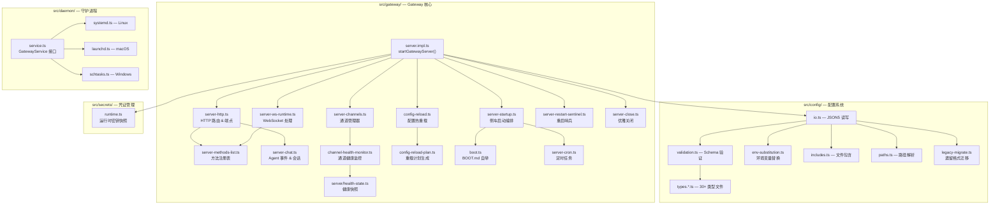
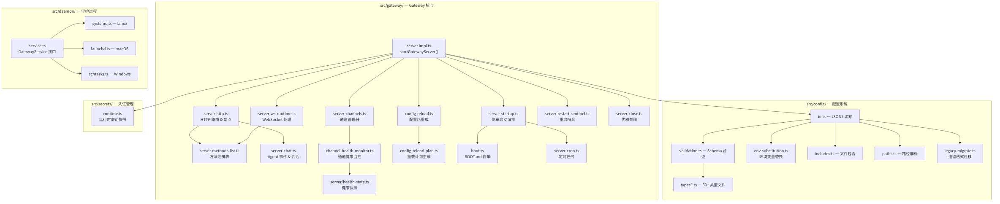
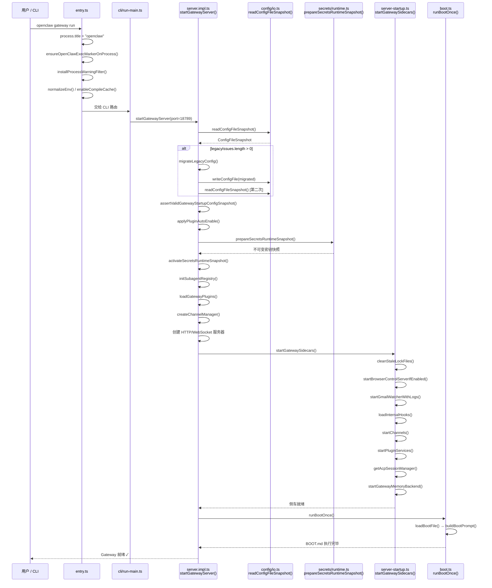
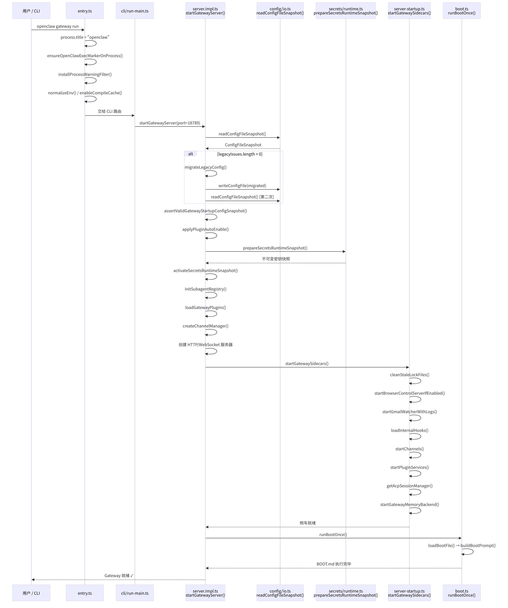
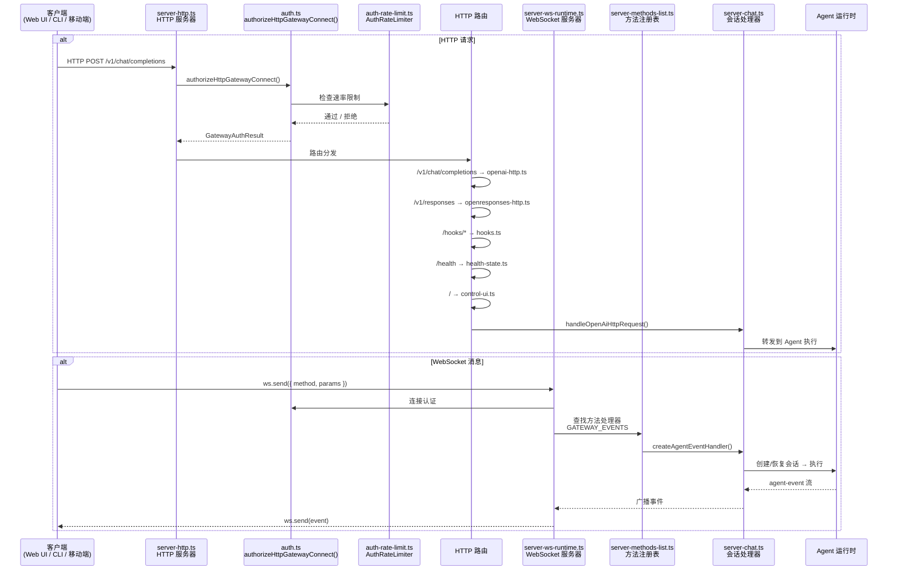
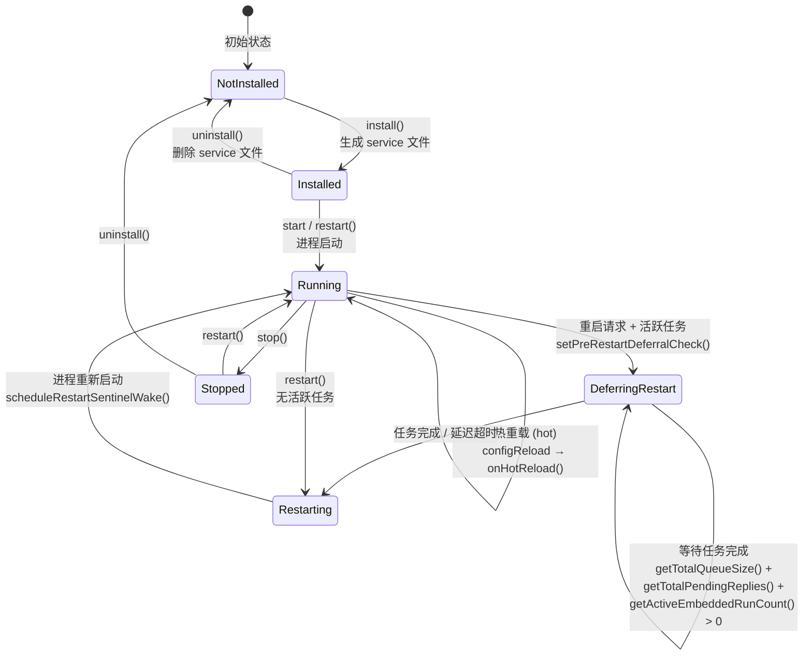
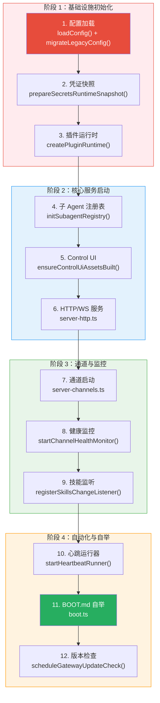

<div v-pre>

# 第3章 Gateway 网关引擎

> "一个系统的成熟度，不看它在正常情况下跑得多好，而看它在凌晨三点、通道断连、模型限速、配置刚改错的情况下能否自愈。"

> **本章要点**
> - 理解 Gateway 作为"编排者而非执行者"的核心角色定位
> - 剖析 Gateway 启动流程：从配置加载到子系统编排的完整链路
> - 掌握配置系统的分层覆盖机制与热重载设计
> - 理解 Daemon 模式、健康监控与事件系统的工程实现


上一章我们从万米高空俯瞰了 OpenClaw 的全景，画出了每个子系统的轮廓。从本章开始，我们降落到地面，逐一走进每一栋建筑。第一站，自然是那座最高、最显眼的大楼——Gateway 网关引擎。

## 3.1 Gateway 的角色

你有没有想过，当你在 Telegram 里发出一条消息，到 Agent 回复你，中间到底发生了什么？

表面上看，似乎很简单：收消息、调 API、发回复。三步搞定。但仔细想想，你会发现这背后藏着惊人的隐性复杂度——消息来了，先要判断它属于哪个通道、哪个账户、哪个会话；然后加载历史上下文，但上下文可能已逼近模型窗口极限，需要先压缩；接着组装系统提示词、注册可用工具、检查安全策略；调用模型后，模型可能不给文本回复，而是要求调用工具；工具执行完毕，结果送回模型，模型可能再次要工具……如此往复，周而复始，直到任务完成。

**统领这一切的，就是 Gateway。**

> Gateway 之于 OpenClaw，犹如内核之于操作系统——它不亲自运行应用程序，但一切应用程序的运行都仰赖于它。

Gateway 不是简单的"代理"或"转发层"。它管理着应用程序运行所需的一切：进程生命周期、资源分配、安全隔离、设备驱动（通道插件）、任务调度（Cron）。`src/gateway/` 目录包含 200+ 个文件，是整个代码库中最庞大的单一模块——这个体量本身，就是 Gateway 职责之重的无声证明。

> **关键概念：Gateway（网关）**
> Gateway 是 OpenClaw 的核心编排进程，类似于操作系统内核的角色。它不直接执行 AI 推理或消息处理，而是协调所有子系统（通道、Agent、安全、定时任务等）的启动、运行和关闭。Gateway 作为 Daemon 常驻运行，是整个系统的"大脑"。

具体而言，Gateway 负责：

- **进程生命周期管理**：启动、关闭、重启、信号处理——确保系统 7×24 稳定运行
- **HTTP/WebSocket 服务**：Control UI、REST API、OpenAI 兼容端点、实时流
- **配置加载与热重载**：读取、验证、监控配置变更——无需重启即可更新行为
- **子系统编排**：协调通道、Agent 运行时、安全系统等十几个子系统的启动顺序
- **健康监控**：通道健康检查、就绪状态管理——自动重连掉线的通道
- **凭证管理**：运行时密钥快照的激活和刷新——确保 API 密钥安全且始终可用

> 🔥 **深度洞察：编排者的悖论**
>
> Gateway 的设计揭示了一个反直觉的工程真理：**系统中最重要的组件，恰恰是什么都不做的那个。** 交响乐团的指挥不演奏任何乐器，但没有指挥，一百位乐手各吹各的。军事指挥官不亲自冲锋，但没有指挥链，精锐部队不过是一群武装暴徒。Gateway 的 200+ 个文件没有一行直接调用 LLM API 或解析 Telegram 消息——它的全部价值在于确保该调用 LLM 的模块在正确的时间、以正确的参数、在正确的安全约束下被触发。这就是"编排"与"执行"的根本区别：执行者的价值在于做得好，编排者的价值在于**让所有执行者能同时做好**。

**图 3-1：Gateway 模块架构图**

下图描绘了 `src/gateway/` 内部的模块关系，以及它与 `src/config/`、`src/daemon/`、`src/secrets/` 等外部模块的依赖关系。箭头表示调用或依赖方向。




## 3.2 启动流程剖析

OpenClaw 的启动是一个精心编排的多阶段过程。让我们逐步跟踪：


**图 3-2：Gateway 启动流程时序图**

下图展示了从用户执行 CLI 命令到 Gateway 完全就绪的完整启动链路，对应 `src/entry.ts` → `src/cli/run-main.ts` → `src/gateway/server.impl.ts` → `src/gateway/server-startup.ts` → `src/gateway/boot.ts` 的调用关系。






### 3.2.1 阶段 1：入口和预处理

一切从 `src/entry.ts` 开始。这是 Node.js 的入口文件，执行最基本的环境初始化：

```typescript
// src/entry.ts
process.title = "openclaw";
ensureOpenClawExecMarkerOnProcess();
installProcessWarningFilter();
normalizeEnv();
```

关键步骤包括：
- 设置进程标题为 `"openclaw"`
- 安装 Node.js 实验性警告过滤器
- 规范化环境变量
- 启用 Node.js 编译缓存（`enableCompileCache()`）以加速后续启动

### 3.2.2 阶段 2：CLI 路由

入口文件将控制权交给 CLI 路由系统（`src/cli/run-main.ts`），根据命令行参数决定执行路径。当用户运行 `openclaw gateway run` 时，最终会调用 `startGatewayServer()`。

### 3.2.3 阶段 3：配置加载与验证

`startGatewayServer()`（定义于 `src/gateway/server.impl.ts:362`）首先处理配置：

```typescript
// src/gateway/server.impl.ts — startGatewayServer 核心流程
export async function startGatewayServer(
  port = 18789, opts: GatewayServerOptions = {},
): Promise<GatewayServer> {
  let configSnapshot = await readConfigFileSnapshot();
  // 1. 检查并迁移遗留配置格式
  if (configSnapshot.legacyIssues.length > 0) {
    const { config: migrated } = migrateLegacyConfig(configSnapshot.parsed);
    if (migrated) await writeConfigFile(migrated);
  }
  // 2. 重新读取并验证配置
  configSnapshot = await readConfigFileSnapshot();
  assertValidGatewayStartupConfigSnapshot(configSnapshot, { includeDoctorHint: true });
  // 3. 自动启用检测到的插件
  const autoEnable = applyPluginAutoEnable({ config: configSnapshot.config, env: process.env });
  // ... 后续初始化子系统
}
```

配置加载经历了三个子步骤：
1. **遗留迁移**：检测旧格式的配置字段，自动迁移到新格式
2. **验证**：通过 `src/config/validation.ts` 的 schema 验证确保配置合法
3. **插件自动启用**：检测环境变量中提供的插件 token，自动启用对应插件

配置文件支持 JSON5 格式（通过 `json5` 库解析，见 `src/config/io.ts`），允许注释和尾逗号，大幅提升了人类可读性。配置还支持环境变量替换（`src/config/env-substitution.ts`）和文件包含（`src/config/includes.ts`）。

### 3.2.4 阶段 4：安全初始化

凭证系统是 Gateway 启动的关键环节：

```typescript
// src/gateway/server.impl.ts
const activateRuntimeSecrets = async (config, params) =>
  await runWithSecretsActivationLock(async () => {
    const prepared = await prepareSecretsRuntimeSnapshot({ config });
    if (params.activate) {
      activateSecretsRuntimeSnapshot(prepared);
      logGatewayAuthSurfaceDiagnostics(prepared);
    }
    // ...
  });
```

`prepareSecretsRuntimeSnapshot()`（`src/secrets/runtime.ts`）会：
- 解析配置中引用的所有密钥
- 创建一个不可变的运行时快照
- 验证所有必需凭证的可用性

这种"快照"模式确保了凭证变更的原子性——要么全部更新成功，要么保持上一次的已知良好状态。

### 3.2.5 阶段 5：子系统启动

配置和安全就绪后，Gateway 开始启动各个子系统：

```typescript
// src/gateway/server.impl.ts
initSubagentRegistry();                      // 初始化 Sub-agent 注册表
const defaultAgentId = resolveDefaultAgentId(cfgAtStart);  // 解析默认 Agent ID
const defaultWorkspaceDir = resolveAgentWorkspaceDir(cfgAtStart, defaultAgentId);
// 加载插件和通道
({ pluginRegistry, gatewayMethods } = loadGatewayPlugins({
  cfg: cfgAtStart,
  workspaceDir: defaultWorkspaceDir,
  // ...
}));
// 创建通道管理器
const channelManager = createChannelManager({
  loadConfig,
  channelLogs,
  channelRuntimeEnvs,
  resolveChannelRuntime: getChannelRuntime,
});
```

随后，`startGatewaySidecars()`（`src/gateway/server-startup.ts`）启动一系列"侧车"服务：

```typescript
// src/gateway/server-startup.ts — 侧车启动编排（8 步）
export async function startGatewaySidecars(params) {
  await cleanStaleLockFiles({ sessionsDir, staleMs: SESSION_LOCK_STALE_MS });  // 1. 清理锁文件
  browserControl = await startBrowserControlServerIfEnabled();                  // 2. 浏览器控制
  await startGmailWatcherWithLogs({ cfg, log });                               // 3. Gmail 监听
  await loadInternalHooks(cfg, workspaceDir);                                  // 4. Hook 处理器
  await params.startChannels();                                                // 5. 启动通道
  pluginServicesHandle = await startPluginServices({ ... });                   // 6. 插件服务
  const acpManager = getAcpSessionManager();                                   // 7. ACP 管理器
  await startGatewayMemoryBackend({ ... });                                    // 8. 内存后端
}
```

### 3.2.6 阶段 6：BOOT.md 执行

在所有子系统启动后，Gateway 会检查工作区中是否存在 `BOOT.md` 文件（`src/gateway/boot.ts`）。如果存在，它会将文件内容作为一次性指令发送给 Agent 执行：

```typescript
// src/gateway/boot.ts
export async function runBootOnce(params) {
  const { content, status } = await loadBootFile(params.workspaceDir);
  if (status !== "ok") {
    return { status: "skipped", reason: status };
  }
  const prompt = buildBootPrompt(content);
  // 执行 Boot 指令...
}
```

这是一个优雅的"自举"机制——Agent 可以在每次启动时自动执行初始化任务，如发送上线通知、检查系统状态等。

## 3.3 HTTP/WebSocket 服务器

Gateway 通过 Node.js 原生的 `http`/`https` 模块和 `ws` 库提供网络服务（`src/gateway/server-http.ts`）：

```typescript
// src/gateway/server-http.ts
import {
  createServer as createHttpServer,
  type Server as HttpServer,
} from "node:http";
import { createServer as createHttpsServer } from "node:https";
```

### 3.3.1 HTTP 端点

Gateway 暴露了以下核心 HTTP 端点：

| 路径 | 功能 | 实现文件 |
|------|------|----------|
| `/` | Control UI（Web 管理界面） | `control-ui.ts` |
| `/v1/chat/completions` | OpenAI 兼容 Chat API | `openai-http.ts` |
| `/v1/responses` | OpenAI Responses API 兼容 | `openresponses-http.ts` |
| `/health` | 健康检查 | `server/health-state.ts` |
| `/hooks/*` | Webhook 端点 | `hooks.ts` |
| `/pair` | 设备配对 | `connection-auth.ts` |

OpenAI 兼容 API（`src/gateway/openai-http.ts`）是一个特别值得注意的设计——它允许任何兼容 OpenAI API 格式的客户端直接连接 OpenClaw Gateway，将 OpenClaw 当作 OpenAI API 的代理。

### 3.3.2 WebSocket 协议

WebSocket 是 Gateway 与客户端（包括 Web UI、CLI 客户端、移动 app）之间的主要实时通信通道。WebSocket 处理逻辑在 `src/gateway/server-ws-runtime.ts` 中：

连接建立后，客户端可以发送和接收以下类型的消息：
- **chat**: 用户消息和 Agent 响应的实时流
- **agent-event**: Agent 执行事件（工具调用、状态变更）
- **session-lifecycle**: 会话创建、销毁、暂停等生命周期事件
- **node-event**: 设备节点事件


**图 3-3：请求处理管线**

下图展示了一条消息从客户端发送到 Gateway 后的完整处理链路。HTTP 请求经过认证（`auth.ts`）、速率限制（`auth-rate-limit.ts`）后路由到相应端点；WebSocket 消息则通过方法注册表（`server-methods-list.ts`）分发到对应处理器。两条路径最终都可能触发 Agent 会话处理。






Gateway 使用方法注册表（`src/gateway/server-methods-list.ts`）管理所有 WebSocket 方法：

```typescript
// src/gateway/server-methods-list.ts
export const GATEWAY_EVENTS = { ... };
export function listGatewayMethods(): string[] { ... }
```

## 3.4 配置系统

配置系统是 OpenClaw 灵活性的基石，实现在 `src/config/` 目录中。

### 3.4.1 配置文件格式

OpenClaw 使用 JSON5 作为配置文件格式（`src/config/io.ts`）。配置文件的查找逻辑支持多个候选路径：

```typescript
// src/config/paths.ts
export function resolveDefaultConfigCandidates(): string[] { ... }
```

**图 3-4：配置系统架构图**

下图展示了配置文件从磁盘到运行时的完整加载链路，包括 JSON5 解析、环境变量替换、文件包含展开、Schema 验证，以及热重载的四种模式决策流程。对应 `src/config/io.ts`、`src/config/env-substitution.ts`、`src/config/includes.ts`、`src/config/validation.ts` 和 `src/gateway/config-reload.ts`。

```mermaid
flowchart LR
    DISK["配置文件<br/>(JSON5 格式)"]
    PARSE["io.ts<br/>JSON5.parse()"]
    INC["includes.ts<br/>resolveConfigIncludes()"]
    ENVS["env-substitution.ts<br/>resolveConfigEnvVars()"]
    LEGACY["legacy-migrate.ts<br/>migrateLegacyConfig()"]
    VALID["validation.ts<br/>validateConfigObjectWithPlugins()"]
    DEFAULTS["defaults.ts<br/>applyAgentDefaults()<br/>applyModelDefaults()<br/>applySessionDefaults()"]
    RUNTIME["运行时<br/>OpenClawConfig 对象"]
    CHOK["chokidar 文件监控"]
    DIFF["config-reload.ts<br/>diffConfigPaths()"]
    PLAN["config-reload-plan.ts<br/>buildGatewayReloadPlan()"]

    DISK -->|"readConfigFileSnapshot()"| PARSE
    PARSE --> INC
    INC -->|"$include 展开"| ENVS
    ENVS -->|"${VAR} 替换"| LEGACY
    LEGACY --> VALID
    VALID --> DEFAULTS
    DEFAULTS --> RUNTIME

    CHOK -->|"文件变更事件"| DIFF
    DIFF -->|"changedPaths[]"| PLAN
    PLAN -->|"GatewayReloadPlan"| DECIDE

    subgraph DECIDE["重载模式决策"]
        direction TB
        OFF["off: 忽略"]
        RESTART["restart: 重启进程"]
        HOT["hot: 热更新"]
        HYBRID["hybrid: 按字段<br/>自动选择"]
    end
```




配置文件支持以下高级特性：

**环境变量替换**（`src/config/env-substitution.ts`）：
```json5
{
  "telegram": {
    "token": "${TELEGRAM_BOT_TOKEN}"
  }
}
```

**文件包含**（`src/config/includes.ts`）：
```json5
{
  "$include": "./channels.json5"
}
```

### 3.4.2 配置类型系统

配置类型定义分散在 30+ 个 `types.*.ts` 文件中（`src/config/types.ts` 聚合导出），这种分散式设计的好处是：
- 每个子系统拥有自己的配置类型，避免巨型文件
- 修改一个子系统的配置不会影响其他子系统的类型导出
- 更好的编辑局部性

### 3.4.3 热重载

配置热重载是 Gateway 的重要特性（`src/gateway/config-reload.ts`）。它使用 `chokidar` 文件监控库监视配置文件变更：

```typescript
// src/gateway/config-reload.ts
export type GatewayReloadSettings = {
  mode: GatewayReloadMode;  // "off" | "restart" | "hot" | "hybrid"
  debounceMs: number;       // 默认 300ms
};
```

> **关键概念：配置热重载（Hot Reload）**
> 热重载允许在不停机的情况下更新系统配置。OpenClaw 通过文件监控检测配置变更，然后根据变更字段的影响范围自动决定是热更新（不重启进程）还是完整重启。这确保了 7×24 运行的 Agent 系统可以在不中断用户对话的前提下更新行为。

重载模式有四种：
- **off**：禁用自动重载
- **restart**：检测到变更时重启整个 Gateway 进程
- **hot**：热重载，不重启进程直接应用变更
- **hybrid**（默认）：根据变更影响范围自动选择热重载或重启

> **实战场景：运行中切换模型**
>
> 假设你的 Agent 正在 Telegram 和 Discord 上服务 30 个用户，你决定把默认模型从 `claude-sonnet-4-20250514` 切换到 `gpt-4.1`。在传统的 Agent 框架中，你需要停止服务、修改代码或环境变量、重新启动——用户会经历至少 10-30 秒的"失联"。
>
> 在 OpenClaw 中，你只需要修改配置文件中的 `model` 字段并保存。hybrid 模式会检测到这是一个 `agents.*.model` 路径的变更，归类为 hot-safe，在下一次消息处理时使用新模型——**整个过程零停机，用户无感知**。但如果你修改的是 `plugins` 字段（比如启用一个新的通道插件），系统会识别出这需要完整重启，自动等待当前活跃会话完成后再重启 Gateway。

`buildGatewayReloadPlan()`（`src/gateway/config-reload-plan.ts`）会分析配置变更的具体字段，判断哪些变更可以热更新、哪些需要重启：

```typescript
// src/gateway/config-reload.ts
export function diffConfigPaths(prev: unknown, next: unknown, prefix = ""): string[] {
  if (prev === next) return [];
  if (isPlainObject(prev) && isPlainObject(next)) {
    const keys = new Set([...Object.keys(prev), ...Object.keys(next)]);
    const paths: string[] = [];
    for (const key of keys) {
      // 递归比较每个字段
      const childPaths = diffConfigPaths(prevValue, nextValue, childPrefix);
      if (childPaths.length > 0) paths.push(...childPaths);
    }
    return paths;
  }
  return [prefix || "<root>"];
}
```

#### 源码细节：配置 Diff 的递归算法与重载计划

`diffConfigPaths()` 的实现值得细看：它对两个配置对象做**递归深度优先遍历**，收集所有值不同的叶子路径。对于数组字段（如 `memory.qmd.paths`），它不是逐元素比较，而是使用 Node.js 内置的 `isDeepStrictEqual` 做结构性比较——这意味着 `["a","b"]` 和 `["a","b"]` 即使是不同的数组引用也不会被报告为变更，避免了无意义的重启。

更精彩的是 `buildGatewayReloadPlan()`（`src/gateway/config-reload-plan.ts`）的**前缀匹配规则引擎**。它维护了一个有序的规则列表，每条规则由配置路径前缀和动作类型（`restart` / `hot` / `none`）组成。例如 `gateway.remote` 变更是 `none`（不影响运行时），`cron` 变更是 `hot`（触发 Cron 服务热重启），`plugins` 变更是 `restart`（必须完整重启 Gateway）。通道插件还可以动态注册自己的热重载前缀——Telegram 插件可以声明 `channels.telegram.token` 是 hot-safe 的，变更时只需重启 Telegram 通道而非整个 Gateway。

```typescript
// src/gateway/config-reload-plan.ts — 前缀规则匹配
function matchRule(path: string): ReloadRule | null {
  for (const rule of listReloadRules()) {
    if (path === rule.prefix || path.startsWith(`${rule.prefix}.`))
      return rule;  // 首条匹配获胜，规则顺序即优先级
  }
  return null;  // 无匹配 → 保守策略：要求重启
}
```

如果某个变更路径没有匹配到任何规则，系统默认要求完整重启——这是**fail-safe** 设计：宁可多重启一次，也不让未知变更在 hot 模式下生效导致不一致状态。

> ⚠️ **注意**：修改 `plugins` 配置字段（如启用新通道插件）会触发 Gateway 完整重启，而非热更新。系统会等待当前活跃会话完成后再执行重启。如果需要在不中断服务的前提下添加插件，建议在低峰时段操作。

> ⚠️ **常见陷阱：环境变量替换失败**
>
> 配置文件中的 `${VAR_NAME}` 语法要求环境变量在 Gateway 进程启动时已经设置。常见错误场景：
> ```bash
> # ❌ 错误：在 systemd 服务中，~/.bashrc 不会被加载
> # 你在 .bashrc 中 export 的变量对 systemd 服务不可见
>
> # ✅ 正确：在 systemd unit 文件中使用 EnvironmentFile
> # [Service]
> # EnvironmentFile=/home/openclaw/.env
>
> # ✅ 正确：或在 config.json5 中使用 $include 引用独立的密钥文件
> # { "$include": "./secrets.json5" }
> ```
> 如果你发现 Gateway 启动后通道全部失败、Provider 返回 401，首先检查环境变量是否正确传递到了运行时进程。

> ⚠️ **常见陷阱：`$include` 路径解析**
>
> `$include` 的路径是相对于**当前配置文件所在目录**解析的，而非相对于工作目录。如果主配置在 `~/.openclaw/config.json5`，那么 `"$include": "./channels.json5"` 会查找 `~/.openclaw/channels.json5`，而非 `~/channels.json5`。路径搞错会导致 Gateway 启动时报 `ENOENT` 文件不存在错误。

## 3.5 Daemon 模式

> **什么是 Daemon？** 如果你之前没接触过这个概念：Daemon（守护进程）是一种在操作系统后台持续运行的程序，不依赖任何终端窗口。你关闭了 SSH 会话或终端，Daemon 依然在运行。常见的 Daemon 包括 Web 服务器（Nginx）、数据库（MySQL）和消息队列（Redis）。OpenClaw Gateway 就是这样一个 Daemon——它在后台持续运行，维护通道连接、处理用户消息、执行定时任务，即使你没有打开任何终端窗口。

OpenClaw 设计为以 Daemon 模式长期运行。`src/daemon/` 目录实现了跨平台的守护进程管理：

### 3.5.1 平台适配

`src/daemon/service.ts` 定义了统一的 `GatewayService` 接口，然后为每个平台提供实现：

```typescript
// src/daemon/service.ts
export type GatewayService = {
  label: string;
  install: (args: GatewayServiceInstallArgs) => Promise<void>;
  uninstall: (args: GatewayServiceManageArgs) => Promise<void>;
  stop: (args: GatewayServiceControlArgs) => Promise<void>;
  restart: (args: GatewayServiceControlArgs) => Promise<GatewayServiceRestartResult>;
  isLoaded: (args: GatewayServiceEnvArgs) => Promise<boolean>;
  readCommand: (env: GatewayServiceEnv) => Promise<GatewayServiceCommandConfig | null>;
  readRuntime: (env: GatewayServiceEnv) => Promise<GatewayServiceRuntime>;
};
```

平台实现：
- **Linux**：`src/daemon/systemd.ts` — 生成 systemd unit 文件，通过 `systemctl` 管理
- **macOS**：`src/daemon/launchd.ts` — 生成 plist 文件，通过 `launchctl` 管理
- **Windows**：`src/daemon/schtasks.ts` — 使用 Windows 计划任务

**图 3-5：Daemon 生命周期状态机**

下图展示了 `GatewayService` 接口（`src/daemon/service.ts`）定义的守护进程生命周期状态转换。`install()` / `uninstall()` 管理服务注册，`restart()` 配合重启哨兵（`server-restart-sentinel.ts`）实现优雅重启，在有活跃任务时延迟执行。




### 3.5.2 重启哨兵

一个精巧的设计是"重启哨兵"（`src/gateway/server-restart-sentinel.ts`）。当 Gateway 需要重启（例如配置变更触发 restart 模式），它不会直接退出进程，而是：

1. 检查当前是否有进行中的任务（活跃会话、排队命令、待发送回复）
2. 如果有，延迟重启直到任务完成
3. 如果延迟超时，记录日志并强制重启

```typescript
// src/gateway/server.impl.ts
setPreRestartDeferralCheck(
  () => getTotalQueueSize() + getTotalPendingReplies() + getActiveEmbeddedRunCount(),
);
```

这确保了重启不会中断正在进行的对话或工具执行。

> 💡 **最佳实践**：在生产环境中，始终使用 `hybrid` 重载模式（默认值）。它能自动区分可热更新的配置变更（如切换模型）和需要重启的变更（如启用插件），在最小化停机和确保一致性之间取得最佳平衡。

## 3.6 通道健康监控

Gateway 持续监控所有已启用通道的健康状态（`src/gateway/channel-health-monitor.ts`）。当通道断连时，Gateway 会按指数退避策略自动重连：

```typescript
// src/gateway/server-channels.ts
const CHANNEL_RESTART_POLICY: BackoffPolicy = {
  initialMs: 5_000,      // 首次重试等待 5 秒
  maxMs: 5 * 60_000,     // 最大等待 5 分钟
  factor: 2,             // 指数因子 2
  jitter: 0.1,           // 10% 抖动
};
const MAX_RESTART_ATTEMPTS = 10;
```

健康状态快照通过 `src/gateway/server/health-state.ts` 管理，支持版本号递增和缓存，确保 `/health` 端点的高效响应。

## 3.7 Gateway 启动的完整子系统编排

### 3.7.1 子系统启动顺序

`src/gateway/server.impl.ts` 的 `startGatewayServer()` 是整个 OpenClaw 的真正入口点。从其 import 列表可以看出 Gateway 编排了多少子系统：

```typescript
// src/gateway/server.impl.ts (import 片段)
import { resolveAgentWorkspaceDir } from "../agents/agent-scope.js";
import { initSubagentRegistry } from "../agents/subagent-registry.js";
import { registerSkillsChangeListener } from "../agents/skills/refresh.js";
import { createPluginRuntime } from "../plugins/runtime/index.js";
import { activateSecretsRuntimeSnapshot } from "../secrets/runtime.js";
import { startChannelHealthMonitor } from "./channel-health-monitor.js";
import { startGatewayConfigReloader } from "./config-reload.js";
import { startHeartbeatRunner } from "../infra/heartbeat-runner.js";
import { runSetupWizard } from "../wizard/setup.js";
import { ensureControlUiAssetsBuilt } from "../infra/control-ui-assets.js";
import { scheduleGatewayUpdateCheck } from "../infra/update-startup.js";
```

启动顺序是精心设计的——后续子系统依赖前序子系统的输出：




**图 3-6：Gateway 启动子系统编排顺序**

### 3.7.2 BOOT.md 自举机制

`src/gateway/boot.ts` 实现了 OpenClaw 独有的自举机制——Gateway 启动后自动执行工作区中 `BOOT.md` 文件的指令：

```typescript
// src/gateway/boot.ts
const BOOT_FILENAME = "BOOT.md";

export type BootRunResult =
  | { status: "skipped"; reason: "missing" | "empty" }
  | { status: "ran" }
  | { status: "failed"; reason: string };

function buildBootPrompt(content: string) {
  return [
    "You are running a boot check. Follow BOOT.md instructions exactly.",
    "",
    "BOOT.md:",
    content,
    "",
    "If BOOT.md asks you to send a message, use the message tool.",
    `If nothing needs attention, reply with ONLY: ${SILENT_REPLY_TOKEN}.`,
  ].join("\n");
}
```

BOOT.md 的典型用途：
- 启动时发送通知消息（"Gateway 已重启"）
- 检查关键服务状态
- 执行数据迁移
- 恢复被中断的任务

自举会话使用独立的 session ID（`boot-YYYY-MM-DD_HH-MM-SS-xxxxxxxx`），不会干扰用户的主会话。

### 3.7.3 配置迁移与向后兼容

`migrateLegacyConfig()` 自动将旧版配置格式迁移到新版，确保 OpenClaw 版本升级时用户不需要手动修改配置文件。这是 Gateway 在启动阶段就处理的关键任务——在任何子系统使用配置之前完成迁移。

### 3.7.4 重启预延迟检查

当 Gateway 收到 SIGUSR1 信号（优雅重启）时，不会立即重启，而是通过 `setPreRestartDeferralCheck` 注册的回调检查是否有活跃任务：

```typescript
// src/gateway/server.impl.ts（引用 src/infra/restart.ts）
setPreRestartDeferralCheck(() => {
  const activeRuns = getActiveEmbeddedRunCount();
  const pendingReplies = getTotalPendingReplies();
  const queueSize = getTotalQueueSize();
  return activeRuns > 0 || pendingReplies > 0 || queueSize > 0;
});
```

如果有活跃的 Agent 运行、待发送的回复或排队的命令，重启会被推迟，直到所有活跃任务完成。这确保了用户不会因为 Gateway 重启而丢失正在进行的对话。

### 3.7.5 凭证运行时快照

`src/secrets/runtime.ts` 中的凭证管理是 Gateway 安全架构的关键组件：

```typescript
// src/gateway/server.impl.ts（调用处）
const secretsSnapshot = prepareSecretsRuntimeSnapshot();
activateSecretsRuntimeSnapshot(secretsSnapshot);
```

凭证系统采用**不可变快照**模式——系统读取配置文件中的 API 密钥后，生成一个不可变的运行时快照。所有运行中的子系统共享同一个快照。密钥更新时，系统创建新快照并原子切换，旧快照在所有引用释放后自动回收。

这种设计确保了：
1. **原子性**：密钥更新不会导致部分子系统用旧密钥、部分用新密钥
2. **一致性**：同一次对话中的所有 API 调用使用相同的密钥
3. **降级保护**：如果新密钥无效，可以快速回滚到旧快照

## 3.8 Gateway 的事件系统

### 3.8.1 Agent 事件总线

`src/infra/agent-events.ts` 提供了全局的 Agent 事件总线，Gateway 通过 `onAgentEvent` 订阅所有 Agent 生命周期事件：

```typescript
// src/gateway/server.impl.ts
onAgentEvent((event) => {
  // 处理 Agent 启动、完成、错误等事件
  // 更新 Control UI 状态
  // 触发通道消息推送
});
```

事件总线采用同步分发机制——事件处理器在事件发生时立即执行，确保状态更新的及时性。对于耗时的事件处理（如通道消息发送），处理器内部使用异步操作，避免阻塞事件总线。

### 3.8.2 会话生命周期事件

`src/sessions/session-lifecycle-events.ts` 提供了会话级别的事件：

```typescript
onSessionLifecycleEvent((event) => {
  // session:created, session:started, session:ended
  // 用于更新 Control UI 和日志系统
});
```

### 3.8.3 转录更新事件

`src/sessions/transcript-events.ts` 在对话转录发生变化时触发事件，用于实时推送对话内容到 Control UI 的 WebSocket 连接。

## 3.9 Gateway 的 Auth 系统

### 3.9.1 认证模式策略

`src/gateway/auth-mode-policy.ts` 定义了 Gateway 的认证模式——谁可以访问 Gateway 的 API：

- **open**：任何人都可以访问（仅用于开发）
- **token**：需要预共享的 API token
- **owner**：只有 owner 用户可以访问

### 3.9.2 速率限制

`src/gateway/auth-rate-limit.ts` 实现了基于 IP 的速率限制，防止暴力破解或 DoS 攻击：

```typescript
// src/gateway/auth-rate-limit.ts
export function createAuthRateLimiter(): AuthRateLimiter {
  // 基于滑动窗口的速率限制
  // 支持 IP 白名单和自定义限制
}
```

## 3.10 与业界对比：Gateway 架构的独特性

### 3.10.1 为什么其他框架没有 Gateway？

大多数 Agent 框架（LangChain、CrewAI、AutoGen）是**库**——它们被导入到用户的应用代码中使用。用户需要自己搭建 Web 服务、管理进程生命周期、实现通道集成。

OpenClaw 选择了截然不同的路径——它是一个**运行时系统**，自带完整的应用服务器。这个设计决策带来了深远的影响：

**优势：**
- 开箱即用的多通道支持（无需集成工作）
- 统一的生命周期管理（daemon、热重载、优雅重启）
- 内置的安全纵深（Auth、速率限制、凭证管理）
- 完整的可观测性（事件总线、健康监控、日志子系统）

**代价：**
- 更重的安装和部署（不是一个 pip install 就能用的库）
- 更高的学习曲线（需要理解 Gateway 的配置和行为）
- 更少的自定义灵活性（框架规定了应用结构）

### 3.10.2 Gateway 模式的适用场景

Gateway 模式最适合以下场景：

1. **需要 7×24 运行**：Agent 需要持续在线，随时响应来自多个通道的消息
2. **多通道集成**：同一个 Agent 需要同时在 Telegram、Discord、Slack 等平台提供服务
3. **团队协作**：多人共享同一个 Agent 系统，需要统一的认证和访问控制
4. **生产环境运维**：需要健康监控、自动重启、优雅升级等运维能力

对于一次性的脚本任务或嵌入到现有应用中的场景，库模式（如 LangChain）可能更合适。

### 3.10.3 Gateway 架构的设计哲学

Gateway 的设计体现了三个核心哲学：

**编排优于执行**：Gateway 不执行具体的 AI 推理或消息处理，它编排所有子系统的协同工作。这类似于操作系统内核——内核不运行应用程序，但它管理应用程序的执行环境。

**配置优于代码**：用户通过 JSON5 配置文件定义系统行为，而非编写代码。这降低了使用门槛，同时通过配置验证减少了出错概率。

**安全内建于架构**：安全不是插件或可选组件，而是 Gateway 启动序列的核心步骤。凭证快照、Auth 策略、速率限制都在第一时间被初始化。

## 3.11 小结：编排者的智慧

如果你只从本章记住一个概念，让它是这个：**编排优于执行**。

Gateway 本身不执行 AI 对话，不处理具体的通道协议，不管理特定模型的 API。就像交响乐团的指挥——他不演奏任何一件乐器，但没有他，乐团就只是一群各自为政的乐手。Gateway 的价值不在于它*做了*什么，而在于它让其他所有子系统能够*协调一致地*工作。

本章剖析了 Gateway 的五个核心面向——启动、服务、配置、守护、自愈：

1. **多阶段启动**：入口 → 配置 → 安全 → 子系统 → 自举，环环相扣，每一步都有明确的前置条件和失败兜底
2. **双协议服务**：HTTP 和 WebSocket 并驾齐驱，REST API 与 OpenAI 兼容端点比肩而立
3. **配置即代码**：JSON5 + 环境变量 + 文件包含 + 四种热重载模式，配置的灵活度接近编程语言
4. **跨平台 Daemon**：一个 `GatewayService` 接口统一了 systemd、launchd 和 schtasks 三个完全不同的世界
5. **自愈能力**：通道断线自动重连，进程异常优雅重启，凭证过期自动刷新——系统会自己照顾自己

> **最好的基础设施，是你感觉不到它存在的基础设施。** 当 Gateway 正常运转时，你只会注意到 Agent 在流畅地工作——就像你不会注意到空气，直到它消失。

**图 3-7：Gateway 与其他 Agent 框架对比**

为了帮助读者理解 OpenClaw Gateway 的设计定位，下表将其与常见的 Agent 基础设施框架进行对比：

| 特性 | OpenClaw Gateway | LangServe | Dify | AutoGen Runtime |
|------|-----------------|-----------|------|-----------------|
| **运行模式** | 长驻 Daemon（systemd/launchd/schtasks） | 按请求的 Web 服务 | 容器化 Web 应用 | 进程内运行时 |
| **配置格式** | JSON5（支持注释、尾逗号、环境变量替换、文件包含） | Python 代码 | Web UI / YAML | Python 代码 |
| **热重载** | 四种模式（off / restart / hot / hybrid），字段级 diff 自动决策 | 无（需重启） | 部分热更新 | 无 |
| **多通道支持** | 内置 Telegram、Discord、Slack、Signal、WhatsApp、iMessage + 插件扩展 | 无（HTTP only） | 有限通道支持 | 无 |
| **OpenAI API 兼容** | 原生 `/v1/chat/completions` 和 `/v1/responses` 端点 | 自定义端点 | 部分兼容 | 无 HTTP 接口 |
| **跨平台 Daemon** | 统一 `GatewayService` 接口适配三大平台 | 需自行配置 | Docker 依赖 | 无 |
| **优雅重启** | 重启哨兵检测活跃任务，延迟重启直到任务完成 | 无 | 滚动更新 | 不适用 |
| **通道健康监控** | 指数退避自动重连（5s→5min，最多 10 次），陈旧事件检测 | 无 | 基本健康检查 | 无 |
| **凭证管理** | 不可变运行时快照，原子切换，降级保护 | 环境变量 | 数据库存储 | 环境变量 |
| **自举机制** | BOOT.md — 启动时自动执行初始化指令 | 无 | 无 | 无 |

Gateway 是编排者，但编排者需要乐手。下一章，我们走进乐池，深入 Provider 抽象层——看 OpenClaw 如何在二十多个 LLM 提供商之间实现丝滑切换，让模型故障对用户完全透明。

### 🛠️ 试一试：启动一个最简 Gateway

读完本章后，你可以在 5 分钟内启动一个真实的 Gateway 实例：

```bash
# 1. 安装 OpenClaw（如果尚未安装）
npm install -g openclaw

# 2. 初始化工作区（自动生成 openclaw.json5 配置文件）
mkdir my-gateway && cd my-gateway
openclaw init

# 3. 配置一个最简的 Provider（用你自己的 API Key 替换）
#    编辑 openclaw.json5，在 providers 中添加：
#    "openai": {
#      "apiKey": "${OPENAI_API_KEY}"  // ← 设置环境变量，或直接填入你的 Key
#    }

# 4. 设置 API Key 环境变量
export OPENAI_API_KEY="sk-..."  # ← 替换为你的真实 API Key

# 5. 启动 Gateway！
openclaw gateway start

# 6. 测试：向 Gateway 发送一条消息
curl http://localhost:3000/v1/chat/completions \
  -H "Content-Type: application/json" \
  -d '{"model": "gpt-4o-mini", "messages": [{"role": "user", "content": "Hello!"}]}'
```

> 💡 **观察要点**：启动时注意控制台日志中的多阶段启动顺序——配置加载 → 安全初始化 → 子系统编排 → 服务就绪。这正是本章 3.7 节剖析的启动序列在真实运行中的体现。

---

### 思考题

1. **概念理解**：Gateway 的多阶段启动序列为什么要求每一步都有明确的前置条件？如果允许并行启动所有子系统，可能会导致什么问题？
2. **实践应用**：如果你需要将 OpenClaw Gateway 部署到一个资源受限的嵌入式设备（如树莓派），你会对启动流程和配置系统做哪些裁剪？
3. **开放讨论**：Gateway 采用了"编排优于执行"的设计哲学。在你的工作经验中，是否遇到过"编排层太厚"反而成为瓶颈的情况？如何判断编排层的合理边界？

### 📚 推荐阅读

- [Kong Gateway 架构设计](https://docs.konghq.com/gateway/latest/) — 业界成熟的 API 网关架构，可与 OpenClaw Gateway 对比学习
- [Node.js 事件循环深入理解](https://nodejs.org/en/learn/asynchronous-work/event-loop-timers-and-nexttick) — 理解 Gateway 异步编排的基础
- [12-Factor App](https://12factor.net/) — 现代应用配置管理与部署的最佳实践


</div>
