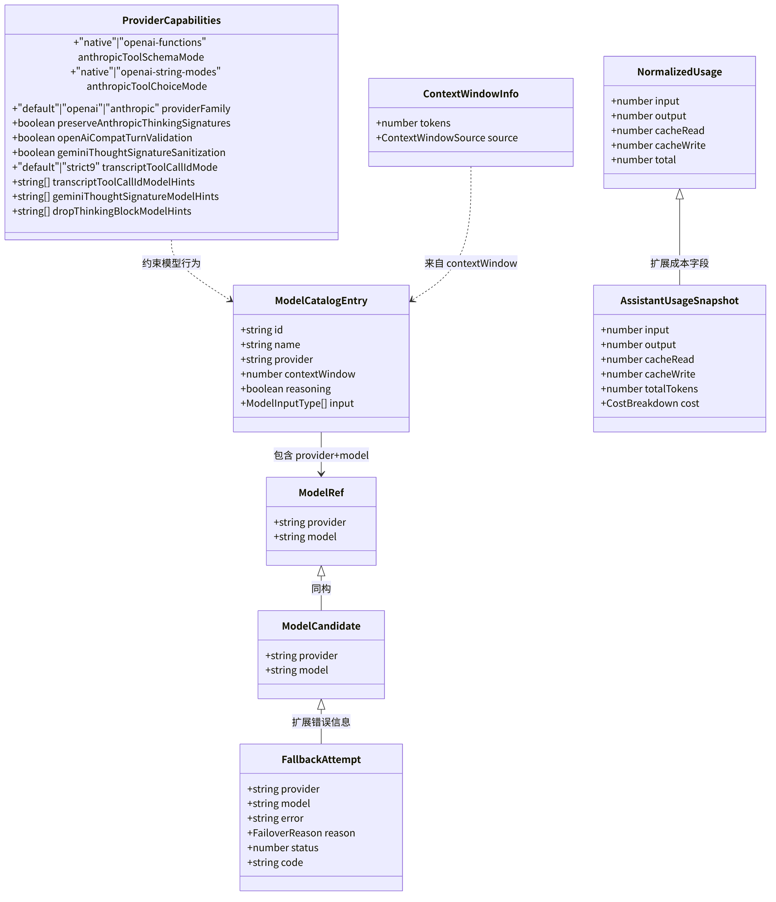
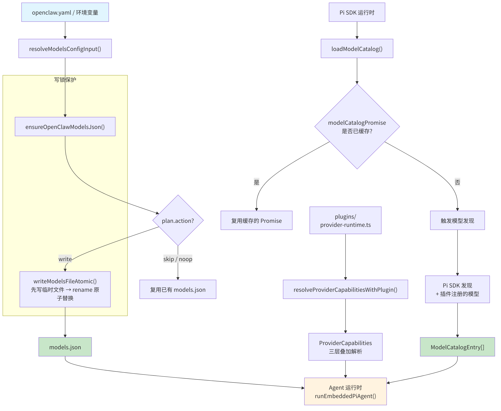
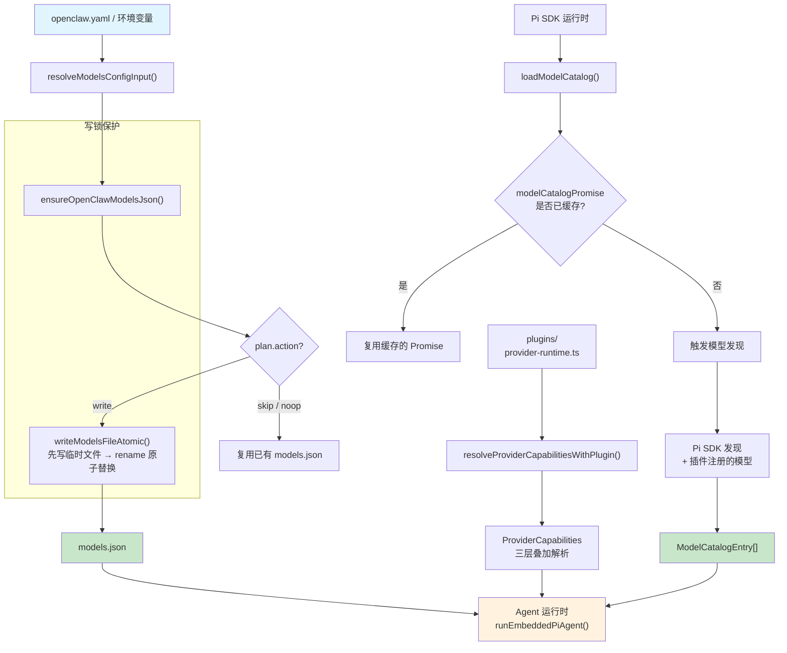
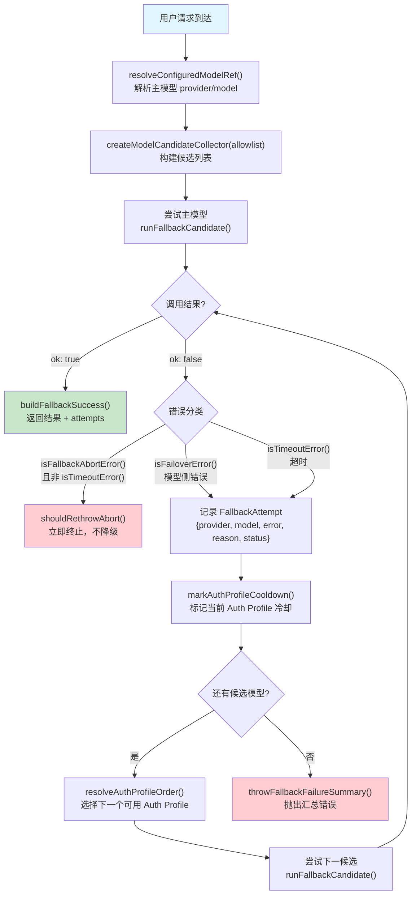
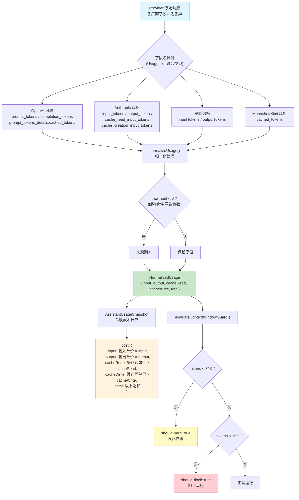
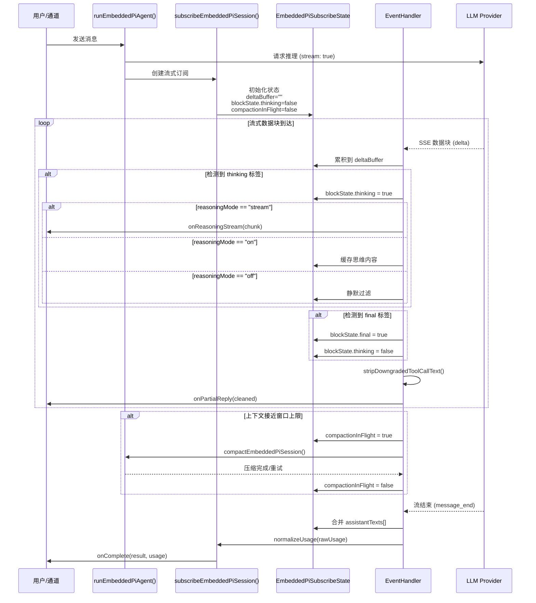

<div v-pre>

# 第4章 Provider 抽象层

> "模型供应商的 API 是最不可靠的依赖之一——它的变更不遵循语义版本，它的故障不提前通知，它的限速策略随时可能收紧。你的架构必须假设任何模型都可能在下一秒消失。"

> **本章要点**
> - 理解多模型适配架构：如何用统一接口屏蔽 OpenAI、Anthropic、Google 等供应商差异
> - 掌握模型路由与降级策略：Auth Profile 轮转、冷却期、自动故障切换
> - 深入 Token 计量与成本控制：预算感知的上下文管理
> - 解析流式响应处理的工程挑战与解决方案


上一章，我们剖析了 Gateway 如何管理系统的生命周期与配置。Gateway 是控制中心，但它本身不做 AI 推理——推理的重担，交给了 Provider 抽象层。

2025 年 3 月 14 日，Anthropic 的 API 在亚太区域出现了长达 47 分钟的服务降级。如果你的 Agent 系统只接入了 Claude，那 47 分钟里，你的所有用户——无论身在 Telegram、Discord 还是 WhatsApp——都在面对一个沉默的 Agent。47 分钟的沉默，在用户体验上等于 47 年。

但如果你运行的是 OpenClaw，你的用户甚至不会察觉这次故障。

OpenClaw 的 Provider 抽象层在检测到 Claude 返回 429 的瞬间，便以毫秒级速度切换到 GPT-4 作为降级模型，同时完整保留对话上下文。当 Claude 恢复后，系统在冷却期结束后自动切回主模型——整个过程，对用户**完全透明**。

> 这不是魔法，这是架构设计的力量。

> 🔥 **深度洞察：供应商关系的本质**
>
> Provider 抽象层的设计哲学，与国际贸易中的**供应链多元化**策略如出一辙。一家成熟的制造企业不会把全部原材料押注在单一供应商身上——不是因为那个供应商不好，而是因为**任何单一依赖都是系统性风险**。芯片短缺时，同时与台积电、三星和英特尔合作的公司活了下来；只依赖单一代工厂的公司停产了。AI 模型市场正在经历同样的演变：今天最好的模型可能是 Claude，明天可能是 GPT-6，后天可能是一个开源模型。Provider 抽象层保证的不是"永远选到最好的模型"，而是"无论最好的模型是谁，你都能在秒级切换过去"。这才是真正的战略优势。

要实现这种丝滑的模型切换，系统必须攻克三道难关：如何抹平不同供应商的 API 差异？如何在模型之间智能路由和降级？如何统一计量来自不同供应商的 Token 消耗？三个问题，环环相扣，层层递进。本章将逐一剖析 OpenClaw 给出的答案。

## 4.1 多模型适配架构

下图展示了 Provider 抽象层的核心类型层次结构，所有类名和字段均来自源码实现：


**图 4-1：Provider 核心类型层次图**

```mermaid
classDiagram
    class ModelRef {
        +string provider
        +string model
    }
    class ModelCatalogEntry {
        +string id
        +string name
        +string provider
        +number contextWindow
        +boolean reasoning
        +ModelInputType[] input
    }
    class ProviderCapabilities {
        +"native"|"openai-functions" anthropicToolSchemaMode
        +"native"|"openai-string-modes" anthropicToolChoiceMode
        +"default"|"openai"|"anthropic" providerFamily
        +boolean preserveAnthropicThinkingSignatures
        +boolean openAiCompatTurnValidation
        +boolean geminiThoughtSignatureSanitization
        +"default"|"strict9" transcriptToolCallIdMode
        +string[] transcriptToolCallIdModelHints
        +string[] geminiThoughtSignatureModelHints
        +string[] dropThinkingBlockModelHints
    }
    class ModelCandidate {
        +string provider
        +string model
    }
    class FallbackAttempt {
        +string provider
        +string model
        +string error
        +FailoverReason reason
        +number status
        +string code
    }
    class NormalizedUsage {
        +number input
        +number output
        +number cacheRead
        +number cacheWrite
        +number total
    }
    class AssistantUsageSnapshot {
        +number input
        +number output
        +number cacheRead
        +number cacheWrite
        +number totalTokens
        +CostBreakdown cost
    }
    class ContextWindowInfo {
        +number tokens
        +ContextWindowSource source
    }

    ModelRef <|-- ModelCandidate : 同构
    ModelCandidate <|-- FallbackAttempt : 扩展错误信息
    ModelCatalogEntry --> ModelRef : 包含 provider+model
    NormalizedUsage <|-- AssistantUsageSnapshot : 扩展成本字段
    ProviderCapabilities ..> ModelCatalogEntry : 约束模型行为
    ContextWindowInfo ..> ModelCatalogEntry : 来自 contextWindow
```






> 该图基于 `src/agents/model-selection.ts`、`src/agents/model-catalog.ts`、`src/agents/provider-capabilities.ts`、`src/agents/model-fallback.types.ts`、`src/agents/usage.ts` 和 `src/agents/context-window-guard.ts` 中的类型定义绘制。所有字段名与源码一致。

### 4.1.1 Provider 标识与规范化

OpenClaw 将每个模型供应商抽象为一个 **Provider**。Provider 的核心标识是一个字符串 ID，经过规范化处理后存储和匹配。

规范化逻辑位于 `src/agents/provider-id.ts`：

```typescript
export function normalizeProviderId(provider: string): string {
  const normalized = provider.trim().toLowerCase();
  if (normalized === "z.ai" || normalized === "z-ai") {
    return "zai";
  }
  if (normalized === "opencode-zen") {
    return "opencode";
  }
  if (normalized === "bedrock" || normalized === "aws-bedrock") {
    return "amazon-bedrock";
  }
  if (normalized === "bytedance" || normalized === "doubao") {
    return "volcengine";
  }
  return normalized;
}
```

这个函数的设计思想值得注意：它通过一系列 `if` 分支将历史遗留名称、厂商别名统一映射到规范形式。例如，`"bytedance"` 和 `"doubao"` 统一映射为 `"volcengine"`（火山引擎），`"bedrock"` 和 `"aws-bedrock"` 统一为 `"amazon-bedrock"`。

这种规范化机制允许用户在配置中使用各种惯用名称，而系统内部始终使用统一标识。

> **关键概念：Auth Profile（认证配置）**
> Auth Profile 是 OpenClaw 管理 API 密钥的核心抽象。每个 Auth Profile 包含一个或多个 API Key，支持轮转（同一供应商多个 Key 交替使用）和冷却期（Key 被限速后暂时停用）。Provider 层通过 Auth Profile 而非直接持有密钥来访问 LLM API，实现密钥管理与模型调用的解耦。

### 4.1.2 模型引用与选择

模型的引用采用 `provider/model` 的复合键形式。核心类型定义在 `src/agents/model-selection.ts`：

```typescript
export type ModelRef = {
  provider: string;
  model: string;
};

export type ThinkLevel = "off" | "minimal" | "low" | "medium"
  | "high" | "xhigh" | "adaptive";
```

模型键的构建逻辑简洁而巧妙：

```typescript
export function modelKey(provider: string, model: string) {
  const providerId = provider.trim();
  const modelId = model.trim();
  if (!providerId) return modelId;
  if (!modelId) return providerId;
  return modelId.toLowerCase().startsWith(`${providerId.toLowerCase()}/`)
    ? modelId
    : `${providerId}/${modelId}`;
}
```

如果模型 ID 本身已经包含了 Provider 前缀（例如 `"anthropic/claude-opus-4-6"`），函数会避免重复拼接。这种防御性设计在多层调用栈中非常重要。

### 4.1.3 默认模型与上下文窗口

系统的默认配置定义在 `src/agents/defaults.ts`：

```typescript
export const DEFAULT_PROVIDER = "anthropic";
export const DEFAULT_MODEL = "claude-opus-4-6";
export const DEFAULT_CONTEXT_TOKENS = 200_000;
```

这里透露了 OpenClaw 的设计偏好：以 Anthropic 的 Claude 系列作为默认模型，200K 的上下文窗口作为保守回退值。

### 4.1.4 Provider 能力声明

不同 Provider 对工具调用、消息格式等有不同的支持方式。`src/agents/provider-capabilities.ts` 定义了能力声明机制：

```typescript
export type ProviderCapabilities = {
  anthropicToolSchemaMode: "native" | "openai-functions";
  anthropicToolChoiceMode: "native" | "openai-string-modes";
  providerFamily: "default" | "openai" | "anthropic";
  preserveAnthropicThinkingSignatures: boolean;
  openAiCompatTurnValidation: boolean;
  geminiThoughtSignatureSanitization: boolean;
  transcriptToolCallIdMode: "default" | "strict9";
  // ... 更多能力声明
};
```

能力解析采用三层叠加策略：

```typescript
export function resolveProviderCapabilities(
  provider?: string | null,
  options?: ProviderCapabilityLookupOptions,
): ProviderCapabilities {
  const normalized = normalizeProviderId(provider ?? "");
  const pluginCapabilities = normalized
    ? resolveProviderCapabilitiesWithPlugin({ ... })
    : undefined;
  return {
    ...DEFAULT_PROVIDER_CAPABILITIES,     // 第1层：全局默认值
    ...CORE_PROVIDER_CAPABILITIES[normalized],  // 第2层：内核预设
    ...(pluginCapabilities ?? PLUGIN_CAPABILITIES_FALLBACKS[normalized]),  // 第3层：插件声明
  };
}
```

这种叠加模式遵循"约定优于配置"原则：大多数 Provider 使用默认值即可工作；核心 Provider（如 `anthropic-vertex`、`amazon-bedrock`）有内核级预设；第三方 Provider 通过插件注入能力声明。

下图展示了 Provider 的注册与发现机制——从配置文件到运行时可用模型列表的完整流转：

**图 4-2：Provider 注册与模型发现机制**






> 此图基于 `src/agents/models-config.ts` 的 `ensureOpenClawModelsJson()`、`src/agents/model-catalog.ts` 的 `loadModelCatalog()` 和 `src/agents/provider-capabilities.ts` 的 `resolveProviderCapabilities()` 绘制。`writeModelsFileAtomic` 的原子写入和 `withModelsJsonWriteLock` 的写锁机制保证了并发安全。

## 4.2 模型路由与降级策略

### 4.2.1 模型目录

模型目录（Model Catalog）是 Provider 抽象层的动态注册表。`src/agents/model-catalog.ts` 定义了目录的核心数据结构：

```typescript
export type ModelCatalogEntry = {
  id: string;
  name: string;
  provider: string;
  contextWindow?: number;
  reasoning?: boolean;
  input?: ModelInputType[];
};
```

目录的构建是一个懒加载过程：

```typescript
let modelCatalogPromise: Promise<ModelCatalogEntry[]> | null = null;

export async function loadModelCatalog(params?: {
  config?: OpenClawConfig;
  useCache?: boolean;
}): Promise<ModelCatalogEntry[]> {
  if (params?.useCache === false) {
    modelCatalogPromise = null;
  }
  // ... 从 Pi SDK 和配置中发现模型
}
```

通过模块级的 `Promise` 变量实现单例式缓存——首次调用触发发现流程，后续调用复用结果。`useCache: false` 可强制刷新。

### 4.2.2 模型配置生成

`src/agents/models-config.ts` 负责将用户配置转化为运行时模型文件。核心流程：

1. 读取 OpenClaw 配置（`openclaw.yaml` / 环境变量）
2. 发现可用的 Provider 及其模型
3. 生成 `models.json` 到 Agent 目录

```typescript
export async function ensureOpenClawModelsJson(
  config?: OpenClawConfig,
  agentDirOverride?: string,
): Promise<{ agentDir: string; wrote: boolean }> {
  const resolved = resolveModelsConfigInput(config);
  const agentDir = agentDirOverride ?? resolveOpenClawAgentDir();
  const targetPath = path.join(agentDir, "models.json");

  return await withModelsJsonWriteLock(targetPath, async () => {
    const plan = await planOpenClawModelsJson({ ... });
    if (plan.action === "skip" || plan.action === "noop") {
      return { agentDir, wrote: false };
    }
    await writeModelsFileAtomic(targetPath, plan.contents);
    return { agentDir, wrote: true };
  });
}
```

注意 `writeModelsFileAtomic` 的原子写入策略：先写临时文件，再通过 `rename` 操作替换，避免读写竞态导致的文件损坏。写锁（`withModelsJsonWriteLock`）则保证并发写入的序列化。

### 4.2.3 Fallback 降级机制


**图 4-3：模型路由与降级流程**

下图展示了一次模型调用从主模型尝试到降级候选列表轮转的完整决策路径。核心入口是 `resolveConfiguredModelRef()`（解析配置的主模型），降级由 `createModelCandidateCollector()` 构建的候选列表驱动，每次失败都会记录 `FallbackAttempt` 并推进到下一个候选者。



> 此图基于 `src/agents/model-fallback.ts` 中的 `createModelCandidateCollector()`、`runFallbackCandidate()`、`isFallbackAbortError()`、`shouldRethrowAbort()`、`isTimeoutError()` 和 `buildFallbackSuccess()` 绘制。`FallbackAttempt` 类型定义在 `src/agents/model-fallback.types.ts`。Auth Profile 的冷却与轮转逻辑来自 `src/agents/auth-profiles/usage.ts`。

降级策略是 Provider 抽象层最核心的设计之一。在深入实现之前，先明确**什么时候会触发降级**：

| 触发条件 | 具体场景 | 系统行为 |
|---------|---------|---------|
| **HTTP 429 Too Many Requests** | API 密钥达到速率限制（如 Anthropic 每分钟 50 请求） | 先轮转到同 Provider 的下一个 Auth Profile；所有 Profile 冷却中则降级到下一个模型 |
| **HTTP 500/502/503** | Provider 服务端故障或维护 | 标记当前 Profile 冷却，尝试降级模型 |
| **上下文溢出错误** | 对话历史超过模型的上下文窗口（如发送 250K token 给 128K 窗口的模型） | 先尝试压缩上下文；压缩后仍超限则降级到更大窗口的模型 |
| **认证失败 (401/403)** | API 密钥过期、额度用尽或权限不足 | 轮转到下一个 Auth Profile；所有 Profile 失败则降级模型 |
| **网络超时** | 请求超过配置的超时时间（默认 120 秒） | 视为可降级错误，尝试下一个候选模型 |
| **模型不存在 (404)** | 请求了已下线的模型 ID | 降级到下一个候选模型 |

> 💡 **最佳实践**：为每个通道配置独立的 Auth Profile，避免单点故障导致所有通道同时失效。同一个 Provider 可以配置多个 Auth Profile（不同的 API Key），系统会在主 Key 被限速时自动轮转到下一个。

**不触发降级**的情况：用户主动取消（`AbortError`）——系统识别为用户意图，立即终止，不浪费资源尝试其他模型。

`src/agents/model-fallback.ts` 实现了完整的降级链：

```typescript
type ModelFallbackRunFn<T> = (
  provider: string,
  model: string,
  options?: ModelFallbackRunOptions,
) => Promise<T>;
```

降级的核心逻辑是**候选收集器**（Candidate Collector）：

```typescript
function createModelCandidateCollector(allowlist) {
  const seen = new Set<string>();
  const candidates: ModelCandidate[] = [];

  const addCandidate = (candidate, enforceAllowlist) => {
    const key = modelKey(candidate.provider, candidate.model);
    if (seen.has(key)) return;      // 去重
    if (enforceAllowlist && allowlist && !allowlist.has(key)) return;
    seen.add(key);
    candidates.push(candidate);
  };
  // ...
}
```

降级流程的执行策略：

1. **主模型优先**：先尝试用户配置的主模型
2. **配置的 fallback 列表**：按顺序尝试用户显式配置的降级模型
3. **允许列表过滤**：只有在允许列表中的模型才能作为降级目标
4. **Abort 信号识别**：区分用户主动取消和模型端错误——用户取消立即终止，不走降级

关键的错误分类逻辑：

```typescript
function isFallbackAbortError(err: unknown): boolean {
  if (isFailoverError(err)) return false;  // 模型错误，继续降级
  const name = "name" in err ? String(err.name) : "";
  return name === "AbortError";  // 仅识别真正的用户取消
}

function shouldRethrowAbort(err: unknown): boolean {
  return isFallbackAbortError(err) && !isTimeoutError(err);
}
```

`isTimeoutError` 的检查尤其精妙——它确保超时不会被误判为用户取消，从而跳过降级。

### 4.2.4 认证配置轮转

Auth Profile 机制（`src/agents/auth-profiles.ts`）为每个 Provider 管理多套凭证：

```typescript
export function resolveAuthProfileOrder(...): ...
export function markAuthProfileCooldown(...): ...
export function isProfileInCooldown(...): ...
export function getSoonestCooldownExpiry(...): ...
```

当某个 API Key 触发限流时，系统自动标记冷却期并切换到下一个可用配置。这种轮转机制使得 OpenClaw 在高负载场景下能够充分利用多个 API Key 的配额。

## 4.3 Token 计量与成本控制

**图 4-4：Token 计量与成本控制流程**

下图展示了 Token 使用量从 Provider 原始响应到标准化 `NormalizedUsage` 再到成本计算的完整链路。关键挑战在于不同厂商（OpenAI、Anthropic、Moonshot 等）使用完全不同的字段命名，`UsageLike` 联合类型通过运行时字段探测实现了统一归一化。



> 此图基于 `src/agents/usage.ts` 的 `UsageLike`、`normalizeUsage()`、`NormalizedUsage`、`AssistantUsageSnapshot` 和 `src/agents/context-window-guard.ts` 的 `evaluateContextWindowGuard()`（阈值 `CONTEXT_WINDOW_HARD_MIN_TOKENS = 16_000`、`CONTEXT_WINDOW_WARN_BELOW_TOKENS = 32_000`）绘制。

### 4.3.1 Usage 规范化

不同供应商返回的 Token 使用量字段命名各不相同。`src/agents/usage.ts` 定义了统一的归一化层：

```typescript
// src/agents/usage.ts — UsageLike 联合类型（字段来自不同供应商命名惯例）
export type UsageLike = {
  input?: number;  output?: number;  total?: number;
  // OpenAI 风格：prompt_tokens / completion_tokens
  prompt_tokens?: number;  completion_tokens?: number;
  prompt_tokens_details?: { cached_tokens?: number };
  // Anthropic 风格：input_tokens / cache_read_input_tokens
  input_tokens?: number;  output_tokens?: number;
  cache_read_input_tokens?: number;  cache_creation_input_tokens?: number;
  // 驼峰风格 + Moonshot 专用
  inputTokens?: number;  outputTokens?: number;  cached_tokens?: number;
  // ... 更多变体（共 20+ 字段）
};

// 归一化后的统一结构，消除供应商差异
export type NormalizedUsage = {
  input?: number;  output?: number;
  cacheRead?: number;  cacheWrite?: number;  total?: number;
};
```

> ⚠️ **注意**：不同 Provider 的 Token 计量方式存在显著差异。Anthropic 的缓存 Token（`cache_read_input_tokens`）不计入输入 Token 配额但有独立计费；OpenAI 的 `cached_tokens` 可能导致 `prompt_tokens - cached_tokens` 为负数。OpenClaw 的归一化层会自动处理这些边界情况，但在核算成本时需要注意各厂商的定价模型差异。

规范化函数处理了大量边界情况：

```typescript
export function normalizeUsage(raw?: UsageLike | null): NormalizedUsage | undefined {
  const rawInput = asFiniteNumber(
    raw.input ?? raw.inputTokens ?? raw.input_tokens
    ?? raw.promptTokens ?? raw.prompt_tokens,
  );
  // 当 cached_tokens > prompt_tokens 时结果为负，夹紧到 0
  const input = rawInput !== undefined && rawInput < 0 ? 0 : rawInput;
  // ...
}
```

`rawInput < 0` 的处理是一个典型的防御性编程案例：某些 Provider 在返回 `prompt_tokens` 时已经减去了缓存命中的 Token 数，导致出现负数。

### 4.3.2 成本快照

`AssistantUsageSnapshot` 将 Token 使用量与成本关联：

```typescript
export type AssistantUsageSnapshot = {
  input: number;
  output: number;
  cacheRead: number;
  cacheWrite: number;
  totalTokens: number;
  cost: {
    input: number;
    output: number;
    cacheRead: number;
    cacheWrite: number;
    total: number;
  };
};
```

这个结构支持精细的成本归因：输入、输出、缓存读取、缓存写入各自独立计价，使运营者可以精确了解每次对话的成本构成。

### 4.3.3 上下文窗口守卫

`src/agents/context-window-guard.ts` 提供上下文大小的安全边界：

```typescript
export const CONTEXT_WINDOW_HARD_MIN_TOKENS = 16_000;
export const CONTEXT_WINDOW_WARN_BELOW_TOKENS = 32_000;

export function resolveContextWindowInfo(params: {
  cfg: OpenClawConfig | undefined;
  provider: string;
  modelId: string;
  modelContextWindow?: number;
  defaultTokens: number;
}): ContextWindowInfo {
  // 优先级：modelsConfig > model元数据 > 默认值
  // 如果用户设置了 contextTokens 上限且小于推断值，则以用户设置为准
}
```

上下文窗口的解析遵循四层优先级：

| 优先级 | 来源 | 说明 |
|--------|------|------|
| 1 | `modelsConfig` | 用户在 models.providers 中显式配置 |
| 2 | `model` | 模型自身元数据报告 |
| 3 | `agentContextTokens` | 用户设置的全局上限（取最小值） |
| 4 | `default` | 系统默认的 200K |

守卫系统还提供双级告警：

```typescript
export function evaluateContextWindowGuard(params): ContextWindowGuardResult {
  return {
    ...params.info,
    shouldWarn: tokens > 0 && tokens < warnBelow,   // 32K 以下告警
    shouldBlock: tokens > 0 && tokens < hardMin,      // 16K 以下阻止
  };
}
```

## 4.4 流式响应处理

**图 4-5：流式响应处理序列图**

下图展示了流式响应从 LLM Provider 到用户屏幕的完整处理链路。`subscribeEmbeddedPiSession()` 作为流式事件的核心分发器，将 LLM 返回的 token 流实时转发给通道层，同时通过 `EmbeddedPiSubscribeState` 跟踪工具调用状态和上下文更新。



> 此图基于 `src/agents/pi-embedded-runner.ts` 的模块导出、`src/agents/pi-embedded-subscribe.ts` 的 `subscribeEmbeddedPiSession()` 和 `EmbeddedPiSubscribeState` 状态字段、以及 `src/agents/pi-embedded-subscribe.handlers.ts` 中的事件处理器绘制。思维链过滤使用 `THINKING_TAG_SCAN_RE` 和 `FINAL_TAG_SCAN_RE` 正则表达式，支持 `<thinking>`、`<thought>`、`<antthinking>` 等变体。

### 4.4.1 嵌入式 Pi 代理运行器

OpenClaw 使用 **Pi Agent** 作为底层的 LLM 交互引擎。`src/agents/pi-embedded-runner.ts` 是一个模块聚合入口，暴露了核心运行 API：

```typescript
export { runEmbeddedPiAgent } from "./pi-embedded-runner/run.js";
export {
  abortEmbeddedPiRun,
  isEmbeddedPiRunActive,
  isEmbeddedPiRunStreaming,
  queueEmbeddedPiMessage,
  waitForEmbeddedPiRunEnd,
} from "./pi-embedded-runner/runs.js";
```

这些 API 揭示了 OpenClaw 的流式运行模型：

- `runEmbeddedPiAgent`：启动一次 Agent 运行
- `isEmbeddedPiRunStreaming`：检查是否正在流式输出
- `queueEmbeddedPiMessage`：向正在运行的会话注入消息
- `abortEmbeddedPiRun`：中止当前运行
- `waitForEmbeddedPiRunEnd`：等待运行完成

### 4.4.2 流式订阅系统

`src/agents/pi-embedded-subscribe.ts` 实现了流式事件的订阅与处理。其核心是 `subscribeEmbeddedPiSession` 函数：

```typescript
export function subscribeEmbeddedPiSession(
  params: SubscribeEmbeddedPiSessionParams
) {
  const state: EmbeddedPiSubscribeState = {
    assistantTexts: [],
    toolMetas: [],
    deltaBuffer: "",
    blockBuffer: "",
    blockState: { thinking: false, final: false,
                  inlineCode: createInlineCodeState() },
    compactionInFlight: false,
    pendingCompactionRetry: 0,
    messagingToolSentTexts: [],
    // ... 大量状态字段
  };
  // ...
}
```

状态管理的复杂度反映了流式处理的内在挑战：

1. **文本增量缓冲**（`deltaBuffer`）：模型返回的文本片段需要累积后才能进行格式处理
2. **思维链追踪**（`blockState.thinking`）：识别 `<thinking>` 标签，决定是否向用户暴露推理过程
3. **压缩飞行状态**（`compactionInFlight`）：流式传输中可能触发上下文压缩（详见第5章 5.2节 Context Engine），需要协调两个异步流程
4. **消息去重**（`messagingToolSentTexts`）：防止工具调用导致的消息重复发送

### 4.4.3 思维链过滤

流式订阅中的一个关键特性是思维链（thinking）内容的过滤：

```typescript
const THINKING_TAG_SCAN_RE =
  /<\s*(\/?)\s*(?:think(?:ing)?|thought|antthinking)\s*>/gi;
const FINAL_TAG_SCAN_RE = /<\s*(\/?)\s*final\s*>/gi;
```

这些正则表达式识别各种变体的思维标签（`<thinking>`、`<thought>`、`<antthinking>` 等），支持三种推理模式：

- `off`：完全过滤思维内容
- `on`：等思维完成后一次性发送
- `stream`：实时流式传输思维过程

### 4.4.4 压缩与流式的协调

当流式响应正在进行时，上下文可能接近窗口上限，触发自动压缩。`compactionInFlight` 和 `pendingCompactionRetry` 等字段协调这个并发过程：

```typescript
compactionInFlight: false,
pendingCompactionRetry: 0,
compactionRetryResolve: undefined,
compactionRetryReject: undefined,
compactionRetryPromise: null,
```

这种设计允许压缩操作在流式输出的间隙执行，不阻塞用户可见的输出流。压缩失败时支持重试，最终通过 Promise 链将结果传播回主流程。

## 4.5 主流 LLM Provider 对比

下表对比了 OpenClaw 所支持的主流 Provider 在关键特性上的差异。这些差异正是 Provider 抽象层需要抹平的核心挑战：

**表 4-1：主流 LLM Provider 特性对比**

| 特性 | Anthropic | OpenAI | Google Gemini | Amazon Bedrock | 火山引擎 (Volcengine) | Moonshot/Kimi |
|------|-----------|--------|---------------|----------------|----------------------|---------------|
| **providerFamily** | `anthropic` | `openai` | `default` | `anthropic` | `default` | `default` |
| **normalizeProviderId** 别名 | — | — | — | `bedrock`, `aws-bedrock` | `bytedance`, `doubao` | `kimi`, `kimi-code` |
| **工具调用模式** | native schema | openai-functions | openai-functions | native schema (同 Anthropic) | openai-functions | openai-functions |
| **思维链标签** | `<thinking>`, `<antthinking>` | 无原生标签 | `<thought>` (需 sanitization) | `<thinking>` (同 Anthropic) | 无 | 无 |
| **dropThinkingBlockModelHints** | `["claude"]` | — | — | `["claude"]` | — | — |
| **transcriptToolCallIdMode** | `default` | `default` | `default` | `default` | `default` | `default` |
| **Token 用量字段** | `input_tokens`, `output_tokens`, `cache_read_input_tokens` | `prompt_tokens`, `completion_tokens`, `prompt_tokens_details.cached_tokens` | `prompt_tokens`, `completion_tokens` | 同 Anthropic | 同 OpenAI 风格 | `cached_tokens` (专用缓存字段) |
| **流式响应** | SSE (原生) | SSE (原生) | SSE | SSE | SSE | SSE |
| **上下文窗口** | 最高 200K | 最高 128K | 最高 1M–2M | 取决于底层模型 | 取决于模型 | 最高 128K |
| **geminiThoughtSignatureSanitization** | false | false | 通过 opencode 插件启用 | false | false | false |

> 此表中的 `providerFamily`、`normalizeProviderId`、`dropThinkingBlockModelHints` 等字段均来自 `src/agents/provider-capabilities.ts` 和 `src/agents/provider-id.ts` 的源码实现。Mistral 系列使用 `transcriptToolCallIdMode: "strict9"`，此处省略未列。

## 4.6 Provider 能力发现与自动注册

### 4.6.1 Ollama 本地模型自动发现

OpenClaw 支持自动发现本地运行的 Ollama 模型实例。当配置中启用了 Ollama Provider 后，Gateway 启动时会调用 Ollama API 获取可用模型列表，并自动注册为可用的 Provider 候选：

```typescript
// src/agents/models-config.providers.ts（从模块名推断的功能）
// 自动扫描 Ollama 的 /api/tags 端点
// 将发现的模型注册到 Provider 注册表
// 支持自定义 Ollama 端点 URL
```

这使得用户只需在配置中指定 `ollama` 作为 Provider，无需手动列出每个模型名称。模型列表会随 Ollama 实例的变化自动更新。

### 4.6.2 GitHub Copilot 企业版集成

OpenClaw 支持通过 GitHub Copilot 的企业版 API 访问模型，利用用户已有的 GitHub 订阅。这种集成通过 `src/agents/auth-profiles.ts` 中的认证配置文件实现——GitHub Token 作为一种 Auth Profile 参与轮转。

### 4.6.3 自定义 Provider 注册

`src/agents/custom-api-registry.ts` 的 `ensureCustomApiRegistered` 函数允许插件和扩展注册自定义 Provider。扩展只需提供一个满足 `StreamFn` 签名的函数，即可将任何 LLM API 接入 OpenClaw：

```typescript
// 自定义 Provider 注册示例
ensureCustomApiRegistered("my-custom-llm", async (model, context, options) => {
  // 调用自定义 LLM API
  // 返回标准化的流式响应
});
```

这种设计使得 OpenClaw 能够适配任何新出现的 LLM 服务，包括私有部署的模型。

> ⚠️ **常见陷阱：降级链配置中的模型名拼写**
>
> 模型降级链中的每个模型名必须与 Provider 注册的模型 ID 精确匹配。常见错误：
> ```json5
> // ❌ 错误：模型名使用了旧的命名格式
> { "fallbacks": ["claude-3-opus-20240229", "gpt-4-turbo"] }
>
> // ✅ 正确：使用当前有效的模型 ID
> { "fallbacks": ["claude-opus-4-6", "gpt-4.1"] }
> ```
> 如果降级链中包含已下线或不存在的模型 ID，该候选会被静默跳过。当所有候选都失效时，`throwFallbackFailureSummary()` 会抛出汇总错误。通过查看 Gateway 日志中的 `FallbackAttempt` 记录可以排查降级链中哪些模型不可用。

> ⚠️ **常见陷阱：`normalizeUsage()` 返回 `undefined`**
>
> 某些 Provider（尤其是通过 OpenAI 兼容端点接入的本地模型）不返回 Token 用量信息。此时 `normalizeUsage()` 返回 `undefined`，而非零值对象。依赖用量数据做成本核算时，务必处理 `undefined` 情况：
> ```typescript
> const usage = normalizeUsage(rawResponse.usage);
> // ❌ 错误：直接访问可能为 undefined 的对象
> const totalCost = usage.total * pricePerToken;
>
> // ✅ 正确：先检查 undefined
> const totalCost = usage?.total ? usage.total * pricePerToken : 0;
> ```

## 4.7 实战：Provider 故障排查

### 4.7.1 常见问题与诊断

在生产环境中，Provider 相关的问题是最常见的故障源。以下是典型问题和排查路径：

**问题 1：所有模型调用都返回 401**
- 检查 API 密钥是否在 `openclaw.yaml` 中正确配置
- 检查 Auth Profile 是否处于 cooldown 状态（`resolveProfilesUnavailableReason()`）
- 查看日志中的 `model-fallback` 子系统输出

**问题 2：模型降级到了不期望的模型**
- 检查 `models.allowlist` 配置是否正确
- 查看 `logModelFallbackDecision()` 的日志输出
- 确认降级候选链中的模型都可用

**问题 3：Token 用量统计不准确**
- 不同 Provider 的 token 统计字段可能不同（`input_tokens` vs `prompt_tokens`）
- 缓存 token 可能不被计入使用量
- 检查 Provider 的能力声明中的 token 字段映射

### 4.7.2 Provider 性能调优

1. **配置多个 Auth Profile**：同一 Provider 使用多个 API 密钥，分散限流风险
2. **合理设置降级链**：将低延迟模型放在前面，高性能模型作为主力
3. **启用缓存**：对于支持提示词缓存的 Provider（Anthropic），利用缓存减少 token 消耗
4. **监控冷却期**：如果某个 Profile 频繁进入冷却期，考虑降低调用频率或增加密钥

## 4.8 Provider 系统的设计决策分析

### 4.8.1 为什么选择函数式 StreamFn 而非类继承？

传统的适配器模式通常使用类继承：每个 Provider 继承一个基类，实现抽象方法。OpenClaw 选择了函数式的 `StreamFn` 签名：

```typescript
type StreamFn = (model: string, context: any, options: any) => AsyncGenerator;
```

这个选择的原因：

1. **轻量性**：添加新 Provider 只需一个函数，无需定义类、构造函数、继承链
2. **可组合性**：函数可以被高阶函数包装（如添加日志、重试、缓存），而类继承不容易组合
3. **测试友好**：测试中只需 mock 一个函数，而非整个类实例
4. **避免菱形继承**：如果某个 Provider 需要同时使用 OpenAI 兼容协议和自定义认证，类继承会面临多继承问题

### 4.8.2 Auth Profile 轮转 vs 单密钥配置

大多数 Agent 框架只支持单 API 密钥配置。OpenClaw 的 Auth Profile 轮转机制允许为同一个 Provider 配置多个密钥，并在密钥被限流时自动切换。

这个设计源于实际使用中的痛点：单个 API 密钥的速率限制往往不足以支撑多 Agent 并发调用。通过多密钥轮转，OpenClaw 可以在不增加成本的情况下提升有效吞吐量。

> **实战场景：高并发下的密钥轮转**
>
> 想象你运营一个面向 200 人的 Discord 社区 Agent，配置了 Anthropic 的三个 API 密钥。周五晚上社区活跃度激增，密钥 A 在 10 秒内收到 5 个并发请求，触发了 Anthropic 的 429 速率限制。
>
> OpenClaw 的 Auth Profile 轮转机制立即介入：
> 1. 密钥 A 被标记为"冷却中"，冷却计时器启动
> 2. 后续请求自动路由到密钥 B
> 3. 密钥 B 同样触发限流时，继续切换到密钥 C
> 4. 当密钥 A 的冷却期结束后，重新加入可用轮转池
>
> 如果三个密钥同时耗尽，降级链接管——系统自动切换到配置的备用 Provider（如 GPT-4.1），并在 Agent 回复末尾附加一条不可见的元数据标记，记录本次降级事件。整个过程中，社区成员只会感觉到"Agent 偶尔换了种说话风格"，不会遇到任何错误或超时。

### 4.8.3 Provider 能力声明的三层叠加

为什么不用一个大的配置文件定义所有 Provider 的能力？

三层叠加（硬编码默认 → 注册时声明 → 配置覆盖）的设计考量：

- **硬编码默认**：确保系统在零配置时也能正常工作
- **注册时声明**：允许动态发现的 Provider（如 Ollama）声明自己的能力
- **配置覆盖**：让用户微调特定 Provider 的行为（如为特定模型启用 thinking block 过滤）

这种渐进式的能力声明最大化了开箱即用体验，同时保留了完全的可定制性。

## 4.9 小结：模型是可替换的，协议是统一的

回到本章开头的场景：Anthropic 服务降级，你的用户浑然不知。

这个体验的背后，是 Provider 抽象层的五大支柱在协同工作：

1. **规范化标识**——把 `claude-3-opus`、`anthropic/claude-3-opus`、`claude-3-opus-20240229` 统一为一个身份。混乱的命名不再是你的问题。
2. **三层能力声明**——硬编码默认 → 注册时声明 → 配置覆盖。零配置即可用，深度配置更强大。
3. **降级链 + Auth 轮转**——当主模型倒下，备用模型在毫秒内接管。多密钥轮转让 API 配额的利用率最大化。
4. **Token 归一化**——Anthropic 的 `input_tokens` 和 OpenAI 的 `prompt_tokens` 最终都变成了 `NormalizedUsage.input`，成本控制从此有了统一的度量衡。
5. **流式状态机**——处理思维链过滤和压缩协调的并发挑战，让用户看到的始终是干净、流畅的响应。

> **在 AI 领域，今天的最强模型可能是明天的次优选择。唯一不变的，是变化本身。** Provider 抽象层的价值不在于支持了哪些模型，而在于它让"更换模型"变成了一个配置变更而非代码重写。

这个"模型无关"的基础，为下一章的 Session 系统铺平了道路——因为只有当底层模型可以自由切换时，上层的会话管理才能真正做到持久化和可恢复。

### 🛠️ 试一试：配置一个新 Provider

在已有的 Gateway 基础上，尝试添加第二个 Provider 并体验降级链：

```bash
# 编辑 openclaw.json5，添加多个 Provider：
# {
#   "providers": {
#     "anthropic": {
#       "apiKey": "${ANTHROPIC_API_KEY}"  // ← 替换为你的 Anthropic API Key
#     },
#     "openai": {
#       "apiKey": "${OPENAI_API_KEY}"     // ← 替换为你的 OpenAI API Key
#     }
#   },
#   "agents": {
#     "main": {
#       "model": "claude-sonnet-4-20250514",  // ← 主模型
#       "fallbacks": ["gpt-4o-mini"]       // ← 降级备选
#     }
#   }
# }

# 设置环境变量
export ANTHROPIC_API_KEY="sk-ant-..."  # ← 替换为你的真实 Key
export OPENAI_API_KEY="sk-..."         # ← 替换为你的真实 Key

# 重启 Gateway 使配置生效
openclaw gateway restart

# 测试降级：尝试用一个无效的 Anthropic Key，观察是否自动切换到 OpenAI
```

> 💡 **观察要点**：故意把 `ANTHROPIC_API_KEY` 设为无效值，然后发送请求。观察日志中的降级过程——这就是 4.3 节描述的降级链在实际运作。响应头中会包含实际使用的模型信息。

---

### 思考题

1. **概念理解**：Provider 抽象层为什么采用"不可变凭证快照"而非直接读取环境变量？这种设计在热重载场景下有什么关键优势？
2. **实践应用**：假设你需要为 OpenClaw 接入一个新的 LLM 提供商（例如 Mistral），你需要实现哪些接口？流式响应和工具调用的适配有何难点？
3. **开放讨论**：随着 LLM 提供商的 API 日趋标准化（如 OpenAI 兼容端点成为事实标准），Provider 抽象层的价值会减弱还是增强？为什么？

### 📚 推荐阅读

- [LiteLLM — 统一 LLM API](https://github.com/BerriAI/litellm) — Python 生态中类似的多模型抽象层，可对比设计思路
- [Anthropic API 文档](https://docs.anthropic.com/) — 深入理解 Claude 系列模型的 API 设计与流式响应机制
- [OpenAI Cookbook](https://cookbook.openai.com/) — 丰富的 LLM API 使用模式与最佳实践
- [OpenRouter](https://openrouter.ai/) — 多模型统一 API 网关，Provider 抽象的商业化实现
- [AI SDK (Vercel)](https://sdk.vercel.ai/) — TypeScript 生态的 AI 模型统一接口库


</div>
