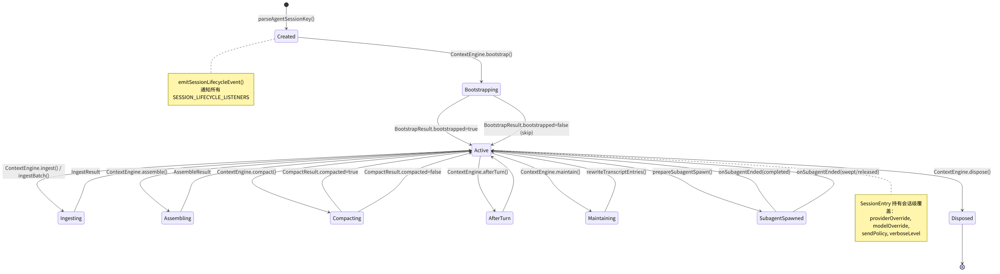
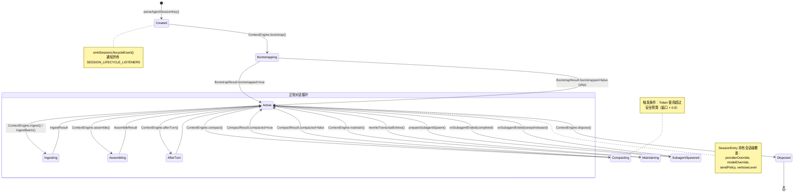
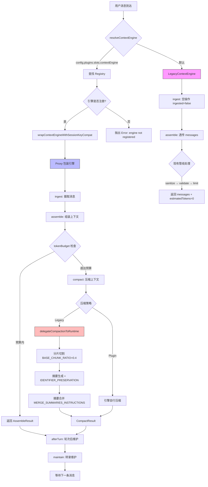
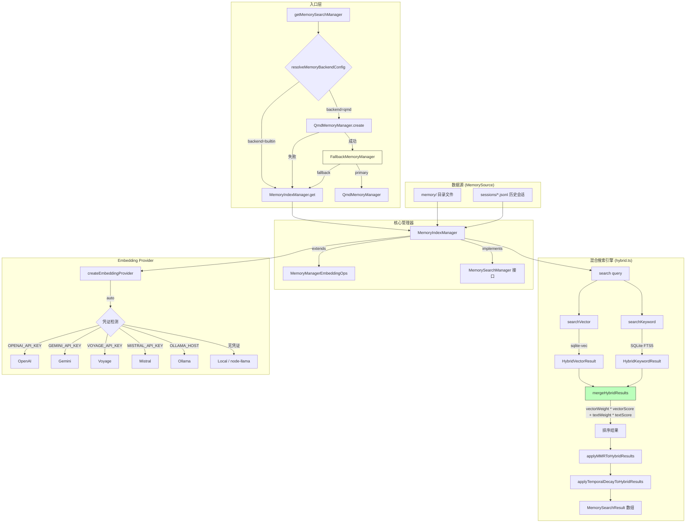
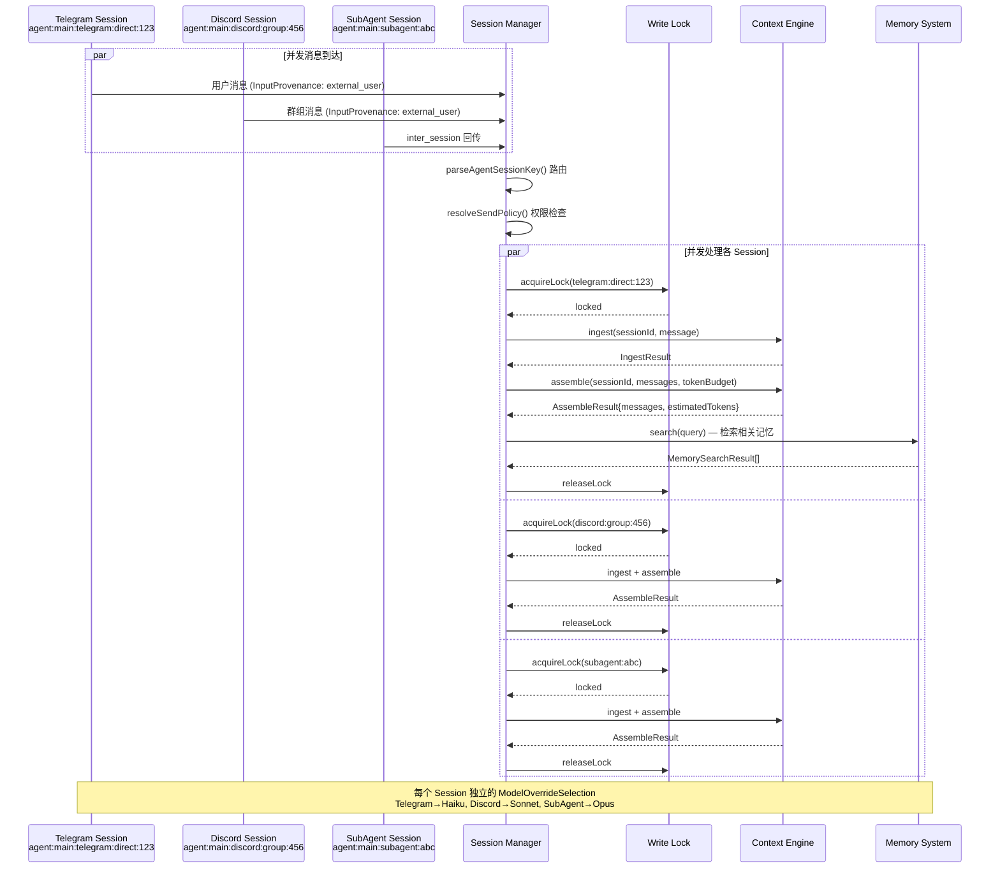
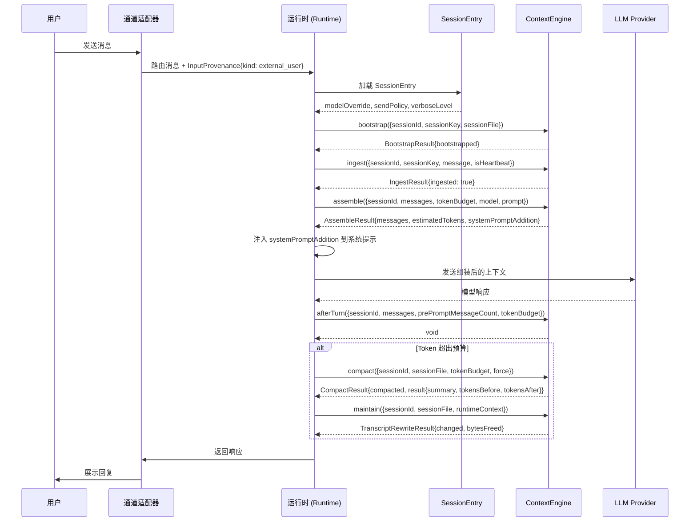

# 第5章 Session 与对话管理

> "上下文窗口是 Agent 系统中最昂贵的共享资源——每一条消息都在与系统提示、工具结果和对话历史争夺同一块寸土寸金的 token 预算。会话管理的本质不是存储，而是取舍。"

> **本章要点**
> - 理解会话生命周期：创建、活跃、压缩、归档的完整状态机
> - 掌握上下文窗口管理：滑动窗口、智能压缩、预算分配策略
> - 深入记忆系统：短期记忆、长期记忆与跨会话知识持久化
> - 理解多会话并发隔离与写锁机制的设计权衡


你和一位老朋友在咖啡馆聊天。聊到一半去了趟洗手间，回来继续之前的话题。你的朋友不会茫然地问"你是谁？我们在聊什么？"——因为她记得上下文。这件事对人类如此自然，自然到你从未想过它需要任何"工程"。

但对 AI Agent 来说，这恰恰是最深层的工程挑战之一。

> 🔥 **深度洞察：上下文管理是信息论问题**
>
> 大多数开发者把上下文管理当作"字符串截断"——窗口满了就砍掉最早的消息。这就像一个图书馆满了就烧掉最旧的书。正确的思维方式是**信息论**：每条消息携带的信息量（熵）不同。"你好"几乎没有信息量，而"API Key 存放在 /etc/secrets/prod.key"的信息密度极高。好的上下文压缩不是均匀截断，而是像优秀的编辑一样——保留高信息密度的内容，压缩冗余的寒暄，在有限的"版面"内最大化信息传递效率。这就是为什么 OpenClaw 的 Context Engine 不用简单的滑动窗口，而用智能摘要——因为最优的上下文管理策略，本质上是一个**有损压缩**问题。

LLM 本身是**彻底无状态的**。每次 API 调用，你都必须把完整的对话历史作为输入传入——就像一个每隔五分钟就失忆一次的人，你必须不厌其烦地把之前说过的话全部重复一遍。这意味着系统必须为每一个用户、每一个通道、每一个会话，持久化保存完整的对话状态。当一个用户在 Telegram 上说"继续我们昨天的讨论"时，Agent 需要在毫秒内找到正确的会话、加载正确的历史、在有限的上下文窗口内精心裁剪消息——与此同时，另外 49 个并发对话也在等待同样的服务。

上一章我们剖析了 Provider 抽象层如何屏蔽模型差异。既然模型调用的管道已经打通，下一个自然而然的问题是：**调用模型时送进去的"对话历史"从哪里来？** 本章进入更深层的水域——OpenClaw 如何管理成百上千的并发对话？Context Engine 如何在寸土寸金的上下文窗口中做出最优的信息取舍？记忆系统又如何让 Agent "记住"跨越数天甚至数月的交互？

## 5.1 会话生命周期

### 5.1.1 Session Key：会话的全局坐标

每个 Session 通过一个结构化的 **Session Key** 唯一标识。Session Key 不是简单的 UUID，而是编码了会话的通道来源、聊天类型和 Agent 归属信息。

Session ID 的验证逻辑位于 `src/sessions/session-id.ts`：

```typescript
export const SESSION_ID_RE =
  /^[0-9a-f]{8}-[0-9a-f]{4}-[0-9a-f]{4}-[0-9a-f]{4}-[0-9a-f]{12}$/i;

export function looksLikeSessionId(value: string): boolean {
  return SESSION_ID_RE.test(value.trim());
}
```

但 Session Key 的结构远比 UUID 丰富。一个典型的 Session Key 形如：

```text
agent:main:telegram:direct:123456789
agent:main:discord:group:987654321
agent:main:subagent:a1b2c3d4-e5f6-...
```

前缀 `agent:<agentId>:` 将会话绑定到特定 Agent，后续部分编码通道和聊天类型。

> **关键概念：Session Key（会话键）**
> Session Key 是 OpenClaw 会话系统的全局坐标，编码了 Agent 归属、通道来源和聊天类型。它不是随机 UUID，而是结构化标识符（如 `agent:main:telegram:direct:123456789`），使得同一用户在不同通道、不同聊天类型下拥有独立的会话隔离，同时支持按维度查询和路由。

> **实战场景：跨通道上下文保持**
>
> 小明在 Telegram 上和 Agent 讨论了一个 API 设计方案，随后切换到公司的 Discord 群继续讨论。在大多数 Agent 框架中，Discord 上的 Agent 会完全不记得 Telegram 上的对话——因为它们是两个独立的 Session。
>
> 在 OpenClaw 中，这两个通道分别创建了 `agent:main:telegram:direct:xiaoming_123` 和 `agent:main:discord:group:team_456` 两个 Session。虽然 Session 本身是隔离的（这是正确的安全设计——群聊的上下文不应该泄露到私聊），但 OpenClaw 提供了两种机制来桥接这种隔离：
>
> 1. **记忆系统**：Agent 可以将重要的结论写入长期记忆（`MEMORY.md` 或向量记忆库），在另一个 Session 中通过语义搜索检索回来
> 2. **工作区文件**：Agent 在 Telegram 会话中创建的文件（如 `api-design-draft.md`）对所有 Session 可见，Discord 会话中可以直接引用
>
> 这种设计体现了一个关键权衡：**Session 隔离保证安全，共享记忆提供连续性**——两者并不矛盾，而是在不同的层次上解决不同的问题。

### 5.1.2 Session 生命周期事件


**图 5-1：Session 生命周期状态机**

下图展示了 Session 从创建到销毁经历的所有状态转换。颜色编码：🟢 绿色 = 稳定态，🟡 黄色 = 处理中，🔴 红色 = 关键操作，🔵 蓝色 = 终态。状态转换基于 `session-lifecycle-events.ts` 中的事件系统和 `session-key-utils.ts` 中的会话类型判别逻辑。






> ⚠️ **常见陷阱：忘记清理事件监听器导致内存泄漏**
>
> `onSessionLifecycleEvent()` 返回一个取消函数。如果你在插件中注册了监听器但忘记在插件卸载时调用取消函数，会导致监听器永远驻留在内存中，每次会话事件都触发已废弃的回调：
> ```typescript
> // ❌ 错误：注册后不保存取消函数
> onSessionLifecycleEvent((event) => { /* ... */ });
>
> // ✅ 正确：保存并在适当时机调用取消函数
> const unsubscribe = onSessionLifecycleEvent((event) => { /* ... */ });
> // 在插件卸载或不再需要时：
> unsubscribe();
> ```

`src/sessions/session-lifecycle-events.ts` 定义了会话生命周期的事件系统：

```typescript
// src/sessions/session-lifecycle-events.ts — 发布-订阅模式
export type SessionLifecycleEvent = {
  sessionKey: string;  reason: string;
  parentSessionKey?: string;  label?: string;  displayName?: string;
};

const SESSION_LIFECYCLE_LISTENERS = new Set<SessionLifecycleListener>();

// 订阅：返回取消函数，防止内存泄漏
export function onSessionLifecycleEvent(listener: SessionLifecycleListener): () => void {
  SESSION_LIFECYCLE_LISTENERS.add(listener);
  return () => SESSION_LIFECYCLE_LISTENERS.delete(listener);  // cleanup
}

// 发布：try/catch 隔离每个 listener，确保一个异常不影响其他
export function emitSessionLifecycleEvent(event: SessionLifecycleEvent) {
  for (const listener of SESSION_LIFECYCLE_LISTENERS) {
    try { listener(event); } catch { /* best-effort, 不传播异常 */ }
  }
}
```

这是一个经典的**发布-订阅**模式实现。几个设计要点：

1. **返回取消函数**：`onSessionLifecycleEvent` 返回一个 cleanup 函数，调用者可以在不需要时取消订阅，防止内存泄漏
2. **错误隔离**：`try/catch` 包裹每个 listener 调用，确保某个监听器的异常不影响其他监听器
3. **parentSessionKey**：支持会话的层级关系——子 Agent 的会话可以追溯到父会话

### 5.1.3 模型覆盖与会话级配置

每个 Session 可以独立覆盖其使用的模型。`src/sessions/model-overrides.ts` 实现了这个机制：

```typescript
// src/sessions/model-overrides.ts — 会话级模型切换
export type ModelOverrideSelection = {
  provider: string;  model: string;  isDefault?: boolean;
};

export function applyModelOverrideToSessionEntry(params: {
  entry: SessionEntry;  selection: ModelOverrideSelection;
}) {
  // 切换模型时必须清除旧的运行时状态和上下文窗口缓存
  // 否则新模型可能继承旧模型的 contextTokens，导致窗口估算错误
  if (selectionUpdated) { delete entry.model; delete entry.contextTokens; }
}
```

当用户通过 `/model` 命令切换模型时，系统不仅更新模型选择，还清除所有关联的缓存状态（运行时模型信息、上下文窗口大小），确保下次运行使用全新的模型参数。

### 5.1.4 发送策略

`src/sessions/send-policy.ts` 控制会话的消息发送权限，这是多通道场景下的安全机制：

```typescript
export type SessionSendPolicyDecision = "allow" | "deny";

export function resolveSendPolicy(params: {
  cfg: OpenClawConfig;
  entry?: SessionEntry;
  sessionKey?: string;
  channel?: string;
  chatType?: SessionChatType;
}): SessionSendPolicyDecision {
  // 1. 会话级覆盖优先
  const override = normalizeSendPolicy(params.entry?.sendPolicy);
  if (override) return override;
  // 2. 全局策略匹配
  const policy = params.cfg.session?.sendPolicy;
  if (!policy) return "allow";
  // 3. 根据通道和聊天类型匹配规则
  // ...
}
```

> 💡 **最佳实践**：对于面向公众的群聊通道，建议将 `sendPolicy` 配置为受限模式，只允许 Agent 在被 @ 或直接回复时才发送消息。这可以通过 `session.sendPolicy` 按通道和聊天类型精确控制，避免 Agent 在群聊中过度活跃。

这种分层策略允许：
- 全局默认允许发送
- 对特定通道（如 WhatsApp 群组）设置限制
- 对个别会话进行例外处理

### 5.1.5 输入来源追踪

`src/sessions/input-provenance.ts` 追踪每条输入消息的来源，这对审计和调试至关重要。系统区分以下来源：

- **用户直接输入**：通过通道发送的消息
- **系统事件**：心跳、定时任务触发
- **子 Agent 回传**：Sub-agent 完成后的结果

## 5.2 上下文窗口管理

> **什么是 Context Engine？** Context Engine（上下文引擎）是 OpenClaw 中负责管理对话历史的核心组件。它解决的根本问题是：LLM 的上下文窗口有限（通常 128K-200K tokens），但用户的对话可以无限延续。Context Engine 就像一位图书管理员——它不可能把图书馆的所有书搬到你面前，但它能确保你需要的那几本书始终在手边。它负责消息的摄取（ingest）、组装（assemble）、压缩（compact），以及决定哪些历史消息值得保留、哪些可以被摘要替代。

**图 5-2：上下文窗口管理流程**

下图展示了 `src/context-engine/` 中上下文从摄取到组装再到压缩的完整处理流程，包括 Legacy 引擎的委托路径和插件引擎的完整路径。




### 5.2.1 一个具体的数字示例

在深入接口之前，让我们用具体数字理解上下文窗口管理的挑战：

假设你使用 Claude Opus（200K token 窗口），和 Agent 进行一天的工作对话：

```text
系统提示词（SOUL.md + AGENTS.md + 工具列表 + 技能列表）  ≈  8,000 tokens
上午 10:00  你发了 5 条消息 + Agent 回复 5 条                ≈  3,000 tokens
上午 11:00  你让 Agent 读了一个 500 行的源码文件             ≈ 12,000 tokens
下午 14:00  讨论了 3 个 PR，Agent 执行了 8 次工具调用        ≈ 45,000 tokens
下午 16:00  又读了 2 个配置文件 + 调试一个 bug              ≈ 30,000 tokens
下午 18:00  继续讨论架构设计                                ≈ 25,000 tokens
───────────────────────────────────────────────────
累计已用 Token                                             ≈ 123,000 tokens
安全预算 = 200K × 0.8（留 20% 给模型输出）                = 160,000 tokens
剩余空间                                                   ≈  37,000 tokens
```

到了晚上 20:00，又聊了 40,000 tokens，总量达到 163,000——超过了安全预算。此时 **Context Engine 触发自动压缩**：

```text
压缩前：163,000 tokens（823 条消息）
  ↓ 取最旧的 40% 消息（约 330 条）生成摘要
  ↓ 摘要结果：约 3,000 tokens（保留了所有文件路径、UUID、关键决策）
压缩后：约 98,000 tokens（摘要 + 剩余 493 条消息）
释放空间：约 65,000 tokens
```

如果你使用的是 GPT-4（128K 窗口），压缩会更早触发（安全预算 = 128K × 0.8 = 102K）。如果降级到 Claude Haiku（200K 窗口但更便宜），窗口不变但每个 token 的成本更低。

这就是为什么上下文管理不是一个简单的"截断"问题——它是一个在**信息保留**和**Token 预算**之间持续做出最优取舍的动态过程。

> **关键概念：上下文压缩（Compaction）**
> 上下文压缩是在对话历史接近模型上下文窗口限制时，将最早的对话轮次智能摘要为简短总结的过程。与简单截断不同，压缩会保留关键标识符（文件路径、URL、UUID、变量名）和重要决策，只丢弃冗余的寒暄和重复内容。这使得 Agent 在长对话中既不会"失忆"，又不会耗尽上下文空间。

> ⚠️ **注意**：上下文压缩本身会消耗额外的 Token（用于生成摘要的 LLM 调用）。在高频对话场景中，压缩的 Token 开销可能占总消耗的 5-10%。如果对成本敏感，可以通过配置 `context-engine` 插件的压缩阈值和策略来优化。

### 5.2.2 Context Engine 接口

Context Engine 是 OpenClaw 的上下文管理插件化框架。`src/context-engine/types.ts` 定义了核心接口：

```typescript
// src/context-engine/types.ts — 上下文引擎的五大生命周期方法
export interface ContextEngine {
  readonly info: ContextEngineInfo;
  // 初始化：可选导入历史上下文
  bootstrap?(params: { sessionId: string; sessionFile: string }): Promise<BootstrapResult>;
  // 摄取：将单条消息纳入引擎存储
  ingest(params: { sessionId: string; message: AgentMessage }): Promise<IngestResult>;
  // 组装：在 Token 预算内构建模型上下文
  assemble(params: { sessionId: string; messages: AgentMessage[];
    tokenBudget?: number }): Promise<AssembleResult>;
  // 压缩：对话过长时生成摘要释放空间
  compact(params: { sessionId: string; tokenBudget?: number }): Promise<CompactResult>;
  // 释放：引擎销毁时清理资源
  dispose?(): Promise<void>;
}
```

这个接口定义了上下文管理的完整生命周期：

```text
bootstrap → ingest → assemble → compact → dispose
     ↑                    ↓
     └────── afterTurn ──┘
```

1. **bootstrap**：初始化引擎状态，可选导入历史上下文
2. **ingest**：摄取单条消息到引擎存储
3. **assemble**：在 Token 预算内组装模型上下文
4. **compact**：压缩上下文以减少 Token 使用
5. **afterTurn**：每轮对话后的维护操作
6. **dispose**：释放引擎持有的资源

### 5.2.3 上下文组装

`AssembleResult` 定义了组装的输出：

```typescript
export type AssembleResult = {
  messages: AgentMessage[];
  estimatedTokens: number;
  systemPromptAddition?: string;
};
```

`systemPromptAddition` 是一个精巧的设计——Context Engine 不仅可以选择哪些历史消息进入上下文，还可以向系统提示注入额外指令（例如检索增强的上下文信息）。

### 5.2.4 Context Engine 注册表

`src/context-engine/registry.ts` 实现了引擎的注册与发现：

```typescript
export type ContextEngineFactory = () => ContextEngine | Promise<ContextEngine>;

const CONTEXT_ENGINE_REGISTRY_STATE = Symbol.for("openclaw.contextEngineRegistryState");
const CORE_CONTEXT_ENGINE_OWNER = "core";
const PUBLIC_CONTEXT_ENGINE_OWNER = "public-sdk";

type ContextEngineRegistryState = {
  engines: Map<string, {
    factory: ContextEngineFactory;
    owner: string;
  }>;
};
```

注册表使用 `Symbol.for()` 创建进程全局的注册状态，确保即使构建环境多次加载同一模块，各实例仍共享同一个注册表。

注册分为两个权限级别：

```typescript
// 核心注册：具有内核级权限
export function registerContextEngineForOwner(
  id: string, factory: ContextEngineFactory, owner: string
): ContextEngineRegistrationResult {
  // 核心引擎 ID 不允许非核心注册者覆盖
  if (id === defaultSlotIdForKey("contextEngine")
      && normalizedOwner !== CORE_CONTEXT_ENGINE_OWNER) {
    return { ok: false, existingOwner: CORE_CONTEXT_ENGINE_OWNER };
  }
  // ...
}

// 公开 SDK 注册：第三方使用
export function registerContextEngine(
  id: string, factory: ContextEngineFactory
): ContextEngineRegistrationResult {
  return registerContextEngineForOwner(id, factory, PUBLIC_CONTEXT_ENGINE_OWNER);
}
```

这种双层注册机制确保了核心引擎不会被第三方插件意外覆盖。

### 5.2.5 引擎解析

```typescript
export async function resolveContextEngine(
  config?: OpenClawConfig
): Promise<ContextEngine> {
  const slotValue = config?.plugins?.slots?.contextEngine;
  const engineId = typeof slotValue === "string" && slotValue.trim()
    ? slotValue.trim()
    : defaultSlotIdForKey("contextEngine");  // 默认 "legacy"

  const entry = getContextEngineRegistryState().engines.get(engineId);
  if (!entry) {
    throw new Error(`Context engine "${engineId}" is not registered.`);
  }
  return wrapContextEngineWithSessionKeyCompat(await entry.factory());
}
```

`wrapContextEngineWithSessionKeyCompat` 是一个值得深入的设计——它通过 `Proxy` 为旧版 Context Engine 提供 `sessionKey` 参数的兼容层：

```typescript
function wrapContextEngineWithSessionKeyCompat(engine: ContextEngine) {
  const proxy = new Proxy(engine, {
    get(target, property, receiver) {
      const value = Reflect.get(target, property, receiver);
      if (typeof value !== "function") return value;
      if (!isSessionKeyCompatMethodName(property)) {
        return value.bind(target);
      }
      return (params) => {
        return invokeWithLegacyCompat(value.bind(target), params, allowedKeys, {
          onLegacyModeDetected: () => { isLegacy = true; },
        });
      };
    },
  });
  return proxy;
}
```

当旧版引擎不支持 `sessionKey` 参数时，Proxy 会自动捕获验证错误，去除该参数后重试。这种**渐进式兼容**策略让新旧引擎能够无缝共存。

### 5.2.6 Legacy Context Engine

默认的 Legacy 引擎（`src/context-engine/legacy.ts`）是最小化实现：

```typescript
export class LegacyContextEngine implements ContextEngine {
  readonly info = { id: "legacy", name: "Legacy Context Engine", version: "1.0.0" };

  async ingest(_params) { return { ingested: false }; }  // 空操作
  async assemble(params) {
    return { messages: params.messages, estimatedTokens: 0 };  // 透传
  }
  async compact(params) {
    return await delegateCompactionToRuntime(params);  // 委托给运行时
  }
}
```

Legacy 引擎的 `ingest` 是空操作（Session Manager 已经处理了消息持久化），`assemble` 直接透传（现有的 sanitize → validate → limit 管线已经完成了上下文组装），只有 `compact` 委托给运行时的压缩实现。

### 5.2.7 上下文压缩

压缩是 OpenClaw 管理长对话的关键机制。`src/agents/compaction.ts` 实现了核心压缩算法：

```typescript
export const BASE_CHUNK_RATIO = 0.4;
export const MIN_CHUNK_RATIO = 0.15;
export const SAFETY_MARGIN = 1.2;  // 20% buffer for token estimation inaccuracy
```

压缩的关键步骤：

1. **Token 估算**：统计当前上下文的 Token 使用量
2. **分片切割**：将历史消息按 Token 份额分成多个 chunk
3. **摘要生成**：对每个 chunk 调用模型生成摘要
4. **摘要合并**：多个部分摘要合并为最终摘要

合并摘要的指令精心设计：

```typescript
const MERGE_SUMMARIES_INSTRUCTIONS = [
  "Merge these partial summaries into a single cohesive summary.",
  "",
  "MUST PRESERVE:",
  "- Active tasks and their current status (in-progress, blocked, pending)",
  "- Batch operation progress (e.g., '5/17 items completed')",
  "- The last thing the user requested and what was being done about it",
  "- Decisions made and their rationale",
  "- TODOs, open questions, and constraints",
  "- Any commitments or follow-ups promised",
  "",
  "PRIORITIZE recent context over older history.",
].join("\n");
```

标识符保留策略确保 UUID、API Key 等关键标识在压缩后不被丢失：

```typescript
const IDENTIFIER_PRESERVATION_INSTRUCTIONS =
  "Preserve all opaque identifiers exactly as written " +
  "(no shortening or reconstruction), including UUIDs, hashes, " +
  "IDs, tokens, API keys, hostnames, IPs, ports, URLs, and file names.";
```

## 5.3 记忆系统

**图 5-3：记忆系统架构**

下图展示了 `src/memory/` 的完整架构，包括 MemoryIndexManager 继承链、双后端策略（builtin / qmd）、混合搜索引擎，以及多 Embedding Provider 支持。




### 5.3.1 记忆搜索架构

OpenClaw 的记忆系统不仅是简单的对话历史存储，而是一个支持语义搜索的向量数据库系统。`src/memory/index.ts` 暴露核心 API：

```typescript
export { MemoryIndexManager } from "./manager.js";
export type { MemorySearchResult } from "./types.js";
export { getMemorySearchManager } from "./search-manager.js";
```

### 5.3.2 搜索结果类型

`src/memory/types.ts` 定义了搜索结果的数据模型：

```typescript
export type MemorySearchResult = {
  path: string;
  startLine: number;
  endLine: number;
  score: number;
  snippet: string;
  source: MemorySource;  // "memory" | "sessions"
  citation?: string;
};

export type MemorySource = "memory" | "sessions";
```

记忆来自两个源：
- **memory**：用户 workspace 中的 `memory/` 目录文件
- **sessions**：历史会话记录

### 5.3.3 混合搜索引擎

`src/memory/hybrid.ts` 实现了向量搜索与关键词搜索的混合检索：

```typescript
// src/memory/hybrid.ts — 混合搜索的双轨结果类型
export type HybridVectorResult = {
  id: string; path: string; snippet: string; vectorScore: number;  // 语义相似度
};
export type HybridKeywordResult = {
  id: string; path: string; snippet: string; textScore: number;    // BM25 关键词得分
};

// FTS5 查询构建：将自然语言拆分为精确匹配短语
export function buildFtsQuery(raw: string): string | null {
  const tokens = raw.match(/[\p{L}\p{N}_]+/gu)?.filter(Boolean) ?? [];
  return tokens.length ? tokens.map(t => `"${t}"`).join(" AND ") : null;
}

// BM25 rank 转归一化分数：rank<0 表示相关（SQLite FTS5 约定）
export function bm25RankToScore(rank: number): number {
  return rank < 0 ? -rank / (1 - rank) : 1 / (1 + rank);
}
```

混合搜索的设计融合了两种检索范式：

1. **向量搜索**：通过 Embedding 模型将文本转化为向量，计算语义相似度
2. **关键词搜索**（FTS）：使用 SQLite FTS5 的 BM25 算法进行全文检索

`bm25RankToScore` 将 BM25 的 rank 值转换为 0-1 之间的分数，使其可以与向量搜索的分数进行加权融合。

### 5.3.4 MemoryIndexManager

`src/memory/manager.ts` 是记忆系统的核心管理器：

```typescript
export class MemoryIndexManager extends MemoryManagerEmbeddingOps
    implements MemorySearchManager {
  protected readonly cfg: OpenClawConfig;
  protected readonly agentId: string;
  protected readonly workspaceDir: string;
  protected provider: EmbeddingProvider | null;
  private readonly requestedProvider:
    | "openai" | "local" | "gemini" | "voyage"
    | "mistral" | "ollama" | "auto";
  // ...
}
```

Manager 支持多种 Embedding Provider——OpenAI、Gemini、Voyage、Mistral、Ollama，甚至本地模型。`"auto"` 模式会根据可用凭证自动选择最优 Provider。

记忆管理器使用进程全局缓存避免重复初始化：

```typescript
const MEMORY_INDEX_MANAGER_CACHE_KEY = "__openclawMemoryIndexManagerCache";
type MemoryIndexManagerCacheStore = {
  indexCache: Map<string, MemoryIndexManager>;
  indexCachePending: Map<string, Promise<MemoryIndexManager>>;
};
```

`indexCachePending` 的存在解决了一个微妙的竞态条件：当两个请求同时初始化同一个 Agent 的记忆索引时，第二个请求会等待第一个的 Promise 完成，而不是创建重复实例。

### 5.3.5 Provider 状态与诊断

`MemoryProviderStatus` 提供了丰富的诊断信息：

```typescript
// src/memory/types.ts — 记忆系统诊断状态（支持 /status 命令查询）
export type MemoryProviderStatus = {
  backend: "builtin" | "qmd";       // 后端类型
  provider: string;                  // Embedding Provider（openai/gemini/local/...）
  files?: number; chunks?: number;   // 索引统计
  vector?: {                         // 向量索引健康度
    enabled: boolean; available?: boolean;
    loadError?: string; dims?: number;  // 加载错误和向量维度
  };
  batch?: {                          // 批量处理状态
    failures: number; limit: number; concurrency: number;
  };
};
```

这个状态结构暴露了向量索引的健康度（是否可用、维度数、加载错误）、批量处理状态（失败次数、并发度），以及 FTS 搜索的状态。运维人员可以通过 `/status` 命令快速诊断记忆系统的健康状况。

**图 5-4：多会话并发模型**

下图展示了多个 Session 并行处理消息时的交互序列。每个 Session 通过独立的 Session Key 隔离，写锁保证同一会话的原子性，不同通道的会话可使用不同模型。




**图 5-5：Session 与 Context Engine 交互序列**

下图展示了一条用户消息到达后，Session 如何与 Context Engine 协作完成一轮完整的对话处理，对应 `ContextEngine` 接口的方法调用序列。




## 5.4 多会话并发与隔离

### 5.4.1 会话级别覆盖

OpenClaw 支持每个会话独立覆盖全局配置中的关键参数：

```typescript
export type SessionEntry = {
  // ... 基础字段
  providerOverride?: string;
  modelOverride?: string;
  authProfileOverride?: string;
  contextTokens?: number;
  model?: string;
  modelProvider?: string;
  sendPolicy?: string;
  // ...
};
```

这种覆盖机制使得不同通道的会话可以使用不同的模型——例如 Telegram 使用 Claude Haiku 以降低成本，而 Web Chat 使用 Claude Opus 以获得最高质量。

### 5.4.2 并发隔离与写锁机制

当同一个用户快速发送多条消息时，多个 Agent 运行可能同时写入同一个会话文件。`src/sessions/` 中的写锁机制（`src/agents/session-write-lock.ts`）防止了并发写入导致的数据损坏。

会话转录使用 **JSONL（JSON Lines）格式**存储——每条消息占一行。追加新消息只需在文件末尾追加一行，而不需要重写整个文件。这使得写操作接近原子性——即使在写入过程中进程崩溃，最多只丢失最后一条消息。

Session Store 的更新操作通过 `updateSessionStore` 和 `mergeSessionEntry` 函数序列化，确保即使多个 Agent 同时处理不同通道的消息，Session 状态也不会出现不一致。

会话数据在进程内维护**全局缓存**，避免每次访问都从磁盘读取。缓存使用写时失效（write-through invalidation）策略——写入磁盘时同步更新缓存。

### 5.4.3 Level Overrides

`src/sessions/level-overrides.ts` 管理会话级别的模型参数覆盖，包括：
- thinking level（思考深度）
- fast mode（快速模式）
- verbose level（详细程度）
- reasoning display（推理展示）

这些覆盖存储在 Session Entry 中，在每次 Agent 运行时读取并应用，确保用户的个性化偏好在会话生命周期内持续生效。

**图 5-6：对话管理方案对比表**

下表对比了 OpenClaw 与其他主流 Agent 框架在会话管理方面的设计选择。

| 特性 | OpenClaw | LangChain | AutoGen | CrewAI | Semantic Kernel |
|------|----------|-----------|---------|--------|----------------|
| **会话标识** | 结构化 Session Key（编码 agent/channel/chatType） | 简单字符串 ID | 会话对象引用 | 任务级 ID | 线程 ID |
| **上下文管理** | 插件化 ContextEngine（bootstrap/ingest/assemble/compact） | Memory + Chain | ConversableAgent 内置 | Agent 内置上下文 | ChatHistory + Planner |
| **压缩策略** | 分片摘要 + 标识符保留 + 多轮合并（BASE_CHUNK_RATIO=0.4） | 简单截断 / 摘要 | 无内置压缩 | 无内置压缩 | Token 截断 |
| **记忆系统** | 混合搜索（向量 + BM25 FTS5 + MMR + 时间衰减） | VectorStore Memory | 无内置记忆 | 长期记忆插件 | 语义记忆 |
| **多会话并发** | 写锁隔离 + JSONL 原子写入 + 进程全局缓存 | 无内置并发控制 | 多 Agent 消息传递 | 顺序执行 | 无内置并发控制 |
| **模型覆盖** | 会话级 ModelOverrideSelection + Level Overrides | 全局 LLM 配置 | Agent 级配置 | Agent 级配置 | 全局 Kernel 配置 |
| **发送策略** | 分层 SendPolicy（全局→通道→会话） | 无 | 无 | 无 | 无 |
| **输入溯源** | InputProvenance（external_user / inter_session / internal_system） | 无 | 消息元数据 | 无 | 无 |
| **子会话支持** | parentSessionKey + SubagentSpawn/End 生命周期 | 无 | GroupChat Manager | 委托任务链 | 无 |
| **兼容层** | Proxy + 渐进式错误检测重试 | 无 | 无 | 无 | 无 |

## 5.5 上下文压缩的工程细节

### 5.5.1 压缩触发时机

上下文压缩不是在任意时刻触发的——它发生在**安全点**，即一次完整的工具调用结束之后、下一次 LLM 调用之前。这确保了压缩不会破坏正在进行的工具调用序列的配对关系。

`src/agents/compaction.ts` 中的核心参数控制了压缩行为：

```typescript
export const BASE_CHUNK_RATIO = 0.4;    // 初始保留 40% 的上下文
export const MIN_CHUNK_RATIO = 0.15;    // 最少保留 15%
export const SAFETY_MARGIN = 1.2;       // token 估算误差缓冲 20%
```

### 5.5.2 分片摘要策略

压缩采用分片摘要策略——将对话历史分成多个片段，分别摘要后合并：

1. 将历史消息按 `BASE_CHUNK_RATIO` 分成多个片段
2. 每个片段独立生成摘要
3. 使用 `MERGE_SUMMARIES_INSTRUCTIONS` 将多个摘要合并为一个连贯的总结
4. 合并后的摘要替代原始历史

合并指令明确要求保留：
- 活跃任务及其当前状态
- 批量操作进度（如"5/17 项已完成"）
- 用户最后的请求
- 已做出的决策及其理由
- 待办事项、开放问题和约束条件

### 5.5.3 标识符保留策略

压缩中最容易出错的部分是 LLM 在生成摘要时"创造性地"重写标识符。`IDENTIFIER_PRESERVATION_INSTRUCTIONS` 严格要求保留所有不可重建的标识符：

```json
"Preserve all opaque identifiers exactly as written (no shortening 
or reconstruction), including UUIDs, hashes, IDs, tokens, API keys, 
hostnames, IPs, ports, URLs, and file names."
```

这条指令是用血泪教训换来的——LLM 一旦改写 UUID，后续所有 API 调用都会失败。

### 5.5.4 超大消息的渐进降级

源码中一个容易被忽视的精彩设计是**渐进降级摘要**（`summarizeWithFallback`）。当完整摘要因为某条消息过大而失败时，系统不是直接放弃，而是走三级降级路径：(1) 先尝试完整摘要；(2) 失败后过滤掉超过上下文窗口 50% 的"超大消息"，只摘要剩余的小消息，并为超大消息生成占位符说明（如 `[Large assistant (~45K tokens) omitted from summary]`）；(3) 如果连小消息摘要也失败，退回到纯统计描述。这种三级降级保证了压缩**永远不会导致整个对话丢失**——最差情况下你仍然知道"这里有 823 条消息，其中 3 条过大无法摘要"。

```typescript
// src/agents/compaction.ts — 超大消息判定
export function isOversizedForSummary(msg: AgentMessage, contextWindow: number): boolean {
  const tokens = estimateCompactionMessageTokens(msg) * SAFETY_MARGIN;
  return tokens > contextWindow * 0.5;  // 单条消息 > 上下文窗口的 50%
}
```

### 5.5.5 自适应分片比率

当平均消息长度较大时，系统会自动降低分片比率，确保每个片段的 token 数不超过模型的摘要能力：

```typescript
const safeAvgTokens = avgTokens * SAFETY_MARGIN;
if (safeAvgTokens > threshold) {
  const reduction = Math.min(avgRatio * 2, BASE_CHUNK_RATIO - MIN_CHUNK_RATIO);
  return Math.max(MIN_CHUNK_RATIO, BASE_CHUNK_RATIO - reduction);
}
```

## 5.6 Session 系统的设计决策分析

### 5.6.1 为什么选择文件系统而非数据库？

OpenClaw 的会话数据存储在文件系统中（JSONL 文件），而非传统数据库。这个看似"原始"的选择有深层的工程考量：

1. **零依赖部署**：用户不需要安装和维护数据库服务
2. **可审查性**：会话文件是纯文本，用户可以直接查看和编辑
3. **Git 友好**：如果需要，会话历史可以纳入版本控制
4. **简单性**：JSONL 的追加写入接近原子性，不需要复杂的事务管理
5. **便携性**：整个工作区（包括会话数据）可以打包迁移

当然，这也带来了限制——没有索引查询、没有事务、没有并发写入锁（需要应用层实现）。对于 OpenClaw 的使用场景（单实例、有限并发），这些限制是可以接受的。

### 5.6.2 上下文压缩 vs 简单截断

大多数 Agent 框架在上下文溢出时简单截断（丢弃最旧的消息）。OpenClaw 选择了更复杂的分片摘要策略。代价是需要额外的 LLM 调用来生成摘要，但好处是保留了关键的语义信息。

特别是 `IDENTIFIER_PRESERVATION_INSTRUCTIONS` 的设计——确保 UUID、文件路径、API 密钥等不可重建的标识符被原样保留。这解决了一个其他框架忽略的关键问题：LLM 在生成摘要时会"创造性地"重写这些标识符，导致后续操作失败。

### 5.6.3 Input Provenance 的安全意义

`InputProvenance` 区分了三种消息来源：

- `external_user`：来自用户的外部消息
- `inter_session`：来自其他会话（如子 Agent 通告）
- `internal_system`：系统内部生成的消息（如心跳、BOOT.md）

这种区分对安全至关重要——系统可以为不同来源的消息应用不同的安全策略。例如，外部用户消息可能需要经过 prompt injection 检测，而内部系统消息可以跳过这些检查。

## 5.7 小结：状态管理的艺术

回到咖啡馆的类比。人类的对话记忆是模糊的、有选择性的、会随时间衰减的——我们记得重要的事情，忘记琐碎的细节，偶尔还会"记错"。有趣的是，OpenClaw 的 Session 系统也展现了类似的特征：上下文压缩像人类的"遗忘"，保留关键信息而丢弃细节；记忆搜索像人类的"回忆"，通过关联线索找回被遗忘的内容；`IDENTIFIER_PRESERVATION_INSTRUCTIONS` 则像人类对电话号码和地址的精确记忆——某些信息不允许有丝毫偏差。

本章揭示了五个核心设计洞察：

1. **Session Key 是会话的 DNA**——不是简单的 UUID，而是编码了通道、类型、Agent 归属等信息的结构化坐标。知道一个 Session Key，你就知道这个对话的一切元信息。Session Key 中嵌入的通道标识体现了**通道无关（Channel-agnostic）**原则——会话路由逻辑不依赖任何特定通道的实现细节。
2. **Context Engine 是可插拔的大脑**——从简单的透传到 RAG 增强，不同的引擎实现同一个接口。系统的"智商"可以通过更换引擎来升级。这正是**渐进式复杂度（Progressive Disclosure）**在上下文管理层面的体现。
3. **压缩不是截断**——大多数框架在上下文溢出时简单地丢弃最旧的消息。OpenClaw 选择了更困难但更正确的路：用 LLM 生成语义摘要，保留关键标识符。
4. **记忆是混合搜索**——向量语义搜索找到"相似"的记忆，BM25 关键词检索找到"精确"的记忆。两者互补，覆盖不同的检索需求。
5. **文件系统是最好的数据库**——对于 OpenClaw 的使用场景，JSONL 文件比 SQLite 或 PostgreSQL 更合适。零依赖、可审查、Git 友好——这是**约定优于配置（Convention over Configuration）**在存储层面的实践：遵循简单的文件命名约定，不需要任何数据库配置。

> **对话管理的本质不是存储数据，而是在有限的窗口中做出最优的信息取舍。** 这是一个信息压缩问题，也是一个价值判断问题——而每一次"该记住什么、该忘掉什么"的抉择，都映射着对用户意图的深层理解。

下一章，我们进入 OpenClaw 最核心的领域——Agent 系统。如果 Session 是对话的容器，那 Agent 就是对话的灵魂。

### 思考题

1. **概念理解**：上下文压缩（Compaction）为什么是"有损"的？在什么情况下压缩可能导致 Agent 行为异常？OpenClaw 如何缓解这个风险？
2. **实践应用**：如果你要为一个医疗问诊 Agent 设计会话管理策略，需要确保关键医疗信息永不被压缩丢弃，你会如何修改 Session 管理机制？
3. **开放讨论**：随着上下文窗口越来越大（从 4K 到 200K tokens），上下文管理是否还重要？"无限上下文"是否会让 Session 管理变得多余？

### 📚 推荐阅读

- [MemGPT: Towards LLMs as Operating Systems (arXiv 2023)](https://arxiv.org/abs/2310.08560) — 将操作系统的虚拟内存概念引入 LLM 上下文管理的开创性论文
- [Conversation Design (Google)](https://designguidelines.withgoogle.com/conversation/) — Google 对话设计指南，理解会话管理的用户体验层面
- [Context Window Management Strategies (LangChain Blog)](https://blog.langchain.dev/) — 各种上下文窗口管理策略的实践总结
