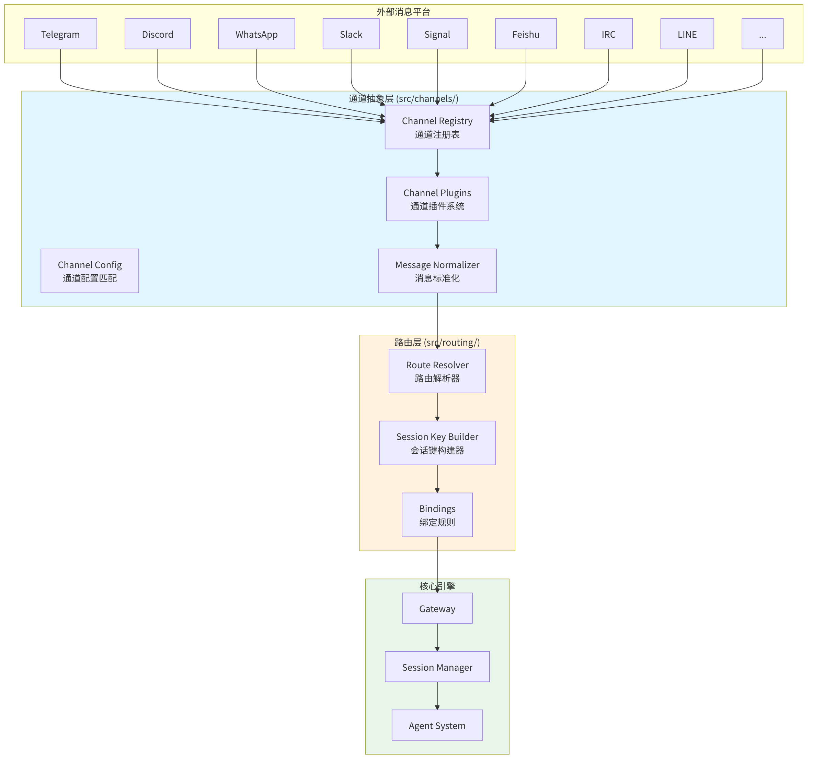
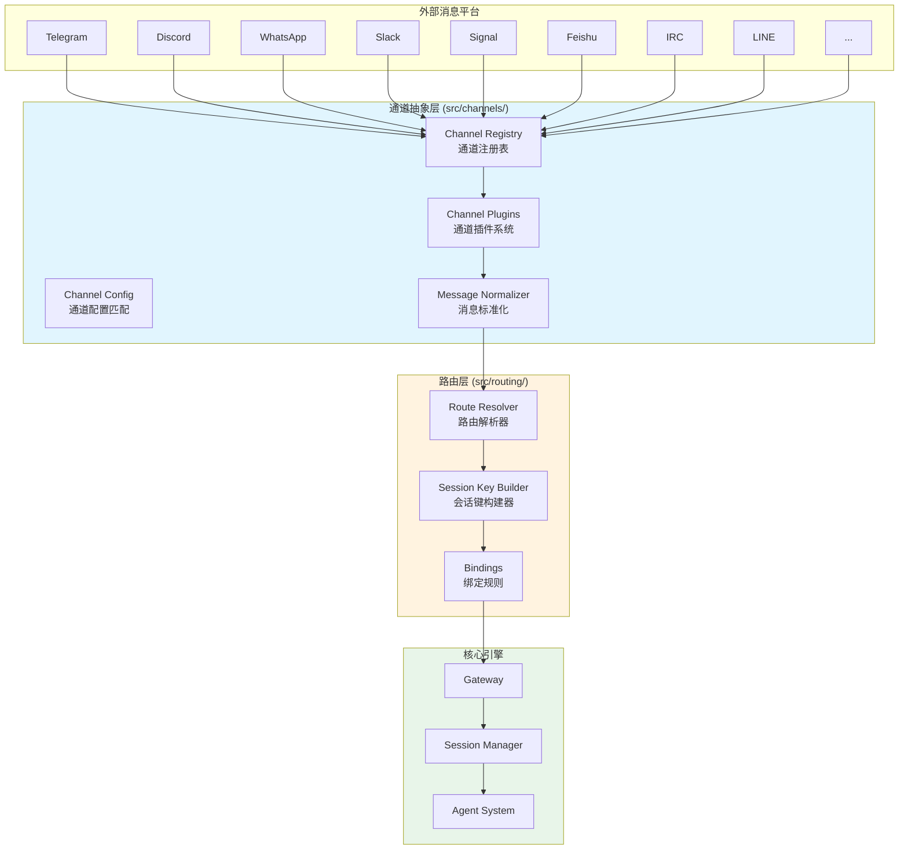
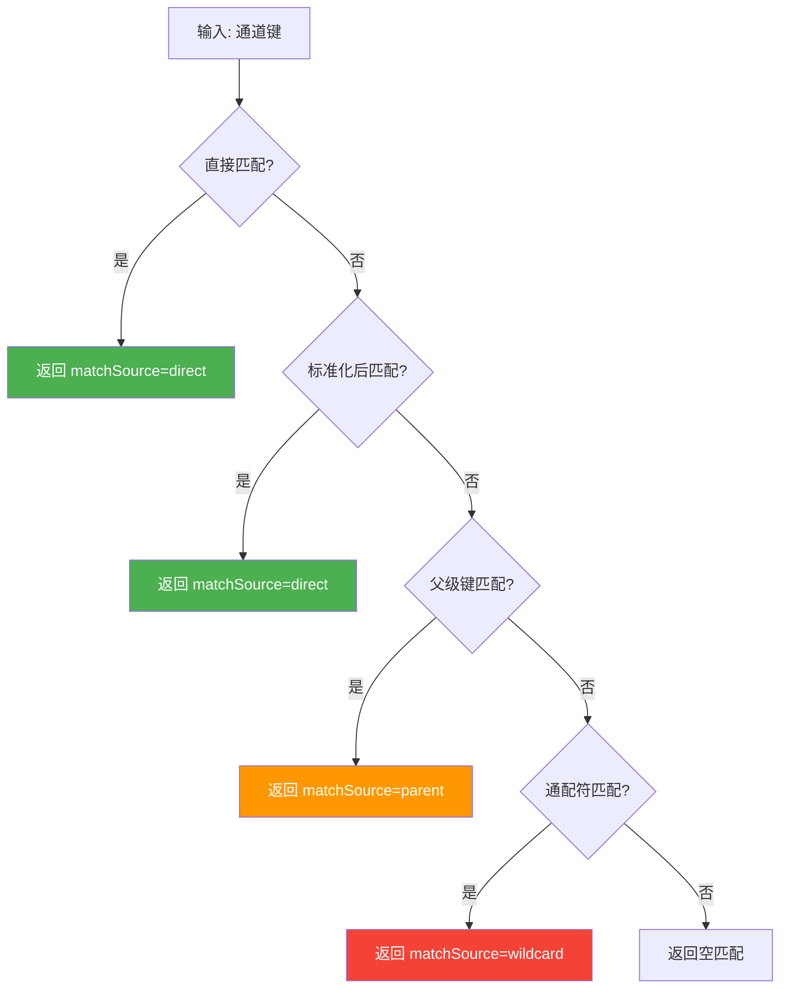
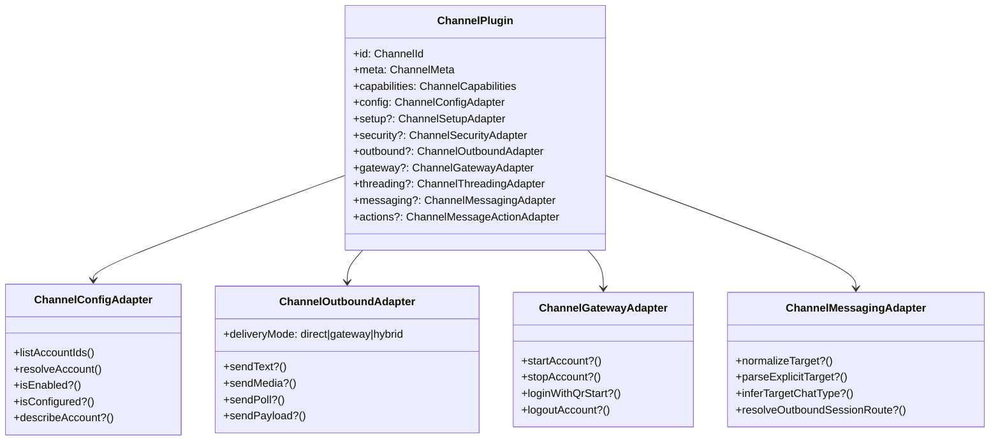
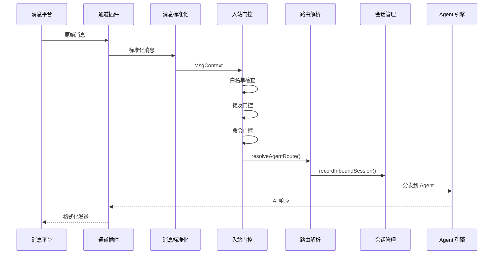

<div v-pre>

# 第7章 通道架构

> *"抽象层的难度不在于统一差异，而在于统一差异的同时保留每个平台的独特价值。抽象太高是削足适履，抽象太低是回到原点。"*

> **本章要点**
> - 理解通道抽象层的设计动机：为什么需要统一接口而非直连平台
> - 掌握通道插件合约：入站/出站消息处理管线的完整流程
> - 深入配置匹配引擎：如何将用户消息路由到正确的 Agent
> - 理解通道运行状态机与健康监控机制


前六章，我们拆解了 OpenClaw 的核心引擎：Gateway 掌控生命周期，Provider 屏蔽模型差异，Session 维护对话状态，Agent 编排决策与执行。引擎已经轰鸣——但还缺一个关键部件：**轮胎**。没有通道，引擎再强也无法触及用户世界。一台发动机在实验台上空转和一辆跑在路上的车，差的就是这四个与地面接触的橡胶圈。

本章和下一章，我们将目光转向 OpenClaw 的通道系统。本章聚焦架构设计，下一章深入各平台的具体实现。

## 7.1 为什么需要通道抽象层

当你同时管理 Telegram、Discord 和 Slack 三个社区时，你会发现一个令人沮丧的事实：这三个平台对"消息"的理解**完全不同**。

Telegram 的消息可以有 inline keyboard 和投票；Discord 有 embed、reaction 和 thread；Slack 有 Block Kit 和 Socket Mode。Telegram 用长轮询或 Webhook，Discord 用 WebSocket Gateway，Slack 两种都支持但行为不同。Telegram 的用户 ID 是纯数字，Discord 的是 snowflake，Slack 的是字符串。格式不同、协议不同、ID 体系不同——三个平台，三个世界。

如果你为每个平台写独立的适配代码，很快就会淹没在 `if (platform === 'telegram')` 的汪洋大海里。更致命的是，每添加一个新平台，Agent 核心逻辑就多一层条件分支——复杂度不是线性增长，而是指数爆炸。

OpenClaw 的解决方案是一层精心设计的**通道抽象**。它不是简单粗暴地"统一消息格式"——那会抹杀每个平台的独特能力，削足适履。它是一个**合约系统**：定义了"一个通道至少应该能做什么"，同时允许"一个通道可以做更多"。就像 USB 标准——所有 USB 设备都能传输数据，但有的还能充电，有的还能传视频。**基线统一，特性自由。**

> **关键概念：通道合约（Channel Contract）**
> 通道合约定义了"一个通道至少应该能做什么"的最小接口——接收消息、发送回复、报告健康状态。所有通道插件（无论内置还是第三方）都必须实现这个合约。合约之上，每个通道可以声明额外能力（如 Discord 的 Embed、Telegram 的 Inline Keyboard），核心引擎在能力可用时利用它们，不可用时优雅降级。

> 🔥 **深度洞察：抽象的黄金法则**
>
> 通道抽象层的设计难度，揭示了软件工程中最微妙的判断力：**抽象层级的选择**。这个问题在语言学中有完美的类比——联合国有六种官方语言，同声传译员不是把法语"翻译"成中文（那是逐字替换），而是理解法语的**语义**，再用中文**重新表达**。过高的抽象（只传递"有人说了话"）丢失了关键信息；过低的抽象（传递法语语法树）把复杂度泄露给了消费者。OpenClaw 的通道合约找到了恰当的语义层级——"有人发了一条文本消息，可能带有附件和引用"——这个层级足够丰富以保留业务价值，又足够简洁以屏蔽协议差异。

> 💡 **如果没有通道抽象，代码会变成什么样？**
>
> 假设 OpenClaw 没有通道抽象层，让我们推演一下后果。Agent 运行时的代码会充斥着这样的分支：
> ```typescript
> // 噩梦般的代码——没有通道抽象的世界
> if (platform === 'telegram') {
>   const msg = parseTelegramUpdate(raw);
>   await bot.sendMessage(msg.chat.id, response, { parse_mode: 'MarkdownV2' });
> } else if (platform === 'discord') {
>   const msg = parseDiscordEvent(raw);
>   await channel.send({ content: response, embeds: [...] });
> } else if (platform === 'whatsapp') {
>   const msg = decodeProtobuf(raw);
>   await sock.sendMessage(msg.key.remoteJid, { text: response });
> } else if (platform === 'slack') { ... }
> // 每添加一个平台，这里就多一个 else if
> ```
> 这段代码有三个致命问题：(1) **每添加一个平台，Agent 核心逻辑膨胀一层**——10 个平台意味着 10 个分支，每个分支有自己的消息格式、发送 API、错误处理；(2) **测试爆炸**——你不是测试"Agent 能否正确回复"，而是测试"Agent 在 Telegram 上能否正确回复""Agent 在 Discord 上能否正确回复"……排列组合让测试用例呈指数增长；(3) **安全审计几乎不可能**——安全策略散落在每个平台分支中，一个平台忘了检查权限就是一个安全漏洞。通道抽象层的价值不是"代码更优雅"——它是**让 Agent 核心逻辑与平台数量解耦的唯一方式**。

三个核心设计原则贯穿始终：

1. **平台无关性**（Channel-agnostic）——核心引擎不需要知道消息来自哪个平台
2. **插件化实现**（Plugin-based）——每个平台的具体实现作为独立插件注册
3. **合约驱动**（Contract-driven）——通过 TypeScript 接口定义通道能力边界

本章将深入剖析 `src/channels/` 目录下的通道抽象层设计、`src/routing/` 目录下的消息路由机制，以及入站/出站消息处理管线的完整实现。


## 7.2 通道系统全景





**图 7-1：OpenClaw 通道系统全景架构图**

通道系统由三个紧密协作的层次组成：**通道抽象层**负责平台接入和消息标准化，**路由层**负责将标准化消息分发到正确的 Agent 和 Session，**核心引擎**则处理 AI 推理和响应生成。

## 7.3 通道标识与注册表

### 7.3.1 通道 ID 体系

OpenClaw 采用分层通道标识体系。`src/channels/ids.ts` 列出了内建通道的有序清单：

```typescript
// src/channels/ids.ts
export const CHAT_CHANNEL_ORDER = [
  "telegram",
  "whatsapp",
  "discord",
  "irc",
  "googlechat",
  "slack",
  "signal",
  "imessage",
  "line",
] as const;

export type ChatChannelId = (typeof CHAT_CHANNEL_ORDER)[number];
export const CHANNEL_IDS = [...CHAT_CHANNEL_ORDER] as const;
```

这段代码看似简单，但设计精妙。`as const` 断言将数组转换为只读元组类型，使 `ChatChannelId` 成为字面量联合类型（`"telegram" | "whatsapp" | "discord" | ...`），从而在编译期获得类型安全保障。数组的顺序决定了通道在 UI 和配置中的默认排列，这一设计允许通过单一常量控制全局展示优先级。

### 7.3.2 通道元数据注册表

`src/channels/registry.ts` 维护着通道的元数据注册表。每个内建通道都有对应的 `ChannelMeta` 记录：

```typescript
// src/channels/registry.ts
const CHAT_CHANNEL_META: Record<ChatChannelId, ChannelMeta> = {
  telegram: {
    id: "telegram", label: "Telegram",
    selectionLabel: "Telegram (Bot API)",
    docsPath: "/channels/telegram",
    blurb: "simplest way to get started...",
    systemImage: "paperplane",
  },
  discord: {
    id: "discord", label: "Discord",
    selectionLabel: "Discord (Bot API)",
    docsPath: "/channels/discord",
    systemImage: "bubble.left.and.bubble.right",
  },
  // ... whatsapp, signal, slack, feishu, irc, line 等
};
```

注册表还附带别名系统，允许用户用简写引用通道：

```typescript
export const CHAT_CHANNEL_ALIASES: Record<string, ChatChannelId> = {
  imsg: "imessage",
  "internet-relay-chat": "irc",
  "google-chat": "googlechat",
  gchat: "googlechat",
};
```

### 7.3.3 通道 ID 标准化

通道 ID 的标准化是一个多层解析过程。`normalizeAnyChannelId` 函数不仅查找内建通道，还会搜索通过插件系统动态注册的外部通道：

```typescript
// src/channels/registry.ts
export function normalizeAnyChannelId(raw?: string | null): ChannelId | null {
  const key = normalizeChannelKey(raw);
  if (!key) return null;

  const hit = listRegisteredChannelPluginEntries().find((entry) => {
    const id = String(entry.plugin.id ?? "").trim().toLowerCase();
    if (id && id === key) return true;
    return (entry.plugin.meta?.aliases ?? [])
      .some((alias) => alias.trim().toLowerCase() === key);
  });
  return hit?.plugin.id ?? null;
}
```

这里借助全局 Symbol `Symbol.for("openclaw.pluginRegistryState")` 访问插件注册状态，规避模块间循环依赖。这是典型的**服务定位器模式**（Service Locator Pattern）——通过全局可达的 Symbol key 达成松耦合的跨模块通信。

## 7.4 通道配置匹配引擎

### 7.4.1 分层配置查找

`src/channels/channel-config.ts` 打造了一套精巧的分层配置匹配引擎。查找配置时，系统沿着 **直接匹配 → 标准化匹配 → 父级匹配 → 通配符匹配** 的优先级链逐级下探：

```typescript
// src/channels/channel-config.ts — 四层优先级匹配
export function resolveChannelEntryMatchWithFallback<T>(params: {
  entries?: Record<string, T>; keys: string[];
  parentKeys?: string[]; wildcardKey?: string; normalizeKey?: (v: string) => string;
}): ChannelEntryMatch<T> {
  // 1. 直接匹配 → 2. 标准化后匹配 → 3. 父级键 → 4. 通配符
  const direct = resolveChannelEntryMatch({ entries: params.entries, keys: params.keys });
  if (direct.entry && direct.key) return { ...direct, matchSource: "direct" };
  // ... normalizeKey 两端对齐、parentKeys 回退
  if (direct.wildcardEntry) return { ...direct, entry: direct.wildcardEntry, matchSource: "wildcard" };
  return direct;
}
```


匹配结果携带了 `matchSource` 元数据（`"direct" | "parent" | "wildcard"`），这对于调试配置问题至关重要——开发者可以追踪配置实际来自哪一层的匹配。



**图 7-2：通道配置分层匹配流程**

### 7.4.2 嵌套白名单决策

通道配置还支持嵌套白名单访问控制。`resolveNestedAllowlistDecision` 执行二级白名单判定：

```typescript
export function resolveNestedAllowlistDecision(params: {
  outerConfigured: boolean;
  outerMatched: boolean;
  innerConfigured: boolean;
  innerMatched: boolean;
}): boolean {
  if (!params.outerConfigured) return true;     // 外层未配置 → 允许
  if (!params.outerMatched) return false;        // 外层未匹配 → 拒绝
  if (!params.innerConfigured) return true;      // 内层未配置 → 允许
  return params.innerMatched;                    // 内层匹配结果
}
```

这种两级白名单机制允许管理员在通道级别和账户级别分别设置访问控制，例如 Discord 通道整体允许某些用户访问，而特定 Discord 服务器内又有更细粒度的限制。

### 7.4.3 通道 Slug 标准化

为确保配置键一致，系统引入了 `normalizeChannelSlug` 函数：

```typescript
export function normalizeChannelSlug(value: string): string {
  return value
    .trim()
    .toLowerCase()
    .replace(/^#/, "")            // 移除前导 #
    .replace(/[^a-z0-9]+/g, "-")  // 非字母数字替换为 -
    .replace(/^-+|-+$/g, "");     // 移除首尾 -
}
```

这确保了无论用户输入 `#my-channel`、`My Channel` 还是 `MY_CHANNEL`，最终都会被标准化为 `my-channel`。

## 7.5 通道插件合约

### 7.5.1 ChannelPlugin 接口

通道插件是整个通道系统的核心。`src/channels/plugins/types.plugin.ts` 立下了 `ChannelPlugin` 接口——每个通道必须遵守的合约：

```typescript
// src/channels/plugins/types.plugin.ts
export type ChannelPlugin<ResolvedAccount = any, Probe = unknown, Audit = unknown> = {
  id: ChannelId;
  meta: ChannelMeta;
  capabilities: ChannelCapabilities;

  config: ChannelConfigAdapter<ResolvedAccount>;  // 必需：配置解析
  setup?: ChannelSetupAdapter;                    // 可选：安装向导
  security?: ChannelSecurityAdapter;              // 可选：安全策略
  outbound?: ChannelOutboundAdapter;              // 可选：出站消息
  gateway?: ChannelGatewayAdapter;                // 可选：生命周期
  threading?: ChannelThreadingAdapter;            // 可选：线程/话题
  messaging?: ChannelMessagingAdapter;            // 可选：消息路由
  actions?: ChannelMessageActionAdapter;          // 可选：消息操作
  // ... pairing, groups, mentions, lifecycle, agentTools, directory, heartbeat
};
```

这个接口采用了**适配器模式**（Adapter Pattern）的设计。每个通道只需实现与其能力匹配的适配器，而非实现一个庞大的单一接口。`config` 是唯一必须实现的适配器，其余均为可选。

### 7.5.2 通道能力声明

每个通道通过 `ChannelCapabilities` 声明自己支持的消息能力：

```typescript
// src/channels/plugins/types.core.ts
export type ChannelCapabilities = {
  chatTypes: Array<ChatType | "thread">;  // 支持的聊天类型
  polls?: boolean;                         // 是否支持投票
  reactions?: boolean;                     // 是否支持表情回复
  edit?: boolean;                          // 是否支持消息编辑
  unsend?: boolean;                        // 是否支持撤回
  reply?: boolean;                         // 是否支持引用回复
  effects?: boolean;                       // 是否支持消息效果
  groupManagement?: boolean;               // 是否支持群组管理
  threads?: boolean;                       // 是否支持话题/线程
  media?: boolean;                         // 是否支持媒体消息
  nativeCommands?: boolean;                // 是否支持原生命令
  blockStreaming?: boolean;                // 是否阻塞流式传输
};
```

能力声明系统是**最小权限原则**的体现。核心引擎根据通道声明的能力决定暴露哪些功能。例如，如果通道不支持 `polls`，Agent 的工具列表中就不会出现投票相关操作。

> 💡 **最佳实践**：开发自定义通道插件时，只声明你确实实现了的能力。声明了但未实现的能力会导致运行时错误——Agent 尝试使用该能力时会收到意外的 `undefined` 返回。宁可少声明让功能优雅降级，也不要多声明导致崩溃。

> ⚠️ **注意**：通道的 `blockStreaming` 能力标记会影响 Agent 的响应模式。当设为 `true` 时，Agent 会等待完整响应后再一次性发送，而非逐 token 流式输出。这在某些平台（如 SMS）上是必要的，但会增加用户感知的响应延迟。



**图 7-3：ChannelPlugin 核心适配器类图**

### 7.5.3 适配器详解

**ChannelConfigAdapter** 是每个通道必须履行的配置适配器，规定如何从 OpenClaw 配置中解析通道账户：

```typescript
export type ChannelConfigAdapter<ResolvedAccount> = {
  listAccountIds: (cfg: OpenClawConfig) => string[];
  resolveAccount: (cfg: OpenClawConfig, accountId?: string | null) => ResolvedAccount;
  isEnabled?: (account: ResolvedAccount, cfg: OpenClawConfig) => boolean;
  isConfigured?: (account: ResolvedAccount, cfg: OpenClawConfig) => boolean | Promise<boolean>;
  describeAccount?: (account: ResolvedAccount, cfg: OpenClawConfig) => ChannelAccountSnapshot;
  resolveDefaultTo?: (params: { cfg: OpenClawConfig; accountId?: string | null }) => string | undefined;
};
```

**ChannelOutboundAdapter** 规定出站消息的发送策略。其中 `deliveryMode` 字段尤为关键：

```typescript
export type ChannelOutboundAdapter = {
  deliveryMode: "direct" | "gateway" | "hybrid";
  chunker?: ((text: string, limit: number) => string[]) | null;
  textChunkLimit?: number;
  sendText?: (ctx: ChannelOutboundContext) => Promise<OutboundDeliveryResult>;
  sendMedia?: (ctx: ChannelOutboundContext) => Promise<OutboundDeliveryResult>;
  sendPoll?: (ctx: ChannelPollContext) => Promise<ChannelPollResult>;
  sendFormattedText?: (ctx: ChannelOutboundFormattedContext) => Promise<OutboundDeliveryResult[]>;
};
```

- `"direct"` 模式：通道插件直接调用平台 API 发送消息
- `"gateway"` 模式：通过 Gateway 服务器代理发送
- `"hybrid"` 模式：根据上下文动态选择

**ChannelGatewayAdapter** 管理通道的生命周期，包括启动、停止、登录和登出：

```typescript
export type ChannelGatewayAdapter<ResolvedAccount = unknown> = {
  startAccount?: (ctx: ChannelGatewayContext<ResolvedAccount>) => Promise<unknown>;
  stopAccount?: (ctx: ChannelGatewayContext<ResolvedAccount>) => Promise<void>;
  loginWithQrStart?: (params: { accountId?: string; force?: boolean }) => Promise<ChannelLoginWithQrStartResult>;
  logoutAccount?: (ctx: ChannelLogoutContext<ResolvedAccount>) => Promise<ChannelLogoutResult>;
};
```

`ChannelGatewayContext` 携带丰富的运行时上下文——配置、运行时环境、中止信号与状态管理回调齐聚一身：

```typescript
export type ChannelGatewayContext<ResolvedAccount = unknown> = {
  cfg: OpenClawConfig;
  accountId: string;
  account: ResolvedAccount;
  runtime: RuntimeEnv;
  abortSignal: AbortSignal;
  log?: ChannelLogSink;
  getStatus: () => ChannelAccountSnapshot;
  setStatus: (next: ChannelAccountSnapshot) => void;
  channelRuntime?: PluginRuntime["channel"];  // 外部插件的 SDK 运行时
};
```

## 7.6 消息路由系统

### 7.6.1 路由解析核心

`src/routing/resolve-route.ts` 是 OpenClaw 消息路由的中枢，将入站消息精准导向目标 Agent/Session。

路由解析的输入和输出定义如下：

```typescript
// src/routing/resolve-route.ts
export type ResolveAgentRouteInput = {
  cfg: OpenClawConfig;
  channel: string;
  accountId?: string | null;
  peer?: RoutePeer | null;        // 发送者身份
  parentPeer?: RoutePeer | null;  // 父级对话（话题场景）
  guildId?: string | null;        // Discord 服务器 ID
  teamId?: string | null;         // Slack 团队 ID
  memberRoleIds?: string[];       // 成员角色列表
};

export type ResolvedAgentRoute = {
  agentId: string;
  sessionKey: string;
  matchedBy: "binding.peer" | "binding.guild" | "binding.account" | "default";
  // ... channel, accountId, mainSessionKey, lastRoutePolicy 等
};
```

`matchedBy` 字段是路由系统的一大亮点——它不仅返回路由结果，还告诉调用者路由是通过哪条规则匹配的。这对于调试复杂的多 Agent 路由场景至关重要。

### 7.6.2 分层路由匹配算法

路由解析采用了**分层优先级匹配**策略，按照从最精确到最宽泛的顺序尝试匹配：

```typescript
// src/routing/resolve-route.ts — resolveAgentRoute 核心逻辑（七层优先级）
const tiers = [
  { matchedBy: "binding.peer",        candidates: collectPeerIndexedBindings(peer) },      // 1. 精确对等体
  { matchedBy: "binding.peer.parent", candidates: collectPeerIndexedBindings(parentPeer) }, // 2. 父级话题
  { matchedBy: "binding.guild+roles", candidates: byGuildWithRoles.get(guildId) ?? [] },   // 3. 服务器+角色
  { matchedBy: "binding.guild",       candidates: byGuild.get(guildId) ?? [] },            // 4. 服务器
  { matchedBy: "binding.team",        candidates: byTeam.get(teamId) ?? [] },              // 5. 团队
  { matchedBy: "binding.account",     candidates: byAccount },                              // 6. 账户
  { matchedBy: "binding.channel",     candidates: byChannel },                              // 7. 通道
];

// 按优先级遍历，首个匹配即返回；全部未命中则走默认 Agent
for (const tier of tiers) {
  const matched = tier.candidates.find(c => matchesBindingScope(c.match, baseScope));
  if (matched) return choose(matched.binding.agentId, tier.matchedBy);
}
return choose(resolveDefaultAgentId(input.cfg), "default");
```

这个七层匹配机制覆盖了从最精确（直接指定用户）到最宽泛（默认 Agent）的所有场景。设计的精妙之处在于：

- **话题继承**（Tier 2）：当消息来自一个话题（thread），如果话题本身没有匹配的绑定，系统会尝试用话题的父级对话进行匹配
- **角色路由**（Tier 3）：Discord 特有的功能，可以根据用户在服务器中的角色将消息路由到不同的 Agent
- **通配符账户**：`accountPattern: "*"` 的绑定会被分离到 `byChannel` 索引中，作为最后的兜底匹配

### 7.6.3 路由缓存

路由解析是高频操作。为避免每条消息都重走完整匹配逻辑，系统引入了两级缓存：

```typescript
// 绑定评估缓存 — 以 (channel, accountId) 为键
const evaluatedBindingsCacheByCfg = new WeakMap<OpenClawConfig, EvaluatedBindingsCache>();
const MAX_EVALUATED_BINDINGS_CACHE_KEYS = 2000;

// 路由结果缓存 — 以完整路由参数为键
const resolvedRouteCacheByCfg = new WeakMap<OpenClawConfig, { byKey: Map<string, ResolvedAgentRoute> }>();
const MAX_RESOLVED_ROUTE_CACHE_KEYS = 4000;
```

缓存使用 `WeakMap` 以 `OpenClawConfig` 对象为键，当配置对象被更新（通常是热重载场景）时，旧缓存会自动被垃圾回收。同时，缓存设置了最大条目数限制（2000/4000），超出后整个缓存会被清空重建，避免内存泄漏。

### 7.6.4 会话键构建

路由解析的另一个关键产出是 `sessionKey`——它决定消息归属哪个会话。`src/routing/session-key.ts` 中的 `buildAgentPeerSessionKey` 用灵活的策略构建会话键：

```typescript
// src/routing/session-key.ts
export function buildAgentPeerSessionKey(params: {
  agentId: string; channel: string; peerId?: string | null;
  dmScope?: "main" | "per-peer" | "per-channel-peer" | "per-account-channel-peer";
  // ... accountId, peerKind, identityLinks
}): string {
  if (peerKind === "direct") {
    // 根据 dmScope 构建不同粒度的会话键（见下表）
    if (dmScope === "per-account-channel-peer") return `agent:${agentId}:${channel}:${accountId}:direct:${peerId}`;
    if (dmScope === "per-channel-peer")         return `agent:${agentId}:${channel}:direct:${peerId}`;
    if (dmScope === "per-peer")                 return `agent:${agentId}:direct:${peerId}`;
    return buildAgentMainSessionKey({ agentId, mainKey });  // 默认：所有 DM 共享
  }
  return `agent:${agentId}:${channel}:${peerKind}:${peerId}`;  // 群组：独立会话
}
```

`dmScope` 参数控制了 DM（直接消息）的会话隔离粒度：

| dmScope | 会话键格式 | 场景 |
|---------|-----------|------|
| `main` | `agent:main:main` | 所有 DM 共享一个会话（默认） |
| `per-peer` | `agent:main:direct:user123` | 每个用户独立会话 |
| `per-channel-peer` | `agent:main:telegram:direct:user123` | 每个通道+用户独立会话 |
| `per-account-channel-peer` | `agent:main:telegram:bot1:direct:user123` | 最细粒度隔离 |

### 7.6.5 身份链接

`identityLinks` 机制允许跨平台的用户身份合并。例如，同一用户的 Telegram ID 和 Discord ID 可以被链接在一起，使他们在不同平台上共享同一个会话上下文：

```typescript
function resolveLinkedPeerId(params: {
  identityLinks?: Record<string, string[]>;
  channel: string;
  peerId: string;
}): string | null {
  const candidates = new Set<string>();
  candidates.add(normalizeToken(peerId));
  candidates.add(normalizeToken(`${channel}:${peerId}`));

  for (const [canonical, ids] of Object.entries(identityLinks)) {
    for (const id of ids) {
      if (candidates.has(normalizeToken(id))) {
        return canonical;  // 返回规范化身份
      }
    }
  }
  return null;
}
```

## 7.7 入站消息处理管线

### 7.7.1 消息入站流程

当一条消息从外部平台到达 OpenClaw 时，它会经过以下处理管线：



**图 7-4：入站消息处理序列图**

### 7.7.2 入站会话记录

`src/channels/session.ts` 中的 `recordInboundSession` 函数负责在消息到达时更新会话状态：

```typescript
export async function recordInboundSession(params: {
  storePath: string; sessionKey: string; ctx: MsgContext;
  updateLastRoute?: InboundLastRouteUpdate;
  // ... groupResolution, createIfMissing, onRecordError
}): Promise<void> {
  // 1. 异步记录会话元数据，不阻塞消息处理
  void recordSessionMetaFromInbound({ storePath, sessionKey, ctx }).catch(params.onRecordError);

  // 2. 更新最后路由信息（mainDmOwnerPin 防止非所有者覆盖 DM 路由）
  const update = params.updateLastRoute;
  if (!update) return;
  if (shouldSkipPinnedMainDmRouteUpdate(update.mainDmOwnerPin)) return;

  await updateLastRoute({
    storePath,
    sessionKey: normalizeSessionStoreKey(update.sessionKey),
    deliveryContext: { channel: update.channel, to: update.to, accountId: update.accountId },
    // ...
  });
}
```

这里有一个精巧的设计：`mainDmOwnerPin` 机制防止了一个常见的多用户问题。当多个用户通过同一个通道与 Agent 对话时，最后路由应该指向通道所有者，而不是最后一个发送消息的用户。

### 7.7.3 入站防抖策略

`src/channels/inbound-debounce-policy.ts` 守护着入站消息的防抖边界，拦截用户连珠炮般的消息以避免重复触发 AI 推理。这对 WhatsApp 等"一句话拆三条发"的平台尤为关键。

### 7.7.4 白名单与提及门控

通道系统部署了多层安全门控：

- **白名单门控**（`src/channels/allow-from.ts`）：基于发送者身份的访问控制
- **提及门控**（`src/channels/mention-gating.ts`）：在群组中要求必须 @提及 bot
- **命令门控**（`src/channels/command-gating.ts`）：控制哪些用户可以执行管理命令

## 7.8 出站消息处理管线

### 7.8.1 消息分块

不同平台对单条消息的长度有不同限制（Telegram 4096 字符，Discord 2000 字符，WhatsApp 无硬限制但推荐短消息）。出站适配器通过 `chunker` 和 `textChunkLimit` 配置处理消息分块：

```typescript
export type ChannelOutboundAdapter = {
  chunker?: ((text: string, limit: number) => string[]) | null;
  chunkerMode?: "text" | "markdown";
  textChunkLimit?: number;
  // ...
};
```

`chunkerMode` 支持两种分块策略：`"text"` 模式简单按字符数切割，`"markdown"` 模式则会尊重 Markdown 语法结构，避免在代码块或表格中间断开。

### 7.8.2 输入类型提示与消息发送

出站消息发送前，系统会通过 `src/channels/typing.ts` 发送输入指示器（typing indicator），让用户知道 Agent 正在处理他们的消息：

```typescript
export function createTypingCallbacks(params: CreateTypingCallbacksParams): TypingCallbacks {
  const keepaliveLoop = createTypingKeepaliveLoop({
    intervalMs: keepaliveIntervalMs,
    onTick: fireStart,
  });

  return {
    onReplyStart: async () => {
      await fireStart();           // 发送初始 typing 指示
      keepaliveLoop.start();       // 启动保活循环
      startTtlTimer();             // 启动安全超时
    },
    onIdle: fireStop,
    onCleanup: fireStop,
  };
}
```

输入指示器系统有几个精心设计的安全机制：

- **保活循环**：每 3 秒重新发送一次 typing 指示（平台通常会在几秒后自动清除）
- **最大连续失败**：超过 2 次连续发送失败后自动停止，避免无限重试
- **安全超时（TTL）**：60 秒后自动停止，防止 typing 指示永远显示

## 7.9 运行状态机

### 7.9.1 并发运行追踪

`src/channels/run-state-machine.ts` 追踪每个通道账户的并发 AI 推理数量，确保不超限：

```typescript
export function createRunStateMachine(params: RunStateMachineParams) {
  let activeRuns = 0;

  return {
    onRunStart() {
      activeRuns += 1;
      publish();          // 通知状态变化
      ensureHeartbeat();  // 启动心跳
    },
    onRunEnd() {
      activeRuns = Math.max(0, activeRuns - 1);
      if (activeRuns <= 0) clearHeartbeat();
      publish();
    },
    deactivate,
  };
}
```

运行状态机通过定期心跳（默认 60 秒）持续更新 `lastRunActivityAt` 时间戳，使外部监控系统能够检测到"卡住"的运行——如果 `busy: true` 但 `lastRunActivityAt` 已经很久没更新，就可能表示运行挂起了。

## 7.10 通道插件注册与加载

### 7.10.1 插件注册表

`src/channels/plugins/registry.ts` 管理着活跃通道插件的注册表。它从全局插件注册表中获取通道插件，并维护一个按优先级排序的缓存：

```typescript
function resolveCachedChannelPlugins(): CachedChannelPlugins {
  const registry = requireActivePluginRegistry();
  const registryVersion = getActivePluginRegistryVersion();

  const sorted = dedupeChannels(registry.channels.map(e => e.plugin))
    .toSorted((a, b) => {
      const indexA = CHAT_CHANNEL_ORDER.indexOf(a.id as ChatChannelId);
      const orderA = a.meta.order ?? (indexA === -1 ? 999 : indexA);
      // ...
      return orderA - orderB;
    });

  const byId = new Map(sorted.map(p => [p.id, p]));
  return { registryVersion, sorted, byId };
}
```

缓存通过 `registryVersion` 进行版本追踪——当插件系统重新加载时，版本号递增，缓存自动失效。

### 7.10.2 内建通道加载

`src/channels/plugins/bundled.ts` 列出了所有内建通道插件，这些插件在启动时直接加载：

```typescript
export const bundledChannelPlugins = [
  bluebubblesPlugin, discordPlugin, feishuPlugin,
  imessagePlugin, ircPlugin, linePlugin,
  mattermostPlugin, nextcloudTalkPlugin, signalPlugin,
  slackPlugin, synologyChatPlugin, telegramPlugin,
  zaloPlugin,
] as ChannelPlugin[];
```

## 7.11 与业界框架对比

### 7.11.1 vs LangChain / LangGraph

LangChain 的消息处理主要面向 API 调用场景，它的 `ChatModel` 抽象关注的是 AI 模型的输入输出格式统一。相比之下，OpenClaw 的通道系统关注的是**消息平台**的统一——这是一个完全不同的抽象维度。LangChain 没有内建的多通道路由、白名单控制或 typing 指示器等概念。

### 7.11.2 vs Botpress / Rasa

Botpress 和 Rasa 也有类似的通道抽象概念，但它们通常采用更简单的"connector"模式——每个 connector 只负责消息的收发，不涉及路由、会话管理或安全控制。OpenClaw 的通道插件合约要丰富得多，它将通道视为一个包含配置、安全、路由、消息处理、状态管理等多个维度的完整生态。

### 7.11.3 vs Matrix / XMPP

Matrix 和 XMPP 是消息协议层面的桥接方案，它们通过协议适配器（bridge）将不同平台的消息统一到一个协议上。OpenClaw 采用了不同的策略——它不试图统一协议，而是在应用层面抽象出通道合约，保留每个平台的原生特性（如 Discord 的 slash 命令、Telegram 的 inline keyboard）。

## 7.12 设计决策分析

### 7.12.1 为什么不用继承而用组合？

通道插件采用组合模式（一系列可选的适配器）而非继承（一个基类），原因有三：

1. **通道差异太大**：Telegram 和 Signal 的相似度远低于两个 SQL 数据库驱动的相似度，强制继承会导致基类过于空洞或过于臃肿
2. **按需实现**：某些通道不支持 polls 或 reactions，组合模式让它们可以跳过不相关的接口
3. **TypeScript 的结构类型**：TypeScript 的类型系统天然适合组合式接口设计

### 7.12.2 为什么通道注册表使用全局 Symbol？

使用 `Symbol.for("openclaw.pluginRegistryState")` 而非模块级变量，是因为 OpenClaw 的插件可能通过不同的模块加载器（ESM、CommonJS、jiti）加载，模块级变量在不同加载器实例之间不共享，而全局 Symbol 可以保证跨加载器的单一注册表。

### 7.12.3 路由缓存为什么用 WeakMap？

使用 `WeakMap<OpenClawConfig, ...>` 意味着当配置对象被替换时（热重载），旧配置的缓存会被自动回收，无需手动清理。这比使用普通 Map + 手动失效更安全、更不容易出现内存泄漏。

## 7.13 测试策略

通道系统的测试采用分层策略：

1. **单元测试**：每个适配器函数的独立测试，如 `channel-config.test.ts`、`resolve-route.test.ts`
2. **合约测试**：通道插件合约的一致性测试，在 `src/channels/plugins/contracts/` 目录下
3. **集成测试**：通道与路由系统的端到端测试
4. **运行时测试**：带有 `*.runtime.*` 后缀的文件，涉及实际平台 API 调用

路由系统的测试特别注重边界条件：空通道、未知 peer 类型、角色绑定冲突等。`session-key.continuity.test.ts` 则确保会话键的格式在版本升级中保持向后兼容。

## 7.14 本章小结：抽象的艺术

通道架构的核心挑战不是技术实现——任何有经验的工程师都能写出一个 Telegram 适配器。真正的挑战是**在什么层次做抽象**。

抽象太高，你会失去每个平台的独特能力——Discord 的 slash commands、Telegram 的 inline keyboard、Slack 的 Block Kit 全都变成了普通文本。抽象太低，你又回到了为每个平台写 `if-else` 的老路。OpenClaw 的通道架构在这两个极端之间找到了精妙的平衡点：**合约定义最小公约数，适配器保留最大公倍数**。

> **好的抽象不是隐藏差异——而是在正确的层次管理差异。** 削足适履是懒惰，面面俱到是幻想，在两者之间找到那条精准的切割线，才是真正的架构功力。

抽象已经立住了。下一章，我们从蓝图走进工地——看 Telegram、Discord、WhatsApp 等平台的实际实现如何与这些抽象合约交锋，以及每个平台带来了哪些出人意料的工程陷阱。

### 思考题

1. **概念理解**：通道抽象层为什么采用"最小合约 + 可选扩展"而非"最大公约数"的设计？这两种策略在平台特性保留方面有何本质区别？
2. **实践应用**：如果要为飞书（Lark）平台开发一个通道插件，你需要实现哪些核心接口？飞书的富文本卡片消息会对出站管线提出什么特殊要求？
3. **开放讨论**：随着通讯平台越来越多地支持 AI 原生功能（如 Discord 的 App Commands、Telegram 的 Mini Apps），通道抽象层的设计是否需要根本性调整？

### 📚 推荐阅读

- [Enterprise Integration Patterns (Hohpe & Woolf)](https://www.enterpriseintegrationpatterns.com/) — 消息通道与路由模式的经典参考
- [Telegram Bot API 文档](https://core.telegram.org/bots/api) — 理解即时通讯平台 API 设计的典型范例
- [Adapter Pattern (Refactoring Guru)](https://refactoring.guru/design-patterns/adapter) — 通道抽象层核心设计模式的详细讲解


</div>
