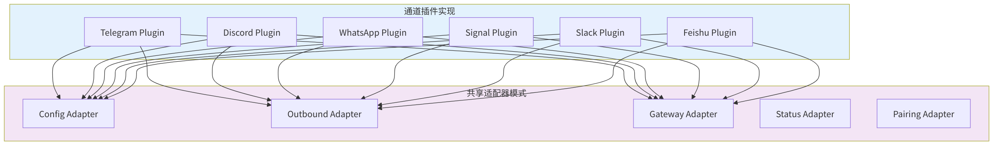
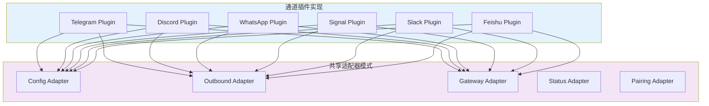
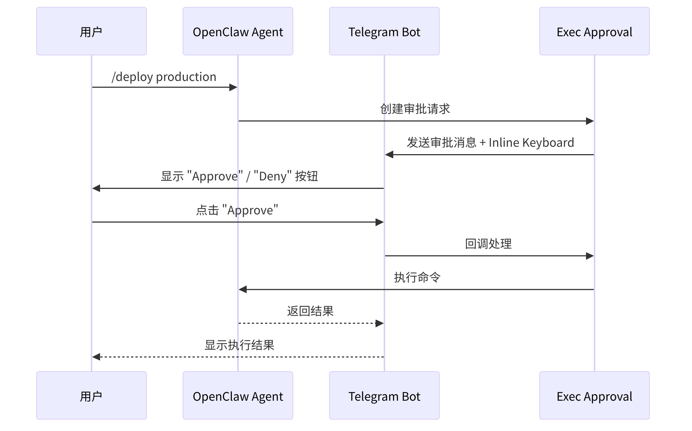
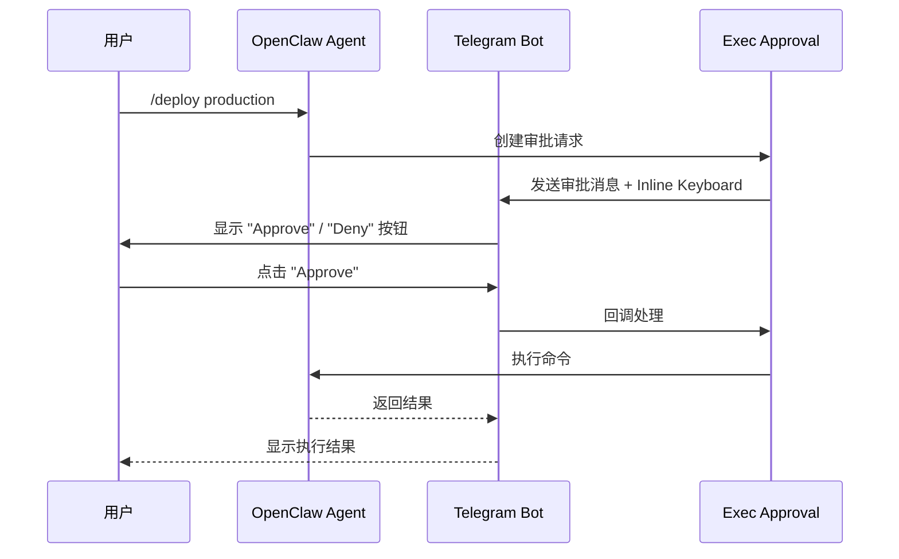
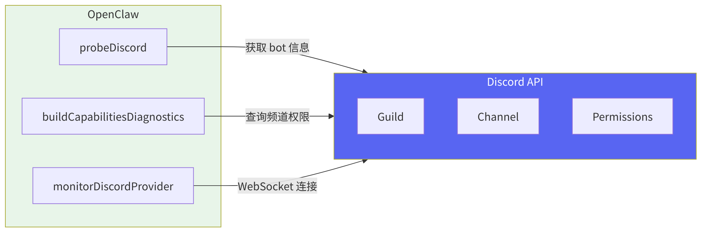
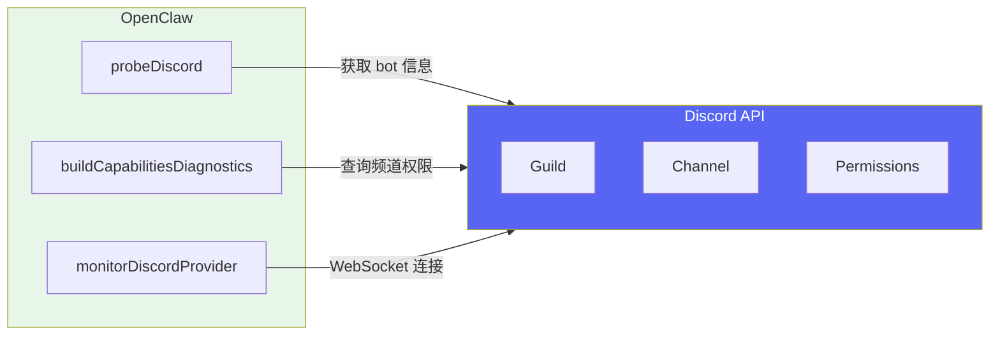
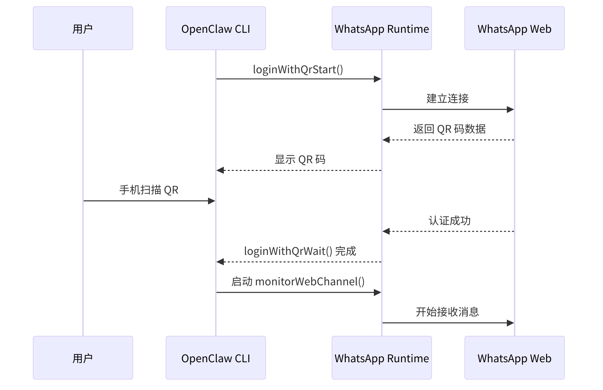
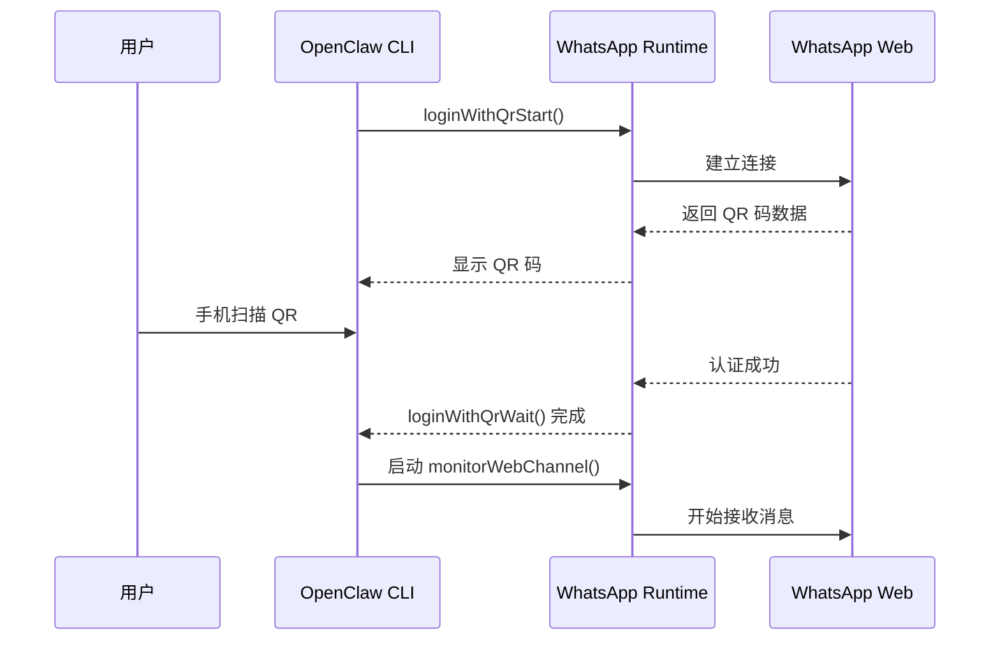
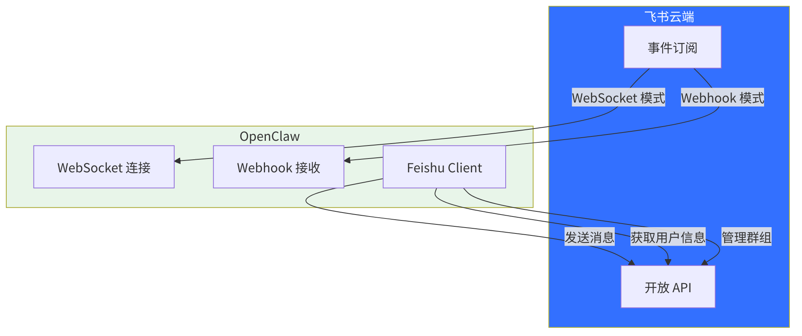
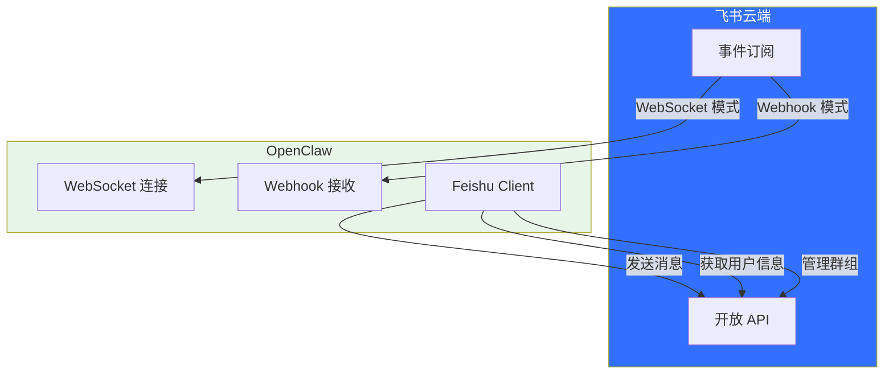

<div v-pre>

# 第8章 通道实现深度剖析

> *"代码中最危险的假设是'这两个平台的行为应该一样'。Telegram 的已读回执是可选的，WhatsApp 的是强制的；Discord 的消息可以编辑，Signal 的不能。每一个'应该'都是一个等待爆炸的 bug。"*

> **本章要点**
> - 逐一剖析六大通道实现：Telegram、Discord、WhatsApp、Signal、Slack、飞书
> - 理解每个平台的独特约束与技术选型背后的权衡
> - 掌握通道实现中的共性设计模式与差异化处理策略
> - 对比六大通道的能力矩阵，指导实际选型


## 8.1 引言

想象一个已经上线的 Agent 的日常切面：一条 WhatsApp 语音从巴西圣保罗发来，同一秒，东京的开发者在 Discord 的 #support 频道里 @了它，伦敦的产品经理在 Slack 线程里追问部署进度。三条消息，三种截然不同的协议栈——但 Agent 的核心逻辑看到的是同一个 `inbound()` 调用。上一章定义的抽象合约在此刻兑现了它的承诺。

上一章，我们设计了通道的抽象合约——那是蓝图。本章走进施工现场，看看那些优雅的接口定义如何与混乱的现实短兵相接。每个平台都有自己的"脾气"：Telegram 要求你在 webhook 和长轮询之间二选一；Discord 强制声明 intents，遗漏一个就收不到消息；WhatsApp 需要扫码登录，认证状态还会悄然过期；Signal 依赖外部 daemon 进程，通信走 JSON-RPC。

> 没有两个通道是一样的。但 OpenClaw 的通道插件，让它们**看起来**一样——正如没有两种语言的语法是一样的，但一个优秀的翻译让你忘记原文是什么语言。

这正是抽象的价值所在——不是消灭差异，而是将差异封装在边界之内，让边界之外的世界保持简洁与统一。

> 🔥 **深度洞察：每个通道都是一部外交史**
>
> 深入阅读本章时，你会发现每个通道实现都不只是"技术适配"——它是与一个平台长期博弈的结晶。Telegram 选 Bot API 而非 User API，是安全与功能的权衡；WhatsApp 的认证状态管理，是与端到端加密设计的妥协；Discord 的 Intent 声明机制，是隐私保护与功能需求的平衡。每一个看似"技术细节"的选择，背后都有平台政策、安全合规、用户体验的多方博弈。这就像外交——你不能只懂对方的语言，还要懂对方的文化、法律和政治红线。优秀的通道实现工程师，本质上是技术外交官。





**图 8-1：通道插件与共享适配器模式**

## 8.2 Telegram 通道实现

### 8.2.1 设计决策：为什么选择 Bot API 而非 User API？

深入实现之前，先讨论一个根本性的设计选择：Telegram 提供两种 API——**Bot API** 和 **User API（MTProto）**。OpenClaw 选择了 Bot API，这个决定并非不言自明。

**User API 的诱惑**：MTProto 允许以普通用户身份操作，可以加入任意群组、读取历史消息、使用 Telegram 的全部功能。一些竞品（如 Telethon 生态）选择了这条路。但它有三个致命问题：

1. **违反 Telegram ToS**。Telegram 明确禁止使用 User API 构建自动化工具。账号被封禁的风险实实在在——你的 Agent 可能在运行三个月后突然失去所有连接。
2. **需要手机号**。每个 User API 会话需要一个手机号登录，且需要接收验证码。对于想运行多个 Agent 的运营者，这意味着多个手机号——管理成本高，且手机号是个人身份信息。
3. **安全边界模糊**。以"用户"身份操作意味着 Agent 拥有与人类用户完全相同的权限——包括读取所有私聊、操作所有群组。没有权限隔离。

**Bot API 的优势**：Bot 是 Telegram 的一等公民，有官方支持的生命周期（创建、配置、撤销）。更重要的是，Bot 的权限天然受限——它只能看到 @它的消息或它管理的群组中的消息。这种"天然最小权限"恰好是 Agent 安全的理想基础。

> **关键概念：通道协议适配**
> 每个消息平台都有独特的通信协议——Telegram 使用长轮询或 Webhook，Discord 使用 WebSocket Gateway，WhatsApp 需要扫码认证的持久连接，Signal 依赖外部 JSON-RPC daemon。通道插件的核心职责就是将这些异构协议适配为 OpenClaw 的统一消息接口，同时保留平台的独特能力。

> ⚠️ **注意**：Telegram Bot API 在群组中默认只能看到 @它的消息和通过 /command 发送的命令。如果需要 Bot 读取群组中的所有消息，必须在 @BotFather 中关闭 Privacy Mode。但请谨慎使用——这会让 Bot 接收群组中的每一条消息，可能带来 Token 消耗和隐私方面的考量。

> 技术选型不只是"能不能"的问题，更是"应不应该"的问题。Bot API 的功能限制，在安全语境下反而是优势——就像消防员穿防护服不是因为灵活，而是因为安全。限制本身就是保护。

**WhatsApp 为什么做了相反的选择？** 因为 WhatsApp 没有官方 Bot API（仅有面向企业的 Cloud API，但需要 Facebook 商业验证）。OpenClaw 被迫使用 Web 客户端协议——这不是偏好，而是唯一可行的消费级方案。这种对比恰好说明：**设计决策受平台约束的影响，和受技术偏好的影响一样大。**

### 8.2.2 架构概览

Telegram 是 OpenClaw 支持最完善的通道之一。它支持 Bot API 的完整功能集，包括文本消息、媒体、投票、inline keyboard、话题（Topics）、webhook 和 polling 两种接收模式。

```typescript
// extensions/telegram/src/channel.ts
export const telegramPlugin: ChannelPlugin<ResolvedTelegramAccount, TelegramProbe> = {
  ...createTelegramPluginBase({
    setupWizard: telegramSetupWizard,
    setup: telegramSetupAdapter,
  }),
  pairing: createTextPairingAdapter({
    idLabel: "telegramUserId",
    message: PAIRING_APPROVED_MESSAGE,
    normalizeAllowEntry: createPairingPrefixStripper(/^(telegram|tg):/i),
    notify: async ({ cfg, id, message }) => {
      const { token } = getTelegramRuntime().channel.telegram.resolveTelegramToken(cfg);
      if (!token) {
        throw new Error("telegram token not configured");
      }
      await getTelegramRuntime().channel.telegram.sendMessageTelegram(id, message, { token });
    },
  }),
  // ... 更多适配器
};
```

### 8.2.3 配置解析

Telegram 的配置解析支持多种 token 来源：环境变量 `TELEGRAM_BOT_TOKEN`、配置文件中的 `botToken` 字段，以及多账户配置中的 `accounts.<id>.botToken`。

```typescript
// extensions/telegram/src/accounts.ts
export function resolveTelegramAccount(params: {
  cfg: OpenClawConfig; accountId?: string | null;
}): ResolvedTelegramAccount {
  const accountId = normalizeAccountId(params.accountId);
  const envToken = process.env.TELEGRAM_BOT_TOKEN?.trim() ?? "";

  // 优先级：环境变量 → 配置文件 → 多账户配置
  if (accountId === DEFAULT_ACCOUNT_ID && envToken) {
    return { accountId, token: envToken, tokenSource: "env", /* ... */ };
  }
  const token = resolveTelegramTokenFromConfig(telegramConfig, accountId);
  return { accountId, token: token ?? "", tokenSource: token ? "config" : "none", /* ... */ };
}
```

### 8.2.4 出站消息发送

Telegram 的出站消息发送遵循 `ChannelOutboundAdapter` 合约，涵盖文本分块、媒体发送、投票、inline keyboard 等能力：

```typescript
// extensions/telegram/src/channel.ts
outbound: {
  deliveryMode: "direct",          // 直接调用 Bot API
  chunkerMode: "markdown",         // 分块时尊重 Markdown 语法
  textChunkLimit: 4000,            // Telegram 消息上限约 4096 字符

  sendPayload: async ({ cfg, to, payload, ...opts }) => {
    const send = resolveOutboundSendDep(deps, "telegram") ?? sendMessageTelegram;
    return attachChannelToResult("telegram",
      await sendTelegramPayloadMessages({ send, to, payload, baseOpts: buildTelegramSendOptions(opts) }));
  },
  sendText:  async (ctx) => await sendTelegramOutbound(ctx),
  sendMedia: async (ctx) => await sendTelegramOutbound(ctx),
  sendPoll:  async ({ to, poll, ...opts }) => await sendPollTelegram(to, poll, opts),
},
```

`deliveryMode: "direct"` 表示 Telegram 插件直接调用 Bot API，不需要通过 Gateway 代理。`chunkerMode: "markdown"` 表示消息分块时会尊重 Markdown 语法结构，避免在代码块中间断开。

### 8.2.5 Gateway 启动流程

Telegram 支持两种消息接收模式：**Polling（轮询）** 和 **Webhook（推送）**。

```typescript
// extensions/telegram/src/channel.ts
gateway: {
  startAccount: async (ctx) => {
    const token = ctx.account.token.trim();

    // 探测 bot 信息（@username），失败时静默降级
    const probe = await probeTelegram(token, 2500, { /* proxy, network */ }).catch(() => null);
    const botLabel = probe?.ok ? ` (@${probe.bot?.username})` : "";
    ctx.log?.info(`[${ctx.account.accountId}] starting provider${botLabel}`);

    // 有 webhookUrl 时用 Webhook 模式，否则用 Long Polling
    return monitorTelegramProvider({
      token, accountId: ctx.account.accountId,
      config: ctx.cfg, runtime: ctx.runtime, abortSignal: ctx.abortSignal,
      useWebhook: Boolean(ctx.account.config.webhookUrl),
      // ... webhookUrl, webhookSecret, webhookPath 等
    });
  },
},
```

当配置了 `webhookUrl` 时，`monitorTelegramProvider` 会注册 webhook；否则使用 `getUpdates` long polling。

### 8.2.6 话题（Topics）支持

Telegram 群组支持话题功能，每个话题有独立的 `message_thread_id`。OpenClaw 将话题映射为独立的会话：

```typescript
// extensions/telegram/src/channel.ts — 话题路由
function resolveTelegramOutboundSessionRoute(params: {
  cfg; agentId: string; target: string; threadId?: string | number | null;
}) {
  const parsed = parseTelegramTarget(params.target);
  const isGroup = parsed.chatType === "group" || /* ... */;
  // 话题的 peerId = "chatId:threadId"，群组始终独立会话
  const peerId = isGroup && resolvedThreadId
    ? buildTelegramGroupPeerId(parsed.chatId, resolvedThreadId) : parsed.chatId;

  const baseSessionKey = buildTelegramBaseSessionKey({ cfg, agentId, accountId, peer: { kind: isGroup ? "group" : "direct", id: peerId } });
  const threadKeys = resolvedThreadId && !isGroup
    ? resolveThreadSessionKeys({ baseSessionKey, threadId: String(resolvedThreadId) }) : null;
  return { sessionKey: threadKeys?.sessionKey ?? baseSessionKey, baseSessionKey, /* ... */ };
}
```

### 8.2.7 Exec Approval 集成

Telegram 通道借助 `execApprovals` 适配器，将命令审批嵌入 inline keyboard 交互中：

```typescript
// extensions/telegram/src/channel.ts
execApprovals: {
  getInitiatingSurfaceState: ({ cfg, accountId }) =>
    isTelegramExecApprovalClientEnabled({ cfg, accountId }) ? { kind: "enabled" } : { kind: "disabled" },

  buildPendingPayload: ({ request, nowMs }) => {
    // 构建审批消息 + Inline Keyboard（Approve / Deny 按钮）
    const payload = buildExecApprovalPendingReplyPayload({
      approvalId: request.id, command: resolveExecApprovalCommandDisplay(request.request).commandText,
      expiresAtMs: request.expiresAtMs, nowMs, /* ... */
    });
    const buttons = buildTelegramExecApprovalButtons(request.id);
    return buttons ? { ...payload, channelData: { telegram: { buttons } } } : payload;
  },
},
```





**图 8-2：Telegram Exec Approval 流程**

### 8.2.8 Webhook vs. Polling 的深层权衡

表面上看，这是一个"推 vs. 拉"的简单选择。但深入分析，两种模式在不同部署场景下的适用性差异巨大：

| 考量维度 | Long Polling | Webhook |
|---------|-------------|---------|
| **部署复杂度** | 零——只需出站连接 | 需要公网 HTTPS 端点 |
| **NAT 友好** | 是——出站请求穿越 NAT | 否——需要端口转发或反向代理 |
| **消息延迟** | ~1 秒（取决于轮询间隔） | 亚秒（Telegram 主动推送） |
| **资源消耗** | 持续 HTTP 连接 | 仅在有消息时消耗 |
| **可靠性** | 简单——失败就重试 | 复杂——webhook 失败时 Telegram 会指数退避重推 |
| **调试难度** | 低——可以在本地直接看到请求 | 高——需要 ngrok 等隧道工具 |

OpenClaw 默认使用 Long Polling 的原因正是其目标用户画像：个人部署者在家用服务器或 VPS 上运行，通常在 NAT 之后，不想（或不会）配置 SSL 证书和反向代理。**渐进式复杂度**的哲学在这里体现——默认零配置即可工作，需要低延迟时可以选择升级到 Webhook。

## 8.3 Discord 通道实现

### 8.3.1 设计决策：Intents 是安全特性而非技术障碍

Discord 使用 WebSocket Gateway 连接接收事件。但在讨论实现之前，必须理解 Discord 的 **Gateway Intents** 设计——这不只是技术限制，而是一个深思熟虑的隐私保护架构。

2020 年之前，Discord Bot 可以自动接收所有事件。这意味着一个被加入 1000 个服务器的 Bot 可以静默监控所有消息——即使它的功能只是播放音乐。Intents 的引入强制 Bot 声明"我需要看到什么"，未声明的事件类型不会被推送。

这对 OpenClaw 的影响是双面的：

**正面**：Intents 天然限制了 Agent 的信息范围。一个只声明了 `GUILD_MESSAGES` intent 的 Bot 看不到用户的在线状态、语音状态或成员变更——这正是最小权限原则的平台级实现。

**负面**：`MESSAGE_CONTENT` intent 需要额外审批（超过 100 个服务器的 Bot）。这意味着大规模部署的 Bot 可能需要 Discord 的人工审批——一个完全在 OpenClaw 控制之外的依赖。

OpenClaw 的应对是**优雅降级**：如果 `MESSAGE_CONTENT` intent 未启用，Bot 仍能接收事件（知道有消息发送了），但看不到消息内容。系统在启动时检测这种状态并输出诊断警告，而不是崩溃。

> 💡 **最佳实践**：部署 Discord 通道时，务必在 Discord Developer Portal 中启用 `MESSAGE_CONTENT` intent。否则 Agent 只能看到 slash commands 和 @提及，无法读取普通消息内容。对于超过 100 个服务器的 Bot，需要提前申请 Discord 的人工审批。

```typescript
// extensions/discord/src/channel.ts
export const discordPlugin: ChannelPlugin<ResolvedDiscordAccount> = {
  ...createDiscordPluginBase({
    setup: discordSetupAdapter,
  }),
  // ...
};
```

### 8.3.2 双 Token 架构：为什么允许混合身份？

Discord 支持同时配置 Bot Token 和 User Token，这个设计选择值得深入讨论：

```typescript
// extensions/discord/src/channel.ts
function getTokenForOperation(
  account: ResolvedDiscordAccount,
  operation: "read" | "write",
): string | undefined {
  const userToken = account.config.userToken?.trim() || undefined;
  const botToken = account.botToken?.trim();
  const allowUserWrites = account.config.userTokenReadOnly === false;

  if (operation === "read") {
    return userToken ?? botToken;  // 读操作优先使用 user token
  }

  if (!allowUserWrites) {
    return botToken;  // 写操作默认只用 bot token
  }

  return botToken ?? userToken;
}
```

这种双 Token 架构看似多余——为什么不统一用 Bot Token？原因在于 Discord 生态的一个实际需求：某些操作（如读取历史消息、搜索消息）在 Bot 账号上有更严格的速率限制，而 User Token 可以绕过这些限制。同时，`userTokenReadOnly` 的默认 `true` 确保了安全底线——User Token 默认只用于读取，写操作仍然使用 Bot 身份。这是一个典型的"先安全、后放开"的设计。

### 8.3.3 Intents 检测

Discord 要求显式声明 Gateway Intents。OpenClaw 会在启动时检测 Message Content Intent 状态：

```typescript
// extensions/discord/src/channel.ts
gateway: {
  startAccount: async (ctx) => {
    // 探测 bot 信息 & Intent 状态（失败时静默降级）
    const probe = await probeDiscord(ctx.account.token, 2500, { includeApplication: true }).catch(() => null);
    if (probe?.ok) ctx.setStatus({ bot: probe.bot, application: probe.application });
    if (probe?.application?.intents?.messageContent === "disabled")
      ctx.log?.warn(`Message Content Intent disabled`);

    return monitorDiscordProvider({
      token: ctx.account.token, accountId: ctx.account.accountId,
      config: ctx.cfg, runtime: ctx.runtime, abortSignal: ctx.abortSignal,
      // ... mediaMaxMb, historyLimit, setStatus
    });
  },
},
```

### 8.3.4 线程与回复模式

Discord 的线程（Thread）有特殊的行为——消息可以"发送到线程"或"回复消息但不在线程中"。OpenClaw 支持可配置的回复模式：

```typescript
// extensions/discord/src/channel.ts
threading: {
  resolveReplyToMode: createScopedAccountReplyToModeResolver({
    resolveAccount: (cfg, accountId) => resolveSlackAccount({ cfg, accountId }),
    resolveReplyToMode: (account, chatType) => resolveDiscordReplyToMode(account, chatType),
  }),
  resolveAutoThreadId: ({ cfg, accountId, to, toolContext, replyToId }) =>
    replyToId
      ? undefined  // 有显式 replyToId 时不自动选择线程
      : resolveDiscordAutoThreadId({ cfg, accountId, to, toolContext }),
},
```

### 8.3.5 消息 Actions

Discord 支持丰富的消息操作，包括 reactions、timeout、kick、ban：

```typescript
// extensions/discord/src/channel.ts — 消息操作适配器
const discordMessageActions: ChannelMessageActionAdapter = {
  describeMessageTool: (ctx) => messageActions?.describeMessageTool?.(ctx) ?? null,
  extractToolSend:     (ctx) => messageActions?.extractToolSend?.(ctx) ?? null,
  handleAction:        async (ctx) => messageActions.handleAction(ctx),  // 委托给运行时
  // timeout/kick/ban 等敏感操作要求受信任的请求者
  requiresTrustedRequesterSender: ({ action }) =>
    ["timeout", "kick", "ban"].includes(action),
};
```

`requiresTrustedRequesterSender` 确保 timeout/kick/ban 等敏感操作只能在受信任的请求者发起时执行。

### 8.3.6 权限诊断

Discord 插件通过 `buildCapabilitiesDiagnostics` 诊断 bot 在特定频道中的权限缺口：

```typescript
// extensions/discord/src/channel.ts — 权限诊断
status: {
  buildCapabilitiesDiagnostics: async ({ account, target }) => {
    if (!target?.trim()) return undefined;
    const perms = await fetchChannelPermissionsDiscord(parseDiscordTarget(target).id, { token: account.token });
    const missing = REQUIRED_DISCORD_PERMISSIONS.filter(p => !perms.permissions.includes(p));
    return {
      details: { permissions: perms, missingRequired: missing },
      lines: [
        { text: `Permissions: ${perms.permissions.join(", ")}` },
        missing.length ? { text: `Missing: ${missing.join(", ")}`, tone: "warn" } : { text: "All OK", tone: "success" },
      ],
    };
  },
},
```





**图 8-3：Discord 与 OpenClaw 的交互**

## 8.4 WhatsApp 通道实现

### 8.4.1 设计决策：为什么选择 Web 客户端协议？

WhatsApp 的消息发送方式有三种可能的路径，OpenClaw 选择了其中最"非正统"的一条：

**路径 A：WhatsApp Cloud API（官方）**。Meta 提供的官方 API，需要 Facebook 商业验证、Meta Business Suite 账号、每月费用。优点：稳定、有 SLA。缺点：不适合个人用户——你需要注册公司、完成商业验证、支付月费。OpenClaw 的目标用户是个人开发者和小团队，这个门槛太高。

**路径 B：WhatsApp Business API（on-premise）**。自托管的 WhatsApp 商业解决方案。优点：企业级。缺点：需要 Docker 部署多个容器、需要商业授权、需要固定电话号码。更不适合个人用户。

**路径 C：WhatsApp Web 协议（最终选择）**。通过反向工程的 Web 客户端协议连接，相当于"程序模拟你在浏览器中使用 WhatsApp Web"。优点：零成本、零审批、任何 WhatsApp 账号都能用。缺点：依赖第三方库（如 Baileys）维护协议兼容性，且 WhatsApp 可能随时更改协议。

这个选择体现了一个更深层的哲学：**OpenClaw 优先服务个人用户和小团队，而非企业**。企业有资源走官方路径；个人用户需要"零摩擦"的接入方式。这种优先级决定了很多看似"非标准"的设计选择。

### 8.4.2 Web 客户端架构

OpenClaw 使用 WhatsApp Web 客户端协议实现消息收发。这需要：

1. **QR 码登录**：首次使用需扫描 QR 码
2. **持久化认证**：会话状态存储在 `authDir` 目录
3. **被动监听**：作为"普通用户"接收消息

```typescript
// extensions/whatsapp/src/channel.ts
export const whatsappPlugin: ChannelPlugin<ResolvedWhatsAppAccount> = {
  ...createWhatsAppPluginBase({
    groups: {
      resolveRequireMention: resolveWhatsAppGroupRequireMention,
      resolveToolPolicy: resolveWhatsAppGroupToolPolicy,
      resolveGroupIntroHint: resolveWhatsAppGroupIntroHint,
    },
    setupWizard: whatsappSetupWizardProxy,
    setup: whatsappSetupAdapter,
    isConfigured: async (account) =>
      await getWhatsAppRuntime().channel.whatsapp.webAuthExists(account.authDir),
  }),
  agentTools: () => [getWhatsAppRuntime().channel.whatsapp.createLoginTool()],
  // ...
};
```

### 8.4.3 QR 码登录流程

```typescript
// extensions/whatsapp/src/channel.ts
gateway: {
  startAccount: async (ctx) => {
    // 读取已保存的身份（e164 电话号或 JID）
    const { e164, jid } = loadWhatsAppChannelRuntime().readWebSelfId(ctx.account.authDir);
    ctx.log?.info(`[${ctx.account.accountId}] starting (${e164 || jid || "unknown"})`);
    return monitorWebChannel({ runtime: ctx.runtime, abortSignal: ctx.abortSignal, /* ... */ });
  },

  loginWithQrStart: async ({ accountId, force }) =>
    await loadWhatsAppChannelRuntime().startWebLoginWithQr({ accountId, force }),
  loginWithQrWait:  async ({ accountId, timeoutMs }) =>
    await loadWhatsAppChannelRuntime().waitForWebLogin({ accountId, timeoutMs }),
  logoutAccount:    async ({ account }) =>
    await loadWhatsAppChannelRuntime().logoutWeb({ authDir: account.authDir }),
},
```





**图 8-4：WhatsApp QR 码登录流程**

### 8.4.4 认证状态管理

WhatsApp 的认证状态存储在文件系统中，`status` 适配器会检查认证文件的存在和年龄：

```typescript
// extensions/whatsapp/src/channel.ts — 认证状态检查
status: {
  buildChannelSummary: async ({ account, snapshot }) => {
    const runtime = await loadWhatsAppChannelRuntime();
    const linked = snapshot.linked ?? await runtime.webAuthExists(account.authDir);
    const authAgeMs = linked ? await runtime.getWebAuthAgeMs(account.authDir) : null;
    const self = linked ? runtime.readWebSelfId(account.authDir) : { e164: null, jid: null };
    return { configured: linked, linked, authAgeMs, self, running: snapshot.running ?? false, /* ... */ };
  },
},
```

### 8.4.5 Heartbeat 集成

WhatsApp 插件借助 `heartbeat` 适配器探测 WhatsApp 是否可用作心跳通知通道：

```typescript
// extensions/whatsapp/src/channel.ts — 心跳就绪检查
heartbeat: {
  checkReady: async ({ cfg, accountId }) => {
    if (cfg.web?.enabled === false) return { ok: false, reason: "whatsapp-disabled" };
    const account = resolveWhatsAppAccount({ cfg, accountId });
    if (!await webAuthExists(account.authDir)) return { ok: false, reason: "whatsapp-not-linked" };
    if (!getActiveWebListener()) return { ok: false, reason: "whatsapp-not-running" };
    return { ok: true, reason: "ok" };
  },
  resolveRecipients: ({ cfg, opts }) => resolveWhatsAppHeartbeatRecipients(cfg, opts),
},
```

## 8.5 Signal 通道实现

### 8.5.1 设计决策：为什么依赖外部 Daemon？

Signal 是六大通道中最"特立独行"的——它是唯一一个依赖外部进程的通道。这个决定背后有深刻的原因。

Signal 协议（Signal Protocol）是端到端加密消息领域的标准，但它的设计初衷是**抵抗中心化控制**。Signal 官方不提供 Bot API——他们的立场是：任何自动化消息系统都可能被用于垃圾信息和监控，这与 Signal 的隐私使命冲突。

这留给 Agent 框架三个选择：

1. **直接实现 Signal Protocol**。从头实现 Double Ratchet、X3DH 密钥交换、密封消息等密码学原语。工作量巨大（数月开发），且需要持续跟进协议变更。
2. **使用 libsignal 库**。Signal 的官方客户端库，但它是 Rust 编写的，且 Signal Foundation 不鼓励第三方使用。
3. **委托给 signal-cli（最终选择）**。signal-cli 是一个成熟的第三方项目，已经解决了协议实现的所有复杂性。OpenClaw 通过 JSON-RPC 与它通信。

选择 signal-cli 的权衡很明确：**获得稳定的协议实现，但引入了外部依赖**。这意味着运营者需要额外安装和维护 signal-cli daemon。OpenClaw 通过状态探测（`probeSignal`）和自动重启来减轻这个负担，但它终究是一个额外的运维步骤。

> 有时候，最好的架构决策是承认"不做"。直接实现 Signal Protocol 会让 OpenClaw 团队承担远超其核心使命的密码学维护责任。知道自己的边界在哪里，比知道自己能做什么更难——也更重要。

### 8.5.2 JSON-RPC 通信架构

OpenClaw 通过 JSON-RPC 接口与 signal-cli 通信：

```typescript
// extensions/signal/src/channel.ts
export const signalPlugin: ChannelPlugin<ResolvedSignalAccount> = {
  ...createSignalPluginBase({
    setupWizard: signalSetupWizard,
    setup: signalSetupAdapter,
  }),
  // ...
};
```

### 8.5.3 多身份标识

Signal 支持多种用户标识方式：E.164 电话号码、UUID、用户名。OpenClaw 会自动解析和标准化：

```typescript
// extensions/signal/src/channel.ts
function inferSignalTargetChatType(rawTo: string) {
  let to = rawTo.trim();
  if (!to) return undefined;

  if (/^signal:/i.test(to)) {
    to = to.replace(/^signal:/i, "").trim();
  }
  if (!to) return undefined;

  const lower = to.toLowerCase();
  if (lower.startsWith("group:")) {
    return "group" as const;
  }
  if (lower.startsWith("username:") || lower.startsWith("u:")) {
    return "direct" as const;
  }

  return "direct" as const;
}
```

### 8.5.4 格式化文本

Signal 支持 basic styling（粗体、斜体、等宽），OpenClaw 会将 Markdown 转换为 Signal 的样式格式：

```typescript
// extensions/signal/src/channel.ts — Markdown → Signal 样式转换与分块发送
async function sendFormattedSignalText(ctx: { cfg; to: string; text: string; accountId?; abortSignal? }) {
  const { send, maxBytes } = resolveSignalSendContext({ cfg: ctx.cfg, accountId: ctx.accountId });
  const limit = resolveTextChunkLimit(ctx.cfg, "signal", ctx.accountId, { fallbackLimit: 4000 });

  // 将 Markdown 转换为 Signal 文本样式块（粗体、斜体、等宽等）
  let chunks = markdownToSignalTextChunks(ctx.text, limit ?? Infinity, {
    tableMode: resolveMarkdownTableMode({ cfg: ctx.cfg, channel: "signal" }),
  });
  if (!chunks.length && ctx.text) chunks = [{ text: ctx.text, styles: [] }];

  // 逐块发送，支持中断
  const results = [];
  for (const chunk of chunks) {
    ctx.abortSignal?.throwIfAborted();
    results.push(await send(ctx.to, chunk.text, { textMode: "plain", textStyles: chunk.styles }));
  }
  return attachChannelToResults("signal", results);
}
```

### 8.5.5 状态探测

Signal 插件通过 `probeAccount` 探测 signal-cli daemon 是否就绪：

```typescript
// extensions/signal/src/channel.ts
status: {
  defaultRuntime: createDefaultChannelRuntimeState(DEFAULT_ACCOUNT_ID),
  collectStatusIssues: (accounts) => collectStatusIssuesFromLastError("signal", accounts),
  buildChannelSummary: ({ snapshot }) => ({
    ...buildBaseChannelStatusSummary(snapshot),
    baseUrl: snapshot.baseUrl ?? null,
    probe: snapshot.probe,
    lastProbeAt: snapshot.lastProbeAt ?? null,
  }),
  probeAccount: async ({ account, timeoutMs }) => {
    const baseUrl = account.baseUrl;
    return await getSignalRuntime().channel.signal.probeSignal(baseUrl, timeoutMs);
  },
  formatCapabilitiesProbe: ({ probe }) =>
    (probe as SignalProbe | undefined)?.version
      ? [{ text: `Signal daemon: ${(probe as SignalProbe).version}` }]
      : [],
  // ...
},
```

## 8.6 Slack 通道实现

### 8.6.1 设计决策：Socket Mode 为什么是默认推荐？

Slack 支持两种事件接收模式，OpenClaw 默认推荐 Socket Mode——这个选择与 Telegram 选择 Long Polling 的逻辑一脉相承：

- **Socket Mode**：通过 WebSocket 连接接收事件，不需要公网可访问的服务器
- **HTTP Mode**：通过 HTTP webhook 接收事件，需要配置签名验证

```typescript
// extensions/slack/src/channel.ts
status: {
  buildAccountSnapshot: ({ account, runtime, probe }) => {
    const mode = account.config.mode ?? "socket";
    const configured =
      (mode === "http"
        ? resolveConfiguredFromRequiredCredentialStatuses(account, [
            "botTokenStatus",
            "signingSecretStatus",
          ])
        : resolveConfiguredFromRequiredCredentialStatuses(account, [
            "botTokenStatus",
            "appTokenStatus",
          ])) ?? isSlackPluginAccountConfigured(account);

    // ...
  },
},
```

### 8.6.2 频道类型检测

Slack 有多种频道类型：public channel、private channel、DM、MPIM（多用户 DM）。OpenClaw 需要动态检测：

```typescript
// extensions/slack/src/channel.ts — 频道类型检测（带缓存）
const SLACK_CHANNEL_TYPE_CACHE = new Map<string, "channel" | "group" | "dm" | "unknown">();

async function resolveSlackChannelType(params: {
  cfg: OpenClawConfig; accountId?: string | null; channelId: string;
}): Promise<"channel" | "group" | "dm" | "unknown"> {
  const cached = SLACK_CHANNEL_TYPE_CACHE.get(`${params.accountId}:${params.channelId}`);
  if (cached) return cached;

  // 1. 先检查 groupChannels 配置白名单（多种前缀格式匹配）
  const groupChannels = normalizeAllowListLower(account.dm?.groupChannels);
  if (groupChannels.includes(channelIdLower) /* || slack:, channel:, group:, mpim: 前缀 */) {
    return cacheAndReturn(cacheKey, "group");
  }

  // 2. 调用 conversations.info API 动态检测
  const info = await client.conversations.info({ channel: channelId });
  const type = info.channel?.is_im ? "dm" : info.channel?.is_mpim ? "group" : "channel";
  return cacheAndReturn(cacheKey, type);
}
```

### 8.6.3 交互式回复

Slack 支持通过 Block Kit 构建丰富的交互界面。OpenClaw 可以检测并处理结构化的回复负载：

```typescript
// extensions/slack/src/channel.ts
messaging: {
  enableInteractiveReplies: ({ cfg, accountId }) =>
    isSlackInteractiveRepliesEnabled({ cfg, accountId }),

  hasStructuredReplyPayload: ({ payload }) => {
    const slackData = payload.channelData?.slack;
    if (!slackData || typeof slackData !== "object" || Array.isArray(slackData)) {
      return false;
    }
    try {
      return Boolean(parseSlackBlocksInput((slackData as { blocks?: unknown }).blocks)?.length);
    } catch {
      return false;
    }
  },
},
```

### 8.6.4 Slash Commands

Slack 支持通过 Slash Commands 触发 Agent：

```typescript
// extensions/slack/src/channel.ts
gateway: {
  startAccount: async (ctx) => {
    ctx.log?.info(`[${ctx.account.accountId}] starting provider`);
    return monitorSlackProvider({
      botToken: ctx.account.botToken ?? "", appToken: ctx.account.appToken ?? "",
      accountId: ctx.account.accountId, config: ctx.cfg,
      runtime: ctx.runtime, abortSignal: ctx.abortSignal,
      slashCommand: ctx.account.config.slashCommand,  // Slash Command 配置
      // ... mediaMaxMb, setStatus, getStatus
    });
  },
},
```

## 8.7 Feishu（飞书）通道实现

### 8.7.1 设计决策：飞书 vs. Lark 的国际化困境

飞书和 Lark 是同一个产品的中国版和国际版，但它们的 API 端点不同（`feishu.cn` vs. `larksuite.com`），部分功能也不同。OpenClaw 通过 `domain` 配置参数统一处理两者：

```yaml
channels:
  feishu:
    appId: "cli_xxx"
    appSecret: "xxx"
    domain: "feishu.cn"     # 或 "larksuite.com" 用于国际版
```

这看似简单，但背后涉及一个更深层的设计问题：**如何在"通道无关"的抽象下处理同一平台的区域差异？** 飞书的消息格式、卡片结构和事件类型在两个版本中几乎相同，但认证端点、API 基础 URL 和某些高级功能有区别。OpenClaw 的处理方式是将这种差异隔离在配置层——代码中只有 `domain` 变量影响 API 调用的 URL 构建，其他逻辑完全共享。

### 8.7.2 飞书 API 架构

飞书是字节跳动的企业协作平台，支持丰富的消息类型和交互卡片。OpenClaw 通过飞书开放 API 实现消息收发：

```typescript
// extensions/feishu/src/channel.ts
const meta: ChannelMeta = {
  id: "feishu", label: "Feishu", selectionLabel: "Feishu/Lark (飞书)",
  docsPath: "/channels/feishu", aliases: ["lark"], order: 70,
};

export const feishuPlugin: ChannelPlugin<ResolvedFeishuAccount> = {
  id: "feishu",
  meta: { ...meta },
  capabilities: {
    chatTypes: ["direct", "channel"],
    threads: true, media: true, reactions: true, edit: true, reply: true,
    polls: false,  // 飞书不支持原生投票
  },
  // ... config, outbound, gateway, actions 等适配器
};
```

### 8.7.3 应用凭证配置

飞书使用 App ID 和 App Secret 进行认证：

```typescript
// extensions/feishu/src/accounts.ts
export function resolveFeishuAccount(params: { cfg; accountId? }): ResolvedFeishuAccount {
  const feishuConfig = params.cfg.channels?.feishu;
  // 优先级：顶层配置 → accounts.<id> 子配置
  const appId = feishuConfig?.appId ?? feishuConfig?.accounts?.[accountId]?.appId;
  const appSecret = feishuConfig?.appSecret ?? feishuConfig?.accounts?.[accountId]?.appSecret;
  const domain = feishuConfig?.domain ?? "feishu.cn";  // 国际版用 "larksuite.com"
  return { accountId, appId, appSecret, domain, configured: Boolean(appId && appSecret), /* ... */ };
}
```

### 8.7.4 卡片消息

飞书支持交互式卡片消息，OpenClaw 可以发送结构化的卡片数据：

```typescript
// extensions/feishu/src/channel.ts — 卡片/文本消息发送
actions: {
  handleAction: async (ctx) => {
    if (ctx.action === "send" || ctx.action === "thread-reply") {
      const to = resolveFeishuActionTarget(ctx);
      const card = ctx.params.card as Record<string, unknown> | undefined;
      const text = readFirstString(ctx.params, ["text", "message"]);

      // 优先发送卡片消息，否则发送纯文本
      const result = card
        ? await runtime.sendCardFeishu({ cfg: ctx.cfg, to, card, replyInThread: ctx.action === "thread-reply" })
        : await runtime.sendMessageFeishu({ cfg: ctx.cfg, to, text: text!, replyInThread: ctx.action === "thread-reply" });
      return jsonActionResult({ ok: true, channel: "feishu", ...result });
    }
    // ... 其他 action 类型
  },
},
```

### 8.7.5 会话 ID 解析

飞书的会话 ID 有多种格式：私聊 `ou_xxx`、群聊 `oc_xxx`、话题 `oc_xxx:topic:tt_xxx`：

```typescript
// extensions/feishu/src/conversation-id.ts
export function parseFeishuConversationId(params: { conversationId: string }): ParsedFeishuConversationId | null {
  const id = params.conversationId.trim();
  if (!id) return null;

  // 话题格式: oc_xxx:topic:tt_xxx[:sender:ou_xxx]
  const topicMatch = id.match(/^(oc_[^:]+):topic:(tt_[^:]+)(?::sender:(ou_[^:]+))?$/i);
  if (topicMatch) {
    return { chatId: topicMatch[1], topicId: topicMatch[2], senderId: topicMatch[3],
             scope: topicMatch[3] ? "group_topic_sender" : "group_topic" };
  }

  if (id.startsWith("oc_")) return { chatId: id, scope: "group" };               // 群聊
  if (id.startsWith("ou_") || id.startsWith("on_")) return { chatId: id, scope: "direct" };  // 私聊
  return null;
}
```

### 8.7.6 Webhook 与 WebSocket

飞书支持两种事件接收方式：Webhook 和 WebSocket。OpenClaw 根据配置选择：

```typescript
// extensions/feishu/src/channel.ts
gateway: {
  startAccount: async (ctx) => {
    const { monitorFeishuProvider } = await import("./monitor.js");
    const account = resolveFeishuAccount({ cfg: ctx.cfg, accountId: ctx.accountId });
    const port = account.config?.webhookPort ?? null;

    ctx.setStatus({ accountId: ctx.accountId, port });
    ctx.log?.info(
      `starting feishu[${ctx.accountId}] (mode: ${account.config?.connectionMode ?? "websocket"})`
    );

    return monitorFeishuProvider({
      config: ctx.cfg,
      runtime: ctx.runtime,
      abortSignal: ctx.abortSignal,
      accountId: ctx.accountId,
    });
  },
},
```





**图 8-5：飞书通道架构**

## 8.8 通道实现对比

| 特性 | Telegram | Discord | WhatsApp | Signal | Slack | Feishu |
|------|----------|---------|----------|--------|-------|--------|
| **认证方式** | Bot Token | Bot Token + App Token | QR 码扫码 | signal-cli | Bot Token + App Token | App ID + Secret |
| **消息接收** | Webhook / Polling | WebSocket Gateway | Web 客户端 | JSON-RPC | Socket Mode / HTTP | WebSocket / Webhook |
| **文本分块** | Markdown-aware | 无（2000 字符） | 无 | Plain text | 无（4000 字符） | Markdown-aware |
| **线程支持** | Topics | Threads | Reply | Quote | Threads | Topics |
| **交互组件** | Inline Keyboard | Components V2 | 无 | 无 | Block Kit | Cards |
| **投票** | ✅ | ✅ | ❌ | ❌ | ✅ | ❌ |
| **Reactions** | ❌ | ✅ | ✅ | ❌ | ✅ | ✅ |
| **消息编辑** | ✅ | ✅ | ❌ | ❌ | ✅ | ✅ |
| **多账户** | ✅ | ✅ | ✅ | ✅ | ✅ | ✅ |
| **群组白名单** | ✅ | ✅ | ✅ | ✅ | ✅ | ✅ |

**表 8-1：通道实现特性对比**

## 8.9 设计模式分析

### 8.9.1 适配器模式的统一应用

所有通道都采用适配器模式，根据平台能力实现不同的适配器组合：

- **必需适配器**：`config`（配置解析）
- **常用适配器**：`outbound`（出站消息）、`gateway`（生命周期）、`status`（状态查询）
- **可选适配器**：`pairing`（配对）、`actions`（消息操作）、`heartbeat`（心跳）、`execApprovals`（命令审批）

### 8.9.2 运行时注入

所有通道都通过 `getRuntime()` 函数获取运行时依赖，而非直接导入。这带来了：

1. **延迟加载**：重模块只在需要时加载
2. **测试隔离**：测试时可以注入 mock runtime
3. **循环依赖避免**：模块加载顺序不影响运行

```typescript
// 示例：延迟加载模式
const loadFeishuChannelRuntime = createLazyRuntimeNamedExport(
  () => import("./channel.runtime.js"),
  "feishuChannelRuntime",
);
```

### 8.9.3 共享工具函数

多个通道共享的工具函数被提取到 `plugin-sdk` 中：

- `createTextPairingAdapter`：文本配对适配器工厂
- `createScopedDmSecurityResolver`：DM 安全策略解析器
- `buildOutboundBaseSessionKey`：会话键构建器
- `createAttachedChannelResultAdapter`：出站结果适配器

## 8.10 测试策略

### 8.10.1 单元测试

每个通道都有独立的单元测试，测试配置解析、目标格式化、会话键构建等纯逻辑：

```text
extensions/telegram/src/*.test.ts
extensions/discord/src/*.test.ts
extensions/whatsapp/src/*.test.ts
```

### 8.10.2 运行时测试

涉及实际 API 调用的测试使用 `*.runtime.ts` 后缀：

```text
extensions/telegram/src/*.runtime.ts
extensions/discord/src/read-only-account-inspect.discord.runtime.ts
```

### 8.10.3 集成测试

`src/channels/plugins/contracts/` 目录下有通道合约的一致性测试，确保所有通道遵循相同的接口规范。

## 8.11 本章小结：六个世界，一个接口

六大通道，六种截然不同的工程挑战：

- **Telegram** 是"模范生"——API 设计干净，功能丰富，是 OpenClaw 支持最完善的通道
- **Discord** 是"复杂的巨人"——双 token 架构、Gateway intents、slash commands，每一个特性都带着自己的陷阱
- **WhatsApp** 是"叛逆者"——没有官方 bot API，你需要用 Web 客户端协议，扫码登录，还要处理认证状态过期
- **Signal** 是"隐士"——依赖外部 daemon 进程，通信走 JSON-RPC，消息格式独特
- **Slack** 是"企业老兵"——Socket Mode 和 HTTP Mode 两种模式，Block Kit 的结构化消息
- **Feishu** 是"后起之秀"——飞书开放 API 设计现代，但事件订阅和卡片消息有独特的学习曲线

> **通道实现的铁律：永远不要假设两个平台的行为一样。** API 表面相似（都有"发送消息"端点），语义暗流截然不同——你的代码会在最意想不到的地方崩溃。正如"打招呼"在每种文化中都存在，但鞠躬的角度、握手的力度、拥抱的时机完全不同。

六个平台，六种截然不同的工程挑战。收编到同一个 `ChannelPlugin` 接口之后，Agent 运行时对它们的差异浑然不觉。每个通道实现中隐藏的复杂性，正是这层抽象替你消化掉的"成本"——通道无关不是免费的午餐，而是有人替你买了单。

下一章，我们退后一步，看 OpenClaw 如何发现、加载、注册和管理这些通道插件——插件与扩展系统。

### 思考题

1. **概念理解**：Telegram、Discord 和 WhatsApp 三个平台在消息模型上有哪些根本差异？这些差异如何影响通道实现的复杂度？
2. **实践应用**：WhatsApp 的端到端加密对消息处理流程施加了哪些约束？如果要在加密通道中实现消息搜索功能，你会面临什么架构挑战？
3. **开放讨论**：不同平台对 Bot 的速率限制差异巨大（Telegram 相对宽松，WhatsApp 非常严格）。这种差异应该在通道层还是在更高层（如 Agent 层）处理？为什么？

### 📚 推荐阅读

- [Discord Developer Portal](https://discord.com/developers/docs) — Discord API 与 Gateway 协议的完整文档
- [WhatsApp Business API (Meta)](https://developers.facebook.com/docs/whatsapp/) — WhatsApp 商业 API 的设计约束与能力
- [Signal Protocol 技术文档](https://signal.org/docs/) — 理解端到端加密对通道实现的深层影响


</div>
