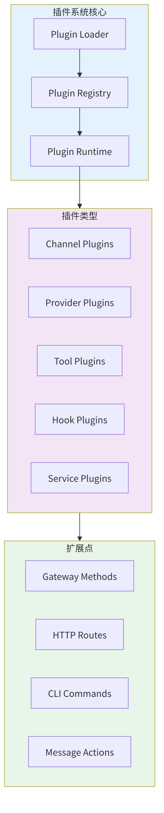
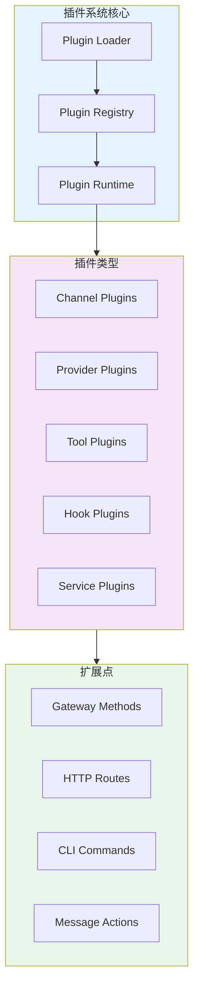
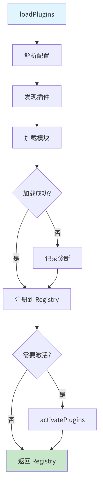
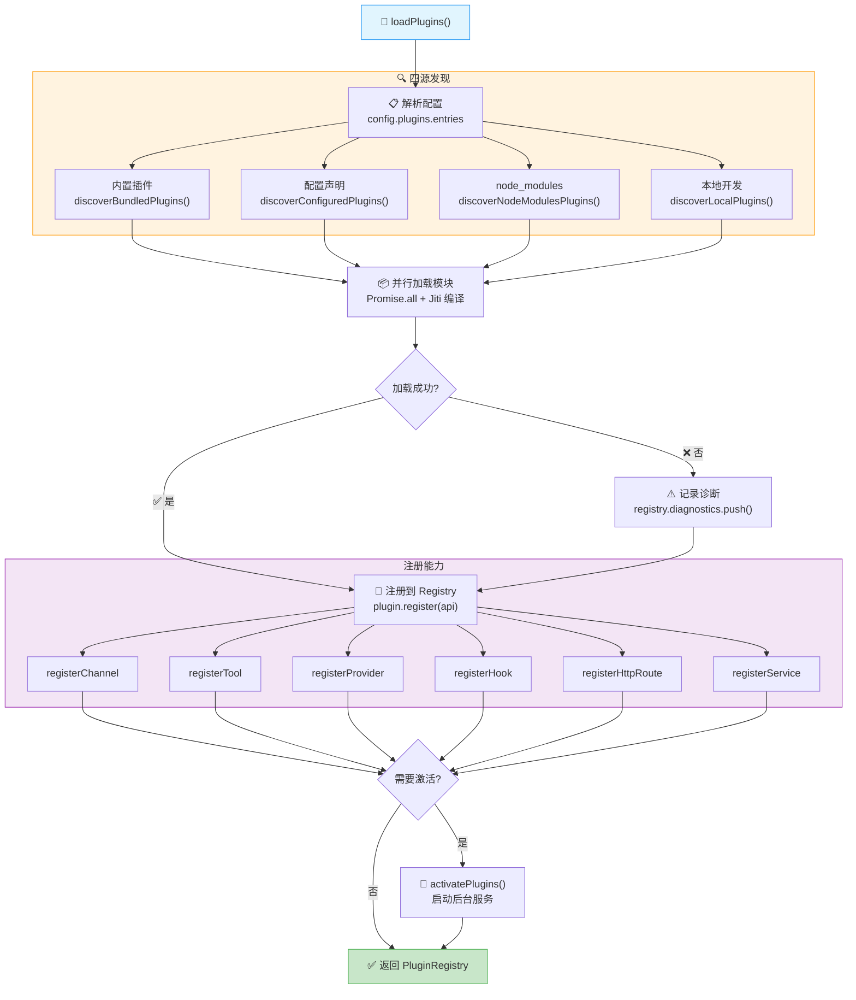
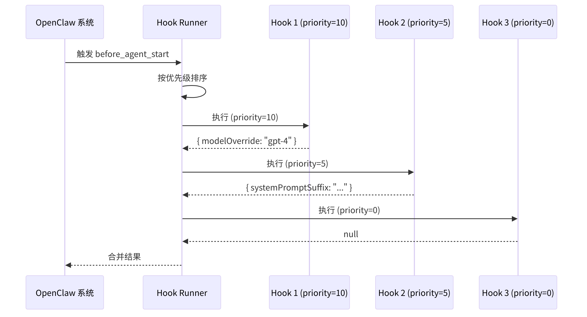
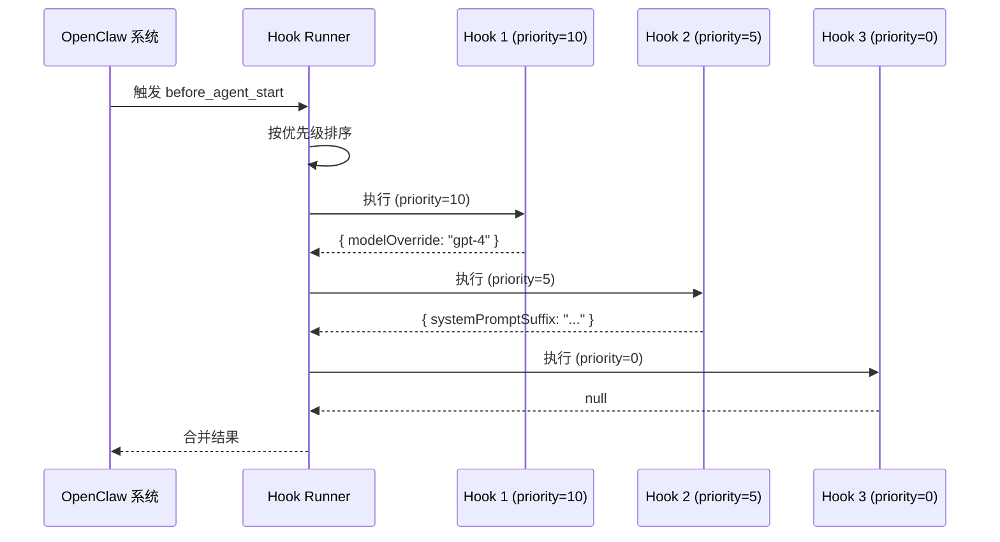
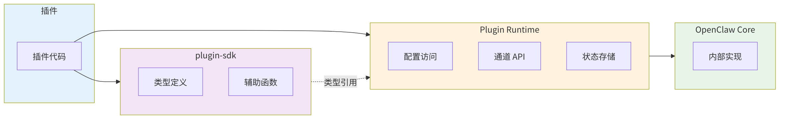
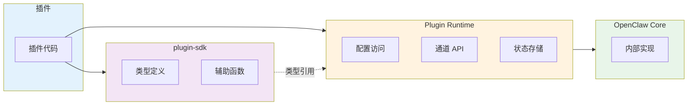

<div v-pre>

# 第9章 插件与扩展系统

> *"平台的生命周期取决于一个残酷的比率：用户能扩展的能力 ÷ 用户必须 fork 源码的次数。当这个比率趋近于零，平台就死了。"*

> **本章要点**
> - 理解插件系统的三层架构：注册表、加载器、运行时
> - 掌握插件生命周期钩子：从发现、加载到执行的完整链路
> - 深入插件 SDK：工具注册、HTTP 路由、CLI 命令扩展
> - 实战演练：从零开发一个天气预报插件


## 9.1 引言

前两章，我们深入了通道系统的设计与实现。通道是 OpenClaw 连接外部世界的窗口，但窗户的数量终究有限。如果用户需要一扇你没有预装的窗户呢？

OpenClaw 内建了 Telegram、Discord、WhatsApp 等八大通道，支持 Anthropic、OpenAI、Google 等二十多家模型供应商。但如果你需要接入 LINE？如果你想用一个内部部署的自研模型？如果你需要一个自定义的安全审计钩子？

在没有插件系统的框架中，答案是：fork 源码，改核心代码，然后祈祷下次升级不会冲突。这条路走得通，但走得痛苦。

OpenClaw 的答案干脆利落：**写一个插件，五分钟搞定**。

> 当你需要的通道不在内置列表里时，你面对的是两条路：fork 源码（成本 O(n) 随升级线性增长），或者写一个插件（成本 O(1)，一次投入永久受益）。插件系统的全部价值，就是让第一条路从"不得不走"变成"没人想走"。

> 🔥 **深度洞察：生态系统的进化论**
>
> 插件系统的成败，决定了一个平台是"产品"还是"生态"——这个区分关乎生死。iPhone 初代没有 App Store，它是一个优秀的产品；有了 App Store，它变成了一个生态系统。产品的价值由创造者决定，生态的价值由参与者共同创造。OpenClaw 的插件系统扮演的正是 App Store 的角色——它把 OpenClaw 从"一个人写的 Agent 运行时"变成"所有人都能扩展的 Agent 平台"。生物学中有个概念叫**共生进化（coevolution）**：花朵进化出蜜腺吸引蜜蜂，蜜蜂进化出长喙采集花蜜，两者在互利中共同变得更好。插件系统就是 OpenClaw 与社区之间的共生接口——核心平台越稳定，插件越多；插件越多，核心平台越有价值。

> **关键概念：插件系统（Plugin System）**
> 插件系统是 OpenClaw 实现"开闭原则"（对扩展开放，对修改封闭）的核心机制。通过统一的插件接口，开发者可以在不修改核心代码的前提下添加新通道、新工具、新 Provider 甚至新的 CLI 命令。内置功能和第三方扩展使用完全相同的插件接口——没有"一等公民"和"二等公民"之分。

插件系统是 OpenClaw 可扩展性的基石。通过插件，开发者可以添加新通道、新模型供应商、新工具、新钩子、新 HTTP 路由、新 CLI 命令——而不需要修改核心代码的一行一字。本章将深入 `src/plugins/`、`src/plugin-sdk/` 和 `src/extensionAPI.ts` 的实现，揭示这套系统如何在开放性与安全性之间走钢丝——既要敞开大门迎接创新，又要守住底线不放风险进门。





**图 9-1：OpenClaw 插件系统架构**

## 9.2 插件类型与定义

### 9.2.1 OpenClawPluginDefinition

每个插件通过 `OpenClawPluginDefinition` 定义其身份和功能：

```typescript
// src/plugins/types.ts
export type OpenClawPluginDefinition = {
  id: string;
  name: string;
  version?: string;
  description?: string;
  kind?: PluginKind;
  format?: PluginFormat;
  bundleFormat?: PluginBundleFormat;
  bundleCapabilities?: string[];

  configSchema?: OpenClawPluginConfigSchema;

  register?: (api: OpenClawPluginApi) => void;
  registerSetup?: (api: OpenClawPluginApi) => void;
};
```

`kind` 字段用于特殊类型的插件：
- `"memory"` — 内存存储插件（如 LanceDB）
- `"context-engine"` — 上下文引擎插件

### 9.2.2 插件注册 API

`OpenClawPluginApi` 是插件与系统交互的核心接口：

```typescript
// src/plugins/types.ts — 插件与系统交互的核心 API（13 种注册方法）
export type OpenClawPluginApi = {
  config: OpenClawConfig;           // 当前配置快照
  runtime: PluginRuntime;           // 受控的系统访问入口
  registrationMode: PluginRegistrationMode;  // "setup" | "full"

  // === 能力注册（按领域分组）===
  registerChannel: (params) => void;         // 通道（Telegram/Discord/...）
  registerProvider: (params) => void;        // LLM 提供商
  registerSpeechProvider: (params) => void;  // 语音合成/识别
  registerTool: (tool, opts?) => void;       // 工具
  registerHook: (events, handler) => void;   // 生命周期钩子
  registerGatewayMethod: (method, handler) => void;  // WebSocket 方法
  registerHttpRoute: (params) => void;       // HTTP 路由
  registerService: (service) => void;        // 后台服务
  registerCommand: (command) => void;        // CLI 命令
  // ... 更多：registerImageGeneration, registerWebSearch, registerCli
};
```

`registrationMode` 有两种值：
- `"setup"` — 仅加载配置 schema，用于启动前设置
- `"full"` — 完整注册所有功能

## 9.3 插件注册表（Plugin Registry）

### 9.3.1 注册表结构

`PluginRegistry` 存储所有已注册的插件组件：

```typescript
// src/plugins/registry.ts — 注册表存储所有插件组件
export type PluginRegistry = {
  plugins: PluginRecord[];              // 已注册的插件列表
  tools: PluginToolRegistration[];      // 工具
  hooks: PluginHookRegistration[];      // 生命周期钩子
  channels: PluginChannelRegistration[];  // 通道
  providers: PluginProviderRegistration[];  // LLM 提供商
  gatewayHandlers: GatewayRequestHandlers;  // WebSocket 方法
  httpRoutes: PluginHttpRouteRegistration[];  // HTTP 路由
  services: PluginServiceRegistration[];  // 后台服务
  diagnostics: PluginDiagnostic[];      // 冲突/错误诊断
  // ... 更多：speechProviders, commands, cliRegistrars 等
};
```

每个注册项都包含 `pluginId`、`pluginName`、`source`（源文件路径）和 `rootDir`，用于追溯插件来源。

### 9.3.2 注册函数实现

`createPluginRegistry` 创建一个注册表实例，提供各种 `register*` 方法：

```typescript
// src/plugins/registry.ts — 注册表工厂（展示 registerTool 核心逻辑）
export function createPluginRegistry(registryParams: PluginRegistryParams) {
  const registry = createEmptyPluginRegistry();

  const registerTool = (record: PluginRecord, tool: AnyAgentTool | OpenClawPluginToolFactory) => {
    // 统一为工厂函数：静态工具对象 → 包装为 () => tool
    const factory = typeof tool === "function" ? tool : () => tool;
    const names = typeof tool !== "function" ? [tool.name] : [];
    registry.tools.push({ pluginId: record.id, factory, names, source: record.source });
  };

  // 类似的 registerHook, registerChannel, registerProvider, registerHttpRoute...
  // 每个都做同样的事：验证 → 冲突检测 → 推入 registry 对应数组
  return { registry, registerTool, registerHook, registerChannel, /* ... */ };
}
```

### 9.3.3 冲突检测

注册表会检测并记录冲突：

```typescript
// src/plugins/registry.ts — 冲突检测示例（Gateway 方法注册）
const registerGatewayMethod = (record: PluginRecord, method: string, handler) => {
  const trimmed = method.trim();
  // 检测冲突：核心方法不可覆盖，已注册方法不可重复
  if (coreGatewayMethods.has(trimmed) || registry.gatewayHandlers[trimmed]) {
    pushDiagnostic({ level: "error", pluginId: record.id,
      message: `gateway method already registered: ${trimmed}` });
    return;  // 记录诊断但不崩溃——一个插件的错误不影响其他插件
  }
  registry.gatewayHandlers[trimmed] = handler;
};
```

冲突会被记录为 `PluginDiagnostic`，而不是抛出异常，确保一个插件的错误不会影响其他插件。

## 9.4 插件加载器（Plugin Loader）

### 9.4.1 加载流程

`loadPlugins` 是插件加载的入口函数：

```typescript
// src/plugins/loader.ts — 插件加载五阶段流程
export async function loadPlugins(options: PluginLoadOptions): Promise<PluginLoadResult> {
  // 1. 解析 → 2. 发现（内置 + 配置 + node_modules + 本地）
  const discovered = await discoverOpenClawPlugins({ config, workspaceDir, env });
  // 3. 并行加载（错误不阻断其他插件）
  const loaded = await Promise.all(discovered.map(async (src) => {
    try { return await loadPluginModule(src); }
    catch (error) { return { error, source: src }; }
  }));
  // 4. 注册到 Registry → 5. 激活插件服务
  const registry = createPluginRegistry({ /* ... */ });
  for (const p of loaded) {
    if ("error" in p) { registry.diagnostics.push(/* ... */); continue; }
    registerPlugin(p, registry);  // 触发 plugin.register(api)
  }
  if (options.activate !== false) await activatePlugins(registry);
  return registry;
}
```

> ⚠️ **注意**：插件加载采用"容错并行"策略——单个插件加载失败不会阻止其他插件启动。但失败的插件会在 `registry.diagnostics` 中记录诊断信息。部署后务必检查 `openclaw doctor` 的输出，确认所有预期的插件都已成功加载。

> 💡 **最佳实践**：开发插件时，将重量级初始化（如建立网络连接、加载大型资源）放在 `activate` 阶段而非 `register` 阶段。`register` 阶段应该尽可能轻量——只做能力声明和回调注册。这样即使激活失败，其他插件的注册也不会受影响。
```





**图 9-2：插件加载与注册流程**

### 9.4.2 模块解析与别名

插件可能通过不同的模块加载器（ESM、CommonJS、jiti）加载。为确保 `openclaw/plugin-sdk` 和 `openclaw/extension-api` 正确解析，加载器使用别名机制：

```typescript
// src/plugins/loader.ts
function buildPluginLoaderAliasMap(modulePath: string): Record<string, string> {
  const pluginSdkAlias = resolvePluginSdkAlias({ modulePath });
  const extensionApiAlias = resolveExtensionApiAlias({ modulePath });
  return {
    ...(extensionApiAlias ? { "openclaw/extension-api": extensionApiAlias } : {}),
    ...(pluginSdkAlias ? { "openclaw/plugin-sdk": pluginSdkAlias } : {}),
    ...resolvePluginSdkScopedAliasMap({ modulePath }),
  };
}
```

这确保无论打包或加载方式如何，插件都能正确引用 OpenClaw SDK。

### 9.4.3 Jiti 运行时编译

对于 TypeScript 插件，OpenClaw 使用 Jiti 进行运行时编译：

```typescript
// src/plugins/loader.ts
const jiti = createJiti(resolvePluginRuntimeModulePath() ?? import.meta.url, {
  esmResolve: true,
  interopDefault: true,
  moduleCache: false,
  alias: buildPluginLoaderAliasMap(modulePath),
  // ...
});

const pluginModule = await jiti.import(pluginPath);
```

Jiti 允许直接加载 `.ts` 文件，无需预编译，加速开发迭代。

## 9.5 插件运行时（Plugin Runtime）

### 9.5.1 Runtime 结构

`PluginRuntime` 是插件访问系统功能的入口：

```typescript
// src/plugins/runtime/types.ts — 插件运行时（受控的系统访问入口）
export type PluginRuntime = {
  version: string;
  config: { loadConfig(); writeConfigFile(cfg); resolveConfigPath() };   // 配置读写
  agent: { resolveAgentDir(id); resolveAgentWorkspaceDir(id) };         // Agent 目录
  subagent: { spawnSubagent; listSubagents; killSubagent };             // 子 Agent 管控
  channel: {                                                             // 各通道运行时
    telegram: TelegramChannelRuntime;
    discord: DiscordChannelRuntime;
    // ... whatsapp, signal, slack, feishu 等
  };
  logging: { shouldLogVerbose(); createSubsystemLogger(name) };         // 日志
  state: { getStateDir(id); readState<T>(id, key); writeState<T>(id, key, val) };  // 持久状态
  // ... 更多功能模块
};
```

### 9.5.2 延迟加载

运行时使用 `createLazyRuntimeNamedExport` 实现延迟加载，避免循环依赖：

```typescript
// src/plugin-sdk/lazy-runtime.ts — 延迟加载避免循环依赖
export function createLazyRuntimeNamedExport<T>(
  loadModule: () => Promise<{ [key: string]: T }>, exportName: string,
): () => T {
  let cached: T | undefined;
  return () => {
    if (!cached) {
      // Proxy 拦截属性访问，首次使用时才触发真正的模块加载
      cached = new Proxy({} as T, {
        get: (_target, prop) => { /* 异步等待模块加载并转发属性 */ },
      }) as T;
    }
    return cached;
  };
}
```

这允许通道插件在模块加载阶段就调用 `getTelegramRuntime()` 等，而实际的运行时模块在需要时才加载。

## 9.6 插件 SDK

### 9.6.1 SDK 结构

`src/plugin-sdk/` 目录提供插件开发所需的所有类型和工具函数：

```text
src/plugin-sdk/
├── core.ts              # 核心类型和工具函数
├── channel-actions.ts   # 通道消息操作
├── channel-config-helpers.ts  # 通道配置辅助函数
├── channel-pairing.ts   # 配对适配器
├── channel-send-result.ts  # 发送结果处理
├── allowlist-config-edit.ts  # 白名单配置
├── routing.ts           # 路由工具
├── infra-runtime.ts     # 基础设施运行时
├── lazy-runtime.ts      # 延迟加载工具
├── telegram.ts          # Telegram 专用工具
├── discord.ts           # Discord 专用工具
├── whatsapp.ts          # WhatsApp 专用工具
├── signal.ts            # Signal 专用工具
├── slack.ts             # Slack 专用工具
├── feishu.ts            # Feishu 专用工具
└── ...                  # 更多通道专用工具
```

### 9.6.2 defineChannelPluginEntry

`defineChannelPluginEntry` 是创建通道插件入口的标准模板（通道插件的完整架构设计详见第7章，各通道的具体实现详见第8章）：

```typescript
// src/plugin-sdk/core.ts — 通道插件入口模板
export function defineChannelPluginEntry<TPlugin extends ChannelPlugin>({
  id, name, plugin, configSchema, setRuntime, registerFull,
}: DefineChannelPluginEntryOptions<TPlugin>) {
  return definePluginEntry({ id, name, configSchema,
    register(api: OpenClawPluginApi) {
      setRuntime?.(api.runtime);         // 设置运行时引用
      api.registerChannel({ plugin });    // 注册通道
      if (api.registrationMode === "full") registerFull?.(api);  // 完整模式额外注册
    },
  });
}
```

### 9.6.3 createChannelPluginBase

`createChannelPluginBase` 创建通道插件的基础对象，减少重复代码：

```typescript
// src/plugin-sdk/core.ts
export function createChannelPluginBase<TResolvedAccount>(
  params: CreateChannelPluginBaseOptions<TResolvedAccount>,
): CreatedChannelPluginBase<TResolvedAccount> {
  return {
    id: params.id,
    meta: {
      ...getChatChannelMeta(params.id as Parameters<typeof getChatChannelMeta>[0]),
      ...params.meta,
    },
    ...(params.setupWizard ? { setupWizard: params.setupWizard } : {}),
    ...(params.capabilities ? { capabilities: params.capabilities } : {}),
    ...(params.agentPrompt ? { agentPrompt: params.agentPrompt } : {}),
    ...(params.configSchema ? { configSchema: params.configSchema } : {}),
    ...(params.config ? { config: params.config } : {}),
    ...(params.security ? { security: params.security } : {}),
    ...(params.groups ? { groups: params.groups } : {}),
    setup: params.setup,
  } as CreatedChannelPluginBase<TResolvedAccount>;
}
```

### 9.6.4 共享适配器工厂

SDK 提供多种适配器工厂函数，简化常见模式的实现：

**createTextPairingAdapter** — 文本配对适配器：

```typescript
// src/plugin-sdk/channel-pairing.ts
export function createTextPairingAdapter(params: {
  idLabel: string;
  message: string;
  normalizeAllowEntry?: (entry: string) => string;
  notify: (params: { cfg: OpenClawConfig; id: string; message: string }) => Promise<void>;
}): ChannelPairingAdapter {
  return {
    idLabel: params.idLabel,
    message: params.message,
    normalizeAllowEntry: params.normalizeAllowEntry,
    notify: params.notify,
  };
}
```

**createScopedDmSecurityResolver** — DM 安全策略解析器：

```typescript
// src/plugin-sdk/channel-config-helpers.ts
export function createScopedDmSecurityResolver<TAccount>(params: {
  channelKey: string;
  resolvePolicy: (account: TAccount) => DmPolicy | undefined;
  resolveAllowFrom: (account: TAccount) => AllowFrom | undefined;
  policyPathSuffix?: string;
  normalizeEntry?: (entry: string) => string;
}): (params: { cfg: OpenClawConfig; accountId?: string | null }) => DmSecurityPolicy {
  // ...
}
```

**createAttachedChannelResultAdapter** — 出站结果适配器：

```typescript
// src/plugin-sdk/channel-send-result.ts
export function createAttachedChannelResultAdapter<TSendResult>(params: {
  channel: string;
  sendText: (params: SendTextParams) => Promise<TSendResult>;
  sendMedia: (params: SendMediaParams) => Promise<TSendResult>;
  sendPoll?: (params: SendPollParams) => Promise<TSendResult>;
}): Partial<ChannelOutboundAdapter> {
  return {
    sendText: async (params) => {
      const result = await params.sendText(params);
      return attachChannelToResult(params.channel, result);
    },
    sendMedia: async (params) => {
      const result = await params.sendMedia(params);
      return attachChannelToResult(params.channel, result);
    },
    // ...
  };
}
```

## 9.7 插件钩子系统

### 9.7.1 钩子类型

OpenClaw 的钩子系统允许插件在系统事件发生时执行自定义逻辑：

```typescript
// src/plugins/types.ts
export type PluginHookName =
  | "before_agent_start"
  | "after_agent_start"
  | "before_tool_call"
  | "after_tool_call"
  | "before_model_call"
  | "after_model_call"
  | "before_message_send"
  | "after_message_send"
  | "on_inbound_message"
  | "on_outbound_message"
  | "on_session_created"
  | "on_session_reset"
  | "on_config_reload"
  | "on_compaction"
  | "on_subagent_spawn"
  | "on_subagent_result"
  // ... 更多钩子
  ;
```

### 9.7.2 类型化钩子

类型化钩子提供更严格的类型安全和更好的开发体验：

```typescript
// src/plugins/types.ts — 类型化钩子（比字符串钩子更严格的类型安全）
export type BeforeAgentStartHook = {
  handler: (event: BeforeAgentStartEvent, ctx: HookContext) => Promise<BeforeAgentStartResult>;
  priority?: number;  // 数字越大越先执行
};

// 输入：Agent 启动上下文
export type BeforeAgentStartEvent = {
  agentId: string; sessionKey: string; channelId: string; message: string;
};

// 输出：可以修改系统提示、跳过执行、覆盖模型
export type BeforeAgentStartResult = {
  systemPromptSuffix?: string;  // 追加到系统提示
  skip?: boolean;               // 跳过本次 Agent 执行
  modelOverride?: string;       // 动态切换模型
};
```

### 9.7.3 钩子注册

插件通过 `registerHook` 或类型化钩子字段注册钩子：

```typescript
// 方式 1：字符串钩子（灵活，适合简单场景）
api.registerHook("before_agent_start", async (event) => ({
  systemPromptSuffix: "\n\nRemember to be helpful and harmless.",
}), { name: "add-safety-reminder" });

// 方式 2：类型化钩子（类型安全，适合复杂插件）
export const myPlugin: OpenClawPluginDefinition = {
  id: "my-plugin", name: "My Plugin",
  typedHooks: {
    before_agent_start: {
      handler: async (event) => ({ modelOverride: "gpt-4" }),
      priority: 10,  // 高优先级，先于其他钩子执行
    },
  },
};
```

### 9.7.4 钩子执行

钩子通过 `InternalHookRunner` 执行，支持优先级排序和异步执行：

```typescript
// src/plugins/hooks.ts
export async function runHooks<TEvent, TResult>(
  hookName: string,
  event: TEvent,
  ctx: HookContext,
): Promise<TResult[]> {
  const hooks = getRegisteredHooks(hookName);
  const sortedHooks = hooks.sort((a, b) => (b.priority ?? 0) - (a.priority ?? 0));

  const results: TResult[] = [];
  for (const hook of sortedHooks) {
    const result = await hook.handler(event, ctx);
    if (result) {
      results.push(result);
    }
  }
  return results;
}
```





**图 9-3：钩子执行流程**

## 9.8 提供商插件

### 9.8.1 ProviderPlugin 接口

提供商插件允许添加新的 LLM/图像/语音/搜索提供商：

```typescript
// src/plugins/types.ts — 提供商插件接口（核心字段）
export type ProviderPlugin = {
  id: string; name: string;
  catalog?: ProviderPluginCatalog;          // 模型目录发现
  authMethods?: ProviderAuthMethod[];       // 认证方式（API Key / OAuth）
  capabilities?: ProviderCapabilities;      // 能力声明（工具调用模式等）
  // 运行时钩子
  prepareRuntimeAuth?: ProviderPrepareRuntimeAuthHook;   // 运行时认证准备
  wrapStreamFn?: ProviderWrapStreamFnHook;               // 流式函数包装
  fetchUsageSnapshot?: ProviderFetchUsageSnapshotHook;   // 使用量快照
  resolveDefaultThinkingPolicy?: ProviderDefaultThinkingPolicyHook;
};
```

### 9.8.2 认证流程

提供商插件可以定义多种认证方式：

```typescript
// src/plugins/types.ts
export type ProviderAuthMethod = {
  id: string;
  label: string;
  hint?: string;
  kind: ProviderAuthKind;  // "oauth" | "api_key" | "token" | "device_code" | "custom"
  wizard?: ProviderPluginWizardSetup;
  run: (ctx: ProviderAuthContext) => Promise<ProviderAuthResult>;
  runNonInteractive?: (ctx: ProviderAuthMethodNonInteractiveContext) => Promise<OpenClawConfig | null>;
};
```

例如，OpenAI 插件支持 API Key 和 OAuth 两种认证方式：

```typescript
// 提供商认证示例：OpenAI 支持 API Key 和 OAuth 两种方式
const openaiPlugin: ProviderPlugin = {
  id: "openai", name: "OpenAI",
  authMethods: [
    { id: "api_key", label: "API Key", kind: "api_key",
      run: async (ctx) => {
        const apiKey = await ctx.prompter.prompt("Enter OpenAI API Key");
        return { profiles: [{ profileId: "openai", credential: { kind: "api_key", key: apiKey } }] };
      },
    },
    { id: "oauth", label: "OAuth", kind: "oauth", run: async (ctx) => { /* OAuth 流程 */ } },
  ],
};
```

### 9.8.3 模型目录

`catalog` 钩子让提供商插件可以声明支持的模型：

```typescript
// src/plugins/types.ts — 模型目录发现接口
export type ProviderPluginCatalog = {
  order?: ProviderCatalogOrder;  // "simple" | "profile" | "paired" | "late"
  run: (ctx: ProviderCatalogContext) => Promise<ProviderCatalogResult>;
};

// 示例：Anthropic 插件的模型目录发现
const anthropicPlugin: ProviderPlugin = {
  id: "anthropic", name: "Anthropic",
  catalog: { order: "simple", run: async (ctx) => {
    const apiKey = ctx.resolveProviderApiKey("anthropic").apiKey;
    if (!apiKey) return null;  // 无凭证则跳过
    return { provider: { id: "anthropic", api: { apiKey },
      models: { "claude-3-opus": { name: "Claude 3 Opus" }, /* ... */ } } };
  }},
};
```

### 9.8.4 模型切换与降级：Provider 的实战运用

Provider 插件系统不只是"注册模型列表"——它是 OpenClaw 实现**模型韧性**的关键基础设施。在生产环境中，模型不可用的情况远比想象中频繁：API 限流（429）、服务宕机、配额耗尽、网络超时。一个只依赖单一模型的 Agent 在这些场景下会完全停摆。

**场景1：API 限流降级**

```yaml
# openclaw.yaml — 多 Provider 降级链
providers:
  primary: "anthropic/claude-opus-4-6"
  fallback:
    - "openai/gpt-4o"              # 第一降级
    - "google/gemini-2.5-pro"      # 第二降级
    - "zhipu/glm-5"                # 第三降级（本地部署更抗限流）
```

当 Anthropic API 返回 429 时，Provider 系统自动切换到 OpenAI；如果 OpenAI 也限流，继续降级到 Google Gemini。每次降级都记录诊断日志，运营者可以事后分析降级频率并调整配额。

**场景2：逐任务模型选择**

不同任务对模型能力的需求差异巨大。一个 Agent 可能需要 Opus 来做复杂的代码重构，但用 Haiku 就足以回答"今天天气如何"：

```yaml
agents:
  main:
    model: "anthropic/claude-sonnet-4-20250514"   # 默认模型
    cron:
      health-check:
        model: "openai/gpt-4o-mini"                # 健康检查用廉价模型
      daily-report:
        model: "anthropic/claude-opus-4-6"         # 日报需要深度分析
```

Provider 插件的 `catalog` 钩子让系统知道每个模型的能力边界（是否支持工具调用、是否支持视觉、上下文窗口大小），从而在降级时选择能力最接近的替代模型，而非盲目降级。

**场景3：成本敏感的自动切换**

```typescript
// Provider 插件可以通过 fetchUsageSnapshot 追踪 API 消耗
const myProvider: ProviderPlugin = {
  id: "budget-aware",
  fetchUsageSnapshot: async (ctx) => {
    const usage = await fetchApiUsage(ctx.apiKey);
    // 当月消耗超过预算 80% 时，触发降级信号
    return { totalTokens: usage.tokens, budgetPercent: usage.cost / ctx.budget * 100 };
  },
};
```

这种设计将"何时切换模型"的决策与"切换到哪个模型"的决策分离——前者由 Provider 运行时钩子判断，后者由 catalog 中的模型能力元数据决定。

### 9.8.5 Provider 接口的设计哲学

Provider 抽象层的设计哲学可以用一句话概括：**模型是可替换的资源，不是系统的身份**。

这一哲学与大多数 Agent 框架的立场截然不同。LangChain 的 Agent 通常深度绑定到特定模型——提示词为 GPT-4 优化过，换成 Claude 就表现异常。CrewAI 的角色定义隐含模型假设。这种绑定使得模型切换成为一个"大手术"——你不只是换了一个 API endpoint，你可能需要重写提示词、调整工具格式、修改输出解析逻辑。

OpenClaw 的 Provider 插件通过三个层面解耦 Agent 与模型：

1. **协议标准化**：所有 Provider 插件都输出统一的流式消息格式。Agent 看到的是 `StreamChunk`，不是 OpenAI 的 `ChatCompletionChunk` 或 Anthropic 的 `ContentBlockDelta`。协议差异在 Provider 内部消化。

2. **工具调用适配**：不同模型的工具调用格式不同（OpenAI 用 `function_call`，Anthropic 用 `tool_use`，Google 用 `functionCall`）。`wrapStreamFn` 钩子负责将这些差异归一化为 OpenClaw 的统一工具调用协议。

3. **能力声明**：Provider 插件通过 `capabilities` 声明模型支持什么、不支持什么。工具策略管线（第10章）据此自动调整可用工具列表——如果模型不支持工具调用，系统不会向它发送工具定义，而非发了之后等报错。

> Provider 接口的终极价值不是"能换模型"——而是"换了模型之后，系统的其余部分完全不受影响"。这就像换电池不需要换整个遥控器——接口标准化让组件可以独立演化
```

## 9.9 工具注册

### 9.9.1 工厂函数模式

工具可以通过工厂函数注册，接收上下文参数：

```typescript
// src/plugins/types.ts — 工具工厂函数（支持条件性注册和上下文注入）
export type OpenClawPluginToolFactory = (
  ctx: OpenClawPluginToolContext,  // 包含 agentId, sessionKey, sandboxed 等运行时信息
) => AnyAgentTool | null;         // 返回 null = 不注册（条件性）

// 示例：根据配置决定是否注册工具
api.registerTool((ctx) => {
  if (!ctx.config?.someFeature) return null;  // 功能未启用 → 不注册
  return {
    name: "my_tool", description: "A tool that does something",
    inputSchema: { /* ... */ },
    execute: async (params) => ({ result: "done" }),
  };
});
```

### 9.9.2 可选工具

`optional` 标记指示工具是否为可选：

```typescript
api.registerTool(myTool, { optional: true });
```

可选工具在 Agent 中通过 `optionalTools` 配置启用，而非全局启用。

## 9.10 HTTP 路由

### 9.10.1 路由注册

插件可以注册自定义 HTTP 路由：

```typescript
// src/plugins/types.ts
export type OpenClawPluginHttpRouteParams = {
  path: string;
  handler: OpenClawPluginHttpRouteHandler;
  auth?: OpenClawPluginHttpRouteAuth;  // "none" | "session" | "admin"
  match?: OpenClawPluginHttpRouteMatch;  // "exact" | "prefix"
};

// 示例
api.registerHttpRoute({
  path: "/my-plugin/webhook",
  auth: "none",
  match: "exact",
  handler: async (req, res) => {
    const body = await parseBody(req);
    // 处理 webhook
    res.json({ ok: true });
  },
});
```

### 9.10.2 路由冲突检测

加载器会检测 HTTP 路由冲突：

```typescript
// src/plugins/loader.ts
const overlapping = findOverlappingPluginHttpRoute(
  registry.httpRoutes,
  normalizedPath,
  params.match ?? "exact"
);

if (overlapping) {
  pushDiagnostic({
    level: "error",
    pluginId: record.id,
    source: record.source,
    message: `http route overlaps with ${describeHttpRouteOwner(overlapping)}: ${normalizedPath}`,
  });
  return;
}
```

## 9.11 CLI 命令

### 9.11.1 命令注册

插件可以注册 CLI 命令：

```typescript
// src/plugins/types.ts — CLI 命令注册
export type OpenClawPluginCommandDefinition = {
  name: string;  description?: string;
  options?: Array<{ name: string; description?: string; required?: boolean }>;
  handler: (ctx: PluginCommandContext) => Promise<void>;
};

// 示例：注册 `openclaw my-plugin:status` 命令
api.registerCommand({
  name: "my-plugin:status", description: "Show my plugin status",
  options: [{ name: "--verbose", description: "Show detailed output" }],
  handler: async () => { console.log("Plugin status: OK"); },
});
```

### 9.11.2 命令冲突

命令名称必须唯一：

```typescript
// src/plugins/commands.ts
export function registerPluginCommand(
  program: Command,
  command: OpenClawPluginCommandDefinition,
) {
  const existingCommand = program.commands.find((c) => c.name() === command.name);
  if (existingCommand) {
    throw new Error(`Command "${command.name}" already registered`);
  }
  // ...
}
```

## 9.12 插件发现

### 9.12.1 发现源

`discoverOpenClawPlugins` 从多个来源发现插件：

```typescript
// src/plugins/discovery.ts — 四源插件发现
export async function discoverOpenClawPlugins(params): Promise<PluginSource[]> {
  return [
    ...discoverBundledPlugins(),                          // 1. 内置插件
    ...discoverConfiguredPlugins(params.config),          // 2. 配置文件声明的
    ...discoverNodeModulesPlugins(params.workspaceDir),   // 3. node_modules 中的
    ...discoverLocalPlugins(params.workspaceDir),         // 4. 本地开发插件
  ];
}
```

### 9.12.2 插件格式

插件可以是多种格式：

```typescript
// src/plugins/types.ts
export type PluginFormat =
  | "esm"        // ES Module
  | "commonjs"   // CommonJS
  | "bundle";    // 预打包

export type PluginBundleFormat =
  | "openclaw-plugin"     // 标准 OpenClaw 插件格式
  | "mcp-server"          // MCP Server 包装
  | "pi-agent-extension"; // Pi Agent 扩展格式
```

### 9.12.3 Manifest 文件

插件可以通过 `openclaw-plugin.json` 声明元数据：

```json
{
  "id": "my-plugin",
  "name": "My Plugin",
  "version": "1.0.0",
  "description": "A sample plugin",
  "main": "dist/index.js",
  "format": "esm",
  "capabilities": ["tools", "hooks"],
  "configSchema": "./config-schema.json"
}
```

## 9.13 配置 Schema

### 9.13.1 Schema 定义

插件可以定义配置 schema，用于验证和 UI 提示：

```typescript
// src/plugins/types.ts — 插件配置 Schema（验证 + UI 提示）
export type OpenClawPluginConfigSchema = {
  safeParse?: (value: unknown) => { success: boolean; data?: unknown; error?: any };
  jsonSchema?: Record<string, unknown>;  // JSON Schema 定义
  uiHints?: Record<string, PluginConfigUiHint>;  // 每个字段的 UI 渲染提示
};

export type PluginConfigUiHint = {
  label?: string;      // 显示名称
  sensitive?: boolean;  // true → 密码输入框
  advanced?: boolean;   // true → 折叠到"高级"区域
  placeholder?: string; // 输入提示
};
```

### 9.13.2 使用 TypeBox

插件可以使用 TypeBox 定义 schema：

```typescript
// 使用 TypeBox 定义配置 Schema（类型安全 + 自动生成 JSON Schema）
import { Type } from "@sinclair/typebox";

const configSchema = Type.Object({
  apiKey: Type.String({ description: "API Key for the service" }),
  maxRetries: Type.Optional(Type.Number({ default: 3 })),
});

export const myPlugin: OpenClawPluginDefinition = {
  id: "my-plugin", name: "My Plugin",
  configSchema: {
    jsonSchema: Type.Strict(configSchema),
    uiHints: { apiKey: { label: "API Key", sensitive: true } },  // 密码框
  },
};
```

## 9.14 扩展 API（extensionAPI.ts）

### 9.14.1 兼容层

`src/extensionAPI.ts` 提供向后兼容的导入路径：

```typescript
// src/extensionAPI.ts
const shouldWarnExtensionApiImport =
  process.env.VITEST !== "true" &&
  process.env.NODE_ENV !== "test" &&
  process.env.OPENCLAW_SUPPRESS_EXTENSION_API_WARNING !== "1";

if (shouldWarnExtensionApiImport) {
  process.emitWarning(
    "openclaw/extension-api is deprecated. Migrate to api.runtime.agent.* or focused openclaw/plugin-sdk/<subpath> imports.",
    {
      code: "OPENCLAW_EXTENSION_API_DEPRECATED",
    }
  );
}

export { resolveAgentDir, resolveAgentWorkspaceDir } from "./agents/agent-scope.js";
export { DEFAULT_MODEL, DEFAULT_PROVIDER } from "./agents/defaults.js";
export { resolveAgentIdentity } from "./agents/identity.js";
// ... 更多导出
```

### 9.14.2 迁移路径

新插件应使用 `openclaw/plugin-sdk` 的子路径导入：

```typescript
// 旧方式（已弃用）
import { resolveAgentDir } from "openclaw/extension-api";

// 新方式
import { resolveAgentDir } from "openclaw/plugin-sdk/agent-runtime";
// 或
import { resolveAgentDir } from "openclaw/plugin-sdk/core";
```

## 9.15 实战推演：从零开发一个天气预报插件

理论讲够了，让我们动手。本节将完整推演如何从零开发一个 OpenClaw 插件——一个简单的天气预报工具插件。通过这个过程，你将亲身体验"注册而非注入"的哲学。

### 9.15.1 为什么是"注册而非注入"？

在大多数框架中，添加功能的方式是**注入**——你获取框架的内部引用，修改它的数据结构，甚至 monkey-patch 它的方法。这种方式灵活但脆弱——框架内部结构一变，你的插件就坏了。

OpenClaw 的插件系统采用**注册**——你把你的能力**推给**系统（"我能提供这个工具"），系统决定何时、如何使用它。你永远不触碰系统的内部。这种单向门保证了：
- 插件无法破坏核心逻辑
- 框架升级不会破坏插件（只要注册 API 稳定）
- 插件之间互不影响

### 9.15.2 第一步：创建项目结构

```bash
mkdir openclaw-plugin-weather
cd openclaw-plugin-weather
npm init -y
```

创建核心文件 `index.ts`：

```typescript
// index.ts — 天气插件入口（注册而非注入）
import type { OpenClawPluginDefinition } from "openclaw/plugin-sdk";

const weatherPlugin: OpenClawPluginDefinition = {
  id: "weather", name: "Weather Forecast", version: "1.0.0",
  register(api) {
    // 向系统"注册"工具——系统决定何时展示、何时调用、如何安全过滤
    api.registerTool(() => ({
      name: "weather", description: "Get current weather for a location",
      inputSchema: { type: "object",
        properties: { location: { type: "string" }, format: { type: "string", enum: ["brief", "detailed"] } },
        required: ["location"] },
      execute: async ({ location, format }) => {
        const url = `https://wttr.in/${encodeURIComponent(location)}${format === "detailed" ? "" : "?format=3"}`;
        const res = await fetch(url);
        return res.ok ? { weather: (await res.text()).trim() } : { error: `HTTP ${res.status}` };
      },
    }));
  },
};
export default weatherPlugin;
```

### 9.15.3 第二步：在配置中启用

```yaml
# openclaw.yaml
plugins:
  entries:
    - id: weather
      path: ./openclaw-plugin-weather/index.ts  # Jiti 直接加载 TypeScript！
```

注意：不需要编译。OpenClaw 的 Jiti 运行时编译器直接加载 TypeScript 源码。这在开发阶段是巨大的效率提升——修改代码，重新加载网关，立即测试。

### 9.15.4 第三步：理解发生了什么

当网关启动时，发生了以下序列：

1. **发现**：`discoverOpenClawPlugins()` 扫描配置中的 `plugins.entries`，发现 `weather` 插件。
2. **加载**：Jiti 加载 `index.ts`，执行 TypeScript 编译，导出 `weatherPlugin` 对象。
3. **注册**：系统调用 `weatherPlugin.register(api)`，插件通过 `api.registerTool()` 和 `api.registerHook()` 注册能力。
4. **入册**：工具进入 `PluginRegistry.tools`，钩子进入 `PluginRegistry.hooks`。
5. **可用**：下次调用 Agent 时，工具策略管线（第10章）评估 `weather` 是否对当前 Agent 可用。如果通过，LLM 在工具列表中看到 `weather`。

整个过程中，插件**从未触碰系统内部**。它只做了两件事：声明自己的能力，提供执行逻辑。系统负责其余一切——何时展示、何时调用、如何安全过滤。

### 9.15.5 进阶：添加配置 Schema

让插件支持自定义配置：

```typescript
// 进阶：添加可配置项（从 api.config 读取，而非直接读文件）
register(api) {
  const { defaultLocation = "Beijing", units = "metric" } = api.config.plugins?.weather ?? {};
  api.registerTool((ctx) => ({
    name: "weather",
    description: `Get weather (default: ${defaultLocation}, ${units})`,
    // ... 完整工具定义
  }));
},
configSchema: {
  jsonSchema: { type: "object", properties: {
    defaultLocation: { type: "string" }, units: { type: "string", enum: ["metric", "imperial"] },
  }},
  uiHints: { defaultLocation: { label: "默认城市", placeholder: "Beijing" } },
},
```

### 9.15.6 注册 vs. 注入的直觉总结

| 维度 | 注入式（LangChain 等） | 注册式（OpenClaw） |
|------|---------------------|------------------|
| 数据流 | 插件**拉取**系统内部 | 插件**推给**系统接口 |
| 耦合度 | 紧——依赖内部 API | 松——只依赖注册 API |
| 冲突处理 | 覆盖（最后写入胜出） | 诊断（记录冲突，不崩溃） |
| 升级兼容 | 脆弱——内部变则插件坏 | 稳定——注册 API 有版本承诺 |
| 安全性 | 插件可访问一切 | 插件只能访问 PluginRuntime |

## 9.16 实战推演：开发一个 Notion 同步插件

天气插件展示了工具注册的基本流程，但真实世界的插件往往需要同时注册多种能力——工具、钩子、HTTP 路由、配置 Schema。让我们用一个更完整的场景来感受"注册而非注入"在复杂场景下的威力。

### 9.16.1 需求场景

你的团队使用 Notion 管理项目。你希望 Agent 能够：
1. 查询 Notion 数据库中的任务列表
2. 在 Agent 完成任务时自动更新 Notion 状态
3. 通过 Webhook 接收 Notion 的变更通知
4. API Key 安全存储，不出现在配置文件中

这四个需求分别对应四种注册能力：**工具**（查询）、**钩子**（自动更新）、**HTTP 路由**（Webhook）、**配置 Schema**（安全配置）。

### 9.16.2 完整插件实现

```typescript
// notion-sync/index.ts — 一个"四合一"插件，展示插件 SDK 的四种注册能力
import type { OpenClawPluginDefinition } from "openclaw/plugin-sdk";

const notionSync: OpenClawPluginDefinition = {
  id: "notion-sync",
  name: "Notion Sync",
  version: "1.0.0",

  // ── 能力 ①：配置 Schema ─────────────────────────────
  // 声明插件需要的配置字段及 UI 渲染提示
  configSchema: {
    jsonSchema: {
      type: "object",
      properties: {
        apiKey: { type: "string", description: "Notion Integration Token" },
        databaseId: { type: "string", description: "Target Database ID" },
      },
      required: ["apiKey", "databaseId"],
    },
    uiHints: {
      apiKey: { label: "Notion API Key", sensitive: true },
      databaseId: { label: "数据库 ID", placeholder: "abc123..." },
    },
  },

  register(api) {
    const cfg = api.config.plugins?.["notion-sync"] ?? {};

    // ── 能力 ②：注册工具 ─────────────────────────────
    // Agent 可通过 notion_tasks 工具查询 Notion 数据库
    api.registerTool((ctx) => {
      if (!cfg.apiKey) return null; // 未配置则不注册——条件性注册
      return {
        name: "notion_tasks",
        description: "Query tasks from Notion database",
        inputSchema: {
          type: "object",
          properties: {
            status: { type: "string", enum: ["todo", "in_progress", "done"] },
          },
        },
        execute: async ({ status }) => {
          const res = await fetch(
            `https://api.notion.com/v1/databases/${cfg.databaseId}/query`,
            {
              method: "POST",
              headers: {
                "Authorization": `Bearer ${cfg.apiKey}`,
                "Notion-Version": "2022-06-28",
                "Content-Type": "application/json",
              },
              body: JSON.stringify({
                filter: status
                  ? { property: "Status", select: { equals: status } }
                  : undefined,
              }),
            },
          );
          const data = await res.json();
          return {
            tasks: data.results.map((r) => ({
              title: r.properties.Name?.title?.[0]?.plain_text,
              status: r.properties.Status?.select?.name,
            })),
          };
        },
      };
    });

    // ── 能力 ③：注册钩子 ─────────────────────────────
    // Agent 完成子任务时自动将 Notion 页面标记为 Done
    api.registerHook("on_subagent_result", async (event) => {
      if (!cfg.apiKey || !event.result?.taskId) return;
      await fetch(`https://api.notion.com/v1/pages/${event.result.taskId}`, {
        method: "PATCH",
        headers: {
          "Authorization": `Bearer ${cfg.apiKey}`,
          "Notion-Version": "2022-06-28",
          "Content-Type": "application/json",
        },
        body: JSON.stringify({
          properties: { Status: { select: { name: "Done" } } },
        }),
      });
    }, { name: "notion-auto-update" });

    // ── 能力 ④：注册 HTTP 路由 ────────────────────────
    // 接收 Notion Webhook 推送，将变更转发给 Agent
    api.registerHttpRoute({
      path: "/notion-sync/webhook",
      auth: "none", // Notion Webhook 无法携带认证头
      match: "exact",
      handler: async (req, res) => {
        const body = await parseBody(req);
        api.runtime.channel?.telegram?.sendMessage?.({
          text: `📋 Notion 更新: ${body.pages?.[0]?.properties?.Name?.title?.[0]?.plain_text}`,
        });
        res.json({ ok: true });
      },
    });
  },
};

export default notionSync;
```

### 9.16.3 一个插件，四种能力，零行核心代码修改

这个插件同时注册了工具、钩子、HTTP 路由和配置 Schema——四种完全不同的系统集成方式。但它**从未触碰 OpenClaw 的内部实现**。它只做了四件事：向系统声明"我能提供什么"。

> 插件的力量不在于它做了多少事——而在于它做了多少事*而不需要知道系统是怎么工作的*。一个好的插件 API，让插件开发者只需要关心自己的领域逻辑，而非框架的内部机制。这就是"注册而非注入"的终极价值：**知识边界的清晰划分**。

这个场景也展示了条件性注册的实际价值：`if (!cfg.apiKey) return null` 确保了未配置 API Key 时，工具不会出现在 Agent 的工具列表中——Agent 甚至不知道 Notion 集成的存在。这比"注册了但调用时报错"优雅得多。

## 9.17 测试策略

### 9.16.1 单元测试

插件系统的每个组件都有独立的单元测试：

```text
src/plugins/registry.test.ts
src/plugins/loader.test.ts
src/plugins/discovery.test.ts
src/plugins/commands.test.ts
src/plugins/hooks.test.ts
```

### 9.16.2 集成测试

集成测试验证插件加载和注册的完整流程：

```typescript
// src/plugins/loader.test.ts — 集成测试（验证加载容错性）
it("should load bundled plugins", async () => {
  const registry = await loadPlugins({ config: { /* ... */ }, mode: "full" });
  expect(registry.plugins.length).toBeGreaterThan(0);  // 内置插件成功加载
});

it("should handle load errors gracefully (not crash)", async () => {
  const registry = await loadPlugins({
    config: { plugins: { entries: [{ id: "invalid", path: "/nonexistent" }] } },
    throwOnLoadError: false,  // 错误记录为诊断，不抛异常
  });
  expect(registry.diagnostics.find(d => d.pluginId === "invalid")?.level).toBe("error");
});
```

### 9.16.3 插件合约测试

`src/plugins/contracts/` 目录包含插件合约的测试，确保所有插件遵循相同的接口规范。

## 9.17 设计决策

### 9.17.1 为什么使用注册表模式？

注册表模式带来了：
1. **集中管理**：所有插件组件在一个地方注册和查询
2. **冲突检测**：可以在注册时检测命名冲突
3. **诊断收集**：可以收集所有插件的问题，而非一个失败导致全部中止

### 9.17.2 为什么使用工厂函数？

工具工厂函数允许：
1. **条件注册**：根据配置决定是否注册工具
2. **上下文注入**：每个工具调用可以使用当前会话的上下文
3. **延迟创建**：工具对象只在需要时创建

### 9.17.3 为什么需要 PluginRuntime？

`PluginRuntime` 暴露了：
1. **受控访问**：插件只能通过运行时访问系统功能，不能直接导入内部模块
2. **版本稳定**：运行时 API 是稳定的公共接口，内部实现可以自由重构
3. **测试隔离**：测试时可以注入 mock 运行时





**图 9-4：插件与系统的分层访问**

## 9.18 插件系统竞品深度对比

插件系统是 Agent 框架的核心扩展机制。不同框架对"如何让第三方扩展系统能力"这个问题给出了截然不同的回答。理解这些差异，有助于你判断何时使用哪种方案。

### 9.18.1 OpenClaw vs. LangChain Tools

**LangChain 的方式**：工具是 Python 类，继承 `BaseTool`，通过 `@tool` 装饰器或类定义实现。

```python
# LangChain 方式
from langchain.tools import tool

@tool
def weather(city: str) -> str:
    """Get weather for a city."""
    return requests.get(f"https://wttr.in/{city}?format=3").text
```

**OpenClaw 的方式**：工具通过插件的工厂函数注册，运行时动态创建。

```typescript
// OpenClaw 方式
export default {
  id: "weather-plugin",
  tools: (runtime) => [{
    name: "weather",
    description: "Get weather for a city",
    parameters: { city: { type: "string" } },
    execute: async ({ city }) => {
      return fetch(`https://wttr.in/${city}?format=3`).then(r => r.text());
    },
  }],
};
```

**关键差异**：
- **生命周期**：LangChain 工具在 import 时创建，无法根据运行时条件动态调整。OpenClaw 的工厂模式允许根据配置、用户身份、设备状态等条件**有条件地注册**工具。
- **隔离性**：LangChain 工具可以 import 任何 Python 模块，对宿主进程有完全访问权。OpenClaw 通过 `PluginRuntime` 限制插件只能访问声明的 API。
- **冲突处理**：LangChain 中两个同名工具会静默覆盖。OpenClaw 的注册表会**检测并记录冲突**，但不崩溃——这个"发现问题但继续运行"的哲学贯穿整个系统。

### 9.18.2 OpenClaw vs. Semantic Kernel Plugins

Semantic Kernel（SK）是微软的 Agent 框架，其插件系统在设计理念上最接近 OpenClaw——都强调类型安全和结构化注册。但两者在关键问题上做出了不同选择。

**SK 的方式**：插件是 C#/Python 类，通过 `[KernelFunction]` 属性标注。

```csharp
// Semantic Kernel 方式
public class WeatherPlugin
{
    [KernelFunction]
    [Description("Get weather for a city")]
    public async Task<string> GetWeather(string city)
    {
        // ...
    }
}

// 注册
kernel.Plugins.AddFromType<WeatherPlugin>();
```

**关键设计差异**：

| 维度 | Semantic Kernel | OpenClaw |
|------|----------------|----------|
| 注册方式 | 类型反射（AddFromType） | 工厂函数（显式返回） |
| 配置 UI | 无 | `uiHints` 自动生成配置界面 |
| 多版本共存 | 不支持 | 诊断记录冲突，保留最高优先级 |
| 跨语言 | C# + Python SDK | TypeScript（Plugin SDK） |
| 通道集成 | 无 | 插件可同时注册工具+通道+Provider |
| 安装安全 | 无预扫描 | `skills-install.ts` 安装前安全检查 |
| 热重载 | 需重启 | 文件监视自动热重载 |

**最深层的区别**：SK 的插件系统设计目标是"让 LLM 调用 .NET 函数"——它是一个**函数调用桥接层**。OpenClaw 的插件系统目标是"让第三方扩展整个运行时"——它是一个**微内核扩展框架**。SK 的插件只能注册函数，OpenClaw 的插件可以同时注册通道、Provider、工具、命令、钩子——这是运行时与 SDK 的根本定位差异。

### 9.18.3 OpenClaw vs. AutoGPT Plugins

AutoGPT 的插件系统经历了两代：

- **第一代（Legacy）**：Python 包，通过 `__init__.py` 中的钩子函数集成。耦合度极高，插件需要直接操作 AutoGPT 的内部状态。
- **第二代（Forge）**：基于 OpenAPI spec 的标准化工具定义。这是一个显著的进步——工具定义与实现解耦。

**OpenClaw 的差异化**：
- AutoGPT 的插件系统只扩展**工具**。OpenClaw 的插件系统扩展**一切**——通道、Provider、工具、命令、安全策略。
- AutoGPT 没有插件隔离机制。OpenClaw 通过 `PluginRuntime` 实现沙箱化访问。
- AutoGPT 没有配置 UI 生成。OpenClaw 的 `uiHints` 让每个插件配置项都有友好的用户界面。

### 9.18.4 设计选择的深层原因

为什么 OpenClaw 选择了"注册式"而非"注入式"？这不是偶然的——它源于 OpenClaw 作为**运行时**（而非框架）的定位。

框架的更新策略是"你更新依赖版本"——当 LangChain 从 v0.1 升到 v0.2 时，你的工具代码可能需要大量修改（这在 LangChain 社区引起了大量抱怨）。运行时的更新策略是"后台自动更新"——就像 Nginx 升级不需要修改你的 PHP 代码一样。

注册式架构使得 OpenClaw 可以自由重构内部实现，只要注册 API 保持稳定。源码中 `src/plugin-sdk/` 目录就是这个稳定接口的体现——它有独立的 `package.json` 和版本号，与 OpenClaw 主体的发布周期解耦。

## 9.19 本章小结

本章深入剖析了 OpenClaw 的插件与扩展系统：

- **插件定义**：通过 `OpenClawPluginDefinition` 定义插件的身份、配置和注册逻辑
- **注册表**：`PluginRegistry` 集中管理所有插件组件，提供冲突检测和诊断收集
- **加载器**：`loadPlugins` 发现、加载、注册和激活插件
- **运行时**：`PluginRuntime` 为插件提供受控的系统功能访问
- **SDK**：`plugin-sdk` 提供类型定义和工具函数，简化插件开发
- **钩子系统**：允许插件在系统事件发生时执行自定义逻辑
- **提供商插件**：支持添加新的 LLM/图像/语音/搜索提供商
- **工具注册**：支持条件性、上下文感知的工具注册
- **扩展 API**：提供向后兼容的导入路径

插件系统是 OpenClaw 扩展性的基石，集中体现了全书五大设计哲学中的多项原则：**通道无关（Channel-agnostic）**——通道通过插件接入，核心不依赖任何特定通道；**模型无关（Provider-agnostic）**——LLM 提供商通过插件注册；**渐进式复杂度（Progressive Disclosure）**——从零插件的最简配置到完整的 Plugin SDK 开发，每一层复杂度都有对应的入口。

> **插件系统是与未来的接口契约——一次跨越时间的握手，握手的对象是尚不存在的开发者。** 十二个注册方法和二十多个钩子点，是系统对"扩展者会需要什么"的预测。预测对了，生态繁荣；预测错了，每个插件都是 hack，每次升级都是灾难。土壤决定花园。

---

至此，第二部分——通道与扩展——完整收官。下一章进入第三部分：基础设施与运维。从此处开始，我们不再讨论"系统能做什么"，而是追问"系统在极端条件下还能做什么"。

### 思考题

1. **概念理解**：OpenClaw 的插件系统为什么选择"微内核"而非"宏内核"架构？这个决策对插件开发者的体验有什么影响？
2. **实践应用**：设计一个将 OpenClaw 与 Jira 集成的插件——当 Agent 收到特定指令时自动创建 Jira 工单。你会利用插件系统的哪些扩展点？
3. **开放讨论**：插件系统的安全性与灵活性之间存在天然矛盾。你认为应该信任社区插件到什么程度？是否需要类似"应用商店审核"的机制？

### 📚 推荐阅读

- [VSCode Extension API](https://code.visualstudio.com/api) — 业界最成功的插件系统之一，设计理念值得借鉴
- [Micro-kernel Architecture (Wikipedia)](https://en.wikipedia.org/wiki/Microkernel) — 微内核架构理念，与插件系统的设计哲学一脉相承
- [Semantic Kernel Plugins](https://learn.microsoft.com/en-us/semantic-kernel/agents/plugins/) — 微软 Agent 框架的插件设计，另一种思路
- [OSGi 规范](https://www.osgi.org/) — Java 生态的模块化与插件化标准，插件系统设计的经典参考
- [Obsidian 插件开发文档](https://docs.obsidian.md/Plugins) — 现代桌面应用插件系统的优秀案例


</div>
