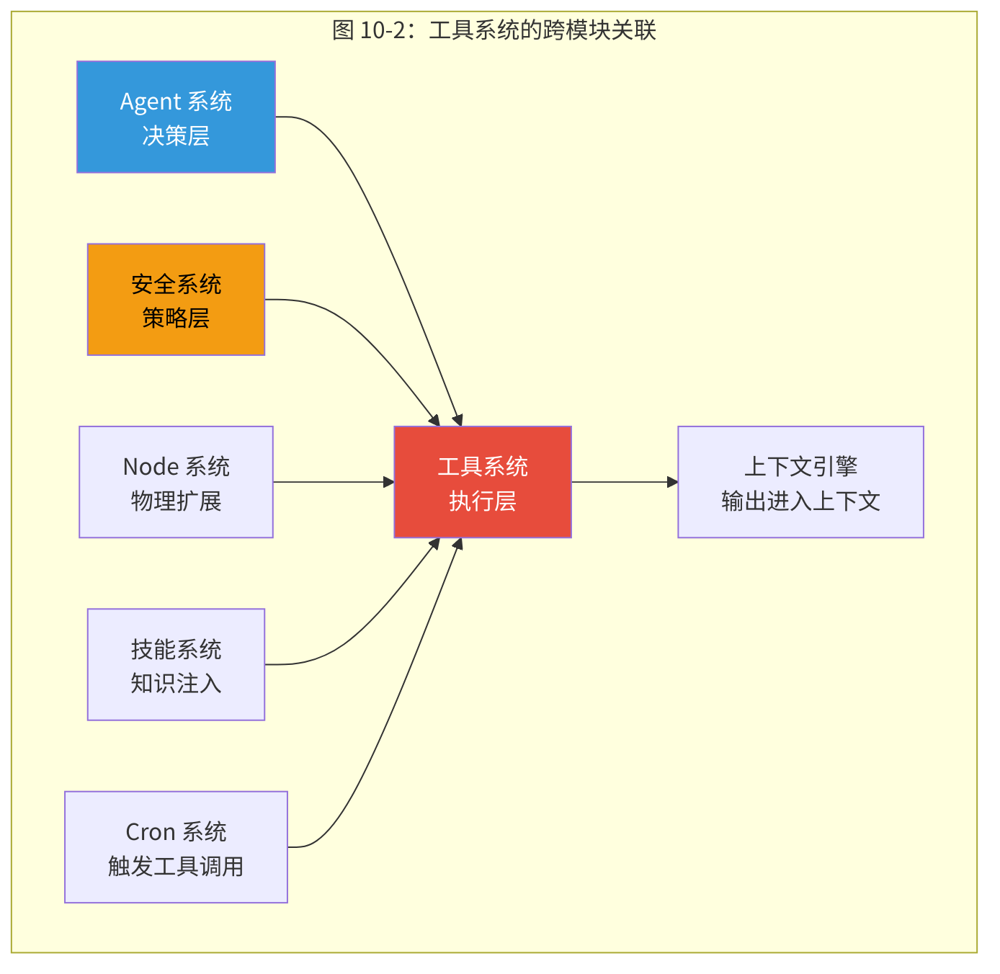
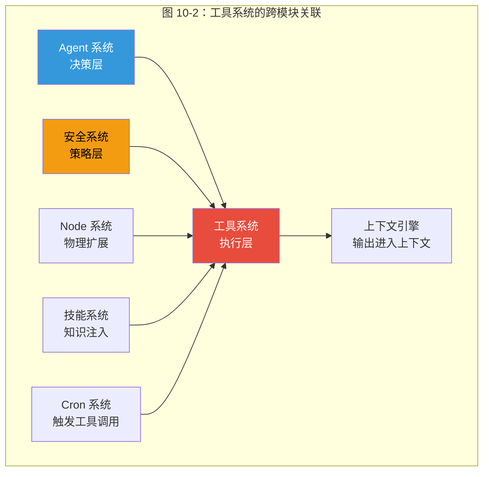
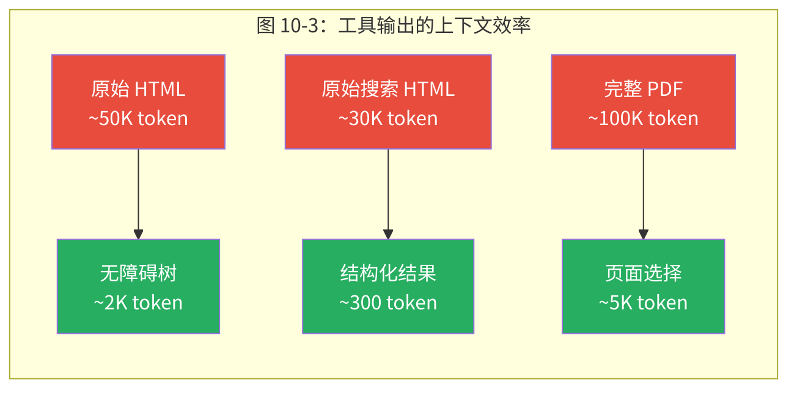
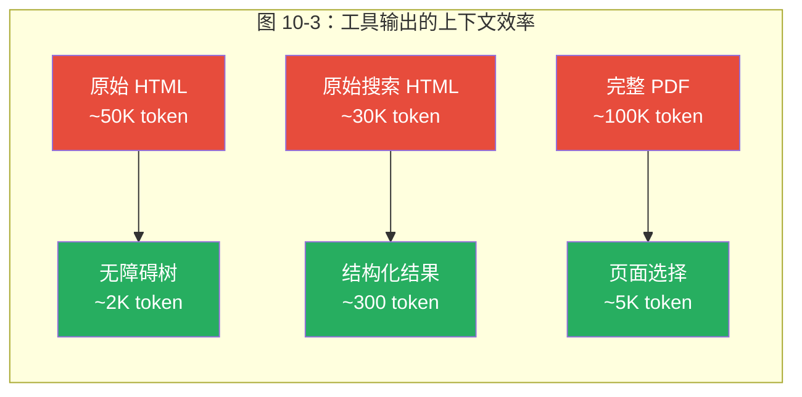

# 第10章 工具系统

> *"工具安全的最难问题不是'如何阻止恶意调用'，而是'如何区分一次危险但正确的操作和一次安全但错误的操作'——前者应该放行，后者应该拦截，而 LLM 给你的信号往往不足以可靠区分两者。"*

> **本章要点**
> - 理解 Agent 工具的核心悖论：能力越强，风险越大
> - 掌握三层工具抽象与七层策略防御管线
> - 深入浏览器自动化、进程执行、Web 搜索等核心工具实现
> - 理解工具系统与上下文引擎的协同关系


前九章，我们构建了 OpenClaw 的完整骨架：Gateway 调度全局、Provider 连接模型、Session 管理记忆、Agent 编排决策、通道对接用户、插件开放生态。骨架已成，但 Agent 仍然只是一个"能说会道的嘴"——它能生成文字，却无法触碰真实世界。

工具系统，就是给 Agent 装上的双手。

## 10.1 Agent 工具的核心悖论

什么区分了 AI Agent 和聊天机器人？答案看似简单：**行动的能力**。聊天机器人生成"我可以帮你搜索"的文本；Agent 真正打开浏览器、输入查询、返回结果。一个是纸上谈兵，一个是真刀真枪。

但这种简单性掩盖了一个困扰所有 Agent 框架的设计难题：如何让 AI *安全地*、*可扩展地*、*智能地*调用系统能力？

考虑最朴素的方案：将每个操作系统能力暴露为 LLM 可调用的函数。这在演示中行得通，但在生产环境中必然崩溃。没有权限控制，Agent 可能因误解指令而执行 `rm -rf /`；没有路由智能，用户要搜索它却去生成图片；没有并发管理，并行工具调用耗尽系统资源。**能力越大，责任越大——也越需要精密的管控。**

> 好的工具系统不是给 Agent 更多的刀——而是一套完整的刀具管理体系：哪些刀放在台面上，哪些锁在柜子里，谁有钥匙，什么情况下可以用。

> 🔥 **深度洞察：工具是 Agent 的"宪法修正案"**
>
> 从政治学的视角看工具系统，你会获得一个全新的理解。LLM 的基础能力（文本生成）就像宪法原文——庄严但抽象。每一个工具的添加，就像一条宪法修正案——它赋予 Agent 新的权力（执行命令、浏览网页、操作设备），但同时必须有对应的约束条款。美国宪法第二修正案赋予公民持枪权，但配套了无数的联邦和州法律来规范这一权力的行使。OpenClaw 的工具系统遵循完全相同的逻辑：`exec` 工具赋予 Agent 执行 Shell 命令的能力（强大的"武器"），但七层策略管线确保这一能力在严格约束下行使。**没有约束的能力不是能力，是隐患。**

### 10.1.1 如果没有工具系统会怎样？

让我们做一个思想实验。假设 OpenClaw 没有专门的工具系统，而是像早期的 LangChain 那样，让开发者自己将函数注册到 LLM 的工具列表中。会发生什么？

**第一个问题是安全真空。** 没有统一的策略层，每个工具自行决定"谁能调用我"。浏览器工具可能有 URL 白名单，但 exec 工具完全不设防。安全变成了一个个孤岛——有的工具很安全，有的工具裸奔，整体安全性取决于最弱的那一环。

**第二个问题是配置爆炸。** 运营者需要为每个工具单独配置权限、超时、资源限制。10 个工具需要 10 套配置。50 个工具需要 50 套。配置的复杂度与工具数量线性增长，维护成本很快超过工具本身的价值。

**第三个问题是上下文浪费。** 没有统一的输出格式控制，每个工具返回自己认为合理的格式——浏览器返回完整 HTML（50K token），搜索返回原始 JSON（30K token），一次工具调用就可能耗尽整个上下文窗口。Agent 变成了只能使用一次工具的"一次性工人"。

OpenClaw 的工具系统正是对这三个问题的系统性回应。它不是简单的函数注册表，而是一个**完整的工具治理框架**——在安全、配置和效率三个维度上提供统一的解决方案。

### 10.1.2 工具系统的设计目标

在深入实现之前，让我们明确工具系统要解决的核心需求：

1. **安全隔离**：不同利益相关者（平台运营者、Agent 开发者、模型提供商）能独立控制工具访问，且安全策略可组合。
2. **上下文效率**：工具的输出必须经过压缩和格式化，使之适合有限的上下文窗口。
3. **配置简洁**：运营者能用一行配置（如 `tools.profile: coding`）获得一组合理的工具默认值。
4. **扩展透明**：添加新工具不需要修改安全系统；修改安全策略不需要理解工具实现。
5. **优雅降级**：工具不可用时（如浏览器未安装），系统平滑降级而非崩溃。

这五个目标之间存在张力。例如，安全隔离要求细粒度控制，但配置简洁要求粗粒度抽象。工具系统的架构设计本质上是在这些张力之间寻找平衡。

> **关键概念：工具策略管线（Tool Policy Pipeline）**
> 工具策略管线是 OpenClaw 工具安全的核心机制——在任何工具进入 LLM 的可用工具列表之前，它必须通过多达七个独立的过滤阶段（Agent 级、Owner-Only、通道级、Provider 级、沙箱级等）。每个阶段可以独立允许或拒绝工具，且修改安全策略不需要修改工具实现，反之亦然。

## 10.2 工具架构：三层抽象

工具系统不是一个扁平的函数列表。它在三个层次上运作，每层解决不同类别的问题。

**第一层：工具目录**（`src/agents/tool-catalog.ts`）。所有工具的主注册表——文件操作（`read`、`write`、`edit`）、运行时操作（`exec`、`process`）、Web 操作（`browser`、`web_search`、`web_fetch`）、媒体操作（`image`、`tts`、`pdf`）和会话操作（`sessions_spawn`、`sessions_yield`）。每个工具属于一个**分区**（section），并声明参与哪些**配置文件**（profile）。

**第二层：工具策略管线**（`src/agents/tool-policy-pipeline.ts`）。安全性的核心。在任何工具进入 LLM 的意识之前，它通过多达七个独立过滤阶段——配置文件策略、提供商策略、全局策略、Agent 级策略和群组策略（策略管线的详细架构如图 6-3 所示，安全模型详见第13章）。每个阶段可以允许、拒绝或对任何工具保持沉默。管线遵循"最后一个明确意见胜出"的语义。

**第三层：工具执行**（各 `src/` 模块）。每个工具的实际实现——用于浏览器自动化的 Playwright、用于命令执行的 Node.js `child_process`、用于网页搜索的 HTTP 客户端等。


这种分离至关重要。目录是静态且全面的。管线是动态且安全感知的。执行层是模块化且可独立测试的。改变安全策略永远不需要修改工具实现，添加新工具永远不需要理解策略系统。

> ⚠️ **注意**：`exec` 工具的默认安全模式为 `"allowlist"`——只有在白名单中的命令才会被自动执行。如果你需要 Agent 执行任意命令（如开发环境），可以将安全模式设置为 `"full"`，但务必确保 Agent 仅面向受信任的用户。在面向公众的 Agent 上使用 `"full"` 模式是严重的安全风险。

### 10.2.1 为什么是三层而不是两层？

一个自然的疑问：为什么不把目录和策略合并为一层？答案在于**关注点的独立演化速度**。

工具目录的变更频率较低——当 OpenClaw 添加新工具（如 `canvas`、`feishu_doc`）时才变化，这可能是几周一次。策略管线的变更频率中等——运营者调整安全配置时变化，可能是每天。工具执行的变更频率最高——Bug 修复、性能优化、API 适配，几乎每次提交都涉及。

如果目录和策略耦合，每次添加新工具都要重新审视安全策略的组合逻辑。如果策略和执行耦合，每次修改浏览器自动化的细节都可能意外改变安全行为。三层分离让每一层按自己的节奏演化，互不干扰。

### 10.2.2 工具目录的数据模型

让我们看看工具目录的核心数据结构（`src/agents/tool-catalog.ts`）：

```typescript
// 工具的核心定义——每个工具是一个静态声明
type CoreToolDefinition = {
  id: string;              // 工具唯一标识
  label: string;           // 显示名称
  description: string;     // 功能描述
  sectionId: string;       // 所属分区（fs/runtime/web/media/...）
  profiles: ToolProfileId[];  // 属于哪些配置文件
  includeInOpenClawGroup?: boolean;  // 是否归入 OpenClaw 工具组
};
```

这个定义有几个微妙的设计决策：

**`sectionId` 的分区设计**。11 个分区（`fs`、`runtime`、`web`、`memory`、`sessions`、`ui`、`messaging`、`automation`、`nodes`、`agents`、`media`）不是按技术实现分的，而是按**用户心理模型**分的。运营者不会想"我要允许使用 Playwright 的工具"，而是"我要允许 Web 相关的工具"。分区对齐了运营者的思维方式，让配置更直觉。

**`profiles` 的多重归属**。一个工具可以属于多个配置文件。例如 `web_search` 同时属于 `coding` 和 `full` 配置文件。这意味着切换配置文件不需要手动调整个别工具——配置文件是工具子集的有名字的快捷方式。

**`includeInOpenClawGroup` 的插件边界标识**。这个布尔值标记哪些工具在策略过滤中应该被视为"核心 OpenClaw 工具"而非"插件提供的工具"。这影响当 allowlist 中出现未知条目时的降级行为——如果 allowlist 仅包含插件工具名，系统会剥离该 allowlist（让所有核心工具保持可用），而非错误地禁用所有核心工具。

## 10.3 策略管线：七层防御

如果你只能理解整个工具系统的一个机制，那应该是策略管线。这是 OpenClaw 安全态势的执行点——它的设计揭示了关于 Agent 安全的深刻洞察。

### 10.3.1 问题的本质

不同利益相关者需要不同级别的工具控制。平台运营者想全局禁止 `sessions_spawn`（防止远程代码执行）。Agent 配置想将某个 Agent 限制为只读工具（数据分析场景）。模型提供商策略想根据模型能力限制工具（某些模型不支持工具调用）。群组管理员想在特定 Discord 群里禁用 `exec`（安全考虑）。

传统的做法是把所有这些规则塞进一个巨大的 `if-else` 树。但这种方案有致命缺陷：**规则之间会产生意外的交互效应**。当运营者的全局禁止和 Agent 的局部允许冲突时，谁赢？当模型提供商策略和群组策略都对同一个工具有意见时，优先级怎么定？

### 10.3.2 管线方案

OpenClaw 的回答是：独立过滤阶段的**有序管线**，每个阶段有自己的作用域和真实来源：

```typescript
// src/agents/tool-policy-pipeline.ts（简化）
const stages = [
  { policy: profilePolicy,         label: "tools.profile" },
  { policy: providerProfilePolicy, label: "tools.byProvider.profile" },
  { policy: globalPolicy,          label: "tools.allow" },
  { policy: globalProviderPolicy,  label: "tools.byProvider.allow" },
  { policy: agentPolicy,           label: "agents.X.tools.allow" },
  { policy: agentProviderPolicy,   label: "agents.X.tools.byProvider.allow" },
  { policy: groupPolicy,           label: "group tools.allow" },
];
```

管线的执行语义简洁但强大：每个阶段独立决定允许或拒绝某些工具。阶段按顺序执行，后面的阶段可以覆盖前面的决策。通过所有七个阶段的工具对 LLM 可用。在*任何*阶段被阻止的工具从 LLM 的工具目录中移除——**模型甚至不知道它的存在**。

这最后一点至关重要。被策略拒绝的工具不是"显示为不可用"，而是从 LLM 的世界中彻底消失。LLM 不能请求使用它不知道存在的工具，这从根本上消除了模型试图绕过工具限制的可能性。

### 10.3.3 为什么是七层而不是三层？

七层看起来过度设计了？让我们通过一个具体场景理解为什么每一层都不可或缺。

想象这个场景：运营者部署了一个 OpenClaw 实例，同时服务于三个 Agent——`coder`（编码助手）、`researcher`（研究助手）和 `support`（客户支持）。

- **配置文件层**：`coder` 使用 `coding` 配置文件（包含 `exec`、`browser`），`support` 使用 `messaging` 配置文件（只有 `message`、`tts`）。这一层决定了每个 Agent 的"能力天花板"。
- **提供商配置文件层**：`researcher` 使用 DeepSeek，它不支持工具调用。这一层确保不向不支持的模型发送工具定义。
- **全局策略层**：运营者全局禁止 `sessions_spawn`，因为这是远程代码执行向量。这一层实施"绝对不可逾越的红线"。
- **全局提供商策略层**：对所有使用 OpenAI 的 Agent，禁止 `browser`（因为 OpenAI 的使用条款限制）。
- **Agent 策略层**：`coder` 只允许在 `~/projects/` 下操作文件。这一层实施每个 Agent 的最小权限原则。
- **Agent 提供商策略层**：`coder` 在使用低端模型时禁止 `process`（防止长时间运行的命令浪费 token）。
- **群组策略层**：在 Discord 的 `#general` 频道中禁用 `exec`（公共频道安全考虑），但在 `#dev` 频道中允许。

七层，每一层回答一个独立的问题，没有任何两层的关注点完全重叠。这就是为什么不能简化到三层——那样必然会把不同关注点混在一起，导致配置变得混乱。

### 10.3.4 未知 Allowlist 条目的智能处理

管线中有一个容易被忽视但极其重要的细节：当 allowlist 包含未知的工具名时会怎样？

```typescript
// src/agents/tool-policy-pipeline.ts — 未知 allowlist 处理
const resolved = stripPluginOnlyAllowlist(policy, pluginGroups, coreToolNames);
if (resolved.unknownAllowlist.length > 0) {
  // 区分两种情况：
  // 1. 已知核心工具但当前不可用（受限于运行时/提供商/模型/配置）
  // 2. 完全未知的条目（可能是拼写错误或未启用的插件）
  const gatedCoreEntries = resolved.unknownAllowlist.filter(isKnownCoreToolId);
  const otherEntries = resolved.unknownAllowlist.filter(e => !isKnownCoreToolId(e));
  // ...
}
```

如果 allowlist 中*只*包含插件工具名（没有任何核心工具），系统会**剥离整个 allowlist**。为什么？因为这种情况通常意味着运营者是在为插件配置允许列表，而不是想禁止所有核心工具。如果不做这个处理，一个 `tools.allow: [my_custom_tool]` 的配置会意外地禁止 `read`、`write`、`exec` 等所有核心工具——这几乎肯定不是运营者的意图。

这种"猜测运营者意图"的启发式处理，是安全系统中罕见的"宁可放行一些、不要误杀关键功能"的设计取舍。它反映了一个务实的认知：**安全系统如果太难用，运营者会绕过它，最终导致更差的安全态势**。

### 10.3.5 HTTP 工具拒绝列表

`src/security/dangerous-tools.ts` 中的默认 HTTP 工具拒绝列表特别值得深入分析：

```typescript
export const DEFAULT_GATEWAY_HTTP_TOOL_DENY = [
  "sessions_spawn",   // 远程 Agent 生成 = RCE 向量
  "sessions_send",    // 跨会话消息注入
  "cron",             // 持久化自动化控制面板
  "gateway",          // 网关重配置
] as const;
```

为什么这四个工具被特别对待？因为它们代表了四种不同类别的**持久化威胁**：

1. **`sessions_spawn`** — 能力放大。一次 spawn 可以创建一个拥有完整工具集的新 Agent 进程，等于远程代码执行。
2. **`sessions_send`** — 横向移动。攻击者可以通过一个已入侵的会话向其他会话注入消息。
3. **`cron`** — 持久化。攻击者可以创建定时任务植入持久后门，即使清除原始会话也能继续执行。
4. **`gateway`** — 特权提升。修改网关配置可以改变安全策略本身。

这四个工具的共同特征是**效果超出当前会话的生命周期**。`exec` 虽然危险，但它的影响范围局限于当前进程；`sessions_spawn` 却能创造新的持久进程。这就是为什么 `exec` 不在默认拒绝列表中而 `sessions_spawn` 在——拒绝列表的标准不是"是否危险"，而是"是否具有持久化和放大效应"。

即使有有效认证，这些工具在 HTTP API 表面也被默认拒绝。当运营者明确重新启用被拒绝的工具时，安全审计系统根据网关暴露级别评估风险——在回环绑定的网关上重新启用 `sessions_spawn` 触发 `warn`；在公开暴露的网关上重新启用则触发 `critical`。

## 10.4 工具配置文件：能力包

### 10.4.1 配置文件的设计动机

不必逐个配置每个工具，OpenClaw 将工具分组为匹配常见用例的**配置文件**：

| 配置文件 | 包含的工具 | 典型用例 |
|---------|----------|---------|
| `minimal` | `read`、`write`、基础文件系统 | 受限环境 |
| `coding` | 完整文件系统、`exec`、`process`、`browser` | 开发工作流 |
| `messaging` | `message`、`tts` | 通信 Agent |
| `full` | 所有可用工具 | 不受限操作 |

配置文件既简化了配置（运营者设置 `tools.profile: coding` 而不是列出 15 个工具），又作为文档（读取配置文件定义即可了解 Agent 的能力级别）。

> 💡 **最佳实践**：为不同场景的 Agent 选择合适的工具配置文件。面向公众的客服 Agent 使用 `minimal`；内部开发 Agent 使用 `coding`；个人助手使用 `full`。可以在配置文件基础上通过 `tools.allow` / `tools.deny` 进一步微调。

### 10.4.2 替代方案的考量

在设计配置文件时，OpenClaw 团队考虑过至少三种替代方案：

**方案 A：纯 Allowlist/Denylist**。运营者显式列出每个允许或拒绝的工具。优点：完全精确。缺点：随着工具数量增长，配置变得冗长且脆弱——新工具添加时，所有现有配置都需要更新。

**方案 B：角色基础访问控制（RBAC）**。定义"管理员"、"开发者"、"只读用户"等角色，每个角色有固定的工具集。优点：企业用户熟悉。缺点：角色是面向*人*的抽象，不适合面向*Agent*的场景——Agent 的能力需求由任务决定而非由身份决定。

**方案 C：配置文件 + 叠加层（最终选择）**。提供几个有名字的配置文件作为基线，再允许通过 allowlist/denylist 微调。优点：兼得便捷性（一行配置）和精确性（可微调）。缺点：增加了概念数量（配置文件 + 策略 + 管线）。

最终选择方案 C 的原因是它最符合 OpenClaw 的运营者画像：大多数情况下，`coding` 或 `minimal` 就够了；少数需要精细控制的场景，可以叠加策略层。**80% 的用户只需要一行配置，20% 的用户有完整的策略管线**——这是对 Pareto 原则的精准应用。

### 10.4.3 配置文件与策略的交互

配置文件不是策略管线之外的独立机制——它本身就是管线的**第一阶段**。这意味着：

1. 配置文件设置的是**最大可用工具集**。
2. 后续的策略阶段只能**从中减少**，不能增加。
3. 如果配置文件中没有 `exec`，即使 Agent 级策略显式允许 `exec` 也无效。

这种"配置文件封顶、策略精简"的语义，确保了一个重要的安全属性：运营者设置 `tools.profile: minimal` 后，无论后续配置如何变化，Agent 的能力不会超过 `minimal` 的范围。这就像一个保险丝——它设定了系统的绝对上限。

## 10.5 浏览器自动化：最复杂的工具

浏览器工具（`src/browser/`）基于 Playwright 构建。它是 OpenClaw 中最复杂的单一工具——不是因为"让 AI 控制浏览器"概念复杂，而是因为**浏览器是通往整个互联网的门**，安全、效率和可靠性的挑战在这里被极限放大。

### 10.5.1 浏览器自动化的设计哲学

浏览器自动化面临一个根本性的表示问题：**如何将一个视觉化的、交互式的、状态丰富的网页，转化为 LLM 能够高效推理和操作的文本表示？**

考虑三种方案：

**方案 A：截图 + 视觉模型**。将网页截图发送给视觉 LLM，让它基于图像理解进行操作。优点：最接近人类的浏览方式。缺点：每次截图消耗大量 token（一张 1080p 截图约 1,000 token），且视觉模型对精确坐标的推理并不可靠，"点击搜索框"可能因为几像素的偏差而点到其他元素。

**方案 B：完整 DOM/HTML**。将网页的 HTML 源码发送给 LLM。优点：信息完整。缺点：一个典型网页的 HTML 有 50,000+ token，仅一次浏览就可能耗尽整个上下文窗口。而且 HTML 中充斥着样式、脚本、广告代码等 Agent 不需要的噪音。

**方案 C：无障碍树（Accessibility Tree）**。提取网页的无障碍语义结构——标题、链接、按钮、输入框——以紧凑的文本形式呈现。优点：25 倍压缩（50K token → 2K token），且语义明确（每个元素的角色和用途都清晰标注）。缺点：丢失了视觉布局信息（元素的相对位置、颜色、大小）。

OpenClaw 选择了方案 C 作为主方案，方案 A 作为补充——需要视觉信息时可以请求截图。这个选择反映了一个核心洞察：**Agent 浏览网页的目的是获取信息或执行操作，而不是欣赏设计**。无障碍树恰好捕获了"信息"和"操作"两个维度，同时抛弃了"视觉"维度。

### 10.5.2 快照机制的工程实现

快照机制（`src/browser/pw-role-snapshot.ts`）是浏览器工具最具创新性的部分。它将完整的 DOM 转化为紧凑的无障碍树表示：

```text
[ref=e1] heading "Hacker News"
[ref=e2] link "Show HN: My Project" → 点击导航
[ref=e3] link "142 comments" → 点击导航
[ref=e4] textbox "搜索..."
```

系统为每个交互元素分配一个简短的 `ref` 标识符（如 `e3`）。Agent 基于这种紧凑表示推理并发出类似 `click ref=e3` 的动作。这将典型网页从 50,000+ token 的 HTML 压缩到约 2,000 token 的无障碍树——**25 倍压缩**，使浏览器自动化在上下文窗口约束内变得实用。

快照实现中有几个精妙的细节：

**角色分类体系**。源码（`src/browser/snapshot-roles.ts`）将 HTML 元素角色分为三类：`STRUCTURAL_ROLES`（`heading`、`list`、`navigation`）、`CONTENT_ROLES`（`text`、`img`）和 `INTERACTIVE_ROLES`（`button`、`link`、`textbox`）。快照在紧凑模式下只保留交互和内容角色，进一步压缩无关信息。

**去重机制**。当同一角色和名称出现多次时（如页面上有多个"Submit"按钮），`RoleNameTracker` 自动为它们分配 `nth` 索引以消除歧义。

**深度限制**。`maxDepth` 参数控制树的遍历深度——对于深层嵌套的 SPA 页面，限制深度可以在信息完整性和 token 开销之间取得平衡。

### 10.5.3 导航守卫

**导航守卫**（`src/browser/navigation-guard.ts`）是浏览器安全的第一道防线。它在 Playwright 层面拦截每一次导航请求，检查：

1. **协议验证**：只允许 `http://` 和 `https://`，阻止 `file://`、`javascript:` 和 `data:` 协议。
2. **域名过滤**：支持白名单和黑名单，使用 URL 模式匹配（`src/browser/url-pattern.ts`）。
3. **SSRF 防护**：阻止导航到内部网络地址（`127.0.0.1`、`192.168.x.x`、`10.x.x.x`），防止 Agent 被利用来探测内部服务。

导航守卫的设计权衡值得讨论。更严格的方案是只允许白名单域名——但这会让 Agent 在面对新网站时完全无能为力。更宽松的方案是不做任何限制——但这会让 Agent 成为 SSRF 攻击的跳板。OpenClaw 选择了中间路线：默认允许所有公共 URL，阻止已知危险模式，并提供白名单/黑名单让运营者自定义。

### 10.5.4 配置文件隔离

配置文件隔离（`src/browser/profiles-service.ts`）确保不同 Agent 获得独立的浏览器上下文——独立的 Cookie、本地存储和会话状态。这不仅是安全隔离（Agent A 不能读取 Agent B 的登录凭证），也是功能隔离（Agent A 登录 Gmail 不影响 Agent B 的浏览）。

### 10.5.5 与其他框架的浏览器方案对比

| 维度 | OpenClaw | Anthropic Computer Use | AutoGPT | Browser Use |
|------|----------|----------------------|---------|-------------|
| **表示方式** | 无障碍树 | 截图 + 坐标 | Selenium DOM | 混合（视觉+DOM） |
| **Token 效率** | ~2K/页面 | ~1K/截图 | ~50K/页面 | ~5K/页面 |
| **操作精度** | 高（语义引用） | 中（坐标可能漂移） | 高（CSS 选择器） | 中高 |
| **安全隔离** | 配置文件隔离 | 沙箱 | 无 | 无 |
| **导航守卫** | URL 模式 + SSRF | 无 | 无 | 无 |

OpenClaw 的无障碍树方案在 token 效率和操作精度之间取得了最佳平衡。截图方案更"自然"但更浪费且更不精确。完整 DOM 方案最精确但完全无法在上下文窗口中使用。

## 10.6 进程执行：受控的力量

`exec` 工具（`src/process/`）提供 Shell 命令执行。它是 Agent 最强大也最危险的能力——一条命令可以创建文件、安装软件、启动服务，也可以删除数据、暴露密钥或攻击网络。

### 10.6.1 三模式安全模型

**`deny`** — 完全禁止命令执行。适用于纯对话 Agent（客户支持、内容生成）。

**`allowlist`** — 仅匹配 SafeBins 的命令执行。这是推荐的生产配置。SafeBins 超越简单的命令名匹配，包括**参数级别的配置**——`git` 可以在 SafeBins 中，但 `git --exec="rm -rf /"` 被参数配置阻止。

**`full`** — 任何命令都执行。仅用于完全可信的本地开发环境。

### 10.6.2 SafeBins 的深层设计

SafeBins 的设计体现了"最小权限"原则的精细应用。考虑这个场景：运营者想让 Agent 能使用 Python 来分析数据。

天真的做法是把 `python` 加入 SafeBins。但 `python` 能做的事情几乎无限——它可以调用 `os.system("rm -rf /")`、可以开启网络监听、可以读取 `/etc/passwd`。把 `python` 加入 SafeBins 等于授予完整代码执行能力，SafeBins 名存实亡。

OpenClaw 的安全审计系统会标记这种情况：`src/security/audit.ts` 中的检查会将"解释器类"（interpreter-like）的 SafeBin 条目标记为 `warn` 或 `critical`。`listInterpreterLikeSafeBins()` 函数维护了一个已知解释器列表（`python`、`node`、`ruby`、`perl`、`bash`），遇到这些条目时警告运营者："你加了一个解释器，这基本等于 full 模式"。

### 10.6.3 命令注入防御

命令安全验证（`src/infra/exec-safety.ts`）遵循**默认拒绝**原则：包含 Shell 元字符（`;`、`|`、`$`、`` ` ``）的任何值都被视为不安全。

为什么不解析 Shell 语法来"理解"命令的真实意图？因为 Shell 语法的复杂性远超想象——变量展开、命令替换、进程替换、Here Documents、转义序列......可靠地解析所有 Shell 方言几乎不可能。与其追求"完美理解"，不如采取"遇到可疑就拒绝"的保守策略。宁可拒绝合法命令（需要手动批准）也不允许注入向量通过。

### 10.6.4 后台进程管理

后台进程管理允许 Agent 启动长时间运行的进程并稍后检查，通过唯一 ID 跟踪活动会话，支持标准输入/输出交互，并强制执行资源限制。

这个能力解锁了一类重要的工作流：Agent 启动一个 `npm run dev` 开发服务器，然后继续编辑代码，定期检查服务器日志看是否有错误。在传统的"执行-等待-返回"模式下，Agent 必须等待进程结束才能做其他事——但开发服务器不会"结束"。后台进程管理让 Agent 能像人类开发者一样同时管理多个终端。

## 10.7 Web 搜索与内容理解

### 10.7.1 搜索引擎抽象

**Web 搜索**（`src/web-search/`）采用多搜索引擎统一接口设计，支持 Brave、Google、Bing、DuckDuckGo 等。关键设计决策是**搜索结果的结构化提取**——10 个搜索结果只需 200-300 token，而原始 HTML 可能超过 50,000 token。

为什么支持多个搜索引擎而不只用一个？三个原因：

1. **可用性**：任何单一搜索 API 都可能限流或宕机。多引擎提供回退。
2. **结果多样性**：不同引擎的索引覆盖不同（Brave 更注重隐私站点，Google 更全面），多引擎搜索能捕获单引擎遗漏的结果。
3. **成本优化**：不同引擎的 API 定价和免费额度不同，运营者可以根据预算选择。

### 10.7.2 内容提取的权衡

**`web_fetch`** 使用可读性算法从 URL 提取内容，将 HTML 转为干净的 Markdown。这里的核心权衡是**信息保真度 vs. Token 效率**。

完整的 HTML 保留了所有信息但对 LLM 来说 90% 是噪音。纯文本提取丢失了结构（标题层次、列表、链接）。Markdown 是折中——保留语义结构，去除视觉样式，在信息密度和 token 效率之间取得平衡。

### 10.7.3 媒体理解

**`image` 工具**：发送图片到视觉模型分析。支持本地路径、HTTP URL 和 Base64 数据 URI。这里的设计决策是**不预处理图片**——将图片原样发送给视觉模型，因为压缩或裁剪可能丢失模型需要的细节。

**`pdf` 工具**：处理 PDF 文档，支持页面范围选择（`pages: "1-5,8"`）以避免处理不相关页面。这是 token 预算意识的又一体现——一个 100 页的 PDF 全部发送是灾难性的，页面选择让 Agent 能精确加载需要的部分。

## 10.8 语音合成

TTS 工具（`src/tts/`）遵循多提供商模式。值得注意的设计是合成前的**文本预处理管线**：

1. **Markdown 剥离**：去除标题标记、粗体/斜体语法等——TTS 引擎不需要这些。
2. **SSML 转义**：特殊字符（`<`、`>`、`&`）在 SSML 提供商中需要转义。
3. **长文本摘要**：超过提供商限制的文本自动通过 LLM 摘要——与其截断导致句子不完整，不如智能压缩保持连贯性。
4. **速率限制**：每个提供商有独立的速率计数器，防止突发请求。

提供商选择使用评分算法，平衡语音可用性、成本、质量和延迟。这个算法不是简单的"选最便宜的"——如果用户请求特定语音，系统会优先选择支持该语音的提供商，即使成本更高。

## 10.9 工具系统与上下文引擎的关系

工具系统不是孤立存在的——它与上下文引擎（第5章）形成一个紧密的**反馈回路**。

每次工具调用产生的输出都进入会话的上下文历史。如果浏览器返回 5,000 token 的页面内容，这 5,000 token 就永久占据上下文窗口的一部分，直到被上下文压缩算法摘要。这意味着**工具的输出格式直接影响 Agent 的后续推理能力**。

这就是为什么无障碍树（2K token）比完整 HTML（50K token）不仅仅是"省 token"——它实际上让 Agent 在同一次对话中能使用更多次工具。一个 128K token 的上下文窗口，如果每次浏览器调用消耗 50K token，Agent 最多浏览 2-3 次就耗尽了；如果每次只消耗 2K token，Agent 可以浏览 50+ 次。

这种乘数效应意味着**工具输出压缩不是性能优化，而是功能使能**——它决定了 Agent 能做多少事。

## 10.10 实战推演：Agent 自动化浏览器完成表单填写

让我们通过一个真实场景，展示浏览器工具的完整交互过程——Agent 帮用户在线填写一份多页表单。这个场景综合了快照机制、导航守卫、配置文件隔离和上下文效率的所有设计决策。

### 10.10.1 场景描述

用户对 Agent 说："帮我到 https://forms.example.com 填写参会报名表，我的信息是：姓名张三，邮箱 zhang@example.com，参加第二天的工作坊。"

### 10.10.2 Agent 的执行序列

```text
回合1: Agent 决策 → 调用 browser(action: "navigate", url: "https://forms.example.com")
  ↳ 导航守卫检查: https://forms.example.com → 公共域名 ✅, 非 SSRF 目标 ✅ → 放行
  ↳ 配置文件隔离: 使用 Agent 专属浏览器上下文（独立 Cookie）

回合2: Agent 调用 browser(action: "snapshot")
  ↳ 快照引擎生成无障碍树（约 1,800 token，而非 45,000 token 的完整 HTML）:
    [ref=e1] heading "会议报名表"
    [ref=e2] textbox "姓名" (required)
    [ref=e3] textbox "邮箱" (required)
    [ref=e4] radio "第一天" 
    [ref=e5] radio "第二天"
    [ref=e6] checkbox "参加工作坊"
    [ref=e7] button "下一页"

回合3: Agent 推理 → 依次执行:
  browser(action: "act", kind: "fill", ref: "e2", text: "张三")
  browser(action: "act", kind: "fill", ref: "e3", text: "zhang@example.com")
  browser(action: "act", kind: "click", ref: "e5")  // 选择"第二天"
  browser(action: "act", kind: "click", ref: "e6")  // 勾选"工作坊"
  browser(action: "act", kind: "click", ref: "e7")  // 点击"下一页"

回合4: 新页面加载 → Agent 调用 snapshot → 确认页快照:
    [ref=e10] heading "确认您的信息"
    [ref=e11] text "姓名: 张三"
    [ref=e12] text "邮箱: zhang@example.com"
    [ref=e13] button "提交"
    [ref=e14] button "返回修改"

回合5: Agent 确认信息正确 → browser(action: "act", kind: "click", ref: "e13")
```

### 10.10.3 上下文效率的关键作用

整个 5 回合交互中，浏览器产生的总 token 消耗约为 **1,800 × 2 = 3,600 token**（两次快照）。如果使用完整 HTML 方案，两次页面加载就需要 **90,000 token**——在 128K 上下文中几乎不留空间给 Agent 推理。

> 浏览器自动化的本质不是"让 AI 看到网页"——而是"让 AI 以最小认知成本理解网页的交互结构"。无障碍树是为残障人士设计的语义抽象，恰好也是 AI 最高效的网页理解方式。技术的美在于：为一类用户设计的无障碍方案，意外地成为了另一类"用户"（AI）的最佳接口。

## 10.11 跨章关联

工具系统既消费其他系统的能力，也向其他系统提供服务：

**消费 Agent 系统（第6章）**：Agent 决定何时调用哪个工具。工具系统提供工具目录供 Agent 发现和选择。

**消费策略管线 → 安全系统（第13章）**：策略管线的过滤规则来自安全配置。安全审计扫描工具配置的合理性。

**向 Node 系统（第11章）提供接口**：Node 系统的设备能力（相机、GPS）以工具的形式暴露给 Agent。Node 系统可以看作"物理世界的工具扩展"。

**Cron 系统（第12章）消费工具**：定时任务通过调用工具执行实际操作——Agent 处理 Cron 作业的消息时，使用工具来完成任务。

**技能系统（第16章）消费工具**：技能通过 `command-dispatch: tool` 绕过 LLM 直接触发工具调用，为工具提供"使用方法"的知识。






## 10.12 框架对比

| 维度 | OpenClaw | LangChain | AutoGPT | CrewAI | Semantic Kernel |
|------|----------|-----------|---------|--------|-----------------|
| **工具访问控制** | 7 层策略管线 | 无内建 | 基本权限模式 | 角色绑定 | 有限 |
| **浏览器自动化** | Playwright + 无障碍树 | 第三方 | Selenium 封装 | 无 | 无 |
| **命令执行** | deny/allowlist/full + SafeBins | 不受限 | 基于权限 | 无 | 沙箱 |
| **上下文效率** | 快照压缩，token 感知 | 原始输出 | 原始输出 | 原始输出 | 原始输出 |
| **工具输出格式** | 结构化压缩 | 原始返回 | 原始返回 | 原始返回 | 原始返回 |

最显著的差异化因素是**上下文效率**。OpenClaw 的浏览器无障碍树、搜索结构化提取和 PDF 页面选择都反映了对工具输出与对话历史竞争相同有限上下文窗口的深刻认识。






## 10.13 历史演进

工具系统的设计不是一蹴而就的，它经历了清晰的演进路径：

**阶段1：朴素函数注册**。早期版本中，工具是简单的函数列表，直接注册到 LLM 的工具调用接口。没有安全策略，没有配置文件，所有工具对所有 Agent 可见。

**阶段2：全局 Allowlist/Denylist**。随着工具数量增长，引入了全局的 `tools.allow` 和 `tools.deny` 配置。一个配置控制所有——简单但不灵活。

**阶段3：配置文件系统**。认识到大多数运营者只需要几种典型的工具组合后，引入了命名配置文件。这是从"列出每个工具"到"选择一种模式"的范式转变。

**阶段4：多层策略管线**。随着多 Agent 和多通道支持的成熟，单一的全局配置无法满足"不同 Agent 不同策略"的需求。策略管线应运而生，从两层逐渐增加到七层。

**阶段5：提供商感知策略**。不同 LLM 提供商对工具的支持能力不同——有些模型不支持工具调用，有些模型不支持并行工具调用。提供商配置文件层和提供商策略层是为了适应这种异构性。

这个演进路径反映了一个更普遍的规律：**系统的安全模型总是追赶系统的能力模型**。每次添加新能力（多 Agent、多通道、多提供商），安全模型都需要跟着扩展。

## 10.14 关键源码文件

| 目录/文件 | 用途 |
|----------|------|
| `src/agents/tool-catalog.ts` | 工具定义和配置文件分配 |
| `src/agents/tool-policy-pipeline.ts` | 多阶段访问控制 |
| `src/agents/tool-policy.ts` | 策略标准化和插件组扩展 |
| `src/security/dangerous-tools.ts` | HTTP 和 ACP 拒绝列表 |
| `src/browser/` | 基于 Playwright 的浏览器自动化（130+ 文件） |
| `src/browser/pw-role-snapshot.ts` | 无障碍树快照生成 |
| `src/browser/navigation-guard.ts` | URL 安全过滤 |
| `src/process/` | 命令执行和进程管理 |
| `src/web-search/` | 多提供商 Web 搜索 |
| `src/tts/` | 语音合成 |
| `src/infra/exec-safety.ts` | 命令注入检测 |

## 10.15 本章小结

OpenClaw 的工具系统解决了 Agent 工具的根本张力：**最大能力与最小风险**。三层架构（目录→策略→执行）清晰分离关注点，让每一层按自己的节奏演化。七阶段策略管线组合独立的安全关注而不纠缠它们，每个利益相关者获得独立的控制面。上下文高效的输出格式（无障碍树、结构化搜索结果、页面选择的 PDF）不只是节省 token——它们决定了 Agent 在一次对话中能使用多少次工具，是功能使能而非性能优化。

**核心洞察**：Agent 工具的最难问题不是实现工具——而是控制对它们的访问。OpenClaw 的策略管线证明，有效的工具安全需要**组合式设计**，而非单体访问控制列表。每个利益相关者（平台运营者、Agent 开发者、模型提供商）获得独立的策略阶段，它们的组合效果从管线的有序组合中自然涌现。而工具输出的上下文效率设计，揭示了一个 LLM 系统独有的架构约束：**所有工具输出都在与对话历史争夺同一个有限的上下文窗口——工具的价值不只取决于它能做什么，更取决于它的输出占用多少 token**。

> **工具系统的终极使命，不是让 Agent 能做更多事——而是让它在做正确的事时毫无阻碍，在做危险的事前悬崖勒马。** 给一个人一把锤子，他看什么都像钉子。给一个 Agent 所有工具但不加管控，它做什么都像冒险。

工具让 Agent 拥有了在数字世界中行动的能力——执行命令、浏览网页、搜索信息。但 Agent 的活动空间不必局限于服务器边界之内。下一章，我们将看到 Node 系统如何将 Agent 的触角从虚拟世界延伸到物理世界——相机、屏幕、传感器，一切物理设备都将成为 Agent 可调用的"远程工具"。

### 🛠️ 试一试：编写一个自定义工具

通过 Agent 的工具系统，你可以让 Agent 调用自定义脚本。以下示例创建一个"磁盘用量检查"工具：

```bash
# 1. 创建工具脚本目录
mkdir -p ~/.openclaw/workspace/tools

# 2. 编写工具脚本
cat > ~/.openclaw/workspace/tools/disk-usage.sh << 'EOF'
#!/bin/bash
# 磁盘用量检查工具
# 用法: disk-usage.sh [path]
TARGET="${1:-/}"
echo "=== Disk Usage Report ==="
echo "Target: $TARGET"
df -h "$TARGET" | tail -1 | awk '{print "Total:", $2, "| Used:", $3, "| Available:", $4, "| Usage:", $5}'
echo ""
echo "Top 5 largest directories:"
du -sh "$TARGET"/*/ 2>/dev/null | sort -rh | head -5
EOF
chmod +x ~/.openclaw/workspace/tools/disk-usage.sh

# 3. 在 Agent 配置中启用 exec 工具
# openclaw.json5:
# {
#   "agents": {
#     "main": {
#       "tools": {
#         "allow": ["exec", "read", "write"],  // ← exec 允许 Agent 执行脚本
#         "exec": {
#           "allowlist": [                      // ← 白名单控制可执行的命令
#             "~/.openclaw/workspace/tools/*"
#           ]
#         }
#       }
#     }
#   }
# }

# 4. 测试：让 Agent 检查磁盘用量
# 向 Agent 发送消息："请检查一下根目录的磁盘使用情况"
# Agent 会自动调用 exec 工具执行你的脚本
```

> 💡 **观察要点**：注意工具的 `allowlist` 配置——这正是 10.6 节所述的七阶段策略管线中"命令白名单"层在起作用。尝试执行一个不在白名单中的命令，观察策略管线如何拦截。

---

### 思考题

1. **概念理解**：工具系统的七层策略管线为什么采用"有序组合"而非"单一 ACL"？每个利益相关方（平台运营者、Agent 开发者、模型提供商）拥有独立的策略阶段有什么好处？
2. **实践应用**：如果要为 OpenClaw 添加一个"数据库查询"工具，允许 Agent 执行 SQL 查询，你会在策略管线中如何配置安全限制（防止 DROP TABLE 等危险操作）？
3. **开放讨论**：工具输出与对话历史竞争同一个有限的上下文窗口——这是 LLM 系统独有的架构约束。你认为未来有没有可能从根本上解决这个"上下文预算"问题？

### 📚 推荐阅读

- [Toolformer: Language Models Can Teach Themselves to Use Tools (arXiv 2023)](https://arxiv.org/abs/2302.04761) — LLM 自主学习使用工具的里程碑论文
- [Anthropic Tool Use 文档](https://docs.anthropic.com/en/docs/build-with-claude/tool-use) — Claude 工具调用的设计理念与最佳实践
- [Playwright 自动化框架](https://playwright.dev/) — OpenClaw 浏览器自动化的底层依赖，理解其设计有助于理解工具系统
