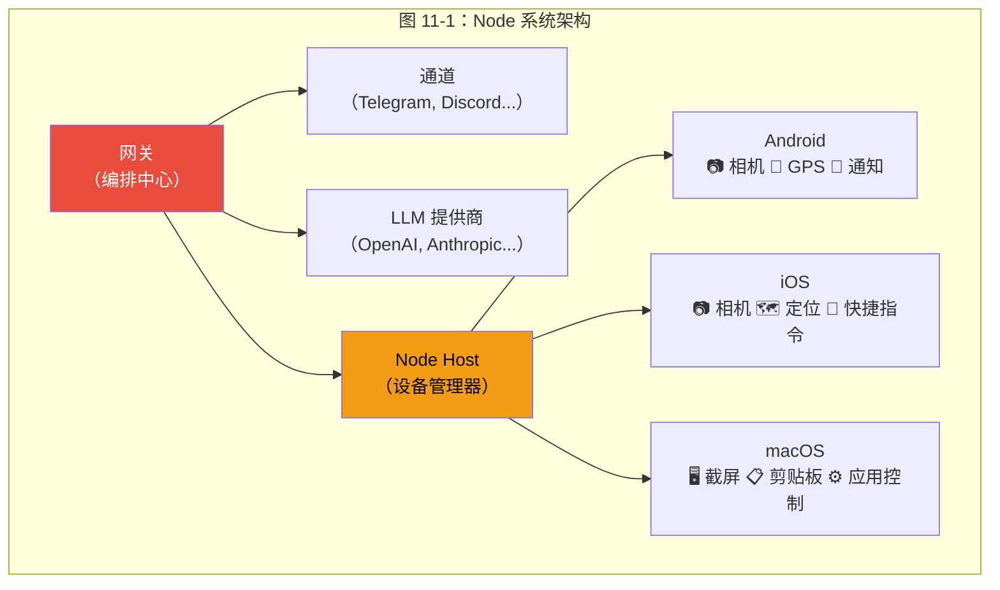
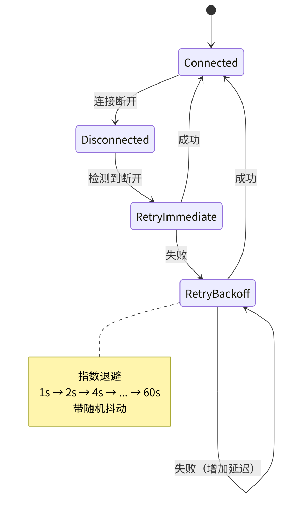
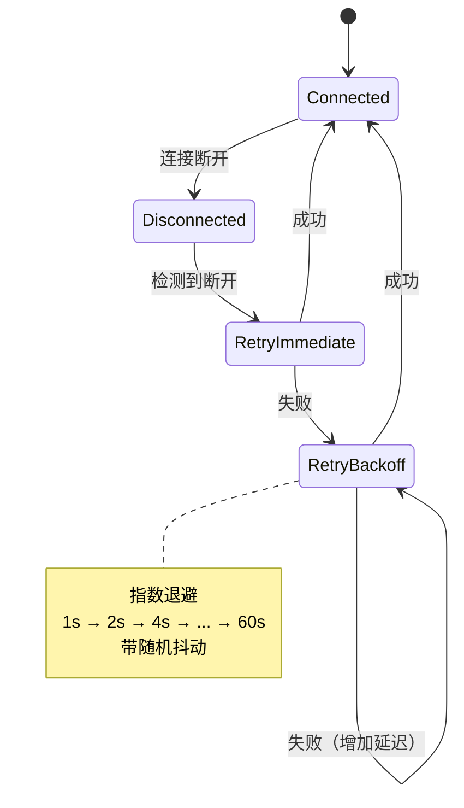
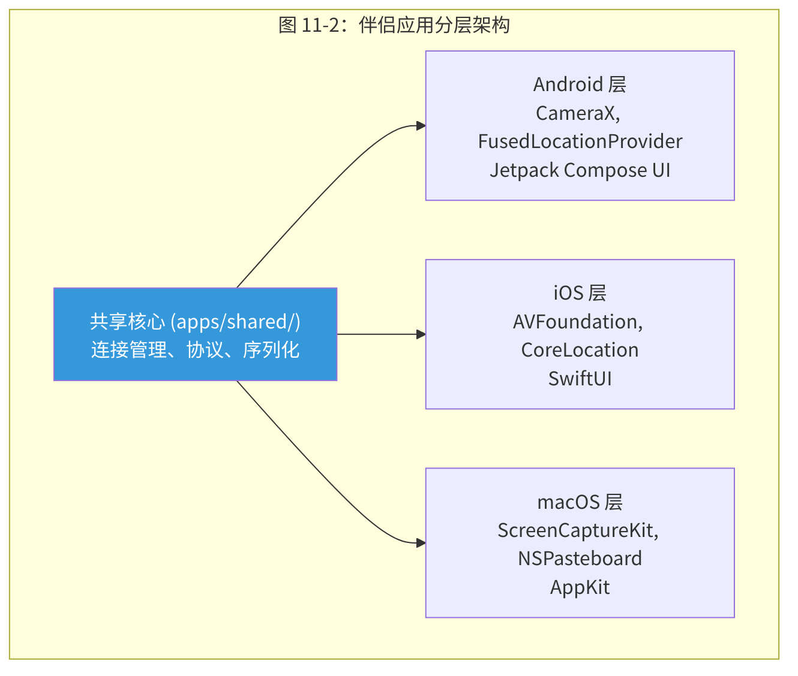
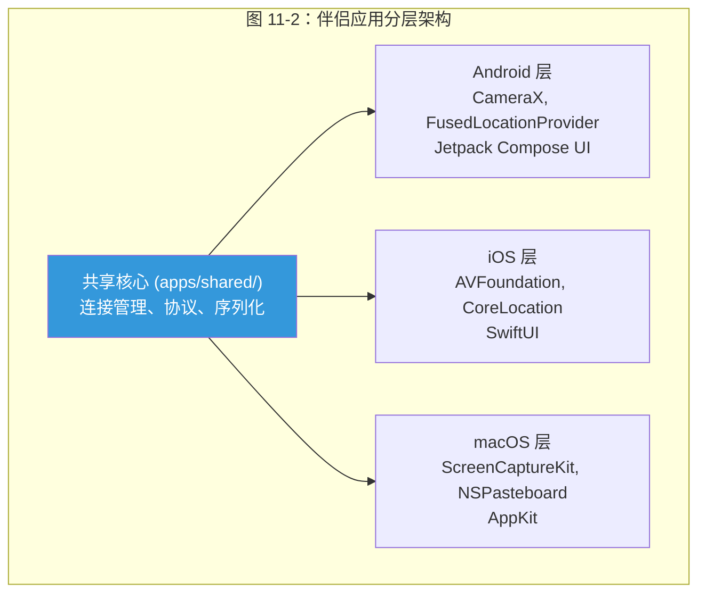

# 第11章 Node 系统与设备连接

> *"Agent 的计算基座和操作目标注定是物理分离的——服务器在弗吉尼亚，相机在北京，屏幕在东京。这不是架构缺陷，而是使用场景的本质。一切设计都必须从'设备随时会消失'这个假设出发。"*

> **本章要点**
> - 理解 Node 系统如何让 Agent 从数字世界延伸到物理世界
> - 掌握配对协议：从零信任到建立安全连接的完整流程
> - 深入基于能力的工具路由：如何将工具调用分派到正确的设备
> - 理解重连韧性设计与分布式信任模型


上一章，我们给 Agent 装上了"双手"——浏览器、Shell、搜索引擎等软件层面的工具。但这双手只能触及数字世界。如果 Agent 需要拍一张照片、读一条短信、截一个屏幕呢？

本章的 Node 系统，将 Agent 的触角从虚拟世界延伸到物理世界。

## 11.1 物理触达的问题

你的 Agent 运行在弗吉尼亚的 VPS 上。你需要它拍摄北京家门口的照片。或者读取 iPhone 上的短信验证码。或者在 MacBook 上截取应用截图。

传统 Agent 框架面对这个需求只能摊手——Agent 的世界止步于服务器的网络边界，就像困在房间里的人，再聪明也出不了门。

### 11.1.1 为什么这是一个根本性问题

这不只是"功能缺失"——它反映了一个更深层的架构假设问题。几乎所有 Agent 框架都隐含假设 Agent 运行在它需要操作的设备上。LangChain 的工具调用在本地进程中执行。AutoGPT 操作本地文件系统。这个假设在"单机 Agent"场景下是合理的，但它与现实的使用模式根本冲突。

现实是：Agent 需要运行在一个稳定、24/7 在线的环境中（VPS、云服务器）以保持持久连接和定时任务的可靠性。但它需要操作的设备——手机、笔记本、智能家居——分布在不同的物理位置，随时可能离线。**Agent 的计算基座和操作目标是物理分离的。**

OpenClaw 采取了截然不同的立场：**Agent 的世界应该延伸到运营者信任的每一台设备。** Node 系统通过安全配对的 Android、iOS 和 macOS 伴侣应用实现这一点，将手机和笔记本变成 Agent 的远程传感器与执行器——眼睛、耳朵、双手，一应俱全。

### 11.1.2 三个核心工程挑战

但"连接手机到 Agent"听起来简单，直到你面对工程现实。三个问题接踵而至：

**信任建立问题**：网关运行在 VPS 上，手机在用户口袋里，两者素未谋面。在没有共享信任根的前提下，如何确保"连接的确实是主人的手机"而不是攻击者的设备？传统的证书基础设施（CA、TLS 证书）需要预先配置，对消费者设备不可行。

**工具路由问题**：三台设备同时连接——Android 手机、iPhone 和 MacBook。Agent 调用 `camera` 时，发给谁？如果首选设备断线了呢？如果两台设备都有相机但分辨率不同呢？路由决策不是简单的"有就发"，而是一个**多因素优化问题**。

**韧性问题**：手机进电梯信号中断、切换 Wi-Fi 网络、进入飞行模式。这些不是异常情况——它们是移动设备的*常态*。Node 系统必须在"设备随时可能消失"的假设下正确工作。

> Node 系统的本质，是一个伪装成移动应用功能的**分布式系统问题**。揭开友好的 QR 码外衣，里面藏着的是每个分布式系统都要面对的老龙：共识、分区容忍和网络的永恒不可靠。

> 🔥 **深度洞察：从数字世界到物理世界的鸿沟**
>
> Node 系统解决的问题，本质上是**控制论（Cybernetics）**的核心命题——如何让一个信息处理系统影响物理世界？Norbert Wiener 在 1948 年就指出：任何控制系统都需要三个要素——传感器（感知）、处理器（决策）和执行器（行动），以及连接它们的反馈回路。OpenClaw 的 Node 系统是这个理论的完美实例：手机相机是传感器，Gateway 中的 Agent 是处理器，手机的通知/快捷指令是执行器，WebSocket 是反馈回路。这不是"连接手机"这么简单——这是赋予数字 Agent 物理存在感的哲学跨越。一个只存在于服务器上的 Agent 是一个"纯精神存在"；通过 Node 系统，它获得了"身体"——虽然这个身体分散在多台设备上，但它能看（相机）、能听（麦克风）、能触（通知推送）。

## 11.2 架构设计：网关作为编排中心

### 11.2.1 架构概览




每台连接的设备广播其**能力**——相机、GPS、通知、剪贴板、屏幕截取。网关的工具路由层使用这些能力声明将工具调用定向到适当的设备。Agent 调用 `camera` 工具时，网关检查哪些连接节点具有相机能力并据此路由。

> **关键概念：基于能力的工具路由（Capability-Based Tool Routing）**
> Node 系统不通过设备名称路由工具调用，而是通过设备声明的"能力"（如相机、GPS、剪贴板）进行匹配。Agent 调用 `camera` 工具时，系统自动查找具有相机能力的在线设备，无需知道具体是哪台手机。这种设计使得设备可以随时加入或离开，系统自动适应。

**关键设计决策**：Agent 从不直接与设备交互。它通过与浏览器自动化或命令执行相同的接口调用工具。Node 系统在工具级别是透明的——完美应用的**适配器模式**。这意味着所有工具系统的安全策略（第10章的七层管线）自动适用于设备工具，无需任何额外配置。

### 11.2.2 为什么不用 P2P 架构？

一个自然的替代方案是 P2P（点对点）架构——让设备之间直接通信，网关只负责协调发现。这种方案有明显的优势：降低网关负载、减少单点故障。

但 OpenClaw 选择了**网关中心化**架构，原因是三个关键约束：

1. **NAT 穿透**：大多数移动设备在运营商级 NAT 之后，P2P 连接需要打洞（STUN/TURN），增加了延迟和复杂性，且不保证成功。网关作为公网可达的中介自然解决了这个问题。

2. **安全审计**：所有工具调用经过网关，形成单一审计点——系统记录每次设备操作。P2P 架构中，审计日志分散在各设备上，难以集中管理。

3. **策略执行**：工具策略管线在网关中执行。设备调用一旦绕过网关，策略管线就形同虚设。P2P 架构需要将策略逻辑复制到每台设备上，增加了攻击面。

> ⚠️ **注意**：Node 设备的配对凭证（pairing token）具有时效性。如果设备长时间断线后重连失败，通常需要重新执行配对流程。建议在部署多设备场景时，记录每台设备的配对状态，并配置断线告警。

> 💡 **最佳实践**：在多设备场景中，为每台设备分配明确的角色标签（如 `office-camera`、`home-macbook`），而非依赖自动路由。这样 Agent 可以通过 `node=office-camera` 精确指定目标设备，避免工具调用被路由到意外的设备。

**权衡**：中心化架构意味着网关是单点瓶颈——所有设备通信都经过它。对于个人或小团队使用场景（OpenClaw 的主要目标用户），这个瓶颈不是问题。但如果未来需要支持企业级规模（数千台设备），可能需要引入网关集群或混合架构。

## 11.3 配对协议：从无到信任

Node 系统中最有趣的工程挑战不是设备能力本身——而是在没有先验关系的服务器和手机之间建立信任。

### 11.3.1 威胁模型

在设计配对协议之前，必须明确防什么：

- **中间人攻击**：攻击者拦截配对流程，连接自己的设备到目标网关。
- **重放攻击**：攻击者捕获并重放合法的配对请求。
- **暴力猜测**：攻击者枚举配对码直到找到有效的。
- **长期密钥泄露**：配对完成后，第三方窃取信任令牌。

### 11.3.2 质询-响应协议

OpenClaw 的配对协议（`src/pairing/`）使用通过短时配对码中介的质询-响应机制：

1. **码生成**：网关生成随机配对码（包含网关地址、配对密钥和有效期信息），编码为 QR 码或文本码。码的有效期 5 分钟——足够用户完成扫描，但短到暴力猜测不可行。
2. **码传递**：通过物理渠道传递（用户眼睛看到 QR 码，手机相机扫描）。这一步天然抗远程攻击——攻击者必须物理接近才能截获码。
3. **质询请求**：移动应用扫描码后，向网关发送附带设备信息的质询请求。
4. **验证**：网关确认配对码未过期、未曾使用，生成长期信任令牌。
5. **令牌下发**：信任令牌返回给设备，后续所有通信使用此令牌认证。

#### 数字化的配对流程示例

用一个具体的数字化示例走完整个流程，帮助你建立直觉：

```
步骤1: 网关生成配对码
  ├─ 生成 pairSecret（32字节随机数），设定 300 秒过期
  └─ 构造 URL: openclaw://pair?host=...&secret=...&exp=... → 编码为 QR 码

步骤2: 用户扫码 → 手机获得 host、secret、exp

步骤3: 手机 POST /pair/challenge
  { "pairSecret": "a7f3c9...", "deviceId": "android-pixel7-x8k2", "capabilities": [...] }

步骤4: 网关验证
  ├─ 检查 secret 匹配 ✅ → 未过期 ✅ → 未使用 ✅
  ├─ 标记已使用（防重放）
  └─ 生成 trustToken = HMAC-SHA256(serverKey, deviceId + timestamp)

步骤5: 返回 { trustToken, gatewayId, wsEndpoint }

后续: 手机用 trustToken 建立 WebSocket 长连接
  Authorization: Bearer b9e4d2...f7a8
```

注意几个关键的安全属性：
- **配对码 5 分钟过期**：即使攻击者事后获得码也无法使用
- **一次性使用**：码在步骤4后即失效，防止重放攻击
- **物理渠道传递**：攻击者必须在场才能看到 QR 码
- **信任令牌独立于配对码**：长期令牌使用不同的密码学材料生成，即使配对码泄露也不影响已建立的信任

### 11.3.3 为什么选择短时码而不是证书？

**替代方案 A：预共享密钥（PSK）**。运营者将密钥手动输入到手机配置中。简单但痛苦——输入一个 32 字符的密钥在手机上是折磨。

**替代方案 B：证书基础设施**。网关作为 CA 签发客户端证书。安全性强，但需要理解 PKI 的运营者才能配置——这不是大多数 OpenClaw 用户的画像。

**替代方案 C：配对码（最终选择）**。类似蓝牙配对——简短、临时、通过物理渠道传递。安全性适中（依赖物理渠道安全和码的短时有效期），但极其简单。

选择配对码的根本原因是**受众**。OpenClaw 的目标用户是技术人员（他们理解安全概念），但不一定是安全专家（他们不想管理证书链）。配对码在"足够安全"和"足够简单"之间取得了正确的平衡。

### 11.3.4 逐设备权限模型

信任令牌的权限在配对时根据设备类型和运营者配置确定。Android 手机可能获得相机和 GPS 权限但不包括文件系统访问。macOS 伴侣可能获得截屏和剪贴板权限。

这种**能力白名单**模型（而非默认允许一切）确保：
1. 即使设备遭到入侵，攻击者也只能访问该设备明确获授的能力。
2. 运营者对"这台设备能做什么"有清晰的、可审计的认知。
3. 新能力默认不可用——必须显式授予。

## 11.4 传输层：为什么选择 WebSocket？

### 11.4.1 候选方案分析

在选择网关与设备之间的传输协议时，OpenClaw 评估了四种方案：

**HTTP 轮询**：设备定期向网关请求"有没有给我的指令？"。实现最简单，但延迟高（取决于轮询间隔）、浪费带宽（大多数轮询返回空）、耗电（对移动设备致命）。

**HTTP 长轮询**：请求挂起直到有数据或超时。比普通轮询好，但每次都需要重新建立连接，TCP 握手和 TLS 协商的开销在移动网络上显著。

**Server-Sent Events（SSE）**：单向流——服务器推送事件到客户端。只能单向，设备不能主动向网关发送消息（如能力变更通知）。

**WebSocket**：全双工连接。建立一次后，双方可以随时发送消息，无需重新握手。

### 11.4.2 WebSocket 的决定性优势

OpenClaw 选择 WebSocket，基于四个决定性因素：

**双向性**：网关和节点都需要主动发起消息。网关需要向设备下发工具调用指令；设备需要向网关上报能力变更、传感器数据、操作结果。WebSocket 的全双工特性天然匹配。

**NAT 穿透**：运营商级 NAT 后的移动设备无法接受入站连接。WebSocket 连接由节点发起（出站），无需端口转发即可穿越 NAT 和防火墙。一旦连接建立，双向通信自动工作。

**跨平台兼容**：相同的 WebSocket 协议适用于 Node.js（网关端）、Android（OkHttp）、iOS（URLSessionWebSocketTask）和 macOS（Foundation）。不需要为每个平台维护不同的通信栈。

**内建存活检测**：WebSocket 的 ping/pong 帧天然具备协议级连接健康检查能力，无需应用层心跳即可捕获死连接。这在移动场景中尤其关键——手机钻进地铁隧道，ping/pong 超时在秒级即可感知断连。

### 11.4.3 WebSocket 的局限与应对

**局限1：缺乏消息排序保证**。TCP 保证字节级有序，但 WebSocket 消息之间没有应用层序列号。如果一端发送了消息 A 和 B，另一端保证按顺序收到，但没有内建机制让接收端知道"这是消息 #42"。

**应对**：OpenClaw 在节点协议中引入应用层序列号。每条消息附带递增序号，接收端验证连续性——发现间隙，立即请求重传。

**局限2：缺乏投递确认**。WebSocket 的 `send()` 只保证消息进入操作系统的发送缓冲区，不保证对端收到。

**应对**：关键操作（工具调用、能力变更）使用应用层确认（ACK）消息。发送方保留未确认消息的副本，超时未收到 ACK 时重传。

**局限3：重连时的状态恢复**。WebSocket 没有"恢复连接"的概念——断了就是断了，重连是一条全新的连接。

**应对**：重连时，设备重新发送完整的能力清单和最后确认的序号。网关据此进行状态对账和消息重放（见 11.6 节）。

## 11.5 基于能力的工具路由

当 Agent 调用需要设备能力的工具时，路由决策比简单的"找到有这个能力的设备就发"要复杂得多。

### 11.5.1 四因素路由算法

路由决策考虑四个因素，按优先级排列：

**因素1：能力匹配**。只有广播所需能力的节点进入候选集。这是硬过滤——没有相机能力的设备永远不会收到 `camera` 调用。

**因素2：运营者偏好**。运营者可以为每种能力配置首选设备：

```yaml
nodes:
  preferences:
    camera: [android-phone, iphone]      # 优先用 Android，iPhone 备选
    notifications: [android-phone, macbook] # 通知优先手机
    location: [android-phone]             # 位置只用手机
    screenshot: [macbook]                 # 截图只用 Mac
```

这种显式偏好反映了运营者对自己设备的了解——比如 Android 手机的后置相机比 MacBook 的前置相机分辨率更高。

**因素3：可用性**。路由跳过已断开的节点。最近重连的节点短暂降低优先级以等待状态对账完成——避免向刚重连但可能状态不一致的设备发送指令。

**因素4：会话亲和性**。多步操作在整个会话期间保持对特定节点的亲和性。想象这个场景：Agent 先拍照（发给 Android），然后需要编辑这张照片。如果第二步发给了 iOS，照片在 iOS 上不存在。会话亲和性确保同一工作流的相关操作发给同一台设备。

路由对 Agent 完全透明——Agent 只需调用 `camera`，网关决定发送到哪里。这种**位置透明性**是分布式系统的经典设计目标。

### 11.5.2 路由失败处理

如果所有具有所需能力的设备都不可用怎么办？路由系统有三种降级策略：

1. **等待重连**：如果设备最近断开（&lt;30 秒），等待它重连。这适用于短暂的网络中断。
2. **返回能力不可用**：告诉 Agent"当前没有具备相机能力的设备在线"。Agent 可以调整策略（例如改用搜索引擎找图片）。
3. **排队请求**：将工具调用放入队列，设备重连后执行。适用于非实时的操作（如"在方便时拍一张照片"）。

选择哪种策略取决于工具调用的 urgency 参数——实时请求用策略 1 或 2，延迟容忍请求用策略 3。

## 11.6 重连与韧性

移动设备频繁离线——网络切换、睡眠模式、隧道过渡。这不是异常——这是常态。Node 系统的韧性设计以"设备必然会断线"为前提。

### 11.6.1 多阶段重连策略






1. **即时重试**：检测到断开后立即首次重连尝试。网络闪断时通常立即恢复。
2. **指数退避**：后续尝试使用 1s → 2s → 4s → ... → 60s 最大值。随机抖动防止"惊群效应"（多台设备同时重连）。
3. **能力重新公告**：重连时节点重新发送完整能力清单。因为设备可能在断线期间发生了变化——用户可能关闭了相机权限、卸载了某个应用。
4. **状态对账**：网关比较新的能力公告与缓存的状态，解决分歧。
5. **命令重放**：断开期间排队的命令按顺序重放。

### 11.6.2 状态对账的深层问题

状态对账看似简单——比较两个能力列表，找出差异。但有一个微妙的时序问题：

设备断线时，网关缓存了它的"最后已知状态"。在断线期间，Agent 可能基于这个缓存状态做了路由决策（比如把一个 GPS 请求路由到了队列中，等待这台设备重连）。设备重连时，如果它的能力变了（比如 GPS 权限被关了），队列中的请求应该怎么处理？

OpenClaw 的处理是：重连时的状态对账**不只是更新缓存**——它还回溯检查队列中是否有基于旧状态排队的请求，如果有，将它们重新路由到其他具有所需能力的设备，或返回错误。

这种"追溯一致性"确保了断线-重连过程中不会产生"鬼队列"——基于过时信息积累的、永远无法执行的请求。

### 11.6.3 重连对 Agent 的透明性

整个重连-重传-对账流程对 Agent 完全透明。Agent 发出 `camera` 调用后，它只会看到两种结果：照片（成功）或错误信息（设备不可用）。它不知道中间经历了断线、重连、状态对账和命令重放。

这种透明性不是"锦上添花"——它是**必要的**。如果 Agent 需要处理设备连接状态的细节（"如果设备断线就等待重连，重连后检查能力是否还在，然后重试..."），它的提示词会被基础设施逻辑淹没，留给实际任务的上下文窗口空间所剩无几。

## 11.7 分布式信任的深层思考

Node 系统实质上是一个**分布式信任系统**——它需要在去中心化的、可能不稳定的参与者之间建立和维护信任关系。这引出了几个深层设计问题。

### 11.7.1 信任的动态性

配对时建立的信任不是永恒的。设备可能丢失、遭到入侵或转手。信任令牌的管理需要考虑：

- **令牌撤销**：运营者必须能随时撤销特定设备的信任令牌。`openclaw nodes revoke <device-id>` 立即使令牌无效。
- **令牌轮换**：令牌使用越久，泄露风险越高。定期轮换缩短暴露窗口。
- **设备状态验证**：每次重连时验证设备的完整性（操作系统版本、应用版本），检测可能的篡改。

### 11.7.2 与微服务架构的类比

Node 系统的很多设计模式在微服务架构中有直接对应：

| Node 系统概念 | 微服务对应 |
|-------------|----------|
| 配对协议 | 服务注册（Consul、etcd） |
| 能力声明 | 健康检查 + 元数据注册 |
| 工具路由 | 服务发现 + 负载均衡 |
| 会话亲和性 | 粘性会话（Sticky Sessions） |
| 重连 + 重传 | 断路器模式 + 重试策略 |
| 状态对账 | 最终一致性协调 |

这不是巧合——两者本质上解决同一类问题：**在不可靠的网络上协调分布式组件**。OpenClaw 的创新在于将这些企业级分布式系统模式应用到了消费级设备连接场景。

### 11.7.3 信任传递问题

一个更微妙的安全问题：如果 Agent 通过设备 A（手机）拍摄了一张照片，然后指示设备 B（笔记本）将照片发送到外部服务器。在这个操作中，**数据经过了网关**——网关是否应该记录（或审查）跨设备数据流？

OpenClaw 目前的设计是"信任但审计"——数据在设备间透明流动，但审计日志记录所有跨设备操作。这个设计选择优先了性能（不需要在网关解析所有数据），但可能在合规性要求高的场景中需要增强。

## 11.8 跨平台伴侣应用

### 11.8.1 共享核心的分层架构

伴侣应用（`apps/android`、`apps/ios`、`apps/macos`）采用共享核心（`apps/shared/`）的分层架构：






| 平台 | 关键能力 | 平台特定 API |
|------|---------|-------------|
| Android | 相机、GPS、传感器、通知 | CameraX、FusedLocationProvider |
| iOS | 相机、定位、Siri 快捷指令 | AVFoundation、CoreLocation |
| macOS | 截屏、剪贴板、应用控制 | ScreenCaptureKit、NSPasteboard、AppleScript |

### 11.8.2 平台特性与限制

每个平台有独特的限制需要适配：

**Android**：后台位置访问需要 `ACCESS_BACKGROUND_LOCATION` 权限（Android 10+），审核严格。应用在后台时需要前台服务保活以维持 WebSocket 连接。

**iOS**：后台任务执行时间有严格限制（约 30 秒）。应用进入后台后，系统可能终止 WebSocket 连接。需要利用 `BGTaskScheduler` 定期唤醒应用重连。

**macOS**：屏幕录制需要用户在系统设置中显式授权。沙箱限制了对其他应用的控制能力。AppleScript 自动化需要辅助功能权限。

这些限制不是 Bug——它们是操作系统对隐私和安全的保护。OpenClaw 的伴侣应用需要在这些限制内工作，同时向 Agent 提供尽可能丰富的能力。这是"理想的功能规格"与"现实的平台约束"之间的持续协商。

## 11.9 实战推演：手机远程控制家庭设备

让我们用一个贴近生活的场景，将 Node 系统的所有设计决策串联成一个完整的故事。

### 11.9.1 场景：出差在外，远程查看家门口

你在北京出差，VPS 上的 OpenClaw 运行着你的个人助手 Agent。你通过 Telegram 对它说："帮我看看成都家门口有没有快递。"

### 11.9.2 幕后发生了什么

```text
1. [Telegram 通道] 消息到达 Gateway
2. [Agent 推理] 需要相机能力 → 调用 camera 工具
3. [工具路由] 四因素路由算法启动:
   ├─ 能力匹配: 哪些节点有相机? → Android手机(成都家中WiFi)、MacBook(北京随身)
   ├─ 运营者偏好: camera 首选 [android-phone] ✅
   ├─ 可用性: android-phone 在线 ✅ (后台前台服务保持WebSocket)
   └─ 会话亲和性: 无历史亲和
   → 路由决策: 发送到 android-phone

4. [WebSocket 传输] Gateway → android-phone: { "action": "camera", "params": { "facing": "back" } }
5. [Android 伴侣] CameraX 拍照 → 压缩 → 返回 Base64 图片
6. [Agent 推理] 调用 image 工具分析照片 → "门口有一个京东快递箱，看起来已放置较长时间"
7. [Telegram 通道] 回复用户，附带照片和分析结果
```

### 11.9.3 断线场景

假设手机在拍照过程中进入了电梯（WiFi 断开）：

```text
4.5. [WebSocket 断开] ping/pong 超时（3秒）→ Gateway 检测到断连
     → android-phone 状态变为 "disconnected"
     → 相机请求进入重试队列

5.1. [重连策略] 手机出电梯 → 即时重试 → WebSocket 重新建立
5.2. [状态对账] 手机重发能力清单 → 相机能力仍在 ✅
5.3. [命令重放] 队列中的相机请求重新发送
5.4. [正常完成] 手机拍照并返回

总用户感知: 回复延迟了约 30 秒，但最终收到了照片
Agent 感知: 透明——只看到 camera 调用最终返回了结果
```

### 11.9.4 降级场景

如果手机完全不在线（关机了）：

```text
3. [路由失败] android-phone 离线 + 超过 30 秒未重连
   → 路由器检查备选: MacBook 有前置相机，但在北京（不在成都家中）
   → 路由器判断: MacBook 的相机拍不到成都的门口
   → 返回给 Agent: "当前没有可用的相机设备在家庭网络中"

4. [Agent 自适应] 回复用户: "你成都家里的手机似乎离线了，无法拍照。
   我可以帮你查看是否有京东/顺丰的配送记录，看最近是否有快递送达？"
```

> Node 系统最深刻的设计洞察是：**失败不是异常——它是移动设备的常态**。系统不是在"正常运行"和"异常处理"之间切换，而是在"设备可用"和"设备不可用"这两个同样正常的状态之间平滑流转。就像人类不会因为左手暂时麻了就惊慌失措——你只是自然地用右手，等左手恢复。

## 11.10 远程节点的多元应用场景

前文的"出差查看家门口快递"只是 Node 系统最直觉的用法。实际上，分布式设备网络打开了大量传统 Agent 无法触及的使用场景。以下按领域分类，展示 Node 系统在不同场景中的独特价值。

### 11.10.1 开发者工作流：跨机器的统一 Agent

**场景**：一名工程师有三台设备——办公室台式机（高性能编译）、通勤笔记本（轻量编辑）和家中服务器（CI/CD）。她希望一个 Agent 统一管理所有三台机器的开发环境。

```yaml
nodes:
  preferences:
    exec: [office-desktop, home-server, laptop]  # 编译优先用台式机
    screenshot: [laptop]                          # 截屏优先用笔记本
    clipboard: [laptop, office-desktop]           # 剪贴板跟随当前设备
```

Agent 收到"帮我在 staging 环境跑一下集成测试"的指令时：
1. 工具路由发现 `exec` 首选 `office-desktop` → 检查在线状态
2. 工作日白天 `office-desktop` 在线 → 路由到台式机
3. 周末 `office-desktop` 离线 → 自动降级到 `home-server`
4. 测试完成后，结果通过 Telegram 通道发送给工程师

这种模式让 Agent 成为开发者的**跨设备统一入口**——无论你在哪里、用哪台设备，一条消息即可触发正确设备上的操作。

### 11.10.2 家庭自动化：不依赖云服务的智能管家

**场景**：家中有一台旧 Android 手机作为"家庭哨兵"，一台 MacBook 作为媒体中心，Agent 运行在家庭 NAS 上。

```text
用户 (Telegram): "家里现在什么温度？暖气是不是开了？"
Agent → 路由到 android-sentinel (GPS/传感器能力)
  ├─ 读取温度传感器: 22.3°C
  ├─ 拍摄暖气控制面板照片
  └─ 返回: "室温 22.3°C，暖气面板显示运行中，设定温度 23°C"
```

与云端智能家居平台（Alexa、HomeKit）相比，这种方案的优势在于：
- **零订阅费**——不依赖第三方云服务
- **隐私自主**——数据不出家门
- **高度可定制**——Agent 的行为由你的 AGENTS.md 决定，不受厂商限制

### 11.10.3 远程监控：服务器巡检与告警

**场景**：运营者在多地部署了 3 台 VPS，每台运行不同的服务。一台 macOS 伴侣连接到本地的网络交换机，用于监控内网。

```yaml
nodes:
  devices:
    vps-tokyo:    { capabilities: [exec, filesystem] }
    vps-frankfurt: { capabilities: [exec, filesystem] }
    vps-virginia:  { capabilities: [exec, filesystem] }
    office-mac:    { capabilities: [screenshot, exec, clipboard] }
```

心跳任务可以轮询所有节点：

```markdown
<!-- HEARTBEAT.md -->
- [ ] 节点健康: 逐一检查 vps-tokyo/vps-frankfurt/vps-virginia 的磁盘、内存、进程
- [ ] 网络监控: 通过 office-mac 执行 ping/traceroute 检查跨节点连通性
- [ ] 如任一节点离线超过 5 分钟 → 立即告警
```

Agent 不只是检查单台服务器——它通过 Node 网络获得了**全局视野**，能发现"从东京到法兰克福的延迟异常升高"这类跨节点问题。

### 11.10.4 内容创作：多设备素材采集

**场景**：自媒体创作者通过 Agent 协调多设备拍摄素材。手机拍视频，MacBook 截取网页素材，Agent 统一整理。

```text
用户: "帮我准备明天的视频素材：用手机拍一段书桌的视频，再从 Mac 上截取三个竞品网站的首页"
Agent → 分解为两个并行任务:
  ├─ android-phone: camera(mode: "video", duration: 15s)
  └─ macbook: 
      ├─ browser(navigate: "competitor1.com") → screenshot
      ├─ browser(navigate: "competitor2.com") → screenshot
      └─ browser(navigate: "competitor3.com") → screenshot
Agent → 整理素材清单，返回预览缩略图
```

### 11.10.5 应用场景总结

| 场景类别 | 关键能力 | 典型设备组合 | 独特价值 |
|---------|---------|------------|---------|
| 跨机器开发 | exec, filesystem | 台式机 + 笔记本 + 服务器 | 统一入口，自动路由到最优设备 |
| 家庭自动化 | camera, sensors | 旧手机 + NAS | 零成本、隐私自主 |
| 多节点监控 | exec, screenshot | 多台 VPS + 本地 Mac | 跨节点全局视野 |
| 内容创作 | camera, browser | 手机 + 笔记本 | 多设备并行采集 |
| 远程协助 | screenshot, clipboard | 家人手机 + 你的 Agent | 远程帮家人解决设备问题 |

> Node 系统的应用场景远不止"拍照"——它让 Agent 从一个局限于单台服务器的软件进程，进化为一个跨越物理空间的分布式感知-执行网络。每多连接一台设备，Agent 的能力就多一个维度。

## 11.11 框架对比与行业分析

| 特性 | OpenClaw | LangChain | AutoGPT | CrewAI | Semantic Kernel |
|------|----------|-----------|---------|--------|-----------------|
| 移动设备集成 | ✅ 原生应用 | ❌ | ❌ | ❌ | ❌ |
| 安全配对协议 | ✅ 质询-响应 | — | — | — | — |
| 基于能力的路由 | ✅ 多因素 | — | — | — | — |
| 离线韧性 | ✅ 排队+重放 | — | — | — | — |
| 跨平台共享核心 | ✅ | — | — | — | — |

Node 系统是 OpenClaw 最独特的差异化因素。没有其他主要 Agent 框架提供原生移动设备集成——它们的 Agent 局限于服务器的网络边界。

### 11.11.1 为什么其他框架不做？

不是因为技术不可行，而是因为**定位不同**。LangChain 和 Semantic Kernel 定位为开发框架——它们提供构建块，开发者自己组装。设备连接需要完整的端到端方案（协议、应用、安全），不适合以"构建块"形式提供。

AutoGPT 和 CrewAI 定位为自治 Agent——它们关注 Agent 的"思考"能力而非"感知"能力。设备连接本质上是"感知扩展"，不在它们的架构假设中。

OpenClaw 作为**运行时系统**（而非框架），有动机和能力提供完整的端到端方案。运行时负责整个 Agent 的生命周期，自然包括它与物理世界的交互。

## 11.12 快速上手：从零配置 Node 连接

对于想要实际接入设备的读者，以下是从零开始的完整步骤。

### 11.12.1 步骤一：确认 Gateway 配置

确保 Gateway 的绑定地址允许外部连接（手机需要通过网络访问 Gateway）：

```yaml
# openclaw.yaml
gateway:
  bind: "0.0.0.0"       # 允许外部连接
  port: 3000
  remote:
    url: "https://your-vps.example.com:3000"  # 手机用来连接的公网地址
```

> ⚠️ 如果 Gateway 在 NAT 后面（如家庭路由器），需要配置端口转发或使用 Tailscale/WireGuard 等隧道方案。

### 11.12.2 步骤二：生成配对码

```bash
openclaw nodes pair
```

终端会显示一个 QR 码和一个文本码（备用）。QR 码有效期 5 分钟。

### 11.12.3 步骤三：安装伴侣应用并扫码

在手机上安装 OpenClaw 伴侣应用，打开后点击"扫码配对"。扫描 QR 码后，应用会自动：
1. 向 Gateway 发送配对请求
2. 接收信任令牌
3. 建立 WebSocket 长连接
4. 上报设备能力（相机、GPS、通知等）

### 11.12.4 步骤四：验证连接

```bash
openclaw nodes list
```

输出示例：
```
ID                  STATUS    CAPABILITIES          SINCE
android-pixel7      online    camera,gps,notify     2m ago
macbook-pro         online    screenshot,clipboard  5m ago
```

### 11.12.5 步骤五：测试设备工具

通过任何已连接的通道（如 Telegram）向 Agent 发送：
```
帮我用手机拍一张照片
```

Agent 会自动路由 `camera` 调用到在线的 Android 设备，返回照片。

### 11.12.6 常见问题排查

| 问题 | 可能原因 | 解决方案 |
|------|---------|---------|
| 扫码后连接失败 | Gateway 不可达 | 检查 `gateway.remote.url` 是否正确，手机能否访问该地址 |
| 设备频繁断线 | 手机后台限制 | Android：开启前台服务；iOS：配置 BGTaskScheduler |
| 配对码过期 | 超过 5 分钟 | 重新执行 `openclaw nodes pair` |
| 能力不显示 | 权限未授予 | 在手机系统设置中授予相机/位置等权限 |

## 11.13 历史演进

Node 系统的演进清晰地反映了从简单到复杂的工程演变：

**阶段1：纯 HTTP 远程控制**。最初的设备集成是简单的 HTTP API——网关调用设备的 HTTP 端点执行操作。简单但存在 NAT 穿透问题和延迟问题。

**阶段2：WebSocket 持久连接**。引入 WebSocket 解决了 NAT 穿透和实时性问题，但没有正式的配对协议——设备通过手动配置的共享密钥连接。

**阶段3：配对协议和能力系统**。引入 QR 码配对和能力声明机制，使得设备管理从"手动配置"变为"扫码即连"。

**阶段4：韧性工程**。随着真实用户的使用反馈，添加了指数退避重连、状态对账、命令重放等韧性机制。这些不在最初设计中——它们是从生产环境中学到的教训。

## 11.14 关键源码文件

| 目录/文件 | 用途 |
|----------|------|
| `src/node-host/` | 节点托管和能力管理 |
| `src/node-host/config.ts` | 节点配置和权限定义 |
| `src/node-host/invoke.ts` | 工具调用路由到设备 |
| `src/node-host/runner.ts` | 设备连接生命周期管理 |
| `src/node-host/exec-policy.ts` | 设备级命令执行策略 |
| `src/pairing/` | 设备配对协议和信任存储 |
| `apps/shared/` | 跨平台共享逻辑 |
| `apps/android/`、`apps/ios/`、`apps/macos/` | 平台伴侣应用 |

## 11.15 本章小结

Node 系统将 OpenClaw 的触达从云端延伸到物理世界。通过安全配对、基于能力的多因素路由和韧性 WebSocket 通信，Agent 像使用 Web 搜索或命令执行一样自然地获取相机、GPS、屏幕和设备控制的访问。

**核心洞察**：设备连接是**分布式系统问题**，不是移动开发问题。信任建立对应服务注册。能力声明对应健康检查。工具路由对应服务发现。重连重传对应断路器模式。状态对账对应最终一致性。移动应用是用户看到的表面；底层的分布式系统工程才是使它们可靠的关键。

OpenClaw 的独特洞察是：**Agent 的边界不应该是服务器的网络边界——它应该延伸到运营者信任的每一台设备**。这个洞察将一个"不错的功能"提升为一种**架构范式**：Agent 作为分布式感知-执行网络的编排者，而非局限于单台机器的软件进程。

> **Agent 的边界不应该是服务器的网络边界——它应该延伸到运营者信任的每一台设备。** 大脑不在手上，但手听大脑的话。Agent 不在手机上，但手机是 Agent 的眼睛和手指。Node 系统的本质，就是把神经网络从大脑延伸到四肢。

Node 系统体现了**运行时而非框架（Runtime over Framework）**的核心哲学——设备管理、配对、重连、状态对账全部由 Gateway Daemon 自动处理，而不是留给开发者手动实现。同时，**渐进式复杂度（Progressive Disclosure）**确保不需要设备连接的用户完全感知不到这个子系统的存在。

工具系统和 Node 系统分别赋予了 Agent 在数字世界和物理世界的行动能力，但它们都有一个共同的前提：需要有人先发起请求。下一章将打破这层限制——定时任务与自动化让 Agent 从"被动应答"进化为"主动行动"。

### 思考题

1. **概念理解**：Node 系统的设备配对为什么采用"加密令牌 + 时间窗口"而非简单的密码认证？这种设计如何防止中间人攻击？
2. **实践应用**：如果要将一个智能家居设备（如智能灯泡）接入 OpenClaw Node 系统，你需要在设备端实现哪些通信协议？WebSocket 长连接在弱网环境下如何保证可靠性？
3. **开放讨论**：Agent 控制物理设备带来了独特的安全挑战——数字世界的错误可以撤销，物理世界的操作往往不可逆。你认为 Node 系统应该如何平衡"自动化便利"和"物理安全"？

### 📚 推荐阅读

- [WebSocket RFC 6455](https://datatracker.ietf.org/doc/html/rfc6455) — WebSocket 协议规范，理解 Node 传输层的技术基础
- [Matter (Connected Home over IP)](https://csa-iot.org/all-solutions/matter/) — 智能家居设备连接标准，IoT 设备配对协议的业界实践
- [Tailscale 架构](https://tailscale.com/blog/how-tailscale-works) — 理解设备组网与安全连接的现代方案
- [Web of Things (W3C)](https://www.w3.org/WoT/) — W3C 的物联网标准，设备描述与交互的规范化参考
- [Home Assistant 开发文档](https://developers.home-assistant.io/) — 开源智能家居平台的设备集成模式
