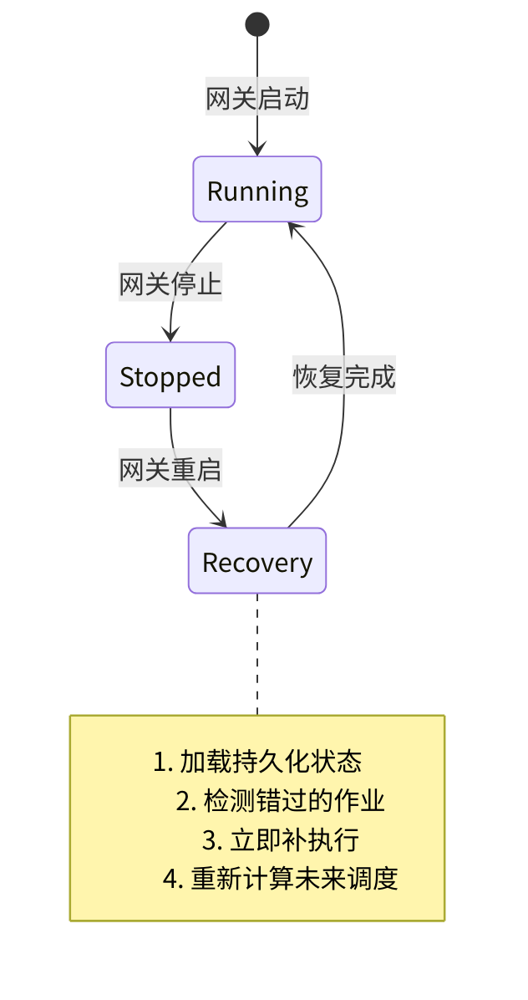
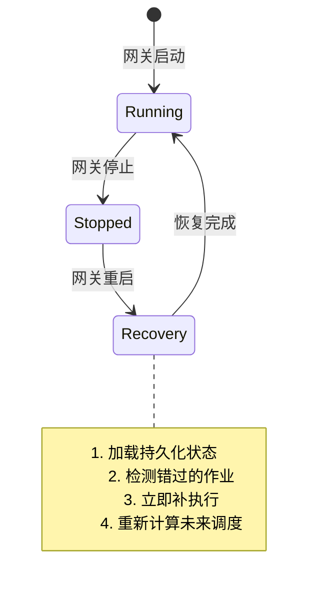
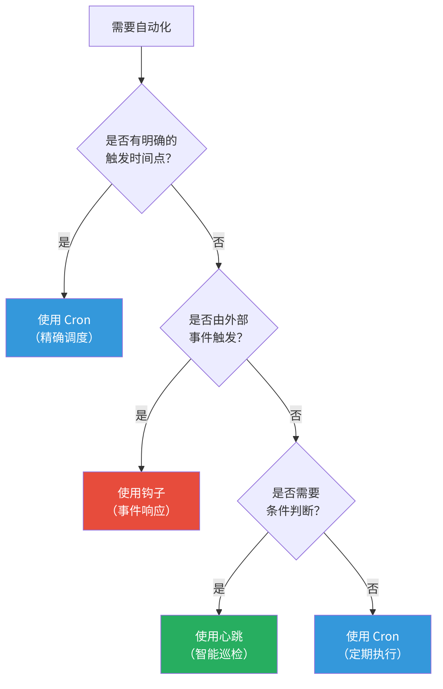
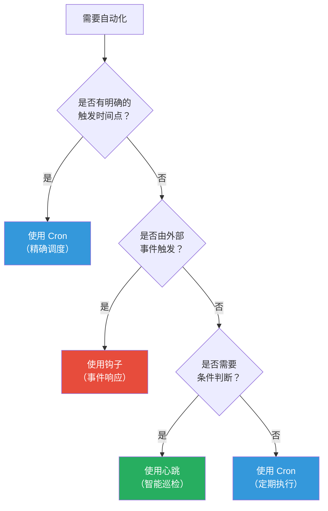

# 第12章 定时任务与自动化

> *"演示 Agent 与生产 Agent 的区别往往不是智能——而是主动性。一个不会自己巡逻的保安，和一个等你喊了才来的消防员，本质上一样不可靠。"*

> **本章要点**
> - 理解被动 Agent 与主动 Agent 的哲学分野
> - 掌握三种自动化机制：Cron 定时触发、心跳周期检查、事件钩子响应
> - 理解三种机制的协同选择策略与适用场景
> - 思考主动 Agent 的伦理考量与安全边界


前两章赋予了 Agent 行动的能力：工具系统是软件层的双手，Node 系统是物理层的感官。但这些能力都有一个共同的前提——**需要有人发起请求**。如果没有人说话，Agent 就安静地等着。

一个真正有用的助手，不应该只会接球，还要会主动传球。

## 12.1 被动 Agent 与主动 Agent 的哲学分野

### 12.1.1 问题的本质

大多数 Agent 框架将 Agent 设计为**响应式系统**：用户提问，Agent 回答。一问一答，周而复始。这种设计背后的假设是——Agent 是工具，工具等待使用。

但想象一个真正优秀的助手会做什么——早上八点，你还没醒，它已经检查了收件箱中的紧急邮件、扫描了 GitHub 上的关键 Issue、审查了服务器指标，并在 Telegram 中留下一条精炼的摘要："一切正常，但 staging 磁盘使用率达到 87%——建议今天清理。"

这不是被动响应，而是**主动巡逻**。就像一位尽职的夜间保安，不需要有人报警才巡楼，而是按时按路线主动巡查，发现异常才叫醒你。

> 被动的 Agent 是秘书——电话响了才接。主动的 Agent 是管家——你醒来时咖啡已经泡好，日程已经整理完毕，车已经预热。

> 🔥 **深度洞察：主动性是智能的试金石**
>
> 从认知科学的角度看，被动响应与主动行动之间的鸿沟，恰恰是**反射弧与前额叶皮层**的区别。膝跳反射是被动的——刺激来了，反应就来。但人类的真正智能体现在"预判"——看到乌云就带伞，不需要等到淋湿。这种预判能力在军事中叫做"OODA 循环"（观察-定向-决策-行动），其核心洞察是：谁能更快完成循环，谁就掌握主动权。OpenClaw 的 Cron/心跳/钩子三件套，本质上就是 Agent 的 OODA 循环基础设施——Cron 是定时"观察"，心跳是条件"定向"，钩子是事件"决策"。没有这套基础设施，Agent 永远在被动反应；有了它，Agent 开始真正"思考"时间维度上的策略。

### 12.1.2 "如果不这样设计会怎样？"

假设 OpenClaw 只有响应式能力，没有任何自动化机制。运营者想实现"每天早上 9 点发送待办总结"，唯一的办法是：

**方案 A：外部 Cron + API 调用**。在系统 crontab 中添加一条规则，调用 OpenClaw 的 HTTP API 发送消息。问题：系统 cron 不了解 Agent 的上下文（当前模型、活跃会话、技能配置）；每次调用都是无状态的"冷启动"；需要管理两套配置（系统 cron + OpenClaw）。

**方案 B：持久脚本**。写一个 Python 脚本，循环等待到 9 点然后调用 API。问题：又一个需要部署、监控和维护的进程；崩溃了谁来重启它？

**方案 C：运营者手动触发**。每天早上手动问 Agent。问题：这正是我们试图自动化的事情——让人去触发自动化本身就是反模式。

三种方案都不令人满意，因为它们把"何时行动"的决策放在了 Agent 之外。Agent 知道自己有哪些技能、连接了哪些通道、当前用什么模型——它是最适合做调度决策的实体。**定时任务应该是 Agent 的内建能力，而非外部附加物。**

### 12.1.3 主动性的三个维度

实现主动性需要大多数框架完全缺乏的基础设施：

1. **时间感知**：在特定时间或间隔触发动作的能力。
2. **条件判断**：判断是否值得行动——不是每次都要做事，有时"一切正常"也是有价值的信息。
3. **打扰智能**：判断何时值得打扰人类、何时应该保持沉默——凌晨三点的非紧急通知不是贴心，而是骚扰。

OpenClaw 提供三种互补机制来满足这些维度：**Cron 调度**（精确时间触发）、**心跳**（周期性条件检查）和**自动回复钩子**（事件触发）。三者各有侧重，协同构成 Agent 主动性的完整基础设施。

> **关键概念：主动 Agent（Proactive Agent）**
> 主动 Agent 不仅响应用户消息，还能在无人触发的情况下自主执行任务——定时巡检、定期报告、条件触发通知。OpenClaw 通过内置的 Cron 调度器、心跳机制和事件钩子三种机制实现主动性，让 Agent 从"等待指令的秘书"进化为"主动巡逻的管家"。


## 12.2 Cron：精确的时间触发

### 12.2.1 设计哲学：为什么不用系统 Cron？

OpenClaw 的 Cron 系统（`src/cron/service.ts`）运行在网关进程内部，使用 Node.js 定时器而非系统级 cron。这个选择看似违反"不要重新发明轮子"的原则——系统 cron 已经存在了 50 年，久经考验。为什么要自己实现？

**原因1：上下文访问**。系统 cron 只能启动外部命令。OpenClaw 的 Cron 作业需要完全访问 Agent 上下文——当前会话、加载的技能、可用的模型、活跃的通道。这些上下文在网关进程内部，外部 cron 无法访问。

**原因2：配置统一**。运营者在 `openclaw.yaml` 中一站式管理所有配置。如果定时任务在系统 crontab 中，运营者需要维护两套配置，且两者的语法、部署流程和故障排查方式完全不同。

**原因3：跨平台一致**。系统 cron 在 Linux、macOS 和 Windows 上实现不同。OpenClaw 需要在所有平台上提供一致的行为。

> ⚠️ **注意**：Cron 任务和心跳任务共享同一个 Agent 上下文（模型、工具、安全策略），但使用独立的 Session。这意味着 Cron 任务中的对话历史不会与用户的主对话混在一起。但要注意——如果 Cron 任务触发了大量 LLM 调用，它会消耗与用户对话相同的 API 配额。

**原因4：热重载**。修改 `openclaw.yaml` 中的 Cron 配置后，无需重启网关即可生效。系统 cron 虽然也能热重载，但需要额外的同步逻辑。

**权衡**：网关停止时 Cron 作业也停止。系统 cron 不受应用状态影响——即使网关崩溃，cron 仍然准时触发。但对于 Agent 任务，网关不运行意味着 Agent 本身不可用，触发一个无法执行的任务没有意义。

> ⚠️ **常见陷阱：Cron 表达式的时区问题**
>
> OpenClaw 的 Cron 表达式在**运营者的本地时区**解释。如果你的服务器设置为 UTC，而你期望"每天早上 9 点北京时间"执行，需要转换为 UTC 时间：
> ```json5
> // ❌ 错误：服务器时区为 UTC 时，这是 UTC 9:00（北京 17:00）
> { "schedule": "0 9 * * *" }
>
> // ✅ 正确：设置 TZ 环境变量或使用 UTC 偏移
> // 方法 1：在 systemd unit 中设置 TZ=Asia/Shanghai
> // 方法 2：计算 UTC 偏移 → 北京 9:00 = UTC 1:00
> { "schedule": "0 1 * * *" }
> ```
> 最安全的做法是通过 `TZ` 环境变量统一服务器时区，避免心算转换。

> ⚠️ **常见陷阱：Cron 任务和用户对话共享 API 配额**
>
> Cron 任务使用独立的 Session，但共享相同的 Auth Profile 和 API 密钥。如果你配置了 10 个 Cron 任务每小时执行一次，高峰期可能与用户对话争抢 API 配额，导致用户对话触发 429 限流。建议：
> - 将 Cron 任务的模型设置为低成本模型（如 `claude-haiku`）
> - 错开 Cron 任务的执行时间，避免同时触发
> - 为 Cron 任务配置独立的 Auth Profile（如果有多个 API Key）

### 12.2.2 调度循环的设计

核心调度循环（`src/cron/service.ts`）的设计追求**正确性而非效率**——对于每分钟只有几个事件的调度系统，正确性远比纳秒级性能重要。

```typescript
// src/cron/service.ts（核心调度逻辑，简化）
private armMainTimer(): void {
  const nextWakeTime = nextWakeAtMs(this.state);
  const delay = Math.max(0, nextWakeTime - Date.now());
  this.timer = setTimeout(async () => {
    await this.executeDueJobs();
    this.armMainTimer();  // 为下一个作业重新设置
  }, delay);
}
```

这个设计有几个值得注意的特性：

**单定时器策略**：不是为每个作业设置独立的定时器（这会在作业数量增长时创建大量定时器），而是只维护一个定时器，指向最近的下一次触发。触发后，执行所有到期作业，然后重新计算下次触发。

**为什么不用 `setInterval`？** `setInterval` 以固定间隔触发，不考虑执行时间。如果检查间隔是 1 分钟但执行耗时 2 分钟，任务会堆叠。`setTimeout` 链保证上一次执行完成后再计算下一次——虽然可能微小漂移，但避免了任务风暴。

**时区处理**：Cron 表达式（如 `"0 9 * * 1-5"`）在运营者的本地时区解释，而非 UTC。这看似小事，但"每天早上 9 点"对北京用户和纽约用户意味着不同的 UTC 时间。

### 12.2.3 重启恢复：错过的作业怎么办？

这是任何非系统级调度器必须回答的关键问题：如果网关在凌晨 2 点到 5 点停机，而有一个 3 点的作业，启动时应该补执行吗？






OpenClaw 的答案是**"启动追赶"（catch-up on start）**：Cron 服务在启动时加载持久化状态，检测每个作业的"上次执行时间"和"应该执行的时间"，对于错过的作业立即补执行。

但这里有一个微妙的设计决策：如果停机了 24 小时，一个每小时触发的作业应该补执行 24 次吗？答案是否。系统只补执行**最近一次**错过的触发——24 小时前的小时级监控数据已经没有意义了。这是"追赶"和"重放"的区别：追赶是恢复到当前状态，重放是试图重现历史。

### 12.2.4 逐作业模型选择

逐作业模型选择是一个容易低估的功能：

```yaml
cron:
  jobs:
    daily-report:
      schedule: "0 9 * * 1-5"      # 工作日早上 9 点
      agent: main
      message: "总结昨天的活动和待办任务"
      channel: telegram
      model: "anthropic/claude-sonnet-4-20250514"  # 摘要需要高质量模型
    
    health-check:
      schedule: "*/15 * * * *"      # 每 15 分钟
      agent: main
      message: "检查 https://example.com 是否响应。如果宕机则告警。"
      model: "openai/gpt-4o-mini"   # 健康检查不需要强模型
    
    disk-cleanup:
      schedule: "0 3 * * *"         # 每天凌晨 3 点
      agent: main
      message: "清理 /tmp 中超过 7 天的文件。"
      # 不指定 model → 使用 Agent 默认模型
```

这种设计的成本影响是显著的。一个每 15 分钟运行的健康检查，使用 Claude Opus 每月可能花费数百美元。使用 GPT-4o-mini，同样的任务每月不到 5 美元。**模型选择不是性能参数——它是成本参数**，对于频繁运行的作业，差异可能是 100 倍。

大多数 Agent 框架不支持逐作业模型选择——它们假设一个 Agent 始终使用同一个模型。OpenClaw 认识到不同任务有不同的智能需求和成本预算，让运营者为每个作业选择最合适的模型。

### 12.2.5 Cron 表达式速查与实用示例

对于不熟悉 Cron 表达式的读者，以下是 OpenClaw 中最常用的调度模式：

```text
┌───────────── 分钟 (0-59)
│ ┌───────────── 小时 (0-23)
│ │ ┌───────────── 日期 (1-31)
│ │ │ ┌───────────── 月份 (1-12)
│ │ │ │ ┌───────────── 星期几 (0-7, 0和7都是周日)
│ │ │ │ │
* * * * *
```

**日常运维场景**：

| 表达式 | 含义 | 典型用途 |
|--------|------|---------|
| `0 9 * * 1-5` | 工作日早上 9:00 | 日报、待办总结 |
| `0 9 * * 1` | 每周一早上 9:00 | 周报 |
| `0 1 1 * *` | 每月 1 日凌晨 1:00 | 月度报告、数据归档 |
| `*/15 * * * *` | 每 15 分钟 | 健康检查、服务监控 |
| `0 */2 * * *` | 每 2 小时 | 数据同步、缓存刷新 |
| `0 0 * * *` | 每天午夜 | 日志轮转、磁盘清理 |
| `30 8 * * 1-5` | 工作日早上 8:30 | 早会提醒 |
| `0 22 * * 0` | 每周日晚上 10:00 | 下周计划生成 |

**进阶模式**：

```yaml
cron:
  jobs:
    # 每 5 分钟检查一次，但只在工作时间（避免深夜 token 浪费）
    business-hours-check:
      schedule: "*/5 9-18 * * 1-5"
      message: "检查 API 响应时间"
      model: "openai/gpt-4o-mini"

    # 每月最后一个工作日（用 L 表示"最后"）
    monthly-close:
      schedule: "0 17 L * 1-5"
      message: "生成本月财务摘要"
      model: "anthropic/claude-sonnet-4-20250514"

    # 每季度第一天
    quarterly-review:
      schedule: "0 10 1 1,4,7,10 *"
      message: "生成季度 OKR 回顾"
      model: "anthropic/claude-opus-4-6"
```

> 💡 **提示**：OpenClaw 使用 `croner` 库解析 Cron 表达式，支持标准五字段格式和扩展的六字段格式（第一个字段为秒）。`L`（最后一天）等扩展语法的支持取决于 croner 的版本。

### 12.2.6 源码细节：定时器的防御性设计

深入 `src/cron/service/timer.ts`（实际逻辑在 `service/ops.ts` 的 `armTimer` 和 `onTimer` 中），可以发现大量防御性编程的精彩案例。

**60 秒最大定时器间隔**（`MAX_TIMER_DELAY_MS = 60_000`）：即使下一个作业在 1 小时后，定时器也最多 60 秒后就会醒来重新检查。这看似浪费，实际上是为了应对 Node.js 进程挂起（如笔记本合盖）导致的挂钟跳跃——醒来后最多 60 秒就能发现错过的作业。

**最小重触发间隔**（`MIN_REFIRE_GAP_MS = 2_000`）：当 `computeJobNextRunAtMs` 因时区/croner 边缘情况返回"当前秒"的时间戳时，直接 `setTimeout(0)` 会创建一个无限热循环，耗尽 CPU。2 秒的最小间隔既能打断这个循环，又不会让人感知到延迟。

**整点作业错开**（Top-of-hour stagger）：大量 Cron 作业配置为"每小时整点"（`0 * * * *`）时，同时触发会造成 API 调用风暴。`src/cron/stagger.ts` 检测这种模式并自动添加 5 分钟的随机偏移：

```typescript
// src/cron/stagger.ts — 整点风暴防护
export const DEFAULT_TOP_OF_HOUR_STAGGER_MS = 5 * 60 * 1000; // 5 分钟
export function isRecurringTopOfHourCronExpr(expr: string) {
  const fields = parseCronFields(expr);
  // 检测 "0 * * * *" 或 "0 0 * * * *" 模式
  return fields[0] === "0" && fields[1].includes("*");
}
```

**指数退避的失败恢复**：连续失败的作业不是简单重试，而是按 `[30s, 1min, 5min, 15min, 60min]` 的递增延迟退避，且第 5 次之后永远保持 60 分钟间隔。这个策略平衡了"快速恢复"（首次失败仅等 30 秒）和"避免风暴"（持续失败时大幅降低重试频率）。

## 12.3 心跳：智能周期检查

### 12.3.1 心跳的本质：Cron 的补充而非替代

初看之下，心跳和 Cron 解决同一个问题——定期执行某些操作。但它们的**执行模型**有根本差异：

| 维度 | Cron | 心跳 |
|------|------|------|
| 时间精度 | 精确（"周一早上 9 点"） | 近似（"大约每 30 分钟"） |
| 执行保证 | 总是触发，总是执行 | 触发后 Agent 决定是否行动 |
| 多任务 | 每个调度一个作业 | 将多个检查合并到一次执行 |
| 跳过逻辑 | 不可跳过 | 可返回 `HEARTBEAT_OK`（无事可做） |
| Token 成本 | 每次完整模型调用 | 可能为零（如果没有需要注意的） |
| 用途 | 报告、备份、定期操作 | 监控、告警、条件响应 |

心跳的**关键创新**是"Agent 有权什么都不做"。Cron 作业的语义是命令式的——"做这件事"。心跳的语义是条件式的——"看看有没有事需要做，没有就什么都不做"。这种条件执行在监控场景下可以节省大量 token。

### 12.3.2 HEARTBEAT.md：Agent 的巡检清单

心跳的工作原理：在配置的间隔内，网关向 Agent 发送特殊心跳消息。Agent 读取工作区中的 `HEARTBEAT.md`，评估每个项目，然后采取行动或回复 `HEARTBEAT_OK`：

```markdown
<!-- HEARTBEAT.md -->
## 检查（轮换，每次心跳 2-3 项）
- [ ] 邮件：检查紧急未读（VIP 列表中的发件人）
- [ ] 日历：未来 4 小时的事件
- [ ] GitHub：需要审查的开放 PR
- [ ] 磁盘：检查 / 和 /home 使用率
- [ ] 服务：检查 https://api.example.com 健康状态

## 规则
- 23:00-08:00（中国时间）跳过所有检查
- 邮件：仅当发件人在 VIP 列表时标记
- 如果连续 3 次无异常，下次间隔延长到 1 小时
```

这种设计将"检查什么"的知识以**声明式**方式存储在工作区文件中——运营者可以用编辑器修改，无需重启网关。Agent 负责"如何检查"的执行逻辑。

### 12.3.3 自适应频率

心跳间隔不是固定的。实现支持基于系统状态的自适应频率：

| 条件 | 间隔调整 | 原因 |
|------|---------|------|
| 高系统负载 | 延长 | 减少在繁忙时添加更多负载 |
| 近期活跃对话 | 缩短 | 用户在线时更及时响应 |
| 高错误率 | 缩短 | 问题期间更频繁检查 |
| 夜间时段 | 延长 | 减少非紧急打扰 |
| 连续无事可做 | 逐渐延长 | 稳定期减少不必要的检查 |

自适应频率的数学模型本质上是一个**控制回路**：系统状态是输入，心跳间隔是输出，目标函数是"最小化 token 成本的同时保持响应性"。

### 12.3.4 心跳状态追踪

为了避免冗余检查，心跳使用 `heartbeat-state.json` 记录每项检查的时间戳：

```json
{
  "lastChecks": {
    "email": 1703275200,
    "calendar": 1703260800,
    "github": 1703250000,
    "weather": null
  },
  "consecutiveNoAction": 3,
  "currentIntervalMs": 3600000
}
```

这防止了一个常见的浪费模式：Agent 每次心跳都检查所有项目——如果邮件 5 分钟前刚检查过，再检查一次不会有新发现。状态追踪让 Agent 可以**轮换检查项目**，每次心跳只检查 2-3 项，降低每次心跳的 token 消耗。

#### 完整的心跳时序示例

以下是一个典型的 8 小时工作日中，心跳机制的完整时序：

```
08:00  [#1] 轮换: email, calendar → 发现 VIP 邮件 + 10:00 会议 → 发送通知
08:30  [#2] 轮换: github, disk   → 无异常 → HEARTBEAT_OK（~100 token）
09:00  [#3] 轮换: service, email → 无异常 → HEARTBEAT_OK
09:30  [#4] 轮换: calendar       → 会议 30min 后 → 发送提醒（~500 token）
10:00  [#5] 无需行动 → HEARTBEAT_OK
...连续 3 次 OK...
11:30  [#8] consecutiveNoAction=3 → 自适应延长间隔: 30min → 60min
12:30  [#9] disk 87% ⚠️ → 发送告警 → 间隔恢复 30min
23:00  [#N] 夜间规则: 跳过所有检查 → HEARTBEAT_OK（零 token 消耗）
```

关键观察：
- **轮换策略**避免了每次检查全部项目（5→2 项/次，节省 60% token）
- **自适应频率**在平静期延长间隔（30min→60min），在异常期缩短
- **条件执行**让"无事可做"的成本极低（~100 token vs. 完整检查 ~1500 token）
- **时间规则**在夜间完全跳过，尊重运营者的休息时间

### 12.3.5 心跳机制的独特价值：为什么不是"低配版 Cron"

初学者常将心跳视为"频率更灵活的 Cron"——这是对心跳最深的误解。心跳与 Cron 的核心区别不在于调度灵活性，而在于**认知模型**：

**Cron 是无状态命令**："不管发生了什么，在这个时间点执行这个任务。"它不关心上次执行的结果，不关心系统当前状态，到点就执行。

**心跳是有状态巡检**："看看有没有需要我关注的事情。如果没有，什么都不做。如果有，智能地决定做什么。"它有记忆（`heartbeat-state.json`）、有判断（条件检查）、有自适应（频率调节）。

这种区别在 token 经济学上体现得最为明显。假设你要监控 5 个服务：

- **用 Cron 实现**：每 15 分钟一个作业 × 5 个服务 = 每小时 20 次 LLM 调用，每次约 500 token = 10,000 token/小时。即使 99% 的时间一切正常，token 照样消耗。
- **用心跳实现**：每 30 分钟一次，轮换检查 2 个服务。正常时返回 `HEARTBEAT_OK`（~100 token），只有异常时才完整处理。= 约 200 token/小时（正常期间）。**50 倍的成本差异。**

心跳的另一个独特价值是**跨检查项关联**。Cron 的每个作业独立执行，互不知晓。心跳的 Agent 在一次执行中看到所有检查项，可以做关联分析：
- "磁盘使用率从昨天的 75% 涨到 85%，且 error.log 大小翻倍 → 可能是日志泄漏，而非正常增长"
- "API 延迟升高 + CPU 使用率正常 → 可能是下游服务问题，而非本机性能问题"

这种关联分析是 Cron 的独立作业模型无法实现的。

### 12.3.6 心跳 vs. 外部监控系统

一个合理的问题：为什么不用 Datadog、Grafana 或 Prometheus 做监控，心跳做 Agent 特有的事情？

答案是**心跳不是监控系统的替代**——它们互补。传统监控系统擅长收集和可视化指标，但不具备"智能判断"能力。心跳的优势在于 Agent 可以**综合多个信号做出判断**：磁盘使用率 85% 本身不紧急，但如果日历显示今天有大型数据导入任务，Agent 可以提前预警。这种跨数据源的关联判断，是传统监控系统需要复杂规则引擎才能实现的。

## 12.4 事件钩子：响应式自动化

### 12.4.1 三种钩子交互模式

钩子（`src/plugins/hooks.ts`）是 Agent 自动化的第三根支柱。与 Cron（时间触发）和心跳（间隔触发）不同，钩子是**事件触发**的——当系统中发生特定事件时自动响应。

钩子系统支持三种交互模式，对应三种不同的事件处理需求：

**通知钩子（Notification）**：触发即忘，所有处理器执行。用于日志记录、指标收集等不影响事件流的副作用。

```text
事件 → 处理器A → 处理器B → 处理器C（全部执行，互不影响）
```

**转换钩子（Transform）**：每个处理器可以修改数据后传递给下一个。用于消息预处理管线——每个处理器在前一个的输出上工作。

```text
事件 → 处理器A(修改) → 处理器B(再修改) → 处理器C(最终结果)
```

**短路钩子（Short-circuit）**：处理器可以终止管线并返回结果。用于自动回复——第一个匹配的处理器直接响应，后续处理器不执行。

```text
事件 → 处理器A(不匹配) → 处理器B(匹配！返回结果) → 处理器C(不执行)
```

### 12.4.2 为什么需要三种模式？

一种更简单的设计是只有一种钩子——"收到事件，执行处理器"。为什么要区分三种模式？

因为**事件处理的语义不同**。考虑这三个场景：

**场景1**：消息到达时记录到日志。这是纯副作用——不影响消息的处理流程。如果记录失败，消息应该继续处理。→ **通知钩子**。

**场景2**：消息到达时自动翻译为英文。这修改了消息本身——后续的所有处理（Agent 理解、工具调用、响应生成）都基于翻译后的文本。→ **转换钩子**。

**场景3**：消息包含"余额查询"关键词时直接返回余额，不需要 LLM 推理。这截断了正常的处理流程——不需要模型调用，直接响应。→ **短路钩子**。

如果只有一种钩子，每个处理器都需要自己处理"我是否应该修改数据"和"我是否应该终止管线"的逻辑，这会把模式选择的复杂性从框架推给使用者。三种明确的模式让每个处理器的职责清晰。

### 12.4.3 钩子与自动回复

自动回复（`src/auto-reply/`）是事件钩子最常见的应用。它展示了短路钩子的实际价值：

```yaml
auto-reply:
  rules:
    - match: "ping"
      reply: "pong"
    - match: "/help"
      reply: "可用命令：/help, /status, /weather"
    - match: "^/weather (.+)"
      action: skill-command    # 直接触发技能，绕过 LLM
```

匹配到的规则**直接响应**，完全绕过 LLM 推理。这有两个好处：

1. **零 token 成本**：不调用模型 API。高频的简单查询（如 `ping`）不会产生 API 费用。
2. **亚秒响应**：不等待模型推理。延迟从数秒降到毫秒。

这种"LLM 旁路"设计反映了一个实用洞察：**不是所有交互都需要 AI 智能**。简单的模式匹配能处理的请求，不应该浪费 LLM 的计算资源。

## 12.5 三种机制的协同与选择

### 12.5.1 何时用哪种机制？






### 12.5.2 组合使用的实际模式

实际生产中，三种机制经常组合使用：

**模式1：Cron 触发 + 心跳跟进**。Cron 在每天早上 9 点触发日报。如果日报中发现异常指标，心跳间隔自动缩短到 15 分钟进行密切监控。异常消除后，心跳恢复正常间隔。

**模式2：钩子触发 + Cron 兜底**。消息到达时钩子检查是否需要紧急处理。但如果通道断线导致消息丢失，每小时的 Cron 作业会扫描未处理的消息队列作为兜底。

**模式3：心跳发现 + Cron 执行**。心跳每 30 分钟检查磁盘使用率。如果超过阈值，不立即清理（清理可能影响在线服务），而是创建一个凌晨 3 点的 Cron 作业来执行清理。

### 12.5.3 成本模型

三种机制的成本特征截然不同：

| 机制 | 每次触发的 Token 成本 | 频率 | 月度成本估算 |
|------|---------------------|------|------------|
| Cron（日报） | ~2,000 token（完整推理） | 1次/天 | ~$1-2 |
| Cron（健康检查，mini） | ~200 token（简单判断） | 96次/天 | ~$0.5 |
| 心跳（无事可做） | ~100 token（读 HEARTBEAT.md + 返回 OK） | 48次/天 | ~$0.2 |
| 心跳（有事处理） | ~1,500 token（完整处理） | ~5次/天 | ~$0.5 |
| 钩子（模式匹配） | 0 token（无 LLM 调用） | 任意 | $0 |

心跳的"无事时零成本"特性使其成为监控场景的经济选择。钩子的"零 LLM 成本"使其适合高频简单交互。

## 12.6 实战推演：Cron + 心跳协同的全栈监控

让我们构建一个真实的监控场景，展示三种自动化机制如何协同工作——而非各自为政。

### 12.6.1 场景：个人 SaaS 产品的全方位守护

你运营着一个小型 SaaS 产品，需要：
- 每天早上 9 点收到一份运营日报（收入、用户、错误率）
- 网站宕机时 5 分钟内收到告警
- 用户发来"紧急"标记的支持邮件时立即通知

### 12.6.2 三种机制的配置

```yaml
# openclaw.yaml — 三机制协同配置
cron:
  jobs:
    daily-report:
      schedule: "0 9 * * *"           # 每天早上 9 点（精确时间 → Cron）
      agent: main
      model: "anthropic/claude-sonnet-4-20250514"  # 日报需要总结能力
      message: |
        生成今日运营日报：
        1. 用 curl 检查 Stripe API 获取昨日收入
        2. 用 curl 检查 GA4 获取昨日 UV/PV
        3. 检查 /var/log/app/error.log 最近 24 小时的错误计数
        4. 格式化为简洁报告发送到 Telegram
      channel: telegram

# 心跳配置 — 周期性条件检查
heartbeat:
  interval: 300000  # 5 分钟（基础间隔）
```

```markdown
<!-- HEARTBEAT.md — 心跳巡检清单 -->
## 检查项（每次心跳轮换 1-2 项）
- [ ] 网站健康: curl -s -o /dev/null -w "%{http_code}" https://myapp.com → 非 200 则告警
- [ ] API 延迟: curl -w "%{time_total}" https://api.myapp.com/health → 超过 3s 则告警
- [ ] 磁盘: df -h / → 超过 85% 则告警
- [ ] 证书: openssl s_client -connect myapp.com:443 2>/dev/null | openssl x509 -noout -enddate → 30 天内过期则告警

## 规则
- 23:00-07:00 只检查网站健康（最关键项），跳过其他
- 连续 3 次告警同一项 → 升级告警级别（从 Telegram 升级为电话通知）
- 连续 6 次无异常 → 间隔延长到 10 分钟
```

### 12.6.3 一天中的实际运行时序

```text
07:00 [心跳#1] 早间首检: 网站健康 ✅, API 延迟 1.2s ✅ → HEARTBEAT_OK (~100 token)
07:05 [心跳#2] 轮换: 磁盘 78% ✅, 证书 45天后过期 ✅ → HEARTBEAT_OK
...
09:00 [Cron] 日报触发 → Agent 执行 4 步数据收集 → 生成报告 (~2000 token)
      📊 "昨日收入 $127, UV 3,421, 错误 12 条(↓ vs 前日 18 条), 服务稳定"
09:05 [心跳#3] 网站健康 ✅ → HEARTBEAT_OK
...
14:23 [心跳#8] 网站健康 → HTTP 503! ⚠️
      → 立即发送告警: "🚨 myapp.com 返回 503, 检查中..."
      → 心跳间隔自动缩短: 5min → 1min（紧急模式）
14:24 [心跳#9] 网站健康 → HTTP 503! ⚠️ (连续第2次)
      → 告警升级: "🚨🚨 myapp.com 持续 503 超过 1 分钟"
14:25 [心跳#10] 网站健康 → HTTP 200 ✅ 恢复!
      → 发送恢复通知: "✅ myapp.com 已恢复, 宕机持续约 2 分钟"
      → 心跳间隔恢复: 1min → 5min
...
15:30 [钩子] 收到邮件 → 自动回复规则匹配 "urgent" 标签
      → 零 token 成本转发: "📧 紧急支持邮件: 用户 alice@... 报告支付失败"
```

### 12.6.4 成本分析

| 机制 | 日触发次数 | 平均 token/次 | 日 token 总量 | 月成本(Claude Sonnet) |
|------|-----------|-------------|-------------|---------------------|
| Cron 日报 | 1 | ~2,000 | 2,000 | ~$0.9 |
| 心跳(正常) | ~200 | ~100 | 20,000 | ~$9 |
| 心跳(告警) | ~5 | ~500 | 2,500 | ~$1.1 |
| 钩子 | ~3 | 0 | 0 | $0 |
| **合计** | | | ~24,500 | **~$11/月** |

每月 $11 换来 24/7 的 SaaS 监控——比任何商业监控服务都便宜。而且这个"监控系统"会**思考**：它不只是比较阈值，还能关联多个信号（"磁盘快满了 + 今天有数据导入 = 提前预警"）。

> Cron 是闹钟——到点就响，不问青红皂白。心跳是保安——定时巡逻，有事才报告。钩子是门铃——有人按就响，没人按就安静。三者协同，构成了一个 24/7 永不疲倦的守护体系。而这个体系最精妙的地方在于：它 99% 的时间在"什么都不做"——这恰恰证明了系统运行正常。

## 12.7 主动 Agent 的伦理考量

### 12.6.1 打扰权与沉默权

一个有主动性的 Agent 面临一个微妙的伦理问题：**它应该在什么时候打扰人类？**

过度通知是一种对注意力的侵犯。运营者的注意力是有限资源——每一次通知都消耗一小部分。如果 Agent 每 15 分钟发送"一切正常"的消息，它不是在提供价值，而是在制造噪音。

OpenClaw 的 `HEARTBEAT.md` 中的"规则"部分就是对这个问题的回应——运营者明确声明"23:00-08:00 跳过所有检查"不只是节省 token，更是声明"这段时间不要打扰我"。

### 12.6.2 自主与受控的平衡

更深层的问题是：Agent 应该多自主？

**极端1：完全自主**。Agent 自行决定何时检查、何时通知、何时行动。问题：可能在不恰当的时机执行不恰当的操作。

**极端2：完全受控**。每个操作都需要人类确认。问题：这就不是自动化了，只是多了一步确认。

OpenClaw 的设计哲学是**"自动化常规操作，升级异常情况"**。Cron 和心跳自动执行常规检查；发现异常时通知人类做决策。这不是技术限制——而是有意的设计选择，反映了"Agent 是放大器而非替代者"的信念（详见第18章）。

## 12.7 历史演进

### 12.7.1 从无到有

OpenClaw 的自动化能力经历了清晰的演进：

**阶段1：纯响应式**。最初的 OpenClaw 只响应用户消息。没有任何自动化能力。如果用户不说话，Agent 完全沉默。

**阶段2：外部 Cron 集成**。运营者使用系统 cron + curl 调用 OpenClaw API 实现定时任务。这验证了需求的存在，但体验不佳——配置分散、缺乏上下文、错误处理困难。

**阶段3：内建 Cron**。将调度器移入网关进程。配置统一到 `openclaw.yaml`。逐作业模型选择成为可能。

**阶段4：心跳系统**。认识到 Cron 的"总是执行"语义不适合监控场景后，引入了条件执行的心跳机制。

**阶段5：自适应频率**。根据用户反馈，心跳频率从固定变为自适应——避免了"系统很忙时心跳还在添乱"和"系统空闲时心跳间隔太长"的问题。

### 12.7.2 每一步的推动力

每个演进阶段都有具体的推动事件：

- 阶段 2→3：运营者抱怨"每次更新 OpenClaw 都要重新配置系统 crontab"
- 阶段 3→4：运营者抱怨"健康检查每次都调用 Claude Opus，太贵了——大多数时候什么问题都没有"
- 阶段 4→5：运营者抱怨"半夜心跳检查邮件，发了一条'一切正常'的通知，把我吵醒了"

## 12.8 框架对比

| 特性 | OpenClaw | LangChain | AutoGPT | CrewAI | Dify |
|------|----------|-----------|---------|--------|------|
| 时间调度 | ✅ 完整 Cron | ❌ | ❌ | ❌ | ✅ 基础 |
| 心跳监控 | ✅ 自适应频率 | ❌ | ❌ | ❌ | ❌ |
| 事件钩子 | ✅ 三模式管线 | 通过回调 | ❌ | 通过回调 | ✅ 基础 |
| 错过作业恢复 | ✅ 启动追赶 | — | — | — | ❌ |
| 逐作业模型选择 | ✅ | — | — | — | ✅ |
| 条件执行 | ✅ HEARTBEAT_OK | — | — | — | ❌ |

大多数框架将 Agent 视为**库**——应用代码调用它们。这种范式下，"Agent 主动做事"不在设计目标中。OpenClaw 将 Agent 视为**服务**——持久运行、自主行动。主动性是服务的天然属性。

## 12.9 关键源码文件

| 文件 | 用途 |
|------|------|
| `src/cron/service.ts` | Cron 调度器核心——`CronService` 类 |
| `src/cron/service/ops.ts` | 调度操作（start、stop、add、run 等） |
| `src/cron/service/state.ts` | 调度器状态管理 |
| `src/cron/store.ts` | 作业持久化和状态恢复 |
| `src/cron/types.ts` | Cron 作业类型定义 |
| `src/infra/heartbeat-runner.ts` | 心跳执行循环 |
| `src/plugins/hooks.ts` | 事件驱动钩子系统 |
| `src/auto-reply/skill-commands.ts` | 技能命令自动路由 |

## 12.10 本章小结

OpenClaw 的自动化基础设施将 Agent 从被动响应者转变为主动运营者。Cron 调度提供精确的时间触发动作和重启恢复。心跳监控实现自适应频率和条件执行的智能周期检查。事件驱动钩子实现由系统事件触发的响应式自动化。三种机制互补——Cron 是命令式的（"做这件事"），心跳是条件式的（"看看有没有事要做"），钩子是响应式的（"发生了某事时做这件事"）。

**核心洞察**：主动性不是一个功能——它是**基础设施需求**。一个真正有用的 Agent 需要与生产系统相同的时间感知：在预定时间行动的能力、以间隔轮询变化的能力、在事件发生时做出反应的能力。OpenClaw 将这三者作为一等原语提供，认识到演示 Agent 与生产 Agent 的区别往往不是智能，而是**主动性**。被动的 Agent 永远只是工具；主动的 Agent 才是真正的助手。

更深层来看，主动性揭示了 Agent 系统独有的设计维度：**"何时行动"与"如何行动"同等重要**。传统软件的"何时"由用户触发决定，清晰、确定、被动。Agent 系统的"何时"是系统自身的判断——及时性、成本、打扰程度、自主性，四个维度交织博弈。这些权衡在传统软件设计中几乎不存在，却决定了 Agent 究竟是工具，还是伙伴。

> **被动的 Agent 永远只是工具；主动的 Agent 才是真正的助手。** 扳手不会自己检查螺丝是否松了；管家会。主动性是 Agent 从"工具"蜕变为"助手"的分水岭——这一章讲的不是技术，是 Agent 的"职业素养"。

工具、设备连接、自动化——前三章赋予了 Agent 越来越强大的行动能力。但能力越大，风险越大。下一章，我们将正面迎战 Agent 系统中最棘手的工程问题：安全与权限。如何在赋予 Agent 能力的同时控制其风险？如何防止提示注入？如何让人始终掌握最终决策权？答案在纵深防御中。

### 思考题

1. **概念理解**：OpenClaw 的心跳机制为什么不直接使用系统级 cron，而是在应用层实现自己的调度器？应用层调度在 Agent 场景下有什么独特优势？
2. **实践应用**：设计一个自动化工作流：Agent 每天早上 9 点检查 GitHub Issues，生成日报，并发送到 Slack 频道。你会使用 OpenClaw 的哪些定时任务原语？如何处理任务执行超时的情况？
3. **开放讨论**：从"被动响应"到"主动行动"，Agent 正在从工具变成同事。你认为"主动 Agent"的边界应该在哪里？Agent 应该被允许在没有人类确认的情况下主动发起哪些类型的动作？

### 📚 推荐阅读

- [Proactive Agents: From Reactive to Anticipatory AI (arXiv 2024)](https://arxiv.org/abs/2410.12361) — 主动 Agent 的学术前沿研究
- [node-cron 文档](https://github.com/node-cron/node-cron) — Node.js 定时任务库，OpenClaw Cron 系统的底层依赖
- [Temporal.io](https://temporal.io/) — 工作流编排引擎，理解更复杂的自动化场景
