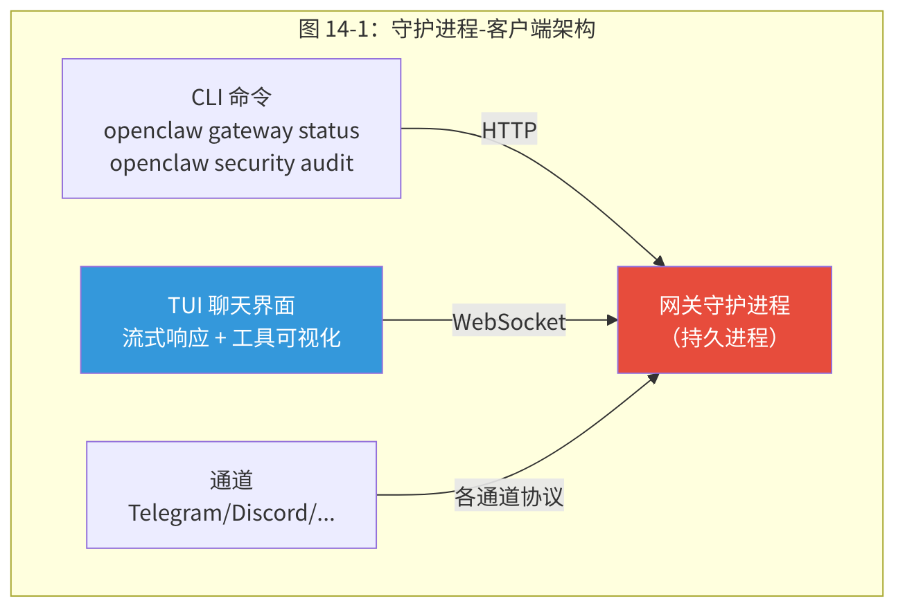
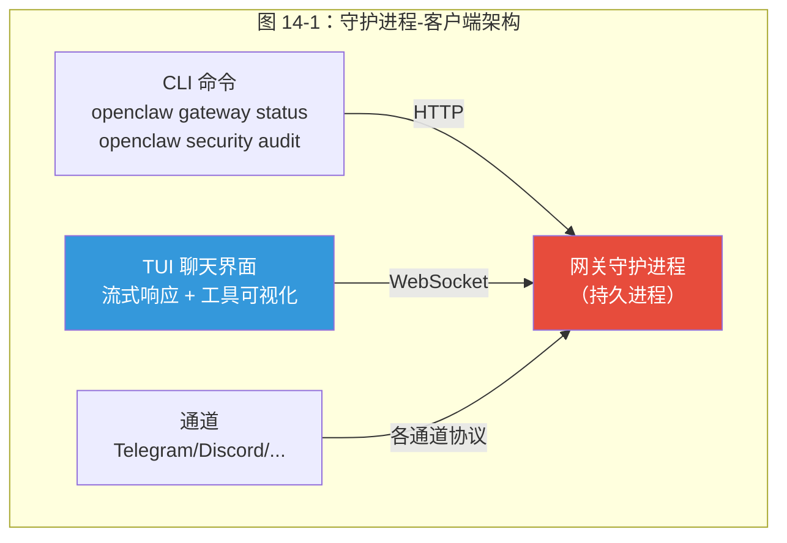
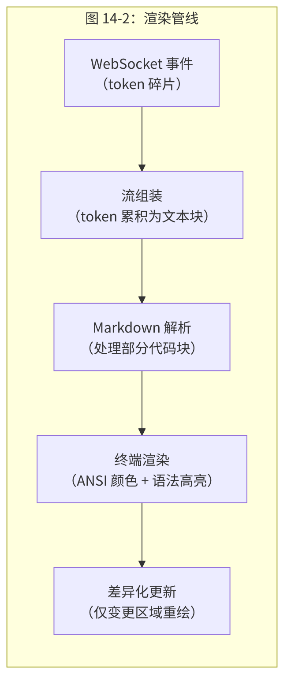
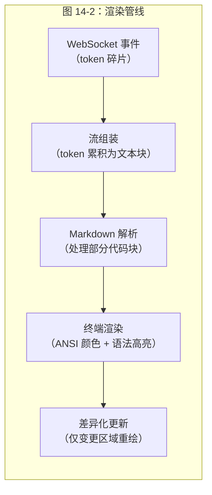

<div v-pre>

# 第14章 CLI 与交互界面

> *"凌晨两点 SSH 到生产服务器时，CLI 的设计质量就是你的生命线。结构化的诊断输出和五秒内定位问题的能力，比任何花哨的 UI 都更有价值。"*

> **本章要点**
> - 理解 CLI 对 Agent 系统的特殊重要性：不仅是工具，更是调试与运维的核心界面
> - 掌握守护进程 + 客户端架构的设计原理
> - 深入 TUI 终端界面：流式渲染、组件体系与交互设计
> - 理解 Doctor 诊断系统与配置向导的用户体验设计


前面四章（第 10-13 章）深入了 OpenClaw 的高级能力：工具、设备连接、自动化与安全。这些能力强大但隐藏在引擎盖下——用户如何与它们交互？运维人员如何诊断问题？开发者如何调试 Agent？

答案是 CLI 与 TUI。如果说前面的章节是汽车的发动机和传动系统，本章就是方向盘和仪表盘。

回顾第 2 章的消息旅程——一条消息从通道进入 Gateway，经过路由、会话加载、Agent 推理，最终返回给用户。CLI 和 TUI 是这条旅程的两个特殊入口：CLI 是**控制面**入口（查询状态、修改配置、管理进程），TUI 是**数据面**入口（作为一个本地通道，与 Telegram、Discord 并列，直接与 Agent 对话）。理解了这个双重角色，本章的架构决策就自然而然了。

## 14.1 为什么 CLI 对 Agent 系统很重要

### 14.1.1 深夜调试场景

凌晨两点，系统管理员 SSH 到生产服务器，调试 AI Agent 为什么停止响应 Discord 消息。检查网关状态、查看会话日志、切换模型、重启守护进程——全部要在终端内完成，没有图形界面，没有鼠标，只有键盘和一个闪烁的光标。这正是 OpenClaw CLI 设计的核心场景。

这个场景暴露了 Agent 系统对 CLI 的三个独特需求：

1. **远程可达**：Agent 通常运行在远程服务器上，SSH 是唯一的管理通道
2. **状态感知**：与无状态的 Web 服务不同，Agent 有大量运行时状态（活跃会话、进行中的 LLM 调用、Cron 作业状态），CLI 必须能够查询和呈现这些状态
3. **实时交互**：调试 Agent 不是查看静态日志——你需要实时观察 Agent 的推理过程、工具调用序列、以及与用户的对话流

### 14.1.2 Agent CLI 的独特挑战

传统 CLI 执行命令然后退出，干净利落。Agent CLI 却必须处理三个传统 CLI 从未面对的挑战：

**挑战1：长运行有状态对话**。传统命令 `ls -la` 执行后立即退出。Agent 对话可能持续数小时，期间 Agent 在编写代码、搜索资料、执行命令、等待用户反馈之间交替。CLI 不能"执行后退出"——它需要维护一个持续的交互状态。

**挑战2：流式响应与交错工具调用**。Agent 的回复不是一次性输出——它一边"思考"一边输出文本，中间可能插入工具调用（执行命令、搜索网页、浏览器操作），每个工具调用有自己的输出。CLI 需要实时渲染这种**交错的多源输出**。

**挑战3：推理过程可视化**。用户需要看到 Agent 的推理过程——它为什么选择这个工具？它在等待什么？当前进度如何？传统 CLI 只有"输入"和"输出"。Agent CLI 需要展示"推理"——一个全新的维度。

> Agent CLI 不是传统 CLI 的简单延伸，而是一种全新的交互范式。传统 CLI 像自动售货机——投币、按钮、出货、走人。Agent CLI 更像和一个正在手术的外科医生对话——你需要实时看到他在做什么，偶尔递一把手术刀，但大部分时间让他专注。

> 🔥 **深度洞察：界面即信任**
>
> CLI/TUI 的设计质量直接决定了运维人员对系统的信任程度——这是一个被严重低估的工程问题。飞行员信任飞机，不是因为他们理解每一个涡轮叶片的材料学，而是因为**仪表盘**清晰、准确、实时地反映了飞机的状态。当仪表盘显示"一切正常"时，飞行员才能把注意力放在导航而非发动机上。同样，当 OpenClaw 的 `openclaw gateway status` 输出清晰的健康状态时，运维人员才能安心入睡。反过来，如果状态输出含糊或延迟，运维人员会本能地不信任系统——即使系统运转完美。**可观测性不是锦上添花，而是建立人机信任的唯一途径。**

### 14.1.3 双组件架构

OpenClaw 通过双组件架构化解这一挑战：传统 **CLI** 用于管理操作（状态查询、配置修改、服务控制），**TUI**（终端用户界面）用于交互式 Agent 对话（流式响应、工具调用可视化、斜杠命令）。

一静一动，各司其职。CLI 是螺丝刀——执行精确操作然后放下。TUI 是操纵杆——持续握持，实时控制。这种分工的优雅之处在于：你永远不会拿螺丝刀驾驶飞机，也不会拿操纵杆拧螺丝。

> **关键概念：双组件架构（CLI + TUI）**
> OpenClaw 将命令行交互分为两个独立组件：CLI（命令行接口）用于无状态的管理操作——查询状态、修改配置、管理服务；TUI（终端用户界面）用于有状态的交互式对话——流式渲染 Agent 响应、可视化工具调用、执行斜杠命令。两者共享同一个底层 Gateway，但面向完全不同的使用场景。

## 14.2 CLI 命令体系的设计哲学

### 14.2.1 命令注册的演进

OpenClaw 的 CLI 命令体系经历了三个演进阶段，每个阶段都反映了系统复杂度的增长和设计理念的成熟：

**第一阶段：扁平命令**。早期的 OpenClaw（当时还叫 Warelay）只有寥寥几个命令：`start`、`stop`、`chat`。所有命令直接注册在入口文件中，没有分组、没有子命令，因为功能少到不需要。

**第二阶段：分组子命令**。随着功能增多，命令形成树状结构：`gateway start`、`gateway stop`、`config validate`、`security audit`。`src/commands/` 目录下的文件开始按功能分组——`agents.ts`、`agent.ts`、`auth-choice.*.ts`。

**第三阶段：动态注册**。当插件系统（第 9 章）引入后，命令注册变成了动态的——插件可以在运行时注册自己的 CLI 命令。`src/commands/` 目录膨胀到 300+ 文件，涵盖了从 `browser-cli-*.ts`（浏览器控制）到 `doctor-*.ts`（诊断系统）的方方面面。

```text
src/commands/
├── agent.ts                    # 单 Agent 管理
├── agents.ts                   # Agent 列表和批量操作
├── agents.commands.add.ts      # 添加 Agent
├── agents.commands.bind.ts     # 绑定 Agent 到通道
├── agents.commands.delete.ts   # 删除 Agent
├── agents.commands.identity.ts # Agent 身份管理
├── agents.commands.list.ts     # 列出 Agent
├── agents.providers.ts         # Agent 的 Provider 配置
├── auth-choice.api-key.ts      # API Key 认证
├── auth-choice.apply.*.ts      # 认证应用逻辑
├── doctor-*.ts                 # 诊断系统（12+ 模块）
├── browser-cli-*.ts            # 浏览器控制 CLI
└── ...共 300+ 文件
```

### 14.2.2 命令发现与参数解析

OpenClaw 的参数解析在 `src/cli/argv.ts` 中实现，采用了**分层解析**策略：

```typescript
// src/cli/argv.ts（简化）
const HELP_FLAGS = new Set(["-h", "--help"]);
const VERSION_FLAGS = new Set(["-V", "--version"]);

export function hasHelpOrVersion(argv: string[]): boolean {
  return argv.some((arg) => HELP_FLAGS.has(arg) || VERSION_FLAGS.has(arg))
    || hasRootVersionAlias(argv);
}
```

为什么不直接用 Commander.js 或 yargs 做全部解析？因为 OpenClaw 有一个特殊需求——**解析子命令之前，必须先提取根级选项**。例如 `--model claude-opus-4-6` 是一个根级选项，它需要在任何子命令解析之前生效，因为它会影响后续所有命令的行为。`consumeRootOptionToken` 函数处理这个"预解析"步骤。

这种分层解析的设计动机是：OpenClaw 同时是一个 CLI 工具和一个交互式应用，参数的语义在不同模式下可能不同。在 CLI 模式下，`--model` 设置默认模型；在 TUI 模式下，它设置当前会话的模型。分层解析让这种多义性得到优雅处理。

### 14.2.3 `FLAG_TERMINATOR` 与 Unix 惯例

`src/cli/argv.ts` 遵循 `FLAG_TERMINATOR`（即 `--`）——POSIX 标准惯例：`--` 之后的所有内容均视为位置参数而非标志。在 OpenClaw 中，以下场景格外依赖此机制：

```bash
# 没有 --，openclaw 会尝试解析 --verbose 为自己的选项
openclaw agent -- my-agent --verbose

# 正确：-- 告诉 openclaw "后面的不是你的选项"
openclaw exec -- ls --color=auto
```

这个细节看似微小，但在 Agent 系统中格外重要——因为 Agent 经常需要执行包含各种标志的外部命令，标志终止符确保 OpenClaw 的解析器不会误捕这些命令。

### 14.2.4 命令别名与人体工程学

OpenClaw 的 TUI 命令系统支持别名机制：

```typescript
// src/tui/commands.ts
const COMMAND_ALIASES: Record<string, string> = {
  elev: "elevated",
};
```

当前只有一个别名，但这个机制的存在体现了一个设计原则：**频繁使用的命令应该有短形式**。`/elev` 比 `/elevated` 少打 4 个字符，在紧急调试场景中这些字符意味着宝贵的时间。

更深层的设计考量是：别名不是随意添加的。OpenClaw 遵循 "explicit over implicit" 原则——别名表集中定义和维护，而不是分散在各个命令处理器中。这确保了命令空间的可预测性。

## 14.3 守护进程 + 客户端架构

### 14.3.1 架构选择

OpenClaw 选择**守护进程-客户端架构**——网关持久运行（守护进程）；CLI 和 TUI 连接到它（客户端）。






### 14.3.2 为什么用守护进程？

替代方案是"每次启动 CLI 时启动一个新的网关进程"（类似 `python manage.py runserver`）。为什么不这样？

三个独立进程无法实现的理由：

1. **会话持久化**：关闭终端，稍后 SSH 回来——对话完好无损。TUI 是客户端，对话状态在守护进程中，客户端断开不影响对话。
2. **多通道并发**：同一个网关同时服务 Telegram、Discord、TUI 和 Web Chat。每个通道需要持久连接（WebSocket、Bot API 轮询）——这些连接由守护进程维护。
3. **后台自动化**：Cron 作业和心跳即使没有操作员连接也在运行。没有守护进程，这些无法实现。

### 14.3.3 守护进程的生命周期管理

守护进程需要可靠的启动、停止和状态检查：

```bash
openclaw gateway start    # 启动守护进程
openclaw gateway status   # 检查状态
openclaw gateway stop     # 优雅停止
openclaw gateway restart  # 重启（保留进行中的工作）
```

`restart` 的"保留进行中的工作"特性值得注意——它不是简单的 stop + start，而是先通知网关准备关闭（完成当前 LLM 调用），等待最多 5 分钟，然后停止旧进程并启动新进程。

### 14.3.4 跨平台服务管理的统一抽象

OpenClaw 的守护进程管理面临一个根本挑战：Linux、macOS 和 Windows 使用完全不同的服务管理系统。`src/daemon/` 目录的文件结构清晰地展现了解决方案：

```text
src/daemon/
├── service.ts              # 统一的 GatewayService 接口
├── service-types.ts        # 服务类型定义
├── constants.ts            # 跨平台常量
├── systemd.ts              # Linux: systemd 适配
├── systemd-unit.ts         # systemd unit 文件生成
├── systemd-linger.ts       # systemd linger 管理
├── systemd-hints.ts        # systemd 诊断提示
├── launchd.ts              # macOS: launchd 适配
├── launchd-plist.ts        # launchd plist 文件生成
├── launchd-restart-handoff.ts  # macOS 重启握手
├── schtasks.ts             # Windows: 计划任务适配
├── schtasks-exec.ts        # Windows 执行辅助
├── runtime-binary.ts       # 运行时二进制检测
├── runtime-paths.ts        # 运行时路径解析
├── runtime-hints.ts        # 运行时环境提示
└── diagnostics.ts          # 服务诊断
```

**统一抽象，平台特化**。`service.ts` 立下 `GatewayService` 的统一接口——`start()`、`stop()`、`status()`、`restart()`。每个平台各有实现：

```typescript
// src/daemon/constants.ts（简化）
export const GATEWAY_LAUNCH_AGENT_LABEL = "ai.openclaw.gateway";    // macOS
export const GATEWAY_SYSTEMD_SERVICE_NAME = "openclaw-gateway";     // Linux
export const GATEWAY_WINDOWS_TASK_NAME = "OpenClaw Gateway";        // Windows

// 历史遗留名称兼容
export const LEGACY_GATEWAY_SYSTEMD_SERVICE_NAMES: string[] = [
  "clawdbot-gateway",
  "moltbot-gateway",
];
```

注意 `LEGACY_*` 数组——它收录了 OpenClaw 历史上的旧名称（Clawdbot、Moltbot）。用户从旧版本升级时，系统自动清扫这些遗留的服务注册。细节虽小，意义重大：不能让用户因为项目更名而留下僵尸服务。

**Profile 支持**。`normalizeGatewayProfile` 和 `resolveGatewayProfileSuffix` 函数支持在同一台机器上运行多个 Gateway 实例（不同的 profile 对应不同的配置）：

```typescript
// src/daemon/constants.ts
export function resolveGatewaySystemdServiceName(profile?: string): string {
  const suffix = resolveGatewayProfileSuffix(profile);
  if (!suffix) {
    return GATEWAY_SYSTEMD_SERVICE_NAME;
  }
  return `openclaw-gateway${suffix}`;
}
```

这个功能的使用场景是：开发者可能同时运行一个"生产" profile 和一个"开发" profile，它们使用不同的配置文件、不同的端口、不同的模型。

**macOS launchd 的特殊处理**。macOS 的 launchd 有一个 Linux systemd 没有的问题：`launchctl` 的行为在不同 macOS 版本之间有细微但关键的差异。`launchd-restart-handoff.ts` 引入了"重启握手"协议——新进程确认就绪之前，旧进程绝不退出。这避免了在 macOS 上偶发的"重启后服务不可用"问题。

### 14.3.5 运行时环境检测

`src/daemon/runtime-binary.ts` 负责检测当前的 JavaScript 运行时环境：

```typescript
// src/daemon/runtime-binary.ts（简化）
export function isBunRuntime(): boolean { ... }
export function isNodeRuntime(): boolean { ... }
```

为什么需要这个？因为 OpenClaw 同时支持 Node.js 和 Bun 运行时，而服务管理器需要知道用哪个二进制文件来启动守护进程。如果系统是通过 `bun install -g openclaw` 安装的，那 systemd unit 文件中应该写 `ExecStart=bun openclaw.mjs` 而不是 `ExecStart=node openclaw.mjs`。

## 14.4 TUI：Agent 对话的终端界面

### 14.4.1 TUI 作为一等通道

在 OpenClaw 的架构中，TUI 不是一个"简化版的 Web 客户端"——它是一个**一等通道**，与 Telegram、Discord 地位等同。TUI 通过 WebSocket 连接到 Gateway（与第 7 章的通道架构一致），使用与其他通道完全相同的会话管理、Agent 路由和消息处理管线。

这意味着在 TUI 中与 Agent 的对话：
- 持久化到 Session 存储中（第 5 章）
- 经过相同的安全检查（第 13 章）
- 使用相同的工具策略管线（第 10 章）
- 可以生成子 Agent（第 6 章）

TUI 的特殊之处在于它的**用户界面层**——如何在终端的 80x24 字符网格中优雅地呈现 Agent 的复杂输出。

### 14.4.2 三种输入模式

TUI 最优雅的设计决策是**三模式输入分发**——一个文本输入框服务三个不同目的：

```typescript
// src/tui/tui.ts — 三模式输入（简化）
if (raw.startsWith("!") && raw !== "!") {
  handleBangLine(raw);      // 模式 1：本地 Shell 执行
} else if (value.startsWith("/")) {
  handleCommand(value);      // 模式 2：TUI 内部命令
} else {
  sendMessage(value);        // 模式 3：发送给 Agent
}
```

**为什么是前缀分发而不是模式切换？** 考虑过另一种设计——用 `Ctrl+S` 在"Shell 模式"和"Chat 模式"之间切换（类似 Vim 的模态编辑）。但在 Agent 对话场景中，模式切换有严重的认知负担——你在紧张地调试 Agent 行为时，很容易忘记当前处于哪个模式，然后把 `rm -rf /tmp/test` 当作消息发给 Agent（或反过来，更糟糕）。

前缀分发消除了这个风险——输入的第一个字符就是模式声明，没有隐藏状态。

> 💡 **最佳实践**：在 TUI 中调试 Agent 时，善用 `!` 前缀执行本地命令（如 `!cat file.txt`），而非让 Agent 去读文件。本地命令不消耗 API Token、不计入上下文窗口，且执行速度更快。只有当你需要 Agent 理解文件内容并基于它做决策时，才使用 Agent 的 `read` 工具。

### 14.4.3 Bang 模式（`!`）的实现

**`!ls`** — 在本地执行 Shell 命令，不涉及 Agent。不消耗 API token，即时返回。

`src/tui/tui-local-shell.ts` 驱动 Bang 模式的执行引擎：

```typescript
// src/tui/tui-local-shell.ts（概念）
// Bang 命令在 TUI 进程中直接执行，不经过 Gateway
// 输出直接写入 ChatLog 组件
```

**使用场景**：正在与 Agent 对话讨论代码，想快速检查当前目录的文件列表。传统方式需要切换到另一个终端窗口或 tmux 面板。Bang 模式让你在同一个界面中完成——无需切换上下文。

**为什么叫 "bang"？** Unix 传统——`!` 在英语中俗称 "bang"。这与 Vim 的 `!command` 和 IPython 的 `!shell` 语法一致。对于熟悉 Unix 的用户，这个约定是自然的。

**Bang 模式与 Agent 工具执行的区别**。当你输入 `!ls`，命令在**你的 TUI 进程中**执行。当 Agent 调用 `exec` 工具执行 `ls`，命令在**Gateway 守护进程中**执行。这两个进程可能在同一台机器上，也可能不在——你可以通过 SSH 连接到远程 Gateway，此时 Bang 模式在你的笔记本上执行，而 Agent 的工具在远程服务器上执行。这个区别在调试跨机器部署时格外重要。

### 14.4.4 斜杠命令（`/`）的完整命令表

TUI 内部操作——不发送给 Agent，不执行 Shell 命令，而是控制 TUI 本身。

`src/tui/commands.ts` 注册了完整的斜杠命令集：

```typescript
// src/tui/commands.ts（简化）
const commands: SlashCommand[] = [
  { name: "help",      description: "Show slash command help" },
  { name: "status",    description: "Show gateway status summary" },
  { name: "agent",     description: "Switch agent (or open picker)" },
  { name: "agents",    description: "Open agent picker" },
  { name: "session",   description: "Switch session (or open picker)" },
  { name: "sessions",  description: "Open session picker" },
  { name: "model",     description: "Set model (or open picker)" },
  { name: "models",    description: "Open model picker" },
  { name: "think",     description: "Set thinking level" },
  { name: "fast",      description: "Set fast mode on/off" },
  { name: "verbose",   description: "Set verbose on/off" },
  { name: "reasoning", description: "Set reasoning on/off" },
  { name: "usage",     description: "Toggle per-response usage line" },
  { name: "elevated",  description: "Set elevated permissions" },
  { name: "abort",     description: "Cancel current run" },
  // ...更多命令
];
```

**命令分类与设计意图**：

| 类别 | 命令 | 设计意图 |
|------|------|---------|
| **导航** | `/agent`, `/session`, `/agents`, `/sessions` | 在多 Agent、多会话之间无缝切换 |
| **模型控制** | `/model`, `/models`, `/think`, `/fast` | 运行时调整 AI 行为，无需修改配置文件 |
| **可观测性** | `/status`, `/verbose`, `/reasoning`, `/usage` | 控制信息密度——调试时开启 verbose，日常使用时关闭 |
| **安全** | `/elevated` | 四级权限（on/off/ask/full），对应第 13 章的安全模型 |
| **流控** | `/abort` | 取消正在进行的 LLM 调用或工具执行 |

**命令补全机制**。每个命令可以定义 `getArgumentCompletions` 回调，为参数提供上下文感知的自动补全：

```typescript
// src/tui/commands.ts
{
  name: "think",
  description: "Set thinking level",
  getArgumentCompletions: (prefix) =>
    thinkLevels
      .filter((v) => v.startsWith(prefix.toLowerCase()))
      .map((value) => ({ value, label: value })),
},
```

`thinkLevels` 不是静态列表——它根据当前 Provider 和模型动态生成。Claude 支持 `extended thinking`，GPT 不支持；某些模型有 `budget` 模式，某些没有。补全系统反映当前的真实可用选项，而非所有理论可能的选项。

### 14.4.5 命令处理器的上下文设计

`src/tui/tui-command-handlers.ts` 中的 `CommandHandlerContext` 是一个精心设计的依赖注入结构：

```typescript
// src/tui/tui-command-handlers.ts
type CommandHandlerContext = {
  client: GatewayChatClient;       // Gateway WebSocket 客户端
  chatLog: ChatLog;                // 对话日志
  tui: TUI;                       // TUI 框架
  state: TuiStateAccess;           // 可变状态
  openOverlay: (c: Component) => void;  // 覆盖层管理
  closeOverlay: () => void;
  refreshSessionInfo: () => Promise<void>;
  setSession: (key: string) => Promise<void>;
  abortActive: () => Promise<void>;
  requestExit: () => void;
  // ... opts, deliverDefault, loadHistory, refreshAgents 等
};
```

**为什么用 Context 对象而不是类继承？** 在命令数量少时，一个 `CommandHandler` 基类 + 子类继承是自然选择。但 OpenClaw 的命令之间有大量**交叉依赖**——`/model` 命令需要刷新会话信息，`/agent` 命令需要重设会话，`/abort` 命令需要通知 Gateway 客户端。Context 对象让所有命令共享同一组服务，而不需要复杂的继承层次或 mixin。

**选择器组件的复用**。`openModelSelector` 和 `openAgentSelector` 展示了 TUI 组件的复用模式：

```typescript
// src/tui/tui-command-handlers.ts（简化）
const openModelSelector = async () => {
  const models = await client.listModels();
  const items = models.map((model) => ({
    value: `${model.provider}/${model.id}`,
    label: `${model.provider}/${model.id}`,
    description: model.name && model.name !== model.id ? model.name : "",
  }));
  const selector = createSearchableSelectList(items, 9);
  openSelector(selector, async (value) => {
    const result = await client.patchSession({ key: state.currentSessionKey, model: value });
    chatLog.addSystem(`model set to ${value}`);
    applySessionInfoFromPatch(result);
  });
};
```

`createSearchableSelectList` 和 `createFilterableSelectList`（定义在 `src/tui/components/selectors.ts`）是两种不同的列表交互模式——前者支持模糊搜索（适合长列表，如 50+ 可用模型），后者支持前缀过滤（适合短列表，如 3-5 个 Agent）。

### 14.4.6 三模式的设计洞察

三种模式给操作员通过一个输入框提供三个通信通道：

1. **与本地系统的通道**（`!`）：快速 Shell 操作
2. **与 TUI 应用的通道**（`/`）：控制界面和配置
3. **与远程 Agent 的通道**（普通文本）：对话和任务

这种"一个入口，多个出口"的设计减少了界面复杂度——用户不需要记住"我现在在哪个模式"，因为模式由输入的**第一个字符**决定。

对比其他 Agent CLI 的设计选择：
- **Claude Code CLI**：只有 Agent 对话模式，Shell 操作需要在新终端中进行
- **Aider**：`/` 命令 + 普通文本，没有 Bang 模式
- **Cursor**：IDE 集成，不是独立 CLI

OpenClaw 的三模式设计是这些方案中唯一不需要切换窗口就能完成所有操作的。

## 14.5 TUI 组件体系

### 14.5.1 组件架构

`src/tui/components/` 目录包含了 TUI 的核心渲染组件：

```text
src/tui/components/
├── chat-log.ts              # 对话日志（核心组件）
├── markdown-message.ts      # Markdown 渲染器
├── assistant-message.ts     # Agent 回复渲染
├── user-message.ts          # 用户消息渲染
├── tool-execution.ts        # 工具调用可视化
├── btw-inline-message.ts    # "顺便说" 内联消息
├── searchable-select-list.ts    # 可搜索选择列表
├── filterable-select-list.ts    # 可过滤选择列表
├── selectors.ts             # 选择器工厂
├── custom-editor.ts         # 自定义文本编辑器
├── hyperlink-markdown.ts    # 超链接处理
└── fuzzy-filter.ts          # 模糊匹配算法
```

**ChatLog 是核心骨架组件**。它管理一个消息列表，每条消息可以是用户消息、Agent 回复、系统通知或工具执行输出。其他所有组件都"嵌入"在 ChatLog 中。

**tool-execution.ts 是最复杂的组件**。当 Agent 调用工具时（比如执行一个 Shell 命令），这个组件需要渲染：
- 工具名称和参数
- 执行状态（等待中 / 执行中 / 完成 / 失败）
- 工具输出（可能是多行文本、JSON 数据、甚至图片的文本描述）
- 嵌套工具调用（Agent 可能在一个工具调用中触发另一个工具）

### 14.5.2 主题系统

`src/tui/theme/` 开放视觉定制能力：

```typescript
// src/tui/theme/theme.ts（概念）
// 定义颜色主题：前景色、背景色、高亮色
// 支持 256 色和真彩色终端
// 自动检测终端能力并降级
```

`syntax-theme.ts` 专门处理代码块的语法高亮——当 Agent 输出包含 TypeScript 代码时，关键字、字符串、注释用不同颜色渲染。这不是锦上添花——在长对话中，语法高亮让代码块在文本海洋中一眼可辨。

### 14.5.3 模糊搜索算法

`fuzzy-filter.ts` 驱动选择器的模糊匹配算法。可用模型超过 50 个，谁能记住每个的完整名称？输入 "clop" 命中 "claude-opus-4-6"，输入 "gp4" 命中 "gpt-4o"——模糊，但精准。

算法核心是**连续子序列匹配 + 权重评分**：连续匹配的字符权重更高（"claud" 比 "c...l...a...u...d" 得分高），词首匹配权重更高（"cl" 匹配 "claude" 比匹配 "include" 得分高）。

## 14.6 流式渲染管线

### 14.6.1 渲染的四个阶段

Agent 的流式回复从 WebSocket 事件到最终终端输出，经过四个处理阶段：






**阶段1：流组装**。WebSocket 发送的是 token 级碎片（可能只有半个单词）。组装器将碎片累积为语义完整的文本块——不能在一个 Markdown 标记中间中断渲染。

**阶段2：Markdown 解析**。需要处理**部分块**——当 Agent 正在输出 ````python\ndef hello():` 时，代码块还没结束，但已经需要开始语法高亮。解析器需要在"完整性"和"实时性"之间平衡。

`src/tui/tui-formatters.ts` 中的 `sanitizeRenderableText` 函数处理这个边界情况——它检测未闭合的 Markdown 标记，暂时跳过渲染，等下一批 token 到达后再重新评估。

**阶段3：终端渲染**。将解析后的 Markdown 转化为 ANSI 转义序列——标题加粗、代码块语法高亮、链接着色。这一步需要处理终端的宽度限制（自动换行）和能力差异（256 色 vs. 真彩色）。

**阶段4：差异化更新**。不是每次都清除屏幕重绘——而是计算"上次渲染"和"当前渲染"的差异，只更新变化的区域。这避免了屏幕闪烁，让流式输出看起来平滑流畅。

### 14.6.2 OSC 8 超链接

`src/tui/osc8-hyperlinks.ts` 让终端超链接成为现实——现代终端（iTerm2、Windows Terminal、kitty）支持 OSC 8 转义序列。Agent 输出中的 URL 不再是死文字，而是真正可点击的链接。

```text
ESC]8;;https://example.com\aExample\aESC]8;;\a
```

这个细节体现了 OpenClaw 对**渐进增强**的态度：在支持 OSC 8 的终端中，链接可点击；在不支持的终端中，优雅降级为纯文本。功能不应该因为环境差异而消失。

### 14.6.3 资源管理

运行映射使用**水位线策略**修剪：超过 200 条目时，修剪 10 分钟以前的条目直到低于 150。这防止长时间 TUI 会话中无限内存增长——一个运行了 8 小时的 TUI 会话可能产生数百个运行条目。

为什么用水位线而不是简单的 LRU 或固定大小队列？因为运行条目有"时效性"——10 分钟前的运行信息几乎不会再有人引用，但最近的运行信息（即使超过 200 条）可能仍在查看中。水位线策略在"保留最新"和"控制大小"之间取得了恰当的平衡。

### 14.6.4 BTW（"顺便说"）内联消息

`src/tui/components/btw-inline-message.ts` 开创了一种独特的交互模式——Agent 正在专注处理任务时，用户用 `/btw` 命令插入一条"顺便说"消息，完全不打断当前执行。

```text
Agent 正在执行搜索... [====>     ] 60%
/btw 对了，搜索的时候也看看价格信息
```

系统将这条 BTW 消息追加到当前上下文，但不中断正在进行的工具调用。它模拟了人类对话中"中途补充"的自然行为——你在听别人汇报的时候，偶尔会插一句"对了，别忘了..."。

## 14.7 Doctor 诊断系统

### 14.7.1 一条命令的全面体检

`openclaw doctor` 一条命令检查 12+ 子系统：

```bash
$ openclaw doctor
# ✓ 配置文件有效
# ✓ 网关运行中（端口 18789）
# ✗ 浏览器控制：未找到 Chromium
# ✓ 沙箱：Docker 可用
# ⚠ 会话锁：发现 2 个过期锁
# ✓ 模型连接：OpenAI 可达
# ✓ 存储：状态目录权限正确
```

### 14.7.2 模块化诊断架构

每个检查是 `src/commands/doctor-*.ts` 中的模块化诊断单元——添加新诊断只需创建一个文件，注册到诊断注册表。这与第 9 章的插件系统遵循相同的设计模式：**注册表模式 + 约定优先于配置**。

诊断模块的结构遵循统一的契约：

```typescript
// 每个 doctor-*.ts 模块导出一个诊断函数
// 返回 { status: "ok" | "warn" | "error", message: string, remediation?: string }
```

`remediation` 字段是 Doctor 系统的精华——它不只是告诉你"什么坏了"，还告诉你"怎么修"。例如：

```text
✗ 浏览器控制：未找到 Chromium
  修复：运行 npx playwright install chromium
```

### 14.7.3 服务审计

`src/daemon/service-audit.ts` 执行守护进程级别的健康体检——不仅检查"服务是否在运行"，还审视"服务配置是否正确"：

- systemd unit 文件的权限是否正确（`644`，不是 `755`）
- launchd plist 的启动参数是否与当前安装路径匹配
- 是否存在遗留的旧版本服务注册

### 14.7.4 无障碍性

输出使用颜色**和**符号（✓/✗/⚠），确保色觉缺陷用户也能获取信息。这不是锦上添花——它是可访问性的基本要求。

进一步地，所有诊断输出都可以通过 `--json` 标志以 JSON 格式输出，方便自动化脚本消费。人类友好的格式和机器友好的格式共存，不需要二选一。

## 14.8 配置向导

### 14.8.1 抽象提示器接口

设置向导（`src/wizard/`）使用**抽象提示器接口**（`WizardPrompter`），支持不同前端。终端向导和未来的 Web UI 向导使用相同的逻辑但不同的用户交互方式。

这个抽象的关键洞察是：配置的**逻辑流程**（先选 Provider，再输入 API Key，然后选通道）是固定的，但**交互方式**（终端的 readline vs Web 的表单）是变化的。`WizardPrompter` 接口分离了这两个关注点。

### 14.8.2 认证选择的多模态

`src/commands/auth-choice.*.ts` 系列文件编排了复杂的认证选择流程：

```text
auth-choice.api-key.ts                      # API Key 方式
auth-choice.apply.api-key-providers.ts       # 应用到各 Provider
auth-choice.apply.api-providers.ts           # API Provider 认证应用
auth-choice.apply-helpers.ts                 # 认证应用辅助函数
auth-choice.apply.oauth.ts                   # OAuth 方式
auth-choice.apply.plugin-provider.runtime.ts # 插件 Provider 运行时认证
```

这些文件的数量（6 个）反映了认证场景的真实复杂度——不同的 Provider 使用不同的认证方式（API Key、OAuth、自定义 Token），每种方式有自己的验证逻辑和错误处理。将它们拆分为独立文件，而不是塞进一个巨大的 `auth.ts`，是 OpenClaw 对"单一职责"原则的实践。

### 14.8.3 非交互模式

**非交互模式**支持完全脚本化部署：

```bash
openclaw setup --non-interactive \
  --auth-method api-key \
  --provider openai \
  --api-key "$OPENAI_API_KEY" \
  --accept-risk
```

**设计原则**：通过向导可完成的任何事情也必须可通过脚本自动化。Docker 和 CI/CD 集成不能有交互式步骤。

`--accept-risk` 标志值得注意——它是一个"安全确认"，在非交互模式下替代了交互式向导中"你确定要跳过安全配置吗？"的交互确认。这个标志必须显式传递，不能通过环境变量设置——防止开发者在 `.env` 文件中意外设置后静默跳过安全配置。

## 14.9 Banner 与首次启动体验

### 14.9.1 Banner 的设计哲学

`src/cli/banner.ts` 不只是一个 ASCII Art 标题——它是**首次启动体验**的关键组成部分。

```bash
$ openclaw
  ___                    ____ _                
 / _ \ _ __   ___ _ __  / ___| | __ ___      __
| | | | '_ \ / _ \ '_ \| |   | |/ _` \ \ /\ / /
| |_| | |_) |  __/ | | | |___| | (_| |\ V  V / 
 \___/| .__/ \___|_| |_|\____|_|\__,_| \_/\_/  
      |_|                                        
                              v2026.3.14
```

Banner 在以下情况**不**显示：
- CI 环境（`CI=true`）
- 管道模式（stdout 不是 TTY）
- 非交互命令（如 `openclaw config validate`）

`src/cli/banner-config-lite.ts` 走"轻量配置加载"路径——Banner 需要版本号，但完整配置系统尚未初始化。轻量加载只抽取 `package.json` 的 `version` 字段，绕开完整配置解析链。

### 14.9.2 首次运行检测

OpenClaw 检测是否是用户的第一次运行——如果是，自动启动配置向导而非显示帮助文本。这个决策基于一个观察：大多数用户第一次运行 CLI 工具时，看到帮助文本后会不知所措。引导式向导比 `--help` 更友好。

## 14.10 实战推演：凌晨故障排查的 CLI 体验

让我们用一个真实的运维场景，展示 CLI 和 TUI 的设计如何在紧急时刻产生实际价值。

### 14.10.1 场景

凌晨 2:17，你收到 Telegram 告警："Agent 已 15 分钟未响应 Discord 消息"。你 SSH 到服务器。

### 14.10.2 排查过程

```bash
# 第一步：5 秒内判断服务状态
$ openclaw gateway status
Gateway: running (PID: 18234, uptime: 3d 14h)
Channels: telegram=connected, discord=ERROR, whatsapp=connected
Active sessions: 12
Active runs: 0      # ← 没有进行中的请求，说明不是模型卡住

# 第二步：Doctor 快速诊断
$ openclaw doctor
✓ Configuration valid
✓ Gateway process healthy
✗ Discord channel: authentication failed (token expired)  # ← 找到了！
  Fix: Refresh Discord bot token at https://discord.com/developers
✓ Browser: Chromium available
✓ Storage: permissions OK

# 第三步：查看详细日志
$ openclaw gateway logs --since 2h | grep discord
[02:02:31] [discord] ■ Token refresh failed: 401 Unauthorized
[02:02:31] [discord] ■ Reconnect attempt 1/5, backoff 5s
[02:02:36] [discord] ■ Reconnect attempt 2/5, backoff 10s
...
[02:03:06] [discord] ■ All reconnect attempts exhausted

# 第四步：修复 — 更新 token 后热重载
$ openclaw config set channels.discord.token "NEW_TOKEN_HERE"
$ openclaw gateway restart
Waiting for active runs to complete... (0 active, immediate restart)
Gateway restarted. Discord: reconnecting...
Gateway: all channels connected ✓
```

从 SSH 到修复完成：**约 90 秒**。关键的时间节省来自：
- `gateway status` 的结构化输出立即定位了 Discord 异常
- `doctor` 的修复建议省去了查文档的时间
- 日志的子系统着色让 `discord` 相关行一目了然
- `gateway restart` 的优雅重启确保 Telegram 和 WhatsApp 连接不中断

> CLI 设计的终极检验不是"正常使用时好不好用"——而是"凌晨两点你大脑只有 50% 在线时，它能不能让你在两分钟内找到问题并修复"。错误消息里附带修复建议、日志按子系统着色、诊断系统自动发现常见问题——这些"不性感"的功能，是深夜救火时唯一重要的东西。

## 14.11 与其他工具的对比

| 特性 | OpenClaw | Claude Code CLI | Cursor | Aider |
|------|----------|-----------------|--------|-------|
| TUI 聊天界面 | ✅ 完整（组件体系） | ✅ 基础 | ❌ (IDE) | ✅ 基础 |
| 配置向导 | ✅ 交互式 + 脚本化 | ❌ | ❌ | ❌ |
| 诊断系统 | ✅ 12+ 子系统 | ❌ | ❌ | ❌ |
| Bang 模式 | ✅ | ❌ | N/A | ❌ |
| 多 Agent 切换 | ✅ 运行时选择器 | ❌ | ❌ | ❌ |
| 守护进程架构 | ✅ 三平台统一 | ❌ | N/A | ❌ |
| 差异化渲染 | ✅ | ✅ | N/A | ❌ |
| OSC 8 超链接 | ✅ | 部分 | N/A | ❌ |
| BTW 内联消息 | ✅ | ❌ | ❌ | ❌ |
| 模糊搜索选择器 | ✅ | ❌ | N/A | ❌ |
| 跨平台服务管理 | ✅ systemd/launchd/schtasks | ❌ | N/A | ❌ |

## 14.12 CLI 用户体验的设计原则

回顾整个 CLI 和 TUI 的设计，可以提炼出五个核心用户体验原则：

### 14.11.1 渐进式披露

CLI 的信息密度应该与用户的需求匹配：

- **默认**：简洁输出，只显示关键信息
- `/verbose on`：详细输出，包括模型元数据、token 使用量
- `/reasoning on`：Agent 推理过程可视化
- `--json`：完整的结构化数据，面向自动化

每一层都是上一层的超集。用户从简洁开始，按需增加细节。

### 14.11.2 零配置可用

`openclaw` 不带任何参数就应该可用——配置向导在首次运行时自动启动。对比许多 CLI 工具要求用户先手动创建配置文件或设置环境变量，OpenClaw 的首次体验是"运行即引导"。

### 14.11.3 错误即文档

每个错误消息都包含修复建议。不是 "Error: connection refused"，而是 "Error: Gateway not running. Run 'openclaw gateway start' to start it."。

### 14.11.4 操作可逆

危险操作（如删除 Agent、清除会话历史）都有确认步骤。在 `--non-interactive` 模式下，这些操作需要显式的 `--force` 标志。

### 14.11.5 终端友好

所有输出都考虑了管道和重定向场景。`openclaw gateway status` 在 TTY 中输出彩色格式化文本，在管道中输出纯文本。`| grep` 和 `| jq` 始终工作。

## 14.13 关键源码文件

| 文件 | 用途 |
|------|------|
| `src/cli/argv.ts` | CLI 参数解析和根级选项提取 |
| `src/cli/banner.ts` | ASCII Art Banner 和首次启动体验 |
| `src/tui/tui.ts` | TUI 主循环和输入分发 |
| `src/tui/commands.ts` | 斜杠命令注册和补全 |
| `src/tui/tui-command-handlers.ts` | 命令处理器和上下文注入 |
| `src/tui/tui-local-shell.ts` | Bang 模式本地 Shell 执行 |
| `src/tui/tui-formatters.ts` | 流式渲染和文本净化 |
| `src/tui/tui-event-handlers.ts` | WebSocket 事件处理 |
| `src/tui/tui-overlays.ts` | 覆盖层（选择器、对话框）管理 |
| `src/tui/osc8-hyperlinks.ts` | 终端超链接渲染 |
| `src/tui/components/` | 核心渲染组件（ChatLog、选择器等） |
| `src/tui/theme/` | 视觉主题和语法高亮 |
| `src/commands/` | 各 CLI 命令实现（300+ 文件） |
| `src/commands/doctor-*.ts` | 诊断系统模块 |
| `src/wizard/` | 配置向导 |
| `src/daemon/service.ts` | 统一服务管理接口 |
| `src/daemon/systemd.ts` | Linux systemd 适配 |
| `src/daemon/launchd.ts` | macOS launchd 适配 |
| `src/daemon/schtasks.ts` | Windows 计划任务适配 |
| `src/daemon/constants.ts` | 跨平台服务常量和 Profile 管理 |

## 14.14 本章小结

OpenClaw 的 CLI 和 TUI 体现"开发者体验优先"哲学。让我们回顾核心架构决策：

1. **双组件分工**：CLI 处理管理操作（执行即退出），TUI 处理 Agent 对话（持续交互）。两者通过 HTTP/WebSocket 连接到同一个 Gateway 守护进程，共享所有状态。

2. **命令体系的演进**：从扁平命令到分组子命令到动态注册，300+ 命令文件反映了系统复杂度的增长。分层参数解析和别名机制在灵活性和可预测性之间取得平衡。

3. **三模式输入分发**：`!`（本地 Shell）、`/`（TUI 控制）、普通文本（Agent 对话）——通过第一个字符决定模式，消除了模态切换的认知负担。

4. **跨平台守护进程管理**：统一的 `GatewayService` 接口下，systemd/launchd/schtasks 各自适配，Profile 支持多实例部署，Legacy 名称清理确保升级平滑。

5. **流式渲染管线**：从 WebSocket token 碎片到 ANSI 终端输出的四阶段管线，差异化更新避免闪烁，OSC 8 超链接渐进增强。

**核心洞察**：Agent CLI 不是传统 CLI 加上聊天——它是根本不同的交互模型。传统 CLI 执行后退出。Agent CLI 管理带有流式响应、交错工具调用和实时可视化的长运行有状态对话。OpenClaw 的三模式输入、差异化渲染和守护进程架构都是对这一根本差异的回应。理解这个差异，比理解任何具体的命令语法都更重要——它揭示了 Agent 系统对"人机交互"的全新需求。

CLI 的设计质量决定系统的**可运维性**。Agent 可以在深度学习研究中绽放无限创新，但运维人员凌晨两点无法快速定位问题，一切创新都无法转化为生产价值。Doctor 系统、结构化诊断、跨平台服务管理——这些"不性感"的工程决策，恰恰是"原型"与"产品"之间的分水岭。

> **技术的深度不在前台炫技，而在后台兜底。最好的基础设施就像空气——你平时不会注意到它，但缺少的那一刻立刻窒息。**

下一章，我们从交互界面走向部署运维——看 OpenClaw 如何从笔记本上的 `openclaw gateway start` 蜕变为 24/7 稳定运行的生产系统。

### 思考题

1. **概念理解**：为什么 OpenClaw 的 CLI 采用"三模式输入分发"（`!` 本地 Shell、`/` TUI 控制、纯文本 Agent 对话）而非统一的命令前缀？这种设计如何减少用户的认知负担？
2. **实践应用**：如果要为 OpenClaw 开发一个 Web 版的管理界面（替代 TUI），你需要复用哪些现有的 Gateway API？流式渲染管线在 Web 端需要做哪些适配？
3. **开放讨论**：Agent CLI 和传统 CLI 的本质区别是什么？传统 CLI 的"执行即退出"模式是否还适用于 Agent 时代？未来的 Agent 交互界面会是什么形态？

### 📚 推荐阅读

- [Command Line Interface Guidelines](https://clig.dev/) — CLI 设计的现代最佳实践指南
- [Ink — React for CLI](https://github.com/vadimdemedes/ink) — 用 React 构建终端界面的框架，类似于 OpenClaw TUI 的设计思路
- [The Art of Unix Programming (Eric Raymond)](http://www.catb.org/~esr/writings/taoup/) — Unix 哲学对 CLI 设计的深远影响


</div>
