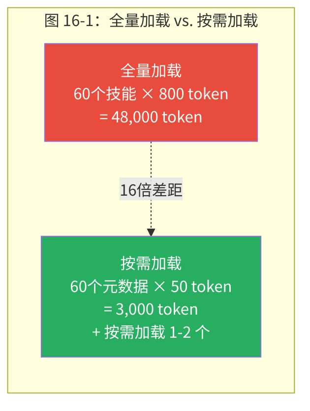
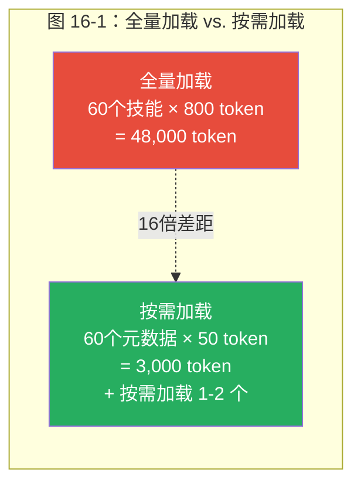
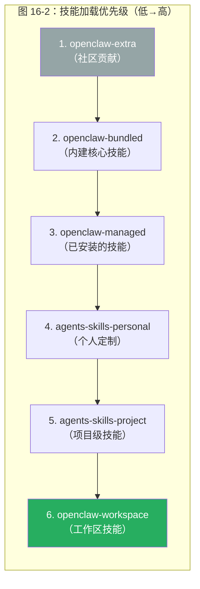
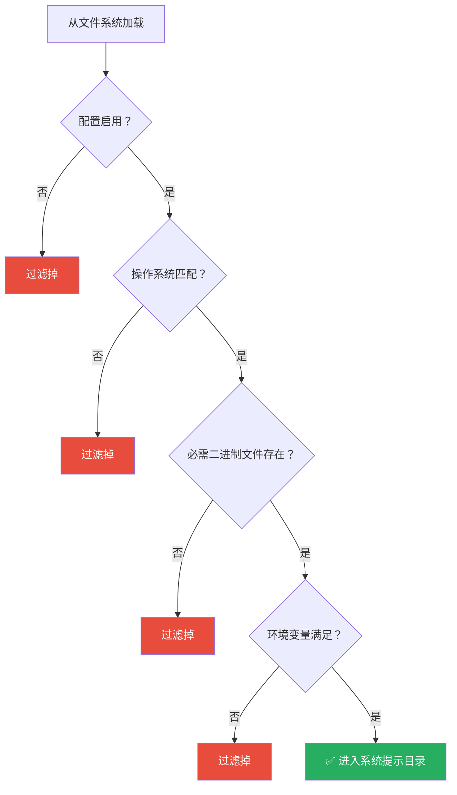
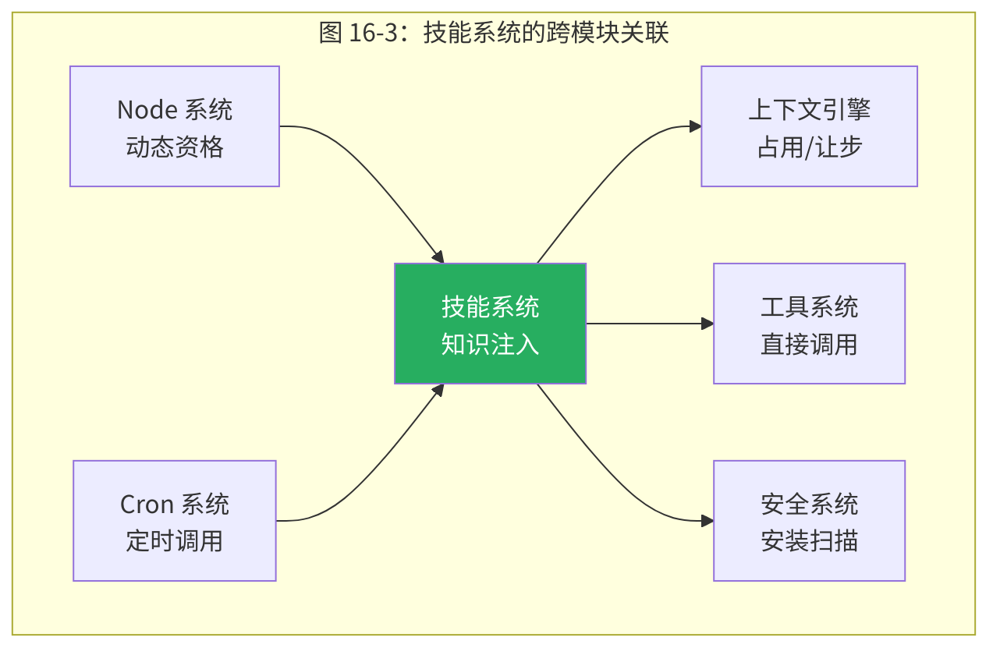
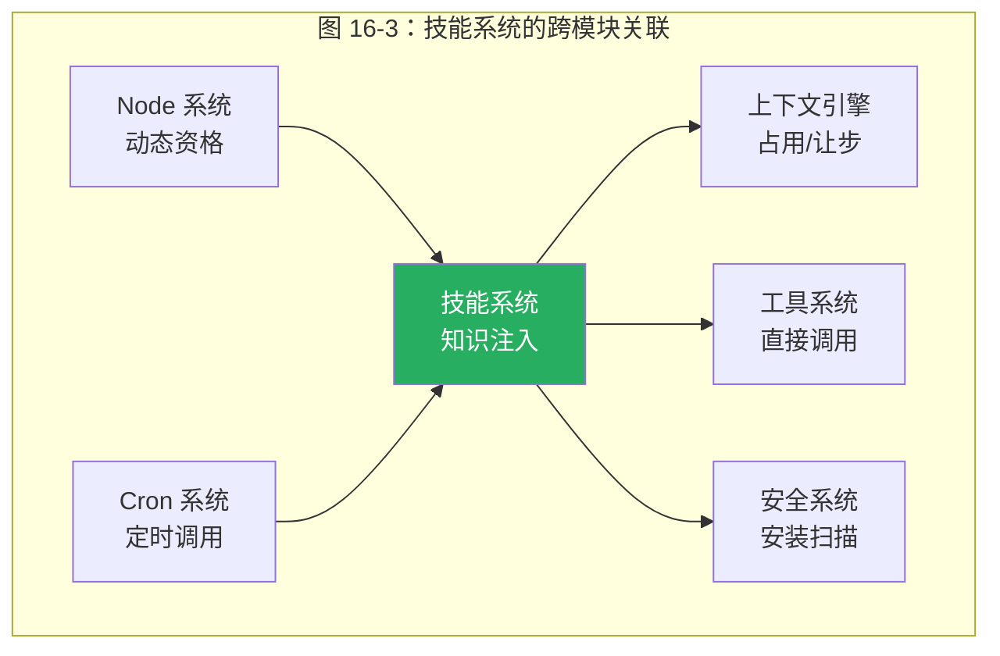

<div v-pre>

# 第16章 技能系统

> *"上下文窗口是公共牧场——每个技能都想放更多的羊。全量加载 60 个技能消耗 48,000 token，按需加载只需 3,000。这不是优化技巧，而是'公地悲剧'的系统性解法。"*

> **本章要点**
> - 理解技能系统如何解决知识注入的"系统提示膨胀"问题
> - 掌握技能的剖析结构：SKILL.md 约定、六源加载与分层覆盖
> - 深入过滤管线：从发现到提示注入的完整链路
> - 理解技能安装安全、调用控制与生命周期管理
> - 实战演练：从零编写一个完整的技能包


部署方案解决了"在哪里跑"的问题，接下来要解决"怎么让 Agent 变得更聪明"。第 9 章的插件系统让平台可扩展，本章的技能系统则让 Agent 本身可扩展——不是改代码，而是给它"教材"。

## 16.1 知识注入问题

### 16.1.1 陈述性知识 vs. 程序性知识

问 Claude："北京今天天气怎么样？"它会给你一个充满免责声明的模糊回答——"我无法获取实时数据，但通常三月份的北京……"。给它一个天气技能，结果截然不同——它直接调用 `curl wttr.in/Beijing`，返回精确的温度、湿度和未来三天预报。

差别在哪？大语言模型拥有广泛的**陈述性知识**（"知道什么"），但缺乏**程序性知识**（"怎么做"）。哪个命令检查磁盘使用？某个 API 的参数格式是什么？GitHub CLI 怎么创建 PR？这些答案躺在 Stack Overflow 和 man pages 里，不在模型权重里。

技能系统弥合的，正是这道鸿沟——把"怎么做"的知识注入到"知道什么"的模型中。

> 如果说模型的权重是"通识教育"，技能就是"职业培训"。通识教育让你知道世界上有锁这种东西，职业培训教你拿哪把钥匙开哪扇门。

### 16.1.2 为什么不把所有知识放进提示？

最朴素的方案是：把所有技能的完整指令放进系统提示。Agent 启动时加载所有知识，像一个读过所有手册的专家。

这个方案的致命缺陷是**上下文窗口是寸土寸金的共享资源**。技能指令、系统提示、对话历史、工具结果和用户消息，都在争夺同一块 token 预算。

让我们做一个具体计算：

- 一个典型的技能 SKILL.md 约 800 token
- 一个活跃的 OpenClaw 实例可能有 60 个技能
- 全量加载：60 × 800 = 48,000 token
- 128K token 上下文窗口中，技能就占了 37.5%
- 剩余空间要容纳系统提示（~5,000）、对话历史（~30,000）、工具结果（变化）和用户消息
- Agent 实际推理的空间遭到严重挤压

更糟糕的是，大多数技能在大多数对话中都不会用到。如果用户在讨论代码审查，60 个技能中可能只有 `github` 和 `coding-agent` 两个相关。剩余 58 个技能白白占用了 46,400 token 的上下文空间——这是巨大的浪费。

### 16.1.3 按需加载：图书馆模型

OpenClaw 对这一张力的回应，是技能系统最精妙的设计：**按需加载**。






只有技能元数据（名称 + 描述，每个约 50 token）永久驻留在系统提示中，扮演"目录"的角色。完整指令仅在模型判断需要激活某个技能时才加载。60 个技能的场景下，提示开销从约 48,000 token 骤降至约 3,000 token——**16 倍的效率提升**。

这就像图书馆只在书架上放目录卡片，读者选定后才从书库取出原书。你不会把整个图书馆搬到办公桌上才开始工作——你只需要知道哪本书在哪个书架上。目录告诉你"这本书存在，关于什么"，但不包含书的内容。只有你决定"我需要这本书"时，图书馆才把它拿出来。

> **关键概念：按需加载（On-Demand Loading）**
> 技能系统的按需加载机制只在系统提示中放置技能的元数据摘要（名称 + 描述，约 50 token/个），完整的技能指令仅在模型判断需要时才加载。这将 60 个技能的 Token 开销从约 48,000 降至约 3,000——16 倍的效率提升。这一设计解决了"公地悲剧"问题：上下文窗口是公共资源，每个技能都想占用更多空间，按需加载确保只有真正需要的技能才消耗宝贵的 Token 预算。

> 🔥 **深度洞察：技能系统是生态位理论的工程实现**
>
> 生态学中有个核心概念叫**生态位（Ecological Niche）**：一片森林中，不同物种占据不同的生态位——有的在树冠层光合作用，有的在林下层分解落叶，有的在土壤中固氮。它们共享同一片有限的资源（阳光、水分、养分），但通过分工避免了零和竞争。OpenClaw 的技能系统面对的正是同一道难题：60 个技能共享一个有限的上下文窗口（相当于森林中有限的阳光），如果每个技能都试图"全量展开"，就像所有树都长到同一个高度争夺阳光——结果是谁都长不好。按需加载的本质是**让每个技能找到自己的生态位**：元数据目录是"种子库"，模型的选择是"自然选择"，只有与当前任务匹配的技能才"萌发"并占据上下文空间。这不是工程优化——这是在有限资源上实现最大生物多样性的生存策略。

### 16.1.4 按需加载的挑战

按需加载不是免费的午餐，它引入了一个新的复杂度：**模型必须能从 50 token 的描述中准确判断是否需要某个技能**。

如果描述写得太笼统（"适用于各种编程任务"），模型可能在不需要时加载它。如果描述写得太具体（"仅适用于 Python 3.11 的 asyncio 调试"），模型可能在需要时错过它。**描述的质量直接决定了按需加载的效果**。

OpenClaw 通过规范化的描述格式来缓解这个问题：

```yaml
description: "通过 wttr.in 获取天气和预报。
  适用：用户询问天气、温度或预报。
  不适用：历史天气数据或严重天气警报。"
```

> 💡 **最佳实践**：编写技能描述时，始终包含"适用"和"不适用"两个维度。这帮助模型准确判断何时加载技能，避免误触发（浪费 Token）和漏触发（功能缺失）。好的描述应该让模型在 50 token 内做出准确的加载决策。

注意"适用"和"不适用"的明确界定——这不是随意的写作风格，而是帮助模型做精准判断的结构化信息。

## 16.2 技能的剖析

### 16.2.1 SKILL.md 的结构

每个技能是一个目录，包含必需的 `SKILL.md` 文件：

```yaml
---
name: weather
description: "通过 wttr.in 获取天气和预报。
  适用：用户询问天气、温度或预报。
  不适用：历史天气数据或严重天气警报。"
metadata:
  openclaw:
    emoji: "☔"
    requires:
      bins: [curl]        # 需要 curl 命令
      env: [WEATHER_API_KEY]  # 可选的 API 密钥
    platform: [linux, darwin]  # 支持的平台
---

# 天气技能
## 使用方法
```bash
curl wttr.in/Beijing         # 当前天气
curl wttr.in/Beijing?format=3 # 紧凑格式
```

## 注意事项
- 如果用户没有指定城市，使用 USER.md 中记录的位置
- 使用 `?format=j1` 获取 JSON 格式以便程序化处理
```text

关键设计决策：**只有 `name` 和 `description` 进入系统提示**。Markdown 正文仅在模型决定使用该技能后才加载。YAML frontmatter 中的元数据用于**资格过滤**——在技能出现在目录之前就判断它是否适用于当前环境。

### 16.2.2 为什么用 Markdown 而非代码？

这个设计选择引发了最多讨论。LangChain 用 Python 类定义工具。Semantic Kernel 用函数签名。为什么 OpenClaw 用纯文本的 Markdown 文件？

**方案 A：Python/TypeScript 代码**

```python
class WeatherTool:
    def __init__(self):
        self.name = "weather"
        self.description = "Get weather forecasts"
    
    def execute(self, city: str) -> str:
        return subprocess.run(["curl", f"wttr.in/{city}"], capture_output=True).stdout
```

优点：类型安全，可编程，IDE 支持。缺点：需要编程能力，有运行时安全风险（代码可以做任何事），修改需要重新部署。

**方案 B：JSON/YAML 配置**

```yaml
name: weather
description: "Get weather forecasts"
commands:
  - pattern: "weather {city}"
    exec: "curl wttr.in/{city}"
```

优点：声明式，安全。缺点：表达能力有限（复杂逻辑难以用 YAML 表达），不够灵活。

**方案 C：Markdown（OpenClaw 的选择）**

优点有三个层面：

1. **门槛极低**：能写 README 的人就能写技能。领域专家（网络管理员、数据分析师、运维工程师）无需学习 SDK 就能将自己的专业知识编码为技能。
2. **执行安全**：Markdown 文件是**惰性的**——它不是代码，系统不会执行它。恶意技能可能提供错误指令，但无法直接入侵系统。安全边界清晰：技能能做的最坏事情是误导 Agent，而非直接运行恶意代码。
3. **LLM 原生格式**：技能是提示片段——设计目标是让 LLM 消费而非运行时解释器。Markdown 是 LLM 最自然的输入格式。格式与消费者的对齐消除了翻译层。

**权衡**：Markdown 缺乏类型检查和编程抽象。复杂的工作流难以用纯文本描述。OpenClaw 通过 `command-dispatch: tool` 和脚本引用（技能目录中可以包含辅助脚本）来部分弥补这个缺陷。

> ⚠️ **常见陷阱：SKILL.md 的 YAML Frontmatter 格式错误**
>
> SKILL.md 的 YAML frontmatter 必须以 `---` 开头和结尾。常见错误：
> ```markdown
> <!-- ❌ 错误：缺少结束的 --- -->
> ---
> name: my-skill
> description: "这是我的技能"
>
> # 技能正文
> ...
>
> <!-- ❌ 错误：description 中包含未转义的冒号 -->
> ---
> name: my-skill
> description: 这是我的技能: 很好用
> ---
>
> <!-- ✅ 正确：冒号需要引号包裹 -->
> ---
> name: my-skill
> description: "这是我的技能: 很好用"
> ---
> ```
> YAML 解析失败时，整个技能会被静默忽略——你不会看到报错，只是技能不出现在目录中。如果新添加的技能"不生效"，首先检查 frontmatter 格式。

> ⚠️ **常见陷阱：技能描述过于笼统导致误触发**
>
> 按需加载依赖模型从 50 token 的描述中判断是否需要加载技能。描述太笼统会导致不必要的加载，浪费上下文空间：
> ```yaml
> # ❌ 过于笼统：几乎任何请求都可能触发
> description: "帮助用户完成各种任务"
>
> # ✅ 精确：明确适用和不适用场景
> description: "通过 GitHub CLI 管理 PR 和 Issue。
>   适用：创建 PR、查看 CI 状态、合并 PR、创建 Issue。
>   不适用：代码编写、Git 本地操作（commit/push/branch）。"
> ```

## 16.3 六源加载与分层覆盖

### 16.3.1 六个来源的设计动机

OpenClaw 从六个来源加载技能，每个有不同优先级（从低到高）：




为什么需要六个来源？不同来源服务不同的定制需求：

| 来源 | 维护者 | 用途 |
|------|-------|------|
| extra | 社区 | 第三方贡献的实验性技能 |
| bundled | OpenClaw 团队 | 核心技能（weather、github、coding-agent） |
| managed | 运营者 | 通过 `openclaw skills install` 安装的技能 |
| personal | 运营者 | 跨项目通用的个人技能 |
| project | 项目 | 特定项目的技能（如"这个项目的部署流程"） |
| workspace | 工作区 | 当前工作区的技能（最高优先级） |

### 16.3.2 完全替换而非合并

高优先级来源**完全替换**同名的低优先级技能——没有合并。这是刻意的设计决策。

考虑替代方案：**合并覆盖**——高优先级来源只覆盖它定义的字段，低优先级的其他字段保留。这听起来更灵活，但引入了歧义：如果 bundled 的 `weather` 技能有 5 个命令，workspace 的 `weather` 技能只定义了 2 个，合并后有几个？7 个？还是 2 个？如果 workspace 想删除 bundled 的某个命令怎么办？

**完全替换**虽然不灵活，但是可预测且可调试的——如果 workspace 有 `weather`，那就完全忽略其他来源的 `weather`。运营者永远知道某个技能来自哪里，不需要在脑中模拟合并逻辑。

**哲学上与 CSS 级联对齐**：特异性和接近用户的程度决定哪个值胜出。

### 16.3.3 路径逃逸防护

每个技能的真实路径（符号链接解析后）必须位于其根目录内。这防止恶意技能通过符号链接引用系统文件：

```text
skills/
  evil-skill/
    SKILL.md → /etc/passwd  # 系统静默忽略！
```

`realpath` 检查确保符号链接的目标不逃逸出技能目录。这是典型的**路径遍历防御**——在 Web 安全中常见，在技能系统中同样必要。

## 16.4 过滤管线：从发现到提示

### 16.4.1 资格检查链

从文件系统加载到出现在系统提示中，每个技能通过多重资格检查：




这条过滤链的核心思想是：**不要给 Agent 看它无法使用的技能**。如果天气技能需要 `curl` 但系统上没安装，把这个技能放进提示只会让 Agent 尝试后失败——浪费 token、浪费时间，还可能让 Agent 进入错误恢复循环。

### 16.4.2 环境变量的三种满足方式

环境变量需求可通过三种方式满足：

1. **直接设置**：`process.env.WEATHER_API_KEY` 已存在。
2. **技能配置注入**：运营者在 `openclaw.yaml` 中配置 `skills.weather.env.WEATHER_API_KEY: "xxx"`。
3. **API 密钥快捷方式**：技能声明 `primaryEnv: WEATHER_API_KEY`，运营者配置 `skills.weather.apiKey: "xxx"`——系统自动将 `apiKey` 映射到 `WEATHER_API_KEY`。

第三种方式是一个精巧的用户体验优化——大多数技能只需要一个 API 密钥，`apiKey` 比手动配置环境变量映射更直觉。

### 16.4.3 远程节点的动态资格

一个特别有趣的设计：技能的资格可以随**Node 连接状态**动态变化。

```text
macOS 专属技能 → 默认不资格
MacBook 伴侣应用连接 → 变为资格
MacBook 断开 → 恢复不资格
```

这意味着 Agent 的能力随其设备生态系统动态扩展。当 Android 手机配对时，相机相关技能自动出现；当手机断开时，这些技能自动消失。Agent 的"知识"与它的"能力"保持同步。

## 16.5 自适应格式降级

### 16.5.1 当目录太大时

当技能目录超出字符预算时，系统不是简单截断（可能在中间截断一个技能的描述），而是自动通过三层降级：

**第一层（完整）**：名称 + 描述 + 位置

```text
- weather: 通过 wttr.in 获取天气和预报。适用：用户询问天气、温度或预报。
  [~/.bun/.../skills/weather/SKILL.md]
```

**第二层（紧凑）**：名称 + 位置，省略描述

```text
- weather [~/.bun/.../skills/weather/SKILL.md]
```

**第三层（截断）**：二分搜索确定紧凑格式能容纳的最大技能数

在第三层中，系统使用**二分搜索**（而非线性扫描）来确定能容纳多少技能——在 100 个技能的场景下，这将搜索次数从 100 降到 ~7。虽然字符串拼接的成本使这个优化在实际中不那么显著，但它展示了一种"即使在边缘情况下也追求效率"的工程思维。

### 16.5.2 路径压缩

路径压缩将冗长的绝对路径替换为紧凑的相对路径：

```text
/Users/alice/.bun/install/global/node_modules/openclaw/skills/github/SKILL.md
→ ~/.bun/.../skills/github/SKILL.md
```

每个路径节省约 5 token。50-100 个技能累计节省 400-600 token。这看似微不足道，但记住：**技能目录是系统提示的常驻部分**——每一轮对话都包含它。如果 Agent 一天处理 100 轮对话，400 token × 100 = 40,000 token/天。按 Claude 的定价，这每月约 $3-5 的节省。

### 16.5.3 这是"公共物品"问题

自适应降级的深层动机是上下文窗口作为**公共物品（Commons）**的经济学。

上下文窗口是一块有限的共享资源，多个"消费者"（系统提示、技能目录、对话历史、工具输出、用户消息）竞争使用。如果技能目录不自我约束地占用空间，它会"挤出"其他消费者——对话历史更早遭到截断，工具输出压缩更激进，用户消息的上下文更短。

这与经济学中的"公地悲剧"类似：每个消费者都想最大化自己的空间，但如果每个都这样做，整体效率下降。自适应降级是技能系统作为"负责任的公民"的自我调节——在空间充裕时提供完整信息，在空间紧张时自动精简，确保不牺牲其他消费者的利益。

## 16.6 快照、缓存与热重载

### 16.6.1 不可变快照

`SkillSnapshot` 是不可变的时间点视图（第17章称之为"不可变快照协调"模式）。为什么不直接读取文件系统？

**问题**：单次对话中，Agent 可能多次访问技能目录。如果在对话中间有人修改了 `SKILL.md`，不同回合看到的技能内容不一致——可能导致新指令中断 Agent 基于旧指令开始的工作流。

**方案**：对话开始时创建快照，对话期间使用快照，对话结束后快照过期。下一次对话使用新的快照。

### 16.6.2 热重载

`chokidar` 文件监视器检测 `SKILL.md` 变更，250ms 防抖。变更检测到时，快照版本提升，下一个 Agent 回合获取更新的技能集——无需重启网关。

250ms 防抖是必要的——文本编辑器保存文件时通常会产生多次写入事件（写入临时文件、重命名、修改权限），没有防抖会导致在一次保存操作中多次重建快照。

### 16.6.3 缓存策略

技能缓存使用**版本号**而非时间戳失效。每次文件变更，全局版本号递增。消费者（Agent 回合）检查自己持有的版本号与全局版本号是否一致——如果不一致，重新获取快照。

版本号的优势：没有时间同步问题（分布式环境中，不同节点的时钟可能不同步），也没有"是否过期"的模糊判断（版本号要么匹配，要么不匹配）。

## 16.7 技能安装与安全

### 16.7.1 统一安装接口

OpenClaw 提供统一安装命令，支持五种包管理器：

| 包管理器 | 适用场景 | 示例 |
|---------|---------|------|
| brew | macOS 命令行工具 | `openclaw skills install weather --via brew` |
| npm | Node.js 技能 | `openclaw skills install @openclaw/skill-github` |
| go | Go 语言工具 | `openclaw skills install gh` |
| uv | Python 工具 | `openclaw skills install yt-dlp` |
| download | 直接下载 | `openclaw skills install https://...` |

### 16.7.2 安装前安全扫描

安装前，技能目录经过安全扫描，检查危险代码模式：

| 严重级别 | 检查内容 | 示例 |
|---------|---------|------|
| `critical` | 直接命令执行指令 | `sudo rm -rf /` |
| `warn` | 不安全的网络操作 | `curl ... \| bash` |
| `info` | 可疑但可能合法的模式 | 引用 `/etc/` 路径 |

扫描不是万能的——Markdown 是自然语言，恶意意图可以用无穷多种方式表达。但扫描拦截了最常见的危险模式，筑起合理的第一道防线。

### 16.7.3 环境变量注入的引用计数

环境变量注入使用**引用计数**确保多个技能共享一个环境变量时只设置一次，所有引用释放时恢复原始值。

```text
技能 A 需要 API_KEY → 引用计数 = 1, 设置 process.env.API_KEY
技能 B 也需要 API_KEY → 引用计数 = 2, 不重设
技能 A 卸载 → 引用计数 = 1, 保持
技能 B 卸载 → 引用计数 = 0, 恢复原始值（或清除）
```

**关键安全特性**：`getActiveSkillEnvKeys()` 使 ACP 生成逻辑能从子进程中剥离技能注入的密钥，防止凭证泄露到子 Agent 进程中。

此外，系统**永不覆盖已存在的进程环境变量**。如果用户已显式设置 `process.env.API_KEY`，技能的环境注入不会覆盖它——用户的显式配置优先。

## 16.8 调用：两维控制矩阵

技能的可调用性由两个独立的布尔值控制，组合出四种行为：

| `userInvocable` | `disableModelInvocation` | 行为 |
|---|---|---|
| true | false | 默认：用户 `/skill-name` + 模型自动发现 |
| true | true | 仅用户命令，对模型隐藏 |
| false | false | 无斜杠命令，模型从提示中发现 |
| false | true | 完全隐藏（内部使用） |

这个矩阵的设计动机是：某些技能只有在用户明确请求时才应触发。例如，"删除所有邮件"技能若由模型自动发现，可能因用户的模糊指令而意外触发。设置 `disableModelInvocation: true` 确保它只在用户显式输入 `/delete-emails` 时才执行。

### 16.8.1 直接工具分发

高级技能可声明 `command-dispatch: tool` 绕过 LLM——`/weather Tokyo` 直接触发 `curl` 调用，无需模型推理。这有两个好处：

1. **零 token 成本**：不调用模型 API。
2. **亚秒延迟**：不等待模型推理。

这种"LLM 旁路"在高频、低复杂度的操作中非常有价值——用户每天查 10 次天气，每次都走 LLM 推理不仅浪费，还增加了不必要的延迟。

## 16.9 技能生命周期：从创建到退役

### 16.9.1 五个阶段

每个技能经历可预测的生命周期：

**阶段1：创建。** 某人（运营者、领域专家，或 Agent 自身通过自我改进）编写一个 SKILL.md 文件。此时技能只是一个文件，系统尚未加载它。

**阶段2：发现。** 文件监视器检测到新文件（或启动时已存在）。技能进入加载管线：frontmatter 解析、资格检查、与更高优先级来源的去重。

**阶段3：活跃使用。** 技能的元数据出现在系统提示目录中。模型激活它时，系统读取完整的 SKILL.md 正文并注入对话。技能开始影响 Agent 行为。

**阶段4：演进。** 基于经验修改技能——也许某个命令语法有误，或者发现了更好的方法。热重载无缝拾取变更。

**阶段5：退役。** 技能变得过时（它描述的 API 已废弃，它依赖的工具已卸载）。从技能目录中删除它，文件监视器立即从目录中移除它。

整个生命周期完全通过文件系统发生——没有数据库，没有注册 API，没有部署管线。**文件系统就是技能数据库。** 这种简洁性是刻意的设计选择：它意味着技能可以用 `cp`、`mv`、`rm` 和 `git` 管理——每个运营者都已经熟悉的工具。

### 16.9.2 自我改进的技能

一个特别强大的模式：Agent 可以创建和修改自己的技能。当 Agent 第一次成功完成一个复杂任务（例如，部署到新平台），它可以：

1. **提取**它通过试错发现的程序。
2. 使用 `write` 工具**将其写为 SKILL.md**。
3. **放置**到工作区技能目录中。
4. **热重载**立即拾取。
5. **下一次**请求类似任务时，技能已可用——不需要再次试错。

这创造了一个**正反馈循环**：Agent 在做过的任务上越来越好。随着时间推移，工作区积累了机构知识——不是人类必须阅读的文档，而是 Agent 直接消费的操作知识。

哲学含义是深刻的：技能系统将 Agent 的工作区变成了一种**学习记忆**。技能是 Agent 的长期程序性记忆，跨会话甚至跨 Agent 实例持久化。

## 16.10 与其他系统的关联

技能系统不是孤立的——它与 OpenClaw 的多个子系统紧密关联：

**与上下文引擎（第5章）**：技能目录占用系统提示空间，自适应降级确保它不过度消耗上下文窗口。

**与工具系统（第10章）**：技能通过 `command-dispatch: tool` 可以直接调用工具。技能还可以在 `requires.bins` 中声明依赖的工具二进制文件。

**与安全系统（第13章）**：技能安装扫描利用安全系统的模式检测。技能的环境变量注入需要与凭证管理系统协调。

**与 Node 系统（第11章）**：远程节点的连接状态影响技能的资格判定。macOS 专属技能只在 macOS 节点连接时可用。

**与 Cron 系统（第12章）**：定时任务触发的 Agent 回合也可以使用技能——凌晨的巡检作业可能需要 `healthcheck` 技能的知识。






## 16.11 框架对比

| 特性 | OpenClaw | LangChain Tools | AutoGPT Plugins | Semantic Kernel | Dify |
|---|---|---|---|---|---|
| 按需加载 | ✅ 元数据在提示，正文按需 | ❌ 完全加载 | ❌ 完全加载 | ❌ 完全加载 | ❌ |
| 多源覆盖 | ✅ 6 级层次 | ❌ 单源 | ❌ 单源 | ✅ 2 级 | ❌ |
| 安全扫描 | ✅ 安装前扫描 | ❌ | ❌ | ❌ | ❌ |
| 自适应降级 | ✅ 3 层格式 | ❌ | ❌ | ❌ | ❌ |
| 热重载 | ✅ 文件监视 | ❌ 需重启 | ❌ 需重启 | ❌ 需重启 | ❌ |
| 格式 | Markdown | Python 代码 | Python 代码 | C#/Python 代码 | JSON 配置 |
| 门槛 | 低（写文档） | 高（写代码） | 高 | 高 | 中 |

OpenClaw 的技能系统在**门槛**和**效率**上有显著优势。Markdown 格式让非程序员也能创建技能。按需加载让大量技能共存而不耗尽上下文。但在**类型安全**和**可编程性**上不如代码基础的方案。

## 16.12 历史演进

技能系统的演进反映了对"知识注入"问题的逐步深入理解：

**阶段1：硬编码提示**。最初，操作指令直接写在系统提示中。每次修改都需要改代码。

**阶段2：外部文件加载**。将指令拆分到外部文件，系统提示引用文件内容。配置灵活了，但全量加载导致上下文爆炸。

**阶段3：按需加载**。引入元数据+正文分离。提示中只放元数据，正文按需读取。上下文效率大幅提升。

**阶段4：多源优先级**。从单一来源扩展到六级来源。运营者可以在不修改内建技能的情况下覆盖或扩展。

**阶段5：自适应降级和动态资格**。添加了格式降级（适应上下文预算）和节点感知资格（适应设备生态）。技能系统从"静态知识库"变为"动态知识网络"。

## 16.13 实战推演：从零编写一个技能

理论讲够了，让我们动手。本节将完整推演如何从零创建一个 OpenClaw 技能——一个 Git 仓库状态检查技能。通过这个过程，你将亲身体验"文件系统即数据库"的简洁哲学。

### 16.13.1 需求分析

我们要创建一个技能，让 Agent 能够：
- 检查当前工作目录的 Git 状态
- 显示未提交的变更、分支信息、最近的提交日志
- 支持常见的 Git 操作指导

### 16.13.2 第一步：创建 SKILL.md

在工作区的技能目录下创建文件：

```bash
mkdir -p ~/.openclaw/workspace/skills/git-status
```

创建 `~/.openclaw/workspace/skills/git-status/SKILL.md`：

```markdown
---
name: git-status
description: "Check Git repository status, show uncommitted changes, branch info, and recent commits.
  Use when: user asks about git status. NOT for: rebase, cherry-pick, conflict resolution."
metadata: { "openclaw": { "emoji": "📊", "requires": { "bins": ["git"] } } }
---

# Git Status Skill — 快速查看仓库状态

## When to Use
✅ "What's the git status?" / "Any uncommitted changes?" / "What branch am I on?"
❌ 复杂 merge/rebase → 终端直接操作

## Commands
\`\`\`bash
git status --short --branch && echo "---" && git log --oneline -5  # 概览
git diff --stat                 # 未暂存变更
git diff --cached --stat        # 已暂存变更
git status --branch --porcelain=v2  # 推送/拉取状态
\`\`\`
```

### 16.13.3 解剖 Frontmatter

让我们逐字段分析这个 SKILL.md 的 frontmatter——每个字段都对应 `src/agents/skills/types.ts` 中的类型定义：

```yaml
name: git-status          # 技能的唯一标识符，用于去重和覆盖
description: "..."        # 出现在系统提示的技能目录中（约 50-100 token）
metadata:
  openclaw:
    emoji: "📊"           # 在技能目录中的视觉标识
    requires:
      bins: ["git"]       # 资格检查：系统必须有 git 二进制文件
```

**关键设计洞察**：`description` 是技能最重要的字段。它决定了模型何时激活这个技能。源码中 `src/agents/skills/workspace.ts` 的 `formatSkillsForPrompt` 函数只将 `name` 和 `description` 注入系统提示目录——正文按需加载。因此，`description` 必须精确描述"何时使用"和"何时不使用"。

`requires.bins` 触发 `src/agents/skills/config.ts` 中 `shouldIncludeSkill` 函数的资格检查。如果系统没有安装 `git`，这个技能将不会出现在目录中——Agent 永远不会知道它的存在。这比"加载了但报错"更优雅。

### 16.13.4 第二步：验证技能加载

技能创建后，热重载会自动拾取。验证方法：

```bash
# 方法一：检查 Agent 的系统提示中是否包含新技能
# 在与 Agent 的对话中输入：
# "列出你可用的技能"

# 方法二：查看 Gateway 日志
openclaw gateway logs | grep "git-status"
```

如果一切正常，你会在 Agent 的技能目录中看到类似：

```xml
<skill>
  <name>git-status</name>
  <description>Check Git repository status...</description>
  <location>~/.openclaw/workspace/skills/git-status/SKILL.md</location>
</skill>
```

### 16.13.5 第三步：添加引用文件（进阶）

对于复杂的技能，你可能需要附带参考文件。创建 `references/` 目录：

```bash
mkdir -p ~/.openclaw/workspace/skills/git-status/references
```

创建 `references/common-workflows.md`：

```markdown
# Common Git Workflows

## Feature Branch Workflow
1. `git checkout -b feature/xxx`
2. Make changes, commit frequently
3. `git push origin feature/xxx`
4. Create PR

## Hotfix Workflow
1. `git checkout -b hotfix/xxx main`
2. Fix the issue
3. `git push origin hotfix/xxx`
4. Create PR targeting main
```

在 SKILL.md 正文中引用：

```markdown
## Reference Files
- See `references/common-workflows.md` for standard Git workflows
```

**源码机制**：当 Agent 读取 SKILL.md 时，`references/` 中的文件路径会被解析为相对于技能目录的路径。Agent 可以通过 `read` 工具按需读取这些文件——这与技能正文的按需加载哲学一脉相承。

### 16.13.6 第四步：添加脚本（进阶）

对于需要执行脚本的技能，创建 `scripts/` 目录：

```bash
mkdir -p ~/.openclaw/workspace/skills/git-status/scripts
cat > ~/.openclaw/workspace/skills/git-status/scripts/full-report.sh << 'EOF'
#!/bin/bash
echo "=== Git Repository Report ==="
echo "Branch: $(git branch --show-current)"
echo "Remote: $(git remote -v | head -1)"
echo ""
echo "=== Status ==="
git status --short
echo ""
echo "=== Recent Commits ==="
git log --oneline -10
echo ""
echo "=== Stash ==="
git stash list
EOF
chmod +x ~/.openclaw/workspace/skills/git-status/scripts/full-report.sh
```

在 SKILL.md 中引用脚本：

```markdown
## Full Report Script
Run `scripts/full-report.sh` for a comprehensive repository overview.
The script path is relative to this skill's directory.
```

### 16.13.7 第五步：覆盖内建技能

假设 OpenClaw 已经内建了一个 `git-status` 技能，但你想自定义它的行为。六级来源的优先级机制让这变得简单：

```bash
# 工作区技能（优先级4）覆盖内建技能（优先级6）
# 只需在工作区中创建同名技能即可
~/.openclaw/workspace/skills/git-status/SKILL.md  # 你的版本
# 自动覆盖
/usr/lib/node_modules/openclaw/skills/git-status/SKILL.md  # 内建版本
```

**关键行为**：这是**完全替换**，不是合并。你的整个 SKILL.md 替换内建版本。`src/agents/skills/workspace.ts` 中的去重逻辑按 `name` 字段匹配，保留最高优先级来源的版本。

### 16.13.8 完整目录结构

最终的技能包结构：

```
skills/git-status/
├── SKILL.md              # 必需：技能定义（frontmatter + 正文）
├── references/           # 可选：参考文档
│   └── common-workflows.md
└── scripts/              # 可选：可执行脚本
    └── full-report.sh
```

这就是全部。没有 `package.json`，没有编译步骤，没有注册 API。文件系统即接口。`cp` 即部署，`rm` 即卸载，`git` 即版本管理。

### 16.13.9 为什么这比代码插件更好（在这个场景下）

| 维度 | 代码插件（LangChain Tool） | 文件技能（OpenClaw SKILL.md） |
|------|--------------------------|------------------------------|
| 创建门槛 | 需要 Python/TS 编程能力 | 只需会写 Markdown |
| 部署方式 | 安装包 + 重启 | 放文件 + 自动热重载 |
| 版本管理 | pip/npm 依赖管理 | git 跟踪文件变更 |
| 覆盖方式 | fork + 修改代码 | 同名文件覆盖 |
| 上下文成本 | 完整加载（约 3000+ token） | 元数据约 50 token，正文按需加载 |
| 适用场景 | 需要运行时逻辑的复杂工具 | 操作知识和流程指导 |

**权衡是真实的**：技能系统不适合需要复杂运行时逻辑的场景（比如调用第三方 API 并解析响应）。那是插件系统（第 9 章）的领地。技能系统的最佳战场是**操作知识的编码**——"如何做某事"的程序性知识。

## 16.14 关键源码文件

| 文件 | 用途 |
|------|------|
| `src/agents/skills.ts` | 技能系统入口——导出所有核心功能 |
| `src/agents/skills/workspace.ts` | 技能发现、加载和提示构建 |
| `src/agents/skills/config.ts` | 技能配置解析和资格检查 |
| `src/agents/skills/env-overrides.ts` | 环境变量注入和引用计数 |
| `src/agents/skills/types.ts` | 核心类型定义（SkillEntry、SkillSnapshot） |
| `src/agents/skills-install.ts` | 统一安装接口 |
| `src/auto-reply/skill-commands.ts` | 技能命令路由（`command-dispatch`） |

## 16.15 本章小结

OpenClaw 的技能系统通过模块化知识注入框架将通用 Agent 转变为领域专家。按需加载将提示开销保持在约 3,000 token，无论有多少技能可用——这是全量加载的 16 分之一。六级源优先级让用户覆盖任何内建行为而不修改原始文件。自适应格式降级优雅处理上下文窗口的资源约束。Markdown 格式降低了技能创建的门槛，让领域专家可以直接将知识编码为技能。

**核心洞察**：上下文窗口是**公共物品**——一块有限的共享资源，技能、系统提示、对话历史和用户消息都在竞争使用。技能系统的整个架构——从按需加载到路径压缩到三层降级——都是在践行"负责任的资源消费者"角色。每个设计决策都在问："如何以最小 token 成本提供最大操作知识？"

这种对稀缺资源的深刻感知，是 OpenClaw 技能系统与简单的"把一切放进提示"方法的根本区别。它不是技术上的聪明——而是经济学上的明智。当你管理一块所有消费者共享的有限资源时，**节制不是限制，而是让更多参与者能够共存的条件**。就像交响乐团——每件乐器都能独奏很响，但真正的美只在大家控制音量、各守声部时才会涌现。

> **上下文窗口是 Agent 系统最贵的不动产——每一个 token 都是寸土寸金。**

技能系统是全书五大设计哲学的集中体现：**约定优于配置（Convention over Configuration）**——系统自动发现和注册 SKILL.md 文件，无需任何配置；**渐进式复杂度（Progressive Disclosure）**——从简单的 Markdown 文件到完整的技能包（含脚本、引用文件、环境变量），每一层都是可选的；**通道无关（Channel-agnostic）**——技能不关心消息来自哪个通道，同一个技能在所有通道上表现一致。

至此，我们已经逐一拆解了 OpenClaw 的每一个核心子系统。下一章将从"分析零件"转向"提炼模式"——当你退后三步，纵观这些子系统的设计，会发现七个反复出现的架构模式。理解这些模式，不仅能帮你读懂 OpenClaw，更能指导你设计自己的 Agent 系统。

### 🛠️ 试一试：编写一个最简技能

创建你的第一个 OpenClaw 技能只需一个 Markdown 文件：

````bash
# 1. 创建技能目录
mkdir -p ~/.openclaw/workspace/skills/hello-check

# 2. 编写 SKILL.md —— 这就是整个技能的定义
cat > ~/.openclaw/workspace/skills/hello-check/SKILL.md << 'EOF'
---
name: hello-check
description: Quick system health check — reports uptime, memory, and load average.
triggers:
  - health check
  - system status
  - how is the server
---

# Hello Check Skill

When the user asks for a health check or system status, run these commands
and present the results in a friendly summary:

## Commands

```bash
# System uptime
uptime

# Memory usage
free -h

# Load average (already in uptime output, but highlight it)
cat /proc/loadavg
```

## Output Format

Summarize as:
- 🕐 **Uptime**: <days/hours>
- 💾 **Memory**: <used>/<total> (<percentage>%)
- 📊 **Load**: <1min> / <5min> / <15min>

Keep it concise. One short paragraph max.
EOF

# 3. 重启 Gateway 使技能生效
openclaw gateway restart

# 4. 测试：向 Agent 发送 "do a health check"
#    Agent 会自动加载这个技能，按照 SKILL.md 中的指令执行
````

> 💡 **观察要点**：注意你没有写任何代码——整个技能就是一个 Markdown 文件。这就是 16.2 节"文件系统即数据库"理念的最直接体现。尝试修改 `description` 和 `triggers`，观察 Agent 的技能匹配行为如何变化。

---

### 思考题

1. **概念理解**：技能系统为什么采用"约定优于配置"（SKILL.md）而非程序化注册的方式？这种设计对技能的可移植性和社区共享有什么影响？
2. **实践应用**：为一个"客户支持"Agent 设计一套技能体系——需要包含 FAQ 检索、工单创建、情感分析和升级到人工的能力。每个技能的 SKILL.md 应该如何定义触发条件和能力边界？
3. **开放讨论**：技能系统本质上是在上下文窗口中动态注入知识。这种"按需注入"模式与 RAG（检索增强生成）有什么异同？它们能否互补？

### 📚 推荐阅读

- [Retrieval-Augmented Generation (RAG) 综述](https://arxiv.org/abs/2312.10997) — RAG 技术的全面综述，与技能系统的知识注入思路相关
- [OpenAI Custom Instructions](https://openai.com/index/custom-instructions-for-chatgpt/) — 自定义指令的设计思路，理解"按需注入知识"的不同实现
- [AgentSkills 规范 (OpenClaw)](https://github.com/nicepkg/openclaw) — OpenClaw 技能系统的官方规范文档
- [Model Context Protocol (MCP)](https://modelcontextprotocol.io/) — Anthropic 提出的模型上下文协议，与技能系统的知识注入思路有共通之处
- [Semantic Kernel Skills (Microsoft)](https://learn.microsoft.com/en-us/semantic-kernel/) — 微软的 Agent 技能设计，另一种实现思路


</div>
