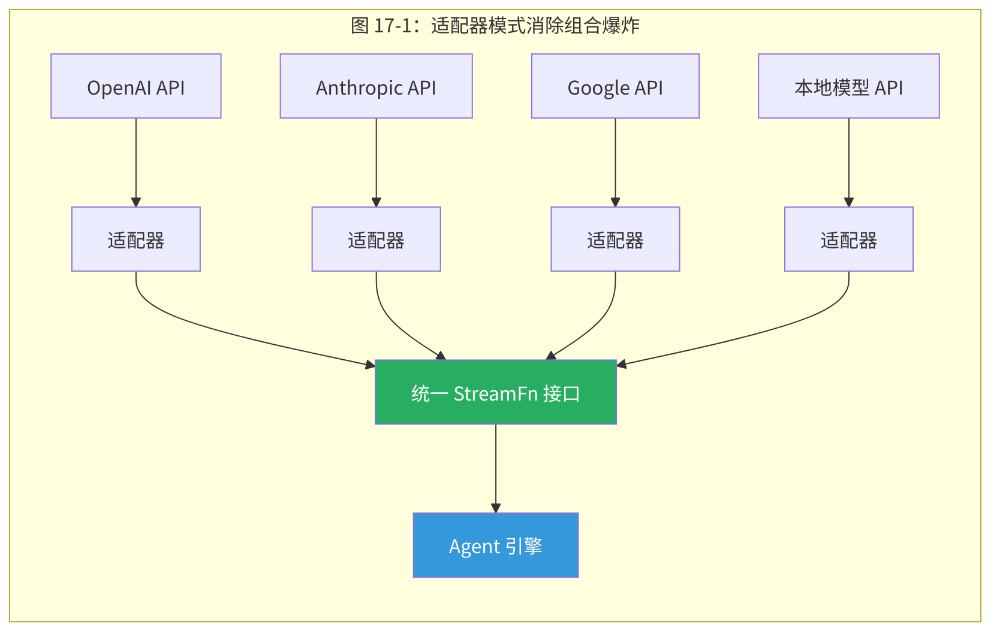
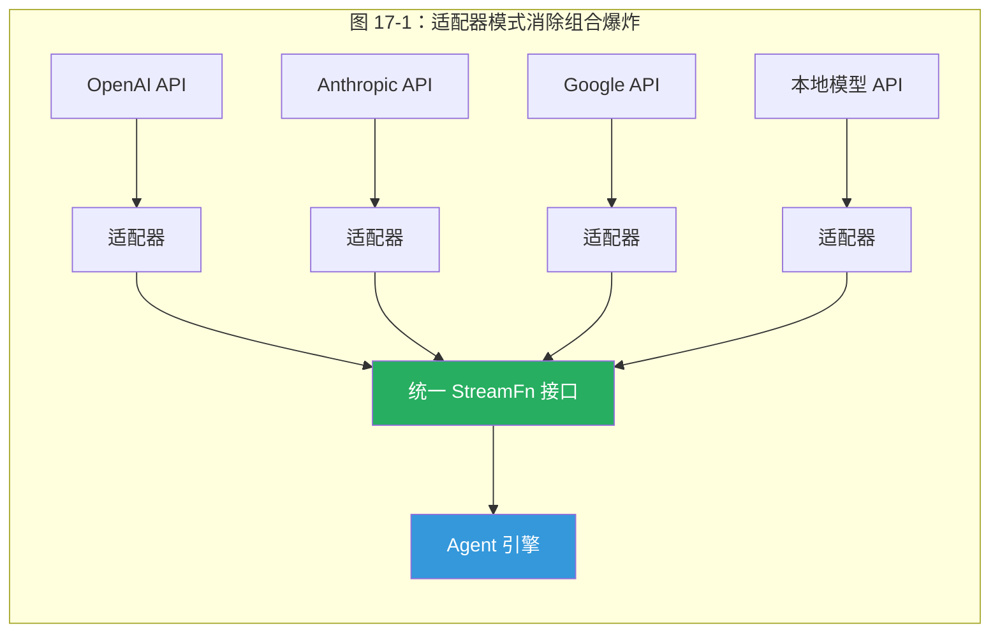
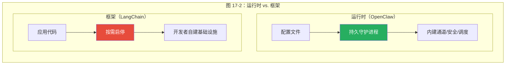

# 第17章 设计模式与架构决策

> *"运行时系统和框架的根本分歧在于：谁拥有 main 函数。框架说'你来调用我'，运行时说'我来调用你'。这一个控制反转，决定了安全能否集中执行、会话能否跨请求持久、配置能否零停机热更新。"*

> **本章要点**
> - 提炼 OpenClaw 中反复出现的七大设计模式：适配器、中间件管线、分层覆盖等
> - 理解"运行时 vs. 框架"这一最关键的架构决策及其深远影响
> - 掌握 Token 预算感知设计与推送式编排模式
> - 通过六维框架对比，建立 Agent 系统架构的全局视野


## 17.1 为什么这一章重要

如果前面十六章是"拆开钟表，审视每一个齿轮"，那本章就是"退后三步，看整座钟表为什么能精确走时"。

> 好的架构师不是记住了更多的组件，而是识别出了更深层的模式。棋手不是记住了更多棋局，而是看到了棋子之间的力学。

> **关键概念：设计模式（Design Patterns）**
> 设计模式是在特定上下文中反复出现的问题及其解决方案的提炼。OpenClaw 代码库中有七个反复出现的核心模式：适配器（驾驭异构性）、中间件管线（链式处理）、分层覆盖（配置灵活性）、快照与不可变性（并发安全）、推送式编排（避免轮询）、Token 预算感知（资源管理）和约定式发现（降低配置负担）。

我们不再聚焦于任何特定模块，而是提升到**模式**层面：哪些设计在 OpenClaw 代码库中反复出现？每个解决哪类问题？其他框架——LangChain、AutoGPT、CrewAI、Semantic Kernel、Dify——面对相同问题时做了什么不同选择？

这是全书**最可迁移**的一章。即使你从不使用 OpenClaw，这里提炼的模式和权衡，适用于你构建的任何 AI Agent 系统。模块会过时，框架会更替，但模式和思维方式会陪伴你整个职业生涯。

> 🔥 **深度洞察：模式是压缩后的经验——设计的"基因组"**
>
> 为什么设计模式比任何具体实现都更持久？答案来自**信息论与进化生物学的交叉点**。基因组不编码具体的蛋白质形状，它编码的是"如何在特定环境中制造蛋白质"的规则。同样，设计模式不编码具体的代码，它编码的是"如何在特定约束下做出权衡"的智慧。LangChain v0.1 和 v0.2 的 API 完全不同，但它们背后的适配器模式完全相同。OpenClaw 的代码可能在三年后面目全非，但"用函数式适配器而非类层次结构来驾驭异构性"这个洞察，在你遇到下一个异构系统时依然适用。**好的架构师不是收集具体方案的人——而是积累可迁移的判断力的人。** 这一章的价值，不在于你记住了 OpenClaw 的七个模式，而在于你下次面对新系统时，能自己识别出第八个。

> 📖 **历史小故事：适配器模式的意外起源**
>
> 设计模式的概念并非来自计算机科学——它来自建筑学。1977 年，建筑师 Christopher Alexander 出版了《A Pattern Language》，记录了 253 种建筑和城市设计中反复出现的解决方案。十六年后，1994 年，四位软件工程师（Erich Gamma、Richard Helm、Ralph Johnson、John Vlissides，被称为 "Gang of Four"）读了 Alexander 的书，灵光一闪：**软件设计中也有类似的重复模式！** 他们的《Design Patterns》一书从此改变了软件工程的面貌。其中"适配器模式"的灵感直接来自现实世界——你带着美式插头去欧洲旅行时用的电源转换器，就是适配器的完美实例。OpenClaw 的 Provider 层扮演的正是这个角色：LLM 世界的"万能电源转换器"，让任何"电器"（Agent 逻辑）都能插入任何"插座"（模型 API）。有趣的是，Alexander 本人后来对软件设计模式的发展方向颇有微词——他认为软件工程师过于关注模式的形式结构，而忽略了模式背后的"生活品质"。这个批评在今天读来依然振聋发聩：好的设计模式不是因为"它是一个模式"而值得使用，而是因为它真正改善了系统的某个品质——可维护性、可理解性、安全性。

## 17.2 适配器模式：驾驭异构性

### 17.2.1 问题的本质

OpenClaw 运行在一个极度异构的生态系统中：数十个 LLM 提供商，每个有不同的 API 格式、认证方式和能力特征；数十个通道，每个有不同的消息格式、媒体支持和速率限制；跨版本的工具定义格式，需要向前和向后兼容。

如果每个组合都需要专门的代码，复杂度将是 **O(提供商数 × 通道数 × 工具格式数)**——一个不可维护的组合爆炸。






### 17.2.2 OpenClaw 的适配器实现

**提供商适配器**（`src/providers/`）是最典型的案例。OpenClaw 不使用传统的类层次结构（如 LangChain 的 `ChatOpenAI extends BaseChatModel`），而是采用**函数式适配**：

```typescript
// 每个提供商只需实现一个 StreamFn 函数
type StreamFn = (params: {
  messages: Message[];
  tools?: ToolDef[];
  model: string;
  // ...
}) => AsyncGenerator<StreamEvent>;
```

每个提供商的适配器将特定 API 包装在这个统一的函数签名后。添加新提供商只需实现一个函数——不需要理解类继承层次，不需要处理虚函数覆盖的微妙语义。

**为什么选择函数而非类？** 三个原因：

1. **单方法接口不需要类**。一个只有一个方法的类本质上就是一个函数。类增加了样板代码（构造函数、属性）但没有增加表达力。
2. **避免继承的"脆弱基类"问题**。类层次结构中，基类的任何修改都可能破坏所有子类。函数签名的合约更简洁、更稳定。
3. **更容易测试**。测试一个函数只需要提供输入和验证输出。测试一个类需要考虑状态、生命周期和方法调用顺序。

> ⚠️ **注意**：函数式适配器模式在单方法接口场景下优于类继承，但在需要共享状态（如连接池、缓存）的场景下，闭包可能导致状态管理不够直观。OpenClaw 在需要共享状态的适配器中使用工厂函数返回闭包，而非类实例——这是一个有意的权衡，优先保证接口的简洁性。

### 17.2.3 工具格式适配

工具适配器展示了适配器模式的另一个变体——**运行时鸭子类型**：

```typescript
// 不是检查版本号，而是检查实际能力
if ('input_schema' in toolDef) {
  // Anthropic 格式
} else if ('parameters' in toolDef) {
  // OpenAI 格式
} else if ('inputSchema' in toolDef) {
  // 旧版格式
}
```

这比基于版本号的分支更健壮——版本号可能报告有误，但实际的数据结构不会撒谎。这是"鸭子类型"的经典应用：不关心它*声称*是什么，只关心它*实际*是什么。

### 17.2.4 与 LangChain 对比

LangChain 使用完整的适配器类层次结构：

```python
class BaseChatModel(ABC):
    @abstractmethod
    async def _agenerate(self, messages, **kwargs): ...

class ChatOpenAI(BaseChatModel):
    async def _agenerate(self, messages, **kwargs): ...

class ChatAnthropic(BaseChatModel):
    async def _agenerate(self, messages, **kwargs): ...
```

这种方法的优势是类型安全性更强，IDE 支持更好。但代价是：每个新提供商需要创建一个类文件，继承基类，处理所有抽象方法。OpenClaw 的函数式方法将这个成本降到最低——一个函数，一个文件。

## 17.3 中间件管线模式

### 17.3.1 问题的反复出现

"多个独立的处理阶段需要按顺序应用到数据上"——这个问题在 OpenClaw 中至少出现了四次：

1. **工具策略管线**（第10章）：七个独立的过滤阶段决定工具可用性。
2. **插件钩子系统**：三种交互模式（通知、转换、短路）的处理器链。
3. **消息预处理管线**：消息进入 Agent 前的翻译、脱敏、格式化。
4. **安全审计管线**：多个独立的安全检查按顺序执行。

### 17.3.2 管线的设计变体

不同的管线场景需要不同的**管线语义**：

**线性管线（Linear Pipeline）**：每个阶段处理数据后传递给下一个。没有跳过、没有回退。工具策略管线使用这种语义——每个策略阶段独立过滤，结果传递给下一个阶段。

```text
数据 → [阶段1] → [阶段2] → [阶段3] → 结果
```

**短路管线（Short-circuit Pipeline）**：某个阶段可以提前终止管线并返回结果。自动回复钩子使用这种语义——第一个匹配的规则直接响应。

```text
数据 → [阶段1: 不匹配] → [阶段2: 匹配！返回] → [阶段3: 不执行]
```

**分叉管线（Fork Pipeline）**：数据复制到多个并行阶段。通知钩子使用这种语义——所有处理器都执行，互不影响。

```text
        ┌→ [处理器A]
数据 → ├→ [处理器B]
        └→ [处理器C]
```

**为什么不统一成一种？** 因为不同的语义对性能、正确性和可调试性有不同的影响。线性管线最容易理解和调试（数据流线性、可预测），但不支持提前返回。短路管线支持优化（避免不必要的处理），但调试时需要理解"为什么后面的阶段没执行"。分叉管线最灵活但最难管理副作用。

### 17.3.3 管线 vs. 观察者模式

一个常见的替代方案是**观察者模式**（事件发布-订阅）。为什么 OpenClaw 选择管线而非观察者？

| 维度 | 管线 | 观察者 |
|------|------|-------|
| 执行顺序 | 确定性的 | 不确定的 |
| 数据流向 | 线性、可追踪 | 扇出、难追踪 |
| 调试难度 | 低（从头到尾跟踪） | 高（谁处理了这个事件？） |
| 安全审计 | 容易（记录管线每步） | 困难（观察者可能在任何地方） |

对于安全敏感的操作（如工具策略），**确定性执行顺序**是必需的——"后面的策略覆盖前面的"这个语义要求严格的执行顺序。观察者模式的不确定顺序会使策略组合不可预测。

## 17.4 分层覆盖模式

### 17.4.1 一个反复出现的非 GoF 模式

这不是经典 GoF（Gang of Four）设计模式，但在 OpenClaw 中反复出现的频率足以将其命名：

**分层覆盖**（Layered Override）：多个来源提供相同类型的配置，高优先级来源覆盖低优先级。

出现场景：
- **技能系统**：6 级优先级（extra → bundled → managed → personal → project → workspace）
- **模型配置**：静态定义 → 自动发现 → 配置文件 → 环境变量 → 逐 Agent 配置
- **工具策略**：配置文件 → 全局 → Agent → 群组

### 17.4.2 为什么总是完全替换？

所有分层覆盖场景中，覆盖语义始终是**完全替换**，非合并。这在第16章（技能系统）中已经讨论过，但值得从模式层面再次审视。

**合并的诱惑**：合并看起来更"智能"——高优先级只需声明它想改变的部分，其余继承低优先级。但合并引入了三个问题：

1. **删除语义不明确**。高优先级想*删除*低优先级的某个字段怎么办？需要引入特殊标记（如 JSON Merge Patch 的 `null` 表示删除），增加了复杂度。
2. **数组合并的歧义**。高优先级有 `[A, B]`，低优先级有 `[C, D]`。合并后是 `[A, B, C, D]`？`[A, B]`？`[C, D, A, B]`？没有一个"显然正确"的答案。
3. **调试时的因果链**。当最终配置出现意外值时，需要追溯"这个值来自哪一层"。合并使因果链变得更长——可能是三层合并的结果。完全替换使因果链最短——值来自*最高优先级声明了该键的层*。

**哲学对齐**：与 CSS 级联的逻辑一致——特异性和接近用户的程度决定哪个值胜出。CSS 在样式冲突时不"合并"两种颜色——更特异的选择器完全覆盖。

### 17.4.3 分层覆盖的通用实现

虽然 OpenClaw 没有提取一个通用的 `LayeredOverride<T>` 工具类，但各处的实现遵循相同的模式：

```typescript
// 伪代码：分层覆盖的通用逻辑
function resolve<T>(layers: Array<{ source: string; value?: T }>): T | undefined {
  // 从高优先级到低优先级遍历
  for (const layer of layers.reverse()) {
    if (layer.value !== undefined) {
      return layer.value;  // 第一个有值的层胜出
    }
  }
  return undefined;  // 所有层都没有定义
}
```

## 17.5 策略模式：优雅降级

### 17.5.1 为什么降级不是异常处理

在传统软件中，"第三方服务不可用"是异常——用 try-catch 处理，记录错误，返回降级响应。在 Agent 系统中，**降级是常态**。

LLM 提供商限流——正常。提供商超时——正常。上下文溢出——正常。认证令牌过期——正常。这些不是"异常情况"，而是"Agent 日常运行的一部分"。OpenClaw 的回应是将降级设计为**默认运行模式**，而非异常处理程序。

### 17.5.2 类别特定的恢复策略

模型回退链不是简单的"失败就换下一个"——不同类别的失败需要不同的恢复策略：

| 失败类别 | 恢复策略 | 原因 |
|---------|---------|------|
| 用户中止 | 立即终止 | 用户意图明确 |
| 超时 | 尝试下一个模型 | 可能是提供商问题 |
| 上下文溢出 | 尝试更大上下文的模型 | 换一个能装下的 |
| 限流 | 轮换认证配置文件 | 同一提供商可能有多个 API 密钥 |
| 认证错误 | 尝试其他提供商 | 当前提供商不可用 |
| 内容过滤 | 尝试其他提供商 | 不同提供商的过滤策略不同 |

这种分类的关键洞察是：**失败的类型决定了恢复的方向**。超时意味着"这个提供商可能暂时有问题"——换一个提供商最有效。上下文溢出意味着"输入太大"——换一个上下文更大的模型最有效。认证错误意味着"这个提供商不可用"——换一个完全不同的提供商最有效。

### 17.5.3 上下文压缩的反直觉设计

上下文压缩策略在接近上下文限制时压缩对话历史。实现中有一个反直觉的关键细节：

```typescript
// 摘要提示中的关键指令
"完全保留所有不透明标识符——UUID、文件路径、URL、变量名、
  命令字符串——不要简化或改写它们。"
```

为什么要特别强调保留标识符？因为 LLM 在做摘要时有"创意改写"的倾向——它可能将 `src/agents/tool-policy-pipeline.ts` 摘要为"工具策略管线代码"，丢失了具体路径。如果 Agent 后续需要读取这个文件，它只知道"工具策略管线代码"这个抽象描述，而不知道确切的文件路径。

这个细节揭示了 Agent 系统中上下文压缩的独特挑战：传统文本摘要追求语义保真，Agent 上下文压缩还需要追求**引用保真**——那些看起来不重要的标识符，实际上是 Agent 后续操作的关键锚点。

### 17.5.4 降级链的终止条件

一个容易遭到忽视的设计问题：降级链什么时候应该停止重试，直接报错？

OpenClaw 的回答是**双重终止条件**：

1. **所有候选模型都已尝试**。没有更多的选择了。
2. **降级超时**（默认 5 分钟）。即使还有未尝试的模型，如果总时间超过阈值也应停止——用户不会等 10 分钟。

第二个条件特别重要。考虑这个场景：3 个模型，每个超时 2 分钟。如果全部都超时，用户等了 6 分钟才看到错误。加上降级超时后，系统可能在 1 分钟后就中断第三个模型（总时间 5 分钟）。

## 17.6 全局状态：Symbol 键控单例

### 17.6.1 ESM 的单例挑战

CommonJS 中，`require()` 有缓存——同一模块只加载一次，模块级变量自然形成单例。但 ESM 的动态 `import()` 可能多次加载同一模块（不同的解析路径、不同的导入 URL），模块级变量因此不再是可靠的单例。

### 17.6.2 Symbol.for() 的解决方案

`Symbol.for()` 创建**全局唯一**的 Symbol——同一字符串键始终返回同一 Symbol，无论从哪个模块调用：

```typescript
const key = Symbol.for("openclaw.plugins.hook-runner-global-state");
const state = (globalThis[key] ??= { hookRunner: null, registry: null });
```

这个模式确保即使多次加载同一模块，各实例仍共享同一个全局状态——`globalThis` 和 `Symbol.for()` 都不受模块加载路径的影响。

### 17.6.3 刻意使用 var 的反直觉决策

`src/agents/subagent-registry.ts` 中刻意使用 `var`（而非 `let`）来避免循环导入解析中的**暂时性死区（Temporal Dead Zone）**。

ES6 中，`let` 和 `const` 在声明语句执行之前不可访问——即使经过了 hoist。循环导入场景下，模块 A 导入 B，B 又导入 A。B 执行到引用 A 的导出时，如果 A 用 `let` 声明的导出尚未执行，会抛出 `ReferenceError`。

`var` 不受暂时性死区限制——它在声明前的值是 `undefined` 而非错误。虽然 `undefined` 不理想，但至少不会崩溃——后续的初始化会在正确的时机设置真实值。

这是**务实的工程妥协**——理想情况下应该消除循环导入，但在大型代码库中彻底根治可能需要大规模重构。`var` 给出了一个低成本的缓解方案。

## 17.7 推送式编排

### 17.7.1 轮询的经济学灾难

**问题**：父 Agent 如何得知子 Agent 已完成任务？

**轮询方案**：父 Agent 反复调用 `sessions_list` 检查状态。每次轮询消耗一次 API 调用和 token。假设子 Agent 平均运行 5 分钟，轮询间隔 30 秒——需要 10 次轮询。如果有 5 个并行子 Agent，需要 50 次轮询。

```text
轮询成本 = 子Agent数 × 平均运行时间 / 轮询间隔 × 每次token成本
```

成本随子 Agent 数量**线性增长**。

**推送方案**：子 Agent 完成时触发通知，作为普通消息回合投递给父 Agent。无论有多少子 Agent，父 Agent 只在收到通知时消耗 token。

```text
推送成本 = 子Agent数 × 每次通知token（固定，约200 token）
```

成本与运行时间**无关**。

### 17.7.2 推送式通知的可靠性

推送比轮询更高效，但更难做到可靠——"你发了通知但我没收到"比"我轮询了但结果没变"更危险。

OpenClaw 通过公告队列（Announcement Queue）实现可靠推送：

| 特性 | 实现 |
|------|------|
| 重试 | 1s → 2s → 4s → 8s 退避，最多 3 次 |
| 超时过期 | 非完成通知 5 分钟过期，完成通知 30 分钟 |
| 幂等投递 | 通知 ID 去重，重复投递不会导致重复处理 |
| 错误宽限 | 15 秒内的投递错误不立即标记为失败 |

### 17.7.3 推送式编排的深层影响

推送式编排不仅影响成本——它改变了**编排的编程模型**。

**轮询模型**是命令式的：父 Agent 循环检查状态，根据状态做决策。整个编排逻辑在一个连续的执行流中。

**推送模型**是事件驱动的：父 Agent 发出子任务后"睡眠"。每个完成通知触发一次处理回合。编排逻辑分散在多个不连续的回合中——每个回合基于"到目前为止收到了哪些完成通知"来决定下一步。

这种模型更自然地适配了 LLM 的"回合制"交互模式——LLM 本来就是"收到消息、处理、回复"的模式，推送式通知天然地映射为"收到完成消息"的回合。

## 17.8 Token 预算感知设计

### 17.8.1 一个新的架构约束类别

这一元模式渗透 OpenClaw 的架构，代表与传统软件设计最显著的差异。在传统系统中，内存丰富、计算是瓶颈。在 Agent 系统中，**上下文窗口是瓶颈**——提示、历史、工具输出和技能指令竞争相同的有限预算。

这不仅仅是"性能优化"——它是一个**全新的架构约束类别**。在传统系统中，你不会因为"函数签名太长"而重新设计 API。在 Agent 系统中，你确实可能因为"工具描述占了太多 token"而重新设计工具接口。

### 17.8.2 Token 感知设计的具体体现

| 模块 | Token 感知设计 | 效果 |
|------|-------------|------|
| 技能系统 | 按需加载 | 48,000 → 3,000 token（16倍） |
| 浏览器 | 无障碍树 | 50,000 → 2,000 token（25倍） |
| Web 搜索 | 结构化结果 | 30,000 → 300 token（100倍） |
| 技能路径 | 路径压缩 | 每路径节省约 5 token |
| 技能目录 | 自适应降级 | 三层格式适应预算 |
| PDF | 页面选择 | 只加载需要的页面 |
| 上下文压缩 | 智能摘要 | 保留标识符的有损压缩 |

### 17.8.3 对传统设计模式的颠覆

Token 预算感知颠覆了一些传统的设计直觉：

**传统直觉**："提供更多信息总是更好。" → **Token 感知**："每一 token 的信息都有成本——多余的信息不是免费的，它直接压缩了可用于推理的空间。"

**传统直觉**："详细的错误消息帮助调试。" → **Token 感知**："错误消息也占用上下文。一个 500 token 的堆栈追踪可能不如一个 50 token 的精炼错误描述有用。"

**传统直觉**："缓存经常访问的数据。" → **Token 感知**："在上下文中缓存数据意味着每一轮都携带它。如果数据只用一次，缓存反而浪费。"

这个模式在传统 GoF 中没有对应物。它是 LLM 系统独有的新架构关注类别——可以称之为**"Token 经济学"**。传统软件的稀缺资源是 CPU 时间和内存带宽；Agent 系统的稀缺资源是上下文窗口中的每一个 token——它既是工作记忆，也是通信带宽，还是计费单位。三位一体的约束，前所未有。

## 17.9 运行时 vs. 框架：最关键的架构决策

### 17.9.1 定义差异

OpenClaw 和 LangChain 都是"AI Agent 解决方案"，但它们的**架构定位**截然不同：

| 维度 | 运行时（OpenClaw） | 框架（LangChain） |
|------|-------------------|-------------------|
| 使用方式 | 写配置 | 写代码 |
| 生命周期 | 持久守护进程 | 随应用启停 |
| 多通道 | 原生支持 8+ 通道 | 需自己构建 |
| 后台任务 | 内建 Cron/心跳 | 需自己构建 |
| 安全执行 | 集中策略管线 | 开发者负责 |
| 灵活性 | 受配置面约束 | 最大 |
| 学习曲线 | 低（配置即用） | 高（需要编程） |




### 17.9.2 这个选择的深层原因

OpenClaw 选择成为运行时而非框架，反映了一个信念：AI Agent 系统的困难问题——可靠投递、安全执行、会话管理、模型回退——是**基础设施问题**，最好在共享运行时中一次解决而非在每个应用中重复解决。正如每栋写字楼不需要自建发电厂，每个 Agent 应用也不需要自建安全审计和通道管理。

类比：Web 开发中，Nginx 是运行时，Express.js 是框架。两者都能服务 HTTP 请求，但 Nginx 解决了 TLS 终止、负载均衡、静态文件服务等基础设施问题，让 Express.js 专注于应用逻辑。OpenClaw 相对于 LangChain 的关系类似——它解决了通道连接、安全策略、模型回退等基础设施问题。

### 17.9.3 这个选择的代价

选择运行时意味着放弃了框架的某些优势：

1. **可编程性**：运营者无法用代码定义自定义的工具调用逻辑——只能在配置面提供的选项中选择。
2. **嵌入性**：OpenClaw 不能作为库嵌入到现有应用中——它是独立进程。
3. **架构锁定**：运营者必须接受 OpenClaw 的架构假设（单运营者、通道模型、工具策略管线）。

这些代价是真实的，但 OpenClaw 判断它们对目标用户（个人或小团队的 Agent 运营者）是可接受的——这些用户更需要"开箱即用"而非"完全可编程"。

### 17.9.4 混合方案：运行时 + 扩展点

OpenClaw 不是在"运行时"和"框架"之间做二选一——它在运行时基础上开放了有限的扩展点：

- **插件系统**（第9章）允许以代码方式扩展通道、提供商和工具。
- **技能系统**（第16章）允许以 Markdown 方式扩展 Agent 的知识。
- **ACP**（第6章）允许编排外部 Agent 进程。

这种"运行时 + 扩展点"的混合模型，比纯运行时更灵活，比纯框架更省心——80% 的需求通过配置满足，20% 的需求通过扩展点满足。

## 17.10 六维框架对比

| 维度 | OpenClaw | LangChain | AutoGPT | CrewAI | Semantic Kernel | Dify |
|---|---|---|---|---|---|---|
| **核心抽象** | 网关+会话 | 链+Agent | 思考循环 | 团队+角色 | 内核+规划器 | 工作流节点 |
| **多模型** | 原生+回退 | 适配器类 | 单模型 | 支持 | 原生 | 模型节点 |
| **通道** | 原生 8+ | 第三方 | 无 | 无 | 无 | Web Chat |
| **安全** | 7层管线 | 无内建 | 有限 | 无内建 | 有限 | 沙箱 |
| **部署** | 常驻守护进程 | 库 | 独立进程 | 库 | 库 | SaaS |
| **Token 感知** | 全栈设计 | 有限 | 无 | 无 | 有限 | 有限 |

### 17.10.1 不同框架的设计哲学

每个框架反映了不同的**设计哲学**：

- **LangChain**："给开发者积木，让他们自己搭。" — 最大灵活性，最少预设。
- **AutoGPT**："给 AI 自主思考的自由。" — 自治优先，人类干预最小。
- **CrewAI**："用人类组织模型（团队、角色）来组织 Agent。" — 类比人类协作。
- **Semantic Kernel**："让 LLM 成为编程语言的一等公民。" — 深度语言集成。
- **Dify**："让非技术人员也能构建 Agent。" — 可视化优先。
- **OpenClaw**："给 Agent 一个稳定、安全、全面的运行环境。" — 基础设施优先。

没有哪个哲学是"正确"的——它们服务不同的用户和场景。理解这些差异比评判"谁更好"更有价值。

## 17.11 Agent 系统的新兴模式

从 OpenClaw 的设计中，我们可以提炼出七种 Agent 系统独有的设计模式。这些模式在传统 GoF 中没有对应物，但越来越多的 Agent 框架独立发现了它们：

### 17.11.1 Token 预算感知加载
**问题**：上下文窗口有限但消费者众多。
**方案**：按需加载、需时加载、预算超出时优雅降级。
**实例**：技能系统、浏览器快照、搜索结果压缩。

### 17.11.2 分层覆盖配置
**问题**：多个来源的配置需要合理组合。
**方案**：明确的优先级层次，完全替换语义，可预测且可调试。
**实例**：技能 6 级优先级、工具策略 7 层管线。

### 17.11.3 推送式编排
**问题**：编排者需要知道下游任务的完成状态。
**方案**：完成时推送通知而非轮询状态，带重试和去重。
**实例**：子 Agent 完成通知、公告队列。

### 17.11.4 纵深防御安全
**问题**：单一安全层不够。
**方案**：多个独立层，每个捕获不同风险类别，假设其他层可能失败。
**实例**：5 层安全模型、7 层工具策略。

### 17.11.5 优雅降级链
**问题**：主方案失败时需要替代。
**方案**：按失败类别选择恢复策略，而非简单重试。
**实例**：模型回退链、搜索引擎回退。

### 17.11.6 能力自适应发现
**问题**：系统的能力随运行时环境动态变化。
**方案**：声明式能力注册 + 动态资格检查 + 自动调整。
**实例**：Node 能力路由、技能动态资格。

### 17.11.7 不可变快照协调
**问题**：生产者和消费者之间的竞态条件。
**方案**：版本化快照消除读写竞争，版本号驱动更新。
**实例**：技能快照、配置快照。

## 17.12 实战推演：一个架构决策的完整推导过程

让我们用一个具体问题，展示如何运用本章的设计模式做出架构决策。

### 17.12.1 问题：Agent 需要同时支持 Web 搜索和学术论文搜索

你正在构建一个研究助手 Agent。它需要两种搜索能力：
- 通用 Web 搜索（Brave、Google）
- 学术论文搜索（Semantic Scholar、arXiv）

这两种搜索有不同的 API 格式、认证方式、结果结构。如何设计？

### 17.12.2 运用模式推导

**适配器模式（17.2）→** 两种搜索引擎有不同的 API，但 Agent 不应该关心差异。设计统一的 `SearchResult` 接口，每个搜索引擎提供适配器。

**策略模式（17.5）→** 如果 Brave API 限流了，自动降级到 Google。如果 Semantic Scholar 超时，降级到 arXiv。不同的失败类型触发不同的降级策略。

**Token 预算感知（17.8）→** 学术论文的摘要通常比网页 snippet 长 3-5 倍。搜索结果的格式化需要考虑 token 成本。10 篇论文摘要 ≈ 5,000 token vs. 10 个网页 snippet ≈ 500 token。可能需要限制论文搜索只返回标题和关键词，完整摘要按需加载。

**分层覆盖（17.4）→** 搜索配置需要多级：全局默认（搜索引擎偏好）→ Agent 级（研究助手偏好学术搜索）→ 会话级（用户在特定对话中指定只搜论文）。

> 好的架构决策不是灵光一闪——而是在正确的问题上应用正确的模式。模式不是答案，而是*提问的框架*。当你面对一个设计问题时，试着问："这里有适配器模式吗？有降级需求吗？有 token 成本考量吗？"——这些问题本身就会指引你走向合理的设计。

## 17.13 设计清单：构建 Agent 系统时的架构检查表

以下是从 OpenClaw 的设计经验中提炼的实用检查表。无论你是使用 OpenClaw、构建自己的 Agent 框架，还是评估竞品方案，这份清单都能帮你发现关键的设计盲点。

### 17.12.1 Token 与上下文管理

- [ ] **上下文预算分配**：是否明确了系统提示、工具定义、对话历史、工具输出各自的 token 预算？
- [ ] **工具输出压缩**：工具返回的数据（网页、搜索结果、文件内容）是否有压缩策略？占多少 token？
- [ ] **按需加载**：知识/技能/指令是否按需加载，还是全部塞进系统提示？
- [ ] **降级策略**：上下文不够时怎么办？截断？摘要？格式降级？
- [ ] **标识符保留**：上下文压缩时是否保留了文件路径、URL、UUID 等 Agent 后续需要的锚点？

### 17.12.2 安全与权限

- [ ] **层次防御**：安全模型是否有多个独立层，而非依赖单一防线？
- [ ] **默认安全**：新功能和新用户的默认配置是最安全的吗？
- [ ] **凭证隔离**：API Key 是否避免在配置文件和日志中明文出现？
- [ ] **命令执行控制**：Agent 能执行 Shell 命令吗？有分级控制吗？
- [ ] **提示注入防御**：外部内容（用户输入、网页内容、工具输出）是否有消毒/边界隔离？
- [ ] **审计追踪**：所有安全相关操作（命令执行、凭证访问、配置变更）是否有审计日志？

### 17.12.3 多模型与降级

- [ ] **模型回退链**：主模型不可用时是否有自动回退？回退策略是否区分失败类型？
- [ ] **提供商隔离**：提供商 API 变更是否影响核心逻辑？是否有适配器层隔离？
- [ ] **逐任务模型选择**：不同类型的任务（摘要 vs 编码 vs 监控）是否可以使用不同的模型？
- [ ] **成本感知**：是否有机制防止高频任务使用昂贵模型？

### 17.12.4 多通道与路由

- [ ] **通道抽象**：核心逻辑是否依赖特定通道的 API？添加新通道需要修改核心代码吗？
- [ ] **消息格式化**：同一条回复在不同通道上是否有适配的格式（Markdown → 纯文本→富文本）？
- [ ] **安全差异化**：不同通道（DM vs 公共频道 vs API）是否有不同的信任级别和权限？

### 17.12.5 编排与可靠性

- [ ] **推送优于轮询**：子任务完成时是推送通知还是父 Agent 轮询状态？
- [ ] **优雅降级**：任何单个组件失败时，系统是否能继续提供部分服务？
- [ ] **重启恢复**：进程重启后是否能恢复之前的状态？错过的定时任务是否有追赶机制？
- [ ] **超时保护**：长时间运行的操作是否有超时？防止失控进程无限运行？

### 17.12.6 可观测性与运维

- [ ] **结构化日志**：日志是否为 JSON 等可查询格式？是否自动脱敏？
- [ ] **健康检查**：是否有端点让监控系统判断"系统是否正常"？
- [ ] **诊断命令**：是否有一键诊断工具（类似 `doctor`）检查常见问题？
- [ ] **配置变更追踪**：配置修改是否有记录？出问题时能否追溯到"哪个变更导致的"？

### 17.12.7 开发者体验

- [ ] **零配置启动**：新用户能否在 5 分钟内让系统跑起来？
- [ ] **错误即文档**：每个错误消息是否包含"怎么修"的建议？
- [ ] **渐进式复杂度**：简单场景是否简单？复杂功能是否可选？
- [ ] **非交互模式**：所有交互操作是否支持脚本自动化（CI/CD 友好）？

> **使用建议**：不必一次性全部满足。根据你的 Agent 系统所处的阶段（原型 → MVP → 生产），优先关注不同的检查项。原型阶段关注 Token 管理和基本安全即可；生产阶段则需要完整覆盖。

## 17.13 本章小结

OpenClaw 的架构是设计模式应用于 AI Agent 系统的活案例。经典模式（适配器、管线、策略、单例）适配了 Agent 特定约束。新模式（Token 预算感知加载、推送式编排、分层覆盖）从 LLM 系统独有的挑战中涌现。17.12 节的设计清单将这些模式转化为可操作的检查项——无论你是在构建、评估还是维护 Agent 系统，它都是一份值得反复参考的实用工具。

**核心洞察**：OpenClaw 中最重要的架构决策不是任何单个模式——而是选择成为**运行时系统**而非**编程框架**。这一决策级联贯穿整个架构：配置替代代码成为主要接口，安全策略集中执行而非依赖开发者实现，生产关注点（日志、重启、监控）内建而非附加。理解这一选择背后的动机比记忆任何特定模式更有价值——因为动机揭示了塑造所有 Agent 系统架构的力量。

而在模式层面，**Token 预算感知设计**是 Agent 系统贡献给软件工程的全新思维工具。

> **"这占多少 token？值得吗？"——这是传统软件从不需要问的问题，却是 Agent 系统每一个设计决策的隐形标尺。**

当系统的"工作记忆"变成稀缺资源时，每一个数据结构、每一个接口设计、每一个输出格式都需要回答这个问题。

至此，我们完成了对 OpenClaw 的逐层解剖与模式提炼。最后一章将视角从分析转向实践——当你掌握了所有齿轮的运作原理后，如何将它们组装成你自己的 Agent 帝国？

### 思考题

1. **概念理解**：本章提炼了多个设计模式（如"不可变快照"、"有界优雅降级"、"策略管线组合"）。选择其中两个，分析它们解决的是哪一类系统性问题，以及在非 Agent 系统中是否同样适用。
2. **实践应用**：如果你要设计一个全新的 Agent 框架，你会从 OpenClaw 的设计模式中借鉴哪三个？会放弃哪些？为什么？
3. **开放讨论**：架构决策中最困难的不是"选什么"，而是"放弃什么"。在 OpenClaw 的设计决策中，你认为哪个权衡最有争议？你会做出不同的选择吗？

### 📚 推荐阅读

- [Design Patterns: Elements of Reusable Object-Oriented Software (GoF)](https://en.wikipedia.org/wiki/Design_Patterns) — 设计模式的经典之作，本章多个模式源于此书
- [Software Architecture: The Hard Parts (Ford et al.)](https://www.oreilly.com/library/view/software-architecture-the/9781492086888/) — 架构决策中的权衡艺术
- [Architectural Styles and the Design of Network-based Software Architectures (Roy Fielding)](https://ics.uci.edu/~fielding/pubs/dissertation/top.htm) — REST 之父的博士论文，理解架构风格的理论基础
