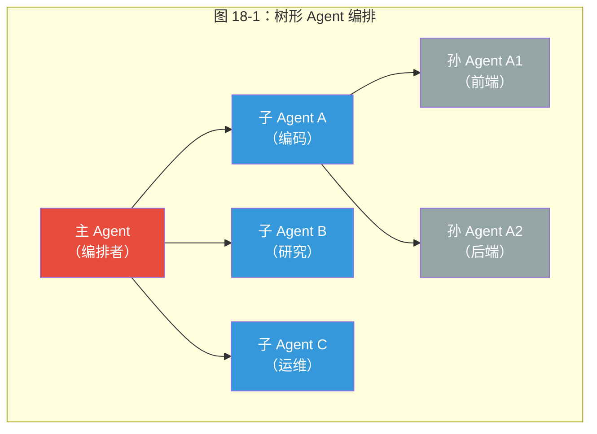
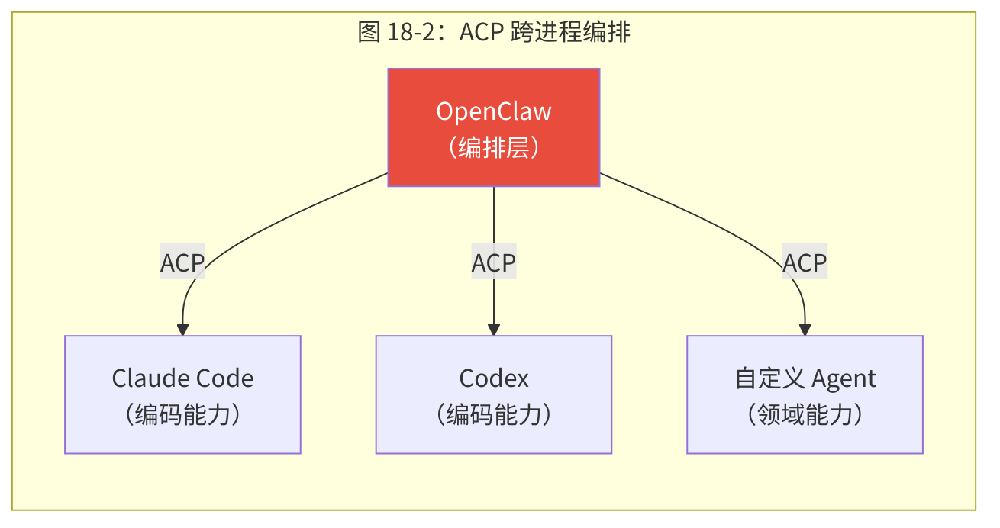
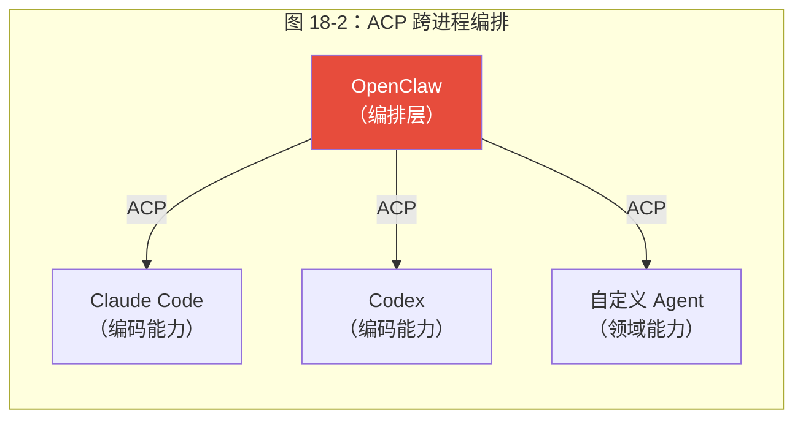
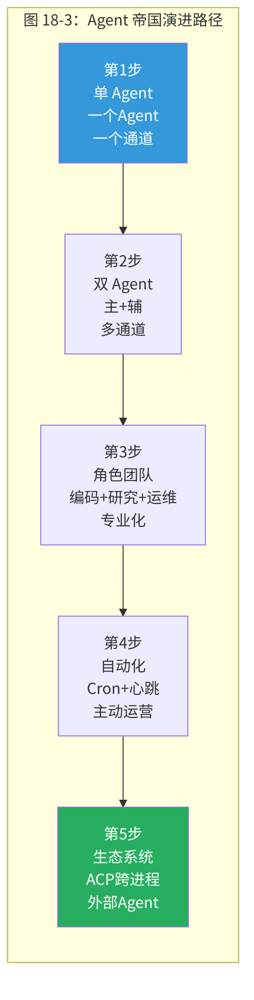
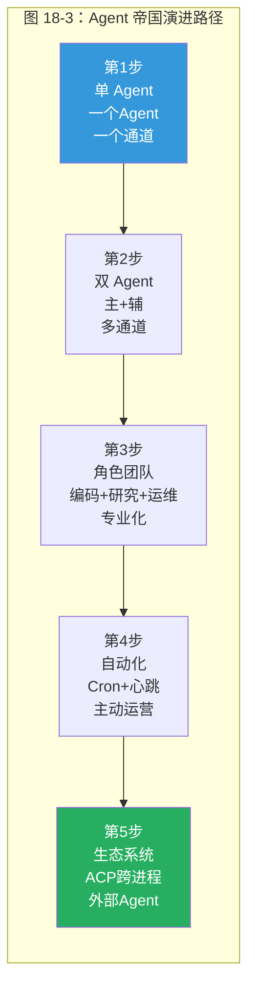

<div v-pre>

# 第18章 构建你自己的 Agent 帝国

> *"单 Agent 的天花板不是智能不够，而是上下文不够。200K token 听起来很多，但一次深度代码审查就能吃掉 80K——还没开始回复，预算已经过半。多 Agent 编排的本质，是用进程隔离换上下文空间。"*

> **本章要点**
> - 理解单 Agent 天花板的四个根本限制
> - 掌握树形编排模型与四种编排策略（委托、管线、竞争、混合）
> - 深入多 Agent 编排的核心难题：状态共享、故障传播、资源竞争
> - 规划从单 Agent 到 Agent 帝国的演进路径


## 18.1 从齿轮到机器

十七章，我们在源码层面逐一解剖了 OpenClaw 的每一个齿轮和螺钉——从 Gateway 的生命周期管理到 Provider 的模型降级，从 Session 的上下文压缩到安全系统的纵深防御。每个组件都已了然于胸。

但零件堆在桌上不是机器。最后一章，我们将视线从微观拉升到宏观：如何将这些精密组件**组装成一台运转的机器**——一个你自己的 Agent 帝国？

> 理解每一个音符不等于能演奏交响曲。本章讲的是指挥的艺术——何时让铜管齐鸣，何时让弦乐独唱，何时所有声部在一个和弦上交汇。

## 18.2 单 Agent 天花板：四个根本限制

大多数人从单 Agent 开始——配置一个 Agent，连接一个通道，分配一个模型。这在简单场景下完美工作。但随着任务复杂度增长，单 Agent 会撞上四面墙：

### 18.2.1 上下文耗尽

即使 200K token 的上下文窗口也可能不够完成需要同时研究、编码和沟通的复杂任务。一次深度代码审查可能消耗 50K token 的代码内容 + 20K token 的讨论历史 + 10K token 的系统提示和技能——80K token 用完了，Agent 还没开始回复。

**量化分析**：假设一个"全栈任务"——研究技术方案（读 5 篇文章 × 5K token = 25K）、编写代码（读 10 个文件 × 3K token = 30K）、提交 PR 并写说明（5K）。仅输入就需要 60K token。如果上下文窗口是 128K，留给推理和对话历史的只有 68K——而且这还没算系统提示和工具定义。

### 18.2.2 焦点稀释

一个 Agent 同时处理编码、搜索和沟通，不如三个专家。系统提示因每种场景的指令而臃肿。

**反事实分析**：想象一个系统提示同时包含"代码风格指南"（2K token）、"搜索策略"（1K token）、"沟通礼仪"（1K token）和"安全规则"（1K token）。如果 Agent 在编码，后三项的 3K token 完全是浪费。在三个专业 Agent 中，每个只需要与其角色相关的指令——token 利用率提高了 3-4 倍。

### 18.2.3 无并行性

独立子任务顺序执行。可以并行五个搜索的研究任务却要逐个等待。

**时间成本**：5 个搜索 × 每个 10 秒 = 50 秒（顺序）vs. 10 秒（并行）。在一个包含 20 个独立子任务的复杂工作流中，并行 vs. 顺序的差异可能是 5 分钟 vs. 45 分钟。

### 18.2.4 单点故障

模型调用在任务中途失败，整个工作流停止。单 Agent 中没有"部分完成"的概念——要么全部成功，要么从头再来。

多 Agent 编排突破了全部四个限制。但它引入自己的挑战——这些挑战是本章的核心主题。

> **关键概念：树形编排模型（Tree Orchestration）**
> OpenClaw 的多 Agent 编排采用树形结构——主 Agent 生成子 Agent，子 Agent 可进一步生成孙 Agent，层级有可配置的深度限制。选择树而非图的原因是：树形结构保证了清晰的父子关系、单一的控制链和可预测的资源管理。图形拓扑（任意 Agent 间通信）虽然更灵活，但会带来死锁风险、审计困难和资源管理的组合爆炸。

> 💡 **最佳实践**：从单 Agent 开始，只在遇到明确的瓶颈（上下文耗尽、焦点稀释、需要并行性）时才引入多 Agent 编排。过早的多 Agent 设计会增加调试复杂度和 Token 消耗——每个子 Agent 都需要独立的系统提示和上下文窗口。

> 🔥 **深度洞察：多 Agent 编排的本质是组织设计，不是技术实现**
>
> 单 Agent 到多 Agent 的跃迁，表面上是技术问题（如何 spawn 子进程、如何传递上下文），本质上却是**组织设计问题**。管理学家 Herbert Simon 在 1960 年代研究组织结构时发现：人类组织采用层级结构不是因为命令效率高，而是因为层级是**管理复杂度的最经济方式**——每一层只需理解自己下一层的接口，而非整个系统。OpenClaw 的树形 Agent 编排重新发现了同一条真理：主 Agent 不需要理解子 Agent 的内部推理，只需要理解它返回的结果。这不是巧合——**任何系统在复杂度超过单个处理单元的认知能力时，都会自发演化出层级结构**，无论这个处理单元是人、细胞还是 AI Agent。你不是在"设计" Agent 架构——你是在为 AI 劳动力做组织设计。招聘、分工、汇报关系、绩效评估——这些概念在 Agent 编排中一一对应。

## 18.3 树形编排：OpenClaw 的多 Agent 模型

### 18.3.1 为什么是树而不是图？

OpenClaw 的多 Agent 模型是一棵**树**：主 Agent 生成子 Agent，子 Agent 可以进一步生成孙 Agent，有可配置的深度限制。




替代方案是**图**（任意 Agent 之间的通信）。为什么不选图？

**图的问题1：死锁**。Agent A 等待 Agent B 的结果，Agent B 等待 Agent A 的结果。在树中，通信只能沿着边（父→子或子→父）发生，消除了循环依赖的可能。

**图的问题2：责任不清**。如果 Agent A 和 Agent B 同时修改了同一个文件，谁的版本生效？在树中，父 Agent 协调子 Agent，天然是冲突的仲裁者。

**图的问题3：调试地狱**。在图中追踪"这个决策是怎么做出的"可能需要遍历整个图。在树中，因果链是从根到叶的清晰路径。

**权衡**：树限制了通信灵活性——兄弟 Agent 之间不能直接通信（必须通过父 Agent 中继）。但这种限制恰好强制了一个健康的架构属性：每个 Agent 都有明确的上级，避免了"谁负责"的歧义。

### 18.3.2 两种生成模式

OpenClaw 提供两种子 Agent 生成模式：

**`run` 模式**（一次性执行）：子 Agent 执行任务，返回结果，自动清理。类似函数调用——有输入，有输出，执行后消失。

```text
主 Agent → spawn(run, "翻译这段文字为英文") → 子 Agent 执行 → 返回翻译 → 子 Agent 销毁
```

**`session` 模式**（持久会话）：子 Agent 完成任务后保持活跃。可以后续发送更多消息。类似启动一个服务——它持续运行直到显式终止。

```text
主 Agent → spawn(session, "你是代码审查专家") → 子 Agent 常驻 → 可以多次发送代码审查请求
```

选择哪种模式取决于**任务的交互性**：一次性结果用 `run`；需要多轮交互用 `session`。

### 18.3.3 推送式完成通知

这在第17章已经从模式角度分析过，这里从实践角度补充。

子 Agent 完成时，结果作为普通消息回合投递给父 Agent——无轮询循环、无浪费 API 调用。完成通知通过子 Agent 注册表管理：

| 机制 | 细节 |
|------|------|
| 重试 | 1s → 2s → 4s → 8s 退避，最多 3 次 |
| 过期 | 完成通知 30 分钟硬限制 |
| 幂等 | 通知 ID 去重 |
| 宽限 | 15 秒内的投递错误不标记为失败 |

**为什么有 30 分钟硬限制？** 如果完成通知 30 分钟内未能投递，说明父 Agent 可能已经崩溃或已遭清理。继续重试只是浪费资源。运营者可以通过审计日志发现和处理这种情况。

### 18.3.4 ACP：跨进程 Agent 通信

Agent 通信协议（ACP）将子 Agent 编排扩展到**外部进程**。这意味着 OpenClaw 不仅可以编排自己的 Agent，还可以编排 Claude Code、Codex、OpenCode 等外部 Agent 运行时。






ACP 的关键设计决策是**使用 stdin/stdout 作为传输层**——这是最通用的进程间通信方式，几乎所有编程语言和操作系统都支持。不需要特殊的 SDK 或运行时——只要一个进程能从 stdin 读 JSON 并向 stdout 写 JSON，OpenClaw 就能编排它。

这将 OpenClaw 从单体运行时转变为**编排层**——它不需要自己实现所有 Agent 能力，而是协调最适合每项任务的 Agent 运行时。

## 18.4 编排模式：四种策略

### 18.4.1 顺序式编排

步骤逐一执行。简单可靠，但不利用并行性。

```text
步骤1：研究技术方案 → 步骤2：编写代码 → 步骤3：编写测试 → 步骤4：提交 PR
```

适用场景：步骤之间有严格依赖——后一步需要前一步的输出。

### 18.4.2 扇出/扇入编排

同时生成多个子 Agent，等待全部完成，处理组合结果。

```text
         ┌→ 子Agent A（搜索技术方案）→┐
主Agent →├→ 子Agent B（搜索竞品分析）→├→ 主Agent 综合结果
         └→ 子Agent C（搜索用户反馈）→┘
```

适用场景：独立子任务可并行执行——如搜索、翻译、代码分析。

**关键挑战**：如何综合多个子 Agent 的结果？如果三个搜索子 Agent 返回了矛盾的信息怎么办？主 Agent 需要有足够的判断力来消歧。

### 18.4.3 条件分支编排

根据子 Agent 结果决定继续、重试或升级。

```text
主Agent → 子Agent（编码）→ 结果
  如果成功 → 继续下一步
  如果失败（可恢复）→ 重试，提供更多上下文
  如果失败（不可恢复）→ 升级到人类
```

适用场景：需要根据中间结果调整策略——代码审查中发现严重问题时切换到深度分析模式。

### 18.4.4 事件驱动编排

最灵活的模式——不预先规划所有步骤，而是动态响应每个完成事件。

```text
子Agent A 完成 → 根据结果决定启动子Agent D 或 E
子Agent B 完成 → 检查与 A 的结果是否冲突
子Agent D 完成 → 所有前置条件满足，生成最终报告
```

适用场景：探索性任务——事先不知道需要多少步骤或哪些子任务。

### 18.4.5 深度限制

实践经验表明**两层**（主 + 子）处理大多数场景。三层是实际最大值。

为什么不能更深？两个原因：

1. **信息损失**：每一层传递时都会丢失上下文。主 Agent 的指令到达孙 Agent 时，子 Agent 的理解可能已经过滤掉部分信息。
2. **调试复杂度**：调试两层编排需要检查两个对话历史。调试三层需要检查三个。每增加一层，调试时间大约翻倍。

## 18.5 多 Agent 编排的核心难题

### 18.5.1 委托准确性问题

多 Agent 编排的最大挑战不是技术实现——而是**委托准确性**。当主 Agent 向子 Agent 描述任务时，自然语言的模糊性可能导致理解偏差。

**问题**："修复这个 bug" — 修复到什么程度？是否需要添加测试？是否需要更新文档？子 Agent 如何判断"修复完成"？

**缓解策略**：

1. **结构化任务描述**：不说"修复这个 bug"，而说"文件 X 第 Y 行的空指针异常，原因是 Z 可能为 null，修复方案：添加 null 检查。完成标准：修改通过现有测试，不引入新的类型错误。"
2. **明确的成功标准**：告诉子 Agent "完成后运行 `npm test`，如果所有测试通过就算完成"。
3. **约束边界**：告诉子 Agent "只修改 `src/utils/` 下的文件，不要修改 `src/core/`"。

### 18.5.2 上下文隔离问题

子 Agent 有独立的上下文窗口——它看不到主 Agent 的对话历史。这意味着主 Agent 必须在任务描述中包含所有子 Agent 需要的上下文。

**权衡**：传递太少上下文，子 Agent 可能做出错误决策（因为缺少信息）。传递太多上下文，消耗子 Agent 的上下文窗口空间（留给实际工作的空间减少）。

**最佳实践**：传递"最小充分上下文"——子 Agent 完成任务所需的最少信息。这需要主 Agent 有能力判断"哪些信息是子 Agent 需要的"——这本身是一个需要智能的判断。

### 18.5.3 结果整合问题

当多个子 Agent 返回结果时，主 Agent 需要整合它们。如果结果是互补的（不同角度的研究），整合相对简单。如果结果是矛盾的（两个编码方案冲突），整合需要判断和决策能力。

### 18.5.4 孤儿 Agent 问题

如果主 Agent 崩溃或遭到清理，正在运行的子 Agent 变成"孤儿"——没有父 Agent 接收它们的结果。

OpenClaw 通过几个机制处理孤儿：
- **超时清理**：子 Agent 有最大运行时间限制。
- **启动恢复**：网关重启时扫描和清理孤儿会话。
- **通知过期**：完成通知 30 分钟后过期，系统最终丢弃孤儿的结果。

## 18.6 安全边界：多 Agent 的安全挑战

### 18.6.1 信任传递问题

主 Agent 有 `full` 权限。它生成的子 Agent 应该继承这些权限吗？

**完全继承**：子 Agent 拥有主 Agent 的所有权限。简单但危险——提示注入攻击一旦突破子 Agent，攻击者即获得完整权限。

**最小权限**：子 Agent 只获得完成任务所需的最少权限。更安全但更复杂——主 Agent 需要判断"完成这个任务需要哪些权限"。

**OpenClaw 的方案**：子 Agent 继承父 Agent 的配置文件（profile），但可以通过显式配置进一步限制。策略管线的 Agent 级策略可以为特定子 Agent 设置独立的工具限制。

### 18.6.2 凭证隔离

子 Agent 不应该看到主 Agent 的所有凭证。特别是技能系统的环境变量注入（第16章的 `getActiveSkillEnvKeys()`）确保子 Agent 进程不会继承父 Agent 的技能密钥。

### 18.6.3 工作区隔离

多个子 Agent 同时操作文件系统时，需要避免冲突。OpenClaw 通过以下机制提供隔离：

- **工作区子目录**：每个子 Agent 可以在独立的子目录中工作。
- **文件锁**：关键文件使用顾问锁防止并发修改。
- **Docker 沙箱**：在 Docker 容器中运行子 Agent，提供进程级隔离。

## 18.7 企业级设计原则

将 Agent 编排从个人实验提升到生产系统，需要遵循几个原则：

### 18.7.1 可观测性

你无法管理你看不见的东西。

**结构化日志**：每个 Agent 的每个操作都以 JSON Lines 格式记录。日志包含 Agent ID、会话 ID、父 Agent ID——允许重建完整的编排树。

**用量追踪**：Token 消耗按 Agent、按模型、按任务追踪。这让运营者能回答"这个工作流花了多少钱？哪个子 Agent 最贵？"。

**生命周期事件**：Agent 的创建、完成、失败、超时都发出事件。监控系统可以基于这些事件构建告警。

### 18.7.2 容错

生产系统不能假设一切正常。

**模型回退**（第17章）：每个 Agent 都有独立的回退链。子 Agent A 使用 Claude 失败时，切换到 GPT-4o，不影响子 Agent B。

**上下文压缩**：长对话自动压缩，保留标识符。

**超时保护**：每个子 Agent 有最大运行时间。防止失控的子 Agent 无限期运行。

### 18.7.3 成本控制

多 Agent 编排的成本可以快速失控。

**逐 Agent 模型选择**：编排者用 Claude Opus（需要判断力），研究者用 GPT-4o-mini（需要大量搜索但判断简单），编码者用 Claude Sonnet（平衡能力和成本）。

**深度限制**：限制 Agent 树的最大深度（默认 2-3 层）防止递归生成。

**并行限制**：限制同时运行的子 Agent 数量。5 个并行子 Agent 使用 Claude Opus 的成本约 $0.5/任务——50 个并行子 Agent 就是 $5/任务。

## 18.8 实战推演：多 Agent 协同完成技术文档翻译

让我们用一个真实的工作流，展示多 Agent 编排的完整过程和常见陷阱。

### 18.8.1 任务

将一份 50 页的技术文档从中文翻译为英文，要求术语一致、风格统一。

### 18.8.2 单 Agent 方案的问题

直觉做法：让一个 Agent 从头翻到尾。问题是什么？

```text
50 页 × 约 2,000 token/页 = 100,000 token 源文本
+ 系统提示 (~5,000) + 工具定义 (~3,000) + 术语表 (~2,000)
= 110,000 token 输入

128K 上下文窗口中，只剩 18K 给输出和对话历史。
前 20 页翻译完毕后，上下文压缩开始丢失早期翻译的风格记忆。
结果：前后风格不一致，术语翻译出现漂移。
```

### 18.8.3 多 Agent 编排方案

```text
主 Agent（编排者）
├── 术语 Agent：先扫描全文，提取术语表 + 翻译规范
├── 翻译 Agent ×5（并行）：每个负责 10 页，携带术语表
│   ├── 翻译 Agent A: 第 1-10 页
│   ├── 翻译 Agent B: 第 11-20 页
│   ├── 翻译 Agent C: 第 21-30 页
│   ├── 翻译 Agent D: 第 31-40 页
│   └── 翻译 Agent E: 第 41-50 页
└── 审校 Agent：对 5 个翻译结果做一致性检查
```

### 18.8.4 编排者的任务描述（关键）

```
你是翻译项目的编排者。任务分四个阶段：

阶段1: 生成术语 Agent，提取全文术语表。
  输入: 原文 50 页
  输出: { "Gateway": "网关", "Provider": "提供商", "Session": "会话", ... }

阶段2: 并行生成 5 个翻译 Agent，每个接收:
  - 10 页原文
  - 术语表（必须严格遵守）
  - 风格指南: "技术文档风格，简洁准确，避免口语化"
  完成标准: 每个返回完整翻译文本

阶段3: 收集 5 份翻译结果后，生成审校 Agent:
  - 检查术语一致性（同一术语是否全文统一）
  - 检查章节衔接（第10页末尾和第11页开头是否连贯）
  - 输出修正列表

阶段4: 应用修正，合并为最终文档
```

### 18.8.5 时间和成本对比

| 方案 | 时间 | Token 消耗 | 成本(Claude Sonnet) |
|------|------|-----------|-------------------|
| 单 Agent 顺序翻译 | ~45 分钟 | ~200K | ~$0.90 |
| 5 Agent 并行翻译 | ~12 分钟 | ~250K | ~$1.13 |
| 5 Agent + 术语 + 审校 | ~15 分钟 | ~300K | ~$1.35 |

多 Agent 方案**成本增加了 50%**（术语提取 + 审校），但**时间缩短了 67%**，而且**质量显著提升**（术语一致性从"随机漂移"变为"严格统一"）。这是多 Agent 编排的典型权衡：**用成本换时间和质量**。

> 多 Agent 编排不是"让更多 Agent 做同一件事"——而是"让不同 Agent 做不同的事，然后有人来确保它们的成果能拼在一起"。这和管理一个翻译团队完全一样：你不会让 5 个翻译各自为战，你会先统一术语表，再分工翻译，最后统一审校。Agent 编排的艺术，就是把人类团队管理的智慧翻译成配置和提示词。

## 18.9 要避免的反模式

### 18.8.1 过度委托

为每个小任务生成子 Agent 增加开销。如果任务可以在单次工具调用中完成（如 `exec("git status")`），直接执行比 spawn 一个子 Agent 更高效。

**经验法则**：如果任务需要少于 3 次工具调用，直接做。如果需要超过 10 次工具调用或需要独立上下文，spawn 子 Agent。

### 18.8.2 任务规格不足

"修复这个 bug" 导致子 Agent 困惑。有效委托需要：
- 清晰的目标描述
- 明确的成功标准
- 操作范围约束
- 必要的上下文信息

### 18.8.3 深层嵌套

三层以上的 Agent 树几乎总是可以重构为更扁平的结构。深层嵌套增加了信息损失、调试复杂度和延迟。

### 18.8.4 轮询结果

信任推送式通知系统。如果你发现自己写了 `sessions_list` 轮询循环，说明你在对抗框架而非利用它。

> ⚠️ **常见陷阱：子 Agent 结果轮询**
>
> OpenClaw 使用**推送式完成通知**，子 Agent 完成后结果自动投递给父 Agent。不要编写轮询循环检查子 Agent 状态：
> ```typescript
> // ❌ 错误：轮询循环浪费 Token 和 API 调用
> while (true) {
>   const status = await sessions_list();
>   if (status.completed) break;
>   await sleep(5000);
> }
>
> // ✅ 正确：使用 sessions_yield 等待推送通知
> // 子 Agent 完成后，结果会作为消息回合自动到达
> await sessions_yield();
> ```
> 如果你发现自己需要轮询，说明你在对抗框架设计。信任推送机制。

> ⚠️ **常见陷阱：并行子 Agent 的资源竞争**
>
> 同时 spawn 10 个子 Agent 使用同一个 Provider，很可能触发 API 速率限制。建议：
> - 为不同子 Agent 配置不同的 Auth Profile
> - 或限制并行数量（5 个以内通常安全）
> - 或混合使用不同 Provider（编码用 Claude，搜索用 GPT）

## 18.10 演进路径






每一步都建立在前一步的基础上。不要跳步——单 Agent 都没用好就开始多 Agent 编排，只会放大问题而非解决问题。

### 18.9.1 从第1步到第2步：何时需要第二个 Agent？

信号：
- 你发现自己经常在聊天中切换话题（"先不说代码了，帮我查一下..."）
- 无关历史经常填满 Agent 的上下文
- 你希望一个 Agent 24/7 运行监控，另一个按需使用

### 18.9.2 从第2步到第3步：何时需要角色专业化？

信号：
- 不同任务需要不同的系统提示和技能集
- 你开始为不同场景切换模型
- Agent 的通用指令开始互相矛盾（"简洁回复" vs. "详细解释"）

## 18.11 未来方向

### 18.10.1 标准化 Agent 间通信

行业需要开放标准——如同 HTTP 统一了 Web 通信、REST 统一了 API 设计。目前每个框架都有自己的 Agent 通信协议，互不兼容。

OpenClaw 的 ACP 是朝标准化方向的一步：基于 stdin/stdout 的 JSON 协议，足够简单，有望获得广泛采用。但真正的标准化需要行业共识——类似 W3C 对 Web 标准的角色。

### 18.10.2 自治-监督光谱

从完全手动到半自动到完全自主的平滑过渡，能力边界随信任增长。

**初级自治**：Agent 提出建议，人类批准。
**中级自治**：Agent 自主执行常规操作，异常时升级。
**高级自治**：Agent 自主执行大多数操作，仅在高风险决策时征求人类意见。

OpenClaw 的安全系统（第13章）和 Exec 审批流支持这种渐进式信任的建立。

### 18.10.3 自改进 Agent

从成功任务完成中提取程序性知识——自动生成可复用的技能定义。这形成正反馈循环：

```text
成功完成任务 → 提取操作模式 → 生成 SKILL.md → 下次同类任务更高效
```

OpenClaw 的技能系统（Markdown 格式、文件系统存储）天然支持这种自改进——Agent 可以使用 `write` 工具创建新的 SKILL.md 文件。

### 18.10.4 Agent 生态系统

跨组织边界的独立 Agent 网络。你的 Agent 和我的 Agent 能够发现彼此、协商能力、安全地协作。

需要解决的核心问题：
- **身份**：如何验证远程 Agent 的身份？
- **能力发现**：如何知道远程 Agent 能做什么？
- **信任建立**：没有共同运营者的两个 Agent 如何建立信任？
- **安全通信**：如何防止中间人攻击和数据泄露？

这些问题没有简单的答案——它们与 Web 在 90 年代面临的问题本质相同，可能需要类似 DNS、HTTPS、OAuth 的一系列基础设施标准来解决。

### 18.10.5 AI Agent 领域的行业趋势

站在 2025 年的时间节点，几个清晰的行业趋势正在塑造 Agent 系统的未来走向：

**模型能力的指数增长**。从 GPT-4 到 Claude Opus 再到下一代模型，上下文窗口从 8K 扩展到 200K 甚至更长，推理能力和工具使用精度持续提升。这意味着 OpenClaw 的上下文管理策略（压缩、分层加载、Token 预算）需要持续适配——当模型能处理百万 Token 上下文时，压缩策略的触发阈值和方式都需要重新校准。

**Agent-as-a-Service 的兴起**。越来越多的云平台开始提供托管的 Agent 运行时——从 Anthropic 的 tool use API 到 OpenAI 的 Assistants API，再到 Google 的 Agent Development Kit。这些服务降低了入门门槛，但也引入了供应商锁定。OpenClaw 的 Provider 无关设计（第 4 章）在这个趋势中格外有价值——它让运营者可以在自托管和云服务之间自由迁移。

**计算机使用（Computer Use）范式**。Agent 不再只调用 API——它们开始直接操作图形界面，像人类一样使用浏览器、桌面应用和移动设备。OpenClaw 的 Node 系统（第 11 章）和浏览器控制工具已经在这个方向上迈出了一步。随着视觉-语言模型的成熟，Agent 与数字世界的交互方式将从"结构化 API"扩展到"像人类一样看和操作"。

**安全与合规的硬约束**。随着 Agent 系统进入金融、医疗、法律等受监管行业，安全不再是可选项而是准入条件。OpenClaw 的七层工具策略管线、Exec 审批流和审计日志（第 13 章）将成为行业标配。未来可能需要更细粒度的合规框架——比如 SOC 2 认证的 Agent 运行时、符合 GDPR 的上下文管理。

**开放标准的竞争与融合**。MCP（Model Context Protocol）、ACP（Agent Communication Protocol）、A2A（Agent-to-Agent）等协议正在竞相成为 Agent 通信的"HTTP"。最终胜出的可能不是单一协议，而是分层互补的协议栈——类似网络世界中 TCP/IP + HTTP + REST 的层次关系。OpenClaw 对 ACP 的支持和对 MCP 的兼容，体现了务实的"协议无关"立场。

> 💡 **给读者的建议**：技术趋势的细节会快速过时，但底层的设计原则——抽象化、可替换性、纵深防御——不会过时。当新的模型能力或协议标准出现时，问自己："OpenClaw 的哪个抽象层需要更新？"而不是"要推翻重来吗？"好的架构让变化成为局部修改，而非系统重写。

## 18.12 反思

### 18.11.1 Agent 是放大器，不是替代品

精心配置的 Agent 团队戏剧性地放大个人执行能力。一个人加上 Agent 可以完成以前需要整个小团队的工作。

但 Agent 不消除复杂性——它**转移**复杂性。从编码转移到配置与编排，从执行转移到监督与判断，从亲手做事转移到定义"做什么"和"做到什么程度算完"。你从工匠变成了工头——手上不再沾泥，脑子里却要装下整个工地。认知负荷没有蒸发，只是换了形态。

### 18.11.2 可靠性悖论

Agent 系统越自主，其失败模式越难预测。

一个只执行 `git status` 的 Agent 几乎不会出错。一个自主决定"先研究、再编码、再测试、再部署"的 Agent 可能在任何一步做出意外决策。

这就是为什么 OpenClaw 强调安全机制和人类监督——不是出于对 AI 的不信任，而是出于对**复杂系统不可预测性**的尊重。七层工具策略管线、Exec 审批流、安全审计——这些不是对 Agent 能力的限制，而是让 Agent 能力变得**可信赖**的基础设施。

### 18.11.3 精密工程的启示

研究 OpenClaw 源码后最深刻的体会：**优秀的 Agent 系统从来不是魔法——而是精密的工程**。

每个看似简单的功能背后都有数百行处理边界情况、错误恢复和安全防护的代码：
- 七层工具策略管线（不是三层）
- 三层技能格式降级（不是截断）
- 五层安全模型（不是一层防火墙）
- 带重试、过期和幂等性的推送式公告队列（不是简单的回调）

这些都不华丽。但都不可或缺。

## 18.13 核心技术要点回顾

回顾全部十八章，提炼五条贯穿全书的核心原则：

**1. Token 预算就是架构。** 系统提示中节省的每个 token 都是用户上下文可用的 token。工具输出的压缩不是优化——它决定了 Agent 能做多少事。按需加载不是性能技巧——它是让大量技能共存的前提。

**2. 安全是一个光谱。** 没有单层足够。纵深防御——捕获不同风险类别的多个独立层——是唯一健壮的方法。每一层都假设其他层可能失败。

**3. 推送胜过轮询。** 经济学清晰：轮询成本随子 Agent 数量和运行时间线性增长；推送成本恒定。推送式编排天然适配 LLM 的回合制交互模型。

**4. 配置即代码。** 将 Agent 配置视为版本控制、测试、可审查的工件。追踪和审计配置变更应该和代码变更同等严格。

**5. 处处优雅降级。** 问题不是"一切正常时怎样？"而是"出错时怎样？"在每个层级优先降级运行而非完全失败。模型不可用时换模型。设备断线时排队重试。技能超预算时格式降级。

## 18.14 本章小结

本书始于"为什么需要 OpenClaw"，终于"构建你自己的 Agent 帝国"。十八章，我们从最深的源码攀升到最高的架构制高点。

贯穿全书的五大设计哲学——**通道无关（Channel-agnostic）**、**模型无关（Provider-agnostic）**、**运行时而非框架（Runtime over Framework）**、**约定优于配置（Convention over Configuration）**、**渐进式复杂度（Progressive Disclosure）**——不仅是 OpenClaw 的设计原则，也是构建任何生产级 Agent 系统时值得借鉴的通用智慧。

每一章不仅揭示了事物*如何*工作，还揭示了*为什么*如此设计——以及做出不同选择会*怎样*。这种理解，是使用框架与掌握框架之间的分水岭。

**Agent 时代已经到来。你的帝国在等待。**

但"帝国"这个词或许给人一种宏大叙事的错觉。真实的画面更朴素也更动人：一个深夜还在敲键盘的开发者，一台跑着 OpenClaw 的二手服务器，几个在后台安静工作的 Agent——一个在监控日志，一个在跑测试，一个在回复用户消息。没有华丽的仪表盘，没有几百万的融资。只有一个人和他的 Agent 团队，在解决真实的问题，一个 commit 接一个 commit。

这才是本书想说的：**你不需要一支军队来建造有价值的东西。你需要的是理解——理解工具如何工作、为什么如此设计、以及在哪些地方它会让你失望。** 十八章的源码解读不是为了让你记住 OpenClaw 的每一行代码，而是为了让你面对*任何* Agent 系统时，都能问出正确的问题。

当你合上这本书，希望你带走的不仅是技术知识，还有一种直觉——对复杂系统的敬畏、对精密工程的欣赏、以及对"差不多"和"恰到好处"之间那道细缝的感知。这种直觉无法从模型习得，也无法靠技能注入。它只属于那些亲手翻过源码、盯着齿轮直到齿轮回望你的人。

---

*好的代码会被重写。好的架构会被传承。好的设计思想永恒。*

*而工程师精神，不过是在每一个"差不多就行了"的诱惑面前，安静地选择"再打磨一下"。*

### 思考题

1. **概念理解**：多 Agent 协作中，"树形编排"和"扁平编排"各有什么优劣？在什么场景下扁平编排可能优于树形？
2. **实践应用**：设计一个由 5 个 Agent 组成的团队来运营一个开源项目——包含 Issue 分类、代码审查、文档更新、发布管理和社区互动。描述每个 Agent 的角色定义、它们之间的通信模式，以及你会如何处理 Agent 之间的冲突。
3. **开放讨论**：本书以"你不需要一支军队就能构建有价值的东西"结尾。在你看来，个人开发者 + AI Agent 团队的模式能扩展到什么规模？这种模式的天花板在哪里？

### 📚 推荐阅读

- [Multi-Agent Systems: Algorithmic, Game-Theoretic, and Logical Foundations](http://www.masfoundations.org/) — 多 Agent 系统的学术经典，从博弈论角度理解协作与竞争
- [The Society of Mind (Marvin Minsky)](https://en.wikipedia.org/wiki/Society_of_Mind) — AI 先驱 Minsky 的"心智社会"理论，多 Agent 哲学的思想源头
- [Anthropic 多 Agent 编排模式](https://docs.anthropic.com/en/docs/build-with-claude/agentic) — Anthropic 官方的 Agent 编排最佳实践
- [Agent Protocol (AI Engineer Foundation)](https://agentprotocol.ai/) — Agent 间通信的开放协议标准
- [LangGraph (LangChain)](https://langchain-ai.github.io/langgraph/) — 基于图的多 Agent 编排框架，与 OpenClaw 的树形模型形成对比


</div>
