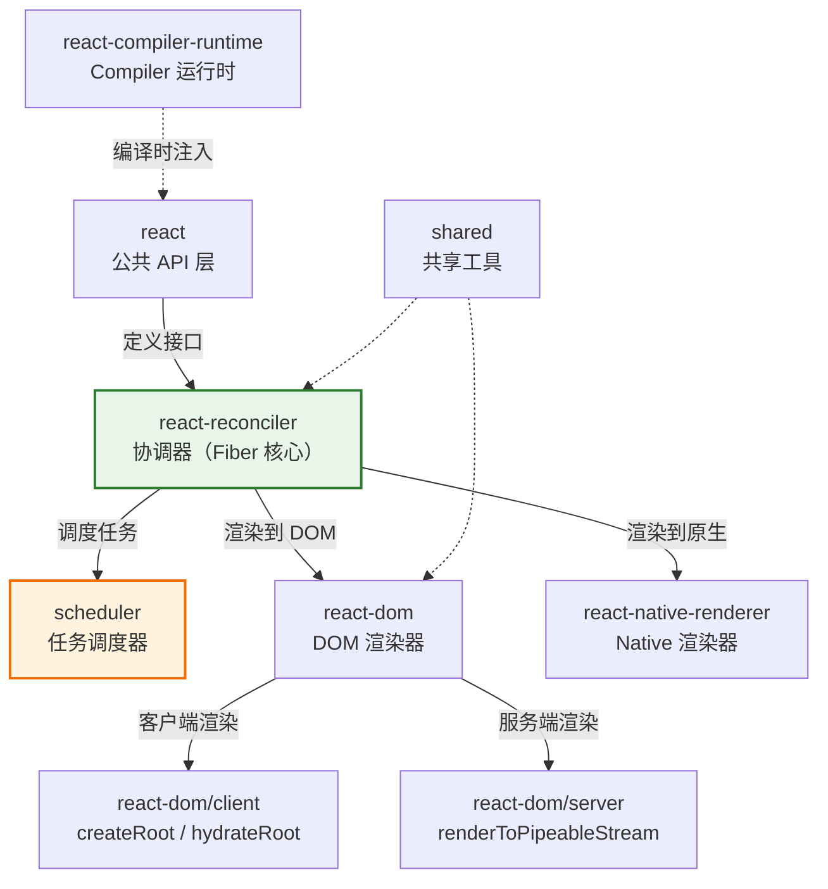

<div v-pre>

# 第1章 为什么在 2026 年重新理解 React

> "前端框架的每一次范式跃迁，驱动力从来不是'更快'，而是'更低的心智负担'。"

> **本章要点**
> - 从 jQuery 到 React 19，追溯前端框架的四次范式跃迁及其背后的驱动力
> - 理解 React 19 的三大破局：Compiler、Server Components、Actions
> - 深入剖析 useMemo 的终结与心智模型的重建
> - 明确本书与其他 React 书籍的差异化定位
> - 搭建 React 源码的本地调试环境

## 1.1 从 jQuery 到 React 19：前端框架的四次范式跃迁

2006 年的一个下午。你打开文本编辑器，面前是一个待办事项应用的需求。你开始写代码：

```javascript
// 2006 年：手动 DOM 操作
document.getElementById('add-btn').onclick = function() {
  var input = document.getElementById('todo-input');
  var text = input.value;
  var li = document.createElement('li');
  li.innerText = text;
  li.onclick = function() {
    li.parentNode.removeChild(li);
  };
  document.getElementById('todo-list').appendChild(li);
  input.value = '';
};
```

短短十几行代码里，你同时在做三件事：读取用户输入、操作 DOM 结构、绑定交互事件。数据（`text`）、视图（`li`）和行为（`onclick`）搅在一起，像一碗意大利面——每一根面条都和其他面条纠缠不清。

这就是前端的"史前时代"。不是不能工作，但当页面上的交互从 3 个按钮变成 30 个，从单页变成多页，从单人维护变成团队协作——面条就会变成毛线团，任何人碰一根线都可能扯动整个系统。

### 第一次跃迁：jQuery 与 DOM 抽象（2006-2010）

jQuery 的出现不是因为浏览器 API 太难用（虽然确实难用），而是因为它回答了一个关键问题：**能不能让开发者只关心"做什么"，而不关心"在哪个浏览器上怎么做"？**

```javascript
// jQuery：抹平浏览器差异，简化 DOM 操作
$('#add-btn').click(function() {
  var text = $('#todo-input').val();
  $('#todo-list').append('<li>' + text + '</li>');
  $('#todo-input').val('');
});

// 事件委托——jQuery 最优雅的设计之一
$('#todo-list').on('click', 'li', function() {
  $(this).remove();
});
```

代码更短了，但本质没变——你仍然在手动操作 DOM。jQuery 降低的是"浏览器兼容性"的心智负担，但没有解决"数据与视图同步"的根本问题。当应用复杂度上升，你面对的核心挑战是：**当数据变化时，哪些 DOM 节点需要更新？**

在一个购物车页面中，用户修改了某件商品的数量。你需要同时更新：商品小计、购物车总价、优惠券适用状态、运费计算、"去结算"按钮的可用性。忘了更新任何一个——bug。更新顺序不对——bug。重复更新导致闪烁——bug。

### 第二次跃迁：模板引擎与数据绑定（2010-2013）

Backbone、Knockout、Angular 1.x 带来了"数据驱动视图"的核心理念。你不再手动操作 DOM，而是声明数据和视图的映射关系，让框架自动保持同步。

```html
<!-- Angular 1.x：双向数据绑定 -->
<input ng-model="newTodo">
<button ng-click="addTodo()">添加</button>
<ul>
  <li ng-repeat="todo in todos" ng-click="removeTodo(todo)">
    {{todo.text}}
  </li>
</ul>
```

这是一个巨大的概念飞跃。开发者的心智模型从"操作 DOM"转向了"管理数据"——视图是数据的函数。但这一代方案有一个结构性问题：**脏检查（Dirty Checking）的性能天花板。**

Angular 1.x 的做法是：每次可能发生变化时，遍历所有绑定表达式，逐一对比新旧值。绑定表达式从 10 个到 100 个到 1000 个，性能线性下降。更要命的是，开发者无法预测"一次操作会触发多少次脏检查"——这是另一种形式的心智负担。

### 第三次跃迁：虚拟 DOM 与声明式 UI（2013-2023）

React 在 2013 年提出了一个看似"疯狂"的想法：**每次数据变化时，重新渲染整个组件树，然后用 diff 算法找出实际需要更新的 DOM 节点。**

```tsx
// React：UI = f(state)
function TodoApp() {
  const [todos, setTodos] = useState<string[]>([]);
  const [input, setInput] = useState('');

  return (
    <div>
      <input value={input} onChange={e => setInput(e.target.value)} />
      <button onClick={() => {
        setTodos([...todos, input]);
        setInput('');
      }}>添加</button>
      <ul>
        {todos.map((todo, i) => (
          <li key={i} onClick={() => setTodos(todos.filter((_, j) => j !== i))}>
            {todo}
          </li>
        ))}
      </ul>
    </div>
  );
}
```

革命性在哪里？**开发者不再需要思考"什么变了"。** 你只需要描述"在当前数据下，界面应该长什么样"——React 自己算出差异并更新 DOM。

`UI = f(state)` 这个公式看似简单，却是前端工程领域最深刻的抽象之一。它把一个"状态同步"问题（命令式：当 X 变化时，更新 Y、Z、W）转化为一个"状态映射"问题（声明式：给定 state，UI 是确定的）。

但虚拟 DOM 也带来了新的心智负担——性能优化。

当组件树足够深、渲染足够频繁时，"重新渲染整个子树 → diff → 更新"的成本不可忽视。React 给出的解决方案是一系列手动优化 API：

```tsx
// 心智负担的具象化
const MemoizedChild = React.memo(ExpensiveChild);
const cachedValue = useMemo(() => computeExpensive(a, b), [a, b]);
const stableCallback = useCallback(() => doSomething(id), [id]);
```

这些 API 本身并不复杂，但它们引入的心智负担是指数级的——你需要判断**每一个**组件是否需要 `memo`，**每一个**计算是否需要 `useMemo`，**每一个**回调是否需要 `useCallback`，以及它们的依赖数组是否正确。遗漏了——性能问题。加多了——代码膨胀。依赖数组写错了——bug。

### 第四次跃迁：编译时优化（2024-）

React Compiler 的出现，标志着第四次范式跃迁的开始。

```tsx
// 2026 年：你只需要写这样的代码
function TodoApp() {
  const [todos, setTodos] = useState<string[]>([]);
  const [input, setInput] = useState('');

  // 没有 useMemo。没有 useCallback。没有 React.memo。
  // Compiler 在编译时自动分析依赖关系，插入最优的缓存策略。

  const activeTodos = todos.filter(t => !t.completed);
  const handleAdd = () => {
    setTodos([...todos, input]);
    setInput('');
  };

  return (
    <div>
      <input value={input} onChange={e => setInput(e.target.value)} />
      <button onClick={handleAdd}>添加</button>
      <TodoList todos={activeTodos} onRemove={id =>
        setTodos(todos.filter((_, j) => j !== id))
      } />
      <footer>共 {activeTodos.length} 项待办</footer>
    </div>
  );
}
```

看到了吗？代码回归了最朴素的形态——没有任何手动优化的痕迹。Compiler 在构建阶段分析组件的数据流，自动决定哪些值需要缓存、哪些组件可以跳过重渲染。

> 🔥 **深度洞察：四次跃迁的统一规律**
>
> 回顾这四次范式跃迁，表面上的驱动力各不相同——浏览器兼容性、数据绑定、虚拟 DOM、编译时优化。但它们背后有一条统一的规律：**每一次跃迁的本质，都是把一类"开发者不得不关心但与业务无关的问题"交给框架/工具自动处理。** jQuery 接管了浏览器差异，Angular 接管了数据同步，React 接管了 DOM 操作，Compiler 接管了性能优化。前端的进化史，就是一部"心智负担转移史"——从人脑转移到机器。终极目标是：**开发者只需要思考业务逻辑本身。**

下表总结了四次跃迁的关键维度：

| 时代 | 代表 | 核心抽象 | 接管了什么心智负担 | 引入了什么新的心智负担 |
|------|------|---------|-------------------|---------------------|
| 手动 DOM | 原生 JS | 无 | — | 所有（DOM、兼容性、状态同步） |
| DOM 抽象 | jQuery | 选择器 + 链式调用 | 浏览器兼容性 | 手动状态同步 |
| 数据绑定 | Angular 1.x | 模板 + 双向绑定 | 数据-视图同步 | 脏检查性能、框架概念过载 |
| 虚拟 DOM | React 16-18 | `UI = f(state)` | DOM 操作 | 手动性能优化（memo/useMemo/useCallback） |
| 编译时优化 | React 19 + Compiler | 自动记忆化 | 性能优化 | 理解编译器的前提假设（React 规则） |

> 💡 **最佳实践**：不要因为 Compiler 能自动优化就忽略 React 的规则。恰恰相反——Compiler 的正确性建立在你遵守 React 规则的前提上。理解这些规则的"为什么"，比记住它们的"是什么"重要得多。这也是本书存在的意义。

## 1.2 React 19 的三大破局

如果 React 18 的关键词是"并发"，那么 React 19 的关键词是"简化"。三个重大特性，每一个都在消除一类长期困扰 React 开发者的心智负担。

### 1.2.1 React Compiler：自动记忆化终结 useMemo/useCallback

先看一段典型的 React 18 "最佳实践"代码：

```tsx
// React 18：手动优化的典型写法
interface Props {
  items: Item[];
  filter: string;
  onSelect: (id: string) => void;
}

const ItemList: React.FC<Props> = React.memo(({ items, filter, onSelect }) => {
  // 手动缓存过滤结果
  const filteredItems = useMemo(
    () => items.filter(item => item.name.includes(filter)),
    [items, filter]
  );

  // 手动稳定回调引用
  const handleSelect = useCallback(
    (id: string) => {
      onSelect(id);
      analytics.track('item_selected', { id });
    },
    [onSelect]
  );

  return (
    <ul>
      {filteredItems.map(item => (
        <MemoizedItem key={item.id} item={item} onSelect={handleSelect} />
      ))}
    </ul>
  );
});

// 子组件也需要 memo
const MemoizedItem = React.memo(({ item, onSelect }: ItemProps) => (
  <li onClick={() => onSelect(item.id)}>{item.name}</li>
));
```

现在看 React 19 + Compiler 的等价代码：

```tsx
// React 19 + Compiler：同等性能，零手动优化
interface Props {
  items: Item[];
  filter: string;
  onSelect: (id: string) => void;
}

function ItemList({ items, filter, onSelect }: Props) {
  const filteredItems = items.filter(item => item.name.includes(filter));

  const handleSelect = (id: string) => {
    onSelect(id);
    analytics.track('item_selected', { id });
  };

  return (
    <ul>
      {filteredItems.map(item => (
        <Item key={item.id} item={item} onSelect={handleSelect} />
      ))}
    </ul>
  );
}

function Item({ item, onSelect }: ItemProps) {
  return <li onClick={() => onSelect(item.id)}>{item.name}</li>;
}
```

**减少了什么？** 没有 `React.memo`、没有 `useMemo`、没有 `useCallback`。代码量减少约 40%。更重要的是，代码的意图变得纯粹——每一行都在描述"做什么"，没有一行在描述"怎么优化"。

**Compiler 做了什么？** 在编译阶段，它分析了每个表达式的输入依赖。`filteredItems` 依赖 `items` 和 `filter`——只有它们变化时才重新计算。`handleSelect` 依赖 `onSelect`——只有它变化时才重新创建。`Item` 组件的 props 没变——跳过重渲染。所有这些决策在编译时完成，运行时零开销。

### 1.2.2 Server Components：零 bundle size 的组件

传统的 React 组件有一个隐含假设：组件代码最终会被打包、发送到浏览器、在客户端执行。即使一个组件只是从数据库取数据然后渲染一段静态 HTML，它的代码和依赖仍然会增加客户端 bundle 的体积。

Server Components 打破了这个假设：

```tsx
// React 18：客户端组件 —— 整个组件（包括 markdown 解析库）都打进 bundle
'use client';
import { marked } from 'marked'; // ~35KB gzipped
import { useEffect, useState } from 'react';

function BlogPost({ slug }: { slug: string }) {
  const [post, setPost] = useState<Post | null>(null);

  useEffect(() => {
    fetch(`/api/posts/${slug}`).then(r => r.json()).then(setPost);
  }, [slug]);

  if (!post) return <Skeleton />;
  return <article dangerouslySetInnerHTML={{ __html: marked(post.content) }} />;
}
```

```tsx
// React 19：Server Component —— 在服务器执行，零 bundle 成本
import { marked } from 'marked'; // 不打进客户端 bundle
import { db } from '@/lib/database'; // 直接访问数据库

async function BlogPost({ slug }: { slug: string }) {
  const post = await db.posts.findBySlug(slug); // 直接查询，无需 API 层
  const html = marked(post.content); // 在服务器完成解析

  return <article dangerouslySetInnerHTML={{ __html: html }} />;
}
```

**关键差异**：

| 维度 | 客户端组件（React 18） | Server Component（React 19） |
|------|---------------------|---------------------------|
| 执行位置 | 浏览器 | 服务器 |
| 对 bundle 的影响 | 组件代码 + 依赖全部打包 | 零 bundle 贡献 |
| 数据获取 | 需要 API 层中转 | 直接访问数据库/文件系统 |
| 交互能力 | 完整（事件、状态、Effect） | 无（不能用 useState/useEffect） |
| 典型用途 | 按钮、表单、动画等交互元素 | 数据展示、内容渲染、布局 |

Server Components 不是要取代客户端组件，而是让你能够根据组件的本质需求选择最合适的执行环境。一个博客文章的内容展示——不需要交互，不需要客户端状态——本来就没有理由在浏览器里执行。

### 1.2.3 Actions：表单和数据变更的第一公民支持

在 React 18 中，处理一个表单提交需要你手动管理大量"与业务无关的状态"：

```tsx
// React 18：手动管理提交状态
function CreateTodo() {
  const [title, setTitle] = useState('');
  const [isPending, setIsPending] = useState(false);
  const [error, setError] = useState<string | null>(null);

  const handleSubmit = async (e: React.FormEvent) => {
    e.preventDefault();
    setIsPending(true);
    setError(null);
    try {
      await createTodo({ title });
      setTitle('');
    } catch (err) {
      setError(err instanceof Error ? err.message : '未知错误');
    } finally {
      setIsPending(false);
    }
  };

  return (
    <form onSubmit={handleSubmit}>
      <input value={title} onChange={e => setTitle(e.target.value)} />
      <button disabled={isPending}>
        {isPending ? '提交中...' : '添加'}
      </button>
      {error && <p className="error">{error}</p>}
    </form>
  );
}
```

React 19 的 Actions 让表单提交变成框架的第一公民：

```tsx
// React 19：Actions + useActionState
function CreateTodo() {
  const [state, submitAction, isPending] = useActionState(
    async (_prevState: State, formData: FormData) => {
      const title = formData.get('title') as string;
      try {
        await createTodo({ title });
        return { error: null, success: true };
      } catch (err) {
        return { error: err instanceof Error ? err.message : '未知错误', success: false };
      }
    },
    { error: null, success: false }
  );

  return (
    <form action={submitAction}>
      <input name="title" />
      <button disabled={isPending}>
        {isPending ? '提交中...' : '添加'}
      </button>
      {state.error && <p className="error">{state.error}</p>}
    </form>
  );
}
```

**减少了什么？** 三个手动管理的状态变量（`title`、`isPending`、`error`）减少到零个。`e.preventDefault()` 不需要了。`try/catch/finally` 的状态管理模板不需要了。甚至 `onChange` 事件处理也不需要了——`FormData` 原生 API 直接获取表单值。

> 🔥 **深度洞察：三大特性的统一主题**
>
> Compiler 消除了手动性能优化的心智负担。Server Components 消除了"所有组件都在客户端执行"的隐含假设。Actions 消除了表单状态管理的样板代码。三者的统一主题是：**让 React 开发者的注意力从"框架的要求"回归到"业务的需求"。** 这不是三个独立的功能改进，而是 React 团队对"什么是好的开发者体验"这个问题的一次系统性回答。从 2013 年的 `UI = f(state)` 到 2026 年的 `UI = f(state, server, compiler)`，React 的愿景从未改变——只是越来越接近实现。

## 1.3 useMemo 的终结与心智模型的重建

`useMemo` 的故事值得单独展开，因为它完美地体现了"框架设计中 trade-off 的演化"。

### 为什么手动优化是 React 最大的心智负担

让我用数字说话。打开任何一个中大型 React 项目的代码库，搜索 `useMemo`、`useCallback`、`React.memo` 的出现次数。在我参与的一个电商项目中，这三个 API 的调用总次数是 **847 次**——比 `useState`（612 次）还多。

这意味着什么？开发者花在"告诉 React 什么不需要重新计算"上的精力，超过了花在"管理应用状态"上的精力。优化代码比业务代码还多。

更糟糕的是，这些优化中有相当一部分是**错误的**或**不必要的**。React 核心团队在 React Conf 2024 上披露了一个数据：在他们分析的大型 React 应用中，**约 60% 的 useMemo 调用要么依赖数组不正确（导致缓存失效），要么缓存的计算本身足够轻量（缓存的开销反而大于重新计算的开销）。**

这是一个工程上的悖论：一个旨在提高性能的 API，在实践中反而成为了 bug 的温床和代码复杂度的主要来源。

### Compiler 如何让开发者"写出正确的代码即可"

React Compiler 的核心思路可以用一句话概括：**如果编译器能比人类更准确地判断"什么需要缓存"，那就不应该让人类来做这个决定。**

Compiler 在编译时对每个组件进行数据流分析，构建依赖图，然后自动插入最优的缓存策略。它不是简单地"把所有 useMemo 自动加上"——它会判断哪些值确实需要缓存（引用稳定性对子组件渲染有影响），哪些不需要（计算足够轻量，缓存开销不值得）。

但这里有一个至关重要的前提：**Compiler 假设你的代码遵守 React 的规则。**

什么是"React 的规则"？核心有三条：

1. **组件和 Hook 必须是纯函数**——相同的输入必须产生相同的输出，不能在渲染期间修改外部可变状态
2. **Props 和 state 是不可变的**——不能直接修改 props 对象或 state 对象，必须创建新的引用
3. **Hook 的调用顺序必须固定**——不能在条件语句或循环中调用 Hook

这三条规则在 React 18 中是"最佳实践"——违反了可能导致微妙的 bug，但代码通常还能跑。在 Compiler 时代，它们变成了**硬性要求**——Compiler 基于这些规则进行优化，违反它们意味着优化结果可能是错误的。

```tsx
// 违反规则：在渲染期间修改外部状态
let globalCounter = 0;

function BadComponent() {
  globalCounter++; // 🚨 Compiler 假设渲染是纯的，这个副作用会导致优化错误
  return <div>{globalCounter}</div>;
}

// 正确写法：使用 state 管理可变数据
function GoodComponent() {
  const [counter, setCounter] = useState(0);
  return <div onClick={() => setCounter(c => c + 1)}>{counter}</div>;
}
```

> 💡 **最佳实践**：从今天开始，在你的项目中启用 `eslint-plugin-react-compiler`。它会在编写阶段就标记出违反 React 规则的代码。与其在生产环境中发现 Compiler 优化导致的诡异 bug，不如在 IDE 中就把问题消灭。把它当作 TypeScript 的类型检查——不是"锦上添花"，而是"安全网"。

## 1.4 本书与其他 React 书籍有何不同

让我更具体地解释三类书的定位差异：

| 维度 | 概念入门书 | API 实战书 | 本书 |
|------|----------|----------|------|
| **核心问题** | React 是什么？怎么用？ | 如何用 React 构建真实项目？ | React 内部是如何运作的？为什么这样设计？ |
| **代码来源** | 教学示例 | 项目代码 | React 源码 + 手写精简实现 |
| **读完你能** | 写组件、管理状态 | 搭建完整应用、做性能调优 | 从源码层面定位任何渲染问题，理解每个 API 的内部实现 |
| **适用阶段** | 入门 → 初级 | 初级 → 中级 | 中级 → 高级 |
| **半衰期** | 随 API 变化而过时 | 随最佳实践演进而部分过时 | 核心架构知识长期有效 |
| **类比** | 学开车 | 参加拉力赛 | 理解发动机原理 |

最后一行的类比最能说明问题。学开车的人不需要知道发动机的工作原理——踩油门就走，踩刹车就停。参加拉力赛的人需要知道一些——涡轮增压的延迟特性、变速箱的换挡逻辑。但如果你想设计一辆新车、或者在赛道上榨出最后 0.1 秒的圈速——你必须理解发动机的每一个气缸是如何工作的。

本书就是那本"发动机原理"。

## 1.5 React 源码的技术栈与环境准备

### Monorepo 结构与核心包关系

React 源码采用 monorepo 结构，所有包都在 `packages/` 目录下。在开始阅读源码之前，你需要理解核心包之间的关系：



**图 1-1：React 核心包关系图**

几个关键理解：

1. **`react` 包极轻**——它只定义公共 API（`createElement`、`useState`、`useEffect` 等），实际实现全部在 `react-reconciler` 中。`react` 包更像一个"接口层"。

2. **`react-reconciler` 是真正的核心**——Fiber 架构、diff 算法、Hooks 实现、并发渲染、优先级调度，全部在这个包里。本书超过 60% 的内容聚焦于此。

3. **渲染器是可替换的**——`react-reconciler` 不关心最终渲染到哪里（DOM、Native、Canvas、终端）。这种分离使得 React 能够支持多个渲染目标，同时共享核心协调逻辑。

4. **`scheduler` 独立于 React**——它是一个通用的优先级任务调度器，理论上可以用于任何需要优先级调度的场景。React 只是它最著名的消费者。

### 如何本地构建和调试源码

**环境要求**：

- Node.js 18+（推荐 20 LTS）
- pnpm 或 yarn（React 源码使用 yarn）
- 现代浏览器（Chrome/Firefox/Edge，调试需要 DevTools）

**克隆与构建**：

```bash
# 克隆 React 源码仓库
git clone https://github.com/facebook/react.git
cd react

# 安装依赖
yarn install

# 构建开发版本（包含完整的警告信息和调试标记）
yarn build react/index react-dom/index scheduler --type=NODE_DEV
```

**调试技巧**：

```bash
# 创建一个本地测试项目，链接到本地构建的 React
mkdir react-debug && cd react-debug
npm init -y
npm link ../react/build/node_modules/react
npm link ../react/build/node_modules/react-dom
```

在调试时，有三个关键的入口函数值得设置断点：

1. **`performSyncWorkOnRoot`**（`packages/react-reconciler/src/ReactFiberWorkLoop.ts`）—— 同步渲染的入口，首次渲染和同步更新从这里开始
2. **`beginWork`**（`packages/react-reconciler/src/ReactFiberBeginWork.ts`）—— Fiber 树构建的核心，每个 Fiber 节点的处理入口
3. **`commitRoot`**（`packages/react-reconciler/src/ReactFiberCommitWork.ts`）—— 将 Fiber 树的变更提交到真实 DOM 的入口

> 💡 **最佳实践**：不要试图一次性读懂整个源码。React 源码有超过 20 万行（不含测试），盲目通读只会让你迷失在细节中。本书的方法是"分层递进"——先用精简版手写建立直觉（上半部分），再用这个直觉作为地图去导航真实源码（下半部分）。每次只关注一个子系统，理解透彻后再进入下一个。

## 1.6 本章小结

本章从宏观视角建立了三个核心认知：

**第一，前端框架的进化是一部"心智负担转移史"。** 从手动 DOM 到 jQuery 到数据绑定到虚拟 DOM 到编译时优化，每一次跃迁都在将一类"与业务无关的复杂度"从开发者肩上卸下，交给框架或工具链自动处理。React 19 + Compiler 是这条路径上最新的里程碑——它接管了性能优化这一最后的"手动挡"。

**第二，React 19 的三大特性不是孤立的功能改进，而是一次系统性的"简化运动"。** Compiler 消除手动缓存、Server Components 消除不必要的客户端执行、Actions 消除表单状态样板——三者共同指向一个目标：让开发者的注意力回归业务本身。

**第三，Compiler 时代的源码理解比以往更重要。** 不是因为你需要手动优化（Compiler 会替你做），而是因为 Compiler 的正确性建立在你遵守 React 规则的前提上。不理解规则的"为什么"，就无法判断自己的代码是否真的遵守了规则。

从下一章开始，我们将进入实战——从零手写一个精简版 React，一步步构建出虚拟 DOM、组件系统、DOM Diff、事件合成等核心模块。通过亲手构建，你会对 React 的内部机制建立起牢不可破的直觉。

> 好的架构会被传承，好的设计思想永不过时。理解 React 的"为什么"，比记住它的"怎么做"重要一百倍。

---

### 思考题

1. **概念理解**：本章提出"前端框架的每一次范式跃迁，驱动力不是'更快'，而是'更低的心智负担'"。你同意这个观点吗？试举一个反例或支持的例子，并分析其背后的逻辑。

2. **实践应用**：打开你当前正在维护的 React 项目，统计 `useMemo`、`useCallback`、`React.memo` 的使用次数。其中有多少是确实必要的？如果引入 React Compiler，预估能删除多少行"优化代码"？

3. **开放讨论**：React Compiler 将性能优化从"开发者的责任"变成了"编译器的责任"。这种趋势如果持续下去，前端开发者的核心竞争力会发生什么变化？"人人都能写出高性能 React 代码"是好事还是坏事？

4. **架构思考**：React 选择了"虚拟 DOM + 运行时 diff"的路线，Vue 3 选择了"编译时静态分析 + 运行时最小化 diff"的路线，Svelte 选择了"编译时生成命令式更新代码，无虚拟 DOM"的路线。三种路线各有什么 trade-off？React Compiler 的出现是否意味着 React 正在向 Vue/Svelte 的编译时优化路线靠拢？

5. **源码实践**：克隆 React 源码仓库，在 `packages/react-reconciler/src/ReactFiberBeginWork.ts` 的 `beginWork` 函数中设置断点。创建一个包含父子组件的简单应用，触发一次状态更新，观察 `beginWork` 被调用的次数和顺序。这个顺序说明了 React 的什么遍历策略？

---

**杨艺韬**
2026 年春，北京


</div>
