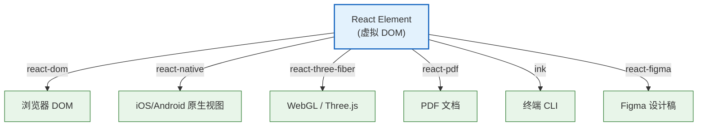

<div v-pre>

# 第2章 虚拟 DOM 的设计哲学

> "虚拟 DOM 从来不是一项性能优化技术——它是一层抽象，一种让 UI 变得可编程的范式。"

> **本章要点**
> - 理解虚拟 DOM 的真正动机：不是为了快，而是为了跨平台和可编程性
> - 深入解析 React Element 的数据结构及其设计意图
> - 追溯从 `createElement` 到 `jsx()` 的编译器入口变迁
> - 与 Vue 的 VNode、Svelte 的无 VDOM 方案进行横向对比
> - 建立"虚拟 DOM 是抽象层而非优化手段"的核心认知

## 2.1 为什么需要虚拟 DOM

2013 年 5 月的 JSConf US。Jordan Walke 走上讲台，展示了一个看起来"疯狂"的想法：每次数据变化时，不去精确地找出哪些 DOM 节点需要更新，而是**重新渲染整个组件树**，然后用一个 diff 算法算出最小更新量。

台下的反应可以用四个字概括：**这不是倒退吗？**

在那个年代，前端社区正在为"精确更新"而努力。Knockout 用 Observable 追踪每一个绑定，Angular 1.x 用脏检查遍历每一个表达式——所有人都在试图**只更新真正变化的那一小部分 DOM**。React 的做法看起来像是用大炮打蚊子：你只改了一个字符串，我却要重新渲染整棵树？

但 Jordan Walke 知道一件事，这件事改变了整个前端的发展方向：

**DOM 操作的真正成本不在于"操作了多少个节点"，而在于"开发者需要多少心智负担来确定应该操作哪些节点"。**

让我用一个真实场景来说明。

### 购物车的噩梦

你在开发一个电商平台的购物车页面。用户修改了某件商品的数量，从 2 改成 3。你需要更新：

1. 该商品的小计金额
2. 购物车总价
3. 优惠券适用状态（满 300 减 50，现在满了吗？）
4. 运费计算（满 99 包邮，超重另算）
5. "去结算"按钮上的金额
6. 页面顶部购物车图标的角标数字
7. 如果是最后一件满减商品，还需要显示凑单推荐

在没有虚拟 DOM 的世界里，你需要手动追踪这 7 个（甚至更多）更新点，确保它们在正确的时机、以正确的顺序执行。忘了任何一个——bug。更新顺序不对——bug。某个条件分支遗漏——bug。

```typescript
// 没有虚拟 DOM：手动追踪每一个需要更新的 DOM 节点
function onQuantityChange(itemId: string, newQty: number) {
  // 1. 更新数据
  cart.items[itemId].quantity = newQty;

  // 2. 手动更新每一个受影响的 DOM 节点
  document.querySelector(`#item-${itemId} .subtotal`).textContent =
    formatPrice(cart.items[itemId].price * newQty);

  const total = calculateTotal(cart);
  document.querySelector('.cart-total').textContent = formatPrice(total);

  // 3. 条件更新——这里开始变得复杂
  const couponEl = document.querySelector('.coupon-status');
  if (total >= 300) {
    couponEl.classList.add('applicable');
    couponEl.textContent = '已满300，可用优惠券';
  } else {
    couponEl.classList.remove('applicable');
    couponEl.textContent = `还差${formatPrice(300 - total)}元可用优惠券`;
  }

  // 4. 运费更新
  // 5. 结算按钮更新
  // 6. 角标更新
  // 7. 凑单推荐……
  // 每多一个关联更新点，就多一个遗漏的可能
}
```

现在看 React 的做法：

```tsx
// 有虚拟 DOM：描述"在当前数据下，界面应该是什么样"
function CartPage({ cart }: { cart: Cart }) {
  const total = calculateTotal(cart);
  const couponApplicable = total >= 300;
  const freeShipping = total >= 99;

  return (
    <div>
      {cart.items.map(item => (
        <CartItem key={item.id} item={item} />
      ))}
      <div className="cart-total">{formatPrice(total)}</div>
      <CouponStatus applicable={couponApplicable} remaining={300 - total} />
      <ShippingInfo free={freeShipping} weight={calculateWeight(cart)} />
      <CheckoutButton total={total} />
      <CartBadge count={cart.items.length} />
      {!couponApplicable && <UpsellRecommendation gap={300 - total} />}
    </div>
  );
}
```

**你没有告诉 React "什么变了"。你只描述了"在当前数据下，UI 是什么样"。** React 自己比较新旧两棵虚拟 DOM 树，找出差异，执行最小更新。

这就是虚拟 DOM 的真正价值：**它不是一个性能优化方案，它是一个编程模型的转变——从命令式的"告诉机器做什么"到声明式的"描述结果是什么"。**

### 虚拟 DOM 的三个真正动机

让我更精确地阐述虚拟 DOM 存在的三个根本理由：

**动机一：声明式编程模型。** 虚拟 DOM 让开发者可以用函数的方式描述 UI——给定一个 state，返回一个 UI 描述。不需要关心从旧状态到新状态的"过渡路径"，只需要关心"目标状态"。这是从 `imperative` 到 `declarative` 的核心跃迁。

**动机二：跨平台抽象层。** 虚拟 DOM 是一个与渲染目标无关的中间表示（IR）。同一棵虚拟 DOM 树，可以渲染到浏览器 DOM（`react-dom`）、原生移动应用（`react-native`）、终端（`react-blessed`）、Canvas（`react-canvas`）、PDF（`react-pdf`）。没有虚拟 DOM 这一中间层，React 就不可能支持多个渲染目标。

**动机三：可编程性。** 虚拟 DOM 是纯 JavaScript 对象，它可以被序列化、传输、缓存、diff、快照、回放。这使得 React DevTools 能够检查组件树，使得 Server Components 能够在服务端序列化组件树并发送给客户端，使得 Time Travel Debugging 成为可能。真实 DOM 是浏览器内部的 C++ 对象——你无法对它做这些事。



**图 2-1：虚拟 DOM 作为跨平台抽象层**

> 🔥 **深度洞察：虚拟 DOM 不是优化手段，是抽象层**
>
> 前端社区对虚拟 DOM 最大的误解，就是把它当作一种性能优化技术——"虚拟 DOM 比直接操作真实 DOM 更快"。这个说法在严格意义上是**错误的**。对于任何确定的 DOM 更新操作，直接操作真实 DOM 永远比经过虚拟 DOM 中转更快——因为虚拟 DOM 多了一层"创建 JS 对象 → diff → 生成补丁 → 应用到真实 DOM"的开销。虚拟 DOM 的真正优势不在于"绝对速度"，而在于"开发者不再需要思考如何高效地操作 DOM"。它用**可接受的性能开销**换来了**声明式编程、跨平台能力和可编程性**。这是一种典型的工程权衡——用一些运行时开销换取巨大的开发效率提升和架构灵活性。理解这一点，是理解整个 React 设计哲学的起点。

## 2.2 React Element 的数据结构深度解析

虚拟 DOM 的基本单位是 **React Element**。每次你写 JSX，编译器都会把它转换成一个 React Element——一个普通的 JavaScript 对象。

```tsx
// 你写的 JSX
<div className="container">
  <h1>Hello</h1>
  <p>World</p>
</div>

// 编译后的 React Element（简化）
{
  $$typeof: Symbol.for('react.element'),
  type: 'div',
  key: null,
  ref: null,
  props: {
    className: 'container',
    children: [
      {
        $$typeof: Symbol.for('react.element'),
        type: 'h1',
        key: null,
        ref: null,
        props: { children: 'Hello' }
      },
      {
        $$typeof: Symbol.for('react.element'),
        type: 'p',
        key: null,
        ref: null,
        props: { children: 'World' }
      }
    ]
  }
}
```

让我逐字段解析这个数据结构的设计意图。

### `$$typeof`：安全防线

`$$typeof` 的值是 `Symbol.for('react.transitional.element')` （React 19）或 `Symbol.for('react.element')`（React 18）。它的存在只有一个目的：**防止 XSS 攻击。**

为什么需要这个字段？考虑这个场景：

```typescript
// 假设没有 $$typeof，攻击者可以通过 JSON 注入伪造一个 React Element
const maliciousData = JSON.parse(userInput);
// userInput = '{"type": "div", "props": {"dangerouslySetInnerHTML": {"__html": "<script>alert(1)</script>"}}}'

// 如果 React 不检查 $$typeof，它会把这个对象当作合法的 React Element 渲染
return <div>{maliciousData}</div>; // XSS！
```

`Symbol` 是 JavaScript 中不可被 JSON 序列化的数据类型。即使攻击者能控制 JSON 输入，也无法构造一个包含 `Symbol` 的对象。React 在渲染前会检查 `$$typeof` 字段——如果不是预期的 Symbol，就拒绝渲染。

```typescript
// packages/react/src/jsx/ReactJSXElement.ts（简化）
export function jsx(type, config, maybeKey) {
  // ... 参数处理
  return {
    $$typeof: REACT_ELEMENT_TYPE, // Symbol.for('react.transitional.element')
    type,
    key,
    ref,
    props,
  };
}
```

这是一个**零成本的安全措施**——`Symbol` 的创建和比较都是 O(1) 操作，但它阻止了一整类 XSS 攻击向量。

### `type`：组件的身份

`type` 字段决定了 React Element 的"身份"——它是什么类型的节点。

| `type` 的值 | 含义 | 示例 |
|------------|------|------|
| `string` | 原生 HTML 元素 | `'div'`、`'span'`、`'input'` |
| `Function` | 函数组件 | `function App() {}` |
| `Class`（继承自 Component） | 类组件 | `class App extends Component {}` |
| `Symbol` | React 内置类型 | `Symbol.for('react.fragment')`、`Symbol.for('react.suspense')` |
| `object`（带 `$$typeof`） | 高阶抽象 | `React.memo()`、`React.lazy()`、`React.forwardRef()` |

`type` 的设计体现了一个关键决策：**React 不区分原生元素和自定义组件在数据结构层面的差异。** 无论是 `<div>` 还是 `<MyComponent>`，它们都是 React Element，只是 `type` 字段不同。这种统一性使得 React 可以用同一套 diff 算法处理所有类型的节点。

但这也引入了一个重要的约定——自定义组件的名字必须以大写字母开头。为什么？因为 JSX 编译器需要区分 `<div>`（原生元素，`type` 为字符串 `'div'`）和 `<Div>`（自定义组件，`type` 为变量 `Div`）。大写开头意味着"这是一个变量引用"，小写开头意味着"这是一个 HTML 标签名"。

```tsx
// JSX 编译规则
<div />      // → jsx('div', {})          — type 是字符串
<MyComp />   // → jsx(MyComp, {})         — type 是变量引用
<my-comp />  // → jsx('my-comp', {})      — Web Components，type 是字符串
```

### `key`：Diff 算法的线索

`key` 是开发者提供给 React 的"身份提示"，用于在 diff 过程中识别列表中的元素。我们会在第 5 章（Reconciliation）深入剖析 key 的作用机制。这里先记住一个核心原则：

**`key` 的作用不是"提高性能"，而是"保持正确性"。** 在列表重排序的场景中，没有 key（或使用 index 作为 key），React 可能复用错误的 DOM 节点，导致状态混乱。

```tsx
// 🚨 错误示范：用 index 作 key
{todos.map((todo, index) => (
  <TodoItem key={index} todo={todo} />
  // 当列表重新排序时，index=0 仍然对应第一个 DOM 节点
  // 但 todo 已经变了——组件内部的 state（如输入框内容）会错位
))}

// ✅ 正确做法：用稳定的唯一标识符
{todos.map(todo => (
  <TodoItem key={todo.id} todo={todo} />
  // todo.id 跟随数据移动，React 能正确追踪每个组件实例
))}
```

### `ref`：逃生舱口

`ref` 提供了一种"跳出 React 声明式模型"的方式——当你需要直接访问底层 DOM 节点或组件实例时，`ref` 是你的逃生舱口。

在 React 19 中，`ref` 的处理方式发生了一个重要变化：**`ref` 不再通过 `forwardRef` 传递，而是作为普通 prop 直接传递。** 这大大简化了 ref 的使用模式。

```tsx
// React 18：需要 forwardRef 包装
const Input = React.forwardRef<HTMLInputElement, InputProps>((props, ref) => (
  <input ref={ref} {...props} />
));

// React 19：ref 作为普通 prop
function Input({ ref, ...props }: InputProps & { ref?: React.Ref<HTMLInputElement> }) {
  return <input ref={ref} {...props} />;
}
```

### `props`：数据的容器

`props` 是一个普通的 JavaScript 对象，包含了传递给组件的所有属性。有一个特殊的属性值得注意：`children`。

```tsx
// 这两种写法完全等价
<Wrapper children={<Child />} />
<Wrapper><Child /></Wrapper>

// 编译后的 props 完全相同
{ children: { $$typeof: Symbol.for('react.element'), type: Child, ... } }
```

`children` 不是什么"特殊的 API"——它只是一个普通的 prop，恰好名字叫 `children`。JSX 的嵌套语法只是 `children` prop 的语法糖。

> 💡 **最佳实践**：理解 React Element 是不可变的。一旦创建，你不能修改它的 `type`、`key`、`ref` 或 `props`。如果你需要"更新"一个元素，React 的做法是创建一个新的元素。这种不可变性是 React 能够安全地进行 diff 的前提——如果元素是可变的，diff 过程中元素可能被修改，导致结果不确定。

## 2.3 从 `createElement` 到 `jsx()`：编译器入口的变迁

React 的 JSX 编译经历了两代变化。理解这个变迁，有助于你理解 React 如何在不改变开发者体验的情况下，持续优化内部实现。

### 第一代：`React.createElement`

从 React 诞生到 React 16，JSX 的编译目标是 `React.createElement`：

```tsx
// JSX
<div className="hello">
  <span>world</span>
</div>

// 编译后（旧版 JSX Transform）
React.createElement(
  'div',
  { className: 'hello' },
  React.createElement('span', null, 'world')
);
```

这个设计有两个问题：

**问题一：必须引入 React。** 即使你的文件里没有直接使用 `React` 变量，只要有 JSX，就必须 `import React from 'react'`，因为编译后的代码引用了 `React.createElement`。这让无数初学者困惑："我明明没用 React，为什么不引入就报错？"

**问题二：性能开销。** `createElement` 在运行时需要做大量的参数处理——检查 `key` 是否在 props 中、处理 `ref`、处理 `children`（单个 vs 多个 vs 无）。这些工作每次渲染都要重复执行。

### 第二代：`jsx()` / `jsxs()`

React 17 引入了新的 JSX Transform，编译目标变为 `jsx()` 和 `jsxs()`：

```tsx
// JSX
<div className="hello">
  <span>world</span>
</div>

// 编译后（新版 JSX Transform）
import { jsx, jsxs } from 'react/jsx-runtime';

jsxs('div', {
  className: 'hello',
  children: [jsx('span', { children: 'world' })]
});
```

**变化一：自动引入。** 编译器自动从 `react/jsx-runtime` 引入 `jsx`/`jsxs`，开发者不再需要手动 `import React`。

**变化二：`jsx` vs `jsxs` 的区分。** `jsx` 用于单子节点或无子节点的情况，`jsxs` 用于多子节点。这个区分让 React 可以跳过 `children` 的数组化处理（单子节点时不需要包装成数组）。

**变化三：`key` 的提取。** 在新的 Transform 中，`key` 作为 `jsx()` 的第三个参数传递，而不是混在 props 里：

```tsx
<li key={item.id}>{item.name}</li>

// 旧版编译
React.createElement('li', { key: item.id }, item.name);
// createElement 需要在运行时从 props 中检查并提取 key

// 新版编译
jsx('li', { children: item.name }, item.id);
// key 已经在编译时被提取到第三个参数，运行时无需检查
```

这个变化看似微小，但对性能的影响是实质性的。在一个包含 1000 个列表项的页面中，减少 1000 次"检查 props 中是否有 key"的运行时操作，是一个有意义的优化。

### 源码实现对比

```typescript
// packages/react/src/jsx/ReactJSXElement.ts（React 19，简化）
export function jsx(type: any, config: any, maybeKey?: any) {
  let key = null;
  let ref = null;

  // key 从第三个参数获取（编译时提取）
  if (maybeKey !== undefined) {
    key = '' + maybeKey;
  }

  // ref 从 config 中提取（React 19 中 ref 是普通 prop）
  if ('ref' in config) {
    ref = config.ref;
  }

  // props 直接使用 config（不需要像 createElement 那样逐一复制）
  const props = {};
  for (const propName in config) {
    if (propName !== 'ref') {
      props[propName] = config[propName];
    }
  }

  return {
    $$typeof: REACT_ELEMENT_TYPE,
    type,
    key,
    ref,
    props,
  };
}
```

对比 `createElement` 的实现，`jsx()` 省去了以下运行时操作：

| 操作 | `createElement` | `jsx()` |
|------|----------------|---------|
| 从 props 中检查并提取 key | 运行时 | 编译时已完成 |
| children 参数处理（arguments 遍历） | 需要处理可变参数 | 编译器已将 children 放入 props |
| defaultProps 合并 | 运行时合并 | React 19 已废弃 defaultProps |
| props 对象创建 | 逐一复制属性 | 直接使用 config 对象 |

> 🔥 **深度洞察：编译时 vs 运行时的持续迁移**
>
> 从 `createElement` 到 `jsx()` 的变迁，体现了 React 团队的一个长期战略：**把能在编译时完成的工作，都搬到编译时。** 这个趋势在 React Compiler 中达到了顶峰——不仅是 key 的提取，连 `useMemo`、`useCallback` 的缓存决策也被搬到了编译时。虚拟 DOM 的演化方向不是"更快的运行时 diff"，而是"更少的运行时工作"。这个认知对理解 React 的技术路线至关重要。

## 2.4 React Element 的完整生命旅程

一个 React Element 从创建到最终反映在屏幕上，经历了以下阶段：


**图 2-2：React Element 的完整生命旅程**

**阶段一：JSX → jsx() 调用。** 这发生在编译时，由 Babel 或 SWC 完成。你写的 `<div>` 变成了 `jsx('div', ...)`。

**阶段二：jsx() → React Element。** 这发生在运行时，每次组件渲染时执行。`jsx()` 函数返回一个普通的 JavaScript 对象——React Element。

**阶段三：React Element → Fiber Node。** Reconciler（协调器）接收 React Element，为它创建（或复用）一个 Fiber Node。Fiber Node 是 React 内部的工作单元，包含了调度、优先级、副作用等信息。我们将在第 3 章深入剖析 Fiber。

**阶段四：Fiber Node → Effect List。** 通过 diff 算法比较新旧 Fiber 树，React 生成一份"变更清单"——哪些节点需要插入、更新、删除。

**阶段五：Effect List → 真实 DOM。** 在 Commit 阶段，React 将变更清单应用到真实 DOM 上。这是整个流程中唯一涉及真实 DOM 操作的阶段。

一个关键的认知：**React Element 是临时的，Fiber Node 是持久的。** 每次组件渲染，都会创建新的 React Element（上一次的会被垃圾回收）。但 Fiber Node 会被 React 复用——它在组件的整个生命周期中持续存在，只是属性被更新。这种"创建 → 丢弃"的模式是 React 声明式编程的基础：你不需要"修改"旧的 Element，只需要"描述"新的 Element。

## 2.5 与 Vue 和 Svelte 的横向对比

虚拟 DOM 不是唯一的解决方案。Vue 和 Svelte 走了不同的路。理解这些差异，有助于你更深刻地理解 React 的设计选择。

### Vue 3 的 VNode：编译时优化的虚拟 DOM

Vue 3 也使用虚拟 DOM（称为 VNode），但它的策略与 React 截然不同：**在编译时标记哪些部分是动态的，运行时只 diff 动态部分。**

```html
<!-- Vue 模板 -->
<div>
  <h1>Static Title</h1>
  <p>{{ message }}</p>
  <span :class="activeClass">Dynamic</span>
</div>
```

Vue 的编译器会分析模板，生成带有"补丁标记"（Patch Flags）的 VNode：

```typescript
// Vue 3 编译后（简化）
const _hoisted_1 = createVNode('h1', null, 'Static Title'); // 静态节点，提升到渲染函数外部

function render() {
  return createVNode('div', null, [
    _hoisted_1, // 静态节点不参与 diff
    createVNode('p', null, message.value, PatchFlags.TEXT), // 只有文本可能变化
    createVNode('span', { class: activeClass.value }, 'Dynamic', PatchFlags.CLASS), // 只有 class 可能变化
  ]);
}
```

**Patch Flags 的含义**：`PatchFlags.TEXT` 告诉 diff 算法"只需要比较文本内容"；`PatchFlags.CLASS` 告诉它"只需要比较 class 属性"。运行时 diff 可以跳过所有已知不会变化的部分。

### Svelte：无虚拟 DOM

Svelte 走了一条更激进的路——**完全不使用虚拟 DOM。** 它在编译时将组件转化为直接操作 DOM 的命令式代码。

```svelte
<!-- Svelte 组件 -->
<script>
  let count = 0;
  function increment() { count += 1; }
</script>

<button on:click={increment}>
  Clicked {count} times
</button>
```

```javascript
// Svelte 编译后（简化）
function create_fragment(ctx) {
  let button;
  let t0;
  let t1;

  return {
    c() { // create
      button = element('button');
      t0 = text('Clicked ');
      t1 = text(ctx[0]); // count
      // 直接创建 DOM 节点，没有虚拟 DOM 中间层
    },
    m(target, anchor) { // mount
      insert(target, button, anchor);
      append(button, t0);
      append(button, t1);
    },
    p(ctx, [dirty]) { // update
      if (dirty & 1) { // count 变了
        set_data(t1, ctx[0]); // 直接更新文本节点
      }
    },
    d(detaching) { // destroy
      if (detaching) detach(button);
    }
  };
}
```

Svelte 的编译器在编译时就知道"当 `count` 变化时，只需要更新 `t1` 这个文本节点"——不需要 diff，不需要虚拟 DOM，直接操作。

### 三者对比

| 维度 | React | Vue 3 | Svelte |
|------|-------|-------|--------|
| **虚拟 DOM** | 有，运行时全量 diff | 有，编译时标记 + 运行时部分 diff | 无，编译时生成命令式更新 |
| **更新粒度** | 组件级（整个组件重渲染） | 组件级，但 diff 范围更小 | 语句级（精确到变量） |
| **运行时开销** | 较高（创建 Element + diff） | 中等（创建 VNode + 部分 diff） | 最低（直接 DOM 操作） |
| **编译时优化** | React Compiler（自动记忆化） | 模板编译（Patch Flags + 静态提升） | 全量编译（消除虚拟 DOM） |
| **跨平台能力** | 强（react-dom, react-native, etc.） | 中（主要面向 DOM） | 弱（编译产物与 DOM 绑定） |
| **动态性** | 最强（JSX 是 JS 表达式） | 中等（模板有约束，但支持 JSX） | 较弱（模板语法受限） |
| **bundle size** | 运行时 ~45KB gzipped | 运行时 ~33KB gzipped | 几乎为零（编译到原生 JS） |

**React 的选择**：牺牲一些运行时性能，换取**最大的灵活性和跨平台能力**。JSX 就是 JavaScript——任何 JS 表达式都可以出现在 JSX 中，这给了开发者无限的表达能力，但也意味着编译器很难在编译时确定"哪些部分是静态的"（React Compiler 正在弥补这个差距）。

**Vue 的选择**：通过模板约束，在编译时获取更多信息，减少运行时开销。模板的受限语法是一种**有意的设计约束**——你不能在模板中写任意 JS 表达式，但正因为这种约束，编译器可以做更多优化。

**Svelte 的选择**：完全消除虚拟 DOM 的运行时开销，代价是**失去跨平台能力和运行时动态性**。

> 🔥 **深度洞察：没有银弹，只有权衡**
>
> "React 的虚拟 DOM 比 Svelte 的直接操作慢"——这个说法在技术上是正确的，但在工程上是片面的。性能只是软件工程多维权衡中的一个维度。React 选择虚拟 DOM，不是因为它不知道直接操作 DOM 更快，而是因为它需要虚拟 DOM 作为抽象层来支撑跨平台、服务端渲染、并发模式等更大的架构目标。Svelte 不需要这些，所以它可以省掉这层抽象。**框架的选择不是"哪个更好"的问题，而是"你需要什么"的问题。** 理解这一点，是从"框架使用者"进阶为"架构思考者"的关键一步。

## 2.6 React Element 的类型系统

React 19 中，Element 的类型体系变得更加丰富。让我们梳理一下所有的 Element 类型：

```typescript
// packages/shared/ReactSymbols.ts（关键类型标记）
export const REACT_ELEMENT_TYPE = Symbol.for('react.transitional.element');
export const REACT_PORTAL_TYPE = Symbol.for('react.portal');
export const REACT_FRAGMENT_TYPE = Symbol.for('react.fragment');
export const REACT_STRICT_MODE_TYPE = Symbol.for('react.strict_mode');
export const REACT_PROFILER_TYPE = Symbol.for('react.profiler');
export const REACT_SUSPENSE_TYPE = Symbol.for('react.suspense');
export const REACT_SUSPENSE_LIST_TYPE = Symbol.for('react.suspense_list');
export const REACT_MEMO_TYPE = Symbol.for('react.memo');
export const REACT_LAZY_TYPE = Symbol.for('react.lazy');
export const REACT_FORWARD_REF_TYPE = Symbol.for('react.forward_ref');
export const REACT_CONSUMER_TYPE = Symbol.for('react.consumer');
export const REACT_CONTEXT_TYPE = Symbol.for('react.context');
export const REACT_OFFSCREEN_TYPE = Symbol.for('react.offscreen');
```

每种类型对应一种不同的行为模式：

| 类型 | 用途 | Fiber 处理方式 |
|------|------|---------------|
| `REACT_ELEMENT_TYPE` | 普通组件和 HTML 元素 | 根据 `type` 创建对应的 Fiber |
| `REACT_FRAGMENT_TYPE` | 无额外 DOM 包装 | 不创建 DOM 节点，只处理 children |
| `REACT_SUSPENSE_TYPE` | 异步加载边界 | 管理 pending/resolved/rejected 状态 |
| `REACT_MEMO_TYPE` | 缓存组件 | 浅比较 props 决定是否跳过渲染 |
| `REACT_LAZY_TYPE` | 代码分割 | 触发 import()，Suspense 协作 |
| `REACT_PORTAL_TYPE` | 跨 DOM 层级渲染 | 在指定容器中渲染，事件仍冒泡 |
| `REACT_CONTEXT_TYPE` | Context Provider | 存储和广播 context 值 |

这个类型系统的设计体现了一个原则：**通过类型标记驱动行为分发。** Reconciler 拿到一个 Element，先检查 `$$typeof` 确认它是 React Element，再检查 `type` 的类型和值，决定创建什么样的 Fiber 节点、执行什么样的处理逻辑。

这种基于类型的分发机制，与编程语言中的"模式匹配"（Pattern Matching）异曲同工——你可以把 Reconciler 看作一个大型的 switch-case，根据 Element 的类型执行不同的代码路径。

```typescript
// packages/react-reconciler/src/ReactFiber.ts（简化）
function createFiberFromElement(element: ReactElement): Fiber {
  const type = element.type;

  if (typeof type === 'string') {
    // 原生 HTML 元素：'div', 'span', etc.
    return createFiberFromHostComponent(element);
  }

  if (typeof type === 'function') {
    // 函数组件或类组件
    if (shouldConstruct(type)) {
      return createFiberFromClassComponent(element);
    }
    return createFiberFromFunctionComponent(element);
  }

  if (typeof type === 'object' && type !== null) {
    switch (type.$$typeof) {
      case REACT_MEMO_TYPE:
        return createFiberFromMemo(element);
      case REACT_LAZY_TYPE:
        return createFiberFromLazy(element);
      case REACT_FORWARD_REF_TYPE:
        return createFiberFromForwardRef(element);
      case REACT_CONTEXT_TYPE:
        return createFiberFromProvider(element);
      case REACT_CONSUMER_TYPE:
        return createFiberFromConsumer(element);
    }
  }

  // 不认识的类型 → 报错
  throw new Error(`Element type is invalid: expected a string or a class/function but got: ${typeof type}`);
}
```

## 2.7 React Element 的不可变性与性能影响

React Element 的不可变性不仅是设计原则，它还有实际的性能影响。

### 为什么不可变？

在并发模式下，React 可能在渲染过程中被中断——处理了一半的 Fiber 树可能需要被丢弃重来。如果 React Element 是可变的，中断后的恢复会变得极其复杂：你需要追踪哪些 Element 被修改过、修改前的值是什么。不可变性消除了这个问题——Element 一旦创建就不会改变，任何时候读取都是一致的。

```tsx
// React Element 创建后被 Object.freeze（开发模式下）
const element = <div className="hello">world</div>;

// 开发模式下，尝试修改会报错
element.props.className = 'goodbye'; // TypeError: Cannot assign to read only property
```

### 性能优化的基础

不可变性使得一个重要的优化成为可能：**引用比较（Reference Equality Check）。**

```tsx
function Parent() {
  // 每次 Parent 渲染，都会创建新的 React Element
  return <Child name="Alice" />;
  // 即使 name 没变，jsx() 每次都返回新对象
  // 新对象 !== 旧对象，React 必须对 Child 进行 diff
}
```

这就是为什么 React 18 需要 `React.memo`——它让 React 在发现 "props 的每个值都没变" 时跳过整个子树的 diff。而 React Compiler 的核心工作之一，就是**自动缓存 React Element**，让"引用没变"的情况更频繁地发生。

```tsx
// React Compiler 的自动优化（概念示意）
function Parent() {
  // Compiler 发现 name 是常量，自动缓存这个 Element
  const _cached = useMemo(() => <Child name="Alice" />, []); // 编译器自动插入
  return _cached;
  // 现在 _cached 的引用稳定，React 可以跳过 Child 的 diff
}
```

> 💡 **最佳实践**：在 React Compiler 尚未完全铺开的项目中，理解"Element 创建 → 引用变化 → 子树重 diff"这条链路，是性能优化的关键认知。但不要过度优化——先测量再优化，大多数"重渲染"是无害的。React 的 diff 算法足够快，只有当你能在 Profiler 中看到明显的性能瓶颈时，才需要介入。

## 2.8 虚拟 DOM 的局限与未来

虚拟 DOM 不是完美的。坦诚面对它的局限性，才能更好地理解 React 的技术演进方向。

### 局限一：运行时创建开销

每次渲染都要创建新的 React Element 树——哪怕 UI 没有任何变化。在一个包含 10000 个节点的复杂页面中，每次状态更新都会创建 10000 个新的 JavaScript 对象（然后立即被垃圾回收）。

React Compiler 通过自动缓存部分减轻了这个问题，但对于真正大规模的应用，GC 压力仍然是一个考量。

### 局限二：Diff 的不可避免性

无论 diff 算法多么优化，它都是 O(n) 的——n 是节点数量。对于绝大多数应用，这个开销可以忽略不计。但在极端场景（如实时数据可视化、高频更新的金融行情面板），diff 的开销会成为瓶颈。

### 局限三：抽象泄漏

虚拟 DOM 是一层抽象，而抽象总有泄漏的时候。典型的泄漏场景包括：
- 需要直接操作 DOM 的第三方库（地图、编辑器、Canvas）
- CSS 动画与 React 的渲染周期不同步
- 表单控件的受控/非受控模式选择

### 未来方向

React 团队正在探索的方向暗示了虚拟 DOM 的未来：

1. **React Compiler**：通过编译时分析减少运行时的 Element 创建和 diff
2. **Server Components**：在服务端渲染 Element 树，只传输序列化结果，减少客户端的虚拟 DOM 工作量
3. **Activity API**（实验性）：让 React 能够在后台预渲染虚拟 DOM 树，而不立即提交到真实 DOM

这些方向有一个共同的主题：**不是消除虚拟 DOM，而是让虚拟 DOM 做更少的运行时工作。** 虚拟 DOM 作为抽象层的价值（跨平台、可编程、声明式）不会消失，但它的实现细节会持续优化。

## 2.9 本章小结

本章建立了三个核心认知：

**第一，虚拟 DOM 的真正价值不是性能，而是抽象。** 它是一个与渲染目标无关的中间表示，使得 React 能够支持声明式编程、跨平台渲染和可编程 UI。"虚拟 DOM 比真实 DOM 快"这个说法在严格意义上是错误的——正确的说法是"虚拟 DOM 用可接受的性能开销换来了巨大的开发效率和架构灵活性"。

**第二，React Element 的数据结构简洁而精巧。** `$$typeof` 防 XSS、`type` 统一原生和自定义组件、`key` 保证 diff 正确性、`ref` 提供逃生舱口、`props` 承载数据。每个字段都有明确的设计意图。从 `createElement` 到 `jsx()` 的变迁，体现了 React 将工作从运行时搬到编译时的长期战略。

**第三，虚拟 DOM 不是唯一的解决方案。** Vue 3 选择"编译时标记 + 运行时部分 diff"，Svelte 选择"完全消除虚拟 DOM"。每种方案都有自己的 trade-off。React 选择虚拟 DOM，是因为它需要这一抽象层来支撑更大的架构目标——跨平台、并发渲染、Server Components。

从下一章开始，我们将深入 React 内部最重要的数据结构——Fiber。如果说 React Element 是"描述界面应该是什么样"的声明，那么 Fiber 就是"将这个声明变成现实"的执行引擎。

> 理解虚拟 DOM，是理解 React 的入口。理解 Fiber，才是理解 React 的核心。

---

### 思考题

1. **概念理解**：本章提出"虚拟 DOM 不是性能优化，而是抽象层"。请从跨平台的角度论证这个观点——如果 React 没有虚拟 DOM 这一中间层，`react-native` 的实现会面临哪些根本性的困难？

2. **实践应用**：在你的 React 项目中，找到一个使用了大量 `React.memo` 的组件。分析：如果引入 React Compiler，哪些 `memo` 调用可以被自动替代？哪些可能仍然需要手动保留？为什么？

3. **源码探索**：阅读 `packages/react/src/jsx/ReactJSXElement.ts` 中 `jsx()` 函数的完整实现。在开发模式下，React 做了哪些额外的检查？这些检查为什么不在生产模式下执行？

4. **架构对比**：Vue 3 的 Patch Flags 在编译时标记了每个节点的动态部分。React 为什么没有采用类似的方案？提示：思考 JSX（JavaScript 表达式）和 Vue 模板的表达能力差异。

5. **开放讨论**：Svelte 完全消除了虚拟 DOM，直接编译为命令式的 DOM 操作代码。如果 React 也这样做，它会失去哪些当前拥有的能力？这些能力对于 React 的生态系统和用户群体来说，是否值得保留虚拟 DOM 的运行时开销？


</div>
