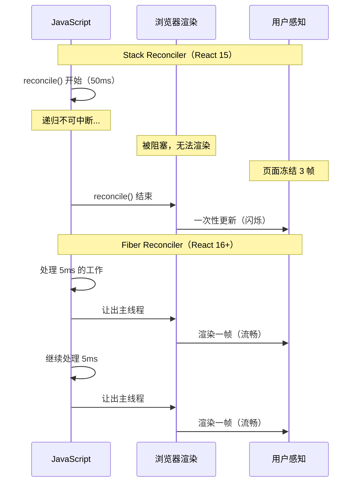
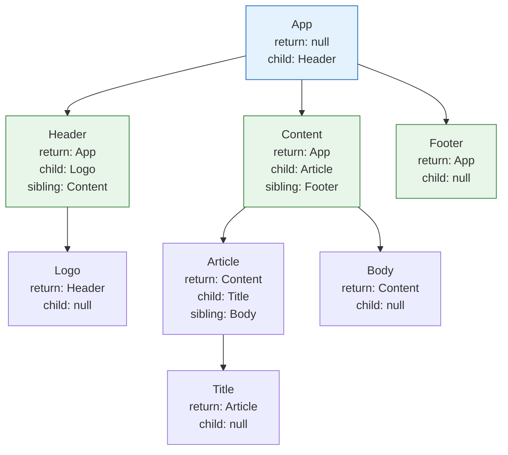
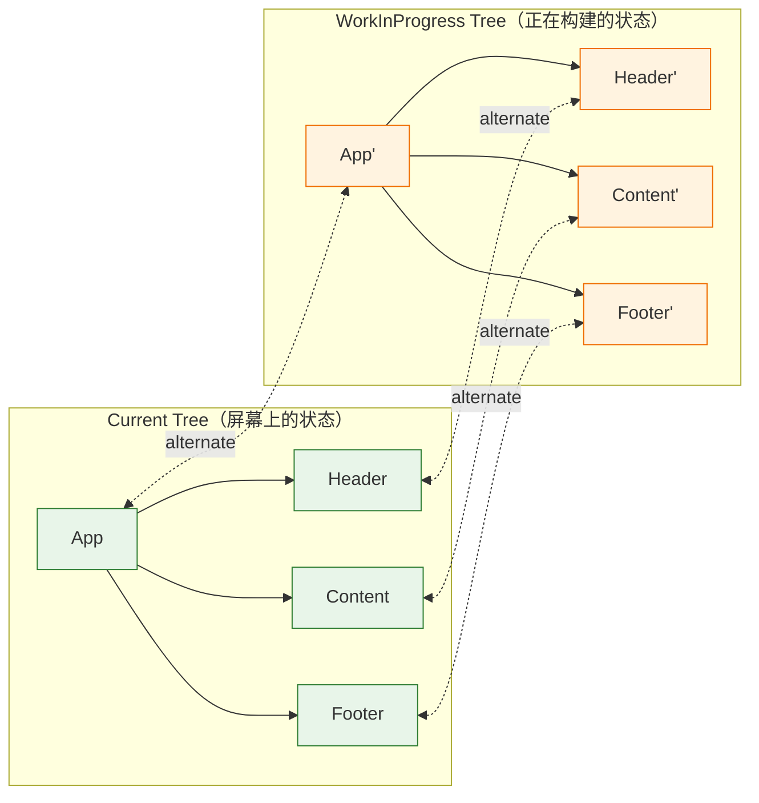
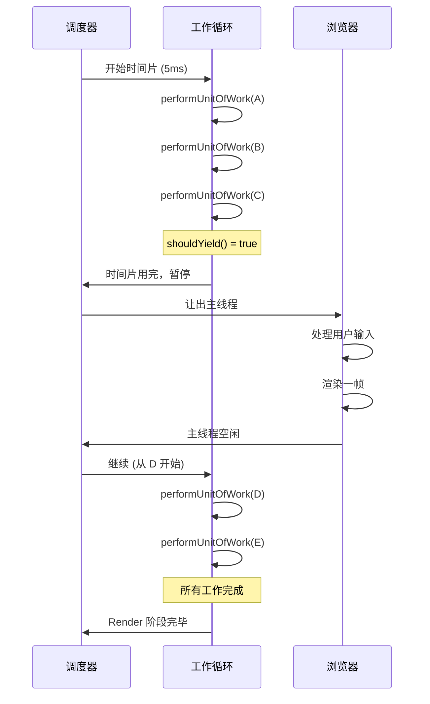

<div v-pre>

# 第3章 Fiber 架构：React 的操作系统

> **本章要点**
>
> - Fiber 诞生的历史背景：Stack Reconciler 的致命缺陷与浏览器渲染机制的冲突
> - Fiber 数据结构的完整剖析：30+ 字段的设计意图与相互关系
> - 双缓冲（Double Buffering）机制：current 树与 workInProgress 树的交替策略
> - Fiber 工作循环：从 `performUnitOfWork` 到 `completeWork` 的递归拆解
> - Fiber 与操作系统的类比：进程调度、中断恢复、时间片轮转
> - Lane 模型：React 的优先级系统如何用位运算实现 O(1) 调度

---

2016 年的某一天，React 团队成员 Andrew Clark 在 GitHub 上提交了一份名为 "React Fiber Architecture" 的文档。文档开头只有一句话：

> "React Fiber is an ongoing reimplementation of React's core algorithm."

这个看似温和的描述背后，是 React 历史上最大规模的一次内部重写。从 React 0.x 到 React 15，React 的协调算法（Reconciler）使用的是一种被称为 "Stack Reconciler" 的递归实现——它简单、直觉、高效，但有一个致命的缺陷：**一旦开始渲染，就无法停止。**

想象你在一台单核 CPU 的计算机上运行一个没有时间片轮转的操作系统。你启动了一个耗时 500 毫秒的计算任务。在这 500 毫秒里，键盘输入没有响应，鼠标移动被冻结，屏幕上的动画停止——因为 CPU 被那个任务完全占据，没有机会处理其他任何事情。

这就是 React 15 面临的问题。而 Fiber，就是 React 团队为它设计的"操作系统"。

## 3.1 Stack Reconciler：为什么需要推倒重来

### 递归的致命缺陷

React 15 的 Stack Reconciler 使用原生的 JavaScript 调用栈进行组件树的遍历。当你调用 `setState` 触发更新时，React 会从触发更新的组件开始，递归地向下遍历整个子树，对比新旧虚拟 DOM，生成变更列表，然后一次性提交到真实 DOM。

```typescript
// Stack Reconciler 的简化模型（React 15）
function reconcile(parentDom: HTMLElement, oldVNode: VNode, newVNode: VNode) {
  if (oldVNode.type !== newVNode.type) {
    // 类型不同，直接替换
    parentDom.replaceChild(createDom(newVNode), parentDom.childNodes[0]);
    return;
  }

  // 类型相同，更新属性
  updateProps(parentDom, oldVNode.props, newVNode.props);

  // 递归处理 children —— 这就是"Stack"的由来
  const oldChildren = oldVNode.children;
  const newChildren = newVNode.children;
  const maxLen = Math.max(oldChildren.length, newChildren.length);

  for (let i = 0; i < maxLen; i++) {
    reconcile(parentDom.childNodes[i], oldChildren[i], newChildren[i]);
    // ⚠️ 每一层递归都压入调用栈
    // ⚠️ 一旦开始，无法中断——JavaScript 没有"暂停调用栈"的机制
  }
}
```

这段代码的问题在于：JavaScript 的调用栈是**不可中断的**。一旦你调用了 `reconcile`，它就会一路递归到叶子节点，然后逐层返回。在整个过程中，主线程被完全占据——没有机会处理用户输入、执行动画帧、或者响应任何其他事件。

### 16 毫秒的硬约束

浏览器的渲染管线以 60fps 为目标，这意味着每帧只有约 16.67 毫秒的时间窗口。在这个窗口内，浏览器需要完成：

```
JavaScript 执行 → 样式计算 → 布局 → 绘制 → 合成
```

如果 JavaScript 执行超过了这个时间窗口，浏览器就没有时间执行后续的渲染步骤——用户看到的就是"卡顿"。



**图 3-1：Stack Reconciler vs Fiber Reconciler 的时间线对比**

让我用一个真实场景说明这个问题有多严重。

### 大型列表的噩梦

假设你有一个包含 10000 条记录的数据表格。用户在搜索框中输入了一个字符，触发了整个表格的重新过滤和渲染。

```tsx
function DataTable({ data, filter }: { data: Item[]; filter: string }) {
  const filtered = data.filter(item =>
    item.name.toLowerCase().includes(filter.toLowerCase())
  );

  return (
    <table>
      <tbody>
        {filtered.map(item => (
          <TableRow key={item.id} item={item} />
        ))}
      </tbody>
    </table>
  );
}

function SearchableTable() {
  const [filter, setFilter] = useState('');

  return (
    <div>
      <input
        value={filter}
        onChange={e => setFilter(e.target.value)}
        placeholder="搜索..."
      />
      <DataTable data={largeDataset} filter={filter} />
    </div>
  );
}
```

在 React 15 中，用户每输入一个字符，React 就会同步地渲染 10000 行表格数据。如果每行的渲染需要 0.05ms，那么整个表格的渲染就需要 500ms。在这 500ms 内：

- 用户继续输入的字符不会出现在搜索框中
- 光标停止闪烁
- 如果有动画，动画会冻结
- 整个页面处于"假死"状态

这不是一个理论上的问题——这是 2016 年无数 React 应用面临的真实困境。React 团队需要一个根本性的解决方案。

## 3.2 Fiber 的核心思想：把递归变成迭代

Fiber 的核心思想可以用一句话概括：**把不可中断的递归，变成可中断的迭代。**

在计算机科学中，任何递归都可以用显式的数据结构（通常是栈或链表）转化为迭代。Fiber 正是这个思想的应用——它用一个链表结构（Fiber Tree）替代了 JavaScript 的调用栈，使得 React 可以在任意时刻"暂停"工作，将控制权交还给浏览器，然后在下一个时间窗口"恢复"工作。

这就像操作系统的**上下文切换**（Context Switch）——操作系统通过保存和恢复 CPU 寄存器的状态，让多个进程"轮流"使用 CPU，营造出"同时运行"的幻觉。Fiber 通过保存和恢复 Fiber 节点的状态，让 React 的渲染工作和浏览器的渲染工作"轮流"使用主线程。

```typescript
// 概念模型：从递归到迭代的转变

// ❌ 递归（Stack Reconciler）—— 调用栈隐式管理状态
function processTree(node: VNode) {
  processNode(node);
  for (const child of node.children) {
    processTree(child); // 递归调用，状态在调用栈中
  }
}

// ✅ 迭代（Fiber Reconciler）—— 显式数据结构管理状态
function workLoop(deadline: IdleDeadline) {
  while (workInProgress !== null && deadline.timeRemaining() > 0) {
    workInProgress = performUnitOfWork(workInProgress);
    // 每处理一个节点，检查是否还有时间
    // 如果时间用完，workInProgress 保存了当前位置
    // 下次恢复时，从这个位置继续
  }

  if (workInProgress !== null) {
    // 还有工作没做完，请求下一个时间片
    requestIdleCallback(workLoop);
  }
}
```

> 🔥 **深度洞察：Fiber 不只是一个数据结构**
>
> 很多教程把 Fiber 简单地描述为"一种链表数据结构"。这是不完整的。Fiber 是一个**协调架构**——它包含了数据结构（Fiber Node）、遍历算法（工作循环）、调度策略（优先级系统）和并发控制（中断与恢复）四个层面。把 Fiber 类比为操作系统更加贴切：Fiber Node 是进程控制块（PCB），工作循环是 CPU 调度器，Lane 是优先级队列，双缓冲是进程切换的上下文保存。理解 Fiber，就是理解 React 如何在单线程的 JavaScript 环境中模拟了一个多任务操作系统。

## 3.3 Fiber Node 的数据结构

每一个 React Element 在 React 内部都对应一个 Fiber Node。Fiber Node 是一个普通的 JavaScript 对象，但它的字段之丰富，足以承载 React 运行时的全部信息。

### 完整的 Fiber Node 定义

```typescript
// packages/react-reconciler/src/ReactInternalTypes.ts（React 19，简化）
interface FiberNode {
  // === 身份标识 ===
  tag: WorkTag;              // Fiber 的类型标签（FunctionComponent, HostComponent, etc.）
  key: string | null;        // 来自 React Element 的 key
  elementType: any;          // 来自 React Element 的 type
  type: any;                 // 经过解析后的 type（对于 lazy 组件，这是解析后的组件）
  stateNode: any;            // 对应的真实 DOM 节点（HostComponent）或组件实例（ClassComponent）

  // === 树结构（链表指针）===
  return: FiberNode | null;  // 父节点
  child: FiberNode | null;   // 第一个子节点
  sibling: FiberNode | null; // 下一个兄弟节点
  index: number;             // 在兄弟中的位置索引

  // === 引用 ===
  ref: React.Ref<any> | null;

  // === 状态与更新 ===
  pendingProps: any;          // 本次更新的新 props
  memoizedProps: any;         // 上次渲染的 props（已提交）
  memoizedState: any;         // 上次渲染的 state（Hooks 链表的头节点）
  updateQueue: UpdateQueue | null; // 待处理的更新队列

  // === 副作用 ===
  flags: Flags;               // 副作用标记（Placement, Update, Deletion, etc.）
  subtreeFlags: Flags;        // 子树的副作用标记（冒泡优化）
  deletions: FiberNode[] | null; // 需要删除的子 Fiber

  // === 调度与优先级 ===
  lanes: Lanes;               // 本节点上挂起的更新优先级
  childLanes: Lanes;          // 子树中挂起的更新优先级

  // === 双缓冲 ===
  alternate: FiberNode | null; // 指向另一棵树中的对应节点

  // === 调试（开发模式）===
  _debugOwner?: FiberNode | null;
  _debugSource?: Source | null;
}
```

这个数据结构可以分成六个维度来理解：

### 维度一：身份标识

| 字段 | 类型 | 作用 |
|------|------|------|
| `tag` | `WorkTag`（枚举） | 标识 Fiber 的类型，决定 React 如何处理这个节点 |
| `key` | `string \| null` | Diff 算法中用于识别列表元素的唯一标识 |
| `elementType` | `any` | React Element 原始的 `type` 值 |
| `type` | `any` | 解析后的 `type`（lazy 组件会被解析为实际组件） |
| `stateNode` | `any` | 对应的宿主实例（DOM 节点、组件实例） |

`tag` 字段是 React 的"类型分发器"。React 19 中定义了超过 25 种 WorkTag：

```typescript
// packages/react-reconciler/src/ReactWorkTags.ts
export const FunctionComponent = 0;
export const ClassComponent = 1;
export const HostRoot = 3;         // ReactDOM.createRoot 创建的根节点
export const HostComponent = 5;    // 原生 DOM 元素（div, span, etc.）
export const HostText = 6;         // 文本节点
export const Fragment = 7;
export const ContextProvider = 10;
export const ForwardRef = 11;
export const MemoComponent = 14;
export const SimpleMemoComponent = 15;
export const LazyComponent = 16;
export const SuspenseComponent = 13;
export const OffscreenComponent = 22;
export const CacheComponent = 24;
// ... 更多类型
```

### 维度二：树结构

Fiber 树不是传统的多叉树，而是通过三个指针实现的**链表树**：



**图 3-2：Fiber 树的链表结构**

```typescript
// 三指针结构
// App.child → Header
// Header.sibling → Content
// Content.sibling → Footer
// Header.return → App
// Content.return → App
// Footer.return → App
```

为什么不用 `children: FiberNode[]` 数组？因为链表结构有两个关键优势：

**优势一：O(1) 的插入和删除。** 数组的插入和删除是 O(n)，链表是 O(1)。在大型列表的重排序中，这个差异是实质性的。

**优势二：天然支持深度优先遍历。** Fiber 的工作循环需要深度优先遍历整棵树，链表结构让这个遍历可以不使用递归完成——只需要沿着 `child` 向下、沿着 `sibling` 向右、沿着 `return` 向上。

```typescript
// Fiber 树的深度优先遍历（无递归）
function traverseFiberTree(root: FiberNode) {
  let node: FiberNode | null = root;

  while (node !== null) {
    // 处理当前节点
    processNode(node);

    // 1. 有子节点？向下
    if (node.child !== null) {
      node = node.child;
      continue;
    }

    // 2. 没有子节点，尝试兄弟节点
    while (node !== null) {
      // 回到根节点，遍历结束
      if (node === root) return;

      // 有兄弟节点？向右
      if (node.sibling !== null) {
        node = node.sibling;
        break;
      }

      // 没有兄弟，向上回溯
      node = node.return;
    }
  }
}
```

### 维度三：状态与更新

```typescript
// pendingProps vs memoizedProps
// pendingProps：本次渲染传入的新 props
// memoizedProps：上次渲染已提交的 props
// 两者比较可以判断 props 是否变化

// memoizedState：对于函数组件，这是 Hooks 链表的头节点
// 每个 Hook 是链表中的一个节点
type HookState = {
  memoizedState: any;     // Hook 的当前值
  baseState: any;         // 基础 state（用于并发模式的优先级跳过）
  baseQueue: Update | null;
  queue: UpdateQueue;      // 该 Hook 的更新队列
  next: HookState | null;  // 指向下一个 Hook
};
```

> 💡 **最佳实践**：理解 `memoizedState` 的结构解释了为什么 Hooks 不能写在条件语句中。React 通过链表的顺序来匹配每个 `useState`/`useEffect` 调用。如果某次渲染跳过了一个 Hook 调用，链表的顺序就会错位，导致每个 Hook 读取了错误的状态。这不是 React 的"设计缺陷"，而是链表结构的必然约束——在 O(1) 空间复杂度和 O(1) 访问时间的约束下，顺序是唯一的标识方式。

### 维度四：副作用标记

```typescript
// packages/react-reconciler/src/ReactFiberFlags.ts
export const NoFlags =         0b0000000000000000000000000000;
export const Placement =       0b0000000000000000000000000010; // 新增节点
export const Update =          0b0000000000000000000000000100; // 更新节点
export const ChildDeletion =   0b0000000000000000000000010000; // 子节点需要删除
export const ContentReset =    0b0000000000000000000000100000; // 文本内容重置
export const Callback =        0b0000000000000000000001000000; // 有 callback（setState 第二参数）
export const Ref =             0b0000000000000000001000000000; // ref 需要更新
export const Snapshot =        0b0000000000000000010000000000; // getSnapshotBeforeUpdate
export const Passive =         0b0000000000000000100000000000; // useEffect
export const Visibility =      0b0000000000000010000000000000; // Offscreen 可见性
// ... 更多标记
```

**为什么用位掩码？** 因为一个 Fiber 节点可以同时拥有多种副作用。位掩码允许用单个整数存储多个标记，用位运算进行 O(1) 的查询和修改：

```typescript
// 添加标记
fiber.flags |= Placement | Update; // 同时标记为"新增"和"更新"

// 检查标记
if (fiber.flags & Placement) { /* 需要新增 */ }
if (fiber.flags & Update) { /* 需要更新 */ }

// 清除标记
fiber.flags &= ~Placement; // 移除"新增"标记

// 子树标记冒泡
parent.subtreeFlags |= child.flags | child.subtreeFlags;
// 父节点知道子树中是否有副作用，可以跳过无副作用的子树
```

`subtreeFlags` 是 React 18 引入的优化。在此之前，React 使用 "Effect List"（一个链表）收集所有有副作用的节点。subtreeFlags 的优势在于：**如果一个子树的 `subtreeFlags` 为 0，那么整个子树可以跳过，不需要遍历。** 这在大型组件树中是一个重大优化。

### 维度五：调度与优先级（Lanes）

```typescript
// packages/react-reconciler/src/ReactFiberLane.ts
export type Lane = number;
export type Lanes = number;

export const NoLane: Lane =                    0b0000000000000000000000000000000;
export const SyncLane: Lane =                  0b0000000000000000000000000000010;
export const InputContinuousLane: Lane =       0b0000000000000000000000000001000;
export const DefaultLane: Lane =               0b0000000000000000000000000100000;
export const TransitionLane1: Lane =           0b0000000000000000000000010000000;
export const TransitionLane2: Lane =           0b0000000000000000000000100000000;
// ... 更多 Transition Lanes
export const IdleLane: Lane =                  0b0010000000000000000000000000000;
export const OffscreenLane: Lane =             0b0100000000000000000000000000000;
```

Lane 模型是 React 18 引入的优先级系统，替代了 React 16-17 中的 `expirationTime` 模型。它用 31 位整数的每一位表示一个优先级"车道"（Lane），优先级从低位到高位递减。

| Lane | 优先级 | 触发场景 | 示例 |
|------|--------|----------|------|
| `SyncLane` | 最高 | 离散事件 | `onClick`、`onKeyDown` |
| `InputContinuousLane` | 高 | 连续事件 | `onMouseMove`、`onScroll` |
| `DefaultLane` | 中 | 普通更新 | `setTimeout`、`fetch` 回调 |
| `TransitionLanes` | 低 | Transition 更新 | `startTransition` 包裹的更新 |
| `IdleLane` | 最低 | 空闲更新 | 预加载、后台同步 |

**为什么从 expirationTime 迁移到 Lanes？**

`expirationTime` 模型用一个时间戳表示优先级——时间越早到期，优先级越高。这个模型有两个缺陷：

1. **无法表示一组不连续的优先级。** 如果你想处理"优先级 3 和优先级 7，但跳过优先级 5"，expirationTime 做不到。Lanes 可以——`lane3 | lane7` 表示同时处理两个优先级。

2. **无法表示一批更新。** Suspense 需要将一组 Transition 更新作为整体处理。expirationTime 只能表示一个时间点，Lanes 可以表示一组车道 `TransitionLane1 | TransitionLane2 | ...`。

```typescript
// Lane 的位运算操作
function mergeLanes(a: Lanes, b: Lanes): Lanes {
  return a | b; // 合并两组优先级
}

function intersectLanes(a: Lanes, b: Lanes): Lanes {
  return a & b; // 取交集
}

function isSubsetOfLanes(set: Lanes, subset: Lanes): boolean {
  return (set & subset) === subset; // 检查 subset 是否是 set 的子集
}

function getHighestPriorityLane(lanes: Lanes): Lane {
  return lanes & -lanes; // 取最低位的 1，即最高优先级
  // 这利用了补码的性质：-lanes = ~lanes + 1
  // 例：lanes = 0b1010，-lanes = 0b0110，lanes & -lanes = 0b0010
}
```

> 🔥 **深度洞察：Lanes 的位运算之美**
>
> `lanes & -lanes` 取最低位的 1——这个技巧来自底层系统编程。在补码表示法中，`-n` 等于 `~n + 1`，将 `n` 的最低位 1 之上的所有位取反。与原数做与运算后，只保留了最低位的 1。这使得"获取最高优先级"成为一个 O(1) 操作，而不需要遍历所有位。React 团队选择位运算而非数组/Map 来实现优先级系统，正是因为它能在常数时间内完成所有调度决策——这对于每秒可能触发数十次更新的 UI 框架来说至关重要。

### 维度六：双缓冲

```typescript
// alternate 字段：指向另一棵树中的对应节点
fiber.alternate = otherFiber;
otherFiber.alternate = fiber;
```

`alternate` 是 Fiber 双缓冲机制的核心字段。我们在 3.4 节详细剖析。

## 3.4 双缓冲机制：屏幕背后的两棵树

### 什么是双缓冲

双缓冲（Double Buffering）是图形编程中的经典技术。当你在屏幕上直接绘制图形时，如果绘制过程较慢，用户会看到图形被逐步绘制的过程——闪烁和撕裂。解决方案是：在一个看不见的"后台缓冲区"中完成所有绘制工作，然后一次性将整个画面复制到屏幕上。

React 的双缓冲思想相同：维护两棵 Fiber 树——**current 树**（当前屏幕上的状态）和 **workInProgress 树**（正在构建的新状态）。所有的计算工作在 workInProgress 树上进行，完成后一次性切换为 current 树。



**图 3-3：Fiber 的双缓冲机制**

### 双缓冲的创建与切换

```typescript
// packages/react-reconciler/src/ReactFiber.ts（简化）

// 创建 workInProgress 节点
function createWorkInProgress(current: FiberNode, pendingProps: any): FiberNode {
  let workInProgress = current.alternate;

  if (workInProgress === null) {
    // 首次渲染：创建新的 Fiber 节点
    workInProgress = createFiber(current.tag, pendingProps, current.key);
    workInProgress.elementType = current.elementType;
    workInProgress.type = current.type;
    workInProgress.stateNode = current.stateNode;

    // 建立双向链接
    workInProgress.alternate = current;
    current.alternate = workInProgress;
  } else {
    // 更新：复用已有的 Fiber 节点
    workInProgress.pendingProps = pendingProps;
    workInProgress.type = current.type;

    // 重置副作用标记
    workInProgress.flags = NoFlags;
    workInProgress.subtreeFlags = NoFlags;
    workInProgress.deletions = null;
  }

  // 复制不变的字段
  workInProgress.childLanes = current.childLanes;
  workInProgress.lanes = current.lanes;
  workInProgress.child = current.child;
  workInProgress.memoizedProps = current.memoizedProps;
  workInProgress.memoizedState = current.memoizedState;
  workInProgress.updateQueue = current.updateQueue;

  return workInProgress;
}
```

**关键点：节点复用。** 当 `current.alternate` 不为 `null` 时，React 不创建新对象，而是复用旧的 Fiber 节点——只更新它的属性。这意味着整个 Fiber 树在首次渲染后就不再产生新的 Fiber Node 对象（除非有新增节点），极大地减少了 GC 压力。

### Commit 阶段的切换

当 workInProgress 树构建完成后，React 进入 Commit 阶段，将变更应用到真实 DOM。Commit 完成后，只需要一行代码完成树的切换：

```typescript
// packages/react-reconciler/src/ReactFiberWorkLoop.ts（简化）
function commitRoot(root: FiberRoot) {
  // ... 应用所有 DOM 变更 ...

  // 🎯 关键一行：切换 current 指针
  root.current = finishedWork;
  // finishedWork 就是 workInProgress 树的根节点
  // 现在它变成了 current 树
  // 而之前的 current 树通过 alternate 指针，成为了下一次更新的 workInProgress 树
}
```

这行代码完成后：
- 之前的 workInProgress 树变成了新的 current 树（屏幕上显示的状态）
- 之前的 current 树通过 `alternate` 指针，成为了下一次更新时的 workInProgress 树（被复用）

**这就是双缓冲的精髓——两棵树在每次更新后交换角色，永远复用，永远不需要重新创建。**

> 💡 **最佳实践**：理解双缓冲机制解释了 React DevTools 中一个常见的困惑——为什么某些组件的 Fiber 节点在 Profiler 中显示为 "Did not render"，但它们的 `alternate` 仍然存在。这不是内存泄漏，而是双缓冲的正常行为。React 保留了 alternate 节点以便下次更新时复用。

## 3.5 Fiber 工作循环：深度优先的可中断遍历

Fiber 的工作循环（Work Loop）是整个架构的核心执行引擎。它将一次完整的树遍历分解为一个个"工作单元"（Unit of Work），每个工作单元处理一个 Fiber 节点。

### 两阶段：Render 与 Commit

React 的更新过程分为两个阶段：

| 阶段 | 是否可中断 | 做什么 | 涉及真实 DOM |
|------|-----------|--------|-------------|
| **Render 阶段** | ✅ 可中断 | 构建 workInProgress 树，计算 diff，标记副作用 | ❌ 不涉及 |
| **Commit 阶段** | ❌ 不可中断 | 将副作用应用到真实 DOM，执行生命周期 | ✅ 涉及 |

Render 阶段可中断是 Fiber 的核心价值所在。Commit 阶段不可中断，因为 DOM 操作必须保持原子性——用户不应该看到"更新了一半"的界面。

### performUnitOfWork：向下递

```typescript
// packages/react-reconciler/src/ReactFiberWorkLoop.ts（简化）
function performUnitOfWork(unitOfWork: FiberNode): FiberNode | null {
  const current = unitOfWork.alternate;

  // "递"阶段：处理当前节点，返回子节点
  const next = beginWork(current, unitOfWork, renderLanes);

  // 将 pendingProps 提升为 memoizedProps（本次处理完毕）
  unitOfWork.memoizedProps = unitOfWork.pendingProps;

  if (next === null) {
    // 没有子节点了，进入"归"阶段
    completeUnitOfWork(unitOfWork);
  }

  return next; // 返回子节点作为下一个工作单元
}
```

### beginWork：根据类型分发处理

`beginWork` 是 Render 阶段最重要的函数——它根据 Fiber 的 `tag` 决定如何处理这个节点：

```typescript
// packages/react-reconciler/src/ReactFiberBeginWork.ts（简化）
function beginWork(
  current: FiberNode | null,
  workInProgress: FiberNode,
  renderLanes: Lanes
): FiberNode | null {
  // 优化：如果 props 和 state 都没变，可以跳过
  if (current !== null) {
    const oldProps = current.memoizedProps;
    const newProps = workInProgress.pendingProps;

    if (oldProps === newProps && !hasScheduledUpdateOnFiber(current, renderLanes)) {
      // Bailout：跳过这个节点和它的子树
      return bailoutOnAlreadyFinishedWork(current, workInProgress, renderLanes);
    }
  }

  // 根据 tag 分发处理
  switch (workInProgress.tag) {
    case FunctionComponent:
      return updateFunctionComponent(current, workInProgress, renderLanes);
    case ClassComponent:
      return updateClassComponent(current, workInProgress, renderLanes);
    case HostRoot:
      return updateHostRoot(current, workInProgress, renderLanes);
    case HostComponent:
      return updateHostComponent(current, workInProgress, renderLanes);
    case HostText:
      return updateHostText(current, workInProgress);
    case SuspenseComponent:
      return updateSuspenseComponent(current, workInProgress, renderLanes);
    case MemoComponent:
      return updateMemoComponent(current, workInProgress, renderLanes);
    // ... 更多类型
  }
}
```

**Bailout 优化是性能的关键。** 如果一个节点的 props 引用没有变化（`oldProps === newProps`），且没有挂起的更新，React 可以跳过整个子树——不需要调用组件函数、不需要 diff children。这就是为什么 `React.memo` 和 React Compiler 的自动记忆化如此重要——它们让 `oldProps === newProps` 更频繁地成立。

### completeUnitOfWork：向上归

当 `beginWork` 返回 `null`（没有子节点了），进入"归"阶段：

```typescript
// packages/react-reconciler/src/ReactFiberWorkLoop.ts（简化）
function completeUnitOfWork(unitOfWork: FiberNode) {
  let completedWork: FiberNode | null = unitOfWork;

  while (completedWork !== null) {
    const current = completedWork.alternate;

    // "归"阶段的核心：创建或更新 DOM 节点
    completeWork(current, completedWork, renderLanes);

    // 副作用标记冒泡
    const returnFiber = completedWork.return;
    if (returnFiber !== null) {
      returnFiber.subtreeFlags |= completedWork.subtreeFlags | completedWork.flags;
    }

    // 有兄弟节点？返回兄弟，继续"递"
    const siblingFiber = completedWork.sibling;
    if (siblingFiber !== null) {
      workInProgress = siblingFiber;
      return; // 退出 complete 循环，回到 performUnitOfWork
    }

    // 没有兄弟，继续向上"归"
    completedWork = returnFiber;
    workInProgress = completedWork;
  }
}
```

### completeWork：创建真实 DOM

`completeWork` 在"归"阶段为 HostComponent（原生 DOM 元素）创建真实 DOM 节点：

```typescript
// packages/react-reconciler/src/ReactFiberCompleteWork.ts（简化）
function completeWork(
  current: FiberNode | null,
  workInProgress: FiberNode,
  renderLanes: Lanes
) {
  switch (workInProgress.tag) {
    case HostComponent: {
      const type = workInProgress.type; // 'div', 'span', etc.

      if (current !== null && workInProgress.stateNode !== null) {
        // 更新：对比新旧 props，生成 updatePayload
        const updatePayload = prepareUpdate(
          workInProgress.stateNode,
          type,
          current.memoizedProps,
          workInProgress.pendingProps
        );
        if (updatePayload !== null) {
          workInProgress.flags |= Update;
        }
      } else {
        // 首次渲染：创建 DOM 节点
        const instance = createInstance(type, workInProgress.pendingProps);
        // 将所有子 DOM 节点挂载到这个节点下
        appendAllChildren(instance, workInProgress);
        workInProgress.stateNode = instance;
      }
      return null;
    }
    case HostText: {
      const newText = workInProgress.pendingProps;
      if (current !== null && workInProgress.stateNode !== null) {
        // 更新文本
        if (current.memoizedProps !== newText) {
          workInProgress.flags |= Update;
        }
      } else {
        // 创建文本节点
        workInProgress.stateNode = createTextInstance(newText);
      }
      return null;
    }
    // ... 其他类型
  }
}
```

### 完整的遍历流程

让我用一个具体的组件树来展示完整的"递-归"遍历流程：

```tsx
function App() {
  return (
    <div>
      <h1>Title</h1>
      <p>Content</p>
    </div>
  );
}
```

对应的 Fiber 树遍历顺序：

```
beginWork(App)         → 返回 child: div
  beginWork(div)       → 返回 child: h1
    beginWork(h1)      → 返回 child: "Title"
      beginWork("Title") → 返回 null（叶子节点）
      completeWork("Title")
    completeWork(h1)     ← 创建 <h1> DOM，挂载 "Title"
    beginWork(p)         → sibling，返回 child: "Content"
      beginWork("Content") → 返回 null
      completeWork("Content")
    completeWork(p)      ← 创建 <p> DOM，挂载 "Content"
  completeWork(div)      ← 创建 <div> DOM，挂载 <h1> 和 <p>
completeWork(App)
```

**关键观察：DOM 节点是在"归"阶段自下而上创建的。** 叶子节点的 DOM 先创建，然后逐层向上挂载到父节点。当 `completeWork(div)` 执行时，`<h1>` 和 `<p>` 的 DOM 已经准备好了，可以直接 `appendChild`。

## 3.6 可中断渲染：时间切片的实现

### workLoopConcurrent：带时间检查的工作循环

```typescript
// packages/react-reconciler/src/ReactFiberWorkLoop.ts（简化）

// 同步模式：不可中断
function workLoopSync() {
  while (workInProgress !== null) {
    performUnitOfWork(workInProgress);
  }
}

// 并发模式：可中断
function workLoopConcurrent() {
  while (workInProgress !== null && !shouldYield()) {
    performUnitOfWork(workInProgress);
  }
}
```

唯一的区别就是 `shouldYield()` 这个检查。`shouldYield` 来自 React 的调度器（Scheduler），它检查当前时间片是否已用完：

```typescript
// packages/scheduler/src/forks/Scheduler.ts（简化）
function shouldYieldToHost(): boolean {
  const currentTime = getCurrentTime();
  return currentTime >= deadline;
  // deadline = startTime + yieldInterval
  // yieldInterval 默认为 5ms
}
```

**5 毫秒的时间片。** React 的默认时间片是 5ms——这意味着每处理一个 Fiber 节点后，React 都会检查是否已经工作了 5ms。如果是，就暂停工作，将控制权交还给浏览器，让浏览器有机会处理用户输入和渲染。



**图 3-4：时间切片的执行流程**

### 中断与恢复的秘密

为什么 Fiber 可以在任意节点暂停并恢复？因为所有的状态都保存在 Fiber Node 中，而不是 JavaScript 的调用栈中。

在 Stack Reconciler 中：
```
reconcile(App)
  → reconcile(div)     // 调用栈帧 1
    → reconcile(h1)    // 调用栈帧 2
      → reconcile(text) // 调用栈帧 3
      // 如果在这里中断，调用栈帧 1、2、3 的信息全部丢失
```

在 Fiber Reconciler 中：
```
workInProgress = h1Fiber  // 当前工作到 h1
// 中断后，只需要恢复 workInProgress 指针
// h1Fiber.return → div，div.return → App，所有信息都在链表中
```

这就是为什么 Fiber 需要那么多字段——每个字段都是"上下文"的一部分，确保中断后可以无损恢复。

## 3.7 Fiber 与操作系统的完整类比

理解 Fiber 最好的方式，是将它与操作系统进行系统性的类比：

| 操作系统概念 | Fiber 对应物 | 说明 |
|-------------|------------|------|
| **进程/线程** | Fiber Node | 代表一个可调度的工作单元 |
| **进程控制块（PCB）** | Fiber Node 的字段 | 保存状态、优先级、上下文信息 |
| **上下文切换** | 中断 workLoop + 保存 workInProgress | 暂停当前工作，切换到其他任务 |
| **时间片轮转** | 5ms 时间片 + shouldYield | 每个工作单元执行一段时间后让出 CPU |
| **优先级调度** | Lane 模型 | 高优先级更新（用户输入）可以打断低优先级更新（数据加载） |
| **抢占式调度** | 高优先级 Lane 打断低优先级渲染 | 类似于 Unix 的信号中断 |
| **双缓冲帧** | current 树 / workInProgress 树 | 后台计算，一次性切换到前台 |
| **虚拟内存/页表** | Fiber 树的链表结构 | 通过指针间接访问，支持动态调整 |
| **内核态/用户态** | Render 阶段 / Commit 阶段 | Render 可中断（用户态），Commit 不可中断（内核态） |

> 🔥 **深度洞察：React 是一个运行在浏览器中的操作系统**
>
> 这不是一个隐喻——React 团队在设计 Fiber 时，明确参考了操作系统的调度理论。Sebastian Markbåge 曾在一次技术分享中说："We're essentially building a tiny operating system that runs inside the browser." 理解这一点，你就能理解 React 的很多设计决策：为什么需要自己的调度器（不依赖 `requestIdleCallback`）、为什么 Hooks 有那么多规则（类似于系统调用的约束）、为什么并发模式如此复杂（并发编程本来就复杂）。React 不只是一个 UI 库——它是一个 UI 调度引擎。

## 3.8 首次渲染（Mount）的完整流程

让我们用一个真实的例子，追踪 Fiber 在首次渲染时的完整行为。

```tsx
// 入口代码
const root = ReactDOM.createRoot(document.getElementById('root')!);
root.render(<App />);

function App() {
  const [count, setCount] = useState(0);
  return (
    <div className="app">
      <h1>Count: {count}</h1>
      <button onClick={() => setCount(c => c + 1)}>+1</button>
    </div>
  );
}
```

### 步骤一：创建 FiberRoot 和 HostRootFiber

```typescript
// ReactDOM.createRoot 内部
function createRoot(container: Element): Root {
  // FiberRoot：整个应用的根，不是 Fiber 节点
  const fiberRoot: FiberRoot = {
    containerInfo: container,        // 真实 DOM 容器
    current: uninitializedFiber,     // 指向 HostRootFiber
    finishedWork: null,              // commit 阶段的入口
    pendingLanes: NoLanes,
    // ...
  };

  // HostRootFiber：Fiber 树的根节点
  const hostRootFiber: FiberNode = {
    tag: HostRoot,
    stateNode: fiberRoot,           // 反向指向 FiberRoot
    // ...
  };

  fiberRoot.current = hostRootFiber;
  return fiberRoot;
}
```

`FiberRoot` 和 `HostRootFiber` 是两个不同的东西：`FiberRoot` 是容器，`HostRootFiber` 是 Fiber 树的根。它们通过 `current` 和 `stateNode` 互相指向。

### 步骤二：调度更新

```typescript
// root.render(<App />) 内部
function updateContainer(element: ReactElement, root: FiberRoot) {
  const hostRootFiber = root.current;

  // 创建一个更新对象
  const update: Update = {
    payload: { element }, // element 就是 <App />
    lane: SyncLane,       // 首次渲染使用同步优先级
  };

  // 将更新放入 HostRootFiber 的更新队列
  enqueueUpdate(hostRootFiber, update);

  // 调度渲染
  scheduleUpdateOnFiber(hostRootFiber, SyncLane);
}
```

### 步骤三：Render 阶段

```
1. beginWork(HostRootFiber)
   - 从 updateQueue 中取出 <App /> element
   - 为 App 创建 FiberNode（tag: FunctionComponent）
   - 返回 App Fiber 作为 child

2. beginWork(App Fiber)
   - 调用 App 函数组件
   - useState(0) 初始化 Hook 链表，memoizedState = 0
   - 组件返回 JSX → React Element 树
   - 为 <div> 创建 FiberNode（tag: HostComponent）
   - 返回 div Fiber 作为 child

3. beginWork(div Fiber)
   - 处理 className="app" 等 props
   - 为 <h1> 创建 FiberNode
   - 返回 h1 Fiber 作为 child

4. beginWork(h1 Fiber) → beginWork("Count: 0" Text)
   - 叶子节点，返回 null

5. completeWork("Count: 0" Text) → 创建文本节点
6. completeWork(h1 Fiber) → 创建 <h1> DOM，挂载文本
7. beginWork(button Fiber) → beginWork("+1" Text)
8. completeWork("+1" Text) → 创建文本节点
9. completeWork(button Fiber) → 创建 <button> DOM，挂载文本，绑定 onClick
10. completeWork(div Fiber) → 创建 <div> DOM，挂载 <h1> 和 <button>
11. completeWork(App Fiber) → 无 DOM 操作（函数组件没有自己的 DOM）
12. completeWork(HostRootFiber) → 准备进入 Commit 阶段
```

### 步骤四：Commit 阶段

Commit 阶段将构建好的 DOM 树一次性挂载到容器中：

```typescript
// 简化的 Commit 流程
function commitRoot(root: FiberRoot) {
  const finishedWork = root.finishedWork; // workInProgress 树的根

  // 阶段一：Before Mutation（DOM 操作之前）
  // - 调用 getSnapshotBeforeUpdate（类组件）

  // 阶段二：Mutation（DOM 操作）
  commitMutationEffects(finishedWork);
  // - Placement：将 DOM 树挂载到 container
  // - Update：更新已有 DOM 的属性
  // - Deletion：移除 DOM 节点

  // 🎯 切换 current 指针
  root.current = finishedWork;

  // 阶段三：Layout（DOM 操作之后）
  commitLayoutEffects(finishedWork);
  // - 调用 useLayoutEffect 的回调
  // - 调用类组件的 componentDidMount/componentDidUpdate

  // 阶段四：Passive Effects（异步执行）
  scheduleCallback(flushPassiveEffects);
  // - 调用 useEffect 的回调（异步，不阻塞渲染）
}
```

## 3.9 更新（Update）的完整流程

当用户点击按钮触发 `setCount(c => c + 1)` 时，更新流程与首次渲染有几个关键差异：

### 差异一：复用而非创建

```typescript
// 创建 workInProgress 时复用 alternate
const workInProgress = createWorkInProgress(current, pendingProps);
// 如果 current.alternate 存在，直接复用
// 不需要创建新的 Fiber 对象
```

### 差异二：Bailout 优化

```typescript
// beginWork 中的 bailout 检查
if (oldProps === newProps && !hasScheduledUpdate) {
  // 这个节点和它的子树都不需要更新
  return bailoutOnAlreadyFinishedWork(current, workInProgress, renderLanes);
}
```

在上面的例子中，`<button>` 的 `onClick` 函数如果在每次渲染时都创建新的引用，`button` Fiber 就不会命中 bailout。但如果使用 `useCallback` 缓存（或 React Compiler 自动缓存），`button` 及其子树可以被跳过。

### 差异三：DOM 更新而非创建

```typescript
// completeWork 中的更新路径
if (current !== null && workInProgress.stateNode !== null) {
  // 已有 DOM 节点，只需要对比属性变更
  const updatePayload = prepareUpdate(instance, type, oldProps, newProps);
  // updatePayload = ['children', 'Count: 1']
  // 只记录变化的属性，不重新创建 DOM
}
```

## 3.10 Fiber 的错误处理：Error Boundary 的实现

Fiber 架构还为错误处理提供了优雅的解决方案——Error Boundary（错误边界）。

```tsx
class ErrorBoundary extends React.Component<
  { children: React.ReactNode },
  { hasError: boolean; error: Error | null }
> {
  state = { hasError: false, error: null };

  static getDerivedStateFromError(error: Error) {
    return { hasError: true, error };
  }

  componentDidCatch(error: Error, errorInfo: React.ErrorInfo) {
    console.error('Error caught by boundary:', error, errorInfo);
  }

  render() {
    if (this.state.hasError) {
      return <h1>Something went wrong: {this.state.error?.message}</h1>;
    }
    return this.props.children;
  }
}
```

在 Fiber 架构中，错误处理的实现依赖于 `return` 指针：

```typescript
// packages/react-reconciler/src/ReactFiberThrow.ts（简化）
function throwException(
  root: FiberRoot,
  sourceFiber: FiberNode,  // 抛出错误的 Fiber
  value: any               // 错误对象
) {
  // 沿着 return 指针向上查找最近的 Error Boundary
  let workInProgress = sourceFiber.return;

  while (workInProgress !== null) {
    if (workInProgress.tag === ClassComponent) {
      const instance = workInProgress.stateNode;
      if (typeof instance.componentDidCatch === 'function' ||
          typeof workInProgress.type.getDerivedStateFromError === 'function') {
        // 找到了 Error Boundary！
        // 在这个节点上调度一个错误更新
        const update = createClassErrorUpdate(workInProgress, value);
        enqueueUpdate(workInProgress, update);
        scheduleUpdateOnFiber(workInProgress, SyncLane);
        return;
      }
    }
    workInProgress = workInProgress.return;
  }

  // 没有找到 Error Boundary → 整个应用崩溃
  // React 会卸载整个组件树
}
```

**为什么 Error Boundary 只能用类组件？** 因为错误捕获依赖于 `componentDidCatch` 和 `getDerivedStateFromError` 这两个生命周期方法。React 团队曾考虑为函数组件添加类似的 Hook（如 `useErrorBoundary`），但截至 React 19 仍未实现。原因之一是函数组件的执行是 Render 阶段的一部分，而错误恢复需要在当前渲染之外调度新的更新——这在类组件的实例方法模型中更自然。

> 💡 **最佳实践**：在配套视频课程《[React18内核探秘：手写React高质量源码迈向高阶开发](https://coding.imooc.com/class/650.html)》中，你可以看到如何从零实现一个简化版的 Fiber 架构，包括工作循环、双缓冲和错误边界。通过手写代码加深对这些概念的理解，远比只看源码更有效。

## 3.11 Fiber 的内存管理

Fiber 架构在内存管理上有几个精心设计的策略。

### 策略一：对象池复用

双缓冲的 `alternate` 机制本身就是一种对象池——Fiber 节点在两次渲染之间被复用，而不是创建后丢弃。这意味着在稳态（没有新增/删除节点的更新）下，Fiber 树不产生任何新的对象。

### 策略二：延迟删除

当一个组件被卸载时，React 不会立即清理它的 Fiber 节点：

```typescript
// 标记删除，而非立即删除
returnFiber.deletions = returnFiber.deletions || [];
returnFiber.deletions.push(childToDelete);
returnFiber.flags |= ChildDeletion;

// 在 Commit 阶段才真正清理
function commitDeletion(fiber: FiberNode) {
  // 递归清理子树的 ref、effect、stateNode
  commitNestedUnmounts(fiber);
  // 从 DOM 中移除
  removeChild(parentDom, fiber.stateNode);
  // 断开 Fiber 节点的引用，帮助 GC
  fiber.return = null;
  fiber.child = null;
  fiber.stateNode = null;
  fiber.alternate = null;
}
```

### 策略三：subtreeFlags 冒泡优化

```typescript
// 如果子树没有任何副作用，整个子树可以跳过
if ((fiber.subtreeFlags & MutationMask) === NoFlags) {
  // 子树中没有需要 commit 的副作用
  // 直接跳过，不遍历子树
  return;
}
```

在一个 1000 个节点的树中，如果只有 3 个节点需要更新，subtreeFlags 让 React 可以跳过 997 个节点的遍历——通过检查每个分支节点的 `subtreeFlags`，快速定位到有副作用的子树。

## 3.12 Fiber 架构的设计权衡

Fiber 不是免费的午餐。它的设计中包含了明确的权衡。

### 权衡一：内存开销

每个 React Element 对应一个 Fiber Node，每个 Fiber Node 有 30+ 个字段。在 V8 引擎中，一个 Fiber Node 大约占用 300-500 字节。对于一个 10000 节点的应用，Fiber 树占用约 3-5MB（乘以 2 因为双缓冲）。

这个开销在绝大多数应用中可以忽略。但在极端场景（如大型数据可视化、10 万行表格），它可能成为瓶颈。这也是 React 团队推动虚拟化（Virtualization）的原因之一——不在 DOM 中的元素，也不需要 Fiber Node。

### 权衡二：复杂性

Fiber 架构极大地增加了 React 内部的复杂性。React 15 的 Stack Reconciler 代码量约 3000 行，React 19 的 Fiber Reconciler 超过 30000 行。这种复杂性不仅增加了维护成本，也提高了社区理解 React 内部原理的门槛。

### 权衡三：同步 vs 异步的语义变化

可中断渲染引入了一个微妙的语义变化：**Render 阶段的代码可能被执行多次。** 如果高优先级更新打断了低优先级渲染，被打断的渲染会被丢弃并重新开始。这意味着组件函数、`useMemo`、`useReducer` 的回调可能执行多次但只有一次的结果被提交。

```tsx
function Example() {
  // ⚠️ 这个 console.log 可能执行多次，但屏幕只更新一次
  console.log('render');

  // ⚠️ 不要在渲染过程中执行有副作用的操作
  // fetchData(); // 错误！可能被调用多次

  return <div>...</div>;
}
```

这就是 React 严格模式（StrictMode）在开发环境下双重调用组件函数的原因——它在帮你提前发现那些依赖于"Render 只执行一次"假设的代码。

## 3.13 从源码到实践：理解 Fiber 如何帮助你写更好的代码

理解 Fiber 架构不只是为了满足好奇心——它直接影响你写 React 代码的方式。

### 实践一：为什么 key 如此重要

在 Fiber 的 Reconciliation 过程中，`key` 是 React 判断一个节点是否可以复用的关键依据：

```typescript
// Diff 算法中的 key 匹配
function updateSlot(returnFiber, oldFiber, newChild, lanes) {
  const key = oldFiber !== null ? oldFiber.key : null;

  if (typeof newChild === 'object' && newChild !== null) {
    if (newChild.key === key) {
      // key 匹配 → 复用 Fiber，只更新 props
      return updateElement(returnFiber, oldFiber, newChild, lanes);
    } else {
      // key 不匹配 → 不能复用，标记为新增
      return null;
    }
  }
}
```

没有 key 或 key 错误，React 就无法正确复用 Fiber 节点——它会销毁旧组件的全部状态（包括 useState 的值、DOM 元素、ref），然后创建新的。这不只是"性能问题"，更是"正确性问题"。

### 实践二：为什么 Hooks 有调用顺序的约束

```typescript
// Hooks 在 Fiber 上的存储
// memoizedState 是一个链表，每个节点对应一个 Hook 调用
// 链表的顺序就是代码中 Hook 调用的顺序

// 第一次渲染
useState(0)  → 链表节点 1: { memoizedState: 0, next: → }
useEffect()  → 链表节点 2: { memoizedState: effect, next: → }
useState('')  → 链表节点 3: { memoizedState: '', next: null }

// 第二次渲染
// React 按顺序遍历链表，匹配每个 Hook
useState(0)  → 读取链表节点 1 → state = 0 ✅
useEffect()  → 读取链表节点 2 → effect  ✅
useState('')  → 读取链表节点 3 → state = '' ✅

// 如果第二次渲染跳过了一个 Hook（条件调用）
useState(0)  → 读取链表节点 1 → state = 0 ✅
// useEffect() 被跳过
useState('')  → 读取链表节点 2 → 读到了 effect！💥 错误！
```

### 实践三：为什么 useEffect 的 cleanup 是异步的

```typescript
// Fiber 的 Commit 阶段流程
commitBeforeMutationEffects(); // snapshot
commitMutationEffects();        // DOM 操作
root.current = finishedWork;    // 切换双缓冲

commitLayoutEffects();          // useLayoutEffect 回调（同步）

// useEffect 的 cleanup 和回调在 Commit 之后异步执行
scheduleCallback(NormalPriority, () => {
  flushPassiveEffects(); // useEffect
});
```

`useEffect` 是异步的，因为它不需要阻塞渲染。`useLayoutEffect` 是同步的，因为它可能需要在浏览器绘制之前测量 DOM 尺寸。这个区分直接来自 Fiber 的两阶段设计——Commit 阶段内的操作是同步的，Commit 阶段后的操作可以异步调度。

## 3.14 本章小结

本章深入剖析了 React 最核心的架构——Fiber。总结以下几个关键认知：

**第一，Fiber 诞生于 Stack Reconciler 的局限。** JavaScript 调用栈不可中断，导致大型组件树的渲染会阻塞主线程数百毫秒。Fiber 将递归转化为迭代，用链表替代调用栈，实现了可中断的渲染。

**第二，Fiber Node 是 React 的"进程控制块"。** 它的 30+ 个字段涵盖了身份标识、树结构、状态管理、副作用标记、优先级调度和双缓冲六个维度。每个字段都有明确的设计意图。

**第三，双缓冲是 Fiber 的核心策略。** current 树和 workInProgress 树交替使用，在后台完成所有计算工作后一次性提交，避免了用户看到中间状态。Fiber 节点通过 `alternate` 指针在两棵树之间复用，几乎消除了 GC 压力。

**第四，Fiber 的工作循环是"递-归"式的深度优先遍历。** `beginWork` 向下处理每个节点（递），`completeWork` 向上创建 DOM（归）。每个节点的处理都是一个独立的"工作单元"，可以在任意两个工作单元之间暂停。

**第五，Lane 模型用位运算实现了 O(1) 的优先级调度。** 31 位整数的每一位代表一个优先级车道，位运算让合并、交集、最高优先级查找都在常数时间内完成。

**第六，Fiber 本质上是一个运行在浏览器中的操作系统。** 时间切片对应时间片轮转，Lane 对应优先级队列，双缓冲对应进程上下文保存，Render/Commit 对应用户态/内核态。

下一章，我们将深入 Fiber 架构中的调度器（Scheduler）——它是 React 时间切片的具体实现，是 Fiber 这个"操作系统"的 CPU 调度算法。

> Fiber 是 React 从"视图库"进化为"调度引擎"的转折点。理解它，你就理解了 React 为什么是 React。

---

### 思考题

1. **概念理解**：本章将 Fiber 类比为操作系统。请进一步思考：React 的 `StrictMode` 在这个类比中对应什么？提示：考虑操作系统中的安全检查和沙箱机制。

2. **实践应用**：在你的 React 项目中，使用 React DevTools 的 Profiler 录制一次渲染过程。观察 Fiber 树的遍历顺序——是否与本章描述的"递-归"模式一致？是否有节点因为 bailout 而被跳过？

3. **源码探索**：阅读 `packages/react-reconciler/src/ReactFiberWorkLoop.ts` 中 `workLoopConcurrent` 的完整实现。找到 `shouldYield` 的判断逻辑——时间片的长度是固定的吗？在什么情况下会动态调整？

4. **架构对比**：Vue 3 没有 Fiber 架构，但它有"异步更新队列"（nextTick）。对比 React 的 Fiber 时间切片和 Vue 3 的异步批处理，它们各自适合什么场景？在什么场景下 React 的方案更优？在什么场景下 Vue 的方案更优？

5. **性能分析**：Fiber 的双缓冲意味着内存中始终存在两棵树。在一个 10000 节点的应用中，粗略估算双缓冲的内存开销。这个开销在什么类型的设备上可能成为问题？React 提供了哪些机制来缓解这个问题？

</div>