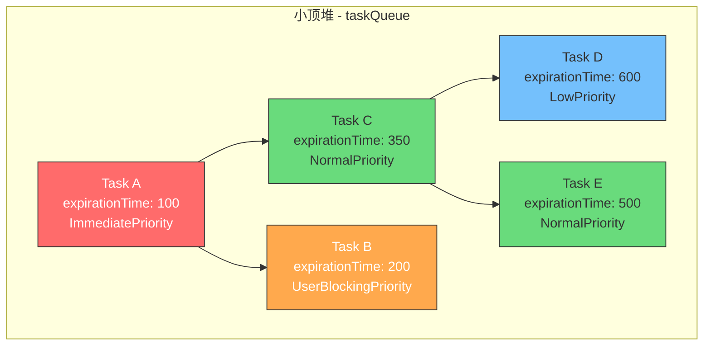
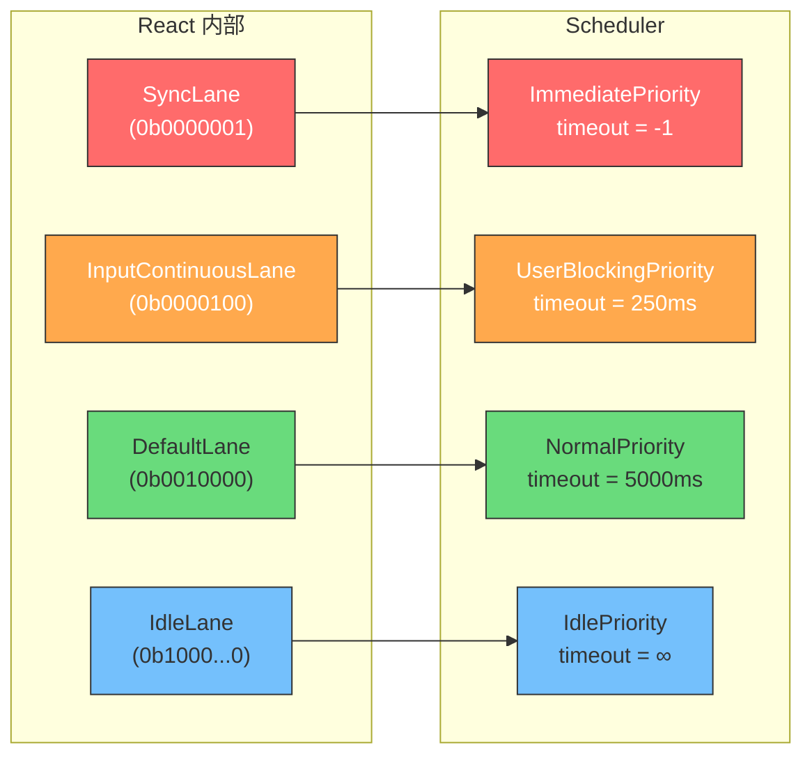
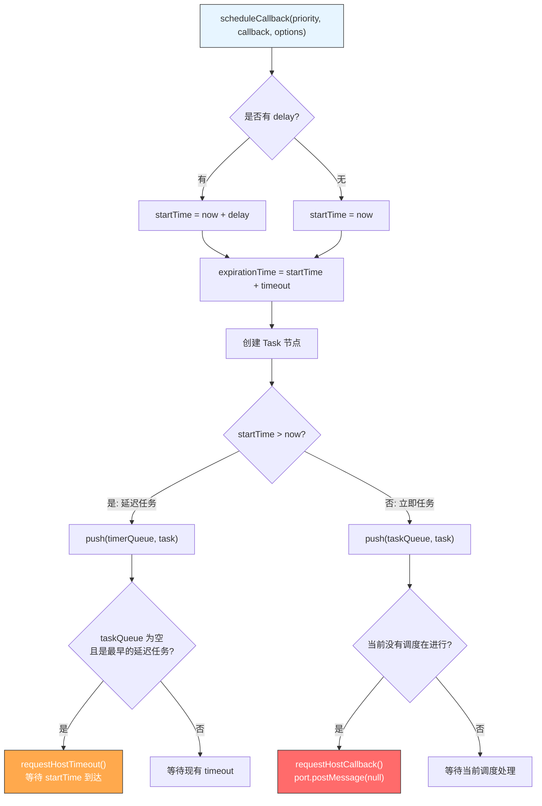
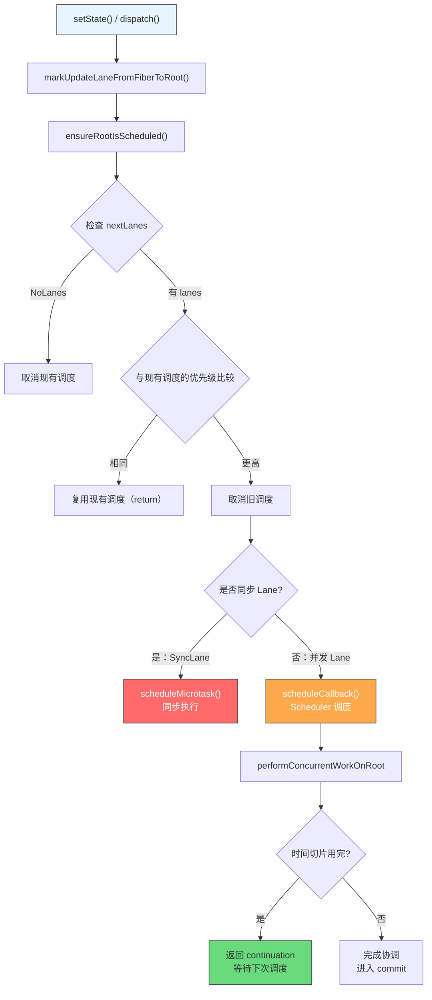

<div v-pre>

# 第4章 调度器：React 的 CPU 调度算法

> **本章要点**
>
> - Scheduler 的设计哲学：为什么 React 要自己实现一个任务调度器
> - 优先级模型：5 级优先级系统的设计与 Lane 模型的映射关系
> - 时间切片（Time Slicing）的实现：`shouldYield` 与 5ms 时间窗口
> - 任务队列的数据结构：小顶堆（Min Heap）的选择与实现
> - `MessageChannel` vs `requestIdleCallback`：React 为何放弃了浏览器原生 API
> - 从 `scheduleCallback` 到 `performWorkUntilDeadline`：一个任务的完整生命周期
> - 延迟任务与过期机制：饥饿问题的解决方案

---

2018 年，React 团队做了一个在当时看来颇为大胆的决定——他们要在 JavaScript 中实现一个**任务调度器**。

这不是一个普通的任务队列。React 团队要实现的，是一个具备**优先级抢占**、**时间切片**、**过期淘汰**能力的调度器，它在概念上与操作系统内核中的 CPU 调度器极其相似。这个调度器最终以一个独立的 npm 包发布，名字简单直白：`scheduler`。

为什么 React 需要自己的调度器？答案藏在浏览器的运行模型里。

## 4.1 浏览器的单线程困境

### 一个线程，所有的事

浏览器的主线程是一个极其繁忙的执行环境。JavaScript 执行、DOM 操作、样式计算、布局、绘制、垃圾回收——所有这些任务都在同一个线程上顺序执行。浏览器通过事件循环（Event Loop）来协调这些工作：

```typescript
// 浏览器事件循环的简化模型
function eventLoop() {
  while (true) {
    // 1. 从宏任务队列取出一个任务执行
    const task = macroTaskQueue.dequeue();
    if (task) task.run();

    // 2. 执行所有微任务
    while (microTaskQueue.length > 0) {
      microTaskQueue.dequeue().run();
    }

    // 3. 如果到了渲染时机（通常 16.67ms 一次）
    if (shouldRender()) {
      // 执行 requestAnimationFrame 回调
      runRAFCallbacks();
      // 样式计算 → 布局 → 绘制
      style();
      layout();
      paint();
    }

    // 4. 如果有空闲时间
    if (hasIdleTime()) {
      runIdleCallbacks(); // requestIdleCallback
    }
  }
}
```

问题在于：如果步骤 1 中的任务执行时间过长，步骤 3 的渲染就会被延迟，用户感知到的就是卡顿。而 React 的协调过程——对比新旧虚拟 DOM 树，计算需要更新的节点——恰恰是一个可能非常耗时的 JavaScript 任务。

### `requestIdleCallback`：一个美好但不够用的 API

浏览器其实提供了一个看起来完美的 API——`requestIdleCallback`（rIC）。它允许开发者在浏览器空闲时执行低优先级的工作：

```typescript
requestIdleCallback((deadline) => {
  // deadline.timeRemaining() 返回当前帧剩余的空闲时间
  while (deadline.timeRemaining() > 0 && hasWork()) {
    doWork();
  }
});
```

React 团队最初确实考虑过使用 rIC，但很快发现了它的几个致命问题：

1. **调用频率不可控**：rIC 的调用时机完全由浏览器决定。在高负载场景下，rIC 可能被延迟到几百毫秒甚至更久才执行
2. **最大超时只有 50ms**：即使在完全空闲的情况下，`timeRemaining()` 最多返回 50ms，这个限制是硬编码在规范中的
3. **兼容性问题**：Safari 直到 2024 年仍未支持 rIC
4. **没有优先级概念**：rIC 只有"空闲时执行"一种语义，无法区分"紧急更新"和"普通更新"

```typescript
// React 早期基于 rIC 的原型（已废弃）
function workLoop(deadline: IdleDeadline) {
  while (nextUnitOfWork && deadline.timeRemaining() > 1) {
    nextUnitOfWork = performUnitOfWork(nextUnitOfWork);
  }

  if (nextUnitOfWork) {
    // 还有工作没做完，请求下一次空闲回调
    requestIdleCallback(workLoop);
    // ⚠️ 问题：不知道下次什么时候会被调用
    // ⚠️ 可能是 16ms 后，也可能是 200ms 后
  }
}
```

React 需要的是更精确、更可控的调度能力。于是，他们决定自己造一个。

## 4.2 Scheduler 的架构设计

### 独立包的设计决策

React 的调度器以 `scheduler` 这个独立 npm 包的形式存在，这个设计决策本身就值得讨论。为什么不把调度逻辑直接写在 `react-reconciler` 里？

```
react
├── react              // 核心 API（createElement, hooks 等）
├── react-dom          // DOM 渲染器
├── react-reconciler   // 协调器（Fiber 工作循环）
└── scheduler          // 调度器（独立包）
```

答案是**通用性**。React 团队最初的愿景是让 Scheduler 成为一个通用的浏览器任务调度库——不仅 React 可以用，任何需要在主线程上做任务调度的库都可以用。虽然这个愿景至今没有完全实现（Scheduler 仍然主要服务于 React 生态），但独立包的设计让它的边界非常清晰：

- **Scheduler 只负责"何时执行"**，不关心"执行什么"
- **React Reconciler 负责"执行什么"**，不关心"何时执行"

这种关注点分离（Separation of Concerns）让两个模块可以独立演进。

### 核心数据结构

Scheduler 内部维护两个任务队列：

```typescript
// packages/scheduler/src/forks/Scheduler.js 的核心结构
// 存放已就绪的任务（按 sortIndex 排序，sortIndex = expirationTime）
var taskQueue: Array<Task> = [];
// 存放延迟任务（按 startTime 排序）
var timerQueue: Array<Task> = [];

// 任务节点的定义
interface Task {
  id: number;                  // 自增 ID，用于在 sortIndex 相同时保持插入顺序
  callback: SchedulerCallback; // 要执行的工作函数
  priorityLevel: PriorityLevel; // 优先级
  startTime: number;           // 开始时间（当前时间 + delay）
  expirationTime: number;      // 过期时间（startTime + timeout）
  sortIndex: number;           // 排序索引（taskQueue 中为 expirationTime，timerQueue 中为 startTime）
}
```

两个队列都使用**小顶堆（Min Heap）** 实现。为什么是小顶堆而不是普通数组？

```typescript
// 如果用数组 + sort：
// 每次插入后排序：O(n log n)
// 取最小值：O(1)
// 总复杂度：O(n log n)

// 使用小顶堆：
// 插入：O(log n)  ✓ 更优
// 取最小值：O(1)
// 删除最小值：O(log n)
// 总复杂度：O(log n) ✓ 更优
```

React 实现了一个简洁的小顶堆：

```typescript
// packages/scheduler/src/SchedulerMinHeap.js
type Heap<T extends Node> = Array<T>;
type Node = { id: number; sortIndex: number };

// 插入：将节点放到末尾，然后上浮
export function push<T extends Node>(heap: Heap<T>, node: T): void {
  const index = heap.length;
  heap.push(node);
  siftUp(heap, node, index);
}

// 查看堆顶（最小值）
export function peek<T extends Node>(heap: Heap<T>): T | null {
  return heap.length === 0 ? null : heap[0];
}

// 弹出堆顶，将末尾元素移到堆顶，然后下沉
export function pop<T extends Node>(heap: Heap<T>): T | null {
  if (heap.length === 0) return null;
  const first = heap[0];
  const last = heap.pop()!;
  if (last !== first) {
    heap[0] = last;
    siftDown(heap, last, 0);
  }
  return first;
}

function siftUp<T extends Node>(heap: Heap<T>, node: T, i: number): void {
  let index = i;
  while (index > 0) {
    const parentIndex = (index - 1) >>> 1; // 位运算取父节点
    const parent = heap[parentIndex];
    if (compare(parent, node) > 0) {
      // parent 比 node 大，交换
      heap[parentIndex] = node;
      heap[index] = parent;
      index = parentIndex;
    } else {
      return; // 已满足堆性质
    }
  }
}

function compare(a: Node, b: Node): number {
  // 先比较 sortIndex，相同则比较 id（保持插入顺序）
  const diff = a.sortIndex - b.sortIndex;
  return diff !== 0 ? diff : a.id - b.id;
}
```



**图 4-1：Scheduler 的小顶堆结构（按 expirationTime 排序）**

## 4.3 优先级模型

### 五级优先级

Scheduler 定义了 5 个优先级级别，每个级别对应不同的超时时间：

```typescript
// packages/scheduler/src/SchedulerPriorities.js
export const NoPriority = 0;           // 无优先级
export const ImmediatePriority = 1;    // 立即执行
export const UserBlockingPriority = 2; // 用户交互阻塞
export const NormalPriority = 3;       // 普通优先级
export const LowPriority = 4;         // 低优先级
export const IdlePriority = 5;        // 空闲优先级

// 每个优先级对应的超时时间
var IMMEDIATE_PRIORITY_TIMEOUT = -1;          // 立即过期
var USER_BLOCKING_PRIORITY_TIMEOUT = 250;     // 250ms
var NORMAL_PRIORITY_TIMEOUT = 5000;           // 5s
var LOW_PRIORITY_TIMEOUT = 10000;             // 10s
var IDLE_PRIORITY_TIMEOUT = 1073741823;       // maxSigned31BitInt ≈ 永不过期
```

超时时间的设计非常巧妙。它不是简单地决定"什么时候执行"，而是决定"什么时候过期"。任务的 `expirationTime = startTime + timeout`：

- **ImmediatePriority**：timeout = -1，意味着 `expirationTime < currentTime`，任务"生下来就已经过期"，必须立即执行
- **UserBlockingPriority**：250ms 后过期。用户点击、输入等交互响应通常需要在 100-300ms 内完成
- **NormalPriority**：5 秒后过期。大多数状态更新（如数据获取后的渲染）使用这个优先级
- **LowPriority**：10 秒后过期。不那么紧急的更新
- **IdlePriority**：实际上永不过期（~24.8 天）。只在浏览器完全空闲时执行

### 从 React Lane 到 Scheduler Priority 的映射

在第3章我们提到了 React 的 Lane 优先级系统。Lane 是 React 内部的优先级模型，而 Scheduler 有自己的优先级模型。React 通过一层映射将两者连接：

```typescript
// packages/react-reconciler/src/ReactFiberRootScheduler.js
function lanesToSchedulerPriority(lanes: Lanes): PriorityLevel {
  const lane = getHighestPriorityLane(lanes);

  if (!isHigherEventPriority(DiscreteEventPriority, lane)) {
    return ImmediatePriority;     // SyncLane → 立即执行
  }
  if (!isHigherEventPriority(ContinuousEventPriority, lane)) {
    return UserBlockingPriority;  // InputContinuousLane → 用户阻塞
  }
  if (includesNonIdleWork(lane)) {
    return NormalPriority;        // DefaultLane 等 → 普通
  }
  return IdlePriority;           // IdleLane → 空闲
}
```



**图 4-2：React Lane 到 Scheduler Priority 的映射关系**

### 饥饿问题与过期机制

在任何优先级调度系统中，都存在一个经典问题：**饥饿（Starvation）**。如果高优先级任务源源不断地到来，低优先级任务可能永远得不到执行。

React 的解决方案是**过期时间**。每个任务在创建时就计算好了过期时间。当任务过期后，它会被当作最高优先级处理——因为在小顶堆中，过期时间越小的排在越前面，而已经过期的任务的 `expirationTime` 一定小于当前时间。

```typescript
// 饥饿场景示例
function demonstrateStarvation() {
  // 时间线：
  // T=0:    创建 NormalPriority 任务 A，expirationTime = 5000
  // T=100:  创建 UserBlockingPriority 任务 B，expirationTime = 350
  // T=200:  创建 UserBlockingPriority 任务 C，expirationTime = 450
  // T=300:  创建 UserBlockingPriority 任务 D，expirationTime = 550
  // ...
  // T=5000: 任务 A 过期！
  //         此时 A.expirationTime (5000) < currentTime (5001)
  //         A 必须在下一个工作循环中被处理

  // 在 workLoop 中：
  // if (currentTask.expirationTime <= currentTime) {
  //   // 任务已过期，不会被 shouldYield() 中断
  //   // 即使时间片用完也继续执行
  // }
}
```

这个设计保证了：**任何任务最终都会被执行**，只是执行的时机取决于它的优先级。高优先级任务优先执行，但低优先级任务不会被无限推迟。

## 4.4 时间切片的实现

### 5ms 的时间窗口

时间切片是 Scheduler 最核心的能力。它的实现原理出奇地简单：

```typescript
// packages/scheduler/src/forks/Scheduler.js

// 每个时间切片的长度：5ms
let frameInterval = 5;

// 当前时间切片的截止时间
let deadline = 0;

// 是否应该让出主线程
function shouldYieldToHost(): boolean {
  const currentTime = getCurrentTime();
  if (currentTime >= deadline) {
    // 时间片已用完
    // 但如果没有需要渲染的工作（没有 pending paint），且没有其他输入事件
    // 可以继续执行更长时间（最多 300ms，即 forceFrameRate 设置的上限）
    if (needsPaint || scheduling.isInputPending?.() === true) {
      // 有渲染需求或用户输入，必须让出
      return true;
    }
    // 即使没有渲染需求，也不能超过最大连续时间
    const maxContinuousTime = deadline + 300; // maxYieldInterval
    return currentTime >= maxContinuousTime;
  }
  // 时间片未用完，继续工作
  return false;
}
```

为什么是 5ms 而不是更长或更短？

- **16.67ms**（一帧）太长：如果 React 用满一整帧，浏览器就没有时间做渲染
- **1ms** 太短：频繁切换任务的开销（调度开销、函数调用开销）会超过实际工作的时间
- **5ms** 是一个平衡点：给浏览器留下约 11ms 来完成渲染工作（样式计算 + 布局 + 绘制），同时也能完成足够多的 React 工作

```mermaid
gantt
    title 一帧（16.67ms）内的时间分配
    dateFormat X
    axisFormat %Lms

    section React 工作
    Scheduler 时间切片 :active, 0, 5

    section 浏览器渲染
    样式计算 :crit, 5, 7
    布局 :crit, 7, 10
    绘制 :crit, 10, 13

    section 空闲
    剩余空闲时间 :done, 13, 17
```



**图 4-3：5ms 时间切片在一帧中的位置**

### `MessageChannel`：调度的引擎

确定了时间切片的长度后，下一个问题是：React 如何在让出主线程后重新获得控制权？

React 的选择是 `MessageChannel`：

```typescript
// packages/scheduler/src/forks/Scheduler.js

const channel = new MessageChannel();
const port = channel.port2;

// port1 的 onmessage 回调会在下一个宏任务中执行
channel.port1.onmessage = performWorkUntilDeadline;

// 请求调度：向 port2 发送消息
function requestHostCallback() {
  if (!isMessageLoopRunning) {
    isMessageLoopRunning = true;
    port.postMessage(null);
  }
}
```

为什么是 `MessageChannel` 而不是 `setTimeout`？

```typescript
// setTimeout 的问题：
setTimeout(callback, 0);
// 实际延迟约 4ms（浏览器的最小超时时间）
// 而且嵌套的 setTimeout 在第 5 次后会被强制限制为至少 4ms
// 这意味着调度开销就占了 4ms，几乎和时间切片本身（5ms）一样长

// MessageChannel 的优势：
port.postMessage(null);
// 消息会在微任务之后、下一个渲染之前作为宏任务执行
// 延迟通常 < 1ms
// 没有嵌套惩罚
```



```mermaid
sequenceDiagram
    participant Scheduler as Scheduler
    participant ML as 消息循环
    participant Browser as 浏览器

    Scheduler->>ML: port.postMessage(null)
    Note over ML: 当前宏任务执行完毕
    ML->>Scheduler: onmessage → performWorkUntilDeadline
    Scheduler->>Scheduler: 设置 deadline = now + 5ms
    loop 工作循环
        Scheduler->>Scheduler: 执行一个工作单元
        alt shouldYield() === true
            Scheduler->>ML: port.postMessage(null) 再次调度
            ML->>Browser: 让出主线程
            Browser->>Browser: 渲染、处理输入
            ML->>Scheduler: onmessage → 继续工作
        else 所有工作完成
            Scheduler->>Scheduler: isMessageLoopRunning = false
        end
    end
```

**图 4-4：MessageChannel 驱动的调度循环**

### `performWorkUntilDeadline`：调度入口

现在我们来看 Scheduler 的实际调度入口：

```typescript
// packages/scheduler/src/forks/Scheduler.js
const performWorkUntilDeadline = () => {
  if (isMessageLoopRunning) {
    const currentTime = getCurrentTime();
    // 设置当前时间切片的截止时间
    deadline = currentTime + frameInterval; // frameInterval = 5ms

    const hasTimeRemaining = true;

    let hasMoreWork = true;
    try {
      // scheduledHostCallback 就是 flushWork
      hasMoreWork = scheduledHostCallback(hasTimeRemaining, currentTime);
    } finally {
      if (hasMoreWork) {
        // 还有工作要做，再发一个消息继续调度
        port.postMessage(null);
      } else {
        // 所有工作完成
        isMessageLoopRunning = false;
      }
    }
  }
};
```

## 4.5 任务的生命周期

### `scheduleCallback`：任务的诞生

当 React 需要调度一个更新时，它会调用 `scheduleCallback`：

```typescript
// packages/scheduler/src/forks/Scheduler.js
function unstable_scheduleCallback(
  priorityLevel: PriorityLevel,
  callback: SchedulerCallback,
  options?: { delay?: number }
): Task {
  const currentTime = getCurrentTime();

  // 1. 确定开始时间
  let startTime: number;
  if (typeof options === 'object' && options !== null && typeof options.delay === 'number') {
    startTime = currentTime + options.delay; // 延迟任务
  } else {
    startTime = currentTime; // 立即任务
  }

  // 2. 根据优先级确定超时时间
  let timeout: number;
  switch (priorityLevel) {
    case ImmediatePriority:
      timeout = IMMEDIATE_PRIORITY_TIMEOUT;   // -1
      break;
    case UserBlockingPriority:
      timeout = USER_BLOCKING_PRIORITY_TIMEOUT; // 250
      break;
    case IdlePriority:
      timeout = IDLE_PRIORITY_TIMEOUT;         // 1073741823
      break;
    case LowPriority:
      timeout = LOW_PRIORITY_TIMEOUT;          // 10000
      break;
    case NormalPriority:
    default:
      timeout = NORMAL_PRIORITY_TIMEOUT;       // 5000
      break;
  }

  // 3. 计算过期时间
  const expirationTime = startTime + timeout;

  // 4. 创建任务节点
  const newTask: Task = {
    id: taskIdCounter++,
    callback,
    priorityLevel,
    startTime,
    expirationTime,
    sortIndex: -1,
  };

  // 5. 放入合适的队列
  if (startTime > currentTime) {
    // 延迟任务：放入 timerQueue
    newTask.sortIndex = startTime;
    push(timerQueue, newTask);

    // 如果 taskQueue 为空，且这是 timerQueue 中最早的任务
    if (peek(taskQueue) === null && newTask === peek(timerQueue)) {
      // 设置一个定时器，在 startTime 到达时将任务转移到 taskQueue
      if (isHostTimeoutScheduled) {
        cancelHostTimeout();
      } else {
        isHostTimeoutScheduled = true;
      }
      requestHostTimeout(handleTimeout, startTime - currentTime);
    }
  } else {
    // 立即任务：放入 taskQueue
    newTask.sortIndex = expirationTime;
    push(taskQueue, newTask);

    // 如果没有正在执行的调度，启动调度
    if (!isHostCallbackScheduled && !isPerformingWork) {
      isHostCallbackScheduled = true;
      requestHostCallback();
    }
  }

  return newTask;
}
```



**图 4-5：scheduleCallback 的完整流程**

### `flushWork` 和 `workLoop`：任务的执行

当 `performWorkUntilDeadline` 被触发时，它会调用 `flushWork`，进而调用 `workLoop`：

```typescript
// packages/scheduler/src/forks/Scheduler.js
function flushWork(hasTimeRemaining: boolean, initialTime: number): boolean {
  isHostCallbackScheduled = false;

  // 检查是否有延迟任务到期了
  if (isHostTimeoutScheduled) {
    isHostTimeoutScheduled = false;
    cancelHostTimeout();
  }

  isPerformingWork = true;
  const previousPriorityLevel = currentPriorityLevel;

  try {
    return workLoop(hasTimeRemaining, initialTime);
  } finally {
    currentTask = null;
    currentPriorityLevel = previousPriorityLevel;
    isPerformingWork = false;
  }
}

function workLoop(hasTimeRemaining: boolean, initialTime: number): boolean {
  let currentTime = initialTime;

  // 将到期的延迟任务从 timerQueue 转移到 taskQueue
  advanceTimers(currentTime);

  // 取出优先级最高的任务
  currentTask = peek(taskQueue);

  while (currentTask !== null) {
    if (
      currentTask.expirationTime > currentTime &&
      (!hasTimeRemaining || shouldYieldToHost())
    ) {
      // 任务未过期 且 时间片已用完 → 中断，让出主线程
      break;
    }

    // 取出任务的回调
    const callback = currentTask.callback;
    if (typeof callback === 'function') {
      currentTask.callback = null;
      currentPriorityLevel = currentTask.priorityLevel;

      // 判断任务是否已过期
      const didUserCallbackTimeout = currentTask.expirationTime <= currentTime;

      // 执行回调，传入是否超时的信息
      const continuationCallback = callback(didUserCallbackTimeout);

      currentTime = getCurrentTime();

      if (typeof continuationCallback === 'function') {
        // 回调返回了一个函数 → 任务还没完成，更新 callback 继续
        currentTask.callback = continuationCallback;
        advanceTimers(currentTime);
        return true; // 还有工作
      } else {
        // 任务完成，从队列中移除
        if (currentTask === peek(taskQueue)) {
          pop(taskQueue);
        }
        advanceTimers(currentTime);
      }
    } else {
      // callback 为 null（任务已被取消）
      pop(taskQueue);
    }

    currentTask = peek(taskQueue);
  }

  // 检查是否还有工作
  if (currentTask !== null) {
    return true; // taskQueue 还有任务
  } else {
    // taskQueue 为空，检查 timerQueue
    const firstTimer = peek(timerQueue);
    if (firstTimer !== null) {
      requestHostTimeout(handleTimeout, firstTimer.startTime - currentTime);
    }
    return false; // 所有工作完成
  }
}
```

这里有一个关键的设计：**continuation callback**。当任务回调返回一个函数时，Scheduler 认为任务还没有完成，会保留这个任务在队列中，下次继续执行。这正是 React Reconciler 实现可中断渲染的基础——`performConcurrentWorkOnRoot` 在时间片用完时会返回自身：

```typescript
// packages/react-reconciler/src/ReactFiberRootScheduler.js
function performConcurrentWorkOnRoot(root: FiberRoot, didTimeout: boolean) {
  // ... 执行协调工作 ...

  if (root.callbackNode === originalCallbackNode) {
    // 任务还没完成（被时间切片中断了）
    // 返回自身作为 continuation callback
    return performConcurrentWorkOnRoot.bind(null, root);
  }

  return null; // 任务完成
}
```

### 延迟任务的转移：`advanceTimers`

延迟任务在 `startTime` 到达后需要从 `timerQueue` 转移到 `taskQueue`：

```typescript
function advanceTimers(currentTime: number) {
  let timer = peek(timerQueue);
  while (timer !== null) {
    if (timer.callback === null) {
      // 任务已被取消
      pop(timerQueue);
    } else if (timer.startTime <= currentTime) {
      // 到期了，转移到 taskQueue
      pop(timerQueue);
      timer.sortIndex = timer.expirationTime;
      push(taskQueue, timer);
    } else {
      // 最早的任务还没到期，后面的更不可能到期
      return;
    }
    timer = peek(timerQueue);
  }
}
```

### 任务的取消

取消任务的方式非常巧妙——不是从堆中移除（那样需要 O(n) 查找），而是将 callback 设为 null：

```typescript
function unstable_cancelCallback(task: Task) {
  // 不从队列中删除，而是将 callback 设为 null
  // workLoop 遇到 callback 为 null 的任务时会跳过
  task.callback = null;
}
```

这个设计的妙处在于：删除堆中任意一个元素需要先找到它（O(n)），然后重新调整堆（O(log n)），总共 O(n)。而 lazy deletion 只需要 O(1) 的标记操作，被标记的任务在 workLoop 取出时自然跳过。代价是堆中会暂时保留无效节点，但这些节点最终都会在堆顶被清理。

## 4.6 与 React Reconciler 的协作

### `ensureRootIsScheduled`：调度的入口

React 的每次状态更新最终都会走到 `ensureRootIsScheduled`，这个函数是 Scheduler 和 Reconciler 之间的桥梁：

```typescript
// packages/react-reconciler/src/ReactFiberRootScheduler.js
function ensureRootIsScheduled(root: FiberRoot) {
  // 1. 检查是否有待处理的 lanes
  const nextLanes = getNextLanes(
    root,
    root === workInProgressRoot ? workInProgressRootRenderLanes : NoLanes
  );

  if (nextLanes === NoLanes) {
    // 没有工作，取消现有的调度任务
    if (existingCallbackNode !== null) {
      cancelCallback(existingCallbackNode);
    }
    root.callbackNode = null;
    root.callbackPriority = NoLane;
    return;
  }

  // 2. 确定新的优先级
  const newCallbackPriority = getHighestPriorityLane(nextLanes);

  // 3. 如果已有相同优先级的任务在调度中，复用它
  const existingCallbackPriority = root.callbackPriority;
  if (existingCallbackPriority === newCallbackPriority) {
    // 优先级没变，不需要重新调度
    return;
  }

  // 4. 如果已有任务但优先级不同，取消旧任务
  if (existingCallbackNode != null) {
    cancelCallback(existingCallbackNode);
  }

  // 5. 根据 lane 类型选择同步或并发调度
  let newCallbackNode;
  if (includesSyncLane(newCallbackPriority)) {
    // 同步更新：微任务中同步执行
    scheduleMicrotask(flushSyncWorkOnAllRoots);
    newCallbackNode = null;
  } else {
    // 并发更新：通过 Scheduler 调度
    const schedulerPriorityLevel = lanesToSchedulerPriority(nextLanes);
    newCallbackNode = scheduleCallback(
      schedulerPriorityLevel,
      performConcurrentWorkOnRoot.bind(null, root)
    );
  }

  root.callbackPriority = newCallbackPriority;
  root.callbackNode = newCallbackNode;
}
```



**图 4-6：从 setState 到 Scheduler 的完整调度链路**

### 优先级抢占

当一个高优先级更新在低优先级更新执行过程中到来时，会发生优先级抢占：

```typescript
// 场景：用户输入触发高优先级更新，打断正在进行的数据加载渲染
function SearchPage() {
  const [query, setQuery] = useState('');
  const [results, setResults] = useState<Item[]>([]);

  // 用户输入 → SyncLane（最高优先级）
  const handleInput = (e: ChangeEvent<HTMLInputElement>) => {
    setQuery(e.target.value);
  };

  // 数据加载 → DefaultLane（普通优先级）
  useEffect(() => {
    fetchResults(query).then(data => {
      startTransition(() => {
        setResults(data); // TransitionLane，可被中断
      });
    });
  }, [query]);

  return (
    <div>
      <input value={query} onChange={handleInput} />
      <ResultList items={results} /> {/* 渲染 10000 条结果 */}
    </div>
  );
}
```

抢占的过程如下：

1. 用户输入 "a"，触发 `setQuery('a')`（SyncLane）
2. 数据加载完成，触发 `setResults(data)`（TransitionLane），Scheduler 开始执行 `performConcurrentWorkOnRoot`
3. 在 `setResults` 的渲染过程中，用户又输入了 "ab"，触发新的 `setQuery('ab')`（SyncLane）
4. `ensureRootIsScheduled` 检测到新的更高优先级 lane，取消当前的 Scheduler 任务
5. `setQuery('ab')` 作为同步更新立即执行
6. 同步更新完成后，`ensureRootIsScheduled` 重新调度被中断的 transition 更新

```typescript
// 在 workLoop（React Reconciler 的）中检查是否被抢占
function renderRootConcurrent(root: FiberRoot, lanes: Lanes) {
  // ...
  outer: do {
    try {
      if (workInProgressSuspendedReason !== NotSuspended) {
        // 处理 Suspense 相关逻辑
      } else {
        workLoopConcurrent();
      }
      break;
    } catch (thrownValue) {
      handleThrow(root, thrownValue);
    }
  } while (true);
  // ...
}

function workLoopConcurrent() {
  // 并发模式下，每处理一个 Fiber 就检查是否需要让出
  while (workInProgress !== null && !shouldYield()) {
    performUnitOfWork(workInProgress);
  }
}
```

## 4.7 Scheduler 的性能特征

### 时间复杂度分析

| 操作 | 时间复杂度 | 说明 |
|------|-----------|------|
| 调度任务（scheduleCallback） | O(log n) | 小顶堆 push |
| 取消任务（cancelCallback） | O(1) | lazy deletion |
| 获取最高优先级任务 | O(1) | 堆顶 peek |
| 完成/移除任务 | O(log n) | 小顶堆 pop |
| 检查是否让出（shouldYield） | O(1) | 时间戳比较 |
| 延迟任务转移（advanceTimers） | O(k log n) | k 为到期的延迟任务数 |

### 与操作系统调度的对比

```mermaid
graph TD
    subgraph "操作系统 CPU 调度"
        OS1["进程/线程"] --> OS2["优先级队列<br/>（多级反馈队列）"]
        OS2 --> OS3["时间片轮转<br/>（通常 10-100ms）"]
        OS3 --> OS4["上下文切换<br/>（保存/恢复寄存器）"]
        OS4 --> OS5["抢占式调度<br/>（定时器中断）"]
    end

    subgraph "React Scheduler"
        R1["任务（Task）"] --> R2["小顶堆<br/>（按 expirationTime）"]
        R2 --> R3["时间切片<br/>（5ms）"]
        R3 --> R4["让出主线程<br/>（保存 Fiber 进度）"]
        R4 --> R5["协作式 + 过期强制<br/>（MessageChannel）"]
    end

    OS1 -.->|"类比"| R1
    OS2 -.->|"类比"| R2
    OS3 -.->|"类比"| R3
    OS4 -.->|"类比"| R4
    OS5 -.->|"类比"| R5
```



**图 4-7：操作系统 CPU 调度 vs React Scheduler 的概念映射**

核心区别在于：操作系统的调度是**抢占式**的（通过硬件定时器中断强制切换），而 React Scheduler 本质上是**协作式**的（任务需要主动检查 `shouldYield()` 来让出）。但 React 通过过期机制为协作式调度增加了强制性——过期的任务不会被 `shouldYield()` 中断，这在效果上接近了抢占。

### `isInputPending`：面向未来的优化

React 还尝试利用了一个实验性的浏览器 API——`navigator.scheduling.isInputPending()`：

```typescript
// shouldYieldToHost 中的条件判断
if (navigator?.scheduling?.isInputPending !== undefined) {
  const isInputPending = navigator.scheduling.isInputPending;

  // 在 shouldYieldToHost 中：
  if (currentTime >= deadline) {
    if (needsPaint || isInputPending()) {
      // 有渲染需求或有待处理的用户输入 → 立即让出
      return true;
    }
    // 没有紧急工作，可以继续执行更长时间
    // 但不超过 300ms（避免完全饿死渲染）
    return currentTime >= maxYieldInterval;
  }
}
```

`isInputPending()` 允许 JavaScript 代码查询是否有待处理的用户输入事件。如果没有，React 可以在时间切片用完后继续执行更长时间，因为此时让出主线程并没有实际的好处——没有用户输入需要响应。

## 4.8 调试与观察

### 使用 Performance 面板观察调度

在 Chrome DevTools 的 Performance 面板中，你可以清晰地观察到 Scheduler 的工作模式：

```typescript
// 在 React 应用中添加性能标记，便于在 Performance 面板中观察
function App() {
  const [count, setCount] = useState(0);
  const [items, setItems] = useState<number[]>([]);

  const handleClick = () => {
    // 高优先级：直接更新计数
    setCount(c => c + 1);

    // 低优先级：通过 transition 更新大列表
    startTransition(() => {
      setItems(Array.from({ length: 10000 }, (_, i) => i));
    });
  };

  return (
    <div>
      <button onClick={handleClick}>Count: {count}</button>
      <ul>
        {items.map(i => (
          <li key={i}>{i}</li>
        ))}
      </ul>
    </div>
  );
}
```

在 Performance 面板中你会看到：

1. 点击事件处理：`setCount` 同步执行，立即更新
2. 多个 5ms 左右的 `performWorkUntilDeadline` 调用块
3. 每两个调用块之间有渲染帧的间隔
4. 最终所有工作完成，`commit` 阶段一次性更新 DOM

### Scheduler Profiler

React DevTools 的 Profiler 面板提供了更高层次的视图：

```typescript
// 使用 React Profiler API 观察调度行为
function ProfiledApp() {
  return (
    <Profiler id="App" onRender={onRenderCallback}>
      <App />
    </Profiler>
  );
}

function onRenderCallback(
  id: string,
  phase: 'mount' | 'update',
  actualDuration: number,  // 本次渲染花费的时间
  baseDuration: number,    // 不使用 memoization 时的估计时间
  startTime: number,       // React 开始渲染的时间
  commitTime: number       // React 提交的时间
) {
  console.log(`[${id}] ${phase}: ${actualDuration.toFixed(2)}ms`);
  // 如果 actualDuration 远小于 baseDuration，
  // 说明 memoization（React.memo, useMemo）起了作用
}
```

## 4.9 本章小结

React Scheduler 是一个精心设计的用户态任务调度器。它的核心思想可以用一句话概括：**用最小的开销，在正确的时机，执行最重要的工作。**

让我们回顾 Scheduler 的关键设计决策：

1. **独立包**：关注点分离，让调度逻辑与渲染逻辑解耦
2. **小顶堆**：O(log n) 的插入和取出，高效管理优先级队列
3. **5ms 时间切片**：在响应性和吞吐量之间取得平衡
4. **MessageChannel**：避免 setTimeout 的 4ms 最小延迟惩罚
5. **过期机制**：用绝对时间而非相对优先级来解决饥饿问题
6. **Lazy Deletion**：O(1) 的任务取消操作
7. **Continuation Callback**：支持任务的中断与恢复

Scheduler 不仅是 React 并发模式的基石，也是理解现代前端框架如何在单线程环境中实现复杂调度逻辑的绝佳范例。在下一章中，我们将看到 Scheduler 调度的工作具体是什么——Reconciliation，React 的 Diff 算法。

> **课程关联**：本章内容对应慕课网课程《React 源码深度解析》第 4-5 节。课程中通过动画演示了时间切片的效果，建议配合观看：[https://coding.imooc.com/class/650.html](https://coding.imooc.com/class/650.html)

---

### 思考题

1. **为什么 Scheduler 选择协作式调度而非抢占式调度？** 如果 JavaScript 提供了抢占式线程能力（如 Web Workers），React 的调度策略会如何变化？

2. **如果一个 NormalPriority 的任务在执行过程中耗时超过了它的 expirationTime（5000ms），会发生什么？** 与一个刚创建就已过期的 ImmediatePriority 任务有什么不同？

3. **考虑以下场景**：一个页面同时发生了三个更新——用户输入（SyncLane）、动画（TransitionLane）、后台数据加载（IdleLane）。请描述 Scheduler 如何编排这三个更新的执行顺序，以及每个更新可能被中断几次。

4. **Scheduler 的小顶堆为什么不用 `Map` 或 `Set` 替代？** 尝试分析在 React 典型使用场景下（任务数 < 100），不同数据结构的实际性能差异。

</div>
