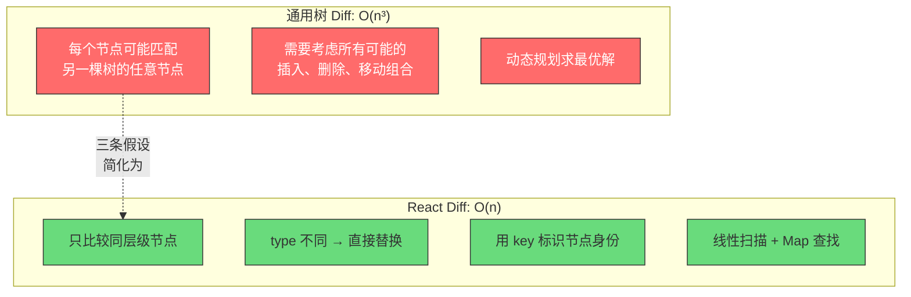
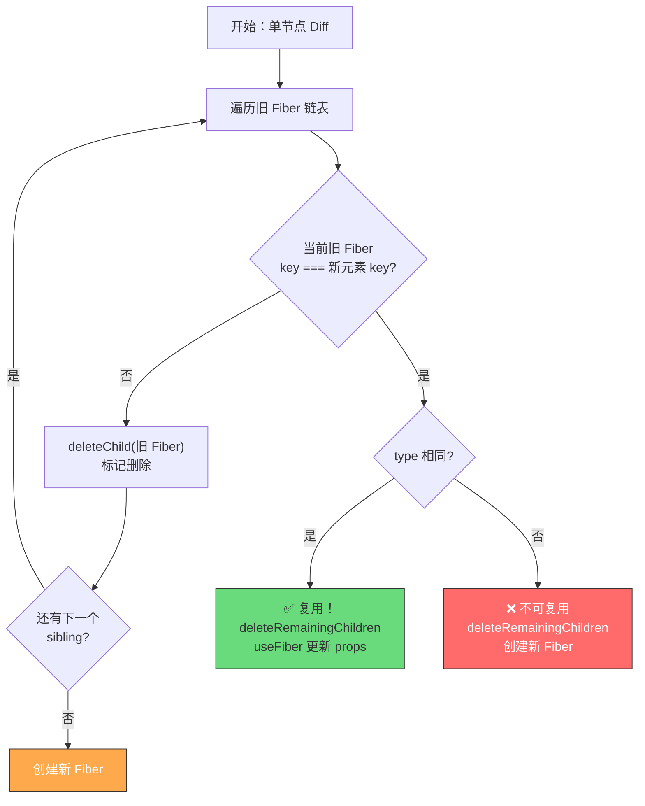
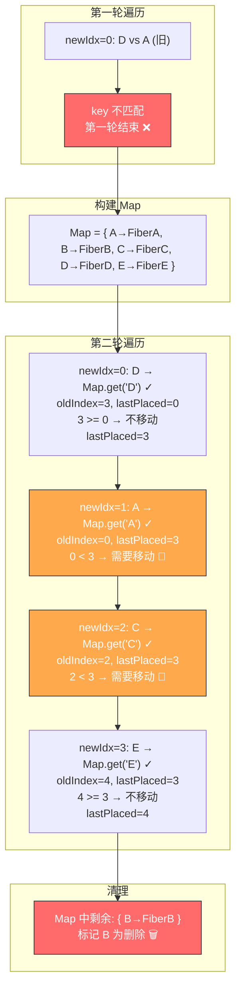
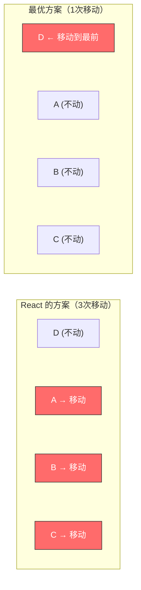
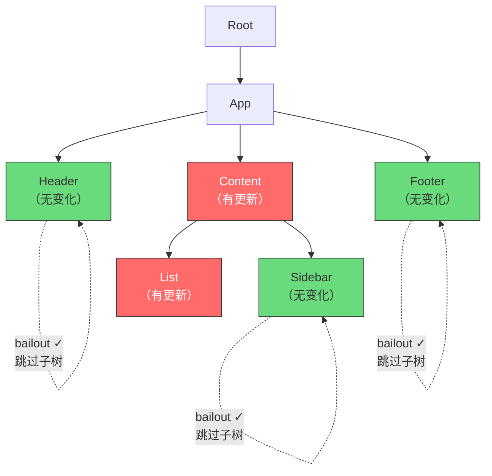
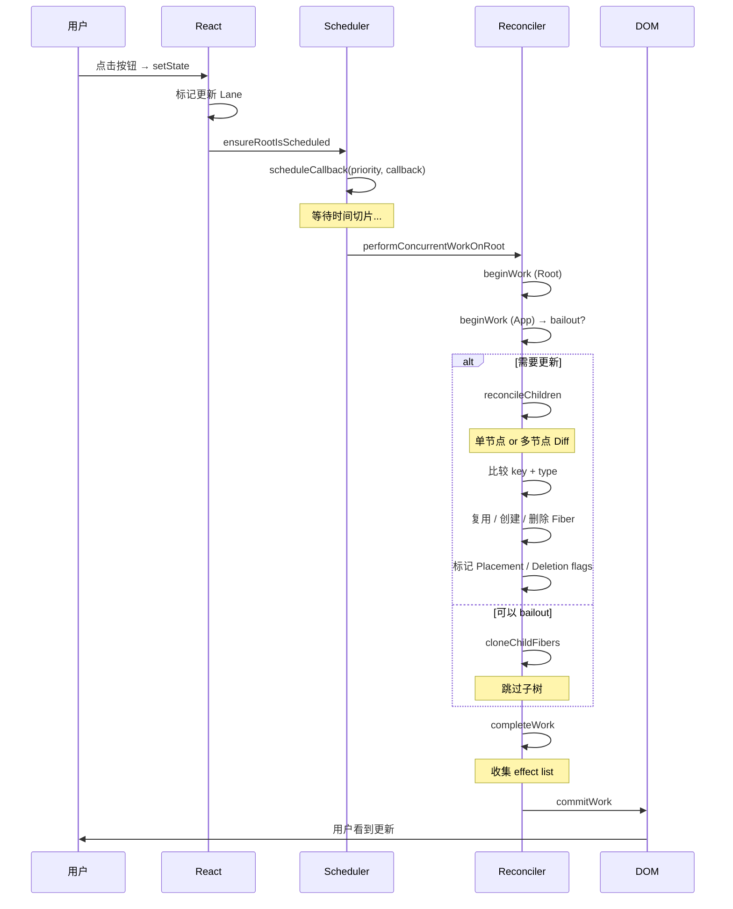

<div v-pre>

# 第5章 Reconciliation：Diff 算法的真相

> **本章要点**
>
> - Reconciliation 的本质：将树的 O(n³) 比较降低到 O(n) 的工程权衡
> - React 的三条 Diff 启发式假设及其背后的统计学依据
> - 单节点 Diff：`type` 和 `key` 的双重匹配策略
> - 多节点 Diff：两轮遍历算法的完整实现
> - `key` 的真正作用：不只是消除警告，而是 Diff 算法的核心线索
> - `beginWork` 中各类组件的协调策略差异
> - Diff 算法的局限性与常见的性能陷阱

---

每当你调用 `setState` 触发一次更新，React 都会面临一个看似简单实则极其复杂的问题：**如何高效地找出新旧两棵树之间的差异？**

在计算机科学中，这个问题被称为"树的编辑距离"（Tree Edit Distance），它的最优通用解法的时间复杂度是 O(n³)——其中 n 是树中的节点数。对于一个拥有 1000 个节点的 React 组件树（这在实际应用中并不罕见），O(n³) 意味着需要进行 10 亿次比较。在 60fps 的帧预算内，这显然是不可接受的。

React 的解决方案不是找到一个更好的通用算法，而是**改变问题本身**。通过引入三条基于 UI 开发实践的启发式假设，React 将 O(n³) 的问题降低为了 O(n)——代价是在极少数违反假设的场景下，更新不是最优的。但在 99.9% 的实际场景中，这些假设都是成立的。

这就是 Reconciliation——React 最核心的算法。

## 5.1 三条启发式假设

### 假设一：不同类型的元素产生不同的树

```tsx
// 假设一：类型改变 = 整棵子树重建
// 当 type 从 div 变为 span，React 不会尝试复用任何子节点

// 更新前
<div>
  <Counter />
  <UserProfile name="Alice" />
</div>

// 更新后（div → section）
<section>
  <Counter />
  <UserProfile name="Alice" />
</section>

// React 的处理：
// 1. 销毁整个 <div> 子树（包括 Counter 和 UserProfile 的状态）
// 2. 从零开始创建 <section> 子树
// 3. Counter 的 state 被重置，UserProfile 被重新挂载
```

为什么不尝试复用？因为在实际开发中，类型改变几乎总是意味着 UI 结构发生了本质变化。`<div>` 变成 `<article>` 可能只是标签换了，但 `<Input>` 变成 `<Select>` 则意味着完全不同的行为和状态模型。React 选择用"偶尔多做一点工作"来换取"算法实现的简单性和可预测性"。

### 假设二：同一层级的子元素通过 `key` 区分

```tsx
// 假设二：React 只在同一层级内进行 Diff，不跨层级比较

// 更新前
<div>
  <A />
  <B />
  <C />
</div>

// 更新后
<div>
  <A />
  <C />
  <B />
</div>

// React 不会发现"B 和 C 交换了位置"（没有 key 的情况下）
// 它会按位置逐个比较：
// 位置 0: A → A ✓ 复用
// 位置 1: B → C ✗ 类型不同，销毁 B，创建 C
// 位置 2: C → B ✗ 类型不同，销毁 C，创建 B

// 但如果有 key：
<div>
  <A key="a" />
  <C key="c" />
  <B key="b" />
</div>

// React 通过 key 识别出这是顺序变化：
// key="a": A → A ✓ 复用
// key="c": C 移到位置 1 → 复用
// key="b": B 移到位置 2 → 复用
// 没有任何组件被销毁和重建
```

### 假设三：同类型组件的子树结构通常相似

这条假设是隐含的：如果两个元素的 `type` 和 `key` 都相同，React 假设它们的子树结构大致相同，值得递归进去做 Diff。这避免了在发现节点匹配后还要评估"是否值得复用"的额外开销。



**图 5-1：通用 Diff vs React Diff 的复杂度对比**

## 5.2 Diff 算法的入口：`reconcileChildren`

在 Fiber 架构中，Diff 算法发生在 `beginWork` 阶段。每个 Fiber 节点在处理时会调用 `reconcileChildren` 来比较新旧 children：

```typescript
// packages/react-reconciler/src/ReactFiberBeginWork.js
function reconcileChildren(
  current: Fiber | null,
  workInProgress: Fiber,
  nextChildren: any, // ReactElement | ReactElement[] | string | number | ...
  renderLanes: Lanes
) {
  if (current === null) {
    // 首次挂载：没有旧 Fiber，所有子节点都是新建
    workInProgress.child = mountChildFibers(
      workInProgress,
      null,
      nextChildren,
      renderLanes
    );
  } else {
    // 更新：有旧 Fiber，需要 Diff
    workInProgress.child = reconcileChildFibers(
      workInProgress,
      current.child, // 旧的第一个子 Fiber
      nextChildren,  // 新的 children（ReactElement）
      renderLanes
    );
  }
}
```

`mountChildFibers` 和 `reconcileChildFibers` 实际上是同一个函数 `createChildReconciler` 的两个实例，区别在于是否标记副作用（side effects）：

```typescript
// packages/react-reconciler/src/ReactChildFiber.js
export const reconcileChildFibers = createChildReconciler(true);  // 标记副作用
export const mountChildFibers = createChildReconciler(false);     // 不标记副作用

function createChildReconciler(shouldTrackSideEffects: boolean) {
  // 返回一个闭包，内部包含所有 Diff 相关的函数

  function reconcileChildFibers(
    returnFiber: Fiber,
    currentFirstChild: Fiber | null,
    newChild: any,
    lanes: Lanes
  ): Fiber | null {
    // 根据 newChild 的类型分发到不同的处理逻辑
    if (typeof newChild === 'object' && newChild !== null) {
      switch (newChild.$$typeof) {
        case REACT_ELEMENT_TYPE:
          // 单个 ReactElement
          return placeSingleChild(
            reconcileSingleElement(returnFiber, currentFirstChild, newChild, lanes)
          );
        case REACT_PORTAL_TYPE:
          // Portal
          return placeSingleChild(
            reconcileSinglePortal(returnFiber, currentFirstChild, newChild, lanes)
          );
        case REACT_LAZY_TYPE:
          // Lazy 组件
          // ...
      }

      if (isArray(newChild)) {
        // 多个子节点（数组）
        return reconcileChildrenArray(returnFiber, currentFirstChild, newChild, lanes);
      }

      if (getIteratorFn(newChild)) {
        // 可迭代对象
        return reconcileChildrenIterator(returnFiber, currentFirstChild, newChild, lanes);
      }
    }

    if (typeof newChild === 'string' || typeof newChild === 'number') {
      // 文本节点
      return placeSingleChild(
        reconcileSingleTextNode(returnFiber, currentFirstChild, '' + newChild, lanes)
      );
    }

    // 其他情况（null, undefined, boolean）：删除所有旧子节点
    return deleteRemainingChildren(returnFiber, currentFirstChild);
  }

  return reconcileChildFibers;
}
```

## 5.3 单节点 Diff

单节点 Diff 处理的是 children 为单个 ReactElement 的情况。这是最简单的场景，但其中的细节依然值得深究。

```typescript
function reconcileSingleElement(
  returnFiber: Fiber,
  currentFirstChild: Fiber | null,
  element: ReactElement,
  lanes: Lanes
): Fiber {
  const key = element.key;
  let child = currentFirstChild;

  // 遍历旧的所有同级 Fiber，尝试找到可复用的
  while (child !== null) {
    if (child.key === key) {
      // key 匹配
      const elementType = element.type;

      if (child.elementType === elementType) {
        // key 和 type 都匹配 → 找到了！
        // 删除剩余的旧兄弟节点（因为新的只有一个）
        deleteRemainingChildren(returnFiber, child.sibling);

        // 复用这个 Fiber，更新 props
        const existing = useFiber(child, element.props);
        existing.ref = coerceRef(returnFiber, child, element);
        existing.return = returnFiber;
        return existing;
      }

      // key 匹配但 type 不匹配
      // 说明这个位置的节点类型变了，旧节点和它的所有兄弟都不可能被复用
      deleteRemainingChildren(returnFiber, child);
      break;
    } else {
      // key 不匹配，标记这个旧节点为删除，继续查找下一个
      deleteChild(returnFiber, child);
    }
    child = child.sibling;
  }

  // 没有找到可复用的 Fiber，创建新的
  const created = createFiberFromElement(element, returnFiber.mode, lanes);
  created.ref = coerceRef(returnFiber, currentFirstChild, element);
  created.return = returnFiber;
  return created;
}
```

这段代码的逻辑可以用一个决策树来表示：



**图 5-2：单节点 Diff 的决策流程**

### key 匹配但 type 不匹配的特殊处理

注意一个重要的细节：当 key 匹配但 type 不匹配时，React 会删除**所有**旧的子节点（包括尚未遍历到的兄弟节点）。为什么？

```tsx
// 场景：key 匹配但 type 不同
// 旧的 children
<>
  <div key="main">Hello</div>
  <span>World</span>
</>

// 新的 children（单个元素）
<section key="main">Hi</section>

// React 的推理：
// 1. 新的只有一个元素，key="main"
// 2. 旧的第一个 child key="main"，匹配！
// 3. 但 type 从 div → section，不匹配
// 4. 既然 key 相同但 type 变了，说明这个节点被"就地替换"了
// 5. 那么旧的其他兄弟节点（<span>）也一定不再需要了
// 6. 所以 deleteRemainingChildren 删除所有剩余旧节点
```

如果 key 不匹配，则只删除当前节点并继续查找——因为可能后面的兄弟节点有匹配的 key。

## 5.4 多节点 Diff：两轮遍历算法

多节点 Diff 是 Reconciliation 算法中最复杂的部分。当 children 是数组时，React 使用一个巧妙的两轮遍历算法来处理。

### 为什么需要两轮遍历？

在实际的 React 应用中，列表更新有一个重要的统计特征：**大多数更新只涉及节点属性的变化，而不涉及节点的增删或重排**。React 的两轮算法正是基于这个观察设计的：

- **第一轮**：假设只有属性更新，线性扫描比较（最常见场景）
- **第二轮**：处理第一轮未能处理的情况（增删、重排）

```typescript
function reconcileChildrenArray(
  returnFiber: Fiber,
  currentFirstChild: Fiber | null,
  newChildren: Array<any>,
  lanes: Lanes
): Fiber | null {
  // 结果链表的头和尾
  let resultingFirstChild: Fiber | null = null;
  let previousNewFiber: Fiber | null = null;

  let oldFiber = currentFirstChild;
  let lastPlacedIndex = 0; // 最后一个不需要移动的旧节点索引
  let newIdx = 0;
  let nextOldFiber = null;

  // ========== 第一轮遍历 ==========
  // 从左到右同时遍历新旧两个数组
  for (; oldFiber !== null && newIdx < newChildren.length; newIdx++) {
    if (oldFiber.index > newIdx) {
      // 旧 Fiber 的位置超前，说明中间有节点被删除了
      nextOldFiber = oldFiber;
      oldFiber = null;
    } else {
      nextOldFiber = oldFiber.sibling;
    }

    // 尝试用旧 Fiber 更新新元素
    const newFiber = updateSlot(returnFiber, oldFiber, newChildren[newIdx], lanes);

    if (newFiber === null) {
      // key 不匹配，第一轮提前结束
      if (oldFiber === null) {
        oldFiber = nextOldFiber;
      }
      break;
    }

    if (shouldTrackSideEffects) {
      if (oldFiber && newFiber.alternate === null) {
        // 新 Fiber 是全新创建的（不是复用的），删除旧的
        deleteChild(returnFiber, oldFiber);
      }
    }

    // 标记节点位置
    lastPlacedIndex = placeChild(newFiber, lastPlacedIndex, newIdx);

    // 构建结果链表
    if (previousNewFiber === null) {
      resultingFirstChild = newFiber;
    } else {
      previousNewFiber.sibling = newFiber;
    }
    previousNewFiber = newFiber;
    oldFiber = nextOldFiber;
  }

  // ========== 第一轮结束后的三种情况 ==========

  // 情况 1：新数组遍历完了 → 删除剩余旧节点
  if (newIdx === newChildren.length) {
    deleteRemainingChildren(returnFiber, oldFiber);
    return resultingFirstChild;
  }

  // 情况 2：旧链表遍历完了 → 剩余新元素都是插入
  if (oldFiber === null) {
    for (; newIdx < newChildren.length; newIdx++) {
      const newFiber = createChild(returnFiber, newChildren[newIdx], lanes);
      if (newFiber === null) continue;
      lastPlacedIndex = placeChild(newFiber, lastPlacedIndex, newIdx);
      if (previousNewFiber === null) {
        resultingFirstChild = newFiber;
      } else {
        previousNewFiber.sibling = newFiber;
      }
      previousNewFiber = newFiber;
    }
    return resultingFirstChild;
  }

  // 情况 3：都没遍历完，第一轮因 key 不匹配中断 → 进入第二轮
  // ========== 第二轮遍历 ==========

  // 将剩余的旧 Fiber 放入 Map（key → Fiber）
  const existingChildren = mapRemainingChildren(returnFiber, oldFiber);

  // 遍历剩余的新元素
  for (; newIdx < newChildren.length; newIdx++) {
    // 从 Map 中查找匹配的旧 Fiber
    const newFiber = updateFromMap(
      existingChildren,
      returnFiber,
      newIdx,
      newChildren[newIdx],
      lanes
    );

    if (newFiber !== null) {
      if (shouldTrackSideEffects) {
        if (newFiber.alternate !== null) {
          // 复用了旧 Fiber，从 Map 中移除
          existingChildren.delete(
            newFiber.key === null ? newIdx : newFiber.key
          );
        }
      }
      lastPlacedIndex = placeChild(newFiber, lastPlacedIndex, newIdx);
      if (previousNewFiber === null) {
        resultingFirstChild = newFiber;
      } else {
        previousNewFiber.sibling = newFiber;
      }
      previousNewFiber = newFiber;
    }
  }

  // 删除 Map 中剩余的旧 Fiber（它们在新数组中不存在了）
  if (shouldTrackSideEffects) {
    existingChildren.forEach(child => deleteChild(returnFiber, child));
  }

  return resultingFirstChild;
}
```

### `updateSlot`：第一轮的核心

```typescript
function updateSlot(
  returnFiber: Fiber,
  oldFiber: Fiber | null,
  newChild: any,
  lanes: Lanes
): Fiber | null {
  const key = oldFiber !== null ? oldFiber.key : null;

  // 文本节点没有 key
  if (typeof newChild === 'string' || typeof newChild === 'number') {
    if (key !== null) {
      // 旧节点有 key 但新节点是文本 → key 不匹配
      return null;
    }
    return updateTextNode(returnFiber, oldFiber, '' + newChild, lanes);
  }

  if (typeof newChild === 'object' && newChild !== null) {
    switch (newChild.$$typeof) {
      case REACT_ELEMENT_TYPE: {
        if (newChild.key === key) {
          // key 匹配，尝试复用
          return updateElement(returnFiber, oldFiber, newChild, lanes);
        } else {
          // key 不匹配 → 返回 null，第一轮结束
          return null;
        }
      }
      // ... Portal, Lazy 等类型
    }
  }

  return null;
}
```

### `placeChild`：移动检测的核心

`placeChild` 负责判断一个复用的节点是否需要移动。它的逻辑基于一个关键观察：**如果一个复用节点在旧数组中的位置大于 `lastPlacedIndex`，说明它相对于前面已处理的节点是"往后的"，不需要移动。**

```typescript
function placeChild(
  newFiber: Fiber,
  lastPlacedIndex: number,
  newIndex: number
): number {
  newFiber.index = newIndex;

  if (!shouldTrackSideEffects) {
    // 首次挂载，不需要标记
    return lastPlacedIndex;
  }

  const current = newFiber.alternate;
  if (current !== null) {
    const oldIndex = current.index;
    if (oldIndex < lastPlacedIndex) {
      // 这个节点在旧数组中的位置在 lastPlacedIndex 之前
      // 说明它需要向右移动
      newFiber.flags |= Placement;
      return lastPlacedIndex;
    } else {
      // 不需要移动，更新 lastPlacedIndex
      return oldIndex;
    }
  } else {
    // 全新节点，需要插入
    newFiber.flags |= Placement;
    return lastPlacedIndex;
  }
}
```

### 图解多节点 Diff 的完整过程

让我们通过一个具体的例子来理解整个过程：

```tsx
// 旧列表
['A', 'B', 'C', 'D', 'E'].map(item => <Item key={item} />)

// 新列表（D 移到了最前面，删除了 B）
['D', 'A', 'C', 'E'].map(item => <Item key={item} />)
```



**图 5-3：多节点 Diff 的完整过程示例**

最终的 DOM 操作：
- D：不移动
- A：移动到 D 后面
- C：移动到 A 后面
- E：不移动
- B：删除

### 移动算法的局限性

React 的移动检测算法是**从左到右单向**的。这意味着它在某些场景下会产生非最优的移动操作：

```tsx
// 场景：将最后一个元素移到最前面
// 旧: [A, B, C, D]
// 新: [D, A, B, C]

// React 的处理：
// D: oldIndex=3, lastPlaced=0 → 3 >= 0, 不移动, lastPlaced=3
// A: oldIndex=0, lastPlaced=3 → 0 < 3, 移动 ❌
// B: oldIndex=1, lastPlaced=3 → 1 < 3, 移动 ❌
// C: oldIndex=2, lastPlaced=3 → 2 < 3, 移动 ❌
// 结果：移动了 A, B, C 三个节点

// 最优解：只移动 D 到最前面（1次移动 vs 3次移动）
```



**图 5-4：React Diff 的非最优移动场景**

React 为什么不使用最优移动算法（如最长递增子序列，LIS）？因为 LIS 算法的实现更复杂，而且在绝大多数实际场景中，列表变化是局部的（插入/删除一两个元素），React 的简单算法已经足够高效。Vue 3 选择了 LIS 算法，这是一个不同的工程权衡。

## 5.5 `updateElement`：Fiber 复用的细节

当 Diff 算法确定一个旧 Fiber 可以复用时，会调用 `useFiber` 来创建一个 workInProgress Fiber：

```typescript
function updateElement(
  returnFiber: Fiber,
  current: Fiber | null,
  element: ReactElement,
  lanes: Lanes
): Fiber {
  const elementType = element.type;

  if (current !== null) {
    if (current.elementType === elementType) {
      // type 匹配，复用
      const existing = useFiber(current, element.props);
      existing.ref = coerceRef(returnFiber, current, element);
      existing.return = returnFiber;
      return existing;
    }
  }

  // 不能复用，创建新的
  const created = createFiberFromElement(element, returnFiber.mode, lanes);
  created.ref = coerceRef(returnFiber, current, element);
  created.return = returnFiber;
  return created;
}

function useFiber(fiber: Fiber, pendingProps: any): Fiber {
  // 创建或复用 workInProgress Fiber
  // 注意：这里复用的是 Fiber 对象本身（避免 GC 压力），
  // 但 props 是全新的
  const clone = createWorkInProgress(fiber, pendingProps);
  clone.index = 0;
  clone.sibling = null;
  return clone;
}
```

"复用"在这里的含义是：

1. **复用 Fiber 对象本身**（避免创建新对象产生的 GC 压力）
2. **复用对应的 DOM 节点**（Fiber 的 `stateNode` 指向实际的 DOM 元素）
3. **保留组件状态**（函数组件的 hooks 链表、类组件的 state）
4. **更新 props**（pendingProps 是新的）

## 5.6 `beginWork` 中的协调策略

不同类型的 Fiber 节点在 `beginWork` 中有不同的协调策略：

```typescript
// packages/react-reconciler/src/ReactFiberBeginWork.js
function beginWork(
  current: Fiber | null,
  workInProgress: Fiber,
  renderLanes: Lanes
): Fiber | null {
  // 优化路径：如果 props 和 context 都没变，可以跳过
  if (current !== null) {
    const oldProps = current.memoizedProps;
    const newProps = workInProgress.pendingProps;

    if (oldProps !== newProps || hasContextChanged()) {
      didReceiveUpdate = true;
    } else {
      // 检查是否有待处理的更新
      const hasScheduledUpdateOrContext = checkScheduledUpdateOrContext(
        current,
        renderLanes
      );
      if (!hasScheduledUpdateOrContext) {
        didReceiveUpdate = false;
        // 🎯 bailout: 直接复用旧的子树，跳过 Diff
        return attemptEarlyBailoutIfNoScheduledUpdate(
          current,
          workInProgress,
          renderLanes
        );
      }
    }
  }

  // 根据 tag 分发到不同的处理函数
  switch (workInProgress.tag) {
    case FunctionComponent:
      return updateFunctionComponent(current, workInProgress, renderLanes);
    case ClassComponent:
      return updateClassComponent(current, workInProgress, renderLanes);
    case HostComponent: // div, span 等 DOM 元素
      return updateHostComponent(current, workInProgress, renderLanes);
    case HostText: // 文本节点
      return updateHostText(current, workInProgress);
    case Fragment:
      return updateFragment(current, workInProgress, renderLanes);
    case MemoComponent:
      return updateMemoComponent(current, workInProgress, renderLanes);
    // ... 更多类型
  }
}
```

### Bailout 优化

`bailout` 是 React 最重要的性能优化之一。当一个 Fiber 节点的 props、state、context 都没有变化时，React 可以完全跳过这个节点及其子树的 Diff：

```typescript
function attemptEarlyBailoutIfNoScheduledUpdate(
  current: Fiber,
  workInProgress: Fiber,
  renderLanes: Lanes
): Fiber | null {
  // 复制旧的 children
  cloneChildFibers(current, workInProgress);
  return workInProgress.child;
}
```



**图 5-5：Bailout 优化示意——绿色节点被完整跳过**

### `React.memo` 与 Diff

`React.memo` 在 Diff 之前增加了一层 props 浅比较：

```typescript
function updateMemoComponent(
  current: Fiber | null,
  workInProgress: Fiber,
  renderLanes: Lanes
): Fiber | null {
  if (current !== null) {
    const prevProps = current.memoizedProps;
    const nextProps = workInProgress.pendingProps;

    // 使用自定义或默认的比较函数
    const compare = Component.compare || shallowEqual;

    if (compare(prevProps, nextProps) && current.ref === workInProgress.ref) {
      // props 没有变化，bailout
      return bailoutOnAlreadyFinishedWork(current, workInProgress, renderLanes);
    }
  }

  // props 变了，继续 Diff
  // ...
}

// 浅比较的实现
function shallowEqual(objA: any, objB: any): boolean {
  if (Object.is(objA, objB)) return true;

  if (typeof objA !== 'object' || objA === null ||
      typeof objB !== 'object' || objB === null) {
    return false;
  }

  const keysA = Object.keys(objA);
  const keysB = Object.keys(objB);

  if (keysA.length !== keysB.length) return false;

  for (let i = 0; i < keysA.length; i++) {
    if (
      !Object.prototype.hasOwnProperty.call(objB, keysA[i]) ||
      !Object.is(objA[keysA[i]], objB[keysA[i]])
    ) {
      return false;
    }
  }

  return true;
}
```

## 5.7 常见的 Diff 性能陷阱

### 陷阱一：使用 index 作为 key

```tsx
// ❌ 错误：用 index 作为 key
function BadList({ items }: { items: string[] }) {
  return (
    <ul>
      {items.map((item, index) => (
        <li key={index}>
          <input defaultValue={item} />
        </li>
      ))}
    </ul>
  );
}

// 当 items 从 ['A', 'B', 'C'] 变为 ['B', 'C']（删除了 A）时：
// React 的 Diff 过程：
// key=0: oldFiber(A) → newElement(B)  → type 相同，复用！props 从 A 更新为 B
// key=1: oldFiber(B) → newElement(C)  → type 相同，复用！props 从 B 更新为 C
// key=2: oldFiber(C) → 无对应新元素  → 删除 C
//
// 结果：React 认为是"修改了前两个，删除了最后一个"
// 而不是"删除了第一个"
// input 的 defaultValue 不会更新（因为是不受控的），
// 导致 UI 显示错误
```

### 陷阱二：在渲染中创建新的组件引用

```tsx
// ❌ 错误：每次渲染都创建新的组件
function Parent() {
  // 每次 render 都会创建一个新的 MemoizedChild 引用
  // React.memo 在这里完全无效！
  const MemoizedChild = React.memo(({ value }: { value: number }) => {
    return <div>{value}</div>;
  });

  return <MemoizedChild value={42} />;
}

// ✅ 正确：在组件外部定义
const MemoizedChild = React.memo(({ value }: { value: number }) => {
  return <div>{value}</div>;
});

function Parent() {
  return <MemoizedChild value={42} />;
}
```

### 陷阱三：条件渲染改变组件树结构

```tsx
// ❌ 问题代码：条件渲染导致非预期的状态丢失
function Page({ isAdmin }: { isAdmin: boolean }) {
  return (
    <div>
      {isAdmin && <AdminBanner />}
      <UserProfile /> {/* 当 isAdmin 变化时，这个组件的位置会变 */}
    </div>
  );
}

// 当 isAdmin 从 true 变为 false：
// 位置 0: AdminBanner → UserProfile  (type 不同，销毁 + 重建)
// 位置 1: UserProfile → null         (删除)
// UserProfile 的状态丢失了！

// ✅ 解决方案 1：使用 key 固定身份
function Page({ isAdmin }: { isAdmin: boolean }) {
  return (
    <div>
      {isAdmin && <AdminBanner />}
      <UserProfile key="profile" />
    </div>
  );
}

// ✅ 解决方案 2：保持结构稳定
function Page({ isAdmin }: { isAdmin: boolean }) {
  return (
    <div>
      {isAdmin ? <AdminBanner /> : null}
      <UserProfile />
    </div>
  );
  // 注意：这其实和上面一样有问题，因为 null 不占位置
  // 真正的解决方案是用 CSS 隐藏或者用 key
}
```

### 陷阱四：过深的组件树

```tsx
// ❌ Diff 的时间与树的深度成正比
function DeepTree({ depth }: { depth: number }) {
  if (depth === 0) return <div>Leaf</div>;
  return (
    <div>
      <DeepTree depth={depth - 1} />
    </div>
  );
}

// 即使只有叶子节点变化，React 也需要遍历整条路径
// 解决方案：使用 memo + 扁平化结构 + 状态提升
```

## 5.8 Diff 算法的完整时间线

让我们追踪一次完整的 Diff 过程，从用户交互到 DOM 更新：



**图 5-6：从 setState 到 DOM 更新的完整 Diff 时间线**

## 5.9 本章小结

Reconciliation 是 React 最核心的算法，它的设计体现了工程中一个永恒的主题：**完美是好的敌人**。

通过三条启发式假设，React 将一个 O(n³) 的理论问题转化为了一个 O(n) 的实际问题。两轮遍历的多节点 Diff 算法在最常见的场景下（属性更新）只需一轮线性扫描即可完成，只在涉及节点增删和重排时才需要第二轮的 Map 查找。

关键要点：

1. **`key` 是 Diff 算法的核心线索**：它让 React 能够在 O(1) 时间内判断两个节点是否是"同一个"
2. **Bailout 是最重要的优化**：跳过整棵子树的 Diff 比优化 Diff 算法本身更有效
3. **Diff 是逐层进行的**：不会跨层级比较节点
4. **移动检测是从左到右的**：在某些场景下不是最优的，但在大多数场景下足够好
5. **type 变化意味着子树重建**：这是一个需要注意的性能陷阱

在下一章中，我们将看到 Diff 算法标记的那些 Placement、Deletion 等 flags 如何在 Commit 阶段被真正执行——从虚拟 DOM 到真实 DOM 的最后一步。

> **课程关联**：本章内容对应慕课网课程《React 源码深度解析》第 6-7 节。课程中通过逐行调试演示了多节点 Diff 的两轮遍历过程，建议配合学习：[https://coding.imooc.com/class/650.html](https://coding.imooc.com/class/650.html)

---

### 思考题

1. **为什么 React 的多节点 Diff 不使用最长递增子序列（LIS）算法来最小化移动操作？** 从实现复杂度、实际场景分布、性能收益三个角度分析这个设计决策。

2. **考虑以下场景**：一个列表从 `[A, B, C, D, E]` 变为 `[E, D, C, B, A]`（完全反转）。请手动模拟 React 的两轮 Diff 过程，计算需要几次 DOM 移动操作。最优解需要几次？

3. **`React.memo` 的浅比较使用 `Object.is`，而不是 `===`。** 请列举两者在哪些情况下会产生不同的结果，并解释 React 选择 `Object.is` 的原因。

4. **假设你正在开发一个虚拟滚动列表组件**，列表中的元素可能被频繁地插入、删除和重排。你会如何设计 `key` 策略来最大化 React Diff 的效率？

</div>
