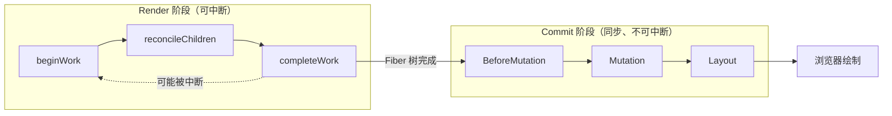
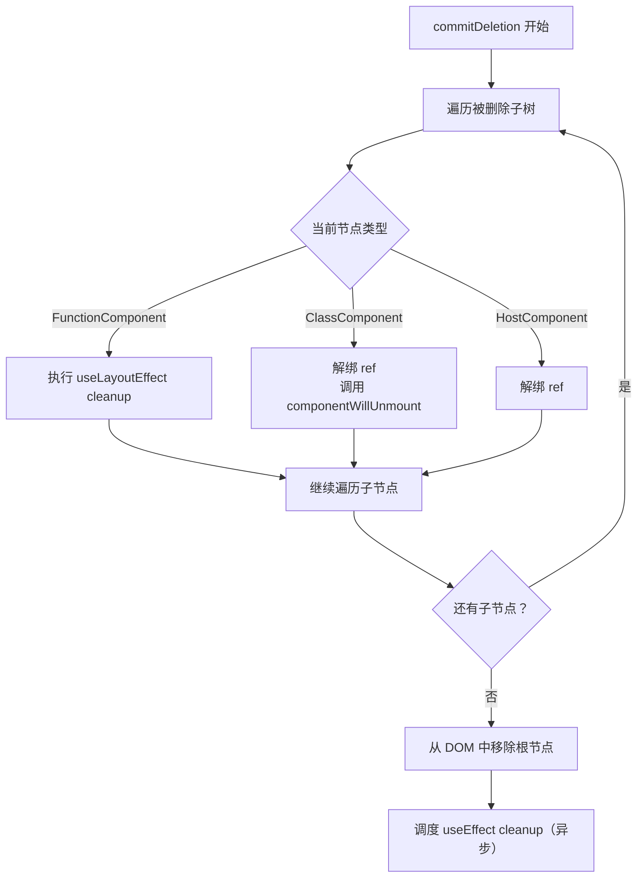
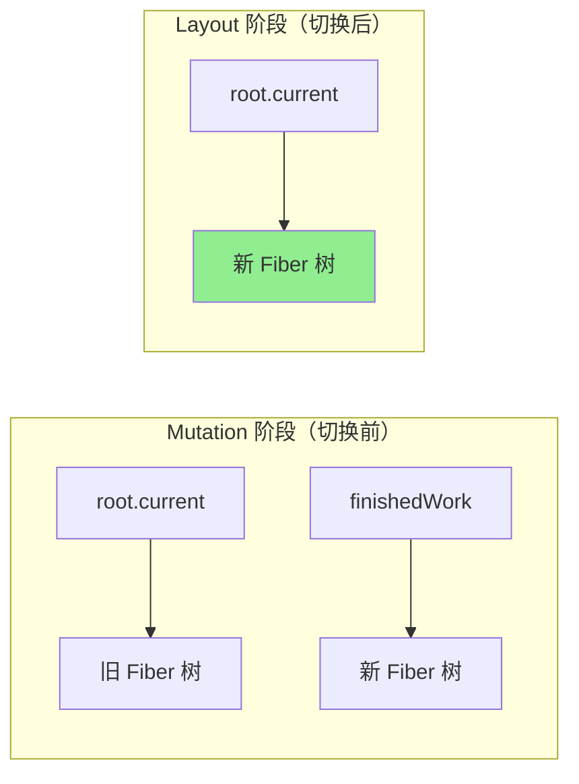
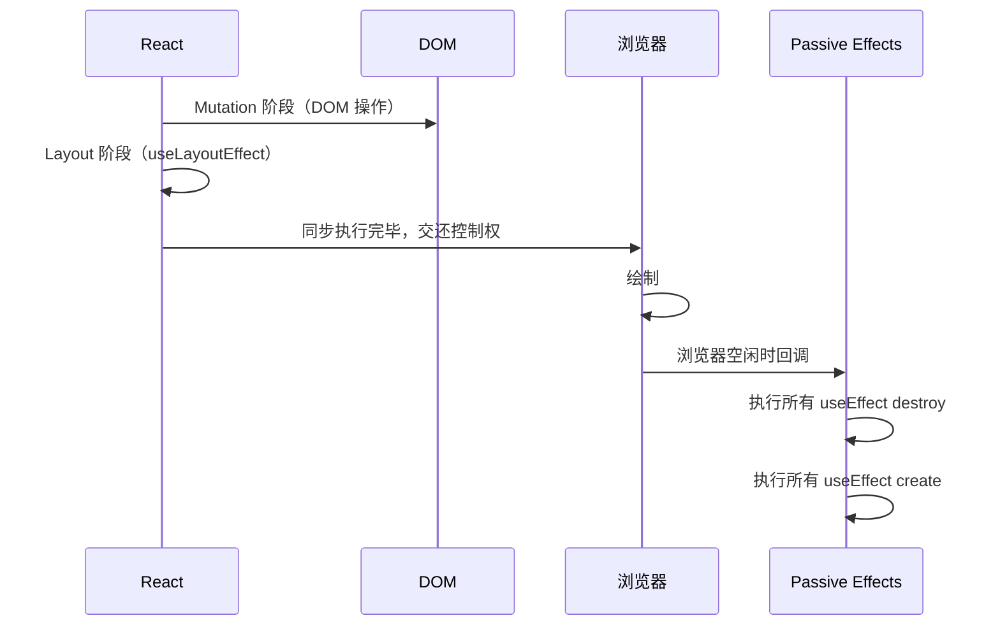
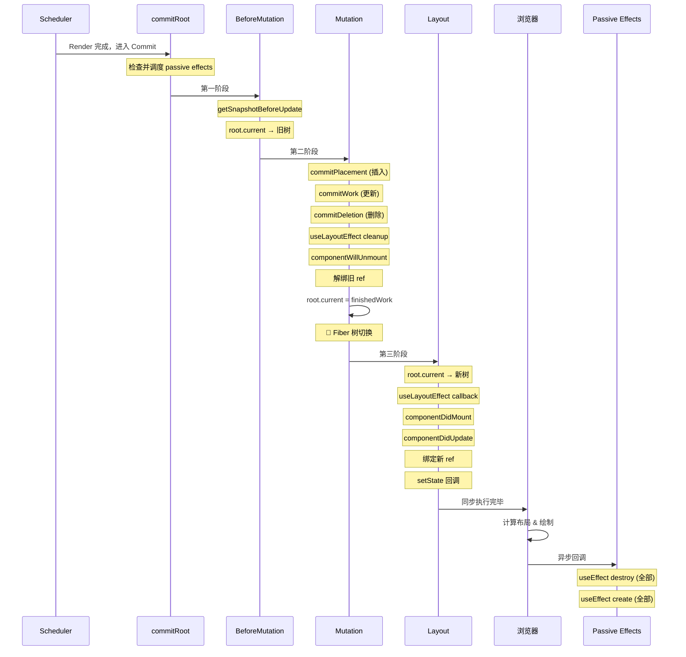

<div v-pre>

# 第6章 Commit 阶段：从虚拟到真实

> **本章要点**
>
> - Commit 阶段的三个子阶段：BeforeMutation、Mutation、Layout
> - 为什么 Commit 阶段必须是同步的——不可中断的 DOM 操作
> - Placement、Update、Deletion 三种 effect 的执行路径
> - `commitRoot` 的完整源码解读与执行流程
> - `useLayoutEffect` 与 `useEffect` 的调度时机差异
> - Ref 的绑定与解绑发生在哪个子阶段
> - React 如何保证 DOM 操作的原子性与一致性
> - Passive Effects（useEffect）的异步调度机制

---

如果说 Reconciliation 是 React 的"参谋部"——负责分析形势、制定作战计划，那么 Commit 阶段就是"前线部队"——负责将计划执行为真实的 DOM 操作。在上一章中，我们看到 Diff 算法如何为每个需要变更的 Fiber 节点打上 `Placement`、`Update`、`Deletion` 等 flags。现在，是时候看看这些 flags 如何被翻译成浏览器真正理解的 DOM API 调用了。

Commit 阶段的设计有一个核心约束：**它必须是同步的、不可中断的**。这与 Render 阶段形成了鲜明对比。Render 阶段可以被更高优先级的任务打断、可以重新开始、甚至可以丢弃中间结果。但 Commit 阶段一旦开始，就必须一气呵成——因为用户不能看到"DOM 改了一半"的中间状态。

## 6.1 为什么 Commit 必须同步

想象一个简单的场景：你要把列表从 `[A, B, C]` 更新为 `[A, C, B]`。这需要两步 DOM 操作：移动 C 到 B 前面，或者移动 B 到 C 后面。如果在执行完第一步之后被中断了会怎样？

```tsx
// 列表更新：[A, B, C] → [A, C, B]
// 需要的 DOM 操作：
// 1. 将 C 移动到 B 之前
// 2. (或者等价地) 将 B 移动到最后

// 如果在步骤1之后被中断：
// 用户看到的是 [A, C, B, C] 还是 [A, C] ？
// 无论哪种，都是错误的中间状态
```

这就是 Commit 阶段必须同步执行的根本原因。DOM 操作不像 Fiber 树的构建那样可以随时丢弃重来——每一次 `appendChild`、`removeChild`、`insertBefore` 都会立即修改用户可见的 DOM 树。中间状态的暴露不仅会导致视觉闪烁，更可能引起布局抖动（Layout Thrashing），在严重情况下甚至会导致事件处理器绑定到错误的 DOM 节点上。



**图 6-1：Render 阶段与 Commit 阶段的执行模式对比**

## 6.2 commitRoot 的整体结构

当 Render 阶段完成后，React 会调用 `commitRoot` 启动 Commit 阶段。这是整个 Commit 的入口，让我们看看它的核心结构：

```typescript
// 简化版 commitRoot
function commitRoot(root: FiberRoot) {
  const finishedWork = root.finishedWork;
  if (finishedWork === null) return;

  // 重置状态
  root.finishedWork = null;
  root.finishedLanes = NoLanes;

  // 检查是否存在 passive effects（useEffect）
  // 如果有，调度一个异步任务去执行它们
  if (
    (finishedWork.subtreeFlags & PassiveMask) !== NoFlags ||
    (finishedWork.flags & PassiveMask) !== NoFlags
  ) {
    if (!rootDoesHavePassiveEffects) {
      rootDoesHavePassiveEffects = true;
      scheduleCallback(NormalSchedulerPriority, () => {
        flushPassiveEffects();
        return null;
      });
    }
  }

  // 判断是否有需要处理的副作用
  const subtreeHasEffects =
    (finishedWork.subtreeFlags & MutationMask | LayoutMask | PassiveMask) !== NoFlags;
  const rootHasEffect =
    (finishedWork.flags & MutationMask | LayoutMask | PassiveMask) !== NoFlags;

  if (subtreeHasEffects || rootHasEffect) {
    // ========== 第一阶段：BeforeMutation ==========
    commitBeforeMutationEffects(root, finishedWork);

    // ========== 第二阶段：Mutation ==========
    commitMutationEffects(root, finishedWork);

    // 关键：在 Mutation 和 Layout 之间切换 Fiber 树
    root.current = finishedWork;

    // ========== 第三阶段：Layout ==========
    commitLayoutEffects(finishedWork, root);
  } else {
    // 没有副作用，直接切换 Fiber 树
    root.current = finishedWork;
  }

  // 调度可能的后续更新
  ensureRootIsScheduled(root);
}
```

注意代码中那行看似不起眼的 `root.current = finishedWork`。这是 React 双缓冲机制的关键——它将"当前显示的 Fiber 树"从 `current` 切换到了 `finishedWork`（也就是 `workInProgress` 树）。这个切换的**位置**至关重要：它发生在 Mutation 之后、Layout 之前。这意味着：

- 在 **BeforeMutation** 和 **Mutation** 阶段，`root.current` 仍然指向旧树（可以读取旧的 state 和 props）
- 在 **Layout** 阶段，`root.current` 已经指向新树（读取到的是新的 state 和 props）

这个设计保证了生命周期方法能在正确的时机读取到正确的值。

## 6.3 BeforeMutation 阶段：最后的准备

BeforeMutation 是 Commit 阶段的第一幕。在这个阶段，DOM 尚未被修改，React 需要做一些"变更前的准备工作"。

```typescript
function commitBeforeMutationEffects(
  root: FiberRoot,
  firstChild: Fiber
) {
  nextEffect = firstChild;
  // 深度优先遍历 Fiber 树
  commitBeforeMutationEffects_begin();
}

function commitBeforeMutationEffects_complete() {
  while (nextEffect !== null) {
    const fiber = nextEffect;

    try {
      commitBeforeMutationEffectsOnFiber(fiber);
    } catch (error) {
      captureCommitPhaseError(fiber, fiber.return, error);
    }

    const sibling = fiber.sibling;
    if (sibling !== null) {
      nextEffect = sibling;
      return; // 回到 _begin 处理兄弟节点
    }
    nextEffect = fiber.return;
  }
}

function commitBeforeMutationEffectsOnFiber(finishedWork: Fiber) {
  const current = finishedWork.alternate;
  const flags = finishedWork.flags;

  // 1. 处理 getSnapshotBeforeUpdate
  if ((flags & Snapshot) !== NoFlags) {
    switch (finishedWork.tag) {
      case ClassComponent: {
        if (current !== null) {
          const prevProps = current.memoizedProps;
          const prevState = current.memoizedState;
          const instance = finishedWork.stateNode;
          // 调用 getSnapshotBeforeUpdate
          const snapshot = instance.getSnapshotBeforeUpdate(
            finishedWork.elementType === finishedWork.type
              ? prevProps
              : resolveDefaultProps(finishedWork.type, prevProps),
            prevState
          );
          // 保存快照值，后续在 componentDidUpdate 中作为第三个参数传入
          instance.__reactInternalSnapshotBeforeUpdate = snapshot;
        }
        break;
      }
      case HostRoot: {
        // 如果 root 的容器需要清空内容
        if (supportsMutation) {
          const container = finishedWork.stateNode.containerInfo;
          clearContainer(container);
        }
        break;
      }
    }
  }
}
```

这个阶段最重要的工作就是调用 Class 组件的 `getSnapshotBeforeUpdate` 生命周期方法。这个方法的名字已经说明了一切——它让组件有机会在 DOM 变更之前"拍一张快照"。最经典的用例是保存滚动位置：

```tsx
class ChatRoom extends React.Component<Props, State> {
  listRef = React.createRef<HTMLDivElement>();

  getSnapshotBeforeUpdate(prevProps: Props, prevState: State) {
    // 在 DOM 变更前，记录当前的滚动位置
    if (prevState.messages.length < this.state.messages.length) {
      const list = this.listRef.current!;
      return list.scrollHeight - list.scrollTop;
    }
    return null;
  }

  componentDidUpdate(
    prevProps: Props,
    prevState: State,
    snapshot: number | null
  ) {
    // DOM 已经更新，使用快照恢复滚动位置
    if (snapshot !== null) {
      const list = this.listRef.current!;
      list.scrollTop = list.scrollHeight - snapshot;
    }
  }

  render() {
    return (
      <div ref={this.listRef} className="chat-list">
        {this.state.messages.map((msg) => (
          <Message key={msg.id} data={msg} />
        ))}
      </div>
    );
  }
}
```

为什么不能在 `componentDidUpdate` 中做这件事？因为在 `componentDidUpdate` 执行时，DOM 已经被修改了，新的消息已经被插入到列表中，`scrollHeight` 已经改变了——你无法准确地计算出需要滚动多少才能保持原来的视觉位置。

## 6.4 Mutation 阶段：真正的 DOM 操作

Mutation 阶段是整个 Commit 的核心——这里是 React 将虚拟 DOM 的变更转化为真实 DOM 操作的地方。

```typescript
function commitMutationEffects(
  root: FiberRoot,
  firstChild: Fiber
) {
  nextEffect = firstChild;
  commitMutationEffects_begin(root);
}

function commitMutationEffectsOnFiber(
  finishedWork: Fiber,
  root: FiberRoot
) {
  const current = finishedWork.alternate;
  const flags = finishedWork.flags;

  switch (flags & (Placement | Update | ChildDeletion | Hydrating)) {
    case Placement: {
      // 新节点插入
      commitPlacement(finishedWork);
      finishedWork.flags &= ~Placement;
      break;
    }
    case PlacementAndUpdate: {
      // 先插入，再更新
      commitPlacement(finishedWork);
      finishedWork.flags &= ~Placement;
      commitWork(current, finishedWork);
      break;
    }
    case Update: {
      // 属性更新
      commitWork(current, finishedWork);
      break;
    }
    case ChildDeletion: {
      // 子节点删除（注意：deletion 标记在父节点上）
      const deletions = finishedWork.deletions;
      if (deletions !== null) {
        for (let i = 0; i < deletions.length; i++) {
          const childToDelete = deletions[i];
          commitDeletion(root, childToDelete, finishedWork);
        }
      }
      break;
    }
  }
}
```

### 6.4.1 Placement：节点插入

当一个 Fiber 节点被标记为 `Placement`，意味着它需要被插入到 DOM 中。但"插入到哪里"是一个比想象中复杂得多的问题：

```typescript
function commitPlacement(finishedWork: Fiber) {
  // 1. 找到最近的 DOM 类型的父节点
  const parentFiber = getHostParentFiber(finishedWork);
  let parent: Element;

  switch (parentFiber.tag) {
    case HostComponent:
      parent = parentFiber.stateNode;
      break;
    case HostRoot:
      parent = parentFiber.stateNode.containerInfo;
      break;
    // ... 其他情况
  }

  // 2. 找到插入锚点——需要找到"下一个 DOM 兄弟节点"
  const before = getHostSibling(finishedWork);

  // 3. 执行插入
  if (before) {
    insertBefore(parent, finishedWork.stateNode, before);
  } else {
    appendChild(parent, finishedWork.stateNode);
  }
}
```

其中最复杂的部分是 `getHostSibling`——寻找"下一个 DOM 兄弟节点"。为什么这很复杂？因为 Fiber 树和 DOM 树的结构并不是一一对应的。

```tsx
// Fiber 树中有很多"不产生 DOM 节点"的层级
function App() {
  return (
    <div>
      <Header />           {/* FunctionComponent → 不产生 DOM */}
      <React.Fragment>     {/* Fragment → 不产生 DOM */}
        <Sidebar />        {/* FunctionComponent → 不产生 DOM */}
        <Content />        {/* FunctionComponent → 不产生 DOM */}
      </React.Fragment>
      <Footer />           {/* FunctionComponent → 不产生 DOM */}
    </div>
  );
}

// 如果 Sidebar 返回 <nav>...</nav>
// 而 Content 返回 <main>...</main>
// 那么在 DOM 中，<nav> 和 <main> 是兄弟关系
// 但在 Fiber 树中，它们隔着 Fragment 和 FunctionComponent 层
```

`getHostSibling` 的实现需要在 Fiber 树中"向右、向上、向下"搜索，跳过所有不产生 DOM 节点的 Fiber，才能找到真正的 DOM 兄弟：

```typescript
function getHostSibling(fiber: Fiber): Element | null {
  let node = fiber;

  siblings: while (true) {
    // 向上找到有兄弟节点的祖先
    while (node.sibling === null) {
      if (node.return === null || isHostParent(node.return)) {
        return null;
      }
      node = node.return;
    }

    // 移动到兄弟节点
    node.sibling.return = node.return;
    node = node.sibling;

    // 向下找到第一个 HostComponent 或 HostText
    while (node.tag !== HostComponent && node.tag !== HostText) {
      // 如果这个节点也是 Placement，跳过它（它还没有被插入 DOM）
      if (node.flags & Placement) {
        continue siblings;
      }
      if (node.child === null) {
        continue siblings;
      }
      node.child.return = node;
      node = node.child;
    }

    // 如果找到的节点不是 Placement，那就是我们要找的 DOM 兄弟
    if (!(node.flags & Placement)) {
      return node.stateNode;
    }
  }
}
```

这段代码看起来复杂，但它解决的问题本质上是**Fiber 树到 DOM 树的映射**——在一棵包含组件、Fragment、Context Provider 等抽象节点的 Fiber 树中，找到一个具体 DOM 节点在 DOM 树中的正确位置。

### 6.4.2 Update：属性更新

当节点被标记为 `Update`，React 需要更新它的属性。在 Render 阶段的 `completeWork` 中，React 已经预先计算好了一个 `updateQueue`（对于 HostComponent 来说，这是一个 `[propKey1, propValue1, propKey2, propValue2, ...]` 格式的数组）：

```typescript
function commitUpdate(
  domElement: Element,
  updatePayload: Array<mixed>,
  type: string,
  oldProps: Props,
  newProps: Props
) {
  // 应用预计算的属性差异
  updateProperties(domElement, updatePayload, type, oldProps, newProps);

  // 更新 Fiber 上缓存的 props
  updateFiberProps(domElement, newProps);
}

function updateProperties(
  domElement: Element,
  updatePayload: Array<mixed>,
  tag: string,
  lastRawProps: Props,
  nextRawProps: Props
) {
  // 两两一组处理 updatePayload
  for (let i = 0; i < updatePayload.length; i += 2) {
    const propKey = updatePayload[i];
    const propValue = updatePayload[i + 1];

    if (propKey === STYLE) {
      setValueForStyles(domElement, propValue);
    } else if (propKey === DANGEROUSLY_SET_INNER_HTML) {
      setInnerHTML(domElement, propValue);
    } else if (propKey === CHILDREN) {
      setTextContent(domElement, propValue);
    } else {
      setValueForProperty(domElement, propKey, propValue);
    }
  }
}
```

这种"预计算差异 + 批量应用"的模式是一个重要的优化。在 Render 阶段（可以被中断的），React 已经做好了"哪些属性变了"的计算。到了 Commit 阶段（不可中断的），只需要机械地将这些变更应用到 DOM 上，尽可能减少同步阶段的工作量。

### 6.4.3 Deletion：节点删除

节点删除是三种操作中最复杂的，因为它不仅要从 DOM 中移除节点，还要做大量的清理工作：

```typescript
function commitDeletion(
  root: FiberRoot,
  childToDelete: Fiber,
  nearestMountedAncestor: Fiber
) {
  let node = childToDelete;

  // 递归遍历被删除子树的每一个节点
  while (true) {
    commitUnmount(root, node, nearestMountedAncestor);

    if (node.child !== null) {
      node.child.return = node;
      node = node.child;
      continue;
    }

    if (node === childToDelete) {
      return;
    }

    while (node.sibling === null) {
      if (node.return === null || node.return === childToDelete) {
        return;
      }
      node = node.return;
    }

    node.sibling.return = node.return;
    node = node.sibling;
  }
}

function commitUnmount(
  root: FiberRoot,
  current: Fiber,
  nearestMountedAncestor: Fiber
) {
  switch (current.tag) {
    case FunctionComponent: {
      // 执行 useEffect 和 useLayoutEffect 的清理函数
      const updateQueue = current.updateQueue;
      if (updateQueue !== null) {
        const lastEffect = updateQueue.lastEffect;
        if (lastEffect !== null) {
          const firstEffect = lastEffect.next;
          let effect = firstEffect;
          do {
            const { destroy, tag } = effect;
            if (destroy !== undefined) {
              if ((tag & HookLayout) !== NoFlags) {
                // useLayoutEffect 的清理函数 —— 同步执行
                safelyCallDestroy(current, nearestMountedAncestor, destroy);
              }
              // useEffect 的清理函数会在后续异步执行
            }
            effect = effect.next;
          } while (effect !== firstEffect);
        }
      }
      break;
    }
    case ClassComponent: {
      // 解绑 ref
      safelyDetachRef(current, nearestMountedAncestor);
      // 调用 componentWillUnmount
      const instance = current.stateNode;
      if (typeof instance.componentWillUnmount === 'function') {
        safelyCallComponentWillUnmount(
          current,
          nearestMountedAncestor,
          instance
        );
      }
      break;
    }
    case HostComponent: {
      // 解绑 ref
      safelyDetachRef(current, nearestMountedAncestor);
      break;
    }
    // ... 其他类型
  }
}
```

注意删除的执行顺序：先递归地对子树中的每个节点执行 `commitUnmount`（调用清理函数、解绑 ref），最后才从 DOM 中移除整棵子树的根节点。这确保了清理函数在 DOM 移除之前执行，组件仍然可以在清理函数中读取 DOM 信息。



**图 6-2：节点删除的完整执行流程**

## 6.5 Fiber 树的切换

在 Mutation 阶段完成后、Layout 阶段开始前，有一行极其关键的代码：

```typescript
root.current = finishedWork;
```

这行代码完成了 React 双缓冲机制的"翻页"操作。在此之前，`root.current` 指向旧的 Fiber 树（代表屏幕上正在显示的 UI），`finishedWork` 是新构建的 Fiber 树。执行这行代码后，新树变成了当前树。



**图 6-3：Fiber 树切换时机**

这个时机的选择非常微妙：

- **`componentWillUnmount`（在 Mutation 阶段调用）**：此时 `root.current` 还指向旧树。所以在 `componentWillUnmount` 中，如果组件通过某种方式读取全局状态，读到的是"变更前"的状态。
- **`componentDidMount` / `componentDidUpdate`（在 Layout 阶段调用）**：此时 `root.current` 已经指向新树。组件读到的是"变更后"的最新状态。

这种设计保证了生命周期方法的语义一致性：卸载相关的方法看到旧世界，挂载/更新相关的方法看到新世界。

## 6.6 Layout 阶段：DOM 已就绪

Layout 阶段是 Commit 的最后一幕。此时 DOM 已经被修改完成，但浏览器尚未进行重绘（因为 JavaScript 仍在同步执行）。这是一个特殊的窗口期——你可以安全地读取 DOM 布局信息（如 `offsetHeight`、`getBoundingClientRect()`），而不会触发额外的回流。

```typescript
function commitLayoutEffects(
  finishedWork: Fiber,
  root: FiberRoot
) {
  nextEffect = finishedWork;
  commitLayoutEffects_begin(finishedWork, root);
}

function commitLayoutEffectOnFiber(
  finishedRoot: FiberRoot,
  current: Fiber | null,
  finishedWork: Fiber
) {
  const flags = finishedWork.flags;

  switch (finishedWork.tag) {
    case FunctionComponent: {
      // 执行 useLayoutEffect 的回调
      if (flags & LayoutMask) {
        commitHookEffectListMount(HookLayout | HookHasEffect, finishedWork);
      }
      break;
    }
    case ClassComponent: {
      const instance = finishedWork.stateNode;
      if (flags & Update) {
        if (current === null) {
          // 首次挂载 → componentDidMount
          instance.componentDidMount();
        } else {
          // 更新 → componentDidUpdate
          const prevProps = current.memoizedProps;
          const prevState = current.memoizedState;
          instance.componentDidUpdate(
            prevProps,
            prevState,
            instance.__reactInternalSnapshotBeforeUpdate
          );
        }
      }

      // 处理 setState 的回调函数
      const updateQueue = finishedWork.updateQueue;
      if (updateQueue !== null) {
        commitUpdateQueue(finishedWork, updateQueue, instance);
      }
      break;
    }
    case HostComponent: {
      // 对于 HostComponent，处理 autoFocus 等
      if (current === null && flags & Update) {
        const instance = finishedWork.stateNode;
        commitMount(instance, finishedWork.type, finishedWork.memoizedProps);
      }
      break;
    }
  }

  // 绑定 ref
  if (flags & Ref) {
    commitAttachRef(finishedWork);
  }
}
```

### 6.6.1 useLayoutEffect 的同步执行

`useLayoutEffect` 的回调在 Layout 阶段**同步**执行。这意味着它在浏览器绘制之前完成，用户不会看到中间状态：

```tsx
function MeasuredComponent() {
  const ref = useRef<HTMLDivElement>(null);
  const [height, setHeight] = useState(0);

  useLayoutEffect(() => {
    // 在浏览器绘制前同步读取布局信息
    // 并触发同步更新
    if (ref.current) {
      const measuredHeight = ref.current.getBoundingClientRect().height;
      setHeight(measuredHeight);
      // 这个 setState 会触发一次同步的重渲染
      // 用户永远不会看到 height 为 0 的帧
    }
  }, []);

  return (
    <div>
      <div ref={ref} className="content">
        {/* ... 内容 ... */}
      </div>
      <p>内容高度：{height}px</p>
    </div>
  );
}
```

这是 `useLayoutEffect` 相对于 `useEffect` 的核心优势：它保证在浏览器绘制前执行，避免了"先渲染旧值、再闪烁到新值"的视觉问题。但代价是它会延迟浏览器的绘制——如果 `useLayoutEffect` 中做了耗时操作，用户会感受到明显的卡顿。

### 6.6.2 Ref 的绑定

Layout 阶段还负责 ref 的绑定。React 的 ref 绑定分两步：

1. **Mutation 阶段**：如果旧的 ref 存在，先解绑旧 ref（设为 null）
2. **Layout 阶段**：绑定新的 ref（设为 DOM 节点或组件实例）

```typescript
function commitAttachRef(finishedWork: Fiber) {
  const ref = finishedWork.ref;
  if (ref !== null) {
    const instance = finishedWork.stateNode;

    if (typeof ref === 'function') {
      // 回调 ref
      ref(instance);
    } else {
      // createRef / useRef
      ref.current = instance;
    }
  }
}
```

这个两步策略保证了 ref 的生命周期是清晰的：旧 ref 在 DOM 变更后被清空，新 ref 在 DOM 变更完成后被设置。

## 6.7 Passive Effects：useEffect 的异步调度

`useEffect` 的执行时机与 `useLayoutEffect` 完全不同。它不在 Commit 阶段的三个子阶段中同步执行，而是被**异步调度**到浏览器绘制之后：

```typescript
// 在 commitRoot 的开头，如果检测到有 passive effects
if (
  (finishedWork.subtreeFlags & PassiveMask) !== NoFlags ||
  (finishedWork.flags & PassiveMask) !== NoFlags
) {
  scheduleCallback(NormalSchedulerPriority, () => {
    flushPassiveEffects();
    return null;
  });
}
```

`flushPassiveEffects` 会在浏览器完成绘制后执行所有 `useEffect` 的清理函数和回调函数：

```typescript
function flushPassiveEffects() {
  if (rootWithPendingPassiveEffects !== null) {
    const root = rootWithPendingPassiveEffects;
    rootWithPendingPassiveEffects = null;

    // 1. 先执行所有 useEffect 的清理函数（destroy）
    commitPassiveUnmountEffects(root.current);

    // 2. 再执行所有 useEffect 的回调函数（create）
    commitPassiveMountEffects(root, root.current);
  }
}
```

注意执行顺序：**先执行所有的 destroy，再执行所有的 create**。这不是逐个 effect "destroy → create"，而是全局地先批量 destroy，再批量 create。

```tsx
// 假设有三个组件，每个都有 useEffect
function A() {
  useEffect(() => {
    console.log('A create');
    return () => console.log('A destroy');
  });
}

function B() {
  useEffect(() => {
    console.log('B create');
    return () => console.log('B destroy');
  });
}

function C() {
  useEffect(() => {
    console.log('C create');
    return () => console.log('C destroy');
  });
}

// 更新时的执行顺序：
// A destroy → B destroy → C destroy → A create → B create → C create
// 而不是：A destroy → A create → B destroy → B create → ...
```

这种"先全部销毁、再全部创建"的策略避免了一个微妙的问题：如果 A 的 destroy 中清理了某个全局事件监听器，而 B 的 create 需要添加同一个监听器，逐个执行可能导致 B 的 create 先于 A 的 destroy 执行（取决于组件树的顺序），造成重复监听。



**图 6-4：useEffect 与 useLayoutEffect 的执行时机对比**

## 6.8 错误处理与错误边界

Commit 阶段的错误处理需要格外小心。在 Render 阶段，如果某个组件抛出错误，React 可以简单地丢弃未完成的工作，构建一个包含错误边界 fallback 的新树。但在 Commit 阶段，DOM 可能已经被部分修改了——此时的错误处理要复杂得多。

```typescript
function captureCommitPhaseError(
  sourceFiber: Fiber,
  nearestMountedAncestor: Fiber | null,
  error: mixed
) {
  // 从出错的节点向上查找最近的 Error Boundary
  let fiber = nearestMountedAncestor;
  while (fiber !== null) {
    if (fiber.tag === ClassComponent) {
      const instance = fiber.stateNode;
      if (typeof instance.componentDidCatch === 'function') {
        // 找到了 Error Boundary
        // 调度一次更新来显示 fallback UI
        const update = createClassErrorUpdate(fiber, error);
        enqueueUpdate(fiber, update);
        const root = markUpdateLaneFromFiberToRoot(fiber);
        if (root !== null) {
          ensureRootIsScheduled(root);
        }
        return;
      }
    }
    fiber = fiber.return;
  }

  // 如果没有找到 Error Boundary，这是一个未捕获的错误
  // React 会卸载整棵组件树
}
```

React 在 Commit 阶段的每一个关键操作都用 `try-catch` 包裹，确保单个组件的错误不会导致整个 Commit 过程中断：

```typescript
try {
  commitBeforeMutationEffectsOnFiber(fiber);
} catch (error) {
  captureCommitPhaseError(fiber, fiber.return, error);
}
```

## 6.9 完整的 Commit 时间线

让我们将整个 Commit 阶段的流程串联起来，形成一个完整的时间线：



**图 6-5：Commit 阶段完整时间线**

## 6.10 实战：调试 Commit 阶段

理解 Commit 阶段的实现细节对于解决实际问题非常有帮助。以下是一些常见的调试场景：

### 场景一：useLayoutEffect 导致的性能问题

```tsx
// ❌ 错误用法：在 useLayoutEffect 中做耗时计算
function HeavyComponent({ data }: { data: DataItem[] }) {
  const [processedData, setProcessedData] = useState<ProcessedItem[]>([]);

  useLayoutEffect(() => {
    // 这会阻塞浏览器绘制！
    const result = expensiveDataProcessing(data); // 可能需要 100ms+
    setProcessedData(result);
  }, [data]);

  return <Chart data={processedData} />;
}

// ✅ 正确用法：只在需要读取布局信息时使用 useLayoutEffect
function SmartComponent({ data }: { data: DataItem[] }) {
  const [processedData, setProcessedData] = useState<ProcessedItem[]>([]);

  // 数据处理用 useEffect（不阻塞绘制）
  useEffect(() => {
    const result = expensiveDataProcessing(data);
    setProcessedData(result);
  }, [data]);

  return <Chart data={processedData} />;
}
```

### 场景二：ref 回调的时机陷阱

```tsx
function ListWithScroll({ items }: { items: string[] }) {
  const listRef = useRef<HTMLUListElement>(null);

  useLayoutEffect(() => {
    // ✅ 在 Layout 阶段，ref 已经绑定，DOM 已更新
    // 可以安全地读取和操作 DOM
    if (listRef.current) {
      listRef.current.scrollTop = listRef.current.scrollHeight;
    }
  }, [items]);

  useEffect(() => {
    // ⚠️ 在这里操作滚动位置也可以工作，
    // 但用户可能会先看到未滚动的状态（闪烁）
    if (listRef.current) {
      listRef.current.scrollTop = listRef.current.scrollHeight;
    }
  }, [items]);

  return (
    <ul ref={listRef}>
      {items.map((item, i) => (
        <li key={i}>{item}</li>
      ))}
    </ul>
  );
}
```

### 场景三：理解 Deletion 的清理顺序

```tsx
function ParentComponent() {
  const [show, setShow] = useState(true);

  return (
    <div>
      {show && (
        <Outer>
          <Inner />
        </Outer>
      )}
      <button onClick={() => setShow(false)}>隐藏</button>
    </div>
  );
}

function Outer({ children }: { children: React.ReactNode }) {
  useLayoutEffect(() => {
    console.log('Outer layout mount');
    return () => console.log('Outer layout cleanup');
  }, []);

  useEffect(() => {
    console.log('Outer effect mount');
    return () => console.log('Outer effect cleanup');
  }, []);

  return <div>{children}</div>;
}

function Inner() {
  useLayoutEffect(() => {
    console.log('Inner layout mount');
    return () => console.log('Inner layout cleanup');
  }, []);

  useEffect(() => {
    console.log('Inner effect mount');
    return () => console.log('Inner effect cleanup');
  }, []);

  return <span>内部组件</span>;
}

// 当 show 变为 false 时的清理顺序：
// 1. Inner layout cleanup  (Mutation 阶段，深度优先，子先于父)
// 2. Outer layout cleanup  (Mutation 阶段)
// 3. DOM 移除
// 4. Inner effect cleanup  (异步 passive effects)
// 5. Outer effect cleanup  (异步 passive effects)
```

## 6.11 本章小结

Commit 阶段是 React 将虚拟 DOM 的变更计划执行为真实 DOM 操作的关键环节。它的设计体现了一个核心原则：**在不可逆的操作面前，确定性比灵活性更重要。**

Render 阶段可以中断、可以重来，因为它只是在内存中构建 Fiber 树，没有副作用。但 Commit 阶段的每一步都在修改用户可见的 DOM——所以它必须是同步的、有序的、不可中断的。

关键要点：

1. **三个子阶段各有分工**：BeforeMutation 拍快照、Mutation 改 DOM、Layout 处理副作用
2. **Fiber 树切换的时机**：在 Mutation 和 Layout 之间，保证卸载方法看到旧世界、挂载方法看到新世界
3. **useLayoutEffect vs useEffect**：前者同步于 Layout 阶段，后者异步于浏览器绘制之后
4. **Deletion 是最复杂的操作**：需要递归清理整棵子树的 effects、refs、生命周期
5. **Passive Effects 的批量执行**：先全部 destroy，再全部 create，避免交叉执行的微妙问题
6. **错误处理是安全网**：每个关键操作都有 try-catch，确保单点失败不影响全局

在下一章中，我们将深入 Hooks 的内部实现——那些看似简单的 `useState`、`useEffect` 背后，隐藏着怎样精妙的链表结构和调度机制。

> **课程关联**：本章内容对应慕课网课程《React 源码深度解析》第 8-9 节。课程中通过断点调试演示了 Commit 阶段三个子阶段的完整执行流程，建议配合学习：[https://coding.imooc.com/class/650.html](https://coding.imooc.com/class/650.html)

---

### 思考题

1. **为什么 `root.current = finishedWork` 这行代码放在 Mutation 和 Layout 之间，而不是放在 Commit 阶段的最开始或最末尾？** 如果放在其他位置，会导致哪些生命周期方法读取到不正确的值？

2. **React 为什么选择在 Mutation 阶段执行 `useLayoutEffect` 的清理函数，而不是在 BeforeMutation 阶段？** 考虑一个场景：清理函数需要读取即将被删除的 DOM 节点的尺寸信息。

3. **在 `getHostSibling` 的实现中，为什么需要跳过同样被标记为 `Placement` 的节点？** 构造一个具体的 JSX 结构来说明如果不跳过会导致什么问题。

4. **假设一个组件的 `useEffect` 清理函数中调用了 `setState`，这个更新会在什么时候被处理？** 追踪这个更新的调度路径。

</div>
