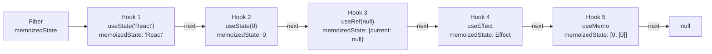
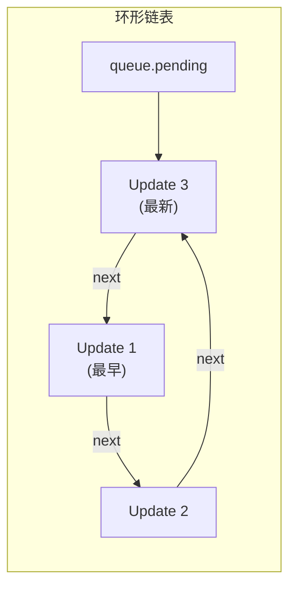
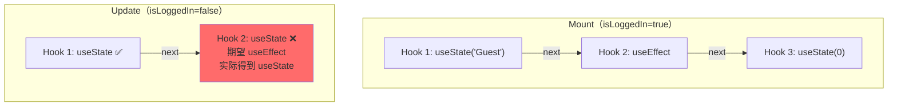

<div v-pre>

# 第7章 Hooks 的实现原理

> **本章要点**
>
> - Hooks 的数据结构：单向链表与 Fiber 节点的绑定关系
> - useState 的完整实现：mount 阶段与 update 阶段的差异
> - useReducer 的工作机制：与 useState 的同源性
> - useEffect 与 useLayoutEffect 的内部调度差异
> - useRef 为什么是最简单的 Hook——以及它为什么不触发重渲染
> - useMemo 与 useCallback 的缓存策略与失效机制
> - useContext 的订阅模型与性能陷阱
> - Hook 规则的技术根因：为什么不能条件调用 Hook
> - Dispatcher 切换机制：React 如何在不同阶段使用不同的 Hook 实现

---

Hooks 是 React 16.8 引入的最重大的范式变革。表面上，它让函数组件拥有了状态和副作用的能力；但从内核的角度看，Hooks 的设计远比 API 表面呈现的要精妙得多。

当你写下 `const [count, setCount] = useState(0)` 时，你可能会好奇：一个看似无状态的函数，每次调用都从头执行，它是怎么"记住"上一次的值的？更关键的是，当同一个组件中有多个 `useState`，React 是怎么知道哪个 state 对应哪个调用的？

答案藏在两个核心设计中：**Fiber 节点上的 Hook 链表**和**基于调用顺序的索引机制**。

## 7.1 Hook 的数据结构

每个 Hook 在 React 内部对应一个 `Hook` 对象，这些对象通过 `next` 指针串成一条单向链表，挂载在 Fiber 节点的 `memoizedState` 属性上：

```typescript
// Hook 的核心数据结构
type Hook = {
  memoizedState: any;        // 当前状态值（不同 Hook 存储不同的东西）
  baseState: any;            // 基准状态（用于并发模式下的状态计算）
  baseQueue: Update<any> | null;  // 上次未处理完的更新队列
  queue: UpdateQueue<any> | null; // 当前待处理的更新队列
  next: Hook | null;         // 指向下一个 Hook
};

// 不同 Hook 的 memoizedState 存储的内容
// useState     → state 值
// useReducer   → state 值
// useEffect    → Effect 对象
// useRef       → { current: value }
// useMemo      → [cachedValue, deps]
// useCallback  → [callback, deps]
// useContext   → context 的当前值（但实际上不使用 Hook 链表）
```

当 React 渲染一个函数组件时，Hook 链表的构建过程如下：

```tsx
function MyComponent() {
  const [name, setName] = useState('React');     // Hook 1
  const [count, setCount] = useState(0);          // Hook 2
  const ref = useRef(null);                        // Hook 3
  useEffect(() => { /* ... */ }, [count]);         // Hook 4
  const memoized = useMemo(() => count * 2, [count]); // Hook 5

  return <div>{name}: {count} (x2 = {memoized})</div>;
}
```



**图 7-1：Hook 链表结构示意图**

## 7.2 Dispatcher：Hook 的两张面孔

React 中的每个 Hook API（如 `useState`）并不是一个固定的实现，而是一个"门面"，它的实际行为取决于当前的 **Dispatcher**。React 维护了一个全局变量 `ReactCurrentDispatcher`，在不同的执行阶段会切换到不同的 Dispatcher：

```typescript
// React 的 Dispatcher 机制
const ReactCurrentDispatcher = {
  current: null as Dispatcher | null,
};

// 三种主要的 Dispatcher
const HooksDispatcherOnMount: Dispatcher = {
  useState: mountState,
  useEffect: mountEffect,
  useRef: mountRef,
  useMemo: mountMemo,
  useCallback: mountCallback,
  useReducer: mountReducer,
  useContext: readContext,
  // ...
};

const HooksDispatcherOnUpdate: Dispatcher = {
  useState: updateState,
  useEffect: updateEffect,
  useRef: updateRef,
  useMemo: updateMemo,
  useCallback: updateCallback,
  useReducer: updateReducer,
  useContext: readContext,
  // ...
};

const InvalidHooksDispatcher: Dispatcher = {
  useState: throwInvalidHookError,
  useEffect: throwInvalidHookError,
  // ... 所有方法都抛错
};
```

当 React 开始渲染一个函数组件时，会根据情况设置 Dispatcher：

```typescript
function renderWithHooks(
  current: Fiber | null,
  workInProgress: Fiber,
  Component: Function,
  props: any
) {
  // 根据是首次渲染还是更新，设置不同的 Dispatcher
  if (current !== null && current.memoizedState !== null) {
    // 更新阶段
    ReactCurrentDispatcher.current = HooksDispatcherOnUpdate;
  } else {
    // 首次挂载
    ReactCurrentDispatcher.current = HooksDispatcherOnMount;
  }

  // 执行函数组件
  let children = Component(props);

  // 渲染完成后，将 Dispatcher 设为无效版本
  // 这就是为什么在组件外调用 Hook 会报错
  ReactCurrentDispatcher.current = InvalidHooksDispatcher;

  return children;
}
```

这就是为什么在组件渲染函数外部调用 `useState` 会得到一个"Invalid hook call"错误——此时的 Dispatcher 已经被切换为 `InvalidHooksDispatcher`，所有 Hook 调用都会抛出异常。

## 7.3 useState 的完整实现

`useState` 是使用最广泛的 Hook，它的实现也是理解所有 Hook 工作原理的基石。

### 7.3.1 Mount 阶段：初始化

首次渲染时，`useState` 调用的是 `mountState`：

```typescript
function mountState<S>(initialState: (() => S) | S): [S, Dispatch<SetStateAction<S>>] {
  // 1. 创建一个新的 Hook 对象并添加到链表末尾
  const hook = mountWorkInProgressHook();

  // 2. 处理初始值（支持函数形式的惰性初始化）
  if (typeof initialState === 'function') {
    initialState = (initialState as () => S)();
  }

  // 3. 设置初始状态
  hook.memoizedState = initialState;
  hook.baseState = initialState;

  // 4. 创建更新队列
  const queue: UpdateQueue<S> = {
    pending: null,
    lanes: NoLanes,
    dispatch: null,
    lastRenderedReducer: basicStateReducer,
    lastRenderedState: initialState,
  };
  hook.queue = queue;

  // 5. 创建 dispatch 函数（即 setState）
  const dispatch = (queue.dispatch = dispatchSetState.bind(
    null,
    currentlyRenderingFiber,
    queue
  ));

  return [hook.memoizedState, dispatch];
}

// mountWorkInProgressHook 负责创建 Hook 对象并链接到链表
function mountWorkInProgressHook(): Hook {
  const hook: Hook = {
    memoizedState: null,
    baseState: null,
    baseQueue: null,
    queue: null,
    next: null,
  };

  if (workInProgressHook === null) {
    // 这是链表的第一个 Hook
    currentlyRenderingFiber.memoizedState = hook;
    workInProgressHook = hook;
  } else {
    // 追加到链表末尾
    workInProgressHook.next = hook;
    workInProgressHook = hook;
  }

  return hook;
}
```

有一个重要的细节：`dispatch` 函数通过 `bind` 绑定了 Fiber 节点和更新队列。这就是为什么 `setState` 可以在组件外部被调用（比如在 `setTimeout` 中）——它已经"记住"了要更新哪个组件。

### 7.3.2 Update 阶段：处理更新

当组件因为 `setState` 被调用而重新渲染时，`useState` 调用的是 `updateState`：

```typescript
function updateState<S>(initialState: (() => S) | S): [S, Dispatch<SetStateAction<S>>] {
  // useState 在 update 阶段本质上就是一个 useReducer
  return updateReducer(basicStateReducer, initialState);
}

// useState 的 reducer 就是这么简单
function basicStateReducer<S>(state: S, action: BasicStateAction<S>): S {
  return typeof action === 'function'
    ? (action as (S) => S)(state)
    : action;
}
```

这揭示了一个重要事实：**`useState` 在内部就是一个使用了 `basicStateReducer` 的 `useReducer`**。

```typescript
function updateReducer<S, A>(
  reducer: (S, A) => S,
  initialArg: S
): [S, Dispatch<A>] {
  // 1. 获取当前 Hook（从链表中按顺序取下一个）
  const hook = updateWorkInProgressHook();
  const queue = hook.queue!;

  queue.lastRenderedReducer = reducer;

  const current = currentHook!;
  let baseQueue = current.baseQueue;

  // 2. 将 pending 更新合并到 baseQueue
  const pendingQueue = queue.pending;
  if (pendingQueue !== null) {
    if (baseQueue !== null) {
      // 合并两个环形链表
      const baseFirst = baseQueue.next;
      const pendingFirst = pendingQueue.next;
      baseQueue.next = pendingFirst;
      pendingQueue.next = baseFirst;
    }
    current.baseQueue = baseQueue = pendingQueue;
    queue.pending = null;
  }

  // 3. 逐个处理更新队列中的 update
  if (baseQueue !== null) {
    const first = baseQueue.next;
    let newState = current.baseState;
    let newBaseState = null;
    let newBaseQueueFirst = null;
    let newBaseQueueLast = null;
    let update = first;

    do {
      const updateLane = update.lane;

      if (!isSubsetOfLanes(renderLanes, updateLane)) {
        // 优先级不够，跳过此更新（保留到下次）
        const clone = {
          lane: updateLane,
          action: update.action,
          hasEagerState: update.hasEagerState,
          eagerState: update.eagerState,
          next: null as any,
        };
        if (newBaseQueueLast === null) {
          newBaseQueueFirst = newBaseQueueLast = clone;
          newBaseState = newState;
        } else {
          newBaseQueueLast = newBaseQueueLast.next = clone;
        }
      } else {
        // 优先级足够，计算新状态
        if (update.hasEagerState) {
          // 使用预计算的状态（性能优化）
          newState = update.eagerState;
        } else {
          const action = update.action;
          newState = reducer(newState, action);
        }
      }

      update = update.next;
    } while (update !== null && update !== first);

    hook.memoizedState = newState;
    hook.baseState = newBaseState ?? newState;
    hook.baseQueue = newBaseQueueLast;

    queue.lastRenderedState = newState;
  }

  return [hook.memoizedState, queue.dispatch!];
}
```

### 7.3.3 dispatchSetState：更新的触发

当你调用 `setCount(count + 1)` 时，真正执行的是 `dispatchSetState`：

```typescript
function dispatchSetState<S, A>(
  fiber: Fiber,
  queue: UpdateQueue<S, A>,
  action: A
) {
  // 1. 获取更新优先级
  const lane = requestUpdateLane(fiber);

  // 2. 创建 update 对象
  const update: Update<S, A> = {
    lane,
    action,
    hasEagerState: false,
    eagerState: null,
    next: null as any,
  };

  if (isRenderPhaseUpdate(fiber)) {
    // 在渲染过程中调用 setState（render phase update）
    enqueueRenderPhaseUpdate(queue, update);
  } else {
    // 3. 🔑 关键优化：Eager State
    const alternate = fiber.alternate;
    if (
      fiber.lanes === NoLanes &&
      (alternate === null || alternate.lanes === NoLanes)
    ) {
      // 当前没有其他待处理的更新
      // 可以立即计算新状态，如果和旧状态相同就跳过调度
      const lastRenderedReducer = queue.lastRenderedReducer;
      if (lastRenderedReducer !== null) {
        const currentState = queue.lastRenderedState;
        const eagerState = lastRenderedReducer(currentState, action);
        update.hasEagerState = true;
        update.eagerState = eagerState;

        if (Object.is(eagerState, currentState)) {
          // 新旧状态相同，无需调度更新！
          enqueueUpdate(fiber, queue, update, lane);
          return;
        }
      }
    }

    // 4. 将 update 加入队列
    enqueueUpdate(fiber, queue, update, lane);

    // 5. 调度更新
    const root = scheduleUpdateOnFiber(fiber, lane);
  }
}
```

这里有一个极其重要的优化——**Eager State**（急切状态计算）。当组件当前没有其他待处理的更新时，React 会立即计算新状态。如果新状态与旧状态相同（通过 `Object.is` 比较），React 可以完全跳过这次更新的调度——连 Render 阶段都不需要进入。

```tsx
function Counter() {
  const [count, setCount] = useState(0);

  // 连续调用两次 setCount(1)
  const handleClick = () => {
    setCount(1); // 第一次：0 → 1，需要更新
    setCount(1); // 第二次：1 → 1，Eager State 优化，跳过
  };

  console.log('render'); // 只会打印一次

  return <button onClick={handleClick}>{count}</button>;
}
```

### 7.3.4 更新队列的环形链表

React 的更新队列使用**环形链表**来存储 update 对象。为什么不用普通链表或数组？

```typescript
function enqueueUpdate<S, A>(
  fiber: Fiber,
  queue: UpdateQueue<S, A>,
  update: Update<S, A>,
  lane: Lane
) {
  // 环形链表：新节点插入到 pending 和 pending.next 之间
  const pending = queue.pending;
  if (pending === null) {
    // 空队列：自己指向自己
    update.next = update;
  } else {
    // 插入到 pending 之后
    update.next = pending.next;
    pending.next = update;
  }
  // pending 始终指向最后一个插入的 update
  queue.pending = update;
}
```

环形链表的巧妙之处在于：`queue.pending` 指向最后一个 update，而 `queue.pending.next` 指向第一个 update。这样，既能 O(1) 地追加新 update 到末尾，也能 O(1) 地访问到第一个 update，无需维护头尾两个指针。



**图 7-2：更新队列的环形链表结构**

## 7.4 useReducer：useState 的泛化形式

从源码角度看，`useState` 是 `useReducer` 的特化版本。两者的区别仅在于 reducer 函数的来源：

```typescript
// useState 的 mount
function mountState(initialState) {
  const hook = mountWorkInProgressHook();
  // ...
  hook.queue.lastRenderedReducer = basicStateReducer; // 内置 reducer
  // ...
}

// useReducer 的 mount
function mountReducer(reducer, initialArg, init) {
  const hook = mountWorkInProgressHook();
  const initialState = init !== undefined ? init(initialArg) : initialArg;
  hook.memoizedState = initialState;
  // ...
  hook.queue.lastRenderedReducer = reducer; // 用户提供的 reducer
  // ...
}
```

`useReducer` 的真正价值在于复杂状态逻辑的封装和复用：

```tsx
type TodoAction =
  | { type: 'ADD'; text: string }
  | { type: 'TOGGLE'; id: number }
  | { type: 'DELETE'; id: number };

interface Todo {
  id: number;
  text: string;
  completed: boolean;
}

function todoReducer(state: Todo[], action: TodoAction): Todo[] {
  switch (action.type) {
    case 'ADD':
      return [...state, {
        id: Date.now(),
        text: action.text,
        completed: false,
      }];
    case 'TOGGLE':
      return state.map((todo) =>
        todo.id === action.id
          ? { ...todo, completed: !todo.completed }
          : todo
      );
    case 'DELETE':
      return state.filter((todo) => todo.id !== action.id);
    default:
      return state;
  }
}

function TodoApp() {
  const [todos, dispatch] = useReducer(todoReducer, []);

  // dispatch 的引用在整个组件生命周期中是稳定的
  // 可以安全地传递给子组件而不需要 useCallback
  return <TodoList todos={todos} dispatch={dispatch} />;
}
```

一个常被忽视的优势是：`dispatch` 函数的引用在组件的整个生命周期中是**稳定的**（与 `useState` 的 `setState` 一样），可以安全地传递给 `React.memo` 包裹的子组件。

## 7.5 useEffect 与 useLayoutEffect

Effect Hook 的实现比 State Hook 更复杂，因为它需要处理副作用的创建、清理和依赖比较。

### 7.5.1 Effect 的数据结构

```typescript
type Effect = {
  tag: HookFlags;           // 标识 Effect 类型（Layout/Passive/Insertion）
  create: () => (() => void) | void; // 副作用函数
  destroy: (() => void) | void;      // 清理函数（create 的返回值）
  deps: Array<mixed> | null;         // 依赖数组
  next: Effect;             // 指向下一个 Effect（也是环形链表）
};
```

Effect 对象不仅存储在 Hook 的 `memoizedState` 中，还会被添加到 Fiber 的 `updateQueue` 中——这是一个专门用于 Effect 的环形链表，Commit 阶段通过这个队列来执行副作用。

### 7.5.2 Mount 阶段

```typescript
function mountEffect(
  create: () => (() => void) | void,
  deps: Array<mixed> | void | null
) {
  return mountEffectImpl(
    PassiveEffect | PassiveStaticEffect,
    HookPassive,
    create,
    deps
  );
}

function mountLayoutEffect(
  create: () => (() => void) | void,
  deps: Array<mixed> | void | null
) {
  return mountEffectImpl(
    UpdateEffect,
    HookLayout,
    create,
    deps
  );
}

function mountEffectImpl(
  fiberFlags: Flags,
  hookFlags: HookFlags,
  create: () => (() => void) | void,
  deps: Array<mixed> | void | null
) {
  const hook = mountWorkInProgressHook();
  const nextDeps = deps === undefined ? null : deps;

  // 在 Fiber 上标记存在 effect
  currentlyRenderingFiber.flags |= fiberFlags;

  // 创建 Effect 对象并挂载到 Hook 和 Fiber 的 updateQueue 上
  hook.memoizedState = pushEffect(
    HookHasEffect | hookFlags,
    create,
    undefined, // destroy 在 mount 阶段还没有
    nextDeps
  );
}
```

注意 `useEffect` 和 `useLayoutEffect` 的差异仅在于它们的 **flags** 不同：
- `useEffect` → `PassiveEffect` + `HookPassive`
- `useLayoutEffect` → `UpdateEffect` + `HookLayout`

这些 flags 决定了 Commit 阶段在哪个子阶段执行它们。

### 7.5.3 Update 阶段：依赖比较

```typescript
function updateEffectImpl(
  fiberFlags: Flags,
  hookFlags: HookFlags,
  create: () => (() => void) | void,
  deps: Array<mixed> | void | null
) {
  const hook = updateWorkInProgressHook();
  const nextDeps = deps === undefined ? null : deps;
  let destroy = undefined;

  if (currentHook !== null) {
    const prevEffect = currentHook.memoizedState;
    destroy = prevEffect.destroy;

    if (nextDeps !== null) {
      const prevDeps = prevEffect.deps;
      // 🔑 逐项比较依赖
      if (areHookInputsEqual(nextDeps, prevDeps)) {
        // 依赖没变，创建一个没有 HookHasEffect 标记的 Effect
        // 这个 Effect 在 Commit 阶段会被跳过
        hook.memoizedState = pushEffect(hookFlags, create, destroy, nextDeps);
        return;
      }
    }
  }

  // 依赖变了，标记需要执行
  currentlyRenderingFiber.flags |= fiberFlags;
  hook.memoizedState = pushEffect(
    HookHasEffect | hookFlags,
    create,
    destroy,
    nextDeps
  );
}

// 依赖比较函数
function areHookInputsEqual(
  nextDeps: Array<mixed>,
  prevDeps: Array<mixed> | null
): boolean {
  if (prevDeps === null) return false;

  for (let i = 0; i < prevDeps.length && i < nextDeps.length; i++) {
    if (Object.is(nextDeps[i], prevDeps[i])) {
      continue;
    }
    return false;
  }
  return true;
}
```

关键点：当依赖没有变化时，React 仍然会创建一个新的 Effect 对象（因为 Hook 链表需要保持完整），但这个 Effect **没有 `HookHasEffect` 标记**，所以 Commit 阶段会跳过它的执行。

## 7.6 useRef：最简单的 Hook

`useRef` 的实现简单到令人惊讶：

```typescript
function mountRef<T>(initialValue: T): { current: T } {
  const hook = mountWorkInProgressHook();
  const ref = { current: initialValue };
  hook.memoizedState = ref;
  return ref;
}

function updateRef<T>(initialValue: T): { current: T } {
  const hook = updateWorkInProgressHook();
  // 直接返回之前创建的 ref 对象，什么都不做
  return hook.memoizedState;
}
```

`useRef` 之所以不会触发重渲染，是因为它**从不与 Fiber 的更新机制交互**。它既不标记任何 flags，也不创建任何 update。修改 `ref.current` 就是普通的 JavaScript 对象属性赋值——React 完全不知道这件事发生了。

这也解释了为什么 `useRef` 可以用来存储任何可变值（不仅仅是 DOM 引用），而且修改它不会导致重渲染：

```tsx
function Timer() {
  const [count, setCount] = useState(0);
  const intervalRef = useRef<NodeJS.Timeout | null>(null);
  const countRef = useRef(count);

  // 保持 countRef 与最新的 count 同步
  countRef.current = count;

  useEffect(() => {
    intervalRef.current = setInterval(() => {
      // 使用 ref 读取最新的 count，避免闭包陷阱
      console.log('当前 count:', countRef.current);
      setCount((c) => c + 1);
    }, 1000);

    return () => {
      if (intervalRef.current) {
        clearInterval(intervalRef.current);
      }
    };
  }, []); // 空依赖数组，只在挂载时执行

  return <div>{count}</div>;
}
```

## 7.7 useMemo 与 useCallback

`useMemo` 和 `useCallback` 本质上是同一种缓存机制的两种表现形式：

```typescript
function mountMemo<T>(
  nextCreate: () => T,
  deps: Array<mixed> | void | null
): T {
  const hook = mountWorkInProgressHook();
  const nextDeps = deps === undefined ? null : deps;
  const nextValue = nextCreate(); // 立即执行计算函数
  hook.memoizedState = [nextValue, nextDeps]; // 缓存值和依赖
  return nextValue;
}

function updateMemo<T>(
  nextCreate: () => T,
  deps: Array<mixed> | void | null
): T {
  const hook = updateWorkInProgressHook();
  const nextDeps = deps === undefined ? null : deps;
  const prevState = hook.memoizedState;

  if (prevState !== null && nextDeps !== null) {
    const prevDeps = prevState[1];
    if (areHookInputsEqual(nextDeps, prevDeps)) {
      // 依赖没变，返回缓存的值
      return prevState[0];
    }
  }

  // 依赖变了，重新计算
  const nextValue = nextCreate();
  hook.memoizedState = [nextValue, nextDeps];
  return nextValue;
}

function mountCallback<T>(
  callback: T,
  deps: Array<mixed> | void | null
): T {
  const hook = mountWorkInProgressHook();
  const nextDeps = deps === undefined ? null : deps;
  hook.memoizedState = [callback, nextDeps]; // 缓存回调和依赖
  return callback;
}

function updateCallback<T>(
  callback: T,
  deps: Array<mixed> | void | null
): T {
  const hook = updateWorkInProgressHook();
  const nextDeps = deps === undefined ? null : deps;
  const prevState = hook.memoizedState;

  if (prevState !== null && nextDeps !== null) {
    const prevDeps = prevState[1];
    if (areHookInputsEqual(nextDeps, prevDeps)) {
      // 依赖没变，返回缓存的回调
      return prevState[0];
    }
  }

  hook.memoizedState = [callback, nextDeps];
  return callback;
}
```

从实现上看，`useCallback(fn, deps)` 完全等价于 `useMemo(() => fn, deps)`。区别仅在于 `useMemo` 缓存的是函数的**返回值**，而 `useCallback` 缓存的是函数**本身**。

### 7.7.1 何时使用 useMemo 和 useCallback

一个常见的误解是"到处使用 `useMemo` 和 `useCallback` 可以提高性能"。实际上，每个 `useMemo`/`useCallback` 都有成本：

```tsx
// ❌ 不必要的 useMemo：简单计算不需要缓存
function Component({ a, b }: { a: number; b: number }) {
  // 加法的计算成本远低于 useMemo 的依赖比较开销
  const sum = useMemo(() => a + b, [a, b]);
  return <div>{sum}</div>;
}

// ✅ 有意义的 useMemo：昂贵的计算
function Component({ items }: { items: Item[] }) {
  const sorted = useMemo(() => {
    // 排序是 O(n log n) 的操作，值得缓存
    return [...items].sort((a, b) => a.score - b.score);
  }, [items]);
  return <List items={sorted} />;
}

// ✅ 有意义的 useCallback：传递给 memo 组件的回调
function Parent({ id }: { id: string }) {
  const handleClick = useCallback(() => {
    fetchData(id);
  }, [id]);

  // 如果不用 useCallback，ExpensiveChild 每次都会重渲染
  return <ExpensiveChild onClick={handleClick} />;
}

const ExpensiveChild = React.memo(({ onClick }: { onClick: () => void }) => {
  // ... 昂贵的渲染逻辑
});
```

## 7.8 useContext：没有 Hook 链表的 Hook

`useContext` 是一个特殊的 Hook——它不使用 Hook 链表来存储状态。它的实现直接读取 Context 的当前值：

```typescript
function readContext<T>(context: ReactContext<T>): T {
  const value = context._currentValue;

  // 建立 Fiber 到 Context 的依赖关系
  const contextItem: ContextDependency<T> = {
    context,
    memoizedValue: value,
    next: null,
  };

  if (lastContextDependency === null) {
    currentlyRenderingFiber.dependencies = {
      lanes: NoLanes,
      firstContext: contextItem,
    };
    lastContextDependency = contextItem;
  } else {
    lastContextDependency = lastContextDependency.next = contextItem;
  }

  return value;
}
```

当 Context Provider 的值发生变化时，React 会遍历 Provider 的子树，找到所有依赖该 Context 的 Fiber 节点，并为它们标记更新：

```typescript
function propagateContextChange<T>(
  workInProgress: Fiber,
  context: ReactContext<T>,
  renderLanes: Lanes
) {
  let fiber = workInProgress.child;

  while (fiber !== null) {
    const list = fiber.dependencies;
    if (list !== null) {
      let dependency = list.firstContext;
      while (dependency !== null) {
        if (dependency.context === context) {
          // 找到了依赖此 Context 的 Fiber
          if (fiber.tag === ClassComponent) {
            // 为 Class 组件创建一个强制更新
            const update = createUpdate(renderLanes);
            update.tag = ForceUpdate;
            enqueueUpdate(fiber, update);
          }
          // 标记更新 lane
          fiber.lanes = mergeLanes(fiber.lanes, renderLanes);
          // 从当前节点一路向上标记 childLanes
          scheduleContextWorkOnParentPath(fiber.return, renderLanes);
          break;
        }
        dependency = dependency.next;
      }
    }
    fiber = fiber.child ?? fiber.sibling ?? /* 向上回溯找兄弟 */;
  }
}
```

### 7.8.1 useContext 的性能陷阱

`useContext` 的一个重要特性（也是常见的性能陷阱）是：**只要 Provider 的 value 变化，所有消费该 Context 的组件都会重渲染**，即使组件只使用了 value 中的一小部分。

```tsx
// ❌ 性能问题：整个 value 对象每次渲染都是新引用
function AppProvider({ children }: { children: React.ReactNode }) {
  const [user, setUser] = useState<User | null>(null);
  const [theme, setTheme] = useState('light');

  // 每次渲染都创建新对象 → 所有消费者都重渲染
  const value = { user, setUser, theme, setTheme };

  return <AppContext.Provider value={value}>{children}</AppContext.Provider>;
}

// ✅ 拆分 Context 或 memoize value
function AppProvider({ children }: { children: React.ReactNode }) {
  const [user, setUser] = useState<User | null>(null);
  const [theme, setTheme] = useState('light');

  // 方案1：memoize value
  const value = useMemo(
    () => ({ user, setUser, theme, setTheme }),
    [user, theme]
  );

  return <AppContext.Provider value={value}>{children}</AppContext.Provider>;
}

// 方案2：拆分为独立的 Context
function UserProvider({ children }: { children: React.ReactNode }) {
  const [user, setUser] = useState<User | null>(null);
  const value = useMemo(() => ({ user, setUser }), [user]);
  return <UserContext.Provider value={value}>{children}</UserContext.Provider>;
}

function ThemeProvider({ children }: { children: React.ReactNode }) {
  const [theme, setTheme] = useState('light');
  const value = useMemo(() => ({ theme, setTheme }), [theme]);
  return <ThemeContext.Provider value={value}>{children}</ThemeContext.Provider>;
}
```

## 7.9 Hook 规则的技术根因

React 的官方文档说"只在顶层调用 Hook，不要在循环、条件或嵌套函数中调用"。这不是一个任意的约定，而是由 Hook 的底层实现决定的硬性限制。

核心问题在于：React 通过**调用顺序**来匹配 mount 阶段和 update 阶段的 Hook。`updateWorkInProgressHook` 的实现就是简单地将指针移动到链表的下一个节点：

```typescript
function updateWorkInProgressHook(): Hook {
  // 从 current 树的 Hook 链表中获取下一个 Hook
  let nextCurrentHook: Hook | null;

  if (currentHook === null) {
    const current = currentlyRenderingFiber.alternate;
    nextCurrentHook = current !== null ? current.memoizedState : null;
  } else {
    nextCurrentHook = currentHook.next;
  }

  currentHook = nextCurrentHook;

  // 复用或创建对应的 workInProgress Hook
  const newHook: Hook = {
    memoizedState: currentHook!.memoizedState,
    baseState: currentHook!.baseState,
    baseQueue: currentHook!.baseQueue,
    queue: currentHook!.queue,
    next: null,
  };

  if (workInProgressHook === null) {
    currentlyRenderingFiber.memoizedState = newHook;
    workInProgressHook = newHook;
  } else {
    workInProgressHook.next = newHook;
    workInProgressHook = newHook;
  }

  return workInProgressHook;
}
```

如果在条件语句中调用 Hook，调用顺序可能在不同渲染之间发生变化：

```tsx
// ❌ 这段代码会导致 Hook 错位
function BuggyComponent({ isLoggedIn }: { isLoggedIn: boolean }) {
  const [name, setName] = useState('Guest');    // Hook 1: useState

  if (isLoggedIn) {
    useEffect(() => { /* ... */ });              // Hook 2: useEffect（条件性的！）
  }

  const [count, setCount] = useState(0);         // Hook 3: useState

  // 当 isLoggedIn 从 true 变为 false 时：
  // Mount: Hook1=useState, Hook2=useEffect, Hook3=useState
  // Update: Hook1=useState, Hook2=useState(!!!)  ← 错位了！
  // React 会尝试将 useState 的 update 结构应用到 useEffect 上
  // 结果：运行时错误或状态混乱
}
```



**图 7-3：条件调用 Hook 导致的链表错位**

## 7.10 useId：服务端与客户端的一致性

`useId` 是 React 18 引入的一个看似简单但设计精妙的 Hook，它解决了 SSR 场景下的 ID 一致性问题：

```typescript
function mountId(): string {
  const hook = mountWorkInProgressHook();

  const root = getWorkInProgressRoot();
  const identifierPrefix = root.identifierPrefix; // 可配置的前缀

  let id: string;
  if (getIsHydrating()) {
    // SSR hydration：从树结构生成确定性 ID
    const treeId = getTreeId();
    id = ':' + identifierPrefix + 'R' + treeId;
  } else {
    // 客户端渲染：使用自增计数器
    const globalClientId = globalClientIdCounter++;
    id = ':' + identifierPrefix + 'r' + globalClientId.toString(32);
  }

  hook.memoizedState = id;
  return id;
}
```

`useId` 生成的 ID 有一个特殊格式（如 `:R1:`、`:r0:`），确保不会与用户自定义的 ID 冲突。在 SSR 场景下，它基于组件在树中的位置生成**确定性的 ID**，保证服务端和客户端渲染出相同的值。

## 7.11 Hook 的调试与开发者体验

在开发模式下，React 会做额外的检查来帮助开发者发现 Hook 使用错误：

```typescript
// 开发模式下的 Hook 调用检查
if (__DEV__) {
  // 记录每次渲染中 Hook 的调用顺序
  const hookTypesDev: Array<HookType> = [];

  function mountHookTypesDev() {
    // mount 阶段记录调用顺序
    hookTypesDev.push('useState'); // 或 'useEffect' 等
  }

  function updateHookTypesDev() {
    // update 阶段验证调用顺序是否一致
    const hookName = hookTypesDev[hookTypesUpdateIndexDev++];
    if (hookName !== currentHookNameInDev) {
      console.error(
        'React has detected a change in the order of Hooks called by %s. ' +
          'This will lead to bugs and errors if not fixed. ' +
          'For more information, read the Rules of Hooks: ...',
        currentComponentName
      );
    }
  }
}
```

React 还利用 Dispatcher 切换来检测组件外部的 Hook 调用：当函数组件执行完毕后，Dispatcher 会被切换为 `InvalidHooksDispatcher`，此后任何 Hook 调用都会抛出清晰的错误信息。

## 7.12 本章小结

Hooks 的设计是 React 中最精巧的工程之一。它用一条简单的单向链表和一个基于调用顺序的索引机制，为函数组件带来了完整的状态管理和副作用处理能力。

关键要点：

1. **Hook 链表是 Hooks 系统的基础**：每个 Hook 对应一个 Hook 对象，通过 `next` 指针串成链表，挂在 Fiber 的 `memoizedState` 上
2. **Dispatcher 切换实现了同一 API 的不同行为**：mount 阶段创建链表，update 阶段遍历链表
3. **useState 就是 useReducer**：内部使用 `basicStateReducer`，两者共享更新队列和处理逻辑
4. **Eager State 是重要的性能优化**：在没有其他待处理更新时，可以直接计算新状态并跳过调度
5. **useEffect 和 useLayoutEffect 的差异只在 flags**：不同的 flags 决定了在 Commit 阶段的不同子阶段执行
6. **Hook 规则不是约定，是硬限制**：调用顺序必须一致，否则链表会错位
7. **useRef 是最纯粹的"容器"**：不参与任何更新机制，修改 `current` 完全是普通的 JS 操作

在下一章中，我们将探索 React 19 引入的新 Hooks 和 API——`use`、`useFormStatus`、`useOptimistic` 等，看看它们如何在这个 Hook 体系之上构建出更强大的能力。

> **课程关联**：本章内容对应慕课网课程《React 源码深度解析》第 10-12 节。课程中通过逐步调试演示了 useState 的 mount 和 update 过程，以及 useEffect 的调度机制，建议配合学习：[https://coding.imooc.com/class/650.html](https://coding.imooc.com/class/650.html)

---

### 思考题

1. **为什么 React 选择单向链表而不是数组来存储 Hook？** 考虑在并发模式下，同一个组件可能需要同时维护多个"进行中"的 Hook 状态。链表和数组在这种场景下的表现有何差异？

2. **`useState` 的 Eager State 优化有一个限制条件：当前 Fiber 没有其他待处理的更新。** 为什么需要这个条件？构造一个反例，说明在有待处理更新时进行 Eager State 计算可能得到错误的结果。

3. **`useRef` 不会触发重渲染，那 `forwardRef` + `useImperativeHandle` 是如何将子组件的方法暴露给父组件的？** 追踪 `useImperativeHandle` 的源码实现，它本质上使用了哪个 Hook？

4. **在一个使用了 3 个 `useContext` 的组件中，如果其中一个 Context 的值发生了变化，另外两个 Context 的值是否会被重新读取？** 从 `propagateContextChange` 和组件重渲染的流程来分析。

</div>
