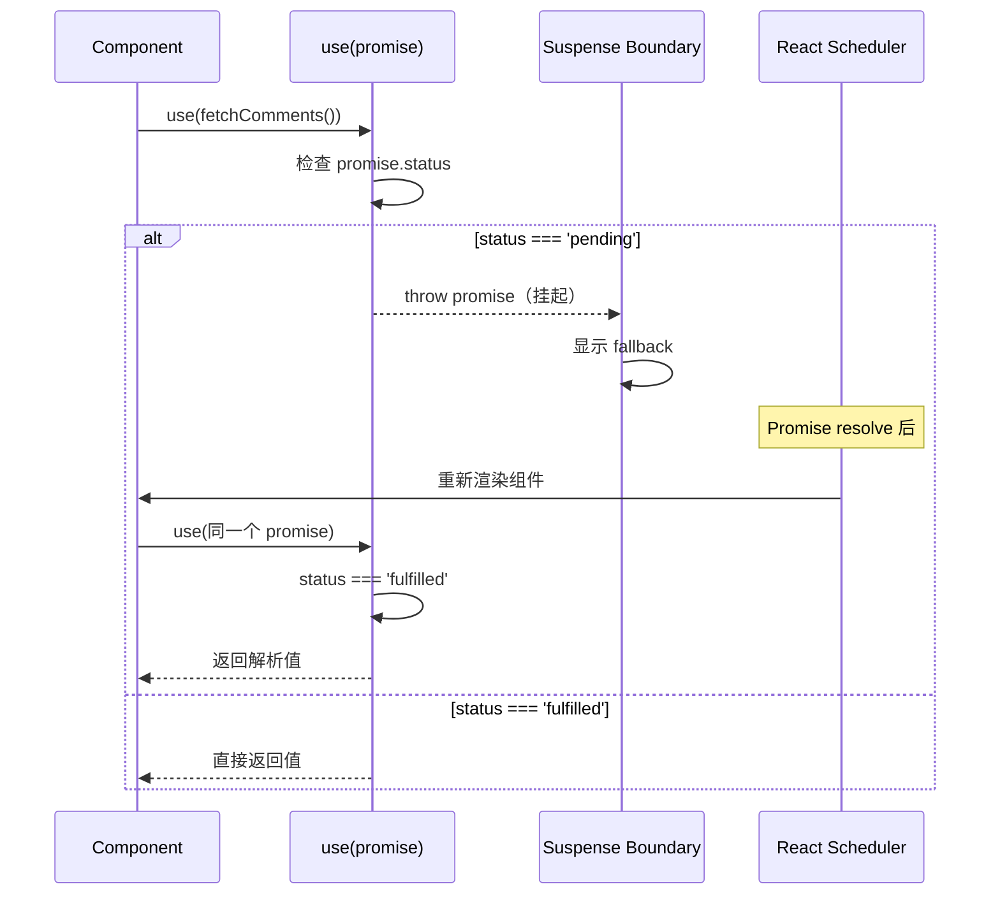
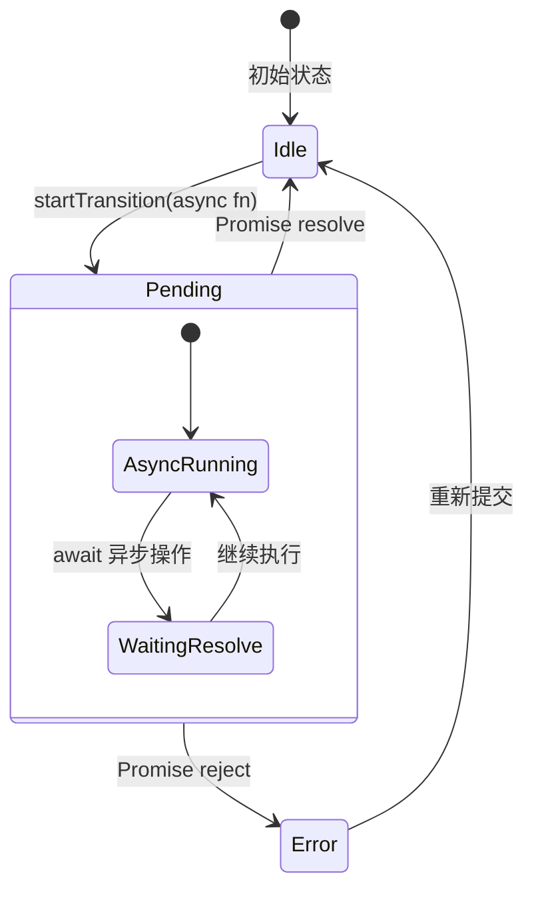
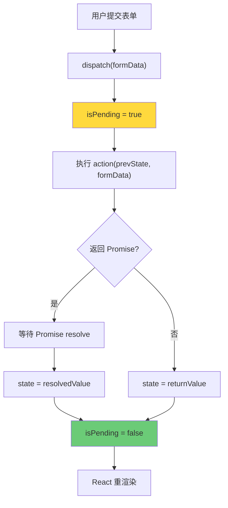
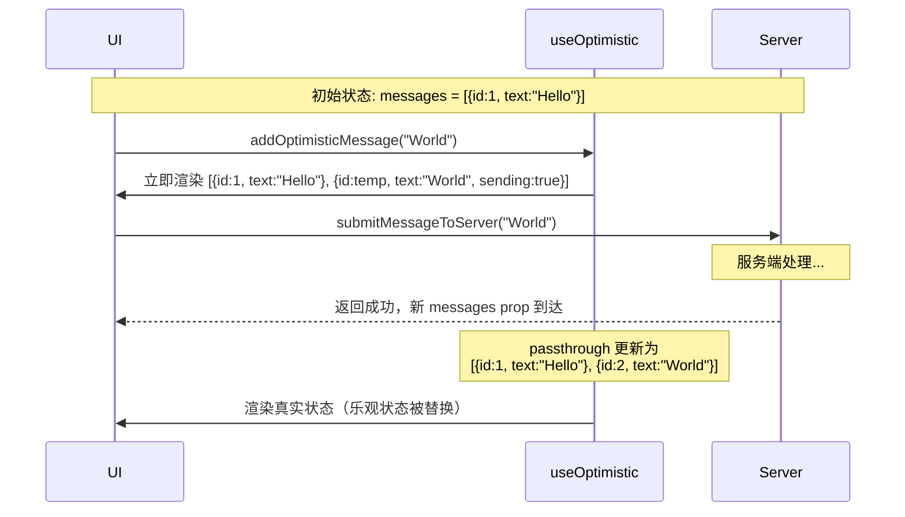

<div v-pre>

# 第8章 React 19 新 Hooks 与 API

> **本章要点**
>
> - use Hook 的革命性设计：在条件语句和循环中调用的第一个 Hook
> - useActionState 的工作机制：表单状态与异步 Action 的桥梁
> - useFormStatus 的实现原理：跨组件读取表单提交状态
> - useOptimistic 的乐观更新模型：即时反馈与最终一致性
> - Actions 的内核机制：Transition 与异步函数的融合
> - ref 作为 prop 的变革：forwardRef 的终结
> - React 19 API 变更的源码级解读

---

React 19 是自 Hooks 引入以来最重大的一次 API 更新。它不仅增加了 `use`、`useActionState`、`useFormStatus`、`useOptimistic` 等新 Hook，还从根本上改变了 React 处理异步操作和表单交互的方式。

如果说 React 16.8 的 Hooks 解决了"函数组件如何拥有状态"的问题，那么 React 19 的新 API 则瞄准了一个更大的目标：**如何优雅地处理数据变更（mutation）**。在此之前，React 一直擅长的是数据展示——从 state 到 UI 的单向流动。而数据的写入、提交、乐观更新等操作，长期以来都需要开发者自行搭建脚手架。React 19 将这些模式内建到了框架核心中。

## 8.1 use：打破 Hook 规则的 Hook

`use` 是 React 19 引入的最具颠覆性的 API。它打破了 Hooks 系统自诞生以来最核心的规则——它可以在条件语句和循环中被调用。

### 8.1.1 use 的两种模式

`use` 有两种截然不同的使用方式：读取 Promise 和读取 Context。

```typescript
// 模式 1：读取 Promise
function Comments({ commentsPromise }: { commentsPromise: Promise<Comment[]> }) {
  // 如果 Promise 还没 resolve，会挂起组件（触发 Suspense）
  const comments = use(commentsPromise);
  return comments.map(c => <p key={c.id}>{c.body}</p>);
}

// 模式 2：读取 Context（可以在条件语句中）
function ThemeButton({ showIcon }: { showIcon: boolean }) {
  if (showIcon) {
    const theme = use(ThemeContext); // ✅ 在条件中调用 use
    return <Icon color={theme.primary} />;
  }
  return <button>Click me</button>;
}
```

### 8.1.2 use(Promise) 的内核实现

当 `use` 接收一个 Promise 时，它的行为与 Suspense 紧密耦合：

```typescript
function use<T>(usable: Usable<T>): T {
  if (usable !== null && typeof usable === 'object') {
    if (typeof (usable as Thenable<T>).then === 'function') {
      // Promise 路径
      const thenable = (usable as Thenable<T>);
      return useThenable(thenable);
    } else if ((usable as ReactContext<T>).$$typeof === REACT_CONTEXT_TYPE) {
      // Context 路径
      const context = (usable as ReactContext<T>);
      return readContext(context);
    }
  }
  throw new Error('An unsupported type was passed to use()');
}
```

`useThenable` 是核心实现，它实现了"同步化异步"的魔法：

```typescript
function useThenable<T>(thenable: Thenable<T>): T {
  const index = thenableIndexCounter;
  thenableIndexCounter += 1;

  if (thenableState === null) {
    thenableState = createThenableState();
  }

  const result = trackUsedThenable(thenableState, thenable, index);

  // 如果 result 是 SUSPENDED_THENABLE，说明 Promise 还没 resolve
  // React 会 throw 这个 thenable，触发 Suspense 边界
  if (
    currentlyRenderingFiber.alternate === null &&
    (workInProgressHook === null
      ? currentlyRenderingFiber.memoizedState === null
      : workInProgressHook.next === null)
  ) {
    // 初次渲染时 Promise 未完成：这是合法的 Suspense 场景
  }

  return result;
}

function trackUsedThenable<T>(
  thenableState: ThenableState,
  thenable: Thenable<T>,
  index: number
): T {
  const trackedThenables = thenableState;
  const previous = trackedThenables[index];

  if (previous === undefined) {
    // 第一次遇到这个 thenable
    trackedThenables[index] = thenable;

    switch (thenable.status) {
      case 'fulfilled':
        return thenable.value;
      case 'rejected':
        throw thenable.reason;
      default:
        // pending 状态：附加 then 回调
        const pendingThenable = thenable as PendingThenable<T>;
        pendingThenable.status = 'pending';

        pendingThenable.then(
          (fulfilledValue) => {
            if (thenable.status === 'pending') {
              const fulfilledThenable = thenable as FulfilledThenable<T>;
              fulfilledThenable.status = 'fulfilled';
              fulfilledThenable.value = fulfilledValue;
            }
          },
          (error) => {
            if (thenable.status === 'pending') {
              const rejectedThenable = thenable as RejectedThenable<T>;
              rejectedThenable.status = 'rejected';
              rejectedThenable.reason = error;
            }
          }
        );

        // 抛出 thenable，触发 Suspense
        throw thenable;
    }
  } else {
    // 之前已经追踪过
    switch (previous.status) {
      case 'fulfilled':
        return (previous as FulfilledThenable<T>).value;
      case 'rejected':
        throw (previous as RejectedThenable<T>).reason;
      default:
        // 仍在 pending，继续挂起
        throw previous;
    }
  }
}
```



**图 8-1：use(Promise) 的挂起与恢复流程**

### 8.1.3 为什么 use 可以在条件语句中调用

传统 Hook 不能在条件语句中调用，因为它们依赖 Hook 链表的顺序索引（见第 7 章 7.9 节）。`use` 之所以能突破这个限制，是因为它使用了**完全不同的存储机制**：

```typescript
// 传统 Hook：通过链表顺序索引
// Hook 1 → Hook 2 → Hook 3
// 每次渲染必须以相同顺序遍历链表

// use(Context)：直接读取 Context 的 _currentValue
// 不需要链表，不依赖调用顺序

// use(Promise)：通过 thenableState 数组 + index 追踪
// index 基于 use 在当前渲染中的调用计数，而不是所有 Hook 的调用计数
```

对于 `use(Context)`，它直接调用 `readContext`，与 `useContext` 的实现完全相同——`readContext` 本身就不依赖 Hook 链表（见第 7 章 7.8 节）。

对于 `use(Promise)`，它使用独立的 `thenableState` 数组和 `thenableIndexCounter`，与 Hook 链表是分离的追踪系统。这意味着即使 `use` 在条件分支中被调用了不同次数，也不会影响 Hook 链表的完整性。

## 8.2 Actions：异步 Transition 的进化

React 19 引入了 **Actions** 概念——将异步函数传递给 `startTransition`，使其成为一个可追踪状态的"Action"。

### 8.2.1 Transition 的异步扩展

在 React 18 中，`startTransition` 只接受同步回调。React 19 扩展了它的能力：

```typescript
// React 18：只能同步
startTransition(() => {
  setSearchQuery(input); // 同步状态更新
});

// React 19：支持异步函数（Action）
startTransition(async () => {
  const data = await submitForm(formData);  // 异步操作
  setResult(data);                           // 异步完成后更新状态
});
```

内核实现中，当 `startTransition` 检测到回调返回了 Promise 时，React 会追踪这个 Promise 的生命周期：

```typescript
function startTransition(
  fiber: Fiber,
  queue: UpdateQueue<boolean>,
  pendingState: boolean,
  finishedState: boolean,
  callback: () => void | Promise<void>
) {
  const previousPriority = getCurrentUpdatePriority();
  setCurrentUpdatePriority(
    higherEventPriority(previousPriority, ContinuousEventPriority)
  );

  const prevTransition = ReactCurrentBatchConfig.transition;
  ReactCurrentBatchConfig.transition = {};

  // 先标记 isPending = true
  dispatchSetState(fiber, queue, pendingState);

  try {
    const returnValue = callback();

    if (
      returnValue !== null &&
      typeof returnValue === 'object' &&
      typeof returnValue.then === 'function'
    ) {
      // 🔑 这是一个 async Action
      const thenable = (returnValue as Thenable<void>);

      // 创建一个 "listener"，在 Promise resolve 时标记 isPending = false
      const thenableForFinishedState = chainThenableValue(
        thenable,
        finishedState
      );

      // 通知 Transition 追踪系统
      entangleAsyncAction(fiber, thenableForFinishedState);
    } else {
      // 同步 Action，直接标记完成
      dispatchSetState(fiber, queue, finishedState);
    }
  } catch (error) {
    // Action 出错，也标记完成（isPending = false）
    dispatchSetState(fiber, queue, finishedState);
    throw error;
  } finally {
    setCurrentUpdatePriority(previousPriority);
    ReactCurrentBatchConfig.transition = prevTransition;
  }
}
```

### 8.2.2 Action 的状态追踪

Actions 的核心价值在于自动追踪异步操作的生命周期。`useTransition` 返回的 `isPending` 在 React 19 中被增强为能感知异步 Action 的状态：

```tsx
function SubmitButton() {
  const [isPending, startTransition] = useTransition();

  const handleSubmit = () => {
    startTransition(async () => {
      // isPending 自动变为 true
      await saveToServer(data);
      // isPending 自动变回 false
    });
  };

  return (
    <button onClick={handleSubmit} disabled={isPending}>
      {isPending ? '提交中...' : '提交'}
    </button>
  );
}
```



**图 8-2：Action 的状态生命周期**

## 8.3 useActionState：表单状态管理的内核

`useActionState` 是 React 19 为表单场景设计的专用 Hook，它将表单的提交动作与状态管理合二为一。

### 8.3.1 API 设计与使用模式

```typescript
// useActionState 的类型签名
function useActionState<State>(
  action: (prevState: State, formData: FormData) => State | Promise<State>,
  initialState: State,
  permalink?: string
): [state: State, dispatch: (payload: FormData) => void, isPending: boolean];
```

```tsx
// 实际使用示例
interface FormState {
  message: string;
  errors: Record<string, string>;
}

async function createTodo(
  prevState: FormState,
  formData: FormData
): Promise<FormState> {
  const title = formData.get('title') as string;

  if (!title.trim()) {
    return {
      message: '',
      errors: { title: '标题不能为空' },
    };
  }

  try {
    await saveTodoToServer({ title });
    return { message: '创建成功！', errors: {} };
  } catch (e) {
    return { message: '保存失败', errors: { _form: String(e) } };
  }
}

function TodoForm() {
  const [state, formAction, isPending] = useActionState(createTodo, {
    message: '',
    errors: {},
  });

  return (
    <form action={formAction}>
      <input name="title" disabled={isPending} />
      {state.errors.title && <span className="error">{state.errors.title}</span>}
      <button type="submit" disabled={isPending}>
        {isPending ? '创建中...' : '创建'}
      </button>
      {state.message && <p>{state.message}</p>}
    </form>
  );
}
```

### 8.3.2 内核实现

`useActionState` 的实现巧妙地组合了 `useReducer` 的状态管理能力和 Action 的异步追踪能力：

```typescript
function mountActionState<State>(
  action: (state: State, payload: FormData) => State | Promise<State>,
  initialState: State,
  permalink?: string
): [State, (payload: FormData) => void, boolean] {
  // 状态存储：使用 reducer 模式
  const stateHook = mountWorkInProgressHook();
  stateHook.memoizedState = initialState;
  stateHook.baseState = initialState;

  const stateQueue: UpdateQueue<State> = {
    pending: null,
    lanes: NoLanes,
    dispatch: null,
    lastRenderedReducer: actionStateReducer,
    lastRenderedState: initialState,
  };
  stateHook.queue = stateQueue;

  // isPending 状态追踪
  const pendingStateHook = mountWorkInProgressHook();
  pendingStateHook.memoizedState = false; // 初始不在 pending

  // 创建 dispatch 函数
  const dispatch = dispatchActionState.bind(
    null,
    currentlyRenderingFiber,
    stateQueue,
    action,
    pendingStateHook.queue
  );
  stateQueue.dispatch = dispatch;

  // Action 引用存储（用于热更新）
  const actionHook = mountWorkInProgressHook();
  actionHook.memoizedState = action;

  return [initialState, dispatch, false];
}

// Action 的 reducer
function actionStateReducer<State>(state: State, action: State): State {
  return action; // 直接用新值替换旧值
}
```

当用户调用 dispatch 时，实际执行流程如下：

```typescript
function dispatchActionState<State>(
  fiber: Fiber,
  actionQueue: UpdateQueue<State>,
  action: (state: State, payload: FormData) => State | Promise<State>,
  pendingQueue: UpdateQueue<boolean>,
  payload: FormData
) {
  // 1. 标记 isPending = true
  dispatchSetState(fiber, pendingQueue, true);

  // 2. 在 Transition 中执行 action
  const prevTransition = ReactCurrentBatchConfig.transition;
  ReactCurrentBatchConfig.transition = {};

  try {
    const prevState = actionQueue.lastRenderedState;
    const returnValue = action(prevState, payload);

    if (returnValue instanceof Promise) {
      // 异步 Action
      returnValue.then(
        (nextState) => {
          dispatchSetState(fiber, actionQueue, nextState);
          dispatchSetState(fiber, pendingQueue, false);
        },
        (error) => {
          dispatchSetState(fiber, pendingQueue, false);
          // 错误处理...
        }
      );
    } else {
      // 同步 Action
      dispatchSetState(fiber, actionQueue, returnValue);
      dispatchSetState(fiber, pendingQueue, false);
    }
  } finally {
    ReactCurrentBatchConfig.transition = prevTransition;
  }
}
```



**图 8-3：useActionState 的执行流程**

## 8.4 useFormStatus：跨组件的表单状态共享

`useFormStatus` 解决了一个常见的痛点：表单内的子组件如何知道表单当前是否在提交中。

### 8.4.1 使用模式

```tsx
import { useFormStatus } from 'react-dom';

function SubmitButton() {
  // 自动读取最近的 <form> 祖先的提交状态
  const { pending, data, method, action } = useFormStatus();

  return (
    <button type="submit" disabled={pending}>
      {pending ? '提交中...' : '提交'}
    </button>
  );
}

function MyForm() {
  const [state, formAction] = useActionState(handleSubmit, initialState);

  return (
    <form action={formAction}>
      <input name="email" type="email" />
      {/* SubmitButton 自动感知 form 的提交状态 */}
      <SubmitButton />
    </form>
  );
}
```

### 8.4.2 实现原理：HostContext 与 Fiber 树

`useFormStatus` 的实现依赖 React DOM 的 Host Context 机制。当 `<form>` 元素处于提交状态时，React 会在对应的 Fiber 子树中传播一个"form status" context：

```typescript
// react-dom 内部
type FormStatusState = {
  pending: boolean;
  data: FormData | null;
  method: string;
  action: string | ((formData: FormData) => void | Promise<void>) | null;
};

// 全局 form status context
const FormContext: ReactContext<FormStatusState> = createContext({
  pending: false,
  data: null,
  method: 'GET',
  action: null,
});

function useFormStatus(): FormStatusState {
  const context = useContext(FormContext);
  return context;
}
```

当表单通过 Action 提交时，React DOM 会更新 FormContext 的值：

```typescript
function handleFormAction(
  formFiber: Fiber,
  action: (formData: FormData) => void | Promise<void>,
  formData: FormData
) {
  // 更新 FormContext，标记 pending
  const formStatus: FormStatusState = {
    pending: true,
    data: formData,
    method: 'POST',
    action: action,
  };

  // 通过 Context Provider 传播到子树
  updateFormStatus(formFiber, formStatus);

  // 执行 action
  startTransition(async () => {
    try {
      await action(formData);
    } finally {
      // 重置 form status
      updateFormStatus(formFiber, {
        pending: false,
        data: null,
        method: 'GET',
        action: null,
      });
    }
  });
}
```

这种设计的精妙之处在于：**子组件不需要接收任何 props 就能知道表单的状态**。这是 Context 模式在框架内部的一个典型应用——将"最近的 form 祖先"作为隐式的 Provider。

## 8.5 useOptimistic：乐观更新的内核

乐观更新（Optimistic Update）是一种常见的 UI 模式：在服务端确认之前，先假设操作会成功并立即更新 UI。React 19 通过 `useOptimistic` 将这个模式标准化。

### 8.5.1 使用模式

```tsx
interface Message {
  id: string;
  text: string;
  sending?: boolean;
}

function ChatThread({ messages }: { messages: Message[] }) {
  const [optimisticMessages, addOptimisticMessage] = useOptimistic(
    messages,
    // 更新函数：将乐观值合并到当前状态
    (currentMessages: Message[], newMessage: string) => [
      ...currentMessages,
      {
        id: 'temp-' + Date.now(),
        text: newMessage,
        sending: true, // 标记为发送中
      },
    ]
  );

  async function sendMessage(formData: FormData) {
    const text = formData.get('message') as string;

    // 立即在 UI 中显示消息（乐观）
    addOptimisticMessage(text);

    // 实际发送到服务端
    await submitMessageToServer(text);
    // 当 messages prop 更新时，乐观状态自动被真实状态替换
  }

  return (
    <div>
      {optimisticMessages.map((msg) => (
        <div key={msg.id} style={{ opacity: msg.sending ? 0.6 : 1 }}>
          {msg.text}
          {msg.sending && <span> (发送中...)</span>}
        </div>
      ))}
      <form action={sendMessage}>
        <input name="message" />
        <button type="submit">发送</button>
      </form>
    </div>
  );
}
```

### 8.5.2 内核实现

`useOptimistic` 的实现基于一个精巧的"双层状态"模型：

```typescript
function mountOptimistic<State, Action>(
  passthrough: State,
  reducer: ((state: State, action: Action) => State) | null
): [State, (action: Action) => void] {
  const hook = mountWorkInProgressHook();

  hook.memoizedState = passthrough;
  hook.baseState = passthrough;

  const queue: UpdateQueue<State> = {
    pending: null,
    lanes: NoLanes,
    dispatch: null,
    lastRenderedReducer: null,
    lastRenderedState: null,
  };
  hook.queue = queue;

  const dispatch = dispatchOptimisticSetState.bind(
    null,
    currentlyRenderingFiber,
    true, // isOptimistic 标记
    queue
  );
  queue.dispatch = dispatch;

  return [passthrough, dispatch];
}

function updateOptimistic<State, Action>(
  passthrough: State,
  reducer: ((state: State, action: Action) => State) | null
): [State, (action: Action) => void] {
  const hook = updateWorkInProgressHook();

  // 🔑 关键逻辑：如果没有待处理的乐观更新，直接使用 passthrough
  // 这实现了"真实状态自动替换乐观状态"的效果
  return updateOptimisticImpl(hook, passthrough, reducer);
}
```

核心在于乐观更新的"过期"机制：

```typescript
function updateOptimisticImpl<State, Action>(
  hook: Hook,
  passthrough: State,
  reducer: ((state: State, action: Action) => State) | null
): [State, (action: Action) => void] {
  // 基准状态始终跟随 passthrough（真实数据）
  hook.baseState = passthrough;

  const queue = hook.queue;
  const pending = queue.pending;

  if (pending !== null) {
    // 有乐观更新待处理
    // 以 passthrough 为基础，应用所有乐观更新
    let newState = passthrough;
    let update = pending.next;
    do {
      const action = update.action;
      newState = reducer !== null ? reducer(newState, action) : action;
      update = update.next;
    } while (update !== pending.next);

    hook.memoizedState = newState;
  } else {
    // 没有乐观更新，直接使用 passthrough
    hook.memoizedState = passthrough;
  }

  return [hook.memoizedState, queue.dispatch];
}
```



**图 8-4：useOptimistic 的乐观更新与状态替换流程**

### 8.5.3 乐观更新与 Transition 的关系

乐观更新在 Transition 的上下文中有特殊行为。当一个 Action（异步 Transition）正在进行时，乐观更新会保持"活跃"，直到 Transition 完成。一旦 Transition 结束（无论成功还是失败），所有与该 Transition 相关的乐观更新都会被清除，回退到真实状态：

```typescript
function dispatchOptimisticSetState<State>(
  fiber: Fiber,
  throwIfDuringRender: boolean,
  queue: UpdateQueue<State>,
  action: State
) {
  const update: Update<State> = {
    lane: SyncLane, // 乐观更新使用 SyncLane，确保立即生效
    revertLane: requestTransitionLane(), // 记录关联的 Transition lane
    action,
    hasEagerState: false,
    eagerState: null,
    next: null,
  };

  // 将更新入队
  const pending = queue.pending;
  if (pending === null) {
    update.next = update;
  } else {
    update.next = pending.next;
    pending.next = update;
  }
  queue.pending = update;

  // 触发重渲染
  scheduleUpdateOnFiber(fiber, SyncLane);
}
```

`revertLane` 字段是乐观更新的精髓——它记录了"当哪个 Transition 完成时，这个乐观更新应该被撤销"。

## 8.6 ref 作为 prop：告别 forwardRef

React 19 中最令人愉快的改变之一是：函数组件可以直接接收 `ref` 作为 prop，不再需要 `forwardRef` 包裹。

### 8.6.1 旧世界 vs 新世界

```tsx
// React 18：需要 forwardRef
const Input = forwardRef<HTMLInputElement, InputProps>(
  function Input(props, ref) {
    return <input ref={ref} {...props} />;
  }
);

// React 19：ref 就是一个普通的 prop
function Input({ ref, ...props }: InputProps & { ref?: React.Ref<HTMLInputElement> }) {
  return <input ref={ref} {...props} />;
}
```

### 8.6.2 内核变更

这个变化的实现涉及 Fiber 创建和 props 处理的核心逻辑：

```typescript
// React 19 之前：ref 被从 props 中提取出来，单独存储在 Fiber 上
function createFiberFromElement(element: ReactElement): Fiber {
  const { type, key, ref, props } = element;
  const fiber = createFiber(type, props, key);
  fiber.ref = ref; // ref 与 props 分离
  return fiber;
}

// React 19：对于函数组件，ref 被保留在 props 中
function createFiberFromElement(element: ReactElement): Fiber {
  const { type, key, ref, props } = element;
  const fiber = createFiber(type, props, key);

  if (typeof type === 'function') {
    // 函数组件：将 ref 合并回 props
    if (ref !== null) {
      fiber.pendingProps = { ...props, ref };
    }
    // fiber.ref 仍然设置，用于 React 内部的 ref 处理
    fiber.ref = ref;
  } else {
    fiber.ref = ref;
  }

  return fiber;
}
```

这个改变看似简单，但它消除了大量的 boilerplate 代码，并且让组件的类型签名更加自然。`forwardRef` 在 React 19 中被标记为 deprecated，虽然仍然可以使用，但会在未来版本中移除。

## 8.7 其他 API 变更

### 8.7.1 ref 回调的清理函数

React 19 允许 ref 回调返回一个清理函数，类似 `useEffect`：

```tsx
function MeasuredComponent() {
  return (
    <div
      ref={(node) => {
        if (node) {
          // 挂载时执行
          const observer = new ResizeObserver(handleResize);
          observer.observe(node);

          // 🔑 返回清理函数——React 19 新特性
          return () => {
            observer.disconnect();
          };
        }
      }}
    >
      Content
    </div>
  );
}
```

内核实现：

```typescript
function commitAttachRef(finishedWork: Fiber) {
  const ref = finishedWork.ref;
  const instance = finishedWork.stateNode;

  if (typeof ref === 'function') {
    // React 19：捕获返回值作为清理函数
    const cleanup = ref(instance);

    if (typeof cleanup === 'function') {
      // 存储清理函数，在 ref 变化或卸载时调用
      finishedWork.refCleanup = cleanup;
    }
  } else if (ref !== null) {
    ref.current = instance;
  }
}

function commitDetachRef(current: Fiber) {
  const ref = current.ref;

  if (current.refCleanup !== null) {
    // 调用清理函数
    current.refCleanup();
    current.refCleanup = null;
  } else if (typeof ref === 'function') {
    ref(null);
  } else if (ref !== null) {
    ref.current = null;
  }
}
```

### 8.7.2 Context 的简化使用

React 19 允许直接使用 `<Context>` 作为 Provider，不再需要 `<Context.Provider>`：

```tsx
// React 18
const ThemeContext = createContext('light');
<ThemeContext.Provider value="dark">
  <App />
</ThemeContext.Provider>

// React 19
<ThemeContext value="dark">
  <App />
</ThemeContext>
```

### 8.7.3 文档元数据原生支持

React 19 允许在组件中直接渲染 `<title>`、`<meta>`、`<link>` 等元素，React 会自动将它们提升到 `<head>` 中：

```tsx
function BlogPost({ post }: { post: Post }) {
  return (
    <article>
      {/* 这些会被自动提升到 <head> */}
      <title>{post.title}</title>
      <meta name="description" content={post.excerpt} />
      <meta property="og:title" content={post.title} />
      <link rel="canonical" href={`https://blog.example.com/${post.slug}`} />

      <h1>{post.title}</h1>
      <div dangerouslySetInnerHTML={{ __html: post.content }} />
    </article>
  );
}
```

## 8.8 本章小结

React 19 的新 Hooks 和 API 标志着 React 从"渲染引擎"向"全栈应用框架基础设施"的演进。这些 API 不是孤立的功能点，而是一个有机的整体：

关键要点：

1. **`use` 打破了 Hook 规则**：通过独立于 Hook 链表的追踪机制，`use` 可以在条件语句中调用，为 Promise 和 Context 的消费提供了统一的 API
2. **Actions 将异步操作升级为一等公民**：`startTransition` 对异步函数的支持，使得 pending/error 状态的追踪变得自动化
3. **`useActionState` 统一了表单的状态管理**：将 action 函数、状态、pending 状态三位一体
4. **`useFormStatus` 实现了跨组件的表单状态共享**：基于 Context 的隐式传播，避免了 props drilling
5. **`useOptimistic` 标准化了乐观更新模式**：双层状态模型确保了乐观值在 Transition 完成后自动回退
6. **ref 作为 prop 简化了组件设计**：消除了 `forwardRef` 的 boilerplate
7. **这些 API 共同指向一个方向**：让 React 能够更好地处理数据变更场景，而不仅仅是数据展示

在下一章中，我们将深入 React 的并发模式——这是支撑 `use`、Actions、Suspense 等功能的底层引擎。理解并发模式的调度策略和优先级机制，是掌握 React 19 所有高级特性的基础。

> **课程关联**：本章内容对应慕课网课程《React 源码深度解析》的扩展部分。课程中详细演示了 Hooks 系统的基础架构，而本章所涉及的 React 19 新 API 是在该基础之上的扩展，建议先完成课程基础部分的学习：[https://coding.imooc.com/class/650.html](https://coding.imooc.com/class/650.html)

---

### 思考题

1. **`use(Promise)` 在并发渲染中的行为是什么？** 如果一个组件在 Transition 中渲染，并且 `use` 抛出了一个 pending 的 Promise，React 是保留旧 UI 还是显示 Suspense fallback？为什么？

2. **`useOptimistic` 的乐观状态为什么选择在 Transition 完成时自动清除，而不是在 passthrough 变化时清除？** 构造一个场景，说明这两种策略在竞态条件下的行为差异。

3. **`useActionState` 的 `permalink` 参数有什么作用？** 它与 React Server Components 和渐进增强（Progressive Enhancement）有什么关系？在没有 JavaScript 的环境下，表单提交如何工作？

4. **React 19 将 ref 作为 prop 传递给函数组件，但对于 Class 组件，ref 仍然由 React 内部处理。** 从 Fiber 的创建流程分析，React 是如何区分这两种情况的？如果将一个使用了 ref prop 的函数组件用 `React.memo` 包裹，ref 的传递是否会受到影响？

</div>