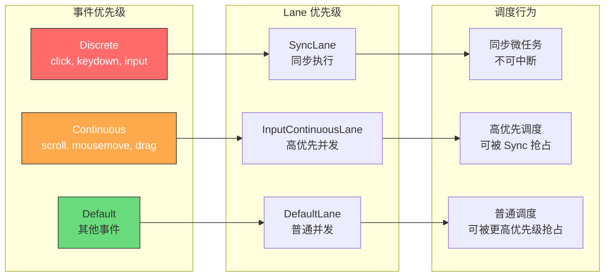
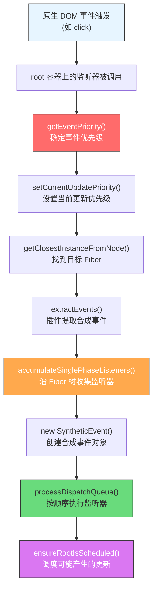
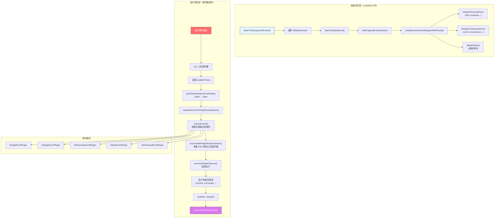

<div v-pre>

# 第14章 合成事件系统

> **本章要点**
>
> - 事件委托的演进：从 React 16 的 document 委托到 React 17+ 的 root 容器委托
> - SyntheticEvent 的设计哲学：跨浏览器一致性与性能的平衡
> - 事件插件系统（Event Plugin System）的架构与注册机制
> - 事件优先级模型：Discrete、Continuous、Default 三级优先级与 Lane 的映射
> - `listenToAllSupportedEvents`：React 如何在挂载时一次性注册所有事件监听
> - `dispatchEvent` 的完整链路：从原生事件到 React 回调的调度过程
> - React 19 中事件系统的简化：移除事件池化与遗留兼容逻辑

---

如果你在 React 组件上写过 `onClick`、`onChange`、`onScroll`，你可能从未思考过一个问题：**这些事件处理器实际上并没有绑定在你期望的那个 DOM 节点上。**

这不是一个 bug，而是 React 最精妙的设计之一——合成事件系统（Synthetic Event System）。React 没有在每个 `<button>` 上调用 `addEventListener`，而是在应用的根容器上统一监听所有事件，然后通过 Fiber 树自己完成事件的分发和冒泡。这个设计的影响是深远的：它让 React 可以控制事件的优先级、批量更新的时机，甚至可以在不同的渲染器（DOM、Native、Canvas）之间共享同一套事件逻辑。

要理解 React 的事件系统，你需要暂时忘记 DOM 事件模型——捕获、目标、冒泡这三个阶段仍然存在，但它们的实现方式被 React 彻底重写了。从 React 17 开始，事件委托的目标从 `document` 迁移到了 `root` 容器；从 React 18 开始，事件的触发与调度器深度耦合；到了 React 19，事件系统又经历了一轮显著的精简。让我们从头追溯这个演进过程。

## 14.1 事件委托：从 document 到 root 的演进

### 14.1.1 传统 DOM 事件绑定的问题

在没有框架的世界里，给 1000 个列表项绑定点击事件意味着调用 1000 次 `addEventListener`。每一个监听器都会消耗内存，每一次绑定和解绑都有性能成本。事件委托（Event Delegation）是解决这个问题的经典模式：

```typescript
// 传统事件委托
const list = document.getElementById('list');
list.addEventListener('click', (event) => {
  const target = event.target as HTMLElement;
  if (target.tagName === 'LI') {
    handleItemClick(target.dataset.id);
  }
});
```

React 从诞生之日起就内建了事件委托，但它把委托做到了极致——**不是委托到父容器，而是委托到整个应用的顶层**。

### 14.1.2 React 16 及之前：委托到 document

在 React 16 及之前的版本中，所有事件监听器都被注册在 `document` 上：

```typescript
// React 16 的事件注册（简化）
// packages/react-dom/src/events/ReactBrowserEventEmitter.js
function listenTo(
  registrationName: string,  // 如 'onClick'
  mountAt: Document | Element  // 始终是 document
) {
  const listeningSet = getListeningSetForElement(mountAt);
  const dependencies = registrationNameDependencies[registrationName];

  for (const dependency of dependencies) {
    if (!listeningSet.has(dependency)) {
      // 在 document 上注册原生事件监听
      trapEventForPluginEventSystem(dependency, mountAt);
      listeningSet.add(dependency);
    }
  }
}
```

这个设计在大多数场景下工作良好，但存在一个致命的问题：**多个 React 应用实例的事件会互相干扰**。

```tsx
// 微前端场景：两个 React 应用共存
// App A (React 16)
ReactDOM.render(<AppA />, document.getElementById('app-a'));

// App B (React 16)
ReactDOM.render(<AppB />, document.getElementById('app-b'));

// 问题：两个应用的事件都委托到了 document
// App A 中调用 e.stopPropagation() 会阻止 App B 的事件
```

### 14.1.3 React 17+：委托到 root 容器

React 17 做出了一个看似简单但影响深远的改变——将事件委托的目标从 `document` 改为 `root` 容器：

```typescript
// React 17+ 的事件注册
// packages/react-dom/src/events/DOMPluginEventSystem.js
function listenToAllSupportedEvents(rootContainerElement: EventTarget) {
  if (!(rootContainerElement as any)[listeningMarker]) {
    (rootContainerElement as any)[listeningMarker] = true;

    allNativeEvents.forEach((domEventName) => {
      // 大部分事件同时注册捕获和冒泡阶段
      if (!nonDelegatedEvents.has(domEventName)) {
        listenToNativeEvent(
          domEventName,
          false, // 冒泡阶段
          rootContainerElement
        );
      }
      listenToNativeEvent(
        domEventName,
        true, // 捕获阶段
        rootContainerElement
      );
    });
  }
}
```

注意 `allNativeEvents` 这个集合。它包含了 React 支持的所有原生事件名——`click`、`keydown`、`scroll`、`pointerdown` 等等。React 在应用挂载的那一刻，就在 root 容器上注册了**所有**事件的监听器，而不是按需注册。这是一个以空间换时间的设计决策：

```typescript
// packages/react-dom/src/events/EventRegistry.js
export const allNativeEvents: Set<DOMEventName> = new Set();

// 事件插件在初始化时注册它们关心的原生事件
export function registerTwoPhaseEvent(
  registrationName: string,    // 如 'onClick'
  dependencies: Array<DOMEventName>  // 如 ['click']
) {
  registerDirectEvent(registrationName, dependencies);
  registerDirectEvent(registrationName + 'Capture', dependencies);
}

export function registerDirectEvent(
  registrationName: string,
  dependencies: Array<DOMEventName>
) {
  // 将依赖的原生事件加入全局集合
  for (const dependency of dependencies) {
    allNativeEvents.add(dependency);
  }
}
```

> **深度洞察**：为什么 React 选择一次性注册所有事件，而不是在组件首次使用 `onClick` 时才注册 `click` 监听？原因是确定性（Determinism）。如果事件监听是惰性的，那么同一个原生事件在不同时机可能有不同的行为——取决于是否已有组件注册了对应的 React 事件。一次性注册消除了这种时序依赖，让事件系统的行为完全可预测。

### 14.1.4 listenToNativeEvent 的实现

`listenToNativeEvent` 是实际调用 `addEventListener` 的地方：

```typescript
// packages/react-dom/src/events/DOMPluginEventSystem.js
function listenToNativeEvent(
  domEventName: DOMEventName,
  isCapturePhaseListener: boolean,
  target: EventTarget
) {
  let eventSystemFlags = 0;
  if (isCapturePhaseListener) {
    eventSystemFlags |= IS_CAPTURE_PHASE;
  }

  addTrappedEventListener(
    target,
    domEventName,
    eventSystemFlags,
    isCapturePhaseListener
  );
}

function addTrappedEventListener(
  targetContainer: EventTarget,
  domEventName: DOMEventName,
  eventSystemFlags: EventSystemFlags,
  isCapturePhaseListener: boolean
) {
  // 根据事件类型创建不同优先级的监听器
  let listener = createEventListenerWrapperWithPriority(
    targetContainer,
    domEventName,
    eventSystemFlags
  );

  let unsubscribeListener;
  if (isCapturePhaseListener) {
    unsubscribeListener = addEventCaptureListener(
      targetContainer,
      domEventName,
      listener
    );
  } else {
    unsubscribeListener = addEventBubbleListener(
      targetContainer,
      domEventName,
      listener
    );
  }
}

// 最终落到原生 API
function addEventBubbleListener(
  target: EventTarget,
  eventType: string,
  listener: Function
): Function {
  target.addEventListener(eventType, listener, false);
  return listener;
}

function addEventCaptureListener(
  target: EventTarget,
  eventType: string,
  listener: Function
): Function {
  target.addEventListener(eventType, listener, true);
  return listener;
}
```



```mermaid
graph TD
    subgraph "React 16: 委托到 document"
        D16["document"] -->|"所有事件"| A16["App A root"]
        D16 -->|"所有事件"| B16["App B root"]
        A16 --> C16["<button onClick>"]
        B16 --> D16B["<input onChange>"]
    end

    subgraph "React 17+: 委托到 root"
        A17["App A root<br/>所有事件监听"] --> C17["<button onClick>"]
        B17["App B root<br/>所有事件监听"] --> D17["<input onChange>"]
    end

    style D16 fill:#ff6b6b,stroke:#333,color:#fff
    style A17 fill:#69db7c,stroke:#333
    style B17 fill:#69db7c,stroke:#333
```

**图 14-1：React 16 vs React 17+ 的事件委托目标**

## 14.2 SyntheticEvent：跨浏览器的事件抽象

### 14.2.1 为什么需要合成事件

浏览器之间的事件 API 差异曾经是前端开发者的噩梦。即使在现代浏览器中，一些微妙的差异仍然存在。React 的 `SyntheticEvent` 为此提供了一个统一的跨浏览器接口：

```typescript
// packages/react-dom/src/events/SyntheticEvent.js
function createSyntheticEvent(Interface: EventInterfaceType) {
  // SyntheticEvent 不再是一个类，而是一个普通对象
  // 在 React 17+ 中，每个事件都创建新的对象（不再池化）
  function SyntheticBaseEvent(
    reactName: string | null,
    reactEventType: string,
    targetInst: Fiber | null,
    nativeEvent: Event,
    nativeEventTarget: null | EventTarget
  ) {
    this._reactName = reactName;
    this._targetInst = targetInst;
    this.type = reactEventType;
    this.nativeEvent = nativeEvent;
    this.target = nativeEventTarget;
    this.currentTarget = null;

    // 将原生事件的属性复制到合成事件上
    for (const propName in Interface) {
      if (!Interface.hasOwnProperty(propName)) continue;
      const normalize = Interface[propName];
      if (normalize) {
        this[propName] = normalize(nativeEvent);
      } else {
        this[propName] = nativeEvent[propName];
      }
    }

    // 处理 isDefaultPrevented
    const defaultPrevented = nativeEvent.defaultPrevented != null
      ? nativeEvent.defaultPrevented
      : nativeEvent.returnValue === false;

    this.isDefaultPrevented = defaultPrevented
      ? functionThatReturnsTrue
      : functionThatReturnsFalse;

    this.isPropagationStopped = functionThatReturnsFalse;
    return this;
  }

  // 在原型上定义方法
  Object.assign(SyntheticBaseEvent.prototype, {
    preventDefault: function() {
      this.defaultPrevented = true;
      const event = this.nativeEvent;
      if (!event) return;

      if (event.preventDefault) {
        event.preventDefault();
      } else if (typeof event.returnValue !== 'unknown') {
        event.returnValue = false;
      }
      this.isDefaultPrevented = functionThatReturnsTrue;
    },

    stopPropagation: function() {
      const event = this.nativeEvent;
      if (!event) return;

      if (event.stopPropagation) {
        event.stopPropagation();
      } else if (typeof event.cancelBubble !== 'unknown') {
        event.cancelBubble = true;
      }
      this.isPropagationStopped = functionThatReturnsTrue;
    }
  });

  return SyntheticBaseEvent;
}
```

### 14.2.2 事件接口的层次结构

React 为不同类型的事件定义了不同的接口，每个接口指定了该类事件需要从原生事件中提取哪些属性：

```typescript
// 基础事件接口
const EventInterface = {
  eventPhase: 0,
  bubbles: 0,
  cancelable: 0,
  timeStamp: function(event: Event) {
    return event.timeStamp || Date.now();
  },
  defaultPrevented: 0,
  isTrusted: 0,
};

// UI 事件接口 —— 继承基础接口
const UIEventInterface = {
  ...EventInterface,
  view: 0,
  detail: 0,
};

// 鼠标事件接口 —— 继承 UI 事件接口
const MouseEventInterface = {
  ...UIEventInterface,
  screenX: 0,
  screenY: 0,
  clientX: 0,
  clientY: 0,
  pageX: 0,
  pageY: 0,
  ctrlKey: 0,
  shiftKey: 0,
  altKey: 0,
  metaKey: 0,
  button: 0,
  buttons: 0,
  // 标准化获取相关目标
  relatedTarget: function(event: MouseEvent) {
    return event.relatedTarget ||
      (event as any).fromElement === event.target
        ? (event as any).toElement
        : (event as any).fromElement;
  },
  // 标准化获取页面偏移
  movementX: function(event: MouseEvent) {
    if ('movementX' in event) return event.movementX;
    // 回退方案...
    return 0;
  },
  movementY: function(event: MouseEvent) {
    if ('movementY' in event) return event.movementY;
    return 0;
  },
};

// 键盘事件接口
const KeyboardEventInterface = {
  ...UIEventInterface,
  key: getEventKey,  // 标准化 key 属性
  code: 0,
  location: 0,
  ctrlKey: 0,
  shiftKey: 0,
  altKey: 0,
  metaKey: 0,
  repeat: 0,
  locale: 0,
  // 标准化 charCode/keyCode/which
  charCode: function(event: KeyboardEvent) {
    if (event.type === 'keypress') {
      return getEventCharCode(event);
    }
    return 0;
  },
  keyCode: function(event: KeyboardEvent) {
    if (event.type === 'keydown' || event.type === 'keyup') {
      return event.keyCode;
    }
    return 0;
  },
  which: function(event: KeyboardEvent) {
    if (event.type === 'keypress') {
      return getEventCharCode(event);
    }
    if (event.type === 'keydown' || event.type === 'keyup') {
      return event.keyCode;
    }
    return 0;
  },
};

// 创建具体的合成事件构造函数
export const SyntheticMouseEvent = createSyntheticEvent(MouseEventInterface);
export const SyntheticKeyboardEvent = createSyntheticEvent(KeyboardEventInterface);
export const SyntheticFocusEvent = createSyntheticEvent(FocusEventInterface);
export const SyntheticTouchEvent = createSyntheticEvent(TouchEventInterface);
// ... 更多事件类型
```

> **深度洞察**：接口中的值 `0` 是什么含义？当值为 `0`（falsy）时，表示直接从原生事件对象上取同名属性。当值为函数时，表示需要通过该函数对原生属性进行标准化处理。这是一种非常紧凑的声明式 API 设计——用最少的代码表达了"直接取值"和"需要转换"两种语义。

### 14.2.3 事件池化的废弃（React 17）

在 React 16 及之前，合成事件对象会被池化复用。事件回调执行完毕后，合成事件的所有属性会被置为 null，放回对象池等待下次使用：

```typescript
// React 16 中的事件池化（已废弃）
function handleClick(e: React.MouseEvent) {
  console.log(e.type); // 'click' ✅

  setTimeout(() => {
    console.log(e.type); // null ❌ 事件已被回收！
  }, 100);
}

// 必须手动调用 persist() 来保留事件
function handleClickFixed(e: React.MouseEvent) {
  e.persist(); // 从池中取出，不再回收
  setTimeout(() => {
    console.log(e.type); // 'click' ✅
  }, 100);
}
```

React 17 废弃了事件池化。原因并不复杂：在现代 JavaScript 引擎中，对象创建和垃圾回收的成本已经非常低了。池化带来的微小性能收益远不及它造成的开发者困惑：

```typescript
// React 17+ 不再池化，合成事件在整个生命周期内都可用
function handleClick(e: React.MouseEvent) {
  console.log(e.type); // 'click' ✅

  setTimeout(() => {
    console.log(e.type); // 'click' ✅ 不再有问题
  }, 100);
}
```

## 14.3 事件插件系统

### 14.3.1 插件架构概览

React 的事件系统采用插件式架构，每个插件负责处理一类相关的事件。这种设计让事件系统具有极强的可扩展性：

```typescript
// packages/react-dom/src/events/DOMPluginEventSystem.js

// 核心事件插件
import * as SimpleEventPlugin from './plugins/SimpleEventPlugin';
import * as EnterLeaveEventPlugin from './plugins/EnterLeaveEventPlugin';
import * as ChangeEventPlugin from './plugins/ChangeEventPlugin';
import * as SelectEventPlugin from './plugins/SelectEventPlugin';
import * as BeforeInputEventPlugin from './plugins/BeforeInputEventPlugin';

// 按顺序注册插件
// 注册顺序决定了插件的执行优先级
SimpleEventPlugin.registerEvents();
EnterLeaveEventPlugin.registerEvents();
ChangeEventPlugin.registerEvents();
SelectEventPlugin.registerEvents();
BeforeInputEventPlugin.registerEvents();
```

每个插件实现两个核心方法：`registerEvents`（注册阶段）和 `extractEvents`（分发阶段）。

### 14.3.2 SimpleEventPlugin：最核心的插件

`SimpleEventPlugin` 处理大多数"简单"事件——即原生事件名和 React 事件名存在直接映射关系的事件：

```typescript
// packages/react-dom/src/events/plugins/SimpleEventPlugin.js
function registerSimpleEvents() {
  // 事件映射表：[原生事件名, React 事件名]
  const simpleEventPluginEvents = [
    'abort', 'Abort',
    'canPlay', 'CanPlay',
    'cancel', 'Cancel',
    'click', 'Click',
    'close', 'Close',
    'copy', 'Copy',
    'cut', 'Cut',
    'dblclick', 'DoubleClick',
    'drag', 'Drag',
    'dragEnd', 'DragEnd',
    'drop', 'Drop',
    'focus', 'Focus',
    'input', 'Input',
    'keyDown', 'KeyDown',
    'keyPress', 'KeyPress',
    'keyUp', 'KeyUp',
    'load', 'Load',
    'mouseDown', 'MouseDown',
    'mouseUp', 'MouseUp',
    'paste', 'Paste',
    'pause', 'Pause',
    'play', 'Play',
    'scroll', 'Scroll',
    'submit', 'Submit',
    'touchStart', 'TouchStart',
    'touchEnd', 'TouchEnd',
    // ... 更多事件
  ];

  for (let i = 0; i < simpleEventPluginEvents.length; i += 2) {
    const domEventName = simpleEventPluginEvents[i] as DOMEventName;
    const reactName = 'on' + simpleEventPluginEvents[i + 1];

    // 建立 原生事件 → React 事件名 的映射
    topLevelEventsToReactNames.set(domEventName, reactName);

    // 注册为两阶段事件（捕获 + 冒泡）
    registerTwoPhaseEvent(reactName, [domEventName]);
  }
}
```

`extractEvents` 是插件在事件分发时被调用的方法：

```typescript
function extractEvents(
  dispatchQueue: DispatchQueue,
  domEventName: DOMEventName,
  targetInst: null | Fiber,
  nativeEvent: AnyNativeEvent,
  nativeEventTarget: null | EventTarget,
  eventSystemFlags: EventSystemFlags,
  targetContainer: EventTarget
) {
  const reactName = topLevelEventsToReactNames.get(domEventName);
  if (reactName === undefined) return;

  // 根据原生事件类型选择对应的合成事件构造函数
  let SyntheticEventCtor = SyntheticEvent;
  switch (domEventName) {
    case 'keydown':
    case 'keypress':
    case 'keyup':
      SyntheticEventCtor = SyntheticKeyboardEvent;
      break;
    case 'click':
    case 'dblclick':
    case 'mousedown':
    case 'mouseup':
    case 'mousemove':
      SyntheticEventCtor = SyntheticMouseEvent;
      break;
    case 'drag':
    case 'dragend':
    case 'dragenter':
    case 'dragexit':
    case 'dragleave':
    case 'dragover':
    case 'dragstart':
    case 'drop':
      SyntheticEventCtor = SyntheticDragEvent;
      break;
    case 'touchcancel':
    case 'touchend':
    case 'touchmove':
    case 'touchstart':
      SyntheticEventCtor = SyntheticTouchEvent;
      break;
    case 'scroll':
    case 'scrollend':
      SyntheticEventCtor = SyntheticUIEvent;
      break;
    // ... 更多事件类型
  }

  // 从 Fiber 树中收集所有需要触发的监听器
  const listeners = accumulateSinglePhaseListeners(
    targetInst,
    reactName,
    nativeEvent.type,
    isCapturePhaseListener,
    nativeEvent,
    inCapturePhase
  );

  if (listeners.length > 0) {
    // 创建合成事件并加入分发队列
    const event = new SyntheticEventCtor(
      reactName,
      domEventName,
      targetInst,
      nativeEvent,
      nativeEventTarget
    );
    dispatchQueue.push({ event, listeners });
  }
}
```

### 14.3.3 ChangeEventPlugin：复杂事件的典范

`onChange` 是 React 中最"不简单"的事件之一。在原生 DOM 中，`<input>` 的 `change` 事件只在失去焦点时触发，而 React 的 `onChange` 会在每次输入时触发——它实际上映射到了多个原生事件：

```typescript
// packages/react-dom/src/events/plugins/ChangeEventPlugin.js
function registerEvents() {
  // onChange 依赖多个原生事件
  registerTwoPhaseEvent('onChange', [
    'change',
    'click',
    'focusin',
    'focusout',
    'input',
    'keydown',
    'keyup',
    'selectionchange',
  ]);
}

function extractEvents(
  dispatchQueue: DispatchQueue,
  domEventName: DOMEventName,
  targetInst: null | Fiber,
  nativeEvent: AnyNativeEvent,
  nativeEventTarget: null | EventTarget
) {
  const targetNode = targetInst
    ? getNodeFromInstance(targetInst)
    : (window as any);

  let getTargetInstFunc: Function | undefined;
  let handleEventFunc: Function | undefined;

  if (isTextInputElement(targetNode)) {
    // 文本输入框：使用 input 事件作为主要触发源
    getTargetInstFunc = getTargetInstForInputOrChangeEvent;
  } else if (isCheckboxOrRadio(targetNode)) {
    // 复选框和单选按钮：使用 click 事件
    getTargetInstFunc = getTargetInstForClickEvent;
  } else if (isSelectElement(targetNode)) {
    // 下拉选择框：使用 change 事件
    getTargetInstFunc = getTargetInstForChangeEvent;
  }

  if (getTargetInstFunc) {
    const inst = getTargetInstFunc(domEventName, targetInst);
    if (inst) {
      // 检测值是否真的发生了变化
      // 避免重复触发（多个原生事件可能对应同一次逻辑变更）
      createAndAccumulateChangeEvent(
        dispatchQueue, inst, nativeEvent, nativeEventTarget
      );
    }
  }
}
```

> **深度洞察**：React 的 `onChange` 为什么要模拟成"每次输入都触发"而不是保持原生 `change` 的语义？这是一个深思熟虑的设计决策。React 的核心理念是 UI = f(state)，而"受控组件"（Controlled Component）模式要求 state 始终与 UI 同步。如果 `onChange` 只在失焦时触发，那么在用户输入的过程中，state 和 UI 就会处于不一致的状态。这违背了 React 的数据流模型。所以 React 选择重新定义 `onChange` 的语义，让它在语义上更接近 `onInput`，但名字保留了开发者更熟悉的 `onChange`。

## 14.4 事件优先级与调度器的协作

### 14.4.1 三级事件优先级

React 将所有事件分为三个优先级等级，这些优先级直接决定了事件触发的更新以何种方式被调度：

```typescript
// packages/react-dom/src/events/ReactDOMEventListener.js
export function getEventPriority(domEventName: DOMEventName): EventPriority {
  switch (domEventName) {
    // ========== Discrete 离散事件（最高优先级）==========
    // 用户的"点按"操作，要求即时响应
    case 'click':
    case 'keydown':
    case 'keyup':
    case 'mousedown':
    case 'mouseup':
    case 'pointerdown':
    case 'pointerup':
    case 'focusin':
    case 'focusout':
    case 'input':
    case 'change':
    case 'textInput':
    case 'compositionstart':
    case 'compositionend':
    case 'compositionupdate':
    case 'beforeinput':
    case 'copy':
    case 'cut':
    case 'paste':
    case 'submit':
      return DiscreteEventPriority;  // SyncLane

    // ========== Continuous 连续事件（次高优先级）==========
    // 用户的"拖拽/滚动"操作，高频触发但可以合并
    case 'drag':
    case 'dragenter':
    case 'dragexit':
    case 'dragleave':
    case 'dragover':
    case 'mousemove':
    case 'mouseout':
    case 'mouseover':
    case 'pointermove':
    case 'pointerout':
    case 'pointerover':
    case 'scroll':
    case 'toggle':
    case 'touchmove':
    case 'wheel':
      return ContinuousEventPriority;  // InputContinuousLane

    // ========== Default 默认事件（普通优先级）==========
    default:
      return DefaultEventPriority;  // DefaultLane
  }
}
```

这三级优先级与 React 的 Lane 模型有直接的映射关系：

```typescript
// packages/react-reconciler/src/ReactEventPriorities.js
export const DiscreteEventPriority: EventPriority = SyncLane;
export const ContinuousEventPriority: EventPriority = InputContinuousLane;
export const DefaultEventPriority: EventPriority = DefaultLane;
export const IdleEventPriority: EventPriority = IdleLane;
```



**图 14-2：事件优先级 → Lane 优先级 → 调度行为的映射链**

### 14.4.2 createEventListenerWrapperWithPriority

事件优先级是如何在监听器层面生效的？答案在 `createEventListenerWrapperWithPriority` 中：

```typescript
// packages/react-dom/src/events/ReactDOMEventListener.js
export function createEventListenerWrapperWithPriority(
  targetContainer: EventTarget,
  domEventName: DOMEventName,
  eventSystemFlags: EventSystemFlags
): Function {
  const eventPriority = getEventPriority(domEventName);
  let listenerWrapper;

  switch (eventPriority) {
    case DiscreteEventPriority:
      listenerWrapper = dispatchDiscreteEvent;
      break;
    case ContinuousEventPriority:
      listenerWrapper = dispatchContinuousEvent;
      break;
    case DefaultEventPriority:
    default:
      listenerWrapper = dispatchEvent;
      break;
  }

  return listenerWrapper.bind(
    null,
    domEventName,
    eventSystemFlags,
    targetContainer
  );
}
```

不同优先级的包装器会在分发事件前设置当前的更新优先级：

```typescript
function dispatchDiscreteEvent(
  domEventName: DOMEventName,
  eventSystemFlags: EventSystemFlags,
  container: EventTarget,
  nativeEvent: AnyNativeEvent
) {
  // 保存之前的优先级
  const previousPriority = getCurrentUpdatePriority();
  try {
    // 将当前更新优先级设置为 Discrete（最高）
    setCurrentUpdatePriority(DiscreteEventPriority);
    // 分发事件——此时事件回调中触发的所有 setState
    // 都会被标记为 SyncLane
    dispatchEvent(domEventName, eventSystemFlags, container, nativeEvent);
  } finally {
    // 恢复之前的优先级
    setCurrentUpdatePriority(previousPriority);
  }
}

function dispatchContinuousEvent(
  domEventName: DOMEventName,
  eventSystemFlags: EventSystemFlags,
  container: EventTarget,
  nativeEvent: AnyNativeEvent
) {
  const previousPriority = getCurrentUpdatePriority();
  try {
    // 设置为 Continuous 优先级
    setCurrentUpdatePriority(ContinuousEventPriority);
    dispatchEvent(domEventName, eventSystemFlags, container, nativeEvent);
  } finally {
    setCurrentUpdatePriority(previousPriority);
  }
}
```

这就是 React 事件系统与调度器协作的核心机制：**事件的类型决定了它的优先级，优先级决定了它触发的更新如何被调度。** 用户点击按钮触发的 `setState` 会以 SyncLane 同步执行，而滚动事件中的 `setState` 会以 InputContinuousLane 进入并发调度。

### 14.4.3 批量更新的秘密

在 React 18 之前，批量更新（Batching）的范围仅限于 React 事件处理器内部。而在 React 18+ 中，所有更新都默认批量处理——这个变化也与事件系统的重构密切相关：

```tsx
// React 17: 只有 React 事件回调中的更新是批量的
function handleClick() {
  setCount(c => c + 1);  // 不会立即渲染
  setFlag(f => !f);       // 不会立即渲染
  // 回调结束后，批量执行一次渲染
}

// React 17: setTimeout 中的更新不是批量的
setTimeout(() => {
  setCount(c => c + 1);  // 立即渲染！
  setFlag(f => !f);       // 又渲染一次！
}, 100);

// React 18+: 所有更新都是批量的
setTimeout(() => {
  setCount(c => c + 1);  // 不会立即渲染
  setFlag(f => !f);       // 不会立即渲染
  // 微任务中批量执行一次渲染
}, 100);
```

这个变化的技术基础来自于事件分发流程中的 `flushSync` 和微任务调度：

```typescript
// React 18+ 的分发逻辑
function dispatchEvent(
  domEventName: DOMEventName,
  eventSystemFlags: EventSystemFlags,
  targetContainer: EventTarget,
  nativeEvent: AnyNativeEvent
) {
  // 1. 找到原生事件对应的 Fiber 节点
  const nativeEventTarget = getEventTarget(nativeEvent);
  let targetInst = getClosestInstanceFromNode(nativeEventTarget);

  // 2. 通过插件系统提取合成事件
  dispatchEventForPluginEventSystem(
    domEventName,
    eventSystemFlags,
    nativeEvent,
    targetInst,
    targetContainer
  );

  // 在 React 18+ 中，不再在这里同步刷新
  // 而是让 ensureRootIsScheduled 在微任务中统一调度
}
```

## 14.5 dispatchEvent 的完整链路

### 14.5.1 从原生事件到 Fiber 节点

当一个原生 DOM 事件触发时，React 需要找到它对应的 Fiber 节点。这个过程是通过 DOM 节点上的内部属性完成的：

```typescript
// packages/react-dom/src/client/ReactDOMComponentTree.js
const randomKey = Math.random().toString(36).slice(2);
const internalInstanceKey = '__reactFiber$' + randomKey;
const internalPropsKey = '__reactProps$' + randomKey;

// 在创建 DOM 节点时，React 会将 Fiber 实例存储在 DOM 上
export function precacheFiberNode(
  hostInst: Fiber,
  node: Instance
): void {
  (node as any)[internalInstanceKey] = hostInst;
}

// 在更新 props 时，React 会将最新的 props 存储在 DOM 上
export function updateFiberProps(
  node: Instance,
  props: Props
): void {
  (node as any)[internalPropsKey] = props;
}

// 通过 DOM 节点反查 Fiber 实例
export function getClosestInstanceFromNode(targetNode: Node): null | Fiber {
  let targetInst = (targetNode as any)[internalInstanceKey];
  if (targetInst) {
    return targetInst;
  }

  // 如果当前节点没有 Fiber，向上查找父节点
  let parentNode = targetNode.parentNode;
  while (parentNode) {
    targetInst = (parentNode as any)[internalInstanceKey];
    if (targetInst) {
      return targetInst;
    }
    parentNode = parentNode.parentNode;
  }

  return null;
}
```

> **深度洞察**：为什么 React 使用随机后缀（`__reactFiber$xxxxx`）作为属性名？这不仅是为了避免与其他库冲突，更重要的是防止同一页面上的多个 React 实例互相读取对方的 Fiber 节点。每个 React 实例有自己的随机后缀，确保了命名空间的隔离。

### 14.5.2 沿 Fiber 树收集监听器

找到目标 Fiber 后，React 需要沿着 Fiber 树向上遍历，收集路径上所有相关的事件监听器——这就是 React 自己实现的"冒泡"过程：

```typescript
// packages/react-dom/src/events/DOMPluginEventSystem.js
export function accumulateSinglePhaseListeners(
  targetFiber: Fiber | null,
  reactName: string | null,
  nativeEventType: string,
  isCapturePhase: boolean,
  accumulateTargetOnly: boolean,
  nativeEvent: AnyNativeEvent
): Array<DispatchListener> {
  const captureName = reactName !== null ? reactName + 'Capture' : null;
  const reactEventName = isCapturePhase ? captureName : reactName;

  const listeners: Array<DispatchListener> = [];

  let instance = targetFiber;
  let lastHostComponent = null;

  // 从目标 Fiber 向上遍历到根节点
  while (instance !== null) {
    const { stateNode, tag } = instance;

    // 只处理 HostComponent（原生 DOM 节点）
    if (tag === HostComponent && stateNode !== null) {
      lastHostComponent = stateNode;

      if (reactEventName !== null) {
        // 从 Fiber 的 props 中获取事件处理器
        const listener = getListener(instance, reactEventName);
        if (listener != null) {
          listeners.push(
            createDispatchListener(instance, listener, lastHostComponent)
          );
        }
      }
    }

    // 如果只收集目标节点的监听器，到这里就停止
    if (accumulateTargetOnly) break;

    // 继续向上遍历
    instance = instance.return;
  }

  return listeners;
}

// 从 Fiber 的 props 中取出事件处理器
function getListener(inst: Fiber, registrationName: string): Function | null {
  const stateNode = inst.stateNode;
  if (stateNode === null) return null;

  const props = getFiberCurrentPropsFromNode(stateNode);
  if (props === null) return null;

  const listener = props[registrationName];
  return listener;
}
```

### 14.5.3 processDispatchQueue：执行分发

收集完所有监听器后，React 按照正确的顺序执行它们：

```typescript
// packages/react-dom/src/events/DOMPluginEventSystem.js
export function processDispatchQueue(
  dispatchQueue: DispatchQueue,
  eventSystemFlags: EventSystemFlags
) {
  const inCapturePhase = (eventSystemFlags & IS_CAPTURE_PHASE) !== 0;

  for (let i = 0; i < dispatchQueue.length; i++) {
    const { event, listeners } = dispatchQueue[i];
    processDispatchQueueItemsInOrder(event, listeners, inCapturePhase);
  }
}

function processDispatchQueueItemsInOrder(
  event: ReactSyntheticEvent,
  dispatchListeners: Array<DispatchListener>,
  inCapturePhase: boolean
) {
  if (inCapturePhase) {
    // 捕获阶段：从外向内执行（反向遍历）
    for (let i = dispatchListeners.length - 1; i >= 0; i--) {
      const { instance, currentTarget, listener } = dispatchListeners[i];
      // 检查是否已停止传播
      if (event.isPropagationStopped()) break;
      executeDispatch(event, listener, currentTarget);
    }
  } else {
    // 冒泡阶段：从内向外执行（正向遍历）
    for (let i = 0; i < dispatchListeners.length; i++) {
      const { instance, currentTarget, listener } = dispatchListeners[i];
      if (event.isPropagationStopped()) break;
      executeDispatch(event, listener, currentTarget);
    }
  }
}

function executeDispatch(
  event: ReactSyntheticEvent,
  listener: Function,
  currentTarget: EventTarget
) {
  // 设置 currentTarget（会随着冒泡过程变化）
  event.currentTarget = currentTarget;
  try {
    listener(event);
  } catch (error) {
    // 错误不会中断事件分发
    // 而是被收集后统一通过 reportGlobalError 抛出
    reportGlobalError(error);
  }
  event.currentTarget = null;
}
```

整个分发链路可以用下图总结：



**图 14-3：从原生事件触发到 React 调度更新的完整链路**

## 14.6 React 19 中事件系统的简化

### 14.6.1 移除的遗留逻辑

React 19 对事件系统进行了一轮显著的精简，移除了多项历史遗留的兼容逻辑：

**1. 完全移除事件池化的兼容代码**

虽然 React 17 已经在运行时停止了池化行为，但 `persist()` 方法和相关的类型定义仍然保留着。React 19 将它们彻底移除：

```typescript
// React 17-18: persist() 仍然存在（但是空操作）
interface SyntheticEvent<T> {
  persist(): void;  // 已废弃但保留
  // ...
}

// React 19: persist() 被移除
// 如果你的代码还在调用 e.persist()，TypeScript 编译器会直接报错
```

**2. 简化 onChange 的实现路径**

React 19 利用现代浏览器对 `input` 事件的一致支持，简化了 `ChangeEventPlugin` 的内部逻辑。不再需要为 IE 和旧版浏览器保留 `propertychange` 等 fallback 路径：

```typescript
// React 18: ChangeEventPlugin 中的 IE fallback
function getInstIfValueChanged(targetInst: Fiber) {
  const targetNode = getNodeFromInstance(targetInst);
  if (inputValueTracking.updateValueIfChanged(targetNode)) {
    return targetInst;
  }
  // IE 下还需要额外的 propertychange 监听...
}

// React 19: 简化后的实现
function getInstIfValueChanged(targetInst: Fiber) {
  const targetNode = getNodeFromInstance(targetInst);
  if (inputValueTracking.updateValueIfChanged(targetNode)) {
    return targetInst;
  }
  // 不再有 IE 特殊路径
}
```

**3. 移除 onScroll 的冒泡行为**

原生 `scroll` 事件是不冒泡的，但 React 18 及之前版本中 `onScroll` 会冒泡——这是一个长期存在的不一致行为。React 19 修复了这个问题：

```tsx
function App() {
  return (
    // React 18: 子元素滚动时 onScroll 会触发（冒泡行为）
    // React 19: 只有 div 自身滚动时 onScroll 才触发
    <div onScroll={() => console.log('scrolled')}>
      <div style={{ overflow: 'auto', height: 200 }}>
        <div style={{ height: 1000 }}>
          Tall content
        </div>
      </div>
    </div>
  );
}
```

**4. 移除事件特定的 polyfill**

React 19 不再为 `focusin`/`focusout` 等事件提供基于 `focus`/`blur` 的 polyfill。所有现代浏览器都已原生支持这些事件：

```typescript
// React 18: 仍保留 focusin polyfill
const nonDelegatedEvents = new Set([
  'cancel', 'close', 'invalid', 'load', 'scroll', 'toggle',
  // focus/blur 不冒泡，需要使用 focusin/focusout
  // 但旧浏览器可能不支持...
]);

// React 19: 直接依赖原生 focusin/focusout
// 不再维护 polyfill 逻辑
```

### 14.6.2 nonDelegatedEvents 的精细化

某些事件不适合委托到 root 容器——它们要么不冒泡，要么在冒泡时会丢失关键信息。React 维护了一个不委托事件的集合：

```typescript
export const nonDelegatedEvents: Set<DOMEventName> = new Set([
  'cancel',
  'close',
  'invalid',
  'load',
  'scroll',
  'scrollend',
  'toggle',
  // 注意：这些事件仍然注册在 root 上的捕获阶段
  // 只是不注册冒泡阶段的监听器
]);
```

对于 `nonDelegatedEvents` 中的事件，React 只在 root 上注册捕获阶段的监听器。回顾 `listenToAllSupportedEvents` 的代码：

```typescript
allNativeEvents.forEach((domEventName) => {
  if (!nonDelegatedEvents.has(domEventName)) {
    // 普通事件：注册冒泡 + 捕获
    listenToNativeEvent(domEventName, false, rootContainerElement);
  }
  // 所有事件都注册捕获阶段
  listenToNativeEvent(domEventName, true, rootContainerElement);
});
```

## 14.7 与原生事件的交互与冲突处理

### 14.7.1 合成事件与原生事件的执行顺序

理解 React 合成事件与原生事件的执行顺序，是避免事件冲突的关键：

```tsx
function EventOrderDemo() {
  const buttonRef = useRef<HTMLButtonElement>(null);

  useEffect(() => {
    const button = buttonRef.current!;

    // 原生事件监听（直接绑定到元素）
    button.addEventListener('click', () => {
      console.log('1. 原生事件 - 元素上');
    });

    // 原生事件监听（绑定到 document）
    document.addEventListener('click', () => {
      console.log('4. 原生事件 - document 上');
    });

    return () => {
      // 清理...
    };
  }, []);

  return (
    <button
      ref={buttonRef}
      onClick={() => console.log('3. React 合成事件 - 冒泡')}
      onClickCapture={() => console.log('2. React 合成事件 - 捕获')}
    >
      点击我
    </button>
  );
}

// 点击按钮后的输出顺序：
// 1. 原生事件 - 元素上
// 2. React 合成事件 - 捕获
// 3. React 合成事件 - 冒泡
// 4. 原生事件 - document 上
```

这个执行顺序的原因在于事件传播机制：

1. 原生事件从 `document` 开始捕获，到达 `button` 元素，触发元素上直接绑定的监听器
2. 原生事件冒泡到 `root` 容器（`<div id="root">`），触发 React 在 root 上注册的监听器
3. React 的监听器内部模拟捕获和冒泡，按 Fiber 树结构依次执行 `onClickCapture` 和 `onClick`
4. 原生事件继续冒泡到 `document`，触发 document 上的监听器

### 14.7.2 stopPropagation 的陷阱

React 合成事件的 `stopPropagation` 和原生事件的 `stopPropagation` 效果不同——这是最常见的事件冲突来源：

```tsx
function StopPropagationDemo() {
  return (
    <div onClick={() => console.log('父元素 React 事件')}>
      <button
        onClick={(e) => {
          e.stopPropagation();
          // 这只阻止了 React 合成事件的"冒泡"
          // 即父元素的 onClick 不会触发
          // 但原生事件的冒泡并未被阻止！
          console.log('子元素 React 事件');
        }}
      >
        点击
      </button>
    </div>
  );
}
```

如果你需要同时阻止原生事件的传播，必须使用 `nativeEvent`：

```tsx
function StopNativePropagation() {
  return (
    <button
      onClick={(e) => {
        e.stopPropagation();           // 阻止 React 合成事件冒泡
        e.nativeEvent.stopImmediatePropagation(); // 阻止原生事件冒泡
      }}
    >
      完全阻止冒泡
    </button>
  );
}
```

### 14.7.3 常见冲突场景与解决方案

**场景 1：第三方库的事件监听与 React 冲突**

```tsx
function DropdownWithThirdParty() {
  const [open, setOpen] = useState(false);
  const dropdownRef = useRef<HTMLDivElement>(null);

  useEffect(() => {
    // 第三方库通常在 document 上监听点击来关闭弹窗
    const handleDocumentClick = (e: MouseEvent) => {
      if (dropdownRef.current && !dropdownRef.current.contains(e.target as Node)) {
        setOpen(false);
      }
    };

    document.addEventListener('click', handleDocumentClick);
    return () => document.removeEventListener('click', handleDocumentClick);
  }, []);

  return (
    <div ref={dropdownRef}>
      <button onClick={() => setOpen(o => !o)}>Toggle</button>
      {open && (
        <div
          onClick={(e) => {
            // 防止点击菜单内容时关闭
            // 注意：这里的 stopPropagation 无法阻止
            // document 上的原生监听器（因为 React 事件在 root 处理）
            // 正确做法是依赖 contains() 检查
            e.stopPropagation();
          }}
        >
          <ul>
            <li>选项 1</li>
            <li>选项 2</li>
          </ul>
        </div>
      )}
    </div>
  );
}
```

**场景 2：Portal 中的事件冒泡**

Portal 是另一个让人困惑的事件场景。React 的合成事件按照 **Fiber 树**（而非 DOM 树）冒泡：

```tsx
function ModalWithPortal() {
  const [count, setCount] = useState(0);

  return (
    // React 合成事件会从 Portal 冒泡到这里
    // 即使 Portal 的 DOM 在 document.body 下
    <div onClick={() => setCount(c => c + 1)}>
      <p>点击次数: {count}</p>
      {createPortal(
        <button>
          点我（在 Portal 中，但 React 事件会冒泡到父组件）
        </button>,
        document.body
      )}
    </div>
  );
  // 点击 Portal 中的按钮，count 会增加！
  // 因为 React 沿 Fiber 树冒泡，而非 DOM 树
}
```

这个行为是有意为之。React 团队认为，组件的事件传播应该遵循组件树的结构，而不是 DOM 的物理位置。Portal 只是改变了 DOM 的渲染位置，不应该改变组件的逻辑关系。

> **深度洞察**：Portal 事件冒泡的设计体现了 React 的一个核心原则：**虚拟 DOM 树的语义优先于物理 DOM 树的结构**。在 React 的世界观中，组件树才是"真实"的，DOM 只是一种渲染输出。这与 React Native 能以同一套组件模型渲染到完全不同的原生 UI 是同一个思想的延伸。

### 14.7.4 Passive 事件与滚动性能

React 在注册某些高频事件时使用了 `{ passive: true }` 选项，这是与浏览器滚动性能密切相关的优化：

```typescript
// 对于 touchstart、touchmove、wheel 等事件
// React 注册为 passive 监听器以提升滚动性能
function addEventBubbleListenerWithPassiveFlag(
  target: EventTarget,
  eventType: string,
  listener: Function,
  passive: boolean
): Function {
  target.addEventListener(eventType, listener, {
    capture: false,
    passive,  // passive: true 意味着不会调用 preventDefault
  });
  return listener;
}
```

当监听器被标记为 `passive: true` 时，浏览器知道该监听器不会调用 `preventDefault()`，因此可以立即开始滚动而无需等待 JavaScript 执行完毕。这意味着在 React 中直接通过 `onTouchMove` 调用 `e.preventDefault()` 来阻止滚动**不会生效**：

```tsx
// ❌ 这不会阻止滚动（React 注册为 passive）
function NoScrollByReact() {
  return (
    <div
      onTouchMove={(e) => {
        e.preventDefault(); // 无效！浏览器会忽略
      }}
    >
      内容
    </div>
  );
}

// ✅ 使用原生事件监听并设置 { passive: false }
function NoScrollByNative() {
  const ref = useRef<HTMLDivElement>(null);

  useEffect(() => {
    const el = ref.current!;
    const handler = (e: TouchEvent) => {
      e.preventDefault(); // 有效
    };
    el.addEventListener('touchmove', handler, { passive: false });
    return () => el.removeEventListener('touchmove', handler);
  }, []);

  return <div ref={ref}>内容</div>;
}
```

## 14.8 事件系统的架构全景

让我们用一张完整的架构图来总结 React 事件系统的各个组成部分及其关系：



**图 14-4：React 事件系统的完整架构**

## 14.9 本章小结

React 的合成事件系统是一个精妙的工程作品。它在浏览器原生事件模型之上构建了一层完整的抽象，实现了以下目标：

1. **跨浏览器一致性**：通过 SyntheticEvent 和标准化接口，消除了浏览器差异
2. **性能优化**：事件委托到 root 容器，避免了大量的 addEventListener 调用
3. **优先级控制**：事件类型与 Lane 优先级的映射，让不同交互获得不同的调度待遇
4. **多实例隔离**：从 document 迁移到 root 容器，解决了微前端场景的事件冲突
5. **渲染器无关**：事件的收集和分发基于 Fiber 树而非 DOM 树，支持 Portal 等抽象
6. **渐进式简化**：从 React 17 到 19，不断移除历史包袱，让事件系统更轻量

理解事件系统的核心在于理解这条链路：**原生事件 → root 监听器 → 优先级设定 → Fiber 节点定位 → 插件提取 → 监听器收集 → 分发执行 → 调度更新**。每个环节都与 React 的其他核心系统（Fiber 树、调度器、Lane 模型）紧密协作。

> **课程关联**：本章内容对应慕课网课程《React 源码深度解析》第 12-13 节。课程中通过 Chrome DevTools 实际演示了事件分发的调用栈，建议配合观看：[https://coding.imooc.com/class/650.html](https://coding.imooc.com/class/650.html)

---

### 思考题

1. **React 为什么选择在 root 容器上一次性注册所有事件，而不是在组件首次使用时按需注册？** 按需注册在某些场景下可以减少初始化开销，但会引入什么问题？试从事件系统的确定性和可预测性角度分析。

2. **考虑以下场景：一个 `onScroll` 事件处理器中调用了 `setState`，同时一个 `onClick` 处理器中也调用了 `setState`。** 如果两个事件在同一帧内触发，React 如何决定这两个更新的执行顺序？它们会被批量处理吗？

3. **Portal 中的事件按 Fiber 树冒泡而非 DOM 树冒泡。** 这个设计在大多数场景下是合理的，但你能构造一个它会导致反直觉行为的场景吗？如果 React 改为按 DOM 树冒泡，又会破坏哪些现有的使用模式？

4. **React 19 移除了事件池化、onScroll 冒泡、IE 兼容等遗留逻辑。** 假设你正在维护一个大型 React 应用从 18 升级到 19，列出你需要检查的与事件系统相关的潜在 breaking change，并说明如何编写自动化检测脚本来识别受影响的代码。

</div>
