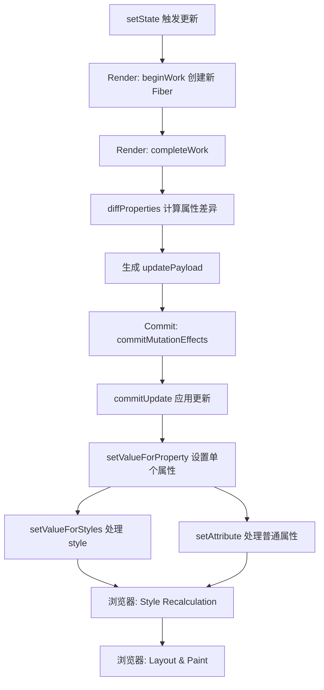

<div v-pre>

# 第15章 DOM 更新与渲染管线

> **本章要点**
>
> - 属性设置的完整链路：className、style、dangerouslySetInnerHTML 的源码级处理机制
> - diffProperties 算法：React 如何高效计算 DOM 属性的最小更新集
> - 受控组件与非受控组件的 DOM 同步机制：value tracking 的内核实现
> - Portal 的实现原理：createPortal 如何突破 DOM 层级而保持事件冒泡
> - Hydration 不匹配的检测与恢复：hydrateRoot 的容错策略
> - setValueForProperty 的属性分类与特殊处理逻辑

---

在前面的章节中，我们深入分析了 Reconciliation 如何生成变更计划，Commit 阶段如何将计划执行为 DOM 操作。但有一个关键环节被我们有意略过了：**当 React 决定"更新这个 DOM 节点的属性"时，具体发生了什么？**

这个问题看似简单——不就是 `element.className = 'new-class'` 吗？但当你深入源码，会发现 React 在这一层做了大量的工作：它需要区分 30 多种不同类型的 DOM 属性，处理浏览器的兼容性差异，维护受控组件的值同步，处理 `dangerouslySetInnerHTML` 的安全语义，甚至要在 SSR Hydration 时检测服务端与客户端的不一致。这些看似琐碎的细节，构成了 React DOM 渲染管线中最复杂也最容易被忽视的一环。

更有趣的是，Portal 和 Hydration 这两个特性从根本上挑战了"DOM 树结构等于组件树结构"这一直觉假设。Portal 让组件可以将子节点渲染到 DOM 树的任意位置，而 Hydration 则要求 React 能够"认领"一棵已经存在的 DOM 树并赋予它交互能力。理解这些机制，是真正掌握 React DOM 层的关键。

## 15.1 属性设置：从 props 到 DOM

### 15.1.1 diffProperties：计算最小更新集

当一个 DOM 节点需要更新时，React 不会将所有 props 重新设置一遍。它会调用 `diffProperties` 来计算新旧 props 之间的差异，生成一个"更新负载"（updatePayload）。这个负载是一个扁平数组，格式为 `[propKey1, propValue1, propKey2, propValue2, ...]`。

```typescript
// react-dom-bindings/src/client/ReactDOMComponent.ts
function diffProperties(
  domElement: Element,
  tag: string,
  lastRawProps: Record<string, any>,
  nextRawProps: Record<string, any>,
): null | Array<mixed> {
  let updatePayload: null | Array<mixed> = null;

  let lastProps: Record<string, any>;
  let nextProps: Record<string, any>;

  // 第一步：根据元素类型进行 props 规范化
  // 例如 <input> 和 <textarea> 需要特殊处理 defaultValue
  switch (tag) {
    case 'input':
      lastProps = ReactDOMInputGetHostProps(domElement, lastRawProps);
      nextProps = ReactDOMInputGetHostProps(domElement, nextRawProps);
      break;
    case 'select':
      lastProps = ReactDOMSelectGetHostProps(domElement, lastRawProps);
      nextProps = ReactDOMSelectGetHostProps(domElement, nextRawProps);
      break;
    case 'textarea':
      lastProps = ReactDOMTextareaGetHostProps(domElement, lastRawProps);
      nextProps = ReactDOMTextareaGetHostProps(domElement, nextRawProps);
      break;
    default:
      lastProps = lastRawProps;
      nextProps = nextRawProps;
      break;
  }

  // 第二步：遍历旧 props，找出被删除的属性
  for (const propKey in lastProps) {
    if (
      nextProps.hasOwnProperty(propKey) ||
      !lastProps.hasOwnProperty(propKey) ||
      lastProps[propKey] == null
    ) {
      continue;
    }

    // 这个属性在新 props 中不存在了，需要删除
    if (propKey === STYLE) {
      // 清除所有 style 属性
      const lastStyle = lastProps[propKey];
      for (const styleName in lastStyle) {
        if (lastStyle.hasOwnProperty(styleName)) {
          if (!styleUpdates) styleUpdates = {};
          styleUpdates[styleName] = '';
        }
      }
    } else {
      // 将该属性标记为需要删除（值为 null）
      (updatePayload = updatePayload || []).push(propKey, null);
    }
  }

  // 第三步：遍历新 props，找出新增或变更的属性
  for (const propKey in nextProps) {
    const nextProp = nextProps[propKey];
    const lastProp = lastProps != null ? lastProps[propKey] : undefined;

    if (
      !nextProps.hasOwnProperty(propKey) ||
      nextProp === lastProp ||
      (nextProp == null && lastProp == null)
    ) {
      continue;
    }

    if (propKey === STYLE) {
      // style 属性需要逐一对比每个 CSS 属性
      if (lastProp) {
        for (const styleName in lastProp) {
          if (
            lastProp.hasOwnProperty(styleName) &&
            (!nextProp || !nextProp.hasOwnProperty(styleName))
          ) {
            if (!styleUpdates) styleUpdates = {};
            styleUpdates[styleName] = '';
          }
        }
        for (const styleName in nextProp) {
          if (
            nextProp.hasOwnProperty(styleName) &&
            lastProp[styleName] !== nextProp[styleName]
          ) {
            if (!styleUpdates) styleUpdates = {};
            styleUpdates[styleName] = nextProp[styleName];
          }
        }
      } else {
        styleUpdates = nextProp;
      }
    } else if (propKey === DANGEROUSLY_SET_INNER_HTML) {
      const nextHtml = nextProp ? nextProp.__html : undefined;
      const lastHtml = lastProp ? lastProp.__html : undefined;
      if (nextHtml != null && lastHtml !== nextHtml) {
        (updatePayload = updatePayload || []).push(propKey, nextHtml);
      }
    } else if (propKey === CHILDREN) {
      // 文本子节点的快速路径
      if (typeof nextProp === 'string' || typeof nextProp === 'number') {
        (updatePayload = updatePayload || []).push(propKey, '' + nextProp);
      }
    } else {
      (updatePayload = updatePayload || []).push(propKey, nextProp);
    }
  }

  // 最后处理 style 的聚合更新
  if (styleUpdates) {
    (updatePayload = updatePayload || []).push(STYLE, styleUpdates);
  }

  return updatePayload;
}
```

这段代码的设计有一个值得深思的地方：**为什么 `updatePayload` 使用扁平数组而不是对象？** 原因是性能。数组的创建和遍历比对象更快，而且这个数据结构只有短暂的生命周期——从 completeWork 创建到 commitWork 消费，之后就会被垃圾回收。React 用两个相邻元素表示一个键值对（`[key, value, key, value, ...]`），虽然不够直观，但在热路径上这种微优化是值得的。

> **深度洞察**：`diffProperties` 的设计体现了 React 的一个重要原则——**延迟计算**。属性差异的计算发生在 Render 阶段的 `completeWork` 中，而实际的 DOM 操作则延迟到 Commit 阶段。这种分离使得 Render 阶段可以被安全地中断和重新开始，因为它没有产生任何不可逆的副作用。

### 15.1.2 setValueForProperty：属性分类与设置

当 Commit 阶段应用 `updatePayload` 时，最终会调用 `setValueForProperty` 来设置单个属性。这个函数是 React DOM 属性系统的核心，它需要处理各种不同类型的属性：

```typescript
// react-dom-bindings/src/client/DOMPropertyOperations.ts
function setValueForProperty(
  node: Element,
  propertyInfo: PropertyInfo | null,
  name: string,
  value: mixed,
) {
  if (propertyInfo !== null) {
    // 已知属性：通过预定义的 PropertyInfo 来决定设置方式
    const { type, attributeName, attributeNamespace } = propertyInfo;

    if (value === null) {
      // 删除属性
      node.removeAttribute(attributeName);
      return;
    }

    switch (type) {
      case BOOLEAN:
        // 布尔属性：如 disabled, checked, readOnly
        // 值为 true 时设置空字符串，false 时移除
        if (value) {
          node.setAttribute(attributeName, '');
        } else {
          node.removeAttribute(attributeName);
        }
        break;

      case OVERLOADED_BOOLEAN:
        // 重载布尔属性：如 capture, download
        // 值为 true 时设置空字符串，字符串时设置该值
        if (value === true) {
          node.setAttribute(attributeName, '');
        } else if (value === false) {
          node.removeAttribute(attributeName);
        } else {
          node.setAttribute(attributeName, (value: any));
        }
        break;

      case NUMERIC:
        // 数值属性：如 rowSpan, colSpan
        // 需要过滤 NaN
        if (!isNaN(value)) {
          node.setAttribute(attributeName, (value: any));
        } else {
          node.removeAttribute(attributeName);
        }
        break;

      case POSITIVE_NUMERIC:
        // 正数属性：如 size, span
        if (!isNaN(value) && (value: any) >= 1) {
          node.setAttribute(attributeName, (value: any));
        } else {
          node.removeAttribute(attributeName);
        }
        break;

      default:
        // STRING 类型
        if (attributeNamespace) {
          node.setAttributeNS(attributeNamespace, attributeName, (value: any));
        } else {
          node.setAttribute(attributeName, (value: any));
        }
    }
  } else if (isAttributeNameSafe(name)) {
    // 未知但安全的属性名：直接使用 setAttribute
    if (value === null) {
      node.removeAttribute(name);
    } else {
      node.setAttribute(name, (value: any));
    }
  }
}
```

注意这里的属性类型分类系统。React 为每个已知的 HTML/SVG 属性维护了一个 `PropertyInfo` 对象，记录了该属性的类型（布尔、数值、字符串等）、对应的 DOM attribute 名称、以及是否需要命名空间（SVG 属性）。这个预计算的映射表避免了运行时的重复判断。

### 15.1.3 className 的处理

`className` 是 React 中最常用的 DOM 属性之一。它的处理看似简单，但背后有一个有趣的历史原因：

```typescript
// 为什么 React 用 className 而不是 class？
// 因为在早期 JavaScript 中，class 是保留字：
// element.class = 'foo'; // 语法错误（在旧版浏览器中）
// element.className = 'foo'; // ✅ 正确

// React 的处理方式：
function setValueForStyles(node: HTMLElement, styles: Record<string, any>) {
  const style = node.style;
  for (const styleName in styles) {
    if (!styles.hasOwnProperty(styleName)) continue;

    const value = styles[styleName];

    if (styleName.indexOf('--') === 0) {
      // CSS 自定义属性（CSS Variables）
      style.setProperty(styleName, value);
    } else {
      const isCustomProperty = styleName.indexOf('--') === 0;
      if (value == null || typeof value === 'boolean' || value === '') {
        // 清除该样式
        if (isCustomProperty) {
          style.setProperty(styleName, '');
        } else {
          style[styleName] = '';
        }
      } else if (
        typeof value === 'number' &&
        value !== 0 &&
        !isUnitlessNumber(styleName)
      ) {
        // 数值类型的样式属性：自动添加 'px' 单位
        // 但有些属性是无单位的（如 opacity, zIndex, flexGrow）
        style[styleName] = value + 'px';
      } else {
        style[styleName] = ('' + value).trim();
      }
    }
  }
}
```

`isUnitlessNumber` 的设计值得关注。React 维护了一个无单位 CSS 属性的白名单——如 `opacity`、`zIndex`、`flexGrow`、`lineHeight` 等。对于不在白名单中的数值属性，React 会自动追加 `px` 单位。这个便利设计减少了大量样板代码，但也偶尔会让不了解这个规则的开发者感到困惑。

### 15.1.4 dangerouslySetInnerHTML 的安全语义

`dangerouslySetInnerHTML` 是 React 中最"吓人"的 API，名字里带着 `dangerously` 就是为了让开发者三思而后行：

```typescript
// 使用方式
<div dangerouslySetInnerHTML={{ __html: '<p>来自服务端的 HTML</p>' }} />

// 为什么需要 { __html: ... } 这层包装？
// 答案：这是一个"速度减速带"（speed bump）
// 防止开发者意外地将用户输入直接传入：

// ❌ 如果 API 是 innerHTML={userInput}
// 开发者可能不假思索地这样写，导致 XSS

// ✅ 现在的 API 要求 dangerouslySetInnerHTML={{ __html: userInput }}
// 多层嵌套迫使你停下来思考：这真的安全吗？
```

在 Commit 阶段，`dangerouslySetInnerHTML` 的实际处理非常直接：

```typescript
function setInnerHTML(node: Element, html: string): void {
  // 处理特殊标签：<table>, <tr>, <td> 等不能直接设置 innerHTML
  // 的元素需要通过创建临时容器来绕过浏览器限制
  if (node.namespaceURI === SVG_NAMESPACE) {
    // SVG 元素需要特殊处理命名空间
    const svgNode = node as SVGElement;
    svgNode.innerHTML = html;
    return;
  }

  // 常规 HTML 元素
  node.innerHTML = html;
}
```

但真正的复杂性在于 `dangerouslySetInnerHTML` 与子节点的互斥关系。React 在 Render 阶段就会检查：如果一个节点同时设置了 `dangerouslySetInnerHTML` 和 `children`，会抛出错误。这是因为 `innerHTML` 会清除所有子节点，与 React 管理的子节点树产生冲突。

```typescript
function validateDOMNesting(child: string, parent: string) {
  // React 还会验证 HTML 嵌套规则
  // 例如 <p> 里不能嵌套 <div>
  // 这些校验在开发模式下运行，帮助开发者发现潜在问题
}
```

> **深度洞察**：`dangerouslySetInnerHTML` 的命名策略是一个教科书级的 API 设计案例。React 团队选择让"危险的操作看起来就像是危险的"，而不是提供一个简洁但容易误用的 `innerHTML` prop。这种设计哲学贯穿了 React 的方方面面——让正确的事情变得容易，让错误的事情变得困难（但仍然可能）。

## 15.2 受控组件与非受控组件的 DOM 同步机制

### 15.2.1 受控组件的核心矛盾

受控组件是 React 表单模型的基石，但它引入了一个根本性的矛盾：**浏览器的原生表单元素有自己的状态管理机制，而 React 想要完全控制这个状态**。

```tsx
function ControlledInput() {
  const [value, setValue] = useState('');

  return (
    <input
      value={value}
      onChange={(e) => setValue(e.target.value)}
    />
  );
}
```

看似简单的代码背后隐藏着一个精妙的同步循环：

1. 用户在输入框中按下键盘
2. 浏览器原生地更新了 `input.value`（DOM 状态变了）
3. React 的事件系统捕获了 `onChange`，调用 `setValue`
4. React 触发重渲染，计算新的 props（`value` 属性已更新）
5. Commit 阶段，React 将 `value` 设置回 DOM 节点

问题出在步骤 2 和步骤 5 之间：**如果 React 的状态更新被阻止了（比如 `onChange` 处理器没有调用 `setValue`），React 需要能够将 DOM 的值"回滚"到之前的状态**。这就是 value tracking 机制存在的原因。

### 15.2.2 value tracking 的内核实现

React 为每个受控的 `<input>`、`<textarea>` 和 `<select>` 维护了一个内部的值追踪器（value tracker）。这个追踪器记录了 React 上一次设置到 DOM 上的值，用于在 `onChange` 触发时判断值是否真正发生了变化。

```typescript
// react-dom-bindings/src/client/inputValueTracking.ts

// 每个受控表单元素都有一个 tracker，存储在内部属性上
type ValueTracker = {
  getValue(): string;
  setValue(value: string): void;
  stopTracking(): void;
};

function track(node: HTMLInputElement | HTMLTextAreaElement | HTMLSelectElement) {
  if (getTracker(node)) {
    return; // 已经在追踪了
  }

  // 关键技巧：React 重写了元素的 value 属性描述符
  const valueField = Object.getOwnPropertyDescriptor(
    node.constructor.prototype,
    'value',
  );

  let currentValue = '' + node.value;

  // 如果原生的 value 属性已经被其他库覆盖了，不做追踪
  if (
    node.hasOwnProperty('value') ||
    typeof valueField === 'undefined' ||
    typeof valueField.get !== 'function' ||
    typeof valueField.set !== 'function'
  ) {
    return;
  }

  const { get, set } = valueField;

  // 替换 value 的 getter/setter
  Object.defineProperty(node, 'value', {
    configurable: true,
    get() {
      return get.call(this);
    },
    set(newValue) {
      // 记录 React 设置的值
      currentValue = '' + newValue;
      set.call(this, newValue);
    },
  });

  const tracker: ValueTracker = {
    getValue() {
      return currentValue;
    },
    setValue(value: string) {
      currentValue = '' + value;
    },
    stopTracking() {
      // 恢复原生的 value 属性
      delete node.value;
    },
  };

  // 将 tracker 存储在节点的内部属性上
  node._valueTracker = tracker;
}

function getValueFromNode(node: HTMLInputElement): string {
  let value = '';
  if (node) {
    if (isCheckable(node)) {
      value = node.checked ? 'true' : 'false';
    } else {
      value = node.value;
    }
  }
  return value;
}

function trackValueOnNode(node: any): ValueTracker | null {
  return node._valueTracker;
}

// 判断值是否真的变了
function updateValueIfChanged(node: HTMLInputElement): boolean {
  if (!node) return false;

  const tracker = trackValueOnNode(node);
  if (!tracker) return true;

  const lastValue = tracker.getValue();
  const nextValue = getValueFromNode(node);

  if (nextValue !== lastValue) {
    tracker.setValue(nextValue);
    return true; // 值确实变了
  }
  return false; // 值没变，不需要触发 onChange
}
```

这段代码中最精妙的技巧是**通过 `Object.defineProperty` 劫持 `value` 的 setter**。当 React 在 Commit 阶段设置 `input.value = 'new value'` 时，这个自定义 setter 会同时更新 `currentValue`。之后当浏览器的原生事件触发时，React 可以通过比较 `tracker.getValue()`（React 上次设置的值）和 `node.value`（DOM 当前的值）来判断用户是否真的修改了输入。

### 15.2.3 受控 input 的 Commit 流程

当一个受控 `<input>` 需要更新时，React 在 Commit 阶段会执行以下流程：

```typescript
// react-dom-bindings/src/client/ReactDOMInput.ts
function updateInput(
  element: HTMLInputElement,
  value: ?string,
  defaultValue: ?string,
  lastDefaultValue: ?string,
  checked: ?boolean,
  defaultChecked: ?boolean,
  type: ?string,
  name: ?string,
) {
  // 1. 先更新 type（如果变了的话）
  // 重要：type 必须在 value 之前设置，因为
  // 从 text 切换到 number 类型时，如果先设置 value
  // 浏览器可能会拒绝无效的数值
  if (type != null) {
    element.type = type;
  }

  if (value != null) {
    if (element.value !== '' + value) {
      // 只有当值确实不同时才更新
      // 避免不必要的 DOM 操作（这会重置光标位置）
      element.value = '' + value;
    }
  } else if (type === 'submit' || type === 'reset') {
    // 对于 submit/reset 类型，移除 value 属性
    // 以显示浏览器默认文本
    element.removeAttribute('value');
    return;
  }

  // 2. 处理 defaultValue
  if (value != null) {
    element.defaultValue = '' + value;
  } else if (defaultValue != null) {
    element.defaultValue = '' + defaultValue;
  } else if (lastDefaultValue != null) {
    element.removeAttribute('value');
  }

  // 3. 处理 checked 和 defaultChecked
  if (checked != null) {
    element.checked = checked;
  } else if (defaultChecked != null) {
    element.defaultChecked = defaultChecked;
  }
}
```

这里有一个容易被忽视但至关重要的细节：`if (element.value !== '' + value)` 这个条件判断。React 只在值确实不同时才设置 `element.value`。原因是：**每次设置 `input.value` 都会重置光标位置到末尾**。如果用户正在输入框中间编辑文字，不必要的 `value` 赋值会将光标跳到最后，造成极差的用户体验。

### 15.2.4 非受控组件与 defaultValue

非受控组件是 React 对表单元素的"放手"模式——React 只在初始渲染时设置值，之后由 DOM 自行管理：

```tsx
function UncontrolledInput() {
  const inputRef = useRef<HTMLInputElement>(null);

  return (
    <form onSubmit={() => {
      // 提交时才读取值
      console.log(inputRef.current?.value);
    }}>
      <input defaultValue="初始值" ref={inputRef} />
    </form>
  );
}
```

在源码层面，`defaultValue` 被映射为 HTML 的 `value` attribute（注意区分 attribute 和 property）。React 在首次渲染时设置 `element.defaultValue`，之后即使重渲染也不会覆盖用户的输入：

```typescript
// 非受控模式的关键区别：
// 受控模式：每次 Commit 都强制设置 element.value
// 非受控模式：只设置 element.defaultValue，不触碰 element.value

// 这意味着在非受控模式下，DOM 是"真相之源"（source of truth）
// 而在受控模式下，React state 才是真相之源
```

> **深度洞察**：受控与非受控组件的本质区别在于**数据的所有权**。受控模式下，React 拥有表单值的所有权，DOM 只是一个"哑终端"，只负责显示 React 告诉它的值。非受控模式下，DOM 拥有所有权，React 退居为一个初始化器。这与数据库领域的主从复制（master-slave replication）有异曲同工之处——受控模式中 React 是主库，DOM 是从库；非受控模式中 DOM 是主库，React 只提供初始数据。

### 15.2.5 select 元素的特殊处理

`<select>` 元素的受控处理比 `<input>` 更加复杂，因为它涉及到子元素 `<option>` 的联动：

```typescript
// react-dom-bindings/src/client/ReactDOMSelect.ts
function updateSelect(
  element: HTMLSelectElement,
  value: ?string | ?Array<string>,
  defaultValue: ?string | ?Array<string>,
  multiple: ?boolean,
) {
  const options = element.options;

  if (value != null) {
    // 受控模式：遍历所有 <option>，设置 selected 属性
    const selectedValues = multiple
      ? new Set(value as string[])
      : new Set(['' + value]);

    for (let i = 0; i < options.length; i++) {
      const selected = selectedValues.has(options[i].value);
      if (options[i].selected !== selected) {
        options[i].selected = selected;
      }
    }
  } else if (defaultValue != null) {
    // 非受控模式下的初始值设置
    const selectedValues = multiple
      ? new Set(defaultValue as string[])
      : new Set(['' + defaultValue]);

    for (let i = 0; i < options.length; i++) {
      const selected = selectedValues.has(options[i].value);
      if (options[i].defaultSelected !== selected) {
        options[i].defaultSelected = selected;
      }
    }
  }
}
```

`<select>` 的受控实现需要遍历所有 `<option>` 子元素来同步 `selected` 状态。这是一个 O(n) 的操作，在选项非常多的下拉框中可能成为性能瓶颈。但在实际应用中，超大的 `<select>` 通常会被替换为自定义的搜索下拉组件，所以这个开销在绝大多数场景下是可以忽略的。

## 15.3 Portal 的实现原理

### 15.3.1 Portal 解决了什么问题

在典型的 React 应用中，组件树的结构直接映射到 DOM 树的结构。但有些 UI 场景打破了这个假设——模态框（Modal）、提示工具（Tooltip）、下拉菜单（Dropdown）等组件，在逻辑上属于某个父组件，但在 DOM 层面上需要渲染到完全不同的位置（通常是 `document.body` 的直接子节点），以避免 `overflow: hidden` 和 `z-index` 层叠上下文的限制。

```tsx
// Portal 的使用方式
function Modal({ children }: { children: React.ReactNode }) {
  return createPortal(
    <div className="modal-overlay">
      <div className="modal-content">
        {children}
      </div>
    </div>,
    document.body // 渲染到 body 而不是当前组件所在的 DOM 位置
  );
}

function App() {
  const [showModal, setShowModal] = useState(false);

  return (
    <div className="app" style={{ overflow: 'hidden' }}>
      <button onClick={() => setShowModal(true)}>打开模态框</button>
      {showModal && (
        <Modal>
          {/* 虽然这个按钮渲染在 body 下面，
              但 onClick 事件仍然会冒泡到 <div className="app"> */}
          <button onClick={() => setShowModal(false)}>关闭</button>
        </Modal>
      )}
    </div>
  );
}
```

### 15.3.2 createPortal 的实现

`createPortal` 函数本身非常简单——它只是创建了一个特殊类型的 React 元素：

```typescript
// react-dom/src/ReactDOM.ts
function createPortal(
  children: ReactNodeList,
  container: Element | DocumentFragment,
  key?: string,
): ReactPortal {
  // 参数校验
  if (!isValidContainer(container)) {
    throw new Error('Target container is not a DOM element.');
  }

  return createPortalImpl(children, container, null, key ?? null);
}

// react-reconciler/src/ReactPortal.ts
function createPortalImpl(
  children: ReactNodeList,
  containerInfo: Container,
  implementation: any,
  key: ?string,
): ReactPortal {
  return {
    // 标识这是一个 Portal
    $$typeof: REACT_PORTAL_TYPE,
    key: key == null ? null : '' + key,
    children,
    containerInfo,
    implementation,
  };
}
```

Portal 的"魔力"发生在 Reconciler 处理这个特殊元素的时候。当 `beginWork` 遇到一个 Portal 类型的 Fiber 时，它会创建一个特殊的 Fiber 节点，这个节点的 `stateNode` 指向 Portal 的目标容器：

```typescript
// react-reconciler/src/ReactFiberBeginWork.ts
function updatePortalComponent(
  current: Fiber | null,
  workInProgress: Fiber,
  renderLanes: Lanes,
) {
  pushHostContainer(workInProgress, workInProgress.stateNode.containerInfo);
  const nextChildren = workInProgress.pendingProps;

  if (current === null) {
    // 首次渲染：Portal 的子节点需要渲染到指定容器中
    // 但在 Fiber 树中，它们仍然是当前节点的子节点
    reconcileChildFibers(workInProgress, null, nextChildren, renderLanes);
  } else {
    reconcileChildFibers(
      workInProgress,
      current.child,
      nextChildren,
      renderLanes,
    );
  }
  return workInProgress.child;
}
```

### 15.3.3 Portal 的 DOM 挂载

Portal 真正特殊的地方在于 Commit 阶段。当 React 需要将 Portal 的子节点插入 DOM 时，它不会像普通节点那样寻找 Fiber 父节点对应的 DOM 元素，而是直接使用 Portal 指定的容器：

```typescript
// react-reconciler/src/ReactFiberCommitWork.ts
function getHostParentFiber(fiber: Fiber): Fiber {
  let parent = fiber.return;
  while (parent !== null) {
    if (isHostParent(parent)) {
      return parent;
    }
    parent = parent.return;
  }
  throw new Error('Expected to find a host parent.');
}

function commitPlacement(finishedWork: Fiber): void {
  const parentFiber = getHostParentFiber(finishedWork);

  switch (parentFiber.tag) {
    case HostComponent: {
      const parent = parentFiber.stateNode;
      // 普通 DOM 节点：插入到父节点中
      if (isContainer) {
        insertOrAppendPlacementNodeIntoContainer(finishedWork, before, parent);
      } else {
        insertOrAppendPlacementNode(finishedWork, before, parent);
      }
      break;
    }
    case HostRoot:
    case HostPortal: {
      // Portal 节点：插入到 Portal 的目标容器中
      const parent = parentFiber.stateNode.containerInfo;
      insertOrAppendPlacementNodeIntoContainer(finishedWork, before, parent);
      break;
    }
  }
}
```

关键在于 `HostPortal` 分支——当 `commitPlacement` 发现父级 Fiber 是一个 Portal 时，它从 `stateNode.containerInfo` 获取目标容器，而不是使用 Portal 的 Fiber 父节点对应的 DOM 元素。这就是 Portal 实现"DOM 位置与 Fiber 树位置分离"的核心机制。

### 15.3.4 Portal 的事件冒泡保持

Portal 最反直觉的特性是：**虽然 DOM 节点被移动到了另一个位置，但 React 的事件仍然按照 Fiber 树（组件树）的结构冒泡**。

```tsx
function Parent() {
  return (
    // 这个 onClick 可以捕获到 Portal 内部的点击事件
    // 即使在 DOM 层面上 Portal 的内容根本不是它的子节点
    <div onClick={() => console.log('Parent clicked!')}>
      {createPortal(
        <button>Click me</button>,
        document.body
      )}
    </div>
  );
}
```

这是如何实现的？答案在于 React 的合成事件系统。React 的事件委托在 `root` 容器上监听所有事件，当事件触发时，React 不是沿着 DOM 树冒泡，而是**沿着 Fiber 树冒泡**：

```typescript
// 事件分发的简化逻辑
function traverseTwoPhase(inst: Fiber, fn: Function, arg: any) {
  const path: Fiber[] = [];

  // 收集从当前 Fiber 到根节点的路径
  // 注意：这是沿着 Fiber 树的 return 指针遍历的
  // 不是沿着 DOM 树的 parentNode
  let current: Fiber | null = inst;
  while (current !== null) {
    path.push(current);
    current = current.return; // Fiber 的父节点，不是 DOM 的父节点
  }

  // 捕获阶段：从根到目标
  for (let i = path.length - 1; i >= 0; i--) {
    fn(path[i], 'captured', arg);
  }

  // 冒泡阶段：从目标到根
  for (let i = 0; i < path.length; i++) {
    fn(path[i], 'bubbled', arg);
  }
}
```

由于 Portal 在 Fiber 树中仍然是其声明位置的子节点（`return` 指针指向声明处的父 Fiber），事件冒泡会沿着 Fiber 树一路向上，经过 Portal 声明处的父组件。这意味着在组件层面，Portal 的行为就好像它的内容仍然在原始位置一样。

> **深度洞察**：Portal 的设计体现了 React 的一个核心哲学——**组件树的语义优先于 DOM 树的物理结构**。在 React 看来，一个组件渲染的内容在"概念上"属于该组件，无论它在 DOM 中被放置在哪里。事件冒泡应该反映这种概念上的从属关系，而不是物理上的嵌套关系。这就像一家公司的远程员工——虽然人在另一个城市，但汇报关系仍然遵循公司的组织架构。

### 15.3.5 Portal 的卸载处理

Portal 在卸载时需要从其目标容器（而非 Fiber 父节点对应的 DOM 容器）中移除子节点：

```typescript
function commitDeletionEffectsOnFiber(
  finishedRoot: FiberRoot,
  nearestMountedAncestor: Fiber,
  deletedFiber: Fiber,
) {
  switch (deletedFiber.tag) {
    case HostPortal: {
      // Portal 的子节点需要从 Portal 容器中移除
      // 而不是从 Fiber 父节点的 DOM 容器中
      let child = deletedFiber.child;
      while (child !== null) {
        // 递归移除子节点
        commitDeletionEffectsOnFiber(
          finishedRoot,
          nearestMountedAncestor,
          child,
        );
        child = child.sibling;
      }
      break;
    }
    // ... 其他类型
  }
}
```

## 15.4 Hydration 不匹配的检测与恢复

### 15.4.1 Hydration 的基本概念

Hydration（水合）是 SSR（服务端渲染）应用中的关键步骤。服务端将 React 组件渲染为 HTML 字符串发送给客户端，客户端收到后需要"激活"这些静态的 HTML——为它们绑定事件处理器，建立 Fiber 树，使其成为一个可交互的 React 应用。

```typescript
// 客户端入口：使用 hydrateRoot 而不是 createRoot
import { hydrateRoot } from 'react-dom/client';

// 服务端已经渲染了 HTML，现在客户端"认领"它
const root = hydrateRoot(
  document.getElementById('root')!,
  <App />
);
```

与 `createRoot` 不同，`hydrateRoot` 不会从零创建 DOM 树。它会复用服务端生成的 DOM 节点，只需要做两件事：

1. **构建 Fiber 树**，将每个 Fiber 节点关联到已有的 DOM 节点上
2. **附加事件处理器**和其他客户端特有的逻辑

### 15.4.2 Hydration 的匹配过程

在 Hydration 期间，React 需要逐个将 Fiber 节点与已有的 DOM 节点进行匹配。这个匹配过程发生在 `beginWork` 和 `completeWork` 中：

```typescript
// react-reconciler/src/ReactFiberHydrationContext.ts

// 当前正在尝试匹配的 DOM 节点
let nextHydratableInstance: HydratableInstance | null = null;
// 当前的 Hydration 父节点
let hydrationParentFiber: Fiber | null = null;
// 是否处于 Hydration 模式
let isHydrating: boolean = false;

function tryToClaimNextHydratableInstance(fiber: Fiber): void {
  if (!isHydrating) return;

  let nextInstance = nextHydratableInstance;

  if (nextInstance === null) {
    // 没有更多的 DOM 节点可以匹配了
    // 这意味着客户端渲染了服务端没有的内容
    // 标记需要插入
    insertNonHydratedInstance(hydrationParentFiber!, fiber);
    isHydrating = false;
    hydrationParentFiber = fiber;
    return;
  }

  // 尝试匹配当前 Fiber 与 DOM 节点
  if (!tryHydrateInstance(fiber, nextInstance)) {
    // 类型不匹配，尝试下一个 DOM 兄弟节点
    nextInstance = getNextHydratableSibling(nextInstance);

    if (nextInstance === null || !tryHydrateInstance(fiber, nextInstance)) {
      // 依然无法匹配，放弃 Hydration
      insertNonHydratedInstance(hydrationParentFiber!, fiber);
      isHydrating = false;
      hydrationParentFiber = fiber;
      return;
    }

    // 匹配成功，但跳过了一些 DOM 节点
    // 这些被跳过的节点将被标记为删除
    deleteHydratableInstance(hydrationParentFiber!, nextInstance);
  }

  // 匹配成功：将 Fiber 关联到 DOM 节点
  hydrationParentFiber = fiber;
  nextHydratableInstance = getFirstHydratableChild(nextInstance);
}

function tryHydrateInstance(
  fiber: Fiber,
  nextInstance: HydratableInstance,
): boolean {
  const type = fiber.type;
  const props = fiber.pendingProps;

  // 检查 DOM 节点类型是否匹配
  // 例如 fiber.type === 'div' 需要匹配 <div> 元素
  const instance = canHydrateInstance(nextInstance, type, props);

  if (instance !== null) {
    fiber.stateNode = instance; // 关联 Fiber 和 DOM
    return true;
  }
  return false;
}
```

### 15.4.3 不匹配的检测

Hydration 不匹配发生在服务端渲染的 HTML 与客户端 React 生成的虚拟 DOM 不一致时。React 需要检测这些不匹配，并做出相应的处理。

常见的不匹配场景包括：

```tsx
// 场景 1：条件渲染依赖了客户端状态
function TimeDisplay() {
  // 服务端和客户端的 Date.now() 必然不同
  return <span>{Date.now()}</span>;
  // ⚠️ Hydration mismatch: text content
}

// 场景 2：使用了 typeof window 判断
function ClientOnly() {
  if (typeof window === 'undefined') {
    return <span>Loading...</span>; // 服务端
  }
  return <span>Ready!</span>; // 客户端
  // ⚠️ Hydration mismatch: text content
}

// 场景 3：HTML 自动修正
function BadNesting() {
  return (
    <p>
      <div>嵌套的 div</div>
    </p>
  );
  // 浏览器会自动修正 <p> 中不合法的 <div>
  // 导致 DOM 结构与 React 预期不同
}
```

React 在 Hydration 期间执行属性级别的比对来检测不匹配：

```typescript
// react-dom-bindings/src/client/ReactDOMComponent.ts
function diffHydratedProperties(
  domElement: Element,
  tag: string,
  props: Record<string, any>,
  isConcurrentMode: boolean,
  shouldWarnDev: boolean,
): null | Array<mixed> {
  let updatePayload: null | Array<mixed> = null;

  // 遍历 React props，与 DOM 实际属性对比
  for (const propKey in props) {
    const propValue = props[propKey];

    if (propKey === CHILDREN) {
      // 文本内容比对
      if (typeof propValue === 'string' || typeof propValue === 'number') {
        const serverText = domElement.textContent;
        if (('' + propValue) !== serverText) {
          // 文本不匹配
          if (__DEV__ && shouldWarnDev) {
            warnForTextDifference(serverText, '' + propValue);
          }
          if (!isConcurrentMode) {
            // Legacy 模式：静默修复
            (updatePayload = updatePayload || []).push(propKey, propValue);
          }
        }
      }
    } else if (propKey === STYLE) {
      // 样式比对
      const serverStyle = domElement.getAttribute('style');
      const expectedStyle = createDangerousStringForStyles(propValue);
      if (serverStyle !== expectedStyle) {
        if (__DEV__ && shouldWarnDev) {
          warnForPropDifference('style', serverStyle, expectedStyle);
        }
      }
    } else if (propKey === DANGEROUSLY_SET_INNER_HTML) {
      const serverHTML = domElement.innerHTML;
      const expectedHTML = propValue?.__html;
      if (expectedHTML != null && serverHTML !== expectedHTML) {
        if (__DEV__ && shouldWarnDev) {
          warnForPropDifference(propKey, serverHTML, expectedHTML);
        }
      }
    } else if (
      propKey !== SUPPRESS_CONTENT_EDITABLE_WARNING &&
      propKey !== SUPPRESS_HYDRATION_WARNING
    ) {
      // 通用属性比对
      const serverValue = domElement.getAttribute(
        getAttributeAlias(propKey)
      );
      if (propValue !== serverValue) {
        // 属性不匹配
        (updatePayload = updatePayload || []).push(propKey, propValue);
      }
    }
  }

  return updatePayload;
}
```

### 15.4.4 不匹配的恢复策略

当 React 检测到 Hydration 不匹配时，它的恢复策略取决于 React 的版本和渲染模式：

```typescript
// react-reconciler/src/ReactFiberHydrationContext.ts

function warnNonHydratedInstance(
  returnFiber: Fiber,
  fiber: Fiber,
) {
  if (__DEV__) {
    // 开发模式下发出警告
    console.error(
      'Expected server HTML to contain a matching <%s> in <%s>.',
      fiber.type,
      returnFiber.type,
    );
  }
}

// React 19 的恢复策略
function throwOnHydrationMismatch(fiber: Fiber) {
  // React 19 在并发模式下会抛出一个特殊错误
  // 这个错误会被 Suspense 边界捕获
  throw new Error(
    'Hydration failed because the server rendered HTML didn\'t match ' +
    'the client. This caused the tree to be regenerated on the client.'
  );
}
```

React 19 对 Hydration 不匹配的处理策略如下：

```typescript
// 简化的恢复流程
function recoverFromConcurrentError(
  root: FiberRoot,
  originallyAttemptedLanes: Lanes,
) {
  // 1. 检测到 Hydration 不匹配（抛出了 HydrationMismatchError）

  // 2. React 会尝试找到最近的 Suspense 边界
  //    如果找到了，只回退该 Suspense 边界内的子树

  // 3. 对于该子树，放弃 Hydration，改为客户端渲染
  //    - 删除服务端生成的 DOM 节点
  //    - 从零创建新的 DOM 节点
  //    - 将新节点插入到 Suspense 边界的容器中

  // 4. 如果没有 Suspense 边界，整棵树回退为客户端渲染

  // 5. 在开发模式下，输出详细的不匹配信息帮助调试
}
```

这个恢复机制的关键点是**回退的粒度**。在 React 19 中，Suspense 边界不仅是加载状态的边界，也是 Hydration 恢复的边界。当某个子树的 Hydration 失败时，React 只会丢弃该 Suspense 边界内的 DOM，而不是整棵应用树。这大大提高了 SSR 应用的容错能力。

```tsx
function App() {
  return (
    <div>
      <Header /> {/* 这部分 Hydration 成功，保留 */}
      <Suspense fallback={<Loading />}>
        <DynamicContent />
        {/* 如果这里不匹配，只有 Suspense 内的部分回退 */}
      </Suspense>
      <Footer /> {/* 这部分 Hydration 成功，保留 */}
    </div>
  );
}
```

### 15.4.5 suppressHydrationWarning 与预期中的不匹配

有些不匹配是开发者预期的——比如时间戳、随机 ID 等天然在服务端和客户端不同的值。React 提供了 `suppressHydrationWarning` prop 来抑制这些已知的不匹配警告：

```tsx
function Timestamp() {
  return (
    <time suppressHydrationWarning>
      {new Date().toLocaleString()}
    </time>
  );
}
```

但需要注意，`suppressHydrationWarning` **只抑制警告，不阻止 React 用客户端的值覆盖服务端的值**。它也只作用于当前节点，不会递归地影响子节点。

对于需要在客户端和服务端展示不同内容的场景，更推荐的模式是使用 `useEffect` 延迟客户端渲染：

```tsx
function ClientSideContent({ children }: { children: React.ReactNode }) {
  const [isClient, setIsClient] = useState(false);

  useEffect(() => {
    // useEffect 只在客户端运行
    setIsClient(true);
  }, []);

  if (!isClient) {
    // 首次渲染（包括 Hydration）：返回与服务端一致的内容
    return null;
  }

  // 客户端完成 Hydration 后的后续渲染：显示客户端专属内容
  return <>{children}</>;
}
```

### 15.4.6 React 19 的 Hydration 错误报告增强

React 19 大幅增强了 Hydration 不匹配的错误信息。在早期版本中，不匹配的错误信息往往含糊不清，开发者很难定位问题。React 19 现在会输出精确的差异对比：

```typescript
// React 19 的增强错误信息
function describeDiff(expected: any, actual: any, path: string): string {
  // 生成清晰的对比信息
  // 例如：
  // "Expected server HTML to contain a matching <div> in <main>.
  //
  //   <main>
  // +   <div className="server-class">
  // -   <div className="client-class">
  //       ...
  //     </div>
  //   </main>
  //
  // Diff notation: + is server, - is client"

  return diff;
}
```

这种改进的错误信息采用了类似 `git diff` 的格式，用 `+` 表示服务端渲染的内容，用 `-` 表示客户端期望的内容，使得开发者可以快速定位不匹配的根源。

> **深度洞察**：Hydration 的设计反映了 React 架构中一个深层的张力——**确定性与现实之间的妥协**。在理想世界中，服务端和客户端应该渲染出完全相同的结果。但现实中，时间、随机数、浏览器 API 的可用性等因素使得完全一致几乎不可能。React 19 的策略是：尽可能检测不一致，提供详细的诊断信息，并在不一致发生时优雅地回退——而不是崩溃或静默出错。这种"防御性设计"贯穿了 React 的整个架构。

## 15.5 渲染管线的完整视角

### 15.5.1 从 setState 到像素：属性更新的完整链路

让我们将本章讨论的所有机制串联起来，追踪一次属性更新的完整生命周期：

```typescript
// 假设用户点击了一个按钮，触发了以下代码
setState({ className: 'active', style: { color: 'red' } });

// 1. Render 阶段 - beginWork
//    React 创建新的 Fiber 节点，pendingProps 中包含新的 className 和 style

// 2. Render 阶段 - completeWork
//    调用 diffProperties(domElement, 'div', oldProps, newProps)
//    生成 updatePayload: ['className', 'active', 'style', { color: 'red' }]
//    将 updatePayload 存储到 fiber.updateQueue 上

// 3. Commit 阶段 - commitMutationEffects
//    调用 commitUpdate(domElement, updatePayload, ...)
//    遍历 updatePayload，逐个调用 setValueForProperty
//    - 'className' → domElement.className = 'active'
//    - 'style' → domElement.style.color = 'red'

// 4. 浏览器渲染管线
//    - Style Recalculation（重新计算样式）
//    - Layout（重新计算布局）
//    - Paint（重新绘制）
//    - Composite（合成层叠加）
```



**图 15-1：DOM 属性更新的完整链路**

### 15.5.2 批量更新与 DOM 写入优化

React 的渲染管线天然地对 DOM 写入进行了批量优化。这得益于 Render 阶段和 Commit 阶段的分离：

```typescript
// 考虑这样的场景：一个列表中的 100 个 item 同时需要更新样式
function List({ items, activeId }: { items: Item[], activeId: string }) {
  return (
    <ul>
      {items.map(item => (
        <li
          key={item.id}
          className={item.id === activeId ? 'active' : 'inactive'}
          style={{ opacity: item.id === activeId ? 1 : 0.5 }}
        >
          {item.name}
        </li>
      ))}
    </ul>
  );
}

// 当 activeId 变化时：
// 1. Render 阶段：所有 100 个 li 的 diffProperties 都被计算完毕
//    生成了 100 个 updatePayload
//    这个过程纯粹在内存中，不触碰 DOM

// 2. Commit 阶段：连续执行 100 个 commitUpdate
//    虽然是 100 次 DOM 写入，但因为浏览器的渲染是异步的
//    只要这些写入在同一个事件循环的同步代码中完成
//    浏览器只会在 Commit 阶段结束后执行一次 Layout + Paint

// 这就是为什么 React 的 Commit 阶段必须同步——
// 它确保所有 DOM 变更在一个"微事务"中完成
// 浏览器只看到最终状态，不会出现中间状态的闪烁
```

### 15.5.3 与浏览器渲染管线的协作

React 的更新管线与浏览器的渲染管线有着精密的协作关系：

```typescript
// React 的调度策略确保了与浏览器渲染的良好协作

// 1. 同步更新（flushSync）
//    Render → Commit → 浏览器立即看到变化
//    适用于：输入框、动画等需要即时反馈的场景

// 2. 并发更新（Transition）
//    Render（可中断）→ 让出主线程 → 浏览器处理用户输入和绘制
//    → 继续 Render → Commit
//    适用于：列表过滤、路由切换等可以延迟的场景

// 3. useLayoutEffect 的时机
//    Commit(Mutation) → root.current 切换 → Commit(Layout)
//    → useLayoutEffect 执行（此时 DOM 已更新但浏览器还没绘制）
//    → 浏览器绘制
//    适用于：需要在绘制前读取 DOM 布局信息的场景

// 4. useEffect 的时机
//    Commit 完成 → 浏览器绘制 → requestIdleCallback 或 setTimeout
//    → useEffect 执行
//    适用于：数据请求、订阅、日志等不需要阻塞绘制的副作用
```

> **深度洞察**：React 的渲染管线可以类比为一条工业生产线。Render 阶段是"设计车间"，在蓝图上反复修改不影响已经出厂的产品；`diffProperties` 是"质检环节"，比较新旧设计的差异生成变更清单；Commit 阶段是"装配车间"，按照清单一次性完成所有改装；浏览器的 Layout 和 Paint 则是"喷漆和出厂"。整条流水线的核心约束是：**设计可以反复来，但装配必须一气呵成**——这就是为什么 Render 阶段可中断而 Commit 阶段不可中断的根本原因。

## 15.6 本章小结

DOM 更新是 React 渲染管线中最贴近浏览器的一层。它看似只是简单的属性赋值，实际上涉及了属性分类、差异计算、值追踪、跨容器渲染、服务端一致性检测等多个维度的复杂逻辑。

关键要点：

1. **diffProperties 的延迟计算模型**：在 Render 阶段计算差异、Commit 阶段应用变更，这种分离是 React 可中断渲染的基础
2. **updatePayload 的扁平数组设计**：为了热路径上的性能优化，牺牲了可读性
3. **受控组件的 value tracking**：通过 `Object.defineProperty` 劫持 `value` setter，实现了 React 状态与 DOM 值的双向感知
4. **Portal 的双重身份**：在 DOM 树中位于目标容器下，在 Fiber 树中位于声明位置，事件冒泡遵循 Fiber 树
5. **Hydration 的渐进式恢复**：以 Suspense 边界为粒度回退，而不是整棵树回退
6. **浏览器渲染协作**：React 的同步 Commit 确保所有 DOM 变更在一个事件循环中完成，避免中间状态闪烁

在下一章中，我们将深入 React 的状态管理生态——Context 的性能问题、useSyncExternalStore 的设计、以及 Redux、Zustand、Jotai 等外部状态管理库如何与 React 的渲染管线协作。

> **课程关联**：本章内容对应慕课网课程《React 源码深度解析》的 DOM 操作与渲染部分。课程中通过断点调试演示了 diffProperties 和 commitUpdate 的完整执行流程，建议配合学习：[https://coding.imooc.com/class/650.html](https://coding.imooc.com/class/650.html)

---

### 思考题

1. **为什么 React 在设置受控 `<input>` 的 value 之前要先比较 `element.value !== '' + value`？** 如果去掉这个比较，直接每次都赋值会导致什么具体的用户体验问题？提示：考虑光标位置和 IME（输入法编辑器）的行为。

2. **Portal 的事件冒泡遵循 Fiber 树而非 DOM 树。请构造一个具体场景，说明这种设计在实际开发中可能导致的反直觉行为。** 例如：一个 Portal 内的元素触发了 `stopPropagation`，它能阻止事件到达 Portal 声明处的父组件吗？DOM 层面的事件传播又是怎样的？

3. **在 SSR Hydration 中，如果服务端渲染了 `<div class="a b c">`，客户端期望的是 `<div className="c b a">`（class 名相同但顺序不同），React 会报不匹配吗？** 追踪 `diffHydratedProperties` 的源码逻辑来分析。如果会，你认为这是一个 React 的设计缺陷还是有意为之？

4. **考虑一个嵌套 Portal 的场景：组件 A 通过 Portal 将内容渲染到容器 X，而在这些内容中又有一个组件 B 通过 Portal 将内容渲染到容器 Y。** 当组件 A 被卸载时，React 如何确保 B 在容器 Y 中的 DOM 节点也被正确清理？追踪 `commitDeletionEffects` 的递归逻辑。

</div>
