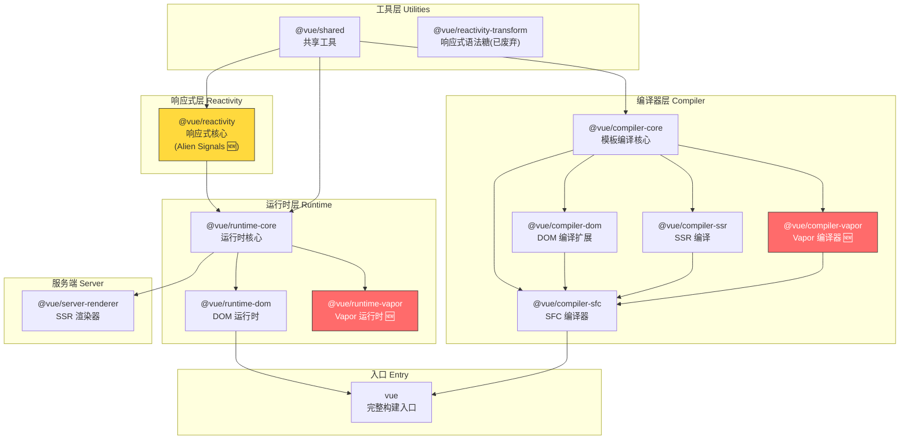

# 第 1 章 为什么在 2026 年重新理解 Vue

> **本章要点**
>
> - Vue 的三次范式蜕变：Options API → Composition API → Vapor Mode
> - Vapor Mode 如何绕过虚拟 DOM，直接生成命令式 DOM 操作代码
> - Alien Signals 为何用版本计数取代 Set-based 依赖追踪
> - 本书与其他 Vue 源码书的本质区别
> - Vue 3.6 monorepo 的全景架构图

---

你可能会问：市面上已经有那么多 Vue 源码解析的书了，为什么还要再写一本？

这个问题的答案，藏在 Vue 过去十年的三次蜕变里。

## 1.1 Vue 的三次蜕变：Options → Composition → Vapor

### 第一次蜕变：Options API（2014–2019）

2014 年，当尤雨溪发布 Vue 0.x 时，前端世界正被 Angular 1 的复杂概念搞得晕头转向——Scope、Directive、Digest Cycle、依赖注入——一个简单的待办清单应用需要理解整套概念体系才能写出来。

Vue 的回应是激进的简洁。它提出了一个大胆的设想：**如果一个组件的全部逻辑，都可以用一个普通的 JavaScript 对象来描述呢？**

```typescript
// Vue 2 Options API — 一个对象描述一切
export default {
  data() {
    return {
      count: 0,
      doubleCount: 0
    }
  },
  computed: {
    tripleCount() {
      return this.count * 3
    }
  },
  watch: {
    count(newVal: number) {
      this.doubleCount = newVal * 2
    }
  },
  methods: {
    increment() {
      this.count++
    }
  }
}
```

这段代码的魔力在于它的**声明式组织**：数据放 `data`，计算属性放 `computed`，方法放 `methods`，侦听器放 `watch`。新手不需要理解任何框架概念，只需要知道"把东西放在正确的格子里"。

> 🔥 **深度洞察**
>
> Options API 的设计哲学是**按类型组织**（organize by type）：所有的状态放一起，所有的方法放一起，所有的计算属性放一起。这在小型组件中非常直观。但它隐含了一个根本性的架构假设——**一个组件只做一件事**。当组件承担多个关注点时，同一个功能的状态、计算和方法被强制拆散到不同的选项中，代码的物理组织与逻辑组织出现了系统性的错位。

Options API 的驱动力是**降低门槛**。它成功了——Vue 在 2016-2019 年间成为增长最快的前端框架，很大程度上归功于这种"一个对象搞定一切"的简洁性。

但随着应用规模的增长，Options API 的裂缝开始显现。

### 第二次蜕变：Composition API（2020–2024）

2020 年，Vue 3 带来了 Composition API。它不是对 Options API 的增量改进，而是对组件逻辑组织方式的根本重构。

驱动力是什么？**逻辑复用。**

在 Options API 中，复用逻辑的方式是 Mixins。但 Mixins 有三个致命问题：命名冲突、隐式依赖、数据来源不透明。当一个组件混入三四个 Mixin 后，`this.xxx` 到底来自哪里，只有上帝知道。

Composition API 的回答是：**用函数替代选项，用显式的返回值替代隐式的 `this` 挂载。**

```typescript
// Vue 3 Composition API — 函数组合一切
import { ref, computed, watch } from 'vue'

function useCounter() {
  const count = ref(0)
  const doubleCount = ref(0)
  const tripleCount = computed(() => count.value * 3)

  watch(count, (newVal) => {
    doubleCount.value = newVal * 2
  })

  function increment() {
    count.value++
  }

  return { count, doubleCount, tripleCount, increment }
}

// 在组件中使用
export default {
  setup() {
    const { count, doubleCount, tripleCount, increment } = useCounter()
    // 可以同时组合多个逻辑单元
    const { user, login } = useAuth()
    const { items, fetchItems } = useInventory()

    return { count, doubleCount, tripleCount, increment, user, login, items, fetchItems }
  }
}
```

注意关键的变化：

1. **按功能组织**（organize by feature）取代了按类型组织——`useCounter` 把计数相关的状态、计算和方法放在一起
2. **显式依赖**——每个 composable 的输入和输出一目了然，不存在隐式的 `this`
3. **TypeScript 友好**——函数的参数和返回值天然支持类型推断，不需要 `Vue.extend()` 等类型体操

> 🔥 **深度洞察**
>
> 从 Options API 到 Composition API 的转变，本质上是编程范式的一次经典迁移：从**面向对象**（一个组件是一个对象，逻辑通过继承和混入复用）到**函数式组合**（一个组件是多个函数的组合，逻辑通过函数的输入输出复用）。这一转变映射了更广泛的软件工程共识——**组合优于继承**。React Hooks 在 2018 年走了同一条路，Svelte 5 的 Runes 在 2024 年也做了类似的选择。这不是偶然的趋同，而是前端框架集体发现了同一个真理。

### 第三次蜕变：Vapor Mode（2025–）

如果说 Options → Composition 是**逻辑组织**的范式转换，那么 Vapor Mode 是**渲染模型**的范式转换。

2025 年，Vue 团队正式推出 Vapor Mode。这一次，被重构的不再是开发者编写代码的方式，而是框架将模板转化为 DOM 操作的方式。

驱动力是什么？**性能天花板。**

虚拟 DOM 的核心理念是：用 JavaScript 对象描述 UI 结构（VNode 树），当数据变化时，生成新的 VNode 树，与旧树进行 diff，找出差异，最后将差异应用到真实 DOM。

这套机制有一个根本性的问题：**无论模板多么简单，每次更新都必须走完"创建新树 → diff → patch"的完整链路。** 即使一个组件的模板中只有一个动态绑定，VNode diff 依然会遍历整棵子树。

Vue 3.0 通过 Block Tree 和 PatchFlags 做了大量编译期优化来缓解这个问题——但优化的本质是"让 diff 更快"，而不是"不做 diff"。

Vapor Mode 的回答更加彻底：**如果编译器已经知道哪些是动态的，为什么还需要 diff？**

```typescript
// 一个简单的模板
// <template>
//   <div class="container">
//     <h1>{{ title }}</h1>
//     <p>{{ description }}</p>
//   </div>
// </template>
```

在传统 VDOM 模式下，编译输出大致是：

```typescript
// VDOM 编译输出 — 每次更新都生成完整 VNode 树
import { createElementVNode as _createElementVNode, toDisplayString as _toDisplayString, openBlock as _openBlock, createElementBlock as _createElementBlock } from 'vue'

function render(_ctx: any) {
  return (_openBlock(), _createElementBlock("div", { class: "container" }, [
    _createElementVNode("h1", null, _toDisplayString(_ctx.title), 1 /* TEXT */),
    _createElementVNode("p", null, _toDisplayString(_ctx.description), 1 /* TEXT */)
  ]))
}
```

每次 `title` 或 `description` 变化，都要：
1. 调用 `render()` 生成新的 VNode 树
2. 与旧 VNode 树 diff
3. 找到 PatchFlag 标记的动态节点
4. 执行 `patchElement` 更新真实 DOM

而在 Vapor 模式下，编译输出截然不同：

```typescript
// Vapor 编译输出 — 直接操作 DOM，无 VNode
import { setText, template, effect } from 'vue/vapor'

const _tmpl = template('<div class="container"><h1></h1><p></p></div>')

function render(_ctx: any) {
  const root = _tmpl()                      // ← 一次性创建 DOM 结构
  const h1 = root.firstChild!               // ← 直接获取 DOM 引用
  const p = h1.nextSibling!

  effect(() => setText(h1, _ctx.title))      // ← 精确绑定：title 变 → 只更新 h1
  effect(() => setText(p, _ctx.description)) // ← 精确绑定：description 变 → 只更新 p

  return root
}
```

注意根本性的区别：

1. **没有 VNode**——`template()` 直接返回真实 DOM 节点
2. **没有 diff**——没有新旧树比较，每个动态绑定通过独立的 `effect` 直接更新对应的 DOM 节点
3. **精确更新**——`title` 变化只触发 `h1` 的更新，`description` 的 `effect` 完全不运行

这就像从"每次导航都重新渲染整张地图"变成了"GPS 只更新你的位置标记"。

### 性能基准

Vue 团队公布的基准测试数据（js-framework-benchmark）：

| 场景 | VDOM 模式 | Vapor 模式 | 提升 |
|------|----------|-----------|------|
| 创建 1000 行 | 基准 | ~30% 更快 | 显著 |
| 更新部分行 | 基准 | ~50% 更快 | 非常显著 |
| 选择行（高亮切换） | 基准 | ~70% 更快 | 质变 |
| 交换行 | 基准 | ~40% 更快 | 显著 |
| 内存占用 | 基准 | ~30% 更低 | 显著 |
| 启动时间（TTI） | 基准 | ~20% 更快 | 可观 |

> 🔥 **深度洞察**
>
> Vapor Mode 的意义超越了 Vue 自身。它标志着前端框架竞争的重心，从"运行时性能优化"正式转向"编译期信息利用"。Svelte 从一开始就走这条路，Solid.js 用细粒度响应式实现了同样的效果，Angular 也在向 Signals 转型。Vue 的 Vapor Mode 代表着一个行业共识的形成：**虚拟 DOM 不是终极方案，编译器知道的信息应该被充分利用。** 虚拟 DOM 在 2013 年由 React 引入时是一个革命性的想法——用声明式的方式描述 UI，让框架处理更新。但十年后，我们发现"让框架处理更新"不一定需要"构建虚拟树再做 diff"。编译器可以在编译期就确定最优的更新策略。

## 1.2 Vue 3.6 的破局：Vapor Mode 无虚拟 DOM

上一节我们从宏观角度看了 Vapor Mode 的编译输出差异。这一节让我们深入一些，理解 Vapor Mode 在架构层面意味着什么。

### 编译器的角色转变

在传统 VDOM 模式中，编译器的角色是"翻译官"——将模板翻译为 `render` 函数，该函数返回 VNode 树的描述。运行时拿到这棵 VNode 树后，自己负责 diff 和 patch。

在 Vapor 模式中，编译器的角色升级为"施工队长"——它不仅知道要建什么（模板结构），还直接生成施工指令（DOM 操作代码）。运行时不再需要"看图纸做比较"，只需要"按指令执行"。

```
┌─────────────────────────────────────────────────────────────┐
│                    传统 VDOM 模式                             │
│                                                              │
│  Template → Compiler → render() → VNode Tree                │
│                                      ↓                       │
│                              Runtime: diff + patch → DOM     │
│                                                              │
│  编译器：只负责翻译                                            │
│  运行时：负责 diff + patch（重活）                              │
├─────────────────────────────────────────────────────────────┤
│                    Vapor 模式                                 │
│                                                              │
│  Template → Compiler → DOM 操作指令 + effect 绑定             │
│                              ↓                               │
│                        Runtime: 执行 effect → DOM             │
│                                                              │
│  编译器：负责翻译 + 优化 + 生成精确更新代码（重活）               │
│  运行时：只执行 effect（轻活）                                  │
└─────────────────────────────────────────────────────────────┘
```

这种角色转变有一个深刻的含义：**复杂度从运行时转移到了编译期。** 用户不感知编译器的复杂度，但每一毫秒的运行时开销都会被用户感知到。因此，这是一次对用户体验的净优化。

### Vapor 的渐进式采用

Vue 3.6 的一个精妙设计是：Vapor Mode 不是一个全有或全无的选择。你可以在同一个应用中混用 VDOM 组件和 Vapor 组件：

```typescript
// 传统 VDOM 组件
import LegacyComponent from './LegacyComponent.vue'

// Vapor 组件（通过 .vapor.vue 后缀或编译选项标识）
import FastComponent from './FastComponent.vapor.vue'

// 在同一个应用中混用
export default {
  components: { LegacyComponent, FastComponent }
}
```

这意味着你可以渐进式地迁移——性能关键的组件先切换到 Vapor，其余组件保持不变。这与 Vue 一贯的"渐进式框架"哲学一脉相承。

## 1.3 Alien Signals：响应式系统的第三次重写

如果 Vapor Mode 是渲染层的革命，那么 Alien Signals 就是数据层的革命。

### 为什么需要第三次重写

让我们回顾 Vue 响应式系统的演进：

**第一代：Vue 2 — `Object.defineProperty`**

```typescript
// Vue 2 的响应式原理（简化）
function defineReactive(obj: any, key: string, val: any) {
  const dep = new Dep()  // 每个属性一个依赖收集器

  Object.defineProperty(obj, key, {
    get() {
      dep.depend()       // 收集当前正在执行的 Watcher
      return val
    },
    set(newVal: any) {
      val = newVal
      dep.notify()       // 通知所有 Watcher 更新
    }
  })
}
```

局限：无法检测属性的添加/删除，无法拦截数组索引赋值，需要 `Vue.set()` 等补丁 API。

**第二代：Vue 3.0–3.4 — `Proxy` + Set-based tracking**

```typescript
// Vue 3.0 的响应式原理（简化）
// packages/reactivity/src/effect.ts

let activeEffect: ReactiveEffect | undefined

class ReactiveEffect {
  deps: Set<ReactiveEffect>[] = []  // ← 每个 effect 维护它的依赖集合

  run() {
    activeEffect = this
    const result = this.fn()
    activeEffect = undefined
    return result
  }
}

function track(target: object, key: string | symbol) {
  if (!activeEffect) return
  let depsMap = targetMap.get(target)       // ← WeakMap<target, Map<key, Set>>
  if (!depsMap) targetMap.set(target, (depsMap = new Map()))
  let dep = depsMap.get(key)
  if (!dep) depsMap.set(key, (dep = new Set()))
  dep.add(activeEffect)                     // ← Set.add()
  activeEffect.deps.push(dep)               // ← 反向记录，用于 cleanup
}

function trigger(target: object, key: string | symbol) {
  const depsMap = targetMap.get(target)
  if (!depsMap) return
  const dep = depsMap.get(key)
  if (dep) {
    dep.forEach(effect => effect.run())      // ← Set.forEach() 遍历通知
  }
}
```

这套系统解决了 Vue 2 的所有局限，但引入了新的开销：

1. **内存**：每个响应式属性对应一个 `Set`，每次 effect 求值都要 `cleanup`（清除旧依赖）再重建
2. **CPU**：`Set.add()`、`Set.delete()`、`Set.forEach()` 虽然单次不慢，但在大规模依赖图中累积起来不可忽视
3. **GC 压力**：频繁的 Set 创建和销毁产生大量短生命周期对象

**第三代：Vue 3.5–3.6 — 版本计数 + 双向链表（Alien Signals）**

```typescript
// Vue 3.6 Alien Signals 的响应式原理（简化）
// packages/reactivity/src/effect.ts

interface Signal {
  _version: number         // ← 全局版本号，每次变化递增
}

interface Computed {
  _version: number         // ← 自身版本号
  _globalVersion: number   // ← 上次求值时的全局版本号
  _value: any
  _fn: () => any
}

// 当 signal 的值变化时
function signalSet(signal: Signal, value: any) {
  signal._value = value
  signal._version++         // ← 只增加版本号，不遍历通知任何人
  globalVersion++            // ← 全局版本号递增
}

// 当 computed 被读取时
function computedGet(computed: Computed): any {
  if (computed._globalVersion !== globalVersion) {
    // 全局有变化发生，检查自身依赖是否真的变了
    if (checkDirty(computed)) {
      computed._value = computed._fn()    // ← 惰性求值：只在被读取时才重算
      computed._version++
    }
    computed._globalVersion = globalVersion
  }
  return computed._value
}
```

关键区别在于：

1. **没有 Set**——依赖关系通过双向链表维护，不需要频繁创建/销毁集合
2. **没有主动通知**——`signal` 变化时只递增版本号，不遍历依赖者
3. **惰性求值**——`computed` 只在被读取时才检查是否需要重算
4. **O(1) 脏检查**——版本号比较是整数操作，极快

### 为什么 Set-based → Version Counting

用一个更生活化的类比：

**Set-based 模型（旧）** 像一个快递员，每次有包裹（数据变化）就立刻挨家挨户送到所有订阅者门口，不管他们在不在家（是否需要这个值）。

**Version counting 模型（新）** 像一个公告栏。快递站（signal）只在公告栏上更新版本号。住户（computed/effect）只有在出门（被读取/执行）时才看一眼公告栏——如果版本号变了，才去取包裹。

```
Set-based（推模型）：
  signal 变化 → 遍历 Set → 通知 effect1, effect2, effect3 → 全部重算
  （即使 effect2 和 effect3 的结果在本轮 tick 中没人读取）

Version counting（拉模型）：
  signal 变化 → version++ （完毕，0 开销）
  ...
  读取 computed → 检查 version → 需要重算 → 重算 → 返回新值
  （只有真正被读取的 computed 才会重算）
```

> 🔥 **深度洞察**
>
> 从推模型到拉模型的转变，反映了一个深刻的工程哲学：**延迟决策比提前决策更高效。** 在推模型中，系统在数据变化的瞬间就做出"通知所有人"的决策——但此时它并不知道哪些人真的需要新值。在拉模型中，系统将"是否需要新值"的决策延迟到真正需要的时刻——此时信息是完备的，可以做出最优决策。这一原则在软件工程中反复出现：懒加载、写时复制（Copy-on-Write）、惰性求值（Lazy Evaluation）——它们的共同本质都是**将工作推迟到信息最充分的时刻**。

### 量化提升

| 指标 | Vue 3.4（Set-based） | Vue 3.6（Alien Signals） | 原因 |
|------|---------------------|--------------------------|------|
| 内存 / 响应式对象 | 高（Set + WeakMap 开销） | 低（~40%，链表 + 整数） | 消除 Set 分配 |
| 依赖追踪 | O(n) cleanup + 重建 | O(1) 版本比较 | 无需重建依赖集合 |
| computed 触发率 | 依赖变 → 立刻重算 | 依赖变 → 读取时才重算 | 惰性求值消除无用计算 |
| GC 暂停 | 频繁（短生命周期 Set） | 极少（几乎无临时分配） | 结构性消除 GC 压力 |
| 大规模 Signal 图 | 性能随依赖数线性下降 | 性能几乎不受依赖数影响 | O(1) vs O(n) |

## 1.4 本书与其他 Vue 书的区别

市面上 Vue 相关的技术书籍，大致可以分为三类。理解它们的定位差异，有助于你判断本书是否适合你：

| 维度 | API 实战书 | 早期源码书（3.0–3.4） | 本书（3.6） |
|------|----------|---------------------|------------|
| **目标** | 教你用 Vue 写应用 | 教你理解 Vue 3.0 的内部实现 | 教你理解 Vue **当前**的设计及演进动力 |
| **响应式** | `ref`/`reactive` 怎么用 | Set-based tracking 源码 | Alien Signals 版本计数源码 |
| **渲染** | 组件、插槽、指令用法 | VNode + patch + diff 源码 | Vapor Mode 编译输出 + 对比 VDOM |
| **编译器** | 很少涉及 | 基础编译流程 | Vapor 编译器全链路 |
| **横向对比** | 无 | 偶尔提及 React | 系统性对比 React/Svelte/Solid |
| **版本** | Vue 3.0–3.4 | Vue 3.0–3.4 | Vue 3.6.x |
| **适合** | Vue 入门/进阶开发者 | 想了解旧版实现的开发者 | 想理解当前设计的高级开发者 |

> 在技术领域，理解"为什么旧方案被替换"往往比理解"新方案怎么工作"更有教育意义。本书两者兼顾——你会看到 Set-based tracking 的局限如何催生了 version counting，VNode diff 的天花板如何催生了 Vapor Mode。

## 1.5 Vue 源码全景图

在深入各个模块之前，让我们先建立一幅 Vue 3.6 源码的全景地图。

### Monorepo 结构

Vue 3 采用 monorepo 架构，核心仓库 `vuejs/core` 包含 20+ 个包。它们之间的依赖关系如下：



### 核心三角

在这 20+ 个包中，有三个构成了 Vue 的核心三角，理解它们之间的协作关系是理解 Vue 全部源码的关键：

```
                    ┌──────────────┐
                    │   Compiler   │
                    │  模板 → 代码  │
                    └──────┬───────┘
                           │
                    生成的代码调用
                    运行时 API
                           │
              ┌────────────┴────────────┐
              ↓                         ↓
    ┌──────────────┐          ┌──────────────┐
    │  Reactivity  │ ←──────→ │   Runtime    │
    │  数据追踪     │  依赖驱动  │   DOM 操作   │
    └──────────────┘  更新     └──────────────┘
```

**Compiler（编译器）** 将模板转化为可执行代码。在 VDOM 模式下，它生成返回 VNode 的 `render` 函数；在 Vapor 模式下，它生成直接操作 DOM 的命令式代码。编译器是"翻译官"——它不在运行时执行（构建时已完成），但它的翻译质量直接决定了运行时的性能上限。

**Reactivity（响应式）** 是 Vue 的数据引擎。它负责追踪数据的变化（`ref`、`reactive`、`computed`），并在数据变化时通知依赖者。在 Vue 3.6 中，这个引擎的内核已经被 Alien Signals 完全重写——从 Set-based 追踪变为 version counting。

**Runtime（运行时）** 是 Vue 的执行引擎。它负责将编译器生成的代码与响应式系统连接起来，管理组件的生命周期（挂载、更新、卸载），处理组件间的通信（props、slots、events），并最终将数据变化反映到 DOM 上。

这三者的协作流程：

1. **编译期**：Compiler 分析模板，识别静态/动态部分，生成优化后的代码
2. **挂载期**：Runtime 执行编译器生成的代码，通过 Reactivity 建立数据-视图的绑定关系
3. **更新期**：Reactivity 检测到数据变化 → 通知 Runtime → Runtime 执行最小化 DOM 更新

> 🔥 **深度洞察**
>
> 核心三角中最微妙的关系是 **Compiler 与 Runtime 的编译期契约**。编译器生成的代码不是任意的 JavaScript——它精确地调用 Runtime 暴露的特定 API（如 `createElementVNode`、`openBlock`、`setText`）。这意味着 Compiler 和 Runtime 之间存在一个隐式的 ABI（Application Binary Interface）。改变 Runtime API 必须同步修改 Compiler 的代码生成逻辑，反之亦然。这就是为什么 Vapor Mode 需要同时新增 `@vue/compiler-vapor` 和 `@vue/runtime-vapor`——新的渲染范式需要全新的编译期契约。

### 各包速览

| 包名 | 职责 | 本书对应章节 |
|------|------|------------|
| `@vue/reactivity` | 响应式核心（ref, reactive, computed, effect） | 第 3–6 章 |
| `@vue/runtime-core` | 运行时核心（组件、生命周期、调度器） | 第 7–9 章 |
| `@vue/runtime-dom` | DOM 平台特定运行时 | 第 7 章 |
| `@vue/runtime-vapor` | Vapor 模式运行时 🆕 | 第 10 章 |
| `@vue/compiler-core` | 模板编译核心（parse → AST → transform → codegen） | 第 11–13 章 |
| `@vue/compiler-dom` | DOM 平台特定编译扩展 | 第 12 章 |
| `@vue/compiler-sfc` | 单文件组件编译（`<script setup>`, `<style scoped>`） | 第 12 章 |
| `@vue/compiler-vapor` | Vapor 模式编译器 🆕 | 第 10 章 |
| `@vue/server-renderer` | 服务端渲染 | 附录 |
| `@vue/shared` | 共享工具函数 | 贯穿全书 |

## 1.6 本章小结

本章从宏观视角回答了"为什么在 2026 年重新理解 Vue"这个问题。关键要点：

1. **Vue 经历了三次范式蜕变**：Options API（降低门槛）→ Composition API（逻辑复用）→ Vapor Mode（性能天花板突破）。每次蜕变都不是修修补补，而是对核心问题的重新思考。

2. **Vapor Mode 是渲染模型的范式转换**：从"生成 VNode 树 → diff → patch"到"编译器直接生成精确的 DOM 操作指令"。复杂度从运行时转移到编译期。

3. **Alien Signals 是响应式模型的范式转换**：从 Set-based 的推模型（数据变化 → 立即通知所有依赖者）到 version counting 的拉模型（数据变化 → 递增版本号 → 读取时才检查）。内存和性能均有质的提升。

4. **旧版源码知识已经过时**：如果你的 Vue 源码理解停留在 3.4 或更早，你实际上在学习一个已经被替换的系统。

5. **编译器-响应式-运行时的核心三角**是理解 Vue 全部源码的关键框架。Vapor Mode 的引入需要同时新增编译器和运行时包，因为新范式需要全新的编译期契约。

下一章，我们将搭建源码阅读的开发环境，学习如何在 Vue monorepo 中高效地定位、阅读和调试源码。

---

## 思考题

1. **概念理解**：Options API 按"类型"组织代码（data、methods、computed），Composition API 按"功能"组织代码。请举一个具体的业务场景，说明在该场景下 Composition API 的组织方式为什么优于 Options API。

2. **深入思考**：Vapor Mode 将 VNode 的 diff 消除了，但这是否意味着 Vapor 组件在所有场景下都比 VDOM 组件更快？请思考可能存在的例外场景（提示：考虑动态子组件列表和 `v-for` 的极端情况）。

3. **横向对比**：Svelte 从一开始就没有虚拟 DOM，Solid.js 同样使用细粒度响应式直接更新 DOM。Vue 的 Vapor Mode 与它们的方案有何异同？Vue 选择"渐进式引入 Vapor"（可以混用 VDOM 和 Vapor 组件）这一策略有什么优势和代价？

4. **工程思考**：Alien Signals 的版本计数模型将"推通知"变为"拉检查"。在什么场景下，拉模型可能反而不如推模型？（提示：考虑一个 computed 被频繁读取、但依赖极少变化的场景。）

5. **开放讨论**：回顾 Vue 的三次范式蜕变（Options → Composition → Vapor），你认为下一次蜕变可能发生在哪个层面？编译器会进一步承担什么职责？响应式系统还有哪些可优化的空间？
