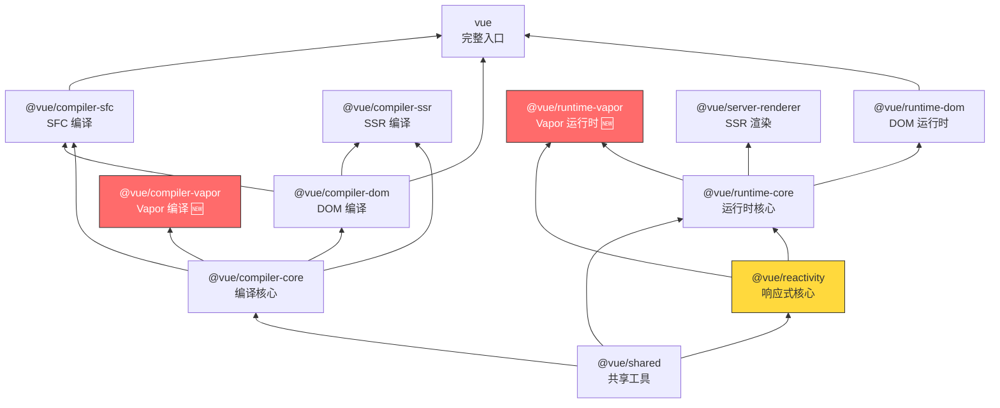
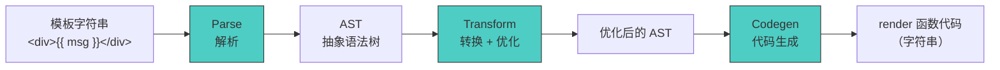
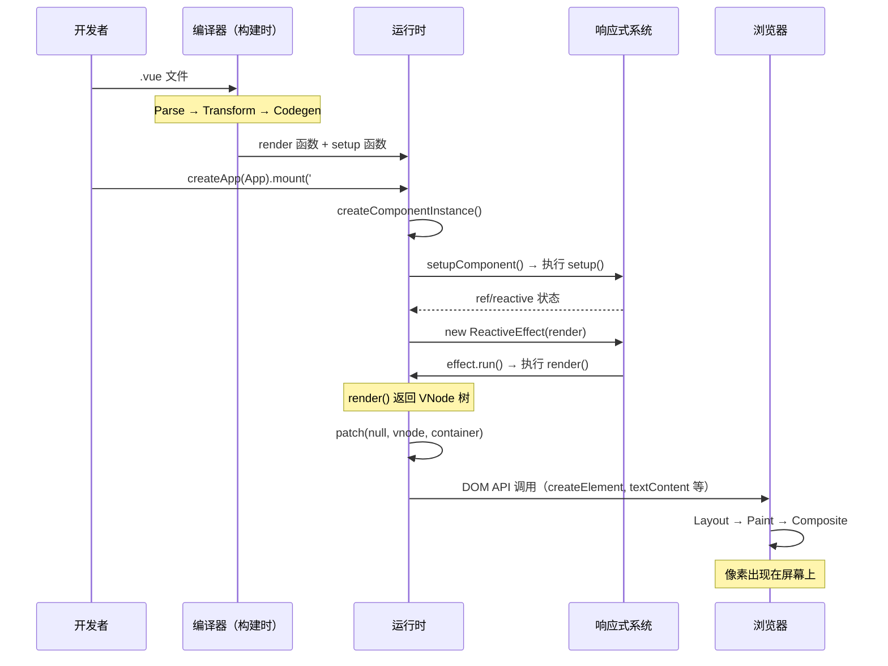

# 第 2 章 Vue 3 源码全景图

> **本章要点**
>
> - Vue 3 Monorepo 架构：20+ 个包的依赖拓扑与职责划分
> - 构建系统的演进：从 Rollup 到 esbuild 的工程抉择
> - 核心三角的协作模型：Compiler → Reactivity → Runtime
> - 从模板到像素：一次完整渲染的全链路图解
> - 三种高效调试源码的姿势

---

打开 Vue 3 的 GitHub 仓库，你会看到一个 `packages/` 目录下整整齐齐排列着二十多个子包。如果你是第一次面对这样的代码量，大概会产生一种站在图书馆门口、不知道该先翻哪本书的茫然感。

这种茫然感是正常的。Vue 3 的 `vuejs/core` 仓库包含超过 10 万行 TypeScript 代码，涉及响应式系统、编译器、运行时、服务端渲染、开发工具等多个子系统。没有一张全景地图，贸然深入任何一个子系统都可能迷失方向。

本章的目标就是画出这张地图。

我们会从 Monorepo 的架构设计开始，理解 Vue 为什么选择将一个框架拆成 20+ 个包；然后纵览构建系统的演进，看到工程工具如何影响框架设计；接着深入核心三角——Compiler、Reactivity、Runtime——的协作流程；最后，我会手把手演示三种调试源码的方法，确保你在后续章节中能随时跳进源码，验证书中的每一个论断。

## 2.1 Monorepo 架构：20+ 个包的依赖关系

### 为什么是 Monorepo

Vue 3 使用 **pnpm workspace** 管理所有子包，遵循 monorepo（单仓多包）模式。这不是一个随意的工程决策——它直接反映了 Vue 的"渐进式框架"哲学。

在 Vue 2 时代，所有代码都在一个巨大的 `src/` 目录下。这种方式的问题在于：你无法单独使用 Vue 的响应式系统。想在一个非 Vue 项目中用 `reactive()` 和 `computed()`？对不起，你必须引入整个 Vue。

Vue 3 的 Monorepo 架构解决了这个问题。每个子包都有自己的 `package.json`，可以独立安装和使用：

```typescript
// 只使用响应式系统，不需要运行时和编译器
import { ref, computed, watch } from '@vue/reactivity'

const count = ref(0)
const doubled = computed(() => count.value * 2)

watch(count, (newVal) => {
  console.log(`count changed to ${newVal}`)
})

count.value++ // 输出: count changed to 1
```

这段代码不需要任何 DOM 环境，可以在 Node.js、Deno、甚至嵌入式 JavaScript 运行时中执行。`@vue/reactivity` 是一个零依赖（仅依赖 `@vue/shared`）的响应式库。

> 🔥 **深度洞察**
>
> Monorepo 的真正价值不在于"代码放在一个仓库里"——这只是表象。它的核心价值在于**强制解耦与显式依赖**。当你把代码拆成独立的包时，包与包之间的依赖必须通过 `import` 和 `package.json` 显式声明。这消除了隐式耦合——在 Vue 2 的单体架构中，运行时可以随意引用编译器的内部工具函数，因为它们在同一个 `src/` 目录下。在 Vue 3 中，这种引用会导致循环依赖的编译错误，迫使开发者思考正确的依赖方向。

### 包的完整清单

让我们逐一梳理 `packages/` 目录下的所有子包，按照依赖层次从底到顶排列：

| 层次 | 包名 | 职责 | 可独立使用 |
|------|------|------|-----------|
| **基础层** | `@vue/shared` | 共享工具函数（`isObject`、`isArray`、`makeMap` 等） | ✅ |
| **响应式层** | `@vue/reactivity` | 响应式核心（ref、reactive、computed、effect） | ✅ |
| **编译器层** | `@vue/compiler-core` | 模板编译核心（与平台无关） | ✅ |
| | `@vue/compiler-dom` | DOM 平台的编译扩展 | ✅ |
| | `@vue/compiler-sfc` | 单文件组件（.vue）编译器 | ✅ |
| | `@vue/compiler-ssr` | SSR 编译优化 | ✅ |
| | `@vue/compiler-vapor` | Vapor Mode 编译器 🆕 | ✅ |
| **运行时层** | `@vue/runtime-core` | 运行时核心（组件、生命周期、调度器） | ✅ |
| | `@vue/runtime-dom` | DOM 平台运行时 | ✅ |
| | `@vue/runtime-vapor` | Vapor 运行时 🆕 | ✅ |
| **服务端层** | `@vue/server-renderer` | 服务端渲染 | ✅ |
| **入口层** | `vue` | 完整构建入口（编译器 + 运行时） | ✅ |

### 依赖拓扑图

这些包之间的依赖关系形成了一个精心设计的有向无环图（DAG）：



几个关键的依赖方向值得注意：

1. **响应式不依赖运行时**：`@vue/reactivity` 只依赖 `@vue/shared`，不知道 DOM、组件或虚拟节点的存在。这使得它可以作为独立库使用。

2. **编译器不依赖运行时**：`@vue/compiler-*` 系列只依赖 `@vue/shared`，不依赖任何运行时包。编译器是纯函数——输入模板字符串，输出代码字符串。

3. **运行时依赖响应式**：`@vue/runtime-core` 依赖 `@vue/reactivity`，将响应式系统用于组件的状态管理和依赖驱动更新。

4. **入口包组合一切**：`vue` 包将编译器和运行时组合在一起，提供开箱即用的完整框架。

> 💡 **最佳实践**
>
> 当你在库（library）项目中只需要响应式能力时，直接安装 `@vue/reactivity` 而非 `vue`。这可以将 bundle size 从 ~30KB（gzipped）降低到 ~5KB。Vue 的 monorepo 架构让这种按需使用成为可能。

### @vue/shared：万物之基

`@vue/shared` 是整个架构的底座。它提供了一组与平台无关的工具函数：

```typescript
// packages/shared/src/general.ts

// 类型判断
export const isArray = Array.isArray
export const isMap = (val: unknown): val is Map<any, any> =>
  toTypeString(val) === '[object Map]'
export const isSet = (val: unknown): val is Set<any> =>
  toTypeString(val) === '[object Set]'
export const isFunction = (val: unknown): val is Function =>
  typeof val === 'function'
export const isString = (val: unknown): val is string =>
  typeof val === 'string'
export const isSymbol = (val: unknown): val is symbol =>
  typeof val === 'symbol'
export const isObject = (val: unknown): val is Record<any, any> =>
  val !== null && typeof val === 'object'

// 高性能的 Set 查询 — 用闭包代替 Set.has()
export function makeMap(
  str: string,
  expectsLowerCase?: boolean
): (key: string) => boolean {
  const set = new Set(str.split(','))
  return expectsLowerCase
    ? val => set.has(val.toLowerCase())
    : val => set.has(val)
}

// HTML 标签检查（编译器和运行时共用）
export const isHTMLTag = /*#__PURE__*/ makeMap(
  'html,body,base,head,link,meta,style,title,...'
)
```

这些看似简单的工具函数有一个微妙但重要的设计细节：**`/*#__PURE__*/` 注解**。这个注解告诉打包工具（Rollup/esbuild）："这个函数调用没有副作用，如果返回值没被使用，可以安全地移除。"这是 Vue 3 tree-shaking 友好设计的基石之一。

## 2.2 构建系统：从 Rollup 到 esbuild 的演进

### Vue 3.0–3.4：Rollup 时代

Vue 3 最初使用 **Rollup** 作为构建工具。选择 Rollup 而非 Webpack 的原因很明确：Rollup 天生面向库（library）打包，支持输出 ESM、CJS、IIFE 等多种格式，且 tree-shaking 能力更强。

Vue 的构建配置相当复杂，需要为每个包生成多种格式的产物：

```typescript
// 每个包可能输出的格式
interface BuildFormats {
  'esm-bundler': string   // 供 Webpack/Vite 消费的 ESM（保留 import）
  'esm-browser': string   // 可直接在 <script type="module"> 中使用
  'cjs': string           // CommonJS（Node.js）
  'global': string        // IIFE（通过 <script> 标签引入，挂载到 window.Vue）
}
```

### Vue 3.5+：esbuild 加入

从 Vue 3.5 开始，开发模式的构建切换到 **esbuild**。esbuild 用 Go 编写，构建速度比 Rollup 快 10–100 倍。但 Vue 没有完全放弃 Rollup——生产构建仍然使用 Rollup，因为 Rollup 的插件生态更成熟，对产物的控制更精细。

| 场景 | 工具 | 原因 |
|------|------|------|
| 开发构建（`pnpm dev`） | esbuild | 速度，毫秒级重建 |
| 生产构建（`pnpm build`） | Rollup | 产物质量，精确控制 |
| 类型检查 | tsc (TypeScript) | 类型安全 |
| 类型声明生成 | rollup-plugin-dts | .d.ts 产物 |

```typescript
// scripts/dev.js — 开发模式使用 esbuild
import esbuild from 'esbuild'

const ctx = await esbuild.context({
  entryPoints: [resolve(__dirname, `../packages/${target}/src/index.ts`)],
  bundle: true,
  external: ['vue', '@vue/*'],
  platform: 'browser',
  format: 'esm',
  outfile: resolve(__dirname, `../packages/${target}/dist/${target}.esm-browser.js`),
  sourcemap: true,
})

await ctx.watch() // 监听文件变化，毫秒级重建
```

> 🔥 **深度洞察**
>
> Vue 的"双构建工具"策略揭示了一个重要的工程原则：**开发体验和产物质量是两个不同的优化目标，不应该用同一个工具来妥协。** esbuild 的速度来自于它跳过了类型检查、不做复杂的代码分析、不支持某些高级的 Rollup 插件。这些"缺失"在开发阶段无关紧要（IDE 负责类型检查），但在生产构建中不可接受。用正确的工具做正确的事，而非一个工具做所有事。

### 构建产物的设计

Vue 的构建产物设计体现了"渐进式"哲学——不同场景的用户获得不同的产物：

```
vue/dist/
├── vue.esm-bundler.js        # Vite/Webpack 用户（推荐）
├── vue.esm-browser.js        # 直接 <script type="module">
├── vue.global.js             # 传统 <script> 标签
├── vue.runtime.esm-bundler.js # 只要运行时（预编译模板）
├── vue.runtime.global.js      # 只要运行时（全局构建）
├── vue.cjs.js                 # Node.js CommonJS
└── vue.d.ts                   # TypeScript 类型声明
```

其中 `esm-bundler` 和 `runtime.esm-bundler` 的区别至关重要：

- **完整构建**（`vue.esm-bundler.js`）：包含编译器，可以在运行时编译模板
- **运行时构建**（`vue.runtime.esm-bundler.js`）：不包含编译器，模板必须在构建时预编译

```typescript
// 完整构建可以做这件事
import { createApp } from 'vue'
createApp({
  template: '<div>{{ message }}</div>',  // 运行时编译
  data() { return { message: 'Hello' } }
})

// 运行时构建不能，必须使用预编译的 render 函数或 .vue 文件
import { createApp, h } from 'vue'
createApp({
  render() { return h('div', this.message) }
})
```

当你使用 Vite 或 Webpack 搭配 `vue-loader`/`@vitejs/plugin-vue` 时，`.vue` 文件中的模板会在构建时被编译，所以 bundler 自动选择运行时构建，这就是为什么你的 bundle 中不包含 Vue 编译器——它的工作已经在 `npm run build` 时完成了。

> 💡 **最佳实践**
>
> 如果你的项目中没有运行时模板编译（绝大多数项目都没有），确保你的打包工具解析到 `vue.runtime.esm-bundler.js` 而非完整构建。这可以节省约 14KB（gzipped）的 bundle size——那是整个编译器的体积。Vite 默认就是这样配置的。

## 2.3 核心三角：Compiler → Reactivity → Runtime

Vue 3 的架构可以抽象为三个核心子系统的协作——编译器（Compiler）、响应式（Reactivity）和运行时（Runtime）。理解它们各自的职责边界和协作方式，是理解 Vue 全部源码的关键。

### 编译器：从模板到代码

编译器的输入是模板字符串，输出是 JavaScript 代码。这个过程分为三个阶段：



1. **Parse（解析）**：将模板字符串解析为 AST（抽象语法树）。这是一个状态机驱动的过程——逐字符扫描模板，识别标签、属性、指令、插值表达式等。

2. **Transform（转换）**：对 AST 进行一系列转换和优化。包括：静态节点标记、PatchFlag 计算、Block Tree 构建、指令处理（v-if → 条件分支、v-for → 循环结构）等。

3. **Codegen（代码生成）**：将优化后的 AST 转化为 render 函数的 JavaScript 代码字符串。

```typescript
// packages/compiler-core/src/compile.ts（简化）

export function baseCompile(
  source: string | RootNode,
  options: CompilerOptions = {}
): CodegenResult {
  // 1. Parse
  const ast = isString(source) ? baseParse(source, options) : source

  // 2. Transform
  transform(ast, {
    ...options,
    nodeTransforms: [
      ...getBaseTransformPreset(),    // 内置转换（v-if, v-for 等）
      ...(options.nodeTransforms || []) // 用户自定义转换
    ],
  })

  // 3. Codegen
  return generate(ast, options)
}
```

关键设计：编译器是**平台无关**的。`@vue/compiler-core` 不知道 DOM 的存在——它只知道如何解析模板语法、构建 AST、生成代码。DOM 特定的逻辑（如 HTML 标签验证、事件修饰符处理）由 `@vue/compiler-dom` 通过**扩展点**注入。

### 响应式：数据的因果传播引擎

响应式系统是 Vue 的数据引擎。它的核心职责是：**当数据变化时，精确地找到所有依赖这个数据的计算和副作用，并触发它们的更新。**

在 Vue 3.6 中，这个引擎的内核已经被 Alien Signals 完全重写。但无论内部实现如何变化，它对外提供的核心 API 保持稳定：

```typescript
import { ref, reactive, computed, watch, effect } from '@vue/reactivity'

// ref — 包装基本类型为响应式
const count = ref(0)

// reactive — 包装对象为响应式
const state = reactive({ name: 'Vue', version: 3.6 })

// computed — 基于依赖自动计算
const doubled = computed(() => count.value * 2)

// watch — 监听变化并执行副作用
watch(count, (newVal, oldVal) => {
  console.log(`${oldVal} → ${newVal}`)
})

// effect — 底层副作用原语（computed 和 watch 基于它实现）
effect(() => {
  console.log(`count is ${count.value}`)
})
```

响应式系统的美妙之处在于：它是**声明式**的。你不需要手动调用 `setState` 或 `dispatch`——只需要修改数据，系统自动知道该更新什么。这种"自动"背后的机制是**依赖追踪**——当 `effect` 或 `computed` 执行时，系统记录它们读取了哪些响应式数据；当这些数据被修改时，系统自动重新执行对应的 `effect` 或重算对应的 `computed`。

### 运行时：从数据到 DOM

运行时是 Vue 的执行引擎，负责将编译器生成的代码与响应式系统连接起来，最终将数据的变化反映到 DOM 上。

运行时的核心职责包括：

1. **组件实例管理**：创建、挂载、更新、卸载组件实例
2. **生命周期管理**：在正确的时机触发 `onMounted`、`onUpdated` 等钩子
3. **VNode 管理**：（VDOM 模式）创建 VNode、执行 diff、应用 patch
4. **Vapor 执行**：（Vapor 模式）执行编译器生成的直接 DOM 操作
5. **调度器**：batching 多个更新，在微任务中统一执行

```typescript
// packages/runtime-core/src/renderer.ts（极度简化）

function patch(
  n1: VNode | null,  // 旧节点
  n2: VNode,         // 新节点
  container: Element
) {
  if (n1 === null) {
    // 挂载
    mountElement(n2, container)
  } else if (n1.type !== n2.type) {
    // 类型不同，替换
    unmount(n1)
    mountElement(n2, container)
  } else {
    // 类型相同，更新
    patchElement(n1, n2)
  }
}
```

### 三者的协作流程

让我们用一个具体例子串联三者的协作：

```typescript
// App.vue
<template>
  <button @click="count++">{{ count }}</button>
</template>

<script setup>
import { ref } from 'vue'
const count = ref(0)
</script>
```

**Step 1: 编译期（Compiler）**

编译器将模板编译为 render 函数：

```typescript
// 编译器输出（简化）
import { createElementVNode, toDisplayString, openBlock, createElementBlock } from 'vue'

function render(_ctx) {
  return (openBlock(), createElementBlock("button", {
    onClick: $event => (_ctx.count++)
  }, toDisplayString(_ctx.count), 9 /* TEXT, PROPS */))
}
```

**Step 2: 挂载期（Runtime + Reactivity）**

运行时创建组件实例，执行 `setup()` 建立响应式状态，然后将 render 函数包裹在一个 `effect` 中执行：

```typescript
// 运行时内部（简化）
const instance = createComponentInstance(vnode)
const { setupState } = setupComponent(instance)  // 执行 setup()，得到 count ref

// 将 render 包裹在响应式 effect 中
effect(() => {
  const vnode = instance.render(setupState)       // 调用 render，触发 count.value 的读取
  patch(instance.subTree, vnode, container)        // 挂载/更新 DOM
  instance.subTree = vnode
})
```

当 `render` 函数执行时，`count.value` 被读取，触发依赖收集——响应式系统记录下"这个 `effect` 依赖了 `count`"。

**Step 3: 更新期（Reactivity → Runtime）**

用户点击按钮，`count.value++` 触发响应式更新：

```
count.value++
  → Reactivity: 版本号递增，标记 effect 为 dirty
  → Scheduler: 将 effect 推入微任务队列
  → 微任务执行: effect 重新运行 → render() 生成新 VNode
  → Runtime: patch(旧 VNode, 新 VNode) → 更新按钮文本
```

整个过程是自动的——开发者只写了 `count++`，框架负责完成从数据到 DOM 的全部更新链路。

> 🔥 **深度洞察**
>
> 核心三角的设计体现了**关注点分离**（Separation of Concerns）的经典原则，但 Vue 的实现有一个微妙的特点：**三者之间的耦合点是精确且最小化的。** 编译器只知道运行时的 API 签名（如 `createElementVNode`），不知道它的实现；运行时只知道响应式系统的 API（如 `effect`、`ref`），不知道它的实现。这种"只知道接口，不知道实现"的设计，使得 Vue 3.6 能够在不改变编译器和运行时 API 的情况下，完全重写响应式系统的内核（Alien Signals）。同样，Vapor Mode 可以在不改变响应式系统的情况下，引入全新的编译器和运行时。

## 2.4 从模板到像素：一次渲染的完整旅程

让我们追踪一次完整的渲染过程，从用户编写模板到浏览器在屏幕上绘制像素，每一步都标注对应的源码位置。



### 阶段一：编译期（Build Time）

当你运行 `npm run build` 或 Vite 的开发服务器时，`@vitejs/plugin-vue` 调用 `@vue/compiler-sfc` 处理 `.vue` 文件：

```typescript
// @vue/compiler-sfc 处理流程
//
// 1. 解析 SFC 结构（<template>、<script>、<style>）
// 2. 编译 <template> → render 函数
// 3. 编译 <script setup> → setup 函数
// 4. 编译 <style scoped> → 添加 data-v-xxxx 属性选择器
// 5. 组合输出为一个 JavaScript 模块
```

编译完成后，一个 `.vue` 文件变成了一个普通的 JavaScript 模块：

```typescript
// App.vue 编译后的输出（简化）
import { ref } from 'vue'
import { createElementBlock, toDisplayString, openBlock } from 'vue'

const __sfc__ = {
  __name: 'App',
  setup() {
    const count = ref(0)
    return { count }
  },
  render(_ctx) {
    return (openBlock(), createElementBlock("button", {
      onClick: () => _ctx.count++
    }, toDisplayString(_ctx.count), 9))
  }
}

export default __sfc__
```

### 阶段二：创建应用（`createApp`）

```typescript
// packages/runtime-dom/src/index.ts
export const createApp = (...args) => {
  const app = ensureRenderer().createApp(...args)
  // ...
  return app
}
```

`createApp` 创建一个应用实例，返回一个具有 `mount`、`use`、`component`、`directive` 等方法的对象。此时还没有任何 DOM 操作——应用只是被"声明"了。

### 阶段三：挂载（`mount`）

```typescript
app.mount('#app')
```

挂载过程启动组件的首次渲染：

1. 创建根组件的 VNode
2. 创建组件实例
3. 执行 `setup()` 函数，建立响应式状态
4. 创建渲染 effect，首次执行 render 函数
5. render 函数返回 VNode 树
6. patch 算法将 VNode 树转化为真实 DOM

### 阶段四：更新

当响应式数据变化时：

1. 响应式系统检测到变化（版本号递增）
2. 调度器将组件的更新 effect 推入微任务队列
3. 微任务执行时，effect 重新运行 render 函数
4. render 函数返回新的 VNode 树
5. patch 算法对比新旧 VNode 树，找出差异
6. 差异被应用到真实 DOM

> 💡 **最佳实践**
>
> 理解"编译期"和"运行时"的边界至关重要。如果你在排查性能问题时看到 `createElementVNode` 或 `openBlock` 的调用栈，那是运行时的 VNode 创建——问题在渲染层。如果你看到 `baseParse` 或 `transform`，那是编译器——但这通常不会出现在运行时调用栈中，除非你使用了运行时模板编译（完整构建 + `template` 字符串选项）。

## 2.5 源码调试的三种姿势

读源码最怕"只看不跑"——看了半天以为自己懂了，实际上对执行顺序和数据流一头雾水。以下三种调试方式，由简到深，建议至少掌握第一种。

### 姿势一：在线调试（Vue SFC Playground）

Vue 官方提供了在线 SFC Playground（play.vuejs.org），可以直接在浏览器中编辑 Vue 组件并查看编译输出。

1. 打开 https://play.vuejs.org
2. 在左侧编辑 `.vue` 文件
3. 点击右上角 "JS" 按钮查看编译后的 JavaScript
4. 点击 "AST" 按钮查看模板的 AST 结构

这是最快的方式，适合快速验证编译器的行为——"这个模板会被编译成什么代码？"

### 姿势二：本地构建 + Source Map

```bash
# 克隆 Vue 源码
git clone https://github.com/vuejs/core.git
cd core
git checkout v3.6.0

# 安装依赖
pnpm install

# 开发模式构建（带 source map）
pnpm dev

# 或者构建特定包
pnpm dev reactivity
```

开发构建会生成带 source map 的产物。在一个 Vite 项目中引用本地构建的 Vue：

```typescript
// vite.config.ts
export default defineConfig({
  resolve: {
    alias: {
      'vue': '/path/to/vue/core/packages/vue/dist/vue.esm-bundler.js'
    }
  }
})
```

现在你可以在浏览器 DevTools 中直接对 Vue 源码（TypeScript 原始文件）打断点。

### 姿势三：单元测试调试

Vue 的测试覆盖率极高，几乎每个功能都有对应的测试用例。通过调试测试用例来理解源码的行为，往往比直接阅读源码更高效。

```bash
# 运行特定包的测试
pnpm test reactivity

# 运行特定测试文件
pnpm test reactivity -- --testPathPattern="ref"

# 调试模式（可在 IDE 中打断点）
node --inspect-brk node_modules/.bin/vitest run --testPathPattern="ref"
```

在 VS Code 中，可以配置调试启动项：

```json
// .vscode/launch.json
{
  "version": "0.2.0",
  "configurations": [
    {
      "type": "node",
      "request": "launch",
      "name": "Debug Vue Tests",
      "program": "${workspaceFolder}/node_modules/.bin/vitest",
      "args": ["run", "--testPathPattern", "${input:testPattern}"],
      "console": "integratedTerminal"
    }
  ],
  "inputs": [
    {
      "id": "testPattern",
      "type": "promptString",
      "description": "Test file pattern"
    }
  ]
}
```

> 🔥 **深度洞察**
>
> Vue 的测试用例本身就是一份极好的"设计文档"。当你不确定某个 API 的边界行为时，找到对应的测试文件比翻文档更可靠。例如，`packages/reactivity/__tests__/ref.spec.ts` 详尽地覆盖了 `ref` 的每一种边界情况——嵌套 ref 的解包行为、与 reactive 的交互、类型推断等。**测试用例是代码作者向未来读者的承诺："这些行为是故意的，不是偶然的。"**

## 2.6 Vapor 模式对架构的影响

理解了传统架构之后，让我们简要预览 Vapor Mode 对全景图的影响。

Vapor Mode 引入了两个新包：`@vue/compiler-vapor` 和 `@vue/runtime-vapor`。但它没有替换任何现有包——这意味着 VDOM 模式和 Vapor 模式可以共存。

```
传统模式：@vue/compiler-dom → render() → VNode → @vue/runtime-dom → DOM
Vapor 模式：@vue/compiler-vapor → template() + effect() → @vue/runtime-vapor → DOM
```

两种模式共享：
- **相同的响应式系统**（`@vue/reactivity`）
- **相同的编译器前端**（`@vue/compiler-core` 的 Parse 阶段）
- **相同的 SFC 编译流程**（`@vue/compiler-sfc`）

不同的是：
- **Transform 阶段**：Vapor 编译器有自己的转换逻辑，生成面向直接 DOM 操作的 IR（中间表示）
- **Codegen 阶段**：Vapor 代码生成器输出 `template()` + `effect()` 而非 `createElementVNode()`
- **运行时**：Vapor 运行时不包含 VNode 和 patch 逻辑，只包含 DOM 操作辅助函数

这种架构设计的精妙之处在于：**共享的部分最大化，独立的部分最小化。** 编译器的前端（Parse）只需要写一次，因为模板语法对两种模式是相同的。响应式系统只需要一套，因为两种模式的数据追踪逻辑是相同的。只有"如何将模板翻译为代码"和"如何将代码应用到 DOM"这两个步骤需要为 Vapor 重新实现。

## 2.7 本章小结

本章绘制了 Vue 3.6 源码的全景地图。关键要点：

1. **Monorepo 架构**强制解耦：每个包的职责边界通过 `package.json` 的依赖声明显式化。`@vue/reactivity` 可以独立使用，不依赖任何 DOM 概念。

2. **构建系统**采用双工具策略：开发用 esbuild（快），生产用 Rollup（精确）。`/*#__PURE__*/` 注解是 tree-shaking 的基石。

3. **核心三角**——Compiler、Reactivity、Runtime——通过最小化的接口协作。编译器只知道运行时的 API 签名，运行时只知道响应式系统的 API 签名，这使得内核的独立替换成为可能。

4. **一次渲染的完整旅程**：模板 → Parse → Transform → Codegen → render 函数 → 响应式 effect → VNode 树 → patch → DOM → 浏览器绘制。

5. **Vapor Mode** 引入新的编译器和运行时包，但与现有架构共享响应式系统和编译器前端，实现了最大化的代码复用。

6. **调试源码**有三种姿势：在线 Playground（最快）、本地 Source Map（最灵活）、单元测试调试（最精确）。

下一章，我们将深入 Vue 架构中最核心的部分——响应式系统。从设计哲学入手，理解 Vue 为什么选择了"细粒度依赖追踪"这条路，以及这个选择如何影响了整个框架的性能特性。

---

## 思考题

1. **概念理解**：Vue 3 的 Monorepo 架构将代码拆分为 20+ 个包。请解释为什么 `@vue/reactivity` 不依赖 `@vue/runtime-core`，但 `@vue/runtime-core` 依赖 `@vue/reactivity`？这种单向依赖关系反映了什么设计原则？

2. **工程实践**：Vue 在开发模式使用 esbuild，生产模式使用 Rollup。如果你在设计一个大型开源库的构建系统，你会如何决定哪些场景用 esbuild、哪些用 Rollup？请列出至少 3 个决策因素。

3. **深入思考**：编译器和运行时之间存在"编译期契约"——编译器生成的代码必须调用运行时提供的特定 API。如果 Vue 团队想要修改 `createElementVNode` 的参数签名，需要同步修改哪些包？这种耦合是可以避免的吗？为什么？

4. **横向对比**：React 没有模板编译器——JSX 直接被 Babel 转换为 `React.createElement` 调用。Vue 选择模板 + 编译器的架构在编译期优化方面有什么优势？这种优势的代价是什么？

5. **开放讨论**：Vapor Mode 引入了 `@vue/compiler-vapor` 和 `@vue/runtime-vapor` 两个新包，而不是在现有包中添加 Vapor 支持。请从软件架构的角度分析这个决策的利弊。
