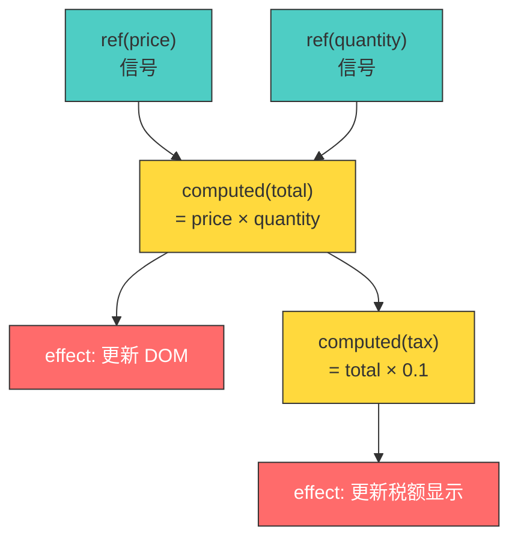

<div v-pre>

# 第 3 章 响应式系统设计哲学

> **本章要点**
>
> - 响应式编程的本质：从命令式手动同步到声明式自动传播
> - Vue 响应式的三代实现：defineProperty → Proxy → Alien Signals
> - 细粒度 vs 粗粒度响应式：Vue 与 React 的根本分歧
> - 与 MobX、Solid Signals、Svelte Runes 的横向对比
> - "精确传播变化"——响应式系统的终极追求

---

假设你在管理一家咖啡店的库存。每天早上，你需要做三件事：

1. 检查咖啡豆存量
2. 根据存量计算今天能做多少杯咖啡
3. 如果不够，给供应商打电话补货

用命令式编程的方式，代码大概是这样的：

```typescript
let beans = 500           // 克
let cupsAvailable = Math.floor(beans / 15)
let needRestock = cupsAvailable < 20

// 第二天早上，有人用掉了一些豆子
beans = 200

// 糟了！cupsAvailable 和 needRestock 没有自动更新
console.log(cupsAvailable)  // 仍然是 33，实际应该是 13
console.log(needRestock)    // 仍然是 false，实际应该是 true

// 你必须手动重新计算
cupsAvailable = Math.floor(beans / 15)
needRestock = cupsAvailable < 20
```

看到问题了吗？当 `beans` 变化时，`cupsAvailable` 和 `needRestock` 不会自动更新。你必须**手动**重新计算。在这个简单例子中，手动同步还能应付。但在一个有数百个相互依赖的状态的前端应用中，手动同步就是噩梦的起点。

这就是响应式系统要解决的核心问题：**让数据之间的依赖关系自动维护。**

```typescript
import { ref, computed } from 'vue'

const beans = ref(500)
const cupsAvailable = computed(() => Math.floor(beans.value / 15))
const needRestock = computed(() => cupsAvailable.value < 20)

console.log(cupsAvailable.value)  // 33
console.log(needRestock.value)    // false

beans.value = 200  // 修改源数据

console.log(cupsAvailable.value)  // 13 — 自动更新了！
console.log(needRestock.value)    // true — 自动更新了！
```

没有手动重新计算，没有 `setState`，没有 `dispatch`。数据变了，所有依赖它的计算**自动**保持一致。

这不是魔法。这是一套精心设计的因果传播系统。

## 3.1 响应式编程的本质：数据驱动的依赖图

### 什么是依赖图

响应式系统的核心数据结构是一个**有向无环图**（DAG, Directed Acyclic Graph）。图中的节点分为三种：

1. **信号（Signal）**：源数据，如 `ref(0)`，是依赖图的叶节点
2. **计算（Computed）**：从信号或其他计算派生的数据，如 `computed(() => count.value * 2)`
3. **副作用（Effect）**：当依赖变化时需要执行的操作，如 DOM 更新、日志打印



当 `price` 变化时，系统需要：
1. 重算 `total`（因为它依赖 `price`）
2. 重算 `tax`（因为它依赖 `total`）
3. 重新执行两个 effect（DOM 更新）

关键约束是：**不能多做（重算不需要重算的），也不能少做（遗漏需要重算的）。** 这就是"精确传播"的含义。

### 推模型 vs 拉模型

依赖图中变化的传播方式有两种基本策略：

**推模型（Push）**：当信号变化时，立即沿依赖图向下推送通知。

```
price 变化 → 推送给 total → total 重算 → 推送给 tax → tax 重算 → 推送给 effects
```

**拉模型（Pull）**：当信号变化时，只标记为"脏"。下游节点在被读取时才检查上游是否脏，按需重算。

```
price 变化 → 标记 price 脏
...（什么都不发生，直到有人读取 total 或 tax）
读取 tax → 检查 total 是否脏 → 检查 price 是否脏 → 是 → 重算 total → 重算 tax → 返回新值
```

| 维度 | 推模型 | 拉模型 |
|------|--------|--------|
| 触发时机 | 数据变化时 | 数据被读取时 |
| 无用计算 | 可能（推送给无人读取的节点） | 无（只计算被读取的节点） |
| 延迟 | 低（立即推送） | 可能更高（读取时才计算） |
| 适用场景 | 实时性要求高 | 计算密集但读取稀少 |
| 典型实现 | Vue 3.0–3.4、RxJS | Alien Signals、Solid.js |

> 🔥 **深度洞察**
>
> Vue 3.6 的 Alien Signals 并非纯粹的拉模型——它是**混合模型**。信号变化时，版本号递增（这是推的动作，但开销极低——只是一个整数加一）。下游节点在被读取时，通过版本号比较判断是否需要重算（这是拉的动作）。但对于 effect（副作用），系统仍然会主动调度它们的重新执行（因为没人会"读取"一个副作用）。这种混合策略取了两家之长：对 computed 用拉模型（避免无用计算），对 effect 用推模型（确保副作用及时执行）。

## 3.2 Vue 响应式的三代实现

### 第一代：Object.defineProperty（Vue 2）

Vue 2 使用 `Object.defineProperty` 拦截对象属性的 getter 和 setter：

```typescript
// Vue 2 响应式核心（简化）
class Dep {
  private subs: Watcher[] = []

  depend() {
    if (Dep.target) {
      this.subs.push(Dep.target)
    }
  }

  notify() {
    this.subs.forEach(watcher => watcher.update())
  }
}

function defineReactive(obj: any, key: string, val: any) {
  const dep = new Dep()

  Object.defineProperty(obj, key, {
    get() {
      dep.depend()    // 当前 Watcher 订阅这个属性
      return val
    },
    set(newVal) {
      if (newVal === val) return
      val = newVal
      dep.notify()    // 通知所有 Watcher
    }
  })
}
```

这套方案有三个根本性局限：

1. **无法检测属性的添加和删除**：`Object.defineProperty` 只能拦截已存在的属性。`vm.newProp = 'hello'` 不会触发更新，必须使用 `Vue.set()`。

2. **无法拦截数组索引赋值**：`arr[0] = 'new'` 不会触发更新。Vue 2 通过重写数组的 7 个变异方法（`push`、`pop`、`splice` 等）来部分解决，但这是一个补丁，不是一个解决方案。

3. **初始化成本高**：`defineReactive` 必须在创建对象时递归遍历所有属性，一次性设置所有 getter/setter。对于大型对象，这个初始化开销不可忽视。

```typescript
// Vue 2 的痛点演示
const vm = new Vue({
  data: {
    user: { name: 'Alice' }
  }
})

// ❌ 不触发更新 — defineProperty 无法拦截新属性
vm.user.age = 25

// ✅ 必须使用 Vue.set
Vue.set(vm.user, 'age', 25)

// ❌ 不触发更新 — defineProperty 无法拦截数组索引
vm.items[0] = 'new item'

// ✅ 必须使用 splice
vm.items.splice(0, 1, 'new item')
```

### 第二代：Proxy + Set-based tracking（Vue 3.0–3.4）

Vue 3 使用 ES6 `Proxy` 替代 `Object.defineProperty`，一举解决了前一代的所有局限：

```typescript
// Vue 3.0 响应式核心（简化）
const targetMap = new WeakMap<object, Map<string | symbol, Set<ReactiveEffect>>>()

function reactive<T extends object>(target: T): T {
  return new Proxy(target, {
    get(target, key, receiver) {
      const result = Reflect.get(target, key, receiver)
      track(target, key)      // 依赖收集
      return result
    },
    set(target, key, value, receiver) {
      const result = Reflect.set(target, key, value, receiver)
      trigger(target, key)    // 触发更新
      return result
    },
    deleteProperty(target, key) {
      const result = Reflect.deleteProperty(target, key)
      trigger(target, key)    // 删除也能触发更新！
      return result
    },
    has(target, key) {
      track(target, key)      // in 操作符也能追踪！
      return Reflect.has(target, key)
    }
  })
}
```

`Proxy` 的优势是全面拦截——不仅 get/set，还有 delete、has、ownKeys 等操作，且不需要事先知道对象有哪些属性。

但 Vue 3.0 的依赖追踪仍然基于 `Set`：

```typescript
// Vue 3.0 依赖追踪的数据结构
//
// WeakMap<target, Map<key, Set<ReactiveEffect>>>
//
// 例如：
// targetMap = {
//   { name: 'Vue' } => {
//     'name' => Set { effect1, effect2 }
//   }
// }

function track(target: object, key: string | symbol) {
  if (!activeEffect) return

  let depsMap = targetMap.get(target)
  if (!depsMap) targetMap.set(target, (depsMap = new Map()))

  let dep = depsMap.get(key)
  if (!dep) depsMap.set(key, (dep = new Set()))

  dep.add(activeEffect)           // ← Set.add()
  activeEffect.deps.push(dep)     // ← 反向引用，用于 cleanup
}

function trigger(target: object, key: string | symbol) {
  const depsMap = targetMap.get(target)
  if (!depsMap) return
  const dep = depsMap.get(key)
  if (dep) {
    const effects = new Set(dep)   // ← 创建副本以避免无限循环
    effects.forEach(effect => {
      if (effect !== activeEffect) {
        effect.scheduler ? effect.scheduler() : effect.run()
      }
    })
  }
}
```

这套系统的问题在于 **cleanup** 机制。每次 effect 重新执行时，它必须先清除所有旧的依赖关系，然后在执行过程中重新收集：

```typescript
// Vue 3.0 的 effect cleanup
class ReactiveEffect {
  deps: Set<ReactiveEffect>[] = []

  run() {
    // 1. 清除旧依赖
    cleanupEffect(this)              // ← 遍历 this.deps，从每个 Set 中删除自己

    // 2. 设置当前 effect
    activeEffect = this

    // 3. 执行函数（触发 getter → 重新收集依赖）
    const result = this.fn()

    // 4. 恢复
    activeEffect = undefined
    return result
  }
}

function cleanupEffect(effect: ReactiveEffect) {
  const { deps } = effect
  for (let i = 0; i < deps.length; i++) {
    deps[i].delete(effect)           // ← Set.delete()
  }
  deps.length = 0
}
```

这个 cleanup 过程有显著的性能开销：每次 effect 执行，都需要从所有依赖集合中删除自己（`Set.delete()`），然后重新添加（`Set.add()`）。在依赖关系频繁变化的场景下（如条件渲染），这些集合操作累积起来不可忽视。

### 第三代：版本计数 + 双向链表（Vue 3.5–3.6，Alien Signals）

Alien Signals 从根本上重新思考了依赖追踪的数据结构：

```typescript
// Vue 3.6 Alien Signals 核心数据结构（简化）

// 全局版本号 — 任何 signal 变化都会递增
let globalVersion = 0

// Signal（信号）
interface Signal {
  _value: any
  _version: number        // 自身版本号
  _subs: Link | undefined // 订阅者链表头
}

// Computed（计算值）
interface Computed {
  _value: any
  _version: number        // 自身版本号
  _globalVersion: number  // 上次求值时的全局版本号
  _deps: Link | undefined // 依赖链表头
  _subs: Link | undefined // 订阅者链表头
  _fn: () => any
  _flags: number          // 状态标志（dirty、running 等）
}

// Link — 双向链表节点，连接 dep 和 sub
interface Link {
  dep: Signal | Computed
  sub: Computed | Effect
  prevDep: Link | undefined   // 同一个 sub 的前一个 dep
  nextDep: Link | undefined   // 同一个 sub 的下一个 dep
  prevSub: Link | undefined   // 同一个 dep 的前一个 sub
  nextSub: Link | undefined   // 同一个 dep 的下一个 sub
}
```

关键改变：

**1. 版本号取代 Set**

信号变化时只递增版本号，不遍历订阅者：

```typescript
function signalWrite(signal: Signal, value: any) {
  if (value !== signal._value) {
    signal._value = value
    signal._version++       // O(1)
    globalVersion++          // O(1)
    // 不做任何遍历，不通知任何人
  }
}
```

Computed 被读取时，通过版本号判断是否需要重算：

```typescript
function computedRead(computed: Computed): any {
  if (computed._globalVersion !== globalVersion) {
    // 全局有变化，但不确定是否影响自己
    if (isDirty(computed)) {
      // 确实脏了，重新计算
      computed._value = computed._fn()
      computed._version++
    }
    computed._globalVersion = globalVersion
  }
  return computed._value
}
```

**2. 双向链表取代 Set**

依赖关系通过 `Link` 节点组成的双向链表维护：

```
Signal A         Computed X         Effect E
  _subs ──→ Link ──→ Link
              │         │
              ↓         ↓
          dep: A    dep: X
          sub: X    sub: E
```

双向链表的优势：
- **无内存分配**：Link 节点可以复用，不需要创建/销毁 Set
- **O(1) 插入/删除**：链表操作是常数时间
- **无 cleanup 开销**：不需要每次 effect 执行时清除旧依赖再重建

**3. 惰性脏检查**

```typescript
function isDirty(computed: Computed): boolean {
  // 遍历 computed 的所有依赖
  let link = computed._deps
  while (link) {
    const dep = link.dep
    if ('_fn' in dep) {
      // dep 是另一个 computed
      if (dep._version !== link.version) {
        // dep 的版本号变了，尝试更新 dep
        if (dep._globalVersion !== globalVersion) {
          if (isDirty(dep)) {           // ← 递归检查
            dep._value = dep._fn()
            dep._version++
          }
          dep._globalVersion = globalVersion
        }
        if (dep._version !== link.version) {
          return true                    // ← dep 确实变了
        }
      }
    } else {
      // dep 是 signal
      if (dep._version !== link.version) {
        return true                      // ← signal 变了
      }
    }
    link = link.nextDep
  }
  return false                           // ← 没有依赖变化
}
```

> 🔥 **深度洞察**
>
> `isDirty` 函数是 Alien Signals 最精巧的部分。它实现了一种**渐进式脏检查**：不是简单地回答"你脏了吗"，而是沿着依赖链逐层检查"你的哪个依赖变了"。如果一个 computed 依赖另一个 computed，后者的值虽然上游信号变了，但重算后结果相同——那么前者不算脏。这种"惰性传播"避免了不必要的连锁重算，是 Alien Signals 性能优势的核心来源之一。

### 三代实现的量化对比

| 维度 | Vue 2（defineProperty） | Vue 3.0–3.4（Proxy + Set） | Vue 3.6（Alien Signals） |
|------|------------------------|---------------------------|-------------------------|
| 拦截方式 | defineProperty（逐属性） | Proxy（对象级） | Proxy + 版本计数 |
| 依赖存储 | Dep（数组） | Set | 双向链表 |
| 依赖清理 | Watcher.teardown | cleanup（Set.delete 遍历） | 无需清理（链表复用） |
| 新属性检测 | ❌（需 Vue.set） | ✅ | ✅ |
| 数组索引 | ❌（需 splice） | ✅ | ✅ |
| 内存效率 | 中 | 低（频繁创建 Set） | 高（Link 节点复用） |
| 变化通知 | 推（同步遍历） | 推（同步遍历） | 拉（版本比较 O(1)） |
| GC 压力 | 中 | 高 | 极低 |

## 3.3 细粒度 vs 粗粒度响应式：Vue vs React

Vue 和 React 在状态管理上的分歧，不是实现细节的差异——它是**哲学层面的分歧**。

### React 的粗粒度更新

React 的更新模型是"粗粒度"的——当 `setState` 被调用时，React 标记整个组件为"需要重新渲染"，然后重新执行组件函数（或 render 方法），生成新的 JSX/VNode 树，与旧树 diff，找出差异。

```typescript
// React 的更新模型
function Counter() {
  const [count, setCount] = useState(0)
  const [name, setName] = useState('React')

  // 每次 count 或 name 变化，整个函数重新执行
  console.log('Counter re-render')

  return (
    <div>
      <p>{count}</p>     {/* 即使只有 name 变了，这行也会重新求值 */}
      <p>{name}</p>
    </div>
  )
}
```

当 `setName('Vue')` 被调用时，`count` 相关的代码也会重新执行——尽管 `count` 没有变化。React 通过 `useMemo`、`React.memo`、`useCallback` 等 API 让开发者手动标记"不需要重新计算的部分"：

```typescript
// React 需要手动优化
const expensiveValue = useMemo(() => computeExpensive(count), [count])
const MemoizedChild = React.memo(ChildComponent)
```

### Vue 的细粒度更新

Vue 的更新模型是"细粒度"的——每个响应式数据（`ref`/`reactive`）都精确追踪它的依赖者。当数据变化时，只有真正依赖它的 computed 和 effect 会被重新执行。

```typescript
// Vue 的更新模型
<script setup>
import { ref, computed } from 'vue'

const count = ref(0)
const name = ref('Vue')

// 只有 count 变化时才重算
const doubled = computed(() => count.value * 2)

// 只有 name 变化时才重算
const greeting = computed(() => `Hello, ${name.value}`)
</script>

<template>
  <p>{{ doubled }}</p>    <!-- count 变 → 只更新这里 -->
  <p>{{ greeting }}</p>   <!-- name 变 → 只更新这里 -->
</template>
```

当 `name.value = 'React'` 时，只有 `greeting` 会重算，`doubled` 完全不受影响。开发者不需要手动添加 `useMemo` 等优化——**精确更新是默认行为**。

### 两种模型的深层对比

| 维度 | React（粗粒度） | Vue（细粒度） |
|------|----------------|--------------|
| 更新单位 | 组件（函数/类） | 响应式依赖（ref/computed/effect） |
| 默认行为 | 整组件重渲染 | 只更新变化的部分 |
| 手动优化 | 需要（memo、useMemo、useCallback） | 不需要 |
| 心智模型 | "数据变了 → 重新执行整个函数" | "数据变了 → 只通知依赖者" |
| 数据流方向 | 自顶向下（props drilling） | 依赖图（任意拓扑） |
| 编译器角色 | Babel 转 JSX（最小化） | 模板编译 + 优化标志（深度参与） |
| React Compiler | 自动添加 memo（尝试弥合差距） | — |

> 🔥 **深度洞察**
>
> React 2024 年推出的 React Compiler，本质上是在**编译期自动插入 `useMemo` 和 `useCallback`**——让编译器做开发者手动做的优化工作。这是一个有趣的趋同：React 试图通过编译器来逼近 Vue 的细粒度更新效果。但两者的路径截然不同——Vue 的细粒度更新是**运行时**驱动的（响应式系统在运行时追踪依赖），React Compiler 的优化是**编译期**驱动的（编译器在编译期分析哪些值不需要重算）。Vue 的方式更精确（运行时信息更完备），React 的方式开销更低（编译期完成，运行时零开销）。两条路各有千秋，最终目标却是相同的——**精确更新**。

## 3.4 与 MobX、Solid Signals、Svelte Runes 的横向对比

Vue 的响应式系统不是孤立存在的。让我们将它放在更广阔的响应式编程图谱中审视。

### MobX：Observable + Derivation

MobX 是 React 生态中最接近 Vue 响应式思想的库。它同样基于细粒度追踪：

```typescript
// MobX
import { makeObservable, observable, computed, autorun } from 'mobx'

class Store {
  count = 0

  constructor() {
    makeObservable(this, {
      count: observable,
      doubled: computed
    })
  }

  get doubled() {
    return this.count * 2
  }
}

const store = new Store()
autorun(() => console.log(store.doubled))  // 类似 Vue 的 watchEffect
```

MobX 和 Vue Reactivity 的核心思想一致，但实现策略不同：

| 维度 | Vue Reactivity | MobX |
|------|---------------|------|
| 代理方式 | Proxy（对象级） | Proxy 或 Object.defineProperty |
| 追踪粒度 | 属性级 | 属性级 |
| 事务支持 | ❌（通过 scheduler 批处理） | ✅（`runInAction`） |
| 依赖追踪 | 版本计数（Alien Signals） | Set-based |
| 框架耦合 | Vue 内置 | 独立库（可配合任何框架） |

### Solid.js Signals：编译时 + 细粒度

Solid.js 的 Signals 是与 Vue Reactivity 最接近的竞品。两者都是细粒度响应式，都使用依赖图模型：

```typescript
// Solid.js
import { createSignal, createMemo, createEffect } from 'solid-js'

const [count, setCount] = createSignal(0)           // 类似 ref
const doubled = createMemo(() => count() * 2)       // 类似 computed
createEffect(() => console.log(doubled()))          // 类似 watchEffect
```

关键区别在于 **API 风格和编译策略**：

```typescript
// Vue — .value 访问（运行时代理）
const count = ref(0)
console.log(count.value)  // 通过 .value 触发 getter

// Solid — 函数调用（编译时优化）
const [count, setCount] = createSignal(0)
console.log(count())      // 通过函数调用触发追踪
```

Vue 的 `.value` 是运行时机制——`ref` 是一个带 getter/setter 的对象。Solid 的 `count()` 是函数调用——编译器知道在哪里调用了信号，可以做编译期优化。

| 维度 | Vue Reactivity | Solid Signals |
|------|---------------|---------------|
| API | `.value`（对象属性） | `()` 函数调用 |
| 虚拟 DOM | 有（VDOM + Vapor） | 无（从一开始） |
| 编译器角色 | 模板 → render/Vapor | JSX → 细粒度 DOM 操作 |
| 组件模型 | setup 函数执行一次 + render 多次 | 整个组件函数只执行一次 |
| 生态系统 | 成熟（Pinia、Router、DevTools） | 成长中 |

### Svelte 5 Runes：编译器魔法

Svelte 5 引入了 Runes——一种看似原生 JavaScript 但由编译器特殊处理的响应式语法：

```typescript
// Svelte 5 Runes
let count = $state(0)            // 看起来像普通变量
let doubled = $derived(count * 2) // 看起来像普通赋值

$effect(() => {
  console.log(doubled)           // 自动追踪 doubled
})

count++                          // 像普通变量一样修改
```

Svelte 的激进之处在于：**没有 `.value`，没有函数调用——就是普通的 JavaScript 变量语法。** 编译器在编译期将这些看似普通的变量声明和赋值转化为响应式操作。

| 维度 | Vue Reactivity | Svelte Runes |
|------|---------------|--------------|
| 语法 | `.value`（显式） | 普通变量（隐式） |
| 编译器依赖 | 可选（运行时也能工作） | 必须（纯运行时不工作） |
| 可调试性 | 高（.value 在运行时可见） | 低（编译后代码与源码差异大） |
| 学习曲线 | 需理解 `.value` | 接近原生 JS |
| 脱离框架使用 | ✅（@vue/reactivity 独立包） | ❌（必须在 Svelte 组件中） |

> 🔥 **深度洞察**
>
> 四个响应式系统的设计选择，实际上回答了同一个问题的四种答案：**响应式追踪应该发生在哪一层？**
>
> - **Vue**：运行时层（Proxy + 版本计数）
> - **MobX**：运行时层（Observable + Derivation）
> - **Solid**：编译时 + 运行时（函数调用 + 细粒度追踪）
> - **Svelte**：编译时层（编译器重写变量操作）
>
> 趋势是清晰的——**越来越多的工作被推向编译期**。Vue 的 Vapor Mode 也在走这条路。但 Vue 保留了一个关键优势：`@vue/reactivity` 可以完全脱离编译器独立工作。这意味着你可以在 Node.js 脚本、React 组件、甚至嵌入式系统中使用 Vue 的响应式系统——不需要任何编译步骤。这种**渐进式依赖编译器**的策略，是 Vue 哲学的典型体现。

### TC39 Signals 提案

值得一提的是，JavaScript 语言本身正在考虑内置 Signals 原语。TC39 的 [Signals 提案](https://github.com/tc39/proposal-signals) 受到了 Vue、Solid、Angular 等框架的响应式系统的深刻影响。

```typescript
// TC39 Signals 提案（Stage 1）
const count = new Signal.State(0)
const doubled = new Signal.Computed(() => count.get() * 2)

Signal.subtle.Watch(() => {
  console.log(doubled.get())
})

count.set(1)  // 触发更新
```

如果这个提案最终进入 JavaScript 标准，Vue 的 `@vue/reactivity` 可能会基于原生 Signals 重新实现——而 Alien Signals 的版本计数架构，很可能就是这个标准的参考实现之一。

## 3.5 "精确"二字价值千金

让我们回到本章的核心命题：**响应式系统的终极目标不是"检测变化"，而是"精确传播变化"。**

什么是"精确"？考虑以下场景：

```typescript
const firstName = ref('Evan')
const lastName = ref('You')
const fullName = computed(() => `${firstName.value} ${lastName.value}`)

const displayName = computed(() => {
  if (fullName.value.length > 10) {
    return fullName.value.slice(0, 10) + '...'
  }
  return fullName.value
})

effect(() => {
  document.title = displayName.value
})
```

当 `firstName.value = 'Evan'`（设置为相同的值）时，一个"精确"的响应式系统应该：

1. `firstName` 的 setter 被调用 → 检测到值相同 → **什么都不做**
2. `fullName` 不重算
3. `displayName` 不重算
4. DOM 不更新

当 `firstName.value = 'E.'` 时：

1. `firstName` 值变化 → 版本号递增
2. `fullName` 被读取 → 检测到 `firstName` 版本变化 → 重算 → 值从 `'Evan You'` 变为 `'E. You'`
3. `displayName` 被读取 → 检测到 `fullName` 版本变化 → 重算 → 值从 `'Evan You'` 变为 `'E. You'`（长度未超 10，逻辑不变）
4. effect 执行 → `document.title` 更新

但如果 `fullName` 重算后的值恰好没变呢？比如 `firstName.value = 'Evan'` → `firstName.value = 'EVAN'`，但 `fullName` 的计算函数做了 `toLowerCase()`？

Alien Signals 的惰性脏检查会在重算 `fullName` 后发现：虽然输入变了，但输出没变。此时它不会递增自己的版本号，下游的 `displayName` 也就不会重算。

**这就是"精确"的含义：不仅追踪"什么变了"，还追踪"变化是否真的产生了不同的结果"。** 每一层都是一道过滤器，只有真正有意义的变化才能穿透到最终的副作用。

> 💡 **最佳实践**
>
> 利用 computed 的过滤特性来优化性能。将复杂计算拆分为多层 computed，每一层都是一道"变化防火墙"。如果中间某层的输出没有变化，下游的所有 computed 和 effect 都不会重新执行。这种模式在大规模应用中可以显著减少不必要的 DOM 更新。

## 3.6 本章小结

本章从哲学层面剖析了响应式系统的设计思想。关键要点：

1. **响应式编程的本质**是从命令式的手动同步，转向声明式的自动传播。核心数据结构是有向无环图（DAG），节点是 Signal、Computed 和 Effect。

2. **推模型 vs 拉模型**：Vue 3.6 的 Alien Signals 采用混合模型——对 computed 用拉模型（惰性求值），对 effect 用推模型（主动调度）。

3. **三代实现**的演进：`Object.defineProperty`（局限多）→ `Proxy + Set`（功能完备但开销大）→ `版本计数 + 双向链表`（极致优化）。每次重写都不是修修补补，而是对核心模型的重新思考。

4. **细粒度 vs 粗粒度**：Vue 的细粒度响应式默认精确更新，不需要开发者手动优化；React 的粗粒度更新需要 `useMemo` 等手动优化，React Compiler 试图用编译器弥合差距。

5. **横向对比**：MobX、Solid、Svelte 各有特色，但核心问题相同——响应式追踪应该发生在哪一层？趋势是越来越多的工作被推向编译期。

6. **"精确传播"**是响应式系统的终极追求。Alien Signals 的版本计数 + 惰性脏检查，不仅追踪"什么变了"，还追踪"变化是否产生了不同结果"。

下一章，我们将深入 `@vue/reactivity` 的源码，逐行解析 `reactive()`、`ref()`、`track()`、`trigger()`、`computed()` 的完整实现。

---

## 思考题

1. **概念理解**：解释"推模型"和"拉模型"的区别。为什么 Alien Signals 对 computed 使用拉模型，但对 effect 使用推模型？如果对 effect 也使用拉模型，会出现什么问题？

2. **深入思考**：Vue 的 `ref` 使用 `.value` 语法，Solid 使用函数调用 `count()`，Svelte 使用普通变量 `count`。从 TypeScript 类型推断、可调试性、代码可读性三个维度分析这三种设计的优劣。

3. **横向对比**：React 的 `useMemo` 和 Vue 的 `computed` 都是"记忆化计算"。它们在依赖追踪方式上的根本区别是什么？（提示：显式依赖数组 vs 隐式依赖收集）

4. **工程思考**：Alien Signals 的双向链表取代了 Set 来存储依赖关系。链表在哪些操作上比 Set 更快？在哪些操作上更慢？Vue 选择链表的关键考量是什么？

5. **开放讨论**：TC39 的 Signals 提案如果进入 JavaScript 标准，对 Vue、Solid、Angular 等框架意味着什么？框架是否还需要自己实现响应式系统？框架的竞争点会转移到哪里？


</div>
