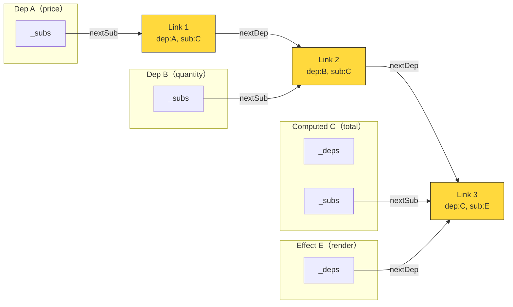
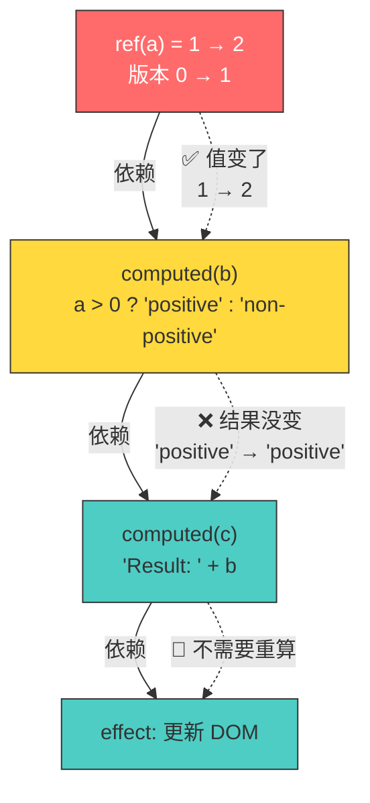

<div v-pre>

# 第 4 章 @vue/reactivity 源码深度剖析（上）：reactive / ref / track / trigger / computed

> **本章要点**
>
> - reactive() 的完整实现：Proxy handler 的五大拦截陷阱
> - ref() 的设计取舍：为什么基本类型需要 .value 包装
> - track() 与 trigger()：依赖收集与触发更新的核心机制
> - computed() 的惰性求值：如何用版本号实现"不读不算"
> - 从 WeakMap 到 Link 链表：依赖存储结构的演进

---

深夜的代码审查室里，一位资深工程师正在排查一个诡异的 Bug：用户修改了购物车中某件商品的数量，价格却没有联动更新。他打开 Vue DevTools，发现 `cartTotal` 这个 computed 属性的依赖列表中居然没有 `quantity`——但模板里明明写着 `{{ item.price * item.quantity }}`。

"依赖是什么时候被收集的？"他自言自语，然后打开了 `packages/reactivity/src/reactive.ts`。

两个小时后，他不仅修复了 Bug（一个在条件分支中遗漏的响应式解包），还彻底理解了 Vue 响应式系统的依赖追踪机制。他后来告诉我："那两个小时比我看十篇博文都值。因为源码回答的不是'这个 API 怎么用'，而是'这个系统怎么想'。"

本章，我们就来做同样的事——打开 `@vue/reactivity` 的源码，逐行解析 `reactive()`、`ref()`、`track()`、`trigger()` 和 `computed()` 的完整实现。

## 4.1 reactive()：Proxy 的五大拦截陷阱

### 从使用到实现

`reactive()` 是 Vue 3 中最基础的响应式 API。它接收一个普通对象，返回一个响应式代理：

```typescript
import { reactive } from 'vue'

const state = reactive({
  user: { name: 'Alice', age: 25 },
  items: [1, 2, 3]
})

state.user.name = 'Bob'  // 触发更新
state.items.push(4)       // 触发更新
delete state.user.age     // 触发更新
'name' in state.user      // 被追踪
```

表面看，`reactive()` 只是用 `Proxy` 包了一层。但当你打开源码时，会发现 Proxy handler 中的每一个拦截器（trap）都充满了精心设计的细节。

### reactive() 的入口

```typescript
// packages/reactivity/src/reactive.ts

export function reactive<T extends object>(target: T): Reactive<T> {
  // 如果已经是 readonly，直接返回
  if (isReadonly(target)) {
    return target
  }
  return createReactiveObject(
    target,
    false,           // isReadonly
    mutableHandlers, // 对象的 Proxy handler
    mutableCollectionHandlers, // Map/Set 的 Proxy handler
    reactiveMap      // WeakMap 缓存
  )
}
```

注意两个关键细节：

1. **两套 handler**：普通对象和集合类型（Map、Set、WeakMap、WeakSet）使用不同的 Proxy handler，因为集合类型的操作方式（`.get()`、`.set()`、`.add()`）与普通对象（`.prop`、`obj[key]`）完全不同。

2. **WeakMap 缓存**：同一个对象只会被代理一次。重复调用 `reactive(obj)` 返回同一个代理实例。

```typescript
// packages/reactivity/src/reactive.ts

function createReactiveObject(
  target: object,
  isReadonly: boolean,
  baseHandlers: ProxyHandler<any>,
  collectionHandlers: ProxyHandler<any>,
  proxyMap: WeakMap<object, any>
) {
  // 1. 非对象类型直接返回
  if (!isObject(target)) {
    return target
  }

  // 2. 已经是代理了，直接返回（除非要对 reactive 对象做 readonly）
  if (target[ReactiveFlags.RAW] && !(isReadonly && target[ReactiveFlags.IS_REACTIVE])) {
    return target
  }

  // 3. 检查缓存
  const existingProxy = proxyMap.get(target)
  if (existingProxy) {
    return existingProxy
  }

  // 4. 检查目标类型是否可以被代理
  const targetType = getTargetType(target)
  if (targetType === TargetType.INVALID) {
    return target  // ← 标记了 __v_skip 或被冻结的对象不代理
  }

  // 5. 创建代理
  const proxy = new Proxy(
    target,
    targetType === TargetType.COLLECTION
      ? collectionHandlers  // Map/Set
      : baseHandlers         // 普通对象/数组
  )

  // 6. 存入缓存
  proxyMap.set(target, proxy)
  return proxy
}
```

> 🔥 **深度洞察**
>
> `getTargetType()` 函数会检查对象的 `Object.isExtensible()` 状态。被冻结（`Object.freeze()`）或被密封（`Object.seal()`）的对象不会被代理。这不是一个任意的限制——`Proxy` 规范要求代理的行为必须与目标对象的不变量（invariant）一致。如果目标对象的属性是不可配置的，Proxy 的 `get` trap 必须返回与目标属性相同的值。对冻结对象创建响应式代理会导致 Proxy 内部抛出 TypeError——Vue 选择在入口处就避免这种情况。

### mutableHandlers：五大拦截陷阱

`mutableHandlers` 是普通对象的 Proxy handler，包含五个陷阱函数：

```typescript
// packages/reactivity/src/baseHandlers.ts

export const mutableHandlers: ProxyHandler<object> = {
  get,           // 拦截属性读取 → 依赖收集
  set,           // 拦截属性赋值 → 触发更新
  deleteProperty, // 拦截 delete → 触发更新
  has,           // 拦截 in 操作符 → 依赖收集
  ownKeys        // 拦截 Object.keys() / for...in → 依赖收集
}
```

#### Trap 1: get — 属性读取与依赖收集

```typescript
// packages/reactivity/src/baseHandlers.ts（简化）

function get(target: object, key: string | symbol, receiver: object) {
  // 1. 内部标志位处理
  if (key === ReactiveFlags.IS_REACTIVE) return true
  if (key === ReactiveFlags.IS_READONLY) return false
  if (key === ReactiveFlags.RAW) {
    if (receiver === reactiveMap.get(target)) {
      return target  // ← toRaw() 的实现基础
    }
  }

  const targetIsArray = isArray(target)

  // 2. 数组方法的特殊处理
  if (targetIsArray && hasOwn(arrayInstrumentations, key)) {
    return Reflect.get(arrayInstrumentations, key, receiver)
  }

  // 3. 正常的属性读取
  const res = Reflect.get(target, key, receiver)

  // 4. Symbol 和不可追踪的 key 不收集依赖
  if (isSymbol(key) ? builtInSymbols.has(key) : isNonTrackableKeys(key)) {
    return res
  }

  // 5. 依赖收集 ← 核心！
  track(target, TrackOpTypes.GET, key)

  // 6. 如果值是 ref，自动解包
  if (isRef(res)) {
    return targetIsArray && isIntegerKey(key) ? res : res.value
  }

  // 7. 如果值是对象，递归代理（惰性代理）
  if (isObject(res)) {
    return reactive(res)  // ← 懒代理：只有被访问的属性才会被代理
  }

  return res
}
```

这个 `get` trap 中有几个精妙的设计值得深入讨论：

**惰性代理（Lazy Proxy）**

当你执行 `reactive({ a: { b: { c: 1 } } })` 时，Vue 并不会递归地对所有嵌套对象创建 Proxy。只有当 `state.a` 被访问时，`{ b: { c: 1 } }` 才会被代理；只有当 `state.a.b` 被访问时，`{ c: 1 }` 才会被代理。

这是一个关键的性能优化——如果一个对象有 100 个嵌套属性，但用户只使用了其中 3 个，其余 97 个属性的 Proxy 创建开销就被完全避免了。

**自动 ref 解包**

如果 `reactive` 对象的某个属性是一个 `ref`，读取时会自动解包：

```typescript
const count = ref(0)
const state = reactive({ count })

console.log(state.count)  // 0（而不是 ref 对象）
// 等价于 state.count.value，但不需要写 .value
```

但注意第 6 步的条件判断：**数组中的 ref 元素不会自动解包**。这是因为数组索引操作（`arr[0]`）在语义上不应该"穿透"包装对象——你期望 `arr[0]` 返回数组中实际存储的元素，而不是被悄悄解包后的值。

#### Trap 2: set — 属性赋值与触发更新

```typescript
// packages/reactivity/src/baseHandlers.ts（简化）

function set(
  target: object,
  key: string | symbol,
  value: unknown,
  receiver: object
): boolean {
  let oldValue = (target as any)[key]

  // 1. 如果旧值是 ref 而新值不是，更新 ref 的 .value
  if (isRef(oldValue) && !isRef(value)) {
    oldValue.value = value
    return true
  }

  // 2. 判断是新增还是修改
  const hadKey = isArray(target)
    ? Number(key) < target.length
    : hasOwn(target, key)

  // 3. 执行真正的赋值
  const result = Reflect.set(target, key, value, receiver)

  // 4. 只有代理自身（非原型链）的操作才触发更新
  if (target === toRaw(receiver)) {
    if (!hadKey) {
      trigger(target, TriggerOpTypes.ADD, key, value)
    } else if (hasChanged(value, oldValue)) {
      trigger(target, TriggerOpTypes.SET, key, value, oldValue)
    }
  }

  return result
}
```

关键细节：

- **区分 ADD 和 SET**：新增属性和修改属性触发不同类型的更新。这对于 `watch` 的深度监听和数组的 `length` 响应非常重要。
- **`hasChanged` 检查**：如果新旧值相同（使用 `Object.is` 比较），不触发更新。这避免了无意义的重渲染。
- **原型链保护**：只有对代理自身的操作才触发更新，继承链上的操作被忽略。

#### Trap 3–5: deleteProperty / has / ownKeys

```typescript
// deleteProperty — delete obj.key
function deleteProperty(target: object, key: string | symbol): boolean {
  const hadKey = hasOwn(target, key)
  const result = Reflect.deleteProperty(target, key)
  if (result && hadKey) {
    trigger(target, TriggerOpTypes.DELETE, key)  // ← 删除也能触发更新
  }
  return result
}

// has — 'key' in obj
function has(target: object, key: string | symbol): boolean {
  const result = Reflect.has(target, key)
  if (!isSymbol(key) || !builtInSymbols.has(key)) {
    track(target, TrackOpTypes.HAS, key)  // ← in 操作符也能追踪
  }
  return result
}

// ownKeys — Object.keys(obj) / for...in
function ownKeys(target: object): (string | symbol)[] {
  track(
    target,
    TrackOpTypes.ITERATE,
    isArray(target) ? 'length' : ITERATE_KEY  // ← 追踪迭代操作
  )
  return Reflect.ownKeys(target)
}
```

> 💡 **最佳实践**
>
> `ownKeys` trap 追踪的是 `ITERATE_KEY`，而非具体的属性名。这意味着当你使用 `Object.keys(state)` 或 `for...in` 遍历对象时，新增或删除属性都会触发依赖更新。这就是为什么 `v-for` 遍历响应式对象时，新增属性能够自动触发重渲染——不需要像 Vue 2 那样使用 `Vue.set()`。

### 数组方法的特殊处理

数组的响应式处理比普通对象复杂得多。Vue 对几类数组方法做了特殊拦截：

```typescript
// packages/reactivity/src/baseHandlers.ts（简化）

const arrayInstrumentations: Record<string, Function> = {}

// 查找方法：includes、indexOf、lastIndexOf
;(['includes', 'indexOf', 'lastIndexOf'] as const).forEach(key => {
  arrayInstrumentations[key] = function(this: unknown[], ...args: unknown[]) {
    const arr = toRaw(this)
    // 追踪数组每个元素的访问
    for (let i = 0, l = this.length; i < l; i++) {
      track(arr, TrackOpTypes.GET, i + '')
    }
    // 先用原始参数查找
    const res = arr[key](...args)
    if (res === -1 || res === false) {
      // 如果没找到，用 toRaw 后的参数再试一次
      return arr[key](...args.map(toRaw))
    }
    return res
  }
})

// 变异方法：push、pop、shift、unshift、splice
;(['push', 'pop', 'shift', 'unshift', 'splice'] as const).forEach(key => {
  arrayInstrumentations[key] = function(this: unknown[], ...args: unknown[]) {
    pauseTracking()     // ← 暂停依赖收集！
    const res = (toRaw(this) as any)[key].apply(this, args)
    resetTracking()     // ← 恢复依赖收集
    return res
  }
})
```

> 🔥 **深度洞察**
>
> 为什么 `push` 等变异方法需要暂停依赖收集？考虑这个场景：
>
> ```typescript
> const arr = reactive([])
> effect(() => arr.push(1))  // effect 1
> effect(() => arr.push(2))  // effect 2
> ```
>
> `arr.push(1)` 内部会读取 `arr.length`（确定插入位置），然后设置 `arr[0] = 1` 和 `arr.length = 1`。如果不暂停追踪，effect 1 会收集到对 `length` 的依赖。当 effect 2 执行 `push(2)` 修改 `length` 时，effect 1 被触发重新执行，再次 `push`，导致无限循环。`pauseTracking()` 优雅地解决了这个问题——在变异方法执行期间，不收集任何新的依赖。

## 4.2 ref()：为什么基本类型需要 .value

### ref 的存在理由

JavaScript 的 `Proxy` 只能代理对象，不能代理基本类型（number、string、boolean）。但我们经常需要让基本类型也具有响应式：

```typescript
// 这不行 — Proxy 无法代理 number
const count = reactive(0)  // ❌ 返回 0，不是代理

// 这可以 — ref 用对象包装基本类型
const count = ref(0)       // ✅ 返回 { value: 0 }
```

`ref` 的解决方案是：**用一个对象包装值，通过 getter/setter 拦截 `.value` 的读写。**

### ref 的完整实现

```typescript
// packages/reactivity/src/ref.ts（简化）

class RefImpl<T = any> {
  _value: T
  _rawValue: T
  readonly [ReactiveFlags.IS_REF] = true

  // dep 是 Alien Signals 的依赖节点
  dep: Dep

  constructor(value: T, isShallow: boolean) {
    this._rawValue = isShallow ? value : toRaw(value)
    this._value = isShallow ? value : toReactive(value)
    this.dep = new Dep()
  }

  get value(): T {
    // 依赖收集
    this.dep.track()
    return this._value
  }

  set value(newValue: T) {
    const oldValue = this._rawValue
    // 是否使用原始值比较
    const useDirectValue = this.__v_isShallow || isShallow(newValue) || isReadonly(newValue)
    newValue = useDirectValue ? newValue : toRaw(newValue)

    if (hasChanged(newValue, oldValue)) {
      this._rawValue = newValue
      this._value = useDirectValue ? newValue : toReactive(newValue)
      // 触发更新
      this.dep.trigger()
    }
  }
}

export function ref<T>(value: T): Ref<T> {
  if (isRef(value)) {
    return value  // ← 已经是 ref，直接返回
  }
  return new RefImpl(value, false)
}
```

几个关键设计决策：

**1. `_rawValue` 与 `_value` 的分离**

`_rawValue` 存储未经处理的原始值（用于比较是否发生变化），`_value` 存储用户实际读取到的值。当值是对象时，`_value` 是 `reactive(value)`——这意味着 `ref({ name: 'Vue' }).value` 返回的是一个 reactive 代理。

```typescript
const obj = { name: 'Vue' }
const r = ref(obj)

r.value === obj           // false — r.value 是 reactive 代理
r.value.name              // 'Vue' — 可以直接访问属性
isReactive(r.value)       // true — 嵌套对象自动变为 reactive
```

**2. `hasChanged` 防止无效更新**

```typescript
// packages/shared/src/general.ts
export const hasChanged = (value: any, oldValue: any): boolean =>
  !Object.is(value, oldValue)
```

`Object.is` 比 `===` 更精确——它能正确处理 `NaN === NaN`（返回 true）和 `+0 === -0`（返回 false）这两个 `===` 的边界情况。

**3. Dep 类——Alien Signals 的依赖节点**

在 Vue 3.6 中，`Dep` 不再是一个 `Set<ReactiveEffect>`，而是一个 Alien Signals 的依赖节点：

```typescript
// packages/reactivity/src/dep.ts（简化）

export class Dep {
  // 版本号——每次值变化时递增
  _version = 0

  // 订阅者链表头
  _subs: Link | undefined = undefined

  // 全局版本号
  _globalVersion = globalVersion

  track(): Link | undefined {
    if (activeEffect) {
      // 将当前 effect 添加到订阅者链表
      return link(this, activeEffect)
    }
  }

  trigger(): void {
    this._version++
    globalVersion++
    // 通知所有订阅者
    propagate(this._subs)
  }
}
```

### ref vs reactive 的选择

| 维度 | ref | reactive |
|------|-----|----------|
| 适用类型 | 任何类型（基本类型 + 对象） | 仅对象 |
| 访问方式 | `.value` | 直接属性访问 |
| 解构 | 解构后保持响应式（`toRefs`） | 解构后丢失响应式 |
| 模板中 | 自动解包（不需要 `.value`） | 直接使用 |
| 替换整个值 | ✅（`ref.value = newObj`） | ❌（`state = newObj` 不触发更新） |
| 底层实现 | getter/setter（class property） | Proxy |

> 🔥 **深度洞察**
>
> Vue 社区常见的争论——"该用 `ref` 还是 `reactive`"——其实有一个简单的指导原则：**`ref` 更安全。** `reactive` 有两个容易踩的坑：（1）解构丢失响应性：`const { name } = reactive({ name: 'Vue' })` 中 `name` 只是一个普通字符串；（2）整体替换无效：`state = reactive({ name: 'React' })` 只是让局部变量 `state` 指向一个新对象，原来的响应式代理没有任何变化。`ref` 通过 `.value` 的间接访问，天然避免了这两个问题。Vue 核心团队（包括尤雨溪本人）也推荐默认使用 `ref`。

## 4.3 track()：依赖收集的完整流程

依赖收集是响应式系统的左半部分——当响应式数据被读取时，系统需要记录"谁在读取"。

### Vue 3.6 中的 track 实现

在 Alien Signals 架构下，`track` 的实现已经大幅简化：

```typescript
// packages/reactivity/src/dep.ts（简化）

// 全局变量：当前正在执行的 effect
export let activeSub: Subscriber | undefined

export function track(target: object, type: TrackOpTypes, key: unknown): void {
  if (shouldTrack && activeSub) {
    // 获取或创建目标对象的依赖映射
    let depsMap = targetMap.get(target)
    if (!depsMap) {
      targetMap.set(target, (depsMap = new Map()))
    }

    // 获取或创建具体属性的依赖节点
    let dep = depsMap.get(key)
    if (!dep) {
      depsMap.set(key, (dep = new Dep()))
    }

    // 将当前 subscriber 链接到这个 dep
    dep.track()
  }
}
```

依赖存储的数据结构是一个两级 Map：

```
targetMap: WeakMap<target, Map<key, Dep>>

例如：
targetMap = WeakMap {
  { name: 'Vue', version: 3.6 } => Map {
    'name'    => Dep { _version: 2, _subs: Link → ... },
    'version' => Dep { _version: 0, _subs: Link → ... }
  }
}
```

### Link——双向链表节点

在 Vue 3.6 中，`Dep` 和 `Subscriber`（effect/computed）之间的关系通过 `Link` 节点维护，形成双向链表：

```typescript
// packages/reactivity/src/dep.ts（简化）

interface Link {
  dep: Dep                    // 指向依赖源
  sub: Subscriber             // 指向订阅者

  // dep 维度的链表（同一个 dep 的所有 subscriber）
  prevSub: Link | undefined
  nextSub: Link | undefined

  // sub 维度的链表（同一个 subscriber 的所有 dep）
  prevDep: Link | undefined
  nextDep: Link | undefined

  // 版本快照——建立链接时 dep 的版本号
  version: number
}
```

这个双向链表结构可以用下图理解：



每个 `Link` 节点同时属于两个链表：
- **沿 dep 维度**（`prevSub`/`nextSub`）：链接同一个 Dep 的所有 Subscriber
- **沿 sub 维度**（`prevDep`/`nextDep`）：链接同一个 Subscriber 的所有 Dep

> 🔥 **深度洞察**
>
> 双向链表的设计看似比 `Set` 更复杂，但它解决了 Set-based 方案的根本性能问题——**cleanup 开销**。在旧版 Vue 中，每次 effect 重新执行时，它必须从所有 Dep 的 Set 中删除自己（O(n) 次 `Set.delete`），然后重新收集依赖（O(n) 次 `Set.add`）。在 Link 链表中，这个过程变成了链表指针的重新排列——O(1) 的指针操作取代了 O(n) 的 Set 操作。更重要的是，Link 节点可以被复用（不需要创建新对象），消除了 GC 压力。

### link() 函数——建立依赖关系

```typescript
// packages/reactivity/src/dep.ts（简化）

export function link(dep: Dep, sub: Subscriber): Link {
  // 检查是否已有这个链接（通过遍历 sub 的 dep 链表）
  const currentDep = sub._depsTail
  if (currentDep !== undefined && currentDep.dep === dep) {
    // 已存在，复用
    return currentDep
  }

  // 创建新的 Link 节点
  const newLink: Link = {
    dep,
    sub,
    version: dep._version,  // ← 快照当前版本号
    prevDep: currentDep,
    nextDep: undefined,
    prevSub: undefined,
    nextSub: undefined,
  }

  // 链入 sub 的 dep 链表
  if (currentDep) {
    currentDep.nextDep = newLink
  } else {
    sub._deps = newLink
  }
  sub._depsTail = newLink

  // 链入 dep 的 sub 链表
  if (dep._subs) {
    const oldTail = dep._subsTail!
    newLink.prevSub = oldTail
    oldTail.nextSub = newLink
  } else {
    dep._subs = newLink
  }
  dep._subsTail = newLink

  return newLink
}
```

## 4.4 trigger()：触发更新的完整流程

当响应式数据被修改时，`trigger` 函数启动更新传播：

```typescript
// packages/reactivity/src/dep.ts（简化）

export function trigger(
  target: object,
  type: TriggerOpTypes,
  key?: unknown,
  newValue?: unknown,
  oldValue?: unknown
): void {
  const depsMap = targetMap.get(target)
  if (!depsMap) return  // 这个对象没有被追踪

  let deps: Dep[] = []

  if (type === TriggerOpTypes.CLEAR) {
    // Map/Set.clear() — 触发所有依赖
    deps = [...depsMap.values()]
  } else if (key === 'length' && isArray(target)) {
    // 数组 length 变化 — 触发 length 和受影响的索引
    depsMap.forEach((dep, key) => {
      if (key === 'length' || (isIntegerKey(key) && Number(key) >= (newValue as number))) {
        deps.push(dep)
      }
    })
  } else {
    // 普通属性变化
    if (key !== void 0) {
      const dep = depsMap.get(key)
      if (dep) deps.push(dep)
    }

    // ADD/DELETE 还需要触发迭代相关的依赖
    switch (type) {
      case TriggerOpTypes.ADD:
        if (!isArray(target)) {
          const iterateDep = depsMap.get(ITERATE_KEY)
          if (iterateDep) deps.push(iterateDep)
        } else if (isIntegerKey(key)) {
          // 数组新增元素 → length 变了
          const lengthDep = depsMap.get('length')
          if (lengthDep) deps.push(lengthDep)
        }
        break
      case TriggerOpTypes.DELETE:
        if (!isArray(target)) {
          const iterateDep = depsMap.get(ITERATE_KEY)
          if (iterateDep) deps.push(iterateDep)
        }
        break
      case TriggerOpTypes.SET:
        if (isMap(target)) {
          const iterateDep = depsMap.get(ITERATE_KEY)
          if (iterateDep) deps.push(iterateDep)
        }
        break
    }
  }

  // 触发所有收集到的 Dep
  for (const dep of deps) {
    dep.trigger()
  }
}
```

### 触发更新的类型矩阵

| 操作 | 触发的 Dep | 示例 |
|------|-----------|------|
| `obj.key = val`（已存在） | `key` 对应的 Dep | `state.name = 'React'` |
| `obj.key = val`（新属性） | `key` 的 Dep + `ITERATE_KEY` 的 Dep | `state.newProp = 1` |
| `delete obj.key` | `key` 的 Dep + `ITERATE_KEY` 的 Dep | `delete state.name` |
| `arr[i] = val`（越界） | `i` 的 Dep + `length` 的 Dep | `arr[10] = 'x'`（length < 10） |
| `arr.length = n` | `length` 的 Dep + 所有 `≥ n` 的索引 Dep | `arr.length = 0`（清空数组） |
| `map.set(k, v)` | `k` 的 Dep + `ITERATE_KEY` 的 Dep | `map.set('a', 1)` |
| `set.clear()` | 所有 Dep | `set.clear()` |

### propagate()——Alien Signals 的传播算法

当 `dep.trigger()` 被调用时，它最终调用 `propagate()` 沿链表通知所有订阅者：

```typescript
// packages/reactivity/src/dep.ts（简化）

function propagate(subs: Link | undefined): void {
  let link = subs
  while (link) {
    const sub = link.sub
    const subFlags = sub._flags

    if (sub._flags & SubscriberFlags.COMPUTED) {
      // 如果订阅者是 computed，标记为可能脏（MAYBE_DIRTY）
      // 不立即重算——等到被读取时才惰性求值
      sub._flags |= SubscriberFlags.DIRTY
      // 继续向下传播（computed 的订阅者也需要知道）
      if (sub._subs) {
        propagate(sub._subs)
      }
    } else {
      // 如果订阅者是 effect，加入调度队列
      if (sub.scheduler) {
        sub.scheduler()  // ← 组件更新走 scheduler
      } else {
        sub.run()         // ← watchEffect 直接执行
      }
    }

    link = link.nextSub
  }
}
```

> 🔥 **深度洞察**
>
> `propagate` 对 computed 和 effect 的不同处理方式，正是 Alien Signals "混合推拉模型"的具体体现。对于 computed，只做标记（DIRTY），不做实际计算——这是"拉"的部分，等待消费者主动读取。对于 effect，立即调度执行——这是"推"的部分，因为 effect 没有消费者来"拉"它，必须主动推送执行。这种差异化处理是 Alien Signals 相比纯推模型（Vue 3.0–3.4）的核心优化点：**如果一个 computed 没人读，它永远不会被重算。**

## 4.5 computed()：惰性求值的精妙实现

### computed 的核心特性

`computed` 是响应式系统中最精巧的部分。它同时是一个**消费者**（依赖其他信号/计算）和一个**生产者**（被 effect 或其他 computed 依赖）。它的核心行为是惰性求值——只在被读取时才检查是否需要重新计算。

```typescript
const price = ref(10)
const quantity = ref(3)
const total = computed(() => price.value * quantity.value)

// 此时 total 还没有被计算——getter 函数没有执行
console.log(total.value)  // 30 — 此时才首次执行 getter

price.value = 20          // total 被标记为 dirty，但不重算
console.log(total.value)  // 60 — 此时才重新计算
```

### computed 的完整实现

```typescript
// packages/reactivity/src/computed.ts（简化）

export class ComputedRefImpl<T = any> {
  _value: T = undefined as T
  readonly dep: Dep = new Dep()

  // 作为 subscriber 的属性
  _deps: Link | undefined = undefined
  _depsTail: Link | undefined = undefined
  _flags: number = SubscriberFlags.COMPUTED | SubscriberFlags.DIRTY
  _globalVersion: number = globalVersion - 1

  constructor(
    private readonly _fn: ComputedGetter<T>,
    private readonly _setter: ComputedSetter<T> | undefined,
    isSSR: boolean
  ) {}

  get value(): T {
    // 1. 检查是否需要重算
    const flags = this._flags
    if (
      flags & (SubscriberFlags.DIRTY | SubscriberFlags.MAYBE_DIRTY) ||
      this._globalVersion !== globalVersion
    ) {
      if (this._globalVersion !== globalVersion) {
        this._globalVersion = globalVersion
      }
      // 2. 尝试更新值
      this.update()
    }

    // 3. 依赖收集（让消费者追踪这个 computed）
    this.dep.track()
    return this._value
  }

  set value(newValue: T) {
    if (this._setter) {
      this._setter(newValue)
    }
  }

  update(): boolean {
    const oldValue = this._value

    // 1. 检查依赖是否真的变了
    if (this._flags & SubscriberFlags.MAYBE_DIRTY) {
      // 惰性脏检查——递归检查上游依赖
      if (!checkDirty(this._deps!)) {
        this._flags &= ~SubscriberFlags.MAYBE_DIRTY
        return false  // ← 依赖没变，不需要重算
      }
    }

    // 2. 重新计算
    const prevSub = activeSub
    activeSub = this  // ← 将自己设为当前活跃 subscriber
    try {
      const newValue = this._fn()  // ← 执行 getter
      if (hasChanged(newValue, oldValue)) {
        this._value = newValue
        this.dep._version++  // ← 值变了，递增版本号
        return true
      }
      return false           // ← 值没变，不递增版本号
    } finally {
      activeSub = prevSub
      this._flags &= ~(SubscriberFlags.DIRTY | SubscriberFlags.MAYBE_DIRTY)
    }
  }
}
```

### checkDirty：渐进式脏检查

`checkDirty` 是 Alien Signals 最精巧的算法。它实现了**渐进式脏检查**——不是简单地回答"你脏了吗"，而是沿着依赖链逐层检查"你的哪个依赖变了"：

```typescript
// packages/reactivity/src/dep.ts（简化）

function checkDirty(deps: Link): boolean {
  let link: Link | undefined = deps
  while (link) {
    const dep = link.dep

    if (dep._version !== link.version) {
      // 版本号不匹配——依赖确实变了
      // 如果 dep 是 computed，先让它更新
      if ('update' in dep) {
        (dep as ComputedRefImpl).update()
        if (dep._version !== link.version) {
          return true  // ← 更新后版本号仍然不匹配，确实脏了
        }
      } else {
        return true    // ← dep 是 signal，版本号变了就是脏了
      }
    }

    // 更新 link 的版本快照
    link.version = dep._version
    link = link.nextDep
  }
  return false  // ← 所有依赖都没变
}
```

让我们用一个例子来理解这个算法：

```typescript
const a = ref(1)
const b = computed(() => a.value > 0 ? 'positive' : 'non-positive')
const c = computed(() => `Result: ${b.value}`)

// 初始状态：
// a._version = 0, b._version = 0, c._version = 0
// b._value = 'positive', c._value = 'Result: positive'

a.value = 2  // a._version = 1, b 和 c 被标记为 MAYBE_DIRTY

console.log(c.value)
// 1. c.get() → c 是 MAYBE_DIRTY → checkDirty(c._deps)
// 2. checkDirty 检查 c 的依赖 b：b._version(0) vs link.version(0) → 匹配
//    但 b 也是 MAYBE_DIRTY → 递归检查 b
// 3. b.update() → b._fn() → a.value > 0 → true → 'positive'
//    b._value 从 'positive' 到 'positive' → 没变！→ b._version 不递增
// 4. 回到 c 的 checkDirty → b._version 仍然匹配 → 返回 false
// 5. c 不需要重算！
```

这就是 Alien Signals 的"变化过滤"能力：虽然 `a` 从 1 变成了 2，但 `b` 的结果没变（仍然是 `'positive'`），所以 `c` 不需要重算。每一层 computed 都是一道"变化防火墙"。



> 💡 **最佳实践**
>
> 利用 computed 的"变化防火墙"特性来优化性能。当你有一个复杂的数据转换链时，将其拆分为多层 computed。每一层都可能过滤掉无意义的变化，避免不必要的下游更新：
>
> ```typescript
> // 不好 — 一层计算，任何输入变化都触发 DOM 更新
> const display = computed(() => {
>   const items = filterItems(rawItems.value, filter.value)
>   const sorted = sortItems(items, sortKey.value)
>   return formatForDisplay(sorted)
> })
>
> // 好 — 三层计算，每层都是一道过滤器
> const filtered = computed(() => filterItems(rawItems.value, filter.value))
> const sorted = computed(() => sortItems(filtered.value, sortKey.value))
> const display = computed(() => formatForDisplay(sorted.value))
> // 如果 sortKey 变了但排序结果不变，display 不会重算
> ```

## 4.6 集合类型的响应式处理

Vue 对 `Map`、`Set`、`WeakMap`、`WeakSet` 使用了完全独立的 Proxy handler，因为这些集合类型的操作方式与普通对象截然不同。

### 为什么需要特殊处理

```typescript
const map = reactive(new Map())

// Map 的操作通过方法调用，不是属性访问
map.set('key', 'value')  // 不能用 set trap（那是属性赋值的 trap）
map.get('key')            // 不能用 get trap（那是属性读取的 trap）
map.has('key')            // 不能用 has trap（那是 in 操作符的 trap）
```

Vue 的解决方案是**拦截方法的获取，返回修改过的方法实现**：

```typescript
// packages/reactivity/src/collectionHandlers.ts（简化）

const mutableCollectionHandlers: ProxyHandler<any> = {
  get(target, key, receiver) {
    // 当用户访问 map.get / map.set / map.has 等方法时
    // 返回我们包装过的方法
    if (key === 'get') return instrumentedGet
    if (key === 'set') return instrumentedSet
    if (key === 'has') return instrumentedHas
    if (key === 'delete') return instrumentedDelete
    if (key === 'clear') return instrumentedClear
    if (key === 'forEach') return instrumentedForEach
    if (key === 'size') {
      track(target, TrackOpTypes.ITERATE, ITERATE_KEY)
      return Reflect.get(target, 'size', target)
    }
    // ...
    return Reflect.get(target, key, receiver)
  }
}

function instrumentedGet(this: Map<any, any>, key: unknown) {
  const target = toRaw(this)
  track(target, TrackOpTypes.GET, key)  // ← 追踪键的访问
  const value = target.get(key)
  return isObject(value) ? reactive(value) : value  // ← 嵌套对象惰性代理
}

function instrumentedSet(this: Map<any, any>, key: unknown, value: unknown) {
  const target = toRaw(this)
  const hadKey = target.has(key)
  const oldValue = target.get(key)
  target.set(key, toRaw(value))
  if (!hadKey) {
    trigger(target, TriggerOpTypes.ADD, key, value)
  } else if (hasChanged(value, oldValue)) {
    trigger(target, TriggerOpTypes.SET, key, value, oldValue)
  }
}
```

### 集合操作的追踪矩阵

| 操作 | track/trigger | 追踪的 key |
|------|--------------|-----------|
| `map.get(k)` | track | `k` |
| `map.set(k, v)` | trigger（ADD 或 SET） | `k` + `ITERATE_KEY`（如果是新 key） |
| `map.has(k)` | track | `k` |
| `map.delete(k)` | trigger（DELETE） | `k` + `ITERATE_KEY` |
| `map.clear()` | trigger（CLEAR） | 所有 key |
| `map.size` | track | `ITERATE_KEY` |
| `map.forEach()` | track | `ITERATE_KEY` |
| `set.add(v)` | trigger（ADD） | `v` + `ITERATE_KEY` |
| `set.delete(v)` | trigger（DELETE） | `v` + `ITERATE_KEY` |
| `set.has(v)` | track | `v` |

## 4.7 本章小结

本章深入 `@vue/reactivity` 的源码，逐一解析了五个核心 API 的完整实现。关键要点：

1. **reactive()** 使用 Proxy 的五大拦截陷阱（get/set/deleteProperty/has/ownKeys）实现全面的响应式追踪。惰性代理策略避免了对未访问属性的开销。

2. **ref()** 用 getter/setter 包装任意值（包括基本类型），内部的 `Dep` 节点是 Alien Signals 的依赖管理核心。

3. **track()** 通过 `targetMap`（WeakMap → Map → Dep）的两级映射定位依赖节点，通过 `Link` 双向链表建立 Dep 与 Subscriber 的关联。

4. **trigger()** 根据操作类型（ADD/SET/DELETE/CLEAR）精确确定需要通知的 Dep 集合，然后通过 `propagate()` 沿链表传播更新。

5. **computed()** 实现了惰性求值——只在被读取时才通过 `checkDirty()` 渐进式检查依赖是否变化。每一层 computed 都是一道"变化防火墙"，过滤掉无意义的更新。

6. **集合类型**（Map/Set）使用独立的 handler，通过拦截方法获取返回修改过的方法实现来追踪和触发更新。

下一章，我们将继续深入 `@vue/reactivity`，解析 `effect`、`effectScope`、`shallowReactive`、`readonly` 的实现，完成响应式系统的全景拼图。

---

## 思考题

1. **概念理解**：Vue 的 `reactive()` 使用了惰性代理策略——嵌套对象只在被访问时才创建 Proxy。请分析这种策略在"大对象、少量访问"和"小对象、频繁全量访问"两种场景下的性能表现差异。

2. **深入思考**：`ref` 的 `set value()` 中使用 `hasChanged(newValue, oldValue)` 避免无效更新。如果新值是一个对象（`ref.value = { name: 'Vue' }`），每次赋值即使内容相同，`Object.is` 也会返回 `false`（因为是不同的对象引用）。这会导致不必要的更新吗？Vue 是如何在 computed 层面缓解这个问题的？

3. **工程实践**：为什么 `push`、`pop` 等数组变异方法需要 `pauseTracking()`？请构造一个不暂停追踪时会导致无限循环的具体代码示例。

4. **横向对比**：Solid.js 使用函数调用（`count()`）来触发依赖收集，而 Vue 使用属性访问（`count.value`）。从 JavaScript 引擎优化（如 V8 的 hidden class 和 inline cache）的角度分析，哪种方式在运行时性能上可能更优？为什么？

5. **开放讨论**：`checkDirty()` 的渐进式脏检查可能导致深层依赖链的递归遍历。在极端情况下（如 100 层嵌套的 computed），这种递归的栈深度是否会成为问题？如果会，你能想到什么优化方案？


</div>
