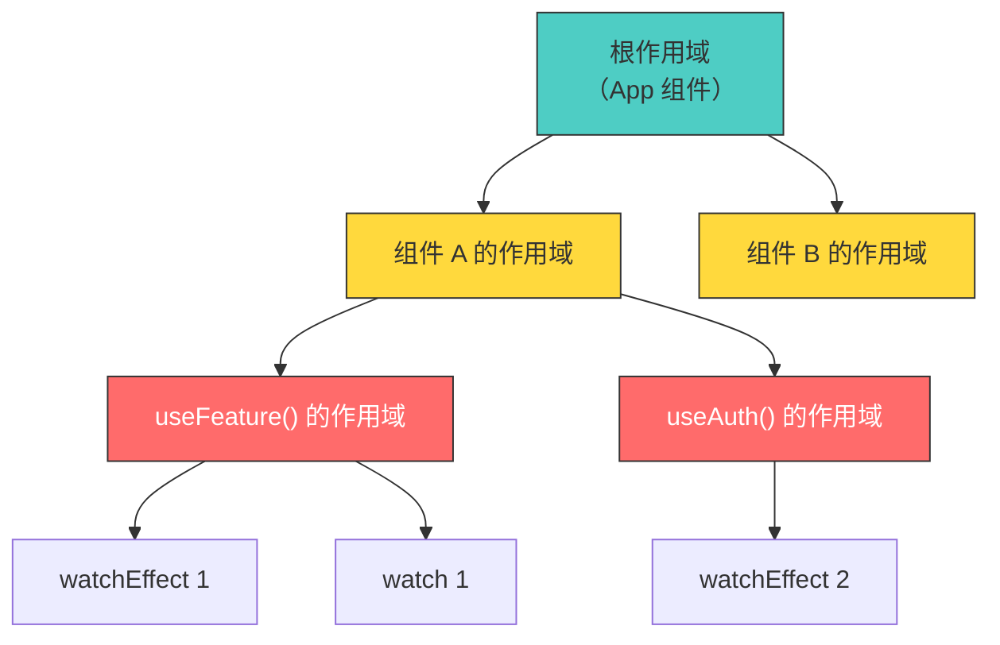
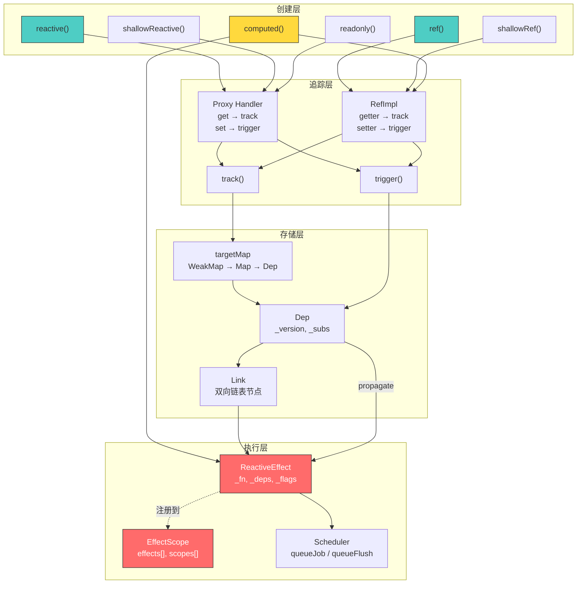

# 第 5 章 @vue/reactivity 源码深度剖析（下）：effect / effectScope / shallowReactive / readonly

> **本章要点**
>
> - effect() 的完整生命周期：创建、执行、依赖收集、清理、销毁
> - effectScope：为什么需要"作用域"来管理副作用
> - shallowReactive / shallowRef：何时需要"浅层"响应式
> - readonly / shallowReadonly：编译器如何利用只读优化
> - 响应式工具函数全景：toRaw / markRaw / isRef / unref / toRefs

---

你是否遇到过这样的场景：一个页面打开了 WebSocket 连接、启动了定时器、注册了 `watchEffect`——当用户离开页面时，这些副作用都需要被清理。忘记清理任何一个，都会导致内存泄漏。

在 Vue 2 中，你需要在 `beforeUnmount` 中手动管理每一个副作用的清理。在 Vue 3 中，`effectScope` 让你可以一行代码批量清理所有副作用。

但 `effectScope` 是如何做到的？它和 `effect` 之间的关系是什么？`effect` 本身的生命周期又是怎样的？

本章将继续深入 `@vue/reactivity`，完成响应式系统的最后几块拼图。

## 5.1 effect()：响应式系统的执行引擎

### effect 的本质

`effect` 是响应式系统中"副作用"的载体。当你写 `watchEffect`、`watch`，或者 Vue 内部创建组件的渲染更新函数时，底层都是 `effect`。

```typescript
import { ref, effect } from '@vue/reactivity'

const count = ref(0)

// 创建一个 effect
const runner = effect(() => {
  console.log(`count is: ${count.value}`)
})
// 输出: count is: 0

count.value = 1
// 输出: count is: 1（自动重新执行）

count.value = 2
// 输出: count is: 2（再次自动重新执行）
```

### ReactiveEffect 类

```typescript
// packages/reactivity/src/effect.ts（简化）

export class ReactiveEffect<T = any> implements Subscriber {
  // --- Subscriber 接口 ---
  _deps: Link | undefined = undefined
  _depsTail: Link | undefined = undefined
  _flags: number = SubscriberFlags.ACTIVE

  // --- Effect 特有 ---
  _fn: () => T
  _scheduler: EffectScheduler | undefined
  _cleanup: (() => void) | undefined

  // 当前作用域
  _scope: EffectScope | undefined

  constructor(fn: () => T) {
    this._fn = fn
    // 自动注册到当前活跃的 EffectScope
    if (activeEffectScope) {
      this._scope = activeEffectScope
      activeEffectScope.effects.push(this)
    }
  }

  run(): T {
    // 1. 如果已停止，直接执行函数（不收集依赖）
    if (!(this._flags & SubscriberFlags.ACTIVE)) {
      return this._fn()
    }

    // 2. 设置当前活跃 subscriber
    const prevSub = activeSub
    activeSub = this

    // 3. 开启追踪
    const prevShouldTrack = shouldTrack
    shouldTrack = true

    try {
      // 4. 准备清理旧依赖
      prepareDeps(this)

      // 5. 执行函数 — 触发 getter → track → 建立新依赖
      const result = this._fn()

      // 6. 清理不再需要的旧依赖
      cleanupDeps(this)

      return result
    } finally {
      // 7. 恢复之前的上下文
      activeSub = prevSub
      shouldTrack = prevShouldTrack
    }
  }

  stop(): void {
    if (this._flags & SubscriberFlags.ACTIVE) {
      // 清理所有依赖链接
      removeDeps(this)
      // 执行清理回调
      if (this._cleanup) {
        this._cleanup()
      }
      this._flags &= ~SubscriberFlags.ACTIVE
    }
  }
}
```

### 依赖的生命周期管理

每次 `effect.run()` 执行时，需要处理一个微妙的问题：**依赖可能在两次执行之间发生变化**。

考虑这个场景：

```typescript
const show = ref(true)
const a = ref('hello')
const b = ref('world')

effect(() => {
  if (show.value) {
    console.log(a.value)  // 第一次执行：依赖 show 和 a
  } else {
    console.log(b.value)  // 第二次执行：依赖 show 和 b
  }
})
```

当 `show.value` 从 `true` 变为 `false` 时，effect 重新执行。此时它不再依赖 `a`，而是依赖 `b`。旧的对 `a` 的依赖必须被清理，否则 `a.value` 变化时仍会触发这个 effect——这就是"过期依赖"问题。

```typescript
// packages/reactivity/src/dep.ts（简化）

function prepareDeps(sub: Subscriber): void {
  // 遍历所有旧的依赖 Link，标记版本号为 -1
  let link = sub._deps
  while (link) {
    link.version = -1  // ← 标记为"待验证"
    link = link.nextDep
  }
}

function cleanupDeps(sub: Subscriber): void {
  // 遍历所有 Link，移除版本号仍为 -1 的（未被重新访问的依赖）
  let link = sub._deps
  let prev: Link | undefined

  while (link) {
    const next = link.nextDep
    if (link.version === -1) {
      // 这个依赖在最近一次执行中没有被访问 → 移除
      unlinkDep(link)
      if (prev) {
        prev.nextDep = next
      } else {
        sub._deps = next
      }
    } else {
      prev = link
    }
    link = next
  }
  sub._depsTail = prev
}
```

> 🔥 **深度洞察**
>
> `prepareDeps` + `cleanupDeps` 的"标记-清扫"策略，与 GC（垃圾回收）的标记-清扫算法如出一辙。在 Vue 3.0–3.4 中，处理过期依赖的方式是"先全部删除，再重新收集"——每次执行都从零开始。Alien Signals 的方式更聪明：先标记所有旧依赖为"待验证"（version = -1），执行过程中重新访问的依赖会被更新为新版本号。执行结束后，仍然是 -1 的就是过期依赖——只移除这些。这样，稳定的依赖（每次执行都被访问的）不需要任何删除-重建操作，只有真正变化的依赖才产生开销。

### onCleanup——副作用的清理

Vue 3.5 引入了 `onCleanup` 回调，让 effect 可以在每次重新执行前执行清理逻辑：

```typescript
import { ref, watchEffect } from 'vue'

const id = ref(1)

watchEffect((onCleanup) => {
  const controller = new AbortController()

  fetch(`/api/data/${id.value}`, { signal: controller.signal })
    .then(res => res.json())
    .then(data => { /* 使用数据 */ })

  // 当 id 变化导致 effect 重新执行时，取消上一次的请求
  onCleanup(() => {
    controller.abort()
  })
})
```

`onCleanup` 的实现原理很简单——它注册一个清理函数到 `effect._cleanup`，在下一次 `effect.run()` 之前被调用：

```typescript
// packages/reactivity/src/effect.ts（简化）

function run() {
  // 在执行新函数之前，调用上一次注册的清理函数
  if (this._cleanup) {
    this._cleanup()
    this._cleanup = undefined
  }
  // ... 执行 this._fn()
}
```

## 5.2 effectScope：批量管理副作用

### 问题场景

在复杂的组合式函数中，你可能创建多个 `watch`、`watchEffect`、`computed`：

```typescript
function useFeature() {
  const data = ref(null)
  const loading = ref(false)
  const error = ref(null)

  const formatted = computed(() => /* ... */)

  watchEffect(() => { /* 自动请求数据 */ })
  watch(data, () => { /* 数据变化时的副作用 */ })

  // 如何一次性清理所有这些副作用？
}
```

在没有 `effectScope` 的情况下，你需要手动收集每个副作用的停止句柄：

```typescript
// 麻烦的手动管理
function useFeature() {
  const stops: (() => void)[] = []

  const data = ref(null)
  stops.push(watchEffect(() => { /* ... */ }))
  stops.push(watch(data, () => { /* ... */ }))

  function cleanup() {
    stops.forEach(stop => stop())
  }

  return { data, cleanup }
}
```

`effectScope` 的解决方案更加优雅：

```typescript
import { effectScope } from 'vue'

function useFeature() {
  const scope = effectScope()

  scope.run(() => {
    const data = ref(null)
    watchEffect(() => { /* ... */ })
    watch(data, () => { /* ... */ })
    // 在 scope.run() 内创建的所有 effect 都被自动收集
  })

  // 一行代码停止所有副作用
  scope.stop()
}
```

### EffectScope 的实现

```typescript
// packages/reactivity/src/effectScope.ts（简化）

export let activeEffectScope: EffectScope | undefined

export class EffectScope {
  _active = true
  effects: ReactiveEffect[] = []
  cleanups: (() => void)[] = []

  // 子作用域（树形结构）
  scopes: EffectScope[] | undefined
  parent: EffectScope | undefined

  constructor(detached = false) {
    // 如果不是"分离的"，自动注册到父作用域
    if (!detached && activeEffectScope) {
      this.parent = activeEffectScope
      ;(activeEffectScope.scopes || (activeEffectScope.scopes = [])).push(this)
    }
  }

  run<T>(fn: () => T): T | undefined {
    if (this._active) {
      const prevScope = activeEffectScope
      activeEffectScope = this  // ← 设为当前活跃作用域
      try {
        return fn()            // ← fn 内创建的 effect 自动注册到 this
      } finally {
        activeEffectScope = prevScope
      }
    }
  }

  stop(fromParent?: boolean): void {
    if (this._active) {
      // 停止所有收集到的 effect
      for (const effect of this.effects) {
        effect.stop()
      }
      // 执行所有清理回调
      for (const cleanup of this.cleanups) {
        cleanup()
      }
      // 递归停止子作用域
      if (this.scopes) {
        for (const scope of this.scopes) {
          scope.stop(true)
        }
      }
      // 从父作用域中移除自己
      if (!fromParent && this.parent) {
        const i = this.parent.scopes!.indexOf(this)
        if (i > -1) this.parent.scopes!.splice(i, 1)
      }
      this._active = false
    }
  }
}
```

### 作用域树

EffectScope 形成树形结构——组件实例有自己的作用域，组合式函数可以在其中创建子作用域：



当组件 A 被卸载时，它的作用域调用 `stop()`，递归停止所有子作用域——`useFeature()` 和 `useAuth()` 中创建的所有 effect 都被自动清理。

> 🔥 **深度洞察**
>
> EffectScope 的树形结构与 DOM 树和组件树形成了三棵平行的树。当一个组件被卸载时：（1）DOM 节点从 DOM 树中移除；（2）组件实例从组件树中移除；（3）EffectScope 从作用域树中移除并停止所有副作用。这种"三树同步"的设计确保了资源清理的完整性——不会出现"组件卸载了但定时器还在跑"的内存泄漏问题。Vue 内部将组件实例的 `setup()` 执行包裹在一个 EffectScope 中，这就是为什么在 `setup()` 中创建的 `watch` / `watchEffect` 会在组件卸载时自动停止。

### detached scope——分离的作用域

有时你需要创建一个不跟随父组件生命周期的作用域：

```typescript
const scope = effectScope(true /* detached */)

// 这个作用域不会被自动清理
// 你必须手动调用 scope.stop()
```

使用场景包括：跨组件共享的全局状态、需要在组件卸载后继续执行的后台任务等。

## 5.3 shallowReactive / shallowRef：浅层响应式

### 为什么需要浅层响应式

`reactive()` 会递归地将所有嵌套对象转为响应式。对于大型数据结构（如从 API 获取的深层嵌套 JSON），这种递归代理可能带来不必要的性能开销：

```typescript
// 深层对象——reactive 会递归代理所有层级
const deepData = reactive({
  level1: {
    level2: {
      level3: {
        // ... 可能有几十层嵌套
        value: 42
      }
    }
  }
})
```

如果你只关心顶层属性的变化，不需要追踪嵌套属性，`shallowReactive` 是更高效的选择：

```typescript
const shallow = shallowReactive({
  user: { name: 'Alice', age: 25 },
  items: [1, 2, 3]
})

// ✅ 顶层属性变化会触发更新
shallow.user = { name: 'Bob', age: 30 }

// ❌ 嵌套属性变化不会触发更新
shallow.user.name = 'Charlie'  // 不是响应式的！
```

### 实现原理

`shallowReactive` 的实现与 `reactive` 几乎相同，唯一的区别在 `get` trap 中：

```typescript
// packages/reactivity/src/baseHandlers.ts（简化）

// reactive 的 get — 递归代理
function reactiveGet(target, key, receiver) {
  const res = Reflect.get(target, key, receiver)
  track(target, TrackOpTypes.GET, key)
  if (isObject(res)) {
    return reactive(res)  // ← 递归代理
  }
  return res
}

// shallowReactive 的 get — 不递归
function shallowReactiveGet(target, key, receiver) {
  const res = Reflect.get(target, key, receiver)
  track(target, TrackOpTypes.GET, key)
  // 不递归！直接返回原始值
  return res
}
```

就这么简单——去掉一行 `reactive(res)`，嵌套对象就不再被代理。

### shallowRef

`shallowRef` 的原理类似：

```typescript
const data = shallowRef({ name: 'Vue' })

// ✅ 替换整个值会触发更新
data.value = { name: 'React' }

// ❌ 修改嵌套属性不会触发更新
data.value.name = 'Svelte'  // 不触发！
```

实现上，`shallowRef` 在 `RefImpl` 构造函数中跳过 `toReactive` 调用：

```typescript
constructor(value: T, isShallow: boolean) {
  this._rawValue = isShallow ? value : toRaw(value)
  this._value = isShallow ? value : toReactive(value)
  //                        ↑ shallow 时不调用 toReactive
}
```

> 💡 **最佳实践**
>
> `shallowRef` 是处理大型不可变数据的最佳选择。从 API 获取的数据通常不需要深层响应式——你只在意"数据是否更新了"（整体替换），而不是"数据的某个嵌套字段是否变了"。使用 `shallowRef` 可以避免对整个响应数据的递归 Proxy 创建：
>
> ```typescript
> // 推荐：大量数据用 shallowRef
> const users = shallowRef<User[]>([])
>
> async function fetchUsers() {
>   const data = await api.getUsers()
>   users.value = data  // 整体替换，触发更新
> }
> ```

## 5.4 readonly / shallowReadonly：不可变的响应式

### readonly 的设计意图

`readonly()` 创建一个只读的响应式代理。读取属性仍然会被追踪（用于依赖收集），但任何写入操作都会被拦截并在开发环境下发出警告：

```typescript
const original = reactive({ count: 0 })
const copy = readonly(original)

copy.count++  // ⚠️ 开发环境警告: Set operation on key "count" failed: target is readonly.

// 但 original 变化时，copy 的依赖者仍然会被通知
original.count++  // copy.count 现在也是 1
```

### 实现原理

`readonly` 的 Proxy handler 非常直接——`get` 中做依赖收集（但不递归为 reactive），`set` 和 `deleteProperty` 直接返回而不执行：

```typescript
// packages/reactivity/src/baseHandlers.ts（简化）

export const readonlyHandlers: ProxyHandler<object> = {
  get(target, key, receiver) {
    if (key === ReactiveFlags.IS_READONLY) return true
    if (key === ReactiveFlags.RAW) return target

    const res = Reflect.get(target, key, receiver)
    // 依赖收集（readonly 也需要追踪，因为原始对象可能被修改）
    track(target, TrackOpTypes.GET, key)

    if (isObject(res)) {
      return readonly(res)  // ← 嵌套对象也变为 readonly
    }
    return res
  },

  set(target, key) {
    if (__DEV__) {
      console.warn(`Set operation on key "${String(key)}" failed: target is readonly.`)
    }
    return true
  },

  deleteProperty(target, key) {
    if (__DEV__) {
      console.warn(`Delete operation on key "${String(key)}" failed: target is readonly.`)
    }
    return true
  }
}
```

### readonly 在编译器优化中的作用

Vue 的编译器会利用 `readonly` 信息进行优化。当编译器检测到一个 prop 被传递给子组件时，它知道 props 是只读的——子组件不会修改它。这让编译器可以跳过对 props 的变更检测：

```typescript
// 编译器知道 props 是 readonly 的
// 因此不需要为 props 的变化设置 watcher
const props = defineProps<{ msg: string }>()
// props 内部就是 shallowReadonly(rawProps)
```

### readonly vs Object.freeze

| 维度 | readonly() | Object.freeze() |
|------|-----------|-----------------|
| 层级 | 深层递归 | 仅顶层 |
| 响应式 | 保持响应式追踪 | 破坏响应式（不可代理） |
| 运行时检测 | ✅（拦截写入） | 静默失败或严格模式报错 |
| 开发警告 | ✅（仅开发环境） | ❌ |
| 性能 | 有 Proxy 开销 | 零开销 |
| 可逆 | ✅（通过 toRaw 获取原始对象） | ❌（不可逆） |

> 🔥 **深度洞察**
>
> `readonly` 在架构层面扮演着"契约执行者"的角色。在大型应用中，数据的流动方向至关重要——props 应该从父组件流向子组件，子组件不应该直接修改 props。`readonly` 在运行时强制执行这个契约。在 Vue 2 中，修改 props 只会产生一个容易被忽略的控制台警告。在 Vue 3 中，`readonly` 代理让这个约束更加显式——你不是"不应该"修改，而是"无法"修改。这种从"软约束"到"硬约束"的演进，是框架成熟化的标志。

## 5.5 响应式工具函数全景

`@vue/reactivity` 除了核心 API 外，还提供了一组实用的工具函数。让我们逐一解析。

### toRaw：获取原始对象

```typescript
const state = reactive({ count: 0 })
const raw = toRaw(state)  // 返回原始的 { count: 0 }

raw === state  // false
raw.count = 1  // 不触发任何更新
```

实现：

```typescript
export function toRaw<T>(observed: T): T {
  const raw = observed && (observed as any)[ReactiveFlags.RAW]
  return raw ? toRaw(raw) : observed  // ← 递归解包（应对多层代理）
}
```

`toRaw` 通过读取 `ReactiveFlags.RAW` 属性获取原始对象。这个属性在 Proxy 的 `get` trap 中被特殊处理——当检测到对 `__v_raw` 的访问时，直接返回原始 target。

### markRaw：标记不可代理

```typescript
const obj = markRaw({ count: 0 })
const state = reactive({ obj })

isReactive(state.obj)  // false — obj 不会被代理
```

实现极其简单——给对象添加一个标记：

```typescript
export function markRaw<T extends object>(value: T): Raw<T> {
  def(value, ReactiveFlags.SKIP, true)
  return value
}
```

`reactive()` 在创建代理前会检查这个标记，如果存在就直接返回原始对象。

### toRefs：批量解构不丢失响应式

```typescript
const state = reactive({ name: 'Vue', version: 3.6 })

// ❌ 解构后丢失响应式
const { name, version } = state  // name 是普通字符串

// ✅ toRefs 保持响应式
const { name, version } = toRefs(state)
// name 和 version 是 ref，仍然是响应式的
console.log(name.value)  // 'Vue'
```

实现：

```typescript
export function toRefs<T extends object>(object: T): ToRefs<T> {
  const ret: any = isArray(object) ? new Array(object.length) : {}
  for (const key in object) {
    ret[key] = toRef(object, key)
  }
  return ret
}

export function toRef<T extends object, K extends keyof T>(
  object: T,
  key: K
): Ref<T[K]> {
  return new ObjectRefImpl(object, key)
}

class ObjectRefImpl<T extends object, K extends keyof T> {
  readonly [ReactiveFlags.IS_REF] = true

  constructor(
    private readonly _object: T,
    private readonly _key: K
  ) {}

  get value(): T[K] {
    return this._object[this._key]  // ← 每次读取都代理到原始对象
  }

  set value(newVal: T[K]) {
    this._object[this._key] = newVal  // ← 每次写入都代理到原始对象
  }
}
```

`ObjectRefImpl` 不存储自己的值——它只是一个"代理 ref"，读写都转发到原始对象的属性上。因为原始对象是 reactive 的，读写操作自然会触发依赖收集和更新通知。

### 工具函数速查表

| 函数 | 用途 | 返回类型 |
|------|------|---------|
| `isRef(val)` | 检查是否是 ref | `boolean` |
| `isReactive(val)` | 检查是否是 reactive 代理 | `boolean` |
| `isReadonly(val)` | 检查是否是 readonly 代理 | `boolean` |
| `isProxy(val)` | 检查是否是 reactive 或 readonly | `boolean` |
| `unref(val)` | 如果是 ref 则返回 `.value`，否则返回自身 | `T` |
| `toRaw(proxy)` | 获取代理背后的原始对象 | 原始对象 |
| `markRaw(obj)` | 标记对象不可被代理 | 原始对象 |
| `toRefs(reactive)` | 将 reactive 对象的每个属性转为 ref | `{ [K]: Ref }` |
| `toRef(obj, key)` | 将对象的单个属性转为 ref | `Ref` |
| `triggerRef(ref)` | 手动触发 shallowRef 的更新 | `void` |
| `customRef(factory)` | 创建自定义 ref | `Ref` |

### customRef：自定义依赖追踪

`customRef` 让你完全控制 ref 的依赖收集和更新触发时机：

```typescript
import { customRef } from 'vue'

// 防抖 ref — 值变化后延迟 delay 毫秒才触发更新
function useDebouncedRef<T>(value: T, delay = 200) {
  let timeout: ReturnType<typeof setTimeout>

  return customRef<T>((track, trigger) => ({
    get() {
      track()      // 手动调用依赖收集
      return value
    },
    set(newValue: T) {
      clearTimeout(timeout)
      timeout = setTimeout(() => {
        value = newValue
        trigger()  // 延迟触发更新
      }, delay)
    }
  }))
}

// 使用
const searchQuery = useDebouncedRef('', 300)
// 用户连续输入时，只有停顿 300ms 后才触发搜索
```

实现：

```typescript
// packages/reactivity/src/ref.ts

export function customRef<T>(factory: CustomRefFactory<T>): Ref<T> {
  return new CustomRefImpl(factory)
}

class CustomRefImpl<T> {
  private readonly _get: () => T
  private readonly _set: (value: T) => void
  public readonly dep = new Dep()
  public readonly [ReactiveFlags.IS_REF] = true

  constructor(factory: CustomRefFactory<T>) {
    const { get, set } = factory(
      () => this.dep.track(),    // track 函数
      () => this.dep.trigger()   // trigger 函数
    )
    this._get = get
    this._set = set
  }

  get value() {
    return this._get()
  }

  set value(newVal) {
    this._set(newVal)
  }
}
```

> 💡 **最佳实践**
>
> `customRef` 是实现防抖、节流、异步验证等模式的利器。与在 `watch` 回调中手动管理定时器相比，`customRef` 将"数据"和"时序控制"封装在同一个响应式原语中，使得消费者完全不需要知道内部的时序逻辑——它只是一个普通的 `ref`，用起来和其他 ref 没有任何区别。

## 5.6 响应式系统的全景架构

到这里，我们已经解析了 `@vue/reactivity` 的全部核心实现。让我们用一张架构图串联所有概念：



## 5.7 本章小结

本章完成了 `@vue/reactivity` 源码剖析的下半部分。关键要点：

1. **ReactiveEffect** 是响应式系统的执行引擎。每次执行时通过"标记-清扫"策略管理依赖的增减，确保不会保留过期依赖。

2. **effectScope** 实现了副作用的批量管理。作用域形成树形结构，与组件树平行，确保组件卸载时所有副作用被自动清理。

3. **shallowReactive / shallowRef** 通过跳过嵌套对象的递归代理来优化性能，适用于大型数据结构和不可变数据模式。

4. **readonly** 在运行时强制执行"不可写"的契约，是 Vue 3 中 props 单向数据流的底层保障。

5. **工具函数**（toRaw、markRaw、toRefs、customRef 等）提供了对响应式系统的精细控制，让开发者可以在性能和便利性之间灵活取舍。

6. 整个 `@vue/reactivity` 的架构可以概括为四层：**创建层**（API 入口）→ **追踪层**（Proxy/getter 拦截）→ **存储层**（Dep + Link 链表）→ **执行层**（Effect + Scope + Scheduler）。

至此，响应式系统的基础架构已经完整呈现。但故事还没有结束——下一章，我们将揭开 Vue 3.5–3.6 响应式重写的全部细节：**Alien Signals**。它不仅仅是一次性能优化，更是对响应式计算模型的根本重新思考。

---

## 思考题

1. **概念理解**：`effectScope` 的树形结构如何与 Vue 的组件树关联？当一个组件被卸载时，EffectScope 的 `stop()` 是在哪里被调用的？（提示：查看 `packages/runtime-core/src/component.ts`）

2. **深入思考**：`prepareDeps` + `cleanupDeps` 的"标记-清扫"策略与 GC 的标记-清扫算法有什么相似点和不同点？这种策略相比 Vue 3.0 的"全删全建"有什么具体的性能优势？

3. **工程实践**：在什么场景下应该使用 `shallowRef` 而非 `ref`？如果你有一个包含 1000 条记录的列表，每条记录有 20 个嵌套字段，使用 `ref` 和 `shallowRef` 在内存占用上大约有多大差异？

4. **设计分析**：`readonly` 的 `set` trap 在生产环境中不输出警告（`if (__DEV__)`）。如果在生产环境中也强制抛出错误，会有什么问题？为什么 Vue 选择了静默失败？

5. **开放讨论**：`customRef` 将依赖追踪的控制权交给了开发者。这种设计是否违背了 Vue 响应式系统"自动追踪"的核心哲学？在什么情况下，手动控制追踪是必要的？
