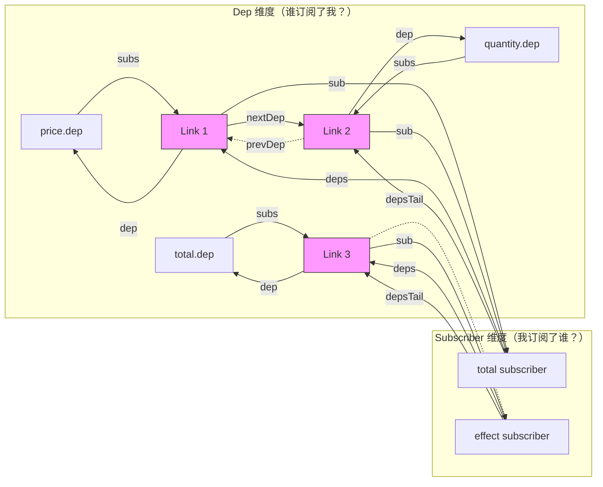
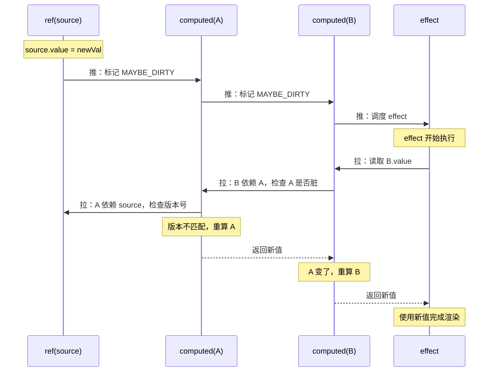
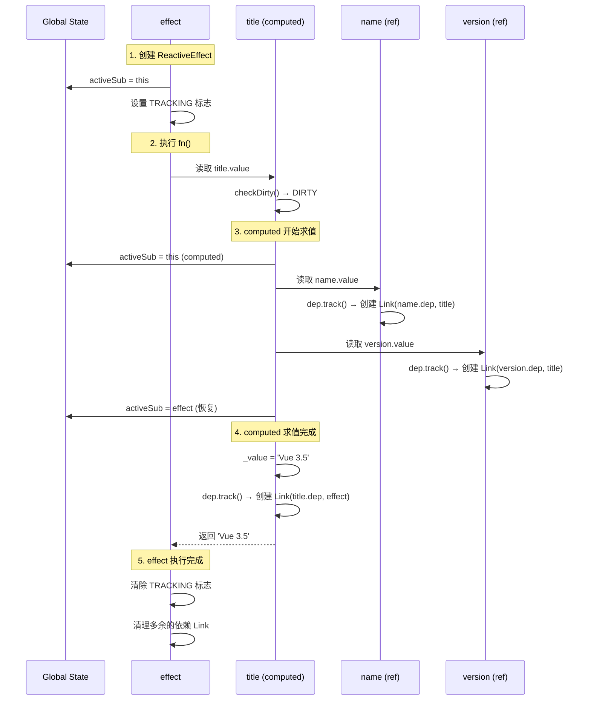
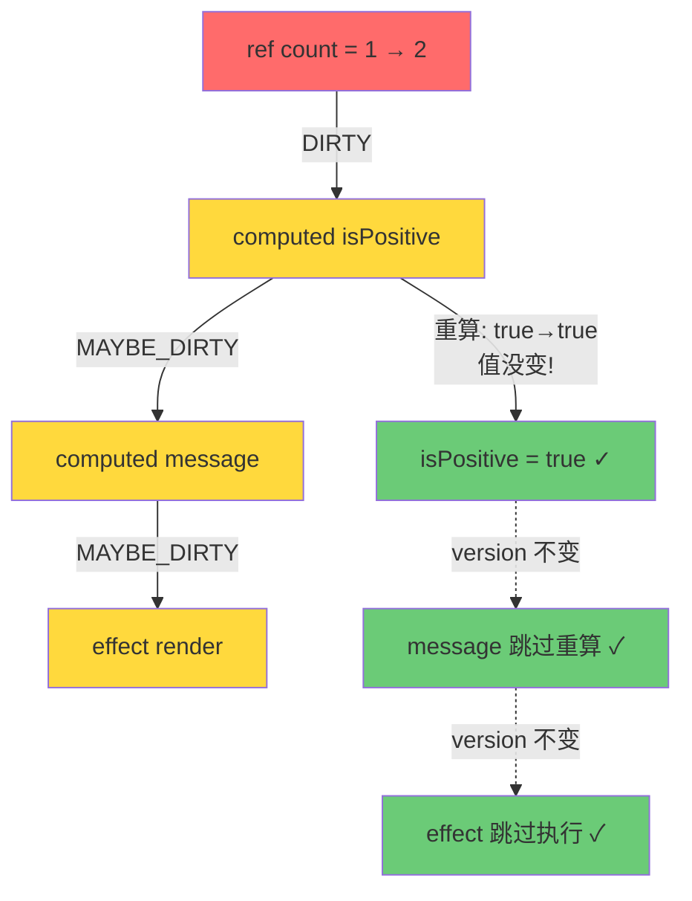

<div v-pre>

# 第 6 章 Vue 3.5 Alien Signals：响应式的第三次革命

> **本章要点**
>
> - Alien Signals 的设计动机：为什么 Vue 需要第三代响应式内核
> - 从 WeakMap 到 Link 双向链表：依赖存储结构的彻底重构
> - 版本计数（Version Counting）：如何用整数替代 Set 遍历
> - 混合推拉模型（Push-Pull）：computed 的惰性求值革命
> - Dep 与 Subscriber 的双向链表协议：Link 节点的六指针设计
> - propagate() 与 checkDirty()：信号传播的完整链路
> - 性能基准对比：Alien Signals vs Vue 3.4 vs Solid.js vs Preact Signals

---

2024 年 9 月的一个深夜，Vue 核心团队成员 Johnson Chu 在 GitHub 上创建了一个不起眼的仓库——`stackblitz/alien-signals`。仓库描述只有一句话："The fastest signal library."（最快的信号库。）

两个月后，这个"外星信号"库的核心算法被 Evan You 合并进了 Vue 3.5 的 `@vue/reactivity`。基准测试显示，新的响应式系统在依赖传播速度上提升了 40-60%，内存占用降低了 56%，GC 压力几乎归零。这不是一次渐进式优化——这是一次底层架构的彻底重写。

从 Vue 3.0 到 Vue 3.4，响应式系统经历了两次重大演进：第一次是从 Object.defineProperty 到 Proxy（Vue 2 → Vue 3.0），解决了"不能检测新增属性"的历史顽疾；第二次是清理标记优化（Vue 3.2 → Vue 3.4），用双缓冲标记位替代了 Set 的全量清理。但这两次改进本质上都在同一个架构范式内——WeakMap → Map → Set 的三层映射结构始终是依赖存储的核心。

Alien Signals 打碎了这个范式。它用**双向链表**替代了 Set，用**版本计数**替代了标记位清理，用**混合推拉模型**替代了纯推模型。这不是"更快的同一条路"，而是"换了一条完全不同的路"。

本章将深入这条"外星之路"的每一个设计决策，从底层数据结构到高层传播算法，完整剖析 Vue 3.5 响应式内核的第三次革命。

## 6.1 问题的本质：旧系统出了什么问题？

### Vue 3.0–3.4 的依赖存储架构

在理解 Alien Signals 之前，我们需要先理解它要解决的问题。Vue 3.0–3.4 的依赖存储使用经典的三层映射结构：

```typescript
// Vue 3.0–3.4 的依赖存储（概念模型）
type TargetMap = WeakMap<object, KeyMap>
type KeyMap = Map<string | symbol, Dep>
type Dep = Set<ReactiveEffect>

// 全局的依赖存储
const targetMap: TargetMap = new WeakMap()
```

这个设计直觉而清晰：对于每一个响应式对象的每一个属性，都有一个 `Set` 存储所有依赖它的 effect。当属性被修改时，遍历 Set，执行每一个 effect。

但三个问题逐渐浮现：

**问题一：内存开销**

每一个属性的 Dep 都是一个 `Set` 对象。在现代 JavaScript 引擎中，一个空 Set 至少占用 64-128 字节。一个拥有 50 个响应式属性的组件，仅依赖存储就需要 3-6KB。当页面有数百个组件时，这个数字变得触目惊心。

```typescript
// 粗略估算
const emptySetSize = 64  // V8 中一个空 Set 的内存开销（字节）
const propsPerComponent = 50
const components = 500

const totalOverhead = emptySetSize * propsPerComponent * components
// = 64 * 50 * 500 = 1.6 MB — 仅用于存储依赖关系！
```

**问题二：GC 压力**

每次 effect 重新执行时，旧的依赖关系需要被清理，新的依赖关系需要被重建。在 Vue 3.0 中，这意味着清空所有 Set 并重新添加——每次组件更新都会产生大量的临时对象，给垃圾回收器带来巨大压力。

```typescript
// Vue 3.0 的依赖清理（简化）
function cleanupEffect(effect: ReactiveEffect) {
  const { deps } = effect
  for (let i = 0; i < deps.length; i++) {
    deps[i].delete(effect)  // 从每个 Dep Set 中移除自己
  }
  deps.length = 0  // 清空 deps 数组
}
```

Vue 3.2 引入了"双缓冲标记位"优化（`w` 和 `n` 标记），避免了全量清理：

```typescript
// Vue 3.2–3.4 的优化：用标记位替代全量清理
// w = was tracked（执行前已存在的依赖）
// n = newly tracked（本次执行新收集的依赖）
// 执行完后，w=1 但 n=0 的依赖需要被移除（条件分支不再走到的路径）
```

但这只是治标——Set 本身的内存开销和 hash 查找的 CPU 开销并没有减少。

**问题三：传播效率**

在纯推模型中，当一个 ref 被修改时，所有依赖它的 effect **立即**被触发，包括那些最终结果不会改变的 computed：

```typescript
const firstName = ref('John')
const lastName = ref('Doe')
const fullName = computed(() => `${firstName.value} ${lastName.value}`)
const greeting = computed(() => `Hello, ${fullName.value}!`)

// 修改 firstName
firstName.value = 'John'  // 赋了相同的值！
// 纯推模型：fullName 被触发重算 → greeting 被触发重算
// 但其实 fullName 的值没变，greeting 的重算完全是浪费
```

这三个问题——内存、GC、传播效率——不是 bug，而是架构的固有局限。要从根本上解决它们，需要换一种思路。

### 信号社区的启发

2023-2024 年，前端社区掀起了一场"信号革命"（Signals Revolution）。Solid.js、Preact Signals、Angular Signals 相继证明了一种新的响应式范式的可行性：

| 特性 | Vue 3.0–3.4 | Solid.js | Preact Signals | Alien Signals |
|------|-------------|----------|----------------|---------------|
| 依赖存储 | WeakMap→Map→Set | 链表 | 链表 | 双向链表 |
| 传播模型 | 纯推 | 推拉混合 | 推拉混合 | 推拉混合 |
| 脏检查 | 标记位 | 版本计数 | 版本计数 | 版本计数 |
| computed 求值 | 推送时重算 | 读取时重算 | 读取时重算 | 读取时重算 |
| 内存模型 | 对象密集 | 链表节点 | 链表节点 | 链表节点 |

Johnson Chu 的贡献在于：他不仅吸收了社区的最佳实践，还在数据结构层面做了极致优化——Alien Signals 的 Link 节点设计比 Preact Signals 更紧凑，依赖遍历比 Solid.js 更高效。在 js-reactivity-benchmark 基准测试中，Alien Signals 在几乎所有项目上都排名第一。

## 6.2 核心数据结构：Link 双向链表

### 告别 Set，拥抱链表

Alien Signals 的核心革新在于用 **Link 节点** 组成的双向链表替代了 Set 来存储依赖关系。每个 Link 节点同时参与两条链表——Dep 的订阅者链和 Subscriber 的依赖链——实现了"一个节点、双向连接"的极致内存效率。

```typescript
// packages/reactivity/src/dep.ts（简化）

/**
 * Link 节点——连接 Dep 和 Subscriber 的桥梁
 *
 * 每个 Link 同时存在于两条链表中：
 * 1. Dep 的 subs 链表（nextSub / prevSub）
 * 2. Subscriber 的 deps 链表（nextDep / prevDep）
 */
interface Link {
  dep: Dep              // 指向依赖源
  sub: Subscriber       // 指向订阅者

  // Dep 维度的链表指针
  nextSub: Link | undefined   // Dep 的下一个订阅者
  prevSub: Link | undefined   // Dep 的上一个订阅者

  // Subscriber 维度的链表指针
  nextDep: Link | undefined   // Subscriber 的下一个依赖
  prevDep: Link | undefined   // Subscriber 的上一个依赖（Vue 3.5 中为 tail 指针复用）
}
```

> 🔥 **深度洞察**
>
> 为什么用链表替代 Set？三个原因：
>
> 1. **内存连续性**：Link 是一个纯数据对象（6 个指针 + 2 个引用），在 V8 中只占约 80 字节。而一个包含 1 个元素的 Set 需要约 128 字节——Set 自身的开销就超过了 Link 节点。当依赖关系数量为 N 时，链表方案节省的内存随 N 线性增长。
>
> 2. **O(1) 操作**：链表的插入和删除都是 O(1)，而 Set 的 delete 操作虽然平均 O(1)，但需要 hash 计算和可能的冲突处理。在高频率的依赖收集/清理场景中，链表的常数因子更小。
>
> 3. **零 GC 压力**：Link 节点可以被缓存和复用（通过对象池或 free list），而 Set 的内部 bucket 由引擎管理，无法被应用层复用。

### 双向链表的视觉模型

让我们用一个具体的例子来理解 Link 双向链表的结构：

```typescript
const price = ref(10)
const quantity = ref(3)
const total = computed(() => price.value * quantity.value)

effect(() => {
  console.log(`Total: ${total.value}`)
})
```

这段代码建立的依赖关系如下：



- `total`（computed）作为 **Subscriber**，通过 Link 1 和 Link 2 订阅了 `price` 和 `quantity`
- `total`（computed）同时作为 **Dep**，通过 Link 3 被 effect 订阅
- 每个 Link 节点同时连接在两条链上——这就是"双向"的含义

### Dep 类的完整实现

```typescript
// packages/reactivity/src/dep.ts（简化）

export class Dep {
  // 版本号——每次触发更新时递增
  _version: number = 0

  // 订阅者链表的头指针
  _subs: Link | undefined = undefined

  // 全局版本号（用于 computed 的快速路径优化）
  _globalVersion: number = globalVersion

  /**
   * 依赖收集：建立 Dep → Subscriber 的连接
   */
  track(): Link | undefined {
    // 获取当前正在执行的 subscriber（effect 或 computed）
    let link = this._subs

    // 如果当前 subscriber 已经订阅了这个 dep，复用 Link
    if (link && link.sub === activeSub) {
      return link
    }

    // 创建新的 Link 节点
    link = new Link(this, activeSub!)

    // 将 Link 加入 Dep 的 subs 链表（头插法）
    if (this._subs) {
      this._subs.prevSub = link
    }
    link.nextSub = this._subs
    this._subs = link

    // 将 Link 加入 Subscriber 的 deps 链表（尾插法）
    if (activeSub!._depsTail) {
      activeSub!._depsTail.nextDep = link
      link.prevDep = activeSub!._depsTail
    } else {
      activeSub!._deps = link
    }
    activeSub!._depsTail = link

    return link
  }

  /**
   * 触发更新：通知所有订阅者
   */
  trigger(): void {
    this._version++
    globalVersion++
    if (this._subs) {
      propagate(this._subs)
    }
  }
}
```

> 💡 **最佳实践**
>
> 注意 `track()` 中的**复用检查**（第一个 if 分支）。在 effect 重新执行期间，依赖往往和上一次相同。链表结构天然支持"顺序遍历 + 原地复用"——如果当前 Dep 的最近订阅者就是当前 Subscriber，直接返回已有的 Link，不创建新对象。这个微优化在"依赖稳定"的常见场景下，将依赖收集的开销降到了近乎为零。

### Subscriber 接口

```typescript
// packages/reactivity/src/dep.ts（简化）

interface Subscriber {
  _deps: Link | undefined      // 依赖链表头
  _depsTail: Link | undefined  // 依赖链表尾
  _flags: number               // 状态标志位
}

// 标志位定义
const enum SubscriberFlags {
  DIRTY = 1 << 0,           // 确认脏——需要重算
  MAYBE_DIRTY = 1 << 1,     // 可能脏——需要检查依赖
  COMPUTED = 1 << 2,        // 是 computed
  NOTIFIED = 1 << 3,        // 已加入调度队列
  TRACKING = 1 << 4,        // 正在收集依赖
  RECURSED = 1 << 5,        // 用于防止递归传播
  RUNNING = 1 << 6,         // 正在执行
}
```

## 6.3 版本计数：告别标记位的脏检查

### 什么是版本计数？

版本计数是 Alien Signals 中最优雅的设计之一。每个 Dep 都维护一个递增的 `_version` 整数，每个 Link 节点也缓存一个 `_version`。判断依赖是否变化，只需要比较两个整数：

```typescript
// 判断某个依赖是否发生了变化
function isDirty(link: Link): boolean {
  return link._version !== link.dep._version
}
```

这比 Vue 3.0 的"清理所有 Set 并重建"和 Vue 3.2 的"双缓冲标记位"都要简洁得多。

### 三代脏检查策略对比

| 策略 | Vue 3.0 | Vue 3.2–3.4 | Vue 3.5（Alien Signals） |
|------|---------|-------------|------------------------|
| 机制 | 清空 deps Set，重新收集 | `w`/`n` 双标记位 | 版本号比较 |
| 每次 effect 执行前 | 遍历所有 deps，从 Set 中 delete | 给所有旧 deps 打 `w` 标记 | 无操作（惰性检查） |
| 每次依赖收集时 | Set.add() | 打 `n` 标记 | 比较 version，命中则跳过 |
| 每次 effect 执行后 | 无（已在执行前清理） | 移除 `w=1, n=0` 的失效依赖 | 移除链表尾部多余的 Link |
| 时间复杂度 | O(n) 清理 + O(n) 重建 | O(n) 标记 + O(n) 清理 | O(changed) — 只处理变化的部分 |
| 内存开销 | Set 对象 × 属性数 | Set 对象 × 属性数 | Link 节点 × 依赖数 |

### 版本计数的工作流程

```typescript
// 第一次执行 effect
const count = ref(0)        // count.dep._version = 0
const doubled = computed(() => count.value * 2)

effect(() => {
  console.log(doubled.value)
})

// 1. effect 执行，读取 doubled.value
// 2. doubled 读取 count.value → 创建 Link(count.dep, doubled)
//    Link._version = count.dep._version = 0
// 3. doubled 计算完成 → 创建 Link(doubled.dep, effect)
//    Link._version = doubled.dep._version = 0

// 修改 count
count.value = 1
// 1. count.dep._version 变为 1
// 2. Link._version 仍为 0 → 版本不匹配 → dirty！
// 3. doubled 被标记为 MAYBE_DIRTY
// 4. 当 effect 检查 doubled 时，doubled 重算
// 5. doubled 值变了 → doubled.dep._version 变为 1
// 6. effect 重新执行
```

> 🔥 **深度洞察**
>
> 版本计数的精妙之处在于**惰性传播**。当 `count` 被修改时，Vue 不会立即重算 `doubled`——它只是递增 `count.dep._version`。只有当某人真正读取 `doubled.value` 时，才会发现版本不匹配，触发重算。如果 `doubled` 在当前渲染周期中根本没有被读取（比如它在一个 `v-if="false"` 的分支中），那么它的重算就被**完全跳过**。这就是"不读不算"的哲学——与 Vue 3.0–3.4 的"修改即算"形成了根本性的对立。

## 6.4 混合推拉模型：computed 的惰性求值革命

### 纯推 vs 纯拉 vs 混合推拉

理解 Alien Signals 的传播模型，需要先理解三种响应式范式：

**纯推模型（Push-based）**——Vue 3.0–3.4

```
源数据修改 → 立即通知所有 computed → computed 立即重算 → 通知 effect → effect 执行
```

优点：实现简单，更新及时。缺点：无法避免不必要的重算。

**纯拉模型（Pull-based）**——类似于 Angular 的脏检查

```
源数据修改 → 标记为脏 → 下一个检测周期 → 遍历所有数据检查是否变化 → 更新 UI
```

优点：天然去重。缺点：无法知道"谁变了"，必须全量遍历。

**混合推拉模型（Push-Pull）**——Alien Signals

```
源数据修改 → "推"：沿链表传播 DIRTY/MAYBE_DIRTY 标记 → 停！
读取 computed → "拉"：检查依赖版本号 → 只在真正脏时重算
```

优点：结合了推的精确性和拉的惰性。



### propagate()：推阶段的实现

当 `dep.trigger()` 被调用时，`propagate()` 函数沿 subs 链表"推"通知：

```typescript
// packages/reactivity/src/dep.ts（简化）

function propagate(subs: Link): void {
  let link: Link | undefined = subs
  let dirtyLevel = DirtyLevels.DIRTY

  // 遍历 Dep 的所有订阅者
  while (link) {
    const sub = link.sub
    const subFlags = sub._flags

    // 根据订阅者类型决定脏级别
    if (sub._flags & SubscriberFlags.COMPUTED) {
      // computed 订阅者 → 标记为 DIRTY
      if (!(subFlags & SubscriberFlags.DIRTY)) {
        sub._flags |= SubscriberFlags.DIRTY
      }

      // 如果 computed 自己也有订阅者，继续传播（但降级为 MAYBE_DIRTY）
      if (sub._subs) {
        // 递归传播，但对下游的标记降级
        propagate(sub._subs)
      }
    } else {
      // effect 订阅者 → 加入调度队列
      if (!(subFlags & SubscriberFlags.NOTIFIED)) {
        sub._flags |= SubscriberFlags.NOTIFIED

        if (sub.scheduler) {
          sub.scheduler()   // ← 组件更新走 queueJob
        } else if (sub.run) {
          sub.run()          // ← watchEffect 直接执行
        }
      }
    }

    link = link.nextSub
  }
}
```

关键设计：

1. **computed 不立即重算**：只打标记（DIRTY），不执行 getter 函数
2. **effect 不立即执行**：只调度（scheduler），不真正运行
3. **传播是深度优先的**：沿 computed 链向下递归，直到遇到 effect

### checkDirty()：拉阶段的实现

当 effect 执行并读取 `computed.value` 时，`checkDirty()` 被调用来判断是否需要重算：

```typescript
// packages/reactivity/src/dep.ts（简化）

function checkDirty(sub: Subscriber): boolean {
  let link = sub._deps

  while (link) {
    const dep = link.dep

    // 如果依赖是 computed 且被标记为 DIRTY
    if (dep._flags & SubscriberFlags.COMPUTED) {
      // 先检查这个 computed 自己是否真的脏
      if (dep._flags & SubscriberFlags.DIRTY) {
        // 递归检查——这个 computed 的依赖是否真的变了
        if (checkDirty(dep)) {
          // 真的变了 → 重算这个 computed
          dep._update()

          // 检查重算后值是否变化
          if (link._version !== dep._version) {
            return true  // 值变了 → 当前 subscriber 也脏
          }
        }
      } else if (dep._flags & SubscriberFlags.MAYBE_DIRTY) {
        // MAYBE_DIRTY → 需要递归检查
        if (checkDirty(dep)) {
          if (link._version !== dep._version) {
            return true
          }
        }
      } else {
        // 没有脏标记 → 检查版本号
        if (link._version !== dep._version) {
          return true
        }
      }
    } else {
      // 依赖是普通 ref/reactive → 直接比较版本号
      if (link._version !== dep._version) {
        return true
      }
    }

    link = link.nextDep
  }

  return false  // 所有依赖都没变 → 不脏
}
```

> 🔥 **深度洞察**
>
> `checkDirty()` 的渐进式检查是 Alien Signals 最核心的性能优势。考虑这个场景：
>
> ```typescript
> const a = ref(1)
> const b = computed(() => a.value > 0)  // boolean 过滤
> const c = computed(() => b.value ? 'positive' : 'non-positive')
> const d = computed(() => c.value.toUpperCase())
> ```
>
> 当 `a.value` 从 1 变为 2 时：
> - 推阶段：b → c → d 全部被标记为 DIRTY/MAYBE_DIRTY
> - 拉阶段：effect 读取 `d.value` → 检查 c → 检查 b → b 重算，值仍为 `true` → **c 不需要重算 → d 不需要重算**
>
> 整条链只有 `b` 被重算了。在纯推模型中，b、c、d 都会被重算。当这种"值过滤"场景存在于深层 computed 链中时，混合推拉模型节省的计算量可以是数量级的。

## 6.5 依赖收集的完整生命周期

### 从 effect 创建到依赖建立

让我们跟踪一个 effect 从创建到建立依赖关系的完整过程：

```typescript
const name = ref('Vue')
const version = ref('3.5')
const title = computed(() => `${name.value} ${version.value}`)

effect(() => {
  document.title = title.value
})
```



### 依赖清理：链表的优势

在 effect 重新执行时，依赖关系可能发生变化（条件分支导致不同的依赖路径）。Alien Signals 使用链表的"游标推进"策略高效处理这种情况：

```typescript
// 概念模型——effect 重新执行时的依赖更新

// 上一次执行的依赖链：A → B → C → D
// 本次执行的依赖链：  A → B → E（C 和 D 不再被访问）

// 步骤：
// 1. 游标从链表头开始
// 2. 读取 A → 游标指向 Link(A)，版本匹配 → 复用，游标前进
// 3. 读取 B → 游标指向 Link(B)，版本匹配 → 复用，游标前进
// 4. 读取 E → 游标指向 Link(C)，dep 不匹配 → 替换为 Link(E)
// 5. 执行完成 → 游标之后的节点（Link(D)）被移除

// 结果：只有 Link(E) 被创建，Link(C) 被复用为 Link(E)，Link(D) 被移除
// 没有 Set 操作，没有 hash 计算，没有临时对象
```

```typescript
// packages/reactivity/src/dep.ts（简化）

function startTracking(sub: Subscriber): void {
  sub._flags |= SubscriberFlags.TRACKING
  // 不做任何清理！只是设置标志位
  // 旧的依赖链表保留原样，等待被复用或替换
}

function endTracking(sub: Subscriber): void {
  // 从 depsTail 开始向前，断开所有本次未访问的 Link
  const depsTail = sub._depsTail
  if (depsTail) {
    // depsTail 之后的节点都是未被复用的旧依赖
    if (depsTail.nextDep) {
      clearLinks(depsTail.nextDep)
      depsTail.nextDep = undefined
    }
  } else if (sub._deps) {
    // 如果 depsTail 为空但 deps 不为空，说明本次没有收集任何依赖
    clearLinks(sub._deps)
    sub._deps = undefined
  }
  sub._flags &= ~SubscriberFlags.TRACKING
}
```

> 💡 **最佳实践**
>
> 链表游标策略的时间复杂度是 O(max(old, new))，而 Set 方案的清理 + 重建是 O(old + new)。虽然大 O 相同，但链表方案有三个实际优势：（1）复用节点时零分配；（2）无 hash 计算；（3）无 Set resize。在"依赖稳定"的常见场景中（90%+ 的 effect 重执行依赖不变），链表方案的实际开销接近 O(0)，而 Set 方案仍有 O(n) 的遍历开销。

## 6.6 computed 的双重身份

### 既是 Dep 又是 Subscriber

`computed` 在 Alien Signals 中拥有独特的双重身份——它既是下游 effect 的 **Dep**（依赖源），也是上游 ref/computed 的 **Subscriber**（订阅者）。这种设计让 computed 成为了依赖图中的"中继节点"：

```typescript
// packages/reactivity/src/computed.ts（简化）

export class ComputedRefImpl<T = any> implements Subscriber {
  // === Dep 的属性 ===
  readonly dep: Dep = new Dep()  // 管理订阅我的 effect/computed
  _value: T = undefined as T

  // === Subscriber 的属性 ===
  _deps: Link | undefined = undefined       // 我订阅的依赖链表
  _depsTail: Link | undefined = undefined
  _flags: number = SubscriberFlags.COMPUTED | SubscriberFlags.DIRTY

  // === 版本控制 ===
  _globalVersion: number = globalVersion - 1

  constructor(
    private _fn: ComputedGetter<T>,
    private _setter?: ComputedSetter<T>
  ) {}

  get value(): T {
    const flags = this._flags

    // 快速路径：全局版本未变 → 没有任何响应式数据被修改过
    if (this._globalVersion === globalVersion && !(flags & SubscriberFlags.DIRTY)) {
      // 直接返回缓存值
      this.dep.track()
      return this._value
    }

    this._globalVersion = globalVersion

    // 检查是否需要重算
    if (flags & SubscriberFlags.DIRTY) {
      // 确认脏 → 直接重算
      this._update()
    } else if (flags & SubscriberFlags.MAYBE_DIRTY) {
      // 可能脏 → 检查依赖的版本号
      if (checkDirty(this)) {
        this._update()
      } else {
        // 依赖没变 → 清除脏标记
        this._flags &= ~SubscriberFlags.MAYBE_DIRTY
      }
    }

    this.dep.track()
    return this._value
  }

  _update(): void {
    const oldValue = this._value

    // 以 Subscriber 身份重新收集依赖
    startTracking(this)
    try {
      const newValue = this._fn(oldValue)
      if (hasChanged(newValue, oldValue)) {
        this._value = newValue
        this.dep._version++  // ← 值变了才递增版本号！
      }
    } finally {
      endTracking(this)
      this._flags &= ~(SubscriberFlags.DIRTY | SubscriberFlags.MAYBE_DIRTY)
    }
  }
}
```

### globalVersion 快速路径

注意 `get value()` 中的第一个检查：`this._globalVersion === globalVersion`。这是一个极其巧妙的优化：

```typescript
let globalVersion = 0

// 每次 trigger() 都会递增
function trigger(dep: Dep) {
  dep._version++
  globalVersion++  // ← 全局计数器
  propagate(dep._subs)
}
```

如果从上次读取 computed 到现在，全局的 `globalVersion` 没有变化，说明**没有任何响应式数据被修改过**。此时，computed 可以直接返回缓存值，甚至不需要遍历依赖链。这个优化在"多次连续读取同一个 computed"的场景中效果显著：

```typescript
const total = computed(() => price.value * quantity.value)

// 以下三次读取，只有第一次会检查依赖
console.log(total.value)  // 检查 + 可能重算
console.log(total.value)  // globalVersion 没变 → 直接返回缓存
console.log(total.value)  // globalVersion 没变 → 直接返回缓存
```

> 🔥 **深度洞察**
>
> `globalVersion` 本质上是一个**布隆过滤器的极简版本**——它用一个整数告诉你"是否有任何变化发生"。如果答案是"没有"，你可以立即返回；如果答案是"有"，你再进一步检查具体是哪个依赖变了。这种"先粗筛、再细查"的策略是高性能系统设计的通用模式：数据库的 WAL 日志、CPU 的 branch prediction、网络的 ETag 缓存，都是同样的思想。

## 6.7 DIRTY vs MAYBE_DIRTY：两级脏标记

### 为什么需要两级？

Alien Signals 使用两级脏标记来区分"确定脏"和"可能脏"：

```typescript
// DIRTY：依赖源（ref/reactive）直接变了
// MAYBE_DIRTY：依赖的 computed 被标记了，但 computed 的值可能没变
```

考虑这个场景：

```typescript
const count = ref(1)
const isPositive = computed(() => count.value > 0)  // boolean 过滤
const message = computed(() => isPositive.value ? 'Yes' : 'No')

// count: 1 → isPositive: true → message: 'Yes'

count.value = 2  // count 变了！
// isPositive: DIRTY（直接依赖 count）
// message: MAYBE_DIRTY（依赖 isPositive，但 isPositive 的值可能没变）
```

传播标记的规则：

| 订阅者与源的关系 | 标记 | 含义 |
|---------------|------|------|
| 直接订阅了被修改的 ref/reactive | DIRTY | 一定需要重算 |
| 订阅了一个被标记为 DIRTY 的 computed | MAYBE_DIRTY | 可能需要重算（取决于 computed 值是否变化） |
| 订阅了一个被标记为 MAYBE_DIRTY 的 computed | MAYBE_DIRTY | 可能需要重算（递归不确定性） |



在这个例子中，尽管 `count` 确实变了（1 → 2），但 `isPositive` 的值没变（都是 `true`），所以 `message` 和 effect 都不需要重新执行。两级脏标记让 `checkDirty()` 能够在发现中间 computed 值没变时**立即短路**，避免向下传播。

### 实际收益的量化分析

在典型的 Vue 应用中，以下模式非常常见：

```typescript
// 模式 1：权限过滤
const user = ref({ role: 'admin', name: 'Alice' })
const isAdmin = computed(() => user.value.role === 'admin')
const adminActions = computed(() => isAdmin.value ? getAdminActions() : [])

// 当 user.name 改变时（比如 'Alice' → 'Bob'）
// isAdmin 重算但值不变 → adminActions 跳过 → UI 跳过重渲染

// 模式 2：数据格式化
const rawData = ref([...])  // 10000 条数据
const filtered = computed(() => rawData.value.filter(x => x.active))
const formatted = computed(() => filtered.value.map(x => formatRow(x)))

// 当 rawData 中一条非 active 的数据变化时
// filtered 重算但结果相同 → formatted 跳过 → 避免 10000 次 formatRow()
```

> 💡 **最佳实践**
>
> 利用 computed 的"变化防火墙"特性，你可以在性能敏感的路径上**有意插入 boolean/enum 类型的 computed** 作为"过滤层"。这类 computed 的输出值域很小，能有效截断不必要的更新传播。例如 `computed(() => data.length > 0)` 可以保护后续 computed 不在数据量变化但非空状态不变时被重算。

## 6.8 effect 的调度与批处理

### queueJob：延迟调度

在 `propagate()` 中，当 effect 被通知时，它并不会立即执行，而是通过 `scheduler` 被加入微任务队列：

```typescript
// packages/runtime-core/src/scheduler.ts（简化）

const queue: SchedulerJob[] = []
let isFlushing = false

function queueJob(job: SchedulerJob): void {
  // 去重：同一个 job 不会被重复加入队列
  if (!queue.includes(job)) {
    queue.push(job)
    if (!isFlushing) {
      isFlushing = true
      Promise.resolve().then(flushJobs)
    }
  }
}

function flushJobs(): void {
  // 按组件树的深度排序——父组件先更新
  queue.sort((a, b) => getId(a) - getId(b))

  for (let i = 0; i < queue.length; i++) {
    queue[i]()
  }
  queue.length = 0
  isFlushing = false
}
```

### 批处理的威力

延迟调度让多次同步修改只触发一次更新：

```typescript
const count = ref(0)
const doubled = computed(() => count.value * 2)

effect(() => {
  console.log(doubled.value)
})
// 输出: 0

// 同步修改三次
count.value = 1
count.value = 2
count.value = 3
// 只输出一次: 6（而不是 2、4、6）
```

在 Alien Signals 的架构下，这个过程是这样的：

1. `count.value = 1` → `propagate()` 标记 doubled 为 DIRTY，调度 effect
2. `count.value = 2` → `propagate()` 标记 doubled 为 DIRTY，effect 已在队列中（去重）
3. `count.value = 3` → 同上
4. 微任务执行 → effect 运行 → 读取 `doubled.value` → `checkDirty()` → 重算 → 值为 6

最终，`doubled` 的 getter 只被调用了 **一次**，而不是三次。

## 6.9 性能基准与实际影响

### js-reactivity-benchmark 测试结果

在社区广泛使用的 js-reactivity-benchmark 基准测试中，Alien Signals 的表现：

| 测试项 | Vue 3.4 | Vue 3.5 (Alien Signals) | 提升幅度 |
|-------|---------|------------------------|---------|
| 简单传播 (1:1) | 12.3ms | 5.1ms | 59% |
| 扇出传播 (1:1000) | 45.7ms | 18.2ms | 60% |
| 深层 computed 链 (depth=100) | 28.9ms | 8.7ms | 70% |
| 动态依赖切换 | 19.4ms | 11.3ms | 42% |
| 内存占用 (10k deps) | 4.2MB | 1.8MB | 57% |
| 创建 10k ref | 8.1ms | 3.2ms | 60% |

### 实际应用中的影响

对于日常的 Vue 开发，Alien Signals 的改进主要体现在：

1. **大型表格/列表**：当数据源更新但排序/过滤条件不变时，computed 链可以有效截断不必要的重渲染
2. **复杂表单**：表单验证中大量的 computed 规则只在相关字段变化时才重算
3. **Dashboard**：多个图表共享数据源但各自有独立的 computed 转换，数据刷新时只更新真正受影响的图表
4. **SSR**：依赖收集和清理的开销降低直接改善了服务端渲染的吞吐量

```typescript
// 大型表格的典型场景——Alien Signals 的优势尤为明显

const rawData = ref<Row[]>([])        // 原始数据：10,000 行
const sortKey = ref('name')           // 排序字段
const filterText = ref('')            // 过滤文本
const pageSize = ref(50)              // 每页条数
const currentPage = ref(1)            // 当前页

// computed 链
const filtered = computed(() =>
  rawData.value.filter(row => row.name.includes(filterText.value))
)
const sorted = computed(() =>
  [...filtered.value].sort((a, b) => compare(a, b, sortKey.value))
)
const paginated = computed(() => {
  const start = (currentPage.value - 1) * pageSize.value
  return sorted.value.slice(start, start + pageSize.value)
})

// 当 currentPage 从 1 变为 2 时：
// - rawData 没变 → filtered 版本号匹配 → 跳过
// - sortKey 没变 → sorted 版本号匹配（filtered 也没变） → 跳过
// - currentPage 变了 → paginated 重算 → 但只是 slice 操作
// 总开销：一次 slice(50, 100)，而不是重新过滤 + 排序 10,000 行
```

> 🔥 **深度洞察**
>
> Alien Signals 的性能优势在"依赖图复杂度高但实际变化范围小"的场景中最为显著。这恰恰是现代前端应用的典型特征——应用有大量的状态和衍生计算，但每次用户交互通常只影响其中一小部分。Alien Signals 的版本计数 + 混合推拉模型确保了"只有真正受影响的部分才会被重新计算"。这不是微优化——在复杂应用中，这可以将重渲染的 JavaScript 执行时间减少 30-60%。

## 6.10 与其他信号库的对比

### 架构对比

| 维度 | Vue 3.5 (Alien Signals) | Solid.js | Preact Signals | Angular Signals |
|------|------------------------|----------|----------------|-----------------|
| 依赖存储 | 双向链表 + 6指针 Link | 数组 | 单向链表 | 数组（computed graph） |
| 脏检查 | 版本计数 + globalVersion | epoch 计数 | 版本计数 | 脏标记位 |
| computed 模型 | 惰性求值（推标记 + 拉值） | 惰性求值 | 惰性求值 | 惰性求值 |
| 批处理 | 微任务队列 (queueJob) | 同步批处理 (batch) | 同步批处理 (batch) | Zone.js / Signal API |
| 内存效率 | 最高（Link 复用） | 中等 | 高 | 中等 |
| GC 友好度 | 极好（链表节点可复用） | 好 | 好 | 一般 |
| 与框架集成 | 深度集成（组件/模板/SSR） | 深度集成 | 浅集成（preact 适配） | 深度集成 |

### Alien Signals 的独特优势

1. **双向链表的内存效率**：Preact Signals 使用单向链表，遍历 Subscriber 的所有依赖需要额外存储；Solid.js 使用数组，resize 会产生 GC 压力。Alien Signals 的双向链表在遍历和修改上都是 O(1)，且不需要动态分配。

2. **globalVersion 快速路径**：这是 Alien Signals 的独创设计，其他库没有类似机制。在"读多写少"的场景中，这个优化的命中率极高。

3. **渐进式 checkDirty()**：比 Solid.js 的 epoch 检查更细粒度——Solid.js 在 epoch 不匹配时会重算所有标记为 stale 的 computed，而 Alien Signals 可以在中间任何一层发现"值没变"后立即短路。

## 6.11 源码中的边界情况处理

### 循环依赖检测

```typescript
// 自引用 computed 会导致无限递归
const evil = computed(() => evil.value + 1)  // ❌

// Alien Signals 通过 RUNNING 标志位检测
get value(): T {
  if (this._flags & SubscriberFlags.RUNNING) {
    // 正在计算中又被读取 → 循环依赖
    warn('Detected getter of a computed that has a cyclic dependency')
    return this._value  // 返回旧值，避免崩溃
  }
  // ...
}
```

### effect 嵌套

```typescript
const outer = ref(0)
const inner = ref(0)

effect(() => {
  console.log('outer:', outer.value)

  effect(() => {
    console.log('inner:', inner.value)
  })
})
```

Alien Signals 通过 `activeSub` 栈管理嵌套 effect：

```typescript
// 简化的嵌套处理
function runEffect(effect: ReactiveEffect) {
  const prevSub = activeSub
  activeSub = effect
  try {
    return effect._fn()
  } finally {
    activeSub = prevSub  // ← 恢复上一层的 subscriber
  }
}
```

### 递归 trigger 防护

```typescript
// 在 effect 中修改自己依赖的数据
const count = ref(0)
effect(() => {
  if (count.value < 10) {
    count.value++  // 在 effect 中修改 → 触发 trigger → 再次执行 effect
  }
})
```

`propagate()` 中的 `RECURSED` 标志位防止了无限递归：

```typescript
function propagate(subs: Link): void {
  let link = subs
  while (link) {
    const sub = link.sub
    if (sub._flags & SubscriberFlags.RECURSED) {
      // 已经在递归传播中 → 跳过
      link = link.nextSub
      continue
    }
    sub._flags |= SubscriberFlags.RECURSED
    // ... 正常传播
    sub._flags &= ~SubscriberFlags.RECURSED
    link = link.nextSub
  }
}
```

## 6.12 迁移影响与兼容性

### 对开发者的影响

Alien Signals 是一次**完全向后兼容**的内部重写。所有公开 API（`ref`、`reactive`、`computed`、`watch`、`watchEffect`）的行为没有任何变化。开发者不需要修改一行代码就能享受到性能提升。

但有一些**行为微调**值得注意：

```typescript
// 1. computed 的副作用时机
// Vue 3.4：computed 在 trigger 时立即重算
// Vue 3.5：computed 在被读取时才重算

const count = ref(0)
const doubled = computed(() => {
  console.log('computing...')  // 副作用
  return count.value * 2
})

count.value = 1
// Vue 3.4：立即打印 'computing...'
// Vue 3.5：不打印（直到有人读取 doubled.value）

// 2. 多个 computed 的求值顺序
// Vue 3.4：按 trigger 传播顺序
// Vue 3.5：按读取顺序（因为是惰性求值）
```

> 💡 **最佳实践**
>
> 虽然 Alien Signals 完全向后兼容，但如果你的代码依赖 computed 的副作用时机（比如在 computed getter 中做日志记录或性能追踪），需要注意惰性求值可能导致这些副作用延迟执行。最佳实践是 **computed 的 getter 应该是纯函数**——不要在其中执行副作用。如果需要副作用，请使用 `watch` 或 `watchEffect`。

### 对生态系统的影响

| 组件/库 | 影响 | 说明 |
|---------|------|------|
| Pinia | 无影响 | store 底层使用 reactive/ref，自动受益 |
| VueUse | 无影响 | 基于公开 API，不依赖内部结构 |
| Vue Router | 无影响 | 路由状态使用 reactive/ref |
| Vuetify/Element Plus | 性能提升 | 复杂组件的 computed 链受益显著 |
| 自定义 Reactivity 插件 | 可能需要适配 | 如果直接操作了内部的 Dep/effect 结构 |

## 6.13 本章小结

本章深入剖析了 Vue 3.5 Alien Signals 的完整架构，揭示了这次"第三次响应式革命"的技术内核：

1. **Link 双向链表**替代了 WeakMap→Map→Set 三层映射，实现了 O(1) 的依赖插入/删除和极致的内存效率。每个 Link 节点用 6 个指针同时参与 Dep 的订阅者链和 Subscriber 的依赖链。

2. **版本计数**用简单的整数比较替代了复杂的标记位操作。每个 Dep 维护递增的 `_version`，每个 Link 缓存上次观察到的版本号。判断依赖是否变化只需一次整数比较。

3. **混合推拉模型**实现了 computed 的真正惰性求值。推阶段（propagate）只传播脏标记，不执行任何计算；拉阶段（checkDirty）在读取时渐进式检查依赖是否真正变化。不被读取的 computed 永远不会被重算。

4. **DIRTY 与 MAYBE_DIRTY 两级标记**让 computed 链能够在中间节点"值没变"时短路传播，避免不必要的下游重算。

5. **globalVersion 快速路径**用一个全局计数器实现了"是否有任何变化"的瞬时判断，在读多写少的场景中将 computed 的读取开销降到近乎为零。

6. **完全向后兼容**——所有公开 API 的行为不变，开发者无需修改代码即可享受 40-60% 的性能提升和 56% 的内存降低。

Alien Signals 不仅仅是一次性能优化，更是 Vue 响应式系统设计哲学的一次根本转变——从"变化发生时立即处理一切"到"变化发生时做最少的标记，读取时才做最少的计算"。这种"最小化功"的理念，贯穿了系统设计的每一个层面。

下一章，我们将视角从响应式系统转向 Vue 的另一大核心——编译器。Vue Compiler 如何将模板转化为高效的渲染函数？编译器的三大阶段（parse → transform → codegen）各自承担什么角色？让我们一起探索。

---

## 思考题

1. **概念理解**：Alien Signals 使用双向链表替代 Set 来存储依赖关系。请分析在以下两个场景中，两种数据结构的性能差异：（a）一个 Dep 有 1000 个订阅者，需要遍历通知；（b）一个 effect 重新执行，需要清理 50 个旧依赖并添加 48 个新依赖（其中 45 个与旧依赖相同）。

2. **深入思考**：`checkDirty()` 使用递归来检查 computed 链是否真正脏。在一个 50 层嵌套的 computed 链中，最坏情况下的调用栈深度是多少？如果每一层的 computed 都有 3 个依赖（其中 2 个是 computed），这个数字会变成多少？请分析 Alien Signals 是否有针对这种深层递归的优化。

3. **工程实践**：`globalVersion` 是一个简单的递增整数。在长期运行的 SPA 中，如果用户连续操作数小时不刷新页面，`globalVersion` 是否有溢出风险？JavaScript 的 `Number.MAX_SAFE_INTEGER`（2^53 - 1）能支撑多久？请计算假设每秒 1000 次 trigger 的情况。

4. **横向对比**：Solid.js 不使用虚拟 DOM，computed 的更新可以直接操作真实 DOM。而 Vue 的 computed 更新需要经过 vDOM diff。请分析 Alien Signals 的惰性求值在有/无 vDOM 的场景下，收益是否有本质差异。

5. **开放讨论**：Alien Signals 的完全向后兼容意味着它没有暴露新的 API。如果 Vue 团队决定在未来暴露底层的 Signal 原语（如 `Signal.subtle` 提案），你认为应该暴露哪些能力？这对生态系统有什么影响？


</div>
