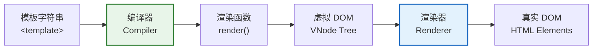
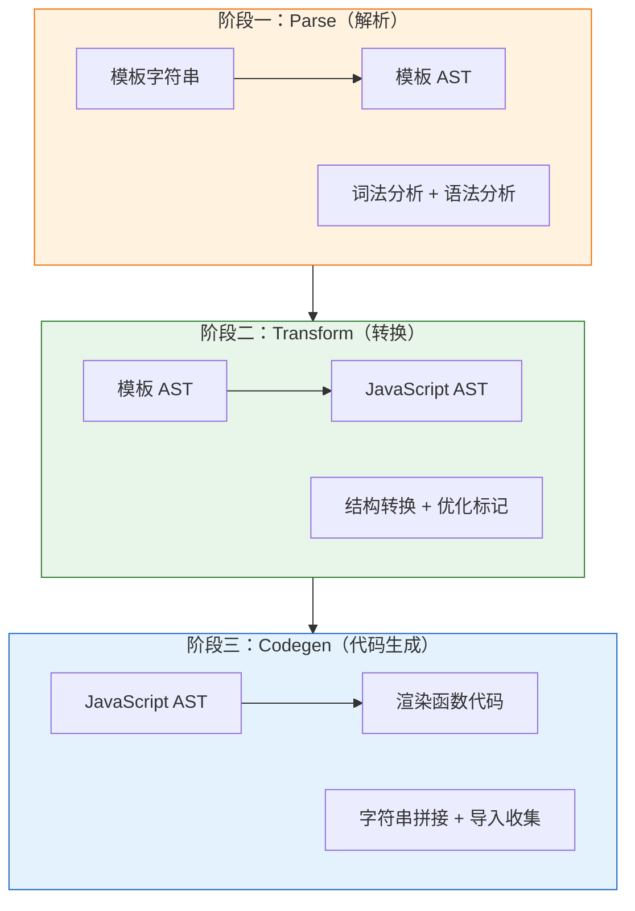
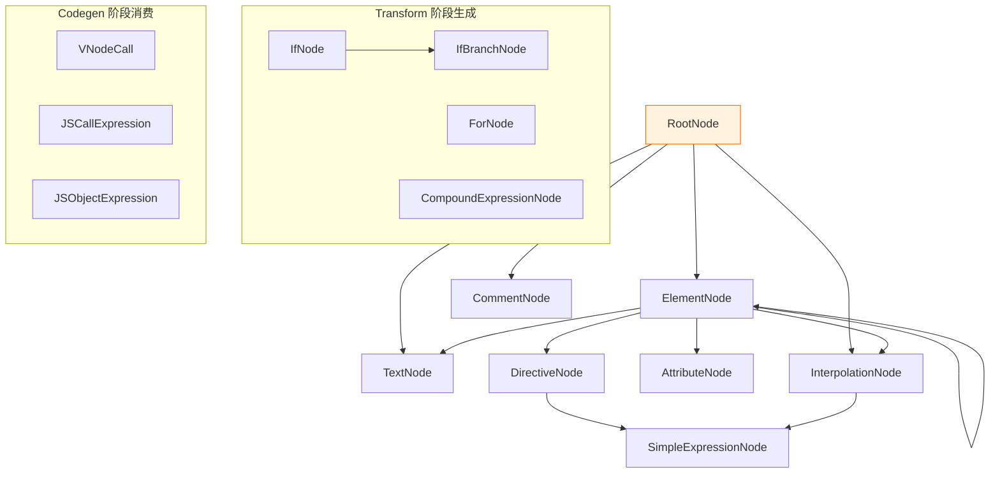
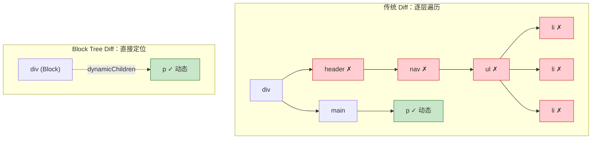
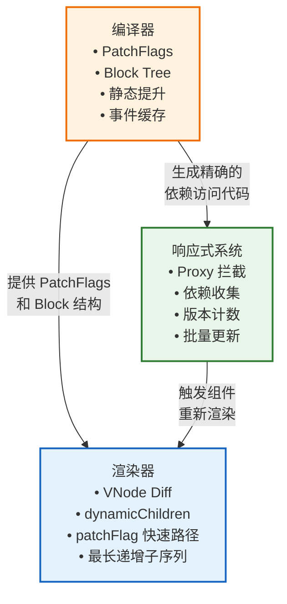

<div v-pre>

# 第 7 章 Vue Compiler 架构总览

> **本章要点**
>
> - 编译器在 Vue 运行时体系中的定位：为什么"模板→渲染函数"是性能的关键战场
> - 三阶段流水线：Parse → Transform → Codegen 的职责边界与数据流
> - AST 节点类型体系：从 RootNode 到 SimpleExpressionNode 的完整族谱
> - PatchFlags：编译期的"体检报告"，运行时 Diff 的加速密钥
> - Block Tree：打破虚拟 DOM 逐层比对的结构性飞跃
> - 静态提升（Static Hoisting）：让不变的节点只创建一次
> - 编译器与响应式系统、渲染器的三角协作模型

---

2016 年，Evan You 在 Vue 2 中做了一个大胆的决定：模板编译不是可选的预处理步骤，而是框架的一等公民。彼时 React 阵营正在推崇 JSX 的"JavaScript 即模板"哲学，Angular 则将模板编译深藏在 CLI 工具链的黑盒中。Vue 选择了第三条路——模板和 JSX 都支持，但模板是默认的、推荐的、也是**可以被深度优化的**。

这个决定的价值在 Vue 3 中彻底兑现。当 React 还在为"是否需要编译器"争论（直到 React Compiler/React Forget 才姗姗来迟），Vue 3 的编译器已经默默做了三件事：

1. **PatchFlags** —— 在编译期标记每个动态节点的变化类型，让运行时 Diff 只比较真正会变的部分
2. **Block Tree** —— 将动态节点"拍平"到一个数组中，跳过静态子树的逐层遍历
3. **静态提升** —— 将永远不会变化的 VNode 提升到渲染函数之外，避免每次渲染重复创建

这三项优化的共同特点是：**它们只能在编译期完成**。没有编译器，运行时就是"盲人摸象"——它不知道哪些节点是静态的，哪些属性会变，哪些子树可以跳过。有了编译器，运行时变成了"精确制导"——每一次比对、每一次更新都直奔目标。

本章将从宏观视角审视 Vue Compiler 的完整架构。我们不会深入每一行源码（那是第 8 章的任务），而是要建立一个清晰的心智模型：编译器由哪些阶段组成？每个阶段的输入和输出是什么？PatchFlags、Block Tree、静态提升分别在哪个阶段被计算？它们如何协同工作，让 Vue 的渲染性能远超纯运行时方案？

## 7.1 编译器在 Vue 架构中的位置

### 从模板到像素：完整渲染链路

一个 `.vue` 文件从编写到最终渲染在屏幕上，经历了这样一条链路：



编译器的职责很明确：**将模板字符串转换为渲染函数**。这个渲染函数在每次组件更新时被调用，返回新的 VNode 树，然后由渲染器（Renderer）对比新旧 VNode 树，将差异应用到真实 DOM。

### 编译时机：AOT vs JIT

Vue 编译器有两种运行时机：

| 维度 | AOT（预编译） | JIT（运行时编译） |
|------|--------------|------------------|
| **时机** | 构建阶段（Vite/Webpack） | 浏览器运行时 |
| **入口** | `@vue/compiler-sfc` | `@vue/compiler-dom` 的 `compile()` |
| **产物** | 预编译的 `.js` 文件 | 内存中的渲染函数 |
| **体积** | 不需要运行时编译器（~14KB 更小） | 需要完整构建版本 |
| **优化** | 可以执行所有静态分析优化 | 同样支持全部优化 |
| **使用场景** | 生产环境（推荐） | 动态模板、CDN 引入、在线编辑器 |

> 🔥 **深度洞察**
>
> 很多开发者认为"运行时编译 = 没有优化"，这是一个误解。Vue 3 的运行时编译器和预编译器共享同一套优化流水线——PatchFlags、Block Tree、静态提升在两种模式下都会被应用。区别仅在于编译发生的时间点和产物形态。不过，AOT 编译允许 SFC 专属的优化（如 `<script setup>` 的变量分析、CSS 变量注入），这些是运行时编译器无法做到的。

### 编译器的包结构

Vue 3 的编译器代码分布在三个包中：

```
packages/
├── compiler-core/     # 平台无关的编译核心
│   ├── parse.ts       # 模板解析器 → AST
│   ├── transform.ts   # AST 转换引擎
│   ├── codegen.ts     # 代码生成器
│   └── transforms/    # 内置转换插件
├── compiler-dom/      # DOM 平台专属编译
│   ├── index.ts       # compile() 入口
│   └── transforms/    # DOM 专属转换（v-html, v-model 等）
└── compiler-sfc/      # 单文件组件编译
    ├── parse.ts       # SFC 解析（<template>/<script>/<style>）
    ├── compileTemplate.ts
    ├── compileScript.ts
    └── compileStyle.ts
```

这种分层设计体现了 Vue 3 的"平台抽象"哲学：`compiler-core` 不知道 DOM 的存在，它只处理纯粹的模板语法到 AST 到代码字符串的转换。DOM 特定的规则（哪些是原生元素、哪些属性需要特殊处理）由 `compiler-dom` 以插件形式注入。这意味着同一个编译核心可以被复用来编译 SSR 代码、原生渲染代码，甚至未来的 Vapor Mode 代码。

## 7.2 三阶段流水线：Parse → Transform → Codegen

### 全景数据流

Vue 编译器的核心是一个经典的三阶段流水线：



每个阶段有明确的输入和输出：

| 阶段 | 输入 | 输出 | 核心职责 |
|------|------|------|---------|
| **Parse** | 模板字符串 `<div>`{{msg}}`</div>` | 模板 AST（树状节点结构） | 词法分析 + 语法分析，识别元素、属性、指令、插值 |
| **Transform** | 模板 AST | 带有 `codegenNode` 的增强 AST | 语义分析、优化标记（PatchFlags）、静态提升、Block 收集 |
| **Codegen** | 增强后的 AST | JavaScript 代码字符串 | 遍历 AST 生成 `render()` 函数的源码 |

### 阶段一：Parse —— 从字符串到树

解析器的任务是将模板字符串转换为抽象语法树（AST）。Vue 的模板解析器是一个**手写的递归下降解析器**，不依赖任何第三方库。

一个简单的模板：

```html
<div class="container">
  <p>{{ message }}</p>
  <span :title="tooltip">静态文本</span>
</div>
```

被解析为这样的 AST：

```typescript
// 简化的 AST 结构
const ast: RootNode = {
  type: NodeTypes.ROOT,
  children: [
    {
      type: NodeTypes.ELEMENT,
      tag: 'div',
      props: [
        {
          type: NodeTypes.ATTRIBUTE,
          name: 'class',
          value: { content: 'container' }
        }
      ],
      children: [
        {
          type: NodeTypes.ELEMENT,
          tag: 'p',
          children: [
            {
              type: NodeTypes.INTERPOLATION,  // 插值
              content: {
                type: NodeTypes.SIMPLE_EXPRESSION,
                content: 'message',
                isStatic: false
              }
            }
          ]
        },
        {
          type: NodeTypes.ELEMENT,
          tag: 'span',
          props: [
            {
              type: NodeTypes.DIRECTIVE,  // v-bind
              name: 'bind',
              arg: { content: 'title', isStatic: true },
              exp: { content: 'tooltip', isStatic: false }
            }
          ],
          children: [
            {
              type: NodeTypes.TEXT,
              content: '静态文本'
            }
          ]
        }
      ]
    }
  ]
}
```

Parse 阶段的关键特征：

1. **无优化**：Parse 阶段不做任何优化判断，它只忠实地将模板结构转换为树形数据。"这个节点是否是静态的"不是 Parse 的职责。
2. **容错处理**：解析器能处理不规范的 HTML（如未闭合标签），并给出有意义的错误提示。
3. **位置信息**：每个 AST 节点都携带 `loc`（location）信息，精确到行号和列号，用于后续的 source map 生成和错误报告。

### 阶段二：Transform —— 从"是什么"到"怎么做"

Transform 是编译器中**最复杂、最核心**的阶段。如果说 Parse 回答的是"模板的结构是什么"，那么 Transform 回答的是"这个结构应该如何被渲染"。

Transform 阶段的工作包括：

1. **指令处理**：将 `v-if`、`v-for`、`v-on`、`v-bind`、`v-model` 等指令转换为对应的运行时代码结构
2. **静态分析**：判断哪些节点是完全静态的、哪些属性会动态变化
3. **PatchFlags 标记**：为每个动态节点计算精确的变化标记
4. **Block 收集**：将动态节点收集到 Block 的 `dynamicChildren` 数组
5. **静态提升标记**：标记可以被提升到渲染函数外部的静态节点
6. **codegenNode 生成**：为每个节点创建 `codegenNode`，这是 Codegen 阶段的直接输入

Transform 采用**插件架构**。核心引擎提供遍历和上下文管理，具体的转换逻辑由一组"转换函数"实现：

```typescript
// compiler-core/src/transform.ts（简化）
function transform(root: RootNode, options: TransformOptions) {
  const context = createTransformContext(root, options)
  traverseNode(root, context)

  // 静态提升（在遍历完成后执行）
  if (options.hoistStatic) {
    hoistStatic(root, context)
  }

  // 创建根节点的 codegenNode
  createRootCodegen(root, context)
}

// 遍历引擎
function traverseNode(node: TemplateNode, context: TransformContext) {
  context.currentNode = node

  // 执行所有转换插件（进入阶段）
  const { nodeTransforms } = context
  const exitFns: Function[] = []
  for (let i = 0; i < nodeTransforms.length; i++) {
    const onExit = nodeTransforms[i](node, context)
    if (onExit) exitFns.push(onExit)  // 收集退出回调
  }

  // 递归遍历子节点
  traverseChildren(node, context)

  // 执行退出回调（逆序 —— 后进先出）
  let i = exitFns.length
  while (i--) {
    exitFns[i]()
  }
}
```

> 🔥 **深度洞察**
>
> Transform 的插件执行采用了"洋葱模型"：每个插件在进入节点时可以返回一个"退出回调"。子节点的转换在进入和退出之间执行。这意味着退出回调执行时，**所有子节点都已经被转换完毕**。这个设计至关重要——像 `v-if` 这样的结构性指令需要在子节点转换完成后才能生成最终的 codegenNode，因为它需要知道子节点的动态特性。

核心转换插件列表：

| 插件 | 文件 | 职责 |
|------|------|------|
| `transformElement` | `transformElement.ts` | 处理普通元素，生成 `createVNode` 调用 |
| `transformText` | `transformText.ts` | 合并相邻文本和插值节点 |
| `transformSlotOutlet` | `transformSlotOutlet.ts` | 处理 `<slot>` 出口 |
| `transformOnce` | `vOnce.ts` | 处理 `v-once`，标记为缓存节点 |
| `transformIf` | `vIf.ts` | 处理 `v-if/v-else-if/v-else`，生成条件分支 |
| `transformFor` | `vFor.ts` | 处理 `v-for`，生成列表渲染 |
| `transformBind` | `vBind.ts` | 处理 `v-bind`（`:` 缩写） |
| `transformOn` | `vOn.ts` | 处理 `v-on`（`@` 缩写） |
| `transformModel` | `vModel.ts` | 处理 `v-model`，生成双向绑定代码 |

### 阶段三：Codegen —— 从树到字符串

代码生成器遍历 Transform 阶段产出的增强 AST（具体来说是每个节点的 `codegenNode`），将其转换为 JavaScript 代码字符串。

对于前面的模板示例，Codegen 产出的渲染函数大致如下：

```javascript
import { createElementVNode as _createElementVNode, toDisplayString as _toDisplayString, openBlock as _openBlock, createElementBlock as _createElementBlock } from "vue"

// 静态提升的节点
const _hoisted_1 = { class: "container" }
const _hoisted_2 = /*#__PURE__*/ _createElementVNode("p", null, null, -1 /* HOISTED */)

export function render(_ctx, _cache) {
  return (_openBlock(), _createElementBlock("div", _hoisted_1, [
    _hoisted_2,
    _createElementVNode("span", {
      title: _ctx.tooltip
    }, "静态文本", 8 /* PROPS */, ["title"])
  ]))
}
```

Codegen 阶段的关键职责：

1. **导入收集**：自动追踪使用了哪些运行时 helper（`createElementVNode`、`openBlock` 等），生成 `import` 语句
2. **静态提升输出**：将被提升的节点声明为模块级变量
3. **缩进管理**：生成可读的、格式化的代码（开发模式）或紧凑代码（生产模式）
4. **Source Map**：在开发模式下生成 source map，将编译产物映射回原始模板

## 7.3 AST 节点类型体系

Vue 编译器定义了一套完整的 AST 节点类型，每种类型对应模板中的一种语法结构。理解这些类型是理解编译器内部运作的基础。

### NodeTypes 枚举

```typescript
// compiler-core/src/ast.ts
export enum NodeTypes {
  ROOT,                    // 根节点
  ELEMENT,                 // 元素 <div>
  TEXT,                    // 纯文本
  COMMENT,                 // 注释 <!-- -->
  SIMPLE_EXPRESSION,       // 简单表达式 msg
  INTERPOLATION,           // 插值 { { msg } }
  ATTRIBUTE,               // 静态属性 class="foo"
  DIRECTIVE,               // 指令 v-bind:title="msg"

  // 以下是 Transform 阶段生成的容器类型
  COMPOUND_EXPRESSION,     // 复合表达式（文本 + 插值合并）
  IF,                      // v-if 分支容器
  IF_BRANCH,               // v-if 单个分支
  FOR,                     // v-for 容器
  TEXT_CALL,               // createTextVNode() 调用

  // 以下是 codegen 专用类型
  VNODE_CALL,              // createVNode() 调用描述
  JS_CALL_EXPRESSION,      // 通用函数调用
  JS_OBJECT_EXPRESSION,    // 对象字面量 { key: value }
  JS_PROPERTY,             // 对象属性
  JS_ARRAY_EXPRESSION,     // 数组字面量
  JS_FUNCTION_EXPRESSION,  // 函数表达式
  JS_CONDITIONAL_EXPRESSION, // 三元表达式
  JS_CACHE_EXPRESSION,     // v-once 缓存表达式
  // ...
}
```

> 💡 **最佳实践**
>
> 当你需要编写自定义编译器插件（如自定义指令的编译时优化）时，最重要的是理解 `VNODE_CALL` 类型——它是 Transform 阶段的核心产出，描述了"如何创建这个 VNode"的完整信息。你的转换插件最终要做的，就是为节点生成正确的 `VNodeCall` 结构。

### AST 节点的层次关系



## 7.4 PatchFlags：编译器给运行时的"体检报告"

### 问题：运行时 Diff 的盲区

传统的虚拟 DOM Diff 算法（包括 React 的 Reconciler）在比对两个 VNode 时，需要逐一检查所有属性：

```typescript
// 传统 Diff 的做法（伪代码）
function patchElement(oldVNode, newVNode) {
  // 比对所有 props —— 即使大部分 props 都不会变
  const oldProps = oldVNode.props
  const newProps = newVNode.props

  for (const key in newProps) {
    if (oldProps[key] !== newProps[key]) {
      hostPatchProp(el, key, oldProps[key], newProps[key])
    }
  }
  for (const key in oldProps) {
    if (!(key in newProps)) {
      hostPatchProp(el, key, oldProps[key], null)
    }
  }

  // 递归比对所有子节点 —— 即使大部分子节点都没变
  patchChildren(oldVNode, newVNode, el)
}
```

这种做法的问题是：**运行时没有信息**。它不知道哪些属性是动态绑定的，哪些是静态写死的。它只能老老实实地全量比对。

### PatchFlags：编译期的类型标记

Vue 编译器通过分析模板，在编译期就确定每个动态节点的**精确变化类型**，并将这个信息编码为一个整数——PatchFlag：

```typescript
// @vue/shared/src/patchFlags.ts
export enum PatchFlags {
  TEXT = 1,           // 动态文本内容
  CLASS = 1 << 1,     // 动态 class
  STYLE = 1 << 2,     // 动态 style
  PROPS = 1 << 3,     // 动态非 class/style 属性
  FULL_PROPS = 1 << 4, // 有动态 key 的属性
  NEED_HYDRATION = 1 << 5, // 需要 hydration 处理的事件监听
  STABLE_FRAGMENT = 1 << 6, // 子节点顺序稳定的 Fragment
  KEYED_FRAGMENT = 1 << 7,  // 有 key 的 Fragment 子节点
  UNKEYED_FRAGMENT = 1 << 8, // 无 key 的 Fragment 子节点
  NEED_PATCH = 1 << 9,       // 需要非 props 的 patch（ref、directives）
  DYNAMIC_SLOTS = 1 << 10,   // 动态插槽
  DEV_ROOT_FRAGMENT = 1 << 11, // 仅开发模式的根 Fragment

  // 特殊标记（负数）
  HOISTED = -1,       // 静态提升的节点，完全跳过 Diff
  BAIL = -2           // 编译器放弃优化，运行时全量 Diff
}
```

PatchFlags 使用**位掩码（bitmask）**设计，一个节点可以同时拥有多个标记：

```typescript
// 编译器分析模板后标记：
// <div :class="cls" :style="stl">{ { msg } }</div>
//
// 这个节点有：动态文本 + 动态 class + 动态 style
const patchFlag = PatchFlags.TEXT | PatchFlags.CLASS | PatchFlags.STYLE
// = 1 | 2 | 4 = 7
```

### 运行时如何利用 PatchFlags

有了 PatchFlags，运行时的 Diff 可以精确地只处理变化的部分：

```typescript
// runtime-core/src/renderer.ts — patchElement（简化）
function patchElement(n1: VNode, n2: VNode) {
  const el = (n2.el = n1.el!)
  const patchFlag = n2.patchFlag

  if (patchFlag > 0) {
    // 有 PatchFlag —— 精确更新
    if (patchFlag & PatchFlags.CLASS) {
      if (n1.props!.class !== n2.props!.class) {
        hostPatchProp(el, 'class', null, n2.props!.class)
      }
    }
    if (patchFlag & PatchFlags.STYLE) {
      hostPatchProp(el, 'style', n1.props!.style, n2.props!.style)
    }
    if (patchFlag & PatchFlags.PROPS) {
      // 只比对 dynamicProps 中列出的属性
      const dynamicProps = n2.dynamicProps!
      for (let i = 0; i < dynamicProps.length; i++) {
        const key = dynamicProps[i]
        const prev = n1.props![key]
        const next = n2.props![key]
        if (next !== prev) {
          hostPatchProp(el, key, prev, next)
        }
      }
    }
    if (patchFlag & PatchFlags.TEXT) {
      if (n1.children !== n2.children) {
        hostSetElementText(el, n2.children as string)
      }
    }
  } else if (patchFlag === 0) {
    // patchFlag === 0 但存在：全量 props 比对
    patchProps(el, n1.props, n2.props)
  }
  // patchFlag < 0（HOISTED）：完全跳过
}
```

> 🔥 **深度洞察**
>
> PatchFlags 的精妙之处在于**位运算的零成本抽象**。`patchFlag & PatchFlags.TEXT` 在 CPU 层面只是一条 AND 指令——比函数调用、对象查找、字符串比较都快几个数量级。这就是"编译期做正确的事，运行时享受红利"的典型案例。一个简单的整数，承载了编译器对模板的全部理解。

### PatchFlags 在实际模板中的标记示例

```html
<!-- 模板 -->
<div>
  <p>静态文本</p>                          <!-- 无 PatchFlag → 静态提升 -->
  <p>{{ dynamicText }}</p>                 <!-- PatchFlag: TEXT (1) -->
  <p :class="cls">固定文本</p>             <!-- PatchFlag: CLASS (2) -->
  <p :id="id" :title="tip">固定文本</p>   <!-- PatchFlag: PROPS (8), dynamicProps: ["id", "title"] -->
  <p :[dynamicKey]="val">固定文本</p>      <!-- PatchFlag: FULL_PROPS (16) -->
</div>
```

编译产物中的标记：

```javascript
// 编译输出（简化）
_createElementVNode("p", null, "静态文本", -1 /* HOISTED */)
_createElementVNode("p", null, _toDisplayString(_ctx.dynamicText), 1 /* TEXT */)
_createElementVNode("p", { class: _ctx.cls }, "固定文本", 2 /* CLASS */)
_createElementVNode("p", { id: _ctx.id, title: _ctx.tip }, "固定文本", 8 /* PROPS */, ["id", "title"])
_createElementVNode("p", { [_ctx.dynamicKey]: _ctx.val }, "固定文本", 16 /* FULL_PROPS */)
```

注意最后一个参数就是 PatchFlag，对于 `PROPS` 类型还有第五个参数——`dynamicProps` 数组，精确列出哪些属性名是动态的。

## 7.5 Block Tree：结构性的 Diff 加速

### 问题：静态子树的无效遍历

PatchFlags 解决了"节点内部的精确比对"，但还有一个更大的问题：**静态子树的遍历**。

考虑这样一个模板：

```html
<div>
  <header>
    <nav>
      <ul>
        <li>首页</li>
        <li>关于</li>
        <li>联系我们</li>
      </ul>
    </nav>
  </header>
  <main>
    <p>{{ content }}</p>
  </main>
</div>
```

在这个模板中，`<header>` 及其所有子节点都是完全静态的。唯一的动态节点是 `<p>`{{ content }}`</p>`。但传统的 Diff 算法会从根节点开始逐层遍历——先比对 `<div>`，然后 `<header>`，然后 `<nav>`，然后 `<ul>`，然后三个 `<li>`……最终才到达 `<main>` 里的 `<p>`。

六层静态节点的遍历，全是无用功。

### Block 的概念

Vue 3 引入了 **Block** 来解决这个问题。Block 是一种特殊的 VNode，它额外持有一个 `dynamicChildren` 数组——**当前 Block 范围内所有动态子节点的扁平列表**。

```typescript
// Block VNode 的结构（简化）
interface BlockVNode extends VNode {
  dynamicChildren: VNode[]  // 扁平化的动态子节点列表
}
```

编译器在 Transform 阶段识别出所有动态节点，并将它们直接收集到最近的 Block 的 `dynamicChildren` 中。渲染器在 Diff Block 时，**跳过整棵子树的遍历，直接比对 `dynamicChildren` 数组**：



### Block 的边界：结构不稳定的节点

并非所有 VNode 都可以作为普通 Block 的子节点。当模板中存在**可能改变子节点结构**的指令时，需要创建新的 Block 来隔离结构变化：

```html
<div>                              <!-- 根 Block -->
  <p>静态内容</p>
  <div v-if="show">               <!-- 新 Block：v-if 可能改变子节点数量 -->
    <span>{{ a }}</span>
  </div>
  <div v-for="item in list">      <!-- 新 Block：v-for 可能改变子节点数量 -->
    <span>{{ item.name }}</span>
  </div>
</div>
```

**需要创建新 Block 的结构性指令：**

| 指令 | 原因 |
|------|------|
| `v-if` / `v-else-if` / `v-else` | 条件分支可能改变子节点的存在性 |
| `v-for` | 列表长度变化导致子节点数量变化 |
| `<component :is="...">` | 动态组件可能完全替换子树结构 |

> 🔥 **深度洞察**
>
> Block Tree 的设计精髓在于**将 O(tree) 的 Diff 降级为 O(dynamic nodes) 的 Diff**。在典型的应用中，模板的 80-90% 是静态结构，只有 10-20% 包含动态绑定。Block Tree 让 Diff 的复杂度与"动态节点数量"成正比，而非与"总节点数量"成正比。对于一个有 1000 个节点但只有 50 个动态绑定的页面，Diff 的工作量减少了 95%。

### openBlock / createBlock 的运行时机制

在运行时，Block 的创建通过 `openBlock()` 和 `createElementBlock()` 配合完成：

```typescript
// runtime-core/src/vnode.ts（简化）
let currentBlock: VNode[] | null = null
const blockStack: (VNode[] | null)[] = []

export function openBlock(disableTracking = false) {
  blockStack.push((currentBlock = disableTracking ? null : []))
}

export function createElementBlock(
  type: string,
  props?: any,
  children?: any,
  patchFlag?: number,
  dynamicProps?: string[]
): VNode {
  return setupBlock(
    createBaseVNode(type, props, children, patchFlag, dynamicProps, true /* isBlock */)
  )
}

function setupBlock(vnode: VNode): VNode {
  vnode.dynamicChildren = currentBlock  // 收集所有动态子节点
  closeBlock()
  // 将当前 Block VNode 自身也加入父 Block 的追踪
  if (currentBlock) {
    currentBlock.push(vnode)
  }
  return vnode
}
```

编译器生成的代码中，每个 Block 的创建都遵循 `openBlock() → 创建子节点 → createElementBlock()` 的模式。在子节点创建过程中，任何带有 PatchFlag 的 VNode 都会被自动推入 `currentBlock` 数组。

## 7.6 静态提升（Static Hoisting）

### 原理：让不变的东西只创建一次

在没有静态提升的情况下，每次渲染函数执行时，**所有**的 VNode 都会被重新创建——包括那些永远不会改变的静态节点：

```javascript
// 未优化：每次 render() 都重新创建静态节点
export function render(_ctx) {
  return (_openBlock(), _createElementBlock("div", null, [
    _createElementVNode("p", null, "我是静态文本"),  // 每次都创建新对象！
    _createElementVNode("p", null, "我也是"),         // 每次都创建新对象！
    _createElementVNode("p", null, _toDisplayString(_ctx.msg), 1 /* TEXT */)
  ]))
}
```

静态提升将那些"永远不变"的 VNode 创建语句提升到 `render()` 函数之外：

```javascript
// 静态提升后：静态节点只创建一次
const _hoisted_1 = /*#__PURE__*/ _createElementVNode("p", null, "我是静态文本", -1)
const _hoisted_2 = /*#__PURE__*/ _createElementVNode("p", null, "我也是", -1)

export function render(_ctx) {
  return (_openBlock(), _createElementBlock("div", null, [
    _hoisted_1,  // 复用同一个 VNode 对象
    _hoisted_2,  // 复用同一个 VNode 对象
    _createElementVNode("p", null, _toDisplayString(_ctx.msg), 1 /* TEXT */)
  ]))
}
```

### 提升的层级

静态提升不仅适用于单个节点，还可以提升整棵静态子树：

```html
<div>
  <section>
    <h2>关于我们</h2>
    <p>这是一段关于公司的描述文字。</p>
    <p>成立于 2020 年。</p>
  </section>
  <p>{{ dynamicContent }}</p>
</div>
```

在这个例子中，整个 `<section>` 及其所有子节点都是静态的。编译器会将整个 `<section>` 子树作为一个整体提升。

### 静态属性提升

即使一个元素本身是动态的（有动态子节点或某些动态属性），它的**静态属性对象**也可以被提升：

```html
<div id="app" class="container" :style="dynamicStyle">
  {{ content }}
</div>
```

```javascript
// 属性对象中 id 和 class 是静态的，可以提升
const _hoisted_1 = {
  id: "app",
  class: "container"
}

export function render(_ctx) {
  return (_openBlock(), _createElementBlock("div",
    _mergeProps(_hoisted_1, { style: _ctx.dynamicStyle }),
    _toDisplayString(_ctx.content),
    1 /* TEXT */
  ))
}
```

> 💡 **最佳实践**
>
> 静态提升在大量静态内容的页面（如官网、博客、文档站）中效果最为显著。如果你的页面有大段的静态 HTML 结构（导航栏、页脚、说明文字），Vue 编译器会自动帮你把这些内容"提升"出去，避免每次更新都重新创建数百个 VNode。你不需要手动做任何优化——编译器是你最好的性能工程师。

### 静态提升的判定条件

编译器在 `hoistStatic()` 中通过递归分析每个节点，判断其是否满足静态提升条件：

```typescript
// 简化的静态分析结果枚举
enum ConstantTypes {
  NOT_CONSTANT = 0,    // 不是常量（有动态绑定）
  CAN_SKIP_PATCH = 1,  // 是常量，但不能被字符串化
  CAN_HOIST = 2,       // 可以被提升到 render() 外部
  CAN_STRINGIFY = 3    // 可以被序列化为纯字符串（最高优化级别）
}
```

一个节点能否被提升，取决于：

1. **没有动态绑定**（所有 props 都是静态的）
2. **没有动态子节点**（所有子节点也都是静态的）
3. **不在 v-for 作用域内**（因为 v-for 的迭代变量是运行时才确定的）
4. **不是组件**（组件的渲染结果在编译期不可知）

当连续的静态节点超过一定数量（默认 20 个）时，编译器还会启用**字符串化（Stringify）**——将这些静态节点直接编译为 `innerHTML` 字符串，进一步减少 VNode 创建开销。

## 7.7 编译器 × 响应式 × 渲染器：三角协作

### 全局视角：三个子系统如何协同

Vue 3 的性能优势不来自于任何单一子系统，而来自于**编译器、响应式系统和渲染器的深度协作**：



协作链路：

1. **编译器 → 渲染器**：编译器通过 PatchFlags 和 Block Tree 告诉渲染器"哪些节点是动态的、动态的部分是什么"，渲染器利用这些信息跳过不必要的比对。

2. **响应式系统 → 渲染器**：当响应式数据变化时，响应式系统精确地触发依赖这些数据的组件重新渲染。组件的渲染函数执行时会读取响应式数据，自动建立依赖关系。

3. **编译器 → 响应式系统**：编译器生成的渲染函数中，对响应式数据的访问是精确的（`_ctx.msg` 而非遍历整个 context），这使得依赖收集的粒度更细、更高效。

### 一次更新的完整链路

以一个简单的场景为例——用户点击按钮，修改了 `count` 的值：

```
1. 用户点击 → 事件处理器执行 → count.value++
2. 响应式系统检测到 count 变化 → 标记依赖 count 的组件为"脏"
3. 调度器将脏组件加入微任务队列
4. 微任务执行 → 调用组件的 render() 函数
5. render() 函数执行，生成新的 VNode 树（带 PatchFlags 和 Block）
6. 渲染器比对新旧 VNode：
   a. 遇到 Block → 直接比对 dynamicChildren，跳过静态子树
   b. 遇到动态节点 → 根据 PatchFlag 只更新变化的部分
7. DOM 更新完成
```

这条链路中，**编译器的优化在步骤 5-6 中发挥作用**：步骤 5 中生成的 VNode 携带了编译期的优化信息，步骤 6 中渲染器利用这些信息将 Diff 的工作量降到最低。

> 🔥 **深度洞察**
>
> Vue 3 的性能哲学可以用一句话概括：**编译期尽可能多地确定信息，运行期尽可能少地做决策**。React 的 Reconciler 在运行时面对两棵完全"裸"的 VNode 树，只能通过启发式算法猜测"哪些节点对应哪些节点"。Vue 的渲染器面对的是带有完整标注的 VNode 树——每个节点的"体检报告"（PatchFlags）早已由编译器在编译期写好。这就像是开卷考试和闭卷考试的区别——答案并不总在眼前，但重要的提示都已经给出了。

## 7.8 编译产物解读实战

让我们用一个稍复杂的模板来综合理解编译器的所有优化手段：

### 源模板

```html
<template>
  <div class="page">
    <header>
      <h1>Vue 3.6 Deep Dive</h1>
      <p>探索框架的内核世界</p>
    </header>

    <main>
      <section v-if="showIntro">
        <p>{{ introText }}</p>
      </section>

      <ul>
        <li v-for="item in list" :key="item.id">
          <span :class="item.status">{{ item.name }}</span>
        </li>
      </ul>

      <button @click="handleClick">
        点击次数：{{ count }}
      </button>
    </main>

    <footer>
      <p>版权所有 © 2024</p>
    </footer>
  </div>
</template>
```

### 编译产物（带注释分析）

```javascript
import {
  createElementVNode as _createElementVNode,
  toDisplayString as _toDisplayString,
  openBlock as _openBlock,
  createElementBlock as _createElementBlock,
  createCommentVNode as _createCommentVNode,
  renderList as _renderList,
  Fragment as _Fragment,
  normalizeClass as _normalizeClass
} from "vue"

// ==================== 静态提升 ====================
// 整个 <header> 子树被提升 —— 它完全是静态的
const _hoisted_1 = { class: "page" }
const _hoisted_2 = /*#__PURE__*/ _createElementVNode("header", null, [
  /*#__PURE__*/ _createElementVNode("h1", null, "Vue 3.6 Deep Dive"),
  /*#__PURE__*/ _createElementVNode("p", null, "探索框架的内核世界")
], -1 /* HOISTED */)

// <footer> 也被整体提升
const _hoisted_3 = /*#__PURE__*/ _createElementVNode("footer", null, [
  /*#__PURE__*/ _createElementVNode("p", null, "版权所有 © 2024")
], -1 /* HOISTED */)

export function render(_ctx, _cache) {
  return (_openBlock(), _createElementBlock("div", _hoisted_1, [
    _hoisted_2,  // <header> —— 复用提升的静态节点

    _createElementVNode("main", null, [
      // v-if 创建新的 Block
      (_ctx.showIntro)
        ? (_openBlock(), _createElementBlock("section", { key: 0 }, [
            _createElementVNode("p", null,
              _toDisplayString(_ctx.introText),
              1 /* TEXT */    // ← PatchFlag: 只有文本是动态的
            )
          ]))
        : _createCommentVNode("v-if", true),

      // v-for 创建 Fragment Block
      _createElementVNode("ul", null, [
        (_openBlock(true), _createElementBlock(_Fragment, null,
          _renderList(_ctx.list, (item) => {
            return (_openBlock(), _createElementBlock("li", {
              key: item.id
            }, [
              _createElementVNode("span", {
                class: _normalizeClass(item.status)
              }, _toDisplayString(item.name),
                3 /* TEXT, CLASS */  // ← PatchFlag: 文本和 class 都是动态的
              )
            ]))
          }),
          128 /* KEYED_FRAGMENT */  // ← PatchFlag: 有 key 的列表
        ))
      ]),

      _createElementVNode("button", {
        onClick: _ctx.handleClick
      }, "点击次数：" + _toDisplayString(_ctx.count),
        9 /* TEXT, PROPS */,  // ← PatchFlag: 文本和 props 都动态
        ["onClick"]           // ← dynamicProps: 指明哪些 props 是动态的
      )
    ]),

    _hoisted_3  // <footer> —— 复用提升的静态节点
  ]))
}
```

### 优化效果汇总

| 优化手段 | 体现 | 效果 |
|---------|------|------|
| **静态提升** | `<header>`、`<footer>`、`class="page"` 都被提升 | 每次渲染节省 5 个 VNode 的创建 |
| **PatchFlags** | `TEXT(1)`、`CLASS(2)`、`PROPS(8)` 精确标记 | Diff 时只比对标记的属性 |
| **Block Tree** | `v-if` 和 `v-for` 各创建新 Block | 根 Block 的 dynamicChildren 只含动态节点 |
| **dynamicProps** | `["onClick"]` 指明动态属性名 | 避免遍历所有属性 |
| **KEYED_FRAGMENT** | v-for 的 Fragment 标记为 `128` | 渲染器使用 key-based Diff 算法 |

## 7.9 与其他框架编译策略的对比

| 维度 | Vue 3 | React (React Compiler) | Svelte 5 | Solid.js |
|------|-------|----------------------|-----------|----------|
| **编译器定位** | 模板 → 优化的渲染函数 | JSX → 优化的 JSX（记忆化） | 模板 → 命令式 DOM 操作 | JSX → 细粒度响应式绑定 |
| **运行时模型** | 虚拟 DOM + Block Tree | 虚拟 DOM + 自动 memo | 无虚拟 DOM | 无虚拟 DOM |
| **静态分析深度** | PatchFlags + 静态提升 | 自动 useMemo/useCallback | 完全编译时确定更新路径 | 编译时确定信号订阅 |
| **编译器必要性** | 推荐但非必须（支持 JSX） | 可选优化 | 必须 | 必须 |
| **Diff 策略** | Block + PatchFlag 精确 Diff | 全量 Fiber 遍历（优化后减少） | 无 Diff（直接更新） | 无 Diff（信号驱动） |
| **学习曲线** | 低（模板语法接近 HTML） | 低（JSX 就是 JS） | 低（模板 + 少量语法） | 中（理解信号和所有权） |

> 💡 **最佳实践**
>
> Vue 的编译策略可以概括为"**保留虚拟 DOM 的灵活性，用编译优化填平性能差距**"。这意味着你仍然可以使用 `h()` 函数手写渲染逻辑、在渲染函数中使用完整的 JavaScript 能力，但在使用模板时能自动获得接近无虚拟 DOM 方案的性能。这是一种务实的"两全其美"策略——不像 Svelte 那样完全放弃运行时灵活性，也不像早期 React 那样完全依赖运行时启发式优化。

## 7.10 本章小结

本章从宏观视角审视了 Vue Compiler 的完整架构，建立了以下核心认知：

**三阶段流水线**：Vue 编译器由 Parse（解析）→ Transform（转换）→ Codegen（代码生成）三个阶段组成。Parse 将模板字符串转换为 AST，Transform 对 AST 进行语义分析和优化标记，Codegen 将增强后的 AST 转换为 JavaScript 渲染函数代码。

**PatchFlags**：编译器在编译期分析每个动态节点的变化类型，用位掩码整数编码这些信息。运行时 Diff 利用 PatchFlags 精确地只比对会变化的部分，避免全量属性遍历。

**Block Tree**：通过将动态节点"拍平"到 Block 的 `dynamicChildren` 数组中，渲染器可以跳过整棵静态子树的遍历，将 Diff 的复杂度从 O(总节点数) 降低到 O(动态节点数)。

**静态提升**：将永远不会变化的 VNode 和属性对象提升到渲染函数外部，避免每次渲染重复创建。对于大量静态内容的页面，这一优化可以显著减少内存分配和 GC 压力。

**三角协作**：编译器、响应式系统和渲染器形成紧密的协作关系——编译器提供优化信息，响应式系统精确触发更新，渲染器利用编译信息执行最小化的 DOM 操作。

---

### 思考题

1. **PatchFlags 为什么使用位掩码而非数组或对象？** 从 CPU 指令级别分析位运算相比其他数据结构的优势。

2. **Block Tree 在什么场景下会"退化"？** 思考一下，如果一个模板中大量使用 `v-if` 和 `v-for`，Block Tree 的优化效果会如何变化？

3. **静态提升有没有副作用？** 提升后的 VNode 在多个渲染周期间被复用，这对 VNode 上的 `el` 属性（指向真实 DOM 元素）有什么影响？

4. **假设你要为一个非 DOM 平台（如 Canvas 2D）实现 Vue 的渲染器，编译器的哪些优化仍然适用？哪些需要调整？**

5. **Vue 选择"虚拟 DOM + 编译优化"而非 Svelte/Solid 的"无虚拟 DOM"路线，这个决策有什么长远考量？** 提示：思考 `<component :is="...">`、`render()` 函数、Teleport、Suspense 等需要运行时决策的场景。


</div>
