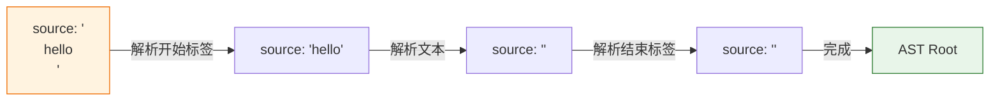
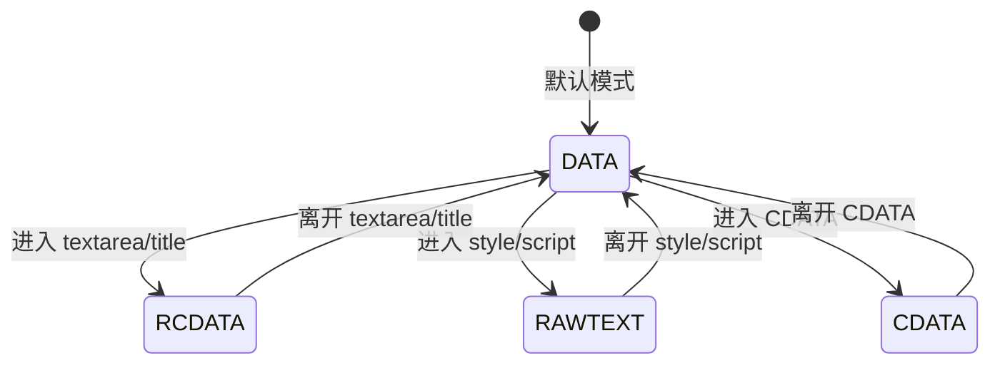
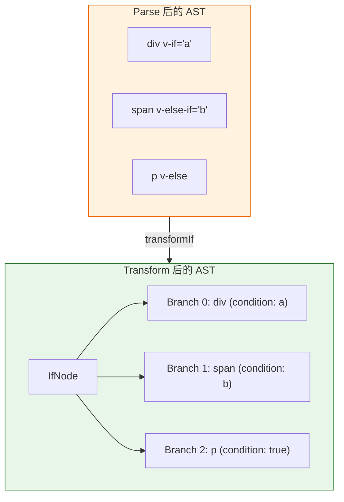
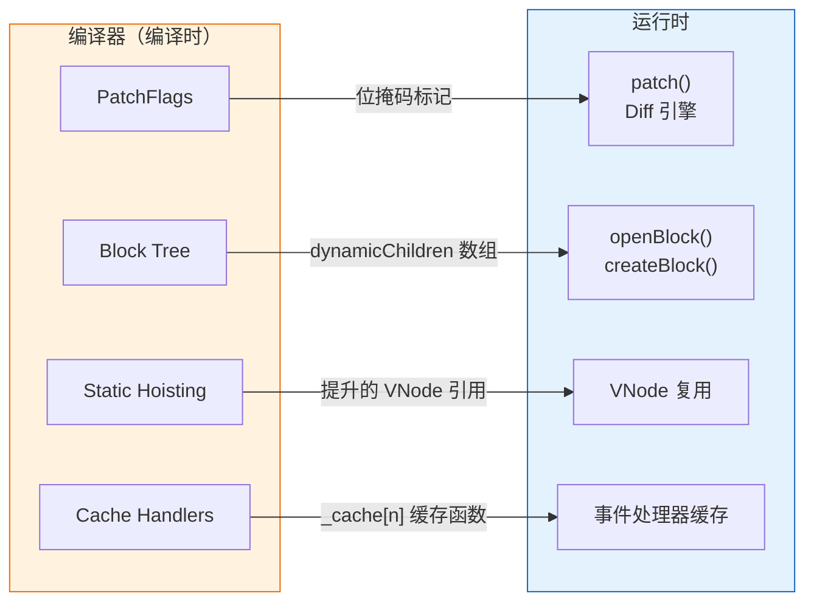

<div v-pre>

# 第 8 章 模板编译深度剖析

> **本章要点**
>
> - Parse 阶段的完整实现：手写递归下降解析器如何将模板字符串逐字符消费为 AST
> - 词法分析的状态机模型：标签开启、属性读取、插值解析的状态流转
> - Transform 阶段的插件化架构：nodeTransforms 与 directiveTransforms 的协作机制
> - 核心转换插件剖析：v-if、v-for、v-model 等指令的编译期展开
> - PatchFlags 与 Block 的注入时机：从 AST 节点到 codegenNode 的关键跃迁
> - Codegen 阶段的代码拼接策略：如何生成可读且高效的渲染函数
> - Source Map 生成：从模板行列号到生成代码行列号的映射链路

---

第 7 章中，我们以"导游图"的视角鸟瞰了编译器的三阶段流水线。你知道了 Parse、Transform、Codegen 各自的职责边界，也知道了 PatchFlags、Block Tree、静态提升是在哪个阶段被注入的。但一份导游图再精美，也无法替代你亲自走进每一条街巷。

本章就是那次步行之旅。我们将从编译器的入口函数 `baseCompile()` 出发，沿着模板字符串被"消化"的路径，逐阶段、逐函数地追踪它的变形过程。每到一个关键节点，我们都会停下来，看看源码中的实际实现，理解设计者的意图。

一个忠告：本章代码量较大。建议你打开 Vue 3 源码仓库（`packages/compiler-core/src/`），与本章文字对照阅读。当你能在脑海中完整复现一个模板从字符串到渲染函数的旅程时，你就真正"拥有"了 Vue 编译器。

## 8.1 编译器入口：baseCompile 与 compile

### 两个 compile 函数

Vue 3 的编译器暴露了两层入口：

```typescript
// packages/compiler-dom/src/index.ts
export function compile(
  template: string,
  options?: CompilerOptions
): CodegenResult {
  return baseCompile(
    template,
    extend({}, parserOptions, options, {
      nodeTransforms: [
        ...DOMNodeTransforms,
        ...(options?.nodeTransforms || [])
      ],
      directiveTransforms: extend(
        {},
        DOMDirectiveTransforms,
        options?.directiveTransforms || {}
      )
    })
  )
}
```

`compiler-dom` 的 `compile()` 是面向用户的入口，它在 `compiler-core` 的 `baseCompile()` 基础上注入了 DOM 平台特定的解析选项和转换插件。这种"核心+平台"的分层模式在 Vue 3 中反复出现——响应式系统、渲染器、编译器都遵循同样的哲学。

### baseCompile 的三步曲

```typescript
// packages/compiler-core/src/compile.ts
export function baseCompile(
  source: string | RootNode,
  options: CompilerOptions = {}
): CodegenResult {
  // 第一步：Parse
  const ast = isString(source) ? baseParse(source, options) : source

  // 准备转换插件
  const [nodeTransforms, directiveTransforms] =
    getBaseTransformPreset(options.prefixIdentifiers)

  // 第二步：Transform
  transform(
    ast,
    extend({}, options, {
      nodeTransforms: [
        ...nodeTransforms,
        ...(options.nodeTransforms || [])
      ],
      directiveTransforms: extend(
        {},
        directiveTransforms,
        options.directiveTransforms || {}
      )
    })
  )

  // 第三步：Codegen
  return generate(ast, extend({}, options, { prefixIdentifiers }))
}
```

三行核心调用，三个阶段。简洁到令人愉悦。但每一行背后都藏着数千行实现代码。让我们逐一展开。

## 8.2 Parse 阶段：从字符串到 AST

### 解析器的整体结构

Vue 的模板解析器是一个**手写的递归下降解析器**（Recursive Descent Parser）。它没有使用 lex/yacc 之类的解析器生成工具，也没有使用正则表达式来做词法分析——所有的解析逻辑都是通过逐字符扫描和条件分支实现的。

为什么手写？三个理由：

1. **性能**：手写解析器可以避免正则引擎的回溯开销，在大型模板上比基于正则的方案快 2-3 倍
2. **错误恢复**：手写解析器可以在遇到语法错误时精确定位错误位置，给出有意义的提示（"缺少闭合标签 `</div>`，对应第 12 行的 `<div>`"），而不是抛出一个含糊的"Unexpected token"
3. **控制力**：Vue 的模板语法有很多"非标准 HTML"的扩展（`v-if`、`@click`、`{{ }}`），手写解析器可以在任何位置插入自定义逻辑

### 解析上下文：ParserContext

解析器的所有状态都封装在一个 `ParserContext` 对象中：

```typescript
// packages/compiler-core/src/parse.ts（简化）
interface ParserContext {
  source: string           // 剩余未解析的模板字符串
  originalSource: string   // 原始完整模板
  offset: number           // 当前偏移量（字符数）
  line: number             // 当前行号
  column: number           // 当前列号
  options: ParserOptions   // 解析选项
  inPre: boolean           // 是否在 <pre> 标签内
  inVPre: boolean          // 是否在 v-pre 指令范围内
}
```

解析过程的核心思想是**消费**（consume）：每解析出一个 token（标签、属性、文本、插值），就从 `source` 的头部"吃掉"对应的字符，同时更新行号和列号。当 `source` 被完全消费时，解析完成。



### parseChildren：递归下降的核心

`parseChildren()` 是整个解析器的心脏。它在一个 while 循环中不断检查 `source` 的当前字符，根据字符类型决定调用哪个子解析函数：

```typescript
// packages/compiler-core/src/parse.ts（简化）
function parseChildren(
  context: ParserContext,
  mode: TextModes,
  ancestors: ElementNode[]
): TemplateChildNode[] {
  const nodes: TemplateChildNode[] = []

  while (!isEnd(context, mode, ancestors)) {
    const s = context.source
    let node: TemplateChildNode | undefined

    if (mode === TextModes.DATA || mode === TextModes.RCDATA) {
      if (mode === TextModes.DATA && s[0] === '<') {
        if (s[1] === '!') {
          // 注释: <!-- ... -->
          if (startsWith(s, '<!--')) {
            node = parseComment(context)
          } else if (startsWith(s, '<!DOCTYPE')) {
            // DOCTYPE: 作为注释处理
            node = parseBogusComment(context)
          }
        } else if (s[1] === '/') {
          // 结束标签: </div>
          // 不生成节点，由父级处理
          break
        } else if (/[a-z]/i.test(s[1])) {
          // 开始标签: <div>
          node = parseElement(context, ancestors)
        }
      } else if (startsWith(s, context.options.delimiters[0])) {
        // 插值: { { msg } }
        node = parseInterpolation(context, mode)
      }
    }

    // 兜底：纯文本
    if (!node) {
      node = parseText(context, mode)
    }

    if (isArray(node)) {
      for (let i = 0; i < node.length; i++) {
        pushNode(nodes, node[i])
      }
    } else {
      pushNode(nodes, node)
    }
  }

  return nodes
}
```

> 🔥 **深度洞察**
>
> `parseChildren` 的分支逻辑揭示了 Vue 模板的语法优先级：`<` 开头的先尝试解析为标签或注释；`{{` 开头的解析为插值；其他一律视为纯文本。这个优先级决定了模板中的歧义如何被解析——比如文本中出现的 `<` 字符，如果后面跟的不是字母或 `/`，就会被当作普通文本处理。

### parseElement：解析元素的三步走

一个 HTML 元素的解析分为三步：

```typescript
function parseElement(
  context: ParserContext,
  ancestors: ElementNode[]
): ElementNode {
  // 第一步：解析开始标签 <div class="foo">
  const element = parseTag(context, TagType.Start)

  // 自闭合标签（如 <br/>）不需要后续步骤
  if (element.isSelfClosing || context.options.isVoidTag?.(element.tag)) {
    return element
  }

  // 第二步：递归解析子节点
  ancestors.push(element)
  const mode = context.options.getTextMode?.(element, parent) ?? TextModes.DATA
  const children = parseChildren(context, mode, ancestors)
  ancestors.pop()
  element.children = children

  // 第三步：解析结束标签 </div>
  if (startsWithEndTagOpen(context.source, element.tag)) {
    parseTag(context, TagType.End)
  } else {
    emitError(context, ErrorCodes.X_MISSING_END_TAG, 0, element.loc.start)
  }

  // 更新位置信息
  element.loc = getSelection(context, element.loc.start)
  return element
}
```

注意第二步中的 `ancestors` 参数——它是一个栈，记录了从根节点到当前节点的路径。当 `parseChildren` 遇到一个结束标签时，它会向上查找 `ancestors` 栈，确认这个结束标签确实与某个祖先的开始标签匹配。如果不匹配，就报错。这就是 Vue 能给出精确的"标签未闭合"错误提示的原因。

### parseTag：解析标签名和属性

```typescript
function parseTag(
  context: ParserContext,
  type: TagType
): ElementNode {
  // 匹配标签名: <div 或 </div
  const match = /^<\/?([a-z][^\t\r\n\f />]*)/i.exec(context.source)!
  const tag = match[1]

  advanceBy(context, match[0].length)  // 消费 "<div" 或 "</div"
  advanceSpaces(context)               // 跳过空白

  // 解析属性列表
  const props = parseAttributes(context, type)

  // 检查自闭合
  let isSelfClosing = false
  if (context.source.length === 0) {
    emitError(context, ErrorCodes.EOF_IN_TAG)
  } else {
    isSelfClosing = startsWith(context.source, '/>')
    advanceBy(context, isSelfClosing ? 2 : 1)  // 消费 "/>" 或 ">"
  }

  // 确定标签类型
  let tagType = ElementTypes.ELEMENT
  if (tag === 'slot') {
    tagType = ElementTypes.SLOT
  } else if (tag === 'template') {
    if (props.some(p => p.type === NodeTypes.DIRECTIVE &&
                        isSpecialTemplateDirective(p.name))) {
      tagType = ElementTypes.TEMPLATE
    }
  } else if (isComponent(tag, props, context)) {
    tagType = ElementTypes.COMPONENT
  }

  return {
    type: NodeTypes.ELEMENT,
    tag,
    tagType,
    props,
    isSelfClosing,
    children: [],
    loc: getSelection(context, start),
    codegenNode: undefined
  }
}
```

### parseAttribute：属性与指令的分流

属性解析是模板解析中最复杂的部分之一，因为 Vue 的属性有多种形态：

| 语法 | 类型 | 示例 |
|------|------|------|
| 普通属性 | `ATTRIBUTE` | `class="foo"` |
| `v-` 指令 | `DIRECTIVE` | `v-if="show"` |
| `:` 缩写 | `DIRECTIVE` (bind) | `:title="msg"` |
| `@` 缩写 | `DIRECTIVE` (on) | `@click="handler"` |
| `#` 缩写 | `DIRECTIVE` (slot) | `#default="{ item }"` |
| `.` 修饰符 | `DIRECTIVE` (bind + prop) | `.textContent="text"` |

```typescript
function parseAttribute(
  context: ParserContext,
  nameSet: Set<string>
): AttributeNode | DirectiveNode {
  // 解析属性名
  const match = /^[^\t\r\n\f />][^\t\r\n\f />=]*/.exec(context.source)!
  const name = match[0]

  // 重复属性检测
  if (nameSet.has(name)) {
    emitError(context, ErrorCodes.DUPLICATE_ATTRIBUTE)
  }
  nameSet.add(name)

  // 解析 = 和属性值
  let value: AttributeValue = undefined
  if (/^[\t\r\n\f ]*=/.test(context.source)) {
    advanceSpaces(context)
    advanceBy(context, 1)  // 消费 "="
    advanceSpaces(context)
    value = parseAttributeValue(context)
  }

  // 判断是否为指令
  if (/^(v-[A-Za-z0-9-]|:|\.|@|#)/.test(name)) {
    // 这是一个指令
    const dirMatch = /^(?:v-([a-z0-9-]+))?(?:(?::|^\.|^@|^#)(\[[^\]]+\]|[^\.]+))?(.+)?$/i
      .exec(name)!

    let dirName = dirMatch[1] ||
      (startsWith(name, ':') || startsWith(name, '.') ? 'bind'
        : startsWith(name, '@') ? 'on'
          : 'slot')

    let arg: ExpressionNode | undefined
    if (dirMatch[2]) {
      const isSlot = dirName === 'slot'
      const startOffset = name.lastIndexOf(dirMatch[2])
      arg = {
        type: NodeTypes.SIMPLE_EXPRESSION,
        content: dirMatch[2],
        isStatic: !(dirMatch[2].startsWith('['))  // [expr] 为动态参数
      }
    }

    // 解析修饰符: .stop.prevent
    const modifiers = dirMatch[3]
      ? dirMatch[3].slice(1).split('.').filter(Boolean)
      : []

    return {
      type: NodeTypes.DIRECTIVE,
      name: dirName,
      exp: value && { type: NodeTypes.SIMPLE_EXPRESSION, content: value.content, isStatic: false },
      arg,
      modifiers,
      loc: getSelection(context, start)
    }
  }

  // 普通属性
  return {
    type: NodeTypes.ATTRIBUTE,
    name,
    value: value && { type: NodeTypes.TEXT, content: value.content },
    loc: getSelection(context, start)
  }
}
```

> 🔥 **深度洞察**
>
> Vue 模板中 `v-bind` 的三种写法（`v-bind:title`、`:title`、`.title`）在 Parse 阶段就被统一为 `DirectiveNode`，`name` 字段都是 `'bind'`。但 `.title` 会自动添加 `prop` 修饰符。这种"语法糖在 Parse 阶段脱糖"的策略让后续的 Transform 和 Codegen 只需处理规范化后的 AST，极大简化了下游逻辑。

### parseInterpolation：解析插值表达式

```typescript
function parseInterpolation(
  context: ParserContext,
  mode: TextModes
): InterpolationNode | undefined {
  const [open, close] = context.options.delimiters  // 默认 ['{ {', '} }']

  const closeIndex = context.source.indexOf(close, open.length)
  if (closeIndex === -1) {
    emitError(context, ErrorCodes.X_MISSING_INTERPOLATION_END)
    return undefined
  }

  advanceBy(context, open.length)  // 消费 "{{"

  const rawContentLength = closeIndex - open.length
  const rawContent = context.source.slice(0, rawContentLength)
  const preTrimContent = parseTextData(context, rawContentLength, mode)
  const content = preTrimContent.trim()

  advanceBy(context, close.length)  // 消费 "}}"

  return {
    type: NodeTypes.INTERPOLATION,
    content: {
      type: NodeTypes.SIMPLE_EXPRESSION,
      isStatic: false,
      content,
      loc: getSelection(context, innerStart, innerEnd)
    },
    loc: getSelection(context, start)
  }
}
```

插值解析相对简单：找到 `{{` 和 `}}` 的位置，提取中间的表达式字符串。注意表达式内容会被 `trim()`，所以 `{{ msg }}` 和 `{{msg}}` 的解析结果完全一致。

### TextModes：解析模式的影响

不是所有的 HTML 元素内部都按同样的规则解析。Vue 定义了四种文本模式：

```typescript
enum TextModes {
  DATA,         // 普通元素内部：解析标签、插值、实体
  RCDATA,       // <textarea>/<title> 内部：解析插值和实体，但不解析标签
  RAWTEXT,      // <style>/<script> 内部：一切都是纯文本
  CDATA,        // <![CDATA[...]]> 内部：纯文本
  ATTRIBUTE_VALUE // 属性值内部：解析实体
}
```

当解析进入一个 `<textarea>` 时，模式切换为 `RCDATA`。此时即使遇到 `<div>`，也不会被当作标签解析——因为 `<textarea>` 的内容规范不允许嵌套标签。这与浏览器的行为保持一致。



## 8.3 Transform 阶段：从模板 AST 到增强 AST

如果说 Parse 是"忠实的翻译官"——它只负责把模板结构如实转换为树形数据，不做任何判断。那么 Transform 就是"战略分析师"——它分析 AST 的语义，做出优化决策，为每个节点生成最优的代码生成方案。

### Transform 的核心架构

Transform 阶段的入口是 `transform()` 函数：

```typescript
// packages/compiler-core/src/transform.ts
export function transform(root: RootNode, options: TransformOptions) {
  const context = createTransformContext(root, options)

  // 遍历并转换整棵 AST
  traverseNode(root, context)

  // 静态提升
  if (options.hoistStatic) {
    hoistStatic(root, context)
  }

  // 创建根级 Block
  if (!options.ssr) {
    createRootCodegen(root, context)
  }

  // 收集元信息
  root.helpers = new Set([...context.helpers.keys()])
  root.components = [...context.components]
  root.directives = [...context.directives]
  root.imports = context.imports
  root.hoists = context.hoists
  root.temps = context.temps
  root.cached = context.cached
}
```

### TransformContext：转换上下文

```typescript
interface TransformContext {
  // 插件列表
  nodeTransforms: NodeTransform[]
  directiveTransforms: Record<string, DirectiveTransform>

  // 状态
  root: RootNode
  currentNode: TemplateChildNode | null
  parent: ParentNode | null
  childIndex: number

  // 收集器
  helpers: Map<symbol, number>   // 运行时辅助函数引用
  components: string[]           // 使用到的组件
  directives: string[]           // 使用到的指令
  hoists: JSChildNode[]          // 静态提升的表达式
  temps: number                  // 临时变量计数
  imports: ImportItem[]          // 额外导入

  // 工具方法
  helper<T extends symbol>(name: T): T
  removeHelper<T extends symbol>(name: T): void
  replaceNode(node: TemplateChildNode): void
  removeNode(node?: TemplateChildNode): void
  onNodeRemoved: () => void
  addIdentifiers(exp: ExpressionNode): void
  removeIdentifiers(exp: ExpressionNode): void
  hoist(exp: JSChildNode): SimpleExpressionNode
  cache<T extends JSChildNode>(exp: T, isVNode?: boolean): CacheExpression
}
```

`helpers` 是一个特别重要的字段。每当转换插件生成的代码需要调用运行时辅助函数（如 `createVNode`、`toDisplayString`、`openBlock`），就会通过 `context.helper()` 注册。这些 helper 最终会出现在生成代码的 import 语句中。

### traverseNode：深度优先遍历

```typescript
export function traverseNode(
  node: RootNode | TemplateChildNode,
  context: TransformContext
) {
  context.currentNode = node

  // 执行所有 nodeTransforms（收集退出函数）
  const { nodeTransforms } = context
  const exitFns: (() => void)[] = []
  for (let i = 0; i < nodeTransforms.length; i++) {
    const onExit = nodeTransforms[i](node, context)
    if (onExit) {
      if (isArray(onExit)) {
        exitFns.push(...onExit)
      } else {
        exitFns.push(onExit)
      }
    }
    // 节点可能被替换或删除
    if (!context.currentNode) {
      return
    } else {
      node = context.currentNode
    }
  }

  // 根据节点类型处理子节点
  switch (node.type) {
    case NodeTypes.COMMENT:
      context.helper(CREATE_COMMENT)
      break
    case NodeTypes.INTERPOLATION:
      context.helper(TO_DISPLAY_STRING)
      break
    case NodeTypes.IF:
      for (let i = 0; i < node.branches.length; i++) {
        traverseNode(node.branches[i], context)
      }
      break
    case NodeTypes.IF_BRANCH:
    case NodeTypes.FOR:
    case NodeTypes.ELEMENT:
    case NodeTypes.ROOT:
      traverseChildren(node, context)
      break
  }

  // 逆序执行退出函数（后进先出）
  context.currentNode = node
  let i = exitFns.length
  while (i--) {
    exitFns[i]()
  }
}
```

> 🔥 **深度洞察**
>
> Transform 插件的"进入-退出"模式是整个转换架构中最精妙的设计。一个 nodeTransform 被调用时，返回的函数不会立即执行，而是等到**所有子节点都已完成转换**之后才执行。这意味着退出函数可以拿到子节点的完整转换结果，从而做出依赖子节点信息的决策。例如，`transformElement` 的退出函数需要知道子节点中哪些是动态的，才能正确计算 PatchFlags——这只有在子节点都已转换完毕后才能确定。

### 内置 nodeTransforms

Vue 3 内置了以下核心转换插件，它们的执行顺序至关重要：

```typescript
// packages/compiler-core/src/compile.ts
export function getBaseTransformPreset(
  prefixIdentifiers?: boolean
): TransformPreset {
  return [
    [
      transformOnce,          // v-once
      transformIf,            // v-if / v-else-if / v-else
      transformMemo,          // v-memo
      transformFor,           // v-for
      // 以下在 prefixIdentifiers 模式（模块模式）下启用
      ...(prefixIdentifiers
        ? [trackVForSlotScopes, transformExpression]
        : []),
      transformSlotOutlet,    // <slot>
      transformElement,       // 普通元素和组件
      trackSlotScopes,        // 插槽作用域
      transformText,          // 文本合并
    ],
    {
      on: transformOn,        // v-on / @
      bind: transformBind,    // v-bind / :
      model: transformModel,  // v-model
    }
  ]
}
```

执行顺序有讲究：`transformIf` 和 `transformFor` 排在前面，因为它们会**改变 AST 的结构**（将元素节点替换为 `IfNode` 或 `ForNode`）。`transformElement` 排在后面，因为它需要在结构性指令已经处理完毕后，再为普通元素生成 `codegenNode`。

## 8.4 核心转换插件深度解析

### transformIf：条件渲染的编译期展开

当解析器遇到 `v-if`、`v-else-if`、`v-else` 指令时，它只是在元素的 `props` 中记录了一个 `DirectiveNode`。真正的结构变换发生在 `transformIf` 中：

```typescript
// packages/compiler-core/src/transforms/vIf.ts（简化）
export const transformIf = createStructuralDirectiveTransform(
  /^(if|else|else-if)$/,
  (node, dir, context) => {
    return processIf(node, dir, context, (ifNode, branch, isRoot) => {
      // 退出函数：在子节点都转换完后执行
      return () => {
        if (isRoot) {
          // v-if: 为整个 if 链生成 codegenNode
          ifNode.codegenNode = createCodegenNodeForBranch(branch, 0, context)
        } else {
          // v-else-if / v-else: 嵌套到上一个分支的 alternate 中
          const parentCondition = getParentCondition(ifNode.codegenNode!)
          parentCondition.alternate = createCodegenNodeForBranch(
            branch,
            ifNode.branches.length - 1,
            context
          )
        }
      }
    })
  }
)
```

`processIf` 的关键逻辑：

1. **遇到 `v-if`**：创建一个新的 `IfNode`，将当前元素作为第一个分支（`IfBranchNode`），然后**用 `IfNode` 替换原来的元素节点**
2. **遇到 `v-else-if` 或 `v-else`**：在 AST 中找到相邻的 `IfNode`，将当前元素作为新分支追加进去，然后**从父节点的 children 中删除当前元素**



生成的 `codegenNode` 是一个嵌套的条件表达式：

```typescript
// 对应的生成代码结构
a
  ? /* render div */
  : b
    ? /* render span */
    : /* render p */
```

### transformFor：列表渲染的编译期展开

`v-for` 的转换与 `v-if` 类似，也是一个结构性转换：

```typescript
export const transformFor = createStructuralDirectiveTransform(
  'for',
  (node, dir, context) => {
    return processFor(node, dir, context, forNode => {
      // 注册 renderList 辅助函数
      const renderExp = context.helper(RENDER_LIST)

      // 解析 "item in list" / "(item, index) in list"
      const { source, value, key, index } = forNode.parseResult

      return () => {
        // 退出函数：生成 codegenNode
        const childBlock = (forNode.children[0] as ElementNode).codegenNode

        forNode.codegenNode = createVNodeCall(
          context,
          context.helper(FRAGMENT),
          undefined,  // props
          // renderList(source, (item, key, index) => { return childBlock })
          createCallExpression(renderExp, [
            source,
            createForLoopParams(forNode.parseResult, childBlock)
          ]),
          PatchFlags.UNKEYED_FRAGMENT, // 或 KEYED_FRAGMENT
          undefined, undefined,
          true,  // isBlock
          !isStableFragment,
          false,
          node.loc
        )
      }
    })
  }
)
```

> 🔥 **深度洞察**
>
> `v-for` 渲染的结果被包裹在一个 `Fragment` 中，这是因为 `v-for` 可能生成多个同级节点。PatchFlag 会标记为 `UNKEYED_FRAGMENT`（没有 `:key`）或 `KEYED_FRAGMENT`（有 `:key`），两者在运行时 Diff 时走完全不同的路径——后者使用"最长递增子序列"算法来最小化 DOM 操作。

### transformElement：普通元素的代码生成准备

`transformElement` 是最"重"的转换插件。它的退出函数负责为每个元素生成完整的 `codegenNode`——即这个元素最终应该生成什么样的 `createVNode` 调用。

```typescript
// packages/compiler-core/src/transforms/transformElement.ts（大幅简化）
export const transformElement: NodeTransform = (node, context) => {
  // 只处理 ELEMENT 类型
  return function postTransformElement() {
    const { tag, props } = node

    const isComponent = node.tagType === ElementTypes.COMPONENT

    // 1. 确定 vnodeTag
    let vnodeTag = isComponent
      ? resolveComponentType(node, context)
      : `"${tag}"`

    // 2. 处理 props
    let vnodeProps: PropsExpression | undefined
    const propsBuildResult = buildProps(node, context)
    vnodeProps = propsBuildResult.props

    // 3. 处理 children
    let vnodeChildren: VNodeChildAtom | undefined
    if (node.children.length === 1 && vnodeTag !== TELEPORT) {
      const child = node.children[0]
      // 单个子节点直接作为 children（避免数组包装）
      if (hasDynamicTextChild(child)) {
        vnodeChildren = child  // 动态文本直接用
      } else {
        vnodeChildren = node.children
      }
    } else if (node.children.length > 0) {
      vnodeChildren = node.children
    }

    // 4. 确定 PatchFlag
    let patchFlag = propsBuildResult.patchFlag
    let dynamicPropNames = propsBuildResult.dynamicPropNames

    // 5. 生成 codegenNode
    node.codegenNode = createVNodeCall(
      context,
      vnodeTag,
      vnodeProps,
      vnodeChildren,
      patchFlag,
      dynamicPropNames,
      vnodeDirectives,
      !!shouldUseBlock(tag, props),
      false,  // disableTracking
      isComponent,
      node.loc
    )
  }
}
```

### buildProps：PatchFlags 的诞生地

`buildProps` 是 PatchFlags 真正被计算的地方。它遍历元素的所有属性，区分静态属性和动态属性，然后根据动态属性的类型生成对应的 PatchFlag：

```typescript
export function buildProps(
  node: ElementNode,
  context: TransformContext
): PropsResult {
  const props = node.props
  let patchFlag = 0
  const dynamicPropNames: string[] = []

  const analyzedProps: Property[] = []

  for (let i = 0; i < props.length; i++) {
    const prop = props[i]

    if (prop.type === NodeTypes.ATTRIBUTE) {
      // 静态属性
      analyzedProps.push(createObjectProperty(
        createSimpleExpression(prop.name, true),
        createSimpleExpression(prop.value?.content || '', true)
      ))
    } else {
      // 指令（动态属性）
      const directiveTransform = context.directiveTransforms[prop.name]
      if (directiveTransform) {
        const { props: dirProps, needRuntime } = directiveTransform(prop, node, context)
        dirProps.forEach(p => {
          analyzedProps.push(p)

          if (isStaticExp(p.key)) {
            const name = p.key.content
            if (name === 'class') {
              patchFlag |= PatchFlags.CLASS
            } else if (name === 'style') {
              patchFlag |= PatchFlags.STYLE
            } else if (name !== 'key' && !dynamicPropNames.includes(name)) {
              dynamicPropNames.push(name)
            }
          } else {
            // 动态 key → 需要 FULL_PROPS
            patchFlag |= PatchFlags.FULL_PROPS
          }
        })
      }
    }
  }

  // 有动态属性名但不是 FULL_PROPS → 标记 PROPS
  if (dynamicPropNames.length > 0) {
    patchFlag |= PatchFlags.PROPS
  }

  // 文本 children 动态 → 标记 TEXT
  if (hasTextChildren && hasDynamicTextChild) {
    patchFlag |= PatchFlags.TEXT
  }

  return {
    props: createObjectExpression(analyzedProps),
    patchFlag,
    dynamicPropNames
  }
}
```

PatchFlags 是一个位掩码（bitmask），多个标志可以叠加：

| PatchFlag | 值 | 含义 |
|-----------|-----|------|
| `TEXT` | 1 | 动态文本内容 |
| `CLASS` | 2 | 动态 class 绑定 |
| `STYLE` | 4 | 动态 style 绑定 |
| `PROPS` | 8 | 动态非 class/style 属性 |
| `FULL_PROPS` | 16 | 有动态 key 的属性，需要完整 diff |
| `NEED_HYDRATION` | 32 | 需要 hydration 事件监听器 |
| `STABLE_FRAGMENT` | 64 | 子节点顺序不会变的 Fragment |
| `KEYED_FRAGMENT` | 128 | 带 key 的 Fragment（v-for） |
| `UNKEYED_FRAGMENT` | 256 | 不带 key 的 Fragment（v-for） |
| `NEED_PATCH` | 512 | 只需要非 props 的 patch（如 ref） |
| `DYNAMIC_SLOTS` | 1024 | 动态插槽 |
| `DEV_ROOT_FRAGMENT` | 2048 | 开发模式下根级多节点 |
| `HOISTED` | -1 | 静态提升的节点 |
| `BAIL` | -2 | 退出优化模式 |

## 8.5 静态提升：hoistStatic

静态提升是 Transform 阶段的最后一个重大优化。其核心思想极其简单：**如果一个 VNode 在任何重新渲染中都不会改变，就把它提升到渲染函数之外，只创建一次。**

```typescript
// 提升前的渲染函数
function render() {
  return (openBlock(), createBlock("div", null, [
    createVNode("p", null, "静态文本"),           // 每次渲染都创建
    createVNode("span", null, toDisplayString(msg)) // 动态节点
  ]))
}

// 提升后的渲染函数
const _hoisted_1 = createVNode("p", null, "静态文本")  // 只创建一次

function render() {
  return (openBlock(), createBlock("div", null, [
    _hoisted_1,                                         // 复用
    createVNode("span", null, toDisplayString(msg))     // 动态节点
  ]))
}
```

### 静态分析算法

`hoistStatic` 遍历 AST，为每个节点计算"静态性"等级：

```typescript
// packages/compiler-core/src/transforms/hoistStatic.ts
const enum ConstantTypes {
  NOT_CONSTANT = 0,    // 非常量（含动态绑定）
  CAN_SKIP_PATCH = 1,  // 可以跳过 patch（但不能提升）
  CAN_HOIST = 2,       // 可以提升（纯静态 VNode）
  CAN_STRINGIFY = 3    // 可以序列化为字符串（连续多个静态节点合并）
}
```

判断规则：

```typescript
function getConstantType(
  node: TemplateChildNode,
  context: TransformContext
): ConstantTypes {
  switch (node.type) {
    case NodeTypes.ELEMENT:
      if (node.tagType !== ElementTypes.ELEMENT) {
        return ConstantTypes.NOT_CONSTANT  // 组件/slot 不提升
      }

      // 检查所有 props
      for (let i = 0; i < node.props.length; i++) {
        const p = node.props[i]
        if (p.type === NodeTypes.DIRECTIVE) {
          // v-bind:class="staticClass" — 取决于表达式是否静态
          if (p.name === 'bind' && p.exp) {
            const expType = getConstantType(p.exp, context)
            if (expType < ConstantTypes.CAN_HOIST) {
              return ConstantTypes.NOT_CONSTANT
            }
          } else {
            return ConstantTypes.NOT_CONSTANT  // 其他指令不提升
          }
        }
      }

      // 检查所有 children
      let returnType = ConstantTypes.CAN_STRINGIFY
      for (let i = 0; i < node.children.length; i++) {
        const childType = getConstantType(node.children[i], context)
        if (childType === ConstantTypes.NOT_CONSTANT) {
          return ConstantTypes.NOT_CONSTANT
        }
        if (childType < returnType) {
          returnType = childType
        }
      }

      return returnType

    case NodeTypes.TEXT:
    case NodeTypes.COMMENT:
      return ConstantTypes.CAN_STRINGIFY

    case NodeTypes.INTERPOLATION:
    case NodeTypes.TEXT_CALL:
      return getConstantType(node.content, context)

    default:
      return ConstantTypes.NOT_CONSTANT
  }
}
```

### 字符串化提升（Stringify Hoisting）

当连续多个同级静态节点的数量超过阈值（默认为 20 个节点或 5 个连续元素）时，Vue 会将它们合并为一个 `createStaticVNode` 调用：

```typescript
// 20 个静态 <li> 会被合并为：
const _hoisted_1 = /*#__PURE__*/ createStaticVNode(
  '<li>item 1</li><li>item 2</li>...<li>item 20</li>',
  20
)
```

这比 20 个独立的 `createVNode` 调用高效得多——只需一次 `innerHTML` 赋值就能创建所有 DOM 节点。

## 8.6 Codegen 阶段：从 AST 到代码字符串

### generate 函数的结构

```typescript
// packages/compiler-core/src/codegen.ts
export function generate(
  ast: RootNode,
  options: CodegenOptions = {}
): CodegenResult {
  const context = createCodegenContext(ast, options)
  const { push, indent, deindent, newline } = context

  const isSetupInlined = !!options.inline
  const hasHelpers = ast.helpers.length > 0

  // 生成前导代码（import 语句或 const 解构）
  if (!isSetupInlined) {
    genFunctionPreamble(ast, context)
  }

  // 生成函数签名
  const functionName = 'render'
  const args = ['_ctx', '_cache']
  if (options.bindingMetadata && !options.inline) {
    args.push('$props', '$setup', '$data', '$options')
  }

  push(`function ${functionName}(${args.join(', ')}) {`)
  indent()

  // with 模式 vs 前缀模式
  if (!isSetupInlined) {
    push('with (_ctx) {')
    indent()
  }

  // 声明需要的辅助函数
  if (hasHelpers) {
    push(`const { ${ast.helpers
      .map(s => `${helperNameMap[s]}: _${helperNameMap[s]}`)
      .join(', ')} } = _Vue`)
    newline()
  }

  // 声明组件和指令
  if (ast.components.length) {
    genAssets(ast.components, 'component', context)
  }
  if (ast.directives.length) {
    genAssets(ast.directives, 'directive', context)
  }

  // 声明临时变量
  if (ast.temps > 0) {
    push(`let `)
    for (let i = 0; i < ast.temps; i++) {
      push(`${i > 0 ? ', ' : ''}_temp${i}`)
    }
    newline()
  }

  // 生成 return 语句
  push('return ')
  if (ast.codegenNode) {
    genNode(ast.codegenNode, context)
  } else {
    push('null')
  }

  // 关闭函数
  if (!isSetupInlined) {
    deindent()
    push('}')
  }
  deindent()
  push('}')

  return {
    ast,
    code: context.code,
    preamble: isSetupInlined ? preambleContext.code : '',
    map: context.map ? context.map.toJSON() : undefined
  }
}
```

### CodegenContext：代码生成上下文

```typescript
interface CodegenContext {
  code: string          // 生成的代码字符串
  column: number        // 当前列号
  line: number          // 当前行号
  indentLevel: number   // 缩进层级
  map?: SourceMapGenerator  // Source Map 生成器

  // 输出方法
  push(code: string, newlineIndex?: number, node?: CodegenNode): void
  indent(): void
  deindent(withoutNewLine?: boolean): void
  newline(): void
}
```

`push` 方法是代码生成的原子操作。每次调用 `push` 都会将代码片段追加到 `context.code`，同时更新行列号和 Source Map 映射。

### genNode：节点到代码的映射

`genNode` 是一个大型的分发函数，根据 AST 节点类型调用对应的代码生成函数：

```typescript
function genNode(node: CodegenNode, context: CodegenContext) {
  if (isString(node)) {
    context.push(node)
    return
  }
  if (isSymbol(node)) {
    context.push(context.helper(node))
    return
  }

  switch (node.type) {
    case NodeTypes.ELEMENT:
    case NodeTypes.IF:
    case NodeTypes.FOR:
      genNode(node.codegenNode!, context)
      break
    case NodeTypes.TEXT:
      genText(node, context)
      break
    case NodeTypes.SIMPLE_EXPRESSION:
      genExpression(node, context)
      break
    case NodeTypes.INTERPOLATION:
      genInterpolation(node, context)
      break
    case NodeTypes.TEXT_CALL:
      genNode(node.codegenNode, context)
      break
    case NodeTypes.COMPOUND_EXPRESSION:
      genCompoundExpression(node, context)
      break
    case NodeTypes.COMMENT:
      genComment(node, context)
      break
    case NodeTypes.VNODE_CALL:
      genVNodeCall(node, context)
      break
    case NodeTypes.JS_CALL_EXPRESSION:
      genCallExpression(node, context)
      break
    case NodeTypes.JS_OBJECT_EXPRESSION:
      genObjectExpression(node, context)
      break
    case NodeTypes.JS_ARRAY_EXPRESSION:
      genArrayExpression(node, context)
      break
    case NodeTypes.JS_FUNCTION_EXPRESSION:
      genFunctionExpression(node, context)
      break
    case NodeTypes.JS_CONDITIONAL_EXPRESSION:
      genConditionalExpression(node, context)
      break
    case NodeTypes.JS_CACHE_EXPRESSION:
      genCacheExpression(node, context)
      break
    case NodeTypes.JS_BLOCK_STATEMENT:
      genNodeList(node.body, context, true, false)
      break
  }
}
```

### genVNodeCall：最关键的生成函数

大多数元素最终都会通过 `genVNodeCall` 生成代码：

```typescript
function genVNodeCall(node: VNodeCall, context: CodegenContext) {
  const {
    tag, props, children, patchFlag, dynamicProps,
    directives, isBlock, disableTracking, isComponent
  } = node
  const { push, helper } = context

  if (directives) {
    push(helper(WITH_DIRECTIVES) + '(')
  }
  if (isBlock) {
    push(`(${helper(OPEN_BLOCK)}(${disableTracking ? 'true' : ''}), `)
  }

  const callHelper = isBlock
    ? getVNodeBlockHelper(context.inSSR, isComponent)
    : getVNodeHelper(context.inSSR, isComponent)

  push(helper(callHelper) + '(')

  // 生成参数列表（跳过尾部的 null 参数）
  genNodeList(
    genNullableArgs([tag, props, children, patchFlag, dynamicProps]),
    context
  )

  push(')')

  if (isBlock) {
    push(')')
  }
  if (directives) {
    push(', ')
    genNode(directives, context)
    push(')')
  }
}
```

### 一个完整的编译示例

让我们追踪一个模板从输入到输出的完整旅程：

**输入模板：**

```html
<div class="container">
  <h1>{{ title }}</h1>
  <p v-if="showDesc">{{ description }}</p>
  <ul>
    <li v-for="item in items" :key="item.id">{{ item.name }}</li>
  </ul>
</div>
```

**编译输出（简化）：**

```typescript
import {
  createElementVNode as _createElementVNode,
  toDisplayString as _toDisplayString,
  openBlock as _openBlock,
  createElementBlock as _createElementBlock,
  createCommentVNode as _createCommentVNode,
  renderList as _renderList,
  Fragment as _Fragment
} from "vue"

const _hoisted_1 = { class: "container" }

export function render(_ctx, _cache) {
  return (_openBlock(), _createElementBlock("div", _hoisted_1, [
    _createElementVNode("h1", null,
      _toDisplayString(_ctx.title),
      1 /* TEXT */
    ),
    (_ctx.showDesc)
      ? (_openBlock(), _createElementBlock("p", { key: 0 },
          _toDisplayString(_ctx.description),
          1 /* TEXT */
        ))
      : _createCommentVNode("v-if", true),
    _createElementVNode("ul", null, [
      (_openBlock(true), _createElementBlock(_Fragment, null,
        _renderList(_ctx.items, (item) => {
          return (_openBlock(), _createElementBlock("li", {
            key: item.id
          },
            _toDisplayString(item.name),
            1 /* TEXT */
          ))
        }),
        128 /* KEYED_FRAGMENT */
      ))
    ])
  ]))
}
```

让我们逐行分析编译器的决策：

1. **`_hoisted_1 = { class: "container" }`**：`class="container"` 是静态属性，被提升到函数外部
2. **根 `<div>` 使用 `createElementBlock`**：它是 Block 根节点，参与 Block Tree 优化
3. **`<h1>` 使用 `createElementVNode`**：它不是 Block 节点，但有动态文本，PatchFlag = `1`（TEXT）
4. **`v-if` 生成三元表达式**：条件为真时创建 `<p>` Block，条件为假时创建注释节点作为占位符
5. **`v-for` 使用 `renderList`**：遍历 `items`，每个 `<li>` 都是独立的 Block（因为 `v-for` 子节点可能增删）
6. **`v-for` 的 Fragment PatchFlag = `128`**：`KEYED_FRAGMENT`，告诉运行时使用基于 key 的 Diff 算法

## 8.7 Source Map：连接模板与生成代码

### 为什么需要 Source Map

当用户在浏览器 DevTools 中看到一个渲染错误，错误堆栈指向的是编译后的渲染函数——`render` 函数的第 15 行。但用户写的是模板，他需要知道这对应模板的哪一行。Source Map 就是这座桥梁。

### 生成原理

Vue 编译器使用 `source-map` 库来生成 Source Map。关键在于每次 `push` 代码时，如果提供了关联的 AST 节点，就会记录一条映射：

```typescript
function push(code: string, newlineIndex: number, node?: CodegenNode) {
  context.code += code

  if (context.map) {
    if (node) {
      // 记录映射：生成代码位置 → 模板源码位置
      addMapping(node.loc.start, context.line, context.column)
    }
    // 更新行列号
    advancePositionWithMutation(context, code, newlineIndex)
    if (node && node.loc !== locStub) {
      addMapping(node.loc.end, context.line, context.column)
    }
  }
}
```

每个 AST 节点都携带 `loc` 信息（在 Parse 阶段生成），包含源码中的起始行号、列号和结束行号、列号。当这个节点的生成代码被 `push` 时，就建立了"生成代码第 X 行第 Y 列 → 模板第 A 行第 B 列"的映射。

## 8.8 编译器的错误处理

### 错误分类与容错

Vue 编译器定义了大量的错误码，覆盖了从语法错误到语义错误的各种情况：

```typescript
export const enum ErrorCodes {
  // Parse 阶段错误
  ABRUPT_CLOSING_OF_EMPTY_COMMENT,
  CDATA_IN_HTML_CONTENT,
  DUPLICATE_ATTRIBUTE,
  END_TAG_WITH_ATTRIBUTES,
  END_TAG_WITH_TRAILING_SOLIDUS,
  EOF_BEFORE_TAG_NAME,
  EOF_IN_CDATA,
  EOF_IN_COMMENT,
  EOF_IN_SCRIPT_HTML_COMMENT_LIKE_TEXT,
  EOF_IN_TAG,
  INCORRECTLY_CLOSED_COMMENT,
  INCORRECTLY_OPENED_COMMENT,
  INVALID_FIRST_CHARACTER_OF_TAG_NAME,
  MISSING_ATTRIBUTE_VALUE,
  MISSING_END_TAG_NAME,
  MISSING_WHITESPACE_BETWEEN_ATTRIBUTES,
  NESTED_COMMENT,
  UNEXPECTED_CHARACTER_IN_ATTRIBUTE_NAME,
  UNEXPECTED_CHARACTER_IN_UNQUOTED_ATTRIBUTE_VALUE,
  UNEXPECTED_EQUALS_SIGN_BEFORE_ATTRIBUTE_NAME,
  UNEXPECTED_NULL_CHARACTER,
  UNEXPECTED_QUESTION_MARK_INSTEAD_OF_TAG_NAME,
  UNEXPECTED_SOLIDUS_IN_TAG,

  // Transform 阶段错误
  X_V_IF_NO_EXPRESSION,
  X_V_IF_SAME_KEY,
  X_V_ELSE_NO_ADJACENT_IF,
  X_V_FOR_NO_EXPRESSION,
  X_V_FOR_MALFORMED_EXPRESSION,
  X_V_FOR_TEMPLATE_KEY_PLACEMENT,
  X_V_BIND_NO_EXPRESSION,
  X_V_ON_NO_EXPRESSION,
  X_V_SLOT_UNEXPECTED_DIRECTIVE_ON_SLOT_OUTLET,
  X_V_SLOT_MIXED_SLOT_USAGE,
  X_V_SLOT_DUPLICATE_SLOT_NAMES,
  X_V_SLOT_EXTRANEOUS_DEFAULT_SLOT_CHILDREN,
  X_V_SLOT_MISPLACED,
  X_V_MODEL_NO_EXPRESSION,
  X_V_MODEL_MALFORMED_EXPRESSION,
  X_V_MODEL_ON_SCOPE_VARIABLE,
  X_MISSING_INTERPOLATION_END,
  X_MISSING_DYNAMIC_DIRECTIVE_ARGUMENT_END,
  // ...
}
```

编译器的策略是**尽量容错**：遇到非致命错误时，记录错误但继续解析。这样用户可以一次性看到所有错误，而不是修一个才暴露下一个。

### 错误信息的精确定位

```typescript
function emitError(
  context: ParserContext,
  code: ErrorCodes,
  offset?: number,
  loc: Position = getCursor(context)
) {
  if (offset) {
    loc.offset += offset
    loc.column += offset
  }
  context.options.onError(
    createCompilerError(code, {
      start: loc,
      end: loc,
      source: ''
    })
  )
}
```

每个编译错误都包含精确的位置信息。配合编辑器的 language server（如 Volar），这些错误可以直接在模板中以红色波浪线的形式呈现，并提供有意义的错误描述。

## 8.9 编译器扩展：自定义指令的编译

### directiveTransforms 扩展点

开发者可以通过 `directiveTransforms` 为自定义指令提供编译期处理：

```typescript
// 自定义指令的编译器插件
const myDirectiveTransform: DirectiveTransform = (dir, node, context) => {
  // dir.exp — 指令表达式
  // dir.arg — 指令参数
  // dir.modifiers — 修饰符

  // 返回值告诉编译器如何处理这个指令
  return {
    props: [
      createObjectProperty(
        createSimpleExpression('onMyDirective', true),
        dir.exp || createSimpleExpression('true', false)
      )
    ],
    needRuntime: false  // true 表示运行时也需要指令钩子
  }
}

// 使用
compile(template, {
  directiveTransforms: {
    'my-directive': myDirectiveTransform
  }
})
```

如果 `needRuntime` 为 `true`，生成的代码会包含 `withDirectives` 包装，在运行时调用指令的生命周期钩子。如果为 `false`，则指令在编译期就被完全消解——这是性能最优的方式。

### nodeTransforms 扩展点

`nodeTransforms` 提供了更底层的扩展能力，可以在 AST 的任何节点上执行自定义逻辑：

```typescript
const myNodeTransform: NodeTransform = (node, context) => {
  if (node.type === NodeTypes.ELEMENT && node.tag === 'my-component') {
    // 在进入阶段修改 AST
    // ...

    // 返回退出函数
    return () => {
      // 在退出阶段生成 codegenNode
      // ...
    }
  }
}
```

## 8.10 编译器与运行时的协作协议

编译器和运行时之间存在一套隐式的"协议"——编译器生成的代码必须符合运行时的预期，运行时也必须正确解读编译器注入的优化标记。



### PatchFlags 协议

编译器在 `createVNode` 调用中传入数字类型的 PatchFlag，运行时的 `patchElement` 根据这个标记决定比较策略：

```typescript
// 运行时 patch 逻辑（简化）
function patchElement(n1: VNode, n2: VNode) {
  const { patchFlag, dynamicChildren } = n2

  if (patchFlag > 0) {
    if (patchFlag & PatchFlags.FULL_PROPS) {
      // 完整比对所有 props
      patchProps(el, n1.props, n2.props)
    } else {
      if (patchFlag & PatchFlags.CLASS) {
        // 只更新 class
        if (n1.props.class !== n2.props.class) {
          hostPatchProp(el, 'class', null, n2.props.class)
        }
      }
      if (patchFlag & PatchFlags.STYLE) {
        // 只更新 style
        hostPatchProp(el, 'style', n1.props.style, n2.props.style)
      }
      if (patchFlag & PatchFlags.PROPS) {
        // 只更新列出的动态属性
        const propsToUpdate = n2.dynamicProps!
        for (let i = 0; i < propsToUpdate.length; i++) {
          const key = propsToUpdate[i]
          const prev = n1.props[key]
          const next = n2.props[key]
          if (next !== prev) {
            hostPatchProp(el, key, prev, next)
          }
        }
      }
    }
    if (patchFlag & PatchFlags.TEXT) {
      // 只更新文本内容
      if (n1.children !== n2.children) {
        hostSetElementText(el, n2.children as string)
      }
    }
  }

  // Block 优化：直接 patch dynamicChildren
  if (dynamicChildren) {
    patchBlockChildren(n1.dynamicChildren!, dynamicChildren)
  }
}
```

### Block 协议

编译器在 Block 节点上使用 `openBlock()` + `createBlock()`。运行时中，`openBlock()` 创建一个数组来收集动态子节点，`createBlock()` 将收集到的动态子节点保存到 VNode 的 `dynamicChildren` 字段。在 patch 时，如果 VNode 有 `dynamicChildren`，就只 patch 这些动态节点，跳过静态子树。

```typescript
// 运行时
let currentBlock: VNode[] | null = null

function openBlock(disableTracking = false) {
  blockStack.push(currentBlock = disableTracking ? null : [])
}

function createBlock(type, props, children, patchFlag): VNode {
  const vnode = createVNode(type, props, children, patchFlag)
  vnode.dynamicChildren = currentBlock  // 保存动态子节点列表
  blockStack.pop()
  currentBlock = blockStack[blockStack.length - 1] || null
  if (currentBlock) {
    currentBlock.push(vnode)  // 将自身注册到父 Block
  }
  return vnode
}
```

## 8.11 本章小结

本章我们深入编译器的每一个角落，完整追踪了模板从字符串到渲染函数的变形过程：

1. **Parse 阶段**：手写递归下降解析器逐字符消费模板字符串，生成忠实反映模板结构的 AST。解析器通过 `ancestors` 栈实现标签匹配和错误检测，通过 `TextModes` 处理不同元素内部的解析规则差异。

2. **Transform 阶段**：插件化的转换引擎通过"进入-退出"模式遍历 AST。结构性转换（`v-if`、`v-for`）改变 AST 拓扑，元素转换（`transformElement`）生成 `codegenNode`，`buildProps` 计算 PatchFlags，`hoistStatic` 提升不变节点。

3. **Codegen 阶段**：代码生成器通过 `push` 方法逐段拼接代码字符串，同时记录 Source Map 映射。`genVNodeCall` 是最核心的生成函数，它将 `codegenNode` 转换为 `createVNode` 或 `createBlock` 调用。

4. **编译器-运行时协议**：PatchFlags 指导运行时只比较真正变化的属性，Block Tree 让运行时跳过静态子树的遍历，静态提升避免重复创建不变的 VNode。三者协同，让 Vue 的渲染性能远超纯运行时方案。

## 思考题

1. Vue 的模板解析器选择手写而非使用解析器生成工具，在维护成本和性能之间做了怎样的权衡？你能想到哪些场景下使用生成工具会更合适？

2. Transform 阶段的"进入-退出"模式借鉴了编译器领域的什么经典设计？如果取消退出函数机制，改为单次遍历，会遇到什么问题？

3. PatchFlags 使用位掩码（bitmask）而非数组来表示标记类型，这种设计的优势和局限分别是什么？在什么情况下需要用 `BAIL`（-2）强制退出优化模式？

4. 静态提升的"字符串化"优化（将多个静态节点合并为 `createStaticVNode`）在什么场景下可能反而降低性能？提示：考虑 SSR hydration 的场景。

5. 假设你要为 Vue 编译器编写一个自定义的 `nodeTransform`，用于在编译期自动为所有 `` 标签添加 `loading="lazy"` 属性——你会如何实现？是在进入阶段还是退出阶段处理？为什么？


</div>
