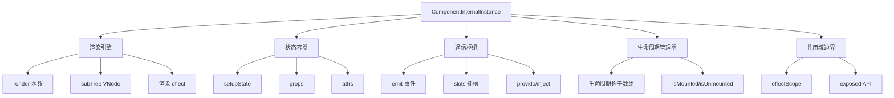
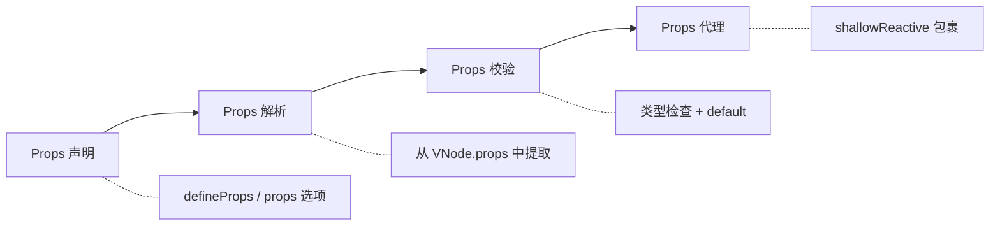

<div v-pre>

# 第 10 章 组件系统

> **本章要点**
>
> - 组件实例的完整数据结构：从 ComponentInternalInstance 的 40+ 字段到它们各自的职责
> - 组件创建的全流程：从 createComponentInstance 到 setupComponent 再到 setupRenderEffect
> - Props 系统的深层机制：声明、解析、校验、响应式代理的四阶段流水线
> - Emit 事件系统的实现：命名规范化、验证、监听器查找的完整链路
> - Slots 的编译与运行时协作：静态 slots、动态 slots、作用域 slots 的统一处理
> - expose 的安全边界：如何控制组件的公共 API 表面
> - 异步组件与 Suspense 的协作机制

---

在前面的章节中，我们花了大量篇幅讨论响应式系统和编译器。但 Vue 的核心抽象不是 ref，不是模板，而是**组件**。组件是 Vue 开发者日常工作的基本单元——你创建组件、组合组件、在组件之间传递数据。响应式系统和编译器都是为组件服务的基础设施。

本章将深入组件系统的内部机制。我们不是在讨论"如何使用组件"，而是在追问"组件是如何被创建、初始化、更新和销毁的"。当你在模板中写下 `<MyComponent :msg="hello" />` 时，背后到底发生了什么？

## 10.1 组件实例的数据结构

### ComponentInternalInstance：组件的"身份证"

每个 Vue 组件在运行时都对应一个 `ComponentInternalInstance` 对象。这个对象是组件系统的核心数据结构，它承载了组件从诞生到销毁的全部状态：

```typescript
// packages/runtime-core/src/component.ts
export interface ComponentInternalInstance {
  uid: number                           // 全局唯一 ID
  type: ConcreteComponent               // 组件定义（选项对象或 setup 函数）
  parent: ComponentInternalInstance | null  // 父组件实例
  root: ComponentInternalInstance       // 根组件实例
  appContext: AppContext                 // 应用级上下文

  // ---- VNode 相关 ----
  vnode: VNode                          // 组件自身的 VNode
  subTree: VNode                        // 组件渲染输出的 VNode 子树
  next: VNode | null                    // 待更新的 VNode（父组件触发的更新）

  // ---- 渲染相关 ----
  render: InternalRenderFunction | null // 编译后的渲染函数
  proxy: ComponentPublicInstance | null // 模板中的 `this` 代理
  withProxy: ComponentPublicInstance | null // 带缓存的渲染代理

  // ---- 状态相关 ----
  setupState: Data                      // setup() 返回的状态
  props: Data                           // 解析后的 props
  attrs: Data                           // 非 prop 的 attributes（透传）
  slots: InternalSlots                  // 插槽
  refs: Data                            // 模板 ref 引用

  // ---- 副作用相关 ----
  effect: ReactiveEffect               // 组件的渲染 effect
  scope: EffectScope                    // 组件的 effect 作用域
  update: SchedulerJob                  // 组件更新函数

  // ---- 生命周期 ----
  isMounted: boolean
  isUnmounted: boolean
  isDeactivated: boolean

  // ---- 生命周期钩子 ----
  bc: LifecycleHook                     // beforeCreate
  c: LifecycleHook                      // created
  bm: LifecycleHook                     // beforeMount
  m: LifecycleHook                      // mounted
  bu: LifecycleHook                     // beforeUpdate
  u: LifecycleHook                      // updated
  bum: LifecycleHook                    // beforeUnmount
  um: LifecycleHook                     // unmounted

  // ---- 其他 ----
  emit: EmitFn                          // 事件发射函数
  emitted: Record<string, boolean> | null
  provides: Data                        // provide/inject 数据
  exposed: Record<string, any> | null   // expose 暴露的 API
  exposeProxy: Record<string, any> | null
}
```

40 多个字段，每一个都有明确的职责。这个结构体就像一个生物细胞——外表是统一的组件接口，内部是精密协作的功能模块。

### 为什么需要这么多字段？

你可能会疑问：一个组件真的需要这么多状态吗？答案是肯定的，因为组件身兼数职：



## 10.2 组件创建流程

### 从 VNode 到组件实例

当渲染器遇到一个组件类型的 VNode 时，会调用 `mountComponent`：

```typescript
// packages/runtime-core/src/renderer.ts
const mountComponent = (
  initialVNode: VNode,
  container: RendererElement,
  anchor: RendererNode | null,
  parentComponent: ComponentInternalInstance | null,
  parentSuspense: SuspenseBoundary | null,
  namespace: ElementNamespace,
  optimized: boolean
) => {
  // 第一步：创建组件实例
  const instance: ComponentInternalInstance =
    (initialVNode.component = createComponentInstance(
      initialVNode,
      parentComponent,
      parentSuspense
    ))

  // 第二步：初始化组件（处理 props、slots、执行 setup）
  setupComponent(instance)

  // 第三步：建立渲染 effect
  setupRenderEffect(
    instance,
    initialVNode,
    container,
    anchor,
    parentSuspense,
    namespace,
    optimized
  )
}
```

三步曲，清晰明了。让我们逐一深入。

### 第一步：createComponentInstance

```typescript
// packages/runtime-core/src/component.ts
export function createComponentInstance(
  vnode: VNode,
  parent: ComponentInternalInstance | null,
  suspense: SuspenseBoundary | null
): ComponentInternalInstance {
  const type = vnode.type as ConcreteComponent
  const appContext =
    (parent ? parent.appContext : vnode.appContext) || emptyAppContext

  const instance: ComponentInternalInstance = {
    uid: uid++,
    vnode,
    type,
    parent,
    appContext,
    root: null!,            // 稍后设置
    subTree: null!,         // 首次渲染时设置
    effect: null!,          // setupRenderEffect 中设置
    update: null!,          // setupRenderEffect 中设置
    scope: new EffectScope(true /* detached */),

    render: null,
    proxy: null,
    withProxy: null,

    provides: parent ? parent.provides : Object.create(appContext.provides),

    // 状态
    setupState: EMPTY_OBJ,
    props: EMPTY_OBJ,
    attrs: EMPTY_OBJ,
    slots: EMPTY_OBJ,
    refs: EMPTY_OBJ,

    // 生命周期标记
    isMounted: false,
    isUnmounted: false,
    isDeactivated: false,

    // 生命周期钩子
    bc: null, c: null, bm: null, m: null,
    bu: null, u: null, bum: null, um: null,

    emit: null!,            // 稍后设置
    emitted: null,
    exposed: null,
    exposeProxy: null,

    next: null,
  }

  // 设置 root 引用
  instance.root = parent ? parent.root : instance

  // 创建 emit 函数
  instance.emit = emit.bind(null, instance)

  return instance
}
```

注意 `provides` 的初始化策略：`Object.create(parent.provides)`。通过原型链继承，子组件可以访问所有祖先组件提供的值，同时自己 provide 的值只影响后代。

### 第二步：setupComponent

```typescript
// packages/runtime-core/src/component.ts
export function setupComponent(
  instance: ComponentInternalInstance,
  isSSR = false
): Promise<void> | void {
  const { props, children } = instance.vnode

  // 1. 初始化 props
  initProps(instance, props, isStatefulComponent(instance), isSSR)

  // 2. 初始化 slots
  initSlots(instance, children)

  // 3. 如果是有状态组件，执行 setup
  const setupResult = isStatefulComponent(instance)
    ? setupStatefulComponent(instance, isSSR)
    : undefined

  return setupResult
}
```

### setupStatefulComponent：执行 setup 函数

```typescript
function setupStatefulComponent(
  instance: ComponentInternalInstance,
  isSSR: boolean
) {
  const Component = instance.type as ComponentOptions

  // 创建渲染代理的缓存
  instance.accessCache = Object.create(null)

  // 创建公共实例代理
  // 这个代理就是模板中的 `this` 和 setup 中不应该直接使用的上下文
  instance.proxy = markRaw(
    new Proxy(instance.ctx, PublicInstanceProxyHandlers)
  )

  // 执行 setup
  const { setup } = Component
  if (setup) {
    // 如果 setup 接受参数，创建 setupContext
    const setupContext = (instance.setupContext =
      setup.length > 1 ? createSetupContext(instance) : null)

    // 设置当前实例（让 onMounted 等 API 知道它们属于哪个组件）
    setCurrentInstance(instance)
    pauseTracking()

    // 执行 setup 函数
    const setupResult = callWithErrorHandling(
      setup,
      instance,
      ErrorCodes.SETUP_FUNCTION,
      [
        __DEV__ ? shallowReadonly(instance.props) : instance.props,
        setupContext
      ]
    )

    resetTracking()
    unsetCurrentInstance()

    // 处理 setup 的返回值
    if (isPromise(setupResult)) {
      // 异步 setup——交给 Suspense 处理
      setupResult.then(
        result => handleSetupResult(instance, result, isSSR),
        err => handleError(err, instance, ErrorCodes.SETUP_FUNCTION)
      )
      return setupResult
    } else {
      handleSetupResult(instance, setupResult, isSSR)
    }
  } else {
    // 没有 setup，使用选项式 API
    finishComponentSetup(instance, isSSR)
  }
}
```

这里有几个关键细节：

1. **`pauseTracking()`**：在执行 setup 期间暂停响应式追踪，防止 setup 函数本身被当作一个 effect 追踪
2. **`setCurrentInstance()`**：设置全局的"当前组件实例"，让 `onMounted()` 等 Composition API 知道自己被注册到哪个组件
3. **setup 的 props 参数**：在开发模式下是 `shallowReadonly`，防止用户意外修改 props

### handleSetupResult：处理 setup 的返回值

```typescript
export function handleSetupResult(
  instance: ComponentInternalInstance,
  setupResult: unknown,
  isSSR: boolean
) {
  if (isFunction(setupResult)) {
    // setup 返回了渲染函数
    instance.render = setupResult as InternalRenderFunction
  } else if (isObject(setupResult)) {
    // setup 返回了状态对象
    instance.setupState = proxyRefs(setupResult)
  }

  finishComponentSetup(instance, isSSR)
}
```

`proxyRefs` 是一个精巧的设计：它让模板中访问 ref 时不需要写 `.value`。当 setup 返回 `{ count: ref(0) }` 时，模板中可以直接写 `{{ count }}` 而不是 `{{ count.value }}`。

### 第三步：setupRenderEffect

```typescript
// packages/runtime-core/src/renderer.ts
const setupRenderEffect = (
  instance: ComponentInternalInstance,
  initialVNode: VNode,
  container: RendererElement,
  anchor: RendererNode | null,
  parentSuspense: SuspenseBoundary | null,
  namespace: ElementNamespace,
  optimized: boolean
) => {
  const componentUpdateFn = () => {
    if (!instance.isMounted) {
      // ---- 首次渲染 ----
      const { bm, m } = instance

      // 调用 beforeMount 钩子
      if (bm) invokeArrayFns(bm)

      // 执行渲染函数，生成 VNode 子树
      const subTree = (instance.subTree = renderComponentRoot(instance))

      // 将 VNode 子树挂载到 DOM
      patch(null, subTree, container, anchor, instance,
            parentSuspense, namespace)

      // 设置组件根元素
      initialVNode.el = subTree.el

      // 调用 mounted 钩子（放入后置队列）
      if (m) queuePostRenderEffect(m, parentSuspense)

      instance.isMounted = true
    } else {
      // ---- 更新渲染 ----
      let { next, bu, u, vnode } = instance

      if (next) {
        // 父组件触发的更新，需要更新 props/slots
        next.el = vnode.el
        updateComponentPreRender(instance, next, optimized)
      } else {
        next = vnode
      }

      // 调用 beforeUpdate 钩子
      if (bu) invokeArrayFns(bu)

      // 重新渲染
      const nextTree = renderComponentRoot(instance)
      const prevTree = instance.subTree
      instance.subTree = nextTree

      // Diff 并 Patch
      patch(prevTree, nextTree,
        hostParentNode(prevTree.el!)!,
        getNextHostNode(prevTree),
        instance, parentSuspense, namespace)

      next.el = nextTree.el

      // 调用 updated 钩子
      if (u) queuePostRenderEffect(u, parentSuspense)
    }
  }

  // 创建响应式 effect
  const effect = (instance.effect = new ReactiveEffect(
    componentUpdateFn,
    NOOP,
    () => queueJob(update),  // scheduler：将更新放入队列
    instance.scope
  ))

  const update: SchedulerJob = (instance.update = () => {
    if (effect.dirty) {
      effect.run()
    }
  })
  update.id = instance.uid

  // 首次执行
  update()
}
```

这是整个组件系统最关键的函数。它创建了一个 `ReactiveEffect`，将组件的渲染函数包裹其中。当渲染函数中访问的响应式数据发生变化时，effect 的 scheduler 会将更新任务放入调度队列，在下一个微任务中执行。

## 10.3 Props 系统深度剖析

### Props 的四阶段处理



### initProps：Props 初始化

```typescript
// packages/runtime-core/src/componentProps.ts
export function initProps(
  instance: ComponentInternalInstance,
  rawProps: Data | null,
  isStateful: boolean,
  isSSR = false
) {
  const props: Data = {}
  const attrs: Data = {}
  def(attrs, InternalObjectKey, 1)  // 标记为内部对象

  instance.propsDefaults = Object.create(null)

  // 解析 props 和 attrs
  setFullProps(instance, rawProps, props, attrs)

  // 确保声明的 props 都有值（即使是 undefined）
  for (const key in instance.propsOptions[0]) {
    if (!(key in props)) {
      props[key] = undefined
    }
  }

  // 校验 props
  if (__DEV__) {
    validateProps(rawProps || {}, props, instance)
  }

  if (isStateful) {
    // 有状态组件：用 shallowReactive 包裹
    instance.props = isSSR ? props : shallowReactive(props)
  } else {
    // 函数式组件
    if (!instance.type.props) {
      instance.props = attrs
    } else {
      instance.props = props
    }
  }

  instance.attrs = attrs
}
```

### setFullProps：Props 与 Attrs 的分拣

```typescript
function setFullProps(
  instance: ComponentInternalInstance,
  rawProps: Data | null,
  props: Data,
  attrs: Data
) {
  const [options, needCastKeys] = instance.propsOptions

  if (rawProps) {
    for (let key in rawProps) {
      // 跳过保留的 key
      if (isReservedProp(key)) continue

      const value = rawProps[key]

      // 驼峰化
      let camelKey: string
      if (options && hasOwn(options, (camelKey = camelize(key)))) {
        // 声明的 prop
        if (!needCastKeys || !needCastKeys.includes(camelKey)) {
          props[camelKey] = value
        } else {
          // 需要特殊处理的 prop（Boolean cast 等）
          (rawCastValues || (rawCastValues = {}))[camelKey] = value
        }
      } else if (!isEmitListener(instance.emitsOptions, key)) {
        // 非 prop 且非事件监听器 → 归入 attrs
        if (!(key in attrs) || value !== attrs[key]) {
          attrs[key] = value
        }
      }
    }
  }

  // 处理 Boolean cast 和 default 值
  if (needCastKeys) {
    for (const key of needCastKeys) {
      let opt = options![key]
      props[key] = resolvePropValue(
        opt,
        rawCastValues && rawCastValues[key],
        key,
        instance
      )
    }
  }
}
```

这里的分拣逻辑是 Props 系统的核心：传入的每个属性要么是声明过的 prop，要么是事件监听器（`onXxx`），要么是透传的 attr。三者互不交叉。

### Props 更新

当父组件重新渲染时，子组件的 props 可能发生变化：

```typescript
// packages/runtime-core/src/componentProps.ts
export function updateProps(
  instance: ComponentInternalInstance,
  rawProps: Data | null,
  rawPrevProps: Data | null,
  optimized: boolean
) {
  const { props, attrs } = instance
  const oldAttrs = { ...attrs }

  if (optimized) {
    // 编译器优化路径：只检查动态 props
    const dynamicProps = instance.vnode.dynamicProps!
    for (let i = 0; i < dynamicProps.length; i++) {
      const key = dynamicProps[i]
      const value = rawProps![key]
      if (options) {
        if (hasOwn(attrs, key)) {
          if (value !== attrs[key]) {
            attrs[key] = value
          }
        } else {
          const camelizedKey = camelize(key)
          props[camelizedKey] = resolvePropValue(
            options[camelizedKey],
            value,
            camelizedKey,
            instance
          )
        }
      }
    }
  } else {
    // 全量对比
    setFullProps(instance, rawProps, props, attrs)
    // 清理多余的 attrs
    for (const key in attrs) {
      if (!rawProps || !hasOwn(rawProps, key)) {
        delete attrs[key]
      }
    }
  }
}
```

`optimized` 路径是编译器协作的典范：编译器在编译阶段就知道哪些 props 是动态的（通过 `:` 绑定），将它们记录在 `dynamicProps` 数组中。更新时只需检查这些动态 props，跳过静态的。

## 10.4 Emit 事件系统

### emit 函数的实现

```typescript
// packages/runtime-core/src/componentEmits.ts
export function emit(
  instance: ComponentInternalInstance,
  event: string,
  ...rawArgs: any[]
) {
  // 已卸载的组件不发射事件
  if (instance.isUnmounted) return

  const props = instance.vnode.props || EMPTY_OBJ

  // 开发模式下的校验
  if (__DEV__) {
    const { emitsOptions, propsOptions: [propsOptions] } = instance
    if (emitsOptions) {
      if (!(event in emitsOptions)) {
        // 警告：发射了未声明的事件
        if (!propsOptions || !(toHandlerKey(event) in propsOptions)) {
          warn(`Component emitted event "${event}" but it is not declared`)
        }
      } else {
        // 如果有验证函数，执行验证
        const validator = emitsOptions[event]
        if (isFunction(validator)) {
          const isValid = validator(...rawArgs)
          if (!isValid) {
            warn(`Invalid event arguments for "${event}"`)
          }
        }
      }
    }
  }

  let args = rawArgs

  // 处理 v-model 的 update:xxx 事件
  const isModelListener = event.startsWith('update:')

  // 查找事件处理器
  // event: 'click' → handler key: 'onClick'
  // event: 'update:modelValue' → handler key: 'onUpdate:modelValue'
  let handlerName = toHandlerKey(event)
  let handler = props[handlerName]

  // 如果没找到，尝试 kebab-case
  if (!handler) {
    handler = props[handlerName = toHandlerKey(hyphenate(event))]
  }

  // 如果还没找到，尝试 camelCase
  if (!handler) {
    handler = props[toHandlerKey(camelize(event))]
  }

  if (handler) {
    callWithAsyncErrorHandling(
      handler,
      instance,
      ErrorCodes.COMPONENT_EVENT_HANDLER,
      args
    )
  }

  // 处理 once 修饰符
  const onceHandler = props[handlerName + 'Once']
  if (onceHandler) {
    if (!instance.emitted) {
      instance.emitted = {}
    } else if (instance.emitted[handlerName]) {
      return
    }
    instance.emitted[handlerName] = true
    callWithAsyncErrorHandling(
      onceHandler,
      instance,
      ErrorCodes.COMPONENT_EVENT_HANDLER,
      args
    )
  }
}
```

emit 的实现看似简单，但隐藏了一个优雅的设计：**事件监听器其实是 props 的一部分**。当你在模板中写 `@click="handler"` 时，编译器将其转换为 `{ onClick: handler }` 作为 VNode 的 props。这意味着事件系统不需要独立的注册/注销机制——它搭了 props 系统的便车。

## 10.5 Slots 系统

### Slots 的三种形态

```typescript
// 1. 静态 slots（编译期确定的内容）
// <Child><span>hello</span></Child>
// 编译为：
createVNode(Child, null, {
  default: () => [createVNode('span', null, 'hello')],
  _: SlotFlags.STABLE  // 标记为稳定 slots
})

// 2. 动态 slots（内容依赖响应式状态）
// <Child><span>{{ msg }}</span></Child>
// 编译为：
createVNode(Child, null, {
  default: () => [createVNode('span', null, ctx.msg)],
  _: SlotFlags.DYNAMIC  // 标记为动态 slots
})

// 3. 作用域 slots
// <Child v-slot="{ item }"><span>{{ item.name }}</span></Child>
// 编译为：
createVNode(Child, null, {
  default: ({ item }) => [createVNode('span', null, item.name)],
  _: SlotFlags.DYNAMIC
})
```

### initSlots：Slots 初始化

```typescript
// packages/runtime-core/src/componentSlots.ts
export function initSlots(
  instance: ComponentInternalInstance,
  children: VNodeNormalizedChildren
) {
  if (instance.vnode.shapeFlag & ShapeFlags.SLOTS_CHILDREN) {
    const type = (children as RawSlots)._
    if (type) {
      // 编译优化的 slots
      instance.slots = toRaw(children as InternalSlots)
      // 标记为不可枚举，避免在 attrs 中出现
      def(children as InternalSlots, '_', type, true)
    } else {
      // 手写渲染函数的 slots
      normalizeObjectSlots(
        children as RawSlots,
        (instance.slots = {}),
        instance
      )
    }
  } else if (children) {
    // 只有默认 slot（纯文本或 VNode 数组）
    normalizeVNodeSlots(instance, children)
  }
}
```

### Slots 的响应式更新

Slots 的更新是组件系统中最微妙的部分之一。关键问题是：当父组件更新时，子组件的 slots 是否需要重新渲染？

```typescript
// packages/runtime-core/src/componentSlots.ts
export function updateSlots(
  instance: ComponentInternalInstance,
  children: VNodeNormalizedChildren,
  optimized: boolean
) {
  const { slots } = instance

  if (instance.vnode.shapeFlag & ShapeFlags.SLOTS_CHILDREN) {
    const type = (children as RawSlots)._
    if (type === SlotFlags.STABLE) {
      // 稳定 slots：无需更新
      // 这是一个关键优化——如果 slot 内容是静态的，跳过更新
      return
    }

    // 动态 slots 或手写 slots：需要更新
    for (const key in children as RawSlots) {
      if (key === '_') continue
      ;(slots as any)[key] = (children as RawSlots)[key]
    }

    // 清理多余的 slot
    for (const key in slots) {
      if (!(key in (children as RawSlots))) {
        delete slots[key]
      }
    }
  }
}
```

`SlotFlags.STABLE` 优化意味着：如果编译器能在编译期确认 slot 内容不包含任何动态绑定，就标记为 STABLE，运行时直接跳过更新。

## 10.6 expose：组件的公共 API 表面

### expose 的作用

`expose` 允许组件作者明确控制哪些属性和方法可以通过模板 ref 被外部访问：

```typescript
// packages/runtime-core/src/component.ts
function createSetupContext(instance: ComponentInternalInstance) {
  const expose: SetupContext['expose'] = (exposed) => {
    if (__DEV__ && instance.exposed) {
      warn('expose() should be called only once per setup().')
    }
    instance.exposed = exposed || {}
  }

  return {
    attrs: instance.attrs,
    slots: instance.slots,
    emit: instance.emit,
    expose
  }
}
```

### expose 代理的实现

```typescript
// packages/runtime-core/src/component.ts
export function getExposeProxy(instance: ComponentInternalInstance) {
  if (instance.exposed) {
    return (
      instance.exposeProxy ||
      (instance.exposeProxy = new Proxy(
        proxyRefs(markRaw(instance.exposed)),
        {
          get(target, key: string) {
            if (key in target) {
              return target[key]
            } else if (key in publicPropertiesMap) {
              return publicPropertiesMap[key](instance)
            }
          },
          has(target, key: string) {
            return key in target || key in publicPropertiesMap
          }
        }
      ))
    )
  }
}
```

当外部通过模板 ref 访问组件时，如果组件使用了 `expose`，得到的是 `exposeProxy` 而非完整的组件实例。这是一个重要的封装机制——组件内部状态不会泄露。

## 10.7 异步组件

### defineAsyncComponent 的实现

```typescript
// packages/runtime-core/src/apiAsyncComponent.ts
export function defineAsyncComponent(
  source: AsyncComponentLoader | AsyncComponentOptions
): Component {
  if (isFunction(source)) {
    source = { loader: source }
  }

  const {
    loader,
    loadingComponent,
    errorComponent,
    delay = 200,
    timeout,
    suspensible = true,
    onError: userOnError
  } = source

  let pendingRequest: Promise<ConcreteComponent> | null = null
  let resolvedComp: ConcreteComponent | undefined

  // 重试计数
  let retries = 0
  const retry = () => {
    retries++
    pendingRequest = null
    return load()
  }

  const load = (): Promise<ConcreteComponent> => {
    let thisRequest: Promise<ConcreteComponent>

    return (
      pendingRequest ||
      (thisRequest = pendingRequest = loader()
        .catch(err => {
          err = err instanceof Error ? err : new Error(String(err))
          if (userOnError) {
            // 用户自定义错误处理
            return new Promise((resolve, reject) => {
              const userRetry = () => resolve(retry())
              const userFail = () => reject(err)
              userOnError(err, userRetry, userFail, retries + 1)
            })
          } else {
            throw err
          }
        })
        .then((comp: any) => {
          if (thisRequest !== pendingRequest && pendingRequest) {
            return pendingRequest
          }
          // 处理 ES module default export
          if (comp && (comp.__esModule || comp[Symbol.toStringTag] === 'Module')) {
            comp = comp.default
          }
          resolvedComp = comp
          return comp
        }))
    )
  }

  // 返回一个包装组件
  return defineComponent({
    name: 'AsyncComponentWrapper',
    __asyncLoader: load,

    setup() {
      const instance = currentInstance!

      // 如果已经解析过，直接渲染
      if (resolvedComp) {
        return () => createInnerComp(resolvedComp!, instance)
      }

      const loaded = ref(false)
      const error = ref<Error>()
      const delayed = ref(!!delay)

      if (delay) {
        setTimeout(() => { delayed.value = false }, delay)
      }

      if (timeout != null) {
        setTimeout(() => {
          if (!loaded.value && !error.value) {
            const err = new Error(`Async component timed out after ${timeout}ms.`)
            error.value = err
          }
        }, timeout)
      }

      load()
        .then(() => { loaded.value = true })
        .catch(err => { error.value = err })

      return () => {
        if (loaded.value && resolvedComp) {
          return createInnerComp(resolvedComp, instance)
        } else if (error.value && errorComponent) {
          return createVNode(errorComponent, { error: error.value })
        } else if (loadingComponent && !delayed.value) {
          return createVNode(loadingComponent)
        }
      }
    }
  })
}
```

异步组件本质上是一个高阶组件模式：它返回一个同步的包装组件，内部管理加载状态的切换。

## 10.8 组件的公共实例代理

### PublicInstanceProxyHandlers

当你在模板中或选项式 API 中访问 `this.xxx` 时，实际上是在访问组件的公共实例代理：

```typescript
// packages/runtime-core/src/componentPublicInstance.ts
export const PublicInstanceProxyHandlers: ProxyHandler<any> = {
  get({ _: instance }: ComponentRenderContext, key: string) {
    const { ctx, setupState, data, props, accessCache, type, appContext } =
      instance

    // 缓存查找路径，避免重复判断
    if (key !== '$') {
      const n = accessCache![key]
      if (n !== undefined) {
        switch (n) {
          case AccessTypes.SETUP:
            return setupState[key]
          case AccessTypes.DATA:
            return data[key]
          case AccessTypes.CONTEXT:
            return ctx[key]
          case AccessTypes.PROPS:
            return props![key]
        }
      }

      // 依次查找：setupState → data → props → ctx
      if (hasSetupBinding(setupState, key)) {
        accessCache![key] = AccessTypes.SETUP
        return setupState[key]
      } else if (data !== EMPTY_OBJ && hasOwn(data, key)) {
        accessCache![key] = AccessTypes.DATA
        return data[key]
      } else if (
        (normalizedProps = instance.propsOptions[0]) &&
        hasOwn(normalizedProps, key)
      ) {
        accessCache![key] = AccessTypes.PROPS
        return props![key]
      } else if (ctx !== EMPTY_OBJ && hasOwn(ctx, key)) {
        accessCache![key] = AccessTypes.CONTEXT
        return ctx[key]
      }
    }

    // 公共属性：$el, $data, $props, $slots, $refs 等
    const publicGetter = publicPropertiesMap[key]
    if (publicGetter) {
      return publicGetter(instance)
    }
  },

  set({ _: instance }: ComponentRenderContext, key: string, value: any) {
    const { setupState, data, ctx } = instance

    if (hasSetupBinding(setupState, key)) {
      setupState[key] = value
      return true
    } else if (data !== EMPTY_OBJ && hasOwn(data, key)) {
      data[key] = value
      return true
    } else if (hasOwn(instance.props, key)) {
      // 不允许修改 props
      __DEV__ && warn(`Attempting to mutate prop "${key}".`)
      return false
    }

    ctx[key] = value
    return true
  }
}
```

`accessCache` 是一个性能优化：第一次访问某个 key 时，记录它来自哪个源（setup/data/props/ctx），后续访问直接走缓存路径，避免重复的 `hasOwn` 检查。

## 10.9 组件更新与卸载

### 组件更新的触发

组件更新有两种触发方式：

```typescript
// 1. 自身状态变化（子组件触发）
// 当 setup 中的 ref 变化时，通过 renderEffect 的 scheduler 触发
const update = () => {
  if (effect.dirty) {
    effect.run()  // 执行 componentUpdateFn
  }
}

// 2. 父组件传入新 props（父组件触发）
// 在 patch 阶段，如果子组件的 VNode props 变化
const updateComponent = (n1: VNode, n2: VNode) => {
  const instance = (n2.component = n1.component)!
  if (shouldUpdateComponent(n1, n2, optimized)) {
    instance.next = n2
    invalidateJob(instance.update)  // 取消已排队的更新
    instance.update()               // 立即触发更新
  } else {
    n2.el = n1.el
    instance.vnode = n2
  }
}
```

### shouldUpdateComponent：是否需要更新

```typescript
export function shouldUpdateComponent(
  prevVNode: VNode,
  nextVNode: VNode,
  optimized?: boolean
): boolean {
  const { props: prevProps, children: prevChildren } = prevVNode
  const { props: nextProps, children: nextChildren, patchFlag } = nextVNode

  // 有动态 slots 的组件总是需要更新
  if (prevChildren || nextChildren) {
    if (!nextChildren || !(nextChildren as any).$stable) {
      return true
    }
  }

  if (optimized && patchFlag >= 0) {
    if (patchFlag & PatchFlags.DYNAMIC_SLOTS) {
      return true
    }
    if (patchFlag & PatchFlags.FULL_PROPS) {
      return hasPropsChanged(prevProps, nextProps!)
    } else if (patchFlag & PatchFlags.PROPS) {
      const dynamicProps = nextVNode.dynamicProps!
      for (let i = 0; i < dynamicProps.length; i++) {
        const key = dynamicProps[i]
        if (nextProps![key] !== prevProps![key]) {
          return true
        }
      }
    }
  }

  return false
}
```

### 组件卸载

```typescript
const unmountComponent = (
  instance: ComponentInternalInstance,
  parentSuspense: SuspenseBoundary | null
) => {
  const { bum, scope, update, subTree, um } = instance

  // 调用 beforeUnmount 钩子
  if (bum) invokeArrayFns(bum)

  // 停止所有 effect（包括 watch、computed、渲染 effect）
  scope.stop()

  // 取消排队的更新
  if (update) {
    update.active = false
    // 递归卸载子树
    unmount(subTree, instance, parentSuspense)
  }

  // 调用 unmounted 钩子（异步，在 DOM 移除后）
  if (um) {
    queuePostRenderEffect(um, parentSuspense)
  }

  // 标记为已卸载
  queuePostRenderEffect(() => {
    instance.isUnmounted = true
  }, parentSuspense)
}
```

`scope.stop()` 是一个优雅的清理机制。在 setup 中创建的所有 effect（包括 `watch`、`watchEffect`、`computed`）都被收集在组件的 effectScope 中，一次性停止，无需逐个管理。

---

## 本章小结

组件系统是 Vue 框架的中枢神经。在本章中，我们完整追踪了组件从创建到销毁的全生命周期：

1. **数据结构**：`ComponentInternalInstance` 是一个 40+ 字段的复合结构，承载了渲染、状态、通信、生命周期管理的全部职责
2. **创建流程**：`createComponentInstance` → `setupComponent` → `setupRenderEffect` 三步曲
3. **Props 系统**：声明 → 解析 → 校验 → 响应式代理的四阶段流水线，编译器通过 `dynamicProps` 优化更新检查
4. **事件系统**：emit 巧妙地搭了 props 系统的便车，事件监听器本质上是 `onXxx` 形式的 props
5. **Slots 系统**：通过 `SlotFlags` 在编译期标记稳定性，运行时据此决定是否跳过更新
6. **expose 机制**：通过 Proxy 精确控制组件暴露给外部的 API 表面

## 思考题

1. **设计思考**：为什么 Vue 3 选择用一个大的 `ComponentInternalInstance` 对象而不是多个小对象来表示组件状态？这种设计在内存布局和 GC 方面有什么优劣？

2. **Props 性能**：如果一个组件有 50 个 props，但只有 2 个是动态的，编译器的 `dynamicProps` 优化能带来多大的性能提升？用 Big-O 分析两种路径的复杂度。

3. **Slots 稳定性**：在什么情况下，编译器无法将 slot 标记为 `STABLE`？请给出三个具体的模板示例。

4. **expose 安全**：如果组件 A expose 了一个 ref，组件 B 通过模板 ref 获取后修改了这个 ref 的值，这个修改会反映到组件 A 内部吗？为什么？

5. **生命周期**：`beforeMount` 和 `mounted` 的执行时机有什么区别？在嵌套组件中，父子组件的 mounted 钩子执行顺序是怎样的？为什么？

</div>