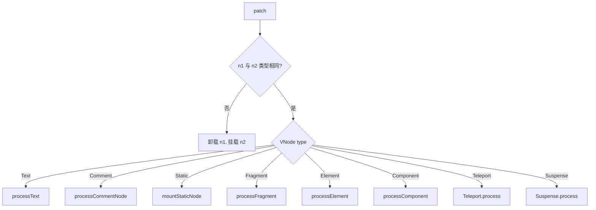
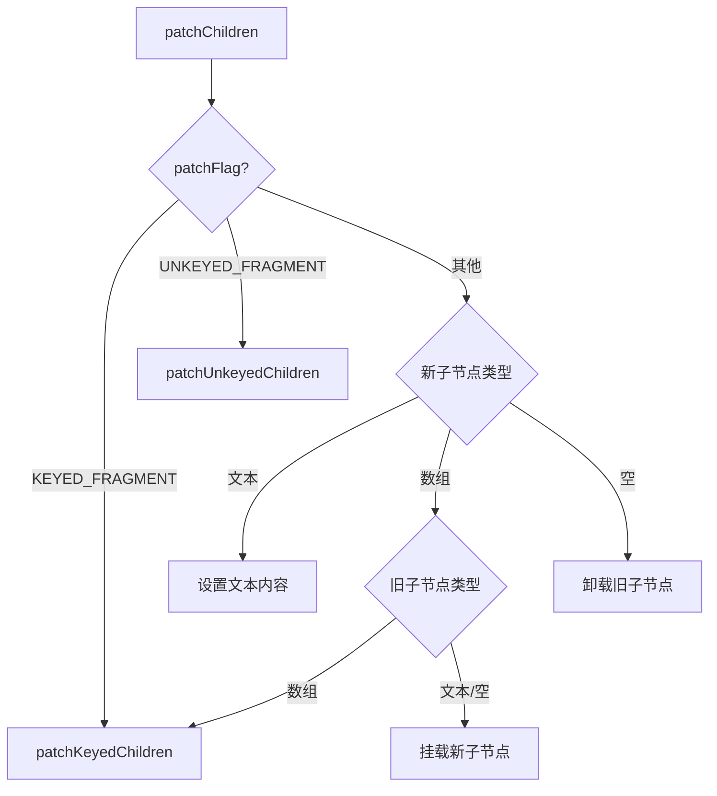
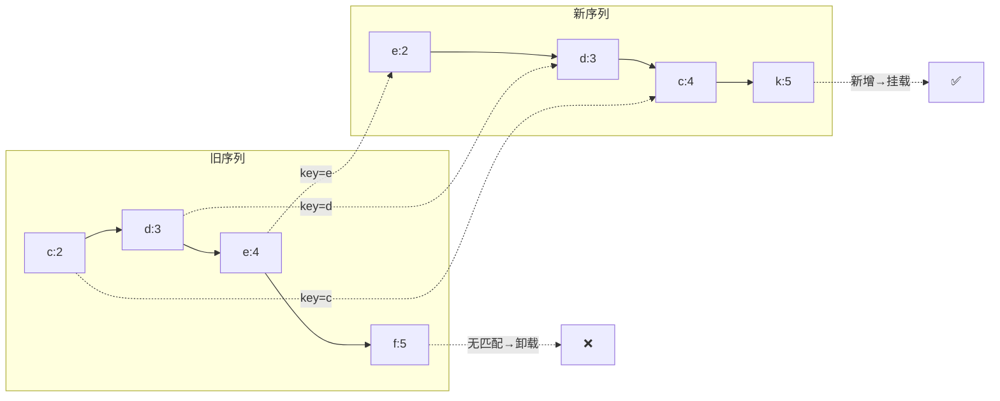
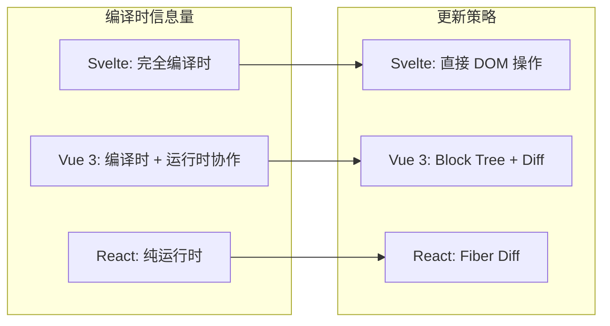

<div v-pre>

# 第 11 章 虚拟 DOM 与 Diff 算法

> **本章要点**
>
> - 虚拟 DOM 的本质：从 VNode 的数据结构到它如何成为 UI 的中间表示层
> - VNode 的类型系统：ShapeFlag 位掩码如何用一个整数编码所有节点类型信息
> - patch 函数的分发逻辑：如何根据 VNode 类型选择不同的处理路径
> - 子节点 Diff 的核心算法：双端比较、最长递增子序列、key 的关键作用
> - Block Tree 与 PatchFlag：编译时优化如何让 Diff 从 O(n) 降到 O(动态节点数)
> - Fragment、Teleport、Suspense 等特殊 VNode 的处理策略
> - Vue 3.6 Vapor Mode 对传统 VNode 体系的挑战与共存

---

在前面的章节中，我们已经深入了编译器和组件系统。编译器将模板转化为渲染函数，组件系统管理每个组件的生命和状态。但在这两者之间，还有一个至关重要的中间层——**虚拟 DOM**。

当渲染函数执行时，它不会直接操作真实 DOM，而是生成一棵由 JavaScript 对象构成的虚拟节点树。当组件状态变化时，新的虚拟树与旧的虚拟树进行对比——这个过程就是 **Diff**。Diff 的结果是一组最小化的 DOM 操作指令，精确地把界面从旧状态更新到新状态。

这一章，我们要完全拆解这个过程。

## 11.1 VNode：虚拟 DOM 的原子

### VNode 的数据结构

每一个虚拟节点都是一个 `VNode` 对象。它的结构远比"一个标签名加一堆属性"复杂得多：

```typescript
// packages/runtime-core/src/vnode.ts
export interface VNode<
  HostNode = RendererNode,
  HostElement = RendererElement,
  ExtraProps = { [key: string]: any }
> {
  __v_isVNode: true               // VNode 标记
  type: VNodeTypes                 // 节点类型：string | Component | Fragment | ...
  props: (VNodeProps & ExtraProps) | null
  key: string | number | symbol | null  // Diff 的身份标识
  ref: VNodeNormalizedRef | null        // 模板 ref
  children: VNodeNormalizedChildren     // 子节点

  // ---- 运行时状态 ----
  el: HostNode | null              // 对应的真实 DOM 节点
  anchor: HostNode | null          // Fragment 的锚点
  component: ComponentInternalInstance | null  // 组件实例引用

  // ---- 优化标记 ----
  shapeFlag: number                // 节点形状位掩码
  patchFlag: number                // 编译器标记的动态类型
  dynamicProps: string[] | null    // 动态属性名列表
  dynamicChildren: VNode[] | null  // Block 收集的动态子节点

  // ---- 其他 ----
  dirs: DirectiveBinding[] | null  // 指令绑定
  transition: TransitionHooks | null
  suspense: SuspenseBoundary | null
  appContext: AppContext | null
}
```

一个 VNode 既是 UI 的描述，又携带了优化信息，还反向引用了真实 DOM。它是连接"声明式意图"和"命令式操作"的桥梁。

### ShapeFlag：用位运算编码节点类型

Vue 使用一个整数的不同位来标记 VNode 的类型信息，这是一种经典的位掩码模式：

```typescript
// packages/shared/src/shapeFlags.ts
export enum ShapeFlags {
  ELEMENT                = 1,        // 0000 0001 — 普通 HTML 元素
  FUNCTIONAL_COMPONENT   = 1 << 1,   // 0000 0010 — 函数式组件
  STATEFUL_COMPONENT     = 1 << 2,   // 0000 0100 — 有状态组件
  TEXT_CHILDREN          = 1 << 3,   // 0000 1000 — 子节点是文本
  ARRAY_CHILDREN         = 1 << 4,   // 0001 0000 — 子节点是数组
  SLOTS_CHILDREN         = 1 << 5,   // 0010 0000 — 子节点是插槽
  TELEPORT               = 1 << 6,   // 0100 0000 — Teleport 组件
  SUSPENSE               = 1 << 7,   // 1000 0000 — Suspense 组件
  COMPONENT_SHOULD_KEEP_ALIVE = 1 << 8,
  COMPONENT_KEPT_ALIVE   = 1 << 9,
  COMPONENT              = ShapeFlags.STATEFUL_COMPONENT | ShapeFlags.FUNCTIONAL_COMPONENT
}
```

为什么用位掩码而不是字符串枚举？因为位运算的判断只需要一条 CPU 指令：

```typescript
// 判断是否是元素
if (shapeFlag & ShapeFlags.ELEMENT) { /* ... */ }

// 判断是否是组件且有数组子节点
if (shapeFlag & ShapeFlags.COMPONENT && shapeFlag & ShapeFlags.ARRAY_CHILDREN) { /* ... */ }

// 创建时组合标记
const shapeFlag = ShapeFlags.ELEMENT | ShapeFlags.ARRAY_CHILDREN
```

在 Diff 的热路径上，每一个 if 判断都被执行成千上万次。位运算比字符串比较快一个数量级，这是框架级性能优化的典型手法。

### createVNode：VNode 的工厂

渲染函数中的 `h()` 最终调用 `createVNode` 来创建 VNode：

```typescript
// packages/runtime-core/src/vnode.ts（简化）
export function createVNode(
  type: VNodeTypes,
  props: (Data & VNodeProps) | null = null,
  children: unknown = null,
  patchFlag: number = 0,
  dynamicProps: string[] | null = null,
  isBlockNode = false
): VNode {
  // 1. 规范化 type
  if (isVNode(type)) {
    // 克隆已有 VNode
    return cloneVNode(type, props)
  }

  // 2. 类组件规范化
  if (isClassComponent(type)) {
    type = type.__vccOpts
  }

  // 3. 规范化 props（class、style 合并）
  if (props) {
    props = guardReactiveProps(props)
    let { class: klass, style } = props
    if (klass && !isString(klass)) {
      props.class = normalizeClass(klass)
    }
    if (isObject(style)) {
      props.style = normalizeStyle(style)
    }
  }

  // 4. 计算 shapeFlag
  const shapeFlag = isString(type)
    ? ShapeFlags.ELEMENT
    : isSuspense(type)
      ? ShapeFlags.SUSPENSE
      : isTeleport(type)
        ? ShapeFlags.TELEPORT
        : isObject(type)
          ? ShapeFlags.STATEFUL_COMPONENT
          : isFunction(type)
            ? ShapeFlags.FUNCTIONAL_COMPONENT
            : 0

  // 5. 创建 VNode 对象
  return createBaseVNode(type, props, children, patchFlag, dynamicProps, shapeFlag, isBlockNode)
}
```

注意 `patchFlag` 和 `dynamicProps` 参数——它们由编译器注入，运行时不会自己去分析哪些属性是动态的。这就是 Vue 3 的编译-运行时协作模型。

## 11.2 patch：万物的入口

### patch 函数的分发逻辑

`patch` 是整个渲染器的核心入口。无论是首次渲染还是更新，都从 `patch` 开始：

```typescript
// packages/runtime-core/src/renderer.ts（简化）
const patch: PatchFn = (
  n1,        // 旧 VNode（null 表示首次挂载）
  n2,        // 新 VNode
  container, // DOM 容器
  anchor = null,
  parentComponent = null,
  parentSuspense = null,
  namespace = undefined,
  slotScopeIds = null,
  optimized = false
) => {
  // 1. 如果新旧节点类型完全不同，直接卸载旧的
  if (n1 && !isSameVNodeType(n1, n2)) {
    anchor = getNextHostNode(n1)
    unmount(n1, parentComponent, parentSuspense, true)
    n1 = null  // 重置为 null，后续走挂载逻辑
  }

  // 2. 如果新节点标记为 BAIL，关闭优化
  if (n2.patchFlag === PatchFlags.BAIL) {
    optimized = false
    n2.dynamicChildren = null
  }

  // 3. 根据类型分发
  const { type, ref, shapeFlag } = n2
  switch (type) {
    case Text:
      processText(n1, n2, container, anchor)
      break
    case Comment:
      processCommentNode(n1, n2, container, anchor)
      break
    case Static:
      if (n1 == null) {
        mountStaticNode(n2, container, anchor, namespace)
      }
      break
    case Fragment:
      processFragment(n1, n2, container, anchor, parentComponent, parentSuspense, namespace, slotScopeIds, optimized)
      break
    default:
      if (shapeFlag & ShapeFlags.ELEMENT) {
        processElement(n1, n2, container, anchor, parentComponent, parentSuspense, namespace, slotScopeIds, optimized)
      } else if (shapeFlag & ShapeFlags.COMPONENT) {
        processComponent(n1, n2, container, anchor, parentComponent, parentSuspense, namespace, slotScopeIds, optimized)
      } else if (shapeFlag & ShapeFlags.TELEPORT) {
        ;(type as typeof TeleportImpl).process(n1, n2, container, anchor, parentComponent, parentSuspense, namespace, slotScopeIds, optimized, internals)
      } else if (shapeFlag & ShapeFlags.SUSPENSE) {
        ;(type as typeof SuspenseImpl).process(n1, n2, container, anchor, parentComponent, parentSuspense, namespace, slotScopeIds, optimized, internals)
      }
  }

  // 4. 设置 ref
  if (ref != null && parentComponent) {
    setRef(ref, n1 && n1.ref, parentSuspense, n2 || n1, !n2)
  }
}
```

这个函数的设计体现了一个重要原则：**类型驱动的分发**。不同类型的 VNode 走完全不同的处理路径，各自优化，互不干扰。



### isSameVNodeType：身份判定

判断两个 VNode 是否"同一个"的逻辑极简：

```typescript
export function isSameVNodeType(n1: VNode, n2: VNode): boolean {
  return n1.type === n2.type && n1.key === n2.key
}
```

两个条件——**相同的类型，相同的 key**。如果类型变了（比如从 `<div>` 变成 `<span>`），没有任何 Diff 的意义，直接替换。如果 key 变了，即使类型相同，也视为不同节点。这就是为什么 `key` 在列表渲染中如此重要。

## 11.3 元素的 Patch

当 `patch` 分发到 `processElement` 时，会区分挂载和更新两条路径：

```typescript
const processElement = (
  n1: VNode | null,
  n2: VNode,
  container: RendererElement,
  anchor: RendererNode | null,
  parentComponent: ComponentInternalInstance | null,
  parentSuspense: SuspenseBoundary | null,
  namespace: ElementNamespace,
  slotScopeIds: string[] | null,
  optimized: boolean
) => {
  if (n1 == null) {
    mountElement(n2, container, anchor, parentComponent, parentSuspense, namespace, slotScopeIds, optimized)
  } else {
    patchElement(n1, n2, parentComponent, parentSuspense, namespace, slotScopeIds, optimized)
  }
}
```

### patchElement：属性与子节点的更新

```typescript
const patchElement = (
  n1: VNode,
  n2: VNode,
  parentComponent: ComponentInternalInstance | null,
  parentSuspense: SuspenseBoundary | null,
  namespace: ElementNamespace,
  slotScopeIds: string[] | null,
  optimized: boolean
) => {
  const el = (n2.el = n1.el!)  // 复用真实 DOM 节点
  const oldProps = n1.props || EMPTY_OBJ
  const newProps = n2.props || EMPTY_OBJ
  let { patchFlag, dynamicChildren, dirs } = n2

  // ---- 属性更新 ----
  if (patchFlag > 0) {
    // 编译器告诉我们哪些属性是动态的
    if (patchFlag & PatchFlags.FULL_PROPS) {
      // 所有属性都可能变化，全量 diff
      patchProps(el, n2, oldProps, newProps, parentComponent, parentSuspense, namespace)
    } else {
      // 按需更新
      if (patchFlag & PatchFlags.CLASS) {
        if (oldProps.class !== newProps.class) {
          hostPatchProp(el, 'class', null, newProps.class, namespace)
        }
      }
      if (patchFlag & PatchFlags.STYLE) {
        hostPatchProp(el, 'style', oldProps.style, newProps.style, namespace)
      }
      if (patchFlag & PatchFlags.PROPS) {
        // 只更新 dynamicProps 中列出的属性
        const propsToUpdate = n2.dynamicProps!
        for (let i = 0; i < propsToUpdate.length; i++) {
          const key = propsToUpdate[i]
          const prev = oldProps[key]
          const next = newProps[key]
          if (next !== prev || key === 'value') {
            hostPatchProp(el, key, prev, next, namespace, parentComponent)
          }
        }
      }
    }
    if (patchFlag & PatchFlags.TEXT) {
      if (n1.children !== n2.children) {
        hostSetElementText(el, n2.children as string)
      }
    }
  } else if (!optimized && dynamicChildren == null) {
    // 没有编译器优化标记，全量 diff 属性
    patchProps(el, n2, oldProps, newProps, parentComponent, parentSuspense, namespace)
  }

  // ---- 子节点更新 ----
  if (dynamicChildren) {
    // Block 优化路径：只 patch 动态子节点
    patchBlockChildren(n1.dynamicChildren!, dynamicChildren, el, parentComponent, parentSuspense, resolveChildrenNamespace(n2, namespace), slotScopeIds)
  } else if (!optimized) {
    // 全量子节点 diff
    patchChildren(n1, n2, el, null, parentComponent, parentSuspense, resolveChildrenNamespace(n2, namespace), slotScopeIds, false)
  }
}
```

这段代码完美展示了 Vue 3 的**编译-运行时协作**：编译器通过 `patchFlag` 告诉运行时"哪些属性是动态的"，运行时就跳过所有静态属性的比较。这不是运行时的聪明，而是编译器的先见之明。

## 11.4 patchChildren：子节点 Diff 的入口

子节点的更新是 Diff 算法的核心战场。`patchChildren` 需要处理多种情况：

```typescript
const patchChildren: PatchChildrenFn = (
  n1, n2, container, anchor,
  parentComponent, parentSuspense, namespace, slotScopeIds, optimized
) => {
  const c1 = n1 && n1.children
  const prevShapeFlag = n1 ? n1.shapeFlag : 0
  const c2 = n2.children
  const { patchFlag, shapeFlag } = n2

  if (patchFlag > 0) {
    if (patchFlag & PatchFlags.KEYED_FRAGMENT) {
      // 所有子节点都有 key
      patchKeyedChildren(c1 as VNode[], c2 as VNodeArrayChildren, container, anchor, parentComponent, parentSuspense, namespace, slotScopeIds, optimized)
      return
    } else if (patchFlag & PatchFlags.UNKEYED_FRAGMENT) {
      // 所有子节点都没有 key
      patchUnkeyedChildren(c1 as VNode[], c2 as VNodeArrayChildren, container, anchor, parentComponent, parentSuspense, namespace, slotScopeIds, optimized)
      return
    }
  }

  // 三种情况组合：新子节点是文本 / 数组 / 空
  if (shapeFlag & ShapeFlags.TEXT_CHILDREN) {
    if (prevShapeFlag & ShapeFlags.ARRAY_CHILDREN) {
      unmountChildren(c1 as VNode[], parentComponent, parentSuspense)
    }
    if (c2 !== c1) {
      hostSetElementText(container, c2 as string)
    }
  } else {
    if (prevShapeFlag & ShapeFlags.ARRAY_CHILDREN) {
      if (shapeFlag & ShapeFlags.ARRAY_CHILDREN) {
        // 数组 → 数组：全量 Diff
        patchKeyedChildren(c1 as VNode[], c2 as VNodeArrayChildren, container, anchor, parentComponent, parentSuspense, namespace, slotScopeIds, optimized)
      } else {
        // 数组 → 空：卸载所有
        unmountChildren(c1 as VNode[], parentComponent, parentSuspense, true)
      }
    } else {
      if (prevShapeFlag & ShapeFlags.TEXT_CHILDREN) {
        hostSetElementText(container, '')
      }
      if (shapeFlag & ShapeFlags.ARRAY_CHILDREN) {
        mountChildren(c2 as VNodeArrayChildren, container, anchor, parentComponent, parentSuspense, namespace, slotScopeIds, optimized)
      }
    }
  }
}
```



## 11.5 核心算法：patchKeyedChildren

这是 Vue 3 Diff 算法的核心，也是面试中最常被问到的部分。算法分为五个步骤：

```typescript
const patchKeyedChildren = (
  c1: VNode[],
  c2: VNodeArrayChildren,
  container: RendererElement,
  parentAnchor: RendererNode | null,
  parentComponent: ComponentInternalInstance | null,
  parentSuspense: SuspenseBoundary | null,
  namespace: ElementNamespace,
  slotScopeIds: string[] | null,
  optimized: boolean
) => {
  let i = 0
  const l2 = c2.length
  let e1 = c1.length - 1  // 旧数组尾指针
  let e2 = l2 - 1          // 新数组尾指针

  // ======== 第一步：从头部开始同步 ========
  // (a b) c d
  // (a b) e c d
  while (i <= e1 && i <= e2) {
    const n1 = c1[i]
    const n2 = (c2[i] = optimized
      ? cloneIfMounted(c2[i] as VNode)
      : normalizeVNode(c2[i]))
    if (isSameVNodeType(n1, n2)) {
      patch(n1, n2, container, null, parentComponent, parentSuspense, namespace, slotScopeIds, optimized)
    } else {
      break
    }
    i++
  }

  // ======== 第二步：从尾部开始同步 ========
  // a (b c)
  // a d e (b c)
  while (i <= e1 && i <= e2) {
    const n1 = c1[e1]
    const n2 = (c2[e2] = optimized
      ? cloneIfMounted(c2[e2] as VNode)
      : normalizeVNode(c2[e2]))
    if (isSameVNodeType(n1, n2)) {
      patch(n1, n2, container, null, parentComponent, parentSuspense, namespace, slotScopeIds, optimized)
    } else {
      break
    }
    e1--
    e2--
  }

  // ======== 第三步：处理仅有新增的情况 ========
  // (a b)
  // (a b) c d
  if (i > e1) {
    if (i <= e2) {
      const nextPos = e2 + 1
      const anchor = nextPos < l2 ? (c2[nextPos] as VNode).el : parentAnchor
      while (i <= e2) {
        patch(null, (c2[i] = optimized ? cloneIfMounted(c2[i] as VNode) : normalizeVNode(c2[i])), container, anchor, parentComponent, parentSuspense, namespace, slotScopeIds, optimized)
        i++
      }
    }
  }

  // ======== 第四步：处理仅有删除的情况 ========
  // (a b) c d
  // (a b)
  else if (i > e2) {
    while (i <= e1) {
      unmount(c1[i], parentComponent, parentSuspense, true)
      i++
    }
  }

  // ======== 第五步：处理中间乱序部分 ========
  else {
    const s1 = i  // 旧序列中间段起点
    const s2 = i  // 新序列中间段起点

    // 5.1 建立 key → index 映射
    const keyToNewIndexMap: Map<PropertyKey, number> = new Map()
    for (i = s2; i <= e2; i++) {
      const nextChild = (c2[i] = optimized
        ? cloneIfMounted(c2[i] as VNode)
        : normalizeVNode(c2[i]))
      if (nextChild.key != null) {
        keyToNewIndexMap.set(nextChild.key, i)
      }
    }

    // 5.2 遍历旧序列，尝试 patch 或移除
    let j
    let patched = 0
    const toBePatched = e2 - s2 + 1
    let moved = false
    let maxNewIndexSoFar = 0
    const newIndexToOldIndexMap = new Array(toBePatched).fill(0)

    for (i = s1; i <= e1; i++) {
      const prevChild = c1[i]
      if (patched >= toBePatched) {
        // 新序列已全部处理完，剩余旧节点直接卸载
        unmount(prevChild, parentComponent, parentSuspense, true)
        continue
      }
      let newIndex
      if (prevChild.key != null) {
        newIndex = keyToNewIndexMap.get(prevChild.key)
      } else {
        // 无 key 节点：线性扫描查找
        for (j = s2; j <= e2; j++) {
          if (newIndexToOldIndexMap[j - s2] === 0 && isSameVNodeType(prevChild, c2[j] as VNode)) {
            newIndex = j
            break
          }
        }
      }
      if (newIndex === undefined) {
        unmount(prevChild, parentComponent, parentSuspense, true)
      } else {
        newIndexToOldIndexMap[newIndex - s2] = i + 1
        if (newIndex >= maxNewIndexSoFar) {
          maxNewIndexSoFar = newIndex
        } else {
          moved = true
        }
        patch(prevChild, c2[newIndex] as VNode, container, null, parentComponent, parentSuspense, namespace, slotScopeIds, optimized)
        patched++
      }
    }

    // 5.3 移动和挂载
    const increasingNewIndexSequence = moved
      ? getSequence(newIndexToOldIndexMap)
      : EMPTY_ARR
    j = increasingNewIndexSequence.length - 1
    for (i = toBePatched - 1; i >= 0; i--) {
      const nextIndex = s2 + i
      const nextChild = c2[nextIndex] as VNode
      const anchor = nextIndex + 1 < l2 ? (c2[nextIndex + 1] as VNode).el : parentAnchor
      if (newIndexToOldIndexMap[i] === 0) {
        // 新节点，挂载
        patch(null, nextChild, container, anchor, parentComponent, parentSuspense, namespace, slotScopeIds, optimized)
      } else if (moved) {
        if (j < 0 || i !== increasingNewIndexSequence[j]) {
          // 需要移动
          move(nextChild, container, anchor, MoveType.REORDER)
        } else {
          j--  // 不需要移动
        }
      }
    }
  }
}
```

### 五步算法详解

让我们用一个具体的例子来理解这五个步骤：

```
旧序列: a b [c d e f] g h
新序列: a b [e d c k] g h
```

**第一步：头部同步**。从头扫描，`a` 和 `b` 类型和 key 都相同，直接 `patch` 更新。`i` 停在位置 2。

**第二步：尾部同步**。从尾扫描，`h` 和 `g` 类型和 key 都相同，直接 `patch`。`e1` 停在位置 5，`e2` 停在位置 5。

**第三、四步**：不满足纯新增或纯删除的条件，跳过。

**第五步：处理中间的乱序部分** `[c d e f]` → `[e d c k]`：



1. 建立新序列的 `keyToNewIndexMap`：`{e: 2, d: 3, c: 4, k: 5}`
2. 遍历旧序列 `[c, d, e, f]`：
   - `c` → 新位置 4，`newIndexToOldIndexMap[2] = 3`
   - `d` → 新位置 3，`newIndexToOldIndexMap[1] = 4`
   - `e` → 新位置 2，`newIndexToOldIndexMap[0] = 5`，但 2 < maxNewIndexSoFar(4)，标记 `moved = true`
   - `f` → 无匹配，卸载
3. 计算最长递增子序列 `[0, 1]`（对应 `e, d`，不需要移动）
4. 从后向前遍历，`k` 是新节点，挂载；`c` 不在子序列中，需要移动

### 最长递增子序列（LIS）

这是整个 Diff 算法中最精妙的部分。`getSequence` 函数计算 `newIndexToOldIndexMap` 中的最长递增子序列，这些位置上的节点不需要移动——它们已经保持了相对顺序。

```typescript
// packages/runtime-core/src/renderer.ts
function getSequence(arr: number[]): number[] {
  const p = arr.slice()    // 前驱数组，记录每个元素在 LIS 中的前一个位置
  const result = [0]       // 结果数组，存储 LIS 的索引
  let i, j, u, v, c
  const len = arr.length

  for (i = 0; i < len; i++) {
    const arrI = arr[i]
    if (arrI !== 0) {      // 0 表示新节点，跳过
      j = result[result.length - 1]
      if (arr[j] < arrI) {
        // arrI 大于当前 LIS 尾部，直接追加
        p[i] = j
        result.push(i)
        continue
      }
      // 二分查找：找到 result 中第一个 >= arrI 的位置
      u = 0
      v = result.length - 1
      while (u < v) {
        c = (u + v) >> 1
        if (arr[result[c]] < arrI) {
          u = c + 1
        } else {
          v = c
        }
      }
      if (arrI < arr[result[u]]) {
        if (u > 0) {
          p[i] = result[u - 1]
        }
        result[u] = i
      }
    }
  }

  // 回溯前驱数组，重建完整的 LIS
  u = result.length
  v = result[u - 1]
  while (u-- > 0) {
    result[u] = v
    v = p[v]
  }
  return result
}
```

时间复杂度 O(n log n)，空间复杂度 O(n)。这个算法的价值在于：它将 DOM 移动操作降到最少。每一次 DOM 移动都是昂贵的——它触发回流、重绘。LIS 确保我们只移动**必须移动的节点**。

### 没有 key 会怎样？

```typescript
const patchUnkeyedChildren = (
  c1: VNode[], c2: VNodeArrayChildren,
  container: RendererElement, anchor: RendererNode | null,
  parentComponent: ComponentInternalInstance | null,
  parentSuspense: SuspenseBoundary | null,
  namespace: ElementNamespace, slotScopeIds: string[] | null,
  optimized: boolean
) => {
  c1 = c1 || EMPTY_ARR
  c2 = c2 || EMPTY_ARR
  const oldLength = c1.length
  const newLength = c2.length
  const commonLength = Math.min(oldLength, newLength)
  let i
  for (i = 0; i < commonLength; i++) {
    const nextChild = (c2[i] = optimized
      ? cloneIfMounted(c2[i] as VNode)
      : normalizeVNode(c2[i]))
    patch(c1[i], nextChild, container, null, parentComponent, parentSuspense, namespace, slotScopeIds, optimized)
  }
  if (oldLength > newLength) {
    unmountChildren(c1, parentComponent, parentSuspense, true, false, commonLength)
  } else {
    mountChildren(c2, container, anchor, parentComponent, parentSuspense, namespace, slotScopeIds, optimized, commonLength)
  }
}
```

没有 key 的列表 Diff 极其简单——按索引逐一比较。这意味着如果你在列表头部插入一个元素，所有元素都会被"误认为"类型不匹配或者内容变化，导致大量不必要的 DOM 更新。这就是 Vue 官方文档反复强调 `v-for` 必须加 `:key` 的原因。

## 11.6 Block Tree 与 PatchFlag：编译时优化

### 传统 Diff 的问题

考虑一个模板：

```html
<div>
  <h1>静态标题</h1>
  <p>这是一段静态文本</p>
  <span>另一段静态文本</span>
  <p>{{ dynamicText }}</p>
</div>
```

在传统的 Diff 中（如 React），即使只有最后一个 `<p>` 是动态的，算法也需要遍历所有四个子节点。当组件很大、静态内容很多时，这种遍历是浪费的。

### Block 的概念

Vue 3 引入了 Block Tree 来解决这个问题。编译器会将模板中的动态节点"提升"到一个 Block 中：

```typescript
// 编译器输出（简化）
function render(_ctx) {
  return (_openBlock(), _createElementBlock("div", null, [
    _createElementVNode("h1", null, "静态标题"),
    _createElementVNode("p", null, "这是一段静态文本"),
    _createElementVNode("span", null, "另一段静态文本"),
    _createElementVNode("p", null, _toDisplayString(_ctx.dynamicText), 1 /* TEXT */)
  ]))
}
```

`_openBlock()` 打开一个 Block 上下文，`_createElementBlock()` 创建 Block 根节点。在这个过程中，带有 `patchFlag`（这里是 `1 = TEXT`）的 VNode 会被收集到 Block 的 `dynamicChildren` 数组中。

```typescript
// packages/runtime-core/src/vnode.ts
export function openBlock(disableTracking = false) {
  blockStack.push((currentBlock = disableTracking ? null : []))
}

export function createElementBlock(
  type: string | typeof Fragment,
  props?: Record<string, any> | null,
  children?: any,
  patchFlag?: number,
  dynamicProps?: string[],
  shapeFlag?: number
) {
  return setupBlock(
    createBaseVNode(type, props, children, patchFlag, dynamicProps, shapeFlag, true)
  )
}

function setupBlock(vnode: VNode) {
  vnode.dynamicChildren =
    isBlockTreeEnabled > 0 ? currentBlock || (EMPTY_ARR as any) : null
  closeBlock()
  if (isBlockTreeEnabled > 0 && currentBlock) {
    currentBlock.push(vnode)
  }
  return vnode
}
```

### patchBlockChildren：跳过静态节点

当 Block 存在 `dynamicChildren` 时，更新只需要遍历动态子节点：

```typescript
const patchBlockChildren: PatchBlockChildrenFn = (
  oldChildren, newChildren, fallbackContainer,
  parentComponent, parentSuspense, namespace, slotScopeIds
) => {
  for (let i = 0; i < newChildren.length; i++) {
    const oldVNode = oldChildren[i]
    const newVNode = newChildren[i]
    const container =
      oldVNode.el &&
      (oldVNode.type === Fragment ||
        !isSameVNodeType(oldVNode, newVNode) ||
        oldVNode.shapeFlag & (ShapeFlags.COMPONENT | ShapeFlags.TELEPORT))
        ? hostParentNode(oldVNode.el!)!
        : fallbackContainer
    patch(oldVNode, newVNode, container, null, parentComponent, parentSuspense, namespace, slotScopeIds, true)
  }
}
```

在上面的例子中，`dynamicChildren` 只有一个元素（那个绑定了 `dynamicText` 的 `<p>`），所以更新只需要一次 `patch` 调用。三个静态节点完全被跳过。

### PatchFlag 枚举

```typescript
// packages/shared/src/patchFlags.ts
export enum PatchFlags {
  TEXT = 1,              // 动态文本内容
  CLASS = 1 << 1,        // 动态 class
  STYLE = 1 << 2,        // 动态 style
  PROPS = 1 << 3,        // 动态属性（不含 class、style）
  FULL_PROPS = 1 << 4,   // 有动态 key 的属性，需要全量 diff
  NEED_HYDRATION = 1 << 5,  // 需要事件监听器的 hydration
  STABLE_FRAGMENT = 1 << 6, // 子节点顺序不变的 Fragment
  KEYED_FRAGMENT = 1 << 7,  // 子节点有 key 的 Fragment
  UNKEYED_FRAGMENT = 1 << 8,// 子节点无 key 的 Fragment
  NEED_PATCH = 1 << 9,      // 只需要非属性 patch（ref、指令）
  DYNAMIC_SLOTS = 1 << 10,  // 动态插槽
  DEV_ROOT_FRAGMENT = 1 << 11,

  // ---- 特殊标记（负值，不会被 > 0 检查命中）----
  HOISTED = -1,          // 静态提升的节点
  BAIL = -2              // 放弃优化（例如非编译器生成的渲染函数）
}
```

每个 PatchFlag 都精确地告诉运行时"这个节点的哪个部分是动态的"。运行时根据这些标记做最小化更新——这就是 Vue 3 比 React 在更新性能上更优的关键原因之一。

## 11.7 静态提升（Static Hoisting）

编译器还有一个更激进的优化：将完全静态的 VNode 提升到渲染函数之外：

```typescript
// 编译器输出（启用 hoistStatic）
const _hoisted_1 = _createElementVNode("h1", null, "静态标题")
const _hoisted_2 = _createElementVNode("p", null, "这是一段静态文本")
const _hoisted_3 = _createElementVNode("span", null, "另一段静态文本")

function render(_ctx) {
  return (_openBlock(), _createElementBlock("div", null, [
    _hoisted_1,
    _hoisted_2,
    _hoisted_3,
    _createElementVNode("p", null, _toDisplayString(_ctx.dynamicText), 1 /* TEXT */)
  ]))
}
```

提升的 VNode 只创建一次，每次渲染都复用同一个对象。它们的 `patchFlag` 被标记为 `HOISTED = -1`，运行时看到这个标记就知道可以完全跳过。

更进一步，当连续的静态节点超过一定数量时，编译器会将它们合并为一个静态字符串：

```typescript
const _hoisted_1 = _createStaticVNode(
  '<h1>静态标题</h1><p>这是一段静态文本</p><span>另一段静态文本</span>',
  3  // 节点数量
)
```

这种 **stringification** 直接用 `innerHTML` 插入，彻底跳过了 VNode 创建和 Diff 的开销。

## 11.8 Fragment、Teleport 与 Suspense

### Fragment：无根节点渲染

Vue 3 允许组件模板有多个根节点，这通过 `Fragment` 实现：

```typescript
const processFragment = (
  n1: VNode | null,
  n2: VNode,
  container: RendererElement,
  anchor: RendererNode | null,
  parentComponent: ComponentInternalInstance | null,
  parentSuspense: SuspenseBoundary | null,
  namespace: ElementNamespace,
  slotScopeIds: string[] | null,
  optimized: boolean
) => {
  const fragmentStartAnchor = (n2.el = n1 ? n1.el : hostCreateText(''))!
  const fragmentEndAnchor = (n2.anchor = n1 ? n1.anchor : hostCreateText(''))!

  let { patchFlag, dynamicChildren } = n2

  if (n1 == null) {
    // 挂载：插入两个空文本节点作为锚点
    hostInsert(fragmentStartAnchor, container, anchor)
    hostInsert(fragmentEndAnchor, container, anchor)
    // 在两个锚点之间挂载子节点
    mountChildren(n2.children as VNodeArrayChildren, container, fragmentEndAnchor, parentComponent, parentSuspense, namespace, slotScopeIds, optimized)
  } else {
    // 更新
    if (patchFlag > 0 && patchFlag & PatchFlags.STABLE_FRAGMENT && dynamicChildren && n1.dynamicChildren) {
      patchBlockChildren(n1.dynamicChildren, dynamicChildren, container, parentComponent, parentSuspense, namespace, slotScopeIds)
    } else {
      patchChildren(n1, n2, container, fragmentEndAnchor, parentComponent, parentSuspense, namespace, slotScopeIds, optimized)
    }
  }
}
```

Fragment 使用两个空文本节点作为边界标记（anchor），子节点就插入在这两个锚点之间。这是一个巧妙的设计——它不需要额外的 DOM 容器，只需要两个几乎零开销的文本节点。

### Teleport：跨越 DOM 边界

Teleport 让子节点渲染到 DOM 树的另一个位置：

```typescript
// packages/runtime-core/src/components/Teleport.ts（简化）
const TeleportImpl = {
  process(n1, n2, container, anchor, parentComponent, parentSuspense, namespace, slotScopeIds, optimized, internals) {
    const { mc: mountChildren, pc: patchChildren, pbc: patchBlockChildren, o: { insert, querySelector, createText } } = internals

    const target = (n2.target = resolveTarget(n2.props, querySelector))

    if (n1 == null) {
      // 挂载
      const targetAnchor = (n2.targetAnchor = createText(''))
      if (target) {
        insert(targetAnchor, target)
        mountChildren(n2.children, target, targetAnchor, parentComponent, parentSuspense, namespace, slotScopeIds, optimized)
      }
    } else {
      // 更新
      n2.el = n1.el
      const mainAnchor = (n2.anchor = n1.anchor)!
      const targetAnchor = (n2.targetAnchor = n1.targetAnchor)!

      if (n2.dynamicChildren) {
        patchBlockChildren(n1.dynamicChildren!, n2.dynamicChildren, target!, parentComponent, parentSuspense, namespace, slotScopeIds)
      } else if (!optimized) {
        patchChildren(n1, n2, target!, targetAnchor, parentComponent, parentSuspense, namespace, slotScopeIds, false)
      }

      // 如果 target 变了，需要迁移子节点
      if (target !== n1.target) {
        moveTeleport(n2, target, null, internals, TeleportMoveTypes.TARGET_CHANGE)
      }
    }
  }
}
```

Teleport 的 Diff 和普通元素类似，关键区别在于子节点的容器是 `target` 而非父节点的容器。当 `to` 属性变化时，还需要执行一次完整的节点迁移。

## 11.9 Diff 算法的复杂度分析

让我们整理一下各种情况的时间复杂度：

| 场景 | 时间复杂度 | 说明 |
|------|-----------|------|
| 头尾同步 | O(min(m,n)) | 前两步的线性扫描 |
| 纯新增/纯删除 | O(\|差异\|) | 只处理差异部分 |
| 乱序 Diff（无 key） | O(m × n) | 每个旧节点线性扫描新序列 |
| 乱序 Diff（有 key） | O(n + m) 建图 + O(n log n) LIS | 哈希映射 + 二分查找 |
| Block 优化 | O(动态节点数) | 跳过所有静态节点 |

其中 m 和 n 分别是旧、新子节点数组的长度。

**关键洞察**：Vue 3 的 Diff 不是一个统一算法，而是一组分层优化策略的组合。大部分实际场景都会被前两步的头尾同步处理掉（列表末尾追加/删除），只有少数复杂的列表重排才会走到 LIS 算法。

## 11.10 与其他框架的对比

### React 的 Fiber Diff

React 使用单向链表结构（Fiber）而非数组来表示子节点。Diff 只做一次从左到右的扫描，没有尾部同步。对于"在列表头部插入"这类操作，React 的 Diff 效率低于 Vue 3，因为它无法利用尾部的稳定节点。

React 也没有编译时优化——它不知道哪些属性是动态的，每次都需要全量比较 props。

### Svelte 的编译时方法

Svelte 走向了另一个极端：完全在编译时分析出所有可能的变化路径，生成直接操作 DOM 的命令式代码。没有虚拟 DOM，没有 Diff，更新是 O(1) 的。

Vue 3.6 的 Vapor Mode（我们在第 9 章讨论过）借鉴了这个思路，但走了一条中间路线——在 Vapor Mode 下，简单组件编译为直接 DOM 操作，复杂组件仍然使用 VNode。

### 对比总结



## 11.11 实战调试：观察 Diff 过程

在开发模式下，你可以通过 `__vue_app__` 访问应用实例，观察 VNode 树的结构：

```typescript
// 在浏览器控制台
const app = document.querySelector('#app').__vue_app__
const rootComponent = app._instance
const subTree = rootComponent.subTree

// 查看 VNode 类型
console.log(subTree.type)        // 'div' 或 Fragment
console.log(subTree.shapeFlag)   // 17 = ELEMENT | ARRAY_CHILDREN
console.log(subTree.patchFlag)   // 编译器标记

// 查看动态子节点
console.log(subTree.dynamicChildren)  // Block 收集的动态节点

// 递归打印 VNode 树
function printVNode(vnode: any, depth = 0) {
  const indent = '  '.repeat(depth)
  const type = typeof vnode.type === 'string' ? vnode.type : vnode.type?.name || 'Fragment'
  const flags = `shape=${vnode.shapeFlag} patch=${vnode.patchFlag}`
  console.log(`${indent}<${type}> ${flags}`)
  if (Array.isArray(vnode.children)) {
    vnode.children.forEach((child: any) => {
      if (child && child.__v_isVNode) {
        printVNode(child, depth + 1)
      }
    })
  }
}
printVNode(subTree)
```

## 11.12 本章小结

虚拟 DOM 和 Diff 算法是 Vue 3 渲染管线的核心引擎。让我们回顾关键要点：

1. **VNode** 是 UI 的中间表示，通过 `shapeFlag` 编码类型信息，通过 `patchFlag` 携带编译时优化信息。

2. **patch** 函数是万物入口，根据 VNode 类型分发到不同的处理路径。`isSameVNodeType` 用 `type + key` 判断节点身份。

3. **patchKeyedChildren** 采用五步算法：头部同步 → 尾部同步 → 纯新增 → 纯删除 → 乱序处理（LIS）。大部分实际场景在前两步就能解决。

4. **Block Tree** 将更新范围从"所有子节点"缩小到"动态子节点"。编译器通过 `openBlock` / `createElementBlock` 收集动态 VNode，运行时通过 `patchBlockChildren` 跳过静态内容。

5. **静态提升**和 **stringification** 进一步减少了 VNode 创建和内存分配的开销。

6. **key** 是 Diff 的灵魂——没有 key，列表更新退化为 O(m×n) 的逐一比较；有了 key，变成 O(n log n) 的 LIS 优化。

---

**思考题**

1. 为什么 Vue 3 的 Diff 算法从前后两端同时开始扫描，而不像 React 那样只从前向后扫描？这种设计在哪些场景下有明显优势？

2. `patchFlag` 使用负数（-1、-2）来标记特殊状态（HOISTED、BAIL），为什么这些不能用正数的位掩码来表示？

3. 如果你在 `v-for` 中使用数组索引作为 key（`:key="index"`），在列表头部插入元素时会发生什么？画出 Diff 的过程并分析。

4. Block Tree 优化在什么情况下会失效（即 `dynamicChildren` 为 null）？为什么 `v-if` / `v-for` 需要创建新的 Block？

5. 最长递增子序列算法的 O(n log n) 复杂度是否足够好？有没有可能在特定场景下用更简单的方法达到相同效果？

</div>
