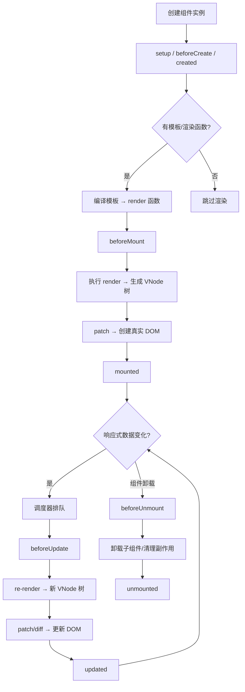
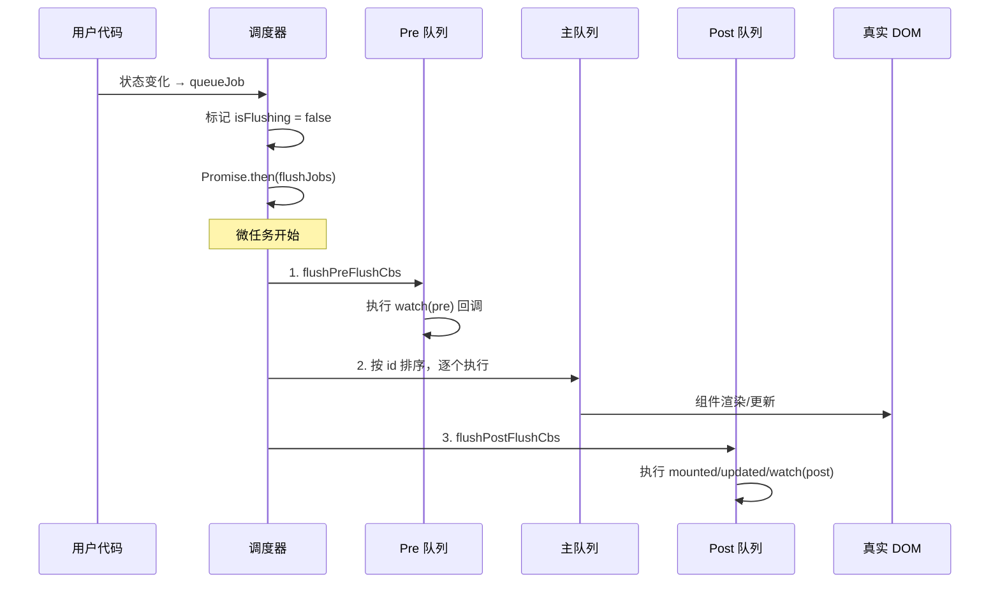
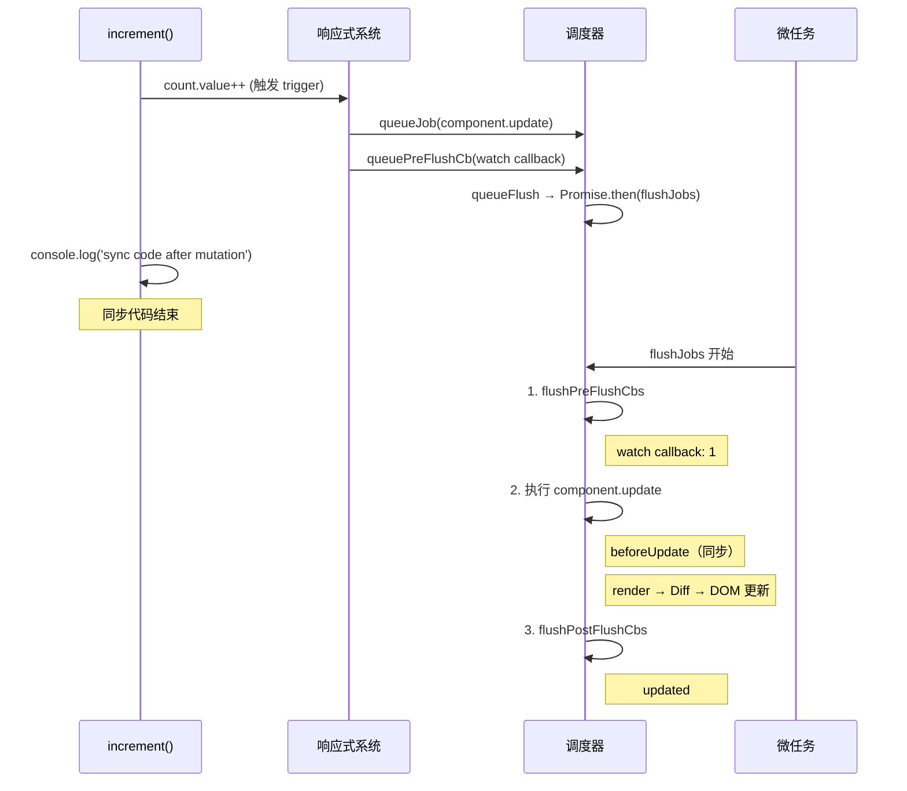

<div v-pre>

# 第 12 章 生命周期与调度

> **本章要点**
>
> - 组件生命周期的完整图谱：从 setup 到 unmounted，每个钩子的触发时机和内部实现
> - 生命周期钩子的注册机制：injectHook 如何将钩子函数绑定到组件实例
> - 调度器的核心设计：异步批量更新的队列模型和 flush 时机
> - nextTick 的实现本质：为什么它能保证在 DOM 更新后执行
> - 三种队列的优先级：pre 队列、queue 队列、post 队列的协作关系
> - Suspense 对生命周期的影响：异步组件如何改变钩子触发顺序
> - 调度器的错误处理与递归保护机制

---

在上一章中，我们深入了虚拟 DOM 和 Diff 算法——这是 Vue 渲染管线的"引擎"。但引擎不能随意启动，它需要一个精密的调度系统来协调"何时更新"、"以什么顺序更新"、"更新完之后做什么"。

同时，每个组件都有自己的"生命"——从诞生到消亡，在不同的阶段，开发者需要介入执行特定的逻辑。这就是生命周期系统的使命。

调度器和生命周期看似独立，实则紧密耦合。生命周期钩子的触发时机由调度器控制，而调度器的行为又受组件状态（是否挂载、是否激活）的制约。本章将一并剖析。

## 12.1 组件生命周期全景

### 生命周期的完整流程



### Composition API 中的生命周期

在 Vue 3 的 Composition API 中，生命周期钩子通过 `onXxx` 函数注册：

```typescript
import {
  onBeforeMount,
  onMounted,
  onBeforeUpdate,
  onUpdated,
  onBeforeUnmount,
  onUnmounted,
  onActivated,
  onDeactivated,
  onErrorCaptured,
  onRenderTracked,
  onRenderTriggered
} from 'vue'

export default {
  setup() {
    onBeforeMount(() => {
      console.log('DOM 即将创建')
    })

    onMounted(() => {
      console.log('DOM 已创建，可以访问 this.$el')
    })

    onBeforeUpdate(() => {
      console.log('DOM 即将更新')
    })

    onUpdated(() => {
      console.log('DOM 已更新')
    })

    onBeforeUnmount(() => {
      console.log('组件即将卸载')
    })

    onUnmounted(() => {
      console.log('组件已卸载，所有副作用已清理')
    })
  }
}
```

注意：`setup` 本身就是在 `beforeCreate` 和 `created` 之间执行的，所以 Composition API 中没有这两个钩子的对应函数——`setup` 就是它们的替代品。

## 12.2 钩子注册机制：injectHook

所有 `onXxx` 函数内部都调用同一个底层函数 `injectHook`：

```typescript
// packages/runtime-core/src/apiLifecycle.ts
export const onBeforeMount = createHook(LifecycleHooks.BEFORE_MOUNT)
export const onMounted = createHook(LifecycleHooks.MOUNTED)
export const onBeforeUpdate = createHook(LifecycleHooks.BEFORE_UPDATE)
export const onUpdated = createHook(LifecycleHooks.UPDATED)
export const onBeforeUnmount = createHook(LifecycleHooks.BEFORE_UNMOUNT)
export const onUnmounted = createHook(LifecycleHooks.UNMOUNTED)

// createHook 只是一层柯里化
export const createHook = <T extends Function = () => any>(
  lifecycle: LifecycleHooks
) => {
  return (hook: T, target: ComponentInternalInstance | null = currentInstance) =>
    injectHook(lifecycle, (...args: unknown[]) => hook(...args), target)
}
```

`injectHook` 的核心逻辑：

```typescript
// packages/runtime-core/src/apiLifecycle.ts
export function injectHook(
  type: LifecycleHooks,
  hook: Function & { __weh?: Function },
  target: ComponentInternalInstance | null = currentInstance,
  prepend: boolean = false
): Function | undefined {
  if (target) {
    // 获取或创建钩子数组
    // 组件实例上用简写存储：bm=beforeMount, m=mounted 等
    const hooks = target[type] || (target[type] = [])

    // 包装钩子函数，确保调用时 currentInstance 正确
    const wrappedHook =
      hook.__weh ||
      (hook.__weh = (...args: unknown[]) => {
        if (target.isUnmounted) {
          return
        }
        // 暂停追踪，防止钩子中的响应式访问被错误收集
        pauseTracking()
        // 设置当前实例，确保钩子内部能访问组件上下文
        const reset = setCurrentInstance(target)
        // 调用钩子，捕获错误
        const res = callWithAsyncErrorHandling(hook, target, type, args)
        reset()
        resetTracking()
        return res
      })

    if (prepend) {
      hooks.unshift(wrappedHook)
    } else {
      hooks.push(wrappedHook)
    }

    return wrappedHook
  }
}
```

几个关键设计点：

1. **currentInstance 绑定**：钩子函数在注册时捕获当前组件实例，调用时恢复。这保证了即使钩子被延迟执行（如 `mounted` 在异步 flush 中执行），也能正确访问组件上下文。

2. **暂停追踪**：钩子函数中的响应式访问不应该被收集为依赖，否则会导致不可预期的重渲染。

3. **错误处理**：所有钩子调用都通过 `callWithAsyncErrorHandling` 包装，支持 `onErrorCaptured` 的错误冒泡机制。

4. **卸载检查**：如果组件已经卸载，钩子直接跳过，避免操作已清理的状态。

### 生命周期枚举

```typescript
// packages/runtime-core/src/enums.ts
export enum LifecycleHooks {
  BEFORE_CREATE = 'bc',
  CREATED = 'c',
  BEFORE_MOUNT = 'bm',
  MOUNTED = 'm',
  BEFORE_UPDATE = 'bu',
  UPDATED = 'u',
  BEFORE_UNMOUNT = 'bum',
  UNMOUNTED = 'um',
  DEACTIVATED = 'da',
  ACTIVATED = 'a',
  RENDER_TRIGGERED = 'rtg',
  RENDER_TRACKED = 'rtc',
  ERROR_CAPTURED = 'ec',
  SERVER_PREFETCH = 'sp'
}
```

注意这些简写——`bm`、`m`、`bu`、`u`——它们直接作为组件实例的属性名。这不是偷懒，而是刻意的优化：短属性名在 V8 的隐藏类中占用更少的内存。

## 12.3 钩子的触发时机

### setupRenderEffect：生命周期的指挥中心

组件的生命周期钩子不是由一个统一的"生命周期管理器"触发的——它们散布在渲染流程的各个关键节点。最核心的触发点在 `setupRenderEffect` 中：

```typescript
// packages/runtime-core/src/renderer.ts（简化）
const setupRenderEffect: SetupRenderEffectFn = (
  instance,
  initialVNode,
  container,
  anchor,
  parentSuspense,
  namespace,
  optimized
) => {
  const componentUpdateFn = () => {
    if (!instance.isMounted) {
      // ======== 首次挂载 ========
      const { bm, m, parent } = instance

      // 触发 beforeMount
      if (bm) {
        invokeArrayFns(bm)
      }

      // 执行渲染函数
      const subTree = (instance.subTree = renderComponentRoot(instance))

      // 递归 patch（创建真实 DOM）
      patch(null, subTree, container, anchor, instance, parentSuspense, namespace)

      // 真实 DOM 已创建，保存引用
      initialVNode.el = subTree.el

      // 触发 mounted（通过调度器 post 队列延迟执行）
      if (m) {
        queuePostRenderEffect(m, parentSuspense)
      }

      instance.isMounted = true

    } else {
      // ======== 更新 ========
      let { next, bu, u, parent, vnode } = instance

      if (next) {
        next.el = vnode.el
        updateComponentPreRender(instance, next, optimized)
      } else {
        next = vnode
      }

      // 触发 beforeUpdate
      if (bu) {
        invokeArrayFns(bu)
      }

      // 执行渲染函数
      const nextTree = renderComponentRoot(instance)
      const prevTree = instance.subTree
      instance.subTree = nextTree

      // Diff 并更新 DOM
      patch(prevTree, nextTree, hostParentNode(prevTree.el!)!, getNextHostNode(prevTree), instance, parentSuspense, namespace)
      next.el = nextTree.el

      // 触发 updated（通过调度器 post 队列延迟执行）
      if (u) {
        queuePostRenderEffect(u, parentSuspense)
      }
    }
  }

  // 创建渲染 effect
  const effect = (instance.effect = new ReactiveEffect(componentUpdateFn, NOOP, () => queueJob(instance.update)))

  const update: SchedulerJob = (instance.update = () => {
    if (effect.dirty) {
      effect.run()
    }
  })
  update.id = instance.uid

  // 首次执行
  update()
}
```

注意 `beforeMount` 和 `beforeUpdate` 是**同步调用**的（`invokeArrayFns` 直接执行），而 `mounted` 和 `updated` 是通过 `queuePostRenderEffect` **延迟到 post 队列**执行的。

这意味着：
- `beforeMount` 时，DOM 还不存在
- `mounted` 时，DOM 已经创建并插入到文档中（因为 post 队列在所有 DOM 操作完成后执行）
- `beforeUpdate` 时，数据已变但 DOM 还是旧的
- `updated` 时，DOM 已经更新完成

### 卸载流程

```typescript
// packages/runtime-core/src/renderer.ts（简化）
const unmountComponent = (
  instance: ComponentInternalInstance,
  parentSuspense: SuspenseBoundary | null,
  doRemove?: boolean
) => {
  const { bum, scope, update, subTree, um } = instance

  // 触发 beforeUnmount
  if (bum) {
    invokeArrayFns(bum)
  }

  // 停止组件的 effect scope（清理所有 watch、computed 等副作用）
  scope.stop()

  // 停止渲染 effect
  if (update) {
    update.active = false
    unmount(subTree, instance, parentSuspense, doRemove)
  }

  // 触发 unmounted（post 队列）
  if (um) {
    queuePostRenderEffect(um, parentSuspense)
  }

  // 标记卸载状态
  queuePostRenderEffect(() => {
    instance.isUnmounted = true
  }, parentSuspense)
}
```

`beforeUnmount` 是同步的——此时组件的 DOM 还在，你可以做最后的 DOM 操作。`unmounted` 是异步的——此时 DOM 已被移除，适合做清理工作（如取消事件监听、断开 WebSocket）。

## 12.4 调度器架构

### 为什么需要调度器？

考虑这段代码：

```typescript
const count = ref(0)

function handleClick() {
  count.value++
  count.value++
  count.value++
}
```

如果每次 `count.value` 变化都立刻触发重渲染，那么一次点击会导致三次渲染——显然是浪费。调度器的核心任务就是将同步代码中的多次状态变化**合并为一次更新**。

### 三级队列模型

Vue 3 的调度器维护三个队列：

```typescript
// packages/runtime-core/src/scheduler.ts
const queue: SchedulerJob[] = []           // 主队列
const pendingPreFlushCbs: SchedulerJob[] = [] // pre 回调
const pendingPostFlushCbs: SchedulerJob[] = [] // post 回调
```



**执行顺序**：Pre 队列 → 主队列 → Post 队列。

- **Pre 队列**：`watchEffect`（flush: 'pre'）的回调、组件更新前需要执行的逻辑
- **主队列**：组件的渲染更新函数（`instance.update`）
- **Post 队列**：`mounted`、`updated` 钩子、`watchEffect`（flush: 'post'）的回调

### queueJob：入队逻辑

```typescript
// packages/runtime-core/src/scheduler.ts
export function queueJob(job: SchedulerJob): void {
  // 去重：同一个 job 不会重复入队
  if (
    !queue.length ||
    !queue.includes(
      job,
      isFlushing && job.allowRecurse ? flushIndex + 1 : flushIndex
    )
  ) {
    if (job.id == null) {
      queue.push(job)
    } else {
      // 按 id 插入到正确位置（保持有序）
      queue.splice(findInsertionIndex(job.id), 0, job)
    }
    queueFlush()
  }
}

function queueFlush() {
  if (!isFlushing && !isFlushPending) {
    isFlushPending = true
    currentFlushPromise = resolvedPromise.then(flushJobs)
  }
}
```

`queueFlush` 使用 `Promise.resolve().then()` 将 flush 操作推入微任务队列。这保证了当前同步代码全部执行完毕后，才开始处理更新。

### flushJobs：调度主循环

```typescript
function flushJobs(seen?: CountMap) {
  isFlushPending = false
  isFlushing = true

  // 1. 执行 Pre 队列
  flushPreFlushCbs(seen)

  // 2. 主队列排序
  // 父组件的 id < 子组件的 id（因为父组件先创建）
  // 保证从父到子的更新顺序
  queue.sort(comparator)

  // 3. 执行主队列
  try {
    for (flushIndex = 0; flushIndex < queue.length; flushIndex++) {
      const job = queue[flushIndex]
      if (job && job.active !== false) {
        callWithErrorHandling(job, null, ErrorCodes.SCHEDULER)
      }
    }
  } finally {
    // 4. 清理
    flushIndex = 0
    queue.length = 0

    // 5. 执行 Post 队列
    flushPostFlushCbs(seen)

    // 6. 复位状态
    isFlushing = false
    currentFlushPromise = null

    // 7. 如果在 flush 过程中有新的 job 入队，递归 flush
    if (queue.length || pendingPreFlushCbs.length || pendingPostFlushCbs.length) {
      flushJobs(seen)
    }
  }
}
```

排序使用 `comparator`：

```typescript
const comparator = (a: SchedulerJob, b: SchedulerJob): number => {
  const diff = getId(a) - getId(b)
  if (diff === 0) {
    if (a.pre && !b.pre) return -1
    if (b.pre && !a.pre) return 1
  }
  return diff
}
```

**排序的意义**：组件的 `uid` 在创建时递增分配，父组件的 `uid` 必然小于子组件。排序保证了从父到子的更新顺序。为什么这很重要？因为如果子组件先更新，然后父组件更新导致子组件的 props 变化，子组件又会再更新一次——双重渲染。从父到子更新可以避免这个问题。

### nextTick 的实现

```typescript
// packages/runtime-core/src/scheduler.ts
export function nextTick<T = void>(
  this: T,
  fn?: (this: T) => void
): Promise<void> {
  const p = currentFlushPromise || resolvedPromise
  return fn ? p.then(this ? fn.bind(this) : fn) : p
}
```

就这么简单——`nextTick` 就是在当前的 flush promise 之后追加一个 `.then()`。如果当前没有 pending 的 flush，它就追加到一个已 resolved 的 promise 上（立即在微任务中执行）。

这解释了为什么 `nextTick` 总是在 DOM 更新后执行：DOM 更新发生在 `flushJobs` 的主队列阶段，而 `nextTick` 的回调追加在同一个 promise 链的末尾。

## 12.5 Pre/Post 队列详解

### flushPreFlushCbs

```typescript
export function flushPreFlushCbs(
  instance?: ComponentInternalInstance,
  seen?: CountMap
) {
  if (pendingPreFlushCbs.length) {
    currentPreFlushParentJob = instance
    // 去重
    let activePreFlushCbs = [...new Set(pendingPreFlushCbs)]
    pendingPreFlushCbs.length = 0

    for (let i = 0; i < activePreFlushCbs.length; i++) {
      activePreFlushCbs[i]()
    }
    currentPreFlushParentJob = null

    // 递归处理（pre 回调可能产生新的 pre 回调）
    flushPreFlushCbs(instance, seen)
  }
}
```

Pre 队列的典型使用者是 `watch` 的 `flush: 'pre'`（默认值）。这意味着 watcher 的回调在组件更新前执行，可以在回调中修改状态而不会导致额外的渲染。

### flushPostFlushCbs

```typescript
export function flushPostFlushCbs(seen?: CountMap) {
  if (pendingPostFlushCbs.length) {
    // 去重并排序
    const deduped = [...new Set(pendingPostFlushCbs)]
    pendingPostFlushCbs.length = 0

    if (activePostFlushCbs) {
      activePostFlushCbs.push(...deduped)
      return
    }

    activePostFlushCbs = deduped
    activePostFlushCbs.sort((a, b) => getId(a) - getId(b))

    for (postFlushIndex = 0; postFlushIndex < activePostFlushCbs.length; postFlushIndex++) {
      activePostFlushCbs[postFlushIndex]()
    }

    activePostFlushCbs = null
    postFlushIndex = 0
  }
}
```

Post 队列的使用者包括：`mounted` / `updated` 钩子、`watch` 的 `flush: 'post'`、`watchPostEffect`。它们在 DOM 更新完成后执行。

### 三种 watch 的 flush 策略

```typescript
// flush: 'pre'（默认）
watch(source, callback)  // 在组件更新前执行

// flush: 'post'
watch(source, callback, { flush: 'post' })  // 在 DOM 更新后执行

// flush: 'sync'
watch(source, callback, { flush: 'sync' })  // 同步执行（谨慎使用）
```

`flush: 'sync'` 不走调度器，直接在响应式变化时同步触发。这意味着每次数据变化都会执行回调，失去了批量更新的优化。只在需要立即响应每一次变化时使用。

## 12.6 调度器的递归保护

调度器有一个重要的安全机制——防止无限递归：

```typescript
const RECURSION_LIMIT = 100

function checkRecursiveUpdates(seen: CountMap, fn: SchedulerJob) {
  if (!seen.has(fn)) {
    seen.set(fn, 1)
  } else {
    const count = seen.get(fn)!
    if (count > RECURSION_LIMIT) {
      const instance = (fn as ComponentJob).ownerInstance
      const componentName = instance && getComponentName(instance.type)
      warn(
        `Maximum recursive updates exceeded${componentName ? ` in component <${componentName}>` : ''}. ` +
        `This means you have a reactive effect that is mutating its own dependencies and thus recursively triggering itself.`
      )
      return
    } else {
      seen.set(fn, count + 1)
    }
  }
}
```

当一个 `watch` 回调修改了自己监听的数据源时，就会触发自身的重新执行，形成递归。调度器允许最多 100 次递归后终止并发出警告。

## 12.7 组件更新的完整时序

让我们用一个完整的例子来追踪从"状态变化"到"DOM 更新完成"的全过程：

```typescript
const App = defineComponent({
  setup() {
    const count = ref(0)

    watch(count, (newVal) => {
      console.log('watch callback:', newVal)  // Pre 队列
    })

    onBeforeUpdate(() => {
      console.log('beforeUpdate')  // 同步，在 render 前
    })

    onUpdated(() => {
      console.log('updated')  // Post 队列
    })

    const increment = () => {
      count.value++  // 触发响应式更新
      console.log('sync code after mutation')
    }

    return { count, increment }
  }
})
```

执行 `increment()` 后的时序：



输出顺序：
```
sync code after mutation
watch callback: 1
beforeUpdate
updated
```

## 12.8 Suspense 对生命周期的影响

Suspense 改变了组件挂载的语义——异步组件的 `mounted` 钩子需要等待异步操作完成后才能触发：

```typescript
// packages/runtime-core/src/components/Suspense.ts（简化）
function mountSuspense(
  vnode: VNode,
  container: RendererElement,
  anchor: RendererNode | null,
  parentComponent: ComponentInternalInstance | null,
  // ...
) {
  const suspense = (vnode.suspense = createSuspenseBoundary(vnode, parentSuspense, parentComponent, container, hiddenContainer, anchor, namespace, slotScopeIds, optimized, rendererInternals))

  // 渲染默认内容
  patch(null, (suspense.pendingBranch = vnode.ssContent!), hiddenContainer, null, parentComponent, suspense, namespace, slotScopeIds)

  if (suspense.deps > 0) {
    // 有异步依赖：先显示 fallback
    triggerEvent(vnode, 'onPending')
    suspense.isInFallback = true
    patch(null, vnode.ssFallback!, container, anchor, parentComponent, null, namespace, slotScopeIds)
  } else {
    // 没有异步依赖：直接 resolve
    suspense.resolve(false, true)
  }
}
```

当 Suspense 内的异步组件 resolve 后，其 `mounted` 钩子才会从 Post 队列中被 flush。这意味着：

```typescript
// ParentComponent
onMounted(() => {
  // 可能在子组件的 mounted 之前执行（如果子组件是异步的）
  console.log('parent mounted')
})

// AsyncChildComponent (inside <Suspense>)
const data = await fetchData()
onMounted(() => {
  // 在 Suspense resolve 后才执行
  console.log('async child mounted')
})
```

### queuePostRenderEffect 的 Suspense 处理

```typescript
export const queuePostRenderEffect = __FEATURE_SUSPENSE__
  ? __queuePostRenderEffect
  : queuePostFlushCb

function __queuePostRenderEffect(
  fn: SchedulerJobs,
  suspense: SuspenseBoundary | null
) {
  if (suspense && suspense.pendingBranch && !suspense.isResolved) {
    // Suspense 还未 resolve：暂存到 suspense 的 effects 列表中
    if (isArray(fn)) {
      suspense.effects.push(...fn)
    } else {
      suspense.effects.push(fn)
    }
  } else {
    // 正常入 post 队列
    queuePostFlushCb(fn)
  }
}
```

这就是 Suspense 的魔法——它拦截了 `mounted` 等钩子的入队，暂存到自己的 `effects` 列表中，等 resolve 时一并释放。

## 12.9 KeepAlive 与 activated / deactivated

KeepAlive 引入了两个额外的生命周期钩子：

```typescript
// packages/runtime-core/src/components/KeepAlive.ts（简化）
const KeepAliveImpl: ComponentOptions = {
  setup(props, { slots }) {
    const cache: Cache = new Map()
    const keys: Keys = new Set()
    let current: VNode | null = null

    const instance = getCurrentInstance()!
    const sharedContext = instance.ctx as KeepAliveContext

    // 激活
    sharedContext.activate = (vnode, container, anchor, namespace, optimized) => {
      const instance = vnode.component!
      // 将缓存的 DOM 移回文档
      move(vnode, container, anchor, MoveType.ENTER, parentSuspense)
      // 可能需要更新 props
      patch(instance.vnode, vnode, container, anchor, instance, parentSuspense, namespace, vnode.slotScopeIds, optimized)

      queuePostRenderEffect(() => {
        instance.isDeactivated = false
        // 触发 activated 钩子
        if (instance.a) {
          invokeArrayFns(instance.a)
        }
      }, parentSuspense)
    }

    // 停用
    sharedContext.deactivate = (vnode: VNode) => {
      const instance = vnode.component!
      // 将 DOM 移到隐藏容器（不销毁）
      move(vnode, storageContainer, null, MoveType.LEAVE, parentSuspense)

      queuePostRenderEffect(() => {
        // 触发 deactivated 钩子
        if (instance.da) {
          invokeArrayFns(instance.da)
        }
        instance.isDeactivated = true
      }, parentSuspense)
    }

    return () => {
      // ... 渲染逻辑：从缓存中取出或创建新的组件 VNode
    }
  }
}
```

KeepAlive 的组件不会走正常的 `mount` / `unmount` 流程——它们被"停用"到一个隐藏的 DOM 容器中，"激活"时再移回来。这就是为什么 KeepAlive 的组件只触发 `activated` / `deactivated`，而不是 `mounted` / `unmounted`。

## 12.10 错误处理链

Vue 3 的错误处理不是简单的 try-catch，而是一个沿组件树向上冒泡的链式机制：

```typescript
// packages/runtime-core/src/errorHandling.ts
export function handleError(
  err: unknown,
  instance: ComponentInternalInstance | null,
  type: ErrorTypes,
  throwInDev = true
) {
  const contextVNode = instance ? instance.vnode : null

  if (instance) {
    let cur = instance.parent
    const exposedInstance = instance.proxy

    // 沿父组件链向上查找 errorCaptured 钩子
    while (cur) {
      const errorCapturedHooks = cur.ec  // errorCaptured 钩子数组
      if (errorCapturedHooks) {
        for (let i = 0; i < errorCapturedHooks.length; i++) {
          // 如果钩子返回 true，表示错误已处理，停止冒泡
          if (errorCapturedHooks[i](err, exposedInstance, type) === true) {
            return
          }
        }
      }
      cur = cur.parent
    }
  }

  // 全局错误处理器
  const appErrorHandler = instance?.appContext?.config?.errorHandler
  if (appErrorHandler) {
    callWithErrorHandling(appErrorHandler, null, ErrorCodes.APP_ERROR_HANDLER, [err, exposedInstance, type])
    return
  }

  // 兜底：输出到控制台
  logError(err, type, contextVNode, throwInDev)
}
```

错误处理的优先级：`onErrorCaptured`（组件级，逐级冒泡）→ `app.config.errorHandler`（全局）→ `console.error`（兜底）。

## 12.11 调试工具：追踪渲染与触发

Vue 3 提供了两个调试专用的生命周期钩子：

```typescript
onRenderTracked((event) => {
  // 响应式依赖被追踪时触发
  console.log('tracked:', event)
  // event: { effect, target, type, key }
})

onRenderTriggered((event) => {
  // 响应式变化触发重渲染时
  console.log('triggered:', event)
  // event: { effect, target, type, key, newValue, oldValue }
})
```

这两个钩子在生产环境中被 tree-shake 掉（通过 `__DEV__` 编译时条件），所以不会有运行时开销。

```typescript
// packages/runtime-core/src/renderer.ts
const effect = (instance.effect = new ReactiveEffect(
  componentUpdateFn,
  NOOP,
  () => queueJob(instance.update),
  instance.scope
))

if (__DEV__) {
  effect.onTrack = instance.rtc
    ? e => invokeArrayFns(instance.rtc!, e)
    : void 0
  effect.onTrigger = instance.rtg
    ? e => invokeArrayFns(instance.rtg!, e)
    : void 0
  effect.ownerInstance = instance
}
```

## 12.12 本章小结

生命周期和调度器是 Vue 3 运行时的"时间维度"——它们决定了"什么时候做什么"：

1. **生命周期钩子**通过 `injectHook` 注册到组件实例上，每个钩子都被包装以确保正确的 `currentInstance` 上下文和错误处理。

2. **调度器**维护三级队列（Pre → 主 → Post），通过微任务实现异步批量更新。同一个组件的多次状态变化只触发一次渲染。

3. **排序保证**父到子的更新顺序（uid 递增），避免子组件的双重渲染。

4. **nextTick** 就是追加到当前 flush promise 的 `.then()`，保证在 DOM 更新后执行。

5. **Suspense** 拦截异步组件的 `mounted` 等钩子，暂存到自己的 effects 列表中，resolve 后统一释放。

6. **KeepAlive** 用 `activated` / `deactivated` 替代 `mounted` / `unmounted`，通过隐藏容器实现 DOM 的保留与复用。

7. **错误处理**沿组件树冒泡：`onErrorCaptured` → `app.config.errorHandler` → `console.error`。

---

**思考题**

1. 如果在 `onUpdated` 钩子中修改了一个响应式变量，会发生什么？调度器如何处理这种情况？

2. 为什么 `watch` 默认使用 `flush: 'pre'` 而不是 `flush: 'post'`？在什么场景下你应该使用 `flush: 'post'`？

3. `nextTick` 和 `queuePostFlushCb` 的回调执行顺序是怎样的？如果在一个 `watch` 回调中调用 `nextTick`，回调会在什么时候执行？

4. 考虑一个深层嵌套的组件树（A → B → C → D），当 A 和 C 同时触发更新时，调度器如何保证正确的更新顺序？

5. KeepAlive 组件的缓存上限（`max` prop）是如何实现的？当缓存满了时，哪个组件会被淘汰？这使用了什么策略？

</div>
