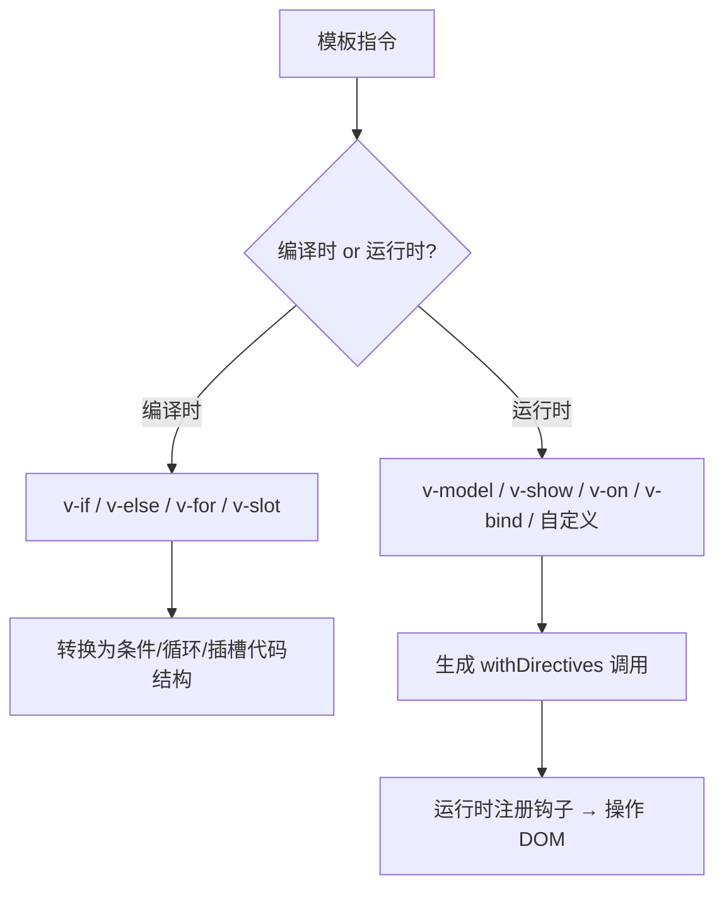
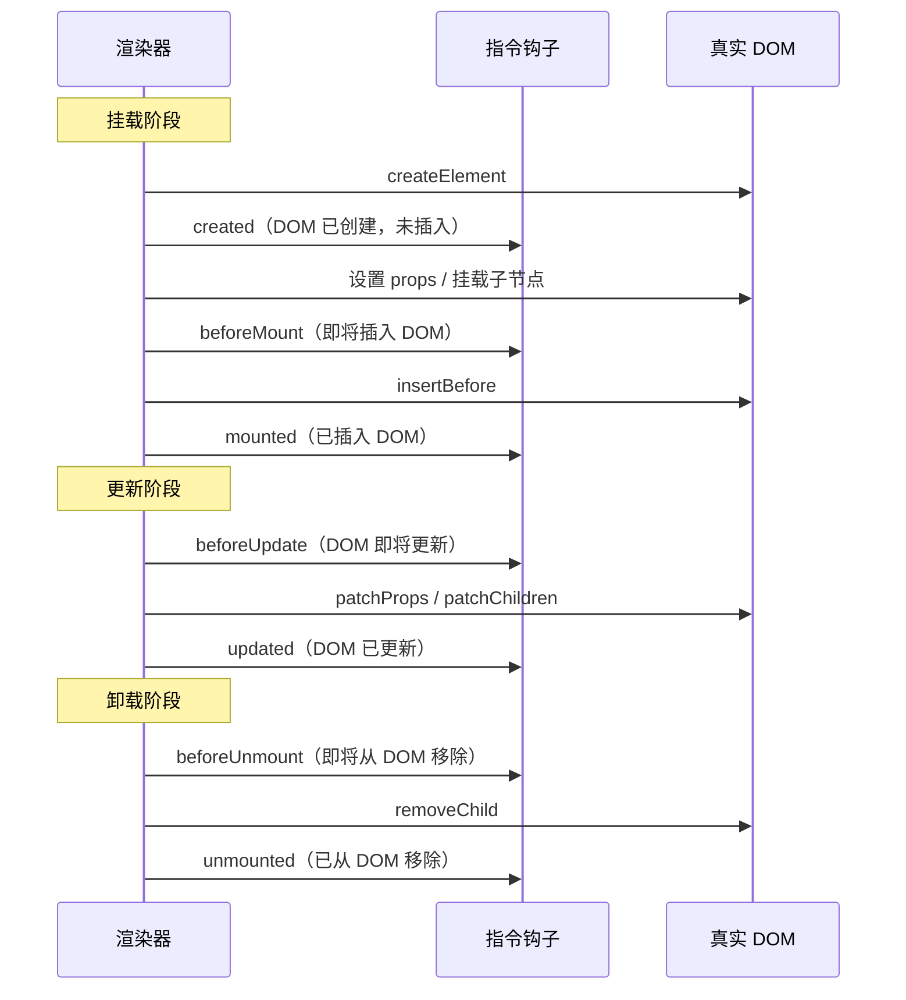
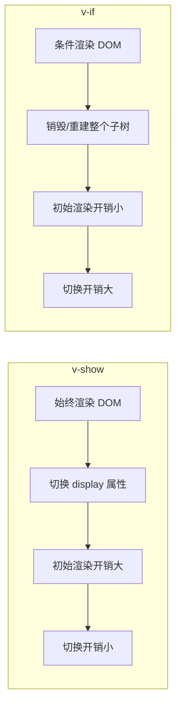

<div v-pre>

# 第 13 章 指令系统

> **本章要点**
>
> - 指令的本质：将 DOM 操作逻辑封装为可复用的声明式抽象
> - 内置指令的实现：v-model、v-show、v-if、v-for、v-on、v-bind 的编译与运行时协作
> - 自定义指令的完整生命周期：created → beforeMount → mounted → beforeUpdate → updated → beforeUnmount → unmounted
> - 指令的编译时转换：编译器如何将指令语法转换为 withDirectives 调用
> - withDirectives 的运行时机制：指令绑定的创建、更新与销毁
> - v-model 的双向绑定在不同元素类型上的差异化实现
> - 指令与组件的交互：组件上使用指令的限制与解决方案

---

指令是 Vue 模板语法中最具"魔法感"的部分。当你写下 `v-model="name"` 时，输入框自动与变量双向绑定；写下 `v-show="visible"` 时，元素的显隐自动切换。这些"魔法"的背后是编译器和运行时的精密协作。

在前面的章节中，我们已经了解了编译器如何处理模板、运行时如何创建和更新 VNode。本章将聚焦于连接这两者的关键机制——指令系统。

## 13.1 指令的分类与编译

### 编译时指令 vs 运行时指令

Vue 的指令分为两大类：

1. **编译时指令**：`v-if`、`v-else`、`v-for`、`v-slot`——它们在编译阶段被转换为完全不同的代码结构，运行时不存在"指令"的概念
2. **运行时指令**：`v-model`、`v-show`、`v-on`、`v-bind`、自定义指令——它们在运行时通过 `withDirectives` 注册生命周期钩子



### v-if 的编译转换

`v-if` 在编译阶段被完全消解：

```html
<template>
  <div v-if="show">Hello</div>
  <div v-else>Bye</div>
</template>
```

编译为：

```typescript
function render(_ctx) {
  return _ctx.show
    ? (_openBlock(), _createElementBlock("div", { key: 0 }, "Hello"))
    : (_openBlock(), _createElementBlock("div", { key: 1 }, "Bye"))
}
```

变成了一个简单的三元表达式。注意 `key: 0` 和 `key: 1`——编译器自动为不同的分支添加不同的 key，确保 Diff 算法能正确识别它们是不同的节点。

### v-for 的编译转换

```html
<template>
  <div v-for="item in items" :key="item.id">{{ item.name }}</div>
</template>
```

编译为：

```typescript
function render(_ctx) {
  return (_openBlock(true), _createElementBlock(
    _Fragment, null,
    _renderList(_ctx.items, (item) => {
      return (_openBlock(), _createElementBlock("div", { key: item.id },
        _toDisplayString(item.name), 1 /* TEXT */))
    }),
    128 /* KEYED_FRAGMENT */
  ))
}
```

`v-for` 被转换为 `_renderList` 调用（本质是 `Array.map`），每个迭代项生成一个独立的 Block。外层包裹一个 `Fragment`，并标记 `KEYED_FRAGMENT` PatchFlag。

`openBlock(true)` 中的 `true` 参数表示**禁用 Block 追踪**——因为 `v-for` 的子节点数量是动态的，不能用固定的 `dynamicChildren` 来优化，必须走完整的 keyed Diff。

## 13.2 withDirectives：运行时指令的核心

运行时指令通过 `withDirectives` 函数附加到 VNode 上：

```typescript
// 编译器输出示例
_withDirectives(
  _createElementVNode("input", {
    "onUpdate:modelValue": $event => (_ctx.name = $event)
  }, null, 8, ["onUpdate:modelValue"]),
  [
    [_vModelText, _ctx.name]
  ]
)
```

`withDirectives` 的实现：

```typescript
// packages/runtime-core/src/directives.ts
export function withDirectives<T extends VNode>(
  vnode: T,
  directives: DirectiveArguments
): T {
  if (currentRenderingInstance === null) {
    warn(`withDirectives can only be used inside render functions.`)
    return vnode
  }

  const instance = getExposeProxy(currentRenderingInstance) || currentRenderingInstance.proxy
  const bindings: DirectiveBinding[] = vnode.dirs || (vnode.dirs = [])

  for (let i = 0; i < directives.length; i++) {
    let [dir, value, arg, modifiers = EMPTY_OBJ] = directives[i]

    // 函数简写：将函数同时注册为 mounted 和 updated 钩子
    if (isFunction(dir)) {
      dir = {
        mounted: dir,
        updated: dir
      } as ObjectDirective
    }

    // 如果指令有 deep 选项，创建深度响应式 watch
    if (dir.deep) {
      traverse(value)
    }

    bindings.push({
      dir,
      instance,
      value,
      oldValue: void 0,
      arg,
      modifiers
    })
  }

  return vnode
}
```

`withDirectives` 不做任何 DOM 操作——它只是将指令信息挂到 VNode 的 `dirs` 属性上。真正的操作在 `patch` 阶段触发。

### 指令钩子的调用时机

```typescript
// packages/runtime-core/src/directives.ts
export function invokeDirectiveHook(
  vnode: VNode,
  prevVNode: VNode | null,
  instance: ComponentInternalInstance | null,
  name: keyof ObjectDirective
) {
  const bindings = vnode.dirs!
  const oldBindings = prevVNode && prevVNode.dirs!

  for (let i = 0; i < bindings.length; i++) {
    const binding = bindings[i]
    if (oldBindings) {
      binding.oldValue = oldBindings[i].value
    }
    let hook = binding.dir[name] as DirectiveHook | DirectiveHook[] | undefined

    if (hook) {
      pauseTracking()
      callWithAsyncErrorHandling(hook, instance, ErrorCodes.DIRECTIVE_HOOK, [
        vnode.el,      // 真实 DOM 元素
        binding,       // 指令绑定对象
        vnode,         // 当前 VNode
        prevVNode      // 旧 VNode
      ])
      resetTracking()
    }
  }
}
```

在 `mountElement` 和 `patchElement` 中调用：

```typescript
// packages/runtime-core/src/renderer.ts（简化）

// 挂载元素时
const mountElement = (vnode, container, anchor, ...) => {
  // 创建 DOM
  el = vnode.el = hostCreateElement(vnode.type)

  // 设置属性
  if (props) { /* ... */ }

  // 指令 created 钩子
  if (dirs) {
    invokeDirectiveHook(vnode, null, parentComponent, 'created')
  }

  // 挂载子节点
  if (shapeFlag & ShapeFlags.TEXT_CHILDREN) {
    hostSetElementText(el, vnode.children as string)
  } else if (shapeFlag & ShapeFlags.ARRAY_CHILDREN) {
    mountChildren(vnode.children, el, null, ...)
  }

  // 指令 beforeMount 钩子
  if (dirs) {
    invokeDirectiveHook(vnode, null, parentComponent, 'beforeMount')
  }

  // 插入 DOM
  hostInsert(el, container, anchor)

  // 指令 mounted 钩子（Post 队列）
  if (dirs) {
    queuePostRenderEffect(() => {
      invokeDirectiveHook(vnode, null, parentComponent, 'mounted')
    }, parentSuspense)
  }
}

// 更新元素时
const patchElement = (n1, n2, ...) => {
  const el = (n2.el = n1.el!)

  const { dirs } = n2

  // 指令 beforeUpdate 钩子
  if (dirs) {
    invokeDirectiveHook(n2, n1, parentComponent, 'beforeUpdate')
  }

  // 更新属性和子节点 ...

  // 指令 updated 钩子（Post 队列）
  if (dirs) {
    queuePostRenderEffect(() => {
      invokeDirectiveHook(n2, n1, parentComponent, 'updated')
    }, parentSuspense)
  }
}
```

指令的生命周期与元素的生命周期完美对齐：



## 13.3 v-model 的实现

`v-model` 是 Vue 中最复杂的指令——它需要根据不同的表单元素类型（input、textarea、select、checkbox、radio）采用不同的实现策略。

### 编译阶段

```html
<input v-model="name" />
```

编译为：

```typescript
_withDirectives(
  _createElementVNode("input", {
    "onUpdate:modelValue": $event => (_ctx.name = $event)
  }, null, 8, ["onUpdate:modelValue"]),
  [
    [_vModelText, _ctx.name]
  ]
)
```

编译器做了两件事：
1. 生成 `onUpdate:modelValue` 事件处理器（值的回写）
2. 附加 `vModelText` 运行时指令（值的正向同步 + 事件监听）

### vModelText：文本输入的实现

```typescript
// packages/runtime-dom/src/directives/vModel.ts
export const vModelText: ModelDirective<
  HTMLInputElement | HTMLTextAreaElement
> = {
  created(el, { modifiers: { lazy, trim, number } }, vnode) {
    el._assign = getModelAssigner(vnode)
    const castToNumber = number || (vnode.props && vnode.props.type === 'number')

    // 选择事件类型
    addEventListener(el, lazy ? 'change' : 'input', e => {
      if ((e.target as any).composing) return  // 输入法组合中，不触发

      let domValue: string | number = el.value
      if (trim) {
        domValue = domValue.trim()
      }
      if (castToNumber) {
        domValue = looseToNumber(domValue)
      }
      el._assign(domValue)
    })

    if (trim) {
      addEventListener(el, 'change', () => {
        el.value = el.value.trim()
      })
    }

    if (!lazy) {
      // 处理中文/日文/韩文输入法的组合输入
      addEventListener(el, 'compositionstart', onCompositionStart)
      addEventListener(el, 'compositionend', onCompositionEnd)
      addEventListener(el, 'change', onCompositionEnd)
    }
  },

  mounted(el, { value }) {
    el.value = value == null ? '' : value
  },

  beforeUpdate(el, { value, modifiers: { lazy, trim, number } }, vnode) {
    el._assign = getModelAssigner(vnode)

    // 输入法组合中不更新
    if ((el as any).composing) return

    const elValue = (number || el.type === 'number')
      ? looseToNumber(el.value)
      : el.value
    const newValue = value == null ? '' : value

    // 避免不必要的 DOM 更新
    if (elValue === newValue) return

    // 如果元素正在聚焦，且值在处理中，延迟更新
    if (document.activeElement === el && el.type !== 'range') {
      if (lazy) return
      if (trim && el.value.trim() === newValue) return
    }

    el.value = newValue
  }
}
```

几个值得注意的设计：

1. **compositionstart / compositionend**：处理 CJK 输入法。在输入法组合过程中（如拼音输入未确认时），不触发值更新，避免中间状态污染数据。

2. **lazy 修饰符**：使用 `change` 事件替代 `input` 事件，只在失去焦点时同步值。

3. **焦点保护**：如果用户正在编辑（元素聚焦），不主动覆盖 DOM 值，避免光标位置跳动。

### vModelCheckbox：复选框的特殊处理

```typescript
export const vModelCheckbox: ModelDirective<HTMLInputElement> = {
  deep: true,  // 需要深度追踪（数组值）

  created(el, _, vnode) {
    el._assign = getModelAssigner(vnode)
    addEventListener(el, 'change', () => {
      const modelValue = (el as any)._modelValue
      const elementValue = getValue(el)
      const checked = el.checked
      const assign = el._assign

      if (isArray(modelValue)) {
        // 数组模式：选中时添加，取消时移除
        const index = looseIndexOf(modelValue, elementValue)
        const found = index !== -1
        if (checked && !found) {
          assign(modelValue.concat(elementValue))
        } else if (!checked && found) {
          const filtered = [...modelValue]
          filtered.splice(index, 1)
          assign(filtered)
        }
      } else if (isSet(modelValue)) {
        // Set 模式
        const cloned = new Set(modelValue)
        if (checked) {
          cloned.add(elementValue)
        } else {
          cloned.delete(elementValue)
        }
        assign(cloned)
      } else {
        // 布尔模式
        assign(getCheckboxValue(el, checked))
      }
    })
  },

  mounted: setChecked,
  beforeUpdate(el, binding, vnode) {
    el._assign = getModelAssigner(vnode)
    setChecked(el, binding, vnode)
  }
}

function setChecked(
  el: HTMLInputElement,
  { value, oldValue }: DirectiveBinding,
  vnode: VNode
) {
  ;(el as any)._modelValue = value
  if (isArray(value)) {
    el.checked = looseIndexOf(value, vnode.props!.value) > -1
  } else if (isSet(value)) {
    el.checked = value.has(vnode.props!.value)
  } else if (value !== oldValue) {
    el.checked = looseEqual(value, getCheckboxValue(el, true))
  }
}
```

复选框的 `v-model` 支持三种数据类型：数组、Set、布尔值。这种多态性是在运行时通过类型检查实现的——编译器无法在编译时确定绑定值的类型。

### 组件上的 v-model

组件上的 `v-model` 与元素上的完全不同——它被编译为 props + emit：

```html
<MyInput v-model="name" />
```

编译为：

```typescript
_createVNode(MyInput, {
  modelValue: _ctx.name,
  "onUpdate:modelValue": $event => (_ctx.name = $event)
}, null, 8, ["modelValue", "onUpdate:modelValue"])
```

没有 `withDirectives`，没有运行时指令——纯粹的 props 和事件。组件内部需要声明 `modelValue` prop 和 `update:modelValue` emit。

Vue 3.4+ 引入了 `defineModel` 宏进一步简化：

```typescript
// MyInput.vue
const model = defineModel<string>()

// 等价于
const props = defineProps<{ modelValue: string }>()
const emit = defineEmits<{ 'update:modelValue': [value: string] }>()
const model = computed({
  get: () => props.modelValue,
  set: (val) => emit('update:modelValue', val)
})
```

## 13.4 v-show 的实现

`v-show` 是最简单的运行时指令之一：

```typescript
// packages/runtime-dom/src/directives/vShow.ts
export const vShow: ObjectDirective<VShowElement> & { name?: 'show' } = {
  beforeMount(el, { value }, { transition }) {
    el._vod = el.style.display === 'none' ? '' : el.style.display
    if (transition && value) {
      transition.beforeEnter(el)
    } else {
      setDisplay(el, value)
    }
  },

  mounted(el, { value }, { transition }) {
    if (transition && value) {
      transition.enter(el)
    }
  },

  updated(el, { value, oldValue }, { transition }) {
    if (!value === !oldValue) return  // 布尔值未变化
    if (transition) {
      if (value) {
        transition.beforeEnter(el)
        setDisplay(el, true)
        transition.enter(el)
      } else {
        transition.leave(el, () => {
          setDisplay(el, false)
        })
      }
    } else {
      setDisplay(el, value)
    }
  },

  beforeUnmount(el, { value }) {
    setDisplay(el, value)
  }
}

function setDisplay(el: VShowElement, value: unknown): void {
  el.style.display = value ? el._vod : 'none'
}
```

关键细节：

1. **保存原始 display 值**：`el._vod`（原始 display）在 `beforeMount` 时保存，隐藏时设为 `none`，显示时恢复原值。

2. **过渡动画集成**：`v-show` 与 `<Transition>` 组件深度集成。当有过渡效果时，隐藏操作延迟到过渡动画结束后执行。

3. **短路优化**：`!value === !oldValue` 用双重取反将值转为布尔后比较，避免 `undefined` 到 `false` 等不必要的更新。

### v-show vs v-if



## 13.5 v-on 的编译与优化

### 事件处理的编译

```html
<button @click="handleClick">Click</button>
```

编译为：

```typescript
_createElementVNode("button", {
  onClick: _ctx.handleClick
}, "Click", 8, ["onClick"])
```

注意：`@click` 被编译为 `onClick` prop，不是运行时指令。Vue 3 统一使用 prop 机制处理事件（以 `on` 开头的 prop 被识别为事件监听器）。

### 事件缓存

编译器的一个重要优化——事件处理器缓存：

```html
<button @click="count++">+1</button>
```

编译为（启用缓存）：

```typescript
function render(_ctx, _cache) {
  return _createElementVNode("button", {
    onClick: _cache[0] || (_cache[0] = $event => (_ctx.count++))
  }, "+1")
}
```

事件处理器被缓存到 `_cache` 数组中，后续渲染直接复用同一个函数引用，避免不必要的 prop 变化检测。

### 事件修饰符

```html
<form @submit.prevent="onSubmit">
  <input @keydown.enter.ctrl="onCtrlEnter" />
  <button @click.stop.once="onClick">Submit</button>
</form>
```

修饰符在编译时被转换为包装函数：

```typescript
// .prevent → withModifiers
_createElementVNode("form", {
  onSubmit: _withModifiers(_ctx.onSubmit, ["prevent"])
}, [
  // .enter.ctrl → 键盘修饰符
  _createElementVNode("input", {
    onKeydown: _withKeys(_ctx.onCtrlEnter, ["enter", "ctrl"])
  }),
  // .stop.once → 运行时处理
  _createElementVNode("button", {
    onClickOnce: _withModifiers(_ctx.onClick, ["stop"])
  }, "Submit")
])
```

`withModifiers` 的实现：

```typescript
// packages/runtime-dom/src/directives/vOn.ts
export const withModifiers = <
  T extends (event: Event, ...args: unknown[]) => any
>(
  fn: T & { _withMods?: { [key: string]: T } },
  modifiers: string[]
) => {
  const cache = fn._withMods || (fn._withMods = {})
  const cacheKey = modifiers.join('.')
  return (
    cache[cacheKey] ||
    (cache[cacheKey] = ((event, ...args) => {
      for (let i = 0; i < modifiers.length; i++) {
        const guard = modifierGuards[modifiers[i]]
        if (guard && guard(event, modifiers)) return
      }
      return fn(event, ...args)
    }) as T)
  )
}

const modifierGuards: Record<string, (e: Event, modifiers: string[]) => void | boolean> = {
  stop: e => e.stopPropagation(),
  prevent: e => e.preventDefault(),
  self: e => e.target !== e.currentTarget,
  ctrl: e => !(e as KeyboardEvent).ctrlKey,
  shift: e => !(e as KeyboardEvent).shiftKey,
  alt: e => !(e as KeyboardEvent).altKey,
  meta: e => !(e as KeyboardEvent).metaKey,
  left: e => 'button' in e && (e as MouseEvent).button !== 0,
  middle: e => 'button' in e && (e as MouseEvent).button !== 1,
  right: e => 'button' in e && (e as MouseEvent).button !== 2,
  exact: (e, modifiers) =>
    systemModifiers.some(m => (e as any)[`${m}Key`] && !modifiers.includes(m))
}
```

`.once` 修饰符更有趣——编译器将它转换为事件名的前缀：`@click.once` 变成 `onClickOnce`。运行时在 `patchEvent` 中检测到 `Once` 后缀，使用 `addEventListener` 的 `{ once: true }` 选项。

## 13.6 v-bind 的动态绑定

`v-bind` 在编译时被转换为 props：

```html
<div :class="cls" :style="sty" :id="id" v-bind="dynamicAttrs">
```

编译为：

```typescript
_createElementVNode("div", _mergeProps({
  class: _ctx.cls,
  style: _ctx.sty,
  id: _ctx.id
}, _ctx.dynamicAttrs), null, 16 /* FULL_PROPS */)
```

当使用 `v-bind="obj"` 绑定一个对象时，因为 key 是动态的，编译器标记 `FULL_PROPS`，运行时必须做全量属性 Diff。

## 13.7 自定义指令的注册与使用

### 注册方式

```typescript
// 全局注册
app.directive('focus', {
  mounted(el) {
    el.focus()
  }
})

// 局部注册
export default {
  directives: {
    focus: {
      mounted(el) {
        el.focus()
      }
    }
  }
}

// setup 中的简写（以 v 开头的变量自动识别为指令）
const vFocus = {
  mounted: (el: HTMLElement) => el.focus()
}
```

### 指令的解析

编译器在解析指令名时，会查找组件实例和全局注册：

```typescript
// packages/runtime-core/src/helpers/resolveAssets.ts
export function resolveDirective(name: string): Directive | undefined {
  return resolveAsset(DIRECTIVES, name)
}

function resolveAsset(
  type: typeof COMPONENTS | typeof DIRECTIVES,
  name: string,
  warnMissing = true,
  maybeSelfReference = false
) {
  const instance = currentRenderingInstance || currentInstance
  if (instance) {
    const Component = instance.type

    // 1. 先从组件本身查找（局部注册）
    const res =
      resolve(instance[type] || (Component as ComponentOptions)[type], name) ||
      // 2. 再从全局查找
      resolve(instance.appContext[type], name)

    return res
  }
}
```

### 自定义指令的完整示例

```typescript
// 一个可拖拽指令
const vDraggable: Directive<HTMLElement, boolean> = {
  created(el, binding) {
    // DOM 已创建但未挂载
    el.style.cursor = binding.value !== false ? 'grab' : 'default'
  },

  mounted(el, binding) {
    if (binding.value === false) return

    let startX: number, startY: number
    let initialX: number, initialY: number

    const onMouseDown = (e: MouseEvent) => {
      startX = e.clientX
      startY = e.clientY
      const rect = el.getBoundingClientRect()
      initialX = rect.left
      initialY = rect.top
      el.style.cursor = 'grabbing'
      document.addEventListener('mousemove', onMouseMove)
      document.addEventListener('mouseup', onMouseUp)
    }

    const onMouseMove = (e: MouseEvent) => {
      const dx = e.clientX - startX
      const dy = e.clientY - startY
      el.style.position = 'fixed'
      el.style.left = `${initialX + dx}px`
      el.style.top = `${initialY + dy}px`
    }

    const onMouseUp = () => {
      el.style.cursor = 'grab'
      document.removeEventListener('mousemove', onMouseMove)
      document.removeEventListener('mouseup', onMouseUp)
    }

    el.addEventListener('mousedown', onMouseDown)

    // 将清理函数保存到元素上
    ;(el as any)._dragCleanup = () => {
      el.removeEventListener('mousedown', onMouseDown)
      document.removeEventListener('mousemove', onMouseMove)
      document.removeEventListener('mouseup', onMouseUp)
    }
  },

  updated(el, binding) {
    el.style.cursor = binding.value !== false ? 'grab' : 'default'
  },

  beforeUnmount(el) {
    // 清理事件监听器
    const cleanup = (el as any)._dragCleanup
    if (cleanup) cleanup()
  }
}
```

### 指令的函数简写

如果指令只需要在 `mounted` 和 `updated` 时执行相同逻辑，可以使用函数简写：

```typescript
// 等价于 { mounted: fn, updated: fn }
const vColor: Directive = (el, binding) => {
  el.style.color = binding.value
}
```

`withDirectives` 内部检测到函数类型会自动展开：

```typescript
if (isFunction(dir)) {
  dir = {
    mounted: dir,
    updated: dir
  } as ObjectDirective
}
```

## 13.8 指令的参数与修饰符

指令支持参数（arg）和修饰符（modifiers）：

```html
<div v-my-directive:foo.bar.baz="value">
```

对应的 `binding` 对象：

```typescript
{
  dir: { /* 指令定义 */ },
  instance: /* 组件实例 */,
  value: /* 绑定值 */,
  oldValue: /* 上一次的值 */,
  arg: 'foo',           // 参数
  modifiers: {          // 修饰符
    bar: true,
    baz: true
  }
}
```

动态参数：

```html
<div v-my-directive:[dynamicArg]="value">
```

编译为：

```typescript
_withDirectives(_createElementVNode("div"), [
  [_directive_my, _ctx.value, _ctx.dynamicArg]
])
```

## 13.9 指令与 Transition 的交互

指令系统与 `<Transition>` 组件之间有微妙的协作关系。以 `v-show` 为例，它在 `updated` 钩子中需要与 transition 配合：

```typescript
updated(el, { value, oldValue }, { transition }) {
  if (!value === !oldValue) return

  if (transition) {
    if (value) {
      // 显示：先执行 beforeEnter，再设置 display，最后触发 enter 动画
      transition.beforeEnter(el)
      setDisplay(el, true)
      transition.enter(el)
    } else {
      // 隐藏：先触发 leave 动画，动画结束后再设置 display: none
      transition.leave(el, () => {
        setDisplay(el, false)
      })
    }
  } else {
    setDisplay(el, value)
  }
}
```

`transition` 对象从 VNode 上获取，由 `<Transition>` 组件在渲染时注入。指令不需要知道过渡动画的具体实现——它只需要在正确的时机调用 `transition.enter()` 和 `transition.leave()`。

## 13.10 性能考量

### 指令的开销

运行时指令不是免费的。每个带指令的 VNode 都会在 `dirs` 数组中存储绑定信息，每次更新都会遍历这个数组调用钩子函数。对于大量使用指令的场景，这个开销是可观的。

优化建议：

1. **优先使用编译时指令**（v-if、v-for）而非运行时模拟
2. **简单逻辑用 ref 替代指令**——直接在 `onMounted` 中操作 DOM ref 比定义指令更直接
3. **避免在 v-for 列表中使用复杂自定义指令**——每个列表项都会创建独立的指令绑定

### Vapor Mode 对指令系统的影响

在 Vue 3.6 的 Vapor Mode 中，指令系统有两个重要变化：

1. 编译时指令（v-if、v-for）被直接编译为 DOM 操作代码，没有 VNode 和 Fragment 的中间层
2. 运行时指令仍然存在，但通过不同的机制调用——因为没有 VNode，指令钩子直接绑定到 DOM 元素的生命周期

## 13.11 本章小结

指令系统是 Vue 模板能力的重要组成部分：

1. **编译时指令**（v-if、v-for、v-slot）在编译阶段被完全转换为 JavaScript 代码结构，运行时不存在指令的概念。

2. **运行时指令**通过 `withDirectives` 将绑定信息附加到 VNode 的 `dirs` 属性上，在 `mountElement` 和 `patchElement` 的各个阶段调用对应的钩子函数。

3. **v-model** 是最复杂的指令，根据元素类型（text、checkbox、radio、select）采用不同的实现策略。组件上的 `v-model` 被编译为 props + emit，不使用运行时指令。

4. **v-show** 通过 `display` 属性控制显隐，与 `<Transition>` 深度集成。

5. **v-on** 在编译时被转换为 `onXxx` props，修饰符通过 `withModifiers` / `withKeys` 包装为卫兵函数。

6. **自定义指令**提供了直接操作 DOM 的逃生出口，但应谨慎使用——它们在 Vapor Mode 中的行为可能与经典模式有差异。

---

**思考题**

1. 为什么 Vue 3 将 v-if 和 v-for 设计为编译时指令，而不是像 v-model 那样在运行时处理？如果 v-if 作为运行时指令实现，会有什么问题？

2. v-model 的 `compositionstart` / `compositionend` 事件处理是必要的吗？如果去掉这个逻辑，中文用户会遇到什么问题？

3. 为什么事件修饰符 `.once` 被编译为事件名前缀（`onClickOnce`）而不是通过 `withModifiers` 处理？这种设计有什么优势？

4. 自定义指令的 `deep: true` 选项是如何工作的？它与 `watch` 的 `deep` 选项有什么关系？

5. 在 SSR 环境中，指令系统如何工作？哪些钩子会被调用，哪些不会？为什么？

</div>
