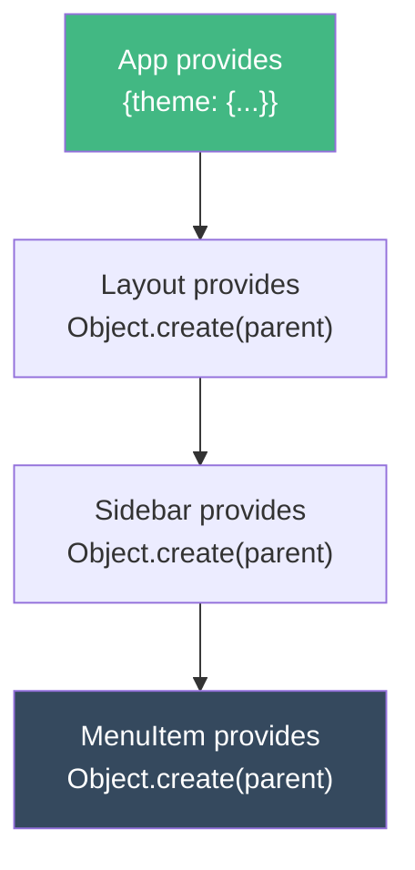
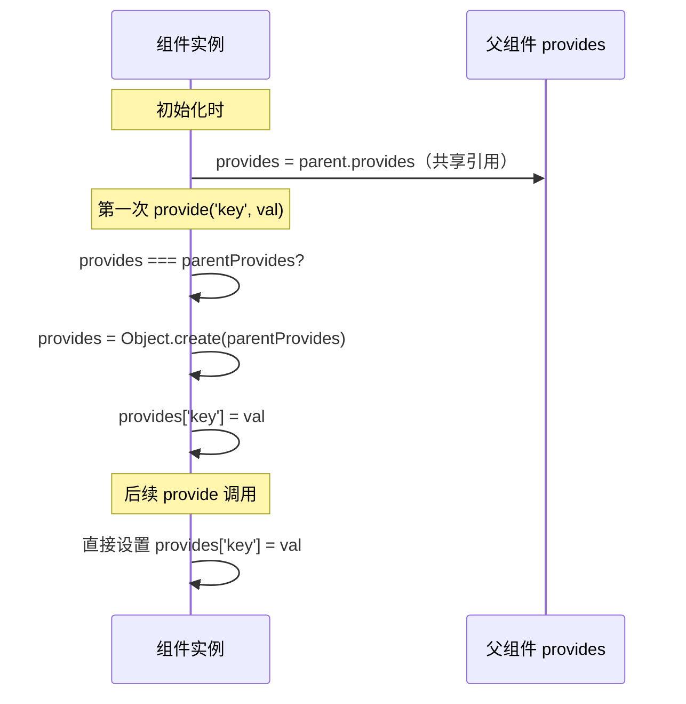
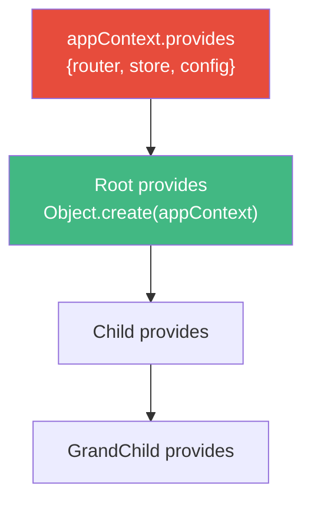
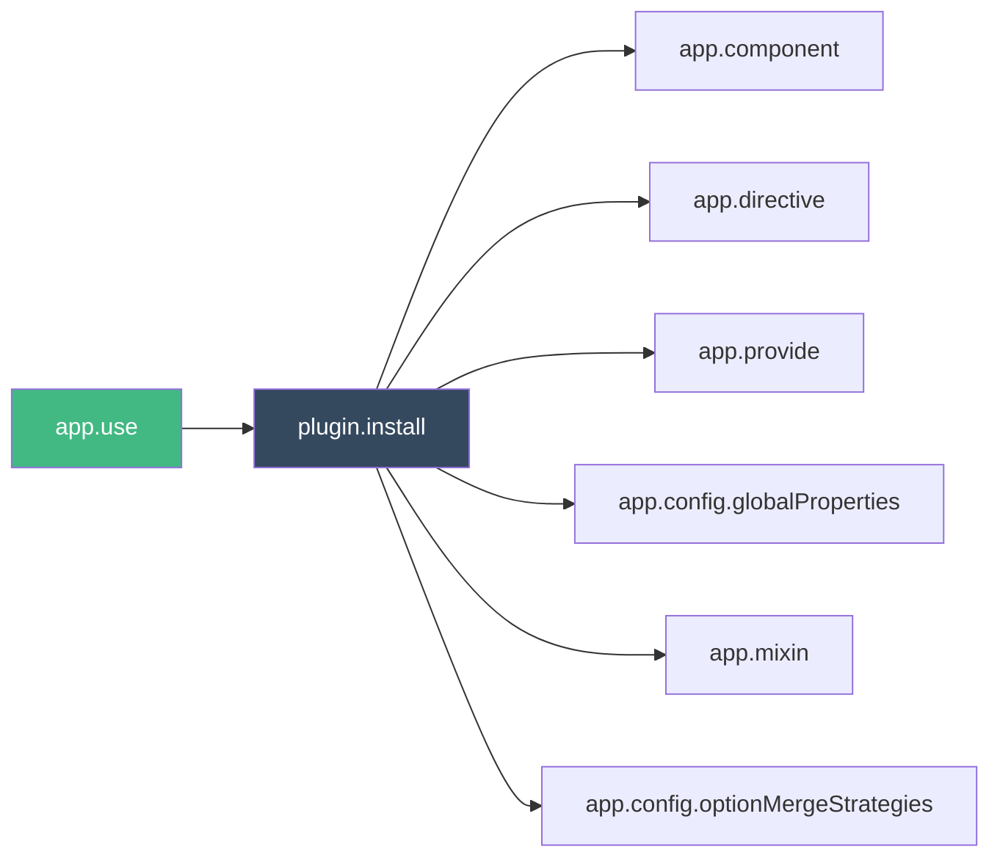

<div v-pre>

# 第 14 章 依赖注入与插件系统

> **本章要点**
>
> - provide/inject 的本质：基于原型链的依赖传递机制
> - 依赖注入的解析过程：从当前组件沿 parent 链向上查找
> - InjectionKey 的类型安全设计：Symbol + 泛型的巧妙结合
> - app.provide 的全局注入：应用级别的依赖如何注入到每一个组件
> - 插件系统的设计哲学：app.use() 如何组织第三方扩展
> - 插件的安装机制：install 函数与重复安装检测
> - 依赖注入在大型应用中的架构价值：替代 props drilling 的优雅方案

---

依赖注入是 Vue 中最容易被低估的特性之一。很多开发者只在"跨层级传递数据"时才想到 `provide/inject`，却忽略了它在架构层面的深远意义——它是 Vue 插件系统的基石，是组合式函数共享状态的关键通道，也是 Pinia、Vue Router 等官方库与组件树交互的核心机制。

在前面的章节中，我们深入了解了组件系统的实例化过程和生命周期。本章将揭开组件间数据流动的另一条路径——不是自上而下的 props，也不是自下而上的 emit，而是"穿越"组件层级的依赖注入。

## 14.1 provide/inject 的基本模型

### 从问题出发

考虑一个典型的场景：一个主题系统需要将主题配置从根组件传递到任意深度的子组件。

```typescript
// 使用 props drilling —— 痛苦的方式
// App → Layout → Sidebar → Menu → MenuItem → Icon
// 每一层都要声明和传递 theme prop
```

`provide/inject` 提供了更优雅的方案：

```typescript
// 祖先组件
const app = {
  setup() {
    const theme = reactive({ mode: 'dark', primary: '#42b883' })
    provide('theme', theme)
  }
}

// 任意深度的后代组件
const DeepChild = {
  setup() {
    const theme = inject('theme')
    // 直接使用，无需中间组件传递
  }
}
```

看起来像是"魔法"——数据怎么就"穿越"了中间的组件层级？答案藏在 JavaScript 最基础的机制中。

### 原型链：依赖注入的底层引擎

Vue 的 provide/inject 底层使用了**原型链继承**。每个组件实例都有一个 `provides` 对象，子组件的 `provides` 的原型指向父组件的 `provides`：



当 `MenuItem` 调用 `inject('theme')` 时，JavaScript 引擎沿原型链向上查找，天然地实现了"跨层级查找"。这个设计的精妙之处在于：

1. **查找是 O(1) 到 O(n) 的**：n 是组件嵌套深度，但实际上 JavaScript 引擎对原型链查找做了高度优化
2. **中间组件零开销**：不需要声明 props，不需要转发数据
3. **同名覆盖**：中间组件可以 provide 同名 key，自然地"遮蔽"祖先的值——就像作用域链中的变量遮蔽

## 14.2 provide 的实现

### 源码解析

```typescript
// packages/runtime-core/src/apiInject.ts
export function provide<T, K = InjectionKey<T> | string | number>(
  key: K,
  value: K extends InjectionKey<infer V> ? V : T
): void {
  if (!currentInstance) {
    if (__DEV__) {
      warn(`provide() can only be used inside setup().`)
    }
  } else {
    let provides = currentInstance.provides

    // 关键：检查当前组件是否已经"分叉"了 provides 对象
    const parentProvides =
      currentInstance.parent && currentInstance.parent.provides

    if (parentProvides === provides) {
      // 第一次在当前组件调用 provide 时
      // 创建一个以父组件 provides 为原型的新对象
      provides = currentInstance.provides = Object.create(parentProvides)
    }

    provides[key as string] = value
  }
}
```

这段代码的核心逻辑只有几行，但设计极为精巧：

**延迟分叉（Lazy Fork）策略**：组件实例初始化时，`provides` 直接指向父组件的 `provides`（共享引用）。只有当组件**第一次调用 provide** 时，才通过 `Object.create()` 创建新对象。这意味着：

- 不调用 provide 的组件：零内存开销（共享父对象引用）
- 调用 provide 的组件：只创建一个浅层对象，自身提供的值存在自身对象上，祖先的值通过原型链访问



### 类型安全的 InjectionKey

Vue 3 提供了 `InjectionKey` 类型，让 provide/inject 在 TypeScript 中获得完整的类型推导：

```typescript
// 定义类型安全的 key
import { InjectionKey } from 'vue'

interface UserService {
  currentUser: Ref<User | null>
  login(credentials: Credentials): Promise<void>
  logout(): void
}

// Symbol 保证全局唯一，泛型参数携带类型信息
export const UserServiceKey: InjectionKey<UserService> = Symbol('UserService')

// provide 时，值必须匹配类型
provide(UserServiceKey, {
  currentUser: ref(null),
  login: async (cred) => { /* ... */ },
  logout: () => { /* ... */ }
})

// inject 时，自动推导类型为 UserService | undefined
const userService = inject(UserServiceKey)
// userService?.currentUser.value  ✓ 类型安全
```

`InjectionKey` 的定义极其简洁：

```typescript
export interface InjectionKey<T> extends Symbol {}
```

它本质上就是一个带泛型标记的 Symbol。类型信息只存在于编译时，运行时没有任何开销。这是 TypeScript "零成本抽象"的典型应用。

## 14.3 inject 的实现

### 源码解析

```typescript
export function inject<T>(key: InjectionKey<T> | string): T | undefined
export function inject<T>(key: InjectionKey<T> | string, defaultValue: T): T
export function inject<T>(
  key: InjectionKey<T> | string,
  defaultValue: T | (() => T),
  treatDefaultAsFactory?: boolean
): T

export function inject(
  key: InjectionKey<any> | string,
  defaultValue?: unknown,
  treatDefaultAsFactory = false
) {
  // 支持在 setup() 和函数式组件中使用
  const instance = currentInstance || currentRenderingInstance

  if (instance || currentApp) {
    // 确定从哪里开始查找
    const provides = currentApp
      ? currentApp._context.provides
      : instance!.parent == null
        ? instance!.vnode.appContext && instance!.vnode.appContext.provides
        : instance!.parent.provides

    if (provides && (key as string | symbol) in provides) {
      return provides[key as string]
    } else if (arguments.length > 1) {
      // 有默认值
      return treatDefaultAsFactory && isFunction(defaultValue)
        ? defaultValue.call(instance && instance.proxy)
        : defaultValue
    } else if (__DEV__) {
      warn(`injection "${String(key)}" not found.`)
    }
  }
}
```

几个值得注意的设计决策：

**1. 从父组件开始查找**

```typescript
const provides = instance!.parent == null
  ? instance!.vnode.appContext && instance!.vnode.appContext.provides
  : instance!.parent.provides
```

inject 从 `parent.provides` 开始查找，而不是从自身的 `provides`。这意味着**组件不能 inject 自己 provide 的值**。这是故意的设计——避免循环依赖。

**2. 根组件的特殊处理**

根组件没有 parent，所以 inject 查找的是 `appContext.provides`——也就是通过 `app.provide()` 注册的全局依赖。

**3. 工厂函数默认值**

```typescript
// 每次 inject 都创建新实例
const service = inject(ServiceKey, () => new ExpensiveService(), true)
```

第三个参数 `treatDefaultAsFactory` 允许传入工厂函数作为默认值。这在默认值创建开销较大时特别有用——只有在真正需要默认值时才执行工厂函数。

### in 操作符与原型链

注意查找时使用的是 `in` 操作符：

```typescript
if (provides && (key as string | symbol) in provides) {
  return provides[key as string]
}
```

`in` 操作符会沿原型链查找，所以即使当前 `provides` 对象上没有这个 key，只要祖先链上某个 `provides` 有，就能找到。而直接用方括号访问 `provides[key]` 取值时，同样会沿原型链取到正确的值。

## 14.4 app.provide：全局依赖注入

### 应用级 provide

```typescript
const app = createApp(App)

// 全局 provide —— 所有组件都能 inject
app.provide('globalConfig', { apiBase: '/api/v1' })
app.provide(RouterKey, router)
app.provide(StoreKey, store)
```

应用级 provide 的实现在 `createAppAPI` 中：

```typescript
// packages/runtime-core/src/apiCreateApp.ts
provide(key, value) {
  if (__DEV__ && (key as string | symbol) in context.provides) {
    warn(`App already provides property with key "${String(key)}".`)
  }
  context.provides[key as string | symbol] = value
  return app
}
```

`context.provides` 就是应用上下文的 provides 对象。根组件初始化时，它的 `provides` 会以这个对象为起点：

```typescript
// 组件实例初始化
instance.provides = parent
  ? parent.provides
  : Object.create(appContext.provides)
```

所以全局 provide 的值自然地成为了整棵组件树原型链的"最顶层"。

### 全局 provide 与根组件 provide 的关系



根组件通过 `Object.create(appContext.provides)` 继承全局依赖，子组件再通过同样的机制继承根组件的依赖。层层嵌套，形成完整的依赖链。

## 14.5 依赖注入的响应性

### 响应式值的传递

provide/inject 传递的是**值的引用**，不会自动创建响应式包装：

```typescript
// 祖先组件
setup() {
  const count = ref(0)

  // ✅ 传递 ref —— 后代组件拿到的是同一个 ref
  provide('count', count)

  // ❌ 传递 .value —— 后代只拿到初始值，不会响应更新
  provide('count', count.value) // 传递了数字 0
}

// 后代组件
setup() {
  const count = inject('count') // Ref<number>
  // count.value 会随祖先的修改而变化
}
```

### readonly 保护

为了防止后代组件意外修改祖先的状态，推荐使用 `readonly` 包装：

```typescript
// 祖先组件
setup() {
  const state = reactive({ count: 0 })

  provide('state', readonly(state))
  provide('increment', () => state.count++)

  // 后代只能读取 state，只能通过提供的方法修改
}
```

这构成了一个类似 Flux 的单向数据流：状态只读，修改必须通过显式的函数调用。这个模式在 Pinia 等状态管理库中被广泛使用。

## 14.6 插件系统

### app.use() 的实现

Vue 的插件系统通过 `app.use()` 实现，其源码简洁而完整：

```typescript
// packages/runtime-core/src/apiCreateApp.ts
use(plugin: Plugin, ...options: any[]) {
  if (installedPlugins.has(plugin)) {
    __DEV__ && warn(`Plugin has already been applied to target app.`)
  } else if (plugin && isFunction(plugin.install)) {
    installedPlugins.add(plugin)
    plugin.install(app, ...options)
  } else if (isFunction(plugin)) {
    installedPlugins.add(plugin)
    plugin(app, ...options)
  } else if (__DEV__) {
    warn(
      `A plugin must either be a function or an object with an "install" function.`
    )
  }
  return app
}
```

核心逻辑：

1. **重复安装检测**：用 `Set` 记录已安装的插件，防止重复安装
2. **两种插件形式**：对象（有 `install` 方法）或函数（直接作为 install）
3. **链式调用**：返回 `app` 支持 `app.use(A).use(B).use(C)`

### 插件的类型定义

```typescript
export type Plugin<Options extends any[] = any[]> =
  | (PluginInstallFunction<Options> & {
      install?: PluginInstallFunction<Options>
    })
  | {
      install: PluginInstallFunction<Options>
    }

type PluginInstallFunction<Options extends any[]> = Options extends [infer E, ...infer Rest]
  ? (app: App, option: E, ...rest: Rest) => any
  : (app: App) => any
```

TypeScript 的条件类型确保了 `app.use(plugin, option)` 中 `option` 的类型与插件声明的选项类型一致。

### 插件能做什么

一个插件通过 `app` 参数可以访问 Vue 应用的所有扩展点：

```typescript
const MyPlugin: Plugin = {
  install(app, options) {
    // 1. 注册全局组件
    app.component('MyButton', MyButton)

    // 2. 注册全局指令
    app.directive('focus', {
      mounted(el) { el.focus() }
    })

    // 3. 全局依赖注入
    app.provide(MyPluginKey, createPluginInstance(options))

    // 4. 全局属性（Options API 中通过 this 访问）
    app.config.globalProperties.$myMethod = () => { /* ... */ }

    // 5. 全局 mixin（不推荐，但仍支持）
    app.mixin({ /* ... */ })

    // 6. 自定义选项合并策略
    app.config.optionMergeStrategies.customOption = (parent, child) => {
      return child ?? parent
    }
  }
}
```



## 14.7 插件与依赖注入的协作模式

### 典型模式：创建→提供→使用

几乎所有 Vue 生态的重要库都遵循相同的模式：

```typescript
// 第一步：创建实例
const router = createRouter({ /* ... */ })
const pinia = createPinia()

// 第二步：通过插件安装，内部使用 app.provide
app.use(router)  // router.install → app.provide(routerKey, router)
app.use(pinia)   // pinia.install → app.provide(piniaKey, pinia)

// 第三步：在组件中通过组合式函数 inject
const router = useRouter()   // 内部调用 inject(routerKey)
const store = useCounterStore() // 内部调用 inject(piniaKey)
```

这个"创建→注入→使用"三段式是 Vue 生态的标准模式。`useXxx` 组合式函数的内部几乎都是 `inject` 的封装：

```typescript
// Vue Router 的 useRouter
export function useRouter(): Router {
  return inject(routerKey) as Router
}

// Pinia 的内部实现（简化）
export function useStore(id: string) {
  const pinia = inject(piniaSymbol)!
  if (!pinia._s.has(id)) {
    // 创建 store ...
  }
  return pinia._s.get(id)!
}
```

### 设计一个完整的插件

以一个国际化插件为例，展示完整的插件设计：

```typescript
// types.ts
import type { InjectionKey, Ref } from 'vue'

interface I18n {
  locale: Ref<string>
  t: (key: string, params?: Record<string, string>) => string
  setLocale: (locale: string) => Promise<void>
}

export const I18nKey: InjectionKey<I18n> = Symbol('i18n')

// plugin.ts
import { ref, Plugin } from 'vue'
import { I18nKey, type I18n } from './types'

interface I18nOptions {
  defaultLocale: string
  messages: Record<string, Record<string, string>>
  loadLocale?: (locale: string) => Promise<Record<string, string>>
}

export function createI18n(options: I18nOptions): I18n & { install: Plugin['install'] } {
  const locale = ref(options.defaultLocale)
  const messages = reactive(new Map(Object.entries(options.messages)))

  function t(key: string, params?: Record<string, string>): string {
    const msg = messages.get(locale.value)?.[key] ?? key
    if (!params) return msg
    return msg.replace(/\{(\w+)\}/g, (_, k) => params[k] ?? `{${k}}`)
  }

  async function setLocale(newLocale: string) {
    if (!messages.has(newLocale) && options.loadLocale) {
      const loaded = await options.loadLocale(newLocale)
      messages.set(newLocale, loaded)
    }
    locale.value = newLocale
  }

  const i18n: I18n = { locale, t, setLocale }

  return {
    ...i18n,
    install(app) {
      // 依赖注入：组合式 API 通过 inject 使用
      app.provide(I18nKey, i18n)
      // 全局属性：Options API 通过 this.$t 使用
      app.config.globalProperties.$t = t
      app.config.globalProperties.$i18n = i18n
    }
  }
}

// 组合式函数
export function useI18n(): I18n {
  const i18n = inject(I18nKey)
  if (!i18n) {
    throw new Error('useI18n() requires i18n plugin to be installed')
  }
  return i18n
}
```

使用时：

```typescript
// main.ts
const i18n = createI18n({
  defaultLocale: 'zh-CN',
  messages: {
    'zh-CN': { greeting: '你好，{name}！' },
    'en': { greeting: 'Hello, {name}!' }
  },
  loadLocale: (locale) => import(`./locales/${locale}.json`)
})

app.use(i18n)

// 组件中
setup() {
  const { t, locale, setLocale } = useI18n()
  return { t, locale, setLocale }
}
```

## 14.8 多应用实例与依赖隔离

### createApp 的隔离性

Vue 3 支持同一页面上运行多个 Vue 应用实例，每个实例有独立的依赖上下文：

```typescript
const app1 = createApp(App1)
const app2 = createApp(App2)

app1.provide('config', { theme: 'dark' })
app2.provide('config', { theme: 'light' })

app1.mount('#app1')
app2.mount('#app2')
// 两个应用的组件 inject('config') 得到不同的值
```

这种隔离性来自每个 app 都有独立的 `AppContext`：

```typescript
export function createAppContext(): AppContext {
  return {
    app: null as any,
    config: { /* ... */ },
    mixins: [],
    components: {},
    directives: {},
    provides: Object.create(null),  // 每个 app 独立的 provides
    // ...
  }
}
```

`Object.create(null)` 创建的纯净对象作为 provides 链的起点，确保不同 app 实例之间完全隔离。这对微前端架构至关重要。

## 14.9 依赖注入的高级模式

### 条件注入与可选依赖

```typescript
// 带默认值的注入 —— 组件可以独立工作，也可以集成到更大的系统中
function useTheme() {
  const injected = inject(ThemeKey, null)

  if (injected) {
    // 集成模式：使用上层提供的主题
    return injected
  }

  // 独立模式：使用本地状态
  const localTheme = reactive({
    mode: 'light' as 'light' | 'dark',
    toggle() { this.mode = this.mode === 'light' ? 'dark' : 'light' }
  })
  return localTheme
}
```

### 分层注入

```typescript
// 应用层
app.provide(LoggerKey, new Logger({ level: 'warn' }))

// 模块层 —— 覆盖应用层的 logger
const AdminModule = {
  setup() {
    provide(LoggerKey, new Logger({ level: 'debug', prefix: '[Admin]' }))
    // Admin 模块下的所有组件使用 debug 级别日志
  }
}

// 组件层
const AdminPanel = {
  setup() {
    const logger = inject(LoggerKey)!
    // 拿到的是 Admin 模块的 logger（debug 级别）
    // 而不是应用层的 logger（warn 级别）
  }
}
```

这正是原型链遮蔽的天然效果——近者优先。

### hasInjectionContext：安全检测

Vue 3.3 引入了 `hasInjectionContext()` 工具函数：

```typescript
import { hasInjectionContext, inject } from 'vue'

function useFeature() {
  if (hasInjectionContext()) {
    // 在 Vue 组件的 setup 中调用，可以安全地使用 inject
    const config = inject(ConfigKey)
    return createFeature(config)
  }

  // 在 Vue 组件外部调用（如纯工具函数）
  return createFeature(defaultConfig)
}
```

其实现非常简单：

```typescript
export function hasInjectionContext(): boolean {
  return !!(currentInstance || currentRenderingInstance || currentApp)
}
```

但这个小函数解决了组合式函数的一个大问题：让同一个函数既可以在 Vue 组件内使用（享受依赖注入），也可以在组件外使用（使用默认配置）。

## 14.10 性能考量

### 原型链深度

理论上，组件嵌套越深，`inject` 的查找路径越长。但实际上：

1. **JavaScript 引擎优化**：V8 等引擎对原型链查找有内联缓存（Inline Cache）优化，热路径上的查找接近 O(1)
2. **查找发生在 setup 阶段**：组件的 `setup()` 只执行一次，inject 的结果会被缓存在局部变量中
3. **不影响更新性能**：inject 返回的是引用（ref/reactive），后续的响应式更新走的是响应系统的路径，不再需要原型链查找

### 内存开销

```
每个调用了 provide 的组件：一个浅层对象（Object.create(parent)）
没有调用 provide 的组件：零开销（共享父对象引用）
```

在一个 1000 个组件的页面中，如果只有 10 个组件调用了 provide，那么只会创建 10 个额外的对象。这个开销可以忽略不计。

## 14.11 小结

本章深入解析了 Vue 的依赖注入与插件系统，核心要点：

| 机制 | 关键实现 | 设计理念 |
|------|---------|---------|
| provide | Object.create(parent.provides) | 延迟分叉，零成本继承 |
| inject | in 操作符 + 原型链查找 | 复用语言原生机制 |
| InjectionKey | Symbol + 泛型 | 零成本类型安全 |
| app.provide | appContext.provides | 全局依赖的起点 |
| app.use | installedPlugins Set | 幂等安装，链式调用 |
| 插件模式 | create → use → inject | Vue 生态的标准三段式 |

依赖注入看似简单，但它是 Vue 整个生态系统的"神经网络"——Pinia 通过它传递 store，Router 通过它传递路由实例，所有组合式函数通过它共享跨组件状态。在接下来的两章中，我们将看到 Pinia 和 Vue Router 如何在这套机制之上构建复杂而强大的功能。

## 思考题

1. 如果在同一个组件的 setup 中先 provide 再 inject 同一个 key，能拿到自己提供的值吗？为什么？请从源码角度解释。

2. 为什么 Vue 选择原型链而不是手动的 while 循环向上查找？两种方案在性能和语义上有什么差异？

3. 设计一个支持"作用域销毁"的依赖注入方案：当提供依赖的组件卸载时，自动清理相关资源。你会如何利用现有的 provide/inject 和生命周期钩子来实现？

4. 在微前端场景下，多个 Vue 应用实例共享同一页面。如果需要在不同应用间共享某些依赖（如用户认证状态），你会如何设计？直接使用 provide/inject 可行吗？

</div>
