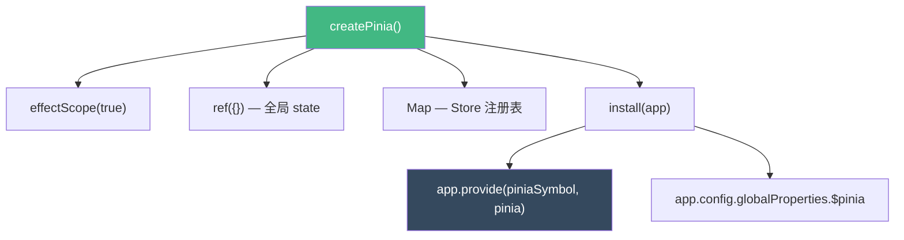
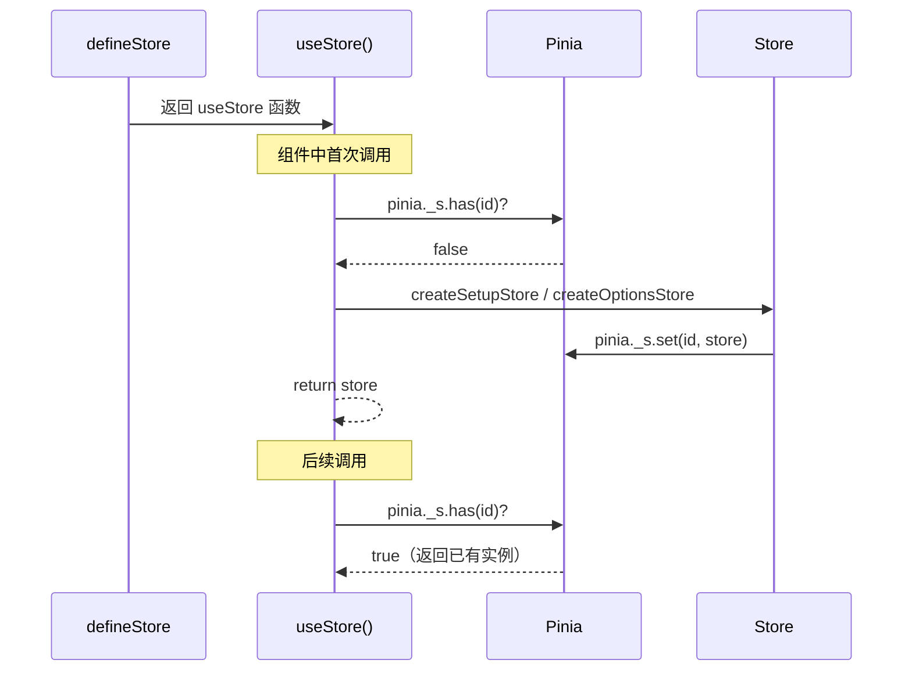
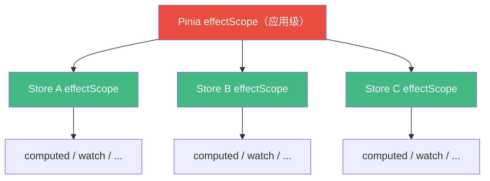

<div v-pre>

# 第 15 章 状态管理：Pinia 内核

> **本章要点**
>
> - Pinia 的架构哲学：从 Vuex 的 mutation/action/getter 简化为 state/action/getter
> - createPinia 的实现：一个 effectScope + 一个 reactive Map 构成的轻量容器
> - defineStore 的两种风格：Options Store 与 Setup Store 的内部统一
> - Store 的创建与激活：延迟初始化、单例保证与 Pinia 实例绑定
> - 响应式状态管理：$patch 的智能合并与批量更新优化
> - Store 间的交互：如何在一个 Store 中使用另一个 Store
> - SSR 状态序列化：服务端如何注入初始状态到客户端
> - Pinia 插件系统：扩展每个 Store 的能力

---

如果说依赖注入是 Vue 生态的"神经网络"，那么 Pinia 就是建立在这个网络之上的"大脑"。作为 Vue 官方推荐的状态管理库，Pinia 用不到 2000 行核心代码实现了一个类型安全、支持 SSR、可扩展的全局状态方案。

Vuex 曾是 Vue 2 时代的标配，但它的 mutation 机制饱受争议——mutation 和 action 的边界模糊，mutation 必须同步的限制常常被开发者绕过。Pinia 的回答是：**去掉 mutation，让 action 统一处理所有状态变更**。这不是简化，而是认识到 mutation 这层抽象并没有带来足够的价值。

## 15.1 createPinia：状态容器的诞生

### 源码解析

```typescript
// packages/pinia/src/createPinia.ts
export function createPinia(): Pinia {
  const scope = effectScope(true)

  const state = scope.run<Ref<Record<string, StateTree>>>(() =>
    ref<Record<string, StateTree>>({})
  )!

  let _p: Pinia['_p'] = []
  let toBeInstalled: PiniaPlugin[] = []

  const pinia: Pinia = markRaw({
    install(app: App) {
      setActivePinia(pinia)
      pinia._a = app
      app.provide(piniaSymbol, pinia)
      app.config.globalProperties.$pinia = pinia

      toBeInstalled.forEach(plugin => _p.push(plugin))
      toBeInstalled = []
    },

    use(plugin) {
      if (!this._a) {
        toBeInstalled.push(plugin)
      } else {
        _p.push(plugin)
      }
      return this
    },

    _p,
    _a: null,
    _e: scope,
    _s: new Map<string, StoreGeneric>(),
    state,
  })

  return pinia
}
```

这段代码信息量极大，逐层拆解：

**effectScope(true)：独立的副作用作用域**

```typescript
const scope = effectScope(true)
```

`effectScope(true)` 创建一个**分离的**（detached）作用域。`true` 参数意味着这个作用域不会被父作用域（组件的 setup）收集。为什么？因为 Pinia 的生命周期是应用级的，不应该跟随任何组件的卸载而销毁。

**state：全局状态树**

```typescript
const state = scope.run(() => ref({}))
```

所有 Store 的状态都存放在这个单一的 `ref` 中。key 是 Store 的 id，value 是该 Store 的 state。这使得：

- **DevTools 集成**：一个入口就能看到所有状态
- **SSR 序列化**：`JSON.stringify(pinia.state.value)` 即可导出所有状态
- **时间旅行调试**：替换整个 state 就能回到任意时间点

**_s：Store 实例注册表**

```typescript
_s: new Map<string, StoreGeneric>()
```

所有已创建的 Store 实例都注册在这里。这保证了 Store 的**单例语义**——同一个 id 的 Store 只会创建一次。



### markRaw 的妙用

```typescript
const pinia: Pinia = markRaw({ ... })
```

Pinia 实例被 `markRaw` 标记为永不响应式。为什么？因为 Pinia 对象本身不需要被追踪——它是一个容器，不是状态。如果 Pinia 对象变成响应式的，它内部的 `_s`（Map）、`_p`（插件数组）等都会被深度代理，造成不必要的性能开销。

## 15.2 defineStore：两种风格，一种内核

### Options Store

```typescript
export const useCounterStore = defineStore('counter', {
  state: () => ({
    count: 0,
    name: 'Counter'
  }),
  getters: {
    doubleCount: (state) => state.count * 2
  },
  actions: {
    increment() {
      this.count++
    }
  }
})
```

### Setup Store

```typescript
export const useCounterStore = defineStore('counter', () => {
  const count = ref(0)
  const name = ref('Counter')
  const doubleCount = computed(() => count.value * 2)

  function increment() {
    count.value++
  }

  return { count, name, doubleCount, increment }
})
```

两种写法产生完全一样的 Store。但内部实现路径不同——Options Store 会被转换为等价的 Setup Store。

### defineStore 的实现

```typescript
export function defineStore(
  idOrOptions: any,
  setup?: any,
  setupOptions?: any
): StoreDefinition {
  let id: string
  let options: DefineStoreOptions | DefineSetupStoreOptions

  // 重载解析
  const isSetupStore = typeof setup === 'function'
  if (typeof idOrOptions === 'string') {
    id = idOrOptions
    options = isSetupStore ? setupOptions : setup
  } else {
    options = idOrOptions
    id = idOrOptions.id
  }

  function useStore(pinia?: Pinia | null, hot?: StoreGeneric): StoreGeneric {
    // 获取当前组件实例
    const hasContext = hasInjectionContext()
    pinia = pinia || (hasContext ? inject(piniaSymbol, null) : null)

    if (pinia) setActivePinia(pinia)
    pinia = activePinia!

    // 单例检查
    if (!pinia._s.has(id)) {
      // 首次使用，创建 Store
      if (isSetupStore) {
        createSetupStore(id, setup, options, pinia)
      } else {
        createOptionsStore(id, options as any, pinia)
      }
    }

    const store: StoreGeneric = pinia._s.get(id)!
    return store as any
  }

  useStore.$id = id
  return useStore as any
}
```

注意 `defineStore` 返回的不是 Store 本身，而是一个 `useStore` 函数。Store 的创建是**延迟的**——只有在组件中第一次调用 `useStore()` 时才会真正创建。



## 15.3 createOptionsStore：Options 到 Setup 的转换

```typescript
function createOptionsStore<Id extends string>(
  id: Id,
  options: DefineStoreOptions<Id, any, any, any>,
  pinia: Pinia
): Store<Id> {
  const { state, actions, getters } = options

  const initialState: StateTree | undefined = pinia.state.value[id]

  let store: Store<Id>

  function setup() {
    if (!initialState) {
      // 首次创建
      pinia.state.value[id] = state ? state() : {}
    }
    // 将 state 的每个属性转换为 ref（toRefs 保持响应性连接）
    const localState = toRefs(pinia.state.value[id])

    return Object.assign(
      localState,
      actions,
      // 将 getters 转换为 computed
      Object.keys(getters || {}).reduce((computedGetters, name) => {
        computedGetters[name] = markRaw(
          computed(() => {
            setActivePinia(pinia)
            const store = pinia._s.get(id)!
            return getters![name].call(store, store)
          })
        )
        return computedGetters
      }, {} as Record<string, ComputedRef>)
    )
  }

  store = createSetupStore(id, setup, options, pinia, true)

  return store as any
}
```

转换规则清晰：

| Options Store | → | Setup Store |
|:---|:---:|:---|
| `state()` 返回值 | → | `toRefs(pinia.state.value[id])` |
| `getters.xxx(state)` | → | `computed(() => getter(store))` |
| `actions.xxx()` | → | 直接保留（this 绑定到 store） |

这就是为什么 Pinia 文档说"Options Store 只是 Setup Store 的语法糖"。

## 15.4 createSetupStore：Store 的真正诞生地

这是 Pinia 中最复杂的函数，约 400 行代码。我们分段解析核心逻辑：

### 第一步：在 effectScope 中运行 setup

```typescript
function createSetupStore<Id extends string>(
  $id: Id,
  setup: () => any,
  options: any,
  pinia: Pinia,
  isOptionsAPI?: boolean
): Store<Id> {
  let scope!: EffectScope

  const setupStore = pinia._e.run(() => {
    scope = effectScope()
    return scope.run(() => setup())
  })!
  // ...
}
```

双层 effectScope：外层是 Pinia 的全局作用域（`pinia._e`），内层是这个 Store 自己的作用域。当 Store 被 `$dispose()` 时，只需停止内层作用域，不影响其他 Store。

### 第二步：分类 setup 的返回值

```typescript
for (const key in setupStore) {
  const prop = setupStore[key]

  if ((isRef(prop) && !isComputed(prop)) || isReactive(prop)) {
    // 是 ref 或 reactive → 它是 state
    if (!isOptionsAPI) {
      pinia.state.value[$id][key] = prop
    }
  } else if (typeof prop === 'function') {
    // 是函数 → 它是 action
    const actionValue = wrapAction(key, prop)
    setupStore[key] = actionValue
  }
  // computed 既不是 state 也不是 action → 它是 getter
}
```

Pinia 通过**类型检测**自动分类 setup 返回的属性：

- `ref`（非 computed）或 `reactive` → **state**（参与序列化和 DevTools）
- `function` → **action**（被 wrapAction 包装以支持 $onAction）
- `computed` → **getter**（不做特殊处理，computed 本身就是响应式的）

### 第三步：wrapAction —— Action 的增强

```typescript
function wrapAction(name: string, action: (...args: any[]) => any) {
  return function (this: any, ...args: any[]) {
    setActivePinia(pinia)

    const afterCallbackList: Array<(resolvedReturn: any) => any> = []
    const onErrorCallbackList: Array<(error: unknown) => unknown> = []

    function after(callback: typeof afterCallbackList[0]) {
      afterCallbackList.push(callback)
    }
    function onError(callback: typeof onErrorCallbackList[0]) {
      onErrorCallbackList.push(callback)
    }

    // 触发 $onAction 订阅者
    triggerSubscriptions(actionSubscriptions, {
      args,
      name,
      store,
      after,
      onError,
    })

    let ret: any
    try {
      ret = action.apply(this && this.$id === $id ? this : store, args)
    } catch (error) {
      triggerSubscriptions(onErrorCallbackList, error)
      throw error
    }

    // 支持异步 action
    if (ret instanceof Promise) {
      return ret
        .then((value) => {
          triggerSubscriptions(afterCallbackList, value)
          return value
        })
        .catch((error) => {
          triggerSubscriptions(onErrorCallbackList, error)
          return Promise.reject(error)
        })
    }

    triggerSubscriptions(afterCallbackList, ret)
    return ret
  }
}
```

`wrapAction` 为每个 action 添加了 AOP（面向切面）能力：

```typescript
const unsubscribe = store.$onAction(({ name, args, after, onError }) => {
  const startTime = Date.now()
  console.log(`Action ${name} started with args:`, args)

  after((result) => {
    console.log(`Action ${name} finished in ${Date.now() - startTime}ms`)
  })

  onError((error) => {
    console.error(`Action ${name} failed:`, error)
  })
})
```

这对日志记录、性能监控、错误追踪等场景极为有用。

### 第四步：构建 Store 对象

```typescript
const partialStore = {
  _p: pinia,
  $id,
  $onAction: addSubscription.bind(null, actionSubscriptions),
  $patch,
  $reset,
  $subscribe(callback, options = {}) {
    const removeSubscription = addSubscription(
      subscriptions,
      callback,
      options.detached
    )
    const stopWatcher = scope.run(() =>
      watch(
        () => pinia.state.value[$id] as StateTree,
        (state) => {
          if (options.flush === 'sync' ? isSyncListening : isListening) {
            callback({ storeId: $id, type: MutationType.direct }, state)
          }
        },
        { deep: true, flush: options.flush || 'pre' }
      )
    )!

    return () => {
      removeSubscription()
      stopWatcher()
    }
  },
  $dispose() {
    scope.stop()
    subscriptions = []
    actionSubscriptions = []
    pinia._s.delete($id)
  },
}

const store: Store<Id> = reactive(partialStore) as unknown as Store<Id>
pinia._s.set($id, store as StoreGeneric)
```

Store 最终被 `reactive()` 包裹，这意味着：

1. **解构不丢失响应性**（对于 reactive 对象的属性，但 ref 类型的 state 解构后仍需 `.value`）
2. **模板中直接使用**无需 `.value`
3. 所有方法的 `this` 自动指向 store 本身

## 15.5 $patch：智能批量更新

### 对象形式

```typescript
store.$patch({
  count: store.count + 1,
  name: 'Updated'
})
```

### 函数形式

```typescript
store.$patch((state) => {
  state.items.push({ id: Date.now(), name: 'New Item' })
  state.count++
  state.hasChanged = true
})
```

### 实现解析

```typescript
function $patch(
  partialStateOrMutator: _DeepPartial<StateTree> | ((state: StateTree) => void)
): void {
  let subscriptionMutation: SubscriptionCallbackMutation<any>

  // 暂停 $subscribe 的触发（批量更新优化）
  isListening = false
  isSyncListening = false

  if (typeof partialStateOrMutator === 'function') {
    partialStateOrMutator(pinia.state.value[$id] as StateTree)
    subscriptionMutation = {
      type: MutationType.patchFunction,
      storeId: $id,
      events: debuggerEvents as DebuggerEvent[],
    }
  } else {
    // 深度合并
    mergeReactiveObjects(pinia.state.value[$id], partialStateOrMutator)
    subscriptionMutation = {
      type: MutationType.patchObject,
      storeId: $id,
      payload: partialStateOrMutator,
      events: debuggerEvents as DebuggerEvent[],
    }
  }

  // 恢复监听
  const myListenerId = (activeListener = Symbol())
  nextTick().then(() => {
    if (activeListener === myListenerId) {
      isListening = true
    }
  })
  isSyncListening = true

  // 手动触发一次 $subscribe 回调
  triggerSubscriptions(subscriptions, subscriptionMutation, pinia.state.value[$id])
}
```

关键优化：**暂停→变更→恢复→手动触发**。在 `$patch` 期间，所有 `$subscribe` 的 watcher 被暂停，避免多次属性修改触发多次回调。所有变更完成后，手动触发一次订阅回调。这是经典的"批量更新"模式。

## 15.6 storeToRefs：安全解构

直接解构 Store 会丢失响应性：

```typescript
const store = useCounterStore()
const { count } = store  // ❌ count 是普通数字，不是 ref
```

Pinia 提供 `storeToRefs` 解决这个问题：

```typescript
import { storeToRefs } from 'pinia'

const store = useCounterStore()
const { count, name } = storeToRefs(store) // ✅ count 和 name 是 ref
```

其实现原理：

```typescript
export function storeToRefs<SS extends StoreGeneric>(
  store: SS
): StoreToRefs<SS> {
  store = toRaw(store)

  const refs = {} as StoreToRefs<SS>
  for (const key in store) {
    const value = store[key]
    if (isRef(value) || isReactive(value)) {
      refs[key] = toRef(store, key) as any
    }
  }

  return refs
}
```

它遍历 Store 的所有属性，只保留 `ref` 和 `reactive` 类型（即 state 和 getter），跳过函数（action）。`toRef(store, key)` 创建的 ref 保持与原 Store 的响应性连接。

## 15.7 Store 间的交互

### 在 Action 中使用其他 Store

```typescript
const useAuthStore = defineStore('auth', () => {
  const user = ref<User | null>(null)
  const isLoggedIn = computed(() => user.value !== null)
  return { user, isLoggedIn }
})

const useCartStore = defineStore('cart', () => {
  const items = ref<CartItem[]>([])
  const authStore = useAuthStore() // ✅ 直接调用

  async function checkout() {
    if (!authStore.isLoggedIn) {
      throw new Error('Please login first')
    }
    // ...
  }

  return { items, checkout }
})
```

这是可行的，因为 `useStore` 内部通过 `activePinia` 找到 Pinia 实例，而不是依赖组件上下文。但需要注意**循环依赖**：如果 A Store 在顶层（setup 函数体中）使用 B Store，同时 B Store 也在顶层使用 A Store，就会导致无限循环。

解决方法是将跨 Store 调用放在 action 或 getter 内部（延迟执行）：

```typescript
const useA = defineStore('a', () => {
  const data = ref(0)

  function doSomething() {
    // ✅ 延迟调用，在 action 执行时 B 已经创建完毕
    const b = useB()
    b.otherAction()
  }

  return { data, doSomething }
})
```

## 15.8 Pinia 插件系统

### 插件接口

```typescript
pinia.use(({ store, app, pinia, options }) => {
  // store：当前 Store 实例
  // app：Vue 应用实例
  // pinia：Pinia 实例
  // options：defineStore 的原始选项
})
```

### 插件的调用时机

每当一个新的 Store 被创建时，所有已注册的插件都会被调用：

```typescript
// createSetupStore 内部
pinia._p.forEach((extender) => {
  const extensions = scope.run(() =>
    extender({ store, app: pinia._a, pinia, options })
  )

  if (extensions) {
    // 插件返回的对象会被合并到 store 中
    Object.assign(store, extensions)
    // 如果返回了 ref，也需要同步到 state
    Object.keys(extensions).forEach((key) => {
      if (isRef(extensions[key])) {
        pinia.state.value[$id][key] = extensions[key]
      }
    })
  }
})
```

### 实战：持久化插件

```typescript
function piniaPersistedState(options?: {
  key?: string
  storage?: Storage
  paths?: string[]
}): PiniaPlugin {
  const storage = options?.storage ?? localStorage

  return ({ store }) => {
    const storeKey = options?.key ?? store.$id

    // 恢复状态
    const savedState = storage.getItem(storeKey)
    if (savedState) {
      store.$patch(JSON.parse(savedState))
    }

    // 监听变化并持久化
    store.$subscribe((mutation, state) => {
      const toSave = options?.paths
        ? options.paths.reduce((acc, path) => {
            acc[path] = state[path]
            return acc
          }, {} as Record<string, any>)
        : state

      storage.setItem(storeKey, JSON.stringify(toSave))
    })
  }
}

// 使用
pinia.use(piniaPersistedState({ storage: sessionStorage }))
```

### 实战：日志插件

```typescript
function piniaLogger(): PiniaPlugin {
  return ({ store }) => {
    store.$onAction(({ name, args, after, onError }) => {
      const start = performance.now()
      console.group(`[Pinia] ${store.$id}.${name}`)
      console.log('Args:', args)

      after((result) => {
        console.log('Result:', result)
        console.log(`Duration: ${(performance.now() - start).toFixed(2)}ms`)
        console.groupEnd()
      })

      onError((error) => {
        console.error('Error:', error)
        console.groupEnd()
      })
    })
  }
}
```

## 15.9 SSR 状态序列化

Pinia 对 SSR 的支持极为简洁。核心思路：服务端渲染完成后，将 `pinia.state.value` 序列化到 HTML 中，客户端激活时恢复。

### 服务端

```typescript
// server.ts
const pinia = createPinia()
const app = createSSRApp(App)
app.use(pinia)

// 渲染应用（会触发 Store 的创建和数据获取）
const html = await renderToString(app)

// 序列化状态
const piniaState = JSON.stringify(pinia.state.value)
const fullHtml = html.replace(
  '</body>',
  `<script>window.__PINIA_STATE__=${piniaState}</script></body>`
)
```

### 客户端

```typescript
// client.ts
const pinia = createPinia()
const app = createApp(App)
app.use(pinia)

// 恢复状态
if (window.__PINIA_STATE__) {
  pinia.state.value = JSON.parse(window.__PINIA_STATE__)
}

app.mount('#app')
```

当 `pinia.state.value` 被直接赋值时，之后创建的 Store 会检查 `pinia.state.value[$id]` 是否已存在：

```typescript
// createOptionsStore 中
const initialState = pinia.state.value[$id]
if (!initialState) {
  pinia.state.value[$id] = state ? state() : {}
}
```

如果已存在（来自 SSR），就复用 SSR 的状态，跳过 `state()` 初始化。

## 15.10 与 Vue 响应系统的深度集成

### effectScope 的价值

Pinia 大量使用 effectScope 管理副作用：

```typescript
// Pinia 级别的 scope
const scope = effectScope(true)  // detached，不随组件销毁

// Store 级别的 scope
pinia._e.run(() => {
  scope = effectScope()
  return scope.run(() => setup())
})

// Store 销毁时
$dispose() {
  scope.stop()  // 停止所有 computed、watch 等副作用
}
```



### 为什么 Store 是 reactive 的

```typescript
const store = reactive(partialStore)
```

这个决定有深远影响：

1. **模板友好**：`{{ store.count }}` 无需 `.value`
2. **自动追踪**：在 computed/watch 中访问 `store.count` 自动建立依赖
3. **解构需谨慎**：`const { count } = store` 会丢失响应性（因此需要 `storeToRefs`）

## 15.11 小结

Pinia 的内核设计可以浓缩为一句话：**用最少的抽象层，最大限度地利用 Vue 已有的响应系统**。

| 机制 | 实现 | 设计理念 |
|------|------|---------|
| 状态容器 | effectScope + ref({}) | 复用 Vue 响应系统 |
| Store 单例 | Map + 延迟创建 | 按需初始化，零浪费 |
| Options → Setup | toRefs + computed 转换 | 统一内核，两种语法 |
| 批量更新 | $patch 暂停/恢复监听 | 减少不必要的触发 |
| Action 增强 | wrapAction + AOP 钩子 | 可观察的状态变更 |
| 插件系统 | 创建时遍历调用 | 每个 Store 独立扩展 |
| SSR | state 序列化/反序列化 | 利用全局 state 树 |

Pinia 证明了一个道理：好的库不是添加新概念，而是将已有概念组合到极致。它没有发明新的响应式原语，没有引入新的调度机制，只是将 `ref`、`reactive`、`computed`、`effectScope`、`provide/inject` 这些 Vue 核心 API 编排成了一个优雅的状态管理方案。

## 思考题

1. 为什么 Pinia 选择 `effectScope(true)`（detached）而不是普通的 effectScope？如果使用非 detached 的 scope，会发生什么？

2. `storeToRefs` 返回的 ref 与直接在 Store 中定义的 ref 是同一个对象吗？修改 `storeToRefs` 返回的值会影响 Store 吗？请设计实验验证。

3. 在一个大型应用中，有 50 个 Store，但首屏只用到其中 5 个。Pinia 的延迟初始化策略如何帮助优化首屏性能？如果改为"启动时全部初始化"，会有多大的性能差异？

4. 设计一个 Pinia 插件，实现"乐观更新"功能：action 执行前先更新 UI，如果 action 失败则自动回滚到之前的状态。

</div>
