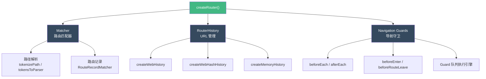
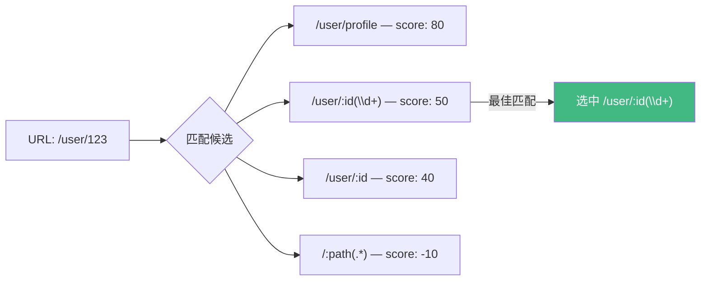
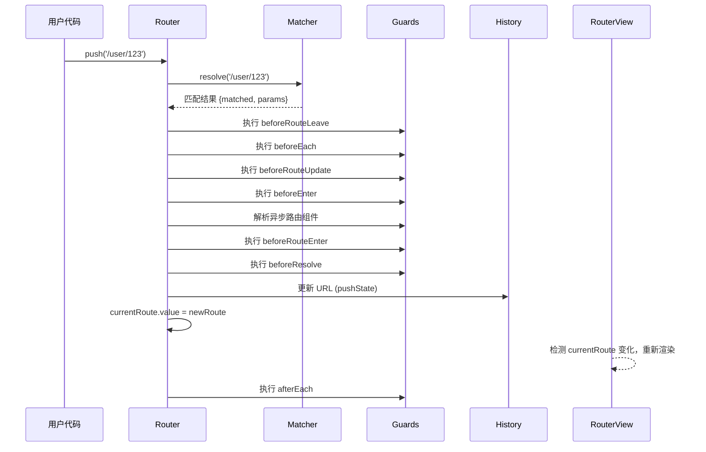
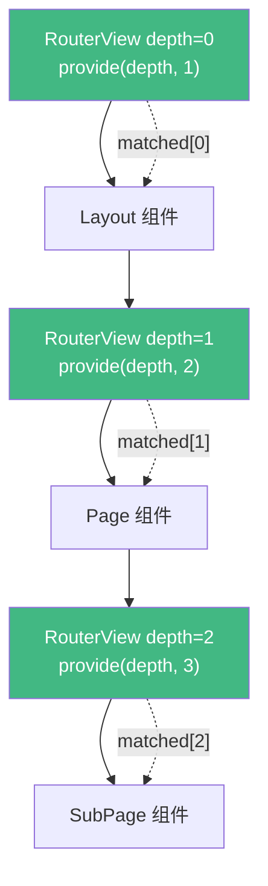

<div v-pre>

# 第 16 章 Vue Router 内核

> **本章要点**
>
> - 路由的本质：URL 与组件树的映射关系
> - createRouter 的架构：matcher（路由匹配）+ history（URL 管理）+ 导航守卫的三位一体
> - 路由匹配器：如何将 `/user/:id/posts` 这样的路径模式编译为高效的正则表达式
> - History 模式的实现差异：createWebHistory vs createWebHashHistory vs createMemoryHistory
> - 导航解析的完整流程：从 router.push 到组件渲染的 17 个步骤
> - 导航守卫的洋葱模型：beforeEach → beforeRouteUpdate → beforeEnter → beforeRouteEnter → afterEach
> - RouterView 的实现：如何利用 provide/inject 实现嵌套路由
> - 路由懒加载与代码分割的底层机制

---

URL 是 Web 应用的"灵魂"。用户分享链接、浏览器前进后退、SEO 爬虫抓取——所有这些都依赖于 URL 与应用状态的正确映射。Vue Router 就是管理这种映射关系的核心库。

表面上看，路由只是"URL 变了就渲染对应组件"。但深入内核你会发现，这背后涉及路径模式的编译与匹配、浏览器 History API 的封装、异步导航守卫的流程控制、嵌套路由的组件协调等一系列精密的工程实现。

## 16.1 整体架构

Vue Router 4 的核心由三个模块组成：



### createRouter 的入口

```typescript
export function createRouter(options: RouterOptions): Router {
  // 1. 创建匹配器
  const matcher = createRouterMatcher(options.routes, options)

  // 2. 获取 history 实现
  const routerHistory = options.history

  // 3. 导航守卫数组
  const beforeGuards = useCallbacks<NavigationGuardWithThis<undefined>>()
  const beforeResolveGuards = useCallbacks<NavigationGuardWithThis<undefined>>()
  const afterGuards = useCallbacks<NavigationHookAfter>()

  // 4. 当前路由（响应式）
  const currentRoute = shallowRef<RouteLocationNormalizedLoaded>(
    START_LOCATION_NORMALIZED
  )

  const router: Router = {
    currentRoute,
    addRoute,
    removeRoute,
    hasRoute,
    getRoutes,
    resolve,
    options,
    push,
    replace,
    go,
    back: () => go(-1),
    forward: () => go(1),
    beforeEach: beforeGuards.add,
    beforeResolve: beforeResolveGuards.add,
    afterEach: afterGuards.add,
    onError: errorListeners.add,
    isReady,
    install(app: App) { /* ... */ },
  }

  return router
}
```

注意 `currentRoute` 使用的是 `shallowRef` 而不是 `ref`。这是因为路由对象包含大量嵌套属性（params、query、matched 等），深层响应式会带来不必要的性能开销。路由变化时，整个对象被替换（而不是修改内部属性），所以浅层响应足矣。

## 16.2 路由匹配器

### 路径模式的编译

当你定义 `/user/:id/posts` 这样的路径时，Vue Router 需要将它编译为能匹配实际 URL 的正则表达式。这个过程分两步：

**第一步：词法分析（tokenizePath）**

```typescript
// 将路径字符串分解为 token 数组
tokenizePath('/user/:id/posts')
// 输出：
[
  [{ type: TokenType.Static, value: 'user' }],
  [{ type: TokenType.Param, value: 'id', regexp: '', repeat: false, optional: false }],
  [{ type: TokenType.Static, value: 'posts' }]
]
```

每个路径段被分解为一个 token 数组。token 类型包括：

| 类型 | 示例 | 说明 |
|------|------|------|
| Static | `user` | 固定字符串 |
| Param | `:id` | 动态参数 |
| Param + regexp | `:id(\\d+)` | 带约束的参数 |
| Param + repeat | `:chapters+` | 可重复参数 |
| Param + optional | `:lang?` | 可选参数 |

**第二步：编译为正则（tokensToParser）**

```typescript
function tokensToParser(
  segments: Array<Token[]>,
  extraOptions?: PathParserOptions
): PathParser {
  let score: Array<number[]> = []
  let pattern = options.start ? '^' : ''
  const keys: PathParserParamKey[] = []

  for (const segment of segments) {
    const segmentScores: number[] = []
    pattern += '/'

    for (const token of segment) {
      if (token.type === TokenType.Static) {
        pattern += token.value.replace(REGEX_CHARS_RE, '\\$&')
        segmentScores.push(PathScore.Static)
      } else {
        // 参数
        keys.push(token)
        const re = token.regexp ? token.regexp : BASE_PARAM_PATTERN
        pattern += token.repeat
          ? `((?:${re})(?:/(?:${re}))*)`
          : `(${re})`
        segmentScores.push(
          token.regexp ? PathScore.BonusCustomRegExp : PathScore.Dynamic
        )
      }
    }

    score.push(segmentScores)
  }

  const re = new RegExp(pattern, options.sensitive ? '' : 'i')

  // 返回 parser 对象
  return {
    re,
    score,
    keys,
    parse(path) { /* 用 re 匹配并提取参数 */ },
    stringify(params) { /* 将参数填入模式生成路径 */ },
  }
}
```

### 路由评分系统

当多条路由都能匹配同一个 URL 时，Vue Router 使用**评分系统**选择最佳匹配：

```typescript
enum PathScore {
  _multiplier = 10,
  Root = 9 * _multiplier,           // /
  Segment = 4 * _multiplier,        // /segment
  SubSegment = 3 * _multiplier,     // /multiple-:things
  Static = 4 * _multiplier,         // /static
  Dynamic = 2 * _multiplier,        // /:param
  BonusCustomRegExp = 1 * _multiplier, // /:id(\\d+)
  BonusWildcard = -4 * _multiplier - PathScore.BonusCustomRegExp, // /:path(.*)
  BonusOptional = -0.8 * _multiplier, // /:id?
  BonusStrict = 0.07 * _multiplier, // 严格模式
  BonusCaseSensitive = 0.025 * _multiplier, // 大小写敏感
}
```

规则直觉：

- **静态路径 > 动态路径**：`/user/profile` 优先于 `/user/:id`
- **有约束 > 无约束**：`/user/:id(\\d+)` 优先于 `/user/:id`
- **必选 > 可选**：`/user/:id` 优先于 `/user/:id?`
- **通配符最低**：`/:path(.*)` 只在没有其他匹配时才命中



### createRouterMatcher

```typescript
export function createRouterMatcher(
  routes: Readonly<RouteRecordRaw[]>,
  globalOptions: PathParserOptions
): RouterMatcher {
  const matchers: RouteRecordMatcher[] = []
  const matcherMap = new Map<RouteRecordName, RouteRecordMatcher>()

  function addRoute(record: RouteRecordRaw, parent?: RouteRecordMatcher) {
    const normalizedRecord = normalizeRouteRecord(record)

    // 处理嵌套路由
    if (parent) {
      normalizedRecord.path = parent.record.path + '/' + normalizedRecord.path
    }

    const matcher: RouteRecordMatcher = createRouteRecordMatcher(
      normalizedRecord,
      parent,
      globalOptions
    )

    // 按 score 排序插入
    insertMatcher(matcher)

    // 递归处理子路由
    if ('children' in normalizedRecord && normalizedRecord.children) {
      for (const child of normalizedRecord.children) {
        addRoute(child, matcher)
      }
    }
  }

  function resolve(location: MatcherLocationRaw): MatcherLocation {
    if (location.name) {
      // 命名路由：直接通过 Map 查找
      const matcher = matcherMap.get(location.name)
      // ...
    } else if (location.path) {
      // 路径匹配：遍历 matchers 数组，按 score 排序已保证优先匹配高分路由
      for (const matcher of matchers) {
        const parsed = matcher.re.exec(location.path)
        if (parsed) {
          // 提取参数，构造路由位置
          return /* ... */
        }
      }
    }
  }

  // 初始化：添加所有路由
  routes.forEach(route => addRoute(route))

  return { addRoute, resolve, removeRoute, getRoutes, getRecordMatcher }
}
```

命名路由通过 `Map` 实现 O(1) 查找；路径路由通过排序后的数组实现"优先匹配高分"。

## 16.3 History 模式

### 统一接口

```typescript
interface RouterHistory {
  readonly base: string
  readonly location: HistoryLocation
  readonly state: HistoryState

  push(to: HistoryLocation, data?: HistoryState): void
  replace(to: HistoryLocation, data?: HistoryState): void
  go(delta: number, triggerListeners?: boolean): void
  listen(callback: NavigationCallback): () => void
  createHref(location: HistoryLocation): string
  destroy(): void
}
```

三种 History 实现共享相同的接口，Router 不关心底层是 HTML5 History API、Hash 还是内存模式。

### createWebHistory

```typescript
export function createWebHistory(base?: string): RouterHistory {
  base = normalizeBase(base)

  const historyNavigation = useHistoryStateNavigation(base)
  const historyListeners = useHistoryListeners(
    base,
    historyNavigation.state,
    historyNavigation.location,
    historyNavigation.replace
  )

  function go(delta: number, triggerListeners = true) {
    if (!triggerListeners) historyListeners.pauseListeners()
    history.go(delta)
  }

  const routerHistory: RouterHistory = Object.assign(
    { location: '', base, go },
    historyNavigation,
    historyListeners
  )

  // 拦截 popstate 事件
  Object.defineProperty(routerHistory, 'location', {
    enumerable: true,
    get: () => historyNavigation.location.value,
  })

  return routerHistory
}
```

核心是对浏览器 `history.pushState` / `history.replaceState` 和 `popstate` 事件的封装。

### useHistoryListeners：popstate 的处理

```typescript
function useHistoryListeners(base, historyState, currentLocation, replace) {
  let listeners: NavigationCallback[] = []
  let teardowns: (() => void)[] = []
  let pauseState: HistoryLocation | null = null

  const popStateHandler: PopStateHandler = ({ state }) => {
    const to = createCurrentLocation(base, window.location)
    const from = currentLocation.value
    const fromState = historyState.value

    currentLocation.value = to
    historyState.value = state

    if (pauseState && pauseState === from) {
      pauseState = null
      return
    }

    // 通知所有监听者
    listeners.forEach(listener => {
      listener(currentLocation.value, from, {
        delta: state ? state.position - fromState.position : 1,
        type: NavigationType.pop,
        direction: /* ... */
      })
    })
  }

  window.addEventListener('popstate', popStateHandler)

  // ...
}
```

`pauseState` 机制用于区分"编程式导航"和"用户操作"。当 Router 主动调用 `history.go()` 时，会暂停 popstate 监听，避免触发重复的导航逻辑。

### createWebHashHistory

Hash 模式的实现复用了 `createWebHistory` 的大部分逻辑，只是在 URL 处理上有差异：

```typescript
export function createWebHashHistory(base?: string): RouterHistory {
  // 将 base 调整为 hash 前缀
  base = location.host ? base || location.pathname + location.search : ''
  if (!base.includes('#')) base += '#'

  return createWebHistory(base)
}
```

`/app/#/user/123` 中，`#` 之后的部分作为实际路由路径。Hash 模式的优势是不需要服务器配置，因为 hash 部分不会发送到服务器。

### createMemoryHistory

```typescript
export function createMemoryHistory(base?: string): RouterHistory {
  let listeners: NavigationCallback[] = []
  let queue: HistoryLocation[] = [START]
  let position: number = 0

  function setLocation(location: HistoryLocation) {
    position++
    if (position !== queue.length) {
      queue.splice(position)  // 去掉"未来"的记录
    }
    queue.push(location)
  }

  const routerHistory: RouterHistory = {
    location: START,
    state: {},

    push(to, data) {
      setLocation(to)
    },
    replace(to) {
      queue.splice(position--, 1)
      setLocation(to)
    },
    go(delta, shouldTrigger = true) {
      const from = this.location
      const direction = delta < 0 ? 'back' : delta > 0 ? 'forward' : ''
      position = Math.max(0, Math.min(position + delta, queue.length - 1))
      if (shouldTrigger) {
        listeners.forEach(l => l(this.location, from, { direction, delta, type: 'pop' }))
      }
    },
    listen(cb) { /* ... */ },
    destroy() { listeners = []; queue = [START]; position = 0 },
    createHref: (to) => to,
  }

  Object.defineProperty(routerHistory, 'location', {
    enumerable: true,
    get: () => queue[position],
  })

  return routerHistory
}
```

Memory History 不与浏览器交互，用数组模拟历史记录栈。主要用于 SSR 和测试场景。

## 16.4 导航流程

### 从 push 到渲染

`router.push('/user/123')` 触发的完整流程：



### navigate 函数

```typescript
function navigate(
  to: RouteLocationNormalized,
  from: RouteLocationNormalizedLoaded
): Promise<NavigationFailure | void> {
  // 提取需要离开、更新、进入的路由记录
  const [leavingRecords, updatingRecords, enteringRecords] =
    extractChangingRecords(to, from)

  // 构建守卫队列
  let guards: Lazy<NavigationGuard>[]

  // 1. beforeRouteLeave（从即将离开的组件中提取）
  guards = extractComponentsGuards(
    leavingRecords.reverse(),
    'beforeRouteLeave',
    to, from
  )
  // 加上通过 onBeforeRouteLeave 注册的守卫
  for (const record of leavingRecords) {
    record.leaveGuards.forEach(guard => guards.push(guardToPromiseFn(guard, to, from)))
  }

  return runGuardQueue(guards)
    .then(() => {
      // 2. 全局 beforeEach
      guards = []
      for (const guard of beforeGuards.list()) {
        guards.push(guardToPromiseFn(guard, to, from))
      }
      return runGuardQueue(guards)
    })
    .then(() => {
      // 3. beforeRouteUpdate（复用的组件）
      guards = extractComponentsGuards(
        updatingRecords,
        'beforeRouteUpdate',
        to, from
      )
      return runGuardQueue(guards)
    })
    .then(() => {
      // 4. 路由配置的 beforeEnter
      guards = []
      for (const record of enteringRecords) {
        if (record.beforeEnter) {
          for (const beforeEnter of Array.isArray(record.beforeEnter)
            ? record.beforeEnter
            : [record.beforeEnter]) {
            guards.push(guardToPromiseFn(beforeEnter, to, from))
          }
        }
      }
      return runGuardQueue(guards)
    })
    .then(() => {
      // 5. 解析异步路由组件
      return Promise.all(
        enteringRecords.map(record => record.components &&
          Promise.all(
            Object.values(record.components).map(component =>
              typeof component === 'function'
                ? (component as () => Promise<any>)()
                : component
            )
          )
        )
      )
    })
    .then(() => {
      // 6. beforeRouteEnter（新进入的组件）
      guards = extractComponentsGuards(enteringRecords, 'beforeRouteEnter', to, from)
      return runGuardQueue(guards)
    })
    .then(() => {
      // 7. 全局 beforeResolve
      guards = []
      for (const guard of beforeResolveGuards.list()) {
        guards.push(guardToPromiseFn(guard, to, from))
      }
      return runGuardQueue(guards)
    })
}
```

### extractChangingRecords：路由变更检测

```typescript
function extractChangingRecords(
  to: RouteLocationNormalized,
  from: RouteLocationNormalizedLoaded
) {
  const leavingRecords: RouteRecordNormalized[] = []
  const updatingRecords: RouteRecordNormalized[] = []
  const enteringRecords: RouteRecordNormalized[] = []

  const len = Math.max(from.matched.length, to.matched.length)
  for (let i = 0; i < len; i++) {
    const recordFrom = from.matched[i]
    if (recordFrom) {
      if (to.matched.find(record => isSameRouteRecord(record, recordFrom))) {
        updatingRecords.push(recordFrom) // 复用
      } else {
        leavingRecords.push(recordFrom)  // 离开
      }
    }
    const recordTo = to.matched[i]
    if (recordTo) {
      if (!from.matched.find(record => isSameRouteRecord(record, recordTo))) {
        enteringRecords.push(recordTo)   // 进入
      }
    }
  }

  return [leavingRecords, updatingRecords, enteringRecords]
}
```

这个函数将路由变更分为三类——"离开"、"复用"、"进入"。这三类对应不同的守卫和不同的组件操作。

## 16.5 RouterView 的实现

### 嵌套路由与 depth

RouterView 利用 provide/inject 实现嵌套路由的层级感知：

```typescript
export const RouterViewImpl = defineComponent({
  name: 'RouterView',

  setup(props, { attrs, slots }) {
    const injectedRoute = inject(routerViewLocationKey)!
    const routeToDisplay = computed(() => props.route || injectedRoute.value)

    // 当前 RouterView 的深度
    const injectedDepth = inject(viewDepthKey, 0)
    const depth = computed(() => {
      let initialDepth = unref(injectedDepth)
      const { matched } = routeToDisplay.value
      let matchedRoute: RouteLocationMatched | undefined
      while (
        (matchedRoute = matched[initialDepth]) &&
        !matchedRoute.components
      ) {
        initialDepth++
      }
      return initialDepth
    })

    const matchedRouteRef = computed(
      () => routeToDisplay.value.matched[depth.value]
    )

    // 向子 RouterView 提供递增的 depth
    provide(viewDepthKey, computed(() => depth.value + 1))
    provide(matchedRouteKey, matchedRouteRef)
    provide(routerViewLocationKey, routeToDisplay)

    // ...

    return () => {
      const currentName = props.name || 'default'
      const matchedRoute = matchedRouteRef.value
      const ViewComponent = matchedRoute &&
        matchedRoute.components![currentName]

      if (!ViewComponent) {
        return normalizeSlot(slots.default, { Component: null, route: routeToDisplay.value })
      }

      const component = h(ViewComponent, { ...attrs, ...routeProps })

      return normalizeSlot(slots.default, { Component: component, route: routeToDisplay.value })
        || component
    }
  }
})
```



每层 RouterView 通过 `depth` 确定自己应该渲染 `matched` 数组中的哪个路由记录。第一层渲染 `matched[0]`，第二层渲染 `matched[1]`，以此类推。`provide(viewDepthKey, depth + 1)` 让嵌套的 RouterView 自动获取正确的层级。

## 16.6 RouterLink 的实现

### 导航与激活状态

```typescript
export const RouterLinkImpl = defineComponent({
  name: 'RouterLink',

  props: {
    to: { type: [String, Object] as PropType<RouteLocationRaw>, required: true },
    replace: Boolean,
    activeClass: String,
    exactActiveClass: String,
  },

  setup(props, { slots }) {
    const router = inject(routerKey)!
    const currentRoute = inject(routeLocationKey)!

    const route = computed(() => router.resolve(unref(props.to)))

    const activeRecordIndex = computed(() => {
      const { matched: currentMatched } = currentRoute
      const { matched: toMatched } = route.value
      const index = toMatched.findIndex(
        isSameRouteRecord.bind(null, currentMatched[currentMatched.length - 1])
      )
      if (index > -1) return index
      // ...
      return -1
    })

    const isActive = computed(
      () => activeRecordIndex.value > -1 &&
        includesParams(currentRoute.params, route.value.params)
    )
    const isExactActive = computed(
      () => activeRecordIndex.value > -1 &&
        activeRecordIndex.value === route.value.matched.length - 1 &&
        isSameRouteLocationParams(currentRoute.params, route.value.params)
    )

    function navigate(e: MouseEvent) {
      if (guardEvent(e)) {
        router[unref(props.replace) ? 'replace' : 'push'](unref(props.to))
          .catch(noop)
      }
    }

    return () => {
      const children = slots.default && slots.default({
        route: route.value,
        href: route.value.href,
        isActive: isActive.value,
        isExactActive: isExactActive.value,
        navigate,
      })

      return h('a', {
        href: route.value.href,
        onClick: navigate,
        class: {
          [props.activeClass || 'router-link-active']: isActive.value,
          [props.exactActiveClass || 'router-link-exact-active']: isExactActive.value,
        }
      }, children)
    }
  }
})
```

`guardEvent` 函数处理各种边界情况：

```typescript
function guardEvent(e: MouseEvent) {
  // 不处理以下情况
  if (e.metaKey || e.altKey || e.ctrlKey || e.shiftKey) return  // 修饰键
  if (e.defaultPrevented) return  // 已被阻止
  if (e.button !== undefined && e.button !== 0) return  // 非左键
  if (e.currentTarget && (e.currentTarget as HTMLElement).getAttribute) {
    const target = (e.currentTarget as HTMLElement).getAttribute('target')
    if (/\b_blank\b/i.test(target || '')) return  // target="_blank"
  }
  e.preventDefault()
  return true
}
```

## 16.7 路由懒加载

### 异步组件与代码分割

```typescript
const routes = [
  {
    path: '/dashboard',
    component: () => import('./views/Dashboard.vue')
  }
]
```

`() => import()` 返回一个 Promise。Vue Router 在导航过程中（第 5 步）解析这些异步组件：

```typescript
// navigate 函数中
.then(() => {
  // 解析异步路由组件
  return Promise.all(
    enteringRecords.map(record => {
      return Promise.all(
        Object.values(record.components).map(rawComponent => {
          if (typeof rawComponent === 'function') {
            // 调用工厂函数，加载组件
            return (rawComponent as Lazy<RouteComponent>)().then(resolved => {
              // 替换原始的工厂函数为加载后的组件
              record.components[name] = resolved.default || resolved
            })
          }
        })
      )
    })
  )
})
```

加载后的组件会**替换**原始的工厂函数。这意味着同一个路由的第二次访问不会重复加载。

### 与 Webpack/Vite 代码分割的配合

```typescript
// 自动分包
component: () => import('./views/Dashboard.vue')
// Webpack 魔法注释：指定 chunk 名
component: () => import(/* webpackChunkName: "dashboard" */ './views/Dashboard.vue')
// Vite 同样支持动态 import 的自动分割
```

构建工具看到 `import()` 会自动将目标模块分割为独立的 chunk。路由懒加载 + 代码分割 = 首屏只加载首屏需要的代码。

## 16.8 导航守卫的执行引擎

### guardToPromiseFn：将守卫统一为 Promise

```typescript
function guardToPromiseFn(
  guard: NavigationGuard,
  to: RouteLocationNormalized,
  from: RouteLocationNormalizedLoaded
): () => Promise<void> {
  return () =>
    new Promise((resolve, reject) => {
      const next: NavigationGuardNext = (valid?: any) => {
        if (valid === false) {
          reject(createRouterError(ErrorTypes.NAVIGATION_ABORTED, { from, to }))
        } else if (valid instanceof Error) {
          reject(valid)
        } else if (isRouteLocation(valid)) {
          reject(createRouterError(ErrorTypes.NAVIGATION_GUARD_REDIRECT, {
            from: to,
            to: valid,
          }))
        } else {
          resolve()
        }
      }

      // 调用守卫，传入 next
      const guardReturn = guard.call(
        /* this */ record?.instances[name],
        to,
        from,
        __DEV__ ? canOnlyBeCalledOnce(next, to, from) : next
      )

      // 支持返回值（不使用 next）
      let guardCall = Promise.resolve(guardReturn)
      if (guard.length < 3) guardCall = guardCall.then(next)
      guardCall.catch(err => reject(err))
    })
}
```

这个函数将三种守卫风格统一为 Promise：

```typescript
// 风格 1：使用 next 回调
beforeEach((to, from, next) => { next() })

// 风格 2：返回值
beforeEach((to, from) => { return true })

// 风格 3：异步
beforeEach(async (to, from) => { await checkAuth(); return true })
```

### runGuardQueue：串行执行

```typescript
function runGuardQueue(guards: Lazy<NavigationGuard>[]): Promise<void> {
  return guards.reduce(
    (promise, guard) => promise.then(() => guard()),
    Promise.resolve()
  )
}
```

守卫严格串行执行——前一个 resolve 了才执行下一个。任何一个 reject（返回 false、抛异常、重定向）都会终止整个链。

## 16.9 router.install：与 Vue 应用的集成

```typescript
install(app: App) {
  const router = this
  // 注册全局组件
  app.component('RouterLink', RouterLink)
  app.component('RouterView', RouterView)

  // 全局属性
  app.config.globalProperties.$router = router
  app.config.globalProperties.$route = new Proxy({} as RouteLocationNormalized, {
    get: (_, key) => currentRoute.value[key as keyof RouteLocationNormalized]
  })

  // 依赖注入
  app.provide(routerKey, router)
  app.provide(routeLocationKey, shallowReactive(
    reactive({}) // ...
  ))
  app.provide(routerViewLocationKey, currentRoute)

  // 拦截所有组件的 unmount，清理导航守卫引用
  const unmountApp = app.unmount
  app.unmount = function () {
    delete started
    unmountApp()
  }

  // 初始导航
  if (isBrowser && !started) {
    started = true
    push(routerHistory.location).catch(err => {
      if (__DEV__) warn('Unexpected error when starting the router:', err)
    })
  }
}
```

注意 `$route` 使用了 `Proxy`——这是为了让 Options API 中的 `this.$route` 始终返回最新的路由信息，而不需要手动更新全局属性。

## 16.10 滚动行为

```typescript
const router = createRouter({
  history: createWebHistory(),
  routes,
  scrollBehavior(to, from, savedPosition) {
    if (savedPosition) {
      return savedPosition // 浏览器前进/后退：恢复位置
    }
    if (to.hash) {
      return { el: to.hash } // 有锚点：滚动到锚点
    }
    return { top: 0 } // 默认：滚动到顶部
  }
})
```

滚动行为在导航完成后执行：

```typescript
// push 函数内部
router.push(to).then(() => {
  // 导航确认后
  nextTick(() => {
    // 等待 DOM 更新
    handleScroll(to, from, isPop, savedScrollPosition)
  })
})

function handleScroll(to, from, isPop, savedPosition) {
  const scrollBehavior = options.scrollBehavior
  if (!scrollBehavior) return

  const position = await scrollBehavior(to, from, isPop ? savedPosition : null)
  if (position) {
    // scrollToPosition 内部使用 window.scrollTo 或 el.scrollIntoView
    scrollToPosition(position)
  }
}
```

## 16.11 小结

Vue Router 的内核可以用一句话概括：**将 URL 的变化转化为组件树的变化，同时在两者之间插入可控的拦截层**。

| 模块 | 职责 | 核心技术 |
|------|------|---------|
| Matcher | 路径 → 路由记录 | 正则编译 + 评分排序 |
| History | URL 管理 | History API / Hash / Memory |
| Navigation | 守卫流程控制 | Promise 串行队列 |
| RouterView | 嵌套路由渲染 | provide/inject + depth |
| RouterLink | 声明式导航 | 激活状态计算 + 事件拦截 |

Vue Router 的设计有两个值得学习的地方：

1. **关注点分离**：Matcher 不知道 History，History 不知道组件，每个模块都可以独立测试和替换
2. **渐进式复杂度**：简单场景只需要 `path + component`，但高级场景可以使用守卫、懒加载、滚动行为、动态路由等全套能力，而这些功能不会增加简单场景的开销

## 思考题

1. 为什么 `currentRoute` 使用 `shallowRef` 而不是 `ref`？如果改为 `ref`，会对性能产生什么影响？

2. 假设有路由 `/user/:id`，用户从 `/user/1` 导航到 `/user/2`。RouterView 会卸载并重新创建组件，还是复用同一个组件实例？为什么？如何控制这个行为？

3. 导航守卫链中，如果某个 `beforeEach` 守卫返回了一个新的路由（重定向），Vue Router 如何防止无限重定向循环？

4. 设计一个路由级别的缓存方案：切换路由后，之前的页面组件不销毁，再次访问时恢复原状。考虑内存限制（最多缓存 N 个页面），你会如何实现？

</div>
