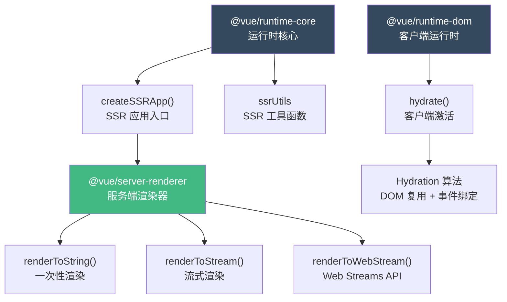
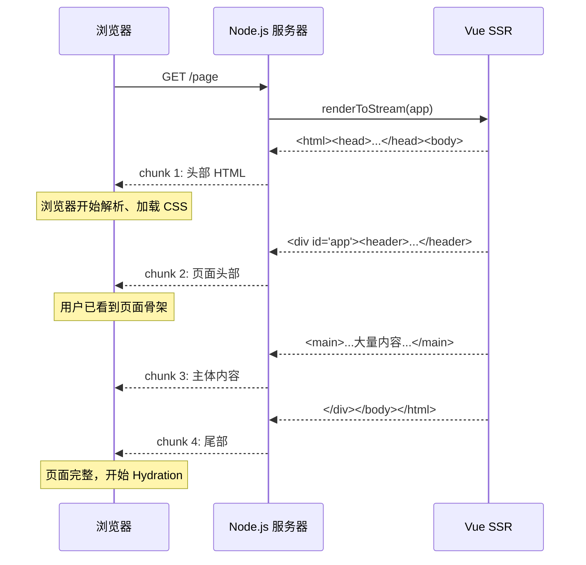
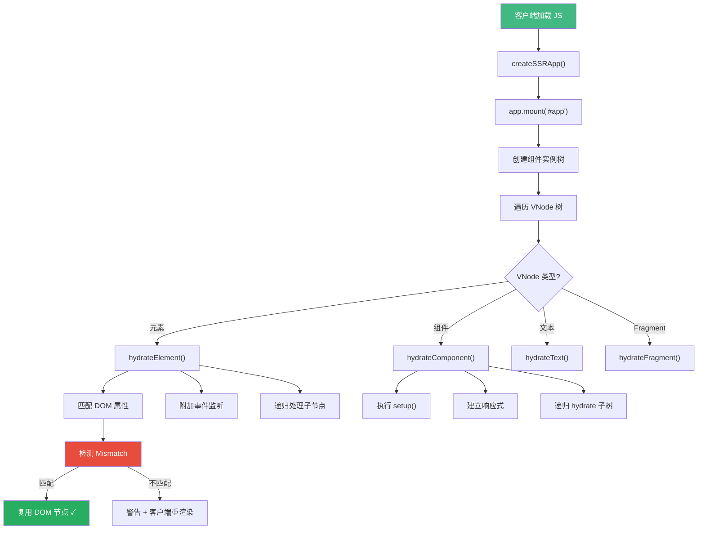
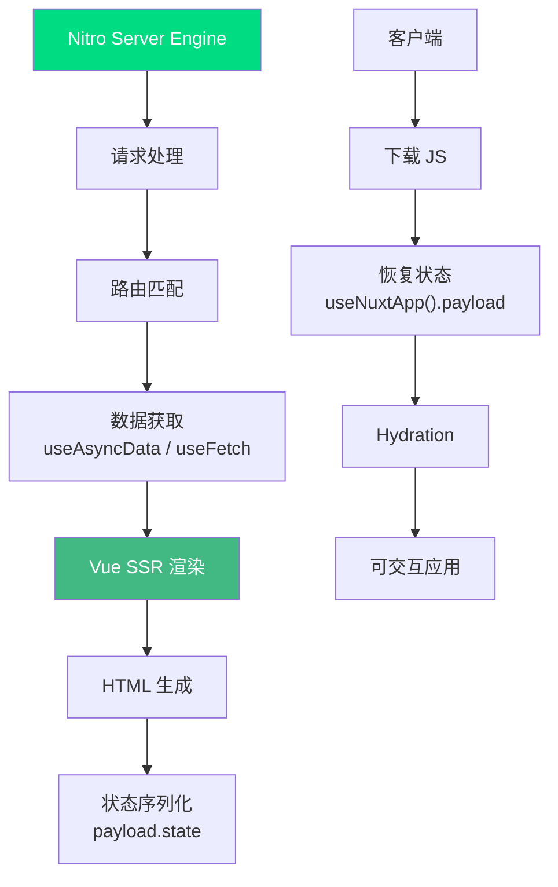

<div v-pre>

# 第 17 章 SSR 与同构渲染

> **本章要点**
>
> - SSR 的本质：在服务端将组件树渲染为 HTML 字符串，在客户端"激活"为可交互应用
> - Vue 3 SSR 架构：@vue/server-renderer 的流式渲染管线
> - renderToString vs renderToStream：一次性输出与流式输出的权衡
> - Hydration（激活）的完整流程：从静态 HTML 到响应式组件树的 12 个步骤
> - Hydration Mismatch 的检测机制与常见陷阱
> - Vue 3.6 的 Lazy Hydration：按需激活与性能优化
> - 同构代码的约束：生命周期、平台 API、状态污染的三重挑战
> - SSR 与 Suspense 的协作：异步数据获取的服务端解决方案
> - Nuxt 3 的 SSR 引擎：Nitro + Vue SSR 的工程化实践

---

"首屏白屏 3 秒"——这大概是 SPA 最让人头疼的问题。用户点开链接，看到的是一片空白，浏览器还在忙着下载 JavaScript、解析执行、请求数据、渲染 DOM。而 SSR 的核心思想非常直白：**既然浏览器渲染慢，那就让服务器先把 HTML 拼好，直接发给浏览器**。

但事情远没有这么简单。服务端渲染完 HTML 后，客户端还需要"接管"这些 HTML，让它变成可交互的 Vue 应用——这个过程叫 **Hydration（激活/注水）**。整个流程涉及两套渲染器的协调、状态的序列化与反序列化、生命周期的差异处理等一系列精密的工程实现。

## 17.1 整体架构

Vue 3 的 SSR 由三个核心包协作完成：



### createSSRApp vs createApp

SSR 应用的入口是 `createSSRApp` 而不是 `createApp`。它们的核心差异在于渲染器的选择：

```typescript
// @vue/runtime-dom 中的实现
export const createSSRApp = ((...args) => {
  const app = ensureHydrationRenderer().createApp(...args)

  // 注入 SSR 上下文
  const { mount } = app
  app.mount = (containerOrSelector: Element | ShadowRoot | string): any => {
    const container = normalizeContainer(containerOrSelector)
    if (container) {
      return mount(container, true, resolveRootNamespace(container))
      //                        ^^^^ isHydrate = true
    }
  }

  return app
}) as CreateAppFunction<Element>
```

关键在第二个参数 `isHydrate = true`。这告诉渲染器：**不要从零创建 DOM，而是复用已有的 HTML 节点**。

### 服务端渲染管线

```typescript
// @vue/server-renderer 的核心流程
export async function renderToString(
  input: App | VNode,
  context: SSRContext = {}
): Promise<string> {
  // 1. 创建渲染缓冲区
  const buffer: SSRBuffer = createBuffer()

  // 2. 安装 SSR 上下文
  if (isVNode(input)) {
    // 直接渲染 VNode
    renderVNode(buffer.push, input, context)
  } else {
    // App 实例：安装后渲染根组件
    const vnode = createVNode(input._component, input._props)
    vnode.appContext = input._context
    renderComponentVNode(buffer.push, vnode, context)
  }

  // 3. 等待所有异步操作完成
  const result = await unrollBuffer(buffer)
  await context.__watcherEffects?.forEach(e => e())

  return result
}
```

`SSRBuffer` 是一个特殊的数据结构，它可以包含字符串和 Promise。这使得渲染过程可以处理异步组件和 `<Suspense>`：

```typescript
type SSRBufferItem = string | SSRBuffer | Promise<SSRBuffer>
type SSRBuffer = SSRBufferItem[] & { hasAsync?: boolean }

function createBuffer(): SSRBuffer {
  let appendable = false
  const buffer: SSRBuffer = [] as any

  return {
    getBuffer: () => buffer,
    push(item: SSRBufferItem) {
      const isStringItem = isString(item)
      // 优化：连续字符串合并，减少数组元素数量
      if (appendable && isStringItem) {
        buffer[buffer.length - 1] += item as string
      } else {
        buffer.push(item)
      }
      appendable = isStringItem
      if (!isStringItem && (item as any).hasAsync) {
        buffer.hasAsync = true
      }
    }
  }
}
```

注意字符串合并优化：连续的字符串被拼接为一个，减少了最终 `unrollBuffer` 时的遍历次数。这个小优化在渲染大型页面时效果显著——一个包含 1000 个静态节点的页面，合并后可能只有几十个 buffer 元素。

## 17.2 服务端组件渲染

### 组件渲染为字符串

在服务端，Vue 不需要创建真实 DOM 节点，只需要输出 HTML 字符串。这意味着整个渲染流程可以大幅简化：

```typescript
function renderComponentVNode(
  push: PushFn,
  vnode: VNode,
  parentComponent: ComponentInternalInstance | null = null,
  slotScopeId?: string
): void {
  const instance = createComponentInstance(vnode, parentComponent, null)

  // 1. 设置组件（与客户端相同）
  const setupResult = setup
    ? callWithErrorHandling(setup, instance, [instance.props, setupContext])
    : undefined

  // 2. 处理异步 setup（服务端特有）
  if (isPromise(setupResult)) {
    const p = setupResult.then(/* ... */)
    push(p as any)
    return
  }

  // 3. 渲染子树
  const subTree = (instance.subTree = renderComponentRoot(instance))
  renderVNode(push, subTree, instance)
}
```

注意一个关键差异：**服务端的 setup 可以是异步的**。在客户端，异步 setup 必须配合 `<Suspense>` 使用，但在服务端，所有异步操作都会被自然地等待。这是因为 `renderToString` 本身就返回 Promise，而 SSRBuffer 天然支持嵌套 Promise。

### 指令的服务端处理

大多数指令在服务端没有意义（比如 `v-on` 绑定事件），但有些需要特殊处理：

```typescript
// v-show 的 SSR 处理
function ssrRenderStyle(raw: unknown): string {
  // v-show="false" → style="display:none"
  if (!raw) return ''
  if (isString(raw)) return raw
  // 对象语法
  let styles = ''
  for (const key in raw as Record<string, string>) {
    const value = (raw as Record<string, string>)[key]
    if (value != null && value !== '') {
      styles += `${hyphenate(key)}:${value};`
    }
  }
  return styles
}

// v-model 的 SSR 处理
function ssrRenderAttrs(attrs: Record<string, unknown>): string {
  let result = ''
  for (const key in attrs) {
    if (key === 'innerHTML' || key === 'textContent') continue
    const value = attrs[key]
    if (key === 'class') {
      result += ` class="${ssrRenderClass(value)}"`
    } else if (key === 'style') {
      result += ` style="${ssrRenderStyle(value)}"`
    } else {
      result += ssrRenderDynamicAttr(key, value)
    }
  }
  return result
}
```

`v-model` 在服务端被渲染为对应的属性值。比如 `<input v-model="name">` 在服务端会渲染为 `<input value="John">`，而 `v-on` 的事件绑定则被完全忽略。

## 17.3 流式渲染

### 为什么需要流式渲染

`renderToString` 需要等整个页面渲染完成后才能发送响应。对于大型页面，这意味着用户要等待几百毫秒甚至几秒才能看到第一个字节。流式渲染（`renderToStream`）解决了这个问题：



### renderToStream 的实现

```typescript
export function renderToStream(
  input: App | VNode,
  context: SSRContext = {}
): Readable {
  const stream = new Readable({
    read() {}  // 由 push 驱动
  })

  // 异步渲染，渐进式推送
  Promise.resolve(renderToString(input, context))
    .then(html => {
      stream.push(html)
      stream.push(null) // 结束信号
    })
    .catch(err => {
      stream.destroy(err)
    })

  return stream
}

// Vue 3.3+ 的 Web Streams API 支持
export function renderToWebStream(
  input: App | VNode,
  context: SSRContext = {}
): ReadableStream {
  return new ReadableStream({
    start(controller) {
      renderToString(input, context).then(html => {
        controller.enqueue(new TextEncoder().encode(html))
        controller.close()
      })
    }
  })
}
```

在实际生产环境中，更高效的方式是利用 SSRBuffer 的分层结构实现真正的逐块推送：

```typescript
// 更细粒度的流式渲染（概念实现）
async function* renderToIterator(
  input: App | VNode,
  context: SSRContext = {}
): AsyncGenerator<string> {
  const buffer = createBuffer()

  renderVNode(buffer.push, createVNode(input), context)

  // 遍历 buffer，遇到 Promise 则等待
  for (const item of buffer.getBuffer()) {
    if (isString(item)) {
      yield item
    } else if (isPromise(item)) {
      const resolved = await item
      yield* yieldBuffer(resolved)
    }
  }
}
```

### TTFB 优化策略

流式渲染的核心价值在于降低 **TTFB（Time To First Byte）**。结合以下策略可以进一步优化：

```typescript
// 策略 1：提前发送 <head>，不等组件渲染
app.use((req, res) => {
  // 立刻发送 HTML 头部（包含 CSS link）
  res.write(`<!DOCTYPE html>
    <html>
    <head>
      <link rel="stylesheet" href="/style.css">
      <link rel="preload" href="/app.js" as="script">
    </head>
    <body>
  `)

  // 然后流式渲染 Vue 应用
  const stream = renderToStream(app)
  stream.pipe(res, { end: false })
  stream.on('end', () => {
    res.end('</body></html>')
  })
})

// 策略 2：利用 Suspense 实现分块推送
const App = {
  template: `
    <header>立刻渲染的导航</header>
    <Suspense>
      <template #default>
        <AsyncMainContent />
      </template>
      <template #fallback>
        <div class="skeleton">加载中...</div>
      </template>
    </Suspense>
  `
}
```

## 17.4 Hydration（激活）

Hydration 是 SSR 最精巧也最容易出问题的环节。它的核心任务是：**复用服务端渲染的 DOM 节点，为它们附加事件监听和响应式更新能力**。

### Hydration 的完整流程



### hydrateNode 的核心实现

```typescript
const hydrateNode = (
  node: Node,
  vnode: VNode,
  parentComponent: ComponentInternalInstance | null,
  parentSuspense: SuspenseBoundary | null,
  slotScopeId: string | null,
  optimized: boolean
): Node | null => {
  const isFragmentStart = isComment(node) && node.data === '['
  const { type, ref, shapeFlag } = vnode

  const domType = node.nodeType
  vnode.el = node  // ← 关键：直接复用 DOM 节点

  switch (type) {
    case Text:
      if (domType !== DOMNodeTypes.TEXT) {
        // 文本节点类型不匹配
        return handleMismatch(node, vnode, parentComponent)
      }
      if ((node as Text).data !== vnode.children) {
        // 文本内容不匹配
        ;(node as Text).data = vnode.children as string
        // 开发模式下警告
        if (__DEV__) {
          warn('Hydration text mismatch')
        }
      }
      return node.nextSibling

    case Comment:
      return node.nextSibling

    case Static:
      return node.nextSibling

    default:
      if (shapeFlag & ShapeFlags.ELEMENT) {
        return hydrateElement(
          node as Element,
          vnode,
          parentComponent,
          parentSuspense,
          slotScopeId,
          optimized
        )
      } else if (shapeFlag & ShapeFlags.COMPONENT) {
        // 组件：先挂载组件实例，再 hydrate 子树
        const container = parentNode(node)!
        const hydrateComponent = () => {
          mountComponent(vnode, container, null, parentComponent, ...)
        }
        // Suspense 组件需要特殊处理
        if (isAsyncWrapper(vnode)) {
          (vnode.type as any).__asyncLoader!().then(hydrateComponent)
        } else {
          hydrateComponent()
        }
        return locateClosingAnchor(node)
      }
  }
}
```

`vnode.el = node` 这一行是整个 Hydration 的核心——**直接将已有的 DOM 节点赋给 VNode**，而不是像 `createApp` 那样通过 `createElement` 创建新节点。

### Element Hydration 的细节

```typescript
const hydrateElement = (
  el: Element,
  vnode: VNode,
  parentComponent: ComponentInternalInstance | null,
  parentSuspense: SuspenseBoundary | null,
  slotScopeId: string | null,
  optimized: boolean
) => {
  const { type, props, patchFlag, shapeFlag, dirs, transition } = vnode

  // 1. 开发模式：检查属性匹配
  if (__DEV__) {
    if (props) {
      // 检查 class 是否匹配
      if (props.class) {
        const clientClass = normalizeClass(props.class)
        const serverClass = el.getAttribute('class')
        if (clientClass !== serverClass) {
          warn(`Hydration class mismatch on ${el.tagName}`)
        }
      }
      // 检查 style 是否匹配
      if (props.style) {
        // ...类似检查
      }
    }
  }

  // 2. 绑定事件监听（服务端没有事件）
  if (props) {
    for (const key in props) {
      if (isOn(key) && !isReservedProp(key)) {
        patchProp(el, key, null, props[key], /* ... */)
      }
    }
  }

  // 3. 处理自定义指令
  if (dirs) {
    invokeDirectiveHook(vnode, null, parentComponent, 'beforeMount')
    invokeDirectiveHook(vnode, null, parentComponent, 'mounted')
  }

  // 4. 递归 hydrate 子节点
  if (shapeFlag & ShapeFlags.ARRAY_CHILDREN) {
    let next = hydrateChildren(
      el.firstChild,
      vnode,
      el,
      parentComponent,
      parentSuspense,
      slotScopeId,
      optimized
    )
    // ...
  }

  return el.nextSibling
}
```

Hydration 的事件绑定是一个有趣的设计选择。服务端 HTML 不包含任何事件处理器，所有的 `@click`、`@input` 等都在 Hydration 阶段添加。这意味着在 JavaScript 加载和 Hydration 完成之前，页面虽然可见但不可交互——这就是所谓的"不可交互窗口期"。

## 17.5 Hydration Mismatch

### 检测机制

Hydration Mismatch 是 SSR 开发中最常见的问题。当服务端渲染的 HTML 与客户端期望的结构不一致时，Vue 会发出警告并尝试恢复：

```typescript
function handleMismatch(
  node: Node,
  vnode: VNode,
  parentComponent: ComponentInternalInstance | null
): Node | null {
  if (__DEV__) {
    warn(
      `Hydration node mismatch:\n` +
      `- rendered on server: ${describeDOMNode(node)}\n` +
      `- expected on client: ${describeVNode(vnode)}`
    )
  }

  // 从不匹配的节点开始，执行完整的客户端渲染
  vnode.el = null

  // 如果在生产模式下，性能优先，可能直接跳过
  if (__FEATURE_PROD_HYDRATION_MISMATCH_DETAILS__) {
    // 提供详细的 mismatch 信息
  }

  // 插入正确的节点
  const next = node.nextSibling
  const container = parentNode(node)!
  container.removeChild(node)
  patch(null, vnode, container, next, parentComponent, ...)

  return next
}
```

### 常见的 Mismatch 场景

```typescript
// ❌ 场景 1：时间/日期相关
// 服务端和客户端运行在不同时区
const TimeDisplay = {
  setup() {
    return () => h('span', new Date().toLocaleString())
    // 服务端: "2026/4/1 13:00:00"
    // 客户端: "2026/4/1 21:00:00" → Mismatch!
  }
}

// ✅ 修复：使用 onMounted 处理客户端专属逻辑
const TimeDisplay = {
  setup() {
    const time = ref('')
    onMounted(() => {
      time.value = new Date().toLocaleString()
    })
    return () => h('span', time.value || '加载中...')
  }
}

// ❌ 场景 2：随机数/ID 生成
const RandomBanner = {
  setup() {
    const id = Math.random() // 服务端和客户端结果不同
    return () => h('div', { id: `banner-${id}` })
  }
}

// ✅ 修复：使用 useId()（Vue 3.5+）
const RandomBanner = {
  setup() {
    const id = useId() // SSR 安全的唯一 ID
    return () => h('div', { id })
  }
}

// ❌ 场景 3：浏览器 API 检测
const ResponsiveLayout = {
  setup() {
    // window 在服务端不存在！
    const isMobile = window.innerWidth < 768
    return () => h('div', isMobile ? '移动端' : '桌面端')
  }
}

// ✅ 修复：使用 <ClientOnly> 或 onMounted
const ResponsiveLayout = {
  setup() {
    const isMobile = ref(false) // 默认值须与服务端一致
    onMounted(() => {
      isMobile.value = window.innerWidth < 768
    })
    return () => h('div', isMobile.value ? '移动端' : '桌面端')
  }
}
```

### 生产环境的 Mismatch 处理

Vue 3.4+ 提供了 `__FEATURE_PROD_HYDRATION_MISMATCH_DETAILS__` 编译标志。默认情况下，生产环境只会静默修复 Mismatch（移除旧节点、创建新节点），不会输出警告。开启此标志后，生产环境也能看到详细的不匹配信息，但会增加约 3KB 的包体积。

## 17.6 Lazy Hydration（懒激活）

### 问题：全量 Hydration 的性能瓶颈

传统 SSR 的 Hydration 是"全量"的——页面上所有组件都需要执行 JavaScript 并建立响应式。对于内容密集的页面（比如电商首页），这意味着：

- 下载大量 JavaScript（所有组件代码）
- 执行所有组件的 `setup()`
- 建立所有的响应式依赖
- 绑定所有的事件监听

用户可能只看到了页面顶部，但底部的组件也被 Hydrate 了。

### Vue 3.6 的 Lazy Hydration 策略

```typescript
import { defineAsyncComponent, hydrateOnVisible, hydrateOnIdle } from 'vue'

// 策略 1：进入视口时激活
const HeavyFooter = defineAsyncComponent({
  loader: () => import('./HeavyFooter.vue'),
  hydrate: hydrateOnVisible() // IntersectionObserver
})

// 策略 2：浏览器空闲时激活
const SidePanel = defineAsyncComponent({
  loader: () => import('./SidePanel.vue'),
  hydrate: hydrateOnIdle(/* timeout */ 3000)
  // requestIdleCallback，最长等 3 秒
})

// 策略 3：媒体查询匹配时激活
const MobileMenu = defineAsyncComponent({
  loader: () => import('./MobileMenu.vue'),
  hydrate: hydrateOnMediaQuery('(max-width: 768px)')
})

// 策略 4：自定义触发条件
const ChatWidget = defineAsyncComponent({
  loader: () => import('./ChatWidget.vue'),
  hydrate: hydrateOnInteraction(['click', 'focus'])
  // 用户点击或聚焦时才激活
})
```

### Lazy Hydration 的内部机制

```typescript
// hydrateOnVisible 的实现原理
export function hydrateOnVisible(
  opts?: IntersectionObserverInit
): HydrationStrategy {
  return (hydrate, forEach) => {
    const ob = new IntersectionObserver((entries) => {
      for (const e of entries) {
        if (!e.isIntersecting) continue
        ob.disconnect()
        hydrate()  // 触发真正的 Hydration
        break
      }
    }, opts)

    // 观察所有根 DOM 元素
    forEach((el) => ob.observe(el))

    // 返回清理函数
    return () => ob.disconnect()
  }
}

// hydrateOnIdle 的实现原理
export function hydrateOnIdle(timeout?: number): HydrationStrategy {
  return (hydrate) => {
    const id = requestIdleCallback(hydrate, { timeout })
    return () => cancelIdleCallback(id)
  }
}

// 在组件挂载时应用策略
function mountAsyncComponent(
  vnode: VNode,
  container: Element,
  parentComponent: ComponentInternalInstance | null,
  isHydrating: boolean
) {
  if (isHydrating && vnode.type.hydrate) {
    // 不立即 hydrate，而是注册策略
    vnode.type.hydrate(
      // hydrate 回调
      () => {
        // 加载组件代码
        vnode.type.__asyncLoader!().then((comp) => {
          // 执行真正的 Hydration
          hydrateSubTree(vnode, container, parentComponent)
        })
      },
      // forEach 回调：遍历未激活的 DOM 元素
      (cb) => {
        traverseStaticChildren(vnode, cb)
      }
    )
  }
}
```

这种设计让未激活的组件保持为静态 HTML——不执行 JavaScript、不建立响应式、不绑定事件。只有当策略条件满足时，才按需加载和激活。

## 17.7 同构代码的约束

### 生命周期差异

服务端只执行部分生命周期钩子：

```typescript
// 服务端执行的钩子
setup()           // ✅ 执行
beforeCreate()    // ✅ 执行（Options API）
created()         // ✅ 执行（Options API）
serverPrefetch()  // ✅ SSR 专属钩子

// 服务端不执行的钩子
beforeMount()     // ❌ 需要 DOM
mounted()         // ❌ 需要 DOM
beforeUpdate()    // ❌ 没有更新周期
updated()         // ❌ 没有更新周期
beforeUnmount()   // ❌ 不会卸载
unmounted()       // ❌ 不会卸载
```

### serverPrefetch：SSR 专属的数据获取

```typescript
export default {
  async serverPrefetch() {
    // 只在服务端执行，在渲染前获取数据
    await this.fetchArticle()
  },
  // 等同于 Composition API：
  async setup() {
    const article = ref(null)

    // onServerPrefetch 是 serverPrefetch 的 Composition API 版本
    onServerPrefetch(async () => {
      article.value = await fetchArticle()
    })

    // 客户端回退：如果服务端没获取到数据
    onMounted(async () => {
      if (!article.value) {
        article.value = await fetchArticle()
      }
    })

    return { article }
  }
}
```

### 状态污染问题

服务端的一个最隐蔽的陷阱是**状态污染**——多个请求共享同一份模块级状态：

```typescript
// ❌ 危险：模块级状态被所有请求共享！
const globalState = reactive({
  user: null,
  cart: []
})

export function useGlobalState() {
  return globalState // 用户 A 的数据可能泄露给用户 B！
}

// ✅ 安全：每个请求创建新的状态
export function createGlobalState() {
  return reactive({
    user: null,
    cart: []
  })
}

// 在 app 工厂函数中使用
export function createApp() {
  const app = createSSRApp(App)
  const state = createGlobalState()
  app.provide('globalState', state)
  return { app, state }
}
```

这也是为什么 SSR 应用必须使用**工厂函数模式**——每个请求创建全新的 app 实例、router 实例和 store 实例。Pinia 的 SSR 支持就是基于这个原则设计的。

### 平台 API 隔离

```typescript
// 通用的平台安全访问模式
function useSafeWindow() {
  const isServer = typeof window === 'undefined'

  function getScrollPosition() {
    if (isServer) return { x: 0, y: 0 }
    return { x: window.scrollX, y: window.scrollY }
  }

  function getViewportSize() {
    if (isServer) return { width: 1024, height: 768 } // 合理的默认值
    return { width: window.innerWidth, height: window.innerHeight }
  }

  return { isServer, getScrollPosition, getViewportSize }
}

// 条件导入（Vite 支持）
// 在 vite.config.ts 中：
export default defineConfig({
  resolve: {
    alias: {
      // 服务端使用空实现
      './analytics': process.env.SSR
        ? './analytics.server.ts'  // 空操作
        : './analytics.client.ts'  // 真实实现
    }
  }
})
```

## 17.8 状态序列化与传输

### SSR 上下文与状态传输

服务端渲染的数据需要传递给客户端，避免重复请求：

```typescript
// 服务端：渲染时收集状态
const app = createSSRApp(App)
const pinia = createPinia()
app.use(pinia)

const html = await renderToString(app, {
  // SSR 上下文对象
})

// 将 Pinia 状态序列化到 HTML
const state = JSON.stringify(pinia.state.value)
const finalHtml = html.replace(
  '</body>',
  `<script>window.__PINIA_STATE__=${devalue(state)}</script></body>`
)

// 客户端：恢复状态
const app = createSSRApp(App)
const pinia = createPinia()
app.use(pinia)

// Hydration 前恢复状态
if (window.__PINIA_STATE__) {
  pinia.state.value = window.__PINIA_STATE__
}

app.mount('#app') // Hydration 时已有正确的状态
```

注意使用 `devalue` 而不是 `JSON.stringify`。`devalue` 可以处理循环引用、`Date`、`RegExp`、`Map`、`Set` 等 JSON 无法序列化的类型，还能防止 XSS 注入（自动转义 `</script>` 等危险字符串）。

### Teleport 在 SSR 中的处理

`<Teleport>` 在 SSR 中需要特殊处理，因为目标容器可能不在当前渲染范围内：

```typescript
// 服务端渲染 Teleport
function ssrRenderTeleport(
  parentPush: PushFn,
  contentRenderFn: () => void,
  target: string,
  disabled: boolean,
  parentComponent: ComponentInternalInstance | null
) {
  parentPush('<!--teleport start-->')

  if (disabled) {
    // disabled 时内容渲染在原地
    contentRenderFn()
  } else {
    // 将内容存储到 SSR 上下文中
    const context = parentComponent!.appContext.provides[ssrContextKey]
    if (!context.__teleports) {
      context.__teleports = {}
    }
    if (!context.__teleports[target]) {
      context.__teleports[target] = ''
    }
    // 渲染到 teleport buffer
    const teleportBuffer = createBuffer()
    contentRenderFn = () => {
      renderTeleportContent(teleportBuffer.push, contentRenderFn)
    }
    contentRenderFn()
    context.__teleports[target] += teleportBuffer.getContent()
  }

  parentPush('<!--teleport end-->')
}
```

## 17.9 SSR 与 Suspense 的协作

`<Suspense>` 在 SSR 中的行为与客户端有本质区别：

```typescript
// 客户端：显示 fallback，等待异步组件
// 服务端：等待所有异步操作完成后输出最终 HTML

// SSR 中的 Suspense 渲染
function ssrRenderSuspense(
  push: PushFn,
  { default: defaultSlot, fallback }: Record<string, (() => void) | undefined>
) {
  if (defaultSlot) {
    // 服务端始终渲染 default 插槽（不是 fallback）
    // 因为我们会等待所有 Promise 解决
    defaultSlot()
  } else if (fallback) {
    fallback()
  }
}
```

这意味着在服务端，用户永远不会看到 Loading 状态——服务端会等待所有数据就绪后才发送完整的 HTML。这对用户体验是好事，但也意味着如果某个异步操作很慢，整个页面的响应都会被阻塞。

结合流式渲染和 Suspense，可以实现更智能的策略：

```typescript
// Nuxt 3 的 <NuxtLoadingIndicator> + Suspense 策略
// 1. 先发送页面骨架（不含异步数据的部分）
// 2. 异步数据就绪后，通过流式渲染推送剩余内容
// 3. 客户端接收到完整 HTML 后执行 Hydration

// 这要求渲染器支持"延迟块"（deferred chunks）
// Vue 3 的 renderToStream 天然支持这种模式
```

## 17.10 Nuxt 3 的 SSR 引擎

Nuxt 3 在 Vue SSR 的基础上构建了完整的工程化解决方案：



### useAsyncData 的同构实现

```typescript
// Nuxt 3 的 useAsyncData 核心逻辑
export function useAsyncData<T>(
  key: string,
  handler: () => Promise<T>,
  options: AsyncDataOptions<T> = {}
) {
  const nuxt = useNuxtApp()

  // 1. 检查是否已有缓存数据（来自 SSR 或之前的请求）
  const cachedData = nuxt.payload.data[key]
  if (cachedData !== undefined && !options.force) {
    return {
      data: ref(cachedData),
      pending: ref(false),
      error: ref(null)
    }
  }

  const data = ref<T | null>(null)
  const pending = ref(true)
  const error = ref<Error | null>(null)

  const fetch = async () => {
    pending.value = true
    try {
      const result = await handler()
      data.value = result
      // 存入 payload，供客户端复用
      nuxt.payload.data[key] = result
    } catch (err) {
      error.value = err as Error
      nuxt.payload._errors[key] = true
    } finally {
      pending.value = false
    }
  }

  // 2. 服务端：在渲染前获取数据
  if (import.meta.server) {
    // 使用 callOnce 确保只执行一次
    nuxt.hook('app:created', async () => {
      await fetch()
    })
  }

  // 3. 客户端：检查 payload 或重新获取
  if (import.meta.client) {
    if (cachedData === undefined) {
      // 服务端没有获取到，客户端补充获取
      onMounted(fetch)
    }
  }

  return { data, pending, error, refresh: fetch }
}
```

### 渲染模式的选择

Nuxt 3 支持多种渲染模式，每种都有不同的权衡：

```typescript
// nuxt.config.ts 中的路由级渲染规则
export default defineNuxtConfig({
  routeRules: {
    // SSR：每次请求都在服务端渲染
    '/': { ssr: true },

    // SSG：构建时预渲染为静态 HTML
    '/about': { prerender: true },

    // SWR：SSR + 缓存（Stale-While-Revalidate）
    '/api/**': { swr: 3600 }, // 缓存 1 小时

    // ISR：增量静态再生成
    '/blog/**': { isr: 600 }, // 10 分钟后重新生成

    // CSR：禁用 SSR，纯客户端渲染
    '/admin/**': { ssr: false },
  }
})
```

## 17.11 SSR 安全与性能考量

### XSS 防护

SSR 最大的安全风险是 XSS——服务端渲染的 HTML 直接发送给浏览器，如果包含用户输入的恶意脚本，就会被执行：

```typescript
// Vue 的 SSR 渲染器内置了转义机制
function ssrInterpolate(value: unknown): string {
  return escapeHtml(toDisplayString(value))
}

function escapeHtml(string: unknown): string {
  const str = '' + string
  const match = /["'&<>]/.exec(str)

  if (!match) return str

  let html = ''
  let escaped: string
  let index: number
  let lastIndex = 0

  for (index = match.index; index < str.length; index++) {
    switch (str.charCodeAt(index)) {
      case 34: escaped = '&quot;'; break  // "
      case 38: escaped = '&amp;'; break   // &
      case 39: escaped = '&#39;'; break   // '
      case 60: escaped = '&lt;'; break    // <
      case 62: escaped = '&gt;'; break    // >
      default: continue
    }

    if (lastIndex !== index) {
      html += str.substring(lastIndex, index)
    }
    lastIndex = index + 1
    html += escaped
  }

  return lastIndex !== index ? html + str.substring(lastIndex, index) : html
}
```

但 `v-html` 会绕过转义，这在 SSR 环境下特别危险：

```typescript
// ❌ 极其危险：用户输入直接渲染为 HTML
const comment = ref(userInput) // 可能包含 <script>alert('xss')</script>
// <div v-html="comment"></div>

// ✅ 安全：使用 DOMPurify 等库清理
import DOMPurify from 'isomorphic-dompurify'
const safeComment = computed(() => DOMPurify.sanitize(comment.value))
```

### 内存管理

SSR 环境下的内存问题比客户端严重得多，因为每个请求都会创建新的组件树：

```typescript
// 关键实践：避免内存泄漏
// 1. 不要在模块级创建响应式对象
// 2. 确保每个请求有独立的 app 实例
// 3. 设置合理的超时和并发限制

const server = createServer(async (req, res) => {
  const { app, router, pinia } = createApp()

  try {
    await router.push(req.url)
    await router.isReady()

    const html = await renderToString(app)
    res.end(html)
  } catch (err) {
    res.statusCode = 500
    res.end('Internal Server Error')
  }
  // app, router, pinia 在函数结束后自动被 GC
  // 关键：不要将它们存储到模块级变量中！
})
```

## 17.12 本章小结

SSR 与同构渲染是 Vue 3 工程化的重要能力。本章我们从底层实现的角度，深入探讨了整个 SSR 流程：

1. **服务端渲染**：`@vue/server-renderer` 将组件树渲染为 HTML 字符串，通过 SSRBuffer 支持异步操作
2. **流式渲染**：通过 `renderToStream` 降低 TTFB，让用户更快看到页面内容
3. **Hydration**：客户端通过 `hydrateNode` 遍历 DOM 树，复用现有节点并附加事件和响应式
4. **Mismatch 处理**：检测服务端与客户端的渲染差异，开发模式下警告、生产模式下静默修复
5. **Lazy Hydration**：Vue 3.6 的按需激活策略，显著减少首屏 JavaScript 执行量
6. **同构约束**：生命周期差异、状态污染、平台 API 隔离是同构开发的三大挑战
7. **安全防护**：SSR 环境下的 XSS 风险和内存管理需要特别关注

SSR 不是银弹。它增加了架构复杂度、服务器成本和开发约束。在选择渲染模式时，应当根据实际需求权衡：SEO 关键页面用 SSR/SSG，交互密集的管理后台用 CSR，高频更新的内容用 ISR/SWR。

---

**思考题**

1. 为什么 Hydration 使用 `shallowRef` 而不是 `ref` 来存储 `currentRoute`？如果使用 `ref` 会有什么影响？

2. 假设你的应用有一个组件依赖 `localStorage` 来决定显示内容（比如"已读/未读"状态），在 SSR 环境下会发生什么？设计一个不产生 Hydration Mismatch 的方案。

3. Lazy Hydration 中，如果用户在组件激活之前就点击了按钮，会发生什么？如何设计一个"点击时立即激活并重放点击事件"的策略？

4. 在微服务架构中，多个服务分别渲染页面的不同区域（类似微前端 SSR），这对 Hydration 流程有什么影响？如何保证 Hydration 的正确性？

5. 对比 React 18 的 Selective Hydration 和 Vue 3.6 的 Lazy Hydration，它们的设计哲学有什么异同？

</div>
