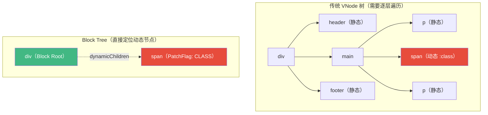
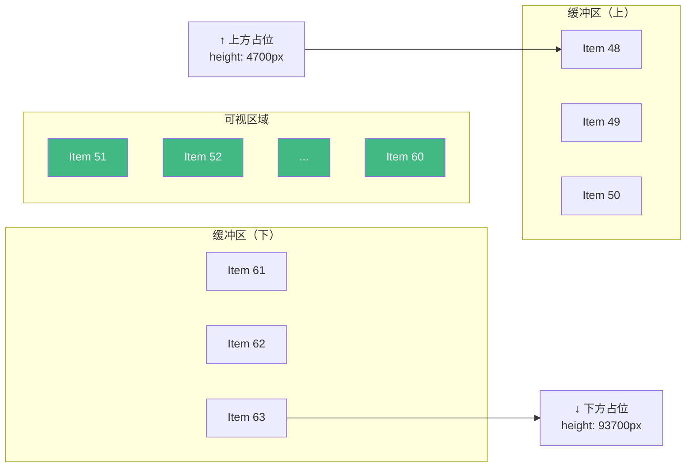
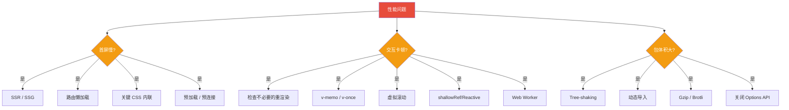

<div v-pre>

# 第 18 章 性能工程与最佳实践

> **本章要点**
>
> - Vue 3 的性能优化哲学：编译时优化 + 运行时精细控制的双轨策略
> - 编译器的静态提升（Static Hoisting）：将不变的 VNode 提取到渲染函数外部
> - PatchFlag 与 Block Tree：精确追踪动态节点，跳过静态内容的 Diff
> - 响应式系统的性能陷阱：深层响应式、大型数组、不必要的依赖收集
> - shallowRef / shallowReactive / triggerRef 的精细控制策略
> - 组件级优化：v-once、v-memo、defineAsyncComponent 与代码分割
> - 虚拟列表与大数据渲染的底层实现原理
> - 内存泄漏的检测与预防：闭包陷阱、全局事件、定时器清理
> - DevTools Performance 面板：如何定位 Vue 应用的性能瓶颈
> - 从源码角度理解每个优化手段的收益与代价

---

性能不是事后修补，而是架构决策。Vue 3 从设计之初就将性能作为核心目标——Proxy 替代 Object.defineProperty、编译器的静态分析、Block Tree 的精确 Diff、Tree-shaking 友好的模块化设计。这些底层改进让 Vue 3 在基准测试中全面领先 Vue 2。

但框架的性能上限只决定了地板，应用的实际表现取决于开发者如何使用它。本章将从源码层面剖析每个优化手段的原理，让你不仅知道"该怎么做"，更理解"为什么这样做有效"。

## 18.1 编译时优化

### 静态提升（Static Hoisting）

Vue 3 编译器最重要的优化之一是**静态提升**——将不会变化的 VNode 创建操作提取到渲染函数外部，避免每次渲染都重复创建：

```typescript
// 模板
// <div>
//   <span class="title">固定标题</span>
//   <span>{{ message }}</span>
// </div>

// ❌ 未优化：每次渲染都创建所有 VNode
function render(_ctx) {
  return createVNode('div', null, [
    createVNode('span', { class: 'title' }, '固定标题'),
    createVNode('span', null, _ctx.message)
  ])
}

// ✅ 静态提升后：静态节点只创建一次
const _hoisted_1 = createVNode('span', { class: 'title' }, '固定标题')

function render(_ctx) {
  return createVNode('div', null, [
    _hoisted_1,  // 直接复用，不重新创建
    createVNode('span', null, _ctx.message)
  ])
}
```

编译器是如何判断哪些节点可以提升的？

```typescript
// compiler-core/src/transforms/hoistStatic.ts
function walk(
  node: ParentNode,
  context: TransformContext,
  doNotHoistNode: boolean = false
) {
  const { children } = node

  for (let i = 0; i < children.length; i++) {
    const child = children[i]

    if (child.type === NodeTypes.ELEMENT) {
      // 计算节点的静态类型
      const staticType = getConstantType(child, context)

      if (staticType > ConstantTypes.NOT_CONSTANT) {
        if (staticType >= ConstantTypes.CAN_HOIST) {
          // 标记为可提升
          ;(child.codegenNode as VNodeCall).patchFlag =
            PatchFlags.HOISTED + ` /* HOISTED */`
          // 将节点移到渲染函数外部
          child.codegenNode = context.hoist(child.codegenNode!)
        }
      }
    }
  }
}

// 静态类型的分级
const enum ConstantTypes {
  NOT_CONSTANT = 0,     // 包含动态绑定
  CAN_SKIP_PATCH = 1,   // 可以跳过 Patch
  CAN_HOIST = 2,        // 可以提升到外部
  CAN_STRINGIFY = 3     // 可以序列化为字符串（最高级别）
}
```

### 静态字符串化

当连续的静态节点数量超过阈值（默认 20 个，或 5 个带属性的节点），编译器会将它们直接序列化为 HTML 字符串：

```typescript
// 大量静态内容
// <div>
//   <p>段落 1</p>
//   <p>段落 2</p>
//   ... (20+ 个静态段落)
//   <p>段落 N</p>
//   <p>{{ dynamic }}</p>
// </div>

// 编译结果：静态部分变成字符串
const _hoisted_1 = createStaticVNode(
  '<p>段落 1</p><p>段落 2</p>...<p>段落 N</p>',
  20  // 节点数量
)

function render(_ctx) {
  return createVNode('div', null, [
    _hoisted_1,
    createVNode('p', null, _ctx.dynamic)
  ])
}
```

`createStaticVNode` 的实现使用 `innerHTML` 一次性设置所有静态节点，比逐个 `createElement` 快得多：

```typescript
function mountStaticNode(
  vnode: VNode,
  container: RendererElement,
  anchor: RendererNode | null,
  namespace: ElementNamespace
) {
  const nodes: RendererNode[] = []
  // 使用 innerHTML 一次性创建所有节点
  const template = document.createElement('template')
  template.innerHTML = vnode.children as string

  // 将所有子节点移到目标位置
  const content = template.content
  while (content.firstChild) {
    nodes.push(content.firstChild)
    container.insertBefore(content.firstChild, anchor)
  }

  // 记录首尾节点，用于后续移除
  vnode.el = nodes[0]
  vnode.anchor = nodes[nodes.length - 1]
}
```

### PatchFlag 精确追踪

PatchFlag 是 Vue 3 编译器最精巧的优化。它在编译时为每个动态节点标记"哪些部分是动态的"，运行时只比较标记的部分：

```typescript
// 编译器生成的 PatchFlag
const enum PatchFlags {
  TEXT = 1,              // 动态文本
  CLASS = 1 << 1,        // 动态 class
  STYLE = 1 << 2,        // 动态 style
  PROPS = 1 << 3,        // 动态非 class/style 的属性
  FULL_PROPS = 1 << 4,   // 有动态 key 的属性
  NEED_HYDRATION = 1 << 5, // 需要 hydration 的事件监听
  STABLE_FRAGMENT = 1 << 6, // 子节点顺序不变的 Fragment
  KEYED_FRAGMENT = 1 << 7,  // 有 key 的 Fragment
  UNKEYED_FRAGMENT = 1 << 8, // 无 key 的 Fragment
  NEED_PATCH = 1 << 9,  // 需要非 props 的 patch（ref、指令等）
  DYNAMIC_SLOTS = 1 << 10, // 动态插槽
  DEV_ROOT_FRAGMENT = 1 << 11, // 开发模式的根 Fragment
  HOISTED = -1,          // 静态提升的节点
  BAIL = -2              // 放弃优化
}

// 模板：<div :class="cls" :style="stl" :id="id" @click="handler">
// 编译后：
createVNode('div', {
  class: _ctx.cls,
  style: _ctx.stl,
  id: _ctx.id,
  onClick: _ctx.handler
}, null,
  PatchFlags.CLASS | PatchFlags.STYLE | PatchFlags.PROPS,
  // ↑ 位运算组合：class + style + props
  ['id']  // 动态属性名列表（props 时需要）
)
```

运行时如何利用 PatchFlag：

```typescript
// runtime-core/src/renderer.ts - patchElement
function patchElement(
  n1: VNode,
  n2: VNode,
  parentComponent: ComponentInternalInstance | null,
  // ...
) {
  const el = (n2.el = n1.el!)
  const oldProps = n1.props || EMPTY_OBJ
  const newProps = n2.props || EMPTY_OBJ
  const { patchFlag } = n2

  if (patchFlag > 0) {
    // 有 PatchFlag，精确更新
    if (patchFlag & PatchFlags.FULL_PROPS) {
      // 动态 key，需要全量 diff props
      patchProps(el, n2, oldProps, newProps, parentComponent, ...)
    } else {
      // 按位检查，只更新变化的部分
      if (patchFlag & PatchFlags.CLASS) {
        if (oldProps.class !== newProps.class) {
          hostPatchProp(el, 'class', null, newProps.class, ...)
        }
      }
      if (patchFlag & PatchFlags.STYLE) {
        hostPatchProp(el, 'style', oldProps.style, newProps.style, ...)
      }
      if (patchFlag & PatchFlags.PROPS) {
        // 只检查声明的动态属性
        const propsToUpdate = n2.dynamicProps!
        for (let i = 0; i < propsToUpdate.length; i++) {
          const key = propsToUpdate[i]
          const prev = oldProps[key]
          const next = newProps[key]
          if (next !== prev || key === 'value') {
            hostPatchProp(el, key, prev, next, ...)
          }
        }
      }
      if (patchFlag & PatchFlags.TEXT) {
        if (n1.children !== n2.children) {
          hostSetElementText(el, n2.children as string)
        }
      }
    }
  } else if (!optimized) {
    // 没有 PatchFlag，回退到全量 diff
    patchProps(el, n2, oldProps, newProps, parentComponent, ...)
  }
}
```

PatchFlag 的威力在于**将 O(n) 的属性比较降低为 O(1) 的位运算检查**。一个有 10 个属性但只有 1 个是动态的元素，传统 Diff 需要比较 10 次，PatchFlag 只需比较 1 次。

### Block Tree 与动态节点收集

Block Tree 是配合 PatchFlag 使用的更高层次优化。它将组件的 VNode 树"拍平"，直接追踪所有动态节点：



```typescript
// Block 的创建
export function openBlock(disableTracking = false) {
  blockStack.push(
    (currentBlock = disableTracking ? null : [])
  )
}

export function createBlock(
  type: VNodeTypes,
  props?: Record<string, any> | null,
  children?: any,
  patchFlag?: number,
  dynamicProps?: string[]
): VNode {
  return setupBlock(
    createVNode(type, props, children, patchFlag, dynamicProps, true)
  )
}

function setupBlock(vnode: VNode): VNode {
  // 将收集到的动态节点附加到 Block 根节点
  vnode.dynamicChildren = currentBlock || EMPTY_ARR

  // 关闭当前 Block
  closeBlock()

  // 如果有父 Block，将当前节点注册为父 Block 的动态子节点
  if (currentBlock) {
    currentBlock.push(vnode)
  }

  return vnode
}

// 每个动态节点在创建时自动注册到当前 Block
export function createVNode(/* ... */): VNode {
  // ...
  if (
    currentBlock &&
    vnode.patchFlag !== PatchFlags.HOISTED &&
    (vnode.patchFlag > 0 || shapeFlag & ShapeFlags.COMPONENT)
  ) {
    // 将动态节点加入当前 Block 的收集列表
    currentBlock.push(vnode)
  }
  return vnode
}
```

Patch 阶段利用 `dynamicChildren` 直接跳过静态子树：

```typescript
function patchBlockChildren(
  oldChildren: VNode[],
  newChildren: VNode[],
  // ...
) {
  for (let i = 0; i < newChildren.length; i++) {
    const oldVNode = oldChildren[i]
    const newVNode = newChildren[i]
    // 直接 patch 动态节点，不遍历整棵树
    patch(oldVNode, newVNode, /* ... */)
  }
}
```

## 18.2 响应式系统的性能优化

### 避免不必要的深层响应

`reactive()` 默认创建深层响应式代理——对象的每一层嵌套都会被代理。对于大型、层次很深的数据结构，这是巨大的开销：

```typescript
// ❌ 性能隐患：10000 个对象每个都被深度代理
const state = reactive({
  items: generateItems(10000) // 每个 item 有 10+ 个嵌套属性
})

// 源码中的深层代理逻辑
function createGetter(isReadonly = false, shallow = false) {
  return function get(target: Target, key: string | symbol, receiver: object) {
    const res = Reflect.get(target, key, receiver)

    track(target, TrackOpTypes.GET, key)

    if (isObject(res)) {
      // 关键：访问嵌套对象时，递归代理
      return isReadonly ? readonly(res) : reactive(res)
      // 每次访问都会检查/创建代理，虽然有缓存，但仍有开销
    }

    return res
  }
}

// ✅ 优化：使用 shallowRef 或 shallowReactive
const state = shallowReactive({
  items: generateItems(10000) // 只有 items 属性是响应式的，内部不代理
})

// 需要更新时：
function updateItem(index: number, newData: Partial<Item>) {
  // 替换整个数组元素，触发浅层响应
  state.items[index] = { ...state.items[index], ...newData }
  // 或者替换整个数组
  state.items = [...state.items]
}
```

### shallowRef 与 triggerRef

`shallowRef` 只追踪 `.value` 的变化，不代理内部结构：

```typescript
const data = shallowRef<BigDataStructure>({
  matrix: Array(1000).fill(null).map(() => Array(1000).fill(0)),
  metadata: { /* ... */ }
})

// ❌ 这不会触发更新（内部修改不被追踪）
data.value.matrix[0][0] = 42

// ✅ 方式 1：替换整个值
data.value = { ...data.value, matrix: newMatrix }

// ✅ 方式 2：手动触发更新
data.value.matrix[0][0] = 42
triggerRef(data) // 强制触发依赖更新

// triggerRef 的实现非常简单
export function triggerRef(ref: Ref): void {
  triggerRefValue(ref, DirtyLevels.Dirty)
}
```

### computed 的惰性求值与缓存

`computed` 是 Vue 性能优化的重要工具，但误用也会带来问题：

```typescript
// computed 的内部实现（简化）
class ComputedRefImpl<T> {
  private _value!: T
  public readonly effect: ReactiveEffect<T>
  public _dirty = true  // 脏标记

  constructor(getter: () => T) {
    this.effect = new ReactiveEffect(getter, () => {
      // scheduler：依赖变化时不立即重新计算，只标记为脏
      if (!this._dirty) {
        this._dirty = true
        triggerRefValue(this)
      }
    })
  }

  get value() {
    trackRefValue(this)
    // 只在脏时重新计算
    if (this._dirty) {
      this._dirty = false
      this._value = this.effect.run()!
    }
    return this._value
  }
}
```

```typescript
// ❌ 计算属性链过长
const a = ref(1)
const b = computed(() => a.value * 2)
const c = computed(() => b.value + 1)
const d = computed(() => c.value * 3)
const e = computed(() => d.value + b.value) // 依赖了 d 和 b

// a 变化 → b、c、d、e 依次标记为脏
// 如果 e 在模板中被使用，求值时会触发 d → c → b 的链式求值

// ✅ 减少中间层，直接计算
const result = computed(() => {
  const base = a.value * 2
  const step = base + 1
  return step * 3 + base
})
```

### watchEffect 的副作用清理

```typescript
// ❌ 内存泄漏：每次触发都创建新的订阅
watchEffect(() => {
  const subscription = eventBus.on('data', (data) => {
    processData(data)
  })
  // subscription 永远不会被清理！
})

// ✅ 使用 onCleanup 清理副作用
watchEffect((onCleanup) => {
  const subscription = eventBus.on('data', (data) => {
    processData(data)
  })
  onCleanup(() => {
    subscription.unsubscribe() // 下次执行前清理
  })
})
```

## 18.3 组件级优化

### v-once：一次性渲染

```typescript
// <div v-once>
//   <ComplexChart :data="staticData" />
// </div>

// 编译后：缓存 VNode，后续渲染直接返回缓存
function render(_ctx, _cache) {
  return _cache[0] || (
    setBlockTracking(-1),  // 暂停 Block 追踪
    _cache[0] = createVNode('div', null, [
      createVNode(ComplexChart, { data: _ctx.staticData })
    ]),
    setBlockTracking(1),   // 恢复
    _cache[0]
  )
}
```

`setBlockTracking(-1)` 是关键——它暂停了动态节点收集，这意味着 `v-once` 内部的动态绑定不会被加入 `dynamicChildren`，后续更新会完全跳过这个子树。

### v-memo：条件性缓存

`v-memo` 是 Vue 3.2 引入的更灵活的缓存指令：

```typescript
// <div v-for="item in list" :key="item.id" v-memo="[item.selected]">
//   <HeavyComponent :data="item" />
// </div>

// 编译后：
function render(_ctx, _cache) {
  return openBlock(true), createBlock(Fragment, null,
    renderList(_ctx.list, (item, _, __, _cached) => {
      // v-memo 检查：如果 memo 依赖没变，返回缓存
      const _memo = [item.selected]
      if (_cached && isMemoSame(_cached, _memo)) {
        return _cached
      }
      const _block = createVNode('div', { key: item.id }, [
        createVNode(HeavyComponent, { data: item })
      ])
      _block.memo = _memo
      return _block
    }),
    128 /* KEYED_FRAGMENT */
  )
}

// isMemoSame 的实现
function isMemoSame(cached: VNode, memo: any[]): boolean {
  const prev = cached.memo!
  if (prev.length !== memo.length) return false
  for (let i = 0; i < prev.length; i++) {
    if (hasChanged(prev[i], memo[i])) return false
  }
  // 阻止此节点进入 Block 的 dynamicChildren
  // 因为它没有变化，不需要 patch
  if (currentBlock) {
    currentBlock.push(cached)
  }
  return true
}
```

`v-memo` 在长列表中的效果惊人。假设一个 1000 项的列表，只有 1 项的 `selected` 状态变了，传统渲染需要 diff 1000 个组件，`v-memo` 只需 diff 1 个。

### KeepAlive 的缓存策略

```typescript
// KeepAlive 的核心：LRU 缓存
const KeepAliveImpl = {
  setup(props, { slots }) {
    const cache = new Map<CacheKey, VNode>()
    const keys = new Set<CacheKey>()
    const instance = getCurrentInstance()!

    // 缓存当前组件
    function cacheSubtree() {
      if (pendingCacheKey != null) {
        cache.set(pendingCacheKey, getInnerChild(instance.subTree))
      }
    }

    onMounted(cacheSubtree)
    onUpdated(cacheSubtree)

    return () => {
      const children = slots.default!()
      const vnode = children[0]
      const key = vnode.key ?? vnode.type
      const cachedVNode = cache.get(key)

      if (cachedVNode) {
        // 命中缓存：复用组件实例
        vnode.el = cachedVNode.el
        vnode.component = cachedVNode.component
        // 标记为 KEPT_ALIVE，跳过挂载流程
        vnode.shapeFlag |= ShapeFlags.COMPONENT_KEPT_ALIVE
      } else {
        // 未命中：可能需要淘汰旧缓存
        keys.add(key)

        // LRU 淘汰
        if (props.max && keys.size > parseInt(props.max as string, 10)) {
          // 删除最早加入的 key
          const oldest = keys.values().next().value
          pruneCacheEntry(oldest)
        }
      }

      // 标记为 SHOULD_KEEP_ALIVE，卸载时不销毁而是停用
      vnode.shapeFlag |= ShapeFlags.COMPONENT_SHOULD_KEEP_ALIVE

      return vnode
    }
  }
}
```

## 18.4 列表渲染优化

### key 的重要性

`key` 不仅是一个"最佳实践"，它直接影响 Diff 算法的执行路径：

```typescript
// runtime-core/src/renderer.ts - patchKeyedChildren（简化）
function patchKeyedChildren(
  c1: VNode[], // 旧子节点
  c2: VNode[], // 新子节点
  container: RendererElement,
  // ...
) {
  let i = 0
  const l2 = c2.length
  let e1 = c1.length - 1
  let e2 = l2 - 1

  // 1. 从头部同步
  while (i <= e1 && i <= e2) {
    const n1 = c1[i]
    const n2 = c2[i]
    if (isSameVNodeType(n1, n2)) {
      patch(n1, n2, container, ...)
    } else {
      break
    }
    i++
  }

  // 2. 从尾部同步
  while (i <= e1 && i <= e2) {
    const n1 = c1[e1]
    const n2 = c2[e2]
    if (isSameVNodeType(n1, n2)) {
      patch(n1, n2, container, ...)
    } else {
      break
    }
    e1--
    e2--
  }

  // 3. 新增节点
  if (i > e1 && i <= e2) {
    while (i <= e2) {
      patch(null, c2[i], container, ...)
      i++
    }
  }
  // 4. 删除节点
  else if (i > e2) {
    while (i <= e1) {
      unmount(c1[i], ...)
      i++
    }
  }
  // 5. 未知序列：最长递增子序列算法
  else {
    const s1 = i
    const s2 = i

    // 建立新节点 key → index 的映射
    const keyToNewIndexMap = new Map<string | number | symbol, number>()
    for (i = s2; i <= e2; i++) {
      keyToNewIndexMap.set(c2[i].key!, i)
    }

    // 寻找最长递增子序列，最小化 DOM 移动
    const toBePatched = e2 - s2 + 1
    const newIndexToOldIndexMap = new Array(toBePatched).fill(0)
    let moved = false
    let maxNewIndexSoFar = 0

    for (i = s1; i <= e1; i++) {
      const prevChild = c1[i]
      const newIndex = keyToNewIndexMap.get(prevChild.key!)

      if (newIndex === undefined) {
        unmount(prevChild, ...) // 旧节点不在新列表中，删除
      } else {
        newIndexToOldIndexMap[newIndex - s2] = i + 1
        if (newIndex >= maxNewIndexSoFar) {
          maxNewIndexSoFar = newIndex
        } else {
          moved = true // 检测到顺序变化
        }
        patch(prevChild, c2[newIndex], container, ...)
      }
    }

    // 用最长递增子序列确定哪些节点需要移动
    const increasingNewIndexSequence = moved
      ? getSequence(newIndexToOldIndexMap)
      : EMPTY_ARR

    // 从后向前遍历，确保插入位置正确
    let j = increasingNewIndexSequence.length - 1
    for (i = toBePatched - 1; i >= 0; i--) {
      const nextIndex = s2 + i
      const nextChild = c2[nextIndex]
      const anchor = nextIndex + 1 < l2 ? c2[nextIndex + 1].el : parentAnchor

      if (newIndexToOldIndexMap[i] === 0) {
        // 新增节点
        patch(null, nextChild, container, anchor, ...)
      } else if (moved) {
        if (j < 0 || i !== increasingNewIndexSequence[j]) {
          // 需要移动
          move(nextChild, container, anchor, MoveType.REORDER)
        } else {
          j-- // 在递增子序列中，不需要移动
        }
      }
    }
  }
}
```

**最长递增子序列（LIS）算法**是 Vue 3 Diff 的核心创新——它确保 DOM 移动次数最少。假设旧列表是 `[A, B, C, D, E]`，新列表是 `[B, D, A, C, E]`，LIS 找到 `[B, D, E]`（这些节点保持相对顺序），只需要移动 `A` 和 `C`。

### 虚拟滚动的实现原理

当列表项多达数万条时，即使 Diff 再快，渲染如此多的 DOM 节点本身就是瓶颈。虚拟滚动的核心思想是**只渲染可视区域内的节点**：



```typescript
// 虚拟滚动的核心逻辑
interface VirtualScrollState {
  startIndex: number    // 渲染起始索引
  endIndex: number      // 渲染结束索引
  offsetTop: number     // 顶部占位高度
  offsetBottom: number  // 底部占位高度
}

function useVirtualScroll<T>(
  items: Ref<T[]>,
  containerRef: Ref<HTMLElement | null>,
  options: {
    itemHeight: number  // 固定行高（变高度需要更复杂的方案）
    overscan?: number   // 上下缓冲区大小
  }
) {
  const { itemHeight, overscan = 5 } = options

  const state = reactive<VirtualScrollState>({
    startIndex: 0,
    endIndex: 0,
    offsetTop: 0,
    offsetBottom: 0
  })

  const visibleItems = computed(() => {
    return items.value.slice(state.startIndex, state.endIndex)
  })

  const totalHeight = computed(() => items.value.length * itemHeight)

  function onScroll() {
    const container = containerRef.value
    if (!container) return

    const scrollTop = container.scrollTop
    const viewportHeight = container.clientHeight

    // 计算可见范围
    const start = Math.floor(scrollTop / itemHeight)
    const visibleCount = Math.ceil(viewportHeight / itemHeight)

    // 加上缓冲区
    state.startIndex = Math.max(0, start - overscan)
    state.endIndex = Math.min(
      items.value.length,
      start + visibleCount + overscan
    )

    // 计算占位高度
    state.offsetTop = state.startIndex * itemHeight
    state.offsetBottom = (items.value.length - state.endIndex) * itemHeight
  }

  onMounted(() => {
    containerRef.value?.addEventListener('scroll', onScroll, { passive: true })
    onScroll() // 初始计算
  })

  onUnmounted(() => {
    containerRef.value?.removeEventListener('scroll', onScroll)
  })

  return { visibleItems, state, totalHeight }
}
```

## 18.5 异步组件与代码分割

### defineAsyncComponent 的加载策略

```typescript
// defineAsyncComponent 的完整选项
const AsyncComponent = defineAsyncComponent({
  loader: () => import('./HeavyComponent.vue'),
  loadingComponent: LoadingSpinner,
  errorComponent: ErrorDisplay,
  delay: 200,      // 200ms 后才显示 loading（避免闪烁）
  timeout: 10000,  // 10 秒超时
  suspensible: false, // 是否配合 Suspense

  onError(error, retry, fail, attempts) {
    if (attempts <= 3) {
      retry() // 自动重试
    } else {
      fail()
    }
  }
})

// 内部实现（简化）
function defineAsyncComponent(source: AsyncComponentLoader | AsyncComponentOptions) {
  const {
    loader,
    loadingComponent,
    errorComponent,
    delay = 200,
    timeout,
    onError: userOnError
  } = normalizeSource(source)

  let resolvedComp: ConcreteComponent | undefined

  const load = (): Promise<ConcreteComponent> => {
    return loader()
      .catch(err => {
        if (userOnError) {
          return new Promise((resolve, reject) => {
            const retry = () => resolve(load())
            const fail = () => reject(err)
            userOnError(err, retry, fail, retries++)
          })
        }
        throw err
      })
      .then(comp => {
        resolvedComp = comp
        return comp
      })
  }

  return defineComponent({
    setup() {
      const loaded = ref(false)
      const error = ref<Error>()
      const delayed = ref(!!delay)

      if (delay) {
        setTimeout(() => { delayed.value = false }, delay)
      }

      if (timeout != null) {
        setTimeout(() => {
          if (!loaded.value && !error.value) {
            error.value = new Error(`Async component timed out after ${timeout}ms.`)
          }
        }, timeout)
      }

      load()
        .then(() => { loaded.value = true })
        .catch(err => { error.value = err })

      return () => {
        if (loaded.value && resolvedComp) {
          return createVNode(resolvedComp)
        } else if (error.value && errorComponent) {
          return createVNode(errorComponent, { error: error.value })
        } else if (!delayed.value && loadingComponent) {
          return createVNode(loadingComponent)
        }
      }
    }
  })
}
```

### 路由级代码分割

```typescript
// 结合 Vue Router 的最佳实践
const routes = [
  {
    path: '/dashboard',
    component: () => import('./views/Dashboard.vue'),
    // Vite 会为每个动态 import 生成独立的 chunk
  },
  {
    path: '/settings',
    component: () => import('./views/Settings.vue'),
  },
  {
    path: '/reports',
    // 预加载：鼠标悬停在链接上时开始加载
    component: () => import(/* webpackPrefetch: true */ './views/Reports.vue'),
  }
]

// 预加载策略
const router = createRouter({ routes, history: createWebHistory() })

router.beforeResolve(async (to) => {
  // 路由解析前，预加载下一个页面可能需要的组件
  const matched = to.matched
  for (const record of matched) {
    if (typeof record.components?.default === 'function') {
      await (record.components.default as () => Promise<any>)()
    }
  }
})
```

## 18.6 内存管理与泄漏预防

### 常见的内存泄漏模式

```typescript
// ❌ 泄漏 1：全局事件未清理
export default {
  setup() {
    window.addEventListener('resize', handleResize)
    // 组件卸载后，handleResize 仍然被调用
    // 且通过闭包引用了组件的响应式数据

    // ✅ 修复
    onUnmounted(() => {
      window.removeEventListener('resize', handleResize)
    })
  }
}

// ❌ 泄漏 2：定时器未清理
export default {
  setup() {
    const timer = setInterval(() => {
      fetchData() // 组件卸载后仍在运行
    }, 5000)

    // ✅ 修复
    onUnmounted(() => clearInterval(timer))
  }
}

// ❌ 泄漏 3：第三方库实例未销毁
export default {
  setup() {
    let chart: EChartsInstance

    onMounted(() => {
      chart = echarts.init(chartRef.value)
      chart.setOption(/* ... */)
    })

    // ✅ 修复
    onUnmounted(() => {
      chart?.dispose()
    })
  }
}

// ❌ 泄漏 4：闭包持有大对象
export default {
  setup() {
    const hugeData = ref(loadHugeDataset()) // 100MB 数据

    const summary = computed(() => {
      // 这个 computed 通过闭包持有 hugeData 的引用
      return hugeData.value.reduce(/* ... */)
    })

    // 即使 hugeData 不再在模板中使用，
    // 只要 summary 存在，hugeData 就不会被 GC

    // ✅ 修复：使用后释放
    const summaryValue = ref(null)
    onMounted(() => {
      const data = loadHugeDataset()
      summaryValue.value = data.reduce(/* ... */)
      // data 在函数结束后可被 GC
    })
  }
}
```

### 响应式系统的内存模型

```typescript
// 每个 reactive 对象的内存开销
// 1. 原始对象本身
// 2. Proxy 实例（约 100 bytes 额外开销）
// 3. 依赖映射 Map<target, Map<key, Set<effect>>>

// targetMap 的结构（全局的依赖追踪表）
const targetMap = new WeakMap<object, Map<string | symbol, Set<ReactiveEffect>>>()
//                  ^^^^^^^^ WeakMap 允许 target 被 GC

// 当组件卸载时：
// 1. 组件的 ReactiveEffect 被停止（effect.stop()）
// 2. effect 从所有依赖的 Set 中移除
// 3. 如果 target 不再被引用，WeakMap 允许整个条目被 GC

function stop(effect: ReactiveEffect) {
  if (effect.active) {
    // 从所有依赖集合中清除此 effect
    cleanupEffect(effect)
    if (effect.onStop) {
      effect.onStop()
    }
    effect.active = false
  }
}

function cleanupEffect(effect: ReactiveEffect) {
  const { deps } = effect
  if (deps.length) {
    for (let i = 0; i < deps.length; i++) {
      deps[i].delete(effect)
    }
    deps.length = 0
  }
}
```

## 18.7 渲染性能分析

### Vue DevTools 的性能面板

Vue DevTools 提供了组件级别的渲染性能追踪：

```typescript
// Vue 内部的性能追踪 hook
if (__DEV__) {
  // 组件渲染开始
  startMeasure(instance, 'render')

  const subTree = (instance.subTree = renderComponentRoot(instance))

  // 组件渲染结束
  endMeasure(instance, 'render')

  // Patch 开始
  startMeasure(instance, 'patch')

  patch(prevTree, nextTree, /* ... */)

  // Patch 结束
  endMeasure(instance, 'patch')
}

// 性能标记使用 Performance API
function startMeasure(instance: ComponentInternalInstance, type: string) {
  if (instance.appContext.config.performance && isSupported) {
    perf.mark(`vue-${type}-${instance.uid}`)
  }
}

function endMeasure(instance: ComponentInternalInstance, type: string) {
  if (instance.appContext.config.performance && isSupported) {
    const startTag = `vue-${type}-${instance.uid}`
    const endTag = startTag + ':end'
    perf.mark(endTag)
    perf.measure(
      `<${formatComponentName(instance, instance.type)}> ${type}`,
      startTag,
      endTag
    )
    perf.clearMarks(startTag)
    perf.clearMarks(endTag)
  }
}
```

### 自定义性能监控

```typescript
// 组件渲染次数追踪
function useRenderCount(componentName: string) {
  if (__DEV__) {
    let count = 0

    onRenderTracked((event) => {
      console.log(`[${componentName}] 依赖追踪:`, event)
    })

    onRenderTriggered((event) => {
      count++
      console.log(`[${componentName}] 第 ${count} 次重渲染，触发者:`, event)

      if (count > 50) {
        console.warn(
          `[${componentName}] 渲染次数过多（${count}），可能存在性能问题`
        )
      }
    })
  }
}

// 使用
export default {
  setup() {
    useRenderCount('MyComponent')
    // ...
  }
}
```

## 18.8 Tree-shaking 与包体积

### Vue 3 的 Tree-shaking 设计

Vue 3 的 API 全部采用命名导出，使得未使用的功能可以被打包工具移除：

```typescript
// Vue 3：只导入使用的 API
import { ref, computed, watch } from 'vue'
// Transition、KeepAlive、Teleport 等如果未使用，不会进入最终 bundle

// 编译时特性标志（Feature Flags）
// 通过 define 插件在编译时替换为常量
if (__VUE_OPTIONS_API__) {
  // Options API 相关代码
  // 如果设置为 false，这整块代码会被 tree-shake
}

if (__VUE_PROD_DEVTOOLS__) {
  // 生产环境 DevTools 支持
  // 默认 false，会被移除
}

// vite.config.ts 中配置
export default defineConfig({
  define: {
    __VUE_OPTIONS_API__: false,  // 不用 Options API 可节省 ~10KB
    __VUE_PROD_DEVTOOLS__: false,
    __VUE_PROD_HYDRATION_MISMATCH_DETAILS__: false
  }
})
```

### 按需导入组件库

```typescript
// ❌ 全量导入：引入整个组件库
import ElementPlus from 'element-plus'
app.use(ElementPlus) // 打包体积 800KB+

// ✅ 按需导入：只引入使用的组件
import { ElButton, ElInput, ElTable } from 'element-plus'
app.component('ElButton', ElButton)

// ✅ 更好的方式：使用 unplugin-vue-components 自动按需导入
// vite.config.ts
import Components from 'unplugin-vue-components/vite'
import { ElementPlusResolver } from 'unplugin-vue-components/resolvers'

export default defineConfig({
  plugins: [
    Components({
      resolvers: [ElementPlusResolver()]
      // 模板中使用 <ElButton> 时自动导入，无需手动 import
    })
  ]
})
```

## 18.9 性能优化检查清单



以下是从源码层面总结的性能优化优先级：

| 优化手段 | 影响范围 | 实施难度 | 源码原理 |
|---------|---------|---------|---------|
| 路由懒加载 | 首屏体积 | 低 | `defineAsyncComponent` + 动态 `import()` |
| v-memo | 列表渲染 | 低 | `isMemoSame` 跳过整个子树的 patch |
| shallowRef/Reactive | 大数据响应 | 中 | 避免 Proxy 递归代理内部属性 |
| computed 缓存 | 派生数据 | 低 | `_dirty` 标记 + 惰性求值 |
| 虚拟滚动 | 长列表 | 中 | 只渲染可视区 DOM，上下占位 |
| KeepAlive | 页面切换 | 低 | LRU 缓存组件实例，避免销毁重建 |
| 关闭 Options API | 包体积 | 低 | `__VUE_OPTIONS_API__` 编译时剔除 |
| SSR/SSG | 首屏速度 | 高 | 服务端渲染 + Hydration |
| Web Worker | 计算密集 | 高 | 将计算移出主线程 |

## 18.10 本章小结

性能优化的本质是**减少不必要的工作**。Vue 3 在框架层面做了大量优化：

1. **编译时**：静态提升减少 VNode 创建、PatchFlag 精确标记动态内容、Block Tree 拍平动态节点
2. **运行时**：Proxy 惰性代理、computed 惰性求值与缓存、最长递增子序列最小化 DOM 移动
3. **组件级**：v-once 一次性渲染、v-memo 条件缓存、KeepAlive LRU 缓存、异步组件延迟加载
4. **应用级**：Tree-shaking 移除未使用代码、路由懒加载分割 chunk、SSR 优化首屏

理解这些优化的源码原理，比死记优化手段更重要。当你知道 `shallowRef` 之所以更快是因为它避免了 Proxy 递归代理，你就能准确判断什么场景该用它、什么场景不需要。

性能优化的铁律是：**先测量，再优化**。不要过早优化，不要凭直觉优化，用 Chrome DevTools、Vue DevTools 和 Lighthouse 找到真正的瓶颈，然后对症下药。

---

**思考题**

1. 静态提升会增加内存使用（提升的 VNode 永远不会被 GC），在什么场景下这可能成为问题？如何权衡内存与 CPU 的取舍？

2. PatchFlag 使用位运算组合多种标记。为什么选择位运算而不是数组或 Set？从 V8 引擎的角度分析它的性能优势。

3. 假设一个 computed 的 getter 函数执行耗时 100ms，它的 5 个依赖中有一个频繁变化（每秒 60 次）。使用 `computed` 还是手动 `watch + debounce` 更合适？分析两种方案的执行时序。

4. 虚拟滚动在变高度列表（每行高度不固定）场景下会遇到什么难题？设计一个支持变高度的虚拟滚动方案。

5. Vue 3 的 Block Tree 在 `v-if` / `v-for` 场景下会退化为什么？为什么这些结构需要创建新的 Block？

</div>
