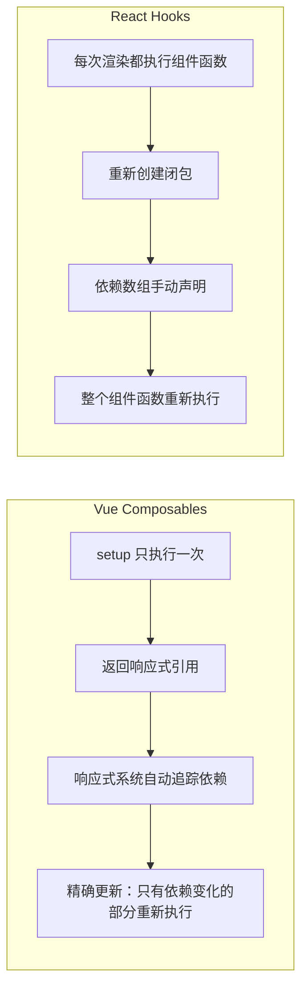
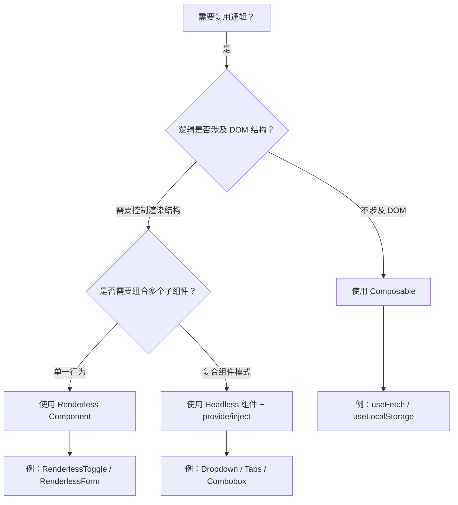
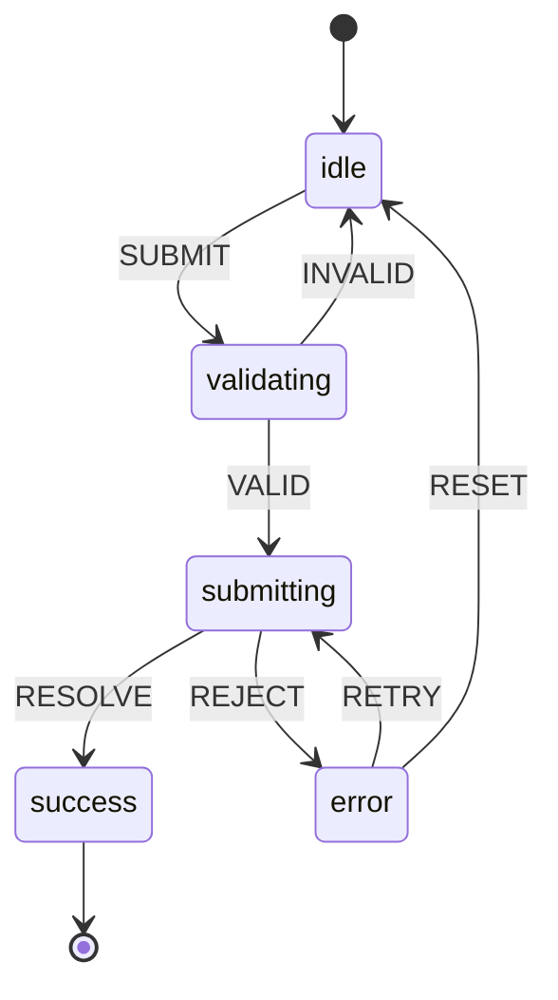
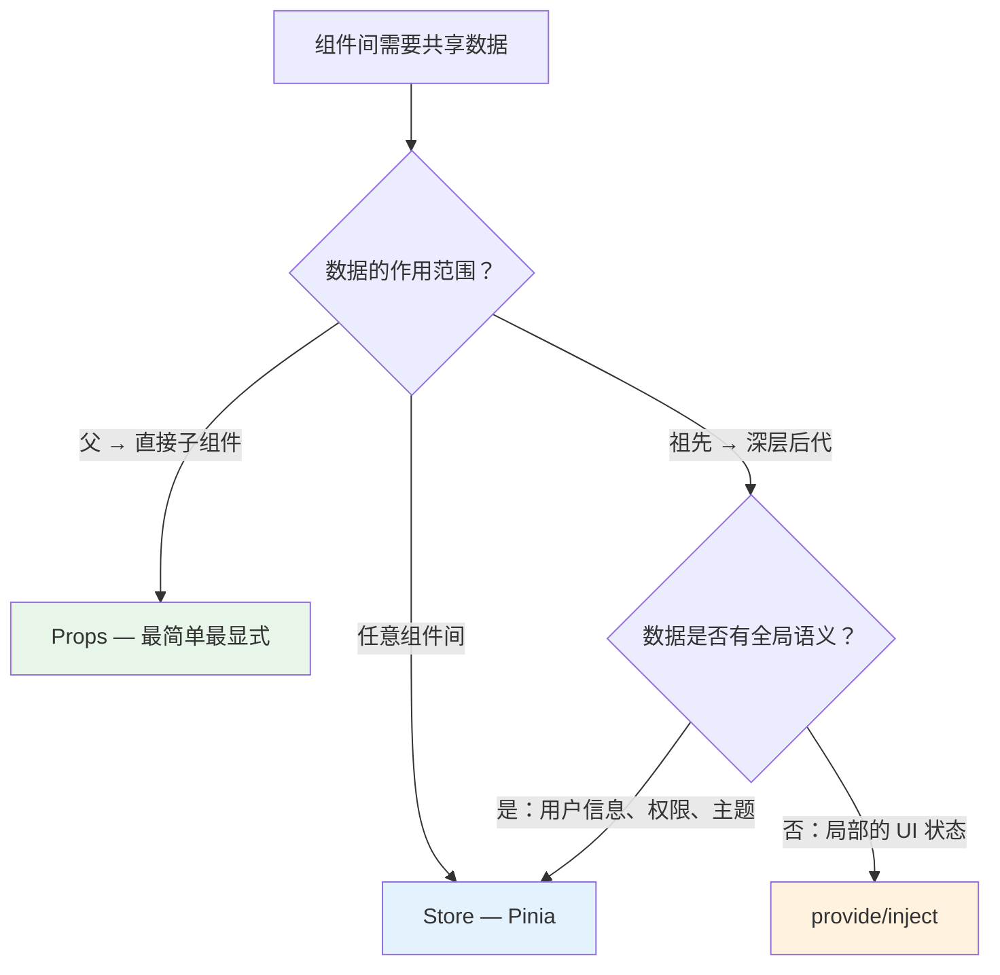
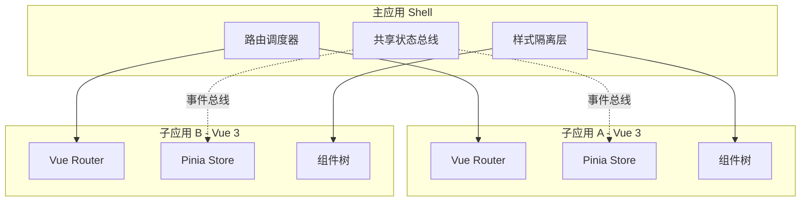
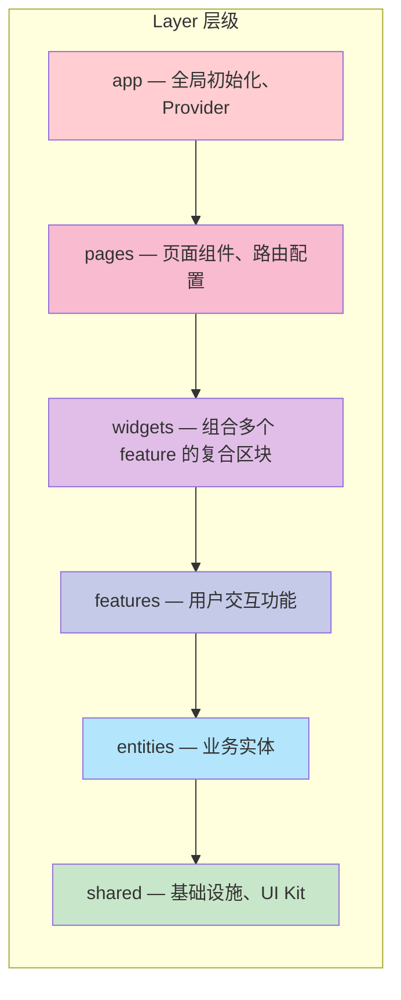

<div v-pre>

# 第 19 章 设计模式与架构决策

> **本章要点**
>
> - 组合式函数（Composables）的设计原则：单一职责、参数归一化、返回值契约
> - Composables 如何利用 Vue 的响应式系统实现逻辑复用，以及与 Mixins/HOC 的本质区别
> - Renderless Components 与 Headless UI：将行为逻辑与视觉呈现彻底分离
> - 状态机模式：用有限状态机（FSM）管理复杂交互，杜绝"状态爆炸"问题
> - 依赖注入（provide/inject）、Props Drilling、全局 Store 三种通信模式的适用场景与代价
> - 微前端架构中 Vue 应用的隔离策略：样式隔离、状态隔离、路由协调
> - Feature-Sliced Design：大型项目的模块化分层架构实践
> - 从源码和运行时角度理解每种模式的性能特征与限制

---

框架提供了原语（primitive），但架构决定了应用的上限。Vue 3 的 Composition API、响应式系统、编译器优化为开发者提供了强大的底层能力，但如何将这些能力组织成可维护、可扩展的应用架构，是每个团队都必须面对的问题。

前 18 章我们深入剖析了 Vue 3 的内核实现——从响应式系统的依赖追踪，到编译器的静态优化，再到组件系统的生命周期调度。本章将视角从"框架如何工作"转向"如何用好框架"，探讨 Vue 生态中最重要的设计模式与架构决策。这些模式不是凭空而来的最佳实践，每一个都有其在 Vue 运行时中的实现基础和性能特征。

## 19.1 组合式函数（Composables）：逻辑复用的最佳范式

### 从 Mixins 到 Composables 的进化

Vue 2 时代的 Mixins 是逻辑复用的主要手段，但它有三个致命缺陷：命名冲突（多个 Mixin 可能定义同名属性）、来源不透明（模板中使用的变量不知道来自哪个 Mixin）、隐式耦合（Mixin 之间可能互相依赖）。Composition API 的设计正是为了彻底解决这些问题。

```typescript
// ❌ Vue 2 Mixins：命名冲突 + 来源不透明
const mouseTracker = {
  data() {
    return { x: 0, y: 0 }  // 与其他 Mixin 冲突？
  },
  mounted() {
    window.addEventListener('mousemove', this.update)
  },
  methods: {
    update(e: MouseEvent) {
      this.x = e.pageX
      this.y = e.pageY
    }
  }
}

// ✅ Vue 3 Composables：显式导入 + 可溯源
import { ref, onMounted, onUnmounted } from 'vue'
import type { Ref } from 'vue'

interface UseMouseReturn {
  x: Ref<number>
  y: Ref<number>
}

export function useMouse(): UseMouseReturn {
  const x = ref(0)
  const y = ref(0)

  function update(e: MouseEvent) {
    x.value = e.pageX
    y.value = e.pageY
  }

  onMounted(() => window.addEventListener('mousemove', update))
  onUnmounted(() => window.removeEventListener('mousemove', update))

  return { x, y }
}
```

Composables 之所以能解决 Mixins 的全部问题，关键在于它利用了 JavaScript 的**词法作用域**——每次调用 `useMouse()` 都会创建独立的闭包，状态天然隔离。同时，返回值是显式的，使用方清楚知道每个变量的来源。

### Composables 的运行时机制

Composables 并不是 Vue 运行时的特殊构造，它本质上就是一个普通函数。它之所以能"绑定"到组件的生命周期，靠的是 Vue 内部的 `currentInstance` 机制：

```typescript
// runtime-core/src/component.ts
// Vue 维护一个全局变量记录当前正在初始化的组件实例
export let currentInstance: ComponentInternalInstance | null = null

export function setCurrentInstance(instance: ComponentInternalInstance) {
  currentInstance = instance
}

// runtime-core/src/apiLifecycle.ts
// 生命周期钩子通过 currentInstance 绑定到当前组件
export function onMounted(hook: () => void) {
  if (currentInstance) {
    // 将钩子注册到当前实例的生命周期队列
    ;(currentInstance.m || (currentInstance.m = [])).push(hook)
  } else if (__DEV__) {
    warn('onMounted is called when there is no active component instance.')
  }
}
```

这就是为什么 Composables 必须在 `setup()` 函数的同步执行阶段调用——因为只有在这个阶段，`currentInstance` 才指向正确的组件实例。如果在异步回调中调用 `onMounted`，`currentInstance` 可能已经指向另一个组件甚至为 `null`。

```typescript
// ❌ 错误：异步调用 Composable
async function setup() {
  await someAsyncOperation()
  // 此时 currentInstance 可能已经丢失
  const { x, y } = useMouse()  // 生命周期钩子无法正确绑定
}

// ✅ 正确：同步调用，异步操作放在内部
function setup() {
  const { x, y } = useMouse()  // 同步调用，currentInstance 有效
  const data = useAsyncData('/api/data')  // 异步操作在 Composable 内部处理
  return { x, y, data }
}
```

### 高质量 Composable 的设计原则

经过大量实践，社区总结出一套 Composable 的设计契约：

```typescript
// 原则 1：参数归一化（MaybeRef 模式）
import { ref, watch, unref, type MaybeRef } from 'vue'

export function useTitle(title: MaybeRef<string>) {
  // 无论传入 string 还是 Ref<string>，都统一处理
  watch(
    () => unref(title),
    (newTitle) => {
      document.title = newTitle
    },
    { immediate: true }
  )
}

// 使用方式灵活
useTitle('静态标题')
useTitle(ref('动态标题'))
useTitle(computed(() => `${page.value} - My App`))
```

```typescript
// 原则 2：返回值使用 ref 而非 reactive
// 这样使用方可以解构而不丢失响应性
export function useFetch<T>(url: MaybeRef<string>) {
  const data = ref<T | null>(null)
  const error = ref<Error | null>(null)
  const loading = ref(false)

  async function execute() {
    loading.value = true
    error.value = null
    try {
      const response = await fetch(unref(url))
      data.value = await response.json()
    } catch (e) {
      error.value = e as Error
    } finally {
      loading.value = false
    }
  }

  // 当 url 是 ref 时，自动重新请求
  watch(() => unref(url), execute, { immediate: true })

  return { data, error, loading, execute }
}

// ✅ 解构后仍然保持响应性
const { data, loading } = useFetch<User[]>('/api/users')
```

```typescript
// 原则 3：副作用自清理
export function useEventListener<K extends keyof WindowEventMap>(
  target: Window | HTMLElement,
  event: K,
  handler: (e: WindowEventMap[K]) => void,
  options?: AddEventListenerOptions
) {
  onMounted(() => target.addEventListener(event, handler as EventListener, options))

  // 组件卸载时自动移除监听器，调用方无需手动清理
  onUnmounted(() => target.removeEventListener(event, handler as EventListener, options))
}
```

```typescript
// 原则 4：Composable 的组合——大的 Composable 由小的 Composable 组成
export function useInfiniteScroll(
  container: MaybeRef<HTMLElement | null>,
  callback: () => Promise<void>,
  options: { threshold?: number } = {}
) {
  const { threshold = 100 } = options
  const loading = ref(false)

  // 复用其他 Composable
  const { y: scrollY } = useScroll(container)
  const { height: containerHeight } = useElementSize(container)

  watch(scrollY, async (newY) => {
    const el = unref(container)
    if (!el || loading.value) return

    const scrollHeight = el.scrollHeight
    if (scrollHeight - newY - containerHeight.value < threshold) {
      loading.value = true
      await callback()
      loading.value = false
    }
  })

  return { loading }
}
```

### Composables 与 React Hooks 的底层差异

虽然 Composables 在形式上类似 React Hooks，但两者的运行时模型有根本区别：



Vue 的 `setup()` 只执行一次，通过响应式系统的依赖追踪实现精确更新；React 的函数组件每次渲染都重新执行，依赖 `useMemo`/`useCallback` 等手动优化。这意味着 Vue Composables 不需要担心 React Hooks 中的"闭包陷阱"和"无限循环"问题。

## 19.2 Renderless Components 与 Headless UI

### 行为与视觉的分离

Renderless Component（无渲染组件）是一种将**交互逻辑**与**视觉呈现**完全分离的模式。组件只负责状态管理和行为逻辑，通过作用域插槽（Scoped Slots）将状态暴露给父组件，由父组件决定如何渲染：

```typescript
// components/RenderlessToggle.vue
import { defineComponent, ref } from 'vue'

export default defineComponent({
  name: 'RenderlessToggle',
  props: {
    initialValue: {
      type: Boolean,
      default: false
    }
  },
  emits: ['change'],
  setup(props, { slots, emit }) {
    const isOn = ref(props.initialValue)

    function toggle() {
      isOn.value = !isOn.value
      emit('change', isOn.value)
    }

    function setOn() { isOn.value = true; emit('change', true) }
    function setOff() { isOn.value = false; emit('change', false) }

    // 不渲染任何 DOM，只通过插槽暴露状态和方法
    return () =>
      slots.default?.({
        isOn: isOn.value,
        toggle,
        setOn,
        setOff
      })
  }
})
```

```vue
<!-- 使用方完全控制视觉呈现 -->
<RenderlessToggle v-slot="{ isOn, toggle }">
  <!-- 方案 A：简单按钮 -->
  <button @click="toggle">
    {{ isOn ? '开启' : '关闭' }}
  </button>
</RenderlessToggle>

<RenderlessToggle v-slot="{ isOn, toggle }">
  <!-- 方案 B：滑动开关 -->
  <div
    class="switch"
    :class="{ active: isOn }"
    @click="toggle"
  >
    <div class="slider" />
  </div>
</RenderlessToggle>
```

### 作用域插槽的运行时原理

Renderless Component 的核心是作用域插槽。在 Vue 的运行时中，插槽被编译为函数：

```typescript
// 编译器将 v-slot 编译为函数
// <RenderlessToggle v-slot="{ isOn, toggle }">
//   <button @click="toggle">{{ isOn ? '开' : '关' }}</button>
// </RenderlessToggle>

// 编译结果（简化）：
createVNode(RenderlessToggle, null, {
  default: withCtx(({ isOn, toggle }: { isOn: boolean; toggle: () => void }) => [
    createVNode('button', { onClick: toggle }, isOn ? '开' : '关')
  ])
})

// runtime-core/src/componentSlots.ts
// 插槽本质上是一个返回 VNode 数组的函数
type Slot = (...args: any[]) => VNode[]

// 组件渲染时调用 slots.default?.({ ...props })
// 将状态作为参数传给插槽函数，生成对应的 VNode
```

### Headless UI 组件库的架构

Headless UI 将 Renderless 模式发展为完整的组件库架构。以一个 Headless Dropdown 为例：

```typescript
// headless/useDropdown.ts
import { ref, computed, provide, inject, type InjectionKey } from 'vue'

interface DropdownContext {
  isOpen: Ref<boolean>
  activeIndex: Ref<number>
  items: Ref<string[]>
  open: () => void
  close: () => void
  toggle: () => void
  select: (index: number) => void
  onKeyDown: (e: KeyboardEvent) => void
}

const DropdownKey: InjectionKey<DropdownContext> = Symbol('Dropdown')

export function useDropdownProvider() {
  const isOpen = ref(false)
  const activeIndex = ref(-1)
  const items = ref<string[]>([])

  function open() { isOpen.value = true; activeIndex.value = 0 }
  function close() { isOpen.value = false; activeIndex.value = -1 }
  function toggle() { isOpen.value ? close() : open() }

  function select(index: number) {
    activeIndex.value = index
    close()
  }

  function onKeyDown(e: KeyboardEvent) {
    switch (e.key) {
      case 'ArrowDown':
        e.preventDefault()
        activeIndex.value = Math.min(activeIndex.value + 1, items.value.length - 1)
        break
      case 'ArrowUp':
        e.preventDefault()
        activeIndex.value = Math.max(activeIndex.value - 1, 0)
        break
      case 'Enter':
        e.preventDefault()
        if (activeIndex.value >= 0) select(activeIndex.value)
        break
      case 'Escape':
        close()
        break
    }
  }

  const context: DropdownContext = {
    isOpen, activeIndex, items, open, close, toggle, select, onKeyDown
  }

  provide(DropdownKey, context)
  return context
}

export function useDropdownConsumer(): DropdownContext {
  const context = inject(DropdownKey)
  if (!context) throw new Error('Dropdown compound components must be used within <Dropdown>')
  return context
}
```

这种模式的核心优势是：逻辑只写一次，视觉可以任意定制。无论你使用 Tailwind CSS、Element Plus 还是自定义样式系统，底层的键盘导航、焦点管理、ARIA 属性都可以复用。

### Renderless vs Composable：如何选择



**经验法则**：如果逻辑不涉及 DOM 结构（纯数据/状态），用 Composable；如果需要控制渲染结构的组合关系（父子、兄弟组件的协调），用 Headless 组件。

## 19.3 状态机模式：用 XState 管理复杂交互

### 为什么布尔标志不够用

随着交互复杂度增长，用布尔标志管理状态会迅速失控：

```typescript
// ❌ 布尔标志地狱：一个异步表单的状态
const isLoading = ref(false)
const isSubmitted = ref(false)
const hasError = ref(false)
const isRetrying = ref(false)
const isValidating = ref(false)

// 哪些组合是合法的？isLoading && hasError？isSubmitted && isRetrying？
// 没有任何机制阻止非法状态组合
function submit() {
  if (isLoading.value || isSubmitted.value) return  // 防御性编程
  isLoading.value = true
  isValidating.value = false
  hasError.value = false
  // ... 每个操作都要手动同步多个标志
}
```

布尔标志的根本问题是：N 个布尔值有 2^N 种组合，但合法的业务状态远少于此。状态机通过**显式声明合法状态和转换**来消除这个问题。

### 有限状态机的核心概念



用状态机重写上面的表单逻辑：

```typescript
// stores/formMachine.ts
import { createMachine, assign } from 'xstate'

interface FormContext {
  data: Record<string, any>
  errors: string[]
  retryCount: number
}

type FormEvent =
  | { type: 'SUBMIT'; data: Record<string, any> }
  | { type: 'VALID' }
  | { type: 'INVALID'; errors: string[] }
  | { type: 'RESOLVE' }
  | { type: 'REJECT'; error: string }
  | { type: 'RETRY' }
  | { type: 'RESET' }

export const formMachine = createMachine<FormContext, FormEvent>({
  id: 'form',
  initial: 'idle',
  context: {
    data: {},
    errors: [],
    retryCount: 0
  },
  states: {
    idle: {
      on: {
        SUBMIT: {
          target: 'validating',
          actions: assign({ data: (_, event) => event.data, errors: [] })
        }
      }
    },
    validating: {
      invoke: {
        src: 'validateForm',
        onDone: 'submitting',
        onError: {
          target: 'idle',
          actions: assign({ errors: (_, event) => event.data })
        }
      }
    },
    submitting: {
      invoke: {
        src: 'submitForm',
        onDone: 'success',
        onError: {
          target: 'error',
          actions: assign({
            errors: (_, event) => [event.data.message]
          })
        }
      }
    },
    error: {
      on: {
        RETRY: {
          target: 'submitting',
          guard: (ctx) => ctx.retryCount < 3,
          actions: assign({ retryCount: (ctx) => ctx.retryCount + 1 })
        },
        RESET: {
          target: 'idle',
          actions: assign({ errors: [], retryCount: 0 })
        }
      }
    },
    success: {
      type: 'final'
    }
  }
})
```

### 在 Vue 中集成 XState

```typescript
// composables/useMachine.ts
import { ref, shallowRef, onMounted, onUnmounted } from 'vue'
import { interpret, type AnyStateMachine, type StateFrom } from 'xstate'

export function useMachine<TMachine extends AnyStateMachine>(machine: TMachine) {
  const state = shallowRef(machine.initialState)
  const service = interpret(machine)

  // 使用 shallowRef 避免对 XState 状态对象的深度响应式转换
  // XState 的状态是不可变对象，用 shallowRef 即可
  service.onTransition((newState) => {
    state.value = newState
  })

  onMounted(() => service.start())
  onUnmounted(() => service.stop())

  function send(event: Parameters<typeof service.send>[0]) {
    service.send(event)
  }

  return {
    state,
    send,
    service
  }
}
```

```vue
<script setup lang="ts">
import { computed } from 'vue'
import { formMachine } from '@/stores/formMachine'
import { useMachine } from '@/composables/useMachine'

const { state, send } = useMachine(formMachine)

// 状态派生：直接从状态机读取，无需手动维护
const isLoading = computed(() => state.value.matches('submitting'))
const canRetry = computed(() =>
  state.value.matches('error') && state.value.context.retryCount < 3
)

function handleSubmit(formData: Record<string, any>) {
  send({ type: 'SUBMIT', data: formData })
}
</script>

<template>
  <form @submit.prevent="handleSubmit({ name, email })">
    <fieldset :disabled="isLoading">
      <!-- 表单字段 -->
    </fieldset>

    <div v-if="state.matches('error')" class="error">
      {{ state.context.errors[0] }}
      <button v-if="canRetry" @click="send({ type: 'RETRY' })">
        重试（{{ 3 - state.context.retryCount }} 次剩余）
      </button>
      <button @click="send({ type: 'RESET' })">重置</button>
    </div>

    <div v-if="state.matches('success')" class="success">
      提交成功！
    </div>
  </form>
</template>
```

### 注意 shallowRef 的使用

上面的 `useMachine` 使用了 `shallowRef` 而非 `ref`。这不是随意的选择——XState 的状态对象包含大量内部属性和循环引用，如果使用 `ref`（即 `reactive` 的深度代理），Vue 的响应式系统会递归遍历整个对象，导致严重的性能问题甚至栈溢出。`shallowRef` 只追踪引用本身的变化，XState 每次状态转换都会生成新的不可变状态对象，因此 `shallowRef` 完全够用。

## 19.4 依赖注入 vs Props Drilling vs Store：三种通信模式的权衡

Vue 提供了多种组件间通信方式，每种都有其适用场景和代价。理解它们的运行时实现，才能做出正确的架构选择。

### Props Drilling：显式但冗长

Props 是最基本的通信方式——数据通过组件树逐层向下传递：

```vue
<!-- GrandParent.vue -->
<Parent :theme="theme" :locale="locale" :user="user" />

<!-- Parent.vue — 自己不用这些 props，只是"透传" -->
<Child :theme="theme" :locale="locale" :user="user" />

<!-- Child.vue — 真正消费这些 props 的组件 -->
<div :class="theme">{{ user.name }}</div>
```

Props Drilling 的优势是**完全显式**——数据流清晰可追踪，任何 IDE 都能跳转到 props 的定义和使用处。但在深层组件树中（超过 3-4 层），中间层组件被迫声明和传递自己不关心的 props，增加了维护负担。

### 依赖注入（provide/inject）：跨层级的响应式通道

Vue 的 `provide/inject` 在运行时是如何工作的？

```typescript
// runtime-core/src/apiInject.ts

export function provide<T>(key: InjectionKey<T> | string, value: T) {
  if (currentInstance) {
    let provides = currentInstance.provides

    // 默认情况下，实例继承父组件的 provides 对象
    const parentProvides = currentInstance.parent?.provides

    if (parentProvides === provides) {
      // 第一次调用 provide 时，创建自己的 provides 对象
      // 使用原型链继承父组件的 provides
      provides = currentInstance.provides = Object.create(parentProvides)
    }

    provides[key as string] = value
  }
}

export function inject<T>(
  key: InjectionKey<T> | string,
  defaultValue?: T
): T | undefined {
  const instance = currentInstance
  if (instance) {
    // 沿原型链查找——这就是为什么 inject 能"穿透"多层组件
    const provides = instance.parent?.provides
    if (provides && (key as string) in provides) {
      return provides[key as string]
    } else if (defaultValue !== undefined) {
      return defaultValue
    }
  }
}
```

关键发现：`provide` 使用 `Object.create(parentProvides)` 创建原型链。这意味着 `inject` 的查找是沿着原型链进行的，时间复杂度是 O(深度)，而非 O(1)。在绝大多数应用中这可以忽略不计，但在极深的组件树中值得注意。

### 响应式注入的正确姿势

```typescript
// ✅ 提供响应式值：使用 ref 或 reactive
// theme/provider.ts
import { ref, provide, inject, readonly, type InjectionKey, type Ref } from 'vue'

interface ThemeContext {
  current: Readonly<Ref<'light' | 'dark'>>
  toggle: () => void
}

const ThemeKey: InjectionKey<ThemeContext> = Symbol('Theme')

export function provideTheme() {
  const current = ref<'light' | 'dark'>('light')

  function toggle() {
    current.value = current.value === 'light' ? 'dark' : 'light'
  }

  // 使用 readonly 防止消费方直接修改状态
  provide(ThemeKey, {
    current: readonly(current),
    toggle
  })
}

export function useTheme(): ThemeContext {
  const context = inject(ThemeKey)
  if (!context) {
    throw new Error('useTheme() must be used within a ThemeProvider')
  }
  return context
}
```

### 全局 Store（Pinia）：应用级的状态管理

```typescript
// stores/user.ts
import { defineStore } from 'pinia'
import { ref, computed } from 'vue'

export const useUserStore = defineStore('user', () => {
  // State
  const profile = ref<UserProfile | null>(null)
  const permissions = ref<string[]>([])

  // Getters
  const isAdmin = computed(() => permissions.value.includes('admin'))
  const displayName = computed(() => profile.value?.name ?? '未登录')

  // Actions
  async function login(credentials: LoginCredentials) {
    const response = await api.login(credentials)
    profile.value = response.profile
    permissions.value = response.permissions
  }

  function logout() {
    profile.value = null
    permissions.value = []
  }

  return { profile, permissions, isAdmin, displayName, login, logout }
})
```

### 三种模式的决策矩阵



| 维度 | Props | provide/inject | Pinia Store |
|------|-------|---------------|-------------|
| **数据流方向** | 单向下行 | 祖先→后代 | 任意方向 |
| **类型安全** | 完整（props 定义） | 需要 InjectionKey | 完整（defineStore） |
| **DevTools 支持** | 优秀 | 一般 | 优秀 |
| **SSR 安全** | 天然安全 | 需注意作用域 | 需要每请求创建 |
| **可测试性** | 直接传入 | 需要 wrapper | 可独立测试 |
| **适用深度** | 1-3 层 | 3+ 层 | 不限 |

**实践原则**：从 Props 开始，当层级超过 3 层且中间组件不消费数据时，改用 provide/inject。当数据具有全局语义（用户状态、权限、购物车）或需要跨路由持久化时，使用 Store。

## 19.5 微前端中的 Vue 架构决策

### 微前端的核心挑战

微前端将一个大型前端应用拆分为多个独立开发、独立部署的子应用。Vue 应用作为微前端的子应用或主应用时，面临三个核心挑战：**样式隔离**、**状态隔离**、**路由协调**。



### Vue 应用的隔离挂载

每个 Vue 子应用需要独立的应用实例，避免全局状态污染：

```typescript
// micro-app/bootstrap.ts
import { createApp, type App } from 'vue'
import { createPinia } from 'pinia'
import { createRouter, createMemoryHistory } from 'vue-router'
import RootComponent from './App.vue'
import { routes } from './routes'

let app: App | null = null

// 微前端生命周期：挂载
export function mount(container: HTMLElement, props?: Record<string, any>) {
  app = createApp(RootComponent)

  // 每个子应用独立的 Pinia 实例——状态不会跨应用泄漏
  const pinia = createPinia()

  // 使用 memory history 而非 browser history
  // 由主应用统一管理浏览器 URL，子应用使用内存路由
  const router = createRouter({
    history: createMemoryHistory(props?.basePath || '/'),
    routes
  })

  app.use(pinia)
  app.use(router)

  // 通过 provide 注入主应用传递的共享数据
  if (props?.sharedState) {
    app.provide('shared-state', props.sharedState)
  }

  app.mount(container)
}

// 微前端生命周期：卸载
export function unmount() {
  if (app) {
    app.unmount()
    app = null
  }
}
```

### 样式隔离策略

Vue 的 `<style scoped>` 通过为 DOM 元素添加 `data-v-xxxxx` 属性并改写 CSS 选择器来实现组件级样式隔离。但在微前端场景中，这还不够——全局样式、CSS 变量、第三方库的样式仍然可能互相干扰。

```typescript
// 方案 1：Shadow DOM 隔离（最彻底）
export function mount(container: HTMLElement) {
  const shadowRoot = container.attachShadow({ mode: 'open' })
  const mountPoint = document.createElement('div')
  shadowRoot.appendChild(mountPoint)

  app = createApp(RootComponent)
  app.mount(mountPoint)

  // 注意：Shadow DOM 内部无法访问外部样式
  // 需要手动注入基础样式
  const styleSheet = new CSSStyleSheet()
  styleSheet.replaceSync(baseStyles)
  shadowRoot.adoptedStyleSheets = [styleSheet]
}

// 方案 2：CSS 命名空间（兼容性更好）
// 每个子应用的所有样式都包裹在唯一的命名空间下
// vue.config.ts 或 vite.config.ts
export default defineConfig({
  css: {
    preprocessorOptions: {
      scss: {
        additionalData: `.micro-app-a { `,
      }
    },
    postcss: {
      plugins: [
        // 自动为所有选择器添加命名空间前缀
        prefixSelector({ prefix: '.micro-app-a' })
      ]
    }
  }
})
```

### 跨应用通信

微前端子应用之间的通信应该遵循**松耦合**原则——子应用不直接引用其他子应用的代码：

```typescript
// shared/event-bus.ts
// 使用 CustomEvent 作为跨应用通信机制
type EventPayload = {
  'user:login': { userId: string; token: string }
  'user:logout': void
  'cart:update': { itemCount: number }
  'navigation:change': { path: string }
}

class MicroFrontendBus {
  emit<K extends keyof EventPayload>(
    event: K,
    payload: EventPayload[K]
  ) {
    window.dispatchEvent(
      new CustomEvent(`mf:${event}`, { detail: payload })
    )
  }

  on<K extends keyof EventPayload>(
    event: K,
    handler: (payload: EventPayload[K]) => void
  ): () => void {
    const listener = (e: Event) => {
      handler((e as CustomEvent).detail)
    }
    window.addEventListener(`mf:${event}`, listener)
    return () => window.removeEventListener(`mf:${event}`, listener)
  }
}

export const bus = new MicroFrontendBus()
```

```typescript
// 在 Vue 子应用中使用
// composables/useMicroFrontend.ts
import { onUnmounted } from 'vue'
import { bus } from '@shared/event-bus'

export function useMicroFrontendEvent<K extends keyof EventPayload>(
  event: K,
  handler: (payload: EventPayload[K]) => void
) {
  const unsubscribe = bus.on(event, handler)
  onUnmounted(unsubscribe)  // 子应用卸载时自动取消订阅
}
```

## 19.6 大型项目的模块化架构（Feature-Sliced Design）

### 传统项目结构的问题

大多数 Vue 项目从"按技术类型分目录"开始——components、composables、stores、utils、types。当项目规模达到数百个文件时，这种结构的问题暴露无遗：

```
❌ 按技术类型分目录（规模大了之后）
src/
├── components/       # 200+ 个组件，哪些属于哪个功能？
│   ├── UserAvatar.vue
│   ├── UserProfile.vue
│   ├── CartItem.vue
│   ├── CartSummary.vue
│   └── ...
├── composables/      # useFetch 被 12 个功能引用
├── stores/           # store 之间存在隐式依赖
├── utils/            # 成了垃圾桶
└── types/            # 类型定义远离使用处
```

### Feature-Sliced Design（FSD）架构

FSD 是一套适用于前端项目的模块化架构规范，将代码组织为**层（Layer）**、**切片（Slice）**和**段（Segment）**三个维度：



**核心规则**：上层可以引用下层，但下层不能引用上层。同层之间的切片（如两个不同的 feature）不能直接互相引用。

以一个电商项目为例：

```
✅ Feature-Sliced Design
src/
├── app/                    # 全局初始化
│   ├── App.vue
│   ├── providers/          # Pinia、Router、i18n 的初始化
│   └── styles/             # 全局样式、CSS 变量
│
├── pages/                  # 页面 = 路由入口
│   ├── home/
│   │   └── ui/HomePage.vue
│   ├── product/
│   │   └── ui/ProductPage.vue
│   └── cart/
│       └── ui/CartPage.vue
│
├── widgets/                # 复合 UI 区块
│   ├── header/
│   │   └── ui/AppHeader.vue
│   └── product-list/
│       └── ui/ProductList.vue
│
├── features/               # 用户交互功能
│   ├── add-to-cart/
│   │   ├── ui/AddToCartButton.vue
│   │   ├── model/useAddToCart.ts
│   │   └── api/cartApi.ts
│   ├── search-products/
│   │   ├── ui/SearchBar.vue
│   │   ├── model/useSearch.ts
│   │   └── api/searchApi.ts
│   └── auth/
│       ├── ui/LoginForm.vue
│       ├── model/useAuth.ts
│       └── api/authApi.ts
│
├── entities/               # 业务实体
│   ├── product/
│   │   ├── ui/ProductCard.vue
│   │   ├── model/types.ts
│   │   └── api/productApi.ts
│   └── user/
│       ├── ui/UserAvatar.vue
│       ├── model/types.ts
│       └── api/userApi.ts
│
└── shared/                 # 基础设施
    ├── ui/                 # Button、Input、Modal 等基础组件
    ├── lib/                # 工具函数
    ├── api/                # HTTP 客户端配置
    └── config/             # 环境变量、常量
```

### 在 Vue 中实施 FSD 的公共 API 模式

每个切片通过 `index.ts` 暴露公共 API，内部实现对外不可见：

```typescript
// features/add-to-cart/index.ts
// 只导出外部需要的内容
export { default as AddToCartButton } from './ui/AddToCartButton.vue'
export { useAddToCart } from './model/useAddToCart'
export type { AddToCartOptions } from './model/types'

// 内部 API（cartApi.ts）不导出——外部无法直接引用
```

```typescript
// features/add-to-cart/model/useAddToCart.ts
import { ref } from 'vue'
import { useUserStore } from '@/entities/user'       // ✅ feature → entity（上→下）
import { cartApi } from '../api/cartApi'              // ✅ 内部引用
import type { Product } from '@/entities/product'     // ✅ feature → entity

// ❌ import { useSearch } from '@/features/search-products'
// 同层 feature 之间不能直接引用！

export function useAddToCart() {
  const loading = ref(false)
  const userStore = useUserStore()

  async function addToCart(product: Product, quantity: number = 1) {
    if (!userStore.isLoggedIn) {
      throw new Error('请先登录')
    }

    loading.value = true
    try {
      await cartApi.add({
        productId: product.id,
        quantity,
        userId: userStore.profile!.id
      })
    } finally {
      loading.value = false
    }
  }

  return { addToCart, loading }
}
```

### 通过 ESLint 强制分层约束

架构规则如果不自动化检查就会逐渐腐化。使用 `eslint-plugin-boundaries` 或 `eslint-plugin-import` 强制 FSD 的分层规则：

```typescript
// .eslintrc.cjs（关键规则）
module.exports = {
  plugins: ['boundaries'],
  settings: {
    'boundaries/elements': [
      { type: 'app', pattern: 'src/app/*' },
      { type: 'pages', pattern: 'src/pages/*' },
      { type: 'widgets', pattern: 'src/widgets/*' },
      { type: 'features', pattern: 'src/features/*' },
      { type: 'entities', pattern: 'src/entities/*' },
      { type: 'shared', pattern: 'src/shared/*' },
    ],
    'boundaries/dependency-nodes': ['import'],
  },
  rules: {
    'boundaries/element-types': [
      'error',
      {
        default: 'disallow',
        rules: [
          // 每一层只能引用它下面的层
          { from: 'app', allow: ['pages', 'widgets', 'features', 'entities', 'shared'] },
          { from: 'pages', allow: ['widgets', 'features', 'entities', 'shared'] },
          { from: 'widgets', allow: ['features', 'entities', 'shared'] },
          { from: 'features', allow: ['entities', 'shared'] },
          { from: 'entities', allow: ['shared'] },
          { from: 'shared', allow: ['shared'] },
        ]
      }
    ]
  }
}
```

### FSD 的权衡

FSD 不是银弹。对于小型项目（< 30 个组件），它的目录嵌套和公共 API 约束是过度工程。建议在以下条件下考虑采用 FSD：

- 团队超过 3 人协作
- 项目预期会持续迭代超过 1 年
- 存在多个相对独立的业务领域
- 需要对不同功能模块设置不同的代码所有者（CODEOWNERS）

## 本章小结

设计模式不是教条，而是经过验证的解决方案模板。本章探讨的每种模式都有其**适用边界**：

1. **Composables** 是 Vue 3 逻辑复用的基石。它利用闭包实现状态隔离，利用 `currentInstance` 机制绑定生命周期，在性能和人体工程学上都优于 Mixins 和 HOC。设计高质量 Composable 需要遵循参数归一化、返回值为 ref、副作用自清理等原则。

2. **Renderless Components 与 Headless UI** 通过作用域插槽实现行为与视觉的分离。当需要在保持相同交互逻辑的前提下支持多种视觉呈现时，这是最佳选择。Headless 组件库（如 Headless UI、Radix Vue）正在成为主流趋势。

3. **状态机模式** 通过显式声明合法状态和转换，消除了布尔标志组合爆炸的问题。XState 与 Vue 的集成需要注意使用 `shallowRef` 避免深度响应式的性能陷阱。适用于复杂的异步流程和多步骤交互。

4. **三种通信模式** 各有所长：Props 最显式适合浅层传递，provide/inject 利用原型链实现跨层级注入适合局部共享，Pinia Store 适合全局状态管理。从 Props 开始，按需升级。

5. **微前端** 要求 Vue 子应用实现彻底的隔离——独立的 app 实例、独立的 Pinia 和 Router、内存路由策略、样式命名空间或 Shadow DOM。跨应用通信应使用松耦合的事件总线。

6. **Feature-Sliced Design** 将代码按层（app → pages → widgets → features → entities → shared）组织，通过严格的单向依赖规则和公共 API 模式，让大型项目保持可维护性。ESLint 规则可以自动化检查分层约束。

---

## 思考题

1. **Composable 的调用时机限制**：为什么 Vue 的 Composable 必须在 `setup()` 的同步执行阶段调用？如果 Vue 改用 React 的"每次渲染都执行函数组件"模型，Composable 的设计会发生什么变化？这两种模型在性能和开发体验上各有什么取舍？

2. **Renderless vs Composable 的边界**：假设你需要实现一个"可拖拽列表"组件，支持拖拽排序、动画过渡和自定义渲染。你会选择 Renderless Component 还是 Composable？为什么？如果两种方式都用，它们各自负责什么？

3. **provide/inject 的性能特征**：Vue 的 `provide` 使用 `Object.create(parentProvides)` 创建原型链。假设组件树有 50 层嵌套，最底层组件 `inject` 一个最顶层 `provide` 的值，查找过程是怎样的？你能设计一种避免原型链遍历的替代方案吗？它会带来什么新的权衡？

4. **状态机的适用边界**：不是所有状态管理都需要状态机。请描述一个"不适合"使用状态机的场景，并解释为什么简单的响应式状态（ref/reactive）在该场景下是更好的选择。

5. **FSD 分层规则的代价**：Feature-Sliced Design 规定同层的两个 feature 不能直接引用对方。假设"添加到购物车"功能需要检查用户是否已登录（auth 功能），在 FSD 架构下你该如何处理这个跨 feature 的依赖？至少给出两种方案并比较它们的优劣。

</div>
